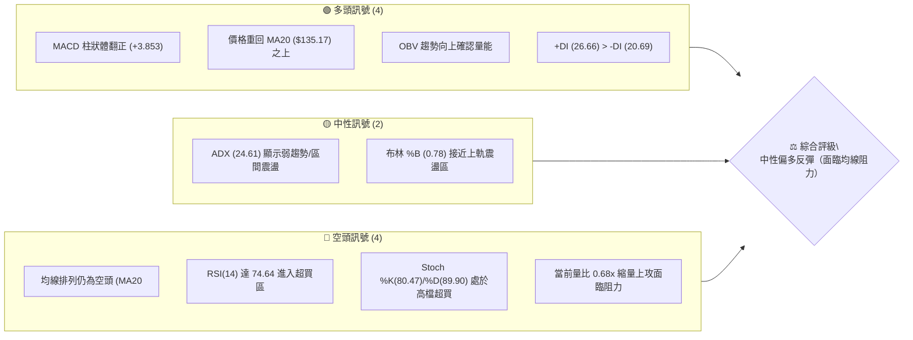
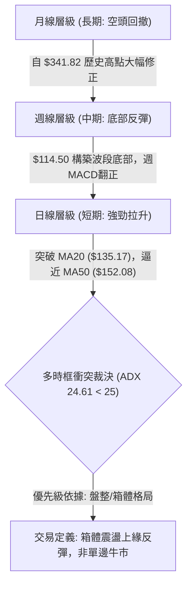
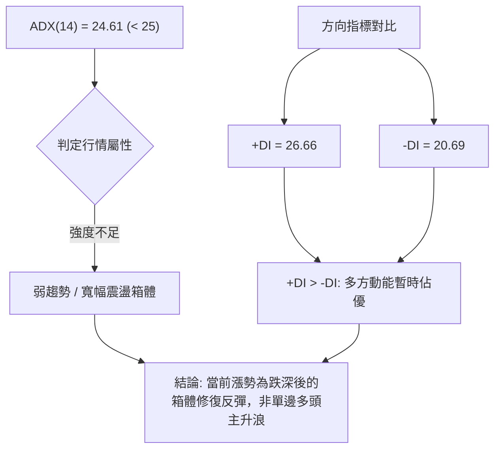
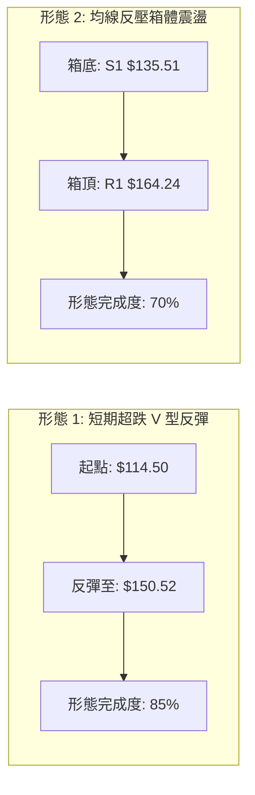
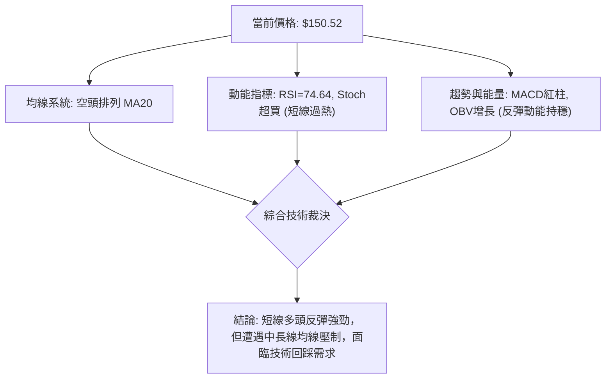
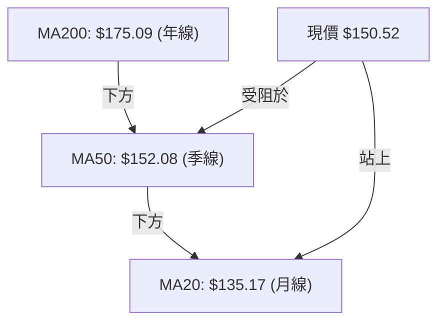
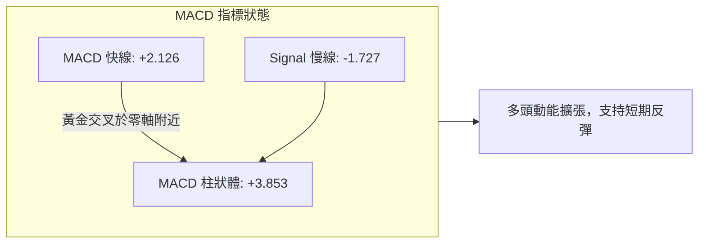
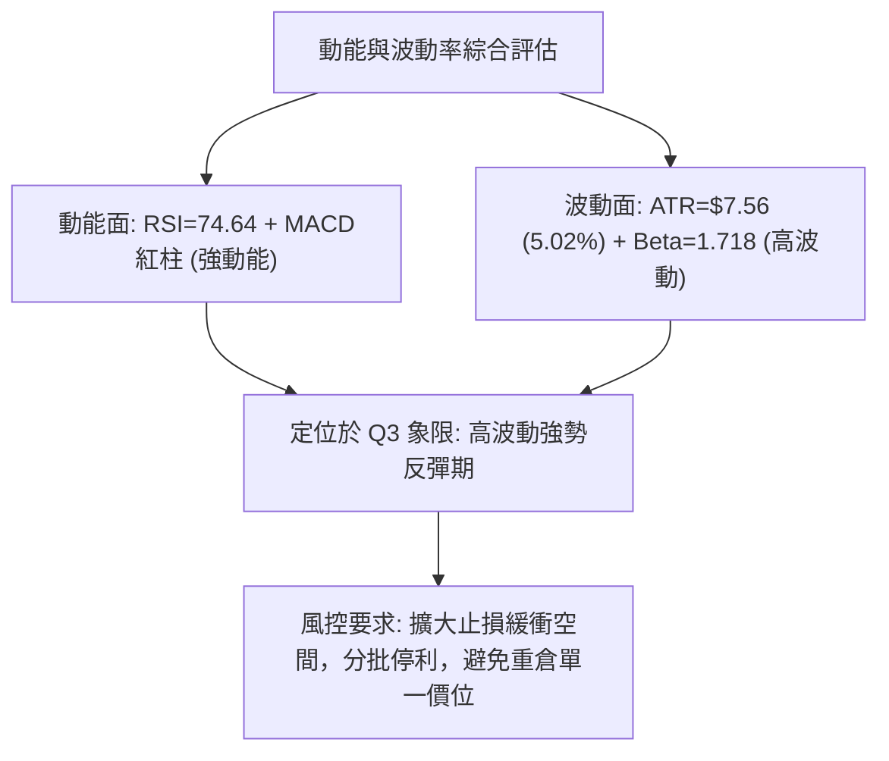
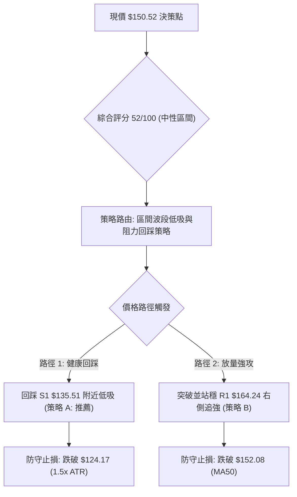
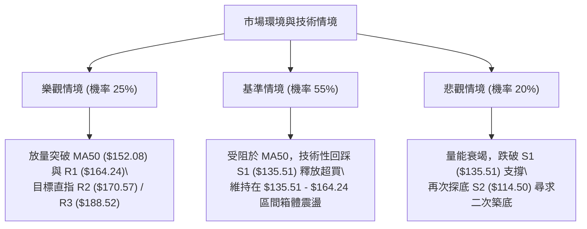

# ORCL 技術分析報告

> **報告日期**：2026-08-17 ｜ **語言**：繁體中文 ｜ **數據來源**：Yahoo Finance ｜ **當前價格**：$150.52

---

## 目錄

| 章節 | 內容 |
|------|------|
| [1. 技術面概覽](#1-技術面概覽) | 訊號儀表板、核心指標、評分卡 |
| [2. 趨勢分析](#2-趨勢分析) | 多時框趨勢、長中短期走勢、ADX解讀 |
| [3. 圖表形態分析](#3-圖表形態分析) | 形態識別、信心度評估、K線組合 |
| [4. 支撐與阻力](#4-支撐與阻力) | 關鍵價位分佈、斐波那契回調 |
| [5. 技術指標深度解讀](#5-技術指標深度解讀) | MA均線/RSI/MACD/布林通道/量價OBV |
| [6. 動能與波動率](#6-動能與波動率) | 動能四象限、ATR波動分析、Beta係數 |
| [7. 多時框架總結](#7-多時框架總結) | 時框架評分矩陣、收斂規則與方向裁決 |
| [8. 交易策略建議](#8-交易策略建議) | 策略路由、情境階梯、進出場規劃 |
| [9. 風險提示與監控](#9-風險提示與監控) | 監控指標Checklist、風險場景圖解 |

---

## 1. 技術面概覽

### 🎯 技術訊號儀表板



### 📊 核心指標速覽表

| 指標類別 | 指標名稱 | 當前數值 | 訊號 | 解讀 |
|----------|----------|----------|------|------|
| **價格** | 當前價格 | $150.52 | 🟡 | 位於52週區間15.8%分位，自底部反彈但處於中長期低位 |
| **均線** | MA20 | $135.17 | 🟢 | 價格在MA20上方 (+11.36%)，短期支撐明確 |
| **均線** | MA50 | $152.08 | 🔴 | 價格在MA50下方 (-1.03%)，即刻面臨中期生命線反壓 |
| **均線** | MA200 | $175.09 | 🔴 | 價格在年線下方 (-14.03%)，長線格局尚未扭轉 |
| **動能** | RSI(14) | 74.64 | 🔴 | 短線超買 (>70)，隨時可能引發技術性回踩 |
| **動能** | MACD | 2.126 (柱狀+3.853)| 🟢 | 雙線位於零軸上方且柱狀擴張，動能維持多頭反彈 |
| **動能** | Stoch %K/%D | 80.47 / 89.90 | 🔴 | KD高檔鈍化/超買，需提防高位死叉修正 |
| **趨勢** | ADX(14) | 24.61 | 🟡 | 趨勢強度低於25，屬於弱趨勢或箱體反彈行情 |
| **波動** | ATR(14) | $7.56 (5.02%) | 🟡 | 日內波動適中，適合作為止損與波動區間參考 |
| **通道** | 布林帶寬 | $107.45 - $162.89 | 🟡 | 現價逼近布林上軌 ($162.89)，%B 為 0.78 |

### 🏆 技術評分卡

```
╔════════════════════════════════════════════════════════════════╗
║                技術評分卡 — ORCL (2026-08-17)                  ║
╠════════════════════════════════════════════════════════════════╣
║ 趨勢強度 (Trend)     ████████░░░░░░░░░░░░  42/100  🔴 空頭排列中 ║
║ 動能指標 (Momentum)  ██████████████░░░░░░  70/100  🟢 短線反彈強 ║
║ 支撐穩定度 (Support) ████████████░░░░░░░░  60/100  🟡 S1打底成功║
║ 成交量配合 (Volume)  ██████████░░░░░░░░░░  50/100  🟡 縮量上漲  ║
║ 形態完整度 (Pattern) ████████████░░░░░░░░  58/100  🟡 V型反彈中 ║
║ 均線系統 (MA System) ██████░░░░░░░░░░░░░░  32/100  🔴 20<50<200 ║
╠════════════════════════════════════════════════════════════════╣
║ 綜合評分             ███████████░░░░░░░░░  52/100  ⚖️ 中性觀望/ ║
║                                                    區間波段    ║
╚════════════════════════════════════════════════════════════════╝
```

---

## 2. 趨勢分析

### 🌐 多時框趨勢分析



### 📈 長期趨勢 — 12個月走勢圖（ASCII）

```
ORCL 月線走勢圖（2025-08 至 2026-08）
價格軸 ($)
$280 ┤               ● $278.07 (2025-09 波段高點)
$260 ┤                    ● $260.10
$240 ┤                                        ● $225.00 (2026-05 反彈高點)
$220 ┤● $223.58 (2025-08)
$200 ┤                         ● $200.02
$180 ┤                              ● $193.05
$160 ┤                                   ● $163.44     ● $160.83      ● $150.52 (現價)
$140 ┤                                        ● $144.39     ● $146.04
$120 ┤                                                           ● $129.87
$100 ┤                                                               ● $114.50 (2026-07 52W低點)
     └─┬────┬────┬────┬────┬────┬────┬────┬────┬────┬────┬────┬────
     08   09   10   11   12   01   02   03   04   05   06   07   08
    '25  '25  '25  '25  '25  '26  '26  '26  '26  '26  '26  '26  '26
```

#### 走勢特徵分析表格

| 階段區間 | 時間段 | 價格區間 | 累積漲跌 | 趨勢特徵與技術解讀 |
|----------|--------|----------|----------|--------------------|
| **高檔回落期** | 2025-09 ~ 2026-01 | $278.07 → $163.44 | -41.22% | 股價自波段頂部跌破短期均線，呈現空頭下飄旗形跌勢 |
| **弱勢築底期** | 2026-01 ~ 2026-04 | $163.44 → $160.83 | -1.60% | 股價在 $137.45 - $160.83 區間縮量橫盤，形成弱勢中繼平台 |
| **突發反彈期** | 2026-04 ~ 2026-05 | $160.83 → $225.00 | +39.90% | 假突破拉升至 $225.00 遭遇強大套牢賣壓，未能守穩年線 |
| **破底探底期** | 2026-05 ~ 2026-07 | $225.00 → $114.50 | -49.11% | 主跌浪宣洩，連續擊穿支撐創下52週新低 $114.50 (2026-07-26 週低) |
| **超跌修復期** | 2026-07 ~ 2026-08 | $114.50 → $150.52 | +31.46% | 技術性超跌 V 型修復，站上 MA20，直面 MA50 ($152.08) 壓力 |

### 📊 中期趨勢（週線分析）

```
ORCL 近期週線壓力與支撐結構
══════════════════════════════════════════════════════════════════
$188.52 ─────────────────────────────────────────────── 強壓力 R3 (年線/波段高)
$170.57 ─────────────────────────────────────────────── 壓力 R2 (5月平台下緣)
$164.24 ─────────────────────────────────────────────── 關鍵阻力 R1 (斐波 78.6% $163.15 聚類)
$152.08 ----------------------------------------------- MA50 即刻生命線壓制
$150.52 ◄═══════════════════════════════════════════════ 現價位置
$135.51 ─────────────────────────────────────────────── 近期支撐 S1 (MA20 $135.17 共振)
$114.50 ─────────────────────────────────────────────── 52週極限支撐 S2 (波段底部)
══════════════════════════════════════════════════════════════════
```

### ⚡ 趨勢強度評估（ADX 解讀）



| 指標變數 | 數值 | 臨界標準 | 狀態評估 | 實戰指引 |
|----------|------|----------|----------|----------|
| **ADX (14)** | 24.61 | 25.00 | 弱趨勢/震盪 | 嚴禁追高追突破，以箱體上下軌進行均值回歸操作 |
| **+DI (14)** | 26.66 | -DI (20.69) | 多頭佔優 | 短線買盤強於賣盤，支持反彈延續至關鍵壓力位 |
| **-DI (14)** | 20.69 | 低於前高 | 空方動能衰退 | 空頭賣壓暫告一段落，但未完全消退 |

---

## 3. 圖表形態分析

### 🔍 形態識別系統



#### 形態識別信心度與目標價評估

| 形態名稱 | 信心度 (%) | 判斷依據（引用技術數據） | 形態完成度 | 理論目標價（附計算式） |
|----------|------------|--------------------------|------------|------------------------|
| **底部超跌 V 型反彈** | 75% | 7月觸及 52W 低點 $114.50 後連續 3 週大陽線收於 $150.52，MACD 柱翻正 (+3.853) | 85% | 突破 MA20 ($135.17) 測量目標：$114.50 + ($135.17 - $114.50) × 2 = **$155.84** (已接近達成) |
| **寬幅箱體修復** | 60% | 支撐位於 S1 ($135.51)，上方強壓聚類於 R1 ($164.24) 與斐波 78.6% ($163.15) | 65% | 箱體震盪頂部目標：**$164.24** (距離現價 +9.12%) |
| **頭肩底形態** | 35% | 數據不足以確認右肩構造，僅有單底拉升特徵 | 20% | *訊號不足，僅做指標型解讀，不預設立場* |

### 🕯️ 重要K線形態分析

| 週期/日期 | 收盤價 | 實體/引線特徵 | K線形態名稱 | 技術解讀與多空訊號 |
|-----------|--------|---------------|-------------|--------------------|
| **2026-07-26** | $114.99 | 長下影十字星，探底 $114.50 後回升 | **錘頭線 (Hammer)** | 🟢 52週低點確認，空頭動能衰竭，形成波段絕對低點 S2 |
| **2026-08-02** | $129.87 | 大陽線實體 (+12.9%)，量能 1.73億股 | **看多吞噬 (Bullish Engulfing)** | 🟢 確認反轉訊號，站上短期均線，買盤強勢介入 |
| **2026-08-09** | $147.02 | 連續放量大陽線 (+13.2%) | **紅三兵雛形 (Three White Soldiers)** | 🟢 多頭推動浪確認，突破 MA20 ($135.17) |
| **2026-08-16** | $150.52 | 上影線增長，實體收窄，量縮至 1.44億股 | **高檔滯漲星線 (Spinning Top)** | 🔴 逼近 MA50 ($152.08) 遭遇解套賣壓，短線動能放緩 |

### 📉 ASCII 走勢形態示意圖

```
ORCL 近 6 週 V 型反彈與阻力接觸圖
價格 ($)
$164.24 ┤                                                 [阻力位 R1 / 斐波 78.6%]
        │                                                /
$152.08 ┤--------------------------------------[MA50 壓力線]------------------
$150.52 ┤                                            ● (現價滯漲星線 2026-08-16)
        │                                           /
$140.00 ┤                                     ● (2026-08-09 突破線)
$135.17 ┤--------------------------[MA20 / 支撐 S1 $135.51]-------------------
        │                            /
$120.00 ┤                      ● (2026-08-02 大陽線)
        │                     /
$114.50 ┤        ● (錘頭線 2026-07-26 築底完成 S2)
        └────────┬────────────┬────────────┬────────────┬────────────
              W-4          W-3          W-2          W-1        當前週
```

### 🎯 形態目標價計算

1. **V 型短線對稱擴展目標**：
   - 底部起點：$114.50
   - 頸線轉折點 (MA20)：$135.17
   - 垂直高度 $H = \$135.17 - \$114.50 = \$20.67$
   - 測量目標價 $T1 = \$135.17 + \$20.67 =$ **$155.84** (目前現價 $150.52，已達成 74.2% 的測量幅度)。

2. **箱體上限延伸目標**：
   - 近一年波段高點聚類壓制 R1 = **$164.24**。
   - 該價位與 52 週回調 78.6% 斐波那契位 **$163.15** 高度重合，構成強烈共振壓力帶 ($163.15 - $164.24)。

---

## 4. 支撐與阻力

### 🗺️ 關鍵價位分布圖（ASCII）

```
ORCL 價位結構分布圖
══════════════════════════════════════════════════════════════════
$188.52 ║██████████████████████████████║ 強阻力 R3 (年線/波段反彈高點聚類)
$175.09 ║░░░░░░░░░░░░░░░░░░░░░░░░░░░░░░║ MA200 熊牛分水嶺
$170.57 ║████████████████████          ║ 阻力 R2 (中期籌碼密集套牢區)
$164.24 ║██████████████████████████████║ 關鍵阻力 R1 (斐波 78.6% 重合區)
$152.08 ║──────────────────────────────║ MA50 均線短壓
$150.52 ╠══════════════════════════════╣ ◄ 現價 ($150.52)
$135.51 ║▓▓▓▓▓▓▓▓▓▓▓▓▓▓▓▓▓▓▓▓          ║ 近期支撐 S1 (MA20 $135.17 共振)
$114.50 ║██████████████████████████████║ 強支撐 S2 (52週極限波段低點)
══════════════════════════════════════════════════════════════════
```

### 🚧 阻力位分析表

| 阻力級別 | 價位 | 形成原因（嚴格引用數據） | 突破難度 | 重要性評級 |
|----------|------|--------------------------|----------|------------|
| **即刻阻力** | **$152.08** | MA50 下降趨勢壓制線，空頭中期均線反壓 | 🟡 中等 | ★★★☆☆ |
| **阻力 R1** | **$164.24** | 近一年波段高點聚類區，與斐波那契 78.6% ($163.15) 共振 | 🔴 較高 | ★★★★★ |
| **阻力 R2** | **$170.57** | 2026年4月平台密集套牢區 ($171.23 - $174.45) 下緣 | 🔴 高 | ★★★★☆ |
| **強阻力 R3**| **$188.52** | 近一年波段大高點聚類，接近 MA200 ($175.09) 與 MA240 ($192.98) | 🔴 極高 | ★★★★★ |

### 🛡️ 支撐位分析表

| 支撐級別 | 價位 | 形成原因（嚴格引用數據） | 守住機率 | 重要性評級 |
|----------|------|--------------------------|----------|------------|
| **支撐 S1** | **$135.51** | 近一年波段低點聚類，與當前 MA20 ($135.17) 及布林中軌共振 | 🟢 75% | ★★★★★ |
| **強支撐 S2**| **$114.50** | 52週歷史低點 (2026-07-26 打底點)，多頭絕對防守底線 | 🟢 90% | ★★★★★ |

### 📐 斐波那契回調位分析

基準區間：52 週最低點 **$114.50** → 52 週最高點 **$341.82**（總垂直落差 $227.32）

```
斐波那契回調位階梯
┌─────────────────────────────────────────────────────────────┐
│ 0.0%  (52W High)   $341.82  ▲ 長期歷史頂部                  │
│ 23.6%              $288.18  ░ 多頭回撤防守位                │
│ 38.2%              $254.99  ░ 強勢反彈目標位                │
│ 50.0%              $228.16  ░ 2026-05月反彈高點 ($225.00)   │
│ 61.8%              $201.34  ░ 黃金分割關鍵分水嶺            │
│ 78.6%              $163.15  ▓ 關鍵壓力 (現價上方即刻挑戰區) │
│─────────────────────────────────────────────────────────────│
│ ★ 當前價格: $150.52 (處於 78.6% 與 100.0% 之間)             │
│─────────────────────────────────────────────────────────────│
│ 100.0% (52W Low)   $114.50  ▼ 52週極限底部                  │
└─────────────────────────────────────────────────────────────┘
```

**斐波那契回調技術解讀**：
- 現價 **$150.52** 目前處於 **78.6% 回調位 ($163.15)** 與 **100.0% 回調位 ($114.50)** 之間的超跌反彈區間。
- 斐波那契 78.6% 回調位 **$163.15** 與波段阻力 **R1 ($164.24)** 僅相差 $1.09，形成極為強固的「籌碼/斐波共振阻力帶」。股價若無法以有效放量突破 $163.15 - $164.24，整體回升將僅被定性為大級別下跌浪中的深度技術性反抽。

---

## 5. 技術指標深度解讀

### 🎛️ 指標訊號總覽



### 📈 移動平均線排列分析



| 均線週期 | 數值 | 現價與均線差距 (%) | 均線斜率/方向 | 技術意涵 |
|----------|------|--------------------|---------------|----------|
| **MA 5** | $151.31 | -0.52% | ▼ 走平微跌 | 極短線出現滯漲訊號 |
| **MA 10** | $147.90 | +1.77% | ▲ 向上向上 | 短線助漲支撐位 |
| **MA 20** | $135.17 | +11.36% | ▲ 向上拐頭 | 底部確認，月線級別多頭支撐 |
| **MA 50** | $152.08 | -1.03% | ▼ 下行趨勢 | 季線空頭壓制，第一道重壓 |
| **MA 60** | $161.72 | -6.93% | ▼ 下行趨勢 | 中期生命線反壓區 |
| **MA 120**| $161.79 | -6.97% | ▼ 下行趨勢 | 半年線壓制 |
| **MA 200**| $175.09 | -14.03%| ▼ 下行趨勢 | 長期空頭分水嶺 |
| **MA 240**| $192.98 | -22.00%| ▼ 下行趨勢 | 超長期牛熊線 |

**均線綜合結論**：當前均線系統仍處於典型的空頭排列形態（MA20 < MA50 < MA200）。雖然股價自低點強勢站上 MA20，但正上方立即面臨 MA50 ($152.08) 與 MA60/120 ($161.72 - $161.79) 的層層壓制。

### 📉 RSI(14) 分析

- **當前數值**：`74.64`
- **狀態進度條**：
  ```
  超賣 (<30)              中性 (50)              超買 (>70)
  ├───┼───┼───┼───┼───┼───┼───┼───┼───┼───┼───┼───┼───┤
  ░░░░░░░░░░░░░░░░░░░░░░░░░░░░░░░░░░░░███████████████░░  74.64
  ```
- **背離分析**：從近20週數據觀察，RSI 自 2026-06-28 的極端超賣值 `11.1` 飆升至當前的 `74.64`。走勢呈現單邊直線拉升，**無明顯頂背離或底背離**。
- **解讀結論**：RSI 進入 >70 嚴重超買區，顯示過去兩週反彈速率過快，追價風險顯著提升，隨時有向 50–60 中性區間收斂回踩的壓力。

### 📊 MACD(12/26/9) 訊號解讀



- **MACD 快線**：`2.126`（已由負翻正站上零軸）
- **Signal 訊號線**：`-1.727`
- **MACD 柱狀體 (Histogram)**：`+3.853` 🟢 看多
- **技術解讀**：MACD 在低檔形成強勢金叉後，柱狀圖連續 3 週快速擴張（-0.715 → +0.033 → +2.292 → +4.827 → +3.853）。儘管本週柱狀體略有微幅收斂 (+4.827 降至 +3.853)，但多頭動能依然穩固主導短期走勢。

### 📦 布林通道分析

```
ORCL 日線布林通道結構 (20日, 2σ)
══════════════════════════════════════════════════════════════════
$162.89 ─────────────────────────────────────────────── 布林上軌 (阻力帶)
        │
$150.52 ◄═══════════════════════════════════════════════ 現價 (%B = 0.78)
        │
$135.17 ─────────────────────────────────────────────── 布林中軌 (MA20 關鍵支撐)
        │
$107.45 ─────────────────────────────────────────────── 布林下軌 (極端支撐)
══════════════════════════════════════════════════════════════════
```

- **布林上軌**：`$162.89`（與 R1 $164.24 形成阻力共振）
- **布林中軌 (MA20)**：`$135.17`（多次回踩確認的關鍵防守位）
- **布林下軌**：`$107.45`
- **%B 指標**：`0.78`（位於中軌與上軌之間的中高位）
- **帶寬與形態解讀**：布林通道經歷前期的極度發散後開始收口轉向，當前價格位於 %B=0.78，接近上軌但尚未觸軌突破，意味著上方仍有約 $12.37 的理論通道空間，但在 ADX < 25 的情況下，觸及上軌 $162.89 容易誘發均值回歸。

### 💹 成交量分析（量價配合度）

- **最新成交量**：`21,832,100` 股
- **20日均量**：`32,171,765` 股（量比：**0.68x**）
- **50日均量**：`34,495,628` 股
- **OBV 趨勢**：`OBV > MA` 🟢 量能支撐上漲
- **量價關係解讀**：
  1. 股價在突破 $140 時成交量顯著放大（週成交量達 1.62億股以上），確認主力資金底部吸籌。
  2. 然而最新單日量比僅 0.68x，在衝擊 MA50 ($152.08) 關鍵阻力時呈現「量縮價漲」之**量價背離**跡象，顯示買盤追高意願減弱，若後續無法補量至 3,400 萬股以上，將難以有效站穩 MA50。

---

## 6. 動能與波動率

### ⚡ 動能評估四象限

| 象限區間 | 動能強度 | 波動率水準 | 當前狀態判定 | 交易策略意涵 |
|----------|----------|------------|--------------|--------------|
| **Q1 (最佳動能)** | 強 (RSI>60, MACD>0) | 低 (ATR% < 4%) | — | 主升浪強者恆強 |
| **Q2 (震盪沉澱)** | 弱 (RSI 40-60) | 低 (ATR% < 4%) | — | 縮量築底觀望 |
| **Q3 (高波反彈)** | **強 (RSI 74.64)** | **高 (ATR% 5.02%)** | **✓ ORCL 處於此象限** | **高波動超跌修復：利潤空間大但回撤風險高** |
| **Q4 (恐慌出逃)** | 弱 (RSI < 30) | 高 (ATR% > 5%) | — | 避免盲目接刀 |



### 📊 ATR 波動率分析

- **ATR(14)**：`$7.56`（佔現價 **5.02%**）
- **波動率解讀**：ORCL 日均真實波動幅度高達 $7.56，屬於高彈性品種。
- **止損與建倉距離建議**：
  - **短線緊密止損 (1.0 × ATR)**：距進場點 `$7.56`
  - **標準波段止損 (1.5 × ATR)**：距進場點 `$11.34`
  - **寬鬆趨勢止損 (2.0 × ATR)**：距進場點 `$15.12`

### 📐 Beta 與市場相關性

- **Beta 係數**：`1.718`
- **市場敏感度解讀**：ORCL 的 Beta 高達 1.718，代表其波動幅度為標普500指數的 1.72 倍。在科技股整體風險偏好修復時，ORCL 具備極強的上彈爆發力；但若大盤走弱，其回調幅度亦將顯著放大。

---

## 7. 多時框架總結

### 📋 時框架評分表

| 時框架 | 趨勢方向 | 動能指標 | 均線系統 | 圖表形態 | 綜合評分 | 操作指引 |
|--------|----------|----------|----------|----------|----------|----------|
| **月線 (長期)** | 🔴 偏空 | 🟡 中性回升 | 🔴 空頭排列 | 波段大回撤 | **35/100** | 長線未扭轉，逢高減保本 |
| **週線 (中期)** | 🟡 震盪築底 | 🟢 金叉向上 | 🔴 承壓 MA50 | 雙底/V型雛形 | **55/100** | 區間操作，關注 S1 支撐 |
| **日線 (短期)** | 🟢 強勁反彈 | 🔴 嚴重超買 | 🟡 站上 MA20 | 突破回踩結構 | **65/100** | 勿追高，等待回踩 S1 進場 |

### 🔲 綜合訊號矩陣

```
ORCL 多時框架訊號矩陣
┌──────────────┬──────────────┬──────────────┬──────────────┐
│ 分析維度     │ 日線 (短期)  │ 週線 (中期)  │ 月線 (長期)  │
├──────────────┼──────────────┼──────────────┼──────────────┤
│ 趨勢方向     │ 🟢 多頭推動  │ 🟡 底部震盪  │ 🔴 空頭排列  │
│ 均線位置     │ 🟢 站上 MA20 │ 🔴 承壓 MA50 │ 🔴 遠低 MA200│
│ 動能狀態     │ 🔴 RSI 超買  │ 🟢 MACD 紅柱 │ 🟡 動能收斂  │
│ 支撐阻力     │ 🟡 逼近 MA50 │ 🟢 S1 支撐穩 │ 🔴 斐波 78.6%│
│ 成交量能     │ 🔴 縮量反彈  │ 🟢 底部放量  │ 🟡 均量水準  │
└──────────────┴──────────────┴──────────────┴──────────────┘
```

### ⚖️ 多時框收斂結論

依「多時框收斂規則」進行裁決：
1. **行情屬性判斷**：當前 ADX(14) 為 `24.61` (< 25)，確定當前市場處於**「盤整/箱體震盪行情」**而非單邊趨勢行情。
2. **主導時框與交易邊界**：依規則，盤整行情應以日線布林通道上下軌 ($107.45 - $162.89) 及關鍵水平位 (S1 $135.51 / R1 $164.24) 為主要交易區間。
3. **方向性收斂唯一結論**：**【中性偏多區間震盪（短期超買面臨回踩，中期低吸為主）】**。短線日線 RSI(74.64) 處於高位，受制於 MA50 ($152.08)，嚴禁追高；但週線底部量能確立，回踩支撐 S1 ($135.51) 為具備優良風險報酬比的低吸機會。

---

## 8. 交易策略建議

### 🗺️ 策略決策流程圖



### 🧭 策略路由

**當前主策略方向 = 【中性區間波段策略：等待回踩低吸為主，嚴格區間操作】（依技術評分 52/100）**

### 🎯 價格情境階梯（Price Scenarios）

| 觸發條件 | 第一目標 | 第二目標 | 後續延伸 | 情境含義與操作指引 |
|----------|----------|----------|----------|--------------------|
| **強勢突破 R1 ($164.24)** | R2 ($170.57) | R3 ($188.52) | MA200 ($175.09) | 中期反轉確認，多頭空間打開 |
| **受阻 MA50 回踩 S1 ($135.51)** | $140.00 | $150.00 | R1 ($164.24) | 標準技術性回踩，提供安全進場點 |
| **有效跌破 S1 ($135.51)** | S2 ($114.50) | 52W低點 | — | 反彈宣告失敗，空頭重啟探底測試 |

### 📊 情境機率分佈

| 情境劇本 | 機率 (%) | 主要技術依據 |
|----------|----------|--------------|
| **情境一：衝高回落/回踩震盪** | **55%** | RSI=74.64 嚴重超買，量比 0.68x 縮量，MA50 ($152.08) 壓制明顯 |
| **情境二：直接突破上行** | **25%** | MACD 柱狀體維持多頭擴張 (+3.853)，+DI (26.66) 強勢 |
| **情境三：深度回撤跌破 S1** | **20%** | 均線系統呈空頭排列，基本面高負債與市場 Beta 波動壓制 |

### 🟢 主策略詳情

| 策略要素 | 策略 A（回踩低吸 — 首選） | 策略 B（突破追強 — 次選） |
|----------|----------------------------|----------------------------|
| **策略類型** | 均值回歸 / 支撐位低吸 | 右側突破 / 動能跟隨 |
| **進場條件** | 股價回踩 S1 ($135.51) 企穩，出現止跌K線 | 放量有效突破阻力 R1 ($164.24) 且收盤站穩 |
| **進場價格** | **$135.51** (支撐位聚類) | **$164.24** (突破點) |
| **目標價 T1** | **$152.08** (MA50 處，預期報酬 +12.23%) | **$170.57** (R2 處，預期報酬 +3.85%) |
| **目標價 T2** | **$164.24** (R1 處，預期報酬 +21.20%) | **$188.52** (R3 處，預期報酬 +14.78%) |
| **止損價格** | **$124.17** (S1 - 1.5×ATR $11.34) | **$152.08** (跌破 MA50 / 突破前高點) |
| **風險報酬比** | **1 : 2.53** (以 T2 計算) | **1 : 1.99** (以 T2 計算) |
| **預估勝率** | **65%** | **45%** |
| **建議倉位** | **15% - 20%** (分批建倉) | **10%** (輕倉試單) |

### 🔴 反向風險觸發點（對沖與風控提示）

1. **多頭失效觸發**：若股價自當前位置失守 MA20 ($135.17) 並跌破 **$135.51 (S1)**，代表反彈動能耗盡，必須無條件將多頭部位平倉或建立反向對沖保護。
2. **極端空頭觸發**：若跌破 **$114.50 (S2)**，ORCL 將破底進入無支撐真空區，需提防恐慌性拋盤。

### ⭐ 整體訊號強度評星

```
做多訊號強度：★★★☆☆  (3/5 星 — 短線過熱，等待回踩)
做空訊號強度：★★☆☆☆  (2/5 星 — 底部動能強勁，逆勢空單風險高)
整體可信度：  ★★★★☆  (4/5 星 — 價位結構與指標共振清晰)
```

---

## 9. 風險提示與監控

### ✅ 關鍵監控指標 Checklist

```
╔════════════════════════════════════════════════════════════════╗
║                ORCL 每日盤後關鍵監控清單 (Checklist)           ║
╠════════════════════════════════════════════════════════════════╣
║ [ ] 1. MA50 攻防：收盤價是否有效站上 $152.08？               ║
║ [ ] 2. RSI 收斂：RSI(14) 是否由 74.64 回落至 60 附近釋放超買？ ║
║ [ ] 3. 成交量能：日成交量是否回升至 20日均量 (3,217萬股) 之上？║
║ [ ] 4. 關鍵支撐：回調時 S1 ($135.51) 是否具備強勁買盤承接？   ║
║ [ ] 5. MACD 柱狀體：動能柱是否維持在零軸上方正增長？           ║
╚════════════════════════════════════════════════════════════════╝
```

### ⚠️ 風險場景分析



### 🛡️ 風險管理重要提醒

1. **波動率管理**：當前 ATR 為 $7.56 (5.02%)，且 Beta 為 1.718。單日波動劇烈，單筆交易的最大虧損金額嚴格限制在總投資帳戶資產的 **1.0% - 1.5%** 以內。
2. **超買風險防範**：日線 RSI 達 74.64，Stoch %D 達 89.90，嚴禁在 $150.52 以上執行市價追高買入，避免遭遇「衝高假突破後之急跌修正」。
3. **止損紀律**：策略 A 嚴格執行止損點 **$124.17**，不因主觀預期而向下移倉抗單。

---

## 📋 報告總結

```
╔════════════════════════════════════════════════════════════════╗
║                  ORCL 技術分析報告總結                         ║
╠════════════════════════════════════════════════════════════════╣
║ 報告日期：2026-08-17                                          ║
║ 當前價格：$150.52                                             ║
║ 分析評級：⚖️ 中性偏多（區間波段操作，短線面臨超買回踩）       ║
╠════════════════════════════════════════════════════════════════╣
║ 關鍵結論：                                                    ║
║ ├─ 長期趨勢：🔴 空頭回撤格局（MA200 $175.09 下方）            ║
║ ├─ 中期趨勢：🟡 $114.50 構築底部，進行箱體超跌反彈修復       ║
║ ├─ 短期趨勢：🟢 強勁反彈，但 RSI(74.64) 超買面臨 MA50 壓制    ║
║ ├─ 關鍵支撐：S1 $135.51 ｜ 強支撐 S2 $114.50                  ║
║ ├─ 關鍵阻力：MA50 $152.08 ｜ R1 $164.24 ｜ R2 $170.57         ║
║ └─ 分析師目標價：均價 $246.43 (範圍: $110.00 - $400.00)       ║
╠════════════════════════════════════════════════════════════════╣
║ 最優交易策略組合：                                            ║
║ 1. 🥇 最佳機會：等待回踩支撐 S1 $135.51 進場做多，止損 $124.17║
║                 目標 $152.08 / $164.24 (風酬比 1:2.53)        ║
║ 2. 🥈 次選機會：放量突破 R1 $164.24 後追隨動能，目標 $188.52 ║
║ 3. 🥉 保守選擇：在 $135.51 - $164.24 箱體內高拋低吸，嚴設止損 ║
╚════════════════════════════════════════════════════════════════╝
```

---

> ⚠️ **免責聲明**：本報告為資深技術分析研究模型生成之量化與圖表分析，所有數據、支撐阻力位與交易策略均基於歷史價格與技術指標計算。本報告**僅供研究與學術參考**，**不構成任何要約、招攬或具體投資建議**。金融市場投資具備高風險性，投資人應獨立評估自身風險承受能力並自負盈虧。

---

*報告生成時間：2026-08-17 ｜ 數據來源：Yahoo Finance ｜ 分析框架：多時框技術分析體系*