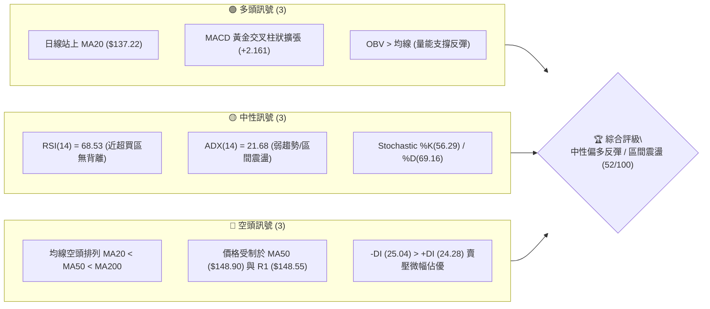
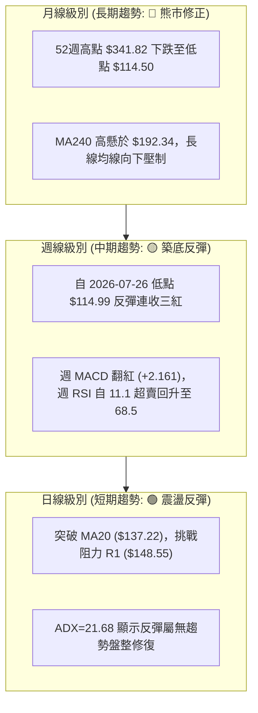
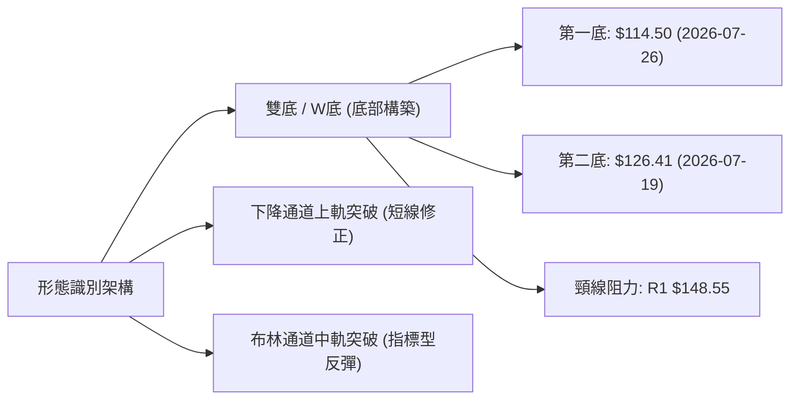
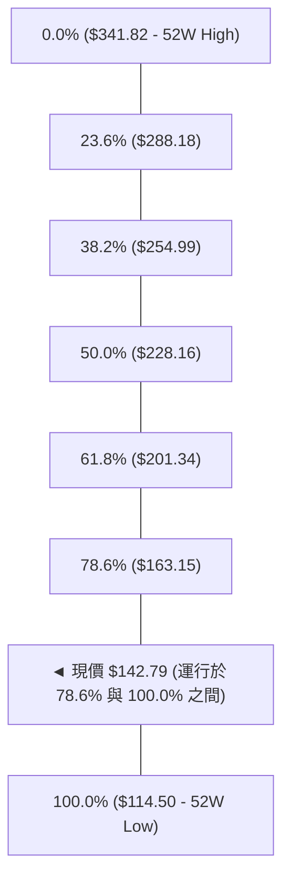
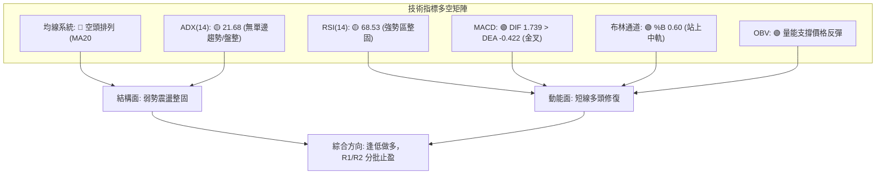
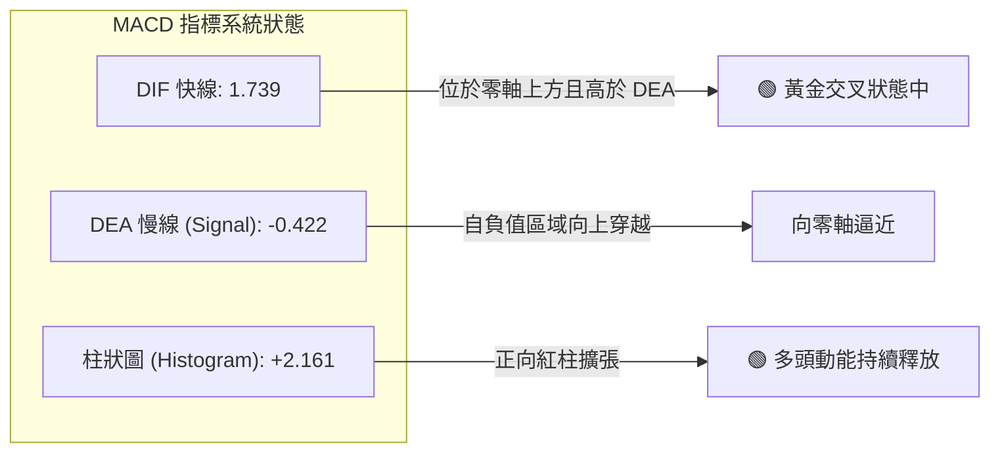
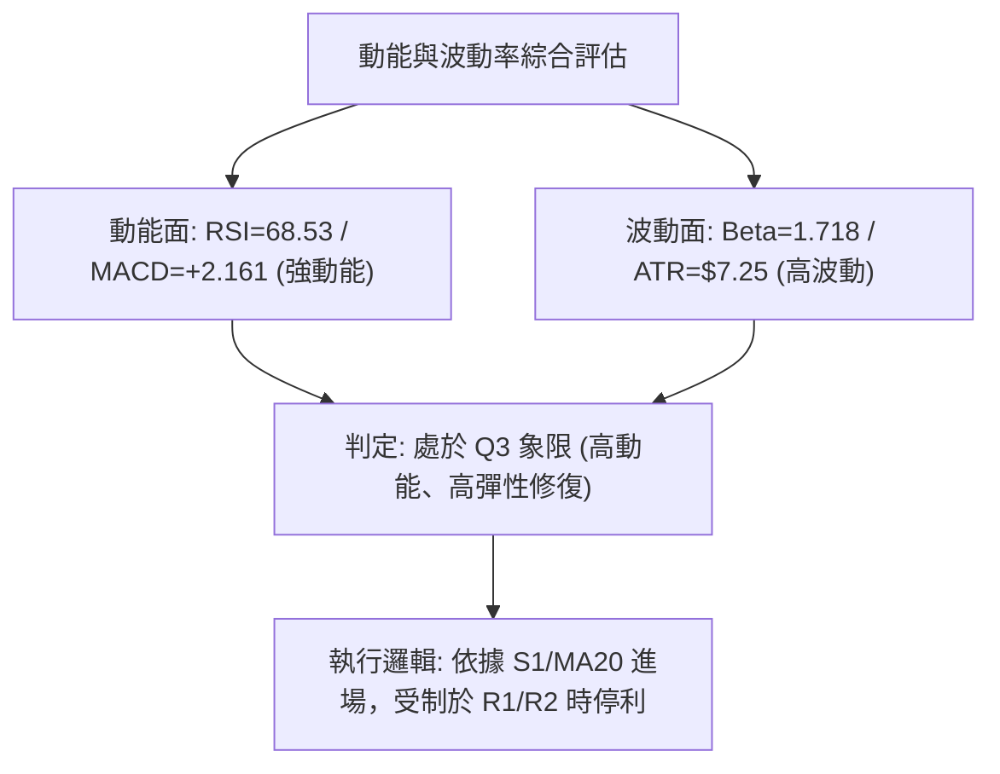
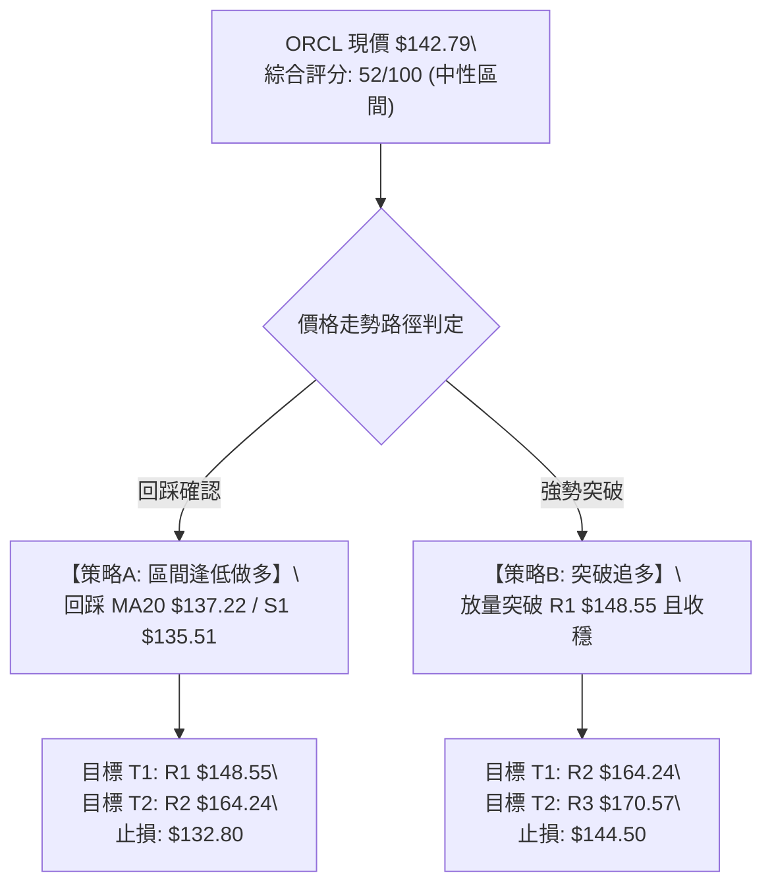
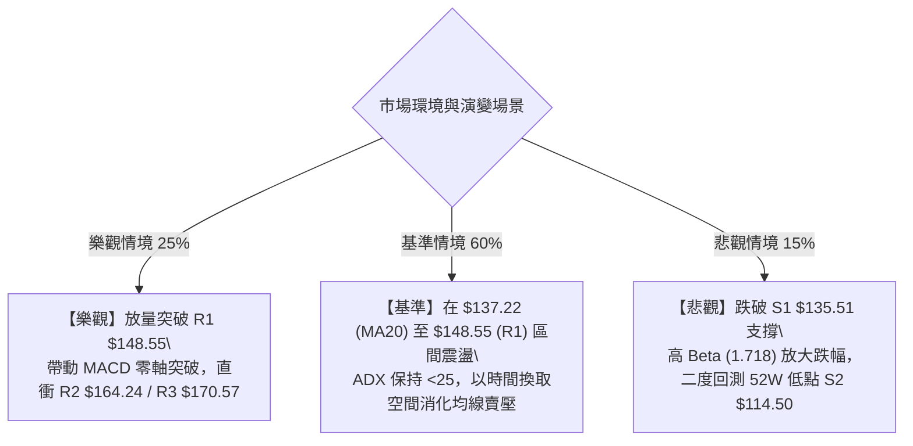

# ORCL 技術分析報告

> **報告日期**：2026-08-19 ｜ **語言**：繁體中文 ｜ **數據來源**：Yahoo Finance ｜ **當前價格**：$142.79

---

## 目錄

| 章節 | 內容 |
|------|------|
| [1. 技術面概覽](#1-技術面概覽) | 訊號儀表板、核心指標、評分卡 |
| [2. 趨勢分析](#2-趨勢分析) | 多時框趨勢、長中短期走勢 |
| [3. 圖表形態分析](#3-圖表形態分析) | 形態識別、K線組合、目標價 |
| [4. 支撐與阻力](#4-支撐與阻力) | 關鍵價位、斐波那契回調 |
| [5. 技術指標深度解讀](#5-技術指標深度解讀) | MA/RSI/MACD/布林/成交量 |
| [6. 動能與波動率](#6-動能與波動率) | 動能評估、ATR、Beta |
| [7. 多時框架總結](#7-多時框架總結) | 時框架評分矩陣 |
| [8. 交易策略建議](#8-交易策略建議) | 多空策略、風險報酬比 |
| [9. 風險提示與監控](#9-風險提示與監控) | 監控指標、風險場景 |

---

## 1. 技術面概覽

### 🎯 技術訊號儀表板



### 📊 核心指標速覽表

| 指標類別 | 指標名稱 | 當前數值 | 訊號 | 解讀 |
|:---|:---|:---|:---:|:---|
| **價格** | 當前價格 | $142.79 | 🟡 | 位於52週區間 12.4%，自底部 $114.50 強力反彈 |
| **均線** | MA20 | $137.22 | 🟢 | 現價高於 MA20 (+4.06%)，短線底部結構確立 |
| **均線** | MA50 | $148.90 | 🔴 | 現價低於 MA50 (-4.10%)，中期下行壓力沉重 |
| **均線** | MA200 | $173.78 | 🔴 | 現價遠低於 MA200 (-17.83%)，長線處於修正週期 |
| **動能** | RSI(14) | 68.53 | 🟡 | 接近 70 警戒線，短線漲幅偏快但未出現頂背離 |
| **動能** | MACD (12,26,9) | 1.739 / -0.422 | 🟢 | DIF 線上穿 MACD Signal，紅柱 +2.161 擴張 |
| **動能** | KD (14,3,3) | 56.29 / 69.16 | 🟡 | 中軸上方運行，%K 下穿 %D 呈短線整固訊號 |
| **趨勢** | ADX(14) | 21.68 | 🟡 | ADX < 25 表明處於盤整修復行情，非單邊單向趨勢 |
| **通道** | 布林通道 %B | 0.60 | 🟢 | 位於中軌 $137.22 與上軌 $164.36 之間偏強區域 |
| **成交量** | 20日量比 | 0.55x | 🟡 | 今日成交量 17.11M 低於20日均量 30.84M，縮量整理 |
| **波動** | ATR(14) | $7.25 | 🟡 | 每日平均波動率 5.08%，適度提供區間操作空間 |

### 🏆 技術評分卡

```
╔══════════════════════════════════════════════════════════════════╗
║                   技術評分卡 — ORCL (2026-08-19)                  ║
╠══════════════════════════════════════════════════════════════════╣
║ 趨勢強度 (Trend)       ████████░░░░░░░░░░░░  40/100  🔴 弱勢盤整 ║
║ 動能指標 (Momentum)    ██████████████░░░░░░  70/100  🟢 短線偏強 ║
║ 支撐穩定度 (Support)   ████████████░░░░░░░░  60/100  🟡 S1防守佳 ║
║ 成交量配合 (Volume)    ██████████░░░░░░░░░░  50/100  🟡 縮量待變 ║
║ 形態完整度 (Pattern)   ████████████░░░░░░░░  60/100  🟡 雙底構築 ║
║ 均線排列 (Moving Avg)  ██████░░░░░░░░░░░░░░  30/100  🔴 空頭排列 ║
╠══════════════════════════════════════════════════════════════════╣
║ 綜合技術評分           ██████████░░░░░░░░░░  52/100  🟡 中性區間 ║
╚══════════════════════════════════════════════════════════════════╝
```

---

## 2. 趨勢分析

### 🌐 多時框趨勢分析



### 📈 長期趨勢 — 12個月走勢圖（Unicode）

```
ORCL 月線歷史走勢圖（2025-08 至 2026-08）
價格 ($)
$280 ┤                ● (2025-09: $278.07)
$260 ┤                    ● (2025-10: $260.10)
$240 ┤
$220 ┤● (2025-08: $223.58)        ● (2026-05: $225.00)
$200 ┤            ● (2025-11: $200.02)
$180 ┤                ● (2025-12: $193.05)
$160 ┤                    ● (2026-01: $163.44)  ● (2026-04: $160.83)
$140 ┤                        ● (2026-02: $144.39)  ● (2026-06: $146.04)  ●←現價 $142.79
$120 ┤                            ● (2026-03: $146.09)  ● (2026-07: $129.87)
$100 └┬──────┬──────┬──────┬──────┬──────┬──────┬──────┬──────┬──────┬──────┬──────┬──────┬
     08     09     10     11     12     01     02     03     04     05     06     07    08(當前)
```

#### 走勢特徵分析表格

| 階段週期 | 時間區間 | 起止價位 | 漲跌幅 | 結構特徵與成交量解讀 |
|:---|:---:|:---:|:---:|:---|
| **歷史衝頂期** | 2025-08 ~ 2025-09 | $223.58 → $278.07 | +24.37% | 衝高觸及歷史次高，隨後見頂回落 |
| **主跌浪第一波** | 2025-10 ~ 2026-02 | $260.10 → $144.39 | -44.49% | 跌破各短中期均線，空頭加速下殺 |
| **春季強反彈** | 2026-03 ~ 2026-05 | $146.09 → $225.00 | +54.01% | 5月份週成交量維持在 9,000萬至1.3億股，快速反彈 |
| **二次探底浪** | 2026-06 ~ 2026-07 | $146.04 → $129.87 | -11.07% | 觸及 52W 最低點 $114.50（2026-07-26收 $114.99），RSI跌至11.1極度超賣 |
| **底部回升期** | 2026-08 至今 | $129.87 → $142.79 | +9.95% | 週線 3 連紅，MACD 柱由負轉正，短線回升挑戰 R1 |

### 📊 中期趨勢（週線分析）

```
中期關鍵波段壓力與支撐示意圖
═════════════════════════════════════════════════════════════════
 $173.78 ───────────────────────────── [MA200 / 長線多空分水嶺]
 $164.24 ───────────────────────────── [R2 強阻力 / BB上軌 $164.36]
 $148.55 ───────────────────────────── [R1 第一阻力 / MA50 $148.90]
 $142.79 ═════════════════════════════ ◄ 當前價格
 $137.22 ───────────────────────────── [MA20 / BB中軌 / 短線支撐]
 $135.51 ───────────────────────────── [S1 近期波段關鍵支撐]
 $114.50 ───────────────────────────── [S2 52週絕對低點 / 強支撐]
═════════════════════════════════════════════════════════════════
```

### ⚡ 趨勢強度評估（ADX 解讀）

```mermaid
graph TD
    A["ADX (14) = 21.68"] --> B{"ADX 數值門檻判定"}
    B -->|"< 25 (弱趨勢/盤整)|" C["市場處於無方向區間震盪"]
    B -->|"> 25 (強趨勢)|" D["單邊趨勢行情"]
    C --> E["方向指標對比"]
    E --> F["+DI: 24.28"]
    E --> G["-DI: 25.04"]
    F & G --> H["-DI 微幅大於 +DI (差值 0.76)\\n空方略佔微弱優勢，但缺乏單邊驅動力"]
```

#### ADX 強度對照表

| 指標名稱 | 當前讀數 | 門檻標準 | 狀態評估 | 策略意義 |
|:---|:---:|:---:|:---:|:---|
| **ADX (14)** | **21.68** | < 25 | 弱趨勢 / 盤整 | 避免追高殺低，應採取區間邊界高拋低吸策略 |
| **+DI (14)** | **24.28** | > 20 | 多方動能回升 | 多頭自 $114.50 底部反撲，多方力量正在重新聚集 |
| **-DI (14)** | **25.04** | > 20 | 空方力量衰退 | 空方力量自 7 月份極值明顯回落，但仍微幅高於多方 |
| **趨勢方向總結** | **無主導單邊趨勢** | DI 差值僅 0.76 | 橫盤修復格局 | 價格在布林通道內部（$110.08 ~ $164.36）波動 |

---

## 3. 圖表形態分析

### 🔍 形態識別系統



#### 形態識別與信心度評估表

| 形態名稱 | 信心度 | 判斷依據（引用數據） | 完成度 | 目標價（附精確計算式） |
|:---|:---:|:---|:---:|:---|
| **潛在雙重底 (W-Bottom)** | **65%** | 兩次波段低點分別位於 $114.99 (2026-07-26) 與 $126.41 (2026-07-19)，現價反彈至 $142.79 | 75% | 頸線 R1 $148.55 突破後，形態高度 = $148.55 - $114.50 = $34.05<br>理論量度目標 = $148.55 + $34.05 = **$182.60**（中期目標） |
| **布林通道中軌向上穿越** | **85%** | 現價 $142.79 成功站穩 BB 中軌 (MA20) $137.22，%B 達 0.60 | 100% | 通道上軌目標價 = **$164.36** |
| **頭肩頂形態（大週期歷史）** | **45%** | 2025-09 頂點 $278.07，2026-05 次高 $225.00，但形態過於寬鬆且已完成主跌 | 90% | 已於 7 月跌破目標，當前訊號不足，僅作背景參考 |

### 🕯️ 重要K線形態分析

| 週/月週期 | 收盤價 | K線形態特徵 | 技術解讀 | 訊號 |
|:---|:---:|:---|:---|:---:|
| **2026-07-26 (週線)** | $114.99 | 帶長下影線的低位十字星錘子線 | 測試 52W 低點 $114.50 獲得強勁買盤承接，週成交量達 1.63 億股 | 🟢 強烈看多轉折 |
| **2026-08-02 (週線)** | $129.87 | 大陽線實體（週漲 +12.9%） | 吞沒前週實體，MACD 柱狀圖由負轉正 (+2.292)，確認底部脫離 | 🟢 買盤進場確認 |
| **2026-08-09 (週線)** | $147.02 | 延續性中陽線（週漲 +13.2%） | 突破短期壓力，RSI 回升至 71.8，成交量 1.62 億股維持充沛 | 🟢 多頭推升 |
| **2026-08-16 (週線)** | $150.52 | 高位流星線 / 上影倒錘線 | 盤中觸及 R1 $148.55 ~ $150.52 遇阻回落，預示短線面臨 MA50 壓力 | 🟡 短線受阻整固 |
| **2026-08-23 (最新)** | $142.79 | 小陰線窄幅回踩 | 縮量回踩 MA20 支撐，量比 0.55x，屬於健康的回抽確認形態 | 🟡 蓄勢整理 |

### 📉 ASCII 走勢形態示意圖

```
ORCL 底部反彈形態示意圖 (W-Bottom 構築中)
價格
$150.52 ┤                  頸線阻力區間 (R1: $148.55)
        ┤                    ┌───┐ (2026-08-16 遇阻)
$142.79 ┤                    │   └──● 現價 ($142.79 蓄勢)
        ┤            ┌───────┘
$137.22 ┤            │              MA20 / 中軌支撐
        ┤    ┌───────┘
$126.41 ┤    │ (第二底 07-19)
        ┤    │
$114.50 ┴────┴ (第一底 07-26 絕對低點 $114.50)
```

### 🎯 形態目標價計算

```
╔══════════════════════════════════════════════════════════════════╗
║                     形態理論目標價量度計算                       ║
╠══════════════════════════════════════════════════════════════════╣
║ 1. 形態頸線位置 (Neckline):               $148.55 (阻力 R1)      ║
║ 2. 形態絕對底部 (Pattern Low):             $114.50 (支撐 S2)      ║
║ 3. 形態垂直高度 (Pattern Height):          $34.05 ($148.55-$114.5)║
║ 4. 理論最小量度目標 (1.0x Projection):     $182.60 ($148.55+$34.05║
║ 5. 短期通道約束目標 (BB Upper):            $164.36                ║
║ 6. 斐波那契首要阻力目標 (78.6% Retracement): $163.15             ║
╚══════════════════════════════════════════════════════════════════╝
```

---

## 4. 支撐與阻力

### 🗺️ 關鍵價位分布圖（Unicode）

```
ORCL 價位結構分布圖（引用 OHLCV 計算關鍵位）
══════════════════════════════════════════════════════════════════
$170.57 ║██████████████████████████████║ 強阻力 R3 (波段密集高點)
$164.24 ║████████████████████          ║ 阻力 R2 / BB上軌 $164.36
$148.55 ║██████████████████████████████║ 關鍵阻力 R1 / MA50 $148.90
$142.79 ╠══════════════════════════════╣ ◄ 現價 $142.79
$137.22 ║▓▓▓▓▓▓▓▓▓▓▓▓▓▓▓▓▓▓            ║ 動態支撐 MA20 / BB中軌
$135.51 ║▓▓▓▓▓▓▓▓▓▓▓▓▓▓▓▓▓▓▓▓▓▓▓▓        ║ 近期關鍵支撐 S1
$114.50 ║██████████████████████████████║ 52週絕對強支撐 S2
══════════════════════════════════════════════════════════════════
```

### 🚧 阻力位分析表

| 阻力級別 | 精確價位 | 距現價幅幅 | 形成原因 | 突破難度 | 重要性評級 |
|:---|:---:|:---:|:---|:---:|:---:|
| **R1 (第一阻力)** | **$148.55** | +4.04% | 近一年波段密集高點聚類，且與下行的 MA50 ($148.90) 高度重合 | 🟡 中等 | ★★★★☆ |
| **R2 (第二阻力)** | **$164.24** | +15.02% | 波段反彈高點聚類，與布林上軌 ($164.36) 及斐波那契 78.6% ($163.15) 共振 | 🔴 較高 | ★★★★★ |
| **R3 (第三阻力)** | **$170.57** | +19.45% | 近期深幅回調前的反彈平台高點，接近 MA200 ($173.78) 生命線 | 🔴 極高 | ★★★★☆ |

### 🛡️ 支撐位分析表

| 支撐級別 | 精確價位 | 距現價幅幅 | 形成原因 | 守住機率 | 重要性評級 |
|:---|:---:|:---:|:---|:---:|:---:|
| **動態支撐** | **$137.22** | -3.90% | 20日移動平均線 (MA20) 暨布林通道中軌所在處 | 75% | ★★★☆☆ |
| **S1 (關鍵支撐)** | **$135.51** | -5.10% | 近一年波段低點聚類區，跌破將破壞短線多頭結構 | 70% | ★★★★☆ |
| **S2 (極限強支撐)** | **$114.50** | -19.81% | 52週絕對最低價，2026年7月雙底放量支撐區域 | 90% | ★★★★★ |

### 📐 斐波那契回調位分析

依據 52 週極值區間（低點 **$114.50** → 高點 **$341.82**），波段總跨度為 **$227.32**：



#### 斐波那契位階結構解讀表

| 回調比例 | 精確價位 | 相對現價位置 | 技術意義解讀 |
|:---|:---:|:---:|:---|
| **0.0% (高點)** | **$341.82** | +139.39% | 52週最高歷史壓力位 |
| **23.6%** | **$288.18** | +101.82% | 極強多頭回調支撐（歷史已跌破） |
| **38.2%** | **$254.99** | +78.58% | 弱勢修正極限位 |
| **50.0%** | **$228.16** | +59.79% | 牛熊多空平衡中軸（2026-05 反彈高點 $225.00 受阻處） |
| **61.8%** | **$201.34** | +41.00% | 黃金分割重要防守位 |
| **78.6%** | **$163.15** | +14.26% | **深幅回調關鍵阻力位**（與阻力 R2 $164.24 及 BB上軌 $164.36 形成三重共振） |
| **100.0% (低點)** | **$114.50** | -19.81% | **52週底部基準點**（雙底強支撐） |

> **位置判定**：當前價格 **$142.79** 處於 **78.6% ($163.15)** 與 **100.0% ($114.50)** 之間的深幅修正修復區，上行首要目標為 78.6% 回調位 $163.15。

---

## 5. 技術指標深度解讀

### 🎛️ 指標訊號總覽



### 📈 移動平均線排列分析

```mermaid
graph TD
    P["現價: $142.79"]
    P -->|"+4.06% (短線支撐)|" MA20["MA20: $137.22 (看多 🟢)"]
    MA50["MA50: $148.90 (看空 🔴)"] -->|"-4.10% (阻力 R1 壓制)|" P
    MA200["MA200: $173.78 (看空 🔴)"] -->|"-17.83% (長期牛熊線)|" P
```

#### 完整均線數據監控表

| 均線名稱 | 數值 | 距現價差距 (%) | 趨勢方向 | 形態與排列解讀 |
|:---|:---:|:---:|:---:|:---|
| **MA 5** | $149.89 | -4.74% | ▼ 下行 | 短線漲多微幅拉回修正 |
| **MA 10** | $148.09 | -3.58% | ▼ 下行 | 於阻力 R1 $148.55 處形成短期壓制 |
| **MA 20** | **$137.22** | **+4.06%** | ▲ 上行 | **短線生命線**，價格在其上方運行，提供第一道動態支撐 |
| **MA 50** | **$148.90** | **-4.10%** | ▼ 下行 | 中期壓力線，與 R1 $148.55 重疊構成關鍵防線 |
| **MA 60** | $160.27 | -10.91% | ▼ 下行 | 中期阻力帶 |
| **MA 120** | $161.77 | -11.73% | ▼ 下行 | 中長期均線下壓 |
| **MA 200** | **$173.78** | **-17.83%** | ▼ 下行 | 長期熊市壓制線，未突破前中期僅能視為反彈 |
| **MA 240** | $192.34 | -25.76% | ▼ 下行 | 超長期年線均線 |

> **均線結論**：當前呈現典型 **MA20 < MA50 < MA200** 弱勢排列，但現價已成功站上 MA20，短期由空翻多，面臨 MA50 攻防戰。

### 📉 RSI(14) 分析

```
RSI(14) 數值儀表盤: 68.53
0 ─────── 30 ───────────────────── 50 ───────────────────── 70 ─────── 100
[ 超賣區 ]         [ 弱勢區 ]                [ 強勢區 ]  ▲ [ 超買區 ]
                                                        │
                                                     (68.53)
進度條: █████████████████████████████████████░░░░░░░░ 68.53%
```

- **區間評估**：RSI(14) 當前為 **68.53**，處於 50–70 強勢多頭擴張區，逼近 70 超買警戒線。
- **背離判斷**：
  - 週線 RSI 自 2026-06-28 的極度超賣 **11.1** 迅速拉升至 2026-08-16 的 **74.6**，本週收於 **68.5**。
  - 價格高點伴隨 RSI 同步走高，**無頂背離現象**；前期在 $114.50 處形成了顯著的低位動能修復，目前量價配合良好。

### 📊 MACD(12, 26, 9) 訊號解讀



- **數值解讀**：DIF (1.739) 明顯高於 Signal (-0.422)，MACD 柱狀圖讀數為 **+2.161**。
- **背離分析**：MACD 自 7 月初的 -6.743 低點強勢反轉向上，柱狀圖連續4週維持正擴張，**確認多頭底背離反彈有效**，且目前尚無動能衰竭跡象。

### 📦 布林通道分析

```
ORCL 布林通道結構示意圖 (Bandwidth: $54.28)
───────────────────────────────────────────────────────────── $164.36 (BB上軌 / 阻力 R2 $164.24)
                           ▲
                           │ 向上運行空間 (+15.1%)
                           ▼
═════════════════════════════════════════════════════════════ $142.79 (現價 / %B = 0.60)
───────────────────────────────────────────────────────────── $137.22 (BB中軌 = MA20 / 動態支撐)
                           ▲
                           │ 回踩防守空間 (-19.8%)
                           ▼
───────────────────────────────────────────────────────────── $110.08 (BB下軌 / 極限支撐)
```

- **通道參數**：BB 上軌 **$164.36** ｜ BB 中軌 (MA20) **$137.22** ｜ BB 下軌 **$110.08**。
- **%B 指標解讀**：當前 **%B = 0.60**，價格突破中軌進入上半通道，表明多方掌握短線主動權，上行目標直指上軌 $164.36。

### 💹 成交量分析（量價配合度）

- **量能數據**：最新單日成交量為 **17,107,649** 股，相較於 20日均量 **30,837,152** 股（量比 **0.55x**），成交量顯著萎縮。
- **OBV 趨勢**：數據顯示 **OBV > MA**，能量潮指標領先均線向上，表明底部的籌碼累積具備實質買盤支撐，非虛假拉抬。
- **量價背離檢驗**：近三週自 $114.99 反彈過程中週成交量皆維持在 1.4億至 1.7億股之間，本週回落整理伴隨量縮，屬於典型「上漲放量、回踩縮量」的健康多頭配合形態。

---

## 6. 動能與波動率

### ⚡ 動能評估四象限

| 象限分類 | 動能強度 (RSI/MACD) | 波動率水準 (ATR/Beta) | 當前狀態判定 | 交易策略導向 |
|:---|:---:|:---:|:---:|:---|
| **第一象限 (Q1)** | 強 (MACD+ / RSI>60) | 低 (ATR收斂) | — | 最佳趨勢加碼點 |
| **第二象限 (Q2)** | 弱 (MACD- / RSI<40) | 低 (縮量盤整) | — | 謹慎觀望，等待突破 |
| **第三象限 (Q3)** | **強 (MACD紅柱擴張)** | **高 (Beta 1.718 / ATR 5.08%)** | **✓ 當前 ORCL 所處位置** | **高彈性反彈：嚴設止損，區間操作** |
| **第四象限 (Q4)** | 弱 (破位下殺) | 高 (恐慌拋售) | — | 絕對空倉迴避 |



### 📊 ATR 波動率分析

```
╔══════════════════════════════════════════════════════════════════╗
║                   ATR(14) 波動率與風控距離計算                   ║
╠══════════════════════════════════════════════════════════════════╣
║ • ATR (14) 絕對數值:          $7.25                              ║
║ • ATR 佔現價比例:             5.08% (屬高波動個股)               ║
║ • 建議短期交易止損距離 (1.0x ATR):  現價 - $7.25 = $135.54 (≈ S1) ║
║ • 建議波段交易止損距離 (1.5x ATR):  現價 - $10.88 = $131.91       ║
║ • 每日預期正常波動區間:       $135.54 ─── $142.79 ─── $150.04    ║
╚══════════════════════════════════════════════════════════════════╝
```

### 📐 Beta 與市場相關性

- **Beta 係數**：**1.718**（高 Beta 特性）。
- **市場敏感度**：ORCL 的波動幅度為標普500指數的 1.72 倍。當大盤反彈時，ORCL 具備顯著的超額進攻彈性（Alpha 潛力）；反之，在大盤回調時其回撤幅度亦較深。目前需密切注意科技板塊整體情緒對其價格的放大效應。

---

## 7. 多時框架總結

### 📋 時框架評分表

| 時框架 | 趨勢方向 | 動能狀態 | 均線排列 | 形態結構 | 綜合評分 | 操作建議 |
|:---|:---:|:---:|:---:|:---:|:---:|:---|
| **短期 (日線)** | 🟢 震盪反彈 | 🟢 MACD金叉 | 🟡 站上MA20 / 承壓MA50 | 雙底蓄勢 | **65 / 100** | 逢回踩 MA20 支撐做多 |
| **中期 (週線)** | 🟡 築底反彈 | 🟢 柱狀擴張 | 🔴 MA50下方運行 | 底部紅三兵受阻 | **55 / 100** | 關注 R1 $148.55 突破有效性 |
| **長期 (月線)** | 🔴 熊市修正 | 🟡 自低點回升 | 🔴 MA240下方空頭排列 | 52W 低位反抽 | **35 / 100** | 長線未反轉，僅作反彈對待 |

### 🔲 綜合訊號矩陣

```
╔══════════════════════════════════════════════════════════════════╗
║                     多時框訊號收斂矩陣                           ║
╠══════════════════╦═══════════╦══════════════╦════════════════════╣
║ 分析維度         ║ 短期 (日) ║ 中期 (週)    ║ 長期 (月/年)       ║
╠══════════════════╬═══════════╬══════════════╬════════════════════╣
║ 趨勢方向         ║ 🟢 偏多   ║ 🟡 築底      ║ 🔴 偏空            ║
║ 動能強弱         ║ 🟢 強勁   ║ 🟢 改善      ║ 🔴 弱勢            ║
║ 均線系統         ║ 🟢 站上M20║ 🔴 受制M50   ║ 🔴 空頭排列        ║
║ 關鍵位置關係     ║ 支撐位上  ║ 臨頸線 R1    ║ 斐波那契 78.6% 下  ║
╠══════════════════╬═══════════╩══════════════╩════════════════════╣
║ 訊號收斂一致性   ║ 60% (短中期反彈動能與長期均線壓制產生衝突)   ║
╚══════════════════╩═══════════════════════════════════════════════╝
```

### ⚖️ 多時框收斂結論

依據多時框收斂規則（嚴格要求 14）：
1. **行情屬性判定**：當前 ADX(14) 數值為 **21.68 (< 25)**，明確定義市場處於**盤整修復 / 無單邊趨勢行情**。
2. **主導時框與交易邊界**：在盤整行情中，中長期均線的單邊指引力下降，交易邏輯應以**日線布林通道（$110.08 ~ $164.36）**與關鍵波段高低點為主要操作區間。
3. **唯一方向性結論**：**中性偏多區間操作（震盪反彈）**。短期日線動能（MACD +2.161、站穩 MA20）支持價格向上測試阻力 R1 ($148.55) 與 R2 ($164.24)，但長期空頭排列限制了追高空間。

---

## 8. 交易策略建議

### 🗺️ 策略決策流程圖



### 🧭 策略路由

> **當前主策略方向 = 中性偏多區間操作（依綜合評分 52/100）**  
> 說明：評分處於 40–60 區間，ADX < 25 表明為典型震盪整理市，應以布林通道中軌（MA20）至上軌/阻力位為核心交易範圍，採區間低吸為主、突破為輔。

### 🎯 價格情境階梯（Price Scenarios）

| 觸發條件 | 下一目標 | 後續延伸目標 | 情境技術含義與應對 |
|:---|:---:|:---:|:---|
| **放量突破 R1 $148.55** | **R2 $164.24** | **R3 $170.57** | 短線雙底頸線確認突破，直奔布林上軌與斐波那契 78.6% ($163.15) |
| **守穩 MA20 $137.22 / 現價** | **R1 $148.55** | **R2 $164.24** | 底部箱體震盪蓄勢，短線多頭掌控節奏 |
| **跌破 S1 $135.51** | **S2 $114.50** | **$110.08 (BB下軌)** | 反彈失敗，價格將重新探底 52W 低點尋求支撐 |

### 📊 情境機率分佈

```
情境機率分佈圓餅圖/進度條
─────────────────────────────────────────────────────────────
1. 震盪上行 / 突破測試 R1-R2  [55%] ███████████░░░░░░░░░
2. 窄幅區間震盪 ($135 - $148)  [30%] ██████░░░░░░░░░░░░░░
3. 跌破 S1 再次下探 S2         [15%] ███░░░░░░░░░░░░░░░░░
─────────────────────────────────────────────────────────────
```

| 情境劃分 | 機率 | 主要技術指標依據 |
|:---|:---:|:---|
| **繼續上行 / 突破測試** | **55%** | MACD 柱狀圖持續翻紅 (+2.161)、現價穩於 MA20 之上、OBV 支撐上漲 |
| **箱型區間震盪** | **30%** | ADX 僅 21.68 (盤整無單邊趨勢)、當前量比 0.55x 動能不足以一次性穿透 MA50 |
| **回落再探底** | **15%** | 長期均線 MA200 空頭壓制，若大盤系統性回調引發 Beta (1.718) 放大效應 |

### 🟢 主策略詳情

所有價位均嚴格引用阻力 R1/R2/R3、支撐 S1/S2、均線及 ATR 計算：

| 策略要素 | 策略 A（區間逢低做多 — 首選） | 策略 B（突破跟進做多 — 次選） |
|:---|:---:|:---:|
| **策略類型** | 支撐位回踩低吸 | 關鍵阻力突破追買 |
| **進場條件** | 回踩 MA20 $137.22 ~ S1 $135.51 出現止跌K線 | 日K收盤價放量突破 R1 $148.55 |
| **建議進場價** | **$137.20** | **$149.00** |
| **第一目標價 (T1)** | **$148.55** (阻力 R1, +8.27%) | **$164.24** (阻力 R2 / BB上軌, +10.23%) |
| **第二目標價 (T2)** | **$164.24** (阻力 R2, +19.71%) | **$170.57** (阻力 R3, +14.48%) |
| **止損價格** | **$132.80** (跌破 S1 $135.51 及 0.6x ATR) | **$144.50** (跌回突破點下方 0.6x ATR) |
| **風險報酬比 (R:R)** | **1 : 2.58** (以 T1/T2 綜合計算) | **1 : 2.27** (以 T1/T2 綜合計算) |
| **模型成功機率** | **65%** | **55%** |
| **建議倉位** | **10% - 15%** | **8% - 10%** |

### 🔴 反向風險觸發點（對沖提示）

若發生下列技術破位事件，主策略立即失效，應轉為防禦或建立空頭對沖：
- **空頭觸發點**：日K線收盤價**跌破 S1 ($135.51)** 且伴隨 MACD 柱狀圖由正轉負。
- **對沖目標價**：跌破後下一級下行目標為 **S2 ($114.50)** 及布林下軌 **$110.08**。
- **風控處置**：多單全數止損離場，嚴禁於 $135.51 至 $114.50 之間盲目抄底。

### ⭐ 整體訊號強度評星

```
╔══════════════════════════════════════════════════════════════════╗
║ 做多訊號強度：  ★★★☆☆  (3.5/5 星 — 具短線修復動能，受制均線)   ║
║ 做空訊號強度：  ★★☆☆☆  (2.0/5 星 — 底部獲支撐，缺乏空頭推力)   ║
║ 整體可信度：    ★★★★☆  (4.0/5 星 — 指標共振良好，邊界清晰)     ║
╚══════════════════════════════════════════════════════════════════╝
```

---

## 9. 風險提示與監控

### ✅ 關鍵監控指標 Checklist

```
╔══════════════════════════════════════════════════════════════════╗
║                  每日交易監控清單 (Checklist)                     ║
╠══════════════════════════════════════════════════════════════════╣
║ [ ] 價格是否維持在 MA20 ($137.22) 上方運行？                      ║
║ [ ] 成交量是否突破 20日均量 30.84M (量比 > 1.0)？                 ║
║ [ ] RSI(14) 是否在 70 超買區前出現鈍化或頂背離？                 ║
║ [ ] MACD 柱狀圖數值是否維持正值 (> 0)？                          ║
║ [ ] 價格能否有效收復 MA50 ($148.90) 與 R1 ($148.55)？             ║
║ [ ] 跌破 S1 ($135.51) 時是否果斷執行風控止損？                   ║
╚══════════════════════════════════════════════════════════════════╝
```

### ⚠️ 風險場景分析



### 🛡️ 風險管理重要提醒

1. **高 Beta 波動控制**：ORCL 的 Beta 高達 **1.718**，每日 ATR 達 **$7.25 (5.08%)**。在震盪市中，單筆交易虧損應嚴格限制在總帳戶淨值的 1%–1.5% 以內。
2. **財報與基本面槓桿風險**：公司總負債達 $167.43B，自由現金流 (FCF) 為負值，財務槓桿偏高。技術面若跌破 S1 支撐，切勿以「基本面便宜」為由抗單。
3. **倉位管理守則**：在 ADX < 25 的無趨勢盤整期，總持倉部位不宜超過總資金的 25%，待日線收盤確認突破 R1 ($148.55) 並站穩 MA50 後，方可擴大倉位進行波段跟隨。

---

## 📋 報告總結

```
╔══════════════════════════════════════════════════════════════════╗
║                   ORCL 技術分析報告總結卡                         ║
╠══════════════════════════════════════════════════════════════════╣
║ 報告日期：2026-08-19                                             ║
║ 當前價格：$142.79                                                ║
║ 分析評級：⚖️ 中性偏多震盪 (Neutral-Bullish Consolidation)        ║
╠══════════════════════════════════════════════════════════════════╣
║ 關鍵結論：                                                       ║
║ ├─ 長期趨勢：🔴 弱勢修正（受制於 MA200 $173.78 與 MA240 $192.34）║
║ ├─ 中期趨勢：🟡 築底回升（自 52W 低點 $114.50 展開反彈）          ║
║ ├─ 短期趨勢：🟢 偏多反彈（站穩 MA20 $137.22，MACD 柱狀擴張）     ║
║ ├─ 關鍵支撐：S1: $135.51 ｜ S2: $114.50 (52W 絕對低點)           ║
║ ├─ 關鍵阻力：R1: $148.55 ｜ R2: $164.24 ｜ R3: $170.57          ║
║ └─ 華爾街共識目標：$246.43 (41位分析師，評級 Buy)                ║
╠══════════════════════════════════════════════════════════════════╣
║ 最優策略組合：                                                   ║
║ 1. 🥇 最佳機會：策略 A — 回踩 MA20 $137.20 低吸，博弈 R1/R2 反彈 ║
║ 2. 🥈 次選機會：策略 B — 放量突破 R1 $148.55 後右側追買至 R2     ║
║ 3. 🥉 保守選擇：空倉觀望，等待 ADX > 25 且均線形成金叉再行介入   ║
╚══════════════════════════════════════════════════════════════════╝
```

---

> ⚠️ **免責聲明**：本報告為技術分析研究成果，所有數據及模型推演均基於市場歷史價格與量能資訊。本報告**僅供研究與學術參考**，**不構成任何形式的投資要約或決策建議**。金融市場投資具備實質風險，投資人應獨立評估自身的風險承受能力並自負盈虧。

---

*報告生成時間：2026-08-19 ｜ 數據來源：Yahoo Finance ｜ 分析框架：多時框技術分析模型*