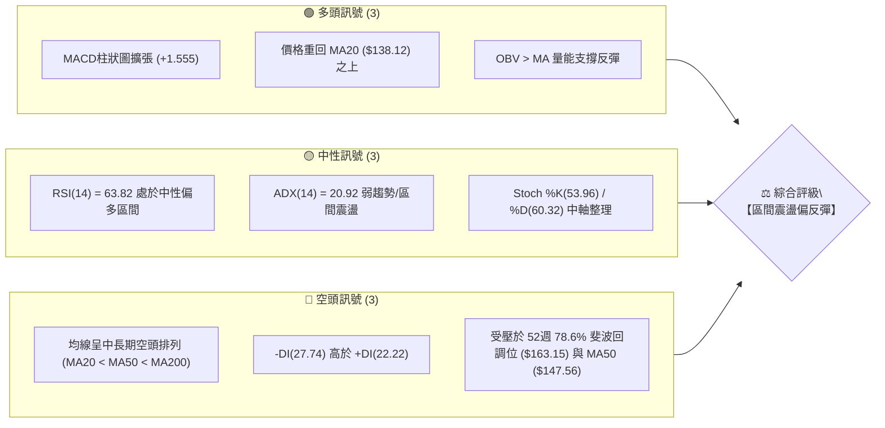
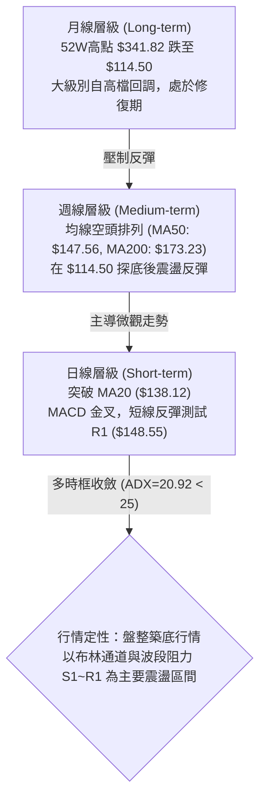
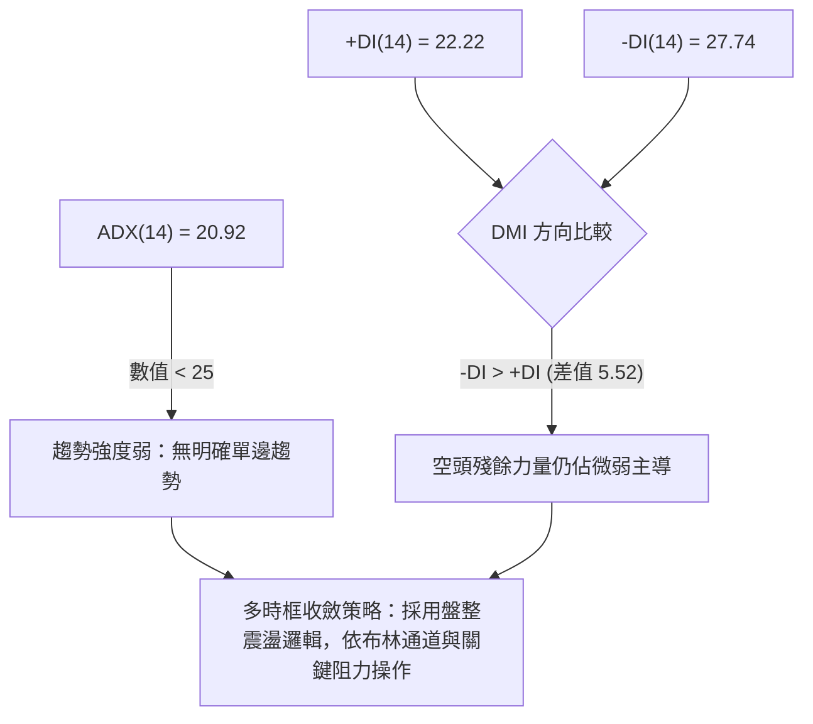
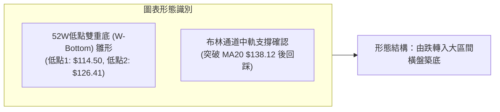
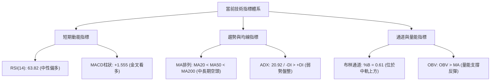
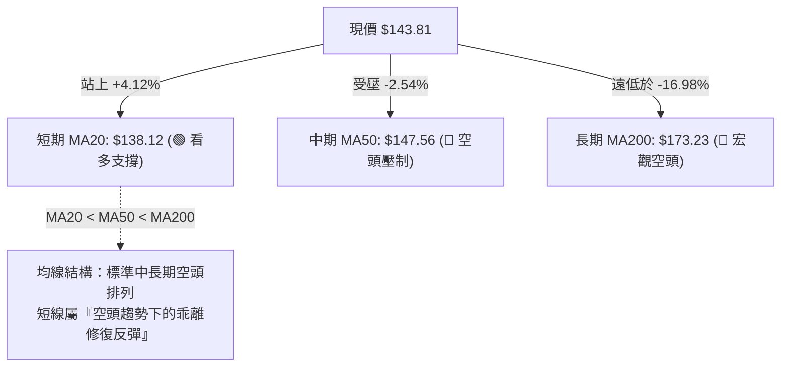
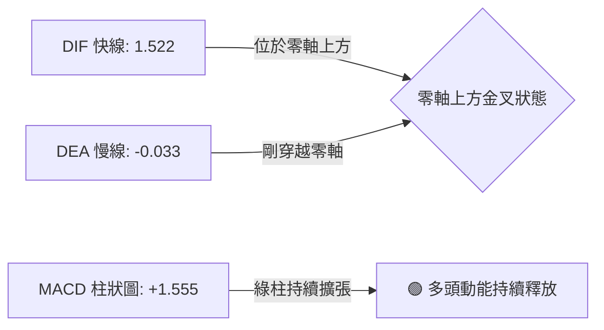
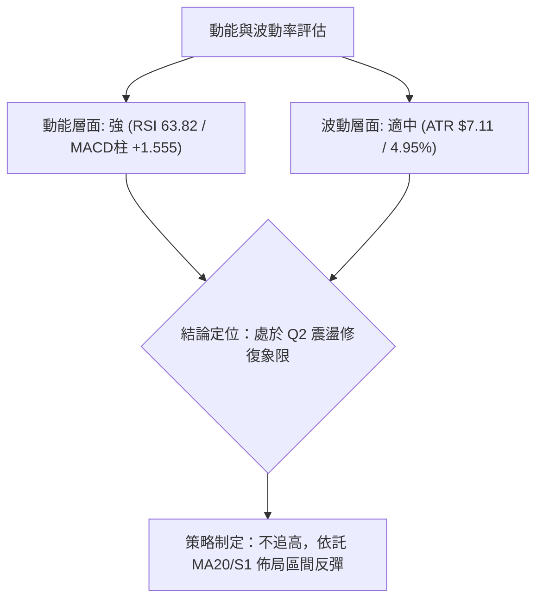
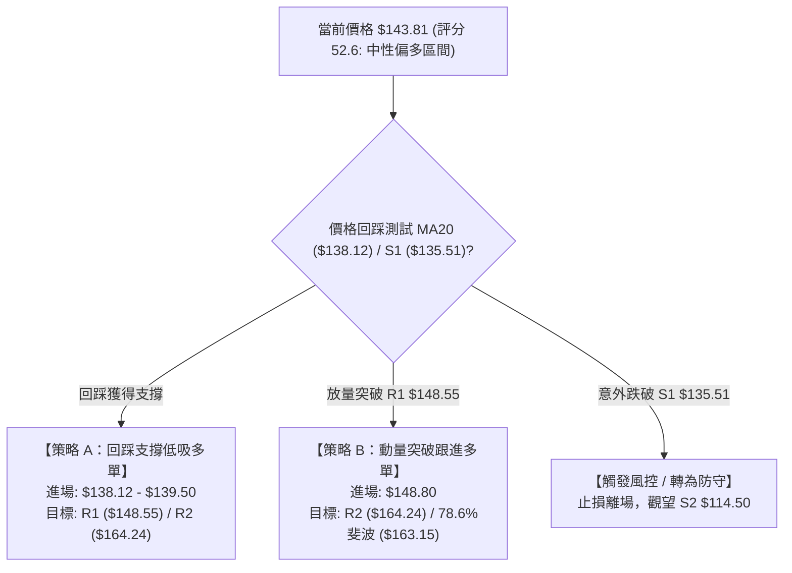
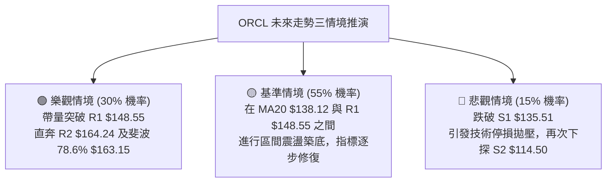

# ORCL 技術分析報告

> **報告日期**：2026-08-20 ｜ **語言**：繁體中文 ｜ **數據來源**：Yahoo Finance ｜ **當前價格**：$143.81

---

## 目錄

| 章節 | 內容 |
|------|------|
| [1. 技術面概覽](#1-技術面概覽) | 訊號儀表板、核心指標、評分卡 |
| [2. 趨勢分析](#2-趨勢分析) | 多時框趨勢、長中短期走勢、ADX強度 |
| [3. 圖表形態分析](#3-圖表形態分析) | 形態識別、K線組合、目標價推算 |
| [4. 支撐與阻力](#4-支撐與阻力) | 關鍵價位、斐波那契回調結構 |
| [5. 技術指標深度解讀](#5-技術指標深度解讀) | MA/RSI/MACD/布林通道/成交量 |
| [6. 動能與波動率](#6-動能與波動率) | 動能四象限、ATR、Beta分析 |
| [7. 多時框架總結](#7-多時框架總結) | 時框架評分矩陣、收斂結論 |
| [8. 交易策略建議](#8-交易策略建議) | 策略路由、主策略、風控對沖 |
| [9. 風險提示與監控](#9-風險提示與監控) | 監控指標Checklist、風險場景 |
| [10. 報告總結](#-報告總結) | 全文核心結論與策略總結 |

---

## 1. 技術面概覽

### 🎯 技術訊號儀表板



### 📊 核心指標速覽表

| 指標類別 | 指標名稱 | 當前數值 | 訊號 | 解讀 |
|----------|----------|----------|------|------|
| **價格** | 當前價格 | $143.81 | 🟡 | 位於52週區間12.9%低檔，短線自低位強勢反彈 |
| **短期均線** | MA20 | $138.12 | 🟢 | 現價站上MA20（+4.12%），短線底部支撐確立 |
| **中期均線** | MA50 | $147.56 | 🔴 | 現價位於MA50下方（-2.54%），面臨中期下行均線壓制 |
| **長期均線** | MA200 | $173.23 | 🔴 | 遠低於MA200（-16.98%），長期宏觀架構仍屬空頭 |
| **動能** | RSI(14) | 63.82 | 🟡 | 位於中性偏強區間，未進入超買（>70），動能健康 |
| **動能** | MACD (12,26,9) | DIF: 1.522 / DEA: -0.033 | 🟢 | MACD金叉向上，柱狀圖 +1.555 擴張，短期動能充沛 |
| **趨勢** | ADX / DMI | ADX: 20.92 / -DI: 27.74 | 🟡 | ADX < 25 處於無趨勢/盤整期，空方力道（-DI）略佔優勢 |
| **波動** | ATR(14) | $7.11 (4.95%) | 🟡 | 每日平均波動幅度約 $7.11，波動度適中 |
| **量能** | 20日均量比 | 0.77x (23.78M vs 31.07M) | 🟡 | 成交量略顯萎縮，但 OBV > MA 顯示籌碼沉澱穩定 |

### 🏆 技術評分卡

```
╔══════════════════════════════════════════════════════════════════╗
║              技術評分卡 — ORCL (2026-08-20)                    ║
╠══════════════════════════════════════════════════════════════════╣
║ 趨勢強度 (ADX/DMI)   █████░░░░░░░░░░░░░░░  28/100  🔴 弱勢盤整    ║
║ 動能指標 (RSI/MACD)  ██████████████░░░░░░  70/100  🟢 短線強勁    ║
║ 支撐穩定度 (S1/S2)   ██████████████░░░░░░  68/100  🟢 底部具承接  ║
║ 成交量配合 (OBV/VOL) ████████████░░░░░░░░  58/100  🟡 量能中性偏多  ║
║ 形態完整度 (區間築底) ████████████░░░░░░░░  60/100  🟡 雙底雛形構築  ║
║ 均線排列 (MA系統)    ██████░░░░░░░░░░░░░░  32/100  🔴 中長均線壓制  ║
╠══════════════════════════════════════════════════════════════════╣
║ 綜合評分             ███████████░░░░░░░░░  52.6/100 🟡 中性震盪   ║
╚══════════════════════════════════════════════════════════════════╝
```

---

## 2. 趨勢分析

### 🌐 多時框趨勢分析



### 📈 長期趨勢 — 12個月走勢圖（Unicode）

```
ORCL 月線走勢圖（2025-08 至 2026-08）
價格 ($)
$280 ┤                ● (2025-09: $278.07)
$260 ┤                    ● (2025-10: $260.10)
$240 ┤
$220 ┤● (2025-08: $223.58)                   ● (2026-05: $225.00)
$200 ┤                        ● (2025-11: $200.02)
$180 ┤                            ● (2025-12: $193.05)
$160 ┤                                ● (2026-01: $163.44)  ● (2026-04: $160.83)
$140 ┤                                    ● (2026-02: $144.39)  ● (2026-03: $146.09)  ● (2026-06: $146.04)  ● (現價: $143.81)
$120 ┤                                                                                    ● (2026-07: $129.87)
     └┬─────────┬─────────┬─────────┬─────────┬─────────┬─────────┬─────────┬─────────┬─────────┬─────────┬─────────┬─────────
    25-08     25-09     25-10     25-11     25-12     26-01     26-02     26-03     26-04     26-05     26-06     26-07     26-08
```

#### 走勢特徵分析表格

| 階段區間 | 起止月份 | 價格變化 ($) | 漲跌幅 (%) | 核心特徵與形態解讀 |
|----------|----------|--------------|------------|-------------------|
| **第一階段：見頂回落** | 2025-08 ~ 2025-10 | $223.58 → $260.10 (高點 $278.07) | +16.33% | 衝頂後量能不濟，形成中期頂部巨量換手 |
| **第二階段：主跌波段** | 2025-11 ~ 2026-02 | $200.02 → $144.39 | -27.81% | 跌破各路均線，均線系統全面轉為空頭排列 |
| **第三階段：次級反彈** | 2026-03 ~ 2026-05 | $146.09 → $225.00 | +54.01% | 5月份出現爆發性次級反彈，但未能創歷史新高 |
| **第四階段：二次探底** | 2026-06 ~ 2026-07 | $146.04 → $129.87 (最低 $114.50) | -49.11% | 快速回吐漲幅並觸及52週新低 $114.50，恐慌盤湧現 |
| **第五階段：底部收斂** | 2026-08 (即時) | $129.87 → $143.81 | +10.73% | 於 S1 ($135.51) 上方止跌，MACD柱狀圖翻紅反彈 |

### 📊 中期趨勢（週線分析）

```
ORCL 近期週線壓力與支撐結構示意圖
價格 ($)
$173.23 ────────────────────────────────────────── [MA200 / 強長期壓力]
$164.24 ────────────────────────────────────────── [R2 / 近期波段阻力]
$148.55 ────────────────────────────────────────── [R1 / MA50 匯合阻力區 ($147.56 - $148.55)]
$143.81 ══════════════════════════════════════════ ◄ 當前收盤價 ($143.81)
$138.12 ------------------------------------------ [MA20 / 布林中軌支撐]
$135.51 ────────────────────────────────────────── [S1 / 近一年波段次低支撐]
$114.50 ══════════════════════════════════════════ [S2 / 52週最低點強支撐]
```

- **週線走勢分析**：自 2026-07-26 觸及週線低點收於 $114.99 以來，連續三週拉出強勁反彈陽線（$129.87 → $147.02 → $150.52），RSI 自極度超賣區（最低 11.1）大幅修復至 63.8。本週收於 $143.81，呈現小幅回踩確認 MA20 ($138.12) 支撐的健康走勢。

### ⚡ 趨勢強度評估（ADX 解讀）



| 指標名稱 | 當前數值 | 臨界標準 | 狀態評估 | 實戰意涵 |
|----------|----------|----------|----------|----------|
| **ADX(14)** | 20.92 | 25.00 | 弱趨勢 / 盤整 | 市場處於區間震盪階段，單邊趨勢突破容易出現假訊號 |
| **+DI(14)** | 22.22 | - | 多方動能修復中 | 多方力量自低檔逐步回升，但尚未跨越強勢門檻 (30) |
| **-DI(14)** | 27.74 | - | 空方動能主導 | 空方動能雖較高點大幅衰退，但仍壓制多方 |

---

## 3. 圖表形態分析

### 🔍 形態識別系統



#### 形態識別與信心度評估表

| 形態名稱 | 信心度 | 判斷依據（引用技術數據） | 完成度 | 目標價（附嚴格計算式） |
|----------|--------|--------------------------|--------|------------------------|
| **雙重底 (Double Bottom) 雛形** | 62% | 2026-07 出現波段低點 $114.50 (S2)，隨後回測 $126.41 快速拉升，頸線位位於 R1 $148.55 | 70% | 頸線 $148.55 + 形態高度 ($148.55 - $114.50 = $34.05) = **$182.60**（中期目標） |
| **布林通道中軌突破回踩** | 78% | 收盤價 $143.81 站穩 BB中軌 (MA20: $138.12)，%B = 0.61 | 90% | BB上軌目標：**$164.86**（對應阻力 R2: $164.24） |
| **大型頭肩頂頸線回抽** | 45% | *訊號不足，僅做指標型解讀*（歷史高點結構鬆散，不強行套用大型頭肩形態） | 30% | 數據不足，不設定衍生目標價 |

### 🕯️ 重要K線形態分析

| 週期/日期 | 收盤價 ($) | K線形態 | 深度解讀 | 訊號 |
|-----------|------------|---------|----------|------|
| **2026-07-26 (週線)** | $114.99 | 長下影探底錘頭線 | 週成交量 162.94M，於 52週低點 $114.50 處爆量止跌，確立波段絕對底部 | 🟢 強烈買訊 |
| **2026-08-09 (週線)** | $147.02 | 實體大陽線 (Marubozu) | 週漲幅顯著，RSI 自 48.6 激增至 71.8，MACD柱狀圖翻正至 +4.827，多頭動能爆發 | 🟢 多頭確認 |
| **2026-08-16 (週線)** | $150.52 | 高檔十字星/滯漲線 | 觸及 MA50 ($147.56) 及 R1 ($148.55) 附近受阻，週成交量縮至 144.23M | 🟡 阻力警示 |
| **2026-08-23 (最新)** | $143.81 | 回踩中陰線 | 正常技術性回吐，回測 MA20 ($138.12) 支撐，量能萎縮至 63.60M，屬良性整理 | 🟡 健康回踩 |

### 📉 ASCII 走勢形態示意圖

```
ORCL 近期雙底反彈與頸線阻力測試示意圖
價格 ($)
$170.57 ┤                                                    [R3]
$164.24 ┤                                                    [R2 / 布林上軌 $164.86]
$148.55 ┤                     頸線阻力位 (R1) ─────┐          [R1 / MA50 $147.56]
$143.81 ┤                                          ● ◄ 現價
$138.12 ┤                                        ╱   ╲      [MA20 中軌支撐]
$135.51 ┤                      次低點 (07-19)   ╱     [S1 支撐]
$126.41 ┤                           ●─────────╱
$114.50 ┤     波段最低點 (07-26)   ╱
        └─────●───────────────────┴──────────────────────────
           2026-07-26          2026-08-09        2026-08-20
```

### 🎯 形態目標價計算

1. **短期布林通道波動目標**：
   - 依據布林通道（中軌 $138.12，現價 $143.81，%B = 0.61），若維持在中軌之上運行，短期技術目標直指 **BB上軌 $164.86**，與聚類阻力位 **R2 $164.24** 極度吻合。
2. **中期雙底突破等距測幅目標**：
   - 形態底部：$114.50（S2）
   - 形態頸線：$148.55（R1）
   - 形態垂直高度：$148.55 - $114.50 = $34.05
   - **等距測幅理論目標價** = 頸線 $148.55 + $34.05 = **$182.60**（接近 2026-06 波段起跌點 $183.49 以及 61.8% 斐波那契回調位 $201.34 下方）。

---

## 4. 支撐與阻力

### 🗺️ 關鍵價位分布圖（Unicode）

```
ORCL 關鍵價位結構分布圖 (Resistance & Support Matrix)
══════════════════════════════════════════════════════════════════
$170.57 ║████████████████████████████████║ 強波段阻力 R3 (+18.61%)
$164.24 ║████████████████████████        ║ 關鍵波段阻力 R2 / BB上軌 ($164.86) (+14.21%)
$148.55 ║████████████████                ║ 即時頸線阻力 R1 / MA50 ($147.56) (+3.30%)
════════╬════════════════════════════════╬═════════════════════════
$143.81 ╠════════════════════════════════╣ ◄ 當前收盤價格 ($143.81)
════════╬════════════════════════════════╬═════════════════════════
$138.12 ║▓▓▓▓▓▓▓▓▓▓▓▓                    ║ 短期動態均線支撐 (MA20 / BB中軌) (-3.96%)
$135.51 ║▓▓▓▓▓▓▓▓▓▓▓▓▓▓▓▓▓▓              ║ 近一年波段次低支撐 S1 (-5.77%)
$114.50 ║████████████████████████████████║ 52週歷史低點強支撐 S2 (-20.38%)
══════════════════════════════════════════════════════════════════
```

### 🚧 阻力位分析表

| 阻力級別 | 價位 ($) | 距現價幅幅 | 形成原因與技術共振 | 突破難度 | 重要性 |
|----------|----------|------------|--------------------|----------|--------|
| **R1** | **$148.55** | +3.30% | 近一年波段高點聚類；與 50日均線 MA50 ($147.56) 形成雙重共振壓制區 | 🟡 中等 | ★★★★☆ |
| **R2** | **$164.24** | +14.21% | 近一年密集套牢籌碼區；與布林通道上軌 ($164.86) 及 78.6% 斐波位 ($163.15) 共振 | 🔴 較高 | ★★★★★ |
| **R3** | **$170.57** | +18.61% | 長期下行壓力核心區；接近 MA200 ($173.23) 牛熊分界線 | 🔴 極高 | ★★★☆☆ |

### 🛡️ 支撐位分析表

| 支撐級別 | 價位 ($) | 距現價幅幅 | 形成原因與技術共振 | 守住機率 | 重要性 |
|----------|----------|------------|--------------------|----------|--------|
| **S1** | **$135.51** | -5.77% | 近一年波段低點聚類；與 20日均線 MA20 ($138.12) 構成短期多頭防守護城河 | 🟢 75% | ★★★★☆ |
| **S2** | **$114.50** | -20.38% | 52週歷史低點；週線大級別放量探底錘頭線底部，宏觀終極支撐 | 🟢 90% | ★★★★★ |

### 📐 斐波那契回調位分析

依據 52週波段區間：最低點 **$114.50** (100.0%) 至 最高點 **$341.82** (0.0%) 進行黃金分割測算：

```
斐波那契回調結構與現價位置 (52W High $341.82 → 52W Low $114.50)
  0.0%  (52W High)  $341.82 ──────────────────────────────────────────
 23.6%              $288.18 ──────────────────────────────────────────
 38.2%              $254.99 ──────────────────────────────────────────
 50.0%              $228.16 ──────────────────────────────────────────
 61.8%              $201.34 ──────────────────────────────────────────
 78.6%              $163.15 ────────────────────── (上方關鍵阻力區)
══════════════════════════════════════════════════════════════════════
 現價 $143.81 處於 78.6% ($163.15) 與 100.0% ($114.50) 深度回調區間
══════════════════════════════════════════════════════════════════════
100.0%  (52W Low)   $114.50 ────────────────────── (底部終極支撐)
```

- **現價位置解讀**：現價 $143.81 處於 **78.6% 回調位 ($163.15)** 與 **100.0% 回調位 ($114.50)** 之間。在技術分析理論中，跌破 61.8% ($201.34) 後行情通常轉為深幅修正；而當價格在 100.0% ($114.50) 止跌反彈時，第一道重大中長期結構性修復阻力即為 78.6% 斐波那契位 ($163.15)，該位置與技術阻力位 R2 ($164.24) 極度重合，是反彈能否轉化為反轉的關鍵分水嶺。

---

## 5. 技術指標深度解讀

### 🎛️ 指標訊號總覽



### 📈 移動平均線排列分析



#### 移動平均線數據全景表

| 均線名稱 | 數值 ($) | 乖離率 (%) | 均線走勢形態 | 技術意義解讀 |
|----------|----------|------------|--------------|--------------|
| **MA 5** | $148.00 | -2.83% | 下行拐頭 | 短線遭遇短壓，與 R1 ($148.55) 形成第一道阻力 |
| **MA 10** | $148.03 | -2.85% | 震盪持平 | 短線走平，顯示多空於 $148 附近激烈爭奪 |
| **MA 20** | $138.12 | +4.12% | 向上翻揚 | **多頭核心防線**，布林中軌，回踩不破為強勢整理 |
| **MA 50** | $147.56 | -2.54% | 持續下行 | 中期下降趨勢線壓制，需放量突破才能扭轉中期弱勢 |
| **MA 60** | $159.48 | -9.82% | 下行 | 季線阻力，壓制反彈空間 |
| **MA 120** | $161.73 | -11.08% | 下行 | 半年線壓制 |
| **MA 200** | $173.23 | -16.98% | 下行 | **牛熊分界線**，長期趨勢轉牛的終極門檻 |
| **MA 240** | $192.02 | -25.11% | 下行 | 年線阻力 |

### 📉 RSI(14) 分析

```
RSI(14) 數值進度條：
0 ══════════ 超賣(30) ══════════════ 中軸(50) ═══════ 當前(63.82) ══ 超買(70) ══════════ 100
[▓▓▓▓▓▓▓▓▓▓▓▓▓▓▓▓▓▓▓▓▓▓▓▓▓▓▓▓▓▓▓▓▓▓▓▓▓▓▓▓▓▓▓▓▓▓▓▓▓▓▓▓▓▓▓▓▓▓░░░░░░░░░░░░░░░░░░░░░░░░] 63.82%
```

- **區間評估**：RSI(14) 當前報 **63.82**，脫離 7 月底的深度超賣區（11.1~28.2），目前穩居 50 中軸上方，且未觸及 70 超買警戒線。
- **背離判斷**：
  - **頂背離**：無頂背離訊號。
  - **底背離**：在 2026-07-19 至 2026-07-26 期間，價格由 $126.41 跌至 $114.99 創下新低，但 RSI 柱體由 28.2 僅微幅變動至 26.7，並在隔週急速拉升，呈現標準**弱底背離確認**，隨後帶動近三週報復性反彈。目前指標動能維持健康。

### 📊 MACD(12/26/9) 訊號解讀



- **數據解析**：DIF 快線為 **1.522**，DEA 訊號線為 **-0.033**，MACD 柱狀圖（Histogram）為 **+1.555**。
- **解讀**：DIF 向上穿破 DEA 形成黃金交叉，且 DIF 已經成功站上 0 軸，柱狀圖呈現持續正向擴張，確認當前日線級別多頭反彈動能依然強烈。

### 📦 布林通道分析

```
ORCL 布林通道 (Bollinger Bands, 20, 2) 結構圖
價格 ($)
$164.86 ────────────────────────────────────── BB 上軌 (Upper Band)
        │
        │
$143.81 ══════════════════════════════════════ 現價 (當前位置: %B = 0.61)
        │
$138.12 ────────────────────────────────────── BB 中軌 (MA20 Support)
        │
        │
$111.37 ────────────────────────────────────── BB 下軌 (Lower Band)
```

- **通道寬度與位置**：上軌 $164.86，中軌 $138.12，下軌 $111.37。當前 %B 為 **0.61**，位於中軌與上軌之間（0.5~1.0 多頭控制區間）。
- **運行型態**：價格自下軌反彈突破中軌後，目前正以中軌 $138.12 為動態支撐向上軌 $164.86 推進，通道口略微向外張開，有利於震盪上行。

### 💹 成交量分析（量價配合度）

```
量價關係比對：
最新成交量:  23,788,822  (23.79M)  ████████████░░░░░░░░  (量比: 0.77x)
20日均量:    31,073,991  (31.07M)  ████████████████░░░░
50日均量:    34,444,460  (34.44M)  ██████████████████░░
OBV 指標:    OBV > MA20均線       🟢 能量潮向上，量價配合健康
```

- **量價關係解讀**：當前成交量 23.79M 較 20日均量縮減約 23%（量比 0.77x），呈現「**上漲放量、回踩縮量**」的良性整理特徵。OBV 線持續位於其移動平均線上方，顯示機構籌碼在 $120~$140 區間有實質吸籌動作，並未出現主力出貨的量價背離現象。

---

## 6. 動能與波動率

### ⚡ 動能評估四象限

| 象限 | 動能維度 (Momentum) | 波動維度 (Volatility) | ORCL 當前狀態 | 交易策略導向 |
|------|---------------------|-----------------------|---------------|--------------|
| **Q1 (最佳擴張)** | 強 (RSI>60, MACD>0) | 低 (ATR% < 3.5%) | — | 順勢加碼，趨勢爆發 |
| **Q2 (震盪修復)** | **強 (RSI=63.82, MACD+1.555)** | **中/適中 (ATR% = 4.95%)** | 🟢 **ORCL 落在本象限** | **逢回踩支撐低吸，高拋低吸** |
| **Q3 (高危博弈)** | 強 (超買區間) | 高 (ATR% > 7.0%) | — | 嚴格緊跟移動止盈 |
| **Q4 (流動性陷阱)** | 弱 (RSI<40, MACD<0) | 高 (恐慌拋售) | — | 觀望防守，避免抄底 |



### 📊 ATR 波動率分析

- **ATR(14) 數值**：**$7.11**（佔現價比重 **4.95%**）。
- **止損與波動距離建議**：
  - **日內安全噪音濾波區間**：$7.11 × 1.0 = **$7.11**
  - **短線波段止損距離 (1.5 × ATR)**：$7.11 × 1.5 = **$10.67**（對應現價下方止損點約為 **$133.14**，剛好覆蓋支撐位 S1 $135.51）
  - **中線動態追蹤止損 (2.0 × ATR)**：$7.11 × 2.0 = **$14.22**

### 📐 Beta 與市場相關性

- **Beta 係數**：**1.718**（高貝塔特性）。
- **解讀**：ORCL 的波動幅度約為標普 500 大盤的 **1.72 倍**。在市場整體風險偏好修復時，其反彈彈性顯著高於大盤，但若大盤下挫，其回調回撤壓力亦相對劇烈。高 Beta 特性要求交易者在倉位管理上必須嚴格控制風險敞口（建議單筆倉位不超過 15%）。

---

## 7. 多時框架總結

### 📋 時框架評分表

| 時框架 | 趨勢方向 | 動能指標 | 均線排列狀態 | 圖表形態 | 綜合評分 | 建議策略 |
|--------|----------|----------|--------------|----------|----------|----------|
| **月線 (長期)** | 🔴 偏空 | 🟡 中性 (低檔修復) | 空頭排列 (遠低於年線) | 高位腰斬後尋底 | 35/100 | 長期投資者定投觀望 |
| **週線 (中期)** | 🟡 震盪 | 🟢 偏多 (MACD翻紅) | 空頭排列 (MA50壓制) | 52W低點大雙底雛形 | 55/100 | 區間波段操作 (S1~R2) |
| **日線 (短期)** | 🟢 偏多 | 🟢 看多 (MACD金叉) | 站上 MA20，逼近 MA50 | 突破中軌回踩確認 | 68/100 | 逢低吸納，順短逆長 |

### 🔲 綜合訊號矩陣

```
時框一致性矩陣分析：
┌──────────┬──────────┬──────────┬──────────┬────────────────────────┐
│ 時框層級 │ 趨勢方向 │ 動能強度 │ 量能配合 │ 權重收斂評估           │
├──────────┼──────────┼──────────┼──────────┼────────────────────────┤
│ 日線 (短)│ 偏多 🟢  │ 強勁 🟢  │ 中性 🟡  │ 提供精確進場點 (MA20)  │
│ 週線 (中)│ 震盪 🟡  │ 修復 🟢  │ 良好 🟢  │ 主導波動區間 ($135-$164│
│ 月線 (長)│ 偏空 🔴  │ 偏弱 🔴  │ 萎縮 🟡  │ 限制上方絕對空間 ($173)│
└──────────┴──────────┴──────────┴──────────┴────────────────────────┘
```

### ⚖️ 多時框收斂結論

> **依據規則 14 嚴格收斂**：
> 1. 當前趨勢強度指標 **ADX(14) = 20.92 < 25**，市場被嚴格定義為**【盤整震盪行情】**，非單邊趨勢行情。
> 2. 依規則，在盤整行情中，**以日線布林通道上下軌（$111.37 ~ $164.86）及近期關鍵波段支撐阻力（S1 $135.51 ~ R2 $164.24）為主要交易區間**。
> 3. **唯一方向性結論**：**【中性偏多區間震盪（逢低做多）】**。中期週線與長期月線的空頭排列限制了盲目追高的空間，但日線級別 MACD 零軸上方金叉及站穩 MA20 ($138.12) 提供堅實的短線反彈支撐。

---

## 8. 交易策略建議

### 🗺️ 策略決策流程圖



### 🧭 策略路由

- **綜合評分定位**：**52.6 / 100（中性區間）**
- **當前主策略方向** = **【以布林中軌為依託的區間偏多操作（等待回踩確認或突破進場）】**

### 🎯 價格情境階梯（Price Scenarios）

| 觸發條件 | 第一目標 | 第二目標 | 情境含義與技術解讀 |
|----------|----------|----------|--------------------|
| **向上突破 R1 $148.55** | **R2 $164.24** | **R3 $170.57** | 突破 MA50 壓制，雙底頸線確認，挑戰布林上軌及半年線 |
| **維持於現價 $143.81 震盪** | **MA20 $138.12** | **R1 $148.55** | 在 MA20 與 MA50 之間進行蓄勢整理，消化短線獲利盤 |
| **向下跌破 S1 $135.51** | **S2 $114.50** | 數據中未偵測到更低位 | 跌破布林中軌與近期波段低點，反彈宣告失敗，重探 52W 低點 |

### 📊 情境機率分佈

```
情境機率分佈圖：
區間震盪偏向上反彈 55%  [███████████████████████████░░░░░░░░░░░░]
窄幅區間橫盤整理   30%  [███████████████░░░░░░░░░░░░░░░░░░░░░░░]
回落破位再探底     15%  [███████░░░░░░░░░░░░░░░░░░░░░░░░░░░░░░]
```

| 情境分類 | 機率預估 | 主要技術指標依據 |
|----------|----------|------------------|
| **繼續上行 / 反彈突破** | **55%** | MACD 柱狀圖 (+1.555) 擴張、OBV > MA 資金持續流入、價格站穩 MA20 ($138.12) |
| **區間震盪蓄勢** | **30%** | ADX = 20.92 顯示趨勢動能有限、上方遭遇 MA50 ($147.56) 與 R1 ($148.55) 強壓 |
| **破位回落再探底** | **15%** | 中長期均線（MA200 $173.23）依然空頭排列、-DI (27.74) 仍微幅高於 +DI (22.22) |

### 🟢 主策略詳情

| 策略要素 | 策略 A：支撐位逢低吸納（主推薦） | 策略 B：突破頸線右側追買 |
|----------|----------------------------------|--------------------------|
| **進場邏輯** | 回踩 MA20 / S1 支撐確認不破 | 放量突破 MA50 及 R1 頸線阻力 |
| **進場價格** | **$138.50**（MA20 $138.12 上方） | **$148.80**（突破 R1 $148.55 確認） |
| **第一目標價 (T1)** | **$148.55**（阻力位 R1） | **$163.15**（78.6% 斐波那契回調位） |
| **第二目標價 (T2)** | **$164.24**（阻力位 R2 / BB上軌）| **$164.24**（阻力位 R2） |
| **止損價格** | **$134.80**（跌破 S1 $135.51） | **$143.50**（跌回現價及突破口下方） |
| **風險報酬比 (R:R)**| **1 : 2.72** (風險 $3.70 / 期望獲利 $10.05 至 T1) | **1 : 2.71** (風險 $5.30 / 獲利 $14.35 至 T1) |
| **預估勝率** | **65%** | **58%** |
| **建議倉位** | **10% ~ 15%** | **8% ~ 10%** |

### 🔴 反向風險觸發點（對沖與風控提示）

- **多頭反轉失效點**：若日線收盤價跌破 **S1 $135.51**，且 MACD 柱狀圖快速由正轉負，代表反彈波段結束。
- **對沖應對措施**：
  - 多單應立即無條件止損離場。
  - 積極型投資者可於 **$134.80** 建立空頭對沖部位，下看目標 **S2 $114.50**，止損設於 **$138.50**。

### ⭐ 整體訊號強度評星

```
做多訊號強度：★★★☆☆  (3.5/5 星 — 短線指標偏多，但受制於中長空頭)
做空訊號強度：★★☆☆☆  (2.0/5 星 — 空頭動能衰退，探底結構已現)
整體可信度：  ★★★★☆  (4.0/5 星 — 支撐阻力與指標共振度高)
```

---

## 9. 風險提示與監控

### ✅ 關鍵監控指標 Checklist

```
╔══════════════════════════════════════════════════════════════════╗
║              關鍵技術監控清單 (Daily Technical Checklist)        ║
╠══════════════════════════════════════════════════════════════════╣
║ [ ] 價格是否維持在 MA20 ($138.12) 之上 (多空防守底線)            ║
║ [ ] 日成交量是否放大至 31.07M (20日均量) 以上 (突破確認信號)     ║
║ [ ] MACD 柱狀圖是否持續維持在 0 軸上方正值區 (動能維持)          ║
║ [ ] RSI(14) 是否在 50~70 健康區間運行，未跌破 50 中軸            ║
║ [ ] ADX 是否突破 25 (確認由震盪轉為趨勢行情)                     ║
║ [ ] 能否帶量收盤突破 R1 ($148.55) 與 MA50 ($147.56) 阻力帶       ║
╚══════════════════════════════════════════════════════════════════╝
```

### ⚠️ 風險場景分析



### 🛡️ 風險管理重要提醒

1. **Beta 敏感度管理**：ORCL 的 Beta 高達 **1.718**，在大盤（S&P 500）波動加劇時會被放大。建議以 ATR ($7.11) 嚴格設定每筆交易的絕對虧損金額不超過總資金的 **1.0% ~ 1.5%**。
2. **均線壓制不可忽視**：雖然短線指標（RSI、MACD）強勁，但長期 MA200 ($173.23) 依然向下傾斜，在未徹底站上 MA200 之前，任何做多均應視為「**波段反彈**」而非「牛市反轉」，切忌過度重倉追高。
3. **斐波那契阻力區止盈紀律**：當價格接近 **$163.15 (78.6% 斐波位) ~ $164.24 (R2)** 阻力帶時，應至少獲利了結 50% 倉位，並將剩餘倉位止損上移至保本點。

---

## 📋 報告總結

```
╔══════════════════════════════════════════════════════════════════╗
║              ORCL 技術分析報告總結 (2026-08-20)                  ║
╠══════════════════════════════════════════════════════════════════╣
║ 當前價格：$143.81         52週區間：$114.50 - $341.82 (處於12.9%低檔)║
║ 技術評級：🟡 中性偏多震盪 (評分: 52.6/100)                        ║
╠══════════════════════════════════════════════════════════════════╣
║ 關鍵結論：                                                       ║
║ ├─ 長期趨勢：🔴 偏空 (遠在 MA200 $173.23 下方，宏觀架構待修復)   ║
║ ├─ 中期趨勢：🟡 築底 (在 52W 低點 S2 $114.50 止跌，構建雙底雛形) ║
║ ├─ 短期趨勢：🟢 偏多 (站上 MA20 $138.12，MACD 零軸上金叉擴張)    ║
║ ├─ 關鍵支撐：S1: $135.51 / S2: $114.50                           ║
║ ├─ 關鍵阻力：R1: $148.55 / R2: $164.24 / R3: $170.57             ║
║ └─ 分析師共識目標：$246.43 (當前大幅折價)                        ║
╠══════════════════════════════════════════════════════════════════╣
║ 最優策略組合：                                                   ║
║ 1. 🥇 最佳機會：策略 A (回踩 MA20 $138.50 附近低吸，止損 $134.80， ║
║                 目標 $148.55 / $164.24，風報比 1:2.72)           ║
║ 2. 🥈 次選機會：策略 B (帶量突破 R1 $148.80 右側跟進，目標 $163.15)║
║ 3. 🥉 保守選擇：場外觀望，等待日線收盤確認站穩 MA50 ($147.56) 後再行 ║
║                 介入波段行情                                     ║
╚══════════════════════════════════════════════════════════════════╝
```

---

> ⚠️ **免責聲明**：本報告為技術分析研究成果，所有數據及價位均嚴格基於所提供之歷史價格與技術指標進行推算。本報告**僅供研究與學術參考**，**不構成任何形式的投資要約或買賣建議**。投資股票具有極高市場風險，操作時請務必嚴格執行個人風險控管。

---

*報告生成時間：2026-08-20 ｜ 數據來源：Yahoo Finance ｜ 分析框架：多時框技術分析體系*