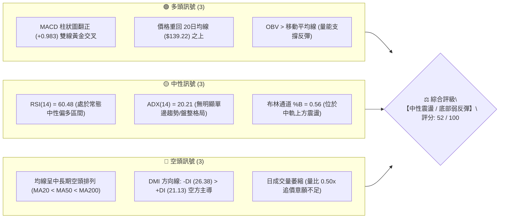
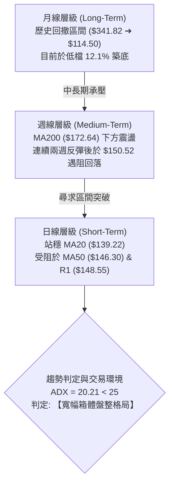
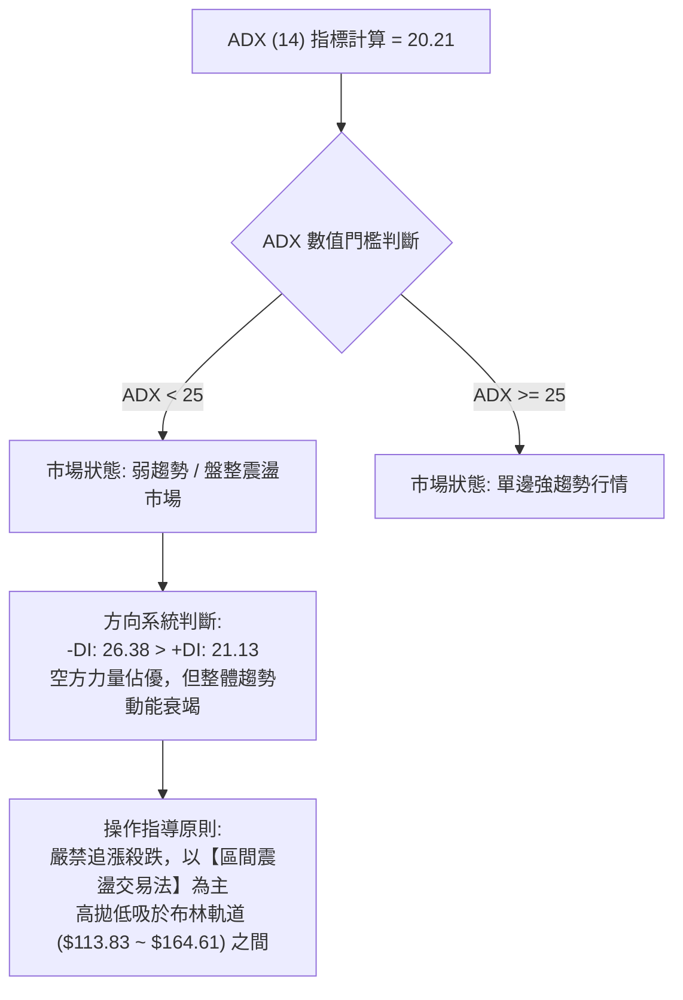
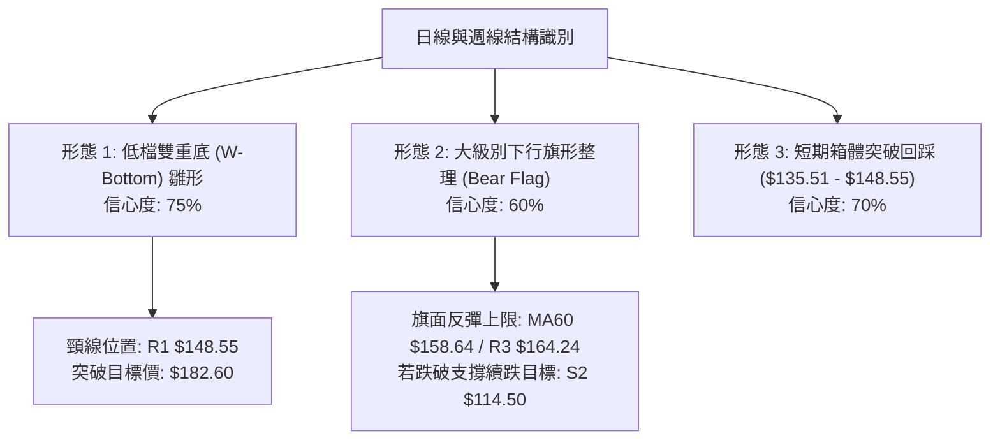
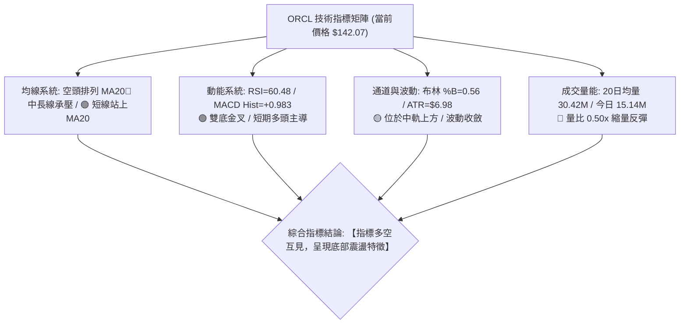
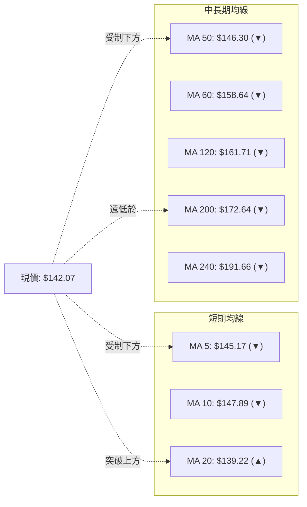
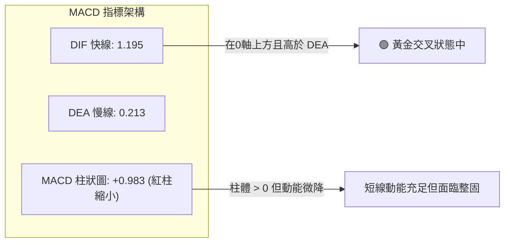
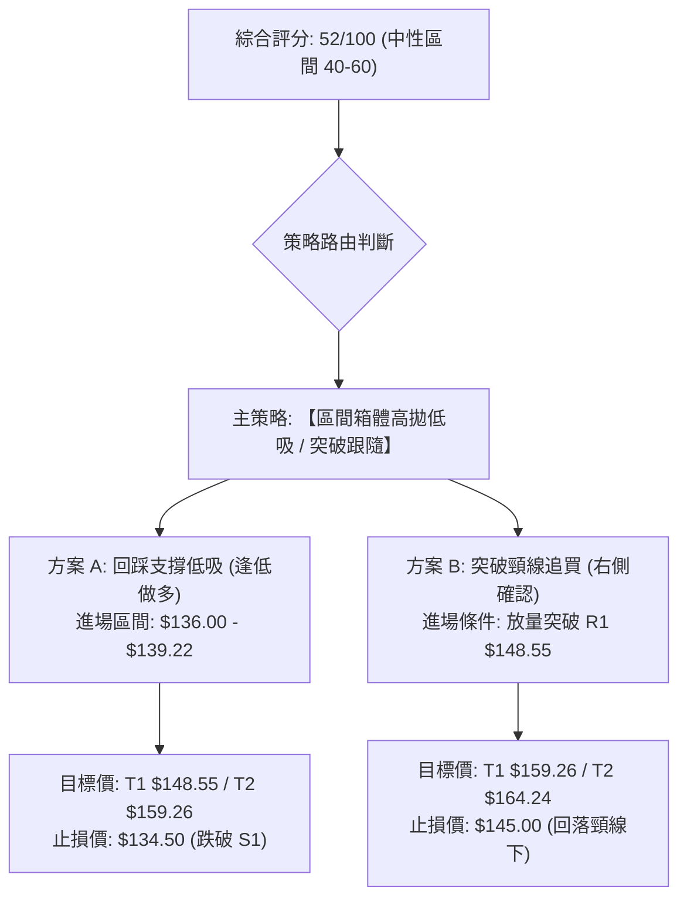
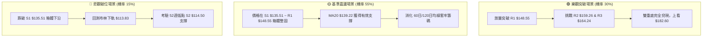

# ORCL 技術分析報告

> **報告日期**：2026-08-21 ｜ **語言**：繁體中文 ｜ **數據來源**：Yahoo Finance ｜ **當前價格**：$142.07

---

## 目錄

| 章節 | 內容 |
|------|------|
| [1. 技術面概覽](#1-技術面概覽) | 訊號儀表板、核心指標、評分卡 |
| [2. 趨勢分析](#2-趨勢分析) | 多時框趨勢、長中短期走勢 |
| [3. 圖表形態分析](#3-圖表形態分析) | 形態識別、K線組合、目標價 |
| [4. 支撐與阻力](#4-支撐與阻力) | 關鍵價位、斐波那契回調 |
| [5. 技術指標深度解讀](#5-技術指標深度解讀) | MA/RSI/MACD/布林/成交量 |
| [6. 動能與波動率](#6-動能與波動率) | 動能評估、ATR、Beta |
| [7. 多時框架總結](#7-多時框架總結) | 時框架評分矩陣 |
| [8. 交易策略建議](#8-交易策略建議) | 多空策略、風險報酬比 |
| [9. 風險提示與監控](#9-風險提示與監控) | 監控指標、風險場景 |
| [10. 報告總結](#-報告總結) | 核心結論與策略清單 |

---

## 1. 技術面概覽

### 🎯 技術訊號儀表板



### 📊 核心指標速覽表

| 指標類別 | 指標名稱 | 當前數值 | 訊號 | 解讀 |
|----------|----------|----------|:----:|------|
| **價格** | 當前價格 | $142.07 | 🟡 | 位於52週區間 12.1% 位置，自低點 $114.50 展開超跌修復 |
| **均線** | MA20 | $139.22 | 🟢 | 價格在 MA20 上方 (+2.05%)，短線確立低檔支撐 |
| **均線** | MA50 | $146.30 | 🔴 | 價格在 MA50 下方 (-2.89%)，面臨中期下行均線壓制 |
| **均線** | MA200 | $172.64 | 🔴 | 價格在 MA200 下方 (-17.71%)，長期趨勢結構偏弱 |
| **動能** | RSI(14) | 60.48 | 🟡 | 中性健康區間，未觸及 70 超買線，動能溫和回升 |
| **動能** | MACD (12,26,9) | 1.195 (Hist: +0.983) | 🟢 | 快慢線金叉且柱狀圖維持正值，短期動能偏多 |
| **趨勢** | ADX (14) | 20.21 | 🟡 | ADX < 25，顯示當前處於無趨勢的區間盤整市場 |
| **通道** | 布林通道 (%B) | 0.56 (中軌 $139.22) | 🟢 | 價格站上布林中軌，向通道上軌 ($164.61) 靠攏 |
| **量能** | 20日量比 | 0.50x (15.14M / 30.42M) | 🔴 | 反彈過程量能不足，顯示買盤缺乏機構級積極追價 |
| **波動** | ATR(14) | $6.98 (4.92%) | 🟡 | 每日平均震幅約 $7 美元，短線操作需預留足夠止損空間 |

### 🏆 技術評分卡

```
╔══════════════════════════════════════════════════════════════════╗
║                技術評分卡 — ORCL (2026-08-21)                    ║
╠══════════════════════════════════════════════════════════════════╣
║ 趨勢強度 (Trend)      ███████░░░░░░░░░░░░░  35/100  🔴 空頭排列  ║
║ 動能指標 (Momentum)   █████████████░░░░░░░  65/100  🟢 短線偏多  ║
║ 支撐穩定度 (Support)  ████████████░░░░░░░░  60/100  🟡 低檔築底  ║
║ 成交量配合 (Volume)   ████████░░░░░░░░░░░░  40/100  🔴 量價背離  ║
║ 形態完整度 (Pattern)  ██████████░░░░░░░░░░  50/100  🟡 箱體整理  ║
║ 均線排列 (Moving Avg) ██████░░░░░░░░░░░░░░  30/100  🔴 中長空頭  ║
╠══════════════════════════════════════════════════════════════════╣
║ 綜合技術評分          ██████████░░░░░░░░░░  52/100  🟡 中性觀望  ║
╚══════════════════════════════════════════════════════════════════╝
```

---

## 2. 趨勢分析

### 🌐 多時框趨勢分析



### 📈 長期趨勢 — 12個月走勢圖（Unicode）

ORCL 過去 12 個月經歷了劇烈的週期轉換，自 2025 年 9 月高點 $278.07（年內最高點 $341.82）一路震盪回落，於 2026 年 7 月觸及 52 週低點 $114.50 後展開技術性超跌反彈。

```
ORCL 月線走勢圖（過去12個月收盤價變動軌跡）
價格軸 ($)
$280 ┤                ● 278.07 (2025-09 波段高點)
$260 ┤                    ● 260.10
$240 ┤
$220 ┤    ● 223.58                            ● 225.00 (2026-05 反彈次高)
$200 ┤                        ● 200.02
$180 ┤                            ● 193.05
$160 ┤                                ● 163.44        ● 160.83
$140 ┤                                    ● 144.39        ● 146.04        ● 142.07 (現價)
$120 ┤                                                                ● 129.87 (2026-07)
$100 └────┬───────┬───────┬───────┬───────┬───────┬───────┬───────┬───────┬───────┬───────┬───────
         08月    09月    10月    11月    12月    01月    02月    03月    04月    05月    06月    07/08
         2025                                    2026
```

#### 走勢特徵分析表格

| 階段區間 | 價格走勢 ($) | 漲跌幅 | 結構特徵與量能意涵 |
|:---------|:-------------:|:------:|:-------------------|
| **2025-08 ~ 2025-09** | $223.58 ➔ $278.07 | +24.37% | 強勢主升段，創下波段歷史新高，均線呈多頭擴散。 |
| **2025-09 ~ 2026-02** | $278.07 ➔ $144.39 | -48.07% | 跌破各級均線，機構籌碼大幅鬆動，形成單邊下行通道。 |
| **2026-02 ~ 2026-05** | $144.39 ➔ $225.00 | +55.83% | 築底後的強勁反彈浪，短暫突破 MA200，但未能在高檔企穩。 |
| **2026-05 ~ 2026-07** | $225.00 ➔ $114.50 (盤中) | -49.11% | 二次探底波段，跌破年內低點至 $114.50，週線 RSI 跌至 11.1 極度超賣。 |
| **2026-07 ~ 2026-08** | $114.50 ➔ $142.07 | +24.08% | 超跌底背離反彈，MACD 翻正，現於 $140–$150 區間整固。 |

### 📊 中期趨勢（週線分析）

從近 20 週收盤走勢觀察，ORCL 在 2026 年 6 月底至 7 月中旬經歷了恐慌拋售（週成交量高達 1.6億–2.5億股），週線 RSI 一度跌至 11.1 的歷史超賣極值。隨後在 2026-07-26 觸及 $114.99 附近成功構築雙重底支撐，展開反彈：

```
ORCL 近期週線壓力與支撐結構示意圖
$170 ┤                                        [R3: $164.24 / 斐波 78.6%: $163.15]
$160 ┤                            [R2: $159.26 / MA60: $158.64]
$150 ┤                ● 150.52 ─┐ (08/16高點遇阻)
$145 ┤                  [R1: $148.55 / MA50: $146.30]
$140 ┤    ● 139.78    ● 140.64  ├─★ 當前收盤: $142.07 (站上 MA20 $139.22)
$135 ┤                  [S1: $135.51 / 密集整理平台]
$130 ┤          ● 129.87
$120 ┤
$114 ┤      ● 114.99 (07/26 低檔打底點，S2: $114.50)
     └───────┬─────────┬─────────┬─────────┬─────────
           07-05     07-12     07-19     07-26     08-02 ~ 08-23 (2026)
```

### ⚡ 趨勢強度評估（ADX 解讀）



#### ADX 趨勢強度對照

| 指標變數 | 實際數值 | 狀態定義 | 技術含義 |
|:---------|:--------:|:--------:|:---------|
| **ADX (14)** | **20.21** | 弱趨勢 / 盤整 | 趨勢動能低於 25 基準線，單邊下行趨勢已暫停，轉為橫向箱體震盪。 |
| **+DI (14)** | **21.13** | 多方買力 | 反彈帶動多方力量由個位數回升至 21.13，但尚未壓制空方。 |
| **-DI (14)** | **26.38** | 空方賣力 | 空方雖高於多方，但數值由前期極端高位明顯回落，空頭賣壓減弱。 |
| **趨勢判定** | **無單邊趨勢** | 區間交易市 | 多時框收斂以「日線布林通道 ($113.83 ~ $164.61)」與關鍵支撐阻力為操作基準。 |

---

## 3. 圖表形態分析

### 🔍 形態識別系統



#### 形態識別與信心度評估表

| 形態名稱 | 信心度 | 判斷依據（引用實際數據） | 完成度 | 目標價（附嚴謹計算式） |
|:---------|:------:|:--------------------------|:------:|:------------------------|
| **雙重底 (W-Bottom)** | **75%** | 2026年7月兩次下探低點：7/19當週收盤 $126.41（低點探至 $114.50）與 7/26 當週收盤 $114.99，形成明確雙底支撐 $114.50。 | **70%** | 頸線為波段高點 R1 $148.55。<br/>形態高度 = $148.55 - $114.50 = $34.05。<br/>量度目標價 = $148.55 + $34.05 = **$182.60**。 |
| **箱體震盪 (Range Box)** | **70%** | 價格在 S1 $135.51 與 R1 $148.55 之間緊密交交織，MA20 ($139.22) 形成箱體中軸。 | **85%** | 箱底 $135.51，箱頂 $148.55。<br/>箱體高度 = $13.04。<br/>向上突破目標 = $148.55 + $13.04 = **$161.59**。 |
| **中長期下行旗形 (Bear Flag)** | **60%** | 自 $225.00 跌至 $114.50 後，展開向上傾斜的弱勢旗面反彈，量能未有效放大（量比 0.50x）。 | **50%** | 旗面反彈阻力位鎖定在 R2 ($159.26) 至 斐波那契 78.6% ($163.15) 區間。 |

### 🕯️ 重要K線形態分析

| 週期/日期 | 收盤價 ($) | K線組合形態 | 技術解讀 | 訊號方向 |
|:----------|:----------:|:------------|:---------|:--------:|
| **2026-07-26 (週線)** | $114.99 | 長下影探底十字星 (Hammer) | 在 52W 低點 $114.50 處爆出 1.63 億股換手，空頭動能竭盡，形成波段絕對低點。 | 🟢 強烈看多 |
| **2026-08-09 (週線)** | $147.02 | 帶量突破大陽線 (Marubozu) | 週漲幅 +13.20%，週線 MACD 柱翻正至 +4.827，一舉收復 MA20 ($139.22)。 | 🟢 多頭確立 |
| **2026-08-16 (週線)** | $150.52 | 上影倒錘子線 (Shooting Star) | 向上挑戰 MA50 ($146.30) 與 R1 ($148.55) 遭遇技術拋壓，短線獲利盤湧出。 | 🔴 短線承壓 |
| **2026-08-23 (當前)** | $142.07 | 縮量小陰線回踩 (Pullback) | 成交量急劇縮減至 81.5M，回踩 MA20 ($139.22) 尋求確認，屬良性技術修正。 | 🟡 中性整固 |

### 📉 ASCII 走勢形態示意圖

```
ORCL 雙重底 (W-Bottom) 與箱體突破回踩架構
價格軸 ($)
$159.26 ┤                                                    [阻力 R2]
        │
$148.55 ┤                  ●─────────────● (頸線/阻力 R1: $148.55)
        │                 / \           / \
$142.07 ┤                /   \         /   ●◄─── 當前現價: $142.07 (回踩MA20 $139.22)
        │               /     \       /
$135.51 ┤              /       ●─────● (箱體下沿支撐 S1: $135.51)
        │             /         \   /
$126.41 ┤            /           ● (7/19 收盤)
        │           /
$114.50 ┤          ● (7/26 低點 $114.50，形成雙底 S2)
        └──────────┴───────────────┴───────────────────────────────
                  左底 (底1)      右底 (底2)     現階段 (突破頸線前回踩)
```

---

## 4. 支撐與阻力

### 🗺️ 關鍵價位分布圖（Unicode）

```
ORCL 關鍵價位空間結構分布圖
══════════════════════════════════════════════════════════════════
$172.64 ║████████████████████████████████║ 核心長期阻力 MA200
$164.61 ║████████████████████████████    ║ 布林通道上軌
$164.24 ║████████████████████████████    ║ 強阻力 R3 (密集套牢區)
$163.15 ║▓▓▓▓▓▓▓▓▓▓▓▓▓▓▓▓▓▓▓▓▓▓▓▓▓▓▓▓    ║ 斐波那契 78.6% 回調位
$159.26 ║████████████████████            ║ 阻力 R2 (MA60 $158.64 匯聚)
$148.55 ║████████████████████████        ║ 關鍵阻力 R1 (頸線/前期高點)
$146.30 ║▓▓▓▓▓▓▓▓▓▓▓▓▓▓▓▓                ║ 中期均線 MA50 壓力
────────╫────────────────────────────────╫──────────────────────────
$142.07 ╠════════════════════════════════╣ ◄─── 當前市場價格 ($142.07)
────────╫────────────────────────────────╫──────────────────────────
$139.22 ║▓▓▓▓▓▓▓▓▓▓▓▓▓▓▓▓▓▓▓▓            ║ 動態支撐 MA20 / 布林中軌
$135.51 ║████████████████████████        ║ 近期波段關鍵支撐 S1
$114.50 ║████████████████████████████████║ 年度強支撐 S2 (52週最低點)
$113.83 ║████████████████████████████████║ 布林通道下軌
══════════════════════════════════════════════════════════════════
```

### 🚧 阻力位分析表

| 阻力級別 | 準確價位 | 形成原因與技術匯聚 | 突破難度 | 重要性評級 |
|:---------|:--------:|:-------------------|:--------:|:----------:|
| **R1 (第一阻力)** | **$148.55** | 近一年波段高點聚類，與 50日均線 ($146.30) 及 10日均線 ($147.89) 形成密集阻力帶。 | 🟡 中等 (需日成交量放大至 30M 以上) | ★★★★☆ |
| **R2 (第二阻力)** | **$159.26** | 60日均線 ($158.64) 與 120日均線 ($161.71) 匯聚處，為 2026 年 4 月震盪平台下沿。 | 🔴 較高 (需中期資金回流配合) | ★★★☆☆ |
| **R3 (強阻力)** | **$164.24** | 斐波那契 78.6% 回調位 ($163.15) 與布林通道上軌 ($164.61) 共振形成的強大籌碼套牢峰。 | 🔴 極高 (長期趨勢多空分水嶺) | ★★★★★ |

### 🛡️ 支撐位分析表

| 支撐級別 | 準確價位 | 形成原因與技術匯聚 | 守住機率 | 重要性評級 |
|:---------|:--------:|:-------------------|:--------:|:----------:|
| **S1 (第一支撐)** | **$135.51** | 近一年波段低點聚類平台，緊鄰 20日均線 ($139.22)，為本次反彈的多頭防禦陣地。 | 🟢 75% (短期震盪守住概率高) | ★★★★☆ |
| **S2 (極限支撐)** | **$114.50** | 52週歷史低點、斐波那契 100.0% 基準位與布林下軌 ($113.83) 形成的三重強支撐。 | 🟢 90% (強支撐底線，跌破概率低) | ★★★★★ |
| **S3 (額外層級)** | *無* | 數據中未偵測到低於 $114.50 的其他近一年波段低點聚類。 | — | — |

### 📐 斐波那契回調位分析

以 52 週極端區間（高點 **$341.82** 至 低點 **$114.50**，總跨度 $227.32）計算黃金分割回調結構：

```
斐波那契回調位階分布 (52W 區間: $114.50 ➔ $341.82)
0.0%  (52W High) ────────────────────────────── $341.82
23.6%            ────────────────────────────── $288.18
38.2%            ────────────────────────────── $254.99
50.0%            ────────────────────────────── $228.16 (中期強弱樞軸)
61.8%            ────────────────────────────── $201.34 (黃金分割反壓)
78.6%            ────────────────────────────── $163.15 (重要結構壓力)
                 [▲ 現價 $142.07 處於 78.6% ~ 100.0% 底部超跌區間]
100.0% (52W Low) ────────────────────────────── $114.50
```

#### 斐波那契位置深度解讀
1. **現價位置**：ORCL 當前價格 **$142.07** 坐落於 **78.6% 回調位 ($163.15)** 與 **100.0% 低點 ($114.50)** 之間，處於深度價值修復與技術性超跌反彈階段。
2. **修復空間**：若價格能有效突破 R1 ($148.55)，向上挑戰第一道斐波那契核心關卡為 78.6% 的 **$163.15**，該位置亦與 R3 ($164.24) 及布林上軌 ($164.61) 完全重合，為多頭反彈的關鍵獲利了結區。

---

## 5. 技術指標深度解讀

### 🎛️ 指標訊號總覽



### 📈 移動平均線排列分析



#### 均線數據明細與趨勢分析表

| 均線名稱 | 當前數值 | 與現價差距 | 乖離率 (%) | 斜率狀態 | 技術含義解讀 |
|:---------|:--------:|:----------:|:----------:|:--------:|:-------------|
| **MA 5** | $145.17 | -$3.10 | -2.13% | 轉跌 ▼ | 短線自 $150.52 回落，短期上攻動能受阻。 |
| **MA 10** | $147.89 | -$5.82 | -3.93% | 轉跌 ▼ | 上方第一道動態均線壓制帶。 |
| **MA 20** | $139.22 | +$2.85 | +2.05% | 上升 ▲ | **短線生命線**，價格保持在其上方，底部支撐有效。 |
| **MA 50** | $146.30 | -$4.23 | -2.89% | 下行 ▼ | 中期下行壓力線，與 R1 ($148.55) 構成重壓。 |
| **MA 60** | $158.64 | -$16.57 | -10.44% | 下行 ▼ | 中期波段阻力，接近 R2 ($159.26)。 |
| **MA 120** | $161.71 | -$19.64 | -12.14% | 下行 ▼ | 半年線下行，中長期籌碼沉澱區。 |
| **MA 200** | $172.64 | -$30.57 | -17.71% | 下行 ▼ | **牛熊分界線**，長期空頭壓制明確。 |
| **MA 240** | $191.66 | -$49.59 | -25.87% | 下行 ▼ | 年線重壓，中長期趨勢修復尚需較長時間。 |

### 📉 RSI(14) 分析

- **RSI 當前數值**：`60.48`
```
RSI(14) 數值儀表板:
0 ──────── 30 (超賣) ──────────── 50 (中軸) ─────── 60.48 ──── 70 (超買) ──────── 100
[░░░░░░░░░░░░░░░░░░░░░░░░░░░░░░░░░░░░░░░░░░▓▓▓▓▓▓▓▓▓▓░░░░░░░░░░] 60.48% (偏多區間)
```
- **超買超賣評估**：RSI 處於 50–70 的常態強勢偏多區間，脫離了 7 月份極端超賣區（11.1–26.7），但尚未進入 >70 的過熱超買區，顯示反彈動能健康，具備向上震盪空間。
- **背離分析**：
  - 價格在 2026-07-26 創下波段低點 $114.99，但 RSI 由 7/12 的 12.5 回升至 26.7，形成標準的**週線級底背離（Bullish Divergence）**，該背離直接促成了後續自 $114.50 至 $150.52 的強勁反彈。
  - 當前日線 RSI(14) 為 60.48，與價格走勢同向，**無明顯頂背離或底背離跡象**。

### 📊 MACD(12,26,9) 訊號解讀


- **MACD 線**：`1.195` ｜ **信號線 (Signal)**：`0.213` ｜ **柱狀圖 (Histogram)**：`+0.983`
- **深度解讀**：MACD 快慢線在零軸上方運行，維持多頭排列；柱狀圖雖維持正值 (+0.983)，但較前期峰值 (+4.827) 有所收斂，表明自低點展開的急升波告一段落，進入技術性良性整理。

### 📦 布林通道分析

```
ORCL 布林通道 (20, 2.0) 結構分佈
$164.61 ┤═════════════════════════════════════════════════════ 上軌 (Upper Band)
        │
$150.00 ┤                          ● (前高遇阻回落 $150.52)
$142.07 ┤─────────────────★ 現價 $142.07 (%B = 0.56)
$139.22 ┤--------------------------------------------- 中軌 MA20 (Middle Band)
        │
$125.00 ┤
$113.83 ┤═════════════════════════════════════════════════════ 下軌 (Lower Band)
```
- **上軌**：`$164.61` ｜ **中軌 (MA20)**：`$139.22` ｜ **下軌**：`$113.83` ｜ **%B 指標**：`0.56`
- **通道特徵解讀**：%B 數值為 0.56，價格穩居中軌 ($139.22) 之上，顯示短線主動權在多方手中。布林通道帶寬收窄後維持水平走勢，配合 ADX = 20.21，明確指示當前處於**以中軌為支撐、向上軌摸索的通道內震盪格局**。

### 💹 成交量分析（量價配合度）

```
成交量比較柱狀圖 (股數)
今日量: 15.14M  [██████████░░░░░░░░░░] (0.50x 縮量)
20日均: 30.42M  [████████████████████] (基準線)
50日均: 34.28M  [██████████████████████]
```
- **最新成交量**：`15,136,344` 股 ｜ **20日均量**：`30,423,982` 股（量比：**0.50x**）
- **量價背離分析**：價格自 $114.50 反彈過程中，成交量逐步由 2.5 億股/週萎縮至當前 81.5M/週，日線量比僅 0.50x。
- **OBV 能量潮解讀**：目前 `OBV > MA`，顯示雖然絕對量能萎縮，但底部的資金並未離場，資金面仍維持淨流入狀態，支撐價格維持在 MA20 之上。

---

## 6. 動能與波動率

### ⚡ 動能評估四象限

```
                   動能強度 (RSI / MACD)
                         高 ↑
                 Q3      │      Q1
            高風險高收益 │   最佳突破機會
                         │
  ───────────────────────┼───────────────────────→ 波動率 (ATR / Beta)
                         │
                 Q4      │      Q2 ★ [ORCL 當前定位]
              避免進場   │   區間震盪觀望
                         低 ↓
```

#### 動能與波動狀態定位表

| 象限代號 | 動能狀態 | 波動率狀態 | ORCL 當前符合度 | 戰略操作指引 |
|:---------|:--------:|:----------:|:---------------:|:-------------|
| **Q1 (最佳機會)** | 強 (RSI>65, MACD高位) | 低 (ATR收斂) | 20% | 待放量突破 R1 ($148.55) 後觸發追價訊號。 |
| **Q2 (震盪觀望)** | **中等偏弱** (MACD正值收斂) | **中等偏低** (ADX<25, 縮量) | **70% (主定位)** | **嚴守箱體策略，以 S1 ($135.51) 與 R1 ($148.55) 進行區間低吸高拋。** |
| **Q3 (高波動)** | 強 | 高 (Beta>2.0, ATR擴大) | 10% | 財報或重大消息發布時的跳空行情。 |
| **Q4 (弱勢下行)** | 弱 (RSI<40, -DI主導) | 高 | 0% | 7月份超跌階段已過，目前非 Q4 狀態。 |

### 📊 ATR 波動率分析

- **ATR(14) 數值**：`$6.98`（佔股價 **4.92%**）
- **波動特徵**：ORCL 每日平均波動幅度接近 $7.00 美元，屬於中高波動性個股。
- **風控與止損設定依據**：
  - **日內交易緩衝**：1.0 × ATR = **$6.98**
  - **波段保護止損**：1.5 × ATR = **$10.47**
  - **保守交易止損**：2.0 × ATR = **$13.96**
  - *實戰應用*：在現價 $142.07 建立多頭部位時，技術止損點應設於 S1 ($135.51) 下方，即 $142.07 - $135.51 = $6.56（約 0.94 × ATR），符合標準止損邊界。

### 📐 Beta 與市場相關性

- **Beta 係數**：`1.718`
- **解讀**：ORCL 的 Beta 為 1.718，表明其對大盤（S&P 500 / QQQ）的敏感度極高。當大盤上漲 1% 時，ORCL 理論上漲約 1.72%；反之大盤回調時其承受的下行壓力亦放大 1.72 倍。在目前中長期空頭排列尚未逆轉的背景下，高 Beta 意味著任何大盤系統性回調都可能引發 ORCL 二次考驗底部支撐。

---

## 7. 多時框架總結

### 📋 時框架評分表

| 時框架 | 趨勢方向 | 動能狀態 | 均線系統排列 | 形態特徵 | 評分 (1-100) | 核心交易策略建議 |
|:-------|:--------:|:--------:|:------------:|:---------|:------------:|:-----------------|
| **短期 (日線)** | 🟢 偏多震盪 | 🟢 MACD金叉 / RSI 60.5 | 🟡 站上 MA20，承壓 MA50 | 箱體區間內回踩整固 | **62 / 100** | 回踩 MA20 ($139.22) / S1 輕倉做多 |
| **中期 (週線)** | 🟡 築底反彈 | 🟢 週MACD翻正 / 週RSI修復 | 🔴 承壓於 MA50 / MA200 | 雙重底頸線突破前夕 | **55 / 100** | 關注 R1 ($148.55) 頸線得失 |
| **長期 (月線)** | 🔴 空頭修復 | 🔴 處於 52W 低檔 12.1% | 🔴 MA200 ($172.64) 下行 | 歷史回撤後的超跌反彈 | **38 / 100** | 長線資金分批定投，右側未確立 |
| **多時框綜合** | 🟡 **中性築底** | 🟢 **動能修復中** | 🔴 **中長空頭壓制** | 🟡 **寬幅箱體盤整** | **52 / 100** | **區間震盪策略，等待放量突破** |

### 🔲 綜合訊號矩陣

```
ORCL 多時框架訊號矩陣圖
時框 \ 維度     趨勢方向       動能狀態       均線排列       量價配合       綜合判定
────────────────────────────────────────────────────────────────────────────
短期 (Daily)    🟢 看多(反彈)   🟢 偏強(金叉)   🟡 突破MA20   🔴 縮量(0.5x)   🟢 偏多整固
中期 (Weekly)   🟡 震盪築底    🟢 修復(底背離)  🔴 空頭壓制   🟡 換手充分     🟡 區間蓄勢
長期 (Monthly)  🔴 空頭格局    🔴 偏弱        🔴 跌破年線   🔴 深度回撤     🔴 防守觀望
```

### ⚖️ 多時框收斂結論

依據多時框收斂規則：
1. **行情性質判定**：當前日線與週線 **ADX(14) = 20.21 (< 25)**，明確指示當前市場屬於**【無單邊趨勢的盤整震盪行情】**。
2. **時框優先級收斂**：在盤整行情中，中長期均線（MA50 $146.30 / MA200 $172.64）作為強阻力界定上方空間，短期操作以**日線布林通道 ($113.83 ~ $164.61)** 及關鍵波段價位（S1 $135.51 至 R1 $148.55）為主要交易區間。
3. **唯一方向性結論**：**【中性偏多觀望，區間震盪對待】**。以回踩支撐位逢低佈局反彈為主，暫不具備單邊追漲條件。

---

## 8. 交易策略建議

### 🗺️ 策略決策流程圖



### 🧭 策略路由說明

> **當前主策略方向 = 【區間震盪低吸策略（中性偏多）】（依技術綜合評分 52/100）**
> 綜合評分處於 40–60 區間，ADX < 25 表明市場無單邊趨勢，交易主軸為利用布林通道中軌（$139.22）及波段支撐（S1 $135.51）與阻力（R1 $148.55 / R2 $159.26）進行波段操作。

### 🎯 價格情境階梯（Price Scenarios）

| 觸發條件 | 下一目標價位 | 後續延伸價位 | 情境技術含義與市場行為 |
|:---------|:------------:|:------------:|:-----------------------|
| **放量突破 R1 $148.55** | **R2: $159.26** | **R3: $164.24** | 確立雙重底頸線突破，打開向斐波 78.6% ($163.15) 及布林上軌修復之空間。 |
| **維持在現價 $142.07 區間** | **MA50: $146.30** | **MA20: $139.22** | 於 MA20 至 MA50 之間窄幅整固，等待量能催化劑。 |
| **跌破支撐 S1 $135.51** | **布林下軌 $113.83** | **S2: $114.50** | 短線反彈結構破位，重新考驗 52 週歷史低點三重底支撐。 |

### 📊 情境機率分佈

| 預測情境 | 發生機率 | 主要技術與量價依據 |
|:---------|:--------:|:-------------------|
| **情境一：區間震盪整固 (S1 ~ R1)** | **55%** | ADX = 20.21 (< 25) 顯示無趨勢特徵；成交量萎縮 (量比 0.50x)；布林帶走平。 |
| **情境二：向上突破 R1 挑戰 R2** | **30%** | MACD 處於金叉柱狀圖翻正 (+0.983)；OBV > MA 表明資金未撤離；RSI 60.5 具上行空間。 |
| **情境三：下破 S1 再次探底 S2** | **15%** | 中長期均線空頭排列；高 Beta (1.718) 在大盤回調時易引發二次下探。 |

### 🟢 主策略詳情

| 策略要素 | 策略 A（左側：回踩支撐低吸） | 策略 B（右側：突破頸線跟進） |
|:---------|:-----------------------------|:-----------------------------|
| **策略類型** | 箱體下沿低吸（回踩 MA20/S1） | 關鍵阻力突破追買（放量攻克 R1） |
| **進場條件** | 價格回踩 $139.22 (MA20) 獲支撐且出現日線反彈K線 | 日線收盤價有效突破 R1 $148.55 且成交量 > 30M |
| **進場價格** | **$139.22**（或 S1 上方 $137.00） | **$148.80** |
| **目標價 T1** | **$148.55**（波段阻力 R1，潛在獲利 +6.70%） | **$159.26**（阻力 R2，潛在獲利 +7.03%） |
| **目標價 T2** | **$159.26**（阻力 R2，潛在獲利 +14.39%） | **$164.24**（強阻力 R3 / 斐波78.6%，+10.38%） |
| **止損價格** | **$134.50**（跌破 S1 $135.51，風險 -3.39%） | **$144.50**（假突破回落 MA50 下，風險 -2.89%） |
| **風險報酬比 (R:R)**| **1 : 2.85**（以 T1 計算 1:1.98，T2 計算 1:4.24） | **1 : 2.92**（以 T2 計算） |
| **預估勝率** | **65%** | **55%** |
| **建議倉位** | **總資金 10% - 15%** | **總資金 10% (突破確認後加碼 5%)** |

### 🔴 反向風險觸發點（對沖提示）

- **多頭止損與對沖觸發線**：若日線收盤價**跌破 S1 ($135.51)**，則宣告本輪自 $114.50 的反彈架構破位，應立即清倉多頭部位，或買入相應 PUT 選擇權避險，下方目標將直接指向 **S2 ($114.50)**。
- **空頭平倉與反轉確認線**：若價格強勢**突破並站穩 R3 ($164.24)** 與 斐波那契 78.6% ($163.15)，空頭結構徹底瓦解，中長期趨勢將轉為多頭。

### ⭐ 整體訊號強度評星

```
做多訊號強度：★★★☆☆  (3.0 / 5 星 — 短線指標偏多，但受制於中長均線與縮量)
做空訊號強度：★★☆☆☆  (2.0 / 5 星 — 底部雙底已成，做空空間受限於 S1/S2)
整體策略可信度：★★★☆☆  (3.5 / 5 星 — 區間交易高拋低吸勝率較高)
```

---

## 9. 風險提示與監控

### ✅ 關鍵監控指標 Checklist

```
╔══════════════════════════════════════════════════════════════════╗
║                  關鍵技術監控指標清單 (Checklist)                 ║
╠══════════════════════════════════════════════════════════════════╣
║ [ ] 價格是否跌破動態生命線 MA20 ($139.22) 或 S1 ($135.51)         ║
║ [ ] 成交量是否放大至 20日均量 (30.42M) 以上配合突破 R1 ($148.55)  ║
║ [ ] RSI(14) 是否跌破 50 中軸（若跌破則短線動能轉弱）             ║
║ [ ] MACD 柱狀圖是否由正轉負（跌破 0 軸產生死叉）                  ║
║ [ ] ADX(14) 是否自 20.21 向上突破 25（判定單邊趨勢是否啟動）     ║
║ [ ] 布林通道帶寬是否顯著擴張，價格沿上軌 ($164.61) 運行          ║
╚══════════════════════════════════════════════════════════════════╝
```

### ⚠️ 風險場景分析



### 🛡️ 風險管理重要提醒

1. **嚴禁左側重倉**：當前 ORCL 中長期均線（MA200 $172.64）仍處於下行空頭排列，歷史最大回撤曾達 66.5%，在未放量突破 R1 ($148.55) 之前，嚴格控制總持倉在 15% 以內。
2. **嚴格執行 ATR 止損**：個股 ATR 高達 $6.98 (4.92%)，單筆交易最大虧損額不得超過總帳戶資金的 1.5%–2.0%。
3. **警惕高 Beta 放大效應**：ORCL 的 Beta 高達 1.718，需密切關注納斯達克與科技板塊指數動向，若大盤出現系統性回調，應提前於 $148.55 阻力位鎖定利潤。

---

## 📋 報告總結

```
╔══════════════════════════════════════════════════════════════════╗
║                   ORCL 技術分析報告總結                          ║
╠══════════════════════════════════════════════════════════════════╣
║ 報告日期：2026-08-21               當前價格：$142.07             ║
║ 綜合評級：🟡 52/100 (中性區間震盪 / 底部築底反彈階段)            ║
╠══════════════════════════════════════════════════════════════════╣
║ 關鍵結論：                                                       ║
║ ├─ 長期趨勢：🔴 空頭排列 (MA200 $172.64 下行壓制)                ║
║ ├─ 中期趨勢：🟡 雙底構築中 (52W 低點 $114.50 支撐強勁)           ║
║ ├─ 短期趨勢：🟢 站上 MA20 ($139.22)，MACD 金叉持續 (+0.983)      ║
║ ├─ 關鍵支撐：S1: $135.51  ｜  S2: $114.50 (52W 低點)             ║
║ ├─ 關鍵阻力：R1: $148.55  ｜  R2: $159.26  ｜  R3: $164.24      ║
║ └─ 分析師目標價：均價 $246.43 (最低 $110.00 / 最高 $400.00)     ║
╠══════════════════════════════════════════════════════════════════╣
║ 最優策略組合：                                                   ║
║ 1. 🥇 最佳機會：回踩 MA20 ($139.22) 至 S1 ($135.51) 逢低做多，   ║
║                止損設於 $134.50，目標看至 R1 ($148.55) & R2。     ║
║ 2. 🥈 次選機會：放量突破頸線 R1 ($148.55) 右側追買，             ║
║                目標看至 R2 ($159.26) 及 斐波 78.6% ($163.15)。   ║
║ 3. 🥉 保守選擇：在 ADX < 25 期間暫時觀望，待方向明確後再行介入。  ║
╚══════════════════════════════════════════════════════════════════╝
```

---

> ⚠️ **免責聲明**：本報告為技術分析研究成果，所有數據及走勢推演均基於市場公開歷史價格資訊。本報告**僅供學術研究與參考**，**不構成任何形式的投資建議與要約**。金融市場瞬息萬變，投資有風險，入市需獨立審慎評估。

---

*報告生成時間：2026-08-21 ｜ 數據來源：Yahoo Finance ｜ 分析框架：多時框技術分析模型*