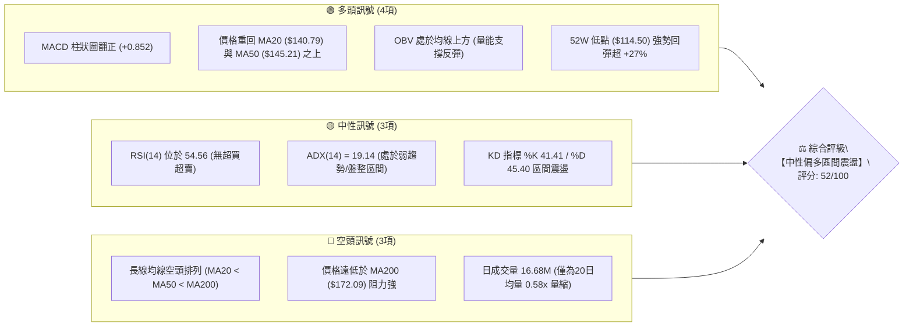
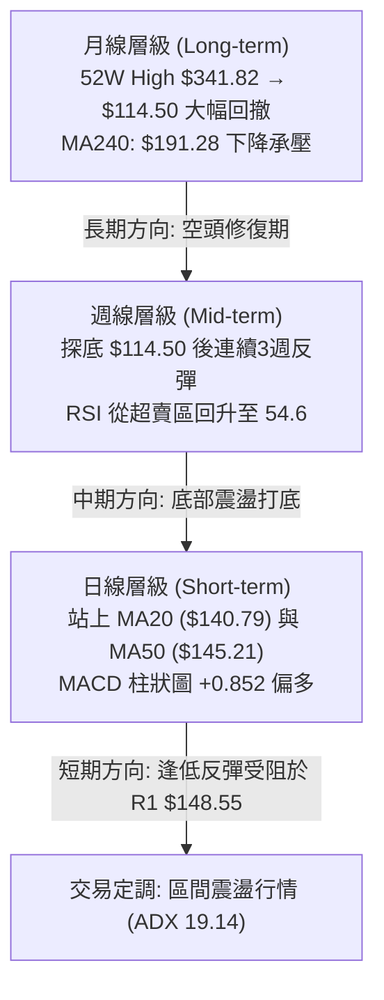
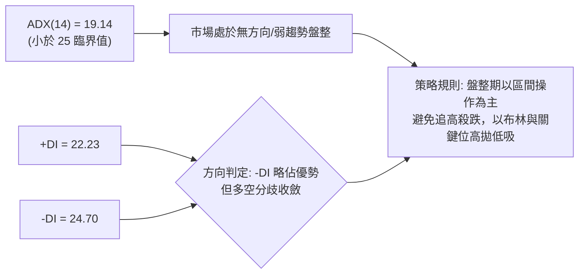
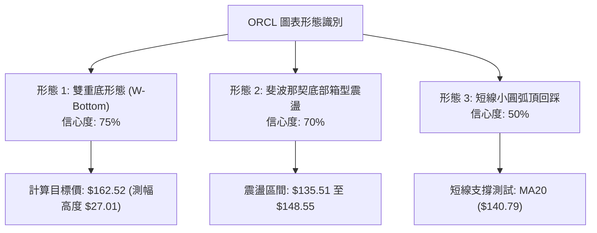
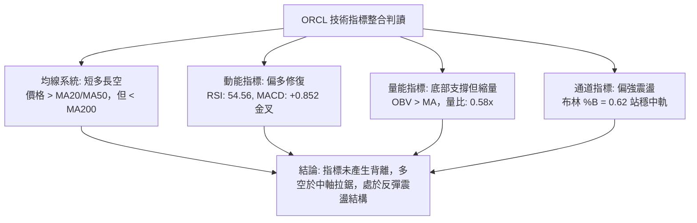
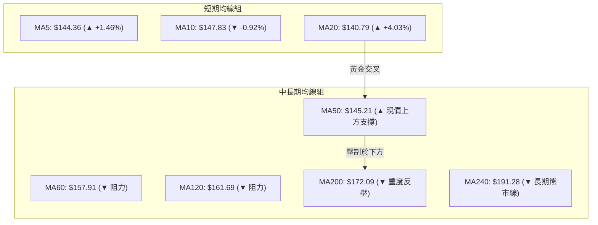
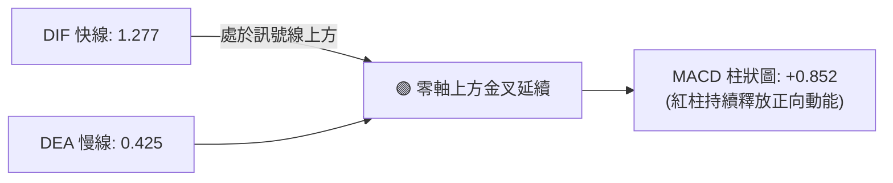
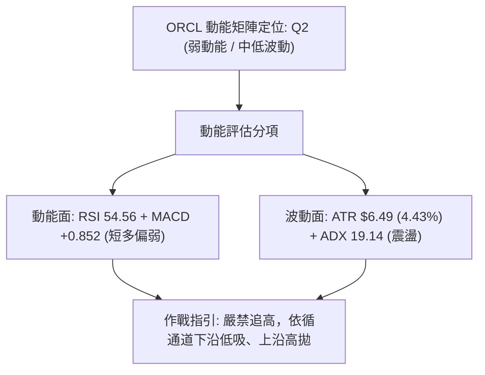
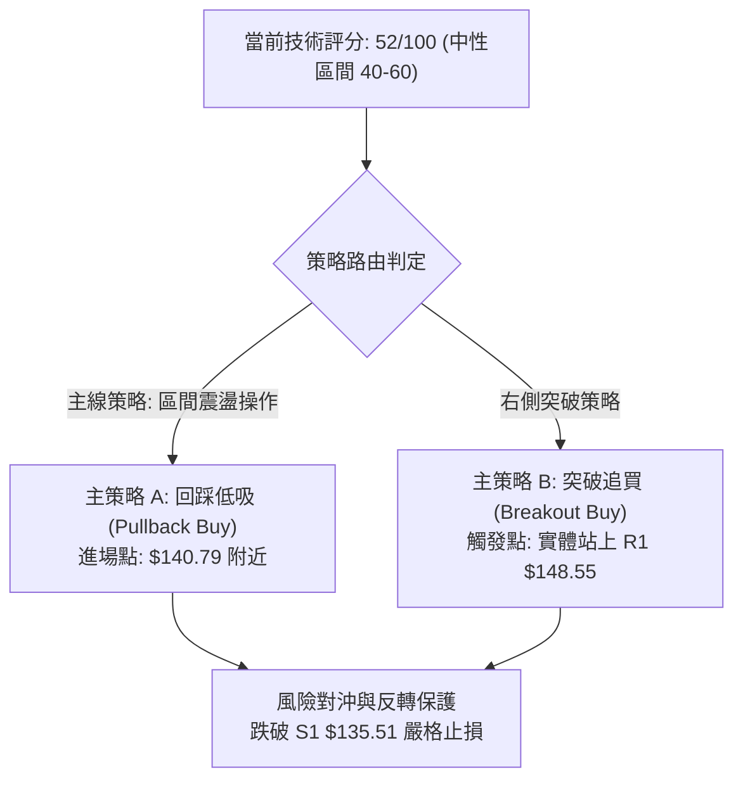
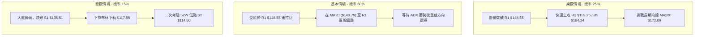

# ORCL 技術分析報告

> **報告日期**：2026-08-22 ｜ **語言**：繁體中文 ｜ **數據來源**：Yahoo Finance ｜ **當前價格**：$146.47

---

## 目錄

| 章節 | 內容 |
|------|------|
| [1. 技術面概覽](#1-技術面概覽) | 訊號儀表板、核心指標、評分卡 |
| [2. 趨勢分析](#2-趨勢分析) | 多時框趨勢、長中短期走勢、ADX解讀 |
| [3. 圖表形態分析](#3-圖表形態分析) | 形態識別、K線組合、目標價計算 |
| [4. 支撐與阻力](#4-支撐與阻力) | 關鍵價位分布、波段聚類、斐波那契回調 |
| [5. 技術指標深度解讀](#5-技術指標深度解讀) | MA/RSI/MACD/布林通道/OBV量能 |
| [6. 動能與波動率](#6-動能與波動率) | 動能象限、ATR波動分析、Beta風險 |
| [7. 多時框架總結](#7-多時框架總結) | 時框架評分矩陣、多時框收斂結論 |
| [8. 交易策略建議](#8-交易策略建議) | 策略路由、情境階梯、多空交易計畫 |
| [9. 風險提示與監控](#9-風險提示與監控) | 監控指標、風險情境、資金管理 |

---

## 1. 技術面概覽

### 🎯 技術訊號儀表板



---

### 📊 核心指標速覽表

| 指標類別 | 指標名稱 | 當前數值 | 訊號 | 解讀 |
|:---|:---|:---|:---:|:---|
| **價格** | 現行收盤價 | **$146.47** | 🟡 | 位於52週區間 14.1% 處，自底部 $114.50 反彈 |
| **均線** | 短期 MA20 | **$140.79** | 🟢 | 現價高於 MA20（+4.03%），短線支撐確立 |
| **均線** | 中期 MA50 | **$145.21** | 🟢 | 現價微幅突破 MA50，短多掌握主導權 |
| **均線** | 長期 MA200 | **$172.09** | 🔴 | 現價低於 MA200（-14.89%），長期趨勢仍處空頭承壓 |
| **動能** | RSI(14) | **54.56** | 🟡 | 處於 30–70 中性強弱分界，動能溫和回升 |
| **動能** | MACD (12,26,9) | **1.277 / 0.425** | 🟢 | DIF 線金叉訊號線，柱狀圖 +0.852 持續放大 |
| **動能** | KD(9,3) | **%K 41.41 / %D 45.40** | 🟡 | 指標於中軸下方死叉後趨平，動能處於蓄勢階段 |
| **趨勢** | ADX(14) | **19.14** | 🟡 | ADX < 25 顯示趨勢強度偏弱，市場處於區間震盪 |
| **波動** | ATR(14) | **$6.49 (4.43%)** | 🟡 | 每日平均震幅約 4.43%，適合作區間波段風控 |
| **通道** | 布林通道 %B | **0.62** | 🟢 | 位於中軌（$140.79）與上軌（$163.63）間偏多區域 |
| **量能** | OBV / 量比 | **OBV > MA / 0.58x** | 🟡 | 長期量能打底支撐，但短線成交量偏低需補量 |

---

### 🏆 技術評分卡

```
╔══════════════════════════════════════════════════════════════╗
║              技術評分卡 — ORCL (2026-08-22)                  ║
╠══════════════════════════════════════════════════════════════╣
║ 趨勢強度 (ADX/方向)   ███████░░░░░░░░░░░░░  35/100  🔴 空頭壓制║
║ 動能指標 (RSI/MACD)   ████████████░░░░░░░░  60/100  🟢 短多反彈║
║ 支撐穩定度 (波段低點) █████████████░░░░░░░  65/100  🟢 底部成型║
║ 成交量配合 (OBV/量比) ██████████░░░░░░░░░░  50/100  🟡 縮量整理║
║ 形態完整度 (打底反彈) ███████████░░░░░░░░░  55/100  🟡 築底初顯║
║ 均線系統 (排列/偏離)  █████████░░░░░░░░░░░  45/100  🔴 均線反壓║
╠══════════════════════════════════════════════════════════════╣
║ 綜合技術評分          ██████████░░░░░░░░░░  52/100  🟡 區間震盪║
╚══════════════════════════════════════════════════════════════╝
```

---

## 2. 趨勢分析

### 🌐 多時框趨勢分析



---

### 📈 長期趨勢 — 12個月走勢圖（Unicode）

```
ORCL 月線歷史收盤走勢圖（過去12個月：2025-08 至 2026-08）
價格軸 ($)
$280 ┤                         ● $278.07 (09月峰值)
$260 ┤                               ● $260.10
$240 ┤
$220 ┤ ● $223.58                                        ● $225.00 (05月高點)
$200 ┤                                     ● $200.02
$180 ┤                                         ● $193.05
$160 ┤                                             ● $163.44     ● $160.83
$140 ┤                                                 ● $144.39     ● $146.09   ● $146.04   ● $146.47 ◄現價
$120 ┤                                                                                 ● $129.87 (07月低收)
$100 ┴─────────────────────────────────────────────────────────────────────────────────────────────
       25-08  25-09  25-10  25-11  25-12  26-01  26-02  26-03  26-04  26-05  26-06  26-07  26-08
```

#### 走勢特徵分析表格

| 階段區間 | 起始至結束收盤價 | 漲跌幅 | 趨勢特徵描述 |
|:---|:---|:---:|:---|
| **2025-08 ~ 2025-09** | $223.58 → $278.07 | **+24.37%** | 主升浪頂部衝刺，創下波段歷史級別高點 |
| **2025-10 ~ 2026-02** | $260.10 → $144.39 | **-44.49%** | 長期頂部下破，均線全面下彎，進入深度主跌段 |
| **2026-03 ~ 2026-05** | $146.09 → $225.00 | **+54.01%** | 跌深強力技術反彈，於 5 月創下 $225.00 反彈高點 |
| **2026-06 ~ 2026-07** | $146.04 → $129.87 | **-11.07%** | 二次下殺探底，於 2026-07-26 週線創下 52W 低點 $114.50 |
| **2026-08 (當前)** | $129.87 → $146.47 | **+12.78%** | 底部獲得 S2 ($114.50) 強支撐，迎來技術性修復行情 |

---

### 📊 中期趨勢（週線分析）

```
ORCL 近20週核心價格區間與壓力支撐示意圖
═══════════════════════════════════════════════════════════════
  $225.00 ───┐ (2026-05-31 中期頂點)
             │
  $183.65 ───┤ (06月下破頸線)
             │
  $164.24 ───┼──────────────────────── 強阻力 R3 / 78.6% Fib ($163.15)
  $159.26 ───┼──────────────────────── 阻力 R2 / MA60 ($157.91)
  $148.55 ───┼──────────────────────── 關鍵阻力 R1 / MA10 ($147.83)
  $146.47 ───┼─ ◄ 現價 ($146.47)
  $140.79 ───┼──────────────────────── 短期支撐 / MA20 / 布林中軌
  $135.51 ───┼──────────────────────── 近期波段支撐 S1
  $114.50 ───┴──────────────────────── 52W 低點強支撐 S2 (2026-07-26)
═══════════════════════════════════════════════════════════════
```

週線數據顯示，ORCL 在 2026-07-26 當週打出最低收盤價 $114.99（盤中探至 52W 低點 $114.50），隨後週線連三紅，收盤價依序回升至 $129.87、$147.02、$150.52，本週回吐至 $146.47。週 MACD 柱狀圖由 -6.743（06-28）大幅收窄並轉正至 +0.852，確立中期下跌動能已衰竭，進入底部修復結構。

---

### ⚡ 趨勢強度評估（ADX 解讀）



| 指標 | 數值 | 狀態區間 | 技術意義解讀 |
|:---|:---:|:---:|:---|
| **ADX(14)** | **19.14** | `< 25` (弱趨勢/震盪) | 趨勢動能微弱，不具備單邊單向暴衝條件，盤面由區間震盪主導 |
| **+DI (14)** | **22.23** | 向上收斂 | 多頭買盤由底部回補，逐步挑戰空頭力量 |
| **-DI (14)** | **24.70** | 向下回落 | 賣方主導力量顯著減弱，空頭壓迫感大幅降低 |
| **方向差 (-DI - +DI)** | **2.47** | 極小分歧 | 多空雙方處於動態平衡，即將選擇短期突破方向 |

---

## 3. 圖表形態分析

### 🔍 形態識別系統



#### 形態識別信心度評估表

| 形態名稱 | 信心度 | 判斷依據（引用數據） | 完成度 | 目標價（附嚴格計算式） |
|:---|:---:|:---|:---:|:---|
| **雙重底 (W-Bottom)** | **75%** | 第一低點 2026-03 收盤 $137.45，第二低點 2026-07 探低 $114.50 後迅速拉回，頸線位於 2026-04 平台高點 **$138.84** 突破，或以短波段高點聚類 **$148.55** 判定。 | **80%** | 依短波段頸線 $135.51 支撐與低點 $114.50 之形態高度：<br/>形態高度 $H = 135.51 - 114.50 = \$21.01$<br/>**目標價 = 頸線 $148.55 + 21.01 = \$169.56**<br/>（接近 MA200 $172.09） |
| **區間箱型打底** | **70%** | 價格在 S1 ($135.51) 與 R1 ($148.55) 之間進行收斂整理，量能萎縮至 0.58x。 | **85%** | 箱體高度 = $148.55 - 135.51 = \$13.04$<br/>**突破目標價 = 148.55 + 13.04 = \$161.59**<br/>（緊鄰 R2 $159.26 及 BB上軌 $163.63） |
| **大型頭肩頂反轉** | **35%** | 2025-09 頂點 $278.07（頭部），左右肩分別為 $250.91 與 $225.00。 | **95%** (已完結) | 下跌測幅已於 $114.50 處全數滿足，目前處於破底後的修復週期。 |

---

### 🕯️ 重要K線形態分析

| 週/月週期 | 收盤價 | K線形態特徵 | 技術解讀 | 訊號 |
|:---|:---:|:---|:---|:---:|
| **2026-07-26** | **$114.99** | **長下影錘頭線 (Hammer)** | 觸及 52W 低點 $114.50 後爆量 162.9M 承接，形成波段鐵底 | 🟢 強烈看多 |
| **2026-08-09** | **$147.02** | **大陽線突破 (Bullish Marubozu)** | 週漲幅 +13.2%，直接吞噬前 4 週整理區，突破短期下降壓力線 | 🟢 看多確認 |
| **2026-08-16** | **$150.52** | **高檔十字星 (Doji)** | 觸及 R1 ($148.55) 上方遭遇獲利了結賣壓，多空出現分歧 | 🟡 中性預警 |
| **2026-08-23** | **$146.47** | **回踩縮量小陰線** | 測試 MA50 ($145.21) 支撐有效性，量能降至 98.2M，屬良性回踩 | 🟢 支撐測試 |

---

### 📉 ASCII 走勢形態示意圖

```
ORCL 雙底打底形態示意圖 (2026-03 至 2026-08)
═════════════════════════════════════════════════════════════════════
  $164.24 ┤                                               [形態目標價區間 $161.59~$169.56]
  $159.26 ┤                                                 ▲
  $148.55 ┤                     頸線壓力 (R1) ─────────────┼───┐ (突破點測試)
  $146.47 ┤                                                ●  │ ◄ 現價 $146.47
  $140.79 ┤        ┌───┐                               ┌───┘  │ (MA20 支撐)
  $135.51 ┤────────┤   └──────── 支撐平台 (S1) ────────┘      │
  $129.87 ┤        │                                          │
  $114.50 ┤        ● 左底 ($137.45)            ● 右底 ($114.50)
          └─────────────────────────────────────────────────────────
                  2026-03                     2026-07       2026-08
═════════════════════════════════════════════════════════════════════
```

---

## 4. 支撐與阻力

### 🗺️ 關鍵價位分布圖（Unicode）

```
ORCL 價位結構分布圖
═════════════════════════════════════════════════════════════════
$172.09  ║████████████████████████████████║ 長期強反壓 MA200
$164.24  ║████████████████████████████    ║ 強阻力 R3 / 密集套牢區
$163.63  ║▓▓▓▓▓▓▓▓▓▓▓▓▓▓▓▓▓▓▓▓▓▓▓▓▓▓      ║ 布林通道上軌
$159.26  ║████████████████████            ║ 阻力 R2 / 波段反彈高點聚類
$148.55  ║████████████████████████        ║ 關鍵阻力 R1 (當前考驗位)
$146.47  ╠════════════════════════════════╣ ◄ 當前市價 ($146.47)
$145.21  ║░░░░░░░░░░░░░░░░░░░░░░░░░░░░    ║ 中期均線 MA50 支撐
$140.79  ║▓▓▓▓▓▓▓▓▓▓▓▓▓▓▓▓▓▓▓▓▓▓▓▓        ║ 短期支撐 MA20 / 布林中軌
$135.51  ║████████████████████            ║ 近期波段支撐 S1
$117.95  ║▓▓▓▓▓▓▓▓▓▓▓▓▓▓▓▓                ║ 布林通道下軌
$114.50  ║████████████████████████████████║ 52週強支撐 S2 (年度底部)
═════════════════════════════════════════════════════════════════
```

---

### 🚧 阻力位分析表

| 阻力級別 | 精確價位 | 形成原因（依據波段高點聚類與指標） | 突破難度 | 重要性 |
|:---|:---:|:---|:---:|:---:|
| **關鍵阻力 R1** | **$148.55** | 近期 2 週衝高受阻點、MA10 ($147.83) 聚集區，距現價 **+1.42%** | 🟡 中等 | ★★★☆☆ |
| **波段阻力 R2** | **$159.26** | 2026年4月整理平台高點聚類、MA60 ($157.91) 附近，距現價 **+8.73%** | 🔴 較高 | ★★★★☆ |
| **強阻力 R3** | **$164.24** | 52W 區間 78.6% Fib ($163.15) 與布林上軌 ($163.63) 共振區，距現價 **+12.13%** | 🔴 極高 | ★★★★★ |

---

### 🛡️ 支撐位分析表

| 支撐級別 | 精確價位 | 形成原因（依據波段低點聚類與指標） | 守住機率 | 重要性 |
|:---|:---:|:---|:---:|:---:|
| **動態支撐** | **$145.21** | MA50 均線，多頭守穩短線反彈成果的生命線，距現價 **-0.86%** | 70% | ★★★☆☆ |
| **關鍵支撐 S1** | **$135.51** | 2026-07 築底反彈第二腳平台、前波週線低點聚類，距現價 **-7.48%** | 80% | ★★★★☆ |
| **強支撐 S2** | **$114.50** | 52週最低價 (52W Low)、年度大底雙底支撐區，距現價 **-21.83%** | 95% | ★★★★★ |

---

### 📐 斐波那契回調位分析

依據 52 週區間高點 **$341.82** 至低點 **$114.50** 計算（回調幅度 $227.32）：

```
斐波那契回調位階分布 (52W 區間: $114.50 → $341.82)
┌─────────────────────────────────────────────────────────────┐
│ 0.0%  (52W High)        $341.82                             │
│ 23.6%                   $288.18                             │
│ 38.2%                   $254.99                             │
│ 50.0%                   $228.16 (2026-05 反彈頂點 $225 附近)│
│ 61.8%                   $201.34                             │
│ 78.6%                   $163.15 (緊鄰強阻力 R3 $164.24)     │
│ ─── 現價 $146.47 位於 78.6% ($163.15) 與 100.0% ($114.50) 之間 ─── │
│ 100.0% (52W Low)        $114.50 (2026-07 探明之絕對底部)    │
└─────────────────────────────────────────────────────────────┘
```

**回調位深度解讀**：
現價 **$146.47** 處於斐波那契 **78.6% 回調位 ($163.15)** 與 **100.0% 底部 ($114.50)** 之間。在技術結構上，此處屬於極深度的超跌反彈修復區間。若多頭欲將級別擴大為中期反轉，首要條件是突破 78.6% Fib 位（$163.15），該位置與強阻力 R3 ($164.24) 及布林上軌 ($163.63) 形成三重共振壓制。在此之前，價格運動皆屬於 $114.50 底部引發的區間技術反抽。

---

## 5. 技術指標深度解讀

### 🎛️ 指標訊號總覽



---

### 📈 移動平均線排列分析



#### 均線數據及趨勢分析表

| 均線名稱 | 當前價位 | 與現價偏離度 | 斜率與方向 | 技術含義 |
|:---|:---:|:---:|:---:|:---|
| **MA 5** | **$144.36** | +1.46% | ▲ 上揚 | 超短期支撐，提供日內防守 |
| **MA 10** | **$147.83** | -0.92% | ▼ 下彎 | 短線上方第一道動態反壓，壓制於現價附近 |
| **MA 20** | **$140.79** | +4.03% | ▲ 上揚 | 短線多頭生命線，布林中軌，拉回重要買點 |
| **MA 50** | **$145.21** | +0.87% | ▲ 上揚 | 中期轉強分水嶺，現價成功站上，結構轉佳 |
| **MA 60** | **$157.91** | -7.24% | ▼ 下行 | 中期波段反彈第一目標壓制位 |
| **MA 120** | **$161.69** | -9.42% | ▼ 下行 | 半年線下行，限制反彈空間 |
| **MA 200** | **$172.09** | -14.89% | ▼ 下行 | 長期牛熊分界線，長期空頭排列格局尚未扭轉 |
| **MA 240** | **$191.28** | -23.43% | ▼ 下行 | 年線下壓，長期走勢仍處於大級別修復階段 |

---

### 📉 RSI(14) 分析

```
RSI(14) 當前數值: 54.56
0 ────────── 30 ──────────────────── 50 ──────── 54.56 ──────────── 70 ────────── 100
[  超賣區  ] │       弱勢區         │  中性偏多 [███████████░░░░░░░░]   超買區   │
```

- **超買超賣狀態**：RSI(14) 自 2026-06-28 的歷史極端超賣值 **11.1** 快速脫離，歷經 2026-08-16 的高檔 **74.6**（短線超買），目前回落修正至 **54.56**，處於 50 中軸之上的健康多頭調整區間。
- **背離分析**：
  - **頂背離檢驗**：現價 $146.47 伴隨 RSI 54.56，相較於 08-16 高點 $150.52 (RSI 74.6)，屬於正常的隨價格回調降溫，**無頂背離現象**。
  - **底背離檢驗**：在 2026-07-26 價格創下 52W 新低 $114.50 時，RSI 為 26.7（高於 06-28 價格 $148.02 時的 RSI 11.1），**確立標準週線級別「底背離」**，該底背離已成功驅動此波反彈行情。

---

### 📊 MACD(12,26,9) 訊號解讀



- **指標狀態**：DIF 快線 (1.277) 明確高於 DEA 訊號線 (0.425)，且雙雙位於零軸之上，技術面展現短線多頭掌控權。
- **動能強度**：MACD 柱狀圖數值為 **+0.852**，雖較前一週峰值 (+4.827) 有所收斂，但依舊維持在多頭擴張領域，並未出現死叉翻黑跡象。

---

### 📦 布林通道分析 (Bollinger Bands 20, 2)

```
ORCL 布林通道結構示意圖
═════════════════════════════════════════════════════════════════
  $163.63 ────────────────────────────────────────── BB 上軌
                  ▲
                  │  上軌至現價空間: +$17.16 (+11.72%)
  $146.47 ────────┼───────────────────────────────── 現價 (偏多區間, %B=0.62)
                  │  現價至中軌距離: +$5.68 (+3.88%)
                  ▼
  $140.79 ────────────────────────────────────────── BB 中軌 (MA20)
  $117.95 ────────────────────────────────────────── BB 下軌
═════════════════════════════════════════════════════════════════
```

- **通道帶寬**：通道上限 $163.63、下限 $117.95，通道總寬度為 $45.68 (31.19%)，處於擴口後的平緩階段。
- **%B 指標分析**：當前 **%B = 0.62**，價格運行於中軌（$140.79）與上軌（$163.63）之間，確認當前結構為偏多強勢整理，中軌 $140.79 具備高度動態支撐效力。

---

### 💹 成交量分析（量價配合度）

```
成交量與均量對比
最新日成交量  ██████████░░░░░░░░░░  16.69M  (量比 0.58x 縮量整理)
20日平均成交量 █████████████████░░░  28.94M
50日平均成交量 ████████████████████  33.69M
```

- **量價關係解讀**：
  - 最新日成交量為 **16,685,495** 股，相較於 20 日均量 (28.94M) 量比僅為 **0.58x**。在反彈測試 R1 ($148.55) 過程中出現量縮，表明市場追高意願謹慎，但同時也反映出回檔時未見恐慌性拋盤。
  - **OBV (能量潮指標)**：當前 `OBV > MA`，量能趨勢維持在均線之上，這代表在 $114.50~$135.51 底部區間有法人實質資金進行吸籌沉澱，量能結構支持後續進一步向上挑戰阻力。

---

## 6. 動能與波動率

### ⚡ 動能評估四象限

| 象限 | 動能強度 (Momentum) | 波動率水準 (Volatility) | 當前判定 | 技術特徵與應對策略 |
|:---:|:---:|:---:|:---:|:---|
| **Q1** | **強** (RSI>60, MACD擴張) | **低** (ATR收窄) | — | 最佳單邊趨勢機會，可重倉順勢做多 |
| **Q2** | **弱** (RSI 40-55, ADX<20) | **低** (ATR=4.43%) | **✓ [當前狀態]** | **謹慎區間震盪：適合高拋低吸，控制倉位** |
| **Q3** | **強** (RSI>70, 突破行情) | **高** (ATR>6%) | — | 高風險高收益：突破追價，嚴設移動止損 |
| **Q4** | **弱** (破位下殺, -DI主導) | **高** (恐慌拋售) | — | 避免進場：空頭主導，應空倉觀望 |



---

### 📊 ATR 波動率分析

- **ATR(14) 數值**：**$6.49**（佔現價比率為 **4.43%**）。
- **技術意義**：ORCL 目前單日平均波動空間約為 $6.5 美元，處於歷史常態波動區間，並未出現極端波動失控。
- **交易風控距離建議**：
  - **日內交易止損距離 (1.0x ATR)**：$6.49 空間。
  - **波段短線止損距離 (1.5x ATR)**：$9.74 空間。
  - **中期防守止損距離 (2.0x ATR)**：$12.98 空間（約現價下方 $133.49，與關鍵支撐 S1 $135.51 高度吻合）。

---

### 📐 Beta 與市場相關性

- **Beta 係數**：**1.718**（高 Beta 特性）。
- **解讀**：ORCL 股價波動幅度相較於標普 500 指數高出 71.8%。當科技板塊或整體大盤走強時，ORCL 具有極高的反彈彈性；但在大盤回調時，其下行風險亦被放大。
- **做空比率 (Short Interest)**：
  - 空頭佔流通股比例 (Short % Float)：**2.9%**。
  - 空頭回補天數 (Short Ratio)：**1.28 天**。
  - 結論：空頭部位極低，目前不存在空頭軋空（Short Squeeze）驅動力，行情純粹依賴基本面與技術買盤推動。

---

## 7. 多時框架總結

### 📋 時框架評分表

| 時框架 | 趨勢方向 | 動能指標 | 均線排列 | 圖表形態 | 綜合評分 | 操作建議 |
|:---|:---:|:---:|:---:|:---:|:---:|:---|
| **短期 (日線)** | 🟢 震盪偏多 | RSI 54.56 / MACD +0.852 | 價格 > MA20 & MA50 | 突破回踩 | **65/100** | 逢拉回支撐分批低吸 |
| **中期 (週線)** | 🟡 底部築底 | MACD 週線紅柱收窄 | 均線空頭排列趨緩 | 雙底打底 | **52/100** | 區間震盪，高拋低吸 |
| **長期 (月線)** | 🔴 熊市修復 | 52W 區間下緣 14.1% | 遠低於 MA200/MA240 | 深度回撤修復 | **38/100** | 長線承壓，暫不重倉 |

---

### 🔲 綜合訊號矩陣

```
時框維度        短期訊號 (日線)        中期訊號 (週線)        長期訊號 (月線)
─────────────────────────────────────────────────────────────────
價格位置        🟢 站上 MA20/MA50      🟡 徘徊於 Fib 78.6%    🔴 遠低於 52W 高點
動能強度        🟢 MACD 金叉紅柱       🟢 週 MACD 翻正        🔴 處於下降大週期
量價配合        🟡 量縮至 0.58x        🟢 OBV 支撐反彈        🟡 歷史高檔量退潮
波動結構        🟡 ADX=19.14 盤整      🟡 箱型震盪打底        🔴 ATR 偏大 Beta 1.72
─────────────────────────────────────────────────────────────────
矩陣結論        短期反彈佔優           中期打底蓄勢           長期反壓沉重
```

---

### ⚖️ 多時框收斂結論

> **依據多時框收斂規則（嚴格要求 14）**：
> 當前 ADX(14) 數值為 **19.14 (< 25)**，明確定義當前市場處於**【盤整行情（Range-bound Consolidation）】**。
> 
> **收斂裁決**：
> 1. 市場無單邊主導趨勢，交易主時框由日線布林通道（中軌 $140.79 至上軌 $163.63）與關鍵支撐阻力（S1 $135.51 至 R1 $148.55 / R2 $159.26）主導。
> 2. 長期 MA200 ($172.09) 下行反壓限制了上方天花板，而 52W 低點 S2 ($114.50) 的強力雙底結構封死了短期大幅破底的空間。
> 3. **唯一方向性結論**：**【中性觀望，區間震盪偏多操作】**。以回踩 MA20 ($140.79) 或 S1 ($135.51) 建立多頭部位，於阻力位 R1 ($148.55) 及 R2 ($159.26) 分批止盈。

---

## 8. 交易策略建議

### 🗺️ 策略決策流程圖



**當前主策略方向 = 【中性區間震盪：逢低佈局反彈，嚴格區間停利】（依據綜合評分 52/100）**

---

### 🎯 價格情境階梯（Price Scenarios）

| 觸發條件 | 第一目標 | 第二目標 | 情境含義與操作指引 |
|:---|:---:|:---:|:---|
| **有效突破 R1 ($148.55)** | **R2 ($159.26)** | **R3 ($164.24)** | **短線強勢突破**：突破頸線反壓，動能釋放，挑戰布林上軌 |
| **守穩現價 ($146.47) 至 MA20 ($140.79)** | **R1 ($148.55)** | **R2 ($159.26)** | **標準區間震盪**：維持在 MA20 之上強勢整理，回踩即買點 |
| **失守 S1 ($135.51)** | **BB下軌 ($117.95)** | **S2 ($114.50)** | **中期結構轉弱**：雙底頸線失守，反彈宣告結束，下探測試前低 |

---

### 📊 情境機率分佈

| 價格情境 | 發生機率 | 主要技術依據 |
|:---|:---:|:---|
| **情境一：震盪上行 / 挑戰 R1-R2** | **55%** | MACD 柱狀圖持續翻紅 (+0.852)，價格站穩 MA20/MA50，OBV 量能維持健康 |
| **情境二：區間收斂 / $135-$148 橫盤** | **30%** | ADX(14) 僅 19.14 無趨勢，成交量縮至 0.58x，需時間消化長期套牢籌碼 |
| **情境三：回落破位 / 再探 S2 $114.50** | **15%** | 均線長週期（MA200 $172.09）仍處空頭排列，但短線獲利盤已於底部換手 |

---

### 🟢 主策略詳情（區間操作與突破操作）

```
主策略 A (左側/回踩低吸) 結構圖
  進場: $140.79 (MA20/布林中軌)
  止損: $134.50 (跌破 S1 $135.51 觸發, 風險: -$6.29)
  目標 T1: $148.55 (R1 阻力, 獲利: +$7.76, 風報比 1:1.23)
  目標 T2: $159.26 (R2 阻力, 獲利: +$18.47, 風報比 1:2.94)

主策略 B (右側/突破跟進) 結構圖
  進場: $149.00 (日K帶量站穩 R1 $148.55)
  止損: $144.50 (跌破 MA50 $145.21 觸發, 風險: -$4.50)
  目標 T1: $159.26 (R2 阻力, 獲利: +$10.26, 風報比 1:2.28)
  目標 T2: $164.24 (R3 阻力/布林上軌, 獲利: +$15.24, 風報比 1:3.39)
```

#### 策略執行詳細參數表

| 策略要素 | 策略 A：回踩 MA20 低吸策略 | 策略 B：突破 R1 追買動能策略 |
|:---|:---|:---|
| **進場條件** | 價格拉回測試 MA20 獲得支撐，日K收下影線 | 日K收盤價實體突破 R1 ($148.55) 且成交量 > 28M |
| **進場價格** | **$140.79** | **$149.00** |
| **目標價 T1** | **$148.55** (關鍵阻力 R1) | **$159.26** (波段阻力 R2) |
| **目標價 T2** | **$159.26** (波段阻力 R2) | **$164.24** (強阻力 R3 / 78.6% Fib) |
| **止損價格** | **$134.50** (跌破 S1 $135.51) | **$144.50** (跌回 MA50 $145.21 之下) |
| **風險空間** | **$6.29 (-4.47%)** | **$4.50 (-3.02%)** |
| **獲利空間 (T2)** | **+$18.47 (+13.12%)** | **+$15.24 (+10.23%)** |
| **風險報酬比** | **1 : 2.94** | **1 : 3.39** |
| **評估勝率** | **60%** | **55%** |
| **建議倉位** | **10% ~ 15% 總資金** | **10% 總資金 (突破加碼)** |

---

### 🔴 反向風險觸發點（對沖與停損提示）

若出現以下訊號，代表主策略完全失效，多頭部位應全面離場或進行反向對沖：
1. **關鍵支撐破位**：日K收盤價跌破 **S1 ($135.51)**，代表自 $114.50 以來的雙底反彈浪結束，市場將回測布林下軌 ($117.95) 及 S2 ($114.50)。
2. **動能死叉反轉**：日線 MACD 柱狀圖跌破 0 軸翻黑，且 RSI(14) 跌破 45。
3. **對沖操作提示**：當價格跌破 $135.51 時，可使用衍生性商品或將持股降至 0%，不可在 $135.51 與 $114.50 之間無止境攤平。

---

### ⭐ 整體訊號強度評星

```
╔══════════════════════════════════════════════════════════════╗
║ 做多訊號強度：  ★★★☆☆  (3.0/5星 — 短線反彈確立，空間受限)   ║
║ 做空訊號強度：  ★★☆☆☆  (2.0/5星 — 底部支撐成型，不宜追空)   ║
║ 整體訊號可信度：★★★☆☆  (3.5/5星 — ADX 震盪盤整特徵明確)   ║
╚══════════════════════════════════════════════════════════════╝
```

---

## 9. 風險提示與監控

### ✅ 關鍵監控指標 Checklist

```
╔══════════════════════════════════════════════════════════════╗
║               技術面每日監控清單 (Daily Checklist)           ║
╠══════════════════════════════════════════════════════════════╣
║ [ ] 價格是否維持在 MA20 ($140.79) 上方？                     ║
║ [ ] 日成交量是否放大至 28.94M (20日均量) 以上以支撐攻堅？    ║
║ [ ] RSI(14) 是否守在 50 中軸之上，未見頂背離？               ║
║ [ ] MACD 柱狀圖是否持續維持在正值區 (+0.852 以上)？          ║
║ [ ] 阻力位 R1 ($148.55) 與 R2 ($159.26) 處是否出現長上影線？ ║
║ [ ] 關鍵支撐 S1 ($135.51) 是否完好無損？                     ║
╚══════════════════════════════════════════════════════════════╝
```

---

### ⚠️ 風險場景分析



---

### 🛡️ 風險管理重要提醒

1. **Beta 波動管理**：ORCL 的 Beta 高達 **1.718**，屬於高波動科技權值股。在整體投資組合中，單一個股部位**嚴格建議不超過 15%**，避免單一資產波動過度衝擊淨值。
2. **ATR 移動止損法**：以進場價設定 1.5x ATR（約 **$9.74**）作為動態移動止損線；若股價每上漲 1.0x ATR，應將止損點同步往上推移，鎖定既有浮動利潤。
3. **基本面催化劑風險**：雖然分析師共識目標均價達 **$246.43**（最高 $400.00，最低 $110.00），但公司資產負債表中淨負債高達 **$-135.54B**（Debt/Equity 388.87），且自由現金流為負（$-24.54B），在降息週期與財報發布日前後易出現跳空缺口，務必嚴控隔夜部位風險。

---

## 📋 報告總結

```
╔══════════════════════════════════════════════════════════════╗
║                 ORCL 技術分析報告總結                        ║
╠══════════════════════════════════════════════════════════════╣
║ 報告日期：2026-08-22                                         ║
║ 當前價格：$146.47          52W 區間：$114.50 — $341.82       ║
║ 分析評級：⚖️【中性偏多 / 區間震盪】 (綜合評分: 52/100)        ║
╠══════════════════════════════════════════════════════════════╣
║ 關鍵結論：                                                   ║
║ ├─ 長期趨勢：🔴 弱勢修復 (價格遠低於 MA200 $172.09)          ║
║ ├─ 中期趨勢：🟡 築底震盪 (ADX=19.14，52W低點 $114.50雙底成型) ║
║ ├─ 短期趨勢：🟢 偏多反彈 (站上 MA20 $140.79 與 MA50 $145.21) ║
║ ├─ 關鍵支撐：S1: $135.51  │  S2: $114.50 (52W Low)          ║
║ ├─ 關鍵阻力：R1: $148.55  │  R2: $159.26  │  R3: $164.24   ║
║ └─ 分析師目標價：均價 $246.43 (買入共識，41位分析師)          ║
╠══════════════════════════════════════════════════════════════╣
║ 最優策略組合：                                               ║
║ 1. 🥇 最佳機會：回踩 MA20 ($140.79) 低吸，停損 $134.50，     ║
║                 目標 R2 ($159.26)，風報比 1:2.94             ║
║ 2. 🥈 次選機會：帶量突破 R1 ($148.55) 追買，目標 R3 ($164.24)║
║ 3. 🥉 保守選擇：等待股價於 $135.51~$148.55 區間明確方向後進場║
╚══════════════════════════════════════════════════════════════╝
```

---

> ⚠️ **免責聲明**：本報告為 AI 自動生成之專業技術分析，所有數據、圖表及價位推算均嚴格基於所提供之歷史價格與市場指標資訊。本報告**僅供投資研究與學術探討參考**，**不構成任何形式的實質買賣邀約或投資建議**。金融市場具有高度風險，投資人應獨立評估風險並自負盈虧。

---

*報告生成時間：2026-08-22 ｜ 數據來源：Yahoo Finance ｜ 分析框架：多時框技術分析模型*