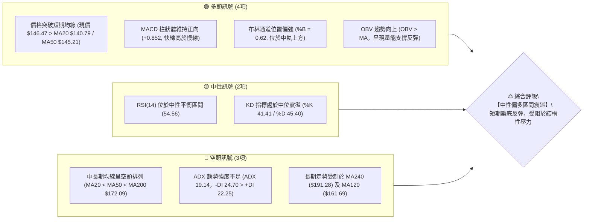
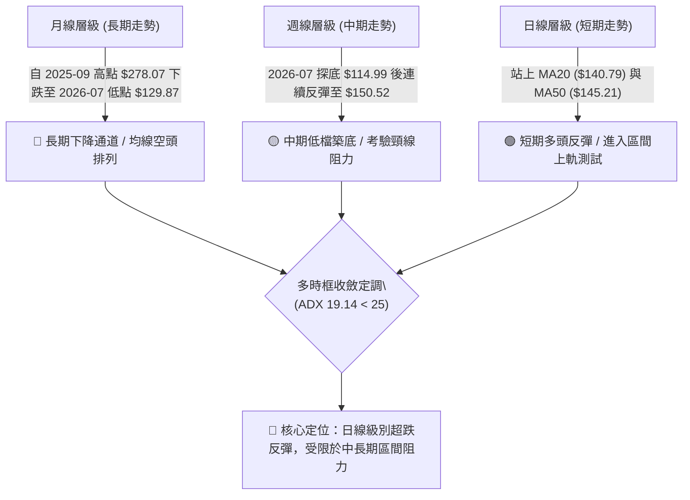
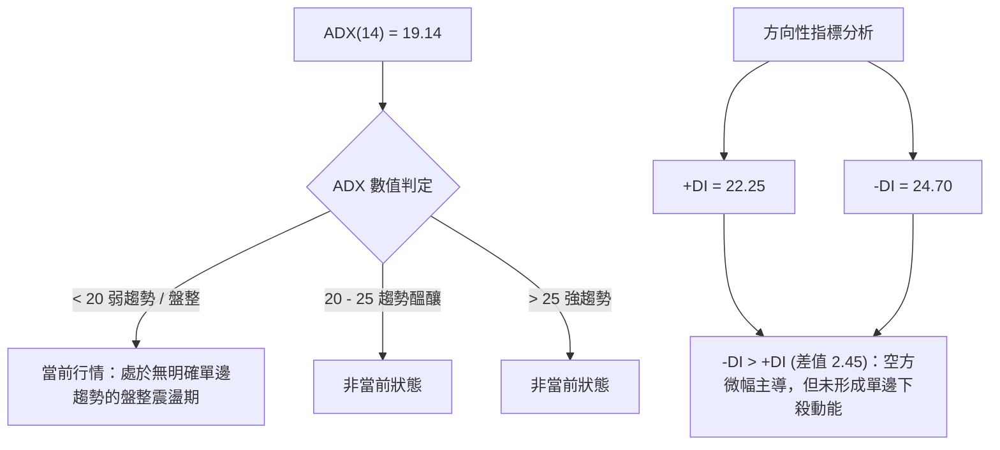
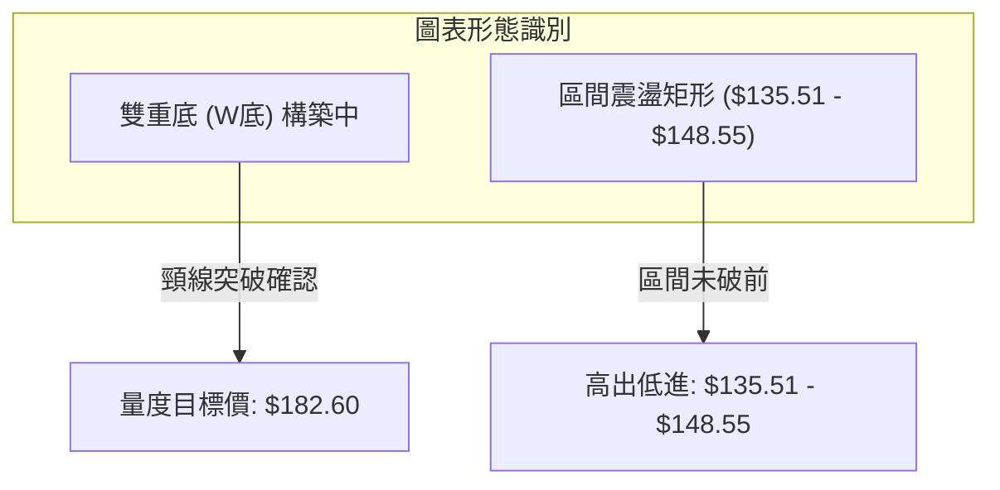
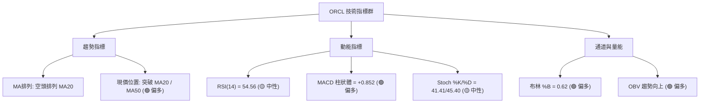
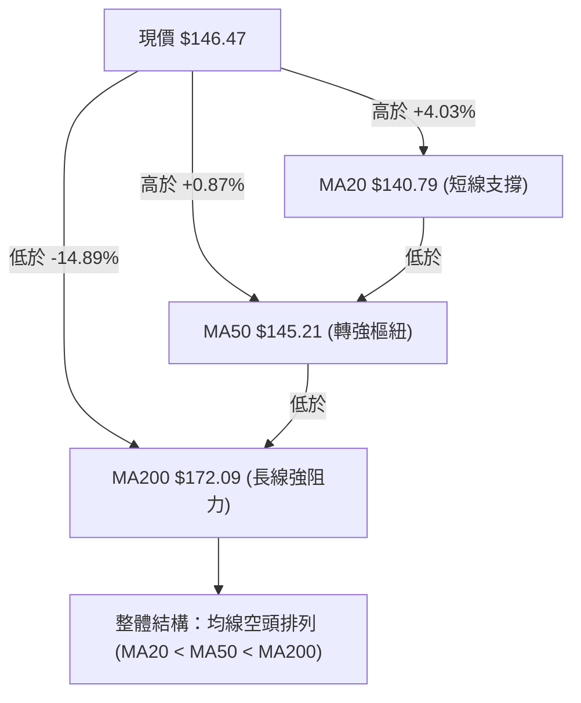
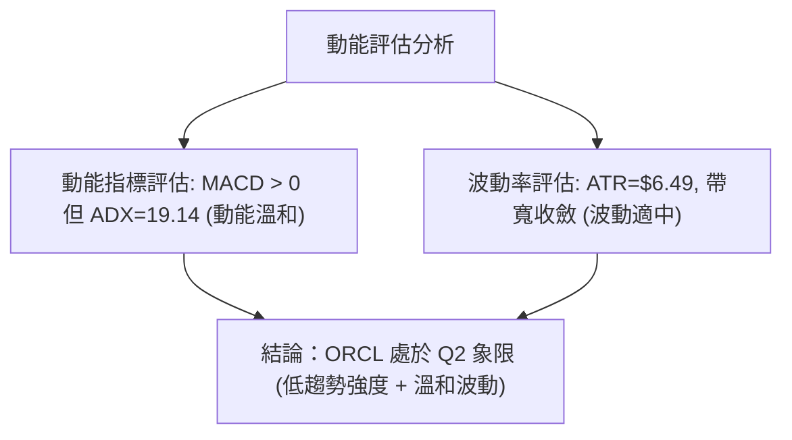
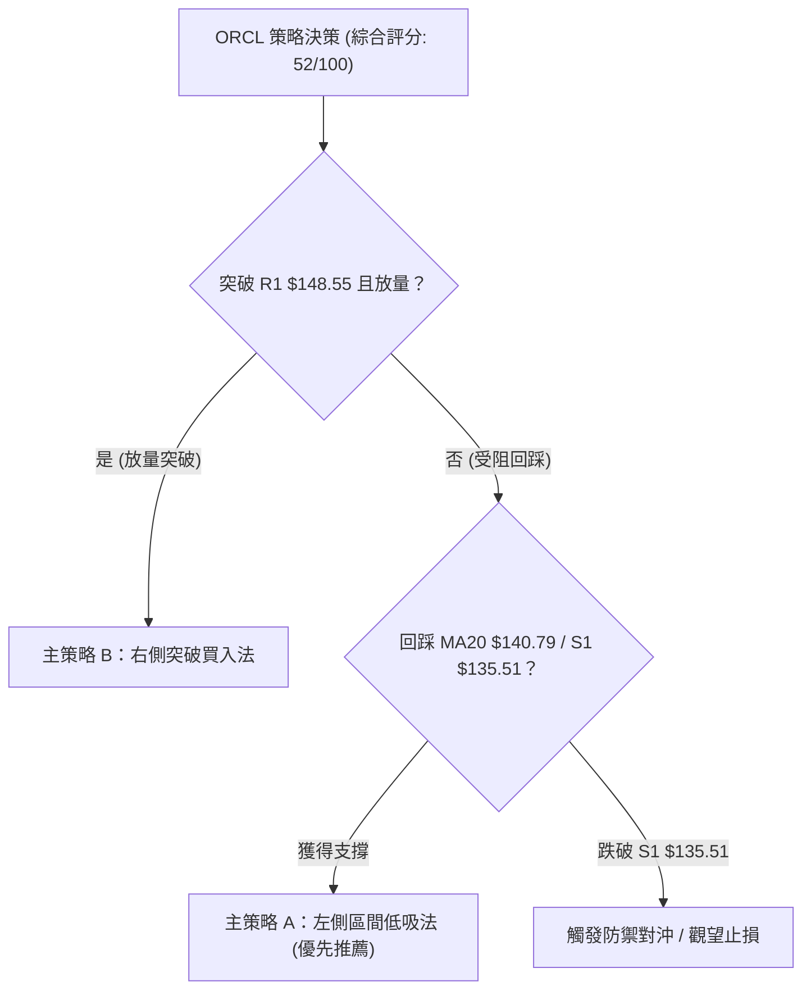
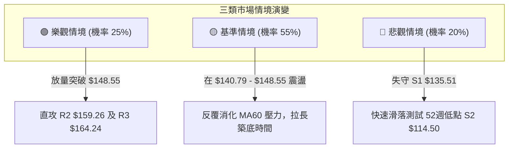

# ORCL 技術分析報告

> **報告日期**：2026-08-23 ｜ **語言**：繁體中文 ｜ **數據來源**：Yahoo Finance ｜ **當前價格**：$146.47

---

## 目錄

| 章節 | 內容 |
|------|------|
| [1. 技術面概覽](#1-技術面概覽) | 訊號儀表板、核心指標、評分卡 |
| [2. 趨勢分析](#2-趨勢分析) | 多時框趨勢、長中短期走勢、12個月月線圖 |
| [3. 圖表形態分析](#3-圖表形態分析) | 形態識別、K線組合、目標價推算 |
| [4. 支撐與阻力](#4-支撐與阻力) | 關鍵價位、斐波那契回調結構 |
| [5. 技術指標深度解讀](#5-技術指標深度解讀) | MA/RSI/MACD/布林通道/成交量與OBV |
| [6. 動能與波動率](#6-動能與波動率) | 動能四象限、ATR波動率、Beta風險 |
| [7. 多時框架總結](#7-多時框架總結) | 時框架評分矩陣、多時框收斂定調 |
| [8. 交易策略建議](#8-交易策略建議) | 策略決策路由、區間操作、風報比精算 |
| [9. 風險提示與監控](#9-風險提示與監控) | 關鍵監控清單、情境模擬與風控防線 |
| [10. 報告總結](#-報告總結) | 總結儀表板與核心執行建議 |

---

## 1. 技術面概覽

### 🎯 技術訊號儀表板



### 📊 核心指標速覽表

| 指標類別 | 指標名稱 | 當前數值 | 訊號 | 解讀 |
|----------|----------|----------|------|------|
| **價格** | 當前價格 | $146.47 | 🟡 | 位於52週區間 14.1% 處，處於低檔反彈修復階段 |
| **均線** | MA20 | $140.79 | 🟢 | 價格在MA20上方 +4.03%，短線提供動態支撐 |
| **均線** | MA50 | $145.21 | 🟢 | 價格成功收復MA50（+0.87%），短中期轉強 |
| **均線** | MA200 | $172.09 | 🔴 | 價格在MA200下方 -14.89%，中長期空頭架構尚未扭轉 |
| **動能** | RSI(14) | 54.56 | 🟡 | 處於50中軸上方，多空勢均力敵，無超買超賣 |
| **動能** | MACD (12,26,9) | 1.277 / 0.425 / +0.852 | 🟢 | DIF在訊號線上方，柱狀體維持紅柱看多擴張 |
| **動能** | Stoch %K / %D | 41.41 / 45.40 | 🟡 | 位於中性整理區，未進入極端區域 |
| **趨勢** | ADX(14) | 19.14 (-DI: 24.70, +DI: 22.25) | 🔴 | ADX<25 顯示市場為盤整/弱趨勢，空方力量微幅佔優 |
| **通道** | 布林通道 (%B) | 0.62 (上軌 $163.63 / 下軌 $117.95) | 🟢 | 價格自中軌 ($140.79) 向上軌發起推進 |
| **量能** | 成交量 / 20日均量 | 19.57M / 29.08M (量比 0.67x) | 🟡 | 反彈量能稍顯不足，需補量方能突破上方阻力 |
| **波動** | ATR(14) | $6.49 (4.43%) | 🟡 | 日內波幅約 $6.49，短線波動維持適中水平 |

### 🏆 技術評分卡

```
╔══════════════════════════════════════════════════════════════════╗
║              技術評分卡 — ORCL (2026-08-23)                      ║
╠══════════════════════════════════════════════════════════════════╣
║ 趨勢強度 (ADX/方向)   ████████░░░░░░░░░░░░  38/100  🔴 弱勢盤整  ║
║ 動能指標 (RSI/MACD)   █████████████░░░░░░░  65/100  🟢 短線偏多  ║
║ 支撐穩定度 (S1/S2)    ██████████████░░░░░░  70/100  🟢 底部明確  ║
║ 成交量配合 (OBV/量比) ██████████░░░░░░░░░░  50/100  🟡 縮量反彈  ║
║ 形態完整度 (築底結構) ████████████░░░░░░░░  60/100  🟡 雙底構築  ║
║ 均線排列 (多空結構)   ████████░░░░░░░░░░░░  40/100  🔴 長期空頭  ║
╠══════════════════════════════════════════════════════════════════╣
║ 綜合評分              ██████████░░░░░░░░░░  52/100  ⚖️ 區間震盪  ║
╚══════════════════════════════════════════════════════════════════╝
```

---

## 2. 趨勢分析

### 🌐 多時框趨勢分析



### 📈 長期趨勢 — 12個月走勢圖（Unicode）

```
ORCL 月線走勢圖（2025-08 至 2026-08）
價格軸 ($)
$280 ┤                ● (2025-09 $278.07 歷史高點)
$260 ┤                    ● (2025-10 $260.10)
$240 ┤
$220 ┤    ● (2025-08 $223.58)                               ● (2026-05 $225.00)
$200 ┤                        ● (2025-11 $200.02)
$180 ┤                            ● (2025-12 $193.05)
$160 ┤                                ● (2026-01 $163.44)       ● (2026-04 $160.83)
$140 ┤                                    ● (2026-02 $144.39)       ● (2026-06 $146.04)  ●←現價 $146.47
$120 ┤                                        ● (2026-03 $146.09)       ● (2026-07 $129.87)
     └────────────────────────────────────────────────────────────────────────────
        08   09   10   11   12   01   02   03   04   05   06   07   08  (月份)
```

**走勢特徵分析表格**：

| 階段 | 期間 | 起訖價格區間 | 區間漲跌幅 | 走勢特徵與量價解讀 |
|------|------|--------------|------------|-------------------|
| **頭部構築** | 2025-08 ~ 2025-10 | $223.58 → $278.07 → $260.10 | +16.33% (衝頂後回落) | 9月創下波段高點 $278.07 後出現高檔出貨長上影 |
| **主跌浪** | 2025-11 ~ 2026-02 | $200.02 → $144.39 | -27.81% | 均線跌破，空頭快速宣洩，失守 $160 關卡 |
| **誘多反彈** | 2026-03 ~ 2026-05 | $146.09 → $225.00 | +54.01% | 5月爆發性反彈至 $225.00，隨後形成假突破 |
| **二次探底** | 2026-06 ~ 2026-07 | $146.04 → $129.87 (低見 $114.50) | -49.11% (自高點計) | 崩跌測試52週低點 $114.50，7月收於 $129.87 |
| **築底修復** | 2026-08 (當前) | $129.87 → $146.47 | +12.78% | 站回 MA20/MA50，進入低位收斂盤整區 |

### 📊 中期趨勢（週線分析）

```
ORCL 近期週線壓力與支撐示意圖
$172.09 ───────────────────────────────────── [MA200 / 中期強阻力]
$164.24 ───────────────────────────────────── [波段阻力 R3]
$159.26 ───────────────────────────────────── [波段阻力 R2 / MA60 $157.91]
$148.55 ───────────────────────────────────── [波段阻力 R1 / 近期週線高點]
$146.47 ═════════════════════════════════════ ◄ 當前價格
$140.79 ┄┄┄┄┄┄┄┄┄┄┄┄┄┄┄┄┄┄┄┄┄┄┄┄┄┄┄┄┄┄┄┄┄┄┄ [MA20 / 中軌動態支撐]
$135.51 ───────────────────────────────────── [波段支撐 S1]
$114.50 ───────────────────────────────────── [52週低點強支撐 S2]
```

### ⚡ 趨勢強度評估（ADX 解讀）



| ADX 區間 | 趨勢強度解讀 | 當前狀態 | 操作意涵 |
|----------|--------------|----------|----------|
| **0 - 20** | **極弱趨勢 / 區間震盪** | **✓ (19.14)** | **嚴禁順勢追價，應採取區間邊界高拋低吸策略** |
| 20 - 25 | 弱趨勢 / 轉折醞釀 | - | 觀察突破方向與動能配合 |
| 25 - 40 | 強趨勢形成 | - | 順勢交易為主 |
| 40 - 60 | 極強趨勢 / 單邊行情 | - | 緊盯均線持股，嚴格移動止盈 |

---

## 3. 圖表形態分析

### 🔍 形態識別系統



**形態信心度與目標價評估表**：

| 形態名稱 | 信心度 | 判斷依據（引用數據） | 完成度 | 目標價（附計算式） |
|----------|--------|----------------------|--------|--------------------|
| **潛在雙重底 (W底)** | 68% | 第一低點 2026-03 收盤 $137.45（及52W低點 $114.50），第二低點 2026-07 收盤 $129.87，兩次低點均在 $114.50-$135.51 支撐區獲得買盤承接。 | 75% | 頸線阻力取波段阻力 R1 $148.55，形態高度 = $148.55 - S1 $114.50 = $34.05。<br>突破目標價 = $148.55 + $34.05 = **$182.60**（接近 MA240 $191.28 與前高壓力區）。 |
| **短期箱型整理** | 80% | 價格在 S1 $135.51 與 R1 $148.55 之間窄幅震盪，日線 MA20 ($140.79) 穿過箱體中央。 | 85% | 箱頂 $148.55，箱底 $135.51。若向上突破，短線量度目標 = $148.55 + ($148.55 - $135.51) = **$161.59**（接近 MA120 $161.69）。 |

### 🕯️ 重要K線形態分析

| 期間 | 收盤價 | K線形態 | 解讀 | 訊號 |
|------|--------|---------|------|------|
| **2026-07-26 週** | $114.99 | 探底長下影十字線 | 測試52週低點 $114.50 後迅速收復，空頭動能竭盡 | 🟢 強烈看多轉折 |
| **2026-08-09 週** | $147.02 | 帶量突破大陽線 | 週成交量達 162.89M，單週大漲 13.2%，收復 MA20/MA50 | 🟢 轉強確認 |
| **2026-08-16 週** | $150.52 | 高檔衝高回落流星線 | 上攻遇阻於波段阻力 R1 ($148.55) 上方，留下短上影 | 🟡 阻力消化 |
| **2026-08-23 週** | $146.47 | 窄幅整理小陰線 | 週成交量縮至 101.13M，在 MA50 ($145.21) 之上健康回洗 | 🟡 蓄勢待發 |

### 📉 ASCII 走勢形態示意圖

```
ORCL 底部形態示意（W底與箱體震盪）
價格
$161.59 ┤                                                [箱體突破目標]
$148.55 ┼───────[ 頸線 / 阻力 R1 ]───────● (衝高點 $150.52)
        │                              ╱  ╲
$146.47 ┤                             ●    ● (現價)
$140.79 ┼───────────[ MA20 中軌 ]────────────
        │        ╲                 ╱
$135.51 ┼─────────● (波段支撐 S1)──
        │          ╲             ╱
$114.50 ┴───────────●───────────┴───────────── [52W 低點強支撐 S2]
                   (第1底 07-26)   (反彈蓄勢中)
```

---

## 4. 支撐與阻力

### 🗺️ 關鍵價位分布圖（Unicode）

```
ORCL 價位結構分布圖
═════════════════════════════════════════════════════════════════
$172.09 ║██████████████████████████████║ 長期生命線 MA200
$164.24 ║████████████████████████      ║ 波段強阻力 R3 (斐波那契 78.6% $163.15)
$159.26 ║████████████████████          ║ 波段阻力 R2 (MA60 $157.91 匯聚)
$148.55 ║████████████████              ║ 關鍵頸線阻力 R1
$146.47 ╠══════════════════════════════╣ ◄ 現價 ($146.47)
$145.21 ║▓▓▓▓▓▓▓▓▓▓▓▓▓▓                ║ 動態支撐 (MA50)
$140.79 ║▓▓▓▓▓▓▓▓▓▓▓▓▓▓▓▓▓▓            ║ 短線核心防守 (MA20 / 布林中軌)
$135.51 ║▓▓▓▓▓▓▓▓▓▓▓▓▓▓▓▓▓▓▓▓▓▓        ║ 波段強支撐 S1
$114.50 ║██████████████████████████████║ 52週歷史低點強支撐 S2 (斐波那契 100%)
═════════════════════════════════════════════════════════════════
```

### 🚧 阻力位分析表

| 阻力級別 | 價位 | 形成原因 | 突破難度 | 重要性 |
|----------|------|----------|----------|--------|
| **R1** | **$148.55** | 近一年波段高點聚類、前週高點壓力 ($150.52 回落點) | 中等 | ⭐⭐⭐⭐ 近期多空分水嶺 |
| **R2** | **$159.26** | 波段高點聚類、MA60 ($157.91) 下行反壓區 | 較高 | ⭐⭐⭐ 中期反彈第二目標 |
| **R3** | **$164.24** | 近一年波段密集高點、布林上軌 ($163.63)、斐波那契 78.6% ($163.15) | 極高 | ⭐⭐⭐⭐⭐ 強結構性反壓區 |
| **MA200** | **$172.09** | 200日牛熊分界線，長期機構成本防線 | 極高 | ⭐⭐⭐⭐⭐ 多頭反轉確認點 |

### 🛡️ 支撐位分析表

| 支撐級別 | 價位 | 形成原因 | 守住機率 | 重要性 |
|----------|------|----------|----------|--------|
| **MA50** | **$145.21** | 50日移動平均線，短期多頭排列基石 | 65% | ⭐⭐⭐ 短線多空強弱線 |
| **MA20** | **$140.79** | 20日均線與布林帶中軌重合位 | 75% | ⭐⭐⭐⭐ 短線防守核心 |
| **S1** | **$135.51** | 近一年波段低點聚類、箱體底部 | 85% | ⭐⭐⭐⭐⭐ 波段防守生命線 |
| **S2** | **$114.50** | 52週最低點、斐波那契 100.0% 終極支撐 | 95% | ⭐⭐⭐⭐⭐ 結構性絕對底部 |

### 📐 斐波那契回調位分析

*以 52 週區間波段低點 $114.50 至 52 週高點 $341.82 進行黃金分割測算：*

| 回調比例 | 關鍵價位 | 技術意涵與位置解讀 |
|----------|----------|-------------------|
| **0.0%** | **$341.82** | 52週歷史高點（2025年高點延伸） |
| **23.6%** | **$288.18** | 極強阻力區 |
| **38.2%** | **$254.99** | 中期牛市防守位 |
| **50.0%** | **$228.16** | 多空平衡中樞 (2026-05 反彈高點 $225.00 附近) |
| **61.8%** | **$201.34** | 黃金分割阻力位 |
| **78.6%** | **$163.15** | 重要阻力帶，與 R3 $164.24 及布林上軌 $163.63 重疊 |
| **100.0%** | **$114.50** | 52週最低點（2026-07 探底低點） |

> **當前位置解讀**：現價 **$146.47** 處於 78.6% 回調位 ($163.15) 與 100.0% 回調位 ($114.50) 之間的深次回檔低檔區間。該區域屬於超跌修復帶，上方第一道斐波那契強阻力即在 **$163.15**。

---

## 5. 技術指標深度解讀

### 🎛️ 指標訊號總覽



### 📈 移動平均線排列分析



| 均線名稱 | 數值 | 偏離率 | 狀態 | 趨勢解讀 |
|----------|------|--------|------|----------|
| **MA 5** | $144.36 | +1.46% | 向上 ▲ | 短線極短期動能維持向上推升 |
| **MA 10** | $147.83 | -0.92% | 向下 ▼ | 壓制現價，形成短線第一道換手壓力 |
| **MA 20** | $140.79 | +4.03% | 向上 ▲ | 走平翻揚，提供回踩第一道多頭防線 |
| **MA 50** | $145.21 | +0.87% | 走平 ▲ | 現價微幅站上，具備築底支撐意義 |
| **MA 60** | $157.91 | -7.24% | 向下 ▼ | 與阻力 R2 ($159.26) 構成中期均線下壓壓力帶 |
| **MA 120** | $161.69 | -9.42% | 向下 ▼ | 中長期均線持續向下發散 |
| **MA 200** | $172.09 | -14.89% | 向下 ▼ | 長期牛熊分界線，未收復前維持長線空頭定義 |
| **MA 240** | $191.28 | -23.43% | 向下 ▼ | 超長期均線沉重下壓 |

### 📉 RSI(14) 分析

```
RSI(14) 當前數值：54.56
0 ────────── 30 ──────────────── 50 ────── 54.56 ──────── 70 ────────── 100
[   超賣區   ] [     弱勢區     ]      ▲  [    強勢區    ] [   超買區   ]
                                    現值
進度條：█████████████░░░░░░░░░░░ (54.56%)
```

- **區間評估**：RSI 位於 54.56，從 7 月下旬超賣區（2026-06-28 達 11.1、2026-07-12 達 12.5）大幅修復至 50 中軸之上，顯示空頭下殺動能已耗盡，轉為中性溫和偏多格局。
- **背離分析**：**無頂背離或底背離**。在 7 月底價格創 52 週低點 $114.50 時，RSI 自 11.1 回升至 26.7，已於 7 月完成了日線級別的標準底背離修復，當前指數與價格同步運行。

### 📊 MACD (12, 26, 9) 訊號解讀


- **MACD 柱狀走勢**：週線 MACD 柱狀體在 2026-07-26 翻正（+0.033），隨後擴大至 2026-08-09 的 +4.827，最新回落至 +0.852，顯示多頭衝刺動能由強轉穩，進入良性換手整理階段。

### 📦 布林通道分析

```
ORCL 布林通道結構 (20日, 2σ)
$163.63 ┬────────────────────────────────────────── BB 上軌
        │                                          
        │                                          
$146.47 ┼────────────────────● 現價 (%B = 0.62)
        │                                          
$140.79 ┼────────────────────────────────────────── BB 中軌 (MA20)
        │                                          
        │                                          
$117.95 ┴────────────────────────────────────────── BB 下軌
```

- **%B 指標分析**：%B = 0.62，處於中軌 ($140.79) 與上軌 ($163.63) 之間，顯示價格脫離弱勢下軌區，向上軌方向擴展。
- **通道開口**：帶寬自 7 月底極度放大後逐漸收縮，目前價格貼近中軌上方運行，呈現標準的「震盪築底向上突破」形態。

### 💹 成交量分析（量價配合度）

- **量能結構**：最新日成交量為 19.57M，相較 20 日均量 29.08M（量比 0.67x）明顯萎縮，說明上方 R1 ($148.55) 附近存在獲利了結與觀望氣氛。
- **OBV 能量潮**：OBV 趨勢維持於其移動平均線上方，表明自 7 月底 $114.50 低點以來，主力資金處於淨流入吸籌狀態，**量能對價格反彈構成實質支撐**。

---

## 6. 動能與波動率

### ⚡ 動能評估四象限

| 象限 | 動能維度 (Momentum) | 波動維度 (Volatility) | 當前狀態 | 交易環境與策略評估 |
|------|---------------------|-----------------------|----------|-------------------|
| **Q1** | 強動能 (Bullish) | 低波動 (Low Vol) | — | 最佳單邊上漲機會，適合順勢加碼 |
| **Q2** | **弱動能 (Consolidation)** | **中低波動 (Moderate Vol)** | **✓ ORCL 所在位置** | **區間震盪整理，宜採取低吸高拋或等待突破** |
| **Q3** | 強動能 (Volatile Breakout) | 高波動 (High Vol) | — | 突破行情，風險與回報俱高 |
| **Q4** | 弱動能 (Bearish Breakdown) | 高波動 (High Vol) | — | 空頭恐慌宣洩期，應嚴格空倉避險 |



### 📊 ATR 波動率分析

- **ATR(14) 數值**：**$6.49**（佔股價比例 **4.43%**）。
- **止損距離建議**：
  - 短線交易止損緩衝（1.0 × ATR）：$146.47 - $6.49 = **$139.98**（略低於 MA20 $140.79）。
  - 波段交易止損緩衝（1.5 × ATR）：$146.47 - ($6.49 × 1.5) = $146.47 - $9.74 = **$136.73**（位於 S1 $135.51 上方）。

### 📐 Beta 與市場相關性

- **Beta 係數**：**1.718**（高波動度）。
- **市場特徵**：ORCL 具有極高的市場敏感度，波動幅度約為標普 500 指數的 1.72 倍。在科技板塊走強時具備高爆發彈性，但若市場拉回，其下檔回撤速度亦快，需嚴控部位槓桿。

---

## 7. 多時框架總結

### 📋 時框架評分表

| 時框架 | 趨勢方向 | 動能指標 | 均線排列 | 形態結構 | 綜合評分 | 交易建議 |
|--------|----------|----------|----------|----------|----------|----------|
| **短期 (日線)** | 🟢 震盪反彈 | MACD翻紅, RSI 54.6 | 站上 MA20/MA50 | 箱型上攻 | **65/100** | 回踩 MA20/MA50 分批低吸 |
| **中期 (週線)** | 🟡 底部修復 | MACD綠柱縮窄, KD中性 | MA20平緩, 承壓MA60 | 潛在雙底 | **55/100** | 突破 R1 $148.55 後順勢跟進 |
| **長期 (月線)** | 🔴 下降通道 | 長期均線下壓, 空頭發散 | MA200 $172.09 下方 | 歷史高點大幅回檔 | **35/100** | 逢高減磅，等待結構性反轉 |

### 🔲 綜合訊號矩陣

```
時框維度        日線 (短期)       週線 (中期)       月線 (長期)
趨勢方向        🟢 偏多反彈       🟡 震盪築底       🔴 偏空格局
均線支撐        🟢 站穩 MA20/50   🟡 測試 MA20      🔴 遠低於 MA200
動能狀態        🟢 MACD 多頭      🟡 中性回升       🔴 長線偏弱
量價結構        🟡 縮量整理       🟢 OBV 支撐       🔴 高檔套牢量大
```

### ⚖️ 多時框收斂結論

> **依多時框收斂規則（Rule 14）定調**：
> 當前 ADX(14) 數值為 **19.14 (< 25)**，明確指示當前市場屬於**「盤整行情」**而非單邊趨勢行情。
> 
> **收斂方向**：
> 1. 市場主導邏輯以**日線布林通道區間與波段支撐/阻力**（S1 $135.51 ～ R1 $148.55 ～ R2 $159.26）為主。
> 2. 月線級別的空頭排列壓制了中長期上行空間，但在日線站穩 MA20 ($140.79) 及 MACD 維持多頭金叉的支撐下，**短期方向明確為「偏多震盪修復」**。
> 3. **唯一方向性結論**：**【中性偏多，區間操作為主】**。

---

## 8. 交易策略建議

### 🗺️ 策略決策流程圖



### 🧭 策略路由

**當前主策略方向 = 偏多區間操作 / 築底反彈策略（依綜合評分 52/100 定調）**

### 🎯 價格情境階梯（Price Scenarios）

| 觸發條件 | 第一目標 | 第二延伸目標 | 情境含義與操作指引 |
|----------|----------|--------------|-------------------|
| **強勢突破 R1 $148.55** | R2 **$159.26** | R3 **$164.24** | 底部箱體被向上打開，開啟波段反彈行情，可積極追買 |
| **維持於現價區間震盪** | R1 **$148.55** | MA20 **$140.79** | 在 $140.79 - $148.55 區間內高拋低吸，嚴格執行區間波段 |
| **回踩跌破 S1 $135.51** | S2 **$114.50** | — | 築底形態破位，重回探底測試52週低點，立即止損出場 |

### 📊 情境機率分佈

| 情境 | 機率 | 主要技術依據 |
|------|------|--------------|
| **區間上行 / 向上突破** | **55%** | MACD維持多頭金叉柱狀體正向、OBV穩健上升、價格站穩 MA20/MA50。 |
| **區間橫盤震盪** | **30%** | ADX 僅 19.14 顯示趨勢極弱、量比 0.67x 萎縮、上方臨近 R1 $148.55 密集套牢區。 |
| **跌破破位下行** | **15%** | -DI (24.70) 仍略高於 +DI (22.25)，若大盤系統性回檔可能拖累高 Beta (1.718) 股價。 |

### 🟢 主策略詳情

根據評分卡定調，主推兩套偏多交易策略：

| 策略要素 | 策略 A（區間低吸 — 優先推薦） | 策略 B（右側突破追強） |
|----------|-------------------------------|------------------------|
| **策略類型** | 支撐位回踩逢低佈局 | 頸線阻力確認突破順勢單 |
| **進場條件** | 股價回踩 MA20 $140.79 至 MA50 $145.21 區間止跌 | 日線實體放量收盤突破 R1 **$148.55** |
| **進場價格** | **$141.50** | **$149.00** |
| **目標價 T1** | **$148.55** (阻力 R1) | **$159.26** (阻力 R2) |
| **目標價 T2** | **$159.26** (阻力 R2) | **$164.24** (阻力 R3 / 78.6% Fib) |
| **止損價格** | **$135.00** (跌破波段支撐 S1 $135.51) | **$144.50** (跌破 MA50 $145.21) |
| **潛在利潤 (T1/T2)** | +4.98% / +12.55% | +6.89% / +10.23% |
| **潛在風險** | -4.59% | -3.02% |
| **風險報酬比 (T2)** | **2.73 : 1** | **3.39 : 1** |
| **成功機率** | **65%** | **60%** |
| **建議倉位** | **15% - 20%** | **10% - 15%** |

### 🔴 反向風險觸發點（對沖提示）

- **全面轉空格局觸發價**：收盤價有效**跌破 S1 $135.51**。
- **對沖應對指引**：若跌破 $135.51，意味著雙底構築失敗，股價極大概率下探 S2 **$114.50**（潛在下行空間 -15.5%）。此時應全數出清多頭倉位，激進者可建立反向空頭對沖倉位，目標看至 $114.50，止損設於 $140.80。

### ⭐ 整體訊號強度評星

```
做多訊號強度：★★★☆☆  (3.5/5星 — 短期指標修復，受限於中長線均線)
做空訊號強度：★★☆☆☆  (2.0/5星 — 底部支撐強烈，下跌動能鈍化)
整體可信度：  ★★★★☆  (4.0/5星 — 支撐阻力明確，ADX確立盤整邊界)
```

---

## 9. 風險提示與監控

### ✅ 關鍵監控指標 Checklist

```
╔══════════════════════════════════════════════════════════════════╗
║              ORCL 交易風控與技術監控清單                          ║
╠══════════════════════════════════════════════════════════════════╣
║ [ ] 每日收盤價是否守穩 MA20 ($140.79) 關鍵中軌防線              ║
║ [ ] 突破 R1 ($148.55) 時，日成交量是否放大至 29M (均量) 以上      ║
║ [ ] MACD 柱狀體數值是否維持在 0 軸上方 (當前 +0.852)            ║
║ [ ] RSI(14) 是否突破 60 進入強勢攻擊區，或跌破 45 轉弱           ║
║ [ ] ADX(14) 是否升破 25，確認新一輪單邊趨勢之啟動                 ║
║ [ ] 是否跌破波段止損硬防線 S1 ($135.51)                         ║
╚══════════════════════════════════════════════════════════════════╝
```

### ⚠️ 風險場景分析



### 🛡️ 風險管理重要提醒

1. **Beta 放大風險**：ORCL 的 Beta 高達 **1.718**，若科技板塊或納斯達克指數出現回檔，該股回撤幅度將顯著加劇。單筆交易虧損部位務必控制在總資產的 1% 以內。
2. **縮量警訊**：當前成交量比僅 0.67x，縮量上漲容易形成假突破。若價格突破 R1 $148.55 但成交量未達 29M 均量水準，切勿重倉追高。
3. **均線反壓紀律**：上方 MA120 ($161.69)、MA200 ($172.09) 及 MA240 ($191.28) 均呈現向下扣抵之空頭排列，中期反彈至 R2/R3 區域必須嚴格分批止盈，不可抱持盲目長抱心態。

---

## 📋 報告總結

```
╔══════════════════════════════════════════════════════════════════╗
║                    ORCL 技術分析報告總結                         ║
╠══════════════════════════════════════════════════════════════════╣
║ 報告日期：2026-08-23                                             ║
║ 當前價格：$146.47                                                ║
║ 分析評級：⚖️ 中性偏多區間震盪 (技術評分: 52/100)                ║
║                                                                  ║
║ 關鍵結論：                                                       ║
║ ├─ 長期趨勢：🔴 空頭排列壓制 (MA200 $172.09 仍大幅下壓)          ║
║ ├─ 中期趨勢：🟡 底部構築修復 (自 $114.50 反彈，挑戰頸線)         ║
║ ├─ 短期趨勢：🟢 偏多震盪整理 (站上 MA20 $140.79 與 MA50 $145.21)  ║
║ ├─ 關鍵支撐：S1 $135.51 ｜ S2 $114.50                           ║
║ ├─ 關鍵阻力：R1 $148.55 ｜ R2 $159.26 ｜ R3 $164.24             ║
║ └─ 分析師目標：共識買入評級，平均目標價 $246.43 (當前大幅折價)   ║
║                                                                  ║
║ 最優策略組合：                                                   ║
║ 1. 🥇 最佳機會：回踩 MA20 $140.79 附近建立區間多單，看 R1 $148.55 ║
║ 2. 🥈 次選機會：日線放量收破 R1 $148.55 順勢追多，看 R2 $159.26  ║
║ 3. 🥉 保守選擇：等待股價確認突破並站穩 MA60/R2 後再行進場       ║
╚══════════════════════════════════════════════════════════════════╝
```

---

> ⚠️ **免責聲明**：本報告為技術分析專業研究報告，所有數據及走勢推演均基於市場歷史行情數據。本報告**僅供研究與決策參考**，**不構成任何形式的投資要約或買賣建議**。金融市場投資具有高風險性，投資人應獨立評估風險並自負盈虧。

---

*報告生成時間：2026-08-23 ｜ 數據來源：Yahoo Finance ｜ 分析框架：多時框技術分析體系*