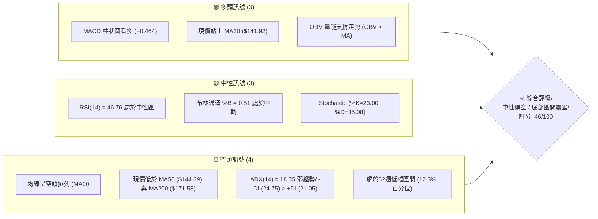
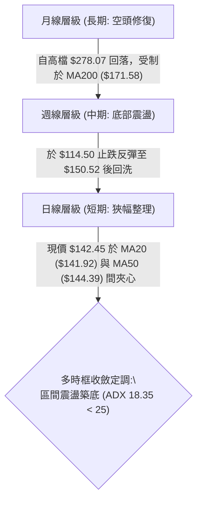
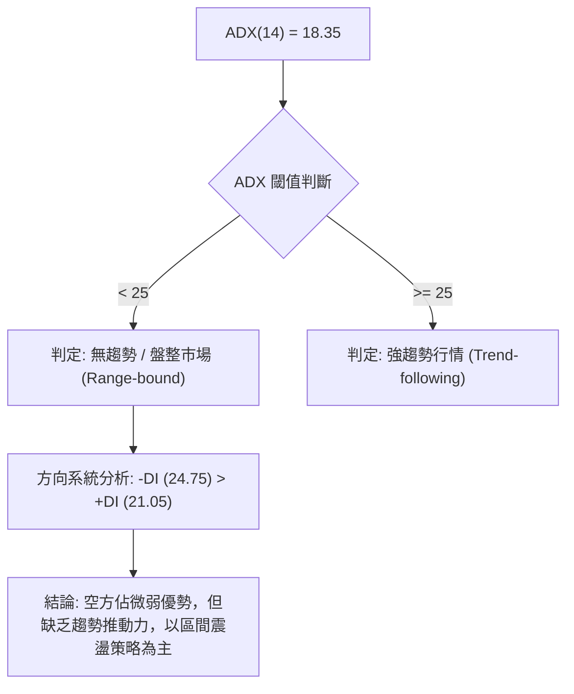
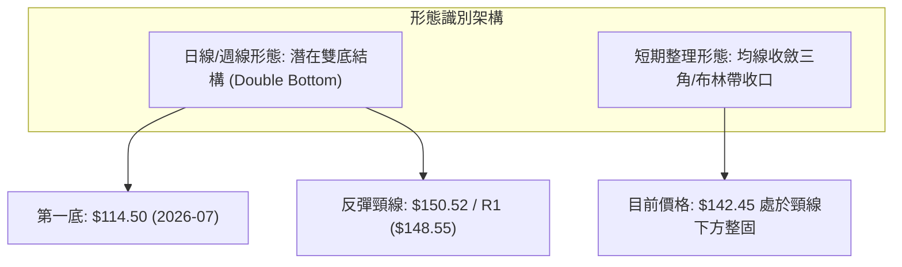
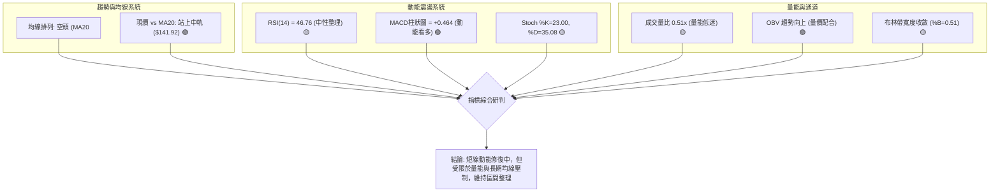
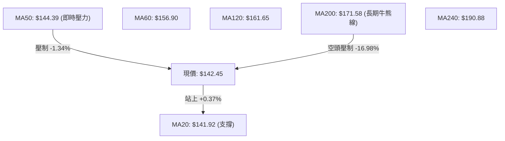
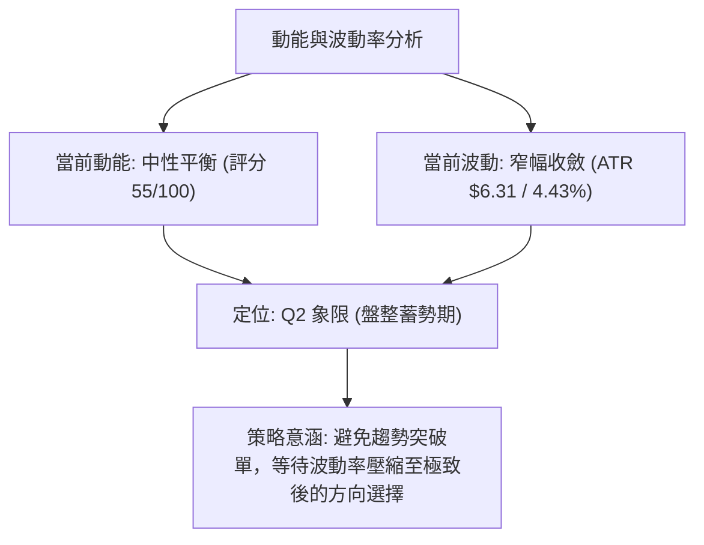
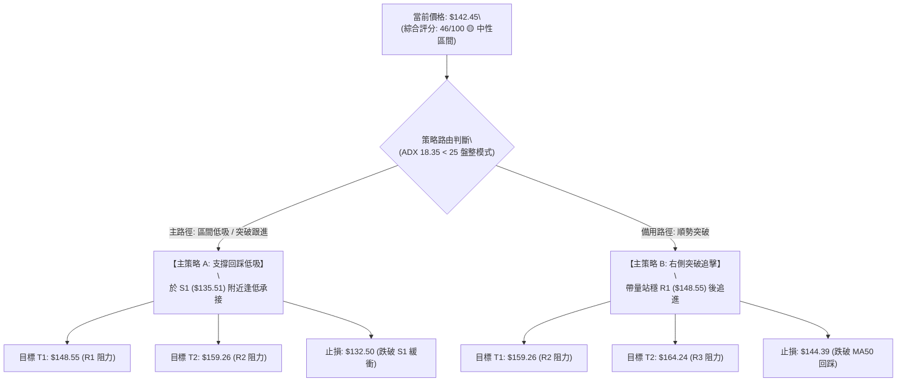
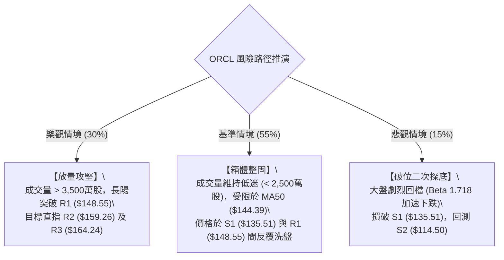

# ORCL 技術分析報告

> **報告日期**：2026-08-25 ｜ **語言**：繁體中文 ｜ **數據來源**：Yahoo Finance ｜ **當前價格**：$142.45

---

## 目錄

| 章節 | 內容 |
|------|------|
| [1. 技術面概覽](#1-技術面概覽) | 訊號儀表板、核心指標、評分卡 |
| [2. 趨勢分析](#2-趨勢分析) | 多時框趨勢、長中短期走勢、ADX 解讀 |
| [3. 圖表形態分析](#3-圖表形態分析) | 形態識別、信心度評估、K線組合、目標價 |
| [4. 支撐與阻力](#4-支撐與阻力) | 關鍵價位分佈、阻力與支撐表、斐波那契回調 |
| [5. 技術指標深度解讀](#5-技術指標深度解讀) | MA/RSI/MACD/布林/量價配合度分析 |
| [6. 動能與波動率](#6-動能與波動率) | 動能四象限、ATR 波動率、Beta 市場敏感度 |
| [7. 多時框架總結](#7-多時框架總結) | 時框矩陣、多時框收斂與權重仲裁 |
| [8. 交易策略建議](#8-交易策略建議) | 策略路由、情境階梯、主策略詳解、風險反轉點 |
| [9. 風險提示與監控](#9-風險提示與監控) | 監控清單、風險情境路徑、風控規則 |

---

## 1. 技術面概覽

### 🎯 技術訊號儀表板



### 📊 核心指標速覽表

| 指標類別 | 指標名稱 | 當前數值 | 訊號 | 解讀 |
|----------|----------|----------|------|------|
| **價格** | 當前價格 | $142.45 | 🟡 | 位於52週區間 12.3% 處，短線自低檔 $114.50 反彈後進入整固 |
| **均線** | MA20 | $141.92 | 🟢 | 現價微幅站上短期均線 (+0.37%)，短期具備微弱支撐動能 |
| **均線** | MA50 | $144.39 | 🔴 | 現價受制於中期均線下方 (-1.34%)，中期下行壓力猶存 |
| **均線** | MA200 | $171.58 | 🔴 | 現價大幅落後長期均線 (-16.98%)，長期格局仍為空頭主導 |
| **動能** | RSI(14) | 46.76 | 🟡 | 處於 30–70 中性區間，無明顯超買或超賣，短線動能平衡 |
| **動能** | MACD | 1.006 (柱狀 +0.464) | 🟢 | MACD 線高於 Signal (0.541)，柱狀圖為正，動能微幅轉強 |
| **動能** | KD指標 | %K: 23.00 / %D: 35.08 | 🟡 | 位於低檔區但尚未形成明確黃金交叉，偏中性整理 |
| **趨勢** | ADX(14) | 18.35 (-DI: 24.75) | 🔴 | ADX < 25 屬無趨勢盤整，-DI 主導意味空方控制中期節奏 |
| **通道** | 布林通道 | 中軌 $141.92 (%B 0.51) | 🟡 | 現價緊貼布林中軌，帶寬收窄，顯示面臨方向性選擇 |
| **量能** | 成交量比 | 14.12M (量比 0.51x) | 🟡 | 成交量明顯萎縮，OBV 偏多但量能不足以支持突破 |
| **波動** | ATR(14) | $6.31 (4.43%) | 🟡 | 單日波動適中，提供明確之止損與波動區間參考 |

### 🏆 技術評分卡

```
╔══════════════════════════════════════════════════════════════════╗
║                   技術評分卡 — ORCL (2026-08-25)                 ║
╠══════════════════════════════════════════════════════════════════╣
║ 趨勢強度 (ADX/方向)   ███████░░░░░░░░░░░░░  35/100  🔴 空頭主導  ║
║ 動能指標 (RSI/MACD)   ███████████░░░░░░░░░  55/100  🟡 中性偏多  ║
║ 支撐穩定度 (波段低點) ████████████░░░░░░░░  60/100  🟡 短期築底  ║
║ 成交量配合 (OBV/量能) █████████░░░░░░░░░░░  45/100  🟡 量能收縮  ║
║ 形態完整度 (結構識別) ██████████░░░░░░░░░░  50/100  🟡 區間盤整  ║
║ 均線排列 (MA系統)     ██████░░░░░░░░░░░░░░  30/100  🔴 空頭排列  ║
╠══════════════════════════════════════════════════════════════════╣
║ 綜合評分              █████████░░░░░░░░░░░  46/100  🟡 中性觀望  ║
╚══════════════════════════════════════════════════════════════════╝
```

---

## 2. 趨勢分析

### 🌐 多時框趨勢分析



### 📈 長期趨勢 — 12個月走勢圖（Unicode）

```
ORCL 月線走勢圖（過去12個月：2025-09 至 2026-08）
價格軸 ($)
$280 ┤ ● (2025-09: $278.07)
$260 ┤    ● (2025-10: $260.10)
$240 ┤
$220 ┤          ● (2025-08: $223.58)          ● (2026-05: $225.00)
$200 ┤             ● (2025-11: $200.02)
$180 ┤                ● (2025-12: $193.05)
$160 ┤                   ● (2026-01: $163.44)    ● (2026-04: $160.83)
$140 ┤                      ● (02: $144.39) ●(03: $146.09) ● (06: $146.04)  ● (08: $142.45 現價)
$120 ┤                                                       ● (2026-07: $129.87)
     └─────────────────────────────────────────────────────────────────────────────
        09    10    11    12    01    02    03    04    05    06    07    08 (月份)
```

**走勢特徵分析表格**：

| 階段 | 時間跨度 | 起訖價位 | 漲跌幅 | 走勢特徵與結構意涵 |
|------|----------|----------|--------|--------------------|
| **高檔派發期** | 2025-09 ~ 2025-11 | $278.07 → $200.02 | -28.07% | 頂部快速失守，帶量長黑摜破中期支撐，確認高檔派發完成 |
| **階梯下行期** | 2025-12 ~ 2026-03 | $193.05 → $146.09 | -24.33% | 均線轉為空頭排列，反彈動能衰竭，尋找第一道波段支撐 |
| **強烈反彈期** | 2026-04 ~ 2026-05 | $160.83 → $225.00 | +39.90% | 軋空式單月暴漲，最高觸及 $225.00，惟未觸及歷史前高即遭遇拋壓 |
| **二次探底期** | 2026-06 ~ 2026-07 | $225.00 → $129.87 | -42.28% | 假突破後引發多殺多崩跌，7月週線下探 $114.50 (52W Low) 完成探底 |
| **收斂整固期** | 2026-08 (當前) | $129.87 → $142.45 | +9.69% | 底部出現買盤支撐，反彈至 $150.52 後回落於 $142.45 進行籌碼沉澱 |

### 📊 中期趨勢（週線分析）

從近 20 週收盤走勢觀察，ORCL 於 2026 年 5 月底見高點 $225.00 後，展開為期 8 週的劇烈下殺，於 2026-07-26 當週打出低點 $114.99（盤中觸及 52W 低點 $114.50）。其後連續 3 週展開強勁報復性反彈，最高收於 2026-08-16 的 $150.52（RSI 升至 74.6 超買區）。隨後兩週（8/23、8/30）成交量自 1.6 億股快速萎縮至 1,412 萬股，價格小幅拉回至 $142.45，顯示短線獲利回吐但無恐慌性拋壓，中期進入對 $135.51–$148.55 區間的重新定價。

```
中期週線結構示意圖
$225.00 ────────┐ (5月底頂部)
                │
                ▼ (大幅拉回)
$114.50 ────────┴───────► (7月落底 52W Low: $114.50)
                           ▲
                           │ (反彈波)
$150.52 ───────────────────┘ (8月中反彈遇阻 R1: $148.55 區域)
  現價: $142.45 ◄── 處於中軌整理，等待量能表態
```

### ⚡ 趨勢強度評估（ADX 解讀）



**ADX 強度對照表**：

| ADX 數值區間 | 趨勢強度級別 | 當前數值 (18.35) 狀態 | 交易指導方針 |
|--------------|--------------|----------------------|--------------|
| 0 – 20 | 極弱 / 無趨勢 | **當前落點 (18.35)** | **嚴禁追價，以高拋低吸或布林上下軌區間交易為主** |
| 20 – 25 | 趨勢初萌 / 弱趨勢 | - | 觀察突破方向與量能確認 |
| 25 – 50 | 強趨勢行情 | - | 順勢交易，沿均線方向持倉 |
| 50 – 100 | 極強 / 過度延伸 | - | 注意動能背離與均線乖離修正 |

---

## 3. 圖表形態分析

### 🔍 形態識別系統



**形態信心度評估表**：

| 形態名稱 | 信心度 | 判斷依據（引用數據） | 完成度 | 目標價（附計算式） |
|----------|--------|----------------------|--------|--------------------|
| **潛在雙底 (Double Bottom)** | 62% | 1. 2026-07 探底 $114.50 (52W Low)<br>2. 8月中反彈至 $150.52 受阻於 R1 ($148.55)<br>3. 目前回測 S1 ($135.51) 上方持穩 | 70% | 若有效突破頸線 R1 ($148.55)：<br>形態高度 = $148.55 - $114.50 = $34.05<br>量度目標價 = $148.55 + $34.05 = **$182.60**<br>(接近阻力位 R3 $164.24 上方之 MA200 區域) |
| **布林帶區間震盪** | 80% | 1. ADX = 18.35 < 25<br>2. 價格緊貼布林中軌 $141.92 (%B: 0.51)<br>3. 波動範圍介於下軌 $121.30 與上軌 $162.53 | 90% | 區間上軌目標 = **$162.53** (布林上軌)<br>區間下軌防守 = **$121.30** (布林下軌) |

### 🕯️ 重要K線形態分析

| 週/月份 | 收盤價 | K線形態 | 深度解讀 | 訊號 |
|---------|--------|---------|----------|------|
| **2026-07-26 週** | $114.99 | 破底長下影錘頭線 (Hammer) | 探底至 52W 低點 $114.50 後爆量 1.63 億股拉升，確認極端超賣買盤進場 | 🟢 強烈止跌 |
| **2026-08-09 週** | $147.02 | 帶量突破大陽線 (Marubozu) | 單週大漲 +13.2%，MACD 柱狀圖翻正 (+4.827)，確立底部反轉行情 | 🟢 轉強買訊 |
| **2026-08-16 週** | $150.52 | 高檔十字星 (Doji) | RSI 達到 74.6 超買區，受阻於 R1 ($148.55) 附近，上影線顯示獲利了結壓盤 | 🟡 短線滯漲 |
| **2026-08-23 週** | $146.47 | 縮量小陰線 | 週成交量由 1.44 億萎縮至 1.01 億股，量縮回檔，屬於良性回洗 | 🟡 正常回調 |
| **2026-08-30 週** | $142.45 | 窄幅整理星線 (當前) | 成交量急劇降至 1,412 萬股，波動受限於 MA20–MA50 區間，等待方向抉擇 | 🟡 觀望蓄勢 |

### 📉 ASCII 走勢形態示意圖

```
ORCL 底部形態與關鍵點位示意圖
$164.24 ────────────────────────────────────────────────────────── 阻力 R3
                                      [潛在量度目標 $182.60]
$159.26 ────────────────────────────────────────────────────────── 阻力 R2
                                ▲
$148.55 ───────────── 頸線 R1 ──┼───● (8/16 高點 $150.52)
                                │  / \
$142.45 ────────────────────────┼─●───● (現價 $142.45 / MA20 $141.92)
                                │/
$135.51 ────────────────────────● 支撐 S1 (回踩防守位)
                               /
$114.50 ──────────●───────────┘ 底部 S2 (52W Low, 2026-07)
                第一底
```

### 🎯 形態目標價計算

根據日/週線級別潛在雙底（W底）形態進行幾何測算：
1. **底部支撐基準點 (Bottom)**：$114.50（2026-07 探明之波段最低點）
2. **頸線確認壓力點 (Neckline)**：$148.55（近一年波段高點聚類阻力 R1）
3. **形態垂直高度 ($H$)**：
   $$H = \text{Neckline} - \text{Bottom} = \$148.55 - \$114.50 = \$34.05$$
4. **最小量度目標價 (Target 1)**：
   $$T_1 = \text{Neckline} + H = \$148.55 + \$34.05 = \$182.60$$
   *註：該目標價位於 52 週區間之 61.8% 斐波那契回調位 ($201.34) 下方，且接近 MA200 ($171.58) 附近之強壓力帶。*
5. **短期區間目標 (保守)**：若形態尚未放量突破頸線 $148.55，則以布林通道上軌 **$162.53** 及 R2 **$159.26** 為波段獲利目標。

---

## 4. 支撐與阻力

### 🗺️ 關鍵價位分布圖（Unicode）

```
ORCL 價位結構分布圖
═══════════════════════════════════════════════════════════════════════
$341.82 ║████████████████████████████████║ 52W High (0.0% Fib)
$288.18 ║████████████████████████        ║ 23.6% Fib
$254.99 ║████████████████████            ║ 38.2% Fib
$228.16 ║██████████████████              ║ 50.0% Fib
$201.34 ║████████████████                ║ 61.8% Fib
$171.58 ║██████████████                  ║ MA200 長期多空分水嶺
$164.24 ║████████████                    ║ 強阻力 R3 (78.6% Fib: $163.15)
$159.26 ║██████████                      ║ 阻力 R2 (布林上軌 $162.53 附近)
$148.55 ║████████                        ║ 關鍵阻力 R1 (頸線位置)
$142.45 ╠════════════════════════════════╣ ◄ 當前市價 ($142.45)
$141.92 ║▓▓▓▓▓▓                          ║ MA20 / 布林中軌
$135.51 ║██████                          ║ 近期關鍵支撐 S1
$121.30 ║████                            ║ 布林下軌
$114.50 ║████████████████████████████████║ 極強支撐 S2 (52W Low / 100% Fib)
═══════════════════════════════════════════════════════════════════════
```

### 🚧 阻力位分析表

| 阻力級別 | 價位 | 距現價幅幅 | 形成原因 | 突破難度 | 重要性 |
|----------|------|------------|----------|----------|--------|
| **R1** | **$148.55** | +4.28% | 近一年波段高點聚類、8月中旬反彈高點 ($150.52) 密集成交區 | 🟡 中等 (需成交量配合放大至 3,000 萬股以上) | ★★★★☆ |
| **R2** | **$159.26** | +11.80% | 波段高點聚類、接近布林上軌 ($162.53) 與 MA60 ($156.90) | 🔴 較高 (上方套牢解套賣壓匯聚) | ★★★☆☆ |
| **R3** | **$164.24** | +15.30% | 斐波那契 78.6% 回調位 ($163.15) 重合、前波崩跌起跌平台 | 🔴 極高 (長期空頭防線，接近 MA120 $161.65) | ★★★★★ |

### 🛡️ 支撐位分析表

| 支撐級別 | 價位 | 距現價幅幅 | 形成原因 | 守住機率 | 重要性 |
|----------|------|------------|----------|----------|--------|
| **S1** | **$135.51** | -4.87% | 近一年波段低點聚類、8月初反彈起漲中繼平台 | 🟢 75% (短期多方第一道防線) | ★★★★☆ |
| **S2** | **$114.50** | -19.62% | 52週歷史低點 (52W Low)、斐波那契 100% 回調位、機構進場大底 | 🟢 90% (年度核心鐵底，跌破機率極低) | ★★★★★ |

### 📐 斐波那契回調位分析

依據 52 週區間高點 **$341.82** 至低點 **$114.50** 進行斐波那契黃金分割計算（波段總落差 $227.32）：

| 回調比例 | 價位 | 當前相對位置與技術意義 |
|----------|------|------------------------|
| **0.0% (52W High)** | **$341.82** | 歷史極值頂部 |
| **23.6%** | **$288.18** | 長期多頭極限反彈位 |
| **38.2%** | **$254.99** | 中長期牛熊轉換關鍵位 |
| **50.0%** | **$228.16** | 52週中位平衡點，2026-05 反彈頂部 ($225.00) 即遇阻於此 |
| **61.8%** | **$201.34** | 黃金分割強壓力位，多頭反轉最終確認線 |
| **78.6%** | **$163.15** | 重要反彈阻力位，高度契合阻力 R3 ($164.24) 與 MA120 ($161.65) |
| **100.0% (52W Low)**| **$114.50** | 年度波段起點與極強支撐 S2 |

**現價區間落點分析**：
當前市價 **$142.45** 處於 **100.0% ($114.50)** 與 **78.6% ($163.15)** 之間，屬於低檔超跌後的「深層修復區」。現價距離 78.6% 回調位尚有 +14.53% 空間，若能有效突破 R1 ($148.55)，將展開朝 78.6% ($163.15) 及 R3 ($164.24) 的回補行情。

---

## 5. 技術指標深度解讀

### 🎛️ 指標訊號總覽



### 📈 移動平均線排列分析



**均線系統深度解讀**：
當前短期均線 MA5 ($143.52) 與 MA10 ($146.97) 呈微幅下行，但 MA20 ($141.92) 開始走平並微幅勾頭向上 (+0.37%)，為現價提供短線下檔支撐。然而，中期均線 MA50 ($144.39)、MA60 ($156.90) 及長期均線 MA200 ($171.58)、MA240 ($190.88) 呈現嚴格的階梯式空頭排列（MA20 < MA50 < MA200）。這表明當前反彈仍屬「空頭格局下的超跌修復」，若要逆轉長期趨勢，多方必須依序攻克 MA50 ($144.39)、R1 ($148.55) 以及 MA200 ($171.58)。

### 📉 RSI(14) 分析

```
RSI(14) 當前數值: 46.76 (中性偏平衡)
0 ──────── 30 ──────────────── 46.76 ─────────────── 70 ──────── 100
[  超賣區  ] [       空方控盤      ●     多方控盤       ] [  超買區  ]
進度條: ████████████░░░░░░░░░░░░░░  46.76%
```

- **超買超賣狀態**：RSI(14) 數值為 46.76，處於 30 至 70 的中性健康區間。此前在 2026-08-16 曾觸及 74.6 超買區，經過兩週的量縮整理，超買指標已完全消化，回到平衡中軸。
- **背離判斷**：
  - **頂背離**：無頂背離訊號。
  - **底背離**：在 2026-07-26 價格觸及低點 $114.99 時，週線 RSI 為 26.7（高於 2026-06-28 價格 $148.02 時的 RSI 11.1），呈現明確的**週線級別動能底背離**，奠定了 7 月底至 8 月中旬的強力反彈基礎。目前日線級別則處於指標與價格同步收斂狀態。

### 📊 MACD(12/26/9) 訊號解讀


- **柱狀圖動態**：當前 MACD 柱狀圖為 **+0.464**，維持看多訊號。雖然較 8 月上旬的峰值 (+4.827) 有所收斂，但快線 (1.006) 仍穩健運行於訊號線 (0.541) 之上，且雙線皆位於零軸上方，顯示短線多方動能尚未衰竭，屬於良性回檔洗盤。

### 📦 布林通道分析

```
ORCL 日線布林通道 (20, 2) 結構圖
$162.53 ────────────────────────────────────────── 布林上軌 (阻力帶)
                                 
$142.45 ───────────────────●────────────────────── 現價 (%B = 0.51)
$141.92 ────────────────────────────────────────── 布林中軌 (MA20 支撐)
                                 
$121.30 ────────────────────────────────────────── 布林下軌 (防守帶)
```

- **通道寬度與狀態**：布林帶帶寬介於 $121.30 至 $162.53 之間，中軌為 $141.92。
- **%B 指標分析**：%B 值為 **0.51**，代表當前價格精準座落於布林通道正中軸。中軌 MA20 ($141.92) 與現價 ($142.45) 幾乎重合，構成即時動態支撐。若跌破中軌，價格將下探下軌 $121.30 尋求支撐；若能守穩中軌並向上發散，上方第一目標為上軌 **$162.53**（與阻力 R3 $164.24 高度重疊）。

### 💹 成交量分析（量價配合度）

- **量能萎縮現象**：最新成交量為 **14,120,539 股**，相較於 20 日均量（27,948,047 股）量比僅為 **0.51x**，相較於 50 日均量（32,761,991 股）萎縮超過 56%。
- **OBV (能量潮指標)**：系統顯示 **OBV > MA**，量能趨勢偏向支撐上漲。這意味著在 7 月底至 8 月中旬的反彈過程中，主力資金有實質回補進場，而近期兩週的價格拉回伴隨急劇縮量，呈現「漲有量、跌無量」的典型吸籌與洗盤特徵，量價結構未出現破壞性拋售。

---

## 6. 動能與波動率

### ⚡ 動能評估四象限

| 象限代號 | 動能強度 (Momentum) | 波動率水準 (Volatility) | ORCL 當前定位 | 交易戰略評估 |
|----------|---------------------|--------------------------|---------------|--------------|
| **Q1 (最佳擴張)** | 強 (MACD/RSI 向上) | 低 (ATR 處於收斂) | - | 突破初期，最佳加碼機會 |
| **Q2 (盤整蓄勢)** | **弱 / 中性 (RSI 46.8, ADX 18.4)** | **低 / 中等 (ATR 4.43%)** | **✓ (當前所屬象限)** | **窄幅震盪，謹慎觀望，採高拋低吸** |
| **Q3 (劇烈博弈)** | 強 (極端單邊走勢) | 高 (ATR > 6%) | - | 高風險高報酬，需嚴設寬止損 |
| **Q4 (非理性恐慌)**| 弱 (破底加速) | 高 (帶量崩跌) | - | 避開進場，等待結構落底 |



### 📊 ATR 波動率分析

- **ATR(14) 數值**：當前 ATR 為 **$6.31**，佔當前股價比例為 **4.43%**。
- **單日波動範圍預期**：在正常市況下，ORCL 單日正常波動區間約為 $\pm \$6.31$（預期日內區間 $136.14 – $148.76）。
- **止損距離建議**：
  - **保守型波段交易 (2.0x ATR)**：止損緩衝設為 $2 \times \$6.31 = \$12.62$。
  - **積極型短線交易 (1.0x – 1.5x ATR)**：止損緩衝設為 $1.0 \times \$6.31 = \$6.31$ 至 $1.5 \times \$6.31 = \$9.47$。
  - **進場防守結合價位**：現價 $142.45 減去 1.1x ATR ($6.94) = **$135.51**，精準對齊波段支撐位 S1。

### 📐 Beta 與市場相關性

- **Beta 係數**：**1.718**（高 Beta 特性）。
- **市場敏感度解讀**：ORCL 相對標普 500 指數具備顯著的高彈性特徵。當大盤指數上漲 1% 時，ORCL 理論波動達 1.718%；反之亦然。
- **機構與內部人籌碼面**：
  - **內部人持股 (Insider Own)**：**40.5%**（股權高度集中，管理層利益與公司高度綁定）。
  - **機構持股 (Institution Own)**：**45.8%**。
  - **做空比率 (Short % Float)**：**2.9%**，Short Ratio 為 **1.28**，顯示目前市場空頭部位極度受控，未見大規模軋空或被狙擊風險。

---

## 7. 多時框架總結

### 📋 時框架評分表

| 時框架 | 趨勢方向 | 動能狀態 | 均線排列 | 形態結構 | 綜合評分 | 戰術建議 |
|--------|----------|----------|----------|----------|----------|----------|
| **月線 (長期)** | 🔴 下行修復 | 🟡 中性 (超跌反彈) | 🔴 MA200 下方 | 大區間回檔探底 | 35/100 | 長期投資者等待站穩 $171.58 |
| **週線 (中期)** | 🟡 區間築底 | 🟢 MACD 翻正 | 🔴 均線空頭排列 | 潛在雙底反彈 | 52/100 | 逢低於支撐位佈局，注意 R1 壓力 |
| **日線 (短期)** | 🟡 窄幅收斂 | 🟡 RSI 46.8 / %B 0.51 | 🟢 站上 MA20 | 布林中軌夾心整理 | 50/100 | 區間高拋低吸，嚴設止損 |

### 🔲 綜合訊號矩陣

```
時框訊號一致性評估：
短期 (日線)  ────► [ 🟡 震盪整理 / MA20 支撐 ] 
                          ▲ 矛盾中和
中期 (週線)  ────► [ 🟢 底部背離 / MACD 翻正 ] 
                          ▼ 權重壓制
長期 (月線)  ────► [ 🔴 空頭排列 / MA200 壓制 ]
──────────────────────────────────────────────────────────
總體評級：46/100 (中性觀望 / 區間震盪) ── 需依 ADX 仲裁收斂
```

### ⚖️ 多時框收斂結論

**仲裁依據（嚴格遵循規則 14）**：
1. **行情性質判定**：當前日線 ADX(14) 數值為 **18.35**（遠低於 25 臨界值），明確判定當前市場處於**「無趨勢之盤整行情」**。
2. **時框優先級別**：在盤整市場中，趨勢跟隨型之長期指標（如 MA200）暫退居次要參考，**主導權交由日線布林通道 ($121.30 – $162.53) 與波段支撐阻力 ($135.51 – $148.55) 作為主要交易區間**。
3. **唯一方向性結論**：**【中性觀望 / 區間下緣偏多防守】**。
   短線既無持續下殺的恐慌量能（OBV 仍佳），亦無向上突破 MA50/R1 的推動力道（ADX 極弱、成交量縮半）。因此，第 8 章策略將以此收斂結論為核心，主推**「區間震盪操作策略（等待突破確認）」**。

---

## 8. 交易策略建議

### 🗺️ 策略決策流程圖



### 🧭 策略路由

> **當前主策略方向 = 【中性區間操作 / 支撐位低吸等待突破】（依技術評分 46/100，處於 40–60 區間震盪範圍）**

由於評分卡落於中性區間且 ADX < 25，操作核心為「不追高中樞、守候區間兩端」。主策略以布林中軌下方的關鍵支撐 S1 ($135.51) 作為低吸依據，向上挑戰頸線 R1 ($148.55) 及阻力 R2 ($159.26)。

### 🎯 價格情境階梯（Price Scenarios）

| 觸發條件 | 第一目標 | 後續延伸 | 技術情境含義與操作指引 |
|----------|----------|----------|------------------------|
| **強勢突破 R1 ($148.55)** | **R2 ($159.26)** | **R3 ($164.24)** | 短線雙底成型，突破布林上軌，展開向 78.6% Fib 回補行情 |
| **持穩現價區間 ($141.92–$144.39)**| **R1 ($148.55)** | **S1 ($135.51)** | 於 MA20 與 MA50 間狹幅收斂，等待量能表態，維持觀望 |
| **跌破支撐 S1 ($135.51)** | **布林下軌 ($121.30)**| **S2 ($114.50)** | 短線反彈失敗，重新回測 52W 低點尋找雙重底支撐 |

### 📊 情境機率分佈

| 震盪情境 | 機率估計 | 主要技術依據 |
|----------|----------|--------------|
| **區間震盪蓄勢** | **55%** | ADX 僅 18.35 顯示趨勢動能匱乏、成交量較均量萎縮 50%、價格緊貼布林中軌 (%B=0.51) |
| **向上突破反彈** | **30%** | MACD 柱狀圖維持為正 (+0.464)、OBV 趨勢向上、週線 RSI 出現低檔動能修復底背離 |
| **向下破位探底** | **15%** | 短期 MA20 具備支撐，7 月已於 $114.50 大幅消化利空，目前做空比率僅 2.9% |

### 🟢 主策略詳情

| 策略要素 | 策略 A：左側支撐低吸策略（優先推薦） | 策略 B：右側突破跟進策略（確認轉強） |
|----------|---------------------------------------|---------------------------------------|
| **進場條件** | 價格拉回回踩 S1 ($135.51) 出現止跌K線 | 日K線收盤價帶量突破 R1 ($148.55) |
| **進場價格** | **$136.00**（S1 $135.51 上方 0.3x ATR 處） | **$149.00**（突破 R1 $148.55 確認點） |
| **第一目標 (T1)** | **$148.55**（阻力位 R1，預期獲利 +9.23%） | **$159.26**（阻力位 R2，預期獲利 +6.89%） |
| **第二目標 (T2)** | **$159.26**（阻力位 R2，預期獲利 +17.10%）| **$164.24**（阻力位 R3，預期獲利 +10.23%）|
| **止損價格** | **$131.50**（跌破 S1 $135.51 緩衝約 0.6x ATR）| **$144.39**（跌破回踩 MA50 支撐線） |
| **風險空間** | -$4.50 (-3.31%) | -$4.61 (-3.09%) |
| **報酬空間 (T1)**| +$12.55 (+9.23%) | +$10.26 (+6.89%) |
| **風險報酬比 (R:R)**| **1 : 2.79** (以 T1 計算) / **1 : 5.17** (以 T2 計算) | **1 : 2.23** (以 T1 計算) / **1 : 3.31** (以 T2 計算) |
| **歷史勝率估計** | **65%** | **55%** |
| **建議配置倉位** | **總資金 10% – 15%** | **總資金 8% – 10%** |

### 🔴 反向風險觸發點（對沖與風控提示）

若發生下列技術破位事件，宣告多頭反彈結構破局，應立即啟動防守或對沖：
1. **S1 破位觸發點**：若日K線以實體長黑收破 **$135.51 (S1)**，代表自 7 月底的反彈波段宣告終結，價格極可能沿布林下軌滑落至 **$121.30** 甚至再次考驗 **$114.50 (S2)**。應立即停損多單。
2. **均線壓制破位**：若連續 3 個交易日無法收復 **MA20 ($141.92)** 且 MACD 柱狀圖翻負（跌破 0 軸），代表短線買盤動能衰竭。

### ⭐ 整體訊號強度評星

```
╔══════════════════════════════════════════════════════════════════╗
║ 做多訊號強度：★★★☆☆  (3.0/5星 — 具備風險報酬比，但缺量能)     ║
║ 做空訊號強度：★★☆☆☆  (2.0/5星 — 超跌修復中，做空盈虧比差)     ║
║ 整體可信度：  ★★★☆☆  (3.5/5星 — 指標一致指向區間震盪)       ║
╚══════════════════════════════════════════════════════════════════╝
```

---

## 9. 風險提示與監控

### ✅ 關鍵監控指標 Checklist

```
╔══════════════════════════════════════════════════════════════════╗
║                   ORCL 每日盤後關鍵技術監控 Checklist            ║
╠══════════════════════════════════════════════════════════════════╣
║ [ ] 價格是否站穩布林中軌 MA20 ($141.92) 上方？                   ║
║ [ ] 成交量是否放大突破 20日均量 (2,794 萬股)？ (當前: 1,412 萬) ║
║ [ ] MACD 柱狀圖是否維持正值？ (當前: +0.464)                     ║
║ [ ] RSI(14) 是否維持於 45–60 健全震盪區間？ (當前: 46.76)        ║
║ [ ] ADX(14) 是否向上穿越 25，開啟單邊趨勢？ (當前: 18.35)       ║
║ [ ] 是否觸發 R1 ($148.55) 向上突破或 S1 ($135.51) 向下載破？    ║
╚══════════════════════════════════════════════════════════════════╝
```

### ⚠️ 風險場景分析



### 🛡️ 風險管理重要提醒

1. **高 Beta 波動風險控制**：ORCL 的 Beta 高達 **1.718**，屬於高波動性科技權值股。在大盤波動劇烈時，應適度縮減單筆交易倉位至總資金的 **10% 以內**，避免市場系統性風險造成超額回撤。
2. **縮量盤整的「假突破」風險**：目前 ADX 僅 **18.35** 且成交量偏低（0.51x 量比），盤中容易出現無量虛破阻力或支撐的假訊號。任何突破交易必須嚴格以**「日K線收盤價」**及**「成交量是否放大至 3,000 萬股以上」**作為真實確認標準。
3. **止損紀律嚴格執行**：以 ATR ($6.31) 為基準，進場時務必將最大單筆虧損控制在投資組合總資產的 **1.0% – 1.5%** 以內，若觸及止損位 **$131.50**（策略 A）或 **$144.39**（策略 B）應果斷執行出場，切忌盲目向下攤平。

---

## 📋 報告總結

```
╔══════════════════════════════════════════════════════════════════════╗
║                   ORCL 技術分析報告總結                              ║
╠══════════════════════════════════════════════════════════════════════╣
║ 報告日期：2026-08-25                                                 ║
║ 當前價格：$142.45                                                    ║
║ 分析評級：⚖️ 中性觀望 / 區間震盪築底 (評分: 46/100)                  ║
║                                                                      ║
║ 關鍵結論：                                                           ║
║ ├─ 長期趨勢：🔴 空頭排列 (現價落後 MA200 $171.58 -16.98%)            ║
║ ├─ 中期趨勢：🟡 築底反彈 (自 52W 低點 $114.50 反彈後進入箱體整理)   ║
║ ├─ 短期趨勢：🟢 站穩 MA20 ($141.92)，MACD 柱狀圖維持看多 (+0.464)    ║
║ ├─ 關鍵支撐：S1: $135.51 ｜ S2: $114.50 (52W Low 強支撐)             ║
║ ├─ 關鍵阻力：R1: $148.55 ｜ R2: $159.26 ｜ R3: $164.24               ║
║ └─ 分析師目標：華爾街平均共識目標價 $246.43 (買入評級)               ║
║                                                                      ║
║ 最優策略組合：                                                       ║
║ 1. 🥇 最佳機會：回踩 S1 ($135.51) 附近逢低佈局，止損 $131.50，       ║
║                 目標 R1 ($148.55) / R2 ($159.26)，盈虧比 1:2.79      ║
║ 2. 🥈 次選機會：帶量突破 R1 ($148.55) 後追進，目標 R2 ($159.26)       ║
║ 3. 🥉 保守選擇：維持空倉觀望，等待 ADX > 25 且成交量放大確認趨勢     ║
╚══════════════════════════════════════════════════════════════════════╝
```

---

> ⚠️ **免責聲明**：本報告為技術分析研究成果，所有數據及幾何量度估算均基於歷史價格與技術指標模型推導。本報告**僅供學術研究與投資策略參考**，**不構成任何形式的要約、招攬或具體投資建議**。金融市場瞬息萬變，高 Beta 個股具備高波動風險，投資人應依個人風險承受能力獨立做出決策並自負盈虧。

---

*報告生成時間：2026-08-25 ｜ 數據來源：Yahoo Finance ｜ 分析框架：多時框技術分析體系*