# ORCL 技術分析報告

> **報告日期**：2026-08-26 ｜ **語言**：繁體中文 ｜ **數據來源**：Yahoo Finance ｜ **當前價格**：$144.76

---

## 目錄

| 章節 | 內容 |
|------|------|
| [1. 技術面概覽](#1-技術面概覽) | 訊號儀表板、核心指標、評分卡 |
| [2. 趨勢分析](#2-趨勢分析) | 多時框趨勢、長中短期走勢 |
| [3. 圖表形態分析](#3-圖表形態分析) | 形態識別、K線組合、目標價 |
| [4. 支撐與阻力](#4-支撐與阻力) | 關鍵價位、斐波那契回調 |
| [5. 技術指標深度解讀](#5-技術指標深度解讀) | MA/RSI/MACD/布林/成交量 |
| [6. 動能與波動率](#6-動能與波動率) | 動能評估、ATR、Beta |
| [7. 多時框架總結](#7-多時框架總結) | 時框架評分矩陣 |
| [8. 交易策略建議](#8-交易策略建議) | 多空策略、風險報酬比 |
| [9. 風險提示與監控](#9-風險提示與監控) | 監控指標、風險場景 |
| [📋 報告總結](#-報告總結) | 核心結論與策略彙整 |

---

## 1. 技術面概覽

### 🎯 技術訊號儀表板

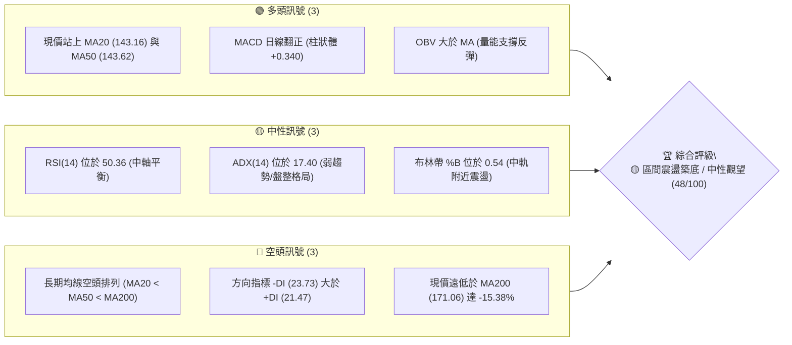

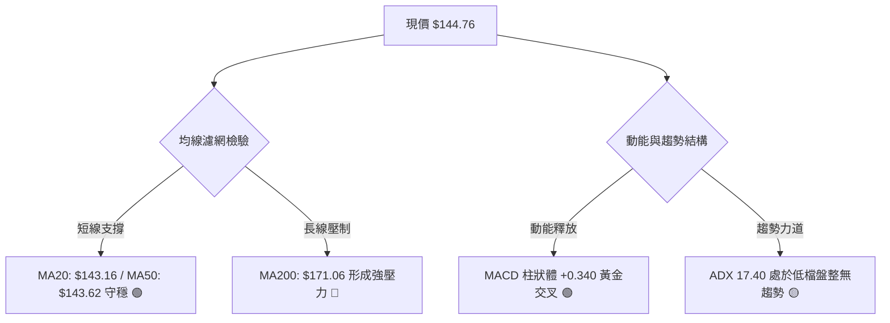

### 📊 核心指標速覽表

| 指標類別 | 指標名稱 | 當前數值 | 訊號 | 解讀 |
|:---|:---|:---|:---:|:---|
| **價格** | 當前價格 | $144.76 | 🟡 | 位於52週區間 13.3%，自底部反彈但仍處低檔震盪 |
| **均線** | MA20 | $143.16 | 🟢 | 現價位於 MA20 之上 (+1.12%)，短線扭轉偏多 |
| **均線** | MA50 | $143.62 | 🟢 | 現價微幅站上 MA50 (+0.79%)，尋求中期打底確認 |
| **均線** | MA200 | $171.06 | 🔴 | 現價在 MA200 下方 (-15.38%)，長期下行趨勢壓制未解 |
| **動能** | RSI(14) | 50.36 | 🟡 | 位於中性區間 (30-70)，多空力量處於平衡狀態 |
| **動能** | MACD (12,26,9) | 0.966 / 0.626 | 🟢 | DIF 高於 MACD 線，柱狀體 +0.340，動能微幅轉正 |
| **動能** | Stoch %K / %D | 33.58 / 32.66 | 🟡 | 位於中低檔區域，並無超買超賣，多空拉鋸 |
| **趨勢** | ADX (14) | 17.40 | 🟡 | ADX < 25 表明處於弱趨勢或無趨勢盤整市場 |
| **趨勢** | DMI (+DI / -DI)| 21.47 / 23.73 | 🔴 | -DI 大於 +DI，空方力量在結構上仍佔微幅優勢 |
| **通道** | 布林通道 %B | 0.54 | 🟡 | 位於布林中軌 ($143.16) 略上方，朝上軌 ($161.01) 邁進 |
| **量能** | OBV 趨勢 | OBV > MA | 🟢 | 能量潮高於移動平均，底部量能支撐股價打底反彈 |
| **波動** | ATR(14) | $6.31 | 🟡 | 佔股價 4.36%，波動幅度收斂至正常區間 |

### 🏆 技術評分卡

```
╔══════════════════════════════════════════════════════════════╗
║                技術評分卡 — ORCL (2026-08-26)                ║
╠══════════════════════════════════════════════════════════════╣
║ 趨勢強度      █████░░░░░░░░░░░░░░░  25/100  🔴 弱勢空頭盤整  ║
║ 動能指標      ████████████░░░░░░░░  60/100  🟢 短線低檔修復  ║
║ 支撐穩定度    ████████████░░░░░░░░  60/100  🟢 底部支撐浮現  ║
║ 成交量配合    ██████████░░░░░░░░░░  50/100  🟡 反彈縮量觀望  ║
║ 形態完整度    ████████░░░░░░░░░░░░  40/100  🟡 局部打底構築  ║
║ 均線排列      ████████░░░░░░░░░░░░  40/100  🔴 長期空頭壓制  ║
╠══════════════════════════════════════════════════════════════╣
║ 綜合評分      █████████░░░░░░░░░░░  48/100  🟡 中性區間震盪  ║
╚══════════════════════════════════════════════════════════════╝
```

---

## 2. 趨勢分析

### 🌐 多時框趨勢分析

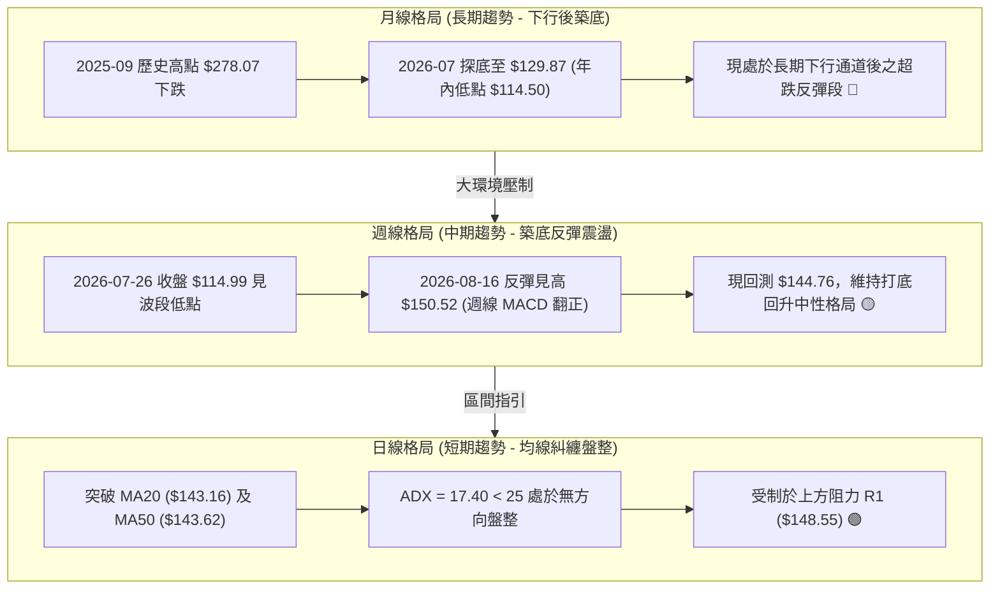

### 📈 長期趨勢 — 12個月走勢圖（Unicode）

```
ORCL 月線走勢圖（過去12個月：2025-08 至 2026-08）
價格軸 ($)
$280 ┤                ● (2025-09: $278.07 歷史高點)
$260 ┤                    ● (2025-10: $260.10)
$240 ┤
$220 ┤  ● (2025-08)                 ● (2026-05: $225.00 假突破)
$200 ┤              ● (2025-11)
$180 ┤                  ● (2025-12)
$160 ┤                      ● (2026-01)   ● (2026-04)
$140 ┤                          ● ── ● ──────── ● ──────── ●←現價 $144.76
$120 ┤                                              ● (2026-07: $129.87)
     └─────────────────────────────────────────────────────────────
       08   09   10   11   12   01   02   03   04   05   06   07   08
      2025 ────────────────────► 2026 ──────────────────────────►
```

#### 走勢特徵分析表格

| 階段區間 | 時間跨度 | 起訖價位 | 漲跌幅 | 階段走勢特徵與技術意涵 |
|:---|:---:|:---:|:---:|:---|
| **歷史見頂段** | 2025-08 ~ 2025-09 | $223.58 → $278.07 | +24.37% | 量能噴發創下波段歷史高點，隨後動能背離見頂 |
| **首波重挫段** | 2025-09 ~ 2026-02 | $278.07 → $144.39 | -48.07% | 均線轉空連續跌破 MA50 與 MA200，空頭單邊主導 |
| **中期反彈陷阱** | 2026-02 ~ 2026-05 | $144.39 → $225.00 | +55.83% | 強勢回抽至 MA200 附近，未能站穩隨即引發流動性踩踏 |
| **二次探底暴跌** | 2026-05 ~ 2026-07 | $225.00 → $129.87 | -42.28% | 跌破前低並下探 52 週最低點 $114.50，恐慌盤大量湧現 |
| **打底修復現況** | 2026-07 ~ 2026-08 | $129.87 → $144.76 | +11.47% | 於 $114.50-$129.87 構築支撐，目前回到 $144.76 震盪 |

### 📊 中期趨勢（週線分析）

```
ORCL 近20週收盤走勢與關鍵轉折圖
價格 ($)
$230 ┤              ● ($225.00 波段高點)
$210 ┤            ●   ● ($212.94)
$190 ┤      ● ● ●       ● ($183.49)
$170 ┤  ● ●               ● ($183.65)
$150 ┤                        ● ($148.02)         ● ($150.52)
$130 ┤                          ● ($139.78)   ●   ●   ● ◄ 現價 $144.76
$110 ┤                                  ● ($114.99 底部)
     └───────────────────────────────────────────────────────────
       W1          W5          W10         W15         W20 (當前)
```

中期走勢顯示，ORCL 在經歷 6 月至 7 月的急跌後，於 2026-07-26 收盤 $114.99 完成恐慌低點測試。隨後週線連三紅，一度反彈至 2026-08-16 的 $150.52，目前拉回至 $144.76 整理，顯示市場進入籌碼沈澱與中軌整固期。

### ⚡ 趨勢強度評估（ADX 解讀）

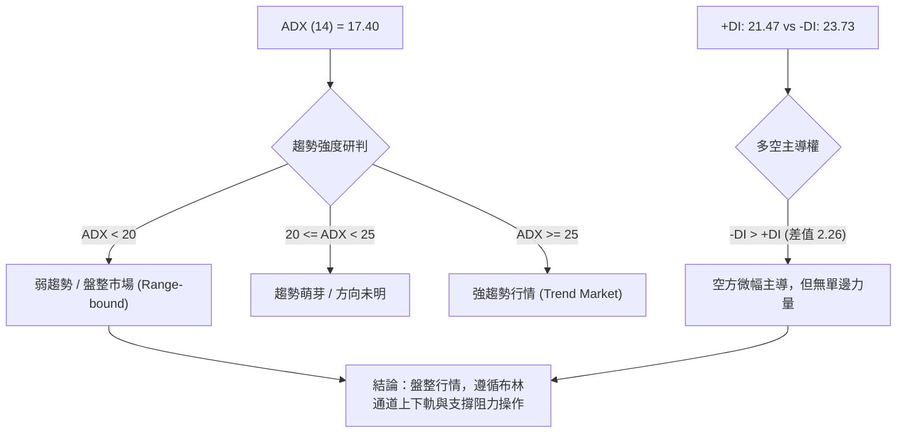

#### ADX 指標強度對照分析表

| 參數指標 | 當前數值 | 門檻區間 | 當前技術含義 | 操作指引 |
|:---|:---:|:---:|:---|:---|
| **ADX (14)** | 17.40 | < 25 (弱趨勢) | 市場動能大幅衰竭，趨勢性突破不易延續 | 嚴禁追價，採用區間高拋低吸策略 |
| **+DI** | 21.47 | 基準參考 | 多頭買盤力道偏弱，缺乏推動波段攻擊量能 | 觀察是否能向上穿越 25 水平 |
| **-DI** | 23.73 | 基準參考 | 空方拋壓雖佔優，但亦未形成壓倒性擴張 | 跌破 20 則空頭勢力瓦解 |
| **DI 差值** | -2.26 | 接近 0 軸 | 多空進入動態平衡，即將選擇短期突破方向 | 關注布林通道上軌或下軌之測試反饋 |

---

## 3. 圖表形態分析

### 🔍 形態識別系統

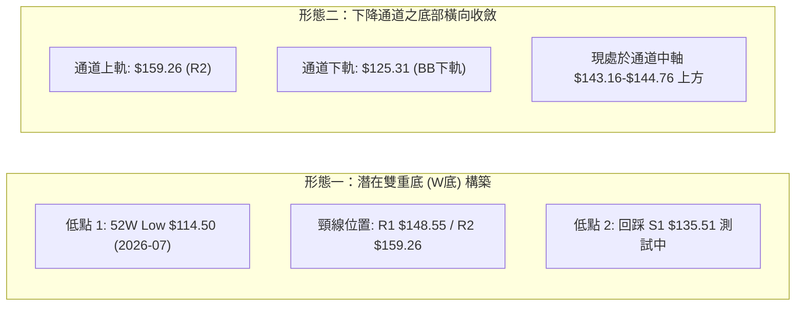

#### 形態識別與信心度評估表

| 形態類型 | 信心度 | 完成度 | 判斷依據（引用數據） | 目標價計算式與推算目標 |
|:---|:---:|:---:|:---|:---|
| **潛在雙重底 (W底)** | 55% 🟡 | 60% | 52W 低點 $114.50 獲守，反彈至 $150.52，現於 $144.76 構築次低點（S1 $135.51 之上） | 若突破頸線 R1 $148.55：<br/>$148.55 + ($148.55 - $114.50) = **$182.60**（由雙底高度推算） |
| **布林帶橫盤箱體** | 75% 🟢 | 85% | ADX 17.40 確認無趨勢，價格在布林下軌 $125.31 與上軌 $161.01 之間震盪 | 箱體突破目標：<br/>若突破上軌 $161.01，目標為 R3 $164.24 及斐波那契 $163.15 |
| **長線頭肩頂破位回抽** | 80% 🔴 | 95% | 2025年高點 $278.07 為頭部，跌破頸線 $163.42 後，現回抽受制於 MA200 ($171.06) | 空頭測幅滿足點已於 52W Low $114.50 達成，現為弱勢回抽階段 |

### 🕯️ 重要K線形態分析

| 月份 / 週別 | 收盤價 | K線形態 | 量能配合 | 技術解讀與訊號方向 |
|:---|:---:|:---|:---:|:---|
| **2026-05 (月)** | $225.00 | 長上影大陽線 | 縮量拉升 | 假突破 MA200，多頭誘多竭盡訊號 🔴 |
| **2026-06 (月)** | $146.04 | 大陰破位線 | 暴量下殺 | 實體跌破多重支撐，確認中期走空 🔴 |
| **2026-07 (月)** | $129.87 | 帶長下影錘頭線 | 底部爆量 | 下探 52W 低點 $114.50 獲強力承接，止跌訊號 🟢 |
| **2026-08-16 (週)** | $150.52 | 中陽線反彈受阻 | 144.2M 量能 | 觸及 R1 阻力區出現逢高拋壓，反彈遇阻 🟡 |
| **2026-08-30 (當週)** | $144.76 | 窄幅十字星孕線 | 27.4M 萎縮 | 多空暫停交火，於 MA20/MA50 匯合處尋求方向 🟡 |

### 📉 ASCII 走勢形態示意圖

```
ORCL 日線打底與形態結構圖 ($114.50 → $150.52 → $144.76)
價格 ($)
$164.24 ┤                                          [阻力 R3]
$159.26 ┤                                          [阻力 R2 / BB上軌 $161.01]
$148.55 ┤                     ▲ ($150.52 頸線測試) [阻力 R1]
$144.76 ┤─────────────────────┼─────────●◄ 現價 ($144.76 站穩 MA20/50)
$135.51 ┤                     │       ╱   [支撐 S1]
$125.31 ┤        ▲            │     ╱     [BB下軌]
$114.50 ┤────────┴────────────┴────●◄ (52W Low $114.50 / 支撐 S2)
        └────────────────────────────────────────────
          2026-06            2026-07            2026-08
```

### 🎯 形態目標價計算

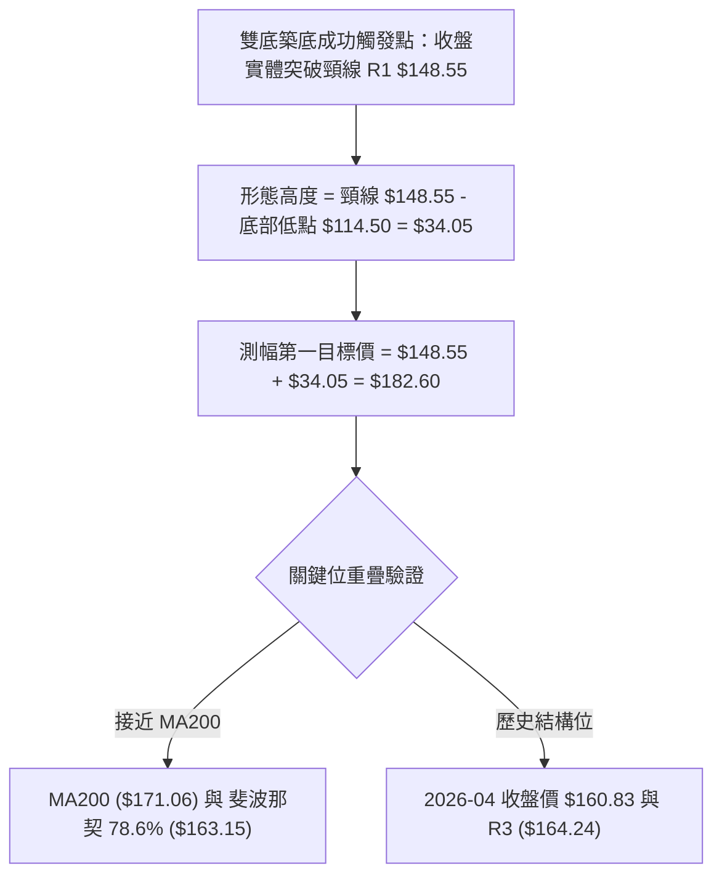

1. **基準頸線**：採用近一年波段高點聚類之關鍵阻力 **R1: $148.55**。
2. **形態底點**：採用 52 週最低點 **S2: $114.50**。
3. **理論等幅測距目標**：
   $$\text{目標價} = \text{頸線} + (\text{頸線} - \text{底點}) = 148.55 + (148.55 - 114.50) = \$182.60$$
4. **路徑阻力修正**：在到達理論目標 $\$182.60$ 前，股價必須先後克服阻力 **R2 ($159.26)**、布林上軌 **($161.01)**、斐波那契 78.6% **($163.15)** 及阻力 **R3 ($164.24)**。

---

## 4. 支撐與阻力

### 🗺️ 關鍵價位分布圖（Unicode）

```
ORCL 價位結構分布圖（嚴格依據 OHLCV 聚類與斐波那契計算）
═══════════════════════════════════════════════════════════════════════
$341.82 ║████████████████████████████████║ 52W High (0.0% Fib)
$288.18 ║████████████████████            ║ 斐波那契 23.6%
$254.99 ║████████████████                ║ 斐波那契 38.2%
$228.16 ║██████████████████████          ║ 斐波那契 50.0% (中期大頂)
$201.34 ║████████████████                ║ 斐波那契 61.8%
$171.06 ║████████████████████████        ║ 長期生命線 MA200
$164.24 ║████████████████████            ║ 強阻力 R3
$163.15 ║████████████████████            ║ 斐波那契 78.6%
$161.01 ║██████████████                  ║ 布林通道上軌
$159.26 ║████████████████████            ║ 波段阻力 R2
$148.55 ║████████████████████████        ║ 關鍵頸線阻力 R1 (+2.62%)
$144.76 ╠════════════════════════════════╣ ◄◄◄ 當前收盤價 ($144.76)
$143.62 ║▓▓▓▓▓▓▓▓▓▓▓▓▓▓▓▓▓▓▓▓▓▓▓▓        ║ 中期均線 MA50
$143.16 ║▓▓▓▓▓▓▓▓▓▓▓▓▓▓▓▓▓▓▓▓▓▓▓▓        ║ 短期均線 MA20 / 布林中軌
$135.51 ║▓▓▓▓▓▓▓▓▓▓▓▓▓▓▓▓▓▓▓▓            ║ 近期波段支撐 S1 (-6.39%)
$125.31 ║▓▓▓▓▓▓▓▓▓▓▓▓                    ║ 布林通道下軌
$114.50 ║████████████████████████████████║ 52W Low (100.0% Fib) / 核心強支撐 S2
═══════════════════════════════════════════════════════════════════════
```

### 🚧 阻力位分析表

| 阻力級別 | 價位 | 距現價幅幅 | 形成原因與籌碼結構 | 突破難度 | 重要性評級 |
|:---|:---:|:---:|:---|:---:|:---:|
| **R1** | **$148.55** | +2.62% | 近一年波段高點聚類；2026-08-16 當週反彈高點 $150.52 形成之解套壓回區 | 🟡 中等 | ★★★★☆ |
| **R2** | **$159.26** | +10.02% | 2026-04 收盤價 $160.83 附近波段高點聚類，與布林上軌 ($161.01) 共振 | 🔴 偏高 | ★★★★☆ |
| **R3** | **$164.24** | +13.46% | 近一年密集密合成交區頂部；與斐波那契 78.6% 回調位 ($163.15) 高度重疊 | 🔴 極高 | ★★★★★ |

### 🛡️ 支撐位分析表

| 支撐級別 | 價位 | 距現價幅幅 | 形成原因與籌碼結構 | 守住機率 | 重要性評級 |
|:---|:---:|:---:|:---|:---:|:---:|
| **S1** | **$135.51** | -6.39% | 近一年波段低點聚類；2026-07 打底階段反覆回測之密集成交平台上緣 | 🟢 70% | ★★★★☆ |
| **S2** | **$114.50** | -20.90% | 52週歷史低點 (2026-07-26 收盤 $114.99 處)；斐波那契 100% 回調終極支撐 | 🟢 90% | ★★★★★ |

### 📐 斐波那契回調位分析

依據 52 週波動極值區間（低點 **$114.50** → 高點 **$341.82**，總落差 $227.32）計算：

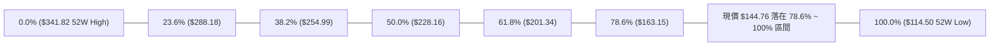

- **當前位置解讀**：現價 **$144.76** 處於斐波那契 **78.6% ($163.15)** 與 **100.0% ($114.50)** 之間的深度回調極值區域（目前處於 52 週區間的 13.3% 位置）。
- **技術意義**：
  1. 股價回撤跌破 61.8% ($201.34) 與 78.6% ($163.15)，代表自 $341.82 以來之長期多頭循環遭到實質破壞，行情由多頭主升轉入長期雄市修正或大級別築底。
  2. 78.6% 回調位 **$163.15** 與關鍵阻力 **R3 ($164.24)** 構成「雙重強壓共振帶」，唯有帶量實質站穩 $163.15 - $164.24，方能確認大級別趨勢反轉。

---

## 5. 技術指標深度解讀

### 🎛️ 指標訊號總覽

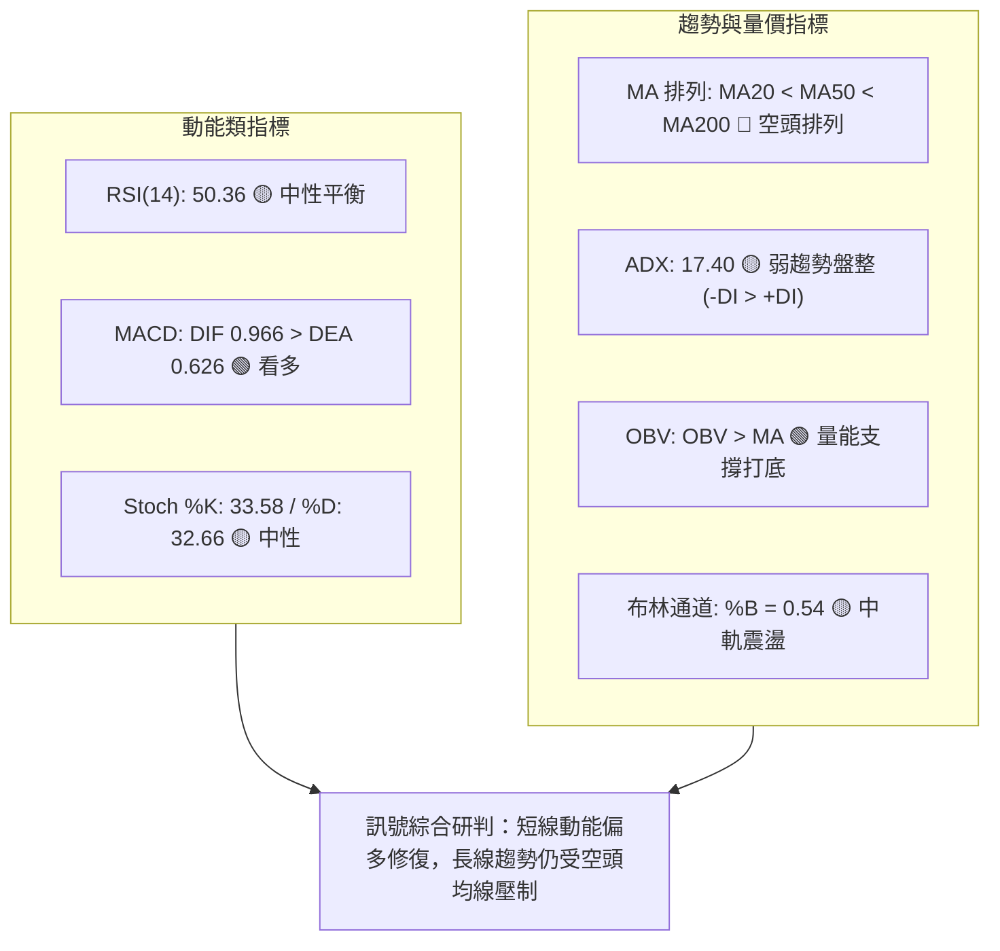

### 📈 移動平均線排列分析

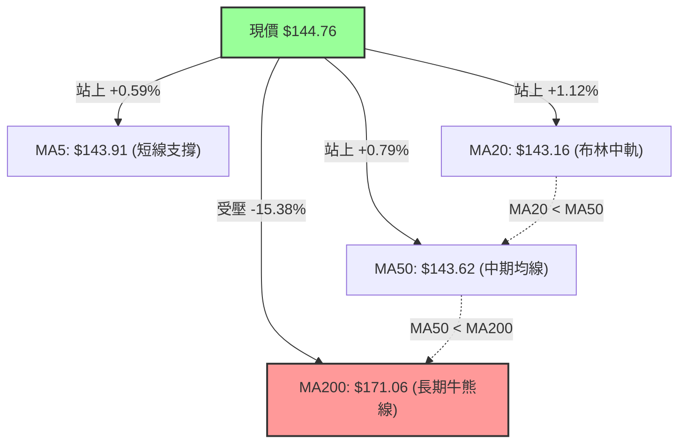

#### 均線系統詳細參數表

| 均線名稱 | 當前數值 | 偏離率 (Bias) | 均線走勢軌跡 | 交叉與排列狀態 | 結論評級 |
|:---|:---:|:---:|:---|:---|:---:|
| **MA5** | $143.91 | +0.59% | 向上翻揚 (▅▄▃▂▂▂▂▁▁▁▁▁▂▃▄▅▆▇▇▇██████▇▇▇▇) | 短期金叉 MA20 | 🟢 偏多 |
| **MA10** | $146.90 | -1.46% | 震盪下行 (▅▅▅▄▃▃▂▂▁▁▁▁▁▁▂▂▃▄▅▆▇█████████) | 壓制現價 | 🔴 偏空 |
| **MA20** | $143.16 | +1.12% | 底部勾頭 (█▇▆▅▄▄▃▂▂▁▁▁▁▁▁▁▁▁▁▁▂▂▃▃▄▄▄▅▅▆) | 形成短線支撐 | 🟢 偏多 |
| **MA50** | $143.62 | +0.79% | 走平趨緩 (MA50 上方) | 現價微幅站上 | 🟢 偏多 |
| **MA60** | $155.56 | -6.94% | 持續下行 (████▇▇▇▆▆▆▆▅▅▅▄▄▄▄▃▃▃▃▃▂▂▂▂▁▁▁) | 中期下壓 | 🔴 偏空 |
| **MA120** | $161.59 | -10.42% | 陡峭向下 (██▇▆▅▅▄▃▃▂▂▂▂▁▁▁▁▁▁▁▁▁▁▁▁▁▁▁▁▁) | 半年線強壓 | 🔴 偏空 |
| **MA200** | $171.06 | -15.38% | 穩定下行 (長期走空) | 遠高於現價 | 🔴 偏空 |
| **MA240** | $190.13 | -23.86% | 長期下行 (████▇▇▇▆▆▅▅▅▅▄▄▄▄▃▃▃▃▂▂▂▂▂▁▁▁▁) | 年線天花板 | 🔴 偏空 |

**排列總結**：大週期呈現典型的空頭排列（$MA20 < MA50 < MA60 < MA120 < MA200$），但極短線 MA5 與現價已成功收復 MA20 與 MA50，呈現「長空格多、短線打底糾纏」的技術特徵。

### 📉 RSI(14) 分析

```
RSI(14) 當前數值：50.36
[0] ─────────────── [30] ─────────────── [50.36] ─────────────── [70] ─────────────── [100]
超賣區               弱勢區                中性軸 (現值)          強勢區               超買區
████████████████████████████████████████████░░░░░░░░░░░░░░░░░░░░░░░░░░░░░░░░░░░░░░░░ (50.36%)
```

- **區間評估**：RSI 位於 **50.36**，剛好橫跨於 50 多空中軸線上，表示自 2026-07 低檔超賣區（當時週線 RSI 跌至 11.1-14.9 極端值）反彈後，極端悲觀情緒已被完全修復，回歸至中性平衡。
- **背離檢驗**：
  - 價格於 2026-07-26 創下 $114.99 52W 低點時，週線 RSI 為 26.7（高於 2026-06-28 低點 $148.02 時的 RSI 11.1），存在顯著的**週線級別底背離**。
  - 當前日線 RSI(14) 報 50.36，與現價走勢同步，**無日線頂背離或底背離**，動能結構健康。

### 📊 MACD(12/26/9) 訊號解讀

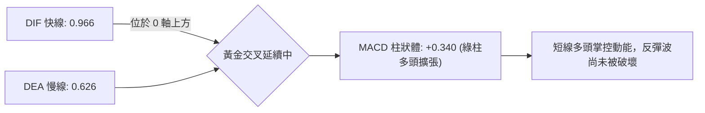

- **數值解析**：MACD 線為 **0.966**，訊號線為 **0.626**，柱狀體（Histogram）為 **+0.340**。
- **交叉狀態**：MACD 在 0 軸上方維持金叉狀態，柱狀體維持正值，確認短線反彈動能依然有效運行中。然而週線 MACD 柱狀體近期由 +4.827 收斂至 +0.340，顯示中期反彈力道有減速跡象，進入震盪整固期。

### 📦 布林通道分析

```
ORCL 布林通道 (20, 2) 結構圖
═══════════════════════════════════════════════════════════════════════
$161.01 ─────────────────────────────────────────────── 布林上軌 (Upper Band)
                                                       ▲ 阻力區
$144.76 ───────────────────●─────────────────────────── 現價 ($144.76, %B = 0.54)
$143.16 ----------------------------------------------- 布林中軌 (MA20)
                                                       ▼ 支撐區
$125.31 ─────────────────────────────────────────────── 布林下軌 (Lower Band)
═══════════════════════════════════════════════════════════════════════
```

- **通道帶寬與位置**：上軌 **$161.01**，中軌 **$143.16**，下軌 **$125.31**。帶寬落差 $35.70。
- **%B 指標解析**：$\%B = (144.76 - 125.31) / (161.01 - 125.31) = 0.54$。
- **技術解讀**：%B 略高於 0.50，顯示價格已從下軌反彈並站穩中軌（MA20: $143.16）。在 ADX=17.40 的盤整格局下，布林通道上下軌構成最主要的震盪邊界（下軌 $125.31 ~ 上軌 $161.01）。

### 💹 成交量分析（量價配合度）

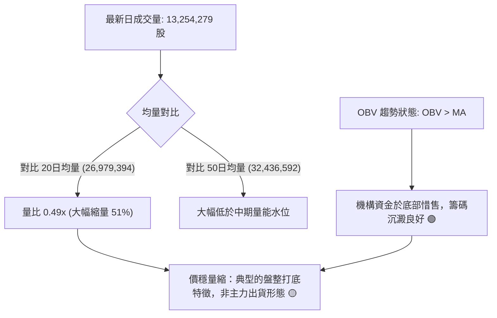

- **量能萎縮解讀**：當前成交量僅 1,325 萬股，量比僅 0.49x。在反彈遇阻 R1 ($148.55) 回落過程中，成交量急劇萎縮，顯示市場並未出現恐慌拋壓。
- **OBV 能量潮確認**：OBV 維持在自身移動平均線上方（`OBV > MA`），確認 2026-07 暴跌以來的低檔放量買盤具備實質承接力，量價結構支持現價於 $135.51-$148.55 區間構築底部。

---

## 6. 動能與波動率

### ⚡ 動能評估

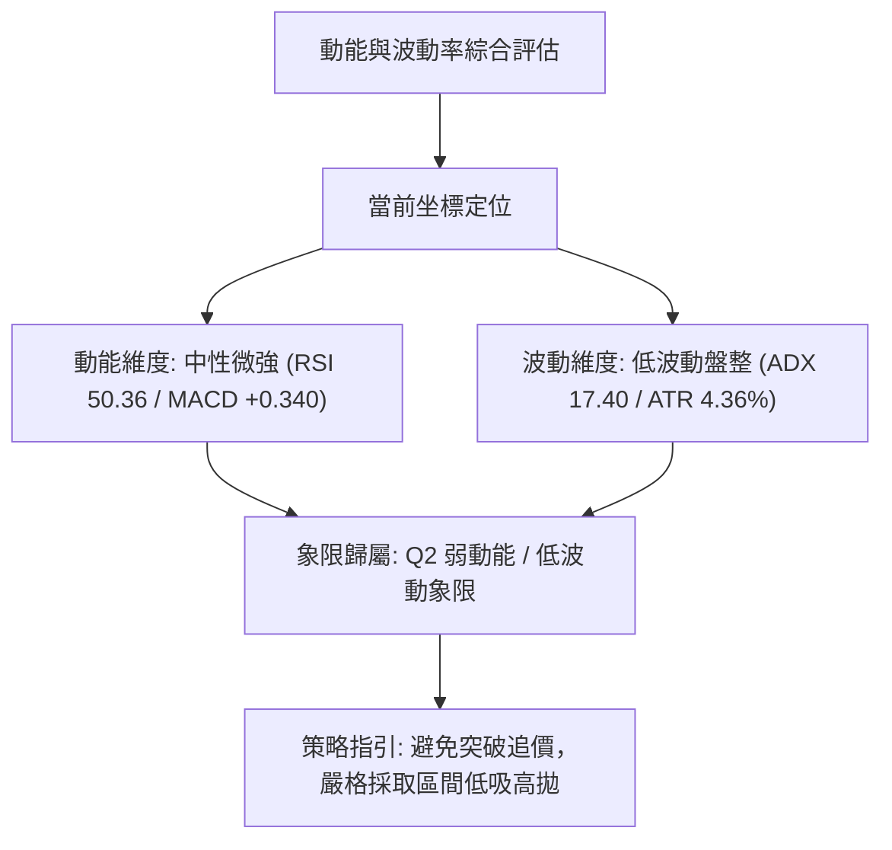

#### 動能與波動率四象限對照表

| 象限 | 動能強度 | 波動率水準 | 當前狀態 | 技術特徵與操作策略評估 |
|:---:|:---:|:---:|:---:|:---|
| **Q1** | 強動能 | 低波動 | — | 穩定單邊趨勢，最佳順勢加碼機會 |
| **Q2** | **中弱動能** | **低波動** | **✓ (ORCL 當前位置)** | **區間震盪築底，動能不足以發動大單邊，宜防守觀望或區間操作** |
| **Q3** | 強動能 | 高波動 | — | 狂熱主升或恐慌拋售，高風險高回報 |
| **Q4** | 弱動能 | 高波動 | — | 無序劇烈洗盤，極易引發連續雙向止損，應嚴格空倉 |

### 📊 ATR 波動率分析

```
ATR(14) 每日波動空間示意圖
═══════════════════════════════════════════════════════════════════════
當前價格：$144.76 ｜ ATR(14) 數值：$6.31 (佔股價 4.36%)
日極限上檔預期 (Price + 1 ATR)：$151.07 (觸及 R1 $148.55 阻力帶)
日極限下檔預期 (Price - 1 ATR)：$138.45 (接近 S1 $135.51 支撐帶)
建議多頭防守止損距離 (1.5 ATR)：$9.47 ──► 止損價設於 $135.29 (S1 $135.51 邊緣)
建議多頭寬鬆止損距離 (2.0 ATR)：$12.62 ──► 止損價設於 $132.14
═══════════════════════════════════════════════════════════════════════
```

- **ATR 數值解讀**：ATR(14) 為 **$6.31**，日波動率約 4.36%。此數值較 6-7 月暴跌時期明顯收縮，反映市場恐慌情緒降溫，進入低波動整理階段。
- **交易風控應用**：任何日內或波段交易之止損緩衝區間不得小於 1.0 ATR ($6.31)，短線策略理想止損點應設於 1.5 ATR（約 $9.50）之外，以避免被正常市場噪聲震盪出場。

### 📐 Beta 與市場相關性

- **Beta 係數**：**1.718**（高貝塔屬性）。
- **市場意涵**：
  - ORCL 相對標普 500 指數具有 **1.718 倍** 的放大波動敏感度。
  - 當大盤（S&P 500 / 科技板塊）出現系統性反彈時，ORCL 將展現更強的彈性爆發力；反之，若大盤回檔，ORCL 的下行風險亦被顯著放大。
  - 鑑於高 Beta 特徵，交易時必須嚴格控制單筆開倉槓桿與總部位佔比。

---

## 7. 多時框架總結

### 📋 時框架評分表

| 時框架 | 趨勢方向 | 動能指標 | 均線排列 | 圖表形態 | 綜合評分 | 操作建議 |
|:---|:---:|:---:|:---:|:---:|:---:|:---|
| **長期 (月線)** | 🔴 偏空 | 🔴 弱勢反彈 | 🔴 空頭排列 (MA200之下) | 頭肩頂破位後深幅回調 | 35/100 | 嚴禁長線大舉盲目抄底 |
| **中期 (週線)** | 🟡 震盪 | 🟢 MACD金叉 | 🔴 空頭排列 (承壓MA60) | 52W低點後之反彈中繼 | 52/100 | 等待底部形態二次確認 |
| **短期 (日線)** | 🟢 偏多 | 🟢 MACD柱正 | 🟢 收復MA20與MA50 | 站穩布林中軌向上挑戰 | 58/100 | 區間操作，逢低吸納 |
| **全時框收斂** | 🟡 **中性震盪** | 🟡 **動能平衡** | 🔴 **長空短多** | **區間震盪打底格局** | **48/100** | **區間高拋低吸 / 觀望** |

### 🔲 綜合訊號矩陣

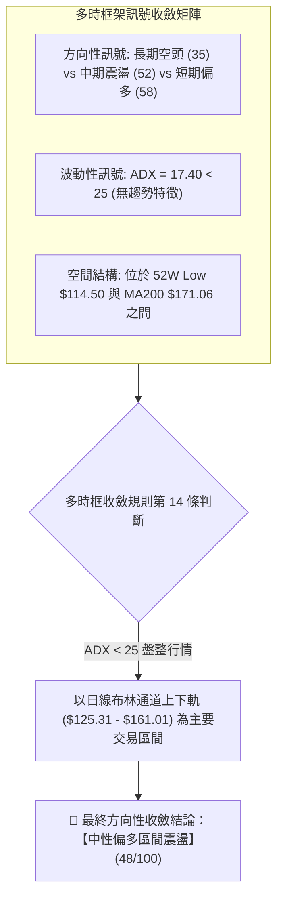

### ⚖️ 多時框收斂結論

根據**嚴格要求 14 之多時框收斂規則**：
1. **行情屬性判定**：當前日線 ADX(14) 數值為 **17.40 (< 25)**，明確定義當前市場處於**「盤整行情（Range-bound Market）」**，而非單邊趨勢行情。
2. **主導時框與交易邊界**：在盤整行情中，中長期均線趨勢權重暫時退居次要，交易邊界由**日線布林通道上下軌（下軌 $125.31 ↔ 上軌 $161.01）**及**波段關鍵支撐阻力（S1 $135.51 ↔ R1 $148.55 / R2 $159.26）**主導。
3. **方向性唯一結論**：**中性觀望 / 區間震盪低吸**。短線價格站上 MA20 ($143.16) 及 MA50 ($143.62) 提供反彈基礎，但受制於上方 R1 ($148.55) 與 R2 ($159.26) 壓制，策略應聚焦於「區間下緣低吸、上緣減碼」之網格震盪交易，不具備盲目追高之單邊多頭條件。

---

## 8. 交易策略建議

### 🗺️ 策略決策流程圖

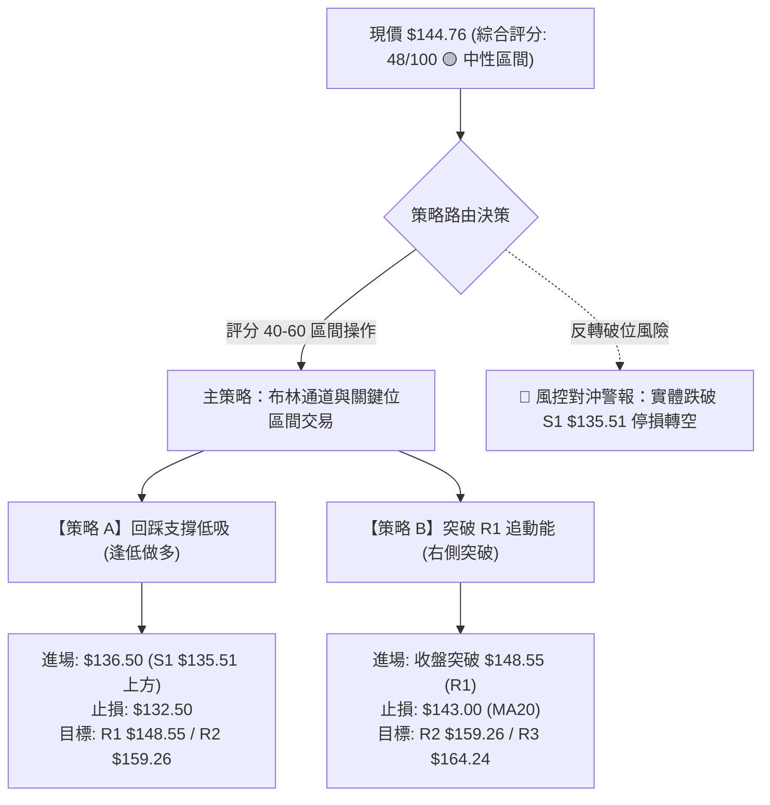

### 🧭 策略路由

> **當前主策略方向 = 🟡 區間震盪操作（依評分 48/100，介於 40–60 中性區間，以布林通道與關鍵支撐阻力為主，等待突破確認）**

### 🎯 價格情境階梯（Price Scenarios）

| 觸發條件 | 下一目標 | 後續延伸 | 情境含義與操作指引 |
|:---|:---:|:---:|:---|
| **強勢突破 R1 $148.55** | **R2 $159.26** | **R3 $164.24** | 短線轉強，雙底頸線被攻克，右側動能加碼點 |
| **站穩現價區間 ($143.16 - $148.55)** | — | — | 於 MA20/MA50 蓄勢震盪，維持區間高拋低吸 |
| **實體跌破 S1 $135.51** | **S2 $114.50** | **$110.00** | 中期打底失敗，空頭重啟下探 52W Low，嚴格停損 |

### 📊 情境機率分佈

```
情境機率分佈圓餅圖
╔══════════════════════════════════════════════════════════════╗
║  區間震盪整固 (55%)        ██████████████████████░░░░░░░░░░  ║
║  向上突破反彈 (30%)        ████████████░░░░░░░░░░░░░░░░░░░░  ║
║  破位向下探底 (15%)        ██████░░░░░░░░░░░░░░░░░░░░░░░░░░  ║
╚══════════════════════════════════════════════════════════════╝
```

| 情境 | 機率 | 主要依據（指標狀態） |
|:---|:---:|:---|
| **區間震盪整固** | **55%** | ADX 17.40 顯示極弱趨勢；成交量僅 0.49x 縮量整理；布林 %B 為 0.54 處於中軌 |
| **向上突破反彈** | **30%** | MACD 柱狀體維持正值 (+0.340)；OBV > MA 資金沉澱；現價已收復 MA20/MA50 |
| **破位向下探底** | **15%** | 均線長空格局未變 (MA200 $171.06 壓頂)；-DI (23.73) 仍微幅高於 +DI (21.47) |

### 🟢 主策略詳情

本策略組合嚴格依據第 4 章計算之關鍵價位設計：

| 策略要素 | 策略 A（左側回踩低吸 — 推薦） | 策略 B（右側突破追買） |
|:---|:---|:---|
| **策略邏輯** | 依託 S1 支撐與布林下軌低吸 | 依託頸線 R1 突破動能跟進 |
| **進場條件** | 股價拉回 S1 ($135.51) 附近且出現日線止跌K線 | 日線收盤價實體突破關鍵阻力 R1 ($148.55) |
| **進場價格** | **$136.50** (S1 $135.51 略上方) | **$149.00** (突破 R1 $148.55 後確認) |
| **目標價 T1** | **$148.55** (關鍵阻力 R1) | **$159.26** (關鍵阻力 R2 / 布林上軌 $161.01) |
| **目標價 T2** | **$159.26** (關鍵阻力 R2) | **$164.24** (強阻力 R3 / 斐波 78.6% $163.15) |
| **止損價格** | **$132.50** (跌破 S1 $135.51 與 1.0 ATR) | **$143.00** (跌破布林中軌 MA20 $143.16) |
| **風險空間** | $4.00 ($136.50 - $132.50) | $6.00 ($149.00 - $143.00) |
| **報酬空間 (T1)**| $12.05 ($148.55 - $136.50) | $10.26 ($159.26 - $149.00) |
| **風險報酬比 (R:R)**| **1 : 3.01** (極佳) | **1 : 1.71** (合理) |
| **成功機率** | **60%** | **50%** |
| **建議倉位** | **10% - 15%** | **8% - 10%** |

### 🔴 反向風險觸發點（對沖提示）

- **多頭全面棄守線**：若日線收盤價跌破 **S1: $135.51**，代表 7 月以來的反彈結構徹底破位，區間打底失敗。
- **對沖應對動作**：所有多頭部位立即全數止損出場；積極型交易者可建立空頭部位或買入認售期權（Puts），向下鎖定 52W 低點 **S2: $114.50** 作為回補目標。

### ⭐ 整體訊號強度評星

```
做多訊號強度：★★★☆☆  (3/5 星 — 處於築底修復期，具備賠率優勢)
做空訊號強度：★★☆☆☆  (2/5 星 — 低檔縮量且獲支撐，下行空間受限)
整體可信度：  ★★★☆☆  (3/5 星 — 盤整期指標易反覆，需嚴守風控)
```

---

## 9. 風險提示與監控

### ✅ 關鍵監控指標 Checklist

```
╔══════════════════════════════════════════════════════════════╗
║                 每日技術監控清單 (Monitoring)                ║
╠══════════════════════════════════════════════════════════════╣
║ [ ] 價格是否維持在布林中軌 MA20 ($143.16) 上方收盤？          ║
║ [ ] 日線成交量是否放大至 2,000 萬股以上（縮量突破無效）？    ║
║ [ ] ADX(14) 是否由 17.40 向上穿越 20-25，確認新趨勢啟動？     ║
║ [ ] MACD 柱狀體是否持續維持正值（未翻負跌破 0 軸）？          ║
║ [ ] RSI(14) 是否能維持在 50 中軸之上運作？                    ║
║ [ ] 向上是否實體突破 R1: $148.55，或向下跌破 S1: $135.51？    ║
╚══════════════════════════════════════════════════════════════╝
```

### ⚠️ 風險場景分析

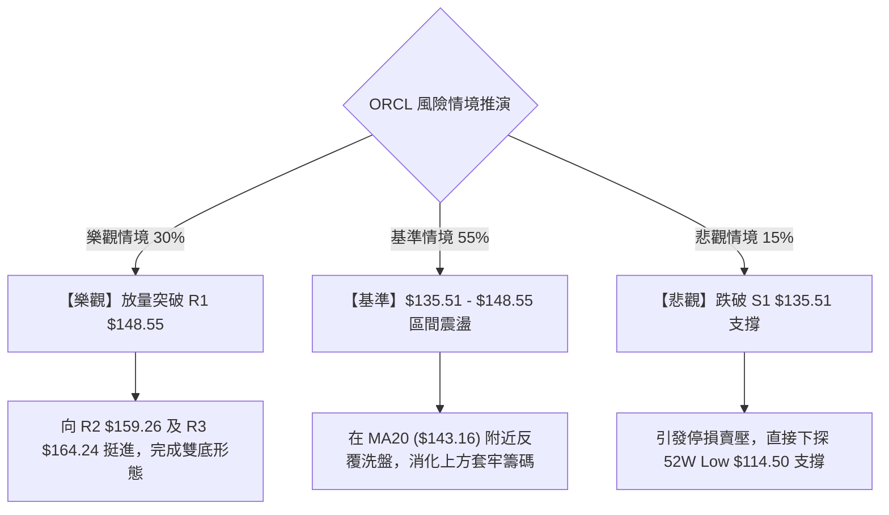

### 🛡️ 風險管理重要提醒

1. **Beta 波動控制**：ORCL Beta 高達 **1.718**，屬於高波動品種。在盤整市況下，單筆交易虧損上限應嚴格控制在總投資組合淨值的 **1.0%** 以內。
2. **均線壓制風險**：股價上方存在 MA60 ($155.56)、MA120 ($161.59) 及 MA200 ($171.06) 等多重下行均線壓制，任何反彈接近此區域若量能不濟，均為潛在減碼點，切忌過度樂觀期待 V 型反轉。
3. **無趨勢磨損風險**：ADX 處於 17.40，指標在盤整區間容易產生頻繁的假金叉與假死叉，應減少日內頻繁進出，以設定好之價格階梯（S1 $135.51 與 R1 $148.55）作為唯一執行依據。

---

## 📋 報告總結

```
╔══════════════════════════════════════════════════════════════════╗
║                    ORCL 技術分析報告總結                         ║
╠══════════════════════════════════════════════════════════════════╣
║ 報告日期：2026-08-26                                             ║
║ 當前價格：$144.76 (52W 區間 13.3% 水位)                          ║
║ 分析評級：🟡 48/100 — 區間震盪築底 / 中性觀望                    ║
╠══════════════════════════════════════════════════════════════════╣
║ 關鍵結論：                                                       ║
║ ├─ 長期趨勢：🔴 空頭主導 (現價遠低於 MA200 $171.06 達 -15.38%)   ║
║ ├─ 中期趨勢：🟡 築底震盪 (52W Low $114.50 止跌後之修復波)        ║
║ ├─ 短期趨勢：🟢 偏多微調 (現價站上 MA20 $143.16 與 MA50 $143.62) ║
║ ├─ 關鍵支撐：S1: $135.51 ｜ S2: $114.50 (52W Low 強支撐)         ║
║ ├─ 關鍵阻力：R1: $148.55 ｜ R2: $159.26 ｜ R3: $164.24           ║
║ └─ 分析師共識：買入 (41位分析師，目標均價: $246.43)              ║
╠══════════════════════════════════════════════════════════════════╣
║ 最優策略組合：                                                   ║
║ 1. 🥇 最佳機會（策略 A）：回踩支撐低吸                           ║
║    進場 $136.50 ｜ 止損 $132.50 ｜ 目標 $148.55 / $159.26        ║
║    (風險報酬比 1:3.01，勝率約 60%，倉位 10-15%)                  ║
║ 2. 🥈 次選機會（策略 B）：右側突破追買                           ║
║    突破 $148.55 進場 $149.00 ｜ 止損 $143.00 ｜ 目標 $159.26    ║
║    (風險報酬比 1:1.71，勝率約 50%，倉位 8-10%)                   ║
║ 3. 🥉 保守選擇：空倉觀望，靜待日線 ADX > 25 確認趨勢方向         ║
╚══════════════════════════════════════════════════════════════════╝
```

---

> ⚠️ **免責聲明**：本報告為 AI 自動生成之技術分析，所有數據及估算均基於提供的歷史價格資訊。本報告**僅供研究與學術參考**，**不構成任何投資建議**。投資有風險，入市需謹慎。

---

*報告生成時間：2026-08-26 ｜ 數據來源：Yahoo Finance ｜ 分析框架：多時框技術分析*