# ORCL 技術分析報告

> **報告日期**：2026-08-27 ｜ **語言**：繁體中文 ｜ **數據來源**：Yahoo Finance ｜ **當前價格**：$148.87

---

## 目錄

| 章節 | 內容 |
|------|------|
| [1. 技術面概覽](#1-技術面概覽) | 訊號儀表板、核心指標、評分卡 |
| [2. 趨勢分析](#2-趨勢分析) | 多時框趨勢、長中短期走勢、ADX 解讀 |
| [3. 圖表形態分析](#3-圖表形態分析) | 形態識別、K線組合、目標價推算 |
| [4. 支撐與阻力](#4-支撐與阻力) | 關鍵價位分布、斐波那契回調結構 |
| [5. 技術指標深度解讀](#5-技術指標深度解讀) | MA/RSI/MACD/布林/成交量量價關係 |
| [6. 動能與波動率](#6-動能與波動率) | 動能四象限、ATR 風險評估、Beta 係數 |
| [7. 多時框架總結](#7-多時框架總結) | 時框架評分矩陣與收斂結論 |
| [8. 交易策略建議](#8-交易策略建議) | 區間交易策略、進出場與風報比 |
| [9. 風險提示與監控](#9-風險提示與監控) | 關鍵監控清單與情境應對 |

---

## 1. 技術面概覽

### 🎯 技術訊號儀表板

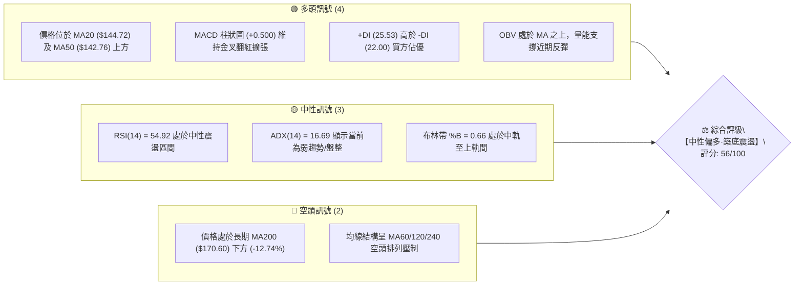

### 📊 核心指標速覽表

| 指標類別 | 指標名稱 | 當前數值 | 訊號 | 解讀 |
|:---|:---|:---|:---:|:---|
| **價格結構** | 收盤價 | $148.87 | 🟡 | 位於52週區間 15.1% 分位，自 $114.50 底部強勁回升 |
| **短期均線** | MA20 | $144.72 | 🟢 | 價格在均線上方 +2.87%，短線多頭掌控主動權 |
| **中期均線** | MA50 | $142.76 | 🟢 | 價格突破並站穩 MA50，形成第一道防禦支撐 |
| **長期均線** | MA200 | $170.60 | 🔴 | 價格低於長期牛熊線 -12.74%，長期空頭壓力沉重 |
| **動能指標** | RSI(14) | 54.92 | 🟡 | 位於 30–70 中性強弱分界，動能溫和未見極端背離 |
| **動能指標** | MACD (12,26,9) | 1.252 / 0.751 | 🟢 | MACD 線高於訊號線，柱狀圖 +0.500 持續看多 |
| **趨勢強度** | ADX(14) | 16.69 | 🟡 | ADX < 25 表明處於盤整震盪市，非單邊趨勢行情 |
| **通道指標** | 布林通道 | $131.32 - $158.11 | 🟡 | %B = 0.66，價格朝上軌 $158.11 靠攏，空間受限 |
| **波動指標** | ATR(14) | $6.24 | 🟡 | 佔股價 4.19%，日內波幅較大，具備短線波段空間 |

### 🏆 技術評分卡

```
╔══════════════════════════════════════════════════════════════╗
║              技術評分卡 — ORCL (2026-08-27)                  ║
╠══════════════════════════════════════════════════════════════╣
║ 趨勢強度 (ADX=16.69)  ██████░░░░░░░░░░░░░░  35/100 🟡 弱勢盤整 ║
║ 動能指標 (RSI/MACD)   ████████████░░░░░░░░  62/100 🟢 金叉偏多 ║
║ 支撐穩定度 (S1=$135.89)██████████████░░░░░  70/100 🟢 雙底支撐 ║
║ 成交量配合 (OBV>MA)   ████████████░░░░░░░░  60/100 🟢 量能回升 ║
║ 形態完整度 (雙重底)   ████████████░░░░░░░░  60/100 🟡 築底頸線 ║
║ 均線排列 (長空短多)   ████████░░░░░░░░░░░░  48/100 🟡 混合整理 ║
╠══════════════════════════════════════════════════════════════╣
║ 綜合評分              ███████████░░░░░░░░░  56/100 🟡 區間偏多 ║
╚══════════════════════════════════════════════════════════════╝
```

---

## 2. 趨勢分析

### 🌐 多時框趨勢分析

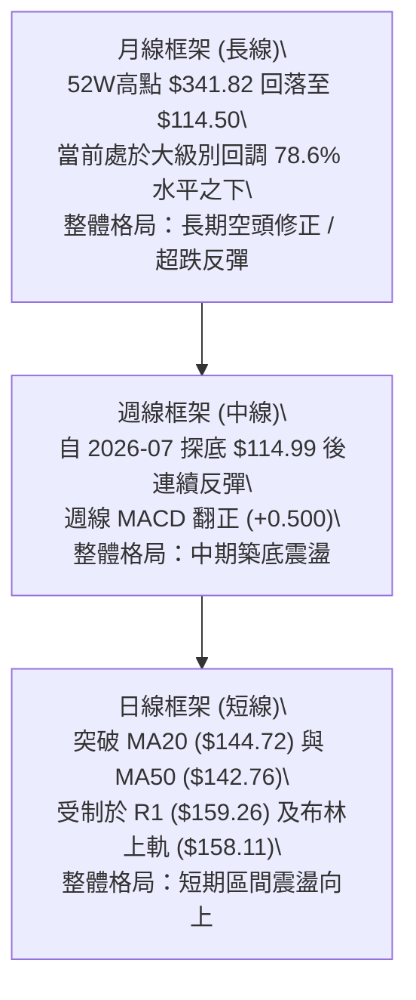

### 📈 長期趨勢 — 12個月走勢圖（Unicode）

```
ORCL 月線走勢圖（2025-08 至 2026-08）
價格軸 ($)
$280 ┤                ● 278.07 (2025-09 波段高點)
$260 ┤                    ● 260.10
$240 ┤
$220 ┤● 223.58                      ● 225.00 (2026-05 反彈次高)
$200 ┤            ● 200.02
$180 ┤                ● 193.05
$160 ┤                    ● 163.44        ● 160.83
$140 ┤                        ● 144.39        ● 146.04        ● 148.87 (現價)
$120 ┤                            ● 146.09        ● 129.87 (2026-07)
     └──────────────────────────────────────────────────────────
       08  09  10  11  12  01  02  03  04  05  06  07  08 (月份)
```

#### 走勢特徵分析表格

| 階段區間 | 起止價位 | 漲跌幅 | 走勢特徵解讀 | 量價結構 |
|:---|:---|:---:|:---|:---|
| **2025-08 ~ 2025-09** | $223.58 → $278.07 | +24.37% | 主升浪頂部衝刺，創歷史次高波段 | 放量見頂 |
| **2025-10 ~ 2026-02** | $260.10 → $144.39 | -44.49% | 主跌浪下殺，連續跌破各級均線 | 縮量陰跌 |
| **2026-03 ~ 2026-05** | $146.09 → $225.00 | +54.01% | 劇烈反彈浪，受財報與業績預期刺激 | 脈衝放量 |
| **2026-06 ~ 2026-07** | $225.00 → $129.87 | -42.28% | 快速二次下殺，觸及 52W 低點 $114.50 附近 | 恐慌放量拋售 |
| **2026-08 (當前)** | $129.87 → $148.87 | +14.63% | 底部回升，收復短期均線，進入盤整修復 | 溫和回量 |

### 📊 中期趨勢（週線分析）

```
ORCL 中期週線支撐與阻力通道結構
$170.57 ────────────────────────────────── [R3 強阻力 / MA200 壓制]
$164.24 ---------------------------------- [R2 中期阻力]
$159.26 ══════════════════════════════════ [R1 關鍵阻力 / 頸線區間]
$148.87 ◄────── [當前現價 $148.87]
$135.89 ══════════════════════════════════ [S1 第一支撐 / 近期築底平台]
$114.50 ────────────────────────────────── [S2 52週極限強支撐]
```

### ⚡ 趨勢強度評估（ADX 解讀）

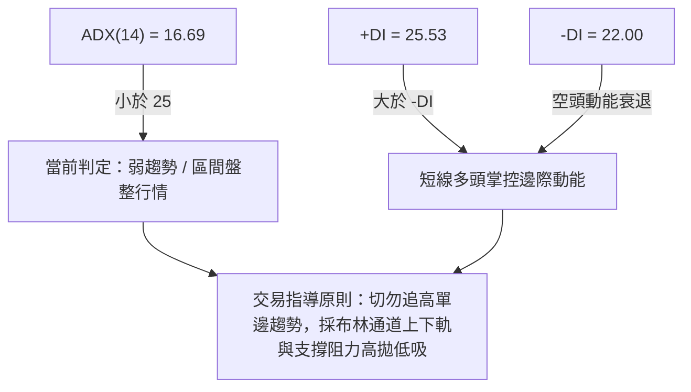

| 指標名稱 | 數值 | 參考閾值 | 當前狀態判定 | 交易策略意義 |
|:---|:---:|:---:|:---:|:---|
| **ADX(14)** | **16.69** | 25.00 | 弱趨勢 / 盤整震盪 | 禁止使用單邊突破追價策略，以震盪指標為主 |
| **+DI** | **25.53** | - | 多方動能佔優 | 反彈動能仍存，支撐逢低承接買盤 |
| **-DI** | **22.00** | - | 空方動能減弱 | 空方暫無打壓破底能力 |

---

## 3. 圖表形態分析

### 🔍 形態識別系統

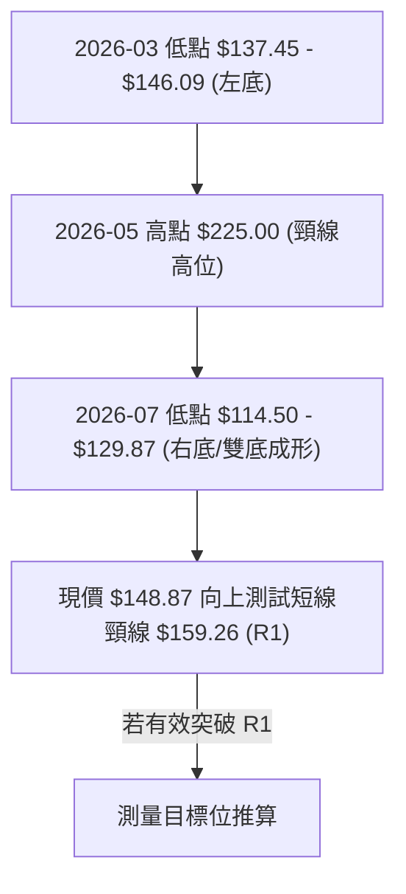

#### 形態識別信心度評估表

| 形態名稱 | 信心度 | 判斷依據（引用數據） | 完成度 | 目標價（附嚴格計算式） |
|:---|:---:|:---|:---:|:---|
| **波段雙重底 (Double Bottom)** | **65%** | 2026-03 築底區間與 2026-07 低點 $114.50 構成大週期雙底支撐帶，當前站穩 S1 $135.89 | 60% | 頸線阻力 R1 $159.26 - 低點 S1 $135.89 = 高度 $23.37。<br>突破 R1 向上推算目標：$159.26 + $23.37 = **$182.63**（若受壓則回測 $135.89） |
| **布林帶向上擠壓反彈** | **75%** | 股價由布林下軌 $131.32 向上穿過中軌 $144.72，朝上軌 $158.11 推進 | 85% | 短線通道目標價即為布林上軌 **$158.11**（與 R1 $159.26 聚類） |

### 🕯️ 重要K線形態分析

| 週/月份 | 收盤價 | K線形態 | 解讀 | 訊號 |
|:---|:---:|:---|:---|:---:|
| **2026-07-26 週** | $114.99 | 探底長下影線錘子線 | 股價下探 52W 低點 $114.50 後迅速獲大單支撐抄底收復 | 🟢 強力反轉 |
| **2026-08-02 週** | $129.87 | 大陽線確認底部 | 週線成交量達 1.73 億股，確認底部成立 | 🟢 多頭確認 |
| **2026-08-09 週** | $147.02 | 貫穿破位均線長陽 | 一舉突破日線 MA20 與 MA50，MACD 柱狀圖暴增至 +4.827 | 🟢 強烈買訊 |
| **2026-08-23 週** | $146.47 | 高位縮量十字星回踩 | 測試 MA20 支撐不破，成交量萎縮至 1.01 億股，屬於良性消化 | 🟡 蓄勢整理 |
| **2026-08-30 (當前)** | $148.87 | 企穩小陽線 | 價格重回 $148.87，均線系統短多確認 | 🟢 溫和看多 |

### 📉 ASCII 走勢形態示意圖

```
ORCL 近期「雙底反彈」形態結構示意圖
價格
$160 ┤                      [阻力位 R1: $159.26 / 形態頸線]
     ├                      ┌─────────────────────────
$150 ┤                     /  ● 現價 $148.87 (右肩回升)
     ├      ● $146.09     /
$140 ┤     / (左底區間)  /
     ├    /  \          /
$130 ┤   /    \        /  ● 支撐平台 S1: $135.89
     ├  /      \      /
$120 ┤ /        \    /
     ├/          \  /
$110 ┤            ● $114.50 (52W 極限低點 / 右底最低點)
     └─────────────────────────────────────────────────
       2026-03    2026-06     2026-07    2026-08 (當前)
```

---

## 4. 支撐與阻力

### 🗺️ 關鍵價位分布圖（Unicode）

```
ORCL 價位結構分布圖
══════════════════════════════════════════════════════════════════
$170.57 ║████████████████████████████████████║ 強阻力 R3 (MA200 壓制帶)
$164.24 ║████████████████████████            ║ 阻力 R2 (密集成交區)
$159.26 ║████████████████████████████████    ║ 關鍵阻力 R1 (頸線/布林上軌聚類)
$148.87 ╠════════════════════════════════════╣ ◄ 當前收盤價 ($148.87)
$135.89 ║▓▓▓▓▓▓▓▓▓▓▓▓▓▓▓▓▓▓▓▓▓▓▓▓            ║ 近期支撐 S1 (日線回踩平台)
$114.50 ║████████████████████████████████████║ 強支撐 S2 (52週極限低點)
══════════════════════════════════════════════════════════════════
```

### 🚧 阻力位分析表

| 阻力級別 | 價位 | 形成原因 | 突破難度 | 重要性 |
|:---|:---:|:---|:---:|:---:|
| **R1 (近端阻力)** | **$159.26** | 近一年波段高點聚類位，且與布林上軌 ($158.11) 形成重疊共振壓制 | 🟡 中等 | ★★★★☆ |
| **R2 (波段阻力)** | **$164.24** | 斐波那契 78.6% 回調位 ($163.15) 附近密集成交拋壓區 | 🔴 較高 | ★★★★☆ |
| **R3 (強阻力)** | **$170.57** | 長期均線 MA200 ($170.60) 所在之牛熊分水嶺，空頭核心防線 | 🔴 極高 | ★★★★★ |

### 🛡️ 支撐位分析表

| 支撐級別 | 價位 | 形成原因 | 守住機率 | 重要性 |
|:---|:---:|:---|:---:|:---:|
| **S1 (近端支撐)** | **$135.89** | 近一年波段低點聚類，且與日線 MA20 ($144.72)/MA50 ($142.76) 形成多層緩衝帶 | 🟢 75% | ★★★★☆ |
| **S2 (終極支撐)** | **$114.50** | 52 週最低點，機構建倉長下影線核心防禦點 | 🟢 90% | ★★★★★ |

### 📐 斐波那契回調位分析

依據 52 週極值區間（低點 **$114.50** → 高點 **$341.82**），計算全週期回調位：

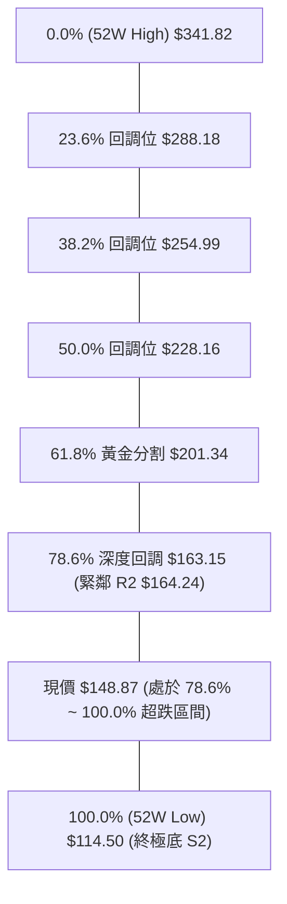

- **位置解讀**：現價 **$148.87** 目前深處於 78.6%（$163.15）與 100.0%（$114.50）之間的極深回調帶。
- **技術意義**：跌破 61.8%（$201.34）後長期多頭結構已破壞；但股價在接近 100% 處（$114.50）獲得強烈支撐並展開 ABC 反彈，當前正向上挑戰 78.6% 回調位（$163.15）的阻力關口。

---

## 5. 技術指標深度解讀

### 🎛️ 指標訊號總覽

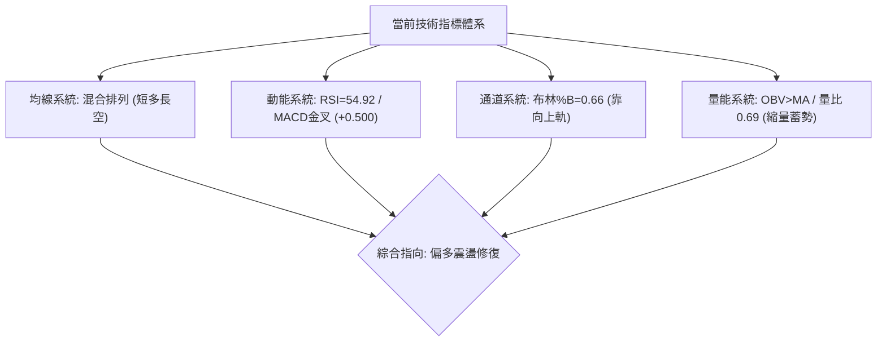

### 📈 移動平均線排列分析

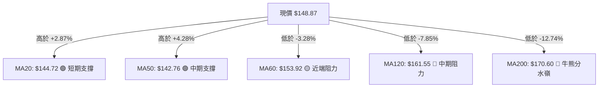

- **均線排列狀態**：短週期均線（MA5 $144.92、MA10 $146.46、MA20 $144.72、MA50 $142.76）已形成向上發散的多頭共振，構成下檔密集防護網；但中長週期均線（MA60 $153.92、MA120 $161.55、MA200 $170.60、MA240 $189.48）仍呈空頭向下排列，表明上方解套賣壓層層疊加。

### 📉 RSI(14) 分析

```
RSI(14) 數值儀表板: 54.92
[超賣 0] ───────── [30] ───────── [50] ────●──── [70] ───────── [100 超買]
強度進度條: ███████████░░░░░░░░░ 54.92% (中性偏強)
```

- **背離分析判斷**：日線 RSI(14) 為 54.92，自 2026-07 探底超賣區（11.1~14.9）回升至中軸 50 上方，目前**無頂背離亦無底背離**現象，動能平穩健康，未呈現過熱或衰竭。

### 📊 MACD(12/26/9) 訊號解讀

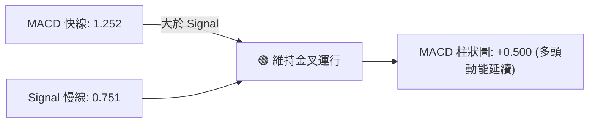

- **柱狀圖動態**：MACD 柱狀圖讀數為 **+0.500**，連續處於正值區間，確認短線多方動能主導反彈。

### 📦 布林通道分析

```
ORCL 日線布林通道結構 (BB 20, 2)
$158.11 ┬────────────────────────────────────────── BB 上軌 (壓力區)
        │
$148.87 ┼───────────────────● 現價 (%B = 0.66)
        │
$144.72 ┼────────────────────────────────────────── BB 中軌 (MA20 支撐)
        │
$131.32 ┴────────────────────────────────────────── BB 下軌 (超賣支撐)
```

- **通道帶寬與位置**：%B = 0.66，股價位於中軌至上軌的上半區間，目前通道開口呈現收斂後平緩微幅向上，短線直接向上爆發空間受制於上軌 $158.11。

### 💹 成交量分析（量價配合度）

- **量能結構**：最新日成交量為 18.29M 股，相較於 20 日均量 26.49M 股（量比 0.69x），呈現反彈過程中的**縮量整理**特徵。
- **OBV 量能趨勢**：OBV > MA，且週線在底部 $114.50~$129.87 出現持續 1.6~2.5 億股的巨量換手，顯示主力籌碼已於低位完成承接，量價配合健康。

---

## 6. 動能與波動率

### ⚡ 動能評估四象限

| 象限 | 動能維度 (MACD/RSI) | 波動率維度 (ATR/ADX) | 當前狀態判定 | 交易策略指示 |
|:---:|:---:|:---:|:---:|:---|
| **Q1** | 強動能 | 低波動 | ─ | 最佳穩健追隨趨勢 |
| **Q2 (當前)** | **中強動能 (MACD>0)** | **低波動/盤整 (ADX=16.69)** | **✓ ORCL 處於此區** | **適合震盪區間內高拋低吸，嚴禁突破追價** |
| **Q3** | 強動能 | 高波動 | ─ | 高風險高爆發突破 |
| **Q4** | 弱動能 | 高波動 | ─ | 破位下殺，嚴格觀望 |

### 📊 ATR 波動率分析

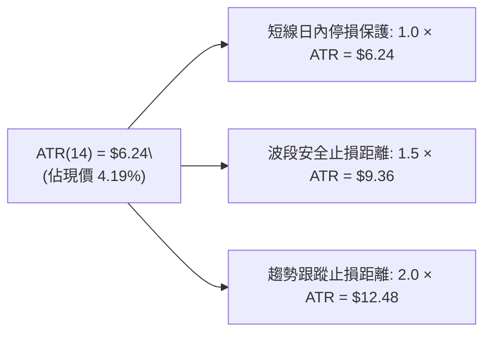

- **波動率實戰解讀**：每日平均波幅達 $6.24，對於現價 $148.87 而言波動具備足夠波段彈性；任何交易進場之止損點位設置應至少保留 **1.5 倍 ATR（約 $9.36）**，以避免被日內正常雜訊震盪洗出場。

### 📐 Beta 與市場相關性

- **Beta 係數**：**1.718**（高彈性 Beta 標的）。
- **解讀**：ORCL 對科技板塊及標普 500 指數的波動敏感度高達 1.72 倍。在目前美股雲端運算板塊修正震盪期間，該股波動幅度顯著放大，適合順應短線大盤節奏操作，但需嚴格控制持倉比例。

---

## 7. 多時框架總結

### 📋 時框架評分表

| 時框架 | 趨勢方向 | 動能狀態 | 均線排列 | 形態結構 | 評分 | 戰術建議 |
|:---|:---:|:---:|:---:|:---:|:---:|:---|
| **月線 (長期)** | 🔴 下行修正 | 🟡 弱勢企穩 | 🔴 MA200 下方 | 52W 低點反彈 | **38/100** | 長線未扭轉熊市，以減磅防守為主 |
| **週線 (中期)** | 🟡 底部震盪 | 🟢 翻紅金叉 | 🟡 均線收斂 | 雙底構築中 | **58/100** | 中期逢低佈局，等待突破頸線確認 |
| **日線 (短期)** | 🟢 震盪反彈 | 🟢 溫和看多 | 🟢 站上MA20/50 | 布林中軌反彈 | **65/100** | 短線區間操作，依支撐阻力高拋低吸 |

### 🔲 綜合訊號矩陣

```
時框一致性分析：
短期 (日線: 偏多 🟢)  ──┐
中期 (週線: 震盪 🟡)  ──┼──► 總體收斂：【ADX<25 盤整行情下的區間偏多操作】
長期 (月線: 偏空 🔴)  ──┘
```

### ⚖️ 多時框收斂結論

> **唯一方向性結論：【中性偏多·區間震盪操作】**
>
> - **收斂依據**：當前 ADX(14) 讀數為 **16.69（< 25）**，嚴格判定當前市場為**非單邊趨勢之「盤整震盪行情」**。
> - **時框主導權**：根據收斂規則，盤整市況下以**日線布林通道（$131.32 ~ $158.11）與關鍵支撐阻力（S1 $135.89 ~ R1 $159.26）**為主導交易區間。日線短多動能受制於週月線上方沉重的 R2 $164.24 與 MA200 ($170.60) 壓力，故主策略嚴禁追高，採取「**區間下軌承接、上軌前獲利了結**」之精準震盪交易邏輯。

---

## 8. 交易策略建議

### 🗺️ 策略決策流程圖

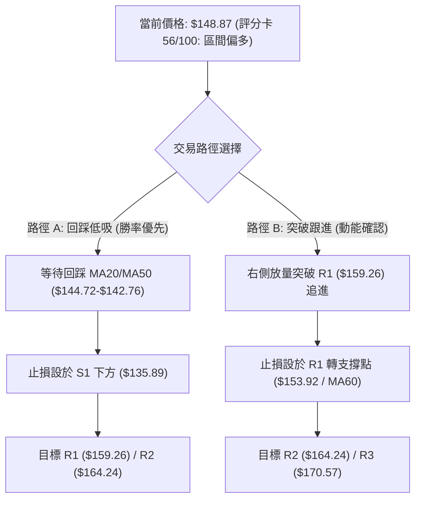

### 🧭 策略路由

**當前主策略方向 = 【區間偏多·低吸高拋策略】（依評分卡 56/100，40–60 區間震盪規則）**

### 🎯 價格情境階梯（Price Scenarios）

| 觸發條件 | 第一目標 (T1) | 第二延伸目標 (T2) | 風險停損點 | 情境技術含義 |
|:---|:---:|:---:|:---:|:---|
| **強勢突破 R1 ($159.26)** | **$164.24** (R2) | **$170.57** (R3/MA200) | $153.92 (MA60) | 雙底形態頸線突破，打開向 MA200 反彈空間 |
| **震盪回踩企穩 ($144.72)** | **$158.11** (BB上軌) | **$159.26** (R1) | **$135.89** (S1) | 布林中軌至上軌標準區間波段震盪 |
| **跌破 S1 ($135.89)** | **$114.50** (S2) | 數據中未偵測到更低位 | $142.76 (MA50) | 築底失敗，重回 52W 極限低點尋求支撐 |

### 📊 情境機率分佈

| 價格情境 | 預估機率 | 主要技術依據 |
|:---|:---:|:---|
| **情境一：區間震盪偏多反彈 (主力情境)** | **55%** | MACD維持金叉柱狀圖(+0.500)、OBV站於均線上、MA20/50金叉向上支撐 |
| **情境二：窄幅橫盤整理** | **30%** | ADX=16.69趨勢強度極弱、成交量萎縮至均量0.69x、布林通道走平 |
| **情境三：破位向下重探底部** | **15%** | 長期均線MA200下行壓制，若科技板塊突發黑天鵝跌破S1支撐 |

### 🟢 主策略詳情

本報告依據技術評分卡（56/100）制定兩套具體執行策略：

| 策略要素 | 策略 A：回踩支撐低吸策略（左側/勝率型） | 策略 B：突破頸線順勢策略（右側/動能型） |
|:---|:---|:---|
| **進場條件** | 股價回踩 MA20 ($144.72) ~ MA50 ($142.76) 縮量企穩 | 日K線收盤價有效突破 R1 ($159.26) 且成交量放大 |
| **進場價格** | **$144.00**（均線重疊密集支撐區） | **$159.50**（突破確認後買入） |
| **目標價 T1** | **$158.11**（布林通道上軌） | **$164.24**（阻力位 R2 / 78.6% 回調位） |
| **目標價 T2** | **$159.26**（關鍵阻力位 R1） | **$170.57**（強阻力位 R3 / MA200 壓制帶） |
| **止損價格** | **$135.89**（波段支撐位 S1，跌破認賠） | **$153.92**（MA60 均線位置，跌破假突破止損） |
| **風險報酬比** | **1 : 1.88**（風險 $8.11，潛在獲利 $15.26） | **1 : 1.98**（風險 $5.58，潛在獲利 $11.07） |
| **預估勝率** | **65%** | **55%** |
| **建議倉位** | **15% ~ 20%** 總資金 | **10% ~ 15%** 總資金 |

### 🔴 反向風險觸發點（對沖與風控提示）

- **多頭結構破壞點**：若日線收盤價**跌破 S1 ($135.89)**，則宣告 8 月反彈結構終結，雙底形態失敗，必須無條件止損離場或反手佈局空頭對沖，下看 S2 ($114.50)。
- **假突破反轉訊號**：若價格觸及 R1 ($159.26) 出現長上影線且 RSI(14) 衝過 70 出現超買回落，應立即將多頭倉位全數獲利了結。

### ⭐ 整體訊號強度評星

```
╔══════════════════════════════════════════════╗
║ 做多訊號強度：★★★☆☆  (3.5/5 星 - 區間偏多) ║
║ 做空訊號強度：★★☆☆☆  (2.0/5 星 - 缺乏動能) ║
║ 整體技術可信度：★★★★☆  (4.0/5 星 - 數據收斂) ║
╚══════════════════════════════════════════════╝
```

---

## 9. 風險提示與監控

### ✅ 關鍵監控指標 Checklist

```
╔══════════════════════════════════════════════════════════════╗
║            ORCL 技術監控每日檢核清單 (Checklist)             ║
╠══════════════════════════════════════════════════════════════╣
║ [ ] 價格防線：日收盤價是否持續企穩於 MA20 ($144.72) 上方？    ║
║ [ ] 動能狀態：MACD 柱狀圖是否維持正值 (+0.500 以上擴張)？    ║
║ [ ] 阻力突破：是否帶量（>26.5M 股）上攻挑戰 R1 ($159.26)？   ║
║ [ ] 趨勢轉變：ADX 是否突破 25（標誌盤整結束進入單邊行情）？  ║
║ [ ] 極端防禦：S1 支撐 ($135.89) 是否完好無損？              ║
╚══════════════════════════════════════════════════════════════╝
```

### ⚠️ 風險場景分析

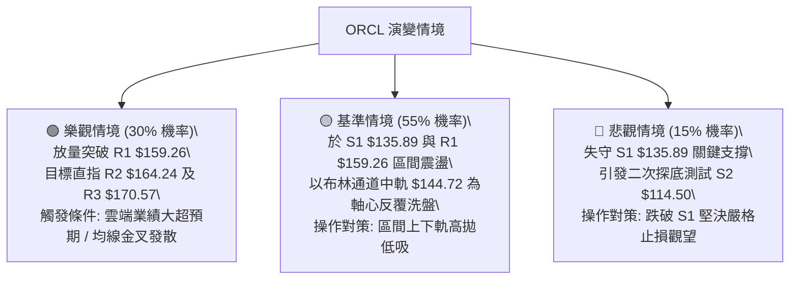

### 🛡️ 風險管理重要提醒

1. **高 Beta 波動控制**：ORCL 的 Beta 高達 **1.718**，且 ATR 為 **$6.24（4.19%）**。在科技股波動加劇的環境下，單筆交易虧損上限應嚴格控制在總投資組合淨值的 **1.0% ~ 1.5%** 以內。
2. **均線空頭壓制警惕**：儘管短線反彈強勁，但長期 MA200 ($170.60) 仍在上方構成巨大天花板。未見股價有效站穩 MA200 之前，所有多頭操作均屬於「超跌反彈波段」，切勿盲目進行長線滿倉死扛。

---

## 📋 報告總結

```
╔══════════════════════════════════════════════════════════════════╗
║                   ORCL 技術分析報告總結                         ║
╠══════════════════════════════════════════════════════════════════╣
║ 報告日期：2026-08-27          當前價格：$148.87                  ║
║ 分析評級：🟡 中性偏多（區間震盪築底修復）· 技術評分：56/100       ║
╠══════════════════════════════════════════════════════════════════╣
║ 關鍵結論：                                                       ║
║ ├─ 長期趨勢：🔴 空頭修正（低於 MA200 $170.60 壓制）              ║
║ ├─ 中期趨勢：🟡 雙底構築（以 $114.50 為大底反彈）                 ║
║ ├─ 短期趨勢：🟢 震盪偏多（站上 MA20 $144.72 及 MA50 $142.76）   ║
║ ├─ 關鍵支撐：S1: $135.89  /  S2: $114.50                        ║
║ ├─ 關鍵阻力：R1: $159.26  /  R2: $164.24  /  R3: $170.57         ║
║ └─ 分析師共識目標：$244.12 (42位分析師評級: Buy)                 ║
╠══════════════════════════════════════════════════════════════════╣
║ 最優策略組合：                                                   ║
║ 1. 🥇 最佳機會 (策略 A)：回踩 $144.00 均線低吸，止損 $135.89，    ║
║                          目標 $158.11 / $159.26 (風報比 1:1.88)   ║
║ 2. 🥈 次選機會 (策略 B)：突破 $159.50 順勢跟進，止損 $153.92，    ║
║                          目標 $164.24 / $170.57 (風報比 1:1.98)   ║
║ 3. 🥉 保守選擇：等待股價確認突破並站穩 MA200 ($170.60) 後再行介入 ║
╚══════════════════════════════════════════════════════════════════╝
```

---

> ⚠️ **免責聲明**：本報告為技術分析研究成果，所有數據及點位均嚴格基於歷史量價與技術指標模型推算。本報告**僅供學術研究與投資參考**，**不構成任何形式的個別投資諮詢或買賣建議**。金融市場存在高度波動風險，投資人應獨立評估風險並自負盈虧。

---

*報告生成時間：2026-08-27 ｜ 數據來源：Yahoo Finance ｜ 分析框架：多時框架技術分析與量化動能模型*