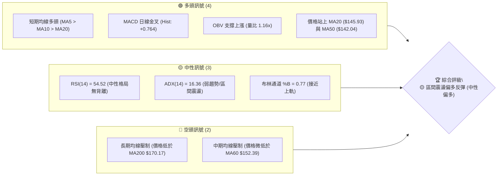
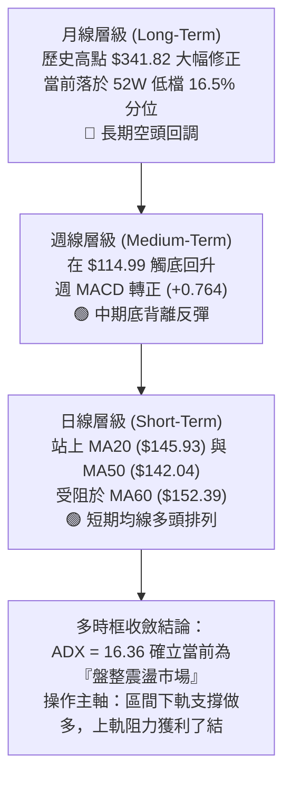
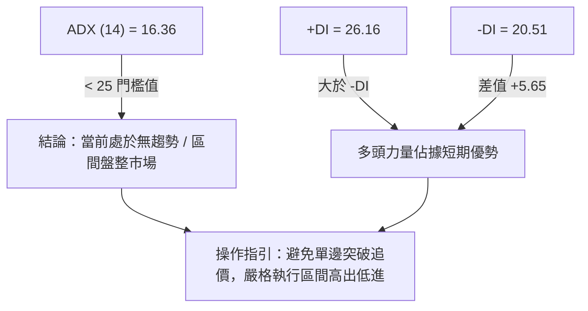
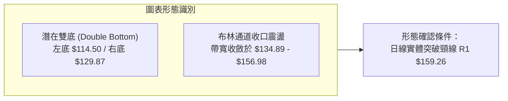
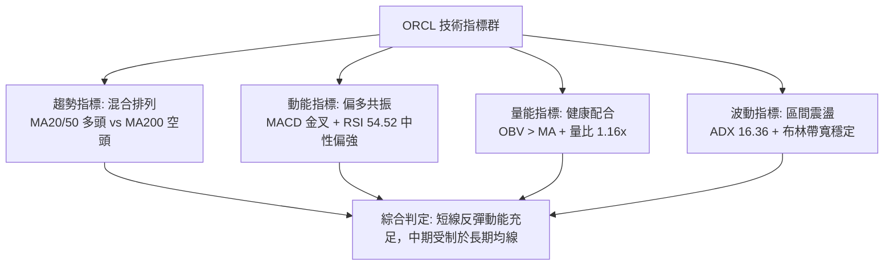
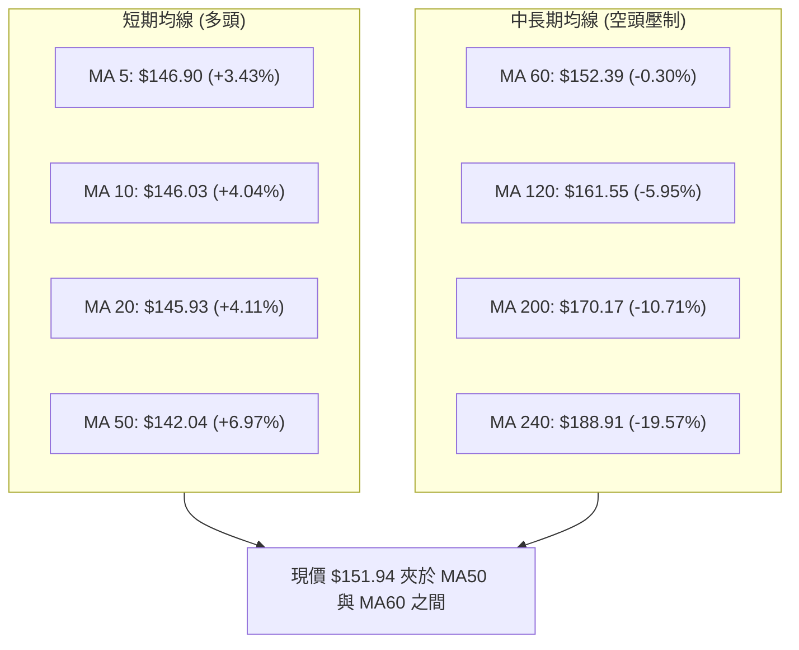
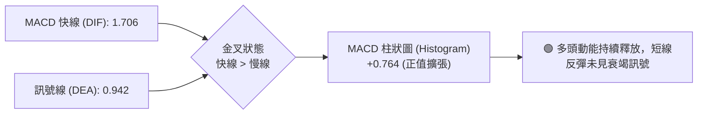
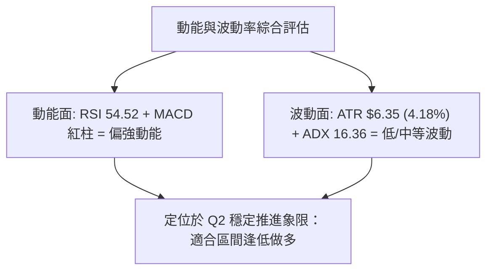
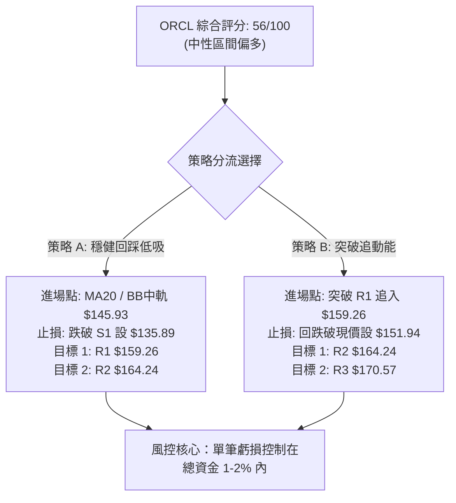
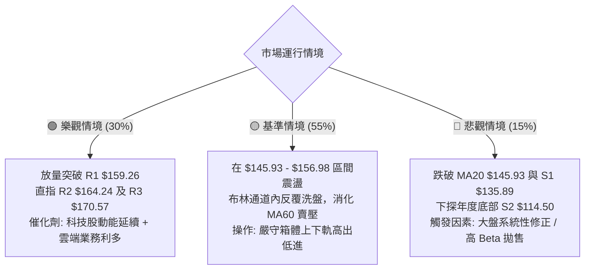

# ORCL 技術分析報告

> **報告日期**：2026-08-28 ｜ **語言**：繁體中文 ｜ **數據來源**：Yahoo Finance ｜ **當前價格**：$151.94

---

## 目錄

| 章節 | 內容 |
|------|------|
| [1. 技術面概覽](#1-技術面概覽) | 訊號儀表板、核心指標、評分卡 |
| [2. 趨勢分析](#2-趨勢分析) | 多時框趨勢、長中短期走勢、ADX 解讀 |
| [3. 圖表形態分析](#3-圖表形態分析) | 形態識別、K線組合、目標價推算 |
| [4. 支撐與阻力](#4-支撐與阻力) | 關鍵價位分佈、斐波那契回調 |
| [5. 技術指標深度解讀](#5-技術指標深度解讀) | 均線系統、RSI、MACD、布林通道、成交量 |
| [6. 動能與波動率](#6-動能與波動率) | 動能四象限、ATR 波動率、Beta 市場相關性 |
| [7. 多時框架總結](#7-多時框架總結) | 時框架評分矩陣、多時框收斂結論 |
| [8. 交易策略建議](#8-交易策略建議) | 策略路由、價格情境階梯、主策略詳情 |
| [9. 風險提示與監控](#9-風險提示與監控) | 關鍵監控清單、風險情境、資金管理 |
| [📋 報告總結](#-報告總結) | 核心結論與最優策略組合 |

---

## 1. 技術面概覽

### 🎯 技術訊號儀表板



---

### 📊 核心指標速覽表

| 指標類別 | 指標名稱 | 當前數值 | 訊號 | 解讀 |
|----------|----------|----------|:----:|------|
| **價格** | 當前價格 | $151.94 | 🟡 | 處於52週區間 16.5% 低檔區，自前波低點 $114.50 反彈 |
| **均線** | MA20 | $145.93 | 🟢 | 價格在MA20上方 (+4.11%)，短期上升斜率確立 |
| **均線** | MA50 | $142.04 | 🟢 | 價格在MA50上方 (+6.97%)，中期底部支撐成形 |
| **均線** | MA200 | $170.17 | 🔴 | 價格在MA200下方 (-10.71%)，長期空頭結構尚未扭轉 |
| **動能** | RSI(14) | 54.52 | 🟡 | 位於 50–60 中性偏多區間，無超買超賣或背離現象 |
| **動能** | MACD | 1.706 / Sig 0.942 | 🟢 | 快線位於慢線上方，紅柱連續擴張 (+0.764)，動能增強 |
| **趨勢** | ADX(14) | 16.36 | 🟡 | ADX < 25 表明處於無明確單邊趨勢的「區間震盪」行情 |
| **通道** | 布林通道 | $156.98 / $134.89 | 🟡 | %B 為 0.77，價格由中軌向上軌推升，波動帶寬維持穩定 |
| **量能** | 成交量 / OBV | 30.15M (量比 1.16x)| 🟢 | 成交量高於20日均量，OBV > MA 呈現量價同步配合 |
| **波動** | ATR(14) | $6.35 (4.18%) | 🟡 | 每日平均波動幅度約 $6.35，提供合理的波段止損參考空間 |

---

### 🏆 技術評分卡

```
╔══════════════════════════════════════════════════════════════╗
║              技術評分卡 — ORCL (2026-08-28)                   ║
╠══════════════════════════════════════════════════════════════╣
║ 趨勢強度 (ADX/DMI)  ██████░░░░░░░░░░░░░░  35/100  🟡 弱勢盤整 ║
║ 短期動能 (MACD/RSI) ██████████████░░░░░░  70/100  🟢 動能偏多 ║
║ 支撐穩定度 (波段低點)████████████░░░░░░░░  60/100  🟢 底部抬高 ║
║ 成交量配合 (OBV/量比)██████████████░░░░░░  70/100  🟢 價漲量增 ║
║ 形態完整度 (築底形態)████████████░░░░░░░░  60/100  🟡 雙底醞釀 ║
║ 均線排列 (多空結構) ████████░░░░░░░░░░░░  40/100  🔴 混合壓制 ║
╠══════════════════════════════════════════════════════════════╣
║ 綜合技術評分        ███████████░░░░░░░░░  56/100  🟡 區間反彈 ║
╚══════════════════════════════════════════════════════════════╝
```

---

## 2. 趨勢分析

### 🌐 多時框趨勢分析



---

### 📈 長期趨勢 — 12個月走勢圖（ASCII）

```
ORCL 月線走勢圖（2025-08 至 2026-08）
價格軸 ($)
$280 ┤                  ●(2025-09: $278.07)
$260 ┤                      ●(2025-10: $260.10)
$240 ┤                                                ●(2026-05: $225.00)
$220 ┤          ●(2025-08: $223.58)
$200 ┤                          ●(2025-11: $200.02)
$180 ┤                              ●(2025-12: $193.05)
$160 ┤                                  ●(2026-01: $163.44)  ●(2026-04: $160.83)        ●(現在: $151.94)
$140 ┤                                      ●($144.39) ●($146.09)           ●(06:$146.04)
$120 ┤                                                                          ●(2026-07: $129.87)
     └──────────────────────────────────────────────────────────────────────────────────────────
       25-08   25-09   25-10   25-11   25-12   26-01   26-02   26-03   26-04   26-05   26-06   26-07   26-08
```

#### 走勢特徵分析表格

| 階段區間 | 起止價格 | 漲跌幅 | 走勢特徵描述 |
|----------|----------|:------:|--------------|
| **2025-08 ~ 2025-09** | $223.58 → $278.07 | +24.37% | 強勢主升浪，創下波段歷史次高點 |
| **2025-10 ~ 2026-02** | $260.10 → $144.39 | -44.49% | 主跌浪修正，跌破多道中期支撐 |
| **2026-03 ~ 2026-05** | $146.09 → $225.00 | +54.01% | 劇烈反彈浪，受基本面消息刺激拉升 |
| **2026-06 ~ 2026-07** | $146.04 → $129.87 | -11.07% | 二次探底，觸及 52 週最低點 $114.50 附近尋求支撐 |
| **2026-08（當前）**   | $129.87 → $151.94 | +16.99% | 底部放量回升，站上 MA20 與 MA50，確認築底 |

---

### 📊 中期趨勢（週線分析）

從近 20 週的收盤價演變觀察：
1. **底部確立**：ORCL 於 2026-07-26 當週收盤 $114.99 觸及 52 週低點（$114.50），隨後週線連三紅（$129.87 → $147.02 → $150.52）。
2. **動能修復**：週 RSI 由極度超賣的 11.1（2026-06-28）大幅修復至目前的 54.5，週 MACD 柱狀圖由 -6.743 轉正至 +0.764，中期下跌動能已完全衰竭。
3. **週線量能**：7月下旬探底時週成交量擴大至 2.52 億股（2026-07-19），顯示主力資金於 $115–$126 區間積極進場承接，量價結構轉為「量增價漲」。

---

### ⚡ 趨勢強度評估（ADX 解讀）



#### ADX 趨勢強度等級對照表

| ADX 數值區間 | 趨勢強度 | 市場特徵 | ORCL 當前狀態判定 |
|:------------:|:--------:|----------|:-----------------:|
| 0 – 20 | 極弱 / 無趨勢 | 價格在均線上下頻繁穿梭，震盪整理 | 📍 **當前位置 (16.36)** — 區間整理 |
| 20 – 25 | 弱趨勢 | 趨勢初露萌芽或正在轉換方向 | — |
| 25 – 40 | 強趨勢 | 明確的單邊趨勢，順勢交易勝率高 | — |
| 40 – 60 | 極強趨勢 | 單邊噴發或崩跌行情，防範乖離過大 | — |

---

## 3. 圖表形態分析

### 🔍 形態識別系統



#### 形態識別與信心度評估表

| 形態名稱 | 信心度 | 判斷依據（數據引用） | 完成度 | 目標價（附嚴格計算式） |
|----------|:------:|----------------------|:------:|------------------------|
| **潛在雙重底** | **65%** | 2026-07 底點 $114.50 與 2026-08 低點 $129.87 形成抬高底部，頸線對應近一年高點聚類阻力 R1 $159.26 | 75% | 頸線 $159.26 + 形態高度 ($159.26 - $114.50 = $44.76) = **$204.02**（接近 Fib 61.8% $201.34） |
| **矩形箱體整理** | **80%** | 價格受限於 S1 $135.89 與 R1 $159.26 之間反覆震盪，ADX=16.36 確認盤整特徵 | 85% | 箱頂突破目標：$159.26 + ($159.26 - $135.89 = $23.37) = **$182.63** |
| **頭肩底形態** | **<40%** | 訊號不足，左肩結構不對稱，不予採用 | — | 數據不足以支撐幾何形態，僅作指標型解讀 |

---

### 🕯️ 重要 K 線形態分析

| 週期/時間 | 收盤價 | K線形態 | 技術解讀 | 多空訊號 |
|-----------|:------:|---------|----------|:--------:|
| **2026-07-26 週** | $114.99 | 長下影錘頭線 (Hammer) | 探底 52W 低點 $114.50 後爆量收出長下影，買盤強力介入 | 🟢 極強看多 |
| **2026-08-02 週** | $129.87 | 大陽吞噬 (Bullish Engulfing)| 週線收漲 +12.94%，完全吞沒前週實體，確認短底 | 🟢 強烈看多 |
| **2026-08-16 週** | $150.52 | 高檔流星線 (Shooting Star)| 觸及 $150 上方遇阻，週 RSI 達 74.6 進入短期超買 | 🟡 短線回踩 |
| **2026-08-28 日** | $151.94 | 溫和實體紅K (Bullish Candle)| 站上 MA20 與 MA50，MACD 柱狀圖續揚，呈現多頭蓄勢 | 🟢 偏多震盪 |

---

### 📉 ASCII 走勢形態示意圖

```
ORCL 築底形態與關鍵突破架構示意
價格 ($)
$170.57 ┼────────────────────────────────────────────────────────── 阻力 R3 / MA200
        │                                                     
$164.24 ┼─────────────────────────────────────────────────── 阻力 R2
        │                                            ▲ 目標一
$159.26 ┼───[頸線阻力 R1]─────────────────────────/───────────── 頸線 R1
        │                                         / (突破點)
$151.94 ┼───────────────────────────────────────● 現價 $151.94
        │                       ▲              /
$145.93 ┼──────────────────────/─\────────────/─────────────── BB 中軌 (MA20)
        │                     /   \          /
$135.89 ┼────────────────────/─────\────────/───────────────── 支撐 S1
        │                   /       \      / (右底)
$129.87 ┼──────────────────/─────────●────/────────────────── 2026-08 低點
        │                 /          $129.87
$114.50 ┼────────●───────/─────────────────────────────────── 52W 低點 / 支撐 S2 (左底)
        │     2026-07 ($114.50)
        └───────────────────────────────────────────────────
              2026-07               2026-08               2026-09 (預期)
```

---

## 4. 支撐與阻力

### 🗺️ 關鍵價位分布圖（ASCII）

```
╔══════════════════════════════════════════════════════════════════╗
║                   ORCL 價位結構分布圖                             ║
╠══════════════════════════════════════════════════════════════════╣
║ $170.57 ║██████████████████████████████║ 強阻力 R3 / MA200 壓制    ║
║ $164.24 ║████████████████████░░░░░░░░░░║ 波段阻力 R2 / Fib 78.6%  ║
║ $159.26 ║██████████████████████████████║ 關鍵阻力 R1 / 形態頸線   ║
║ $156.98 ║▓▓▓▓▓▓▓▓▓▓▓▓▓▓▓▓▓▓▓▓░░░░░░░░░░║ 布林通道上軌             ║
║ $151.94 ╠══════════════════════════════╣ ◄ 現價 ($151.94)         ║
║ $145.93 ║▓▓▓▓▓▓▓▓▓▓▓▓▓▓▓▓▓▓▓▓░░░░░░░░░░║ 動態支撐 / MA20 / BB中軌 ║
║ $142.04 ║▓▓▓▓▓▓▓▓▓▓▓▓▓▓▓▓▓▓▓▓░░░░░░░░░░║ 中期均線支撐 MA50        ║
║ $135.89 ║██████████████████████████████║ 近期波段支撐 S1          ║
║ $114.50 ║██████████████████████████████║ 52週強支撐 S2 (年度底部) ║
╚══════════════════════════════════════════════════════════════════╝
```

---

### 🚧 阻力位分析表

| 阻力級別 | 精確價位 | 距離現價 | 形成原因與技術共振 | 突破難度 | 重要性 |
|:--------:|:--------:|:--------:|--------------------|:--------:|:------:|
| **R1** | **$159.26** | +4.82% | 近一年波段高點聚類；雙底頸線位；臨近布林上軌 ($156.98) | 中等 🟡 | ★★★★☆ |
| **R2** | **$164.24** | +8.10% | 近一年波段次高點；斐波那契 78.6% 回調位 ($163.15) 共振區 | 高 🔴 | ★★★☆☆ |
| **R3** | **$170.57** | +12.26% | 近一年強阻力聚類；MA200 ($170.17) 牛熊分界線共振區 | 極高 🔴 | ★★★★★ |

---

### 🛡️ 支撐位分析表

| 支撐級別 | 精確價位 | 距離現價 | 形成原因與技術共振 | 守住機率 | 重要性 |
|:--------:|:--------:|:--------:|--------------------|:--------:|:------:|
| **S1** | **$135.89** | -10.56% | 近一年波段低點聚類；布林下軌 ($134.89) 動態支撐區 | 75% 🟢 | ★★★★☆ |
| **S2** | **$114.50** | -24.64% | 52 週最低點 (2026-07 探底低點)；斐波那契 100% 終極支撐 | 90% 🟢 | ★★★★★ |

---

### 📐 斐波那契回調位分析（基準區間：$114.50 → $341.82）

```
$341.82 ┬  0.0%  (52W High)
        │
$288.18 ┼  23.6% 回調位
        │
$254.99 ┼  38.2% 回調位
        │
$228.16 ┼  50.0% 中樞平衡位
        │
$201.34 ┼  61.8% 黃金分割強阻力位
        │
$163.15 ┼  78.6% 回調位 ── [上方主要反彈壓制區，共振 R2 $164.24]
        │
$151.94 ┼  ◄─── 當前現價 ($151.94) 位於 78.6% 與 100% 區間
        │
$114.50 ┴  100.0% (52W Low) ── [年度底部支撐 S2]
```

#### 斐波那契結構解讀：
1. **當前位置**：現價 $151.94 運行於 **78.6% ($163.15)** 與 **100.0% ($114.50)** 之間，屬於深度回調後的底部復甦期。
2. **關鍵壓力確認**：斐波那契 78.6%（$163.15）與阻力位 **R2 ($164.24)** 構成高度重合的強壓帶，若能有效放量突破，則預示中期趨勢反轉，向上挑戰 61.8%（$201.34）。

---

## 5. 技術指標深度解讀

### 🎛️ 指標訊號總覽



---

### 📈 移動平均線排列分析



#### 均線數據詳細分析表

| 均線名稱 | 當前價格 | 與現價乖離 | 走勢特徵 (Sparkline 解讀) | 訊號強度 |
|:--------:|:--------:|:----------:|---------------------------|:--------:|
| **MA 5** | $146.90 | +3.43% | 連續向上揚升，短期買氣強勁 | 🟢 強烈看多 |
| **MA 10** | $146.03 | +4.04% | 向上穿越 MA20 形成短天期金叉 | 🟢 看多 |
| **MA 20** | $145.93 | +4.11% | 扭轉下行趨勢，拐頭向上 | 🟢 看多 |
| **MA 50** | $142.04 | +6.97% | 底部支撐強固，價格穩居其上 | 🟢 看多 |
| **MA 60** | $152.39 | -0.30% | 走平微跌，為現價上方第一道動態壓制 | 🟡 中性微空 |
| **MA 120** | $161.55 | -5.95% | 持續向下傾斜，壓制中期反彈 | 🔴 空頭壓制 |
| **MA 200** | $170.17 | -10.71% | 牛熊分水嶺，位於 R3 ($170.57) 附近 | 🔴 長期看空 |
| **MA 240** | $188.91 | -19.57% | 年線大幅下行，反映長期空頭格局 | 🔴 長期看空 |

---

### 📉 RSI(14) 分析

```
RSI(14) 數值儀表板：
0 ─────── 30 ───────────── 50 ────── 54.52 ────── 70 ─────── 100
[ 極度超賣 ]    [ 弱勢區間 ]     [ 中軸 ]   ▲  [ 強勢區間 ]    [ 極度超買 ]
                                        │
                                   RSI = 54.52
進度條：███████████░░░░░░░░░ 54.52% (中性偏多)
```

1. **數值解讀**：RSI(14) 報 **54.52**，穩居 50 中軸上方，代表多頭在短線博弈中略佔優勢。
2. **背離分析**：
   - 價格於 2026-07 探低 $114.50 時 RSI 為 26.7，8月低點 $129.87 時 RSI 為 48.6，呈現**標準底背離（Bullish Divergence）**後推升。
   - 現階段價格由 $146.47 升至 $151.94，RSI 自 54.6 微調至 54.52，屬正常高檔整理，**無頂背離現象**。

---

### 📊 MACD(12, 26, 9) 訊號解讀



- **狀態**：MACD 線 (1.706) 位於 Signal 線 (0.942) 之上，差值為 **+0.764**。
- **解讀**：MACD 位於零軸上方且紅柱連續放大，配合週線 MACD 柱狀圖同步轉正（+0.764），形成日週共振偏多訊號。

---

### 📦 布林通道分析（Bollinger Bands）

```
ORCL 日線布林通道結構 (參數: 20, 2)
════════════════════════════════════════════════════════════════
$156.98 ┬──────────────────────────────────────── 布林上軌 (Upper Band)
        │
$151.94 ┼───────────────────────────────● 現價 ($151.94, %B = 0.77)
        │
$145.93 ┼──────────────────────────────────────── 布林中軌 (MA20)
        │
$134.89 ┴──────────────────────────────────────── 布林下軌 (Lower Band)
════════════════════════════════════════════════════════════════
```

- **通道帶寬**：上軌 $156.98，中軌 $145.93，下軌 $134.89，帶寬約 $22.09 (14.5%)。
- **%B 指標**：數值為 **0.77**，顯示價格脫離中軌並朝上軌邁進，屬於健康的多頭推升格局。當前尚未觸碰上軌（$156.98），短線仍有向上拓展空間。

---

### 💹 成交量分析（量價配合度）

1. **量價特徵**：最新日成交量 **30.15M**，相較 20 日均量 **25.94M** 放量 **1.16 倍**。
2. **OBV 趨勢**：OBV 位於其均線之上，確認資金在反彈過程中持續淨流入（Accumulation）。
3. **量價背離檢驗**：近 4 週收盤價由 $129.87 攀升至 $151.94，量能維持在均量水準，並無「價漲量縮」的背離隱憂，量價配合健康。

---

## 6. 動能與波動率

### ⚡ 動能評估四象限

| 象限分區 | 動能強度 (Momentum) | 波動率 (Volatility) | ORCL 當前狀態 | 交易策略意涵 |
|:--------:|:-------------------:|:-------------------:|:-------------:|:-------------|
| **Q1 (最佳爆發)** | 強 (High) | 高 (High) | — | 順勢追突破，設寬止損 |
| **Q2 (穩定推進)** | **強 (High)** | **低 (Low / 中等)** | **✓ (當前定位)** | **拉回中軌佈局，享受低風險穩健反彈** |
| **Q3 (無序洗盤)** | 弱 (Low) | 高 (High) | — | 觀望為主，避免頻繁被掃損 |
| **Q4 (低迷盤整)** | 弱 (Low) | 低 (Low) | — | 資金沉澱期，等待方向突破 |



---

### 📊 ATR 波動率分析

- **ATR(14) 當前數值**：**$6.35**（佔股價比重 **4.18%**）。
- **日內波動區間**：預期 ORCL 單日正常波動區間為現價 ±$6.35（即 $145.59 – $158.29）。
- **風控止損應用**：
  - 短線波段止損（1.5 × ATR）：$6.35 × 1.5 = **$9.53**。
  - 中線趨勢止損（2.0 × ATR）：$6.35 × 2.0 = **$12.70**。

---

### 📐 Beta 與市場相關性

- **Beta 係數**：**1.718**（高 Beta 屬性）。
- **市場特徵**：ORCL 的波動幅度約為 S&P 500 指數的 1.72 倍。在科技板塊走強時具備高反彈彈性，但若大盤下挫，回檔壓力亦較為劇烈，操作上必須嚴格依據技術位控管倉位。

---

## 7. 多時框架總結

### 📋 時框架評分表

| 時框架 | 趨勢方向 | 動能指標 | 均線排列 | 形態結構 | 綜合評分 | 建議操作方向 |
|:------:|:--------:|:--------:|:--------:|:--------:|:--------:|:------------:|
| **日線 (短期)** | 🟢 偏多反彈 | 🟢 MACD金叉/RSI 54.5 | 🟢 站上MA20/50 | 🟢 底部抬高 | **72 / 100** | 逢低回踩做多 |
| **週線 (中期)** | 🟡 築底震盪 | 🟢 柱狀圖轉正/RSI 54.5 | 🔴 受制MA60/120 | 🟡 雙底醞釀中 | **55 / 100** | 區間震盪操作 |
| **月線 (長期)** | 🔴 空頭修正 | 🔴 遠離歷史高點 | 🔴 低於MA200 | 🔴 大級別回調 | **38 / 100** | 嚴控多頭停利 |

---

### 🔲 綜合訊號矩陣

```
時框與指標一致性矩陣：
┌──────────┬──────────┬──────────┬──────────┬──────────┬──────────┐
│  時框架  │ 趨勢 (MA)│ 動能(MACD│ 擺動(RSI)│ 量能(OBV)│ 綜合判定 │
├──────────┼──────────┼──────────┼──────────┼──────────┼──────────┤
│ 短期日線 │   🟢多   │   🟢多   │  🟡中性  │   🟢多   │ 🟢 偏多  │
│ 中期週線 │   🟡中   │   🟢多   │  🟡中性  │   🟢多   │ 🟡 偏多  │
│ 長期月線 │   🔴空   │  🟡中性  │   🔴空   │  🟡中性  │ 🔴 偏空  │
└──────────┴──────────┴──────────┴──────────┴──────────┴──────────┘
```

---

### ⚖️ 多時框收斂結論

依據多時框收斂規則：
1. **行情性質判定**：ADX(14) 報 **16.36 (< 25)**，明確指示當前 ORCL 處於**「盤整震盪市場」**而非強單邊趨勢。
2. **多時框收斂邏輯**：在無趨勢的盤整格局中，交易核心應以日線布林通道（$134.89 – $156.98）與波段阻力 S1/R1 作為主要運作區間，利用短期日線的多頭動能參與反彈，同時於中期均線壓制區（R1 $159.26、R2 $164.24）落袋為安。
3. **唯一方向性結論**：**🟡 區間偏多反彈（Neutral-Bullish Mean Reversion）**。本結論嚴格收斂並貫徹於後續交易策略。

---

## 8. 交易策略建議

### 🗺️ 策略決策流程圖



---

### 🧭 策略路由

> **當前主策略方向**：**🟡 區間偏多操作 / 突破跟進策略**（依綜合評分 **56/100**，多頭佔優但受限於區間上限）。

---

### 🎯 價格情境階梯（Price Scenarios）

| 觸發條件 | 下一目標 | 後續延伸 | 情境技術含義 |
|:--------:|:--------:|:--------:|--------------|
| **強勢突破 R1 $159.26** | **R2 $164.24** | **R3 $170.57 (MA200)** | 雙底頸線突破，確立向 Fib 78.6% 與牛熊分水嶺進攻 |
| **維持在 $145.93 – $156.98** | **布林上軌 $156.98** | **R1 $159.26** | 沿布林中軌震盪推升，標準區間向上爬坡 |
| **跌破 MA20 $145.93** | **S1 $135.89** | **S2 $114.50** | 短線反彈夭折，重回箱體下軌與年度低點測試 |

---

### 📊 情境機率分佈

| 情境 | 機率 | 主要技術依據 |
|------|:----:|--------------|
| **情境一：震盪向上挑戰 R1/R2** | **50%** | MACD 紅柱擴張 (+0.764)、價格站上 MA20/50、OBV 量能支撐、週線底背離 |
| **情境二：區間內窄幅震盪 ($145–$156)** | **35%** | ADX 僅 16.36 缺乏強單邊動力、MA60 ($152.39) 壓制、布林帶寬收斂 |
| **情境三：跌破 MA20 再探 S1 底** | **15%** | 長期均線 MA200 仍呈空頭排列，若大盤重挫可能引發高 Beta 拋壓 |

---

### 🟢 主策略詳情

本報告依據技術評分卡與多時框收斂，制定兩套**互補型精確策略**：

| 策略要素 | 策略 A（穩健型：回踩 MA20 支撐佈局） | 策略 B（進取型：突破頸線 R1 動能追單） |
|----------|-------------------------------------|--------------------------------------|
| **進場條件** | 價格回踩 MA20 獲支撐且出現日K收陽 | 日K收盤價實體突破關鍵阻力 R1 |
| **進場價格** | **$145.93** | **$159.26** |
| **止損價格** | **$135.89**（波段支撐 S1，虧損 $10.04 / -6.88%） | **$151.94**（當前現價轉為支撐，虧損 $7.32 / -4.60%） |
| **目標價 T1** | **$159.26**（阻力位 R1，獲利 +$13.33 / +9.13%） | **$164.24**（阻力位 R2 / Fib 78.6%，獲利 +$4.98 / +3.13%） |
| **目標價 T2** | **$164.24**（阻力位 R2，獲利 +$18.31 / +12.55%） | **$170.57**（阻力位 R3 / MA200，獲利 +$11.31 / +7.10%） |
| **風險報酬比 (R:R)** | **1 : 1.33 (T1) / 1 : 1.82 (T2)** | **1 : 0.68 (T1) / 1 : 1.55 (T2)** |
| **勝率估計** | **65%** | **55%** |
| **建議倉位** | **總資金 10% - 15%** | **總資金 5% - 8%** |

---

### 🔴 反向風險觸發點（對沖與風控提示）

若出現以下情況，主多頭策略宣告失效，應全面撤出或建立對沖空單：
1. **關鍵支撐失守**：日線實體跌破 **S1 $135.89**（同時跌破布林下軌 $134.89），意味著築底失敗，極大概率再探 **S2 $114.50**。
2. **動能死叉**：日線 MACD 柱狀圖由正轉負，且 RSI(14) 跌破 45。
3. **空頭對沖觸發價**：跌破 **$135.89** 時可佈局空單，目標下看 **S2 $114.50**，止損設於 **$142.04 (MA50)**。

---

### ⭐ 整體訊號強度評星

```
╔══════════════════════════════════════════════════════════════╗
║ 做多訊號強度：  ★★★☆☆  (3.5 / 5.0)  — 短期反彈確立，空間受限 ║
║ 做空訊號強度：  ★★☆☆☆  (2.0 / 5.0)  — 下跌動能衰竭，不宜追空 ║
║ 整體訊號可信度：★★★★☆  (4.0 / 5.0)  — 區間指標共振性極高     ║
╚══════════════════════════════════════════════════════════════╝
```

---

## 9. 風險提示與監控

### ✅ 關鍵監控指標 Checklist

```
╔══════════════════════════════════════════════════════════════╗
║               ORCL 每日盤後關鍵技術監控清單                    ║
╠══════════════════════════════════════════════════════════════╣
║ [ ] 1. 價格是否守穩 MA20 動態支撐 ($145.93)                  ║
║ [ ] 2. 價格是否成功突破並站穩 MA60 ($152.39) 與 R1 ($159.26) ║
║ [ ] 3. MACD 柱狀圖是否維持在零軸上方 (當前 +0.764)            ║
║ [ ] 4. RSI(14) 是否維持在 50–65 健康區間 (防範 >70 超買回落)  ║
║ [ ] 5. ADX 是否突破 25 (若突破代表由盤整轉為單邊爆發)         ║
║ [ ] 6. 日成交量是否維持在 20 日均量 (25.94M) 之上            ║
╚══════════════════════════════════════════════════════════════╝
```

---

### ⚠️ 風險場景分析



---

### 🛡️ 風險管理重要提醒

1. **Beta 波動控管**：ORCL 的 Beta 高達 **1.718**，在大盤波動劇烈時，應適度降低單筆交易部位，單筆交易的最大止損風險嚴格限制在總資產的 **1.0% – 1.5%** 內。
2. **ATR 動態止盈止損**：當前 ATR 為 **$6.35**，日內波動較大，避免將止損設定在小於 1.0 × ATR（$6.35）之內，以免遭到市場雜訊洗盤出場。
3. **分批出場紀律**：當價格抵達第一目標價 **R1 ($159.26)** 時，建議至少平倉 50% 多頭部位鎖定獲利，剩餘部位將止損點上移至進場保本點位，博取挑戰 **R2 ($164.24)** 或 **R3 ($170.57)** 的延伸空間。

---

## 📋 報告總結

```
╔══════════════════════════════════════════════════════════════════╗
║                     ORCL 技術分析報告總結                         ║
╠══════════════════════════════════════════════════════════════════╣
║ 報告日期：2026-08-28            當前價格：$151.94                ║
║ 綜合技術評分：56 / 100          技術評級：🟡 區間震盪偏多反彈     ║
╠══════════════════════════════════════════════════════════════════╣
║ 關鍵技術維度結論：                                               ║
║ ├─ 長期趨勢：🔴 空頭壓制（價格位於 MA200 $170.17 下方）           ║
║ ├─ 中期趨勢：🟡 築底反彈（自 52W 低點 $114.50 脫離，MACD 週線翻紅）║
║ ├─ 短期趨勢：🟢 偏多排列（站上 MA20 $145.93 與 MA50 $142.04）    ║
║ ├─ 關鍵阻力：R1 $159.26 ｜ R2 $164.24 ｜ R3 $170.57              ║
║ ├─ 關鍵支撐：S1 $135.89 ｜ S2 $114.50                            ║
║ └─ 分析師共識目標：$244.12 (Buy 評級，42 位分析師)               ║
╠══════════════════════════════════════════════════════════════════╣
║ 最優策略組合：                                                   ║
║ 1. 🥇 最佳機會（策略 A - 穩健低吸）：                             ║
║    回踩 MA20 $145.93 進場，止損 S1 $135.89，目標 $159.26 / $164.24║
║ 2. 🥈 次選機會（策略 B - 突破追價）：                             ║
║    突破 R1 $159.26 進場，止損 $151.94，目標 $164.24 / $170.57     ║
║ 3. 🥉 保守選擇（觀望等待）：                                     ║
║    等待 ADX > 25 趨勢明確，或回落至 S1 $135.89 附近再行左側分批進場║
╚══════════════════════════════════════════════════════════════════╝
```

---

> ⚠️ **免責聲明**：本報告為 AI 自動生成之技術分析研究，所有技術指標、形態解讀及關鍵價位均基於提供的歷史價格數據精確計算。本報告**僅供學術研究與投資參考**，**不構成任何形式的個人化投資建議或買賣邀約**。金融市場具有高度風險，投資人應依個人財務狀況與風險承受能力獨立判斷並自負盈虧。

---

*報告生成時間：2026-08-28 ｜ 數據來源：Yahoo Finance ｜ 分析框架：多時框技術分析體系*