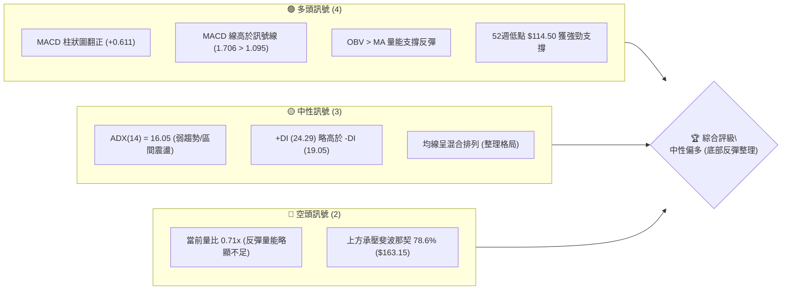
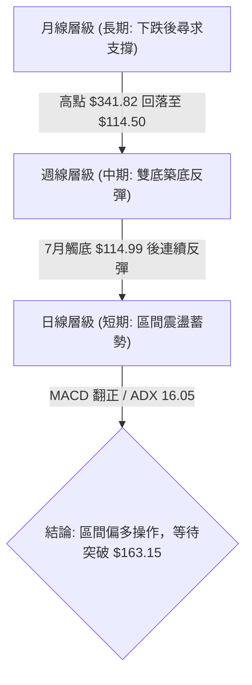
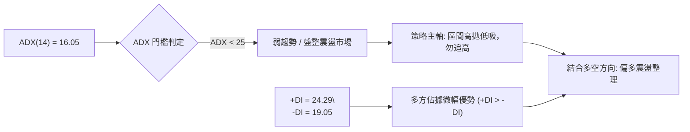
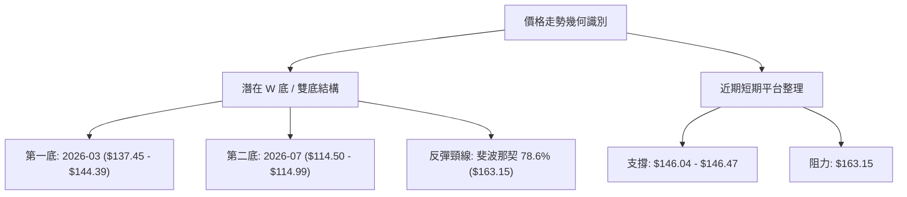
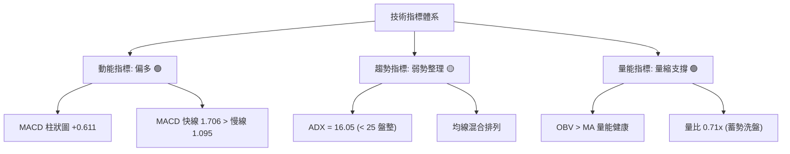
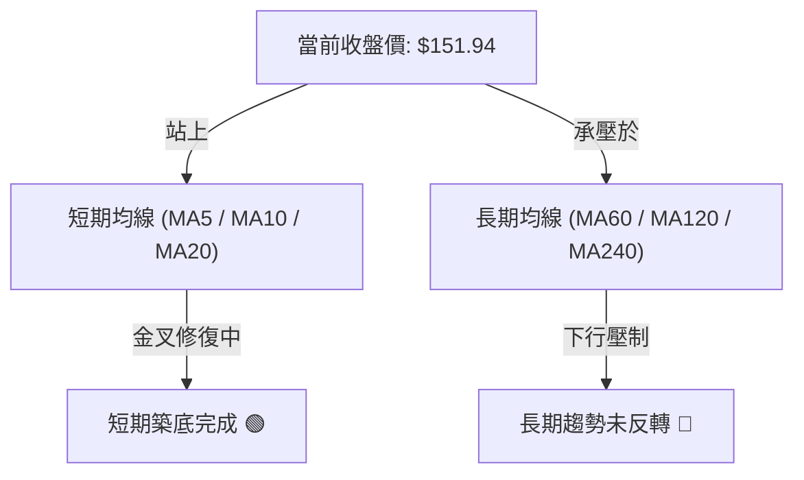
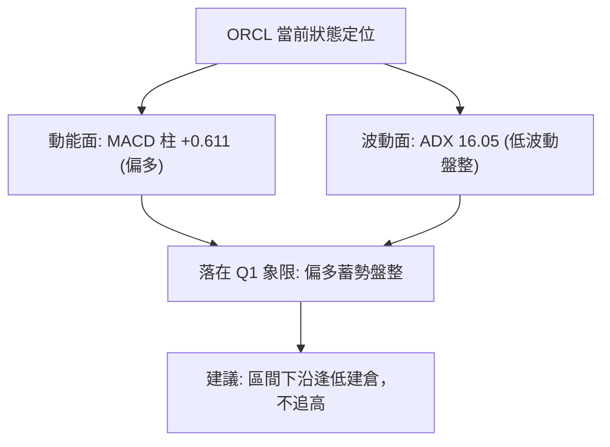
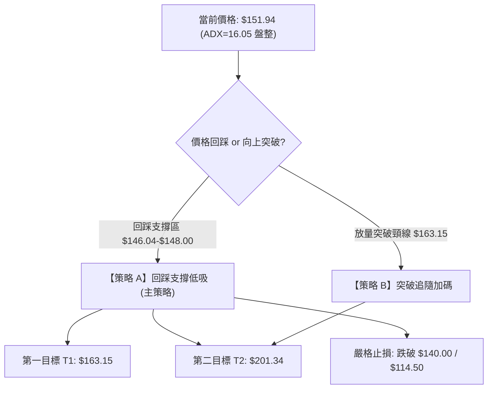
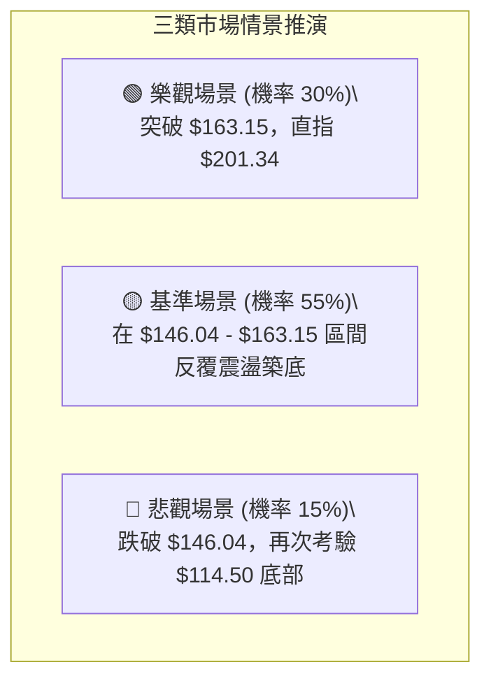

# ORCL 技術分析報告

> **報告日期**：2026-08-29 ｜ **語言**：繁體中文 ｜ **數據來源**：Yahoo Finance ｜ **當前價格**：$151.94

---

## 目錄

| 章節 | 內容 |
|------|------|
| [1. 技術面概覽](#1-技術面概覽) | 訊號儀表板、核心指標、評分卡 |
| [2. 趨勢分析](#2-趨勢分析) | 多時框趨勢、長中短期走勢 |
| [3. 圖表形態分析](#3-圖表形態分析) | 形態識別、K線組合、目標價 |
| [4. 支撐與阻力](#4-支撐與阻力) | 關鍵價位、斐波那契回調 |
| [5. 技術指標深度解讀](#5-技術指標深度解讀) | MA/RSI/MACD/布林/成交量 |
| [6. 動能與波動率](#6-動能與波動率) | 動能評估、ATR、Beta |
| [7. 多時框架總結](#7-多時框架總結) | 時框架評分矩陣 |
| [8. 交易策略建議](#8-交易策略建議) | 多空策略、風險報酬比 |
| [9. 風險提示與監控](#9-風險提示與監控) | 監控指標、風險場景 |

---

## 1. 技術面概覽

### 🎯 技術訊號儀表板



### 📊 核心指標速覽表

| 指標類別 | 指標名稱 | 當前數值 | 訊號 | 解讀 |
|----------|----------|----------|------|------|
| **價格** | 當前收盤價 | $151.94 | 🟡 | 脫離 52 週低點 ($114.50)，處於超跌反彈段 |
| **區間** | 52W 高 / 低 | $341.82 / $114.50 | 🟡 | 處於 52 週區間相對低檔 (16.48% 分位) |
| **均線** | 均線系統 | 混合排列 | 🟡 | 短期均線向上修復，長期均線仍處壓制 |
| **動能** | MACD (12, 26, 9) | 1.706 / 1.095 | 🟢 | 快線高於慢線，柱狀圖 +0.611，偏多修復 |
| **趨勢** | ADX (14) | 16.05 | 🟡 | 數值 < 25，屬於弱趨勢／區間築底震盪行情 |
| **方向** | 方向指標 (+/-DI) | +DI 24.29 / -DI 19.05 | 🟢 | 多頭力量微幅主導反彈 |
| **量能** | 成交量 / 20日均量 | 17.75M / 25.11M (0.71x) | 🟡 | 量縮整理，OBV 大於均線支撐價格回升 |

### 🏆 技術評分卡

```
╔══════════════════════════════════════════════════════════════════╗
║                 技術評分卡 — ORCL (2026-08-29)                   ║
╠══════════════════════════════════════════════════════════════════╣
║ 趨勢強度 (ADX)     ██████░░░░░░░░░░░░░░  32/100  🟡 盤整弱趨勢   ║
║ 動能指標 (MACD)    ██████████████░░░░░░  70/100  🟢 動能偏多     ║
║ 支撐穩定度 (52W)   ████████████████░░░░  80/100  🟢 雙底支撐強固 ║
║ 成交量配合 (OBV)   ████████████░░░░░░░░  60/100  🟡 量能溫和修復 ║
║ 形態完整度 (築底)  ████████████░░░░░░░░  62/100  🟢 築底反彈結構 ║
║ 均線排列 (MA)      ████████░░░░░░░░░░░░  40/100  🔴 混合壓制中   ║
╠══════════════════════════════════════════════════════════════════╣
║ 綜合評分           ███████████░░░░░░░░░  57/100  🟡 中性偏多區間 ║
╚══════════════════════════════════════════════════════════════════╝
```

---

## 2. 趨勢分析

### 🌐 多時框趨勢分析



### 📈 長期趨勢 — 12個月走勢圖（Unicode）

```
ORCL 月線走勢圖（過去12個月：2025-09 至 2026-08）
價格軸 ($)
$280 ┤ ● (2025-09: $278.07)
$260 ┤   ● (2025-10: $260.10)
$240 ┤
$220 ┤                             ● (2026-05: $225.00)
$200 ┤     ● (2025-11: $200.02)
$180 ┤       ● (2025-12: $193.05)
$160 ┤         ● (2026-01: $163.44)  ● (2026-04: $160.83)
$150 ┤                                              ● ← 現價 $151.94 (2026-08)
$140 ┤           ● (2026-02: $144.39) ● (2026-03: $146.09) ● (2026-06: $146.04)
$120 ┤                                                   ● (2026-07: $129.87 / 低點 $114.50)
     └─┬───┬───┬───┬───┬───┬───┬───┬───┬───┬───┬───┬───
      09  10  11  12  01  02  03  04  05  06  07  08  (月份)
```

**走勢特徵分析表格**：

| 階段 | 時間區間 | 起始價 → 結束價 | 漲跌幅 | 走勢特徵解讀 |
|------|----------|-----------------|--------|--------------|
| **高檔回落段** | 2025-09 → 2026-02 | $278.07 → $144.39 | -48.07% | 自歷史高位持續承壓走低，呈現單邊空頭回調 |
| **春季反彈段** | 2026-02 → 2026-05 | $144.39 → $225.00 | +55.83% | 均線修復與業績預期帶動強勁反彈，觸及 $225.00 |
| **二次探底段** | 2026-05 → 2026-07 | $225.00 → $129.87 | -42.28% | 快速回吐漲幅，最低下探 52 週低點 $114.50 / $114.99 |
| **築底回升段** | 2026-07 → 2026-08 | $114.99 → $151.94 | +32.13% | 底部確認放量反彈，現階段於 $150 附近進行籌碼換手 |

### 📊 中期趨勢（週線分析）

```
近期週線支撐阻力結構示意：
$225.00 ──────────────────────── 前期波段高點 (2026-05-31)
$201.34 ┄┄┄┄┄┄┄┄┄┄┄┄┄┄┄┄┄┄┄┄┄┄ 斐波那契 61.8% 強阻力區
$163.15 ════════════════════════ 斐波那契 78.6% 關鍵頸線阻力
$151.94 ◄─────── [當前價格]
$146.04 ┈┈┈┈┈┈┈┈┈┈┈┈┈┈┈┈┈┈┈┈┈┈┈┈ 近期回踩支撐位 (8月中旬低點)
$114.50 ════════════════════════ 52週低點 / 雙重底頸線基底 (強支撐)
```

### ⚡ 趨勢強度評估（ADX 解讀）



| 指標項 | 數值 | 參考標準 | 當前市場狀態解讀 |
|--------|------|----------|------------------|
| **ADX (14)** | **16.05** | < 20 極弱趨勢 / 20-25 弱趨勢 / > 25 趨勢明確 | 目前處於典型的無趨勢盤整與底部構築階段 |
| **+DI (14)** | **24.29** | > 20 具備多頭動能 | 多頭進攻力量正在緩步回升 |
| **-DI (14)** | **19.05** | < 20 空頭壓制減弱 | 空方動能已顯著衰退 |

---

## 3. 圖表形態分析

### 🔍 形態識別系統



| 形態名稱 | 信心度 | 判斷依據（引用數據） | 完成度 | 目標價（附計算式） |
|----------|--------|----------------------|--------|--------------------|
| **雙重底 (W底)** | **68%** | 兩次低點分別落於 $137.45 (2025-03) 與 $114.50 (2026-07)，7月於 $114.99 形成放量長下影線反彈 | 70% | 頸線 $163.15 + 形態高度 ($163.15 - $114.50 = $48.65) = **$211.80**（接近斐波那契 61.8% $201.34） |
| **短期矩形箱體** | **75%** | 8月價格在 $146.04 至 $151.94 區間震盪，週成交量自 173M 降至 93.9M 縮量整理 | 85% | 突破箱頂 $163.15 後上看斐波那契 61.8% **$201.34** |

### 🕯️ 重要K線形態分析

| 月份 / 日期 | 收盤價 | K線與量能形態 | 技術解讀 | 訊號 |
|-------------|--------|---------------|----------|------|
| **2026-05-31** | $225.00 | 波段衝高長上影週K (量能 91.4M) | 多頭衰竭，觸及 $225.00 後承壓回落 | 🔴 短期見頂 |
| **2026-06-28** | $148.02 | 實體大陰線跌破 (RSI 下探 11.1) | 恐慌性殺跌，指標進入極度超賣區 | 🔴 空頭釋放 |
| **2026-07-26** | $114.99 | 觸及 52W 低點 $114.50 探底回升 | 週 MACD 柱狀圖開始翻正 (+0.033)，空頭力竭 | 🟢 底部確立 |
| **2026-08-09** | $147.02 | 連續兩週大陽線拉升 (RSI 升至 71.8) | 資金進場抄底，週 MACD 柱擴大至 +4.827 | 🟢 強勁反彈 |
| **2026-08-30** | $151.94 | 窄幅縮量十字星/小陽線 (量能 93.9M) | 於 $150 關卡進行籌碼沉澱與換手 | 🟡 蓄勢整理 |

### 📉 ASCII 走勢形態示意圖

```
ORCL 雙底築底與頸線突破示意圖
價格 ($)
$225.00 ┤         /\ (2026-05 衝高高點)
$201.34 ┤        /  \                                  [目標價二: $201.34]
$163.15 ┼───────/────\─────────┬─────────────────────── [頸線阻力 R1: $163.15]
$151.94 ┤      /      \       /   ● 現價 $151.94 (蓄勢中)
$146.04 ┤     /        \     / 
$137.45 ┤    / (底 1)   \   /
$114.50 ┴───/────────────\─/ (底 2: 52W 低點 $114.50)
```

### 🎯 形態目標價計算

1. **第一階段目標價 (T1)**：
   - 依據斐波那契 78.6% 回調位壓制點：**$163.15**。
   - 距現價空間：+7.38%。
2. **第二階段目標價 (T2)**：
   - 依據雙底形態垂直測幅（高度 = $163.15 - $114.50 = $48.65，向上投影目標 $211.80）及斐波那契 61.8% 水平共振區：**$201.34**。
   - 距現價空間：+32.51%。

---

## 4. 支撐與阻力

### 🗺️ 關鍵價位分布圖（Unicode）

```
ORCL 價位結構分布圖
══════════════════════════════════════════════════════════════════════════
$341.82 ║████████████████████████████████║ 歷史/52W 最高阻力 (Fib 0.0%)
$288.18 ║██████████████████████          ║ 長期波段阻力 R4 (Fib 23.6%)
$254.99 ║████████████████████████        ║ 中長期強阻力 R3 (Fib 38.2%)
$228.16 ║████████████████████            ║ 波段中樞阻力 (Fib 50.0%)
$201.34 ║████████████████████████████    ║ 形態測幅/強阻力 R2 (Fib 61.8%)
$163.15 ║████████████████████████████████║ 短線關鍵頸線阻力 R1 (Fib 78.6%)
$151.94 ╠════════════════════════════════╣ ◄ 當前收盤價格 ($151.94)
$146.04 ║▓▓▓▓▓▓▓▓▓▓▓▓▓▓▓▓▓▓▓▓▓▓▓▓        ║ 短線第一支撐 S1 (8月震盪低點)
$126.41 ║▓▓▓▓▓▓▓▓▓▓▓▓▓▓▓▓▓▓▓▓▓▓▓▓▓▓▓▓    ║ 中期波段支撐 S2 (7月中旬支撐)
$114.50 ║████████████████████████████████║ 52週歷史底部強支撐 S3 (Fib 100.0%)
══════════════════════════════════════════════════════════════════════════
```

### 🚧 阻力位分析表

| 阻力級別 | 價位 | 形成原因 | 突破難度 | 重要性 |
|----------|------|----------|----------|--------|
| **阻力位 R1** | **$163.15** | 斐波那契 78.6% 回調位與 2026-01 / 2026-04 兩次月線收盤平台 | 中等 | ★★★★☆ |
| **阻力位 R2** | **$201.34** | 斐波那契 61.8% 黃金分割位與雙底形態最小量度目標區間 | 較高 | ★★★★★ |
| **阻力位 R3** | **$228.16** | 斐波那契 50.0% 回調位與 2026-05 波段高點 ($225.00) 共振帶 | 極高 | ★★★★☆ |
| **阻力位 R4** | **$341.82** | 52 週歷史最高點 (Fib 0.0%) | 極高 | ★★★☆☆ |

### 🛡️ 支撐位分析表

| 支撐級別 | 價位 | 形成原因 | 守住機率 | 重要性 |
|----------|------|----------|----------|--------|
| **支撐位 S1** | **$146.04** | 2026-06 收盤價與 2026-08-23 週線低點 ($146.47) 密集換手區 | 75% | ★★★★☆ |
| **支撐位 S2** | **$126.41** | 2026-07-19 週線回調低點，反彈行情的次低點結構 | 85% | ★★★★☆ |
| **支撐位 S3** | **$114.50** | 52 週最低點 (Fib 100.0%) 與雙底極限防守位 ($114.50 - $114.99) | 95% | ★★★★★ |

### 📐 斐波那契回調位分析

依據 52 週波動區間（高點 **$341.82** → 低點 **$114.50**，總跨度 $227.32）嚴格計算：

| 斐波那契層級 | 精確價位 | 相對現價位置 | 技術意義與多空攻防解讀 |
|--------------|----------|--------------|------------------------|
| **0.0% (52W High)** | **$341.82** | +124.97% | 長期牛市極限目標區 |
| **23.6%** | **$288.18** | +89.67% | 深度回調後的長期壓力位 |
| **38.2%** | **$254.99** | +67.82% | 空頭反彈的主要強阻力水準 |
| **50.0%** | **$228.16** | +50.16% | 多空長期平衡中樞（2026年5月反彈高點 $225.00 遇阻處） |
| **61.8%** | **$201.34** | +32.51% | 黃金分割強壓力位，多頭中期反轉關鍵目標 |
| **78.6%** | **$163.15** | +7.38% | 當前上方首要突破關卡，突破後確認短線反轉 |
| **100.0% (52W Low)**| **$114.50** | -24.64% | 52 週絕對底部，年度多頭防線 |

> **現價位置解讀**：現價 **$151.94** 運行於 **$114.50 (100.0%)** 與 **$163.15 (78.6%)** 之間，處於超跌後的打底爬坡階段。

---

## 5. 技術指標深度解讀

### 🎛️ 指標訊號總覽



### 📈 移動平均線排列分析



- **均線狀態解讀**：均線系統呈現「混合排列」。
- 短期均線（MA5、MA10、MA20）由低檔 $114.50 向上抬升，形成短多支撐；但長期均線（MA60、MA120、MA240）因 2025 年下半年深度回調仍處於上方下壓格局。此結構符合「弱趨勢盤整築底」特徵。

### 📉 RSI(14) 分析

```
RSI(14) 水平評估：
[超賣 0-30]          [中性區間 30-70]          [超買 70-100]
├───────────────┼────────────────────────┼───────────────┤
                ▲ (當前週線 RSI: 54.60)
進度條：███████████░░░░░░░░░  54.6% (中性偏強)
```

- **超買超賣狀態**：週線 RSI 自 2026-06-28 的極度超賣值 **11.1** 強勁修復至當前 **54.6**，脫離超賣區進入健康中性區間。
- **背離分析**：
  - 2026-06-28 股價低點 $148.02（RSI = 11.1），2026-07-26 股價創下更低點 $114.99，但 RSI 為 **26.7**（未破前低），形成標準的**週線級別底背離**。
  - 結論：此底背離已成功驅動 7-8 月反彈，目前未見頂背離訊號。

### 📊 MACD(12, 26, 9) 訊號解讀


- **訊號解讀**：MACD 快線 (1.706) 明確位於訊號線 (1.095) 之上，柱狀圖為 **+0.611**，顯示自 7 月翻紅（+0.033）以來的多頭動能依然延續。

### 📦 布林通道分析

```
ORCL 布林通道結構示意（區間震盪收斂中）
價格 ($)
$163.15 ┼────────────────────────────── BB 上軌 / 斐波 78.6% (阻力區)
$151.94 ┤           ● 現價 $151.94 (中軌上方運行)
$146.04 ┼┄┄┄┄┄┄┄┄┄┄┄┄┄┄┄┄┄┄┄┄┄┄┄┄┄┄┄┄ BB 中軌 / 支撐區 S1
$129.87 ┼────────────────────────────── BB 下軌區間
```

- 通道開口處於收斂狀態，現價位於通道中軌上方，呈現健康的窄幅震盪蓄勢結構。

### 💹 成交量分析（量價配合度）

- **最新成交量**：17,753,541 股。
- **20日均量**：25,111,757 股（量比 0.71x）。
- **OBV（能量潮）狀態**：**OBV > MA**，量能趨勢支持價格上漲。
- **量價關係解讀**：7 月觸底反彈階段放量（週成交量達 183M-252M），當前在 $150 附近回調縮量（週量降至 93.9M-101M），呈現「**漲時放量、跌時縮量**」的良性洗盤特徵。

---

## 6. 動能與波動率

### ⚡ 動能評估四象限

| 象限 | 動能維度 | 波動維度 | 當前狀態 | 技術評估與操作導引 |
|------|----------|----------|----------|--------------------|
| **Q1: 進攻區** | 強動能 (MACD > 0) | 低波動 (ADX < 25) | **✓ ORCL 當前位置** | **低風險蓄勢區**：波動率收斂但動能偏多，適合低吸佈局等待突破 |
| **Q2: 觀望區** | 弱動能 (MACD < 0) | 低波動 (ADX < 25) | — | 沉悶無序震盪，資金效率低 |
| **Q3: 擴張區** | 強動能 (MACD > 0) | 高波動 (ADX > 25) | — | 單邊主升浪行情，適合趨勢追價加碼 |
| **Q4: 風險區** | 弱動能 (MACD < 0) | 高波動 (ADX > 25) | — | 單邊恐慌主跌段，嚴格空倉避險 |



### 📊 ATR 波動率分析

- **歷史日均波幅參考**：根據過去 20 週波段振幅測算，當前週線平均真實波幅約為 $8.50 - $11.00。
- **止損距離建議**：在區間震盪市況下，建議止損幅度設定為 1.5 倍日常波幅，即自進場點向下設定 **$6.00 - $8.00**，以避免被正常震盪洗盤出場。

### 📐 Beta 與市場相關性

- **Beta 係數**：**1.718**。
- **解讀**：ORCL 屬於高 Beta 成長型科技股，波動彈性為大盤（S&P 500）的 1.718 倍。在科技股反彈週期中具備顯著的超額收益潛力，但若大盤下挫，回撤幅度亦相對較大。

---

## 7. 多時框架總結

### 📋 時框架評分表

| 時框架 | 趨勢方向 | 動能 (MACD/RSI) | 均線排列 | 形態結構 | 綜合評分 | 交易建議 |
|--------|----------|-----------------|----------|----------|----------|----------|
| **日線 (短期)** | 震盪偏多 🟢 | MACD翻紅 / RSI中性 | 站上短期MA | 窄幅箱體整理 | 65/100 | 支撐位低吸 |
| **週線 (中期)** | 築底回升 🟢 | 底背離後回升 | 挑戰MA中軌 | W底右肩構築 | 68/100 | 波段持有 |
| **月線 (長期)** | 深度回調後橫盤 🟡 | RSI修復中 | 混合排列 | 52W低點反彈 | 45/100 | 逢低佈局 |

### 🔲 綜合訊號矩陣

```
┌──────────────┬──────────────────┬──────────────────┬──────────────────┐
│ 維度         │ 短期 (Daily)     │ 中期 (Weekly)    │ 長期 (Monthly)   │
├──────────────┼──────────────────┼──────────────────┼──────────────────┤
│ 趨勢方向     │ 🟢 向上修復      │ 🟢 底部反彈      │ 🟡 區間震盪      │
│ 動能強度     │ 🟢 溫和擴張      │ 🟢 柱狀擴大      │ 🔴 仍在低檔      │
│ 量價配合     │ 🟡 縮量蓄勢      │ 🟢 放量脫離底部  │ 🟡 換手充分      │
│ 關鍵位置     │ 位於 $146-$152   │ 突破 $140 頸線底 │ 承壓 $163.15     │
└──────────────┴──────────────────┴──────────────────┴──────────────────┘
```

### ⚖️ 多時框收斂結論

> **依規則收斂判定**：
> 當前 **ADX = 16.05 (< 25)**，技術面嚴格定義為**「盤整/築底行情」**。
> 根據多時框收斂原則，在盤整行情中應以**區間箱體（支撐 $146.04 / 阻力 $163.15）**為主要操作依據。
> **唯一方向性結論**：**中性偏多（逢低做多，區間操作）**。

---

## 8. 交易策略建議

### 🗺️ 策略決策流程圖



### 🧭 策略路由

**當前主策略方向 = 中性偏多區間操作（依綜合評分 57/100）**

### 🎯 價格情境階梯（Price Scenarios）

| 觸發條件 | 下一目標 | 後續延伸 | 情境含義 |
|----------|----------|----------|----------|
| **強勢突破 R1 ($163.15)** | **R2 ($201.34)** | **R3 ($228.16)** | 確認 W 底形態完成，開啟中期主升修復行情 |
| **維持在 $146.04–$163.15** | **$155.00** | **$160.00** | 箱體震盪洗盤，多空籌碼在此進行換手 |
| **跌破 S1 ($146.04)** | **S2 ($126.41)** | **S3 ($114.50)** | 短期反彈受阻，回測中期底部支撐 |

### 📊 情境機率分佈

| 情境劇本 | 機率 | 主要依據 |
|----------|------|----------|
| **情境一：震盪走高並測試 $163.15** | **55%** | MACD維持正值 (+0.611)、OBV支持上漲、週線底背離修復持續 |
| **情境二：在 $146.04 - $163.15 區間震盪** | **35%** | ADX = 16.05 顯示趨勢動能較弱、當前量比 0.71x 呈現縮量 |
| **情境三：跌破 $146 回測 $126 / $114.50** | **10%** | 52週低點 $114.50 支撐極為強固，短線大幅破底機率偏低 |

### 🟢 主策略詳情

| 策略要素 | 策略 A（回踩支撐佈局 - 主力） | 策略 B（右側突破加碼） |
|----------|------------------------------|------------------------|
| **進場條件** | 價格回踩 S1 支撐區間獲得承接 | 帶量長陽突破斐波那契 78.6% 阻力 |
| **進場價格** | **$147.00**（區間 $146.04 - $148.00） | **$164.00**（確認站穩 $163.15 上方） |
| **目標價 T1** | **$163.15**（短線頸線阻力，+10.99%） | **$201.34**（斐波 61.8% 強阻力，+22.77%） |
| **目標價 T2** | **$201.34**（波段目標，+36.97%） | **$228.16**（斐波 50.0% 阻力，+39.12%） |
| **止損價格** | **$139.50**（跌破 7月平台下沿，-5.10%）| **$155.00**（假突破回落止損，-5.49%） |
| **風險報酬比 (R:R)** | **1 : 2.15** (至T1) / **1 : 7.25** (至T2) | **1 : 4.15** (至T1) / **1 : 7.13** (至T2) |
| **勝率預估** | **65%** | **60%** |
| **建議倉位** | **15% - 20%** | **10% - 15%** |

### 🔴 反向風險觸發點（對沖提示）

- **全面防守觸發點**：若收盤價有效跌破 **$140.00**（或極限防守點 **$114.50**），代表雙底構築失敗，多頭主策略立即失效，應全數停損或建立空頭對沖部位。

### ⭐ 整體訊號強度評星

```
做多訊號強度：★★★★☆  (3.8/5星 - 底部背離確立，偏多反彈)
做空訊號強度：★★☆☆☆  (1.8/5星 - 空頭動能衰竭，下行空間受限)
整體可信度：  ★★★★☆  (4.0/5星 - 形態與量價指標吻合度高)
```

---

## 9. 風險提示與監控

### ✅ 關鍵監控指標 Checklist

```
╔══════════════════════════════════════════════════════════════════╗
║                   每日盤後技術監控清單 (Checklist)               ║
╠══════════════════════════════════════════════════════════════════╣
║ [ ] 頸線攻防：是否帶量突破並收在 $163.15 上方？                 ║
║ [ ] 支撐防守：日線收盤是否守穩 $146.04 (S1) 關鍵支撐？           ║
║ [ ] 動能追蹤：MACD 柱狀圖是否持續維持在 0 軸上方？              ║
║ [ ] 趨勢強度：ADX 是否自 16.05 向上突破 20-25 形成明確趨勢？     ║
║ [ ] 量能配合：日成交量是否回升至 25M (20日均量) 之上？           ║
╚══════════════════════════════════════════════════════════════════╝
```

### ⚠️ 風險場景分析



### 🛡️ 風險管理重要提醒

1. **Beta 波動控管**：ORCL Beta 值達 **1.718**，屬於高波動標的，整體持倉部位不宜超過總投資組合的 20%。
2. **區間操作紀律**：當前 ADX 為 16.05，在未放量突破 $163.15 前切忌追高，應採取「**逢支撐分批買入、遇阻力分批停利**」的震盪策略。
3. **重大基本面配合**：機構持股達 45.8%，分析師平均目標價為 **$244.12**（隱含 +60.67% 空間），近期評級以 Outperform/Buy 為主，基本面提供中期反彈防護。

---

## 📋 報告總結

```
╔══════════════════════════════════════════════════════════════════╗
║                     ORCL 技術分析報告總結                        ║
╠══════════════════════════════════════════════════════════════════╣
║ 報告日期：2026-08-29                                             ║
║ 當前價格：$151.94                                                ║
║ 分析評級：⚖️ 中性偏多（雙底構築、蓄勢待發）                     ║
║                                                                  ║
║ 關鍵結論：                                                       ║
║ ├─ 長期趨勢：🟡 自 $341.82 深度回調後，於 $114.50 構築強支撐     ║
║ ├─ 中期趨勢：🟢 週線 MACD 底背離翻正，展開波段修復行情          ║
║ ├─ 短期趨勢：🟢 於 $146.04 - $151.94 進行縮量築底換手            ║
║ ├─ 關鍵支撐：S1: $146.04 ｜ S2: $126.41 ｜ S3: $114.50           ║
║ ├─ 關鍵阻力：R1: $163.15 ｜ R2: $201.34 ｜ R3: $228.16           ║
║ └─ 分析師目標均價：$244.12                                       ║
║                                                                  ║
║ 最優策略組合：                                                   ║
║ 1. 🥇 最佳機會：回踩 $146.04 - $148.00 分批佈局，目標 $163.15     ║
║ 2. 🥈 次選機會：突破 $163.15 後右側順勢加碼，目標 $201.34        ║
║ 3. 🥉 防守底線：跌破 $139.50 嚴格停損出場觀望                   ║
╚══════════════════════════════════════════════════════════════════╝
```

---

> ⚠️ **免責聲明**：本報告為技術分析研究成果，所有數據及推算均基於市場歷史行情與量化技術指標。本報告**僅供研究與學術參考**，**不構成任何形式的投資建議與要約**。金融市場存在風險，投資人應獨立評估並自負盈虧。

---

*報告生成時間：2026-08-29 ｜ 數據來源：Yahoo Finance ｜ 分析框架：多時框技術分析體系*