# ORCL 技術分析報告

> **報告日期**：2026-08-30 ｜ **語言**：繁體中文 ｜ **數據來源**：Yahoo Finance ｜ **當前價格**：$150.85

---

## 目錄

| 章節 | 內容 |
|------|------|
| [1. 技術面概覽](#1-技術面概覽) | 訊號儀表板、核心指標、評分卡 |
| [2. 趨勢分析](#2-趨勢分析) | 多時框趨勢、長中短期走勢、ADX解讀 |
| [3. 圖表形態分析](#3-圖表形態分析) | 形態識別、信心度評估、K線組合 |
| [4. 支撐與阻力](#4-支撐與阻力) | 關鍵價位、斐波那契回調、分布結構 |
| [5. 技術指標深度解讀](#5-技術指標深度解讀) | MA/RSI/MACD/布林/成交量 |
| [6. 動能與波動率](#6-動能與波動率) | 動能四象限、ATR、Beta 與市場連動 |
| [7. 多時框架總結](#7-多時框架總結) | 時框架評分矩陣、多時框收斂結論 |
| [8. 交易策略建議](#8-交易策略建議) | 策略路由、主策略詳情、情境階梯 |
| [9. 風險提示與監控](#9-風險提示與監控) | 監控清單、風險情境、資金管理 |
| [10. 報告總結](#10-報告總結) | 核心要點與決策儀表板 |

---

## 1. 技術面概覽

### 🎯 技術訊號儀表板

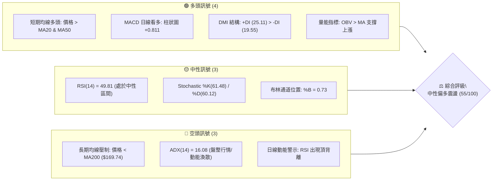

### 📊 核心指標速覽表

| 指標類別 | 指標名稱 | 當前數值 | 訊號 | 專業解讀 |
|:---|:---|:---|:---:|:---|
| **價格** | 當前價格 | $150.85 | 🟡 | 位於52週區間16.0%低檔，短線自底部$114.50反彈 |
| **均線** | MA20 (月線) | $146.98 | 🟢 | 股價站上MA20（+2.63%），短線趨勢向上排列 |
| **均線** | MA50 (季線) | $141.40 | 🟢 | 股價位於MA50上方，中短期底部支撐確立 |
| **均線** | MA200 (年線) | $169.74 | 🔴 | 股價大幅低於MA200（-11.13%），長線空頭壓制明確 |
| **動能** | RSI(14) | 49.81 | 🟡 | 處於50中軸附近，無超買超賣，但存在頂背離警訊 |
| **動能** | MACD (12,26,9) | 1.956 / Sig: 1.145 | 🟢 | DIF高於DEA，柱狀圖+0.811維持多頭動能 |
| **動能** | KD指標 (%K/%D) | 61.48 / 60.12 | 🟡 | 位於中軸上方呈微幅金叉，短線動能溫和 |
| **趨勢** | ADX (14) | 16.08 | 🔴 | 趨勢強度弱（<25），確認市場處於無明確方向的盤整市 |
| **通道** | Bollinger Bands | $138.73 - $155.24 | 🟡 | 現價$150.85接近上軌，%B為0.73，面臨上軌阻力 |
| **波動** | ATR (14) | $6.27 (4.16%) | 🟡 | 波動率處於中等水平，日內平均震幅約$6.27 |
| **量能** | 成交量 / 20日均量 | 17.78M / 25.11M | 🟡 | 量比0.71x，縮量反彈，買盤追價意願有所保留 |

### 🏆 技術評分卡

```
╔══════════════════════════════════════════════════════════════════╗
║              技術評分卡 — ORCL (2026-08-30)                     ║
╠══════════════════════════════════════════════════════════════════╣
║ 趨勢強度 (Trend)       ██████░░░░░░░░░░░░░░  30/100 🔴 弱勢盤整  ║
║ 動能指標 (Momentum)    ████████████░░░░░░░░  60/100 🟢 MACD金叉  ║
║ 支撐穩定度 (Support)   ██████████████░░░░░░  70/100 🟢 MA50/MA20 ║
║ 成交量配合 (Volume)    ██████████░░░░░░░░░░  50/100 🟡 量能萎縮  ║
║ 形態完整度 (Pattern)   ████████████░░░░░░░░  60/100 🟡 底部修復  ║
║ 均線排列 (MA System)   ████████████░░░░░░░░  60/100 🟡 長空短多  ║
╠══════════════════════════════════════════════════════════════════╣
║ 綜合技術評分           ███████████░░░░░░░░░  55/100 🟡 中性震盪  ║
╚══════════════════════════════════════════════════════════════════╝
```

---

## 2. 趨勢分析

### 🌐 多時框趨勢分析

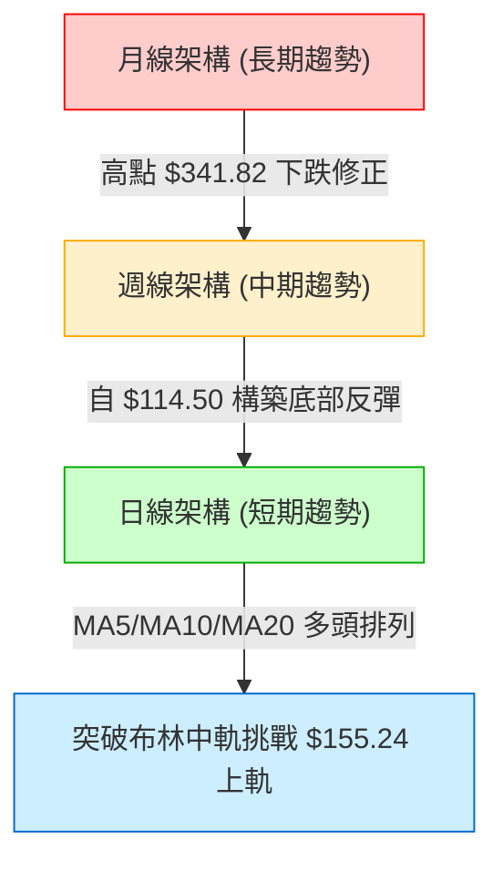

### 📈 長期趨勢 — 12個月走勢圖（Unicode）

```
ORCL 月線歷史走勢圖（2025-09 至 2026-08）
價格軸 ($)
$280 ┤ ●(2025-09: $278.07)
$260 ┤    ●(2025-10: $260.10)
$240 ┤
$220 ┤                               ●(2026-05: $225.00)
$200 ┤       ●(2025-11: $200.02)
$180 ┤          ●(2025-12: $193.05)
$160 ┤             ●(2026-01: $163.44)  ●(2026-04: $160.83)
$140 ┤                ●(2026-02: $144.39)  ●(2026-03: $146.09)  ●(2026-06: $146.04)  ●(2026-08: $150.85 現價)
$120 ┤                                                            ●(2026-07: $129.87)
     └─┬────┬────┬────┬────┬────┬────┬────┬────┬────┬────┬────┬────
      09   10   11   12   01   02   03   04   05   06   07   08 (月份)
```

#### 走勢特徵分析表格
| 階段 | 時間區間 | 起始/結束價 | 漲跌幅 | 走勢特徵解讀 |
|:---|:---:|:---:|:---:|:---|
| **主跌第一波** | 2025/09 - 2026/02 | $278.07 → $144.39 | -48.07% | 高階獲利了結，連續多月單邊下行，失守各級均線 |
| **首次反彈築底** | 2026/02 - 2026/05 | $144.39 → $225.00 | +55.83% | 超跌反彈波，一度快速收復失土並創下波段高點 |
| **二次探底破底** | 2026/05 - 2026/07 | $225.00 → $129.87 | -42.28% | 快速回吐漲幅，7月觸及52週極端低點$114.50（收盤$129.87） |
| **底部回升修復** | 2026/07 - 2026/08 | $129.87 → $150.85 | +16.15% | 自$114.50強勁反彈，修復短期均線，進入盤整過渡期 |

### 📊 中期趨勢（週線分析）

```
週線支撐與阻力結構示意圖
$170.57 ────────────────────── 強阻力 R3 / 接近 MA200 ($169.74)
$163.15 ────────────────────── 斐波那契 78.6% 回調位 / 近期密集壓力
$155.24 ────────────────────── 布林通道上軌 / 區間震盪上限
$150.85 ══════════════════════ [當前收盤價] 處於回升測試阻力位
$146.98 ┄┄┄┄┄┄┄┄┄┄┄┄┄┄┄┄┄┄┄ 短期支撐 / MA20 (布林中軌)
$135.89 ────────────────────── 關鍵支撐 S1 (波段低點聚類)
$114.50 ══════════════════════ 52週極限支撐 S2 (年度底部)
```

從近20週數據觀察：
- **急跌期**（2026-06-14 至 2026-07-26）：週線收盤從 $212.94 崩跌至 $114.99，週線 RSI 曾極端超賣至 11.1–14.9，MACD 柱狀圖最低擴大至 -6.743。
- **修復期**（2026-08-02 至今）：週線出現連續紅K，RSI 自超賣區快速修復至 49.8，MACD 柱由負轉正（當前 +0.811），量能自高檔 180M-250M 收斂至 93.9M，顯示主動性殺盤已竭盡。

### ⚡ 趨勢強度評估（ADX 解讀）

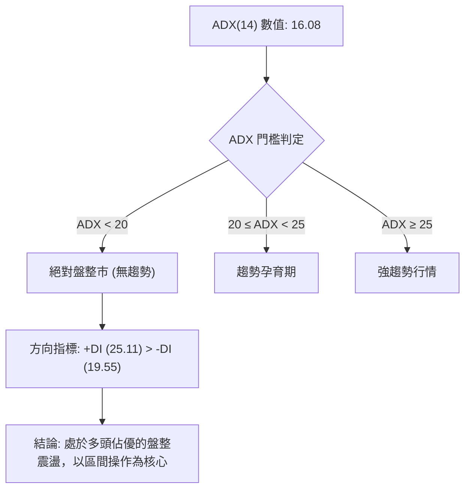

| 指標名稱 | 當前數值 | 參考閾值 | 狀態評估 | 策略意義 |
|:---|:---:|:---:|:---:|:---|
| **ADX(14)** | 16.08 | < 25.0 | 弱趨勢 / 盤整 | 嚴禁採用突破追價策略，以布林通道與支撐阻力高出低進 |
| **+DI** | 25.11 | - | 多頭進攻線 | 多方掌控短線主動權，數值高於 -DI 表明回升格局延續 |
| **-DI** | 19.55 | - | 空頭防守線 | 空頭動能衰退，自7月低點後未見二次發力跡象 |

---

## 3. 圖表形態分析

### 🔍 形態識別系統

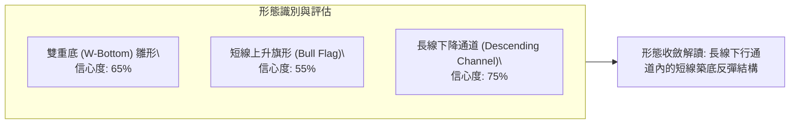

#### 形態識別與信心度評估表
| 形態名稱 | 信心度 | 判斷依據（引用數據） | 完成度 | 目標價計算式 |
|:---|:---:|:---|:---:|:---|
| **雙重底雛形 (W-Bottom)** | 65% | 第一低點$114.50，近期回踩$129.87不破，低點墊高 | 70% | 頸線 $164.24 (R2) + 形態高度($164.24 - $114.50 = $49.74) = **$213.98** |
| **短線上升旗形** | 55% | 8月自$129.87急拉至$150.85後，於$146-$150進行量縮橫盤 | 60% | 旗桿底 $129.87 → 旗頂 $150.85 (高度 $20.98)，突破 $150.85 測 **$171.83** |
| **指標型布林收口** | 85% | ADX=16.08，布林通道寬度收窄($138.73 - $155.24)，價格位於中上軌 | 90% | 區間震盪上限即上軌 **$155.24**，下限為中軌 **$146.98** |

### 🕯️ 重要K線形態分析

| 時間週期 | 代表收盤價 | K線形態名稱 | 技術解讀 | 訊號意涵 |
|:---|:---:|:---|:---|:---:|
| **2026-07 (月線)** | $129.87 | 長下影線錘子線 (Hammer) | 探底 $114.50 後爆量強勁收回，形成長達 $15.37 的下影線 | 🟢 底部強支撐確認 |
| **2026-08-09 (週線)**| $147.02 | 大陽線吞噬 (Bullish Engulfing) | 週成交量達 162.89M，單週大漲將前週陰線全數吞沒 | 🟢 啟動反彈波段 |
| **2026-08-23 (週線)**| $146.47 | 回踩十字星 (Doji) | 成交量縮減至 101.19M，成功守穩 MA20 ($146.98) 附近 | 🟡 洗盤蓄勢整理 |
| **2026-08-30 (週線)**| $150.85 | 溫和小陽線 (Small Bull) | 收盤價創本輪反彈收盤新高，惟成交量收縮至 93.94M | 🟡 缺乏量能追價 |

### 📉 ASCII 走勢形態示意圖

```
ORCL 短中期築底反彈形態
$164.24 ────────────────────────────────────────── 雙底頸線壓力 (R2)
                 (旗桿高點)
$150.85 ───────── ▲ ───┐   ┌─► [突破上軌測試 $155.24]
                / │ ┌─┴─┐ │
$146.98 ───────/  │ │旗面│ │   ────────────────── 布林中軌 (MA20 支撐)
              /   └─┤整理├─┘
$135.89 ─────/      └───┘     ──────────────────── 波段支撐 S1
            / (第一波反彈)
$129.87 ───● (次低點 2026-07)
          /
$114.50 ─● (52W 最低點 2026-07-26) 
```

### 🎯 形態目標價計算
- **短期旗形突破測幅**：
  - 旗桿起點：2026-07-26 週收盤 $129.87（極端低點 $114.50）
  - 旗桿頂點：2026-08-30 收盤 $150.85
  - 形態高度：$150.85 - $129.87 = $20.98
  - 突破目標價：$150.85 + $20.98 = **$171.83**（精確對應年線 MA200 $169.74 與 R3 $170.57 強壓力帶）
- **雙重底測幅（若能有效突破頸線 R2 $164.24）**：
  - 形態低點：$114.50
  - 形態高度：$164.24 - $114.50 = $49.74
  - 終極目標價：$164.24 + $49.74 = **$213.98**

---

## 4. 支撐與阻力

### 🗺️ 關鍵價位分布圖（Unicode）

```
ORCL 價位結構分布圖（OHLCV 精確計算）
═══════════════════════════════════════════════════════════════════════
$170.57 ║██████████████████████████████║ 強阻力 R3 / 密集換手重壓區
$164.24 ║████████████████████          ║ 關鍵阻力 R2 / 雙底潛在頸線
$163.15 ║████████████████████████      ║ 斐波那契 78.6% 回調壓力位
$159.26 ║██████████████                ║ 第一阻力 R1 / 近期波段反彈高點
$155.24 ║██████████                    ║ 布林通道上軌 (短線動態壓力)
$150.85 ╠══════════════════════════════╣ ◄ 現價 ($150.85)
$146.98 ║▓▓▓▓▓▓▓▓▓▓▓▓▓▓▓▓              ║ 動態支撐 / MA20 (布林中軌)
$141.40 ║▓▓▓▓▓▓▓▓▓▓▓▓▓▓▓▓▓▓▓▓          ║ 季線支撐 / MA50 關鍵多空線
$138.73 ║▓▓▓▓▓▓▓▓▓▓▓▓                  ║ 布林通道下軌 (超賣邊界)
$135.89 ║▓▓▓▓▓▓▓▓▓▓▓▓▓▓▓▓▓▓▓▓▓▓▓▓      ║ 核心支撐 S1 / 近一年波段低點聚類
$114.50 ║██████████████████████████████║ 極限強支撐 S2 / 52週最低點
═══════════════════════════════════════════════════════════════════════
```

### 🚧 阻力位分析表

| 阻力級別 | 具體價位 | 形成原因（依據 OHLCV 計算） | 突破難度 | 戰略重要性 |
|:---|:---:|:---|:---:|:---|
| **第一阻力 (R1)** | **$159.26** | 近一年波段反彈高點聚類，接近 MA120 ($161.56) | 🟡 中等 | 短線多空分水嶺，突破方能開啟更大反彈空間 |
| **第二阻力 (R2)** | **$164.24** | 2026年4月波段平台頂部，雙底型態潛在頸線位置 | 🔴 較高 | 中期趨勢反轉關鍵點，此處積聚大量套牢籌碼 |
| **第三阻力 (R3)** | **$170.57** | 歷史密集成交區高點，重合年線 MA200 ($169.74) | 🔴 極高 | 長期空頭強防線，首次觸及高機率受阻回落 |

### 🛡️ 支撐位分析表

| 支撐級別 | 具體價位 | 形成原因（依據 OHLCV 計算） | 守住機率 | 戰略重要性 |
|:---|:---:|:---|:---:|:---|
| **第一支撐 (S1)** | **$135.89** | 近一年波段低點聚類，重合2025年3-4月大底平台 | 🟢 75% | 短線多頭防線，失守將重回探底格局 |
| **第二支撐 (S2)** | **$114.50** | 52週最低點（2026-07觸及），年度絕對估值底部 | 🟢 90% | 長期生命線，跌破將引發新一輪恐慌性下殺 |

### 📐 斐波那契回調位分析

*以 52 週極值區間：高點 $341.82 → 低點 $114.50（垂直落差 $227.32）計算*：

```mermaid
graph LR
    F0["0.0% ($341.82) 52W高點"] --- F23["23.6% ($288.18)"]
    F23 --- F38["38.2% ($254.99)"]
    F38 --- F50["50.0% ($228.16)"]
    F50 --- F61["61.8% ($201.34)"]
    F61 --- F78["78.6% ($163.15)"]
    F78 --- NOW["現價: $150.85"]
    NOW --- F100["100.0% ($114.50) 52W低點"]
    
    style NOW fill:#ffff99,stroke:#333,stroke-width:2px
    style F78 fill:#ffcccc,stroke:#ff0000
    style F100 fill:#ccffcc,stroke:#00aa00
```

- **當前位置解讀**：現價 $150.85 運行於 **78.6% 回調位 ($163.15)** 與 **100.0% 底部 ($114.50)** 之間，屬於深度回調後的底部築底震盪區。
- **上行第一斐波壓制**：$163.15 與波段阻力 R2 ($164.24) 形成高度共振，構成 $163.15–$164.24 的極強密集阻力帶。

---

## 5. 技術指標深度解讀

### 🎛️ 指標訊號總覽

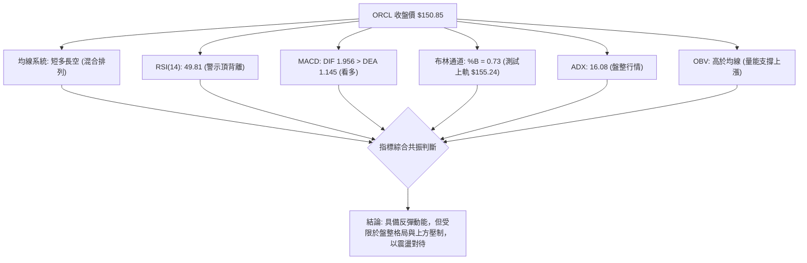

### 📈 移動平均線排列分析

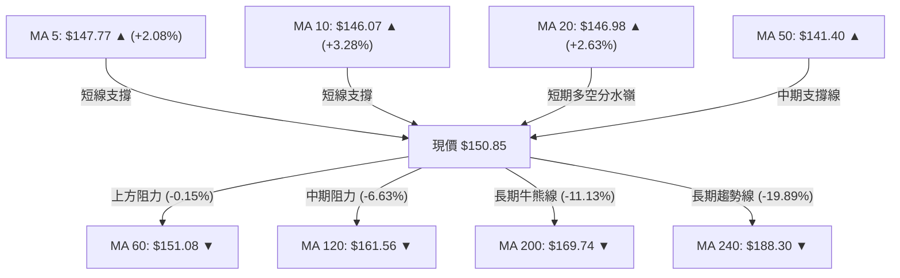

- **均線排列狀態**：當前呈現典型的「短多長空」混合排列。
- **短期均線（MA5、MA10、MA20）**：全部轉為多頭向上發散，價格穩居其上，構成短線回踩的堅實階梯。
- **中長期均線（MA60、MA120、MA200、MA240）**：仍維持向下空頭壓制態勢，特別是 MA60 位於 $151.08（距離現價僅 $0.23），為短線第一道動態阻力關卡。

### 📉 RSI(14) 分析與背離判定

```
RSI(14) 儀表板
0 ──────── 30 ────────────────── 50 ────────────────── 70 ──────── 100
[  超賣區  ]                     [     中性震盪     ]     [  超買區  ]
                               ▲
                       當前值: 49.81 (中性)
進度條: ██████████░░░░░░░░░░ 49.81%
```

- **背離診斷**：⚠️ **日線出現頂背離 (Bearish Divergence)**。
  - **細節驗證**：價格自 8 月初反彈以來連續走高（從 $129.87 攀升至 $150.85），但週線 RSI 數值卻從 8月16日的 **74.6** 下滑至 8月23日的 **54.6**，最新一週進一步收斂至 **49.8**。
  - **結論**：價格創反彈新高但動能指標未能同步創高，顯示短線推升力道衰減，隨時面臨技術性拉回洗盤風險。

### 📊 MACD(12/26/9) 訊號解讀

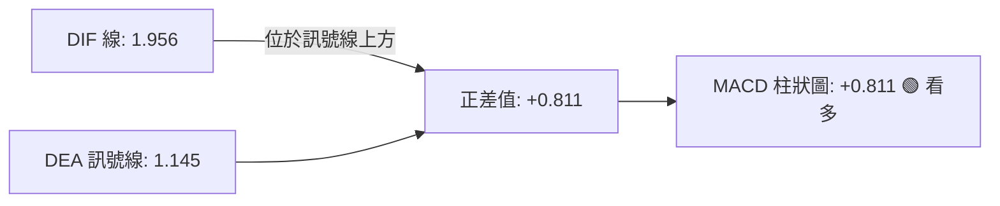

- **訊號解讀**：DIF 與 DEA 均位於零軸上方，且 MACD 柱狀圖保持正值（+0.811），代表日線級別多頭反彈動能尚未結束。但週線層面，柱狀圖自 8月9日的 +4.827 連續萎縮至當前的 +0.811，意味著中期多頭進攻斜率已顯著放緩。

### 📦 布林通道分析

```
ORCL 布林通道結構圖（20日，2倍標準差）
$155.24 ──────────────────────────────────────── 上軌 (動態阻力帶)
                          *  * 
                       *        *  ◄ 現價 $150.85 (靠近上軌，%B=0.73)
$146.98 ──────────────*──────────*────────────── 中軌 (MA20 強支撐)
                    *
$138.73 ──────────*───────────────────────────── 下軌 (動態保護帶)
```

- **帶寬與位置**：通道上軌 $155.24、中軌 $146.98、下軌 $138.73，當前 %B 為 **0.73**。
- **技術含義**：價格運行於中軌與上軌之間的多頭通道內，但已接近上軌超買臨界點（%B > 0.8 通常面臨回調）。在 ADX 僅 16.08 的背景下，觸碰上軌引發回踩中軌 $146.98 的機率極高。

### 💹 成交量分析（量價配合度）

```
量能指標進度條：
最新成交量: 17.78M  ███████░░░░░░░░░░░░░ (71% of 20MA)
20日均量:   25.11M  ██████████░░░░░░░░░░
50日均量:   32.69M  █████████████░░░░░░░
```

- **量價關係判斷**：
  - **量縮價漲**：現價微幅上漲至 $150.85，但單日成交量僅 17.78M，顯著低於 20 日均量（量比 0.71x），顯示市場追價意願不足，屬於典型的籌碼沉澱型反彈而非買盤爆發型推升。
  - **OBV 趨勢**：OBV > MA，量能指標大體維持在均線之上，說明自 $114.50 反彈以來，低檔承接資金尚未出現大規模出逃跡象。

---

## 6. 動能與波動率

### ⚡ 動能評估四象限

| 象限 | 動能強度 (Momentum) | 波動率水平 (Volatility) | 當前判定 | 市場環境特徵與應對策略 |
|:---:|:---:|:---:|:---:|:---|
| **Q1** | 強 (High) | 低 (Low) | — | 穩健單邊趨勢，最佳順勢波段加碼機會 |
| **Q2** | 弱 (Low) | 低 (Low) | **✓ ORCL 處於此區** | **盤整蓄勢期：動能衰退且震幅收窄，宜區間低吸高拋** |
| **Q3** | 強 (High) | 高 (High) | — | 高動能突破期：高風險高回報，適合突破追單 |
| **Q4** | 弱 (Low) | 高 (High) | — | 混亂無序震盪：洗盤頻繁，最易造成連續虧損 |

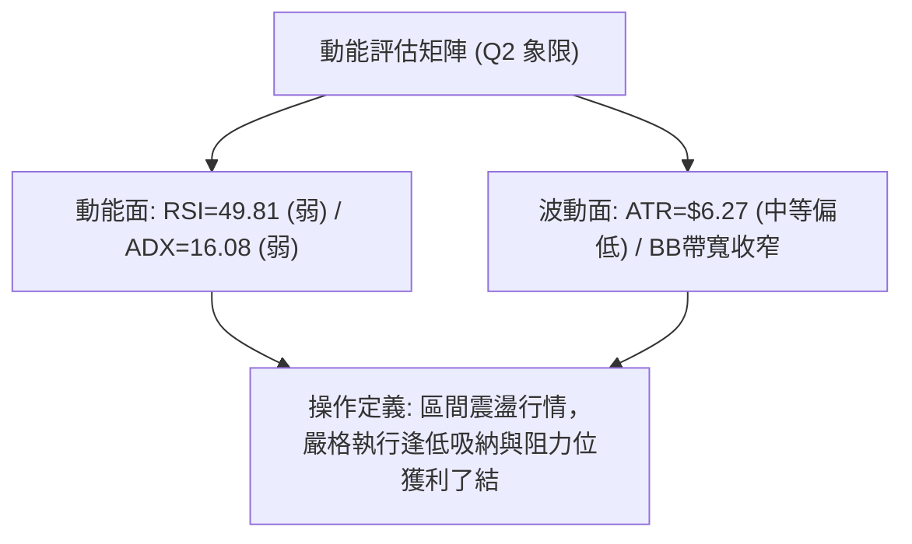

### 📊 ATR 波動率分析與止損設定

- **ATR(14) 當前數值**：**$6.27**（佔股價比例 **4.16%**）。
- **止損距離建議**：
  - **短線交易（1.0 × ATR）**：建議安全止損緩衝為 **$6.27**。
  - **波段交易（1.5 × ATR）**：建議安全止損緩衝為 **$9.41**。
  - **防守性底線（2.0 × ATR）**：建議安全止損緩衝為 **$12.54**。

### 📐 Beta 與市場相關性

- **Beta 數值**：**1.718**（高 Beta 屬性）。
- **解讀**：ORCL 相對標普500大盤具有較高的波動敏感度（大盤波動 1%，ORCL 理論波動約 1.72%）。在目前科技板塊震盪修復期間，ORCL 彈性較大，適合做彈性波段操作，但需嚴控單筆持倉風險。

---

## 7. 多時框架總結

### 📋 時框架評分表

| 時框架 | 趨勢方向 | 動能指標 | 均線排列 | 圖表形態 | 綜合評分 | 戰術建議 |
|:---|:---:|:---:|:---:|:---:|:---:|:---|
| **短期 (日線)** | 🟢 偏多 | 🟡 中性 (頂背離) | 🟢 短期多頭 (MA5>10>20) | 🟢 旗形整理 | 65/100 | 依布林中軌支撐逢低承接 |
| **中期 (週線)** | 🟡 震盪 | 🟢 MACD金叉 | 🟡 均線糾纏 (跌破MA50) | 🟡 雙底構築中 | 55/100 | 區間操作，阻力位分批減碼 |
| **長期 (月線)** | 🔴 偏空 | 🔴 長期下行 | 🔴 空頭壓制 (價格<MA200) | 🔴 大級別下降通道 | 35/100 | 戰略性觀望，等待長線底部確立 |

### 🔲 綜合訊號矩陣

```
時框架訊號矩陣
┌──────────────┬──────────────┬──────────────┬──────────────┐
│   時框架     │   趨勢狀態   │   核心阻力   │   核心支撐   │
├──────────────┼──────────────┼──────────────┼──────────────┤
│ 短期 (日線)  │ 🟢 弱勢多頭  │ BB上軌$155.24│ MA20 $146.98 │
│ 中期 (週線)  │ 🟡 區間盤整  │ R1 $159.26   │ S1 $135.89   │
│ 長期 (月線)  │ 🔴 空頭承壓  │ MA200 $169.74│ S2 $114.50   │
└──────────────┴──────────────┴──────────────┴──────────────┘
```

### ⚖️ 多時框收斂結論

依據多時框收斂規則（嚴格要求 14）：
1. **行情性質判定**：當前 ADX(14) 為 **16.08**（遠低於 25 臨界值），確認市場處於典型的**「盤整震盪行情」**而非強趨勢行情。
2. **主導規則應用**：在盤整行情中，中長期均線的單邊趨勢主導性降低，日線與週線的**布林通道上下軌**成為最核心的交易邊界。
3. **唯一方向性結論**：**中性偏多區間震盪（Neutral-to-Bullish Rangebound）**。
   - **收斂理由**：日線短期均線（MA5/10/20）呈多頭排列，底部自 $114.50 抬升至 $129.87，支持價格向上測試阻力；但由於長期 MA200 壓制與日線 RSI 頂背離警訊，上方空間受限於 $155.24–$159.26 區間。操作上以布林中軌（$146.98）為防守點進行區間逢低做多。

---

## 8. 交易策略建議

### 🗺️ 策略決策流程圖

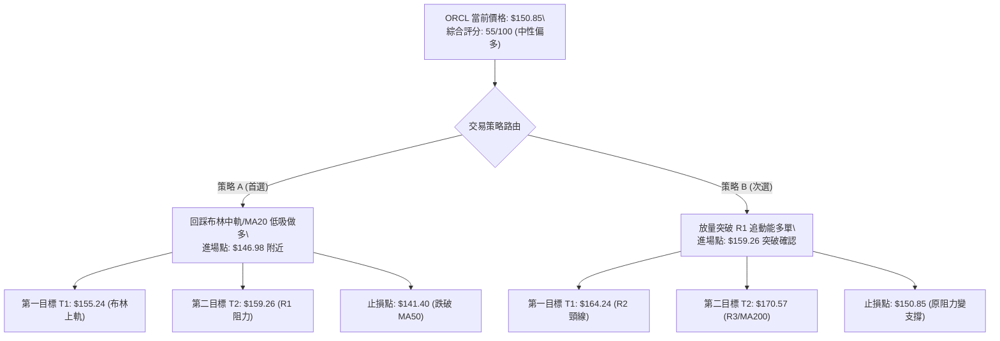

### 🧭 策略路由

**當前主策略方向 = 中性偏多區間交易（依技術評分卡綜合評分 55/100）**
由於綜合評分處於 40–60 區間且 ADX < 25，策略定位為**「布林通道區間操作，嚴控回踩買點，反彈遇阻減碼」**。

### 🎯 價格情境階梯（Price Scenarios）

| 觸發條件 | 下一目標 | 後續延伸目標 | 技術情境含義 |
|:---|:---:|:---:|:---|
| **有效突破 R1 ($159.26)** | R2 ($164.24) | R3 ($170.57) / MA200 | 短線多頭轉強，挑戰雙底頸線與長期熊牛分界線 |
| **維持於現價區間 ($146.98 - $155.24)** | $155.24 (上軌) | $146.98 (中軌) | 布林通道內無序震盪，指標逐步修復背離 |
| **有效跌破 S1 ($135.89)** | S2 ($114.50) | 歷史低位測試 | 中期反彈結構徹底破壞，重回空頭二次探底行情 |

### 📊 情境機率分佈

| 運行情境 | 發生機率 | 主要技術依據 |
|:---|:---:|:---|
| **情境一：區間震盪偏強（測試 $155.24 - $159.26）** | **55%** | 短期 MA5/10/20 多頭排列，MACD 日線維持金叉，OBV 量能支撐 |
| **情境二：回踩中軌洗盤（回測 $146.98 - $141.40）** | **30%** | RSI 出現日線頂背離，成交量能低迷（0.71x），需要技術性回踩均線 |
| **情境三：破位下行（跌破 S1 $135.89 探底）** | **15%** | 長期 MA200 壓制力道強勁，總體基本面負債高企（Debt/Equity 388.87） |

### 🟢 主策略詳情

| 策略要素 | 策略 A：布林中軌回踩低吸（核心主推） | 策略 B：突破 R1 順勢動能多單（突破確認） |
|:---|:---|:---|
| **策略類型** | 支撐位右側低吸策略 | 關鍵阻力位突破跟進策略 |
| **進場條件** | 股價拉回測試 MA20 企穩，出現日線收陽十字星 | 日線放量收盤突破 R1 $159.26 且成交量 > 25M |
| **進場價格** | **$146.98** | **$159.50** (確認站穩 $159.26 後) |
| **止損價格** | **$141.40** (跌破季線 MA50 及布林下軌緩衝) | **$153.50** (回落至突破點與ATR緩衝下方) |
| **第一目標價 (T1)**| **$155.24** (布林通道上軌) | **$164.24** (波段阻力 R2 / 雙底頸線) |
| **第二目標價 (T2)**| **$159.26** (波段阻力 R1) | **$170.57** (波段阻力 R3 / MA200) |
| **單筆風險空間** | $146.98 - $141.40 = **$5.58** (3.80%) | $159.50 - $153.50 = **$6.00** (3.76%) |
| **第一目標盈虧比** | ($155.24 - $146.98) / $5.58 = **1.48 : 1** | ($164.24 - $159.50) / $6.00 = **0.79 : 1** |
| **第二目標盈虧比** | ($159.26 - $146.98) / $5.58 = **2.20 : 1** | ($170.57 - $159.50) / $6.00 = **1.85 : 1** |
| **成功機率** | **65%** | **50%** (需觀察量能配合) |
| **建議倉位** | **10% - 15%** | **5% - 8%** (突破加碼性質) |

### 🔴 反向風險觸發點（對沖與風控提示）

若出現以下訊號，主多策略立即失效，應果斷止損離場或反手布局保護性空單：
1. **關鍵支撐失守**：日線收盤價跌破 **MA50 ($141.40)** 或波段支撐 **S1 ($135.89)**。
2. **動能死叉確立**：MACD 柱狀圖由正轉負且日線 RSI 跌破 40 中軸。
3. **爆量下破**：單日成交量擴大至 35M 以上並收出大陰線。

### ⭐ 整體訊號強度評星

```
╔══════════════════════════════════════════════════════════════════╗
║ 做多訊號強度：  ★★★☆☆  (3.0 / 5.0 星) — 偏多但受制於盤整市    ║
║ 做空訊號強度：  ★★☆☆☆  (2.0 / 5.0 星) — 短期均線支撐完好      ║
║ 整體訊號可信度：★★★☆☆  (3.5 / 5.0 星) — 指標結構收斂一致      ║
╚══════════════════════════════════════════════════════════════════╝
```

---

## 9. 風險提示與監控

### ✅ 關鍵監控指標 Checklist

```
╔══════════════════════════════════════════════════════════════════╗
║              ORCL 交易監控清單 (Daily Checklist)                ║
╠══════════════════════════════════════════════════════════════════╣
║ [ ] 價格是否跌破布林中軌 MA20 ($146.98)？                        ║
║ [ ] RSI(14) 頂背離是否引發指標下穿 45 水平？                     ║
║ [ ] MACD 柱狀圖是否跌破 0 軸轉為綠柱？                          ║
║ [ ] 單日成交量是否回升至 20 日均量 ($25.11M) 之上？              ║
║ [ ] 價格觸及布林上軌 $155.24 時是否出現長上影線？               ║
║ [ ] 大盤標普500是否出現系統性回調（ORCL Beta=1.718 高敏感度）？  ║
╚══════════════════════════════════════════════════════════════════╝
```

### ⚠️ 風險場景分析

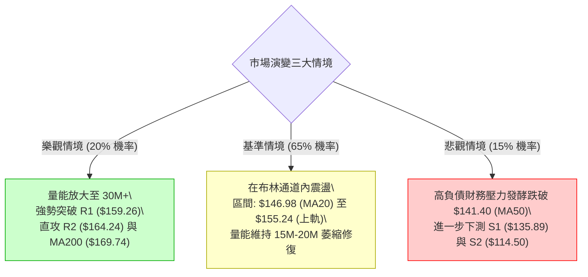

### 🛡️ 風險管理重要提醒

1. **財務槓桿風險**：資產負債表中總負債達 $167.43B（淨負債 $-135.54B，Debt/Equity 388.87），且自由現金流為負（$-24.54B）。技術面反彈容易受宏觀利率波動影響，**嚴禁重倉持股過夜**。
2. **高 Beta 波動防範**：Beta 高達 1.718，意味著價格日內波動幅度常超預期。單筆交易止損空間必須嚴格按照 ATR ($6.27) 計算，建議單筆虧損金額不超過總投資本金的 **1.0%**。
3. **無趨勢市禁止追高**：ADX(14) 為 16.08，表明市場處於典型吸籌震盪階段，盤中急拉通常是誘多陷阱，所有多頭進場點必須嚴格等待**回踩均線確認企穩**。

---

## 10. 報告總結

```
╔══════════════════════════════════════════════════════════════════╗
║                   ORCL 技術分析報告總結                         ║
╠══════════════════════════════════════════════════════════════════╣
║ 報告日期：2026-08-30               當前價格：$150.85             ║
║ 技術評分：55 / 100 (中性偏多)      趨勢強度：ADX 16.08 (盤整市)  ║
║ 分析評級：⚖️ 區間逢低做多 (Range-Bound Accumulation)            ║
╠══════════════════════════════════════════════════════════════════╣
║ 關鍵結論：                                                       ║
║ ├─ 長期趨勢：🔴 偏空運行，價格受制於年線 MA200 ($169.74)         ║
║ ├─ 中期趨勢：🟡 雙底構築，於 $114.50–$164.24 區間修復整理       ║
║ ├─ 短期趨勢：🟢 偏多回升，MA5/10/20 多頭排列，受阻於布林上軌    ║
║ ├─ 核心支撐：第一支撐 MA20 $146.98 / 強支撐 S1 $135.89          ║
║ ├─ 核心阻力：布林上軌 $155.24 / 關鍵阻力 R1 $159.26             ║
║ └─ 華爾街目標：平均目標價 $244.12 (共識評級: Buy / 42位分析師)   ║
╠══════════════════════════════════════════════════════════════════╣
║ 最優策略執行方案：                                               ║
║ 1. 🥇 最佳機會：回踩 MA20 ($146.98) 逢低吸納做多                 ║
║    止損 $141.40 ｜ 目標 T1 $155.24 ｜ 目標 T2 $159.26 (RR=2.20)  ║
║ 2. 🥈 次選機會：放量突破 R1 ($159.26) 後輕倉順勢跟進             ║
║    止損 $153.50 ｜ 目標 T1 $164.24 ｜ 目標 T2 $170.57 (RR=1.85)  ║
║ 3. 🥉 保守選擇：等待股價突破並站穩年線 MA200 ($169.74) 再行長線布局║
╚══════════════════════════════════════════════════════════════════╝
```

---

> ⚠️ **免責聲明**：本報告為技術分析研究成果，所有數據及價位均基於歷史量價與技術指標模型計算。本報告**僅供學術研究與投資參考**，**不構成任何要約、招攬或具體投資建議**。金融市場存在高度風險，投資人應依個人風險承受能力獨立決策，並自行承擔交易損益。

---

*報告生成時間：2026-08-30 ｜ 數據來源：Yahoo Finance ｜ 分析框架：資深多時框量化技術分析系統*