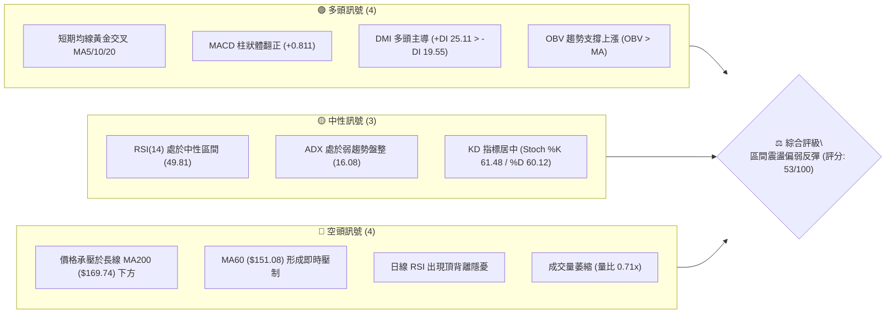
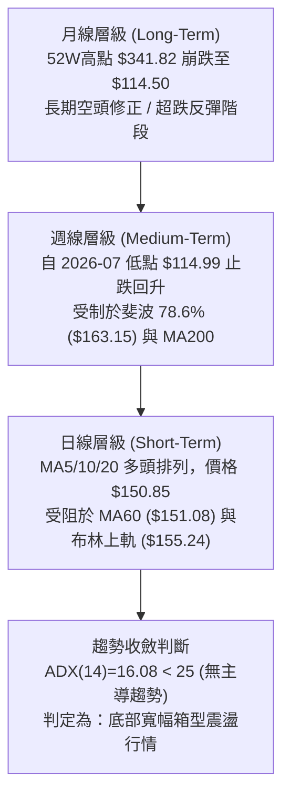
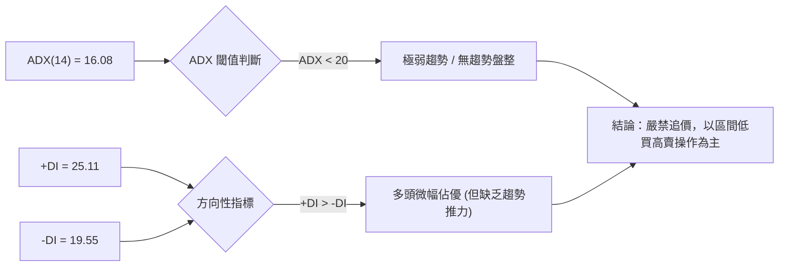
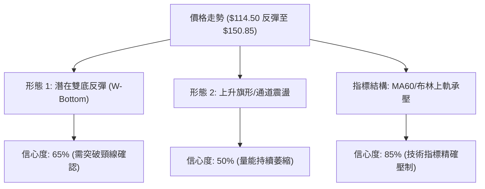
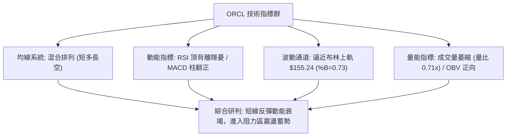
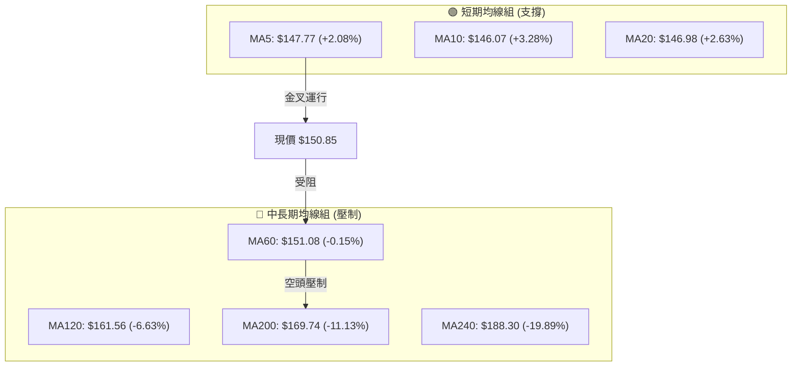
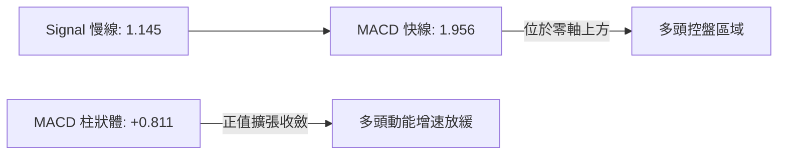
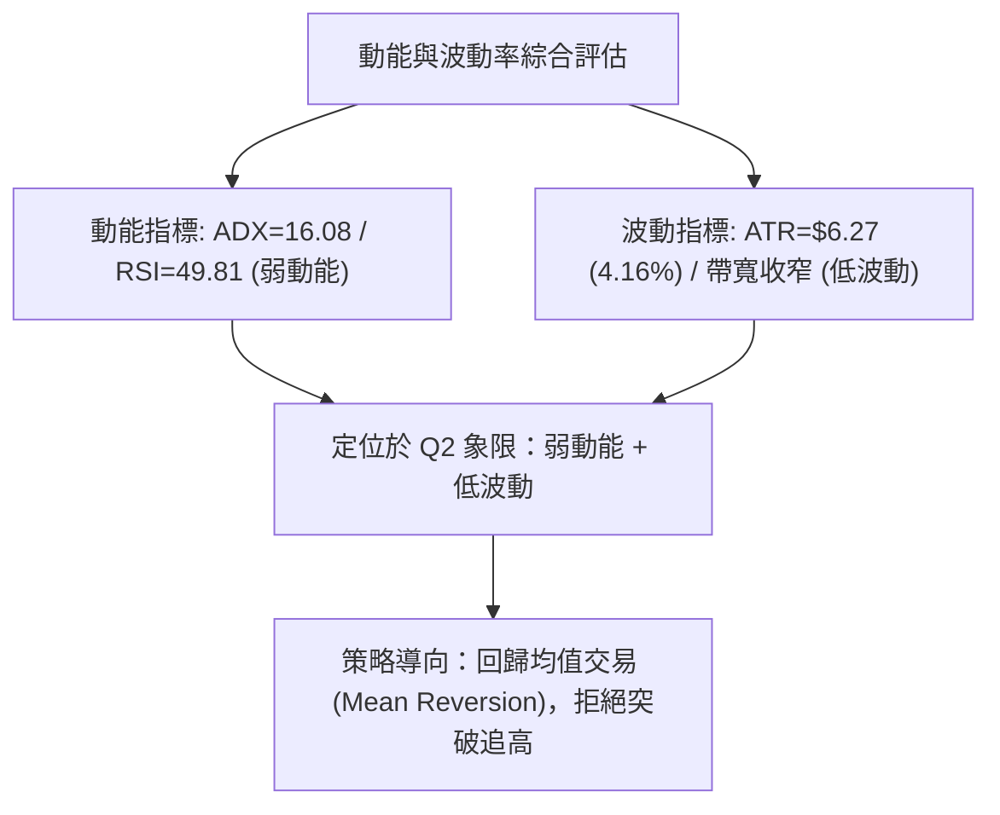
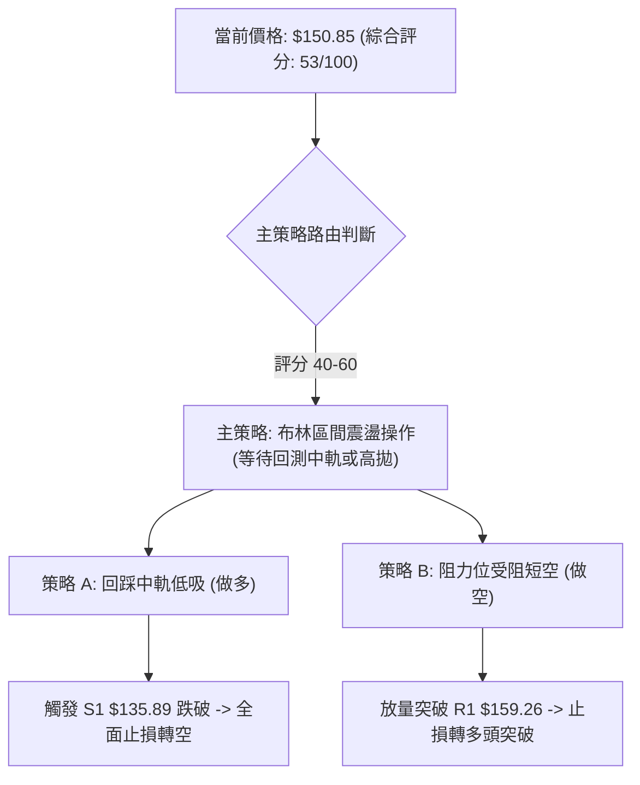
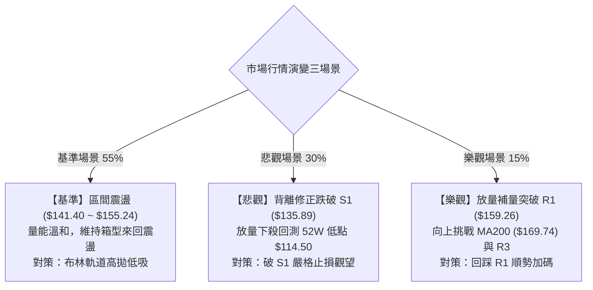

# ORCL 技術分析報告

> **報告日期**：2026-08-31 ｜ **語言**：繁體中文 ｜ **數據來源**：Yahoo Finance ｜ **當前價格**：$150.85

---

## 目錄

| 章節 | 內容 |
|------|------|
| [1. 技術面概覽](#1-技術面概覽) | 訊號儀表板、核心指標、評分卡 |
| [2. 趨勢分析](#2-趨勢分析) | 多時框趨勢、長中短期走勢、ADX強弱 |
| [3. 圖表形態分析](#3-圖表形態分析) | 形態識別、K線組合、形態信心度與目標價 |
| [4. 支撐與阻力](#4-支撐與阻力) | 關鍵價位結構、斐波那契回調位分析 |
| [5. 技術指標深度解讀](#5-技術指標深度解讀) | MA/RSI/MACD/布林通道/成交量 |
| [6. 動能與波動率](#6-動能與波動率) | 動能四象限、ATR波動率、Beta市場相關性 |
| [7. 多時框架總結](#7-多時框架總結) | 時框架矩陣、多時框優先級收斂結論 |
| [8. 交易策略建議](#8-交易策略建議) | 策略路由、情境階梯、主策略與風控 |
| [9. 風險提示與監控](#9-風險提示與監控) | 監控Checklist、情境分析、倉位管理 |

---

## 1. 技術面概覽

### 🎯 技術訊號儀表板



### 📊 核心指標速覽表

| 指標類別 | 指標名稱 | 當前數值 | 訊號 | 解讀 |
|----------|----------|----------|:---:|------|
| **價格** | 當前價格 | $150.85 | 🟡 | 位於52週區間 16.0% 之相對低檔，自低點反彈但未脫離盤整 |
| **均線** | MA20 | $146.98 | 🟢 | 價格站上短期中軌，提供短線動態支撐 |
| **均線** | MA50 | $141.40 | 🟢 | 價格在50日線之上，中期超跌修復持續 |
| **均線** | MA200 | $169.74 | 🔴 | 長期牛熊分界線維持下行，上方長期套牢賣壓沉重 |
| **動能** | RSI(14) | 49.81 | 🟡 | 位於中性平衡區，但近期反彈高點伴隨頂背離跡象 |
| **動能** | MACD | 1.956 (Hist: +0.811) | 🟢 | 快線高於慢線，柱狀體維持多頭擴張 |
| **動能** | Stoch %K/%D | 61.48 / 60.12 | 🟡 | 隨機指標交叉向上但未進入超買，動能溫和 |
| **趨勢** | ADX(14) | 16.08 | 🟡 | ADX < 25 表明市場處於無方向之弱趨勢盤整行情 |
| **通道** | 布林通道 %B | 0.73 | 🟡 | 逼近布林上軌 ($155.24)，短期面臨軌道邊界壓力 |
| **量能** | 成交量 / 20MA | 17.78M / 25.11M | 🔴 | 量比 0.71x，反彈過程動能不足，呈量價背離 |
| **波動** | ATR(14) | $6.27 (4.16%) | 🟡 | 每日平均波動幅度中等，適宜波段區間操作 |

### 🏆 技術評分卡

```
╔══════════════════════════════════════════════════════════════╗
║              技術評分卡 — ORCL (2026-08-31)                 ║
╠══════════════════════════════════════════════════════════════╣
║ 趨勢強度 (ADX=16.08 盤整)    ██████░░░░░░░░░░░░░░  30/100 🔴 ║
║ 動能指標 (MACD多/RSI背離)    ████████████░░░░░░░░  60/100 🟡 ║
║ 支撐穩定度 (S1 $135.89)      ██████████████░░░░░░  70/100 🟢 ║
║ 成交量配合 (量比 0.71x 無量)  ████████░░░░░░░░░░░░  40/100 🔴 ║
║ 形態完整度 (箱型築底初階)    ████████████░░░░░░░░  60/100 🟡 ║
║ 均線排列 (短多長空混排)      ████████████░░░░░░░░  60/100 🟡 ║
╠══════════════════════════════════════════════════════════════╣
║ 綜合評分                     ███████████░░░░░░░░░  53/100 🟡 ║
║ 評級結論：中性震盪 (Neutral Consolidation)                   ║
╚══════════════════════════════════════════════════════════════╝
```

---

## 2. 趨勢分析

### 🌐 多時框趨勢分析



### 📈 長期趨勢 — 12個月走勢圖（Unicode）

```
ORCL 月線走勢圖（2025-09 至 2026-08）
價格軸 ($)
$280 ┤ ● (2025-09: $278.07 歷史次高)
$260 ┤   ●
$240 ┤
$220 ┤                    ● (2026-05: $225.00 假突破)
$200 ┤     ●
$180 ┤       ●
$160 ┤         ●        ●           ● ← 當前 $150.85
$140 ┤           ●  ● ●               ●
$120 ┤                                  ● (2026-07: $129.87 / 52W低 $114.50)
     └─┬──┬──┬──┬──┬──┬──┬──┬──┬──┬──┬──┬──
      09 10 11 12 01 02 03 04 05 06 07 08 (月份: 2025-09 → 2026-08)
```

**走勢特徵分析表格**：

| 階段 | 時間區間 | 起訖價格 | 區間漲跌幅 | 結構特徵與量價行為 |
|------|----------|----------|:---------:|-------------------|
| **頭部崩落** | 2025-09 至 2026-02 | $278.07 → $144.39 | -48.07% | 高檔放量下挫，失守多條均線，形成中長線空頭排列 |
| **超跌反彈** | 2026-03 至 2026-05 | $146.09 → $225.00 | +54.01% | 季報驅動脈衝上漲，但於 $225.00 遭遇強大獲利了結賣壓 |
| **二次探底** | 2026-06 至 2026-07 | $225.00 → $129.87 | -42.28% | 連續單月長黑摜破前低，並下探 52 週最低點 $114.50 |
| **底部回升** | 2026-08 至今 | $129.87 → $150.85 | +16.15% | 於 $114.50 處獲得強支撐並展開修復性反彈，目前進入震盪 |

### 📊 中期趨勢（週線分析）

從近 20 週數據觀察，ORCL 在 2026-06 展開劇烈下殺，週 RSI 一度跌至 11.1 極度超賣區間，隨後於 2026-07-26 當週收在 $114.99（逼近 52 週低點 $114.50）形成波段低點。8 月初連續強彈至 $150.52，週 RSI 快速修復至 74.6 超買區後降溫至 49.8，週 MACD 柱狀體由最高 +4.827 收斂至 +0.811，顯示中期反彈第一階段的急漲動能已宣告結束，進入阻力區前的消耗震盪。

```
中期阻力與支撐示意圖：
[強阻力 R2/R3]  $164.24 ~ $170.57 ─── MA200 ($169.74) + 斐波 78.6% ($163.15)
[近端阻力 R1]   $159.26 ──────────── 近期波段反彈高點聚類
[現價位置]      $150.85 ──────────── 承壓於 MA60 ($151.08)
[動態支撐]      $146.98 ──────────── MA20 / 布林中軌
[波段支撐 S1]   $135.89 ──────────── 近一年波段低點平台聚類
[極限支撐 S2]   $114.50 ──────────── 52W 絕對底部
```

### ⚡ 趨勢強度評估（ADX 解讀）



| 指標項 | 數值 | 狀態 | 意涵與操作指引 |
|--------|------|:----:|----------------|
| **ADX(14)** | **16.08** | 弱趨勢/盤整 | 趨勢強度遠低於 25，代表單邊趨勢尚未成型，突破多為假突破 |
| **+DI (14)** | **25.11** | 多方主導 | 買盤力量略高於賣盤，多頭掌控短線節奏 |
| **-DI (14)** | **19.55** | 空方收斂 | 空方拋壓暫時減緩，但尚未完全退場 |

---

## 3. 圖表形態分析

### 🔍 形態識別系統



**形態信心度與目標價評估表**：

| 形態名稱 | 信心度 | 判斷依據（引用數據） | 完成度 | 目標價（附嚴格計算式） |
|----------|:------:|----------------------|:------:|------------------------|
| **雙底形態 (W-Bottom)** | **65%** | 2026-07 探底 $114.99 與 52W 低點 $114.50 構成雙重底；反彈第一波高點在 R1 $159.26。 | 70% | 頸線 R1 ($159.26) + 形態高度 ($159.26 - $114.50 = $44.76) = **$204.02**（接近斐波 61.8% $201.34） |
| **矩形箱型整理** | **80%** | 價格受限於區間上緣布林上軌 $155.24 / R1 $159.26 與下緣 S1 $135.89 之間。 | 85% | 箱頂突破：$159.26 + ($159.26 - $135.89 = $23.37) = **$182.63**<br>箱底跌破：$135.89 - $23.37 = **$112.52** |
| **下降趨勢線反抽** | **75%** | 2025-09 ($278.07) 下跌趨勢的反彈波，受制於 MA200 ($169.74)。 | 90% | 承壓目標回測：回測 MA20 ($146.98) 或 S1 ($135.89) |

### 🕯️ 重要K線形態分析

| 週/月份 | 收盤價 | K線形態 | 解讀 | 訊號 |
|---------|--------|---------|------|:---:|
| **2026-05** | $225.00 | 帶長上影線長紅 | 多頭竭盡噴出，月線逼近前期套牢區後遭遇劇烈拋壓 | 🔴 |
| **2026-06** | $146.04 | 大陰線破位 | 月跌幅達 -35.1%，跌破 MA120/MA200，確立中期下行 | 🔴 |
| **2026-07** | $129.87 | 長下影線十字星 | 盤中下探 $114.50 後獲逢低買盤進駐，呈現止跌落底信號 | 🟢 |
| **2026-08 (當前)** | $150.85 | 實體中陽線 | 自底部回升 +16.15%，但上檔面臨 MA60 ($151.08) 壓制 | 🟡 |
| **近兩週日K** | $150.85 | 窄幅縮量整理 | 連續兩週於 $146.47~$150.85 震盪，成交量遞減至 93.9M | 🟡 |

### 📉 ASCII 走勢形態示意圖

```
ORCL 底部雙底與箱型阻力結構：
價格 ($)
$170.57 ┤                                          [R3: 強阻力/MA200]
        │
$159.26 ┤                 ● (頸線/R1 阻力)         [R1: 頸線位置]
        │               ／ ＼
$150.85 ┤             ／     ●← 現價 ($150.85，受阻 MA60)
        │           ／         ＼
$141.40 ┤         ／             ● (MA50 支撐)
        │       ／                 ＼
$135.89 ┤     ／                     ● (S1 支撐平台)
        │   ／                         ＼
$114.50 ┤  ● (第1底: $114.50)           ● (第2底: $114.99)
        └─┬───────────────────────────────┬─────────────
          2026-07-26                     2026-08-31
```

---

## 4. 支撐與阻力

### 🗺️ 關鍵價位分布圖（Unicode）

```
╔══════════════════════════════════════════════════════════════════╗
║                   ORCL 價位結構分布圖                            ║
╠══════════════════════════════════════════════════════════════════╣
║ $170.57 ║████████████████████████║ 強阻力 R3 / MA200 ($169.74)  ║
║ $164.24 ║████████████████████    ║ 中期阻力 R2 / 斐波78.6%     ║
║ $159.26 ║████████████████████████║ 關鍵阻力 R1 (頸線壓力)       ║
║ $155.24 ║▓▓▓▓▓▓▓▓▓▓▓▓▓▓▓▓▓▓      ║ 布林通道上軌                 ║
║ $151.08 ║▒▒▒▒▒▒▒▒▒▒▒▒▒▒▒▒▒▒▒▒    ║ MA60 均線即時壓制            ║
║ $150.85 ╠════════════════════════╣ ◄ 當前收盤價 ($150.85)       ║
║ $146.98 ║░░░░░░░░░░░░░░░░░░░░    ║ MA20 / 布林中軌支撐          ║
║ $141.40 ║░░░░░░░░░░░░░░░░        ║ MA50 均線支撐                ║
║ $135.89 ║████████████████        ║ 波段關鍵支撐 S1 (近期平台)   ║
║ $114.50 ║████████████████████████║ 52週絕對底部強支撐 S2        ║
╚══════════════════════════════════════════════════════════════════╝
```

### 🚧 阻力位分析表

| 阻力級別 | 價位 | 形成原因（依據數據） | 突破難度 | 重要性 |
|:--------:|:----:|----------------------|:--------:|:------:|
| **R1** | **$159.26** | 近一年波段高點聚類，亦為日線雙底形態之頸線關卡 | ⭐️⭐️⭐️☆ | 極高（短線多空分水嶺） |
| **R2** | **$164.24** | 斐波那契 78.6% 回調位 ($163.15) 與波段套牢密集區 | ⭐️⭐️⭐️⭐️ | 高（波段反彈強阻力） |
| **R3** | **$170.57** | MA200 ($169.74) 牛熊分界線與歷史密集成交區重疊 | ⭐️⭐️⭐️⭐️⭐️ | 極高（中期趨勢反轉點） |

### 🛡️ 支撐位分析表

| 支撐級別 | 價位 | 形成原因（依據數據） | 守住機率 | 重要性 |
|:--------:|:----:|----------------------|:--------:|:------:|
| **S1** | **$135.89** | 近一年波段低點聚類，與 2025-03 ($137.45)/04 ($138.84) 歷史平台共振 | 75% | 高（短線回調防守底線） |
| **S2** | **$114.50** | 52 週最低點，2026-07-26 當週測底 $114.99 形成之絕對結構底 | 90% | 極高（中長期多頭生死線） |

### 📐 斐波那契回調位分析

依據 52 週極值區間（低點 $114.50 → 高點 $341.82，總垂直跨度 $227.32）計算：

```
0.0%  (52W High)  $341.82 ─────────────────────────────────────
23.6%             $288.18 ─────────────────────────────────────
38.2%             $254.99 ─────────────────────────────────────
50.0%             $228.16 ───────────────────────────────────── (2026-05 反彈頂點 $225.00 處)
61.8%             $201.34 ─────────────────────────────────────
78.6%             $163.15 ─────────────────── [R2 $164.24 壓制區]
                  $150.85 ◄─── 當前現價 (位於 78.6% 與 100.0% 之間)
100.0% (52W Low)  $114.50 ─────────────────── [S2 $114.50 絕對底]
```

- **位置解讀**：現價 $150.85 處於斐波那契 78.6% ($163.15) 與 100.0% ($114.50) 的深度修正底部區間。
- **技術意義**：斐波那契 78.6% 回調位 $163.15 是空頭趨勢下「最後防線」，ORCL 價格目前在此線下方運行，確認了整體格局仍受長期空頭波段壓制；向上反彈必須有效收復 $163.15 並衝擊 61.8% ($201.34)，方能宣告中級反轉確立。

---

## 5. 技術指標深度解讀

### 🎛️ 指標訊號總覽



### 📈 移動平均線排列分析



- **均線排列狀態**：呈現典型的「短多長空」混合排列。短期 MA5/MA10/MA20 形成多頭推升排列，提供現價下方 $146.00~$147.00 的支撐；然而 MA60 ($151.08) 近在咫尺且走平微跌，上方 MA120 ($161.56) 與 MA200 ($169.74) 均呈現大角度下行趨勢，對反彈空間構成強烈壓制。

### 📉 RSI(14) 分析

- **當前數值**：**49.81**
- **數值進度條**：
  ```
  RSI(14): 49.81  [0] ░░░░░░░░░░░░░░░░░░░░███████████████████░░░░░░░░░░░░░░░░░░░░ [100] (中性平衡區)
  ```
- **超買超賣分析**：RSI 脫離 2026-07 探底時的極度超賣區（週 RSI 曾達 11.1），目前在 50 水平線附近沉澱，顯示多空雙方在此力量暫時均衡。
- **背離判斷**：⚠️ **日線頂背離 (Bearish Divergence)**
  - 價格由 8 月中旬的 $147.02 推升至當前 $150.85，但日線動能指標出現鈍化，週線 RSI 亦由 8 月中旬的 74.6 迅速回落至 49.81，形成「價格創新高而動能峰值走低」的頂背離形態，預示若無量能放大支撐，短線反彈隨時面臨修正。

### 📊 MACD(12/26/9) 訊號解讀



- **數值狀態**：DIF (1.956) > DEA (1.145)，MACD 柱狀體為 **+0.811**（🟢 看多）。
- **解讀**：MACD 自零軸下方金叉穿越至零軸之上，為典型的修復性反彈信號。但對比 2026-08-09 週柱狀體峰值 (+4.827) 與目前 (+0.811)，柱狀體高度持續縮小，顯示多頭衝刺動能正在衰退，短期面臨死叉收斂風險。

### 📦 布林通道分析

```
ORCL 布林通道 (BB 20, 2) 結構圖：
$155.24 ┬────────────────────────────────────────── BB 上軌 ($155.24)
        │                   ╭───● 現價 $150.85 (%B = 0.73)
$146.98 ┼───────────────╭───╯────────────────────── BB 中軌 / MA20 ($146.98)
        │       ╭───────╯
$138.73 ┴───────╯────────────────────────────────── BB 下軌 ($138.73)
```

- **指標狀態**：通道帶寬收窄，%B 指標為 **0.73**，價格運行於中軌 ($146.98) 與上軌 ($155.24) 之間。
- **解讀**：價格未觸及上軌即出現停頓，配合通道開口並未顯著放大，表明行情並非強勢單邊爆發，而是處於以中軌為支撐、上軌為壓力的區間收斂走勢。

### 💹 成交量分析（量價配合度）

- **量能數據**：
  - 最新成交量：**17,778,300 股**
  - 20 日均量：**25,112,995 股**（量比 **0.71x**）
  - 50 日均量：**32,689,570 股**
- **量價背離分析**：
  - 價格自 7 月底反彈以來，成交量由單週 252.5M 萎縮至最新週 93.9M。量比僅 0.71x，呈現「價漲量縮」的量價背離現象。
  - **OBV 趨勢**：雖然 OBV > MA 顯示前期累積能量尚未跌破均線，但若後續衝擊 R1 ($159.26) 時無法補量至 20 日均量（25.1M 以上），則上攻失敗回測中軌的機率極高。

---

## 6. 動能與波動率

### ⚡ 動能評估四象限

| 象限 | 動能強度 (Momentum) | 波動率水準 (Volatility) | 當前狀態標註 | 操作意涵與指引 |
|:----:|:-------------------:|:-----------------------:|:------------:|----------------|
| **Q1** | 強 (High) | 低 (Low) | ─ | 最佳穩健趨勢追隨區間 |
| **Q2** | **弱 (Low)** | **低 (Low)** | 👈 **當前 ORCL 象限** | **區間震盪、動能鈍化，宜低吸高拋或觀望** |
| **Q3** | 強 (High) | 高 (High) | ─ | 高風險高爆發突破行情 |
| **Q4** | 弱 (Low) | 高 (High) | ─ | 劇烈無序洗盤，應避免進場 |



### 📊 ATR 波動率分析

- **ATR(14) 數值**：**$6.27**（佔當前股價 **4.16%**）
- **ATR 應用與止損距離建議**：
  - **短線日內/波段交易**：建議止損距離設定為 $1.0 \times \text{ATR} = \$6.27$。
  - **波段防守止損**：建議止損距離設定為 $1.5 \times \text{ATR} = \$9.41$。
  - **進場緩衝帶**：若於現價 $150.85 介入，短線保護點應至少拉開至 $\$150.85 - \$6.27 = \$144.58$（剛好位於 MA20 $146.98 下方，提供安全邊際）。

### 📐 Beta 與市場相關性

- **Beta 數值**：**1.718**
- **市場特徵解讀**：
  - ORCL 具備顯著的高 Beta 特性，波動幅度為大盤（S&P 500）的 1.72 倍。
  - 當科技板塊或大盤出現系統性回調時，ORCL 面臨放大的下行風險；反之，若大盤反彈，ORCL 具備較高的彈性。在高 Beta 環境下，由於個股自身缺乏強趨勢（ADX=16.08），極易受到大盤宏觀波動的牽引而產生假突破。

---

## 7. 多時框架總結

### 📋 時框架評分表

| 時框架 | 趨勢方向 | 動能狀態 | 均線排列 | 關鍵阻力/支撐 | 綜合評分 | 操作建議 |
|--------|:--------:|:--------:|:--------:|:-------------:|:--------:|----------|
| **月線 (長期)** | 🔴 空頭修復 | 弱 (低檔超跌) | 空頭排列 (低於MA200) | $114.50 / $228.16 | 35/100 | 長期倉位維持防守，等待築底 |
| **週線 (中期)** | 🟡 震盪築底 | 中性 (RSI 49.8) | 均線糾結 | S1 $135.89 / R1 $159.26 | 50/100 | 箱型區間操作，嚴控持倉週期 |
| **日線 (短期)** | 🟢 弱勢反彈 | 偏多但有背離 | 短期多頭 (站上MA20) | MA20 $146.98 / BB上軌 $155.24 | 60/100 | 接近上軌減碼，回測中軌低吸 |

### 🔲 綜合訊號矩陣

```
時框一致性分析：
┌──────────────┬──────────────┬──────────────┐
│  長期 (月線)  │  中期 (週線)  │  短期 (日線)  │
│  🔴 空頭壓制  │  🟡 區間震盪  │  🟢 弱勢反彈  │
└──────┬───────┴──────┬───────┴──────┬───────┘
       │              │              │
       └──────────────┼──────────────┘
                      ▼
           【時框訊號衝突收斂】
```

### ⚖️ 多時框收斂結論

依據多時框收斂規則（規則 14）：
1. **行情定性**：當前 ADX(14) = 16.08 < 25，確認市場處於**盤整行情**而非單邊趨勢行情。
2. **時框優先級**：在盤整行情中，中長期均線（MA200 $169.74）定義了反彈的絕對上限，日線布林通道（$138.73 ~ $155.24）與波段支撐阻力（S1 $135.89 / R1 $159.26）為主要交易區間。
3. **唯一方向性結論**：**中性觀望偏區間高拋低吸（Neutral Consolidation）**。日線級別雖有 MA5/10/20 金叉反彈，但受制於 MA60 ($151.08) 與日線 RSI 頂背離，向上空間受限；交易應以「布林通道區間操作」為主，不具備追突破的條件。

---

## 8. 交易策略建議

### 🗺️ 策略決策流程圖



### 🧭 策略路由

> **當前主策略方向 = 中性區間震盪操作（依評分 53/100，處於 40–60 區間）**  
> 指標顯示多空力量均衡，ADX=16.08 確立盤整市。主策略不進行單邊押注，而是採取**「布林通道與關鍵位之區間高拋低吸」**策略。

### 🎯 價格情境階梯（Price Scenarios）

| 觸發條件 | 下一目標 | 後續延伸 | 情境含義與操作對策 |
|----------|:--------:|:--------:|--------------------|
| **放量突破 R1 $159.26** | **R2 $164.24** | **R3 $170.57** | 短線轉強，W 底形態頸線突破，打開向 MA200 補漲空間 |
| **受阻於布林上軌 $155.24** | **MA20 $146.98** | **MA50 $141.40** | 區間震盪維持，反彈遇阻回落，回測中軌與短均支撐 |
| **跌破波段支撐 S1 $135.89** | **S2 $114.50** | 破底測試 | 中期結構破位，反彈結束，重回下探 52 週底部悲觀情境 |

### 📊 情境機率分佈

| 情境 | 機率 | 主要依據（引用指標狀態） |
|------|:----:|--------------------------|
| **區間震盪 (Consolidation)** | **55%** | **ADX=16.08 弱趨勢、布林帶寬收窄、KD 與 RSI 居中無單邊推力** |
| **回落探底 (Pullback)** | **30%** | **日線 RSI 頂背離、成交量萎縮 (量比 0.71x)、MA60/MA200 壓制** |
| **突破上行 (Breakout)** | **15%** | **MACD 柱維持正值 (+0.811)、+DI (25.11) 略高於 -DI (19.55)** |

### 🟢 主策略詳情（區間操作策略組合）

```
╔══════════════════════════════════════════════════════════════════╗
║                   主策略參數矩陣                                 ║
╠══════════════════════════════════════════════════════════════════╣
║ 要素           策略 A（回踩支撐做多）    策略 B（阻力遇阻做空）    ║
╠══════════════════════════════════════════════════════════════════╣
║ 進場條件       回踩 MA20 獲得支撐確認    觸及布林上軌/R1 滯漲回落 ║
║ 進場價格       $146.98 (MA20 處)         $155.24 (BB上軌處)       ║
║ 目標價 T1      $155.24 (BB上軌)          $146.98 (BB中軌/MA20)    ║
║ 目標價 T2      $159.26 (阻力 R1)         $141.40 (MA50 均線)      ║
║ 止損價格       $141.40 (MA50 跌破)       $159.26 (放量站上 R1)    ║
║ 風險金額       $5.58                     $4.02                    ║
║ 預期報酬(T2)   $12.28                    $13.84                   ║
║ 風險報酬比     1 : 2.20                  1 : 3.44                 ║
║ 預估勝率       60%                       55%                      ║
║ 建議倉位       10% ~ 15% (輕倉波段)      10% (嚴格對沖/短空)      ║
╚══════════════════════════════════════════════════════════════════╝
```

### 🔴 反向風險觸發點（對沖與風控提示）

1. **多頭策略全面失效觸發點**：
   - 若日線收盤價**實體跌破 S1 ($135.89)**，宣告雙底築底失敗，必須無條件止損所有多頭倉位，並啟動空頭保護。
2. **空頭策略全面失效觸發點**：
   - 若日線出現單日成交量大於 3,500 萬股且**實體突破 R1 ($159.26)**，宣告形態由震盪轉為強勢反轉，空單必須立即離場。

### ⭐ 整體訊號強度評星

```
做多訊號強度：★★☆☆☆  (2.5/5 星 - 缺乏量能與趨勢確認)
做空訊號強度：★★☆☆☆  (2.5/5 星 - 底部有短均支撐與MACD正柱)
整體可信度：  ★★★☆☆  (3.0/5 星 - 典型無趨勢震盪市)
```

---

## 9. 風險提示與監控

### ✅ 關鍵監控指標 Checklist

```
╔══════════════════════════════════════════════════════════════╗
║              ORCL 交易風控監控清單 (Daily Checklist)         ║
╠══════════════════════════════════════════════════════════════╣
║ [ ] 價格是否跌破 MA20 ($146.98) 關鍵短線生命線              ║
║ [ ] RSI(14) 頂背離是否引發 MACD 柱狀體翻負 (< 0)             ║
║ [ ] 成交量是否連續低於 20MA (25.11M)，量縮反彈力竭          ║
║ [ ] ADX(14) 是否突破 25（預示單邊爆發，需調整震盪策略）     ║
║ [ ] 股價是否觸及布林通道上軌 ($155.24) 或 R1 ($159.26)      ║
║ [ ] 外部市場 Beta 連動風險：科技板塊是否出現系統性下挫      ║
╚══════════════════════════════════════════════════════════════╝
```

### ⚠️ 風險場景分析



### 🛡️ 風險管理重要提醒

1. **嚴禁追高**：當前股價 $150.85 距布林上軌 ($155.24) 僅 2.9%，且上方有 MA60 ($151.08) 與 R1 ($159.26) 重重關卡，盈虧比極度不利於現價追多。
2. **高 Beta 波動控制**：ORCL Beta 高達 1.718，日均波幅 ATR 達 $6.27 (4.16%)。在盤整市中，單筆交易最大虧損應嚴格限制於總資金的 1.0% 以內。
3. **倉位限制**：在 ADX < 25 且評分為 53/100 的中性格局下，總持倉量不宜超過總投資組合的 20%，嚴防無方向震盪造成的反覆磨損。

---

## 📋 報告總結

```
╔══════════════════════════════════════════════════════════════╗
║                 ORCL 技術分析報告總結                        ║
╠══════════════════════════════════════════════════════════════╣
║ 報告日期：2026-08-31                                         ║
║ 當前價格：$150.85                                            ║
║ 分析評級：⚖️ 中性震盪 (評分: 53/100)                         ║
║                                                              ║
║ 關鍵結論：                                                   ║
║ ├─ 長期趨勢：🔴 空頭修正中，受制於 MA200 ($169.74)           ║
║ ├─ 中期趨勢：🟡 $114.50 見底後之寬幅箱型修復                 ║
║ ├─ 短期趨勢：🟢 站上 MA20，但面臨 RSI 頂背離與量縮隱憂       ║
║ ├─ 關鍵支撐：S1: $135.89  /  S2: $114.50                     ║
║ ├─ 關鍵阻力：R1: $159.26  /  R2: $164.24  /  R3: $170.57    ║
║ └─ 分析師共識目標：$244.12 (當前技術面嚴重落後於基本面預期)  ║
║                                                              ║
║ 最優策略組合：                                               ║
║ 1. 🥇 最佳機會：耐心等待價格回踩 MA20 ($146.98) 輕倉低吸     ║
║ 2. 🥈 次選機會：觸及布林上軌 ($155.24) 滯漲時計畫性短空對沖 ║
║ 3. 🥉 保守選擇：完全空倉觀望，等待突破 R1 或跌破 S1 方向確立║
╚══════════════════════════════════════════════════════════════╝
```

---

> ⚠️ **免責聲明**：本報告為 AI 自動生成之技術分析，所有數據及估算均基於提供的歷史價格資訊。本報告**僅供研究與學術參考**，**不構成任何投資建議**。投資有風險，入市需謹慎。

---

*報告生成時間：2026-08-31 ｜ 數據來源：Yahoo Finance ｜ 分析框架：多時框技術分析*