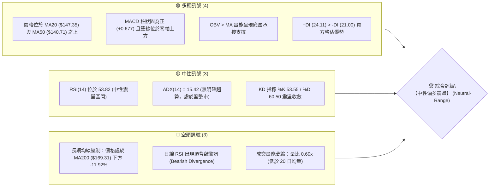
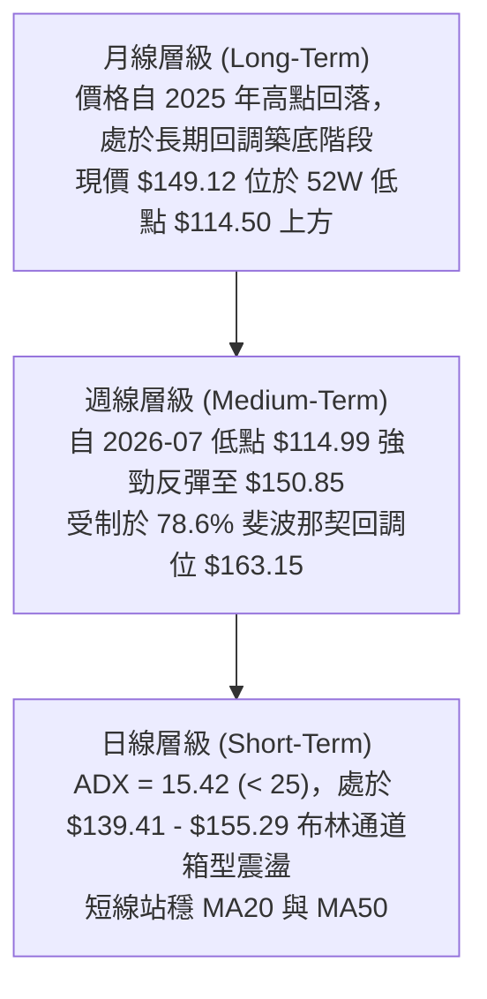
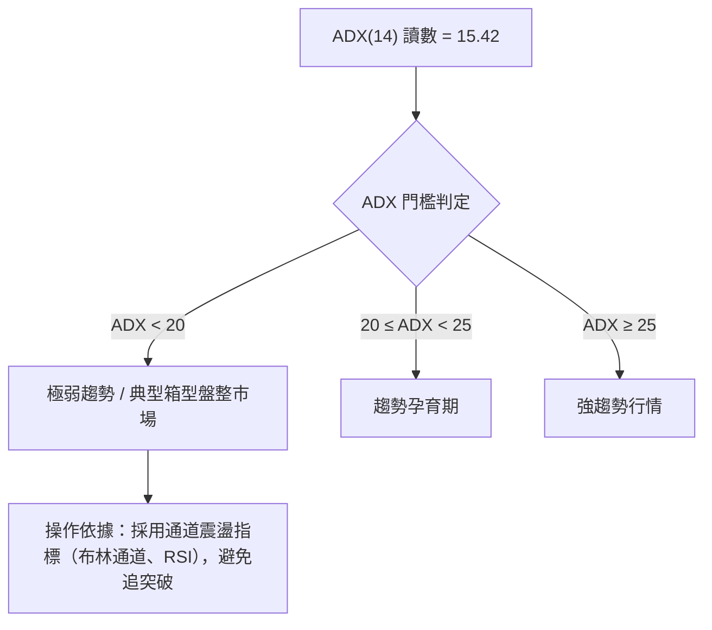
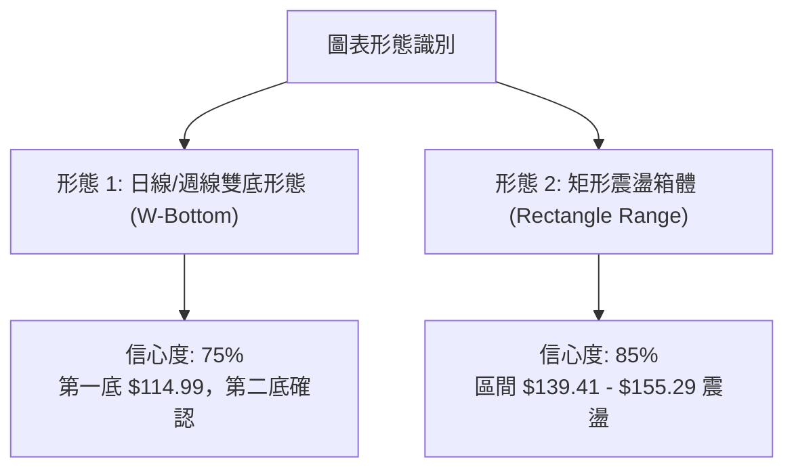
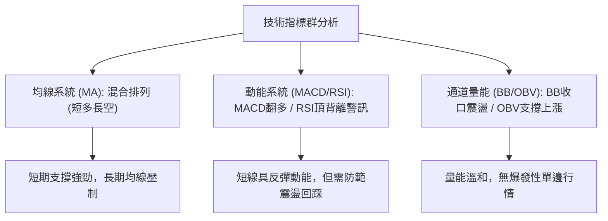
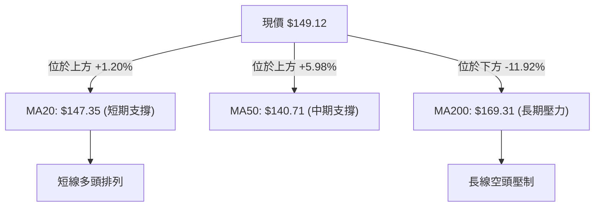
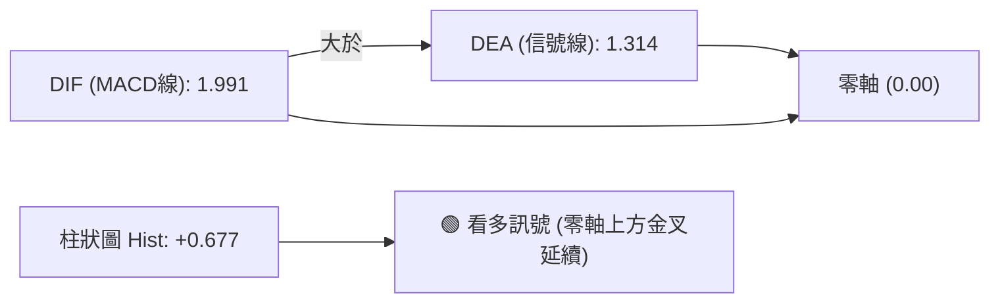
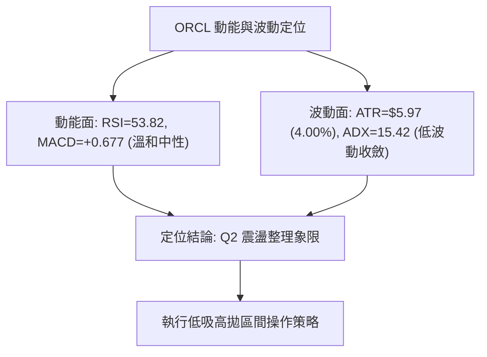
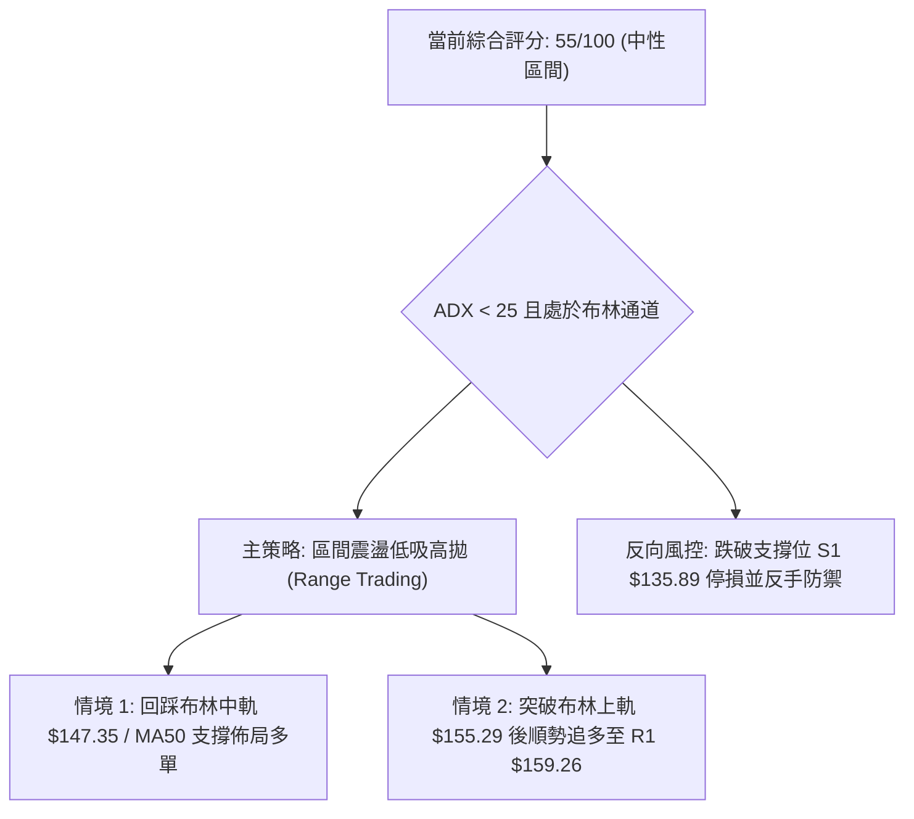
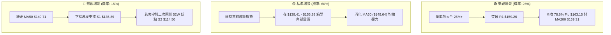

# ORCL 技術分析報告

> **報告日期**：2026-09-01 ｜ **語言**：繁體中文 ｜ **數據來源**：Yahoo Finance ｜ **當前價格**：$149.12

---

## 目錄

| 章節 | 內容 |
|------|------|
| [1. 技術面概覽](#1-技術面概覽) | 訊號儀表板、核心指標、評分卡 |
| [2. 趨勢分析](#2-趨勢分析) | 多時框趨勢、長中短期走勢、ADX解讀 |
| [3. 圖表形態分析](#3-圖表形態分析) | 形態識別、信心度評估、K線組合 |
| [4. 支撐與阻力](#4-支撐與阻力) | 關鍵價位分佈、斐波那契回調 |
| [5. 技術指標深度解讀](#5-技術指標深度解讀) | MA/RSI/MACD/布林/量價配合 |
| [6. 動能與波動率](#6-動能與波動率) | 動能四象限、ATR、Beta相關性 |
| [7. 多時框架總結](#7-多時框架總結) | 時框架矩陣、多時框收斂結論 |
| [8. 交易策略建議](#8-交易策略建議) | 策略路由、情境階梯、交易規劃 |
| [9. 風險提示與監控](#9-風險提示與監控) | 監控清單、情境推演、風控管理 |
| [10. 報告總結](#-報告總結) | 核心總結儀表板 |

---

## 1. 技術面概覽

### 🎯 技術訊號儀表板



---

### 📊 核心指標速覽表

| 指標類別 | 指標名稱 | 當前數值 | 訊號 | 解讀 |
|:---|:---|:---|:---:|:---|
| **價格** | 當前收盤價 | **$149.12** | 🟡 | 位於52週區間 15.2%（低檔區震盪築底） |
| **短期均線** | MA20 (月線) | **$147.35** | 🟢 | 現價高於 MA20 約 +1.20%，短線回踩獲支撐 |
| **中期均線** | MA50 (季線) | **$140.71** | 🟢 | 現價高於 MA50 約 +5.98%，中期底部抬升 |
| **長期均線** | MA200 (年線)| **$169.31** | 🔴 | 現價低於 MA200 約 -11.92%，長期仍處空頭排列修復期 |
| **擺動動能** | RSI(14) | **53.82** | 🟡 | 處於 30–70 常態區間，惟需注意頂背離警訊 |
| **趨勢動能** | MACD(12,26,9)| **+0.677 (柱)**| 🟢 | DIF (1.991) > DEA (1.314)，多頭動能延續中 |
| **通道位置** | Bollinger %B | **0.61** | 🟢 | 位於布林中軌（$147.35）與上軌（$155.29）之間偏強區 |
| **趨勢強度** | ADX(14) | **15.42** | 🟡 | 數值低於 25，確認市場為典型無趨勢箱型盤整行情 |
| **市場量能** | 20日成交量比 | **0.69x** | 🔴 | 最新量 16.08M 低於均量 23.43M，量能未放大 |
| **波動幅度** | ATR(14) | **$5.97** | 🟡 | 日波動率為 4.00%，震盪空間適中 |

---

### 🏆 技術評分卡

```
╔══════════════════════════════════════════════════════════════════╗
║              技術評分卡 — ORCL (2026-09-01)                      ║
╠══════════════════════════════════════════════════════════════════╣
║ 趨勢強度 (Trend)       ████░░░░░░░░░░░░░░░░  25/100  🔴 弱趨勢/盤整║
║ 動能指標 (Momentum)    ████████████░░░░░░░░  60/100  🟢 MACD偏多   ║
║ 支撐穩定度 (Support)   ██████████████░░░░░░  70/100  🟢 S1結構穩固 ║
║ 成交量配合 (Volume)    ████████░░░░░░░░░░░░  40/100  🔴 量縮整理   ║
║ 形態完整度 (Pattern)   ████████████░░░░░░░░  60/100  🟡 區間築底   ║
║ 均線排列 (MA System)   ██████████░░░░░░░░░░  50/100  🟡 混合排列   ║
╠══════════════════════════════════════════════════════════════════╣
║ 綜合技術評分           ███████████░░░░░░░░░  55/100  🟡 區間震盪   ║
╚══════════════════════════════════════════════════════════════════╝
```

---

## 2. 趨勢分析

### 🌐 多時框趨勢分析



---

### 📈 長期趨勢 — 12個月走勢圖

```
ORCL 月線收盤走勢圖（過去12個月：2025-09 至 2026-08）
價格 ($)
$280 ┤ ● (2025-09: $278.07 歷史高位區)
$260 ┤   ● (2025-10: $260.10)
$240 ┤
$220 ┤                     ● (2026-05: $225.00 反彈高點)
$200 ┤     ● (2025-11: $200.02)
$180 ┤       ● (2025-12: $193.05)
$160 ┤         ● (2026-01: $163.44)    ● (2026-04: $160.83)
$140 ┤           ● ($144.39) ● ($146.09)   ● (2026-06: $146.04) ● (2026-08: $149.12) ← 現價
$120 ┤                                                 ● (2026-07: $129.87 低點)
     └─┬─────┬─────┬─────┬─────┬─────┬─────┬─────┬─────┬─────┬─────┬─────┬──
      09/25 10/25 11/25 12/25 01/26 02/26 03/26 04/26 05/26 06/26 07/26 08/26
```

#### 走勢特徵分析表格

| 階段區間 | 起止月份 | 價格區間 | 漲跌幅 | 核心技術特徵 |
|:---|:---|:---|:---:|:---|
| **第一階段：高檔崩落** | 2025-09 → 2026-02 | $278.07 → $144.39 | **-48.07%** | 大幅跳水，跌破各級中長期均線，空頭完全控盤 |
| **第二階段：春季反彈** | 2026-02 → 2026-05 | $144.39 → $225.00 | **+55.83%** | 築底後快速軋空修復，觸及波段高點 $225.00 |
| **第三階段：二次探底** | 2026-05 → 2026-07 | $225.00 → $129.87 | **-42.28%** | 獲利了結賣壓湧現，7月下探 52W 低位區 $114.50 附近 |
| **第四階段：築底震盪** | 2026-07 → 2026-08 | $129.87 → $149.12 | **+14.82%** | 量縮打底，收復 MA20 與 MA50，進入橫盤收斂 |

---

### 📊 中期趨勢（週線分析）

```
週線級別價格結構示意：
$164.24 ────────────────────────────────────────── 阻力位 R2
$159.26 ────────────────────────────────────────── 阻力位 R1
$155.29 ------------------------------------------ 布林通道上軌
$149.12 ══════════════════════════════════════════ ◄ 當前現價 ($149.12)
$147.35 ------------------------------------------ MA20 / 布林中軌
$140.71 ------------------------------------------ MA50 支撐
$135.89 ══════════════════════════════════════════ 支撐位 S1
$114.50 ══════════════════════════════════════════ 強支撐 S2 (52W Low)
```

從近 20 週數據觀察，ORCL 於 2026-07-26 當週打出最低收盤價 $114.99（極度貼近 52 週最低點 $114.50），隨後連續 3 週快速反彈至 $150.52，MACD 柱狀圖由 -6.743 翻正至 +4.827，帶動中期築底結構成立。近 3 週價格於 $146.47 至 $150.85 之間呈現橫盤整理。

---

### ⚡ 趨勢強度評估（ADX 解讀）



| 指標 | 數值 | 狀態 | 解讀 |
|:---|:---:|:---:|:---|
| **ADX(14)** | **15.42** | 盤整 | 遠低於 25 臨界線，趨勢動能極為渙散，屬低波動收斂盤局 |
| **+DI** | **24.11** | 領先 | 多方力量佔優 |
| **-DI** | **21.00** | 滯後 | 空方力量收斂，多空力道差距微小（差值 +3.11） |
| **綜合判定** | **無趨勢** | 🟡 | 嚴禁採取單邊趨勢突破追價策略，應採用區間操作邏輯 |

---

## 3. 圖表形態分析

### 🔍 形態識別系統



#### 形態識別與信心度評估表

| 識別形態 | 信心度 (%) | 判斷依據（數據引用） | 形態完成度 | 形態目標價與推算式 |
|:---|:---:|:---|:---:|:---|
| **雙重底 (W-Bottom)** | **75%** | 2026-07-26 低點 $114.99 成功守住 52W 低點 $114.50，隨後突破前波短頸線 $140.64 | **80%** | 頸線 $140.64 + 高度 ($140.64 - $114.50 = $26.14) = **$166.78**（接近 R2/R3） |
| **箱型收斂通道** | **85%** | ADX 15.42，價格連續數週運行於布林下軌 $139.41 與上軌 $155.29 之間 | **90%** | 箱體上邊界 **$155.29**（突破後指向 R1 **$159.26**） |
| **頭肩底形態** | **35%** | 訊號不足，右肩結構尚未形成對稱量能，僅做指標型解讀 | **30%** | 數據不足，不予推算延伸目標價 |

---

### 🕯️ 重要K線形態分析

| 月份 / 週別 | 收盤價 | K線形態特徵 | 技術解讀 | 訊號 |
|:---|:---:|:---|:---|:---:|
| **2026-05-31** | $225.00 | 長陽突破後留長上影線 | 波段多頭竭盡，短線見頂，隨後展開崩跌 | 🔴 |
| **2026-07-26** | $114.99 | 錘頭探底線 (Hammer) | 於 52 週最低點 $114.50 前止跌，空方動能耗盡 | 🟢 |
| **2026-08-09** | $147.02 | 實體大陽線收復 MA50 | 底部長紅確認反彈，週 MACD 柱狀圖由負翻正 | 🟢 |
| **2026-08-30** | $150.85 | 窄幅十字星 (Doji) | 遭遇布林上軌附近阻力，多空於 $150 關卡陷入拉鋸 | 🟡 |
| **2026-09-06** | $149.12 | 孕線整理 (Harami) | 回踩日線 MA20 尋求支撐，等待方向抉擇 | 🟡 |

---

### 📉 ASCII 走勢形態示意圖

```
                 雙底反彈與箱體震盪形態示意圖
[$166.78]--------------------------------------- 雙底形態理論目標價
                                                
[$159.26]--------------------------------------- 阻力位 R1
                   ┌─────┐
[$155.29]----------│ 上軌 │----------------------- 箱頂阻力
                   │     │      ▲ 現價 $149.12
[$147.35]──────────┼─────┼─────●─────────────── 頸線 / MA20
                   │     │    / \
[$139.41]----------│ 下軌 │---/---\------------- 箱底支撐
                   └─────┘  /     \
[$114.50]──────────────────●       ●──────────── 雙底支撐 (2026-07 低點)
                         左底     右底
```

---

## 4. 支撐與阻力

### 🗺️ 關鍵價位分布圖

```
ORCL 價位結構分佈圖
════════════════════════════════════════════════════════════════════
$341.82 ║██████████████████████████████║ 52W 歷史最高點 (0.0% Fib)
$288.18 ║████████████████████          ║ 23.6% 斐波那契回調位
$254.99 ║████████████████████          ║ 38.2% 斐波那契回調位
$228.16 ║████████████████████          ║ 50.0% 斐波那契基準中軸
$201.34 ║████████████████████          ║ 61.8% 斐波那契強阻力位
$170.57 ║████████████████████████      ║ 強阻力位 R3 (近 MA200 $169.31)
$164.24 ║████████████████              ║ 阻力位 R2 (波段聚集高點)
$163.15 ║████████████████████          ║ 78.6% 斐波那契回調位
$159.26 ║████████████                  ║ 關鍵短線阻力位 R1
$155.29 ║░░░░░░░░░░░░░░░░░░░░░░░░░░░░░░║ 布林通道上軌
$149.12 ╠══════════════════════════════╣ ◄ 現價 ($149.12)
$147.35 ║──────────────────────────────║ 短期支撐 MA20 / 布林中軌
$140.71 ║──────────────────────────────║ 中期支撐 MA50
$139.41 ║░░░░░░░░░░░░░░░░░░░░░░░░░░░░░░║ 布林通道下軌
$135.89 ║▓▓▓▓▓▓▓▓▓▓▓▓▓▓▓▓              ║ 近期波段支撐位 S1
$114.50 ║██████████████████████████████║ 52W 最低點強支撐 S2 (100.0% Fib)
════════════════════════════════════════════════════════════════════
```

---

### 🚧 阻力位分析表

| 阻力級別 | 精確價位 | 形成原因與數據支撐 | 突破難度 | 技術重要性 |
|:---|:---:|:---|:---:|:---:|
| **R1** | **$159.26** | 近一年波段次高點聚集區，高於現價 +6.80% | 🟡 中等 | 短線多頭防線，突破此處宣告擺脫箱體壓制 |
| **R2** | **$164.24** | 密集成交籌碼峰，且與 78.6% Fib ($163.15) 高度重合 | 🔴 偏高 | 中期反彈關鍵阻力區 |
| **R3** | **$170.57** | 年線 MA200 ($169.31) 所在之強阻力帶，高於現價 +14.38% | 🔴 極高 | 多空分水嶺，若未放量無法有效收復 |

---

### 🛡️ 支撐位分析表

| 支撐級別 | 精確價位 | 形成原因與數據支撐 | 守住機率 | 技術重要性 |
|:---|:---:|:---|:---:|:---:|
| **S1** | **$135.89** | 近一年波段回調低點聚類，位於現價下方 -8.87% | **75%** | 箱體回踩核心支撐區，跌破將引發停損賣壓 |
| **S2** | **$114.50** | 52週歷史最低點 (52W Low)，雙底築底原點 | **90%** | 長期終極防線，跌破則宣告長期下行通道開啟 |

---

### 📐 斐波那契回調位分析

依據 52 週波動區間（高點 **$341.82** 至 低點 **$114.50**，全幅 $227.32）計算：

| 斐波那契回調層級 | 精確價位 | 與現價之相對位置 | 結構意義解讀 |
|:---|:---:|:---:|:---|
| **0.0% (52W High)** | **$341.82** | +129.22% | 歷史極值高點 |
| **23.6%** | **$288.18** | +93.25% | 強勢回調目標位 |
| **38.2%** | **$254.99** | +71.00% | 多頭防守關鍵位 |
| **50.0%** | **$228.16** | +53.00% | 多空平衡中軸線（2026-05 反彈頂點 $225.00 處） |
| **61.8%** | **$201.34** | +35.02% | 黃金分割重要轉折阻力位 |
| **78.6%** | **$163.15** | +9.41% | 深度回調阻力線（緊鄰 R2 **$164.24**） |
| **現價位置** | **$149.12** | **基準點** | **目前運行於 78.6% ($163.15) 與 100.0% ($114.50) 之間** |
| **100.0% (52W Low)**| **$114.50** | -23.22% | 築底基準原點 |

**解讀**：現價落於深次回調區間（78.6% ~ 100.0%），顯示 ORCL 目前處於超跌後的低檔修復階段。上檔首要強阻力位於 78.6% 回調位 **$163.15**（與 R2 **$164.24** 聚合成強壓力帶）。

---

## 5. 技術指標深度解讀

### 🎛️ 指標訊號總覽



---

### 📈 移動平均線排列分析



#### 移動平均線數據矩陣

| 均線名稱 | 數值 | 現價差距 | 排列形態 | 解讀 |
|:---|:---:|:---:|:---:|:---|
| **MA 5** | $149.11 | +0.01% | 走平 🟢 | 短線黏著現價，多空暫時平衡 |
| **MA 10** | $146.31 | +1.92% | 上彎 🟢 | 提供極短線動能支撐 |
| **MA 20** | $147.35 | +1.20% | 上彎 🟢 | 站穩月線，短線偏多 |
| **MA 50** | $140.71 | +5.98% | 上彎 🟢 | 季線轉為強勁下檔支撐 |
| **MA 60** | $149.64 | -0.35% | 走平 🟡 | 位於現價上方微幅壓制 |
| **MA 120** | $161.56 | -7.70% | 下彎 🔴 | 半年線持續下壓 |
| **MA 200** | $169.31 | -11.92% | 下彎 🔴 | 長期空頭反壓線 |
| **MA 240** | $187.66 | -20.54% | 下彎 🔴 | 遠端壓力帶 |

---

### 📉 RSI(14) 分析與背離判定

```
RSI(14) 當前水平：53.82
0 ──────────── 30 ────────────────────── 53.82 ────────────── 70 ──────────── 100
[   超賣區     ] [        中性健康區       ▲      ] [    超買區    ]
進度條：██████████████░░░░░░░░░░░░  53.82%
```

- **背離分析判斷**：日線層級偵測到 ⚠️ **頂背離 (Bearish Divergence)**。價格於 8 月中旬自 $147.02 推升至 $150.85 創波段新高，然而日線 RSI 卻由 74.6 迅速回落至 49.8 ~ 53.82，形成「價格創新高、指標動能下滑」之頂背離結構。
- **結論**：背離訊號警告短線不宜盲目追高，多頭推升力道出現減速跡象，短線回踩 MA20 ($147.35) 或布林中軌進行消化整理的機率極高。

---

### 📊 MACD(12,26,9) 訊號解讀



- **MACD 數值解讀**：DIF (1.991) 位於 DEA (1.314) 之上，MACD 柱狀圖為 **+0.677**，呈現多頭動能延續格局。
- **背離判斷**：週線級別 MACD 柱狀圖自 7 月底的 -6.743 翻正至 8 月中旬的 +4.827，目前雖收斂至 +0.677，但雙線已成功穿越零軸，屬於底層健康修復，未出現大級別 MACD 頂背離。

---

### 📦 布林通道 (Bollinger Bands) 分析

```
布林通道帶寬分佈（參數：20, 2）：
$155.29 ────────────────────────────────────────── 上軌 (Upper Band)
            ▓▓▓▓▓▓▓▓▓▓▓▓▓▓▓▓▓▓▓▓▓
$149.12 ══════════════════════════════════════════ ◄ 現價 (%B = 0.61)
            ░░░░░░░░░░░░░░░░░░░░░
$147.35 ────────────────────────────────────────── 中軌 (MA20)
            ░░░░░░░░░░░░░░░░░░░░░
$139.41 ────────────────────────────────────────── 下軌 (Lower Band)
```

- **通道寬度與狀態**：布林帶寬 ($155.29 - $139.41 = $15.88) 呈現收縮狀態，顯示波動度下降。
- **%B 指標位置**：當前 %B 為 **0.61**，位於中軌 ($147.35) 與上軌 ($155.29) 之間，顯示短線結構偏向強勢整理，中軌 $147.35 提供短線動態支撐。

---

### 💹 成交量分析（量價配合度）

```
成交量對比：
最新成交量:  16.08M  ██████████░░░░░░░░░░ (量比: 0.69x)
20日均量:    23.43M  ██████████████░░░░░░
50日均量:    32.38M  ████████████████████
```

- **量能評估**：當前量能萎縮至 16.08M，量比僅 0.69x，低於 20 日及 50 日均量。
- **OBV 能量潮解讀**：OBV 趨勢維持於均線上方（`OBV > MA`），顯示在 7 月打底回升過程中，主力籌碼屬於「惜售且持續吸籌」狀態，量縮上漲代表浮額清理乾淨，但若要攻克上軌 $155.29 與 R1 $159.26，必須補量至 23M 以上。

---

## 6. 動能與波動率

### ⚡ 動能評估四象限

| 象限 | 動能強度 | 波動率水準 | 當前歸屬狀態 | 策略指導含義 |
|:---|:---:|:---:|:---:|:---|
| **Q1 (最佳爆發)** | 強動能 | 低波動 | — | 最佳單邊突破進場點 |
| **Q2 (震盪整理)** | **弱/中動能** | **低/中波動** | **✓ ORCL 處於此區間** | **採用布林通道區間操作，嚴控停損** |
| **Q3 (高危博弈)** | 強動能 | 高波動 | — | 趨勢末端洗盤，高風險高收益 |
| **Q4 (避免進場)** | 弱動能 | 高波動 | — | 無序暴跌洗盤，嚴禁介入 |



---

### 📊 ATR 波動率分析

- **ATR(14) 數值**：**$5.97**（佔當前股價之 **4.00%**）。
- **止損距離建議**：
  - 短線交易（1.5 倍 ATR）：止損緩衝空間應設定為 $5.97 \times 1.5 = \mathbf{\$8.96}$。
  - 波段交易（2.0 倍 ATR）：止損緩衝空間應設定為 $5.97 \times 2.0 = \mathbf{\$11.94}$。
- **單日波動預期**：在無重大消息干擾下，ORCL 單日正常波動區間為 $\pm \$5.97$。

---

### 📐 Beta 與市場相關性

- **Beta 係數**：**1.718**（高 Beta 屬性）。
- **市場特徵解讀**：ORCL 相對標普500指數具有顯著的高彈性特徵（大盤波動 1%，ORCL 理論波動 1.72%）。在目前 ADX 處於 15.42 的盤整期中，高 Beta 意味著一旦大盤產生單邊波動，ORCL 容易出現劇烈的突破或破位，交易者必須設定嚴格的價格觸發條件。

---

## 7. 多時框架總結

### 📋 時框架評分表

| 時框架 | 趨勢方向 | 動能狀態 | 均線排列 | 形態結構 | 綜合評分 | 操作建議 |
|:---|:---:|:---:|:---:|:---:|:---:|:---|
| **月線 (長期)** | 🔴 偏空 | 🟡 中性築底 | 空頭排列 (低於 MA200) | 自高檔回調 52W 低點反彈 | **42/100** | 長期投資者等待站穩年線 |
| **週線 (中期)** | 🟢 偏多 | 🟢 MACD轉正 | 穿越 MA20，挑戰 MA50 | 雙底反彈結構 ($114.99) | **65/100** | 波段回踩支撐佈局多單 |
| **日線 (短期)** | 🟡 震盪 | 🟡 RSI頂背離 | 站上 MA20/MA50，受阻 MA60 | 布林通道收口箱型震盪 | **55/100** | 通道下軌低吸，上軌高拋 |

---

### 🔲 綜合訊號矩陣

```
時框架訊號收斂矩陣：
┌──────────────────┬──────────────┬──────────────┬──────────────┐
│ 分析維度         │ 短期 (日線)  │ 中期 (週線)  │ 長期 (月線)  │
├──────────────────┼──────────────┼──────────────┼──────────────┤
│ 趨勢方向         │ 🟡 橫向盤整  │ 🟢 築底反彈  │ 🔴 空頭修復  │
│ 均線系統         │ 🟢 短期偏多  │ 🟡 混合糾結  │ 🔴 壓制在下  │
│ 擺動指標 (RSI)   │ 🔴 頂背離    │ 🟢 站上 50   │ 🟡 中性區間  │
│ 趨勢指標 (MACD)  │ 🟢 紅柱延續  │ 🟢 金叉翻正  │ 🔴 零軸下方  │
│ 量能配合         │ 🔴 量縮整理  │ 🟢 OBV支撐   │ 🟡 常態換手  │
└──────────────────┴──────────────┴──────────────┴──────────────┘
```

---

### ⚖️ 多時框收斂結論

> **依據「多時框收斂規則」**：
> 1. 當前趨勢強度指標 **ADX(14) = 15.42 (< 25)**，明確確認當前市場處於**【盤整行情】**，而非單邊趨勢行情。
> 2. 依照收斂規則：在盤整行情中，以**日線布林通道上下軌（$139.41 至 $155.29）**為主要交易區間。
> 3. **唯一方向性結論**：**【區間震盪、中性偏多低吸】**。日線的 RSI 短期頂背離提示現價 $149.12 不宜追高，應耐心等待價格回踩布林中軌 $147.35 或 MA50 支撐區進行逢低佈局。

---

## 8. 交易策略建議

### 🗺️ 策略決策流程圖



---

### 🧭 策略路由

**當前主策略方向 = 【區間操作 / 回踩低吸】（依綜合評分 55/100 判定）**

由於 ADX 為 15.42，市場處於無趨勢的箱型整理，最佳策略並非突破追買，而是依據布林通道與關鍵支撐阻力進行**「支撐位分批低吸、阻力位分批獲利」**的區間操作。

---

### 🎯 價格情境階梯 (Price Scenarios)

| 觸發條件 | 下一目標價位 | 後續延伸價位 | 情境技術含義 |
|:---|:---:|:---:|:---|
| **向上突破 R1 $159.26** | **R2 $164.24** | **R3 $170.57** (年線) | 短線強勢破箱，挑戰 78.6% Fib 與 MA200 重壓區 |
| **突破布林上軌 $155.29** | **R1 $159.26** | **R2 $164.24** | 短線擺脫橫盤，展開波段推升 |
| **維持於現價 $149.12 震盪** | **$155.29** (上軌) | **$139.41** (下軌) | 延續布林通道內部箱型震盪整理 |
| **跌破 MA50 $140.71** | **S1 $135.89** | **$129.87** (7月收盤) | 中期反彈架構受損，回測下軌支撐 |
| **跌破關鍵支撐 S1 $135.89** | **S2 $114.50** (52W Low) | 無（探底破位） | 雙底反彈失敗，重新測試 52 週最低點防線 |

---

### 📊 情境機率分佈

```
情境機率分佈：
區間震盪整理 (45%)   █████████░░░░░░░░░░░
震盪向上反彈 (40%)   ████████░░░░░░░░░░░░
回落破位再探底 (15%) ███░░░░░░░░░░░░░░░░░
```

| 市場情境 | 發生機率 | 主要技術依據 |
|:---|:---:|:---|
| **情境 A：區間震盪整理** | **45%** | ADX 僅 15.42，成交量萎縮 (0.69x)，多空力道均衡，維持在 $139.41–$155.29 箱型運作 |
| **情境 B：震盪向上反彈** | **40%** | MACD 柱狀圖翻正 (+0.677)，OBV 支撐上漲，價格穩居 MA20 及 MA50 之上 |
| **情境 C：回落下跌探底** | **15%** | RSI 出現頂背離，MA200 ($169.31) 長期下壓，若跌破 S1 $135.89 則引發停損 |

---

### 🟢 主策略詳情

| 策略要素 | 策略 A：布林中軌低吸策略（保守型） | 策略 B：突破追隨策略（積極型） |
|:---|:---|:---|
| **適用時機** | 短線回踩消化 RSI 頂背離 | 帶量突破布林上軌與箱頂 |
| **進場條件** | 價格回踩 MA20 $147.35 且收出下影線 | 價格實體突破布林上軌 $155.29 且成交量 > 23M |
| **進場價格** | **$147.35** | **$155.30** |
| **目標價 T1** | **$155.29** (布林通道上軌，獲利 +5.39%) | **$159.26** (阻力位 R1，獲利 +2.55%) |
| **目標價 T2** | **$159.26** (阻力位 R1，獲利 +8.08%) | **$164.24** (阻力位 R2 / 78.6% Fib，獲利 +5.76%) |
| **止損價格** | **$140.71** (跌破 MA50 季線支撐) | **$147.35** (跌回 MA20 月線下方) |
| **風險報酬比 (R/R)**| **1 : 1.80**（以 T2 計算） | **1 : 1.13** (T1) / **1 : 1.77** (T2) |
| **預估勝率** | **65%** | **55%** |
| **建議倉位** | **15% - 20%** 資金規模 | **10% - 15%** 資金規模 |

---

### 🔴 反向風險觸發點（對沖提示）

若出現以下訊號，宣告多頭反彈失敗，應立即將多頭部位平倉，甚至考慮建立空頭防禦部位：
1. **關鍵價位破位**：價格跌破 **S1 $135.89**（波段支撐位）。
2. **指標破位確認**：MACD 柱狀圖由正翻負，且 DIF 跌破零軸。
3. **量能異動**：出現單日成交量突破 30M 之放量長黑K線，跌破布林下軌 **$139.41**。

---

### ⭐ 整體訊號強度評星

```
╔══════════════════════════════════════════════════════════════════╗
║ 做多訊號強度：  ★★★☆☆  (3.0/5 星) — 築底成型，但受制於盤整市    ║
║ 做空訊號強度：  ★★☆☆☆  (2.0/5 星) — 均線提供支撐，空方動能減弱  ║
║ 整體訊號可信度：★★★☆☆  (3.5/5 星) — 數據收斂於箱型震盪        ║
╚══════════════════════════════════════════════════════════════════╝
```

---

## 9. 風險提示與監控

### ✅ 關鍵監控指標 Checklist

```
╔══════════════════════════════════════════════════════════════════╗
║              ORCL 交易風控與監控清單                             ║
╠══════════════════════════════════════════════════════════════════╣
║ [ ] 監控 $155.29 布林上軌突破力度，觀察成交量是否放大至 23M 以上 ║
║ [ ] 監控 $147.35 (MA20) 與 $140.71 (MA50) 下檔動態支撐有效性     ║
║ [ ] 追蹤日線 RSI 是否跌破 50 中軸（若跌破則頂背離修正加劇）      ║
║ [ ] 監控 MACD 柱狀圖是否維持在正值區間（目前 +0.677）            ║
║ [ ] 追蹤 ADX 數值是否自 15.42 向上突破 20，確認新趨勢啟動        ║
║ [ ] 嚴格執行 S1 $135.89 硬停損防線，杜絕扛單風險                ║
╚══════════════════════════════════════════════════════════════════╝
```

---

### ⚠️ 風險場景分析



---

### 🛡️ 風險管理重要提醒

1. **Beta 係數波動放大風險**：ORCL Beta 高達 **1.718**，若科技板塊或美股大盤出現劇烈回調，ORCL 震盪幅度將被顯著放大，單筆交易最大虧損額度應嚴格控制在總資金的 **1.0% - 1.5%** 以內。
2. **盤整市嚴禁追高**：在 ADX = 15.42 的市況下，向上「假突破」機率極高。不可在價格接近布林上軌 $155.29 或 R1 $159.26 處市價追買。
3. **長期均線壓制現實**：年線 MA200 目前位於 **$169.31** 且持續下彎，在未有效帶量站穩該位置前，所有上漲均定性為「中級反彈」，而非新一輪歷史大牛市。

---

## 📋 報告總結

```
╔══════════════════════════════════════════════════════════════════╗
║                   ORCL 技術分析報告總結                          ║
╠══════════════════════════════════════════════════════════════════╣
║ 報告日期：2026-09-01                                             ║
║ 當前價格：$149.12 (處於52週區間 15.2% 之低檔打底區)               ║
║ 分析評級：⚖️【中性偏多震盪】 (Neutral to Range-Bound Bullish)    ║
║                                                                  ║
║ 關鍵結論：                                                       ║
║ ├─ 長期趨勢：🔴 處於 MA200 ($169.31) 下方之修復期                ║
║ ├─ 中期趨勢：🟢 7月探底 $114.99 後雙底反彈成立，週 MACD 轉正     ║
║ ├─ 短期趨勢：🟡 ADX 15.42，受制於 $139.41–$155.29 布林箱體       ║
║ ├─ 關鍵支撐：S1 $135.89 ｜ S2 $114.50 (52W Low)                 ║
║ ├─ 關鍵阻力：R1 $159.26 ｜ R2 $164.24 ｜ R3 $170.57             ║
║ └─ 分析師共識：買入 (42位分析師目標均價 $244.12)                 ║
║                                                                  ║
║ 最優交易機會：                                                   ║
║ 1. 🥇 最佳機會：回踩 MA20 $147.35 逢低佈局，目標 $155.29 / $159.26║
║ 2. 🥈 次選機會：帶量突破 $155.30 追隨進場，目標 $159.26 / $164.24 ║
║ 3. 🥉 保守選擇：空倉觀望，等待突破 R1 $159.26 或回踩 S1 $135.89  ║
╚══════════════════════════════════════════════════════════════════╝
```

---

> ⚠️ **免責聲明**：本報告為基於歷史技術指標與市場數據之量化客觀分析，所有內容僅供學術研究與投資參考，不構成任何要約、招攬或具體投資建議。市場有風險，交易需嚴格執行資金管理與停損紀律。

---
*報告生成時間：2026-09-01 ｜ 數據來源：Yahoo Finance ｜ 分析框架：多時框架量化技術分析*