# ORCL 技術分析報告

> **報告日期**：2026-09-02 ｜ **語言**：繁體中文 ｜ **數據來源**：Yahoo Finance ｜ **當前價格**：$141.32

---

## 目錄

| 章節 | 內容 |
|------|------|
| [1. 技術面概覽](#1-技術面概覽) | 訊號儀表板、核心指標、評分卡 |
| [2. 趨勢分析](#2-趨勢分析) | 多時框趨勢、長中短期走勢 |
| [3. 圖表形態分析](#3-圖表形態分析) | 形態識別、K線組合、目標價 |
| [4. 支撐與阻力](#4-支撐與阻力) | 關鍵價位、斐波那契回調 |
| [5. 技術指標深度解讀](#5-技術指標深度解讀) | MA/RSI/MACD/布林/成交量 |
| [6. 動能與波動率](#6-動能與波動率) | 動能評估、ATR、Beta |
| [7. 多時框架總結](#7-多時框架總結) | 時框架評分矩陣 |
| [8. 交易策略建議](#8-交易策略建議) | 多空策略、風險報酬比 |
| [9. 風險提示與監控](#9-風險提示與監控) | 監控指標、風險場景 |

---

## 1. 技術面概覽

### 🎯 技術訊號儀表板

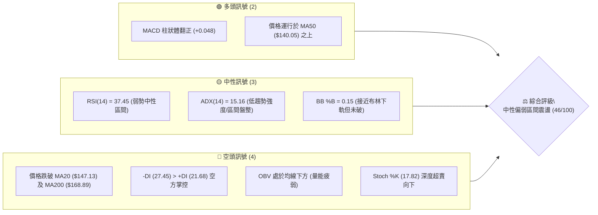

### 📊 核心指標速覽表

| 指標類別 | 指標名稱 | 當前數值 | 訊號 | 解讀 |
|----------|----------|----------|------|------|
| **價格** | 當前價格 | $141.32 | 🟡 | 位於52週區間底部11.8%處，短線承壓於均線束之下 |
| **均線** | MA20 | $147.13 | 🔴 | 價格在MA20下方 -3.95%，短期趨勢偏弱向下 |
| **均線** | MA50 | $140.05 | 🟢 | 價格在MA50上方 +0.91%，形成近端動態支撐 |
| **均線** | MA200 | $168.89 | 🔴 | 價格遠低於牛熊分界線 -16.32%，中長期偏空頭格局 |
| **動能** | RSI(14) | 37.45 | 🟡 | 弱勢中性，尚未進入極度超賣（<30），下行動能減緩 |
| **動能** | MACD | 1.374 (Hist: +0.048) | 🟢 | MACD位於Signal (1.326) 之上，柱體微幅翻正，多頭微弱反撲 |
| **趨勢** | ADX(14) | 15.16 (-DI: 27.45) | 🟡 | ADX < 25 表明無強烈方向性趨勢，處於低波動盤整 |
| **通道** | 布林帶 %B | 0.15 (下軌 $138.76) | 🟡 | 運行於下軌附近，具備超跌反彈契機但通道開口壓縮 |
| **成交量** | 20日量比 | 1.13x (25.38M) | 🟡 | 略高於月均量但OBV疲弱，顯示主動買盤承接力道有限 |
| **波動** | ATR(14) | $5.95 (4.21%) | 🟡 | 每日平均波動幅度約 $5.95，波動率處於中等水平 |

### 🏆 技術評分卡

```
╔══════════════════════════════════════════════════════════════════╗
║              技術評分卡 — ORCL (2026-09-02)                     ║
╠══════════════════════════════════════════════════════════════════╣
║ 趨勢強度 (ADX/DI)   ██████░░░░░░░░░░░░░░  32/100  🔴 空頭控盤弱趨勢 ║
║ 動能指標 (RSI/MACD) ██████████░░░░░░░░░░  52/100  🟡 MACD金叉vs弱RSI║
║ 支撐穩定度 (S1/MA50)████████████░░░░░░░░  60/100  🟢 MA50具初步承接力║
║ 成交量配合 (OBV/VOL)████████░░░░░░░░░░░░  40/100  🔴 量能未能有效放大 ║
║ 形態完整度 (區間)   ██████████░░░░░░░░░░  50/100  🟡 構築低檔箱體雛形 ║
║ 均線排列 (短中長)   ████████░░░░░░░░░░░░  42/100  🔴 空頭/混合排列  ║
╠══════════════════════════════════════════════════════════════════╣
║ 綜合評分            █████████░░░░░░░░░░░  46/100  ⚖️ 區間震盪偏弱   ║
╚══════════════════════════════════════════════════════════════════╝
```

---

## 2. 趨勢分析

### 🌐 多時框趨勢分析

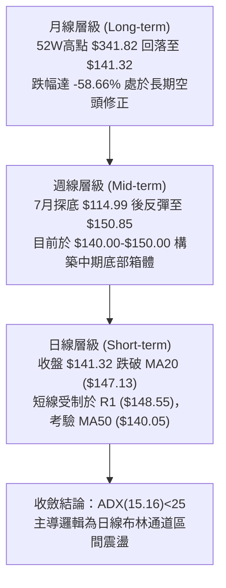

### 📈 長期趨勢 — 12個月走勢圖（Unicode）

```
ORCL 月線走勢圖（過去12個月歷史軌跡）
價格軸 ($)
$280 ┤                  ●(2025-09: 278.07)
$260 ┤                      ●(2025-10: 260.10)
$240 ┤
$220 ┤                                      ●(2026-05: 225.00)
$200 ┤                          ●(2025-11: 200.02)
$180 ┤                              ●(2025-12: 193.05)
$160 ┤                                  ●(2026-01: 163.44)  ●(2026-04: 160.83)
$140 ┤                                      ●(2026-03: 146.09)  ●(2026-08: 149.12)
$141 ┤━━━━━━━━━━━━━━━━━━━━━━━━━━━━━━━━━━━━━━━━━━━━━━━━━━━━━━━━━━━━━● (現價: 141.32)
$120 ┤                                                          ●(2026-07: 129.87)
$114 ┤                                                      ●(52W Low: 114.50)
     └─────────────────────────────────────────────────────────────────────────────►
       09/25 10/25 11/25 12/25 01/26 02/26 03/26 04/26 05/26 06/26 07/26 08/26 09/26
```

#### 走勢特徵分析表格

| 階段區間 | 時間跨度 | 價格起迄 | 漲跌幅 | 走勢特徵與結構 |
|----------|----------|----------|--------|----------------|
| **歷史高點回撤** | 2025-09 至 2026-02 | $278.07 → $144.39 | -48.07% | 單邊空頭主跌段，成交量持續萎縮，均線全面死叉 |
| **春季假突破** | 2026-03 至 2026-05 | $146.09 → $225.00 | +54.01% | 季報驅動之脈衝式反彈，觸及 50% 斐波那契位 ($228.16) 遇阻 |
| **二次探底殺跌** | 2026-05 至 2026-07 | $225.00 → $114.99 | -48.89% | 週線連續重挫，創下 52 週新低 $114.50，籌碼出現恐慌拋售 |
| **築底修復階段** | 2026-08 至 2026-09 | $114.99 → $141.32 | +22.90% | 週線 MACD 翻正，於 S1 ($135.89) 與 R1 ($148.55) 間橫向收斂 |

### 📊 中期趨勢（週線分析）

```
ORCL 中期週線支撐與壓力結構示意圖
$168.89 ═════════════════════════════════════════ MA200 牛熊分界（強阻力）
$163.15 ───────────────────────────────────────── 斐波那契 78.6% 回調位
$148.55 ----------------------------------------- 關鍵阻力 R1 (近期反彈高點聚類)
$147.13 ----------------------------------------- MA20 / 布林中軌
$141.32 ◄─── 當前價格 ($141.32) 區間震盪核心
$140.05 ----------------------------------------- MA50 週線下檔防線
$135.89 ----------------------------------------- 關鍵支撐 S1 (近期波段低點聚類)
$114.50 ═════════════════════════════════════════ 52週歷史低點 S2 (終極防線)
```

### ⚡ 趨勢強度評估（ADX 解讀）

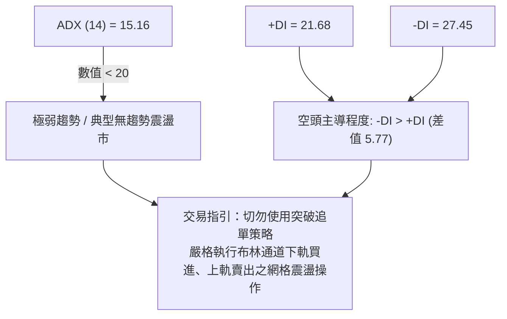

#### ADX 趨勢強度對照表

| 指標維度 | 數值 | 狀態判定 | 交易意涵 |
|----------|------|----------|----------|
| **ADX(14)** | **15.16** | 弱趨勢 / 盤整行情 (<25) | 趨勢跟隨指標失效，震盪指標（RSI、Stoch、布林帶）優先級提升 |
| **+DI (14)** | **21.68** | 多方動能偏弱 | 多頭上攻缺乏持續性買盤支持 |
| **-DI (14)** | **27.45** | 空方佔據相對優勢 | 賣壓雖未引發崩跌，但持續壓制價格反彈空間 |

---

## 3. 圖表形態分析

### 🔍 形態識別系統

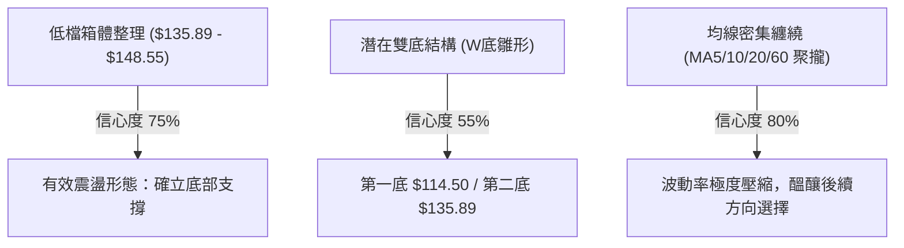

#### 形態信心度評估表

| 形態名稱 | 信心度 | 判斷依據（引用技術數據） | 完成度 | 目標價（附嚴格計算式） |
|----------|--------|--------------------------|--------|------------------------|
| **低檔矩形箱體** | **75%** | 價格受限於 R1 ($148.55) 與 S1 ($135.89) 之間連續震盪 | 85% | 向上突破目標 = 頸線 $148.55 + 箱高 ($148.55 - $135.89 = $12.66) = **$161.21** (接近 R2 $159.26) |
| **雙底形態 (W底)** | **55%** | 2026-07 低點 $114.50 與 2026-08 低點 S1 ($135.89) 形成墊高低點 | 60% | 需突破 R1 $148.55 確認；理論目標 = $148.55 + ($148.55 - $114.50) = **$182.60** |
| **布林帶收口壓縮** | **85%** | 帶寬壓縮至 $138.76 - $155.49，ATR 降至 $5.95 (4.21%) | 90% | 上軌阻力 = **$155.49** ；下軌支撐 = **$138.76** |

### 🕯️ 重要K線形態分析

| 日期區間 | 收盤價 | K線形態 | 形態解讀 | 訊號方向 |
|----------|--------|---------|----------|----------|
| **2026-07-26** | $114.99 | 長下影錘頭線 | 於 52W 低點 $114.50 處爆量 162.9M 止跌，確認賣盤出清 | 🟢 強烈看多 |
| **2026-08-09** | $147.02 | 實體大陽線 | 連續突破 MA20 與 MA50，週線 RSI 飆升至 71.8，多頭強勢反撲 | 🟢 看多 |
| **2026-08-16** | $150.52 | 高檔十字星/流星線 | 於 R1 ($148.55) 上方遭遇拋壓，留長上影線，動能衰竭 | 🔴 看空 |
| **2026-08-30** | $150.85 | 烏雲蓋頂雛形 | 二次衝擊 $150 未果，量能降至 93.9M，呈現量價背離 | 🔴 看空 |
| **2026-09-02** | $141.32 | 中陰線回調 | 跌破 MA20 ($147.13)，測試 MA50 ($140.05) 與布林下軌支撐 | 🟡 中性偏弱 |

### 📉 ASCII 走勢形態示意圖

```
ORCL 箱體震盪與潛在雙底形態架構
$159.26 ┬──────────────────────────────────────────── 形態延伸目標 / R2
        │
$148.55 ┼───────●─────────────●────────────────────── 箱頂頸線 (R1 阻力位)
        │      / \           / \
$141.32 ┼─────/───\─────────/───● (現價 $141.32 測試箱底)
        │    /     \       /     \
$135.89 ┼───●       \     /       \────────────────── 箱底支撐 (S1 支撐位)
        │  (底2)     \   /
$114.50 ┴─────────────●────────────────────────────── 52W最低點 (底1 / S2 終極支撐)
        └────────────────────────────────────────────► 時間軸 (2026-07 至 2026-09)
```

### 🎯 形態目標價計算

```
╔══════════════════════════════════════════════════════════════════╗
║                   形態量度目標價詳細計算                         ║
╠══════════════════════════════════════════════════════════════════╣
║ 1. 箱體突破等距測幅：                                           ║
║    箱頂頸線 = $148.55 ｜ 箱底支撐 = $135.89                     ║
║    箱體垂直高度 H = $148.55 - $135.89 = $12.66                  ║
║    向上量度目標 T1 = $148.55 + $12.66 = $161.21 (吻合 R2 $159.26)║
║    向下破位目標 T_down = $135.89 - $12.66 = $123.23 (逼近 S2)    ║
║                                                                  ║
║ 2. W底形態量度測幅 (需有效突破頸線 $148.55)：                    ║
║    形態低點 = $114.50 ｜ 頸線位置 = $148.55                     ║
║    形態高度 H_w = $148.55 - $114.50 = $34.05                    ║
║    終極量度目標 T2 = $148.55 + $34.05 = $182.60 (回補MA240缺口) ║
╚══════════════════════════════════════════════════════════════════╝
```

---

## 4. 支撐與阻力

### 🗺️ 關鍵價位分布圖（Unicode）

```
ORCL 價位結構分布圖
══════════════════════════════════════════════════════════════════
$164.24 ║████████████████████████████████████████║ 強阻力 R3 (波段高點聚類)
$159.26 ║██████████████████████████████          ║ 阻力 R2 (反彈延伸目標)
$155.49 ║▓▓▓▓▓▓▓▓▓▓▓▓▓▓▓▓▓▓▓▓▓▓                  ║ 布林通道上軌
$148.55 ║████████████████████████████████████████║ 關鍵阻力 R1 (箱頂頸線)
$147.13 ║▒▒▒▒▒▒▒▒▒▒▒▒▒▒▒▒▒▒▒▒▒▒▒▒                ║ MA20 / 布林中軌
$141.32 ╠════════════════════════════════════════╣ ◄── 當前收盤價 ($141.32)
$140.05 ║░░░░░░░░░░░░░░░░░░░░░░░░░░░░░░░░        ║ MA50 動態均線防線
$138.76 ║▓▓▓▓▓▓▓▓▓▓▓▓▓▓▓▓▓▓▓▓▓▓                  ║ 布林通道下軌
$135.89 ║████████████████████████████████        ║ 近期關鍵支撐 S1 (箱底)
$114.50 ║████████████████████████████████████████║ 歷史強支撐 S2 (52W最低點)
══════════════════════════════════════════════════════════════════
```

### 🚧 阻力位分析表

| 阻力級別 | 價位 | 形成原因 | 突破難度 | 重要性 |
|----------|------|----------|----------|--------|
| **R1** | **$148.55** | 近一年波段高點聚類、MA5 ($148.42) 及 MA60 ($148.45) 均線重合區 | ⭐⭐⭐☆ | **極高 (短線分水嶺)**：突破方能打開上行空間 |
| **R2** | **$159.26** | 波段密集套牢區、接近 MA120 ($161.39) 動態壓力 | ⭐⭐⭐⭐ | **高 (中期目標)**：面臨中長期解套拋壓 |
| **R3** | **$164.24** | 近一年波段高點聚類、接近斐波那契 78.6% 回調位 ($163.15) | ⭐⭐⭐⭐⭐ | **極高 (強阻力區)**：空頭核心防守陣地 |

### 🛡️ 支撐位分析表

| 支撐級別 | 價位 | 形成原因 | 守住機率 | 重要性 |
|----------|------|----------|----------|--------|
| **動態支撐** | **$140.05** | 日線 MA50 均線位置，多頭短期最後防線 | 65% | **中**：跌破將引發向布林下軌靠攏 |
| **S1** | **$135.89** | 近一年波段低點聚類、近期回調低點重合區 | 75% | **極高 (短期箱底)**：跌破則宣告築底失敗 |
| **S2** | **$114.50** | 52 週最低點 (2026-07 探底低點)、機構建倉底線 | 90% | **終極支撐**：長期牛熊底線，跌破引發流動性危機 |

### 📐 斐波那契回調位分析（區間 $114.50 → $341.82）

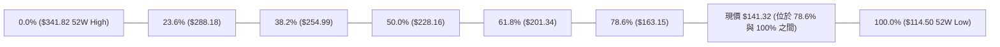

#### 斐波那契價位解讀表

| 回調比例 | 精確價位 | 相對現價距離 | 技術含義與解讀 |
|----------|----------|--------------|----------------|
| **0.0%** | **$341.82** | +141.88% | 52週最高點，長線牛市頂部 |
| **23.6%** | **$288.18** | +103.92% | 極強多頭回調支撐位（已遠離） |
| **38.2%** | **$254.99** | +80.43% | 黃金分割重要防守位 |
| **50.0%** | **$228.16** | +61.45% | 多空平衡中樞（2026-05 反彈頂點 $225.00 受阻於此） |
| **61.8%** | **$201.34** | +42.47% | 黃金分割強壓力位，多頭中期反轉關鍵 |
| **78.6%** | **$163.15** | +15.45% | 深幅回調位，高度重合 R3 ($164.24) 與 MA120 ($161.39) |
| **當前現價** | **$141.32** | 0.00% | **處於 78.6% ($163.15) 至 100.0% ($114.50) 之深度超跌探底區** |
| **100.0%** | **$114.50** | -18.98% | 52週最低點，整輪回調的絕對基底 |

---

## 5. 技術指標深度解讀

### 🎛️ 指標訊號總覽

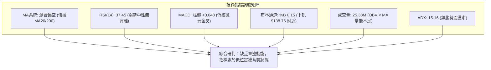

### 📈 移動平均線排列分析

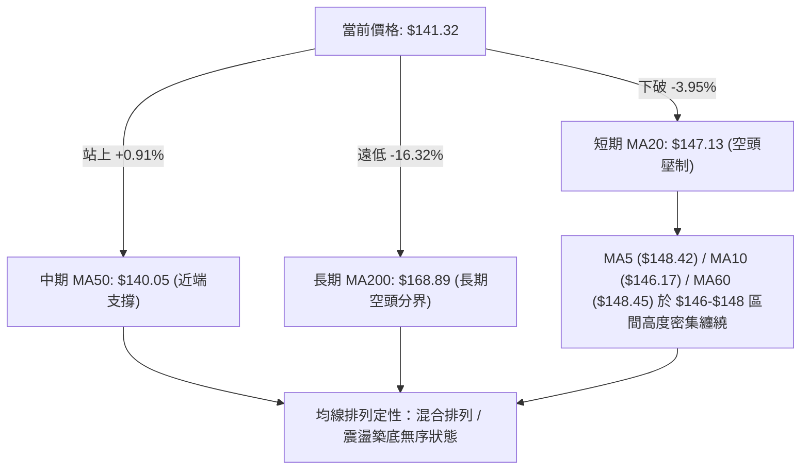

#### 均線階梯監控表

| 均線名稱 | 當前數值 | 偏離度 | 走勢狀態 | 技術解讀 |
|----------|----------|--------|----------|----------|
| **MA 5** | $148.42 | -4.78% | ▼ 下行 | 極短線下壓，壓制反彈動能 |
| **MA 10** | $146.17 | -3.32% | ▼ 下行 | 短線第一道動態阻力 |
| **MA 20** | $147.13 | -3.95% | ▼ 下行 | 月線生命線失守，布林中軌阻力 |
| **MA 50** | $140.05 | +0.91% | ▲ 上行 | 季線微幅向上，提供現價下方 $1.27 處支撐 |
| **MA 60** | $148.45 | -4.80% | ▼ 下行 | 與 MA5/R1 重合，構成 $148.50 強阻力帶 |
| **MA 120** | $161.39 | -12.44% | ▼ 下行 | 半年線持續下行，壓制中期反彈空間 |
| **MA 200** | $168.89 | -16.32% | ▼ 下行 | 牛熊分界線，長期趨勢未扭轉 |
| **MA 240** | $187.00 | -24.43% | ▼ 下行 | 年線阻力，長線估值修復上限 |

### 📉 RSI(14) 分析

```
RSI(14) 當前數值: 37.45
0 ─────────── 30 ────── 37.45 ────────────────── 70 ────────── 100
[ 極度超賣區 ] [ 弱勢中性區 (現狀) ]              [ 超買區 ]
進度條: ███████████████░░░░░░░░░░░░░░░░░░░░░░░░ 37.45%
```

- **背離分析**：
  - **日線層級**：RSI 於 37.45 運行，無明顯頂背離或底背離現象。
  - **週線層級**：2026-07-26 價格創低 $114.99 時 RSI 為 26.7，隨後反彈至 2026-08-16 的 74.6，當前週線 RSI 回落至 37.5，指標呈現常態性回檔，無結構性背離。
- **結論**：RSI 位於 30-40 弱勢緩衝區，空頭動能有所衰減，但尚未觸發極度超賣之強烈反彈訊號。

### 📊 MACD(12/26/9) 訊號解讀

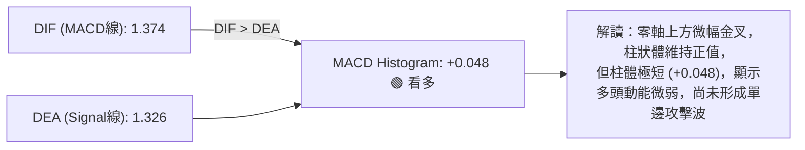

- **MACD 特徵**：DIF (1.374) 與 Signal (1.326) 差值微小，且雙線均處於低位鈍化狀態。若 Histogram 無法迅速擴張至 +0.50 以上，隨時有再度死叉之風險。

### 📦 布林通道分析（Bollinger Bands）

```
ORCL 布林通道結構示意圖 (日線參數: 20, 2)
$155.49 ┬──────────────────────────────────────────── BB 上軌 (阻力帶)
        │
$147.13 ┼──────────────────────────────────────────── BB 中軌 (MA20 阻力)
        │
$141.32 ┼─────────────────● (現價 %B = 0.15 貼近下軌)
$138.76 ┴──────────────────────────────────────────── BB 下軌 (近期支撐)
```

- **帶寬與位置分析**：
  - 上軌：**$155.49** ｜ 中軌：**$147.13** ｜ 下軌：**$138.76**
  - **%B 指標 = 0.15**：價格已處於下軌上方 15% 處，進入通道下軌防守區。
  - **帶寬特徵**：通道帶寬呈現收斂狀態（帶寬約 $16.73，佔股價 11.8%），屬於典型低波動整理，預示著價格觸及下軌 $138.76 附近容易產生技術性抽腳反彈。

### 💹 成交量分析（量價配合度）

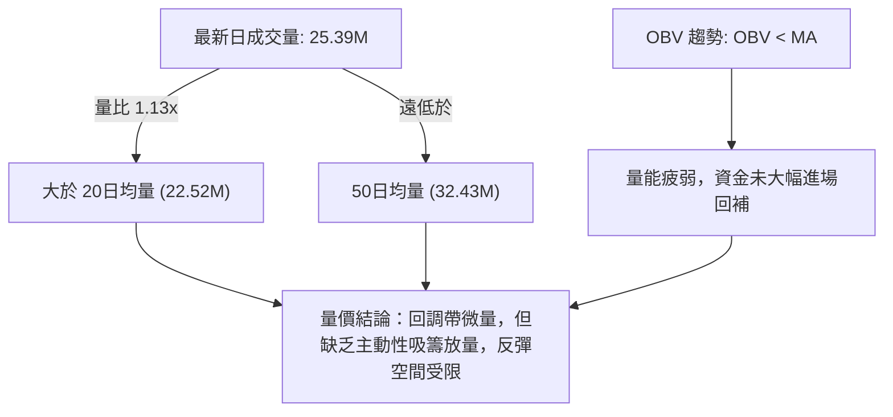

- **量能評估**：量能維持在 2,500 萬股水平，低於 50 日均量（3,243 萬股）。OBV 位於均線下方運行，顯示當前價位機構投資者多處於觀望狀態，缺乏推動股價突破 R1 ($148.55) 的量能基礎。

---

## 6. 動能與波動率

### ⚡ 動能評估

#### 動能與波動率象限評估表

| 象限 | 動能強度 | 波動率水平 | 當前匹配 | 市場狀態與交易策略評估 |
|------|----------|------------|----------|------------------------|
| **Q1 (最佳機會)** | 強 (Trend) | 低 (Low Vol) | ─ | 趨勢穩健推進，適合順勢加碼 |
| **Q2 (謹慎觀望)** | **弱 (Weak)** | **低 (Low Vol)** | **✓ (ORCL 當前)** | **ADX=15.16 且 ATR=4.21%，動能不足且帶寬收縮，以區間低吸高拋為主** |
| **Q3 (高風險利潤)** | 強 (Trend) | 高 (High Vol) | ─ | 主升浪或主跌浪，突破追單 |
| **Q4 (避免進場)** | 弱 (Weak) | 高 (High Vol) | ─ | 混亂無序震盪，容易多空雙巴 |

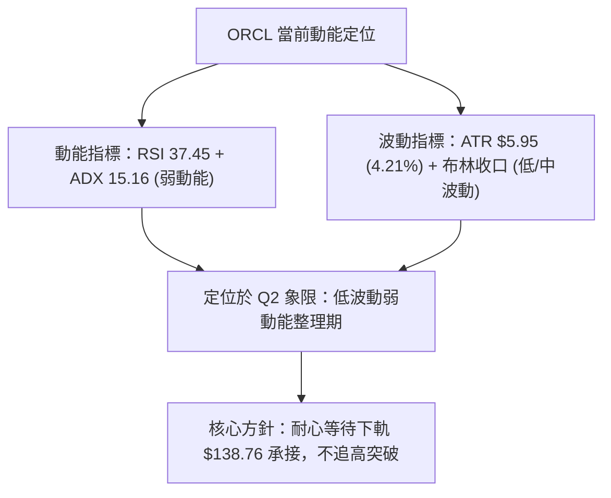

### 📊 ATR 波動率分析

```
╔══════════════════════════════════════════════════════════════════╗
║                   ATR(14) 波動率與止損設定依據                   ║
╠══════════════════════════════════════════════════════════════════╣
║ 當前 ATR(14) 數值: $5.95 ｜ 股價波動百分比: 4.21%                ║
║                                                                  ║
║ • 1.0 × ATR (短線正常波動帶):   $5.95 ── 日內隨機噪音區間         ║
║ • 1.5 × ATR (建議短線止損距):   $8.93 ── 兼顧風控與防震出局       ║
║ • 2.0 × ATR (波段安全防護帶):   $11.90 ── 適用於中線波段持有者    ║
╚══════════════════════════════════════════════════════════════════╝
```

- **止損計算應用**：
  - 若於現價 $141.32 進場，1.0 倍 ATR 止損設於 **$135.37**（剛好保護於關鍵支撐 S1 $135.89 之下方）。
  - 若於布林下軌 $138.76 進場，1.0 倍 ATR 止損設於 **$132.81**，風險報酬比極佳。

### 📐 Beta 與市場相關性

| 參數指標 | 數值 | 屬性解讀 | 對沖與配置意涵 |
|----------|------|----------|----------------|
| **Beta 係數** | **1.718** | 高彈性高敏感標的 | 波動幅度為標普500指數的 1.72 倍，大盤反彈時彈升力道強，大盤下跌時回撤壓力大 |
| **空頭比例 (Short % Float)** | **2.8%** | 空頭壓力偏低 | 空頭回補軋空動能較小，走勢回歸基本面與技術面共振 |
| **空頭回補天數 (Short Ratio)** | **1.37 天** | 流動性充足 | 籌碼流動性極佳，大單進出對市場衝擊相對平緩 |

---

## 7. 多時框架總結

### 📋 時框架評分表

| 時框架 | 趨勢方向 | 動能指標 | 均線排列 | 圖表形態 | 綜合評分 | 建議操作 |
|--------|----------|----------|----------|----------|----------|----------|
| **長期 (月線)** | 🔴 下行修正 | 弱勢中性 (回落趨緩) | 空頭排列 (破MA200) | 52W高點深幅回調 (跌幅58%) | **35/100** | 逢高減倉 / 長線定投觀察 |
| **中期 (週線)** | 🟡 橫向築底 | MACD金叉柱 (+0.048) | 均線交纏 (爭奪MA50) | 潛在雙底雛形 ($114.50/$135.89) | **52/100** | 區間震盪操作 / 逢低布局 |
| **短期 (日線)** | 🟡 區間震盪 | RSI 37.45 (弱勢偏中) | 跌破MA20 / 守MA50 | 布林下軌壓縮 ($138.76-$148.55) | **46/100** | 下軌支撐低吸 / 嚴設止損 |

### 🔲 綜合訊號矩陣

```
╔══════════════════════════════════════════════════════════════════╗
║                     ORCL 多時框架訊號矩陣                        ║
╠══════════════════╦══════════════╦══════════════╦═════════════════╣
║ 分析維度         ║ 短期 (日線)  ║ 中期 (週線)  ║ 長期 (月線)     ║
╠══════════════════╬══════════════╬══════════════╬═════════════════╣
║ 趨勢方向         ║ 🟡 區間震盪  ║ 🟡 築底震盪  ║ 🔴 空頭修正     ║
║ 均線系統 (MA)    ║ 🔴 破MA20    ║ 🟢 守MA50    ║ 🔴 遠低MA200    ║
║ 動能指標 (RSI)   ║ 🟡 37.45     ║ 🟡 37.50     ║ 🔴 偏弱         ║
║ 趨勢指標 (MACD)  ║ 🟢 柱體翻正  ║ 🟢 微弱金叉  ║ 🔴 零軸下方     ║
║ 形態結構         ║ 🟡 箱體收斂  ║ 🟢 雙底雛形  ║ 🔴 下行通道     ║
║ 成交量配合       ║ 🔴 OBV疲弱   ║ 🟡 量能萎縮  ║ 🔴 賣壓沉重     ║
╚══════════════════╩══════════════╩══════════════╩═════════════════╝
```

### ⚖️ 多時框收斂結論

依據多時框收斂規則（規則 14）：
1. **行情定性**：當前 ADX(14) 為 **15.16 (<25)**，技術面確立為**標準盤整/無趨勢行情**。
2. **主導時框**：趨勢指標失效，**以日線布林通道上下軌 ($138.76 - $155.49) 及箱體區間 ($135.89 - $148.55) 作為核心交易框架**。
3. **方向性結論**：綜合評分為 **46/100（中性偏弱震盪觀望）**。當前價格 $141.32 緊鄰 MA50 ($140.05) 與布林下軌 ($138.76)，向下具備安全邊際，向上受制於 R1 ($148.55)。因此確立主策略為：**「依託布林下軌與關鍵支撐 S1 進行區間低吸操作，嚴禁追高」**。

---

## 8. 交易策略建議

### 🗺️ 策略決策流程圖

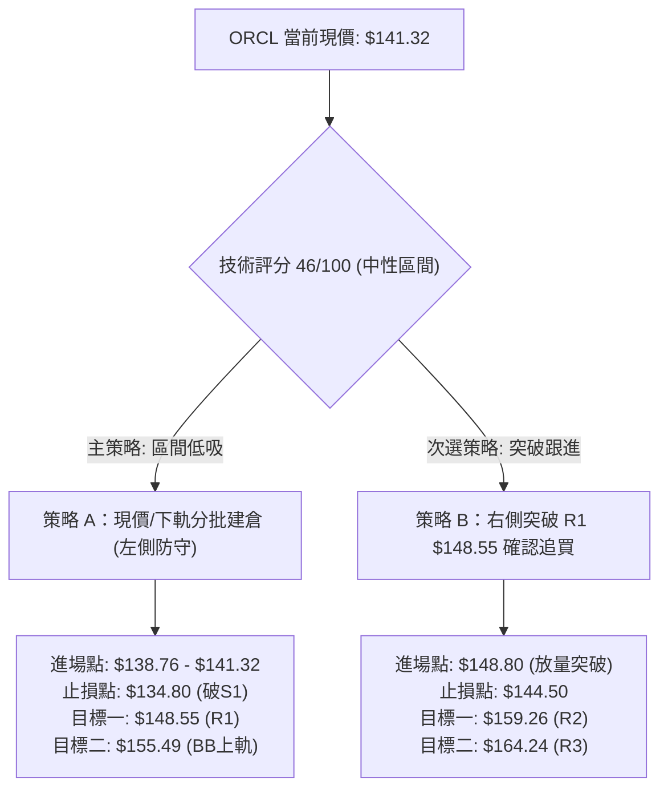

### 🧭 策略路由聲明

> **當前主策略方向 = 🟡 區間震盪操作（依綜合評分 46/100）**
> 市場處於 ADX < 25 的盤整無趨勢市，多空雙方於 $135.89 - $148.55 進行拉鋸，策略以「下軌支撐區間低吸、上軌阻力分批止盈」為主軸，並搭配嚴格止損以防破位。

### 🎯 價格情境階梯（Price Scenarios）

| 觸發條件 | 第一目標價 | 第二目標價 | 情境技術含義與後續演變 |
|----------|------------|------------|------------------------|
| **強勢突破 R1 ($148.55)** | **R2 ($159.26)** | **R3 ($164.24)** | 向上突破箱頂，雙底形態確立，挑戰斐波那契 78.6% 位 ($163.15) |
| **站穩現價區間 ($138.76-$141.32)** | **MA20 ($147.13)** | **R1 ($148.55)** | 守住 MA50 與布林下軌，展開箱體內技術性均值回歸反彈 |
| **跌破關鍵支撐 S1 ($135.89)** | **$126.41 (7月前低)** | **S2 ($114.50)** | 箱體築底失敗，重啟日線下行浪，考驗 52 週終極歷史低點 |

### 📊 情境機率分佈

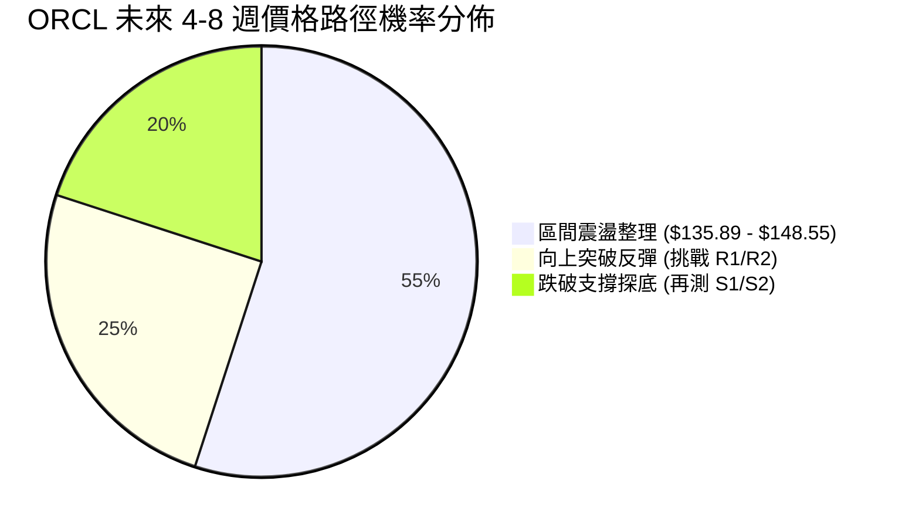

| 走勢情境 | 機率 | 主要技術依據 |
|----------|------|--------------|
| **情境一：區間震盪 (主流)** | **55%** | ADX(14) 僅 15.16 處於盤整，布林帶寬收窄，成交量未爆發，難有單邊趨勢 |
| **情境二：向上反彈突破** | **25%** | MACD 柱體微幅翻正 (+0.048)，價格處於 52W 區間低檔 11.8%，具備估值修復潛力 |
| **情境三：向下破位探底** | **20%** | -DI (27.45) 仍高於 +DI，均線呈現中長期空頭排列，若大盤轉弱恐帶動破位 |

### 🟢 主策略詳情（區間與反彈策略）

| 策略要素 | 策略 A（下軌低吸網格 — 左側交易） | 策略 B（突破頸線加碼 — 右側交易） |
|----------|-----------------------------------|-----------------------------------|
| **進場條件** | 價格於布林下軌 $138.76 至現價 $141.32 企穩 | 日K收盤價放量站穩 R1 ($148.55) 之上 |
| **進場價格** | **$140.00**（MA50 與現價之間分批掛單） | **$148.80**（突破確認點） |
| **止損價格** | **$134.80**（跌破 S1 $135.89 且留 1ATR 緩衝） | **$144.50**（跌回 MA20 之下止損） |
| **目標價 T1** | **$148.55**（關鍵阻力 R1 / 箱頂） | **$159.26**（阻力位 R2 / 箱體量度目標） |
| **目標價 T2** | **$155.49**（布林通道上軌） | **$164.24**（強阻力 R3 / 斐波那契 78.6%） |
| **潛在利潤** | T1: +6.11% ｜ T2: +11.06% | T1: +7.03% ｜ T2: +10.38% |
| **潛在風險** | -3.71% ($5.20 風險空間) | -2.89% ($4.30 風險空間) |
| **風險報酬比** | **1 : 2.13** (以 T2 計算) | **1 : 2.43** (以 T1 計算) |
| **預估勝率** | **60%** | **50%** |
| **建議倉位** | **10% - 15%** (輕倉防守) | **10%** (確認突破後右側追加) |

### 🔴 反向風險觸發點（對沖提示）

若發生以下任一觸發事件，必須立即終止多頭策略並考慮避險：
1. **破位風險**：收盤價**實體跌破 S1 ($135.89)**，意味著雙底形態破滅，需立即無條件止損。
2. **量能異動**：若日成交量放大至 4,000 萬股以上卻收出長陰線跌破 $138.76（布林下軌）。
3. **動能惡化**：RSI(14) 跌破 30 進入單邊超賣暴跌區，且 MACD 柱狀體翻負擴大。

### ⭐ 整體訊號強度評星

```
╔══════════════════════════════════════════════════════════════════╗
║                     ORCL 技術訊號強度評星                        ║
╠══════════════════════════════════════════════════════════════════╣
║ 做多訊號強度：  ★★☆☆☆  (2.5/5星) ── 僅具備超跌與區間下軌優勢   ║
║ 做空訊號強度：  ★★☆☆☆  (2.5/5星) ── 逼近強支撐，向下空間受限   ║
║ 區間震盪可信度：★★★★☆  (4.0/5星) ── ADX 與布林通道強烈指向盤整 ║
║ 整體技術可信度：★★★☆☆  (3.5/5星) ── 數據具備高度一致性       ║
╚══════════════════════════════════════════════════════════════════╝
```

---

## 9. 風險提示與監控

### ✅ 關鍵監控指標 Checklist

```
╔══════════════════════════════════════════════════════════════════╗
║                 ORCL 每日盤後關鍵監控 Checklist                  ║
╠══════════════════════════════════════════════════════════════════╣
║ [ ] 價格是否守穩 MA50 ($140.05) 與布林下軌 ($138.76) 之上？      ║
║ [ ] 日成交量是否放大突破 20日均量 (22.52M) 並伴隨陽線？        ║
║ [ ] MACD 柱狀圖是否持續擴張維持正值 (> +0.048)？                 ║
║ [ ] RSI(14) 是否成功回升突破 50.0 多空強弱分水嶺？              ║
║ [ ] ADX(14) 是否由 15.16 開始翹頭向上突破 20 (新趨勢啟動訊號)？ ║
║ [ ] 股價是否觸及或突破關鍵頸線 R1 ($148.55)？                    ║
╚══════════════════════════════════════════════════════════════════╝
```

### ⚠️ 風險場景分析

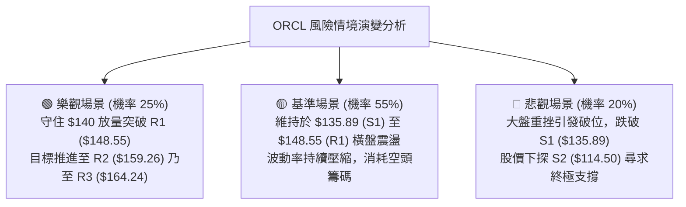

### 🛡️ 風險管理重要提醒

1. **高 Beta 波動防護**：ORCL 之 Beta 值達 **1.718**，在大盤（如 QQQ 或 SPY）大幅波動時容易出現放大震盪。單筆交易曝險金額不宜超過總帳戶淨值的 1.5%。
2. **區間操作紀律**：當前 ADX = 15.16，**嚴禁在阻力位 R1 ($148.55) 附近追漲**。任何買入動作應嚴格限制於 MA50 ($140.05) 至布林下軌 ($138.76) 區間內進行。
3. **無條件止損原則**：若價格帶量跌破關鍵支撐 S1 **$135.89**，說明箱體結構徹底破壞，應立即執行止損指令（建議停損點設為 **$134.80**），切勿抱持凹單心態。

---

## 📋 報告總結

```
╔══════════════════════════════════════════════════════════════════╗
║                     ORCL 技術分析報告總結                        ║
╠══════════════════════════════════════════════════════════════════╣
║ 報告日期：2026-09-02                                             ║
║ 當前價格：$141.32 (52週區間 11.8% 極低檔)                        ║
║ 分析評級：⚖️ 中性盤整 (Neutral / Consolidating) 評分: 46/100      ║
║                                                                  ║
║ 關鍵結論：                                                       ║
║ ├─ 長期趨勢：🔴 空頭修正 (自 $341.82 高點深度回撤，處於 MA200 下) ║
║ ├─ 中期趨勢：🟡 底部構築 (於 $114.50 至 $150 區間進行大級別築底) ║
║ ├─ 短期趨勢：🟡 窄幅震盪 (受制於 R1 $148.55，防守 S1 $135.89)    ║
║ ├─ 關鍵支撐：S1 $135.89 ｜ 終極支撐：S2 $114.50                  ║
║ ├─ 關鍵阻力：R1 $148.55 ｜ 中期阻力：R2 $159.26 ｜ 強阻力: $164.24║
║ └─ 分析師目標均價：$244.12 (潛在修復空間 +72.74%)                 ║
║                                                                  ║
║ 最優策略組合：                                                   ║
║ 1. 🥇 最佳機會：於 $138.76-$140.05 區間低吸，博弈箱底反彈至 $148.55║
║ 2. 🥈 次選機會：耐心等待日線放量突破 $148.55 後，右側順勢追進至 $159║
║ 3. 🥉 保守選擇：觀望等待 ADX > 25 出現明確單邊突破訊號後再行介入 ║
╚══════════════════════════════════════════════════════════════════╝
```

---

> ⚠️ **免責聲明**：本報告為技術分析研究成果，所有數據指標及價位均基於歷史量價數據運算推導。本報告**僅供研究與學術參考**，**不構成任何形式的投資買賣建議**。金融市場投資具有高度風險，交易者應獨立評估自身風險承受能力並自負盈虧。

---

*報告生成時間：2026-09-02 ｜ 數據來源：Yahoo Finance ｜ 分析框架：資深多時框量化技術分析*