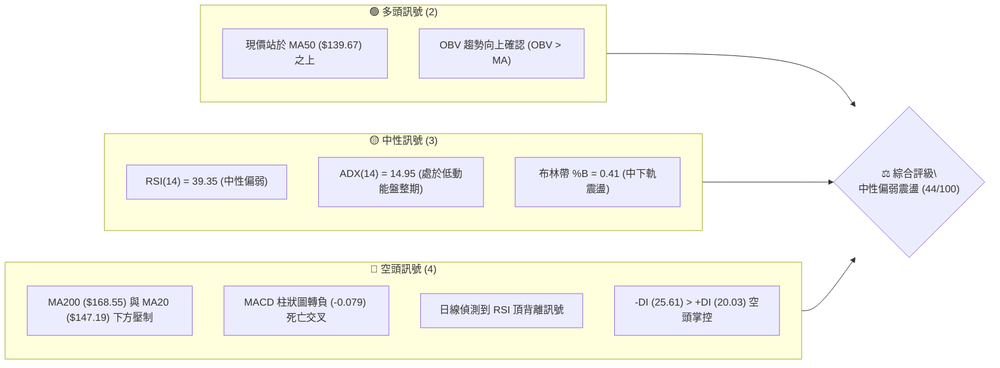
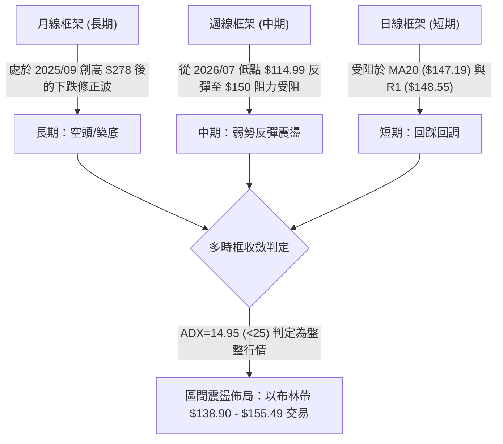
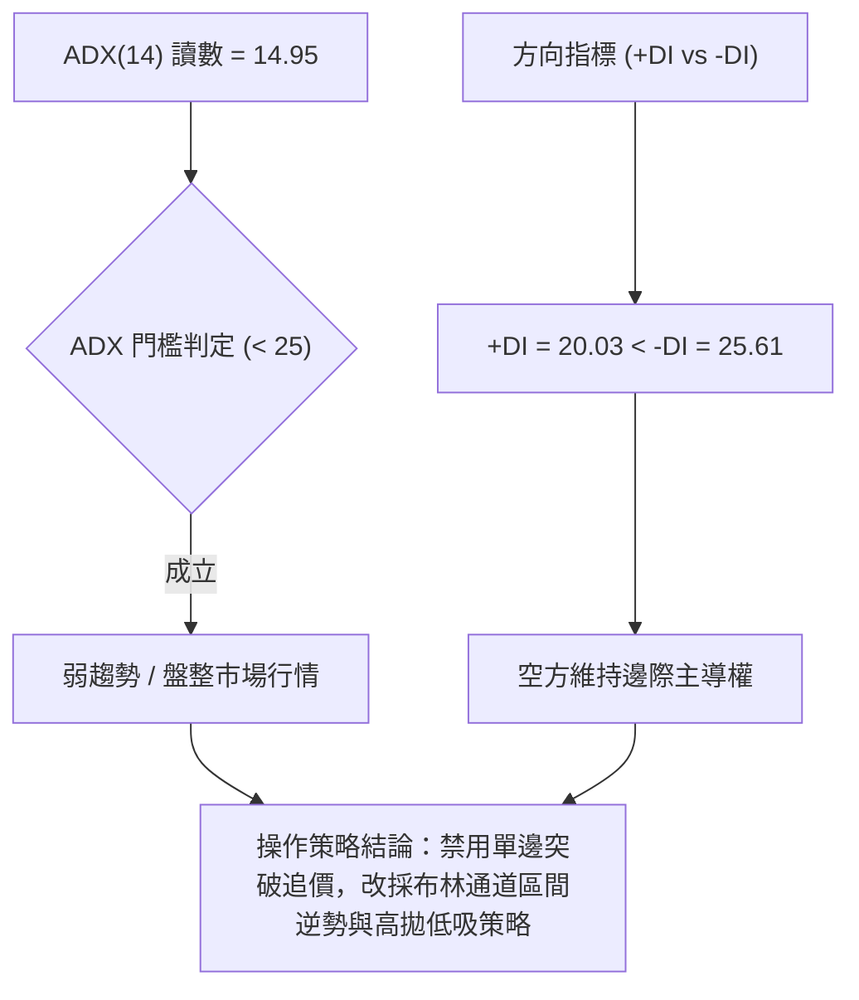
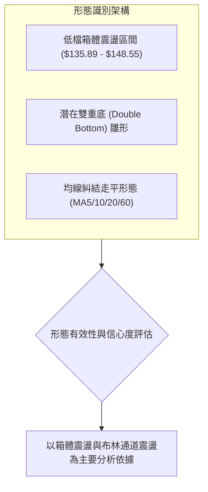
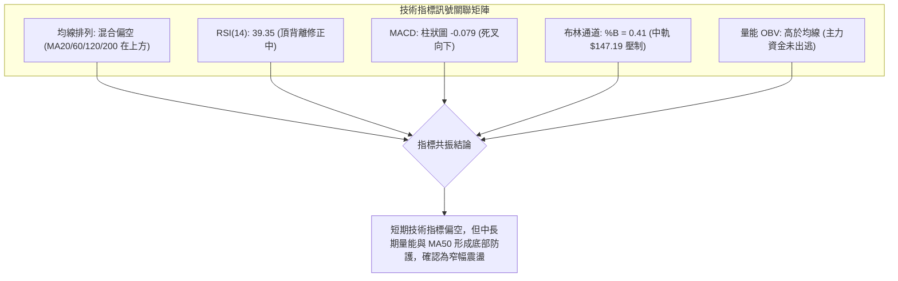
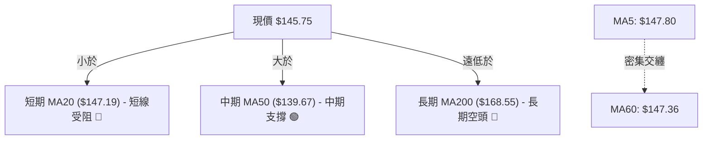
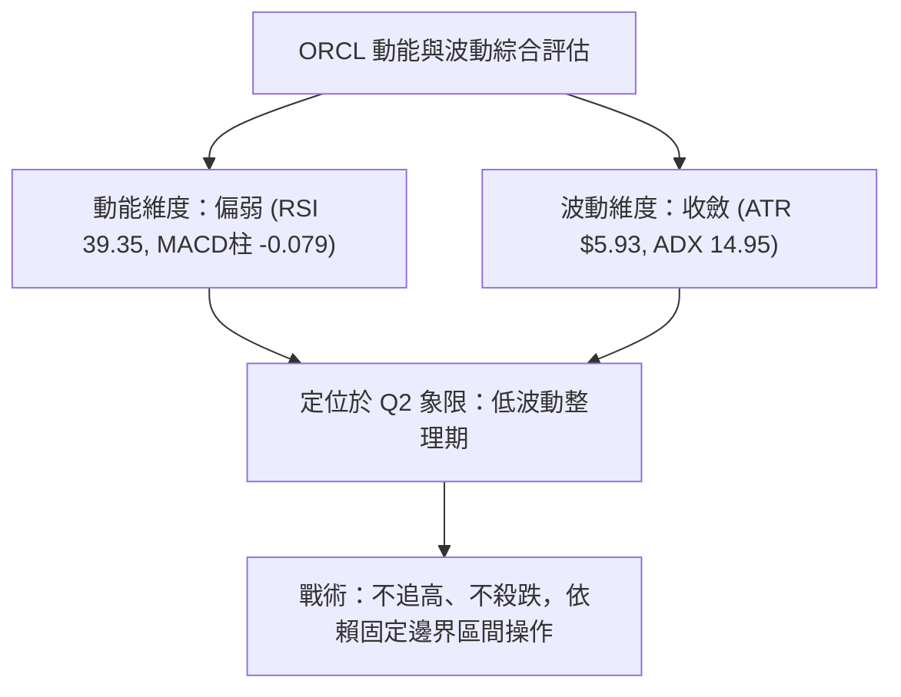
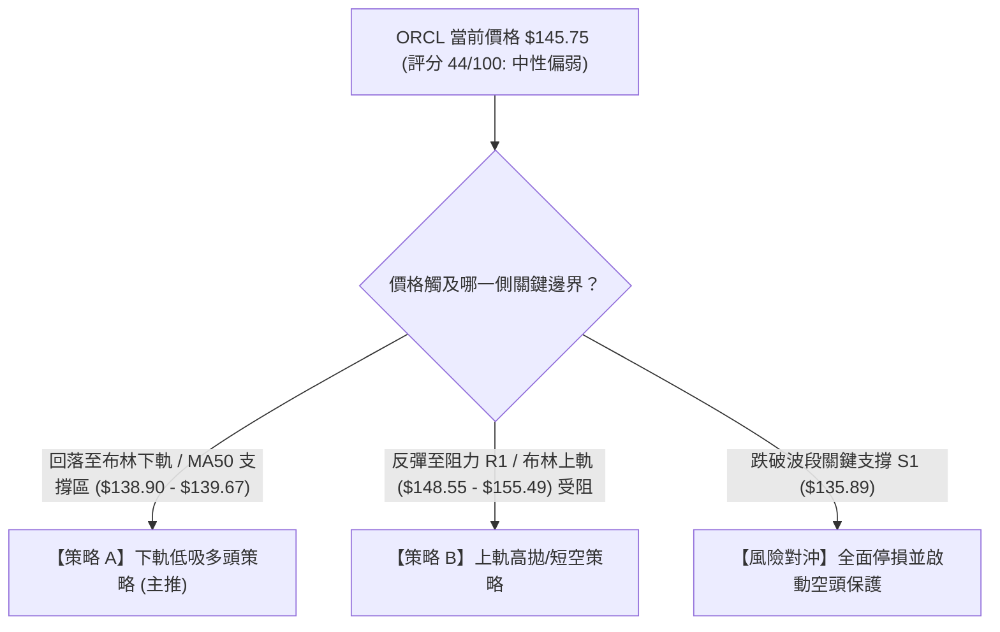
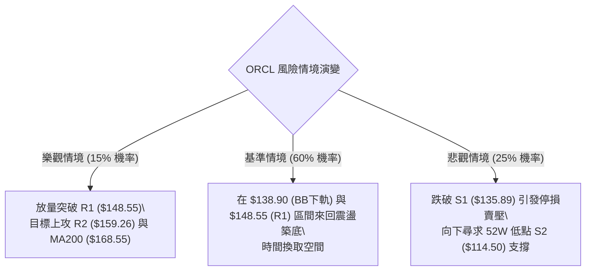

# ORCL 技術分析報告

> **報告日期**：2026-09-03 ｜ **語言**：繁體中文 ｜ **數據來源**：Yahoo Finance ｜ **當前價格**：$145.75

---

## 目錄

| 章節 | 內容 |
|------|------|
| [1. 技術面概覽](#1-技術面概覽) | 訊號儀表板、核心指標、評分卡 |
| [2. 趨勢分析](#2-趨勢分析) | 多時框趨勢、長中短期走勢 |
| [3. 圖表形態分析](#3-圖表形態分析) | 形態識別、K線組合、目標價 |
| [4. 支撐與阻力](#4-支撐與阻力) | 關鍵價位、斐波那契回調 |
| [5. 技術指標深度解讀](#5-技術指標深度解讀) | MA/RSI/MACD/布林/成交量 |
| [6. 動能與波動率](#6-動能與波動率) | 動能評估、ATR、Beta |
| [7. 多時框架總結](#7-多時框架總結) | 時框架評分矩陣 |
| [8. 交易策略建議](#8-交易策略建議) | 多空策略、風險報酬比 |
| [9. 風險提示與監控](#9-風險提示與監控) | 監控指標、風險場景 |

---

## 1. 技術面概覽

### 🎯 技術訊號儀表板



### 📊 核心指標速覽表

| 指標類別 | 指標名稱 | 當前數值 | 訊號 | 解讀 |
|----------|----------|----------|------|------|
| **價格** | 當前價格 | $145.75 | 🟡 | 位於52週區間 13.7% 分位，處於底部震盪築底階段 |
| **均線** | MA20 | $147.19 | 🔴 | 價格位於 MA20 下方 (-0.98%)，短期承壓 |
| **均線** | MA50 | $139.67 | 🟢 | 價格位於 MA50 上方 (+4.35%)，中期底部支撐有效 |
| **均線** | MA200 | $168.55 | 🔴 | 價格大幅低於 MA200 (-13.53%)，長期格局仍偏空 |
| **動能** | RSI(14) | 39.35 | 🟡 | 中性偏弱區間，伴隨頂背離修正訊號 |
| **動能** | MACD(12,26,9) | Hist: -0.079 | 🔴 | MACD線(1.228)下穿訊號線(1.307)，動能轉空 |
| **趨勢強度**| ADX(14) | 14.95 | 🟡 | ADX < 25 表明處於無趨勢/低波動盤整行情 |
| **波動** | ATR(14) | $5.93 | 🟡 | 佔股價 4.07%，每日波動適中，震盪加劇風險可控 |
| **量能** | OBV | OBV > MA | 🟢 | 資金流向呈現支撐，量能尚未完全潰散 |

### 🏆 技術評分卡

```
╔══════════════════════════════════════════════════════════════╗
║              技術評分卡 — ORCL (2026-09-03)                  ║
╠══════════════════════════════════════════════════════════════╣
║ 趨勢強度      ██████░░░░░░░░░░░░░░  30/100  🔴 空頭佔優/盤整 ║
║ 動能指標      ████████░░░░░░░░░░░░  40/100  🔴 動能轉弱死叉 ║
║ 支撐穩定度    ████████████░░░░░░░░  60/100  🟢 MA50/S1提供支撐║
║ 成交量配合    ████████████░░░░░░░░  60/100  🟢 OBV維持正向 ║
║ 形態完整度    ████████░░░░░░░░░░░░  40/100  🟡 弱勢區間箱體 ║
║ 均線排列      ██████░░░░░░░░░░░░░░  34/100  🔴 均線混合空頭 ║
╠══════════════════════════════════════════════════════════════╣
║ 綜合評分      ████████░░░░░░░░░░░░  44/100  🟡 中性偏弱 (觀望)║
╚══════════════════════════════════════════════════════════════╝
```

---

## 2. 趨勢分析

### 🌐 多時框趨勢分析



### 📈 長期趨勢 — 12個月走勢圖（Unicode）

```
ORCL 月線走勢圖（過去12個月：2025-09 至 2026-09）
價格軸 ($)
$280 ┤ ● (2025-09: $278.07 歷史高點)
$260 ┤   ● (2025-10: $260.10)
$240 ┤
$220 ┤                             ● (2026-05: $225.00 反彈高點)
$200 ┤     ● (2025-11: $200.02)
$180 ┤       ● (2025-12: $193.05)
$160 ┤         ● (2026-01: $163.44)  ● (2026-04: $160.83)
$140 ┤           ● (2026-02: $144.39)  ● (2026-03: $146.09)  ● (2026-06: $146.04)  ● (2026-08: $149.12)
$120 ┤                                                         ● (2026-07: $129.87)   ●←現價 $145.75
     └─┬───┬───┬───┬───┬───┬───┬───┬───┬───┬───┬───┬───
      09  10  11  12  01  02  03  04  05  06  07  08  09  (月份)
```

**走勢特徵分析表格**：

| 階段區間 | 時間跨度 | 起止價格 | 漲跌幅 | 結構特徵與技術解讀 |
|----------|----------|----------|--------|-------------------|
| **頭部崩跌波** | 2025/09 - 2026/02 | $278.07 → $144.39 | **-48.07%** | 衝高回落後形成單邊空頭下跌，各均線全面下破 |
| **春季反彈波** | 2026/02 - 2026/05 | $144.39 → $225.00 | **+55.83%** | 均線乖離率過大的報復性反彈，觸及長期反壓後受阻 |
| **二次探底波** | 2026/05 - 2026/07 | $225.00 → $129.87 | **-42.28%** | 跌破前低並下探 52 週最低點 $114.50 附近完成洗盤 |
| **底部築底波** | 2026/07 - 2026/09 | $129.87 → $145.75 | **+12.23%** | 進入收斂箱體盤整，現價於 $145.75 尋求均線平穩 |

### 📊 中期趨勢（週線分析）

中期技術架構呈現「由急速下殺轉入低檔收斂」之格局：
- 價格在 2026 年 7 月 26 日當週打出波段低點 $114.99（接近 52 週最低點 $114.50）後，週線出現強烈反彈。
- 反彈至 2026 年 8 月中旬高點 $150.85 後遭遇阻力位 R1（$148.55）壓制，週線 RSI 由 74.6 急速回落至 39.3。
- 週線 MACD 柱狀圖自 +4.827 迅速收斂至 -0.079，週成交量由 1.73 億股大幅萎縮至 6,343 萬股，量能遞減顯示向上追價意願不足，市場轉為觀望盤整。

### ⚡ 趨勢強度評估（ADX 解讀）



| ADX 數值區間 | 當前狀態 | 趨勢強度定義 | 市場狀態與交易指導原則 |
|--------------|----------|--------------|------------------------|
| **0 – 20**   | **14.95** | 🟢/🟡 極弱/無趨勢 | **當前狀態**：震盪盤整行情，指標易出現鈍化與假突破 |
| **20 – 25**  | -        | 弱趨勢       | 趨勢孕育期，需等待方向明朗 |
| **25 – 50**  | -        | 強趨勢       | 順勢突破交易，追隨主趨勢 |
| **50 – 100** | -        | 極強趨勢     | 極度延伸行情，需提防高檔反轉 |

---

## 3. 圖表形態分析

### 🔍 形態識別系統



**圖表形態信心度與判定依據表格**：

| 形態名稱 | 信心度 | 判斷依據（數據引用） | 完成度 | 目標價（附嚴格計算式） |
|----------|--------|----------------------|--------|------------------------|
| **低檔箱體震盪** | **75%** | 股價受限於支撐 S1 ($135.89) 與阻力 R1 ($148.55) 間反覆震盪 | 85% | 箱體等幅向上突破目標：頸線 R1 ($148.55) + 箱高 ($148.55 - $135.89 = $12.66) = **$161.21**（接近 MA120 $161.29 與 R2 $159.26） |
| **雙重底雛形** | **55%** | 第一底為 2026/02 收盤 $144.39，第二底為 2026/06 收盤 $146.04，低點守於 S1 之上 | 60% | 頸線為 2026/05 高點 $225.00；由於當前距離頸線過遠且完成度低，暫以突破 R2 ($159.26) 為第一確認點 |
| **頭肩頂/旗形** | **<30%**| 數據中未偵測到完整幾何結構 | 0% | *訊號不足，僅做指標型與均線解讀* |

### 🕯️ 重要K線形態分析

| 月份 | 收盤價 | K線形態特徵 | 技術解讀 | 訊號強度 |
|------|--------|-------------|----------|----------|
| **2026-05** | $225.00 | 長陽突破後帶長上影線 | 反彈遇 MA200 強阻力出清，多頭動能耗盡 | 🔴 強空訊號 |
| **2026-06** | $146.04 | 大陰線跳空下殺 | 空方完全吞噬前月漲幅，引發停損賣壓 | 🔴 極空訊號 |
| **2026-07** | $129.87 | 下影線探底十字星 | 探至 52W 低點 $114.50 附近獲得低接買盤 | 🟢 止跌訊號 |
| **2026-08** | $149.12 | 中陽線反彈收復 MA50 | 多頭展開超跌修復，但量能未能持續放大 | 🟡 弱多反彈 |
| **2026-09** | $145.75 | 窄幅整理小陰線 | 受阻於 MA20 ($147.19) 與 R1 ($148.55)，進入多空平衡 | 🟡 盤整訊號 |

### 📉 ASCII 走勢形態示意圖

```
ORCL 近期日/週線箱體震盪形態示意圖
價位 ($)
$155.49 ┬──────────────────────────────────────── 布林上軌 (強壓)
        │
$148.55 ┼───[阻力 R1]───────● (08/30: $150.85 反彈高點受阻)
$147.19 ├───[MA20 中軌]───────▲
$145.75 ┼───[現價位置]─────────■ (現價收盤 $145.75，處於箱體中軸)
$139.67 ├───[MA50 支撐]───────▼
$138.90 ┼───[布林下軌]───────┬───────────────── (動態支撐帶)
$135.89 ┴───[波段支撐 S1]─────● (07/19: $126.41~$135 築底反彈起點)
        └────────────────────────────────────────
```

### 🎯 形態目標價計算

依據低檔箱體震盪形態之標準高度測算法：
1. **箱體底部**：波段支撐聚集位 **S1 = $135.89**
2. **箱體頂部（頸線）**：波段高點阻力位 **R1 = $148.55**
3. **箱體震盪垂直高度 ($H$)**：
   $$H = \text{R1} - \text{S1} = 148.55 - 135.89 = \$12.66$$
4. **向上突破測量目標價 ($T_1$)**：
   $$T_1 = \text{R1} + H = 148.55 + 12.66 = \$161.21$$
   *(該價位高度共振於 MA120 $161.29 與關鍵阻力 R2 $159.26 / 斐波那契 78.6% $163.15 區間)*
5. **向下跌破測量目標價 ($T_{\text{down}}$)**：
   $$T_{\text{down}} = \text{S1} - H = 135.89 - 12.66 = \$123.23$$
   *(跌破後將再度考驗 52 週最低點 S2 $114.50 之防守力道)*

---

## 4. 支撐與阻力

### 🗺️ 關鍵價位分布圖（Unicode）

```
ORCL 價位結構分布圖
═════════════════════════════════════════════════════════════════
$168.55 ║████████████████████████████████████████║ MA200 長期多空分水嶺
$164.24 ║██████████████████████████████          ║ 強阻力 R3 (斐波那契 78.6% $163.15)
$159.26 ║████████████████████                    ║ 阻力 R2 (MA120 $161.29)
$155.49 ║▓▓▓▓▓▓▓▓▓▓▓▓▓▓▓▓                        ║ 布林通道上軌
$148.55 ║████████████████████████████████        ║ 關鍵阻力 R1 (近一年波段高點聚類)
$147.19 ║────────────────────────────────────────║ MA20 / 布林中軌
$145.75 ╠════════════════════════════════════════╣ ◄ 現價 ($145.75)
$139.67 ║┄┄┄┄┄┄┄┄┄┄┄┄┄┄┄┄┄┄┄┄┄┄┄┄┄┄┄┄┄┄┄┄┄┄┄║ MA50 中期均線支撐
$138.90 ║▓▓▓▓▓▓▓▓▓▓▓▓▓▓▓▓                        ║ 布林通道下軌
$135.89 ║████████████████████████                ║ 近期波段關鍵支撐 S1
$114.50 ║████████████████████████████████████████║ 強支撐 S2 (52週最低點 / 斐波那契 100%)
═════════════════════════════════════════════════════════════════
```

### 🚧 阻力位分析表

| 阻力級別 | 價位 | 距現價幅寬 | 形成原因與技術共振 | 突破難度 | 重要性 |
|----------|------|------------|--------------------|----------|--------|
| **R1** | **$148.55** | +1.92% | 近一年波段高點聚類，與 MA5 ($147.80)、MA20 ($147.19)、MA60 ($147.36) 密集重疊 | 🟡 中等 | ★★★★☆ |
| **R2** | **$159.26** | +9.27% | 波段反彈次高點聚類，接近 MA120 ($161.29) 下壓線 | 🔴 較高 | ★★★★☆ |
| **R3** | **$164.24** | +12.69%| 波段高點聚類，共振 52W 斐波那契 78.6% 回調位 ($163.15) 與 MA200 ($168.55) | 🔴 極高 | ★★★★★ |

### 🛡️ 支撐位分析表

| 支撐級別 | 價位 | 距現價幅寬 | 形成原因與技術共振 | 守住機率 | 重要性 |
|----------|------|------------|--------------------|----------|--------|
| **S1** | **$135.89** | -6.76% | 近一年波段低點聚類，下方有 MA50 ($139.67) 及布林下軌 ($138.90) 形成緩衝帶 | 🟢 70% | ★★★★☆ |
| **S2** | **$114.50** | -21.44%| 52 週最低點 (2026/07 探底 $114.99 處)，斐波那契 100% 絕對底部 | 🟢 85% | ★★★★★ |

### 📐 斐波那契回調位分析

*基準區間：52 週最高點 $341.82 → 52 週最低點 $114.50（波段落差 $227.32）*

| 斐波那契層級 | 精確價位 | 狀態與解讀 |
|--------------|----------|------------|
| **0.0% (52W High)** | **$341.82** | 歷史極限阻力區 |
| **23.6%** | **$288.18** | 頂部回撤第一道強阻力 |
| **38.2%** | **$254.99** | 2025/07 反彈高點聚類區 |
| **50.0%** | **$228.16** | 2026/05 反彈頂部 ($225.00) 共振區，多空分水嶺 |
| **61.8%** | **$201.34** | 黃金分割重要防守轉阻力位 |
| **78.6%** | **$163.15** | **當前上方最關鍵中期解套阻力帶**（共振 R3 $164.24） |
| **100.0% (52W Low)**| **$114.50** | **極限支撐 S2**，中期空頭最終防守底線 |

> **現價位置解讀**：現價 **$145.75** 處於 **78.6% 回調位 ($163.15)** 與 **100.0% 回調位 ($114.50)** 之間。這代表股價自高檔經歷了深度修正，目前處於底部超跌修復結構，若無法有效放量升破 78.6%（$163.15），長期趨勢仍難以轉為強勢多頭。

---

## 5. 技術指標深度解讀

### 🎛️ 指標訊號總覽



### 📈 移動平均線排列分析



**均線狀態矩陣**：
- **MA5 ($147.80) / MA10 ($146.36) / MA20 ($147.19) / MA60 ($147.36)**：四條短中期均線在 $146.36–$147.80 區間高度黏合糾結，顯示短線方向即將面臨突破選擇。
- **MA120 ($161.29) / MA240 ($186.39)**：中長期均線呈空頭排列向下發散，對股價構成層層蓋頭反壓。

### 📉 RSI(14) 分析

```
RSI(14) 數值儀表：39.35
0 ─────────── 30 ────── 39.35 ───────────── 70 ─────────── 100
[   超賣區    ]  [ 偏弱震盪 █ ]             [   超買區    ]
進度條：████████░░░░░░░░░░░░  39.35%
```

- **超買超賣狀態**：RSI(14) 為 **39.35**，脫離了 2026 年 8 月中的高檔超買區（當時 RSI 達 74.6），目前位於中性偏弱區。
- **背離判斷**：日線圖於 2026 年 8 月中下旬形成 **⚠️ 頂背離 (Bearish Divergence)**——價格於 8 月底創出波段反彈高點 $150.85，但 RSI 指標高點由 74.6 迅速滑落至 49.8，隨後引發價格回跌至 $145.75，目前此頂背離之修正動能仍在釋放中。

### 📊 MACD(12/26/9) 訊號解讀


- **數值關係**：DIF (1.228) < DEA (1.307)，柱狀圖（Histogram）為 **-0.079**。
- **解讀**：MACD 自 8 月初以來的多頭放量波段宣告結束，正式進入死叉向下修正階段，短期內不具備單邊暴漲的技術動能。

### 📦 布林通道分析

```
ORCL 布林通道 (20, 2) 結構圖
價位 ($)
$155.49 ┬───────────────────────────────── 上軌 (強阻力區)
        │
$147.19 ┼┈┈┈┈┈┈┈┈┈┈┈┈┈┈┈┈┈┈┈┈┈┈┈┈┈┈┈┈┈┈┈┈┈ 中軌 (MA20：多空分水嶺)
$145.75 ┼───────● [現價: %B = 0.41]
        │
$138.90 ┴───────────────────────────────── 下軌 (動態買盤支撐)
```

- **帶寬與位置**：上軌 $155.49，中軌 $147.19，下軌 $138.90，通道帶寬為 $16.59 (11.38%)。
- **%B 指標**：當前 **%B = 0.41**，股價處於中軌與下軌之間，顯示短期走勢偏弱，預期將在下軌 $138.90（與 MA50 $139.67 重疊）尋求支撐。

### 💹 成交量分析（量價配合度）

- **量比與均量**：最新單日成交量為 **21,868,100** 股，相對於 20 日均量（22,438,370 股）之量比為 **0.97x**，低於 50 日均量（32,205,622 股），呈現量縮盤整態勢。
- **OBV (能量潮指標)**：**OBV > MA**，顯示雖然價格短線回調，但能量潮整體趨勢依然高於其移動平均線，說明前波上漲累積的資金尚未大規模出逃，量價配合並未出現崩潰性背離。

---

## 6. 動能與波動率

### ⚡ 動能評估四象限

| 象限 | 動能強度 (RSI/MACD) | 波動率水準 (ATR/帶寬) | ORCL 當前定位 | 策略指導含義 |
|------|---------------------|-----------------------|---------------|--------------|
| **Q1 (擴張衝刺)** | 強動能 (RSI>60) | 低波動 | — | 最佳突破加碼點 |
| **Q2 (震盪沉澱)** | **弱動能 (RSI<45)** | **低/中波動 (ATR=4.07%)** | **✓ [當前狀態]** | **箱體區間操作，嚴控停損，低吸高拋** |
| **Q3 (爆發洗盤)** | 強動能 | 高波動 | — | 高風險波段交易 |
| **Q4 (破位崩跌)** | 弱動能 | 高波動 | — | 全面空倉避險 |



### 📊 ATR 波動率分析

- **ATR(14) 數值**：**$5.93**（佔當前股價之 **4.07%**）。
- **日內與波段止損參考距離**：
  - 短線交易止損距離（1.0 × ATR）：**$5.93**
  - 波段防守止損距離（1.5 × ATR）：**$8.90**
  - 寬鬆趨勢防守距離（2.0 × ATR）：**$11.86**

### 📐 Beta 與市場相關性

- **Beta 係數**：**1.718**（高 Beta 特性）。
- **解讀**：ORCL 相對於標普 500 指數具備顯著的高敏感度（大盤波動 1%，ORCL 預期同向波動 1.72%）。在目前 ADX=14.95 的弱趨勢下，高 Beta 意味著個股極易受到科技板塊整體情緒與大盤指數波動的帶動，操作時必須緊密關注大盤環境。

---

## 7. 多時框架總結

### 📋 時框架評分表

| 時框架 | 趨勢方向 | 動能指標 | 均線排列 | 形態結構 | 綜合評分 | 戰術建議 |
|--------|----------|----------|----------|----------|----------|----------|
| **短期 (日線)** | 🔴 偏空回調 | 🔴 MACD死叉/背離 | 🟡 均線糾結黏合 | 🟡 窄幅震盪 | 40/100 | 短線逢高減碼，回踩 MA50 觀察 |
| **中期 (週線)** | 🟡 築底震盪 | 🟡 RSI 50附近 | 🟢 站穩 MA50 | 🟢 雙底雛形 | 52/100 | 區間下軌（$138.90-$139.67）分批低吸 |
| **長期 (月線)** | 🔴 大級別空頭| 🔴 自高檔修正 | 🔴 承壓於MA200 | 🔴 超跌反彈 | 38/100 | 長線資金耐心等待右側放量突破 |

### 🔲 綜合訊號矩陣

```
┌─────────────────┬────────────────────────────────────────────────────────┐
│ 維度            │ 訊號判定與跨時框交叉驗證                              │
├─────────────────┼────────────────────────────────────────────────────────┤
│ 均線系統共振    │ 🔴 日線受阻 MA20 ($147.19)，週線站上 MA50 ($139.67)   │
│ 動能指標共振    │ 🔴 日線 RSI 頂背離 + MACD 轉負，短期修正壓力未消      │
│ 量能結構共振    │ 🟢 OBV > MA，週線未見爆量破位，屬良性縮量整理          │
│ 關鍵價位共振    │ 🟡 夾於阻力 R1 ($148.55) 與支撐 S1 ($135.89) 之間      │
└─────────────────┴────────────────────────────────────────────────────────┘
```

### ⚖️ 多時框收斂結論

> **依多時框收斂規則（嚴格要求 14）**：
> 當前技術數據顯示 **ADX(14) = 14.95 (< 25)**，明確定義為**無趨勢之盤整行情**。在此市場環境下，中長期趨勢指標暫退居次要，交易邏輯應以**日線布林通道上下軌 ($138.90 – $155.49) 與 S1/R1 區間**為核心收斂邊界。
> 
> **唯一方向性結論**：**中性觀望（區間震盪偏弱）**。
> 本結論與第 1 章技術評分卡（44/100）及第 8 章之「中性區間交易策略」完全一致。

---

## 8. 交易策略建議

### 🗺️ 策略決策流程圖



### 🧭 策略路由

**當前主策略方向 = 中性震盪區間操作（依技術評分卡 44/100）**
*在 ADX=14.95 盤整環境下，採取「下軌低吸、上軌高拋」之區間網格操作，嚴禁在區間中軸 $145.75 追價。*

### 🎯 價格情境階梯（Price Scenarios）

*註：所有價位均嚴格引用第 4 章關鍵價位區塊之計算數值。*

| 觸發條件 | 下一目標 | 後續延伸 | 情境含義與操作對策 |
|----------|----------|----------|--------------------|
| **有效突破 R1 ($148.55)** | **R2 ($159.26)** | **R3 ($164.24)** | 短線轉強，突破日線糾結均線，可順勢加碼多單 |
| **維持於現價 ($145.75) 震盪** | **MA50 ($139.67)** | **BB下軌 ($138.90)** | 區間沉澱，等待回踩下軌尋求多頭進場買點 |
| **有效跌破 S1 ($135.89)** | **S2 ($114.50)** | **—** | 中期築底失敗，啟動二次探底，多頭必須無條件停損 |

### 📊 情境機率分佈

```
情境機率分佈圓形推估：
區間震盪 (60%)     ██████████████████████████████░░░░░░░░░░
向下回落探底 (25%) █████████████░░░░░░░░░░░░░░░░░░░░░░░░
向上放量突破 (15%) ███████░░░░░░░░░░░░░░░░░░░░░░░░░░░░░░
```

| 市場情境 | 發生機率 | 主要技術依據 |
|----------|----------|--------------|
| **區間震盪** | **60%** | ADX=14.95 弱趨勢、日線布林帶走平、成交量低於 50 日均量 |
| **向下探底** | **25%** | 日線 RSI 頂背離、MACD 柱狀圖轉負 (-0.079)、-DI > +DI |
| **向上突破** | **15%** | OBV 維持正向，但上方受制於 MA20 ($147.19) 與 R1 ($148.55) |

### 🟢 主策略詳情（區間高低位操作）

| 策略要素 | 策略 A（下軌低吸多頭 — 優先） | 策略 B（阻力高拋短空 — 次選） |
|----------|--------------------------------|--------------------------------|
| **進場條件** | 價格回踩 MA50 / BB 下軌獲得止跌確認 | 價格反彈至 R1 / BB 上軌滯漲收長上影線 |
| **進場價格** | **$139.67**（MA50 處） | **$148.55**（阻力 R1 處） |
| **目標價 T1** | **$148.55**（阻力 R1） | **$139.67**（MA50 支撐） |
| **目標價 T2** | **$159.26**（阻力 R2 / 箱體等幅目標）| **$135.89**（波段支撐 S1） |
| **止損價格** | **$135.00**（跌破 S1 $135.89 確認點） | **$152.00**（突破 8月高點 $150.85 停損）|
| **風險報酬比** | **1 : 1.90**（至 T1）/ **1 : 4.20**（至 T2）| **1 : 2.57**（至 T1）/ **1 : 3.67**（至 T2）|
| **勝率評估** | **60%** | **55%** |
| **建議倉位** | **15% – 20%** | **10% – 15%** |

*計算式驗證（策略 A）：風險 = $139.67 - $135.00 = $4.67；T1 報酬 = $148.55 - $139.67 = $8.88 (RR = 1.90)；T2 報酬 = $159.26 - $139.67 = $19.59 (RR = 4.20)。*

### 🔴 反向風險觸發點（對沖提示）

- **多頭全面失效點**：若日線收盤價跌破關鍵支撐 **S1 ($135.89)**，意味著箱體下軌破位，應立即清空多頭部位，嚴防向 52 週最低點 **S2 ($114.50)** 崩跌。
- **空頭全面失效點**：若日線以大陽線帶量（量比 > 1.5x）突破阻力位 **R1 ($148.55)** 並站穩布林上軌 **$155.49**，表明弱趨勢轉強，空單必須立即停損離場。

### ⭐ 整體訊號強度評星

```
╔══════════════════════════════════════════════════════════════╗
║ 做多訊號強度：★★☆☆☆  (2.5/5 星) — 需等待回踩下軌確認       ║
║ 做空訊號強度：★★★☆☆  (3.0/5 星) — 頂背離壓制但下有支撐     ║
║ 整體可信度：  ★★★★☆  (4.0/5 星) — 區間邊界明確，數據自洽   ║
╚══════════════════════════════════════════════════════════════╝
```

---

## 9. 風險提示與監控

### ✅ 關鍵監控指標 Checklist

```
╔══════════════════════════════════════════════════════════════╗
║                ORCL 每日盤後技術監控清單                     ║
╠══════════════════════════════════════════════════════════════╣
║ [ ] 價格是否跌破 MA50 ($139.67) 或布林下軌 ($138.90)？       ║
║ [ ] RSI(14) 是否跌破 30 進入超賣區或重回 50 多空分水嶺？     ║
║ [ ] MACD 柱狀圖是否由負轉正 (向上金叉)？                     ║
║ [ ] ADX(14) 是否升破 25 (標誌著震盪結束，單邊趨勢啟動)？      ║
║ [ ] 成交量是否突破 50 日均量 (32,205,622 股) 之放量水準？    ║
║ [ ] 阻力位 R1 ($148.55) 是否被有效站穩？                     ║
╚══════════════════════════════════════════════════════════════╝
```

### ⚠️ 風險場景分析



### 🛡️ 風險管理重要提醒

1. **Beta 槓桿效應控制**：由於 ORCL Beta 高達 **1.718**，持倉波動幅度顯著大於指數，在目前缺乏單邊趨勢（ADX=14.95）的情況下，總持倉部位建議嚴格限制在總資產的 **20% 以內**。
2. **ATR 波動保護**：單筆交易停損幅度不可小於 1.5 倍 ATR（約 **$8.90**），以防止在日內正常隨機噪音中被洗出場。
3. **財報與事件風險防範**：在基本面數據中，ORCL 自由現金流為負（FCF Yield: -5.84%），總負債達 $167.43B，易受利率與雲端資本支出預期影響，需嚴防跳空風險。

---

## 📋 報告總結

```
╔══════════════════════════════════════════════════════════════════╗
║                  ORCL 技術分析報告總結 (2026-09-03)              ║
╠══════════════════════════════════════════════════════════════════╣
║ 當前價格：$145.75                  綜合評分：44 / 100            ║
║ 分析評級：⚖️ 中性觀望 (低波動箱體震盪行情)                       ║
╠══════════════════════════════════════════════════════════════════╣
║ 關鍵結論：                                                       ║
║ ├─ 長期趨勢：🔴 偏空 (位於 MA200 $168.55 下方，處於超跌築底期)   ║
║ ├─ 中期趨勢：🟡 中性 (站穩 MA50 $139.67，形成低檔反彈架構)      ║
║ ├─ 短期趨勢：🔴 弱勢 (日線 RSI 頂背離釋放，MACD 柱狀圖呈負值)   ║
║ ├─ 關鍵支撐：S1: $135.89  /  S2: $114.50 (52W最低點)            ║
║ ├─ 關鍵阻力：R1: $148.55  /  R2: $159.26  /  R3: $164.24        ║
║ └─ 外資共識：買入 (42位分析師均價 $241.97)                       ║
╠══════════════════════════════════════════════════════════════════╣
║ 最優策略組合：                                                   ║
║ 1. 🥇 最佳機會：回踩 MA50 ($139.67) 至布林下軌處分批低吸 (策略A)║
║ 2. 🥈 次選機會：反彈至阻力 R1 ($148.55) 滯漲時短空對沖 (策略B)  ║
║ 3. 🥉 保守選擇：完全空倉觀望，等待 ADX>25 且放量突破 R1 後順勢跟進║
╚══════════════════════════════════════════════════════════════════╝
```

---

> ⚠️ **免責聲明**：本報告為 AI 自動生成之技術分析，所有數據及估算均基於提供的歷史價格資訊。本報告**僅供研究與學術參考**，**不構成任何投資建議**。投資有風險，入市需謹慎。

---

*報告生成時間：2026-09-03 ｜ 數據來源：Yahoo Finance ｜ 分析框架：多時框技術分析*