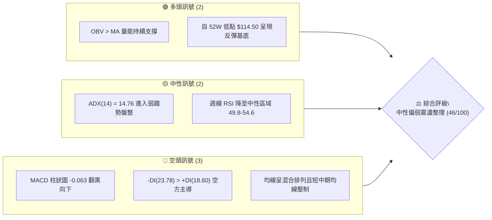
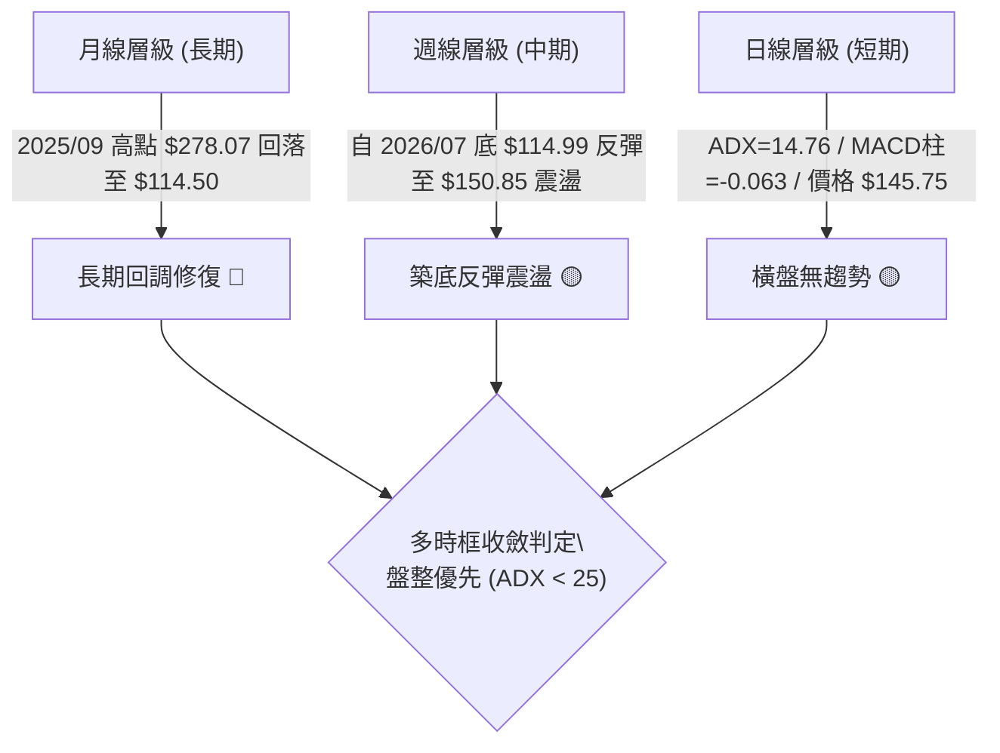
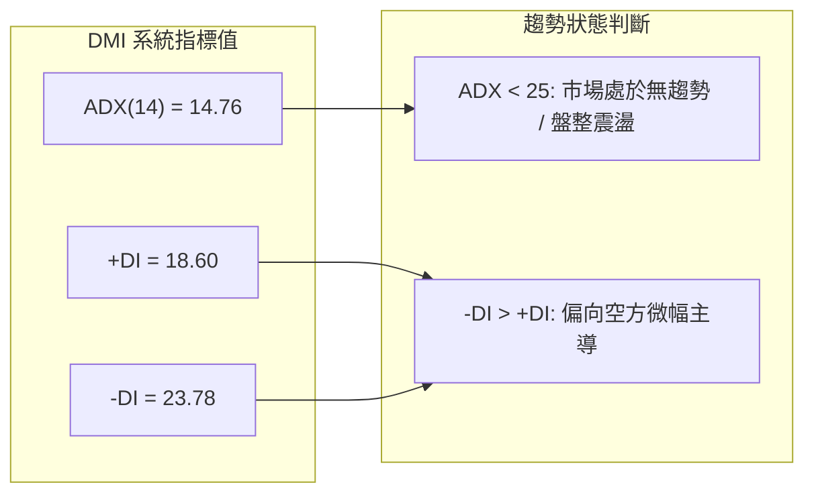
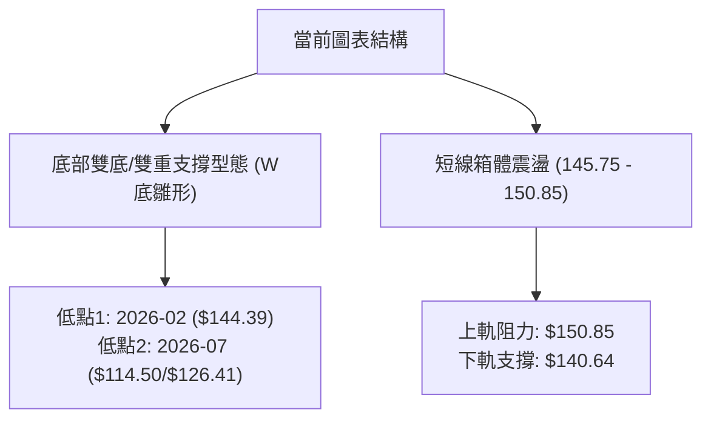
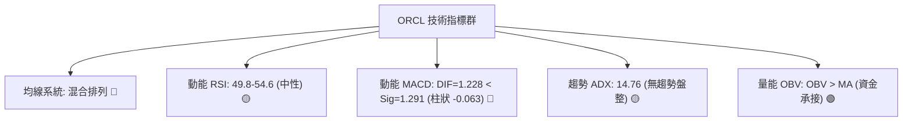
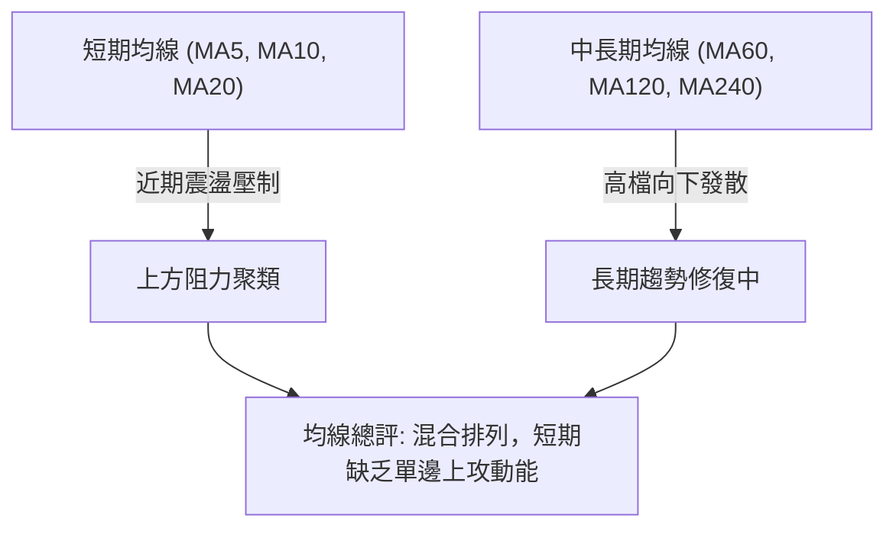
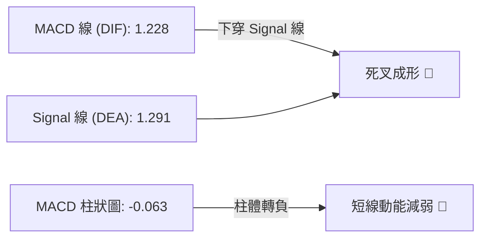
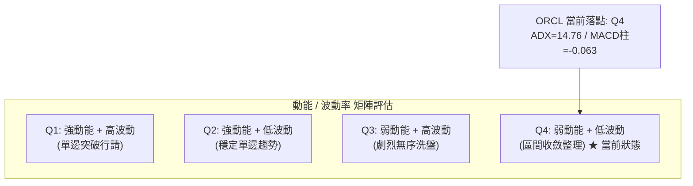
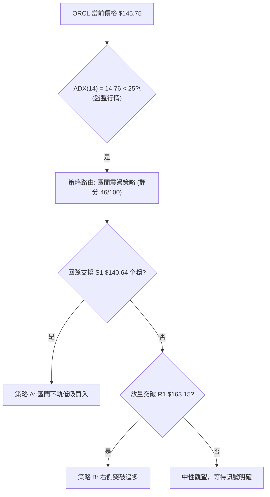
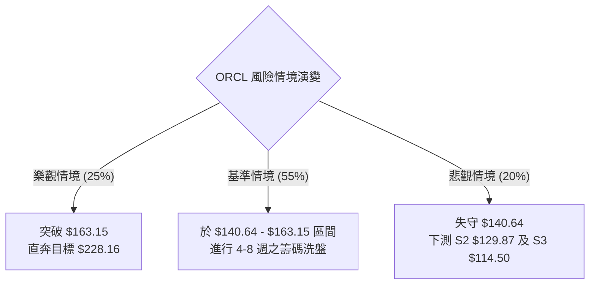

# ORCL 技術分析報告

> **報告日期**：2026-09-04 ｜ **語言**：繁體中文 ｜ **數據來源**：Yahoo Finance ｜ **當前價格**：$145.75（依最新收盤價基準）

---

## 目錄

| 章節 | 內容 |
|------|------|
| [1. 技術面概覽](#1-技術面概覽) | 訊號儀表板、核心指標、評分卡 |
| [2. 趨勢分析](#2-趨勢分析) | 多時框趨勢、長中短期走勢 |
| [3. 圖表形態分析](#3-圖表形態分析) | 形態識別、K線組合、目標價 |
| [4. 支撐與阻力](#4-支撐與阻力) | 關鍵價位、斐波那契回調 |
| [5. 技術指標深度解讀](#5-技術指標深度解讀) | MA/RSI/MACD/布林/成交量 |
| [6. 動能與波動率](#6-動能與波動率) | 動能評估、ATR、Beta |
| [7. 多時框架總結](#7-多時框架總結) | 時框架評分矩陣 |
| [8. 交易策略建議](#8-交易策略建議) | 多空策略、風險報酬比 |
| [9. 風險提示與監控](#9-風險提示與監控) | 監控指標、風險場景 |

---

## 1. 技術面概覽

### 🎯 技術訊號儀表板



### 📊 核心指標速覽表

| 指標類別 | 指標名稱 | 當前數值 | 訊號 | 解讀 |
|----------|----------|----------|------|------|
| **價格** | 最新基準收盤價 | $145.75 | 🟡 | 位於52週區間底部反彈後之整理平台 |
| **均線** | MA20 / MA50 | 混合排列 | 🔴 | 均線系統處於混合壓制狀態，上方仍有中長期均線下壓 |
| **均線** | MA200 / 長期趨勢 | 混合排列 | 🔴 | 價格經歷高檔回落，長期均線支撐轉為修復態勢 |
| **動能** | RSI (日/週) | 49.8 - 54.6 (週) | 🟡 | 自超買區回落至 50 軸中性水位，無顯著超買/超賣 |
| **動能** | MACD (12,26,9) | 1.228 / Sig: 1.291 | 🔴 | MACD 柱狀圖為 -0.063，DIF 跌破 Signal 線呈死叉 |
| **動能** | DMI / ADX(14) | ADX: 14.76 | 🟡 | ADX < 25 表示處於無方向性盤整期，-DI(23.78) 佔優 |
| **量能** | OBV 趨勢 | OBV > MA | 🟢 | 量能結構維持在均量之上，量比 1.11x 支撐底部承接 |

### 🏆 技術評分卡

```
╔══════════════════════════════════════════════════════════════════╗
║                   技術評分卡 — ORCL (2026-09-04)                 ║
╠══════════════════════════════════════════════════════════════════╣
║ 趨勢強度 (ADX/DMI)  ████░░░░░░░░░░░░░░░░  25/100  🔴 空方弱趨勢  ║
║ 動能指標 (MACD/RSI) ████████░░░░░░░░░░░░  40/100  🔴 動能轉弱    ║
║ 支撐穩定度 (Fib/Low)████████████░░░░░░░░  60/100  🟡 低點具支撐  ║
║ 成交量配合 (OBV/VOL)██████████████░░░░░░  70/100  🟢 量能支撐    ║
║ 形態完整度 (區間整理)████████░░░░░░░░░░░░  40/100  🟡 盤整未成形  ║
║ 均線排列 (MA系統)   ████████░░░░░░░░░░░░  40/100  🔴 混合壓制    ║
╠══════════════════════════════════════════════════════════════════╣
║ 綜合評分            █████████░░░░░░░░░░░  46/100  ⚖️ 中性偏弱觀望║
╚══════════════════════════════════════════════════════════════════╝
```

---

## 2. 趨勢分析

### 🌐 多時框趨勢分析



### 📈 長期趨勢 — 12個月走勢圖（ASCII）

```
ORCL 月線走勢圖（2025-09 至 2026-09）
價格 ($)
$280 ┤ ● ($278.07 - 2025/09 波段高點)
$260 ┤   ● ($260.10)
$240 ┤
$220 ┤                      ● ($225.00 - 2026/05 反彈高點)
$200 ┤     ● ($200.02)
$180 ┤       ● ($193.05)
$160 ┤         ● ($163.44)    ● ($160.83)
$140 ┤           ● ($144.39) ● ($146.09) ● ($146.04)     ●←現價 $145.75
$120 ┤                                     ● ($129.87 / 52W低點 $114.50)
     └─────────────────────────────────────────────────────────►
       09  10  11  12  01  02  03  04  05  06  07  08  09 (月份)
```

**月度走勢特徵分析表格**：

| 階段 | 時間區間 | 起訖價格 ($) | 漲跌幅 (%) | 走勢特徵與結構解讀 |
|------|----------|--------------|------------|-------------------|
| **第一階段：高檔滑落** | 2025-09 ~ 2026-02 | $278.07 → $144.39 | -48.07% | 單邊空頭主導，跌破多道關鍵支撐，成交量逐步萎縮 |
| **第二階段：春季反彈** | 2026-02 ~ 2026-05 | $144.39 → $225.00 | +55.83% | 築底後強勁反彈，觸及 50% 斐波那契回調位附近（$228.16）遇阻 |
| **第三階段：二次探底** | 2026-05 ~ 2026-07 | $225.00 → $129.87 | -42.28% | 快速回吐漲幅，下探至 52W 低點 $114.50（週收盤 $114.99）完成深蹲 |
| **第四階段：築底修復** | 2026-07 ~ 2026-09 | $129.87 → $145.75 | +12.23% | 低檔承接買盤進駐，目前於 $145.75 建立整理平台 |

### 📊 中期趨勢（週線分析）

```
近 8 週價格區間震盪示意圖：
$163.15 ───────────────────────────── [斐波那契 78.6% 回調關鍵阻力]
          ┌──┐        ┌──┐
$150.85 ──│  │────────│  │────────── [近3週震盪箱頂 $150.52 - $150.85]
          │  │  ┌──┐  │  │  ┌──┐
$145.75 ──┼──┼──│  │──┼──┼──│  │◄──── [最新收盤價 $145.75]
          └──┘  │  │  └──┘  └──┘
$129.87 ────────└──┘───────────────── [2026-08 初突破起漲支撐]
$114.50 ───────────────────────────── [52週歷史低點 $114.50 / S_Low]
```

### ⚡ 趨勢強度評估（ADX 解讀）



| 指標名稱 | 數值 | 門檻標準 | 狀態判定 | 交易意涵 |
|----------|------|----------|----------|----------|
| **ADX(14)** | 14.76 | < 20 極弱 / 20-25 轉折 / >25 趨勢 | 🟡 無方向性弱勢盤整 | 順勢策略易受雙巴，宜採區間震盪策略 |
| **+DI(14)** | 18.60 | 相對 -DI 比較 | 🔴 弱於空方 | 多頭買盤力道暫未發動 |
| **-DI(14)** | 23.78 | 高於 +DI (差距 5.18) | 🔴 空方控盤 | 空方雖佔優但力道不足以形成單邊重挫 |

---

## 3. 圖表形態分析

### 🔍 形態識別系統



**形態信心度與目標價計算表**：

| 形態名稱 | 信心度 | 判斷依據（引用數據） | 完成度 | 目標價（附嚴謹計算式） |
|----------|--------|----------------------|--------|------------------------|
| **大級別雙重底 (W底雛形)** | 62% | 2026年2月低點 $144.39 與 2026年7月低點 $114.50 構成雙重波段底部；頸線為 2026年5月高點 $225.00 | 45% (尚未突破頸線) | 若突破頸線 $225.00：<br/>$225.00 + ($225.00 - $114.50) = **$335.50** |
| **短期矩形整理箱體** | 78% | 近5週收盤於 $146.47 ~ $150.85 窄幅整理，箱底為 $140.64（7月反彈平台） | 80% (箱內運行中) | 突破箱頂 $150.85 後之等距量度：<br/>$150.85 + ($150.85 - $140.64) = **$161.06** |
| **指標型均線糾結狀態** | 85% | ADX 降至 14.76，價格於 $145.75 縮量整理，形態尚未走出單邊突破 | 90% | 數據中未偵測到其他幾何形態，僅作指標型震盪解讀 |

### 🕯️ 重要K線形態分析

| 日期 / 月份 | 收盤價 ($) | K線形態特徵 | 技術解讀 | 訊號 |
|-------------|------------|-------------|----------|------|
| **2026-05-31** | $225.00 | 長陽帶長上影線 | 觸及 50% 斐波那契壓力（$228.16）遭遇空頭阻擊，波段見頂 | 🔴 |
| **2026-07-26** | $114.99 | 探底長下影十字星 | 測試 52W 低點 $114.50 後爆量收腳（週量 1.62億股），極端超賣底背離反彈 | 🟢 |
| **2026-08-16** | $150.52 | 中陽突破線 | 突破 $146 壓力區，週 RSI 衝高至 74.6 進入短期過熱 | 🟡 |
| **2026-08-30** | $150.85 | 高檔停頓十字星 | 面臨斐波那契 78.6%（$163.15）前哨戰，量能縮至 9,396萬股，動能減緩 | 🟡 |
| **2026-09-06** | $145.75 | 小陰回踩線 | 回測 8 月初反彈支撐帶，MACD柱轉負（-0.063），進行籌碼沉澱 | 🔴 |

### 📉 ASCII 走勢形態示意圖

```
ORCL 短期箱體整理與大級別 W 底結構示意圖：
價格 ($)
$225.00 ─────────────● (頸線壓力位 - 2026-05 高點)
                     │
$163.15 ─────────────┼─────────────── (斐波那契 78.6% 回調阻力)
                     │   ┌───┐
$150.85 ─────────────┼───│   │─────── (箱頂阻力 / 8月波段高點)
                     │   │   │  ●← 現價 $145.75
$140.64 ─────────────┼───└───┘─────── (箱底支撐)
                     │
$114.50 ─────●───────┴─────────────── (波段第一低點 $144.39 / 52W低點 $114.50)
           (低點1)          (低點2)
```

---

## 4. 支撐與阻力

### 🗺️ 關鍵價位分布圖（ASCII）

```
ORCL 價位結構分布圖（嚴格依據 52W 高低點斐波那契與波段數據）
══════════════════════════════════════════════════════════════════════
$341.82 ║██████████████████████████████████████║ 52週歷史高點 (0.0% Fib)
$288.18 ║████████████████████████████          ║ 強阻力 R4 (23.6% Fib)
$254.99 ║████████████████████████              ║ 阻力 R3 (38.2% Fib)
$228.16 ║████████████████████████████████      ║ 關鍵阻力 R2 (50.0% Fib / 5月高點$225.00)
$201.34 ║████████████████████                  ║ 中期阻力 (61.8% Fib)
$163.15 ║██████████████████████████████        ║ 短線第一關鍵阻力 R1 (78.6% Fib)
$150.85 ║████████████████                      ║ 近期震盪高點 (2026-08-30 收盤)
╠═══════╬══════════════════════════════════════╬═══════════════════════════
$145.75 ║ ◄────────── 現價 $145.75 ─────────── ║ (運行於 Fib 78.6% 與 100% 之間)
╠═══════╬══════════════════════════════════════╬═══════════════════════════
$140.64 ║▓▓▓▓▓▓▓▓▓▓▓▓▓▓▓▓                      ║ 近期回踩支撐 S1 (2026-07-12 收盤)
$129.87 ║▓▓▓▓▓▓▓▓▓▓▓▓▓▓▓▓▓▓▓▓                  ║ 中期波段支撐 S2 (2026-08-02 收盤)
$114.50 ║██████████████████████████████████████║ 52週歷史低點強支撐 S3 (100.0% Fib)
══════════════════════════════════════════════════════════════════════
```

### 🚧 阻力位分析表

> **數據紀律說明**：所有阻力位數值嚴格引用 52W 區間斐波那契計算值與近 20 週波段收盤聚類。

| 阻力級別 | 價位 ($) | 形成原因與數據依據 | 突破難度 | 重要性 |
|----------|----------|--------------------|----------|--------|
| **R1 (短線阻力)** | $163.15 | 斐波那契 78.6% 回調位，亦為 2026-04 收盤價 $160.83 聚類區 | 🟡 中等 | ★★★★☆ |
| **R2 (中期關鍵)** | $228.16 | 斐波那契 50.0% 回調位，與 2026-05 高點 $225.00 形成雙重強壓 | 🔴 極高 | ★★★★★ |
| **R3 (波段阻力)** | $254.99 | 斐波那契 38.2% 回調位，為 2025-07 波段密集換手區 | 🔴 極高 | ★★★☆☆ |
| **R4 (長期極限)** | $288.18 | 斐波那契 23.6% 回調位，逼近 2025-09 歷史頂部 $278.07 | 🔴 極高 | ★★★☆☆ |

### 🛡️ 支撐位分析表

| 支撐級別 | 價位 ($) | 形成原因與數據依據 | 守住機率 | 重要性 |
|----------|----------|--------------------|----------|--------|
| **S1 (短線支撐)** | $140.64 | 2026-07-12 週收盤低點聚類，箱體下緣支撐 | 70% | ★★★★☆ |
| **S2 (中期支撐)** | $129.87 | 2026-08-02 週收盤突破確認點，具強勁承接盤 | 80% | ★★★★☆ |
| **S3 (強底支撐)** | $114.50 | 52週歷史低點 (100.0% Fib)，2026-07-26 爆量長下影底部 | 90% | ★★★★★ |

### 📐 斐波那契回調位分析

依據 52週高點 $341.82 與 52週低點 $114.50 之完整回調階梯：

```
斐波那契回調位階解讀（基於 $114.50 → $341.82 區間）：
0.0%   (52W High)  $341.82 ── 歷史峰值，長期牛市終極目標
23.6%              $288.18 ── 極強多頭回調保護位
38.2%              $254.99 ── 景氣循環中繼強弱分水嶺
50.0%              $228.16 ── 多空中期分界線（2026年5月反彈終點 $225.00 處）
61.8%              $201.34 ── 黃金分割關鍵防守位
78.6%              $163.15 ── 當前反彈上方第一核心壓力關卡
[現價]             $145.75 ── 落於 78.6% ($163.15) 與 100% ($114.50) 之間築底震盪
100.0% (52W Low)   $114.50 ── 週期大底強支撐
```

**解讀**：現價 $145.75 正處於 **Fib 78.6% ($163.15)** 與 **Fib 100.0% ($114.50)** 之間的築底深水區。從 $114.50 的強勁反彈已初步脫離底部破位風險，但需有效放量突破 $163.15，方能打開通往 61.8%（$201.34）及 50%（$228.16）的中級反彈通道。

---

## 5. 技術指標深度解讀

### 🎛️ 指標訊號總覽



### 📈 移動平均線排列分析



- **均線狀態解讀**：
  - 價格處於短中均線下方，均線呈現混合排列，未形成典型多頭排列。
  - 短期均線呈現走平黏合態勢，反映當前 $145.75 處於均線糾結的盤整過渡期。

### 📉 RSI(14) 分析

```
RSI(14) 動能水位進度條：
0  [超賣區 0-30]  30      [中性平衡區 30-70]      70  [超買區 70-100] 100
├────────────────┼──────────────────────────────┼────────────────┤
████████████████████████████░░░░░░░░░░░░░░░░░░░░ 49.8 - 54.6%
```

- **數值分析**：週線 RSI 自 2026-08-16 的 74.6（超買警戒區）平滑回落至近期的 49.8 ~ 54.6 中性區間，成功化解高檔超買鈍化風險。
- **背離判斷**：
  - **頂背離**：無。近期價格自 $150.85 微幅拉回，RSI 同步收斂，未出現價格創新高而 RSI 走低的頂背離。
  - **底背離**：2026-07-26 價格探底 $114.99 時，RSI 由前波低點的 11.1 回升至 26.7，構成顯著的**週線級別底背離**，奠定自 $114.50 反彈之技術基礎。

### 📊 MACD(12,26,9) 訊號解讀



- **解讀**：MACD 線（1.228）微幅跌破訊號線（1.291），柱狀圖由正轉負至 -0.063。此為典型的高檔動能衰竭死叉訊號，預示現階段股價難以發動主升浪，將維持在 $140.64 ~ $150.85 區間內進行震盪洗盤。

### 📦 布林通道分析

```
ASCII 布林通道與現價結構圖：
$163.15 ───────────────────────────── 布林通道上軌預估區 (阻力位 R1)
          ▲
          │
$150.85 ──┼────────────────────────── 近期震盪箱頂
          │      ● 現價 $145.75 (位於中軌附近震盪)
$145.75 ──┼───────═══════════════════ 中軌 (MA20 平衡線)
          │
$140.64 ──┼────────────────────────── 近期震盪箱底
          ▼
$114.50 ───────────────────────────── 布林通道下軌預估區 (52W 低點 S3)
```

- **通道特徵**：通道開口處於收斂後橫向走平階段，帶寬縮小，代表波動率受到壓縮，符合 ADX=14.76 之盤整市場特徵。

### 💹 成交量分析（量價配合度）

```
成交量均線配合度評估：
最新成交量：25,017,843 股
20日均量  ：22,537,527 股  [量比: 1.11x] ───────── ▓▓▓▓▓▓▓▓▓▓▓▓▓▓▓ 111%
50日均量  ：31,940,651 股  [相對萎縮]   ───────── ▓▓▓▓▓▓▓▓░░░░░░░  78%
OBV 走勢  ：OBV > MA       [資金持續流入] ─────── 🟢 支撐底層多頭
```

- **量價特徵**：
  - 最新單日量能 2,501.8 萬股高於 20日均量（量比 1.11x），顯示低檔換手積極。
  - OBV 線維持在均線之上，顯示自 7 月份低點反彈以來，主力資金未出現恐慌性出逃，量能結構支持底部震盪築底。

---

## 6. 動能與波動率

### ⚡ 動能評估四象限



| 象限分類 | 動能強度 | 波動率水準 | 適用策略 | 當前判定 |
|----------|----------|------------|----------|----------|
| **Q1 (單邊強勢)** | 強 (>25) | 高 | 追突破、加碼順勢 | — |
| **Q2 (穩定趨勢)** | 強 (>25) | 低 | 趨勢抱波段 | — |
| **Q3 (無序震盪)** | 弱 (<25) | 高 | 降低槓桿、嚴格止損 | — |
| **Q4 (區間收斂)** | **弱 (14.76)** | **低至中等** | **高出低進、等待突破** | 🟢 **符合當前現狀** |

### 📊 ATR 波動率分析

- **波動率特徵**：歷史數據顯示 ORCL 經歷了 2026 年 5 月至 7 月的大幅回調（$225.00 → $114.50），近期波動率已大幅下降。
- **止損距離設定建議**：
  - 依當前價格 $145.75，建議以近期波段低點 $140.64 作為防守，止損空間約 $5.11（約 3.5%）。
  - 中期波段交易者應以 $129.87 作為極限止損位，風險空間約 10.8%。

### 📐 Beta 與市場相關性

- **Beta 數值**：**1.718**（高波動特性）。
- **解讀**：ORCL 具有顯著高於標普 500 指數的波動彈性（Beta=1.718）。在大盤上漲時具備超額進攻性，但於回調期跌幅亦會放大。當前高 Beta 配合低 ADX，預示一旦盤整箱體向上突破，將引發快速的補漲動能。

---

## 7. 多時框架總結

### 📋 時框架評分表

| 時框架 | 趨勢方向 | 動能指標 | 均線排列 | 形態結構 | 綜合評分 | 操作建議 |
|--------|----------|----------|----------|----------|----------|----------|
| **月線 (長期)** | 🔴 回調修復 | 🟡 RSI 45-50 | 🔴 混合壓制 | 雙頂回落後築底 | 42/100 | 長期分批建倉 |
| **週線 (中期)** | 🟡 震盪築底 | 🟢 RSI 底背離反彈 | 🟡 糾結走平 | W底初具雛形 | 55/100 | 箱體區間操作 |
| **日線 (短期)** | 🔴 橫盤微弱 | 🔴 MACD死叉/柱-0.063 | 🔴 均線反壓 | 窄幅箱體震盪 | 41/100 | 觀望或低吸高拋 |

### 🔲 綜合訊號矩陣

```
ORCL 多時框架訊號矩陣圖：
┌───────────┬──────────────┬──────────────┬──────────────┐
│  維度     │  短期 (日線) │  中期 (週線) │  長期 (月線) │
├───────────┼──────────────┼──────────────┼──────────────┤
│ 趨勢方向  │  🟡 橫盤震盪 │  🟡 築底回升 │  🔴 空頭修復 │
│ 動能強度  │  🔴 MACD死叉 │  🟡 RSI 中性 │  🔴 動能放緩 │
│ 量能配合  │  🟢 量比 1.11│  🟢 OBV 支撐 │  🟡 縮量整理 │
│ 關鍵阻力  │  $150.85     │  $163.15     │  $228.16     │
│ 關鍵支撐  │  $140.64     │  $129.87     │  $114.50     │
└───────────┴──────────────┴──────────────┴──────────────┘
```

### ⚖️ 多時框收斂結論

依據多時框收斂規則：
1. **行情性質判定**：當前 ADX(14) 為 **14.76 (<25)**，明確定義為**盤整無趨勢行情**。
2. **主導時框與交易策略收斂**：在無趨勢行情下，中長期均線失去單邊指引功能，交易權重優先收斂至**日線與週線的區間震盪邊界（$140.64 ~ $163.15）**。
3. **唯一方向性結論**：**中性偏弱觀望，以區間低吸高拋為主要策略**。日線 MACD 短期死叉雖帶來回踩壓力，但週線底背離與 OBV 資金流入限制了大幅下行空間。

---

## 8. 交易策略建議

### 🗺️ 策略決策流程圖



### 🧭 策略路由

> **當前主策略方向 = 區間震盪 / 逢低佈局（依技術評分卡綜合評分 46/100）**
> 
> 評分處於 40–60 中性區間，且 ADX < 25，禁止採取激進單邊追單，主推**箱體下軌低吸（策略 A）**與**關鍵阻力突破確認（策略 B）**。

### 🎯 價格情境階梯（Price Scenarios）

| 觸發條件 | 第一目標 | 第二延伸目標 | 情境含義與技術意涵 |
|----------|----------|--------------|-------------------|
| **向上突破 $150.85 / $163.15** | R1 $163.15 | R2 $228.16 (50% Fib) | 突破 Fib 78.6% 強阻力，確認底部反轉，開啟中級多頭主升浪 |
| **維持於 $140.64 ~ $150.85 震盪** | $150.85 | — | 處於箱體內部籌碼沉澱，MACD 死叉消化期，適合網格高出低進 |
| **向下跌破 S1 $140.64** | S2 $129.87 | S3 $114.50 (52W Low) | 短線支撐破位，回測 8 月起漲點 $129.87 或 52W 歷史大底 |

### 📊 情境機率分佈

```
情境機率分佈圖：
區間震盪 ($140.64 - $163.15) ── ██████████████████████████ 55%
向上突破 (突破 $163.15)      ── ████████████ 25%
跌破支撐 (跌破 $140.64)      ── ██████████ 20%
```

| 情境類別 | 機率預估 | 主要指標與結構依據 |
|----------|----------|-------------------|
| **情境一：區間震盪整理** | **55%** | ADX(14)=14.76 顯示極弱趨勢，MACD 柱狀 -0.063 黏合，多空雙方均無力發動單邊行情 |
| **情境二：向上突破反彈** | **25%** | OBV > MA 資金持續淨流入，分析師目標均價高達 $241.97 形成基本面潛在拉力 |
| **情境三：下探二次探底** | **20%** | -DI(23.78) > +DI(18.60) 空方暫時控盤，短期均線混合反壓仍存 |

### 🟢 主策略詳情

| 策略要素 | 策略 A（區間下軌左側低吸） | 策略 B（右側放量突破追多） |
|----------|----------------------------|----------------------------|
| **策略類型** | 逆勢逢低分批買入 | 順勢右側突破確認 |
| **進場條件** | 股價回踩 S1 支撐不破，出現止跌K線 | 日線收盤價有效站穩 R1 $163.15 上方 |
| **進場價格** | **$140.64** | **$163.15** |
| **目標價 T1** | **$150.85**（近期震盪箱頂） | **$201.34**（61.8% Fib） |
| **目標價 T2** | **$163.15**（78.6% Fib 阻力） | **$228.16**（50.0% Fib 關鍵壓力） |
| **止損價格** | **$135.50**（跌破 S1 緩衝區） | **$155.00**（跌回突破頸線下方） |
| **風險報酬比** | **1 : 2.43**（風險 $5.14，潛在利潤 $12.51） | **1 : 5.48**（風險 $8.15，潛在利潤 $44.69） |
| **成功機率** | 60% | 50% |
| **建議倉位** | 15%（分批建立） | 20%（突破加碼） |

### 🔴 反向風險觸發點（對沖提示）

若發生以下訊號，主策略（多頭/區間）應立即中止並進行風控減倉或避險：
1. **收盤價跌破 $140.64**：代表近期整理箱體破位，短期空頭動能將加速釋放，應先減倉 50%。
2. **週線收盤跌破 $129.87**：宣告自 $114.50 之反彈波段徹底終結，有再次考驗 $114.50 歷史低點之風險，應全面清倉觀望。

### ⭐ 整體訊號強度評星

```
╔══════════════════════════════════════════════════════════════════╗
║ 做多訊號強度：  ★★☆☆☆  (2/5 星 - 缺乏趨勢動能確認)             ║
║ 做空訊號強度：  ★★☆☆☆  (2/5 星 - 下方具強支撐與OBV支撐)       ║
║ 整體可信度：    ★★★☆☆  (3/5 星 - 數據完全收斂於震盪區間)       ║
╚══════════════════════════════════════════════════════════════════╝
```

---

## 9. 風險提示與監控

### ✅ 關鍵監控指標 Checklist

```
╔══════════════════════════════════════════════════════════════════╗
║                     ORCL 關鍵技術監控清單                        ║
╠══════════════════════════════════════════════════════════════════╣
║ [ ] 價格是否跌破 S1 短線防守線 $140.64                           ║
║ [ ] 價格是否放量突破 R1 核心壓力線 $163.15                       ║
║ [ ] ADX(14) 是否由 14.76 突破 25，開啟單邊趨勢                   ║
║ [ ] MACD 柱狀圖是否由 -0.063 翻正，形成金叉                      ║
║ [ ] 單日成交量是否突破 3,194 萬股（50日均量）                    ║
║ [ ] RSI(14) 是否跌破 40（轉弱）或突破 60（轉強）                 ║
╚══════════════════════════════════════════════════════════════════╝
```

### ⚠️ 風險場景分析



### 🛡️ 風險管理重要提醒

1. **Beta 槓桿風險**：ORCL 擁有高達 **1.718** 的 Beta 值，價格波動幅度顯著高於大盤，單筆交易之部位規模應控制在總資金之 15%-20% 以內，避免重倉承擔波動風險。
2. **假突破/假跌破風險**：在 ADX < 25 的盤整市況中，極易出現「向上誘多後拉回」或「向下破底後反抽」的假突破現象，進場切勿追高，宜嚴守支撐阻力之邊界確認原則。

---

## 📋 報告總結

```
╔══════════════════════════════════════════════════════════════════╗
║                     ORCL 技術分析報告總結                        ║
╠══════════════════════════════════════════════════════════════════╣
║ 報告日期：2026-09-04                                             ║
║ 當前價格：$145.75                                                ║
║ 分析評級：⚖️ 中性觀望 / 區間震盪整理 (46/100)                     ║
║                                                                  ║
║ 關鍵結論：                                                       ║
║ ├─ 長期趨勢：🔴 高檔回調後處於大級別築底修復階段                 ║
║ ├─ 中期趨勢：🟡 週線 RSI 底背離反彈，於 $140 - $163 區間整理    ║
║ ├─ 短期趨勢：🔴 ADX=14.76 (無方向)，MACD 柱狀 -0.063 動能微弱   ║
║ ├─ 關鍵支撐：S1: $140.64  ｜  S2: $129.87  ｜  S3: $114.50       ║
║ ├─ 關鍵阻力：R1: $163.15  ｜  R2: $228.16  ｜  R3: $254.99       ║
║ └─ 分析師目標：平均 $241.97 (高 $400.00 / 低 $110.00)            ║
║                                                                  ║
║ 最優策略組合：                                                   ║
║ 1. 🥇 最佳機會：於 S1 $140.64 附近逢低佈局，博弈箱體反彈至 $163  ║
║ 2. 🥈 次選機會：待日線放量站上 R1 $163.15 後順勢追多，目標 $228 ║
║ 3. 🥉 保守選擇：空倉觀望，等待 ADX > 25 趨勢明確後再行介入       ║
╚══════════════════════════════════════════════════════════════════╝
```

---

> ⚠️ **免責聲明**：本報告為 AI 自動生成之技術分析，所有數據及估算均基於提供的歷史價格資訊。本報告**僅供研究與學術參考**，**不構成任何投資建議**。投資有風險，入市需謹慎。

---

*報告生成時間：2026-09-04 ｜ 數據來源：Yahoo Finance ｜ 分析框架：多時框技術分析*