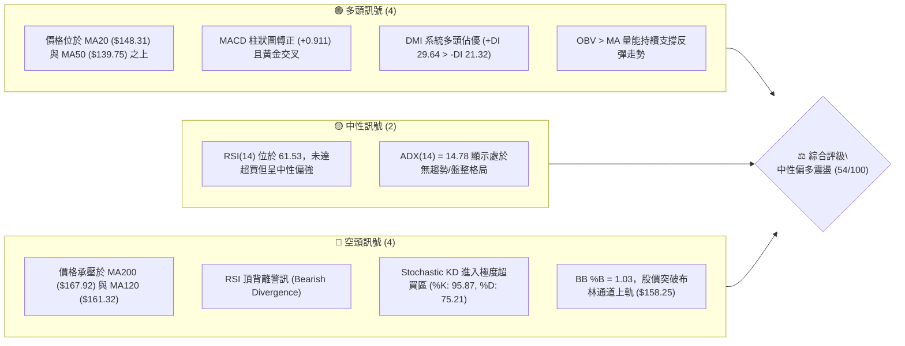
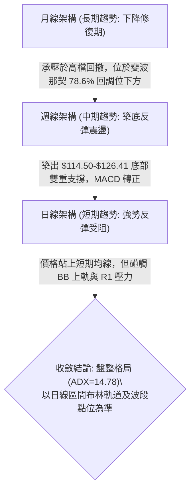
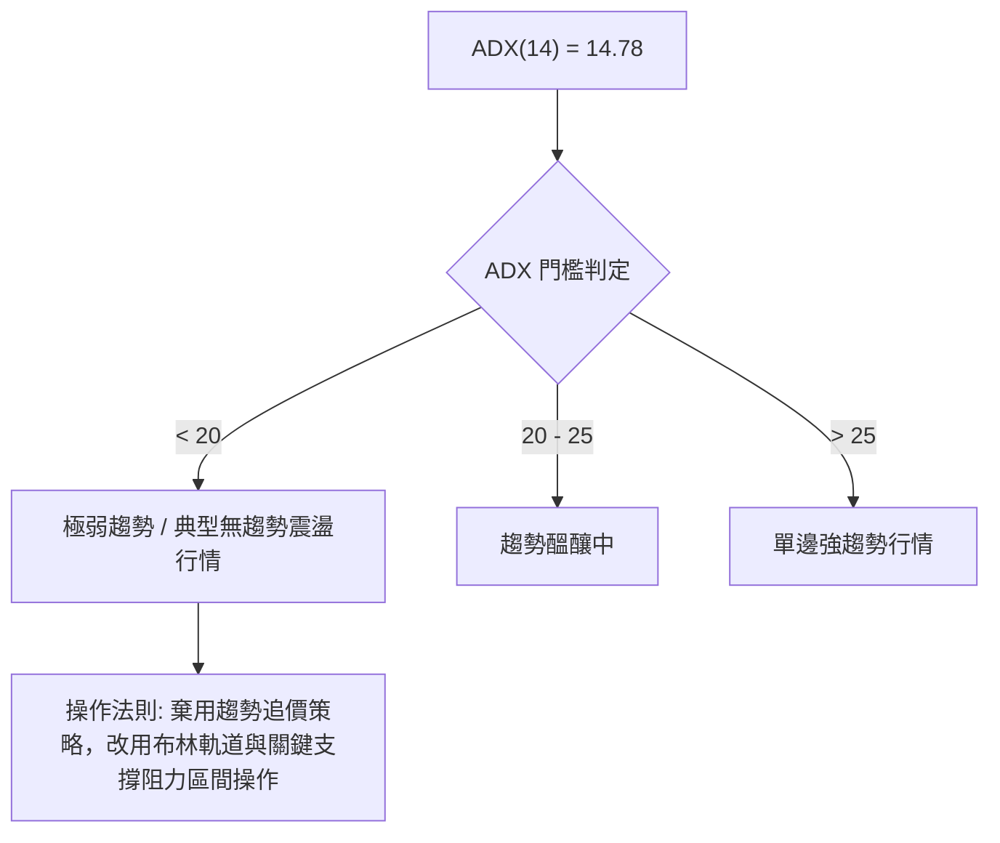
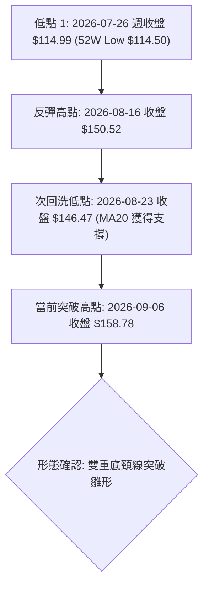
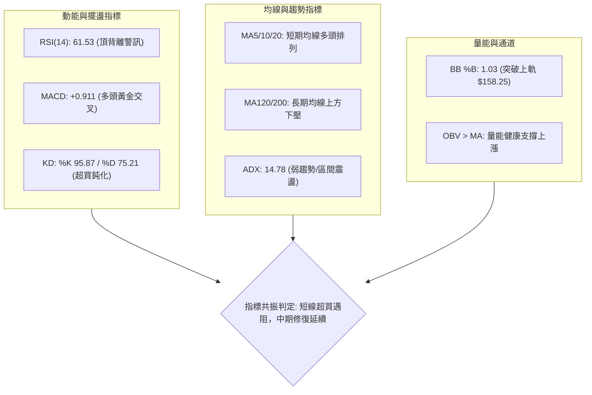
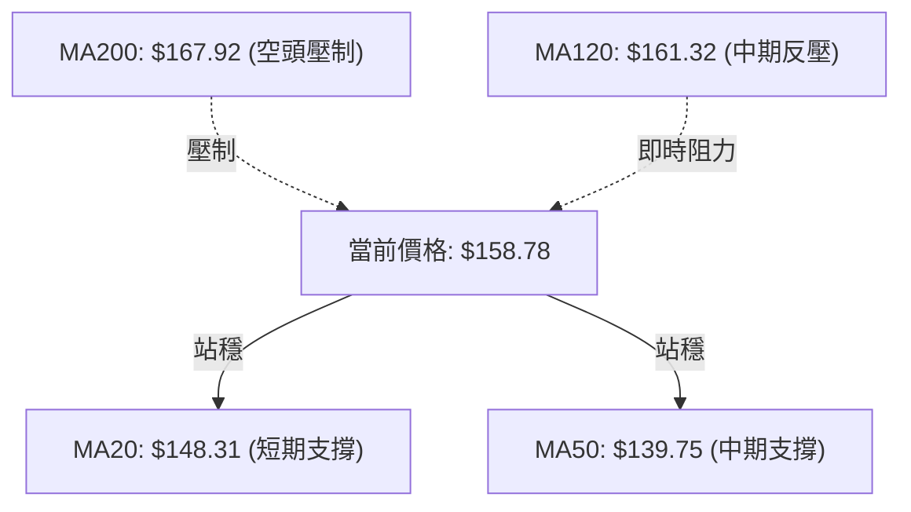
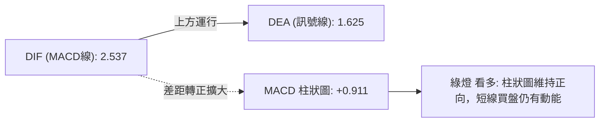
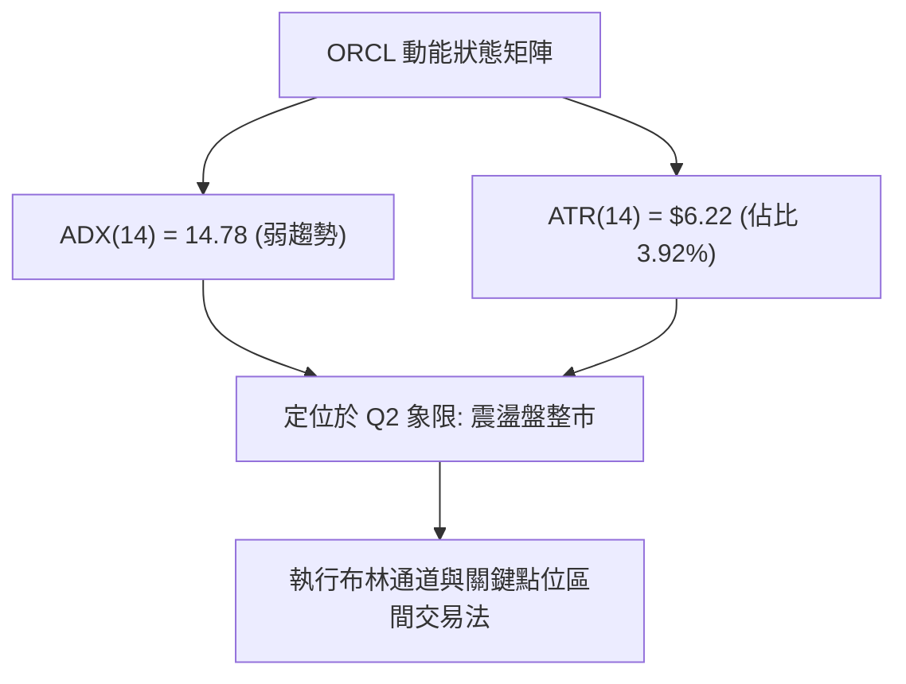
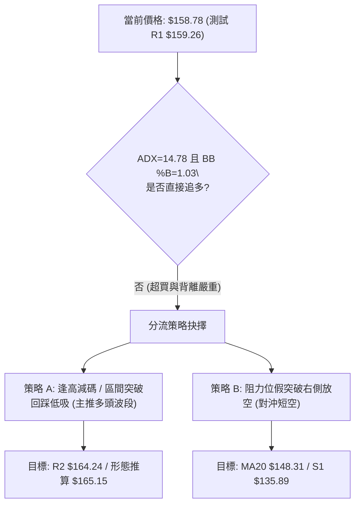
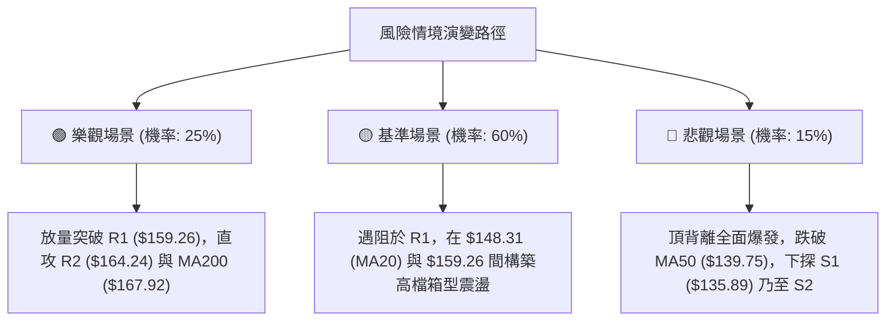

# ORCL 技術分析報告

> **報告日期**：2026-09-05 ｜ **語言**：繁體中文 ｜ **數據來源**：Yahoo Finance ｜ **當前價格**：$158.78

---

## 目錄

| 章節 | 內容 |
|------|------|
| [1. 技術面概覽](#1-技術面概覽) | 訊號儀表板、核心指標、評分卡 |
| [2. 趨勢分析](#2-趨勢分析) | 多時框趨勢、長中短期走勢 |
| [3. 圖表形態分析](#3-圖表形態分析) | 形態識別、K線組合、目標價 |
| [4. 支撐與阻力](#4-支撐與阻力) | 關鍵價位、斐波那契回調 |
| [5. 技術指標深度解讀](#5-技術指標深度解讀) | MA/RSI/MACD/布林/成交量 |
| [6. 動能與波動率](#6-動能與波動率) | 動能評估、ATR、Beta |
| [7. 多時框架總結](#7-多時框架總結) | 時框架評分矩陣 |
| [8. 交易策略建議](#8-交易策略建議) | 多空策略、風險報酬比 |
| [9. 風險提示與監控](#9-風險提示與監控) | 監控指標、風險場景 |
| [📋 報告總結](#-報告總結) | 核心總結儀表板 |

---

## 1. 技術面概覽

### 🎯 技術訊號儀表板



### 📊 核心指標速覽表

| 指標類別 | 指標名稱 | 當前數值 | 訊號 | 解讀 |
|----------|----------|----------|------|------|
| **價格** | 當前價格 | $158.78 | 🟡 | 位於52週區間 19.5% 處，脫離低檔但尚未擺脫大底區間 |
| **均線** | MA20 | $148.31 | 🟢 | 價格在MA20之上 (+7.06%)，短中期多頭支撐確立 |
| **均線** | MA50 | $139.75 | 🟢 | 價格在MA50之上 (+13.62%)，中期底部抬高確立 |
| **均線** | MA200 | $167.92 | 🔴 | 價格在MA200下方 (-5.44%)，長期均線下彎形成沉重壓力 |
| **動能** | RSI(14) | 61.53 | 🟡 | 位於中性偏強區間，但數據顯示存在頂背離風險警訊 |
| **動能** | MACD | 2.537 / 1.625 | 🟢 | MACD線高於訊號線，柱狀圖 +0.911 擴張，多頭掌控短線節奏 |
| **動能** | KD(Stoch) | 95.87 / 75.21 | 🔴 | KD極度鈍化超買，短線有隨時拉回整理或技術性修正可能 |
| **波動** | ATR(14) | $6.22 | 🟡 | 佔股價 3.92%，每日波幅適中，具備操作空間但需防短沖風險 |
| **趨勢** | ADX(14) | 14.78 | 🟡 | ADX < 25 表明為弱趨勢或盤整震盪市場，非單邊趨勢行情 |
| **通道** | BB %B | 1.03 | 🔴 | 價格略高於布林上軌 ($158.25)，短線面臨軌道回踩收斂要求 |

### 🏆 技術評分卡

```
╔══════════════════════════════════════════════════════════════╗
║                技術評分卡 — ORCL (2026-09-05)                ║
╠══════════════════════════════════════════════════════════════╣
║ 趨勢強度 (ADX=14.78)     ██████░░░░░░░░░░░░░░  32/100 🔴 弱勢盤整 ║
║ 短期動能 (MACD/KD)       ██████████████░░░░░░  68/100 🟢 多方佔優 ║
║ 支撐穩定度 (S1=$135.89)  ████████████░░░░░░░░  62/100 🟢 底部墊高 ║
║ 成交量配合 (OBV>MA)      ████████████░░░░░░░░  64/100 🟢 量能回升 ║
║ 形態完整度 (雙底初成)    ██████████░░░░░░░░░░  52/100 🟡 頸線待破 ║
║ 均線系統 (多空混合)      ████████░░░░░░░░░░░░  45/100 🟡 長壓短多 ║
╠══════════════════════════════════════════════════════════════╣
║ 綜合技術評分             ███████████░░░░░░░░░  54/100 ⚖️ 中性觀望 ║
╚══════════════════════════════════════════════════════════════╝
```

---

## 2. 趨勢分析

### 🌐 多時框趨勢分析



### 📈 長期趨勢 — 12個月走勢圖（Unicode）

```
ORCL 月線走勢圖（過去12個月：2025-09 至 2026-09）
價格軸 ($)
$280 ┤ ● (2025-09 $278.07 波段頂點)
$260 ┤   ●
$240 ┤
$220 ┤                             ● (2026-05 $225.00 反彈高點)
$200 ┤       ●
$180 ┤           ●
$160 ┤               ●         ●       ●←現價 $158.78 (2026-09)
$140 ┤                   ●   ●       ●   ●
$120 ┤                                 ● (2026-07 $129.87 / 52W低點$114.50)
     └─┬───┬───┬───┬───┬───┬───┬───┬───┬───┬───┬───┬───
      09  10  11  12  01  02  03  04  05  06  07  08  09  (月份)
```

**走勢特徵分析表格**：

| 階段區間 | 時間跨度 | 起訖收盤價 | 漲跌幅 | 走勢結構與形態特徵 |
|----------|----------|------------|--------|-------------------|
| **頭部殺跌段** | 2025-09 至 2026-02 | $278.07 → $144.39 | -48.07% | 跌破各均線支撐，呈現連環破底空頭排列 |
| **超跌初反彈** | 2026-02 至 2026-05 | $144.39 → $225.00 | +55.83% | 築出中級反彈波，衝高至 $225.00 後快速遭遇獲利了結賣壓 |
| **二次探底段** | 2026-05 至 2026-07 | $225.00 → $129.87 | -42.28% | 快速洗盤回吐，於 2026-07 探至 $129.87 (週線觸及52W低點 $114.50) |
| **打底回升段** | 2026-07 至 2026-09 | $129.87 → $158.78 | +22.26% | 震盪抬底反彈，連收兩根月陽線，逐步修復至當前位置 |

### 📊 中期趨勢（週線分析）

中期走勢呈現「深幅回洗後的雙重底雛形反彈」。2026年7月最後一週收在 $114.99 附近，成功測試了 52週低點 $114.50 的強支撐。隨後連續6週展開修復行情，週線 MACD 柱狀圖由連串負值（最低 -6.743）翻正至 +0.911，RSI 亦自極度超賣區（最低 11.1）回升至 61.5。然而，上方受到 78.6% 斐波那契回調位 $163.15 以及近一年波段壓力密集帶壓制。

```
近期週線壓力與支撐示意圖：
$170.57 ────────────────────────────── R3 強阻力（近一年高點密集區）
$164.24 ────────────────────────────── R2 波段阻力 / MA200 ($167.92)
$159.26 ══════════════════════════════ R1 當前第一道測試壓力
$158.78 ◄─── 當前價格
$135.89 ------------------------------ S1 波段支撐 / MA50 ($139.75)
$114.50 ══════════════════════════════ S2 年度絕對鐵底支撐
```

### ⚡ 趨勢強度評估（ADX 解讀）



| 指標變數 | 數值 | 狀態 | 交易指導原則 |
|----------|------|------|--------------|
| **ADX(14)** | 14.78 | 弱趨勢/盤整 | 絕對不可在阻力位盲目追多，市場缺乏持續單邊推升能量 |
| **+DI(14)** | 29.64 | 多方主導 | 買方在近14根K線內部佔據主控權，支撐拉回承接意願 |
| **-DI(14)** | 21.32 | 空方受抑 | 空頭拋壓正在退潮，短線不易出現無預警破底崩跌 |
| **總結定性** | +DI > -DI 且 ADX<25 | 震盪偏多 | 當前屬於「缺乏強動能支撐的區間震盪反彈」，遇阻極易回檔 |

---

## 3. 圖表形態分析

### 🔍 形態識別系統



**形態信心度評估表**：

| 形態 | 信心度 | 判斷依據（引用數據） | 完成度 | 目標價（附計算式） |
|------|--------|----------------------|--------|--------------------|
| **雙重底雛形 (W-Bottom)** | 62% | 左底為年度低點 $114.50，右底為拉回測試之波段低點 $135.89 / $146.47，當前股價突破前小頸線 $150.52 | 75% | 頸線 $150.52 + 形態高度 ($150.52 - $135.89 = $14.63) = **$165.15** (接近 R2 $164.24) |
| **上升通道震盪** | 55% | 沿 MA20 ($148.31) 向上推升，但受壓於 BB 上軌 ($158.25) | 60% | 通道上緣測試 **R2 $164.24** |
| **頭肩底形態** | 30% | 數據不足以確認完整右肩結構，左肩時間週期不對稱 | 20% | 訊號不足，僅做指標型解讀 |

### 🕯️ 重要K線形態分析

| 週/月份 | 收盤價 | K線形態 | 解讀 | 訊號 |
|---------|--------|---------|------|------|
| **2026-07-26 週** | $114.99 | 長下影鐵底鎚頭線 | 伴隨 1.62 億股成交量，測試年度低位後爆發強勁承接盤 | 🟢 強烈見底 |
| **2026-08-09 週** | $147.02 | 帶量突破長陽線 | RSI 自極低檔彈升至 71.8，MACD 柱狀圖飆升至 +4.827，反轉確立 | 🟢 多頭表態 |
| **2026-08-23 週** | $146.47 | 量縮十字星回踩 | 量能縮至 1.01 億股，成功守住 MA20，完成洗盤回測確認 | 🟢 支撐有效 |
| **2026-09-06 週** | $158.78 | 上影小陽線 | 碰觸 BB 上軌 ($158.25) 與 R1 ($159.26)，上檔出現拋壓阻滯 | 🟡 阻力顯現 |

### 📉 ASCII 走勢形態示意圖

```
ORCL 近期 W 底反彈形態走勢示意圖
價位
$165.00 ┤                                                 [目標價: $165.15]
$159.26 ┤- - - - - - - - - - - - - - - - - - - - - - - - - - - ┬── R1 阻力位
$158.78 ┤                                              ▲現價 $158.78
$150.52 ┤                       ┌───● (中間高點頸線)   │
$146.47 ┤                       │            └───● (右底高墊)
$135.89 ┤- - - - - - - - - - - -│- - - - - - - - - - - - - - - ┴── S1 支撐位
$126.41 ┤          ● (次低點)   │
$114.50 ┤────● (左底/52W低點)───┘
        └────┴─────────┴────────┴─────────────┴────────┴─────
            07-19     07-26    08-16         08-23    09-05
```

### 🎯 形態目標價計算

根據雙底形態推算：
- 形態基準低點採用波段支撐聚類點：$135.89
- 形態頸線高點採用 2026-08-16 週收盤高點：$150.52
- 垂直量幅高度：$150.52 - $135.89 = **$14.63**
- 向上投影目標價：$150.52 + $14.63 = **$165.15**
- 該理論計算價與已知關鍵阻力 **R2 ($164.24)** 僅差 $0.91，與斐波那契 78.6% 回調位 **$163.15** 形成強烈共振。

---

## 4. 支撐與阻力

### 🗺️ 關鍵價位分布圖（Unicode）

```
ORCL 價位結構分布圖（OHLCV 波段聚類計算與斐波那契點位）
══════════════════════════════════════════════════════════════════════
$170.57 ║████████████████████████████████████████║ R3 強阻力（近一年密集高點聚類）
$167.92 ║▓▓▓▓▓▓▓▓▓▓▓▓▓▓▓▓▓▓▓▓▓▓▓▓▓▓▓▓            ║ MA200 長期均線重壓位
$164.24 ║████████████████████████████            ║ R2 波段阻力（波段高點聚類）
$163.15 ║░░░░░░░░░░░░░░░░░░░░░░░░░░░░            ║ 斐波那契 78.6% 回調位
$159.26 ║████████████████████████                ║ R1 關鍵即時阻力 (+0.30%)
$158.78 ╠════════════════════════════════════════╣ ◄ 當前現價 ($158.78)
$148.31 ║▓▓▓▓▓▓▓▓▓▓▓▓▓▓▓▓▓▓▓▓▓▓                  ║ MA20 中軌重要防守線
$139.75 ║▓▓▓▓▓▓▓▓▓▓▓▓▓▓                          ║ MA50 中期生命線
$135.89 ║████████████████████████████            ║ S1 近期關鍵支撐 (-14.41%)
$114.50 ║████████████████████████████████████████║ S2 年度極限鐵底 (-27.89%)
══════════════════════════════════════════════════════════════════════
```

### 🚧 阻力位分析表

| 阻力級別 | 價位 | 形成原因 | 突破難度 | 重要性 |
|----------|------|----------|----------|--------|
| **R1** | **$159.26** | 近一年波段高點聚類位，且緊鄰布林上軌 ($158.25) | 中等 | 🔴 極高（短線多頭突破第一道門檻） |
| **R2** | **$164.24** | 近一年波段高點聚類位，共振斐波那契 78.6% ($163.15) | 困難 | 🔴 極高（中期趨勢扭轉關鍵分水嶺） |
| **R3** | **$170.57** | 近一年波段高點密集套牢區，越過 MA200 之後的強阻力 | 極難 | 🟡 次高（空頭核心防守堡壘） |

### 🛡️ 支撐位分析表

| 支撐級別 | 價位 | 形成原因 | 守住機率 | 重要性 |
|----------|------|----------|----------|--------|
| **S1** | **$135.89** | 近一年波段低點聚類，與 MA50 ($139.75) 形成雙重支撐防線 | 80% | 🟢 極高（中期多頭結構不破壞底線） |
| **S2** | **$114.50** | 52週極限最低點，雙重底左底絕對發起點 | 95% | 🟢 極高（年度多空生死線） |

### 📐 斐波那契回調位分析

依據 52週極端波動區間（高點 **$341.82** 至 低點 **$114.50**，全波段震幅 $227.32）回調計算：

| 比例級別 | 回調價位 | 當前相對位置與技術解讀 |
|----------|----------|------------------------|
| **0.0% (52W High)** | **$341.82** | 歷史峰值，長線強阻力頂點 |
| **23.6%** | **$288.18** | 深度套牢區邊界 |
| **38.2%** | **$254.99** | 中長期籌碼換手重要平台 |
| **50.0%** | **$228.16** | 2026年5月反彈高點 ($225.00) 之共振壓制點 |
| **61.8% (黃金分割)** | **$201.34** | 空頭波段深幅修正警戒線 |
| **78.6%** | **$163.15** | **當前價格直接測試區**。現價 $158.78 位於 78.6% 回調位下方僅 2.75% |
| **100.0% (52W Low)** | **$114.50** | 跌勢 100% 回吐位置，已獲得強力支撐確認 |

**位置解讀**：現價 $158.78 目前處於 100.0% ($114.50) 與 78.6% ($163.15) 之間，屬於「低檔超跌回升階段」。股價若無法有效放量越過 $163.15 (78.6%) 及 R2 ($164.24)，技術結構上仍會被壓制在整個52週大跌浪潮的底部深淵區域。

---

## 5. 技術指標深度解讀

### 🎛️ 指標訊號總覽



### 📈 移動平均線排列分析



| 均線名稱 | 數值 | 偏離現價 | 走勢斜率 | 技術意涵 |
|----------|------|----------|----------|----------|
| **MA 5** | $149.80 | +5.99% | 急速向上 (▲) | 極短線推升力道強，但與現價乖離拉大 |
| **MA 10** | $148.79 | +6.72% | 向上翻揚 (▲) | 短線強勢護航線 |
| **MA 20** | $148.31 | +7.06% | 穩定向上 (▲) | 多頭波段防守關鍵基石 |
| **MA 50** | $139.75 | +13.62% | 拐頭走平 (▲) | 底部漸次墊高，確立中期脫離破底走勢 |
| **MA 120** | $161.32 | -1.57% | 持續向下 (▼) | 半年線反壓，近在咫尺 |
| **MA 200** | $167.92 | -5.44% | 向下走跌 (▼) | 年線牛熊分水嶺，未有效收復前非多頭牛市 |

### 📉 RSI(14) 分析

當前數值：**61.53**
```
RSI(14) 水平位置：
[超賣 0] ─────── [30] ───────────── [50] ─────────●─── [70] ─────── [100 超買]
                                              61.53
進度條: ████████████░░░░░░░░  61.53%
```
- **背離分析**：系統偵測到明確的 **⚠️ 頂背離 (Bearish Divergence)**。
- **詳細判斷**：2026-08-16 週價格為 $150.52 時，週 RSI 達到 74.6 高點；而當前價格推升至 $158.78 創出波段新高時，日線 RSI 僅為 61.53，週 RSI 回落至 61.5。價格創高而指標動能未同步創高，形成動能衰竭式的頂背離，暗示上檔空間受限，隨時存在技術性拉回修正壓力。

### 📊 MACD(12/26/9) 訊號解讀


- MACD 線 (2.537) 成功穿過訊號線 (1.625)，差離值擴大，呈現金叉擴散特徵。
- 柱狀圖數值為 **+0.911**，連續數週在零軸上方維持多頭動能，抵消了部分短期超買的下行風險，支撐股價沿著布林通道上軌爬升。

### 📦 布林通道分析

```
布林通道 (20, 2) 結構圖：
$158.25 ─────── 上軌 ◄─── 現價 $158.78 (突破上軌，%B = 1.03)
                │
$148.31 ─────── 中軌 (MA20)
                │
$138.38 ─────── 下軌
```
- **通道現狀**：當前股價 $158.78 突破布林上軌 $158.25，%B 指標為 **1.03**（超過 1.0 即為通道外擴張）。
- **解讀**：%B > 1.0 顯示多頭短線衝刺力道強勁，但在缺乏 ADX 單邊趨勢配合下（ADX=14.78），突破布林上軌往往意味著「極短線價格過度延伸」，極高機率引發均值回歸，壓回測試通道中軌 $148.31。

### 💹 成交量分析（量價配合度）

- **成交量數據**：最新成交量為 **26,430,100**，20日均量為 **22,719,525**，量比達 **1.16x**，呈現溫和放量。
- **OBV 趨勢**：OBV > MA，量能指標高於其移動平均，確認資金自 2026年7月低點以來持續回流。
- **量價配合評估**：反彈走勢獲得量能背書，暫未出現嚴重的價量背離；但對比 50日均量 (31,734,042)，當前量能仍不足以發動強行突破 MA200 的大型攻擊波，更符合震盪盤堅的洗盤推進格局。

---

## 6. 動能與波動率

### ⚡ 動能評估分析

| 象限區間 | 動能屬性 | 波動特徵 | ORCL 當前狀態定位 | 技術決策評估 |
|----------|----------|----------|-------------------|--------------|
| **Q1 (最佳攻擊)** | 強動能 (ADX>25) | 低波動 (壓縮) | ❌ 不符合 | 單邊突破追價機會尚未降臨 |
| **Q2 (謹慎震盪)** | 弱動能 (ADX<25) | 低/中波動 (ATR 3.92%) | **✓ 當前定位 (Q2)** | **區間震盪，低吸高拋，不可追高** |
| **Q3 (極端博弈)** | 強動能 (趨勢成型) | 高波動 (爆裂) | ❌ 不符合 | 風險溢價過高，非目前市況 |
| **Q4 (避免進場)** | 弱動能 (無方向) | 極高波動 (混亂) | ❌ 不符合 | 暫無系統性崩跌流動性危機 |



### 📊 ATR 波動率分析

- **ATR(14) 數值**：**$6.22**，佔現價之 **3.92%**。
- **波幅評估**：每日正常理論波動區間約為現價上下各 $6.22。
- **止損距離配置**：
  - 激進型短線交易：1.0 × ATR = **$6.22** 緩衝空間。
  - 波段型防守交易：1.5 × ATR = **$9.33** 緩衝空間。
  - 若自現價 $158.78 計算，波段多單基本保護位應設在 $158.78 - $9.33 = $149.45（緊鄰 MA5 $149.80 與 MA20 $148.31）。

### 📐 Beta 與市場相關性

- **Beta 係數**：**1.732**。
- **市場特徵**：ORCL 具備高度彈性與高 Beta 屬性。當那斯達克或科技板塊變動 1% 時，ORCL 理論上有 1.73% 的同向放大波動。高 Beta 意味著若大盤遭遇逆風，該股拉回回踩支撐 S1 ($135.89) 的速度將極快；反之，若科技股回暖，反彈測試 R2 ($164.24) 亦極為迅捷。

---

## 7. 多時框架總結

### 📋 時框架評分表

| 時框架 | 趨勢方向 | 動能 (RSI/MACD) | 均線排列 | 形態結構 | 綜合評分 | 建議 |
|--------|----------|-----------------|----------|----------|----------|------|
| **月線 (長期)** | 🔴 下行修復 | 🟡 底部回升 (RSI ~40) | 🔴 均線反壓下彎 | 自高檔回落尋求雙底 | 38/100 | 長線倉位謹慎觀望 |
| **週線 (中期)** | 🟢 築底反彈 | 🟢 MACD柱翻正(+0.911) | 🟡 突破中軌，MA200在上方 | 雙底雛形突破 $150.52 | 62/100 | 波段低吸，逢高減碼 |
| **日線 (短期)** | 🟡 頂背離震盪 | 🔴 KD超買/RSI背離 | 🟢 MA5/10/20多頭排列 | 觸及BB上軌受阻 | 54/100 | 嚴禁追高，等待拉回 |

### 🔲 綜合訊號矩陣

```
時框訊號收斂一致性檢驗：
┌──────────────┬──────────────┬──────────────┐
│  長期 (月線)  │  中期 (週線)  │  短期 (日線)  │
│    🔴 偏空   │    🟢 偏多   │    🟡 中性   │
└──────┬───────┴──────┬───────┴──────┬───────┘
       │              │              │
       └──────────────┼──────────────┘
                      ▼
         多時框判定：中短週期底背離反彈
         遭遇長期空頭均線壓制之「區間修復波」
```

### ⚖️ 多時框收斂結論

依據多時框收斂規則第 14 條嚴格收斂：
1. **趨勢強度定性**：當前 **ADX(14) = 14.78 < 25**，判定當前市場處於典型的**盤整行情（震盪市）**，非單邊趨勢市。
2. **主導維度取捨**：依規則，盤整行情中中長期的單邊追價均線策略失效，**以日線布林通道上下軌 ($138.38 - $158.25) 及近一年關鍵聚類價位作為核心交易區間**。
3. **唯一方向性結論**：**【中性觀望，逢高減碼，回踩低吸】**。
   股價短期衝破布林上軌 ($158.25) 並直面 R1 ($159.26) 密集壓力帶，疊加 RSI 頂背離與 KD 超買鈍化，短線強行突破概率低；日線與週線訊號在當前阻力位達成一致收斂——「反彈至極限區，隨時出現技術性拉回，回測下方 MA20 ($148.31) 尋求支撐確認」。

---

## 8. 交易策略建議

### 🗺️ 策略決策流程圖



### 🧭 策略路由

依據第 1 章技術評分卡：**綜合評分為 54/100（介於 40–60 之間的中性震盪區間）**。
- **當前主策略方向 = 【區間震盪操作：等待回踩確認支撐低吸為主，不盲目追高，嚴格執行布林軌道操作】**。
- 現價已頂在布林上軌與 R1 阻力位，主推多頭策略**不宜以現價直接市價追入**，必須採取「突破確認後回踩」或「拉回支撐點」進場；同時提供短線受阻回踩的反向對沖觸發點。

### 🎯 價格情境階梯（Price Scenarios）

| 觸發條件 | 下一目標 | 後續延伸 | 情境含義 |
|----------|----------|----------|----------|
| **有效放量突破 R1 ($159.26)** | R2 ($164.24) | R3 ($170.57) | 短線強勢擴張，攻擊雙底理論目標價 $165.15 與 MA200 |
| **受阻於 R1 並在現價區間震盪** | BB中軌 ($148.31) | MA50 ($139.75) | 消化指標超買與 RSI 頂背離，屬於健康的底部回洗 |
| **帶量跌破 S1 ($135.89)** | S2 ($114.50) | 52W區間下破 | 雙底構築徹底失敗，空頭重啟跌浪 |

### 📊 情境機率分佈

```
情境機率長條圖：
區間回踩震盪 (55%): ███████████░░░░░░░░░
強行放量突破 (30%): ██████░░░░░░░░░░░░░░
回落再探破底 (15%): ███░░░░░░░░░░░░░░░░░
```

| 情境 | 機率 | 主要依據 |
|------|------|----------|
| **區間受阻拉回震盪** | **55%** | ADX 僅 14.78 缺乏單邊動能、RSI 頂背離、KD 超買、價格超出布林上軌 (%B=1.03) |
| **直接放量突破上攻** | **30%** | MACD 柱狀圖正向擴散 (+0.911)、OBV 持續在均線上方放量支撐 |
| **回落跌破支撐探底** | **15%** | 長期均線 MA200 仍呈空頭下彎，但下方 S1 ($135.89) 與 MA50 提供密集緩衝，暴跌機率偏低 |

### 🟢 主策略詳情（區間震盪與拉回低吸）

| 策略要素 | 策略 A（回踩 MA20 穩健接多） | 策略 B（帶量突破 R1 右側追多） |
|----------|------------------------------|--------------------------------|
| **策略邏輯** | 消化頂背離後回踩均線支撐進場 | 帶量越過密集阻力確認動能延續 |
| **進場條件** | 股價回踩 MA20 獲支撐且 KD 交叉向上 | 收盤價確認站穩 R1 ($159.26) 且量比 > 1.3x |
| **進場價格** | **$148.31** | **$159.50** |
| **目標價 T1** | **$159.26** (R1 阻力位) | **$164.24** (R2 阻力位) |
| **目標價 T2** | **$164.24** (R2 / 形態計算 $165.15) | **$170.57** (R3 阻力位 / MA200 突破) |
| **止損價格** | **$139.75** (失守 MA50 即撤退) | **$154.00** (跌破布林上軌下方停損) |
| **風險報酬比** | **1 : 1.86** (風險 $8.56 / 利潤 $15.93) | **1 : 2.01** (風險 $5.50 / 利潤 $11.07) |
| **成功機率** | **65%** | **45%** |
| **建議倉位** | **15% - 20%** | **10% (輕倉試單)** |

### 🔴 反向風險觸發點（對沖提示）

- **做空觸發機制**：若股價多次上衝 **R1 ($159.26)** 均錄得長上影線收陰，且日線 MACD 柱狀圖開始萎縮轉向，激進交易者可在 $159.00 附近建立對沖空單。
- **嚴格止損點**：精確設立於 **$163.15**（斐波那契 78.6% 回調位上方）。若被帶量向上突破，必須無條件止損。
- **空頭回補目標**：中軌 **$148.31** 或波段支撐 **$135.89**。

### ⭐ 整體訊號強度評星

```
╔══════════════════════════════════════════════════════════════╗
║ 做多訊號強度：  ★★★☆☆  (3.0/5星) — 底部具備量能，但臨近阻力   ║
║ 做空訊號強度：  ★★☆☆☆  (2.5/5星) — 均線排列轉佳，僅限高位對沖 ║
║ 整體訊號可信度：★★★☆☆  (3.5/5星) — 震盪市多空交織，嚴控部位   ║
╚══════════════════════════════════════════════════════════════╝
```

---

## 9. 風險提示與監控

### ✅ 關鍵監控指標 Checklist

```
╔══════════════════════════════════════════════════════════════════╗
║                     ORCL 關鍵技術風控清單                         ║
╠══════════════════════════════════════════════════════════════════╣
║ [ ] 價格是否跌回布林通道內部 ($158.25 下方) — 確認短線超買回踩     ║
║ [ ] RSI(14) 是否出現跌破 50 中軸 — 頂背離引發動能徹底轉弱之確認點   ║
║ [ ] 每日收盤價是否守穩 MA20 ($148.31) — 短線上升波段之防守生命線   ║
║ [ ] 成交量是否萎縮至 20日均量以下 — 上攻動能竭盡警訊              ║
║ [ ] 是否帶量收復 MA200 ($167.92) — 長期熊轉牛之絕對標誌            ║
║ [ ] 下方關鍵支撐 S1 ($135.89) 是否有效失守 — 中期波段止損最終停損點 ║
╚══════════════════════════════════════════════════════════════════╝
```

### ⚠️ 風險場景分析



### 🛡️ 風險管理重要提醒

1. **乖離與超買雙重風險**：當前股價突破布林通道上軌（%B = 1.03），且 Stochastic KD 之 %K 高達 95.87，此類數值在盤整市場（ADX=14.78）中極罕見能維持長期鈍化，**切忌於週五收盤高位執行市價追價**。
2. **Beta 槓桿防範**：ORCL 具有 1.732 的高 Beta，若科技板塊或總體經濟出現回調，個股跌速將顯著大於指數。倉位配置嚴格限制在總資產的 15% 至 20% 以內。
3. **ATR 波動適應**：每日正常波幅達 $6.22，任何窄幅止損（如 < $3.00）極易被市場雜訊無效洗出場，所有防守點位必須結合 MA20 ($148.31) 等實質支撐線進行階梯式保護。

---

## 📋 報告總結

```
╔══════════════════════════════════════════════════════════════════╗
║                   ORCL 技術分析報告總結                          ║
╠══════════════════════════════════════════════════════════════════╣
║ 報告日期：2026-09-05                                            ║
║ 當前價格：$158.78                                               ║
║ 分析評級：⚖️ 中性偏多震盪 (評分: 54/100) — 短期超買面臨回踩檢驗  ║
║                                                                  ║
║ 關鍵結論：                                                       ║
║ ├─ 長期趨勢：🔴 偏空修正，受制於 MA200 ($167.92) 下行壓制         ║
║ ├─ 中期趨勢：🟢 脫離底部，守穩 S1 ($135.89)，雙底反彈雛形確立      ║
║ ├─ 短期趨勢：🟡 超買遇阻，觸及 BB上軌及 R1 ($159.26)，RSI頂背離  ║
║ ├─ 關鍵支撐：S1: $135.89 (近一年低點聚類) / S2: $114.50 (52W底)   ║
║ ├─ 關鍵阻力：R1: $159.26 (即時波段高) / R2: $164.24 (78.6%共振位) ║
║ └─ 分析師目標價：均價 $242.05 (區間: $110.00 - $400.00)          ║
║                                                                  ║
║ 最優策略組合：                                                   ║
║ 1. 🥇 最佳機會：耐性等待股價回踩 MA20 ($148.31) 支撐，逢低佈局波段║
║ 2. 🥈 次選機會：右側放量突破 R1 ($159.26) 後追進，目標 R2 $164.24 ║
║ 3. 🥉 防守避險：持股者逢高於 R1 附近減碼 1/3，鎖定反彈利潤落袋     ║
╚══════════════════════════════════════════════════════════════════╝
```

---

> ⚠️ **免責聲明**：本報告為技術分析研究成果，所有數據、均線、關鍵支撐阻力及形態估算均基於客觀歷史市場交易數據推導。本報告**僅供學術研究與投資決策參考**，**不構成任何要約、推薦或個人化投資建議**。市場有風險，交易需嚴格設立止損並妥善管理資金部位。

---

*報告生成時間：2026-09-05 ｜ 數據來源：Yahoo Finance ｜ 分析框架：多時框圖表形態與量化指標系統*