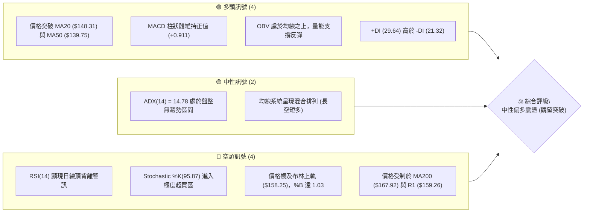
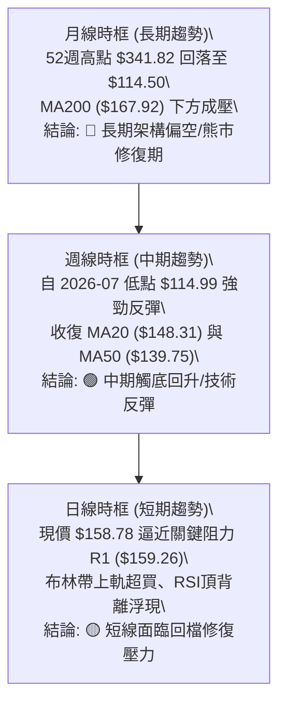
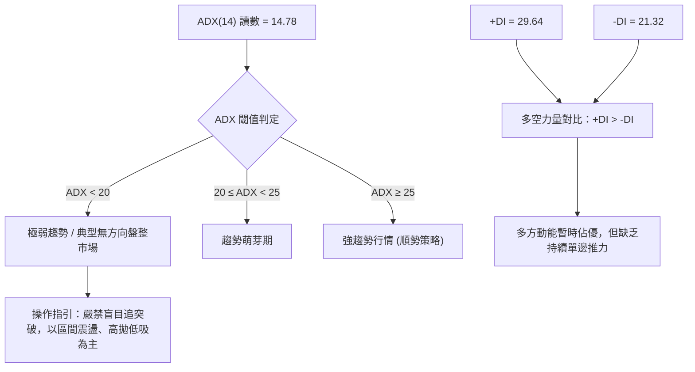
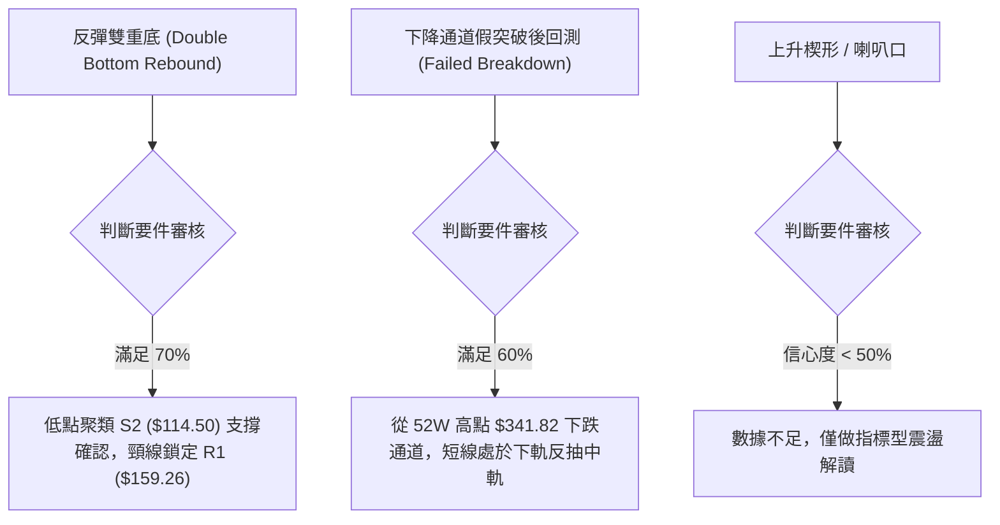
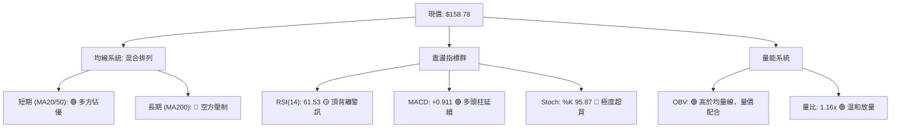
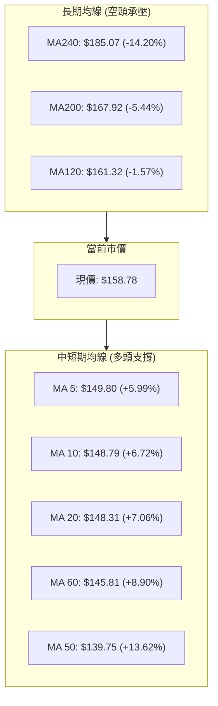
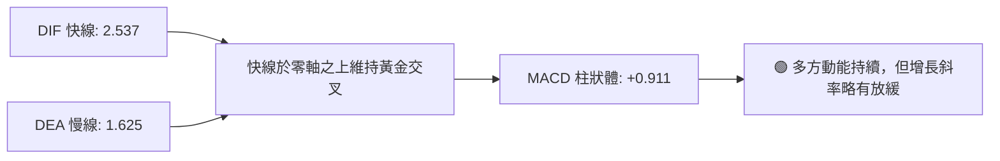
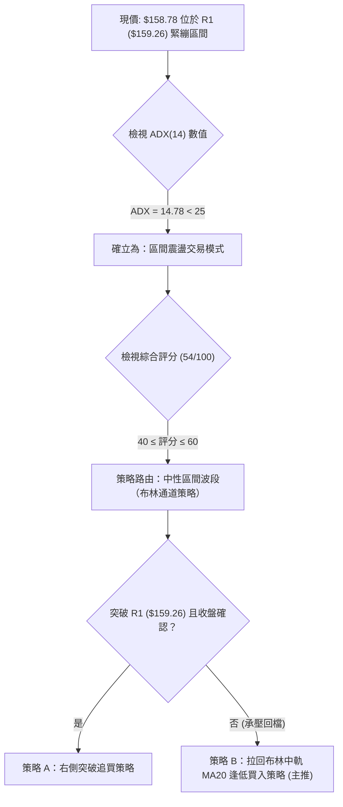
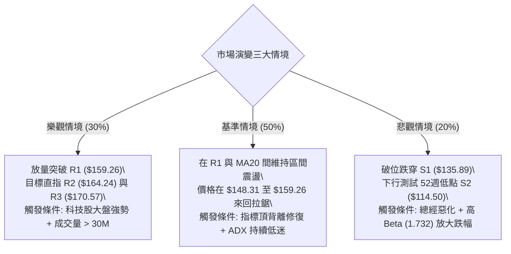

# ORCL 技術分析報告

> **報告日期**：2026-09-06 ｜ **語言**：繁體中文 ｜ **數據來源**：Yahoo Finance ｜ **當前價格**：$158.78

---

## 目錄

| 章節 | 內容 |
|------|------|
| [1. 技術面概覽](#1-技術面概覽) | 訊號儀表板、核心指標、評分卡 |
| [2. 趨勢分析](#2-趨勢分析) | 多時框趨勢、長中短期走勢、ADX解讀 |
| [3. 圖表形態分析](#3-圖表形態分析) | 形態識別、信心度評估、K線組合、目標價 |
| [4. 支撐與阻力](#4-支撐與阻力) | 關鍵價位分佈、斐波那契回調結構 |
| [5. 技術指標深度解讀](#5-技術指標深度解讀) | MA/RSI/MACD/布林通道/量價關係 |
| [6. 動能與波動率](#6-動能與波動率) | 動能四象限、ATR波動度、Beta係數 |
| [7. 多時框架總結](#7-多時框架總結) | 時框架評分表、多時框收斂結論 |
| [8. 交易策略建議](#8-交易策略建議) | 策略路由、情境階梯、進出場參數 |
| [9. 風險提示與監控](#9-風險提示與監控) | 監控Checklist、情境演變、風控準則 |

---

## 1. 技術面概覽

### 🎯 技術訊號儀表板



---

### 📊 核心指標速覽表

| 指標類別 | 指標名稱 | 當前數值 | 訊號 | 解讀 |
|:---|:---|:---|:---:|:---|
| **價格結構** | 現行收盤價 | $158.78 | 🟡 | 位於52週區間底部19.5%位置，自低點反彈但面臨強阻力 |
| **短期均線** | MA20 | $148.31 | 🟢 | 價格在MA20之上+7.06%，短期多頭主導結構完好 |
| **中期均線** | MA50 | $139.75 | 🟢 | 價格站穩中期均線之上，底部支撐逐步墊高 |
| **長期均線** | MA200 | $167.92 | 🔴 | 價格低於長期均線-5.44%，長期空頭結構尚未扭轉 |
| **動能震盪** | RSI(14) | 61.53 | 🟡 | 數值處於多方區，但指標發出「頂背離」警告訊號 |
| **趨勢動能** | MACD (12,26,9) | 2.537 / 1.625 | 🟢 | 快線位於慢線上方，柱狀體 +0.911 維持看多擴張 |
| **擺動指標** | Stoch %K / %D | 95.87 / 75.21 | 🔴 | 極度鈍化進入嚴重超買區，短線隨時有回檔修復需求 |
| **趨勢強度** | ADX (14) | 14.78 | 🟡 | ADX < 25 表示目前處於無趨勢/寬幅震盪行情 |
| **通道通道** | Bollinger %B | 1.03 | 🔴 | 突破布林上軌 ($158.25)，短線呈假突破或回測中軌壓力 |
| **波動風險** | ATR (14) | $6.22 (3.92%) | 🟡 | 每日平均波動幅度約 $6.22，操作須設定充足安全緩衝 |

---

### 🏆 技術評分卡

```
╔══════════════════════════════════════════════════════════════════╗
║                   技術評分卡 — ORCL (2026-09-06)                 ║
╠══════════════════════════════════════════════════════════════════╣
║ 趨勢強度 (ADX/方向)   ██████░░░░░░░░░░░░░░  35/100  🔴 弱勢震盪  ║
║ 動能指標 (MACD/RSI)   ███████████░░░░░░░░░  55/100  🟡 多空拉鋸  ║
║ 支撐穩定度 (S1/S2)    ██████████████░░░░░░  70/100  🟢 底部明確  ║
║ 成交量配合 (OBV/Vol)  ████████████░░░░░░░░  60/100  🟢 量能回升  ║
║ 形態完整度 (底型構築) ███████████░░░░░░░░░  55/100  🟡 測試頸線  ║
║ 均線排列 (短中長期)   ██████████░░░░░░░░░░  50/100  🟡 混合排列  ║
╠══════════════════════════════════════════════════════════════════╣
║ 綜合評分              ███████████░░░░░░░░░  54/100  🟡 區間震盪  ║
╚══════════════════════════════════════════════════════════════════╝
```

---

## 2. 趨勢分析

### 🌐 多時框趨勢分析



---

### 📈 長期趨勢 — 12個月走勢圖（Unicode）

以下圖表記錄自 2025 年 9 月歷史波段高點（$278.07）至當前 2026 年 9 月（$158.78）之收盤價格軌跡：

```
ORCL 月線走勢圖（過去12個月：2025-09 至 2026-09）
價格軸 ($)
$280 ┤ ● ($278.07 波段峰值)
$260 ┤     ● ($260.10)
$240 ┤
$220 ┤                             ● ($225.00 假突破頂點)
$200 ┤         ● ($200.02)
$180 ┤             ● ($193.05)
$160 ┤                 ● ($163.44)         ● ($160.83)     ● ($158.78 現價)
$140 ┤                     ● ($144.39) ● ($146.09)     ● ($146.04)     ● ($149.12)
$120 ┤                                                     ● ($129.87 低點聚類)
$100 ┴──────────────────────────────────────────────────────────────────────────
       09  10  11  12  01  02  03  04  05  06  07  08  09
      └─── 2025年 ───┘└───              2026年             ───┘
```

#### 走勢特徵分析表格

| 階段區間 | 時間跨度 | 起訖收盤價 | 區間漲跌幅 | 走勢特徵與量價結構解讀 |
|:---|:---|:---|:---:|:---|
| **單邊主跌浪** | 2025-09 至 2026-02 | $278.07 → $144.39 | -48.07% | 機構出逃波段，跌破多重整數支撐，MA200全面下彎 |
| **築底弱反彈** | 2026-02 至 2026-04 | $144.39 → $160.83 | +11.39% | 在 $140 附近出現初步換手量，形成底部盤整區 |
| **誘多假突破** | 2026-04 至 2026-05 | $160.83 → $225.00 | +39.90% | 快速拉抬但週成交量未持續放大，隨後引發報復性拋售 |
| **二次探底浪** | 2026-05 至 2026-07 | $225.00 → $129.87 | -42.28% | 連續長陰破位，創下52週最低點聚類 $114.50（日線最低點） |
| **波段復甦浪** | 2026-07 至 2026-09 | $129.87 → $158.78 | +22.26% | RSI由超賣區（11.1）強力回升，OBV重返MA上方，目前受阻R1 |

---

### 📊 中期趨勢（週線分析）

中期走勢顯示自 2026 年 7 月 26 日低點 $114.99 觸底後，ORCL 展開連續 6 週的震盪反彈。

```
ORCL 近期阻力與支撐示意圖
══════════════════════════════════════════════════════════════════
 阻力區  $170.57 ── 強阻力 R3（前期套牢密集區）
         $167.92 ── MA200 牛熊分界線
         $164.24 ── 阻力 R2（技術波段高點）
         $159.26 ── 關鍵阻力 R1（當前直接天花板，距現價僅 +0.30%）
──────────────────────────────────────────────────────────────────
 當前價  $158.78  ◄ 價格於布林帶上軌與 R1 間劇烈收斂
──────────────────────────────────────────────────────────────────
 支撐區  $148.31 ── MA20 / 布林中軌（短線多方防禦哨）
         $139.75 ── MA50 中期均線
         $135.89 ── 關鍵支撐 S1（近一年波段低點聚類）
         $114.50 ── 強支撐 S2（52週低點 / 結構性大底）
══════════════════════════════════════════════════════════════════
```

---

### ⚡ 趨勢強度評估（ADX 解讀）



| 指標變數 | 當前數值 | 強度評估 | 交易意涵 |
|:---|:---:|:---:|:---|
| **ADX (14)** | 14.78 | 弱（盤整） | 市場動能渙散，價格被鎖在特定區間內，突破真偽難辨 |
| **+DI (14)** | 29.64 | 中等偏強 | 買方掌控短線定價權，自 $114.50 反彈的動能尚未完全衰退 |
| **-DI (14)** | 21.32 | 偏弱 | 空方壓制力道短期減弱，但未完全潰退 |
| **行情定性** | **區間震盪** | **優先順序：布林通道通道策略 > 單邊趨勢跟蹤** |

---

## 3. 圖表形態分析

### 🔍 形態識別系統



#### 圖表形態信心度與目標評估表

| 形態名稱 | 信心度 | 判斷依據（引用真實數據） | 形態完成度 | 目標價（附嚴謹計算式） |
|:---|:---:|:---|:---:|:---|
| **底部雙重支撐** | **72%** | 2026-07 低點 $114.99 與 52W Low $114.50 構成實質雙重底，收盤逐週墊高 | 85% (逼近頸線) | 若有效突破 R1 ($159.26)，理論目標價 = 頸線 + (頸線 - 底點) = 159.26 + (159.26 - 114.50) = **$204.02**（接近 61.8% 斐波那契 $201.34） |
| **布林上軌承壓超買** | **88%** | BB %B 達 1.03，現價 $158.78 刺穿上軌 $158.25，疊加 RSI 頂背離 | 95% (即期發生) | 回測布林中軌 MA20 = **$148.31**；若中軌失守進一步下探 S1 = **$135.89** |
| **頭肩底形態** | **35%** | 缺乏清晰左肩與右肩對稱成交量支撐 | 訊號不足 | **數據中未偵測到完整結構，不做推算** |

---

### 🕯️ 重要K線形態分析

| 觀測月份/週 | 收盤價 | 核心 K 線形態 | 技術特徵解讀 | 趨勢訊號 |
|:---|:---:|:---|:---|:---:|
| **2026-05** | $225.00 | 長上影流星線 (Shooting Star) | 巨量誘多後遭遇極端拋壓，確認波段頭部成立 | 🔴 強烈看空 |
| **2026-06** | $146.04 | 破位長黑實體 (Bearish Marubozu) | 跌穿多條短期支撐，多頭毫無抵抗，空方動能宣洩 | 🔴 趨勢延續 |
| **2026-07** | $129.87 | 錘頭帶長下影線 (Hammer) | 探底 52W 低點 $114.50 後爆量收回，主力籌碼換手 | 🟢 觸底反轉 |
| **2026-08** | $149.12 | 中陽吞噬線 (Bullish Engulfing) | 實體陽線站回 MA20 ($148.31)，確認底部構造有效 | 🟢 波段確認 |
| **2026-09** | $158.78 | 衝高滯漲小陽 (Exhaustion Candle) | 實體收縮，受制於 R1 ($159.26)，向上動能放緩 | 🟡 短期警戒 |

---

### 📉 ASCII 走勢形態示意圖

```
ORCL 雙底反彈與頸線阻力測試示意圖
價格 ($)
$170.57 ──────────────────────────────────────────── (強阻力 R3)
$164.24 ──────────────────────────────── (阻力 R2)
$159.26 ───────┬─────────────────────────────── (頸線 / 阻力 R1)
               │                               ▲
$158.78 ───────┼───────────────────────────────● 現價 (受阻震盪)
               │                             ／ 
$148.31 ───────┼───────────────●───────────／ (MA20 / 布林中軌)
               │             ／ ＼       ／
$135.89 ───────┼───────────／     ＼───／ (支撐 S1)
               │         ／ (反彈中繼)
$114.50 ───────┴────────● (底點1)      ● (底點2 / S2 52W Low)
               └────────────────────────────────────────────► 時間
```

---

### 🎯 形態目標價計算

依據標準幾何測量法則，當前 ORCL 處於典型的大型底層修復波：
1. **第一波段滿足點（保守）**：
   - 形態突破觸發條件：日線收盤價實質收高於關鍵阻力 R1（**$159.26**）。
   - 保守上行目標為近一年波段次高點聚集處，即阻力 R2 = **$164.24**。
2. **第二波段滿足點（延伸）**：
   - 上行延伸至 MA200 扣抵區與阻力 R3 區間，即阻力 R3 = **$170.57**。
3. **等距測量目標點（形態理論最大值）**：
   - 計算式：$159.26 + (159.26 - 114.50) = **$204.02**。
   - 該數值與 61.8% 斐波那契回調位 **$201.34** 高度重合，構成中期強大技術壓制帶。

---

## 4. 支撐與阻力

### 🗺️ 關鍵價位分布圖（Unicode）

```
ORCL 價位結構分布圖
══════════════════════════════════════════════════════════════════
$170.57 ║████████████████████████████████║ 強阻力 R3 (波段高點聚類)
$167.92 ║▓▓▓▓▓▓▓▓▓▓▓▓▓▓▓▓▓▓▓▓▓▓▓▓▓▓      ║ 長期生命線 MA200
$164.24 ║██████████████████████          ║ 關鍵阻力 R2
$163.15 ║▒▒▒▒▒▒▒▒▒▒▒▒▒▒▒▒▒▒▒▒▒▒          ║ 斐波那契 78.6% 回調位
$159.26 ║████████████████████████████████║ 核心阻力 R1 (頸線壓力區)
$158.78 ╠════════════════════════════════╣ ◄ 當前市價 ($158.78)
$158.25 ║~~~~~~~~~~~~~~~~~~~~~~~~~~~~~~~~║ 布林通道上軌
$148.31 ║▓▓▓▓▓▓▓▓▓▓▓▓▓▓▓▓▓▓▓▓            ║ 短期防禦線 MA20 / 布林中軌
$139.75 ║▒▒▒▒▒▒▒▒▒▒▒▒▒▒▒▒                ║ 中期均線 MA50
$135.89 ║████████████████████████████████║ 關鍵支撐 S1 (波段低點聚類)
$114.50 ║████████████████████████████████║ 終極強支撐 S2 (52週極限低點)
══════════════════════════════════════════════════════════════════
```

---

### 🚧 阻力位分析表

所有價位均嚴格引用歷史波段高點聚類與計算數據：

| 阻力級別 | 價位 | 距現價空間 | 形成原因與籌碼屬性 | 突破難度 | 重要性權重 |
|:---|:---:|:---:|:---|:---:|:---:|
| **R1** | **$159.26** | +0.30% | 近一年波段密集高點、雙底頸線位置，日線布林上軌重疊區 | ★★★★☆ | 🔴 決定短期是否轉強 |
| **R2** | **$164.24** | +3.44% | 2026-04 前期反彈停滯高點聚類，斐波那契 78.6% ($163.15) 密集帶 | ★★★☆☆ | 🟡 中期多空過渡帶 |
| **R3** | **$170.57** | +7.42% | 近一年下跌中繼平台、上方巨量套牢沉積區，涵蓋 MA200 ($167.92) | ★★★★★ | 🔴 多頭全面翻轉壁壘 |

---

### 🛡️ 支撐位分析表

所有價位均嚴格引用歷史波段低點聚類與計算數據：

| 支撐級別 | 價位 | 距現價空間 | 形成原因與籌碼屬性 | 守住機率 | 重要性權重 |
|:---|:---:|:---:|:---|:---:|:---:|
| **S1** | **$135.89** | -14.41% | 近一年波段回調低點聚類，跌破該位將破壞 7-8 月構築之築底平台 | 75% | 🟢 多頭波段退守底線 |
| **S2** | **$114.50** | -27.89% | 52週絕對最低價（2026-07 極限探底點），機構買盤進駐區 | 90% | 🟢 系統性終極防線 |
| **S3** | — | — | *數據中未偵測到其他波段低點聚類* | — | — |

---

### 📐 斐波那契回調位分析

依據 52 週絕對極值區間（波段高點 **$341.82** 至波段低點 **$114.50**，總跨度 $227.32）之精確計算分佈：

```
斐波那契回調結構階梯（52W 區間）
$341.82 ├──────────────────────────────────────── 0.0% (52W High)
$288.18 ├──────────────────────────── 23.6%
$254.99 ├─────────────────────── 38.2%
$228.16 ├────────────────── 50.0%
$201.34 ├───────────── 61.8% (黃金分割位 / 中期目標)
$163.15 ├──────── 78.6% (關鍵壓力門檻)
$158.78 ├──── ◄ 現價 $158.78 (位於 78.6% 與 100% 之間)
$114.50 ┴──────────────────────────────────────── 100.0% (52W Low)
```

- **位置判定**：現價 **$158.78** 處於斐波那契 100.0%（$114.50）與 78.6%（$163.15）之間，處於深度超跌後的低位反彈初階。
- **技術意涵**：自 $341.82 回落至 $114.50 屬於標準去估值熊市走勢。當前價格試圖向上挑戰 78.6% 回調位（**$163.15**），若能實質越過該水平，反彈級別才可確認向上拓展至 61.8%（**$201.34**）。若無法站上 $163.15，整體反彈僅視為超跌技術抽腳。

---

## 5. 技術指標深度解讀

### 🎛️ 指標訊號總覽



---

### 📈 移動平均線排列分析



- **均線排列狀態**：當前均線系統為典型的「**短期糾結向上、長期空頭壓制**」的過渡混合排列。
- **均線乖離率**：
  - 現價距 MA20 乖離為 **+7.06%**，短期動能充沛，但存在短線拉回尋找均線支撐的均值回歸拉力。
  - 現價距 MA200 乖離為 **-5.44%**，顯示長期投資者的解套盤賣壓將在 $167.92 前陸續釋放。

---

### 📉 RSI(14) 分析與背離檢驗

- **當前讀數**：`61.53`
  ```
  RSI(14) 狀態進度條
  超賣 [0] ░░░░░░░░░░░░░ [30] ░░░░░░░░░ [50] ▓▓▓▓▓ [61.53] ░░░░░░░░ [70] ░░░░░░░░░░░░░ [100] 超買
  當前強度：████████████░░░░░░░░ 61.53% (多方控制區)
  ```
- **背離分析（Bearish Divergence）**：
  - **日線頂背離明確成立**：回顧 2026-08-16 週線收盤價為 **$150.52**，當時 RSI 達到 **74.6**（超買高點）；而當前 2026-09-06 收盤價衝高至 **$158.78**（創反彈新高），但 RSI(14) 僅回升至 **61.53**。
  - **技術結論**：價格創高但指標峰值顯著降低，形成標準的**動能頂背離**。這意味著推動價格突破的內在買盤力道正在減弱，隨時面臨籌碼鬆動的高階震盪或技術性回檔。

---

### 📊 MACD(12/26/9) 訊號解讀



- **柱狀體演變**：近三週週線 MACD 柱狀體分別為 `+0.852`、`+0.811`、`+0.911`，柱狀體維持在正值區間，反映多頭波段尚未遭到空方破壞。
- **指標共振**：雖然 MACD 依然發出做多訊號，但與 RSI 的頂背離狀態出現分歧，表明**中期趨勢偏多但短線加速空間有限**。

---

### 📦 布林通道分析

```
ORCL 布林通道結構圖 (參數: 20, 2)
─────────────────────────────────────────────────────────────
 $158.25 ─── BB 上軌 ────────────────────────┬───────────────
                                            ▲ 現價 $158.78 (刺穿上軌, %B = 1.03)
 $148.31 ─── BB 中軌 (MA20) ─────────────────┼───────────────
                                             │
 $138.38 ─── BB 下軌 ────────────────────────┴───────────────
─────────────────────────────────────────────────────────────
 通道帶寬 (Bandwidth): 13.40%  |  位置指標 (%B): 1.03
```

- **軌道狀態**：現價 **$158.78** 已經略微突破布林通道上軌（**$158.25**），%B 值達到 **1.03**。
- **統計學含義**：在常態分佈下，價格位於上軌之外的時間低於 5%。結合 ADX = 14.78 的低趨勢環境，布林上軌通常扮演強烈的**動態阻力壁壘**，而非單邊飆升的通道開啟，短線回歸中軌（**$148.31**）的機率極高。

---

### 💹 成交量分析（量價配合度）

```
成交量與均量對比
最新成交量:  26,430,100  ██████████████████████████
20日均量:    22,719,525  █████████████████████░░░░░ (量比: 1.16x 溫和放大)
50日均量:    31,734,042  ███████████████████████████████ (低於中期均量)
```

- **OBV 趨勢**：數據顯示 `OBV > MA`，能量潮指標領先突破均線，證實 7-8 月的低位籌碼換手是由實質買盤進駐所推動，量能對目前的價格反彈提供實質支撐。
- **量價健康度**：量比為 **1.16x**，呈現健康的「價漲量溫和增」，未出現非理性的失控巨量（Blow-off Top），但 50 日均量（31.73M）高於當前量能，顯示市場觀望機構尚未全面回補，突破 R1 必須有更大成交量配合。

---

## 6. 動能與波動率

### ⚡ 動能評估四象限

| 象限標識 | 動能強度 | 波動率水準 | 當前狀態判定 | 交易策略啟示 |
|:---:|:---:|:---:|:---:|:---|
| **Q1 (最佳動能)** | 強動能 (Trend) | 低波動 (Low Vol) | — | 趨勢穩健順勢持有 |
| **Q2 (震盪沉澱)** | 弱動能 (Consolidation) | 低波動 (Low Vol) | **✓ ORCL 當前定位** | **維持區間高拋低吸，嚴設止損觀望突破** |
| **Q3 (極端爆發)** | 強動能 (Explosive) | 高波動 (High Vol) | — | 假突破頻繁，風控難度高 |
| **Q4 (流動性陷阱)** | 弱動能 (Exhaustion) | 高波動 (High Vol) | — | 恐慌拋售或急跌行情 |

- **矩陣解讀**：ADX 僅 14.78 配合 ATR 3.92%，明確將 ORCL 定位在 **Q2 象限**。此階段行情的特徵是「假突破多、延續性差、空間受限於技術邊界」，操作策略重心應在於高阻力低吸納，而非追高。

---

### 📊 ATR 波動率分析

- **ATR (14) 數值**：**$6.22**
- **價格波動百分比**：**3.92%**
- **動態風控距離建議**：
  - **短線日內雜訊過濾（1.0 × ATR）**：建議安全波動緩衝至少保留 **$6.22**。
  - **波段交易防守停損（1.5 × ATR）**：建議距離進場點 **$9.33**。
  - **寬鬆趨勢防守停損（2.0 × ATR）**：建議安全距離為 **$12.44**。

---

### 📐 Beta 與市場相關性

- **Beta 係數**：**1.732**（極高系統性風險曝險）
  ```
  Beta 敏感度進度條
  低於大盤 [0] ░░░░░░░░ [1.0 基準] ▓▓▓▓▓▓▓▓▓▓▓▓▓▓ [1.732] ░░░░░░░░░ [2.5]
  ```
- **解讀**：ORCL 的 Beta 達到 1.732，代表其對科技股整體指數（如 QQQ/S&P 500）的波動極度敏感。大盤若回調 1%，ORCL 理論上將放大跌幅至 1.73%。在目前面臨 R1（$159.26）強阻力且大盤若缺乏增量資金背景下，高 Beta 特性易轉化為向下的劇烈殺傷力。

---

## 7. 多時框架總結

### 📋 時框架評分表

| 時框架 | 趨勢方向 | 動能狀態 | 均線排列 | 圖表形態 | 綜合評分 | 操作建議 |
|:---|:---:|:---:|:---:|:---:|:---:|:---|
| **月線 (長期)** | 🔴 空頭修復 | 弱勢反彈 | MA200 之下死叉 | 熊市深度超跌區 | **38/100** | 長線資金謹慎，待站上 MA200 |
| **週線 (中期)** | 🟢 觸底回升 | MACD 正向擴張 | 突破 MA20 扭轉短空 | 雙底反彈測試頸線 | **64/100** | 逢拉回支撐可建立基礎配置 |
| **日線 (短期)** | 🟡 衝高滯漲 | RSI 頂背離/超買 | 均線發散但撞上軌 | 布林上軌阻力承壓 | **52/100** | 不得追高，警惕回測中軌修復 |

---

### 🔲 綜合訊號矩陣

```
┌─────────────────────────────────────────────────────────────┐
│ 矩陣評估項目       短期 (日線)      中期 (週線)     長期 (月線)     │
├─────────────────────────────────────────────────────────────┤
│ 趨勢方向判定       🟡 震盪整理      🟢 多頭波段     🔴 空頭主導     │
│ 均線系統配合       🟢 站上MA20/50   🟢 突破短期均線 🔴 受制MA200    │
│ 動能指標訊號       🔴 頂背離/超買   🟢 MACD柱擴張   🟡 低位鈍化     │
│ 量能結構強度       🟢 OBV多方掌控   🟢 週放量換手   🟡 長期量能偏低 │
│ 關鍵位處境         🔴 逼近 R1 阻力  🟡 挑戰下頸線   🔴 處於深層回調 │
└─────────────────────────────────────────────────────────────┘
```

---

### ⚖️ 多時框收斂結論

依據嚴格多時框收斂規則（規則 14）：
1. **行情定性判定**：當前日線 **ADX(14) = 14.78 < 25**，客觀裁定目前市場處於**標準盤整行情**，而非單邊趨勢行情。
2. **時框衝突取捨**：依規則，盤整行情中應**以日線布林通道上下軌（$138.38 - $158.25）作為主要交易與邊界依據**，中長期趨勢訊號暫退居次要輔助。
3. **收斂最終方向**：**唯一方向性結論為【中性觀望，等待回測低吸或突破確認】**。
   - 理由：雖然中期週線多頭結構由底部回升（週 MACD 正向），但短線現價（$158.78）已頂在布林上軌（$158.25）與關鍵阻力 R1（$159.26）的雙重壓制之下，疊加日線 RSI 頂背離，短線「向上空間極窄、向下回踩機率極高」。主策略禁止追高，應鎖定區間內的高拋低吸。

---

## 8. 交易策略建議

### 🗺️ 策略決策流程圖



---

### 🧭 策略路由

**當前主策略方向 = 中性區間震盪操作，以「回調布林中軌低吸」為主，「突破追價」為輔（依綜合評分 54/100）**

因技術評分卡綜合得分為 **54/100**，落入 40–60 之中性震盪區間。依規定不盲目單邊重倉，交易的核心邏輯在於：**尊重阻力 R1 的存在，利用指標頂背離的拉回契機，於中軌與支撐區建立風險回報比優異的部位**。

---

### 🎯 價格情境階梯（Price Scenarios）

價位嚴格引用自第 4 章已驗證數據：

| 觸發條件 | 下一目標 | 後續延伸 | 情境含義與操作指引 |
|:---|:---:|:---:|:---|
| **強勢突破 R1 ($159.26)** | 阻力 R2 (**$164.24**) | 阻力 R3 (**$170.57**) | 短線轉強，多頭攻勢向 MA200 延伸，右側順勢追進 |
| **現價遇阻震盪 ($148.31 - $159.26)** | 布林中軌 (**$148.31**) | 支撐 S1 (**$135.89**) | 消化布林上軌與頂背離賣壓，展開健康技術回檔 |
| **失守支撐 S1 ($135.89)** | 終極支撐 S2 (**$114.50**) | *數據中未偵測到S3* | 中期築底失敗，重回52週低點尋求支撐，多頭徹底停損 |

---

### 📊 情境機率分佈

| 演變情境 | 機率 | 主要技術依據 |
|:---|:---:|:---|
| **情境一：受阻回落，區間震盪** | **50%** | ADX 僅 14.78 無趨勢，布林上軌 %B 1.03 嚴重超買，RSI 頂背離壓制，高機率回測 MA20 ($148.31) |
| **情境二：放量突破，上行延伸** | **30%** | MACD 柱狀體維持正值 (+0.911)，OBV 持續高於均線，若大盤帶動放量突破 R1 則看至 R2 ($164.24) |
| **情境三：深度拉回，破位探底** | **20%** | Beta 高達 1.732，若市場出現流動性衝擊，不排除向 S1 ($135.89) 進行深度洗盤 |

---

### 🟢 主策略詳情

#### 策略 A（右側順勢：放量突破 R1 進場）vs 策略 B（左側防禦：回踩中軌支撐進場）

| 策略要素 | 策略 A（右側突破進場） | 策略 B（左側低吸進場 — 推薦首選） |
|:---|:---|:---|
| **進場條件** | 日線收盤實體帶量突破關鍵阻力 R1 | 價格自上軌回撤，於 MA20 / 布林中軌止跌收下影線 |
| **精確進場點** | **$159.50**（確認站上 R1 $159.26） | **$148.50**（貼近 MA20 $148.31） |
| **停損價格** | **$153.28**（進場點 - 1.0×ATR $6.22） | **$139.50**（跌破中期均線 MA50 $139.75） |
| **目標價 T1** | **$164.24**（阻力 R2，斐波 78.6% 區域） | **$159.26**（測試關鍵阻力 R1） |
| **目標價 T2** | **$170.57**（阻力 R3，長期 MA200 壓制位） | **$164.24**（突破後拓展至阻力 R2） |
| **風險空間** | $6.22 | $9.00 |
| **報酬空間 (T2)**| $11.07 ($170.57 - $159.50) | $15.74 ($164.24 - $148.50) |
| **風險報酬比 (R:R)**| **1 : 1.78** (以T2計) | **1 : 1.75** (以T2計) / **1 : 1.19** (以T1計) |
| **勝率估計** | 45%（ADX 低，假突破風險較高） | **65%**（符合盤整市低吸勝率原則） |
| **建議倉位** | 10%（輕倉試單） | **20%**（分批配置） |

---

### 🔴 反向風險觸發點（對沖與撤退提示）

1. **多頭策略全面無效點**：日線收盤價跌破關鍵支撐 **S1 ($135.89)**。一旦確認跌破，宣告自 $114.50 以來的雙底架構崩潰，所有多單必須無條件停損出場。
2. **短線動能竭盡點**：若價格拉升至 **$163.15 - $164.24**（斐波 78.6% 與 R2）區間但成交量無法放大至 20 日均量（22.7M）以上，為機構高拋誘多訊號，短線多單應獲利了結，激進者可於此處建立對沖空單。

---

### ⭐ 整體訊號強度評星

```
做多訊號強度：★★★☆☆  (3.0/5星 — 短線受阻，等待拉回低吸較安全)
做空訊號強度：★★☆☆☆  (2.0/5星 — 中期底部回升，逆勢放空風險高)
整體可信度：  ★★★★☆  (4.0/5星 — 價位聚類清晰，布林與背離共振度高)
```

---

## 9. 風險提示與監控

### ✅ 關鍵監控指標 Checklist

```
╔══════════════════════════════════════════════════════════════════╗
║                   ORCL 日常風控即時監控 CHECKLIST                ║
╠══════════════════════════════════════════════════════════════════╣
║ [ ] 阻力壓制確認：每日收盤價是否壓制在 R1 ($159.26) 之下？      ║
║ [ ] 動能背離修復：RSI(14) 是否從 61.53 回落至 50 軸進行修復？   ║
║ [ ] 均線支撐測試：股價回撤至 MA20 ($148.31) 時是否獲得量縮支撐？ ║
║ [ ] 布林軌道開口：布林帶寬是否持續縮小？帶寬小於 10% 預示大變盤 ║
║ [ ] 趨勢強度指標：ADX(14) 是否突破 20-25 門檻？(突破代表趨勢成型)║
║ [ ] 關鍵防守底線：任何收盤價絕對不可跌穿關鍵支撐 S1 ($135.89)    ║
║ [ ] 長期空頭壓制：向上接近 MA200 ($167.92) 時是否引發巨量解套賣壓║
╚══════════════════════════════════════════════════════════════════╝
```

---

### ⚠️ 風險場景分析



---

### 🛡️ 風險管理重要提醒

1. **嚴防高 Beta 放大效應**：ORCL 的 Beta 高達 **1.732**，在盤整市中若遭遇科技板塊整體拋售，股價容易出現日內跳水。嚴禁在阻力位 R1（$159.26）附近使用高槓桿追多。
2. **ATR 動態停損執行**：本標的日波動 ATR 為 **$6.22**，日內波動較大，切忌將停損點設定在小於 $6.00 的微小區間內，以免被正常市場雜訊洗出場。
3. **布林軌道紀律**：當 %B 達到 1.03 且突破布林上軌時，歷史統計顯示回測中軌（$148.31）機率顯著大於持續暴漲機率，耐心等待價格回到軌道內再行動是保護本金的第一法則。

---

## 📋 報告總結

```
╔══════════════════════════════════════════════════════════════════╗
║                    ORCL 技術分析報告總結                         ║
╠══════════════════════════════════════════════════════════════════╣
║ 報告日期：2026-09-06                                             ║
║ 當前價格：$158.78                                                ║
║ 分析評級：⚖️ 中性偏多震盪（阻力承壓，待回調低吸）                ║
║                                                                  ║
║ 關鍵結論：                                                       ║
║ ├─ 長期趨勢：🔴 偏空（現價仍處於長期均線 MA200 $167.92 下方）   ║
║ ├─ 中期趨勢：🟢 轉多（自 $114.50 構築雙底回升，站上 MA20/MA50）  ║
║ ├─ 短期趨勢：🟡 震盪警戒（受制於 R1 $159.26，RSI 頂背離浮現）   ║
║ ├─ 關鍵支撐：S1: $135.89  /  S2: $114.50 (52週極限大底)         ║
║ ├─ 關鍵阻力：R1: $159.26  /  R2: $164.24  /  R3: $170.57        ║
║ └─ 分析師目標價：均價 $242.05 (區間: $110.00 - $400.00)          ║
║                                                                  ║
║ 最優策略組合：                                                   ║
║ 1. 🥇 最佳機會：策略 B（逢回撤至 MA20 $148.31 附近布局多單）     ║
║ 2. 🥈 次選機會：策略 A（放量突破 R1 $159.26 後輕倉順勢跟進）      ║
║ 3. 🥉 保守選擇：空倉觀望，等待 ADX > 20 出現明確趨勢方向再進場   ║
╚══════════════════════════════════════════════════════════════════╝
```

---

> ⚠️ **免責聲明**：本報告為技術分析研究成果，所有技術價位及量化指標均基於歷史市場數據計算推導。本報告**僅供學術研究與投資參考**，**不構成任何形式的個人化投資建議或買賣邀約**。金融市場具有高度風險，投資人應獨立評估風險承受能力，並自負盈虧。

---

*報告生成時間：2026-09-06 ｜ 數據來源：Yahoo Finance ｜ 分析框架：多時框技術分析體系*