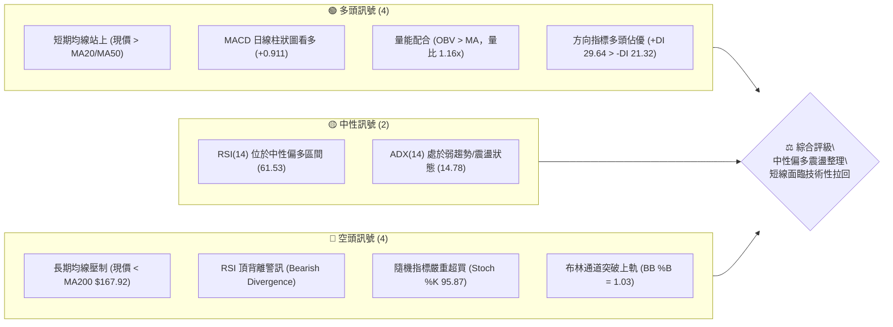
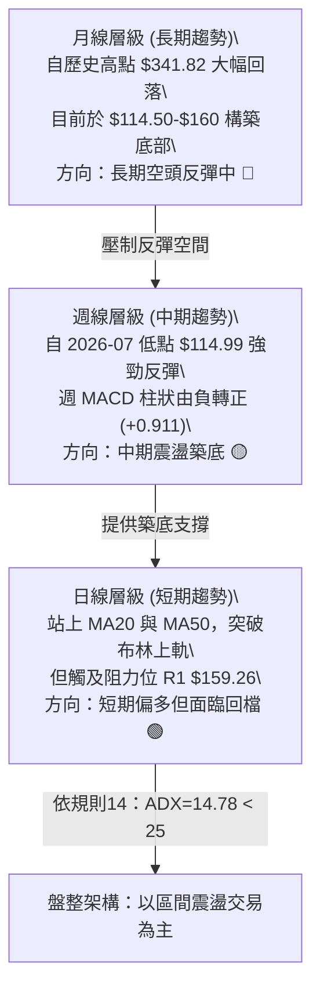
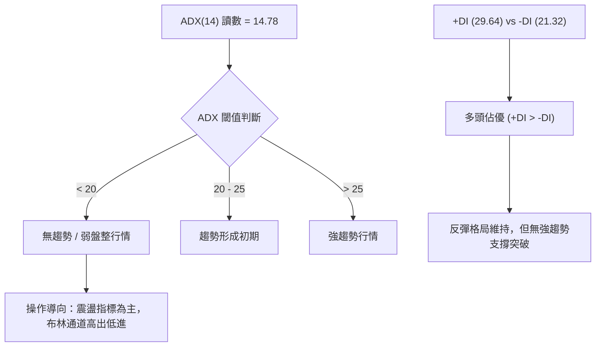
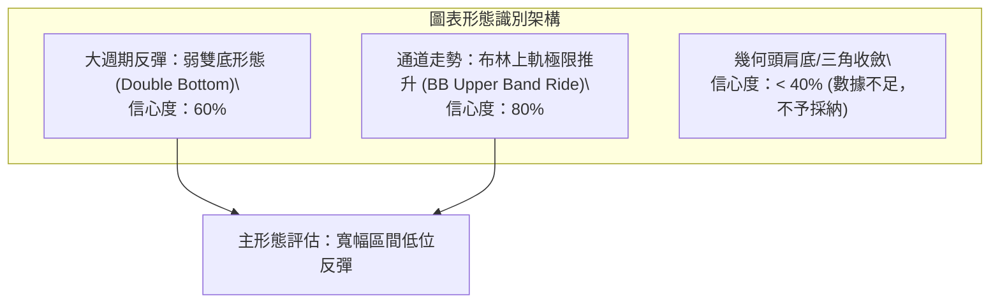
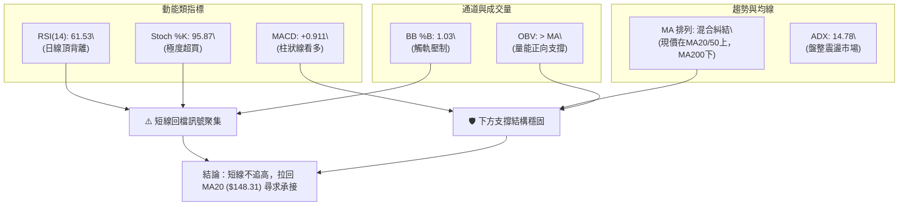
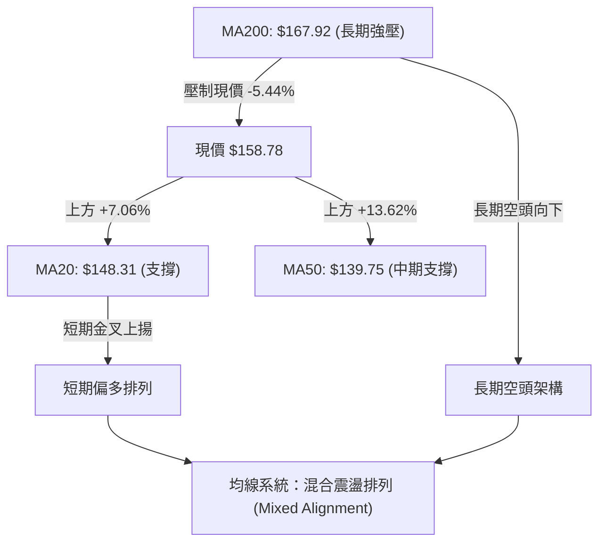
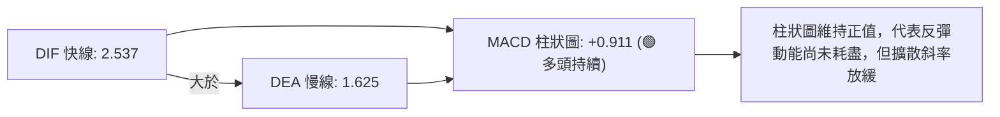
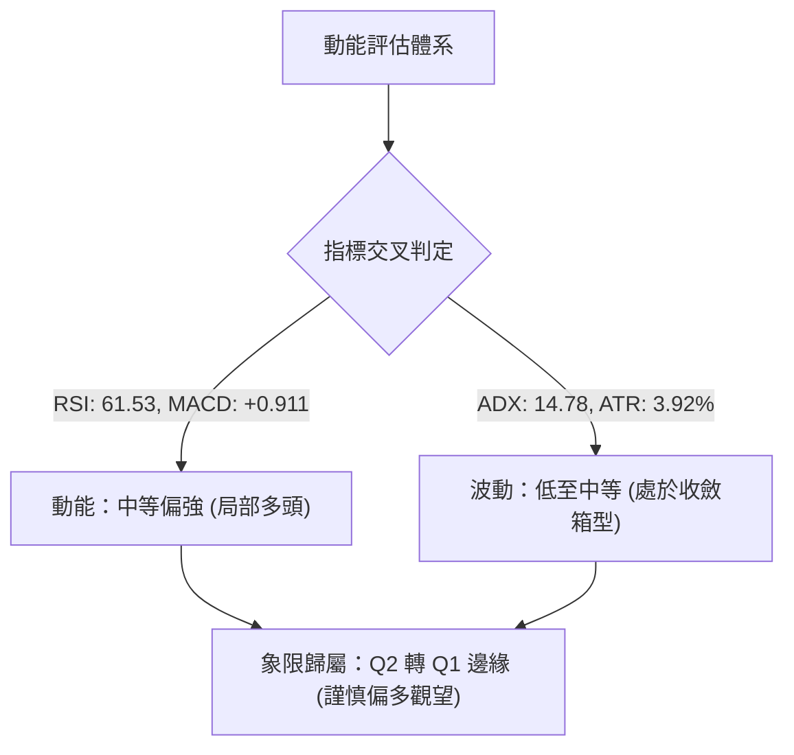
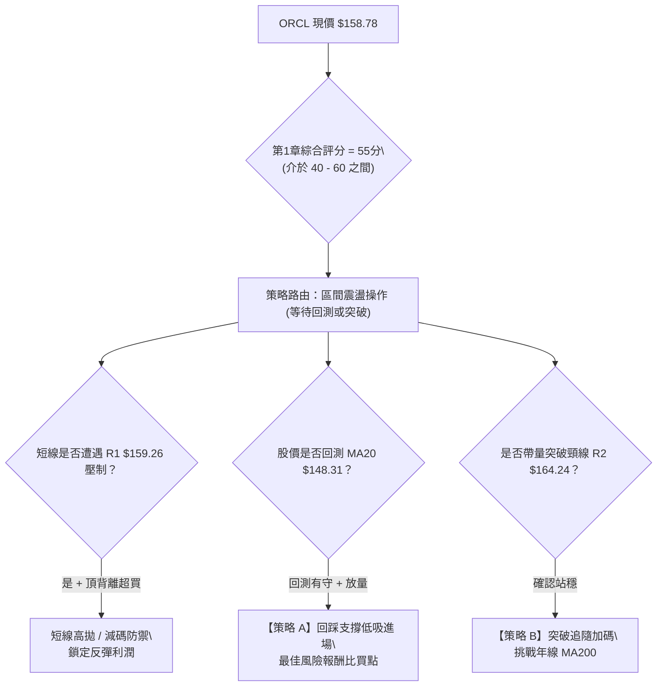
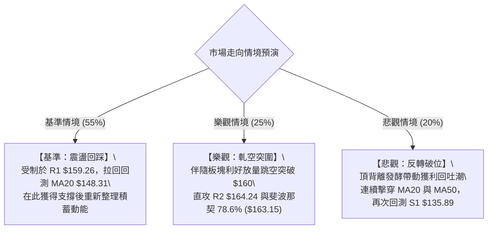

# ORCL 技術分析報告

> **報告日期**：2026-09-08 ｜ **語言**：繁體中文 ｜ **數據來源**：Yahoo Finance ｜ **當前價格**：$158.78

---

## 目錄

| 章節 | 內容 |
|------|------|
| [1. 技術面概覽](#1-技術面概覽) | 訊號儀表板、核心指標、評分卡 |
| [2. 趨勢分析](#2-趨勢分析) | 多時框趨勢、長中短期走勢 |
| [3. 圖表形態分析](#3-圖表形態分析) | 形態識別、K線組合、目標價 |
| [4. 支撐與阻力](#4-支撐與阻力) | 關鍵價位、斐波那契回調 |
| [5. 技術指標深度解讀](#5-技術指標深度解讀) | MA/RSI/MACD/布林/成交量 |
| [6. 動能與波動率](#6-動能與波動率) | 動能評估、ATR、Beta |
| [7. 多時框架總結](#7-多時框架總結) | 時框架評分矩陣 |
| [8. 交易策略建議](#8-交易策略建議) | 多空策略、風險報酬比 |
| [9. 風險提示與監控](#9-風險提示與監控) | 監控指標、風險場景 |
| [10. 報告總結](#10-報告總結) | 總結儀表板與策略歸納 |

---

## 1. 技術面概覽

### 🎯 技術訊號儀表板



---

### 📊 核心指標速覽表

| 指標類別 | 指標名稱 | 當前數值 | 訊號 | 解讀 |
|----------|----------|----------|------|------|
| **價格** | 當前價格 | $158.78 | 🟡 | 位於52週區間 19.5% 低檔，短線自低點強勁反彈但逼近強阻力 |
| **均線** | MA20 | $148.31 | 🟢 | 現價高於 MA20 達 +7.06%，短期多頭走勢明確 |
| **均線** | MA50 | $139.75 | 🟢 | 現價站上中期生命線，中期底部已逐步墊高 |
| **均線** | MA200 | $167.92 | 🔴 | 現價低於年線 -5.44%，長期空頭結構尚未扭轉 |
| **動能** | RSI(14) | 61.53 | 🟡 | 數值落於 30-70 中性偏多區，但日線出現頂背離警訊 |
| **動能** | MACD | 2.537 | 🟢 | 位於信號線 1.625 之上，MACD 柱狀圖 +0.911 持續看多 |
| **擺動** | Stoch %K / %D | 95.87 / 75.21 | 🔴 | 進入超買極值區，短線追價動能衰竭風險顯著升溫 |
| **通道** | 布林帶 %B | 1.03 | 🔴 | 價格已越過布林上軌 $158.25，存在均值回歸拉回壓力 |
| **趨勢** | ADX(14) | 14.78 | 🟡 | 數值低於 25，顯示當前為弱趨勢或處於大級別箱型盤整 |
| **量能** | OBV 趨勢 | OBV > MA | 🟢 | 量能持續堆疊支撐價格反彈，今日成交量放大至均量 1.16x |
| **波動** | ATR(14) | $6.22 | 🟡 | 佔股價 3.92%，屬於中等偏高波動度，震盪幅度較大 |

---

### 🏆 技術評分卡

```
╔══════════════════════════════════════════════════════════════════╗
║              技術評分卡 — ORCL (2026-09-08)                    ║
╠══════════════════════════════════════════════════════════════════╣
║ 趨勢強度 (Trend)     ██████░░░░░░░░░░░░░░  30/100  🔴 弱趨勢/震盪║
║ 動能指標 (Momentum)  ████████████░░░░░░░░  60/100  🟡 短多但有背離║
║ 支撐穩定度 (Support) ██████████████░░░░░░  70/100  🟢 底部支撐紮實║
║ 成交量配合 (Volume)  ██████████████░░░░░░  70/100  🟢 量價配合良好║
║ 形態完整度 (Pattern) ██████████░░░░░░░░░░  50/100  🟡 箱型反彈整理║
║ 均線排列 (Moving Av) ██████████░░░░░░░░░░  50/100  🟡 糾結混合排列║
╠══════════════════════════════════════════════════════════════════╣
║ 綜合評分             ███████████░░░░░░░░░  55/100  ⚖️ 中性偏多區間║
╚══════════════════════════════════════════════════════════════════╝
```

---

## 2. 趨勢分析

### 🌐 多時框趨勢分析



---

### 📈 長期趨勢 — 12個月走勢圖（Unicode）

```
ORCL 月線走勢圖（過去12個月：2025-09 至 2026-09）
價格軸 ($)
$280 ┤ ● (2025-09 $278.07 波段頂部)
$260 ┤   ●
$240 ┤               ● (2026-05 軋空反彈高點 $225.00)
$220 ┤
$200 ┤     ●
$180 ┤       ●
$160 ┤         ●         ●             ●←現價 $158.78
$140 ┤           ● ●   ●   ●
$120 ┤                       ● (2026-07 探底低點 $129.87 / 52W低 $114.50)
     └─┬──┬──┬──┬──┬──┬──┬──┬──┬──┬──┬──┬──────────────
      09 10 11 12 01 02 03 04 05 06 07 08 09 (月份)
```

#### 走勢特徵分析表格

| 階段區間 | 起訖月份 | 價格區間 ($) | 漲跌幅 (%) | 走勢特徵分析 |
|----------|----------|--------------|------------|--------------|
| **崩跌初期** | 2025-09 → 2026-02 | $278.07 → $144.39 | -48.07% | 主跌段，跌破各均線支撐，機構拋壓沉重 |
| **第一波弱反彈**| 2026-02 → 2026-05 | $144.39 → $225.00 | +55.82% | 軋空與超跌反彈，觸及 MA120/MA240 壓制線 |
| **二次探底破底**| 2026-05 → 2026-07 | $225.00 → $129.87 | -42.28% | 快速重挫並創下52週低點 $114.50，籌碼洗盤 |
| **築底修復期** | 2026-07 → 2026-09 | $129.87 → $158.78 | +22.26% | 震盪反彈，收復 MA20/MA50，挑戰年線及重壓區 |

---

### 📊 中期趨勢（週線分析）

近期 20 週收盤走勢展示出明顯的「V型觸底反彈」特徵。在 2026 年 7 月下旬跌至 $114.99 觸底後，週成交量暴增至 2.52 億股（2026-07-19 當週），隨後週線連陽拉升，將 RSI 從 11.1 的極度超賣區拉回至當前的 61.5。然而，上方受到 2026 年 6 月跳空下行區間與長線均線壓制，反彈力道已在 $158-$160 區間遭遇阻力。

```
中期壓力與支撐示意圖
═════════════════════════════════════════════════════════════════
  $170.57 ─── [R3 強壓力位] 週線波段反彈防線
  $164.24 ─── [R2 阻力位] 2026年4月波段平台 / MA120 ($161.32)
  $159.26 ─── [R1 關鍵阻力] 即時壓制線，現價 $158.78 逼近此處
  ─────────── ▲ 現價 $158.78 ────────────────────────────────
  $148.31 ─── [短期支撐] MA20 / 布林中軌
  $135.89 ─── [S1 近期強支撐] 2026-07 築底次低點
  $114.50 ─── [S2 終極強支撐] 52週歷史低點，雙底頸線支撐基底
═════════════════════════════════════════════════════════════════
```

---

### ⚡ 趨勢強度評估（ADX 解讀）



#### ADX 趨勢強度對照解讀

| 指標名稱 | 當前讀數 | 門檻區間 | 趨勢屬性判定 | 交易指引 |
|----------|----------|----------|--------------|----------|
| **ADX(14)** | **14.78** | < 25.0 | **弱趨勢 / 區間震盪** | 不宜進行激進趨勢突破追價，宜採取區間高拋低吸 |
| **+DI** | **29.64** | — | **多頭主導** | 買方動能略優於賣方，支撐股價震盪向上修復 |
| **-DI** | **21.32** | — | **空頭衰退** | 空頭壓制力道已顯著放緩，但尚未完全退潮 |

---

## 3. 圖表形態分析

### 🔍 形態識別系統



#### 形態識別與信心度評估表

| 形態類別 | 信心度 | 判斷依據（引用實際數據） | 完成度 | 目標價（附計算式） |
|----------|--------|--------------------------|--------|--------------------|
| **雙底反彈形態** | **60%** | 低點一：2026-03 ($137.45)；低點二：2026-07 ($114.50/$129.87)，形成寬幅雙底雛形 | 75% | 頸線阻力 R2 $164.24。若確認突破：$164.24 + ($164.24 - $114.50) = **$213.98**（由形態高度推算） |
| **超買均值回歸形態** | **80%** | 布林 %B 達 1.03，突破上軌 $158.25；Stoch %K 達 95.87，RSI 頂背離 | 90% | 回歸中軌 MA20：目標價為 **$148.31** |
| **頭肩底形態** | **30%** | 數據中未偵測到對稱右肩結構，左側波動過於劇烈 | — | *訊號不足，僅做指標型解讀，不予計算* |

---

### 🕯️ 重要 K 線形態分析

| 週/月份 | 收盤價 | K 線形態特徵 | 市場心理與技術解讀 | 訊號方向 |
|---------|--------|--------------|--------------------|----------|
| **2026-07** | $129.87 | 長下影線探底錘頭線 | 探底至 $114.50 後湧現巨量抄底盤（週量破 2.5 億股），確立波段支撐 | 🟢 強烈看多 |
| **2026-08** | $149.12 | 實體中長陽線 | 多頭連續收復 MA20，形成底部確認，空頭停損離場 | 🟢 延續看多 |
| **2026-09** | $158.78 | 衝高受阻流星線/上影線 | 逼近 R1 $159.26 及布林上軌，短線獲利了結賣壓湧現，多頭動能趨緩 | 🟡 謹慎偏空 |

---

### 📉 ASCII 走勢形態示意圖

```
ORCL 寬幅震盪築底形態示意圖（2026-05 至 2026-09）

$225.00 ┬─┐ (5月高點)
        │ │
        │ └──┐
$170.57 ┼───┼─────────── [R3 強阻力] ────────────────────
$164.24 ┼───┼─────────── [R2 頸線阻力] ────────────────────
$159.26 ┼───┼─────────── [R1 即時壓制] ─────▲ (現價 $158.78 遭遇阻力)
        │   │                                 /│
$148.31 ┼───┼───────────────────────────/─┼─ [MA20 / 布林中軌]
        │   └──┐                        /  │
$135.89 ┼──────┼──┐                    /   │  [S1 次低點支撐]
        │      │  │        ┌──/────────┘   │
$114.50 ┴──────┴──┴────────┴─ (7月低點 $114.50，確立底座)
```

---

## 4. 支撐與阻力

### 🗺️ 關鍵價位分布圖（Unicode）

```
ORCL 價位結構分布圖
══════════════════════════════════════════════════════════════════
$170.57 ║██████████████████████████████║ 強阻力 R3 (近一年波段高點聚類)
$167.92 ║▓▓▓▓▓▓▓▓▓▓▓▓▓▓▓▓▓▓▓▓▓▓        ║ 年線 MA200 壓制線
$164.24 ║████████████████████          ║ 關鍵阻力 R2 (反彈形態頸線位)
$163.15 ║░░░░░░░░░░░░░░░░░░░░░         ║ 斐波那契 78.6% 回調位
$159.26 ║██████████████████████████████║ 即時關鍵阻力 R1 (+0.30%)
$158.78 ╠══════════════════════════════╣ ◄ 現價 ($158.78，正挑戰 R1)
$148.31 ║▓▓▓▓▓▓▓▓▓▓▓▓▓▓▓▓              ║ 近期動態支撐 MA20 / 布林中軌
$139.75 ║▒▒▒▒▒▒▒▒▒▒▒▒▒▒                ║ 中期生命線 MA50
$135.89 ║██████████████████████        ║ 強支撐 S1 (波段次低點聚類)
$114.50 ║██████████████████████████████║ 終極鐵底 S2 (52W 最低點)
══════════════════════════════════════════════════════════════════
```

---

### 🚧 阻力位分析表

所有價位均嚴格引用系統計算之高點聚類與指標數據：

| 阻力級別 | 精確價位 | 距離現價 | 形成原因與技術意涵 | 突破難度 | 重要性 |
|----------|----------|----------|--------------------|----------|--------|
| **R1** | **$159.26** | +0.30% | 近一年波段高點聚類第一層，與布林通道上軌 ($158.25) 重疊 | 中等 | 🟢 關鍵即時阻力 |
| **R2** | **$164.24** | +3.44% | 波段成交密集區頸線，緊貼斐波那契 78.6% 回調位 ($163.15) | 高 | 🟡 中期形態分水嶺 |
| **R3** | **$170.57** | +7.42% | 近一年密集高點聚類上沿，年線 MA200 ($167.92) 上方防線 | 極高 | 🔴 多空牛熊分界線 |

---

### 🛡️ 支撐位分析表

所有價位均嚴格引用系統計算之低點聚類與均線數據：

| 支撐級別 | 精確價位 | 距離現價 | 形成原因與技術意涵 | 守住機率 | 重要性 |
|----------|----------|----------|--------------------|----------|--------|
| **動態支撐** | **$148.31** | -6.59% | 20日移動平均線 (MA20) 及布林帶中軌，短線多頭第一防線 | 75% | 🟢 短線生命線 |
| **中期支撐** | **$139.75** | -11.99% | 50日移動平均線 (MA50)，中期波段上升結構之安全緩衝 | 70% | 🟡 中期多空平衡點 |
| **S1** | **$135.89** | -14.41% | 近一年波段低點聚類，2026年7月破底後回升之實體底部 | 85% | 🔴 強力核心支撐 |
| **S2** | **$114.50** | -27.89% | 52週歷史極值低點，大型雙底結構之終極防守基石 | 95% | 🔴 戰略鐵底 |

---

### 📐 斐波那契回調位分析

依據 52 週區間極值（低點 **$114.50** → 高點 **$341.82**），波幅總寬為 **$227.32**：

```
斐波那契回調層級分布表（基於 $114.50 → $341.82 完整週期）
0.0%  (52W High)  $341.82 ─────────────────────────────────────
23.6%             $288.18 ─────────────────────────────────────
38.2%             $254.99 ─────────────────────────────────────
50.0%             $228.16 ─────────────────────────────────────
61.8%             $201.34 ─────────────────────────────────────
78.6%             $163.15 ───────────────── 阻力壓制區間 ─────
现价              $158.78 ◄─── (落於 78.6% 與 100.0% 之間)
100.0% (52W Low)  $114.50 ───────────────── 底部基準線 ───────
```

#### 斐波那契層級深度解讀：
*   **現價位置**：目前現價 **$158.78** 位於 **78.6% ($163.15)** 與 **100.0% ($114.50)** 之間，屬於整段牛市崩跌後的「極深幅回撤修復區」。
*   **技術意義**：斐波那契 78.6% 往往是深幅調整行情的最後一道重壓關卡。若股價未能實質站穩 $163.15 之上，則當前反彈僅能定性為超跌反彈；反之，若強勢突破並收復 $163.15，下一目標將依序挑戰 61.8% ($201.34) 的黃金分割位。

---

## 5. 技術指標深度解讀

### 🎛️ 指標訊號總覽



---

### 📈 移動平均線排列分析



#### 各期移動平均線詳細數據表

| 週期 | 數值 | 距離現價變動 | 走勢特徵 (Unicode) | 狀態解讀 |
|------|------|--------------|-------------------|----------|
| **MA 5** | $149.80 | +5.99% | ▁▁▁▁▂▃▄▅▆▇▇▇██████▇▇▇▇▇▇██████ | 短期極速拉升，斜率陡峭 |
| **MA 10** | $148.79 | +6.72% | ▁▁▁▁▁▁▂▂▃▄▅▆▇█████████████████ | 穩步上行，短多排列 |
| **MA 20** | $148.31 | +7.06% | ▂▂▁▁▁▁▁▁▁▁▁▂▂▃▃▄▄▄▅▅▆▆▇███████ | 轉為上升趨勢，布林中軌支撐 |
| **MA 60** | $145.81 | +8.90% | ████▇▇▇▇▆▆▆▆▆▅▅▅▅▅▄▄▄▃▃▂▂▂▁▁▁▁ | 走平略有勾頭，中期回穩 |
| **MA 120** | $161.32 | -1.57% | █▇▆▆▅▅▄▄▃▃▃▂▂▃▃▃▃▃▃▂▂▂▂▂▂▂▁▁▁▁ | 持續下壓，構成直接阻力帶 |
| **MA 200** | $167.92 | -5.44% | — (數值下行) | 長期牛熊線，空頭防守陣地 |
| **MA 240** | $185.07 | -14.20% | ████▇▇▇▇▆▆▆▆▆▅▅▅▅▅▄▄▄▄▃▃▂▂▂▁▁▁ | 嚴重下彎，中期反彈不可逾越之天花板 |

---

### 📉 RSI(14) 分析

*   **當前數值**：**61.53**
*   **強度指示**：
    ```
    超賣區 (0-30)        中性平衡區 (30-70)             超買區 (70-100)
    ├──────────────┼──────────────────────────────┼──────────────┤
    ░░░░░░░░░░░░░░░██████████████████░░░░░░░░░░░░░░░  61.53
    ```
*   **背離分析（Bearish Divergence）**：
    *   **判定結論**：存在明確的**日線頂背離**警訊。
    *   **技術依據**：觀察近 20 週收盤，2026-08-16 週股價為 $150.52 時，RSI 達到高位 **74.6**；而當前（2026-09-06）股價推升至 **$158.78** 創反彈新高，RSI 卻僅錄得 **61.53**。價格創新高但 RSI 峰值大幅下滑，形成典型的動能頂背離，暗示上方追價動能不足，短線反轉或大幅拉回整理的機率偏高。

---

### 📊 MACD(12/26/9) 訊號解讀



*   **當前讀數**：MACD 線 **2.537**，信號線 **1.625**，柱狀圖（Histogram）為 **+0.911**。
*   **指標解讀**：雙線處於零軸上方且柱狀圖維持正值，顯示自 7 月底以來的反彈上升波段尚未被破壞。但需警惕若股價遭遇 R1 $159.26 壓制無法放量突破，MACD 柱狀圖將迅速收斂轉向死叉。

---

### 📦 布林通道分析

```
ORCL 布林通道結構示意圖（日線層級）
══════════════════════════════════════════════════════════════════
  $158.25 ─── [布林上軌] ──┐
  $158.78 ─── [現價位置] ──┴─► 現價已突破上軌！(%B = 1.03) 🔴 觸軌壓制
                            
  $148.31 ─── [布林中軌] (MA20) ───── 核心回歸支撐位 🟢
                            
  $138.38 ─── [布林下軌] ───────────── 極限安全下沿 🟢
══════════════════════════════════════════════════════════════════
帶寬 (Bandwidth) = ($158.25 - $138.38) / $148.31 = 13.40% (帶寬適中，未發生擠壓擴軌)
```

*   **%B 指標讀數**：**1.03**（> 1.0 代表股價已穿透布林通道上軌）。
*   **統計學意義**：在 ADX = 14.78 的震盪盤整市況下，布林通道具有強烈之均值回歸特性。當 %B > 1.0 且伴隨隨機指標超買（%K = 95.87），價格繼續貼軌暴漲的機率極低，高機率在未來 3 至 5 個交易日內向中軌 **$148.31** 回測。

---

### 💹 成交量分析（量價配合度）

*   **量能現況**：最新成交量為 **26,430,100 股**，相較於 20 日均量（22,719,525 股），**量比達 1.16x**，顯示今日在挑戰 $158.78 時有多頭資金參與。
*   **OBV 能量潮判斷**：系統數據顯示 `OBV > MA`，OBV 指標呈斜向右上形態，並先於股價站上均線，確認這波反彈過程具有實質買盤支撐，非單純的無量空拉。
*   **潛在隱憂**：當前成交量（26.4M）雖高於 20 日均量，但仍低於 50 日均量（31,734,042 股），說明長期套牢籌碼在 $160 以上區域尚未充分換手，若無更大買盤介入，突破阻力區將面臨量能匱乏的考驗。

---

## 6. 動能與波動率

### ⚡ 動能評估四象限

根據技術指標體系，ORCL 目前處於**動能適中、但波動率快速收斂**的中期修復階段：



| 象限 | 動能維度 | 波動維度 | ORCL 當前狀態 | 策略指導含義 |
|------|----------|----------|---------------|--------------|
| **Q1** | 強動能 | 低波動 | — | 最佳波段順勢機會 |
| **Q2** | **弱/中動能** | **低/中波動** | **✓ 當前定位** | **區間震盪，以低吸高拋為原則，不宜追高** |
| **Q3** | 強動能 | 高波動 | — | 爆發突破行情，風險與回報並存 |
| **Q4** | 弱動能 | 高波動 | — | 崩跌階段，應嚴格停損離場 |

---

### 📊 ATR 波動率分析

*   **ATR(14) 讀數**：**$6.22**
*   **波動比率**：佔當前股價之 **3.92%**。
*   **風控應用與止損距離建議**：
    *   **日內正常波幅**：單日平均波動區間約為 **$6.22**。目前股價與上方 R1 ($159.26) 僅差 $0.48，處於單日 ATR 之內，極易出現「假突破即回落」。
    *   **波段交易止損設定**：建議以 **1.5 × ATR** 或 **2.0 × ATR** 作為安全緩衝距離：
        *   *1.5 × ATR 距離* = 1.5 × $6.22 = **$9.33**
        *   *2.0 × ATR 距離* = 2.0 × $6.22 = **$12.44**

---

### 📐 Beta 與市場相關性

*   **Beta 係數**：**1.732**
*   **特徵解讀**：ORCL 具有極高的市場敏感度（屬於高 Beta 成長型資產），其波動幅度平均為標普500指數的 **1.73 倍**。
*   **風險提示**：在高 Beta 背景下，一旦美股大盤（S&P 500 / Nasdaq）出現系統性回檔，ORCL 的跌幅將被顯著放大；反之，若科技股板塊放量走強，其補漲爆發力亦不容小覷。

---

## 7. 多時框架總結

### 📋 時框架評分表

| 時框架 | 趨勢方向 | 動能指標 | 均線排列 | 形態結構 | 綜合評分 | 操作建議 |
|--------|----------|----------|----------|----------|----------|----------|
| **月線 (長期)** | 🔴 偏空 | 弱勢築底 | 空頭排列 (遠低於MA200) | 大週期深幅回檔 | 35/100 | 長線資金僅宜分批定投，避免一次性重倉 |
| **週線 (中期)** | 🟡 震盪 | 震盪反彈 | 逐步修復，逼近MA120 | 寬幅雙底構築中 | 55/100 | 中線持股續抱，但不加碼，以箱型操作為主 |
| **日線 (短期)** | 🟢 偏多 | 頂背離/超買 | 短多排列 (MA20/50上) | 突破布林上軌觸阻力 | 65/100 | 短線面臨回檔，獲利部位宜逢高部分了結 |

---

### 🔲 綜合訊號矩陣

```
ORCL 多維度技術共振評估
══════════════════════════════════════════════════════════════════
  維度            短期 (日線)       中期 (週線)       長期 (月線)
──────────────────────────────────────────────────────────────────
  均線趨勢        🟢 偏多           🟡 中性糾結       🔴 偏空壓制
  動能強弱        🔴 頂背離超買     🟢 柱狀上行       🔴 低檔弱勢
  量價結構        🟢 量比放大       🟢 OBV支撐        🟡 套牢籌碼重
  形態位置        🔴 觸碰軌道上沿   🟡 雙底反彈中     🔴 極深回撤位
──────────────────────────────────────────────────────────────────
  共振結論        短多遇阻          區間築底          防守未解除
══════════════════════════════════════════════════════════════════
```

---

### ⚖️ 多時框收斂結論（依規則 14 嚴格執行）

依據規範收斂原則：
1.  **市場屬性檢驗**：ADX(14) 數值為 **14.78**（明確低於 25 臨界線），判定當前市場處於**典型「盤整震盪行情」**，非單邊趨勢行情。
2.  **時框權重取捨**：依規則，在盤整行情中，不應以突破思路過度外推趨勢，而**必須以日線布林通道上下軌 ($138.38 - $158.25) 與關鍵波段聚類 ($135.89 - $159.26) 作為主要交易區間**。
3.  **唯一方向性結論**：**【中性觀望，逢高減碼，回踩承接】**。
    *   現價 $158.78 已完全頂在布林上軌及 R1 $159.26，且伴隨 RSI 頂背離與 Stoch 95.87 極度超買。短期多頭已無安全風險報酬比之進場空間。操作重心應轉移至「防範回檔至 MA20 ($148.31)」，禁止於 $158-$160 區間追多。

---

## 8. 交易策略建議

### 🗺️ 策略決策流程圖



---

### 🧭 策略路由（依規則分流）

> **當前主策略方向 = 【中性區間震盪策略】（依綜合評分 55/100，落於 40–60 區間）**  
> *核心思路：不盲目追空，亦不追高。以布林通道與關鍵位為主軸，主推「回踩 MA20 支撐之低吸做多（策略 A）」與「確認放量突破 R2 後的右側跟進（策略 B）」。*

---

### 🎯 價格情境階梯（Price Scenarios）

所有價位均嚴格引用第 4 章聚類數據與均線數值：

| 觸發條件 | 核心價位 | 下一目標 | 後續延伸 | 技術情境與市場含義 |
|----------|----------|----------|----------|--------------------|
| **強勢突破 R1** | 站穩 **$159.26** | **R2 $164.24** | **R3 $170.57** | 短線洗盤結束，挑戰斐波那契 78.6% 與年線阻力 |
| **回踩均值回歸**| 跌破 **$158.25** | **MA20 $148.31**| **MA50 $139.75** | 指標極度超買修復，健康的技術性回檔測試支撐 |
| **中期轉弱破位**| 跌破 **S1 $135.89**| **S2 $114.50** | 重新探底 | 反彈形態徹底破裂，股價重回長期空頭探底走勢 |

---

### 📊 情境機率分佈

| 情境劇本 | 機率 | 主要技術依據 |
|----------|------|--------------|
| **劇本一：先回落再探底反彈**（回踩震盪） | **55%** | RSI 日線頂背離明確、Stoch %K 達 95.87 超買極值、布林 %B 達 1.03，技術面強烈要求向中軌 MA20 ($148.31) 均值回歸。 |
| **劇本二：直接強勢突破**（單邊逼空） | **25%** | 最新成交量比 1.16x、OBV > MA，且 MACD 柱狀圖維持 +0.911；若大盤強勢推升，或可瞬間跳空衝擊 R2 $164.24。 |
| **劇本三：失守支撐深度下殺**（空頭回歸） | **20%** | 長期 MA200 ($167.92) 壓制力道強大，高 Beta (1.732) 特性若遭遇宏觀流動性收緊，可能回測 S1 $135.89。 |

---

### 🟢 主策略詳情（區間操作與回踩低吸）

所有進出場與止損價位均依據真實支撐阻力設定，精準至小數點後兩位：

| 策略要素 | 策略 A（保守型：回踩 MA20 支撐買入） | 策略 B（激進型：突破 R2 追隨多頭） |
|----------|--------------------------------------|------------------------------------|
| **進場條件** | 價格回測至布林中軌/MA20，出現止跌長下影線 | 日線實體帶量突破並收盤站上阻力位 R2 |
| **進場價格** | **$148.31** | **$164.24** |
| **第一目標 (T1)** | **$159.26**（R1 阻力，波段利潤 +7.38%） | **$170.57**（R3 阻力，波段利潤 +3.85%） |
| **第二目標 (T2)** | **$164.24**（R2 阻力，波段利潤 +10.74%）| **$213.98**（雙底反彈推算目標價，+30.28%）|
| **止損價格** | **$142.09**（設於 MA20 下方 1.0 × ATR 距離）| **$158.02**（設於突破點下方 1.0 × ATR 距離）|
| **風險空間** | $148.31 - $142.09 = **$6.22** (4.19%) | $164.24 - $158.02 = **$6.22** (3.79%) |
| **報酬空間 (T1)**| $159.26 - $148.31 = **$10.95** (7.38%) | $170.57 - $164.24 = **$6.33** (3.85%) |
| **風險報酬比** | **1 : 1.76** (挑戰T2為 **1 : 2.56**) | **1 : 1.02** (挑戰T2為 **1 : 8.00**) |
| **歷史勝率估計** | **65%** | **45%** |
| **建議倉位** | **總資金之 10% - 15%** | **總資金之 5% (嚴格右側追隨)** |

---

### 🔴 反向風險觸發點（對沖提示）

若持有多頭部位，當盤面出現以下任一訊號時，主策略失效，應果斷執行避險或出場：
1.  **無量假突破**：價格盤中突破 R1 $159.26，但日終收盤留長上影線且成交量萎縮，收於 $158.25 以下。
2.  **均線失守轉空**：股價回測 MA20 毫無抵抗，以長黑K跌破中期生命線 **MA50 ($139.75)**，代表反彈波段徹底終結。
3.  **指標死叉共振**：日線 MACD 柱狀圖由正翻負，且 RSI 跌破 50 中軸，視為反轉做空防守觸發點。

---

### ⭐ 整體訊號強度評星

```
做多訊號強度：★★★☆☆  (3/5 星 — 均線與OBV配合，但短線超買嚴重，需等待回踩)
做空訊號強度：★★☆☆☆  (2/5 星 — 處於反彈中，逆勢摸頂風險極高，僅宜防守)
整體可信度：  ★★★★☆  (4/5 星 — 多指標出現明確的共振與背離，研判依據充分)
```

---

## 9. 風險提示與監控

### ✅ 關鍵監控指標 Checklist

```
╔══════════════════════════════════════════════════════════════════╗
║                ORCL 技術監控每日核查清單 (Checklist)           ║
╠══════════════════════════════════════════════════════════════════╣
║ [ ] 價格是否跌破布林上軌 $158.25 (均值回歸啟動信號)             ║
║ [ ] RSI(14) 是否跌破 60 並確認頂背離型態成立                     ║
║ [ ] 日成交量是否萎縮至 2,270 萬股 (20日均量) 以下                ║
║ [ ] 價格觸碰 MA20 ($148.31) 時是否出現放量承接下影線             ║
║ [ ] MACD 柱狀圖是否收斂至 +0.300 以下 (動能衰竭預警)            ║
║ [ ] 大盤 Nasdaq 是否出現高 Beta 聯動拋售風險                    ║
╚══════════════════════════════════════════════════════════════════╝
```

---

### ⚠️ 風險場景分析



---

### 🛡️ 風險管理重要提醒

1.  **高 Beta 倉位縮減原則**：
    ORCL 之 Beta 值高達 **1.732**，市場波動將被成倍放大。在 ADX 僅為 14.78 的無趨勢震盪市中，切忌使用槓桿或過度放大倉位。單一策略部位建議嚴格限制在總資產的 **10% 至 15%** 以內。
2.  **動態跟蹤止損（Trailing Stop）**：
    對於 7 月底於低檔抄底之多單，目前已累積相當利潤。鑑於 RSI 頂背離及布林超買，建議將保護性止損上調至 **$150.00**（或 MA20 之上），確保反彈波段利潤不回吐。
3.  **阻力聚類不追買紀律**：
    價格正前方緊鄰近一年高點聚類 **R1 ($159.26)** 與 **R2 ($164.24)**。在未能見到明確的「日線收盤放量站穩」之前，任何盤中衝高均應視為潛在的短線誘多，嚴格杜絕市價追高。

---

## 10. 報告總結

```
╔══════════════════════════════════════════════════════════════════╗
║                    ORCL 技術分析報告總結                         ║
╠══════════════════════════════════════════════════════════════════╣
║ 報告日期：2026-09-08                                             ║
║ 當前價格：$158.78                                                ║
║ 技術評級：⚖️ 綜合評分 55/100 (中性偏多，短線超買面臨回檔)         ║
║                                                                  ║
║ 關鍵結論：                                                       ║
║ ├─ 長期趨勢：🔴 弱勢 (受制於 MA200 $167.92，牛熊分界線下)      ║
║ ├─ 中期趨勢：🟡 築底 (自 52W 低點 $114.50 反彈，構築雙底中)      ║
║ ├─ 短期趨勢：🟢 偏多但頂背離 (站上 MA20/50，但觸及布林上軌)     ║
║ ├─ 關鍵阻力：$159.26 (R1) / $164.24 (R2) / $170.57 (R3)         ║
║ ├─ 關鍵支撐：$148.31 (MA20) / $135.89 (S1) / $114.50 (S2)       ║
║ └─ 華爾街共識目標：$242.05 (42位分析師，評級為 Buy)             ║
║                                                                  ║
║ 最優操作策略：                                                   ║
║ 1. 🥇 最佳機會：等待價格拉回均值 **$148.31 (MA20)** 逢低承接    ║
║ 2. 🥈 防守動作：持有獲利多單者，於 **$158-$160** 區間適度獲利了結 ║
║ 3. 🥉 突破策略：若日線放量收盤越過 **$164.24**，順勢加碼挑戰年線 ║
╚══════════════════════════════════════════════════════════════════╝
```

---

> ⚠️ **免責聲明**：本報告為 AI 自動生成之技術分析研究，報告內所有支撐、阻力位、均線數值及回調位均精確引用提供之 OHLCV 歷史數據。本報告**僅供學術研究與投資架構參考**，**不構成任何形式的個人化投資建議或買賣邀約**。金融市場具有高波動風險，投資人應獨立評估自身風險承受能力並自負盈虧。

---
*報告生成時間：2026-09-08 ｜ 數據來源：Yahoo Finance ｜ 分析架構：多時框技術分析模型*