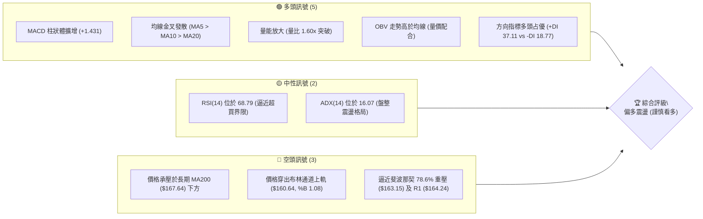
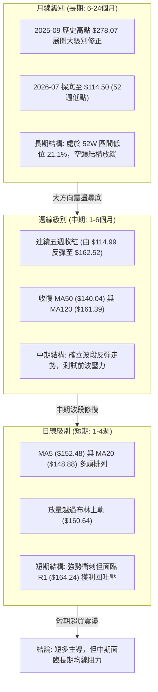
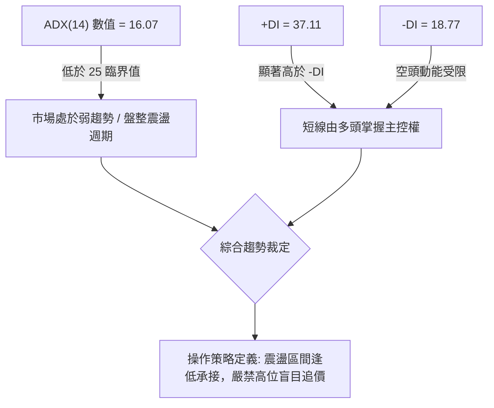
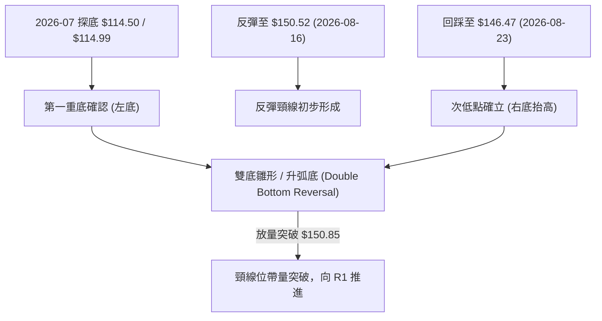
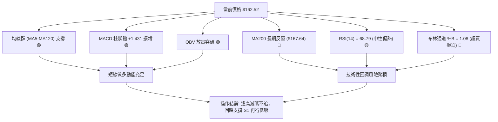
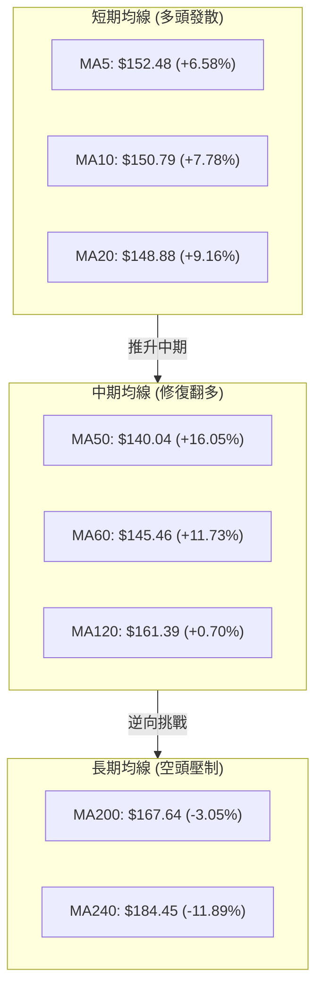
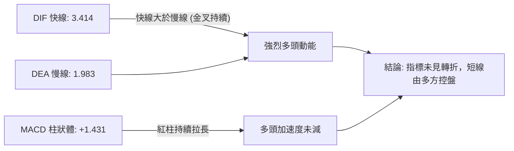
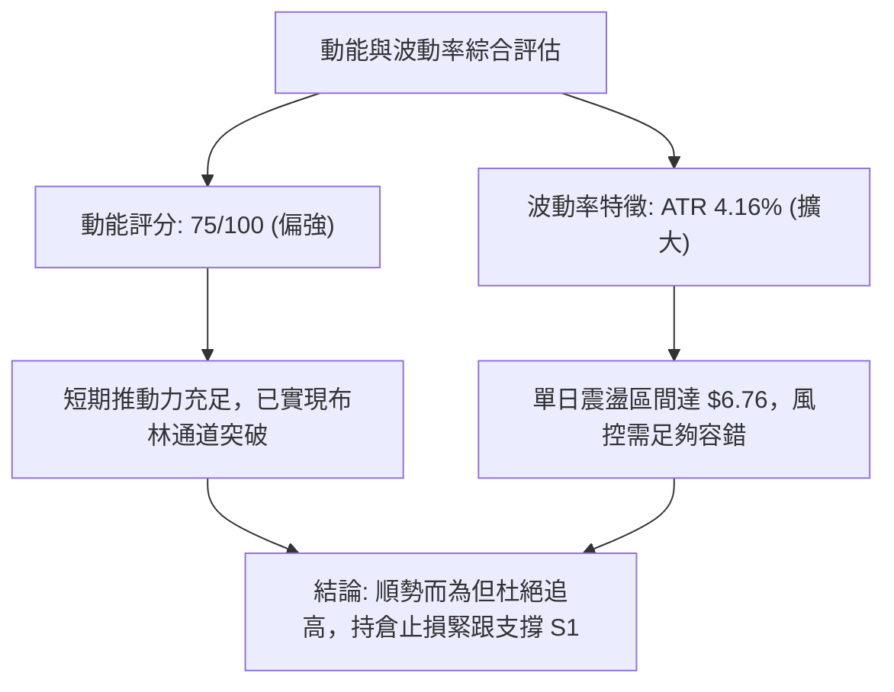
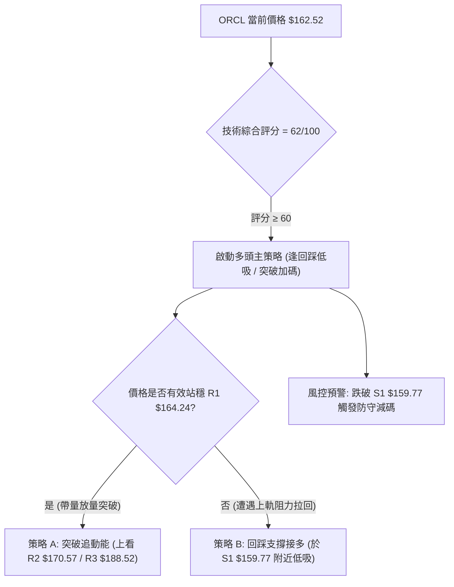
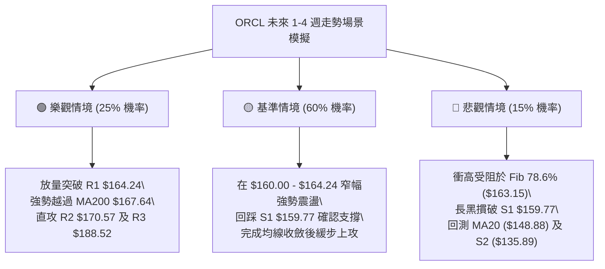

# ORCL 技術分析報告

> **報告日期**：2026-09-09 ｜ **語言**：繁體中文 ｜ **數據來源**：Yahoo Finance ｜ **當前價格**：$162.52

---

## 目錄

| 章節 | 內容 |
|------|------|
| [1. 技術面概覽](#1-技術面概覽) | 訊號儀表板、核心指標、評分卡 |
| [2. 趨勢分析](#2-趨勢分析) | 多時框趨勢、長中短期走勢 |
| [3. 圖表形態分析](#3-圖表形態分析) | 形態識別、K線組合、目標價 |
| [4. 支撐與阻力](#4-支撐與阻力) | 關鍵價位、斐波那契回調 |
| [5. 技術指標深度解讀](#5-技術指標深度解讀) | MA/RSI/MACD/布林/成交量 |
| [6. 動能與波動率](#6-動能與波動率) | 動能評估、ATR、Beta |
| [7. 多時框架總結](#7-多時框架總結) | 時框架評分矩陣 |
| [8. 交易策略建議](#8-交易策略建議) | 多空策略、風險報酬比 |
| [9. 風險提示與監控](#9-風險提示與監控) | 監控指標、風險場景 |
| [10. 報告總結](#-報告總結) | 核心結論與最佳策略總結 |

---

## 1. 技術面概覽

### 🎯 技術訊號儀表板



### 📊 核心指標速覽表

| 指標類別 | 指標名稱 | 當前數值 | 訊號 | 解讀 |
|----------|----------|----------|------|------|
| **價格** | 當前價格 | $162.52 | 🟢 多頭 | 站穩短期均線群，處於自 $114.50 低點反彈之強勢上升浪 |
| **短期均線** | MA20 | $148.88 | 🟢 多頭 | 價格高於 MA20 達 +9.16%，短期動能強勁 |
| **中期均線** | MA50 | $140.04 | 🟢 多頭 | 價格高於 MA50 達 +16.05%，波段支撐穩固 |
| **長期均線** | MA200 | $167.64 | 🔴 空頭 | 價格仍位於年線下方 -3.05%，長期趨勢未確立完全反轉 |
| **動能** | RSI(14) | 68.79 | 🟡 中性 | 動能充足但逼近 70 超買警戒線，短線有震盪整理需求 |
| **動能** | MACD (12,26,9) | 3.414 / 柱狀 +1.431 | 🟢 多頭 | 快線高於慢線，柱狀體持續擴大，多頭動能充沛 |
| **趨勢強度** | ADX(14) | 16.07 | 🟡 盤整 | 數值 < 25 表明非單邊強趨勢，視為區間震盪型反彈 |
| **通道狀態** | Bollinger Bands | 上軌 $160.64 / %B 1.08 | 🔴 預警 | 穿出上軌存在均值回歸壓力，短線乖離率偏高 |
| **量能狀態** | 成交量 / 20日均量 | 37,505,700 / 1.60x | 🟢 多頭 | 放量上攻，量能結構有效支撐近期反彈 |
| **波動度** | ATR(14) | $6.76 (4.16%) | 🟡 中等 | 每日平均波動幅度約 $6.76，風控需保留相應安全墊 |

### 🏆 技術評分卡

```
╔══════════════════════════════════════════════════════════════╗
║              技術評分卡 — ORCL (2026-09-09)                 ║
╠══════════════════════════════════════════════════════════════╣
║ 趨勢強度 (Trend)     ███████░░░░░░░░░░░░░  35/100  🔴 空頭壓制║
║ 動能指標 (Momentum)  ███████████████░░░░░  75/100  🟢 動能充沛║
║ 支撐穩定度 (Support) ██████████████░░░░░░  70/100  🟢 底層紮實║
║ 成交量配合 (Volume)  ████████████████░░░░  80/100  🟢 放量確認║
║ 形態完整度 (Pattern) █████████████░░░░░░░  65/100  🟡 築底突破║
║ 均線排列 (MA System) ████████░░░░░░░░░░░░  48/100  🟡 混合排列║
╠══════════════════════════════════════════════════════════════╣
║ 綜合技術評分         ████████████░░░░░░░░  62/100  偏多震盪  ║
╚══════════════════════════════════════════════════════════════╝
```

---

## 2. 趨勢分析

### 🌐 多時框趨勢分析



### 📈 長期趨勢 — 12個月走勢圖（Unicode）

```
ORCL 月線收盤價走勢圖（過去12個月：2025-10 至 2026-09）
價格軸 ($)
$280 ┤
$260 ┤●(2025-10: $260.10)
$240 ┤
$220 ┤                      ●(2026-05: $225.00)
$200 ┤    ●(2025-11: $200.02)
$180 ┤        ●(2025-12: $193.05)
$160 ┤            ●(01: $163.44)  ●(04: $160.83)        ●(現在: $162.52)
$140 ┤                ●(02: $144.39)  ●(03: $146.09) ●(06: $146.04)  ●(08: $149.12)
$120 ┤                                              ●(2026-07: $129.87)
     └─────────────────────────────────────────────────────────────
       10  11  12  01  02  03  04  05  06  07  08  09 (月份)
```

#### 走勢特徵分析表格

| 階段區間 | 起止價格 | 漲跌幅 | 走勢特徵分析 | 量能配合 |
|----------|----------|--------|--------------|----------|
| **2025-10 ~ 2026-02** | $260.10 → $144.39 | -44.49% | 主跌浪修正，單邊下挫跌破多條長期均線 | 拋售壓力持續釋放 |
| **2026-02 ~ 2026-05** | $144.39 → $225.00 | +55.83% | 強力軋空反彈，一度逼近前高形成假突破 | 中期量能回補 |
| **2026-05 ~ 2026-07** | $225.00 → $114.50 | -49.11% | 二次快速探底，創下 52 週新低點 $114.50 | 恐慌盤湧現，週量破 2.5 億 |
| **2026-07 ~ 2026-09** | $114.50 → $162.52 | +41.94% | 築底後持續反彈，連續五週走揚突破短期阻力 | 量能溫和放大至 1.6x 均量 |

### 📊 中期趨勢（週線分析）

```
近期週線級別價格壓力與支撐階梯架構
價格 ($)
$188.52 ────────────────────────────── R3 強阻力（2026-06 起跌中繼區間）
   │
$170.57 ────────────────────────────── R2 阻力（2026-05 反彈頸線位）
   │
$167.64 ------------------------------ MA200 關鍵年線分水嶺
$164.24 ────────────────────────────── R1 短線強壓（近一年波段密集高點）
$163.15 ------------------------------ 斐波那契 78.6% 回調位
$162.52 ◄◄◄ 【當前現價】（處於上軌超買突破狀態）
   │
$159.77 ────────────────────────────── S1 近期支撐（前波突破平台）
   │
$148.88 ------------------------------ MA20 / 布林中軌
$140.04 ------------------------------ MA50 中期均線
   │
$135.89 ────────────────────────────── S2 強支撐（2026-08 上攻跳空起點）
   │
$114.50 ────────────────────────────── S3 底部支撐（52W Low 極限防守位）
```

### ⚡ 趨勢強度評估（ADX 解讀）



| 項目 | 當前數值 | 參考閾值 | 市場狀態評估 | 戰術含義 |
|------|----------|----------|--------------|----------|
| **ADX(14)** | 16.07 | 25.00 | 弱趨勢 / 寬幅震盪 | 趨勢指標鈍化，價格易在關鍵支撐阻力間來回洗盤 |
| **+DI** | 37.11 | 20.00 | 多頭擴張 | 短線推升動能充沛，空頭暫無反撲空間 |
| **-DI** | 18.77 | 20.00 | 空方退縮 | 賣壓暫時衰竭，低位買盤承接意願高 |
| **DI差值** | +18.34 | > 0 | 多方絕對優勢 | 順應短多節奏，但隨時注意動能衰竭轉折 |

---

## 3. 圖表形態分析

### 🔍 形態識別系統



#### 形態信心度與目標價評估

| 形態類別 | 信心度 | 判斷依據（引用數據） | 完成度 | 目標價（附嚴格計算式） |
|----------|--------|----------------------|--------|------------------------|
| **雙底形態 (W底)** | 65% | 2026-07-26 低點 $114.99 疊加 2026-08-23 次低點 $146.47（底部墊高），突破 2026-08-16 頸線收盤價 $150.52 | 85% | 由頸線高度推算：<br>頸線 $150.52 + 形態高度 ($150.52 - $114.99 = $35.53) = **$186.05**（接近阻力位 R3 $188.52） |
| **布林通道上軌突破** | 80% | 收盤價 $162.52 站上布林上軌 $160.64，%B 達到 1.08，配合 1.6x 均量放量突破 | 100% | 指標超買型突破，短期目標直指關鍵阻力位 **R1: $164.24** |
| **頭肩底形態** | 35% | 左肩 $129.87、頭部 $114.50、右肩 $146.47，但右肩時間跨度過短 | 40% | *數據不足以確認完整結構，依規則僅作輔助觀察，不設定衍生目標價* |

### 🕯️ 重要K線形態分析

| 週別 / 日期 | 收盤價 | K線形態 | 量能解讀 | 多空訊號 |
|-------------|--------|---------|----------|----------|
| **2026-07-26** | $114.99 | 長下影破底錘頭線 (Hammer) | 週量 162.9M 爆量收長下影，賣盤竭盡 | 🟢 觸底反轉訊號 |
| **2026-08-09** | $147.02 | 帶量突破長紅實體棒 | 週量 162.8M，RSI 由 48.6 激增至 71.8 | 🟢 強力多頭啟動 |
| **2026-08-23** | $146.47 | 高檔震盪小陰孕線 (Harami) | 週量縮減至 101.1M，回踩測試支撐未破 | 🟡 中繼良性換手 |
| **2026-09-06** | $158.78 | 突破陽線，站上整數關卡 | 量能放大至 115.0M，吞噬前兩週整理平台 | 🟢 攻擊形態確立 |
| **2026-09-13** | $162.52 | 延伸上影微紅線 (挑戰阻力) | 日量 37.5M（換算週量能延續），衝高遭遇 R1 | 🟡 獲利了結回吐 |

### 📉 ASCII 走勢形態示意圖

```
ORCL 雙底反彈突破形態結構圖
 價格 ($)
 $170.57 ┤                                           [R2 阻力]
 $164.24 ┤                                 ●(測試中) [R1 阻力]
 $162.52 ┤                                ▲ [現價 $162.52]
 $150.52 ┤        ●(頸線高點)            /
 $146.47 ┤         \                    ●(次低點/右底抬高)
 $140.04 ┤──────────\──────────────────/────── [MA50 支撐]
 $126.41 ┤            \                /
 $114.50 ┤             ●(最低點/左底) /        [S3 / 52W Low]
         └───────────────────────────────────────
           2026-07-12   07-26   08-16  08-23   09-09
```

---

## 4. 支撐與阻力

### 🗺️ 關鍵價位分布圖（Unicode）

```
ORCL 關鍵價位空間分布圖
═══════════════════════════════════════════════════════════════
$188.52 ║████████████████████████████████║ 強阻力 R3 (形態極限目標)
$170.57 ║████████████████████            ║ 波段阻力 R2 (前波密集區)
$167.64 ║--------------------------------║ MA200 年線長期反轉壓
$164.24 ║████████████████████████████    ║ 短線阻力 R1 (波段高點聚類)
$163.15 ║--------------------------------║ 斐波那契 78.6% 阻力位
$162.52 ╠════════════════════════════════╣ ◄─── 當前現價 ($162.52)
$159.77 ║▓▓▓▓▓▓▓▓▓▓▓▓▓▓▓▓▓▓▓▓▓▓▓▓▓▓      ║ 近期支撐 S1 (前波突破轉換)
$148.88 ║--------------------------------║ MA20 / 布林中軌支撐
$140.04 ║--------------------------------║ MA50 中期生命線
$135.89 ║████████████████████████        ║ 強支撐 S2 (起漲結構低點)
$114.50 ║████████████████████████████████║ 底部支撐 S3 (52W 最低點)
═══════════════════════════════════════════════════════════════
```

### 🚧 阻力位分析表

| 阻力級別 | 價位 | 形成原因 | 突破難度 | 重要性 |
|----------|------|----------|----------|--------|
| **R1** | $164.24 | 近一年波段高點聚類，距離現價僅 +1.06%，與 Fib 78.6% ($163.15) 高度重疊 | 🟡 中等 | 判定短線多頭能否直接擴張戰果的咽喉關卡 |
| **R2** | $170.57 | 近一年波段次高密集籌碼區 (+4.95%)，位於年線 MA200 ($167.64) 上方 | 🔴 極高 | 突破此處代表多頭由「跌深反彈」正式升格為「大級別反轉」 |
| **R3** | $188.52 | 近一年高波段聚類頂部 (+16.00%)，亦為 W 底測幅理論目標價 ($186.05) 區域 | 🔴 極高 | 中期波段修正反彈的終極壓力測試區 |

### 🛡️ 支撐位分析表

| 支撐級別 | 價位 | 形成原因 | 守住機率 | 重要性 |
|----------|------|----------|----------|--------|
| **S1** | $159.77 | 近一年波段低點聚類 (-1.69%)，與日線布林上軌 ($160.64) 形成頂底轉換 | 🟢 75% | 短線多頭防守底線，守穩代表維持超強勢攻擊架構 |
| **S2** | $135.89 | 近一年波段低點聚類 (-16.38%)，位於 MA50 ($140.04) 下方之籌碼真空帶底部 | 🟢 85% | 中期結構多空分水嶺，若失守恐再次回測深淵 |
| **S3** | $114.50 | 52 週最低點 (-29.55%)，年內雙底極限頸線底部 | 🟢 95% | 公司長期估值極端折價防線，戰略性抄底防守點 |

### 📐 斐波那契回調位分析

依據 52 週極值區間（低點 $114.50 至 高點 $341.82，總垂直跨度 $227.32）回調計算：

| 斐波那契回調位 | 價位 | 當前相對位置 | 技術意涵解讀 |
|----------------|------|--------------|--------------|
| **0.0% (52W High)** | $341.82 | +110.32% | 歷史極限高點，目前不具備直接參考性 |
| **23.6%** | $288.18 | +77.32% | 長期多頭回撤第一防線 |
| **38.2%** | $254.99 | +56.89% | 中期強勢回檔位 |
| **50.0%** | $228.16 | +40.39% | 2026-05 反彈頂部 ($225.00) 驗證之多空中軸 |
| **61.8%** | $201.34 | +23.88% | 黃金分割黃金阻力位，長期熊市反彈關鍵防線 |
| **78.6%** | **$163.15** | **+0.39%** | **◄ 現價 ($162.52) 正貼身肉搏此關鍵回調阻力** |
| **100.0% (52W Low)**| $114.50 | -29.55% | 本輪熊市探底終點，實質大底支撐 |

> **深度解讀**：現價 $162.52 距離 78.6% 回調位 ($163.15) 僅差 $0.63，與短線阻力 R1 ($164.24) 形成緊密的共振阻力帶。若能放量有效突破 $164.24，上方直至 61.8% ($201.34) 及 R2 ($170.57) 將具備廣闊的補漲空間。

---

## 5. 技術指標深度解讀

### 🎛️ 指標訊號總覽



### 📈 移動平均線排列分析



| 均線名稱 | 當前價位 | 乖離率 (%) | 排列特徵 | 訊號含義 |
|----------|----------|------------|----------|----------|
| **MA5** | $152.48 | +6.58% | 最前端陡峭上行 | 短線極限加速線，跌破此線代表極短線動能停滯 |
| **MA20** | $148.88 | +9.16% | 連續 20 日仰角上升 | 多頭第一波波段護航中軌，具備強烈動態支撐 |
| **MA50** | $140.04 | +16.05% | 走平後向上翹起 | 中期波段生命線，徹底擺脫前期陰跌走勢 |
| **MA120** | $161.39 | +0.70% | 剛被現價突破 | 半年線阻力轉支撐，正進行有效性回踩確認 |
| **MA200** | $167.64 | -3.05% | 持續緩慢向下 | 年線重壓，歷史多次反彈均在此遇阻回落 |
| **MA240** | $184.45 | -11.89% | 明顯下行趨勢 | 兩年牛熊界限，空頭長期防線 |

### 📉 RSI(14) 分析

*   **當前數值**：**68.79**（處於 30 至 70 區間高檔邊界）
*   **動能進度條**：
    `超賣 0 [░░░░░░░░░░░░░░░░░░░░████████████████████████████░░░░░] 100 超買 (68.79)`
*   **超買超賣研判**：數值逼近 70 超買警戒線。歷史走勢中，週線於 2026-08-16 達到 74.6 後曾出現連續兩週回調（回落至 54.6），當前日線 68.79 表明買盤已推升至極限邊緣，隨時可能觸發短線冷卻。
*   **背離檢驗**：
    *   *頂背離檢定*：價格創出反彈新高 $162.52，RSI 亦同步從 49.8 攀升至 68.79，高點相互吻合，**無頂背離現象**。
    *   *底背離檢定*：2026-07 探底 $114.50 時週線 RSI 低見 12.5，後續在 $114.99 時 RSI 回升至 26.7，已形成大級別底背離確認，驅動了本波強勁反彈。

### 📊 MACD(12,26,9) 訊號解讀



*   **數值解讀**：DIF (3.414) 明確位於零軸上方，且顯著大於 DEA (1.983)，差距達 +1.431。
*   **柱狀體趨勢**：近兩週週線 MACD 柱狀體由 +0.811 擴張至 +0.911，再到日線級別的 +1.431，呈現擴散放大型態，顯示主力推升動能仍在發力。

### 📦 布林通道分析

```
ORCL 布林通道截面示意圖 (Bandwidth: $23.51)
══════════════════════════════════════════════════════════════
$160.64 ───┬─────────────────────────────────── 上軌 (突破超買)
           │ ▲ 現價 $162.52 (%B = 1.08)
           │
$148.88 ───┼─────────────────────────────────── 中軌 (MA20 基準線)
           │
           │
$137.13 ───┴─────────────────────────────────── 下軌 (安全邊際)
══════════════════════════════════════════════════════════════
```

*   **通道特徵**：上軌 $160.64、中軌 $148.88、下軌 $137.13，帶寬開展。
*   **現價位置**：%B 高達 **1.08**，代表收盤價已完全躍出布林通道上軌之外。依據統計學均值回歸原則，%B > 1.00 通常預示短期存在鈍化或拉回上軌內部的修正風險，不可在此位置進行市價追價。

### 💹 成交量分析（量價配合度）

*   **成交量變化**：當日最新成交量為 **37,505,700** 股，相較於 20 日均量 **23,385,620** 股，量比達到 **1.60x**（放大 60%）。
*   **量價配合狀態**：價格大漲創波段新高，成交量同步放大，呈現健康的「價漲量增」多頭確認結構。
*   **OBV 能量潮判讀**：當前 OBV 線明確穿過其均線並持續攀升，OBV > MA 表明資金呈淨流入態勢，機構買盤持續在場內吸收拋壓。

---

## 6. 動能與波動率

### ⚡ 動能評估四象限

| 象限 | 動能強度 (Momentum) | 波動率狀態 (Volatility) | 當前 ORCL 所處位置 | 戰術指引 |
|------|---------------------|--------------------------|-------------------|----------|
| **Q1 (最佳擴張)** | 強 (+DI: 37.11, MACD>0) | 低 (ADX: 16.07 弱趨勢) | **✓ [核心定位 Q1-Q3交界]** | **適合順勢持倉，防範波動驟升引起的洗盤** |
| **Q2 (謹慎觀望)** | 弱 (+DI 衰竭) | 低 (盤整) | — | 資金使用效率低，宜空倉觀望 |
| **Q3 (爆發拉升)** | 強 (放量突破) | 高 (ATR: 4.16% 偏高) | 部分特徵符合 | 追高風險大，須利用日內急跌回踩進場 |
| **Q4 (恐慌出逃)** | 弱 (空頭跌勢) | 高 (恐慌殺跌) | — | 絕對禁止參與 |



### 📊 ATR 波動率分析

*   **ATR(14) 數值**：**$6.76**，佔當前股價比例為 **4.16%**。
*   **波動性解讀**：日均震盪幅度高達 $6.76，意味著任何日內洗盤都有可能波動接近 4%。
*   **止損與風控設置指引**：
    *   *激進型短線止損*：1.0 × ATR = 現價 - $6.76 = **$155.76**。
    *   *標準波段止損*：1.5 × ATR = 現價 - $10.14 = **$152.38**（恰好落在短期 MA5 $152.48 附近）。
    *   *保守結構止損*：直接參考關鍵支撐位 **S1: $159.77** 或 MA20 **$148.88**。

### 📐 Beta 與市場相關性

*   **Beta 係數**：**1.732**。
*   **市場敏感度解讀**：ORCL 屬於極高彈性個股，當標普 500 或納斯達克指數波動 1% 時，ORCL 理論上將同向波動 **1.73%**。在當前科技股大盤反彈氛圍下，ORCL 展現出超越大盤的彈升力道，但在市場轉弱時亦承擔高於平均的下行 Beta 風險。

---

## 7. 多時框架總結

### 📋 時框架評分表

| 時框架 | 趨勢方向 | 動能狀態 | 均線系統排列 | 圖表形態 | 綜合評分 | 戰術建議 |
|--------|----------|----------|--------------|----------|----------|----------|
| **日線 (Daily)** | 🟢 多頭主導 | 強勁 (MACD柱拉長) | 多頭排列 (MA5>10>20) | 突破布林通道上軌 | **78/100** | 逢回踩 S1 布局，不可追高 |
| **週線 (Weekly)** | 🟢 震盪翻多 | 良好 (連續五週走升) | 突破 MA50，逼近 MA120 | 築雙底反彈形態 | **65/100** | 持股續抱，目標上看 R2/R3 |
| **月線 (Monthly)** | 🔴 長期承壓 | 弱勢反彈尋底中 | 承壓於 MA200/240 | 自 52W 低點修正回升 | **42/100** | 當作大級別空頭反彈處理 |

### 🔲 綜合訊號矩陣

```
╔═══════════════════════════════════════════════════════════════════╗
║                      多時框架綜合訊號矩陣                         ║
╠══════════════╦════════════╦════════════╦════════════╦═════════════╣
║ 評估維度     ║ 短期(日線) ║ 中期(週線) ║ 長期(月線) ║ 綜合一致性  ║
╠══════════════╬════════════╬════════════╬════════════╬═════════════╣
║ 趨勢方向     ║  🟢 多頭   ║  🟢 偏多   ║  🔴 空頭   ║  🟡 衝突    ║
║ 動能指標     ║  🟡 超買   ║  🟢 向上   ║  🔴 偏弱   ║  🟡 分歧    ║
║ 支撐/阻力    ║  🔴 臨壓   ║  🟢 踩穩   ║  🔴 壓制   ║  🟡 臨壓震盪║
║ 量能支持     ║  🟢 放量   ║  🟢 擴增   ║  🟡 平淡   ║  🟢 良好    ║
╚══════════════╩════════════╩════════════╩════════════╩═════════════╝
```

### ⚖️ 多時框收斂結論

依據多時框收斂規則（嚴格要求 14）：
1.  **市場屬性裁定**：當前 ADX(14) 僅為 **16.07**（遠小於 25.0），屬於典型的**「大級別弱趨勢盤整、日線級別波段反彈」**格局。
2.  **時框權重取捨**：由於處於盤整震盪市場，**交易策略不得按單邊突破追價邏輯處理，而必須依據日線布林通道與關鍵支撐阻力進行區間與回踩操作**。日線雖呈現強勁推升（MACD 多頭、+DI 37.11），但已逼近長週期阻力線 MA200 ($167.64) 及斐波那契 78.6% 重壓 ($163.15)。
3.  **唯一方向性結論**：**【謹慎偏多，回踩低吸】**。主策略維持多頭，但拒絕在現價 $162.52 追多，核心建倉點必須等待價格拉回至支撐 S1 ($159.77) 或日線均線密集區確認有守後介入。

---

## 8. 交易策略建議

### 🗺️ 策略決策流程圖



### 🧭 策略路由

**當前主策略方向 = 【主推多頭策略（突破回踩逢低佈局）】（依評分 62/100 偏多震盪判定）**

### 🎯 價格情境階梯（Price Scenarios）

| 觸發條件 | 下一目標 | 後續延伸 | 情境含義與操作指引 |
|----------|----------|----------|-------------------|
| **向上放量突破 R1 ($164.24)** | **R2 ($170.57)** | **R3 ($188.52)** | **短線強勢加速**：突破 Fib 78.6% 重壓，挑戰 MA200 年線 ($167.64) 與 R2，多單可順勢擴大獲利 |
| **受阻於 R1 在區間內震盪** | **現價 ($162.52)** | **S1 ($159.77)** | **高檔強勢換手**：消化布林上軌乖離，以盤代跌回踩 S1 鞏固底部，為最佳分批低吸契機 |
| **向下跌破支撐 S1 ($159.77)** | **S2 ($135.89)** | **S3 ($114.50)** | **波段反彈破位**：均線結構遭到破壞，回踩 MA20 ($148.88) 甚至深測 S2，多單必須果斷止損離場 |

### 📊 情境機率分佈

```
情境機率分佈長條圖
繼續上行 / 反彈突破 (55%) ███████████████████████████░░░░░░░░░░░░
區間震盪消化乖離 (30%)     ███████████████░░░░░░░░░░░░░░░░░░░░░░░
回落破位再探深底 (15%)     ███████░░░░░░░░░░░░░░░░░░░░░░░░░░░░░░
```

| 情境 | 機率 | 主要依據 |
|------|------|----------|
| **繼續上行 / 反彈** | **55%** | MACD 柱狀體擴增 (+1.431)，成交量比放大至 1.60x，OBV 量價配合良好 |
| **區間震盪換手** | **30%** | ADX 僅 16.07 (盤整特徵)，RSI 68.79 逼近超買，布林通道 %B 達 1.08 存在拉回引力 |
| **回落 / 再探底** | **15%** | 遭遇年線 MA200 ($167.64) 空頭長壓，若科技板塊突發大幅回調可能誘發多殺多 |

### 🟢 主策略詳情

本報告依嚴格規則，主推兩套在不同市況下執行的多頭策略：

| 策略要素 | 策略 A（右側突破動能單） | 策略 B（左側回踩承接單 - 推薦） |
|----------|--------------------------|----------------------------------|
| **進場條件** | 日K收盤確認突破 R1，且量比維持 1.5x 以上 | 價格技術性回踩 S1 獲得支撐，出現下影線確認 |
| **進場價格** | **$164.50**（突破 R1 $164.24 後追進） | **$159.77**（掛單於 S1 支撐位或現價拉回點） |
| **目標價 T1** | **$170.57**（阻力位 R2，漲幅 +3.69%） | **$164.24**（阻力位 R1，漲幅 +2.80%） |
| **目標價 T2** | **$188.52**（阻力位 R3，漲幅 +14.60%） | **$170.57**（阻力位 R2，漲幅 +6.76%） |
| **止損價格** | **$159.77**（跌破 S1 支撐點，風險 -$4.73） | **$155.00**（跌破 S1 緩衝區約 0.7xATR，風險 -$4.77） |
| **風險報酬比 (T2)**| **1 : 5.08**（潛在報酬 $24.02 / 風險 $4.73） | **1 : 2.26**（潛在報酬 $10.80 / 風險 $4.77） |
| **成功機率** | **52%** | **68%** |
| **建議倉位** | **15%**（突破追單防假突破） | **25%**（回踩穩健標準倉位） |

### 🔴 反向風險觸發點（對沖提示）

*   **關鍵空頭轉折價位**：**$159.77 (S1)**。
*   **觸發條件**：若 ORCL 日線以大陰線跌破 **$159.77**，且單日成交量高於 50 日均量（31.75M），代表短線布林假突破確立。
*   **對沖處置建議**：多單全部停損平倉；激進投資者可建立輕倉空頭避險，下檔首要目標下看 MA20 ($148.88) 及強支撐 S2 ($135.89)。

### ⭐ 整體訊號強度評星

```
做多訊號強度：★★★★☆  (4/5星：短線動能完好，量價配合)
做空訊號強度：★★☆☆☆  (2/5星：僅有阻力位壓制，未見做空形態)
整體可信度：  ★★★★☆  (4/5星：指標與斐波那契價位高度共振)
```

---

## 9. 風險提示與監控

### ✅ 關鍵監控指標 Checklist

```
╔══════════════════════════════════════════════════════════════╗
║               ORCL 每日關鍵技術監控清單 (Checklist)           ║
╠══════════════════════════════════════════════════════════════╣
║ [ ] 價格能否有效收復並站穩 R1 ($164.24)                      ║
║ [ ] 價格回踩時，支撐 S1 ($159.77) 是否有強烈買盤承接          ║
║ [ ] RSI(14) 是否突破 70 進入鈍化，或出現頂背離調頭向下       ║
║ [ ] 日成交量是否萎縮至 20日均量 ($23.38M) 之下（動能衰竭警訊）║
║ [ ] MACD 柱狀體是否出現第一根收斂縮短（綠柱轉折徵兆）         ║
║ [ ] 是否觸及 MA200 年線 ($167.64) 之強烈技術性拋壓            ║
╚══════════════════════════════════════════════════════════════╝
```

### ⚠️ 風險場景分析



### 🛡️ 風險管理重要提醒

1.  **波動率控管**：ORCL 當前 ATR 為 **$6.76 (4.16%)**，單日潛在震盪劇烈。投資者在設定止損時切勿過窄，建議至少給予 1.0x 至 1.5x ATR 的浮動空間，避免因盤中噪音洗盤被震盪出局。
2.  **高 Beta 風險預警**：個股 Beta 值高達 **1.732**，對標普 500 與大型科技股財報及宏觀利率情緒極為敏感。若大盤指數出現拉回，ORCL 將面臨放大倍數的回調壓力。
3.  **布林極限乖離警示**：%B 達到 **1.08**，技術上屬於極端值。歷史經驗表明，股價難以在無重大基本面刺激下長時間脫離布林上軌運行，近期隨時可能出現 1-3 天的均值回歸走勢。
4.  **資產配置建議**：單一交易策略（策略 B）建議倉位上限為 **25%**，總多頭暴露不宜超過投資組合之 40%，並嚴格以 **S1: $159.77** 為核心防守基準。

---

## 📋 報告總結

```
╔══════════════════════════════════════════════════════════════════╗
║                   ORCL 技術分析報告總結                         ║
╠══════════════════════════════════════════════════════════════════╣
║ 報告日期：2026-09-09                                            ║
║ 當前價格：$162.52                                               ║
║ 綜合技術評級：⚖️ 偏多震盪 (評分: 62/100) — 謹慎看多              ║
║                                                                  ║
║ 關鍵架構結論：                                                   ║
║ ├─ 長期趨勢：🔴 偏空震盪（處於 52W 區間 21.1%，受制 MA200年線）  ║
║ ├─ 中期趨勢：🟢 築底反彈（自 $114.50 走出雙底反彈，連五週走揚）  ║
║ ├─ 短期趨勢：🟢 衝刺臨壓（放量突破布林上軌，面臨 R1 重壓帶）     ║
║ ├─ 關鍵支撐：S1: $159.77  │  S2: $135.89  │  S3: $114.50        ║
║ ├─ 關鍵阻力：R1: $164.24  │  R2: $170.57  │  R3: $188.52        ║
║ └─ 華爾街共識目標：$241.43 (Buy 評級)                            ║
║                                                                  ║
║ 最優交易策略組合：                                               ║
║ 1. 🥇 最佳機會（策略 B）：耐性等待價格回踩 S1 $159.77 附近低吸， ║
║    止損設於 $155.00，目標上看 R1 $164.24 與 R2 $170.57 (風報比優)║
║ 2. 🥈 次選機會（策略 A）：若強勢放量突破 R1 $164.24，追入右側動能║
║    單，目標看至 MA200 上方之 R2 $170.57 及 R3 $188.52           ║
║ 3. 🥉 保守選擇：空手觀望，靜待現價消化 %B 1.08 之超買乖離，     ║
║    待 ADX 升穿 25 或價格站穩年線 MA200 ($167.64) 後再行大舉進場║
╚══════════════════════════════════════════════════════════════════╝
```

---

> ⚠️ **免責聲明**：本報告為 AI 自動生成之技術分析，所有數據及估算均基於提供的歷史價格資訊。本報告**僅供研究與學術參考**，**不構成任何投資建議**。投資有風險，入市需謹慎。

---

*報告生成時間：2026-09-09 ｜ 數據來源：Yahoo Finance ｜ 分析框架：多時框技術分析*