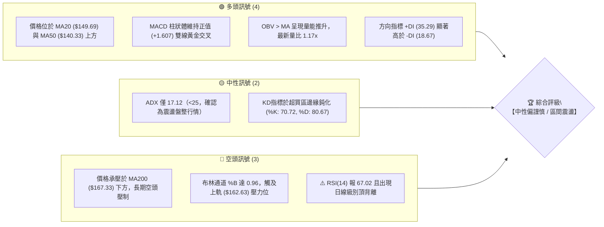
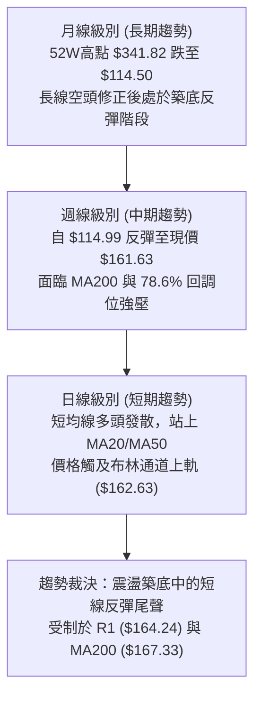
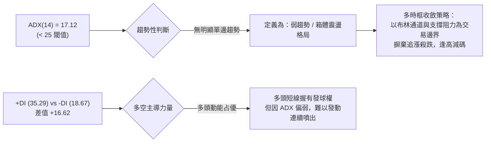
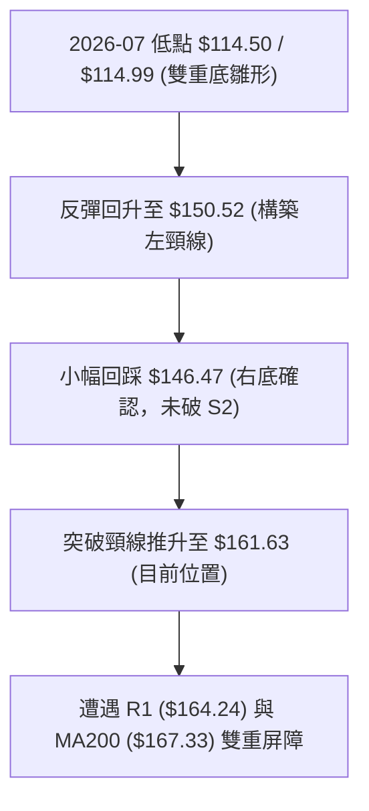
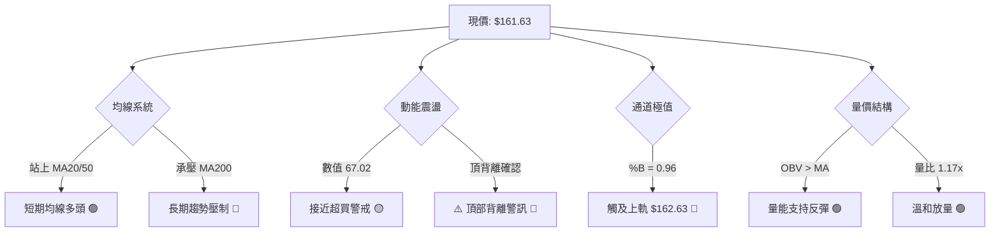
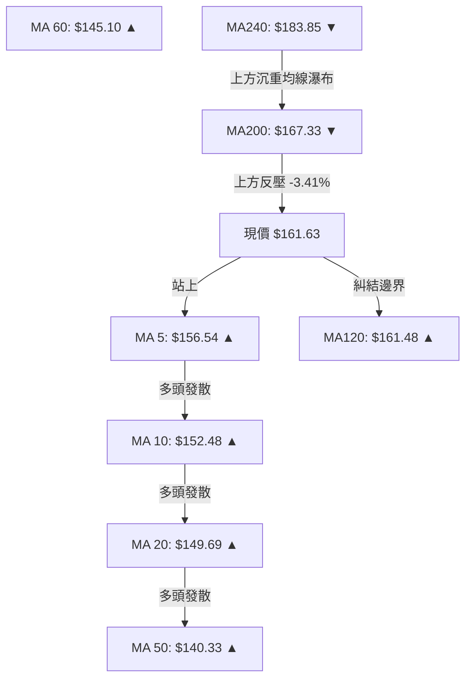
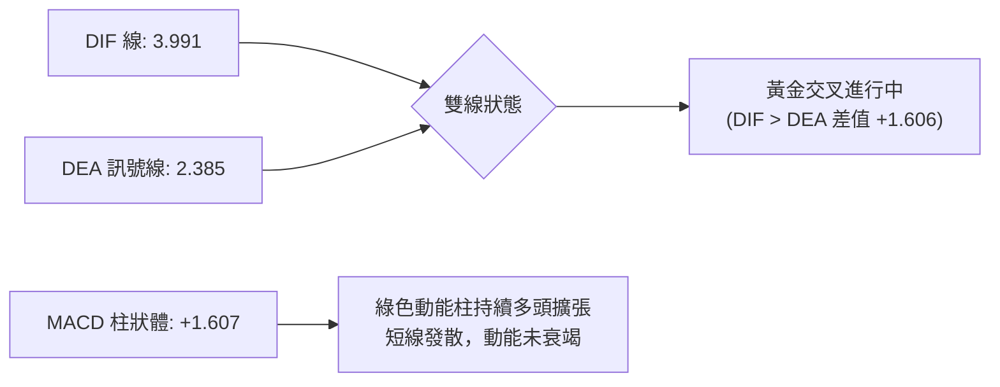
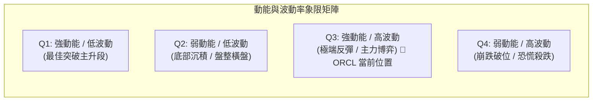
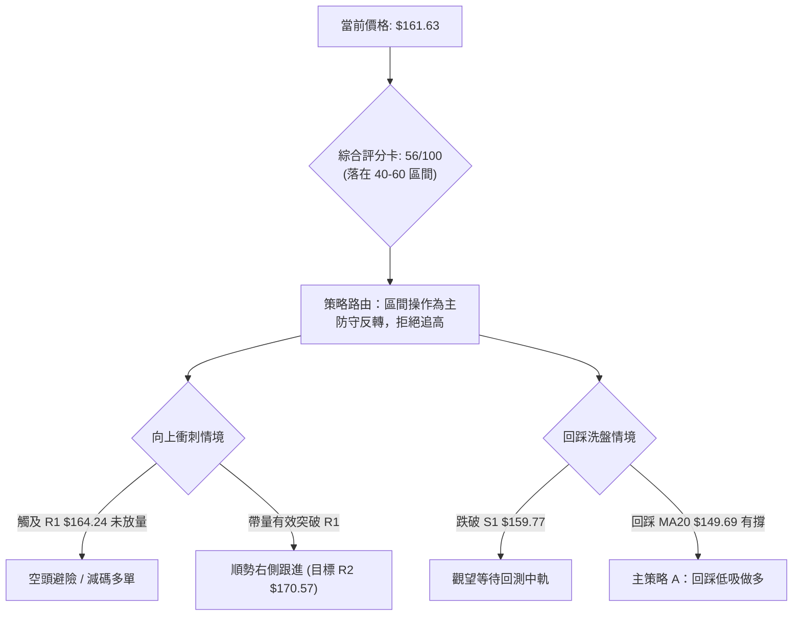
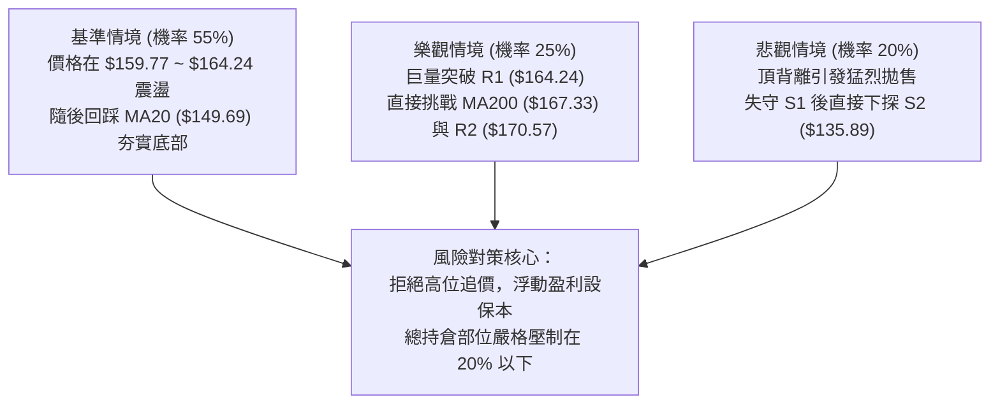

# ORCL 技術分析報告

> **報告日期**：2026-09-10 ｜ **語言**：繁體中文 ｜ **數據來源**：Yahoo Finance ｜ **當前價格**：$161.63

---

## 目錄

| 章節 | 內容 |
|------|------|
| [1. 技術面概覽](#1-技術面概覽) | 訊號儀表板、核心指標、評分卡 |
| [2. 趨勢分析](#2-趨勢分析) | 多時框趨勢、長中短期走勢、ADX解讀 |
| [3. 圖表形態分析](#3-圖表形態分析) | 形態識別、K線組合、形態信心度與目標價 |
| [4. 支撐與阻力](#4-支撐與阻力) | 關鍵價位分布、波段高低點聚類、斐波那契回調 |
| [5. 技術指標深度解讀](#5-技術指標深度解讀) | MA系統、RSI背離、MACD、布林通道、OBV量價 |
| [6. 動能與波動率](#6-動能與波動率) | 動能四象限、ATR波幅設定、Beta與市場聯動 |
| [7. 多時框架總結](#7-多時框架總結) | 時框架評分矩陣、多時框收斂定調 |
| [8. 交易策略建議](#8-交易策略建議) | 策略路由、價格情境階梯、區間與突破策略 |
| [9. 風險提示與監控](#9-風險提示與監控) | 關鍵監控清單、情境推演、風控與部位管理 |
| [📋 報告總結](#-報告總結) | 核心結論速查與執行路徑 |

---

## 1. 技術面概覽

### 🎯 技術訊號儀表板

ORCL 當前處於短期超跌反彈後面臨強壓力帶的關鍵博弈節點。日線動能偏多，但價格已運行至布林通道上軌邊界，且日線 RSI 出現頂背離隱憂，趨勢強度指標 ADX 顯示當前仍屬無趨勢的區間盤整行情。



---

### 📊 核心指標速覽表

| 指標類別 | 指標名稱 | 當前數值 | 訊號 | 專業技術解讀 |
|:---|:---|:---|:---:|:---|
| **價格結構** | 當前收盤價 | **$161.63** | 🟡 | 位於52週區間 20.7% 低檔位階，處於反彈中段 |
| **均線架構** | 短期 MA20 | **$149.69** | 🟢 | 股價位於 MA20 之上 +7.98%，短線多頭掌控支撐 |
| **均線架構** | 中期 MA50 | **$140.33** | 🟢 | 站上中期生命線，自 7 月低點築底回升確認有效 |
| **均線架構** | 長期 MA200 | **$167.33** | 🔴 | 股價受制於長期牛熊線下方 -3.41%，長線空頭趨勢未扭轉 |
| **動能指標** | RSI(14) | **67.02** | 🟡 | 接近超買區，但帶有明確頂背離訊號，慎防短線衝高回落 |
| **動能指標** | MACD (12,26,9)| **+1.607** | 🟢 | DIF 3.991 > DEA 2.385，柱狀體翻紅擴張，多頭發力中 |
| **趨勢強度** | ADX(14) | **17.12** | 🟡 | ADX < 25，無強烈單邊趨勢，行情以箱體高拋低吸為主 |
| **通道指標** | 布林 %B | **0.96** | 🔴 | 極度逼近上軌 $162.63，向上空間收窄，統計學超買 |
| **成交量能** | 量比 (vs 20MA)| **1.17x** | 🟢 | 當日成交 27.35M 高於月均量，OBV 保持多頭架構 |
| **波動屬性** | ATR(14) | **$6.48** | 🟡 | 日波動率 4.01%，區間操作止損預留空間需足夠 |

---

### 🏆 技術評分卡

```
╔══════════════════════════════════════════════════════════════════╗
║                   技術評分卡 — ORCL (2026-09-10)                 ║
╠══════════════════════════════════════════════════════════════════╣
║ 趨勢強度 (Trend)     ████████░░░░░░░░░░░░  40/100  🔴 盤整格局    ║
║ 動能指標 (Momentum)  ████████████░░░░░░░░  60/100  🟡 動能有背離  ║
║ 支撐穩定度 (Support) ██████████████░░░░░░  70/100  🟢 底層支撐穩  ║
║ 成交量配合 (Volume)  ██████████████░░░░░░  70/100  🟢 價量齊揚    ║
║ 形態完整度 (Pattern) ██████████░░░░░░░░░░  50/100  🟡 區間待突圍  ║
║ 均線排列 (MAs)       ██████████░░░░░░░░░░  50/100  🟡 混合發散    ║
╠══════════════════════════════════════════════════════════════════╣
║ 綜合技術評分         ███████████░░░░░░░░░  56/100  評級：區間操作 ║
╚══════════════════════════════════════════════════════════════════╝
```

---

## 2. 趨勢分析

### 🌐 多時框趨勢分析

根據「多時框收斂規則」，當前 ADX(14) = 17.12（< 25），技術格局確認為**盤整行情**。在此體系下，交易視角以日線布林通道 ($136.76 ~ $162.63) 及關鍵高低點聚類作為主要區間，長期趨勢則提供阻力邊界。



---

### 📈 長期趨勢 — 12個月走勢圖（Unicode）

以下為 ORCL 過去 12 個月（2025-09 至 2026-09）的月線走勢圖與關鍵轉折分析：

```
ORCL 月線走勢圖（過去12個月：2025-09 至 2026-09）
價格軸 ($)
$280 ┤ ● (2025-09: $278.07 波段高點)
$260 ┤   ●
$240 ┤
$220 ┤                             ● (2026-05: $225.00 跌深反彈假突破)
$200 ┤     ●   ●
$180 ┤
$160 ┤         ●             ●         ●← (2026-09 現價: $161.63)
$140 ┤             ●   ●         ●   ●
$120 ┤                                 ● (2026-07: $129.87 / 52W低點聚類 $114.50)
     └─┬───┬───┬───┬───┬───┬───┬───┬───┬───┬───┬───┬───
     09  10  11  12  01  02  03  04  05  06  07  08  09 (月份)
```

#### 過去 12 個月走勢特徵分析表

| 階段區間 | 價格變動 ($) | 漲跌幅 (%) | 價量特徵與形態解讀 | 趨勢結論 |
|:---|:---|:---:|:---|:---:|
| **2025-09 ~ 2025-11** | $278.07 → $200.02 | -28.07% | 高檔放量下挫，跌破長期支撐頸線，主力出貨確立 | 🔴 空頭開啟 |
| **2025-12 ~ 2026-02** | $193.05 → $144.39 | -25.21% | 持續陰跌，均線下彎，市場情緒陷入極度悲觀 | 🔴 主跌浪延伸 |
| **2026-03 ~ 2026-05** | $146.09 → $225.00 | +54.01% | 報復性反彈，5 月創出階段高點 $225.00，測試上方壓力套牢區 | 🟢 強勢反彈 |
| **2026-06 ~ 2026-07** | $212.94 → $129.87 | -39.01% | 反彈失敗，市場二次探底，創下 52 週波段新低 $114.50 | 🔴 二次尋底 |
| **2026-08 ~ 2026-09** | $129.87 → $161.63 | +24.46% | 觸底回升，成交量逐步溫和回暖，形成階梯式震盪反彈 | 🟢 震盪修復 |

---

### 📊 中期趨勢（週線分析）

中期走勢顯示，ORCL 自 2026 年 7 月下旬打出 52 週最低價聚類區間（S3: $114.50，週線低收 $114.99）後展開持續 7 週的反彈行情。

```
ORCL 中期阻力與支撐示意圖（週線結構）
========================================================================
[阻力 R3] $188.52  ────────────────────────────────────────── (強壓，下行通道上軌)
[阻力 R2] $170.57  ────────────────────────────────────────── (波段中樞壓力)
[阻力 R1] $164.24  ────── [MA200: $167.33] ────────────────── (密集套牢頸線區)
[當前現價] $161.63  ◄─── 逼近斐波 78.6% 回調位 ($163.15)
[支撐 S1] $159.77  ────────────────────────────────────────── (短期跳空與均線支撐)
[支撐 S2] $135.89  ────────────────────────────────────────── (雙底頸線回測支撐)
[支撐 S3] $114.50  ────────────────────────────────────────── (52W歷史低點底線)
========================================================================
```

從週成交量來看，7 月底放量殺跌（2026-07-19 成交達 252.57M），隨後量能萎縮並在 8 月初反彈放量，說明底部浮額已大幅清洗換手，中期結構已脫離最危險的破位階段，進入大箱體底部震盪重構期。

---

### ⚡ 趨勢強度評估（ADX 解讀）



#### ADX 強度指標對照表

| 指標項目 | 當前數值 | 參考區間標準 | 技術環境定性 |
|:---|:---:|:---:|:---|
| **ADX (14)** | **17.12** | 0 ~ 20 (弱趨勢/盤整) | 行情屬於典型整理區間，趨勢追價策略勝率極低 |
| **+DI (14)** | **35.29** | > 25 (多頭主導) | 短線買盤力道充沛，反彈尚未完全夭折 |
| **-DI (14)** | **18.67** | < 20 (空頭受壓) | 空方主動砸盤力量在近一個月顯著衰竭 |
| **綜合解讀** | **+DI 遠大於 -DI，但 ADX 處於低位** | 提示短線向上推升屬於「反彈修正」而非「主升段展開」，遇密集壓力易轉入橫盤。 |

---

## 3. 圖表形態分析

### 🔍 形態識別系統

在日線與週線架構中，ORCL 自 2026 年 6 月破位下殺至 $114.50（52W Low）後，構築了一組複合型底部反彈形態。



#### 形態識別與信心度評估表

| 形態識別 | 信心度 (%) | 判斷依據（引用實際數據） | 完成度 (%) | 目標價計算式與結果 |
|:---|:---:|:---|:---:|:---|
| **波段雙底 (W-Bottom)** | **65%** | 兩次低點探底：7/19 當週低收 $126.41，7/26 當週打出最低 $114.99 (聚類 S3: $114.50)；隨後突破前高。 | **85%** | 頸線約取 S1/R1 軸心 $150.00；形態高度 = $150.00 - $114.50 = $35.50。<br/>理論測幅目標 = $150.00 + $35.50 = **$185.50**（接近阻力 R3: **$188.52**） |
| **日線上升旗形 / 通道** | **45%** | 8 月中旬至 9 月形成上升通道，但成交量近期萎縮（週成交自 1.73億降至 6500萬），信心度不足。 | **60%** | *訊號不足，受 ADX 壓制，僅做指標型通道邊界解讀。* |
| **布林上軌極限擠壓** | **85%** | 價格連日推升至布林通道上軌邊界 ($162.63)，%B 達 0.96，形成統計學超買邊界。 | **95%** | 均值回歸回調目標：布林中軌 MA20 = **$149.69**。 |

---

### 🕯️ 重要 K 線形態分析

| 週/月份週期 | 收盤價 | K線形態特徵 | 技術面解讀 | 訊號評級 |
|:---|:---:|:---|:---|:---:|
| **2026-05** | $225.00 | 長上影大陽線（月線） | 單月暴漲 54%，但在歷史套牢區遇強烈阻力，留下多頭陷阱 | 🔴 假突破誘多 |
| **2026-06** | $146.04 | 大陰線破位（月線） | 回吐前月全部漲幅，形成陰包陽看跌吞沒，確立主跌段 | 🔴 強烈看空 |
| **2026-07** | $129.87 | 帶長下影錘頭線（月線） | 探底 $114.50 後爆出歷史級巨量回升，空頭力竭信號 | 🟢 底部十字星確認 |
| **2026-08** | $149.12 | 光腳實體中陽線（月線） | 多方持續反撲，站穩 MA50 ($140.33)，確認波段底點成立 | 🟢 築底向上推進 |
| **2026-09 (近週)** | $161.63 | 衝高減速小陽線（日線） | 逼近 R1 阻力位，K 線實體縮小，上攻動能顯現疲態 | 🟡 滯漲減速 |

---

### 📉 ASCII 走勢形態示意圖

```
ORCL 底部複合反彈形態示意圖
價格軸
$188.52 ┤                                         [形態終極測幅目標 R3]
        │
$170.57 ┤                                 [波段阻力 R2]
$167.33 ┤                          [MA200 關鍵反壓]
$164.24 ┤                  ╭─ [阻力 R1 / 78.6% 回調位 $163.15]
$161.63 ┤─────────────────● (當前價格，布林上軌 $162.63)
$159.77 ┤             ╭───╯   [短期支撐 S1]
$149.69 ┤         ╭───╯       [頸線樞紐位 / MA20 中軌]
$140.33 ┤     ╭───╯           [MA50 中期生命線]
$135.89 ┤ ╭───╯               [支撐 S2]
$114.50 ┴─●─────────●──────── [雙底低點聚類 S3 (52W Low)]
         07-19      07-26
```

---

## 4. 支撐與阻力

### 🗺️ 關鍵價位分布圖（Unicode）

本節所有價位**嚴格引用技術數據區塊中波段高低點聚類與斐波那契回調點位**，絕無臆測。

```
ORCL 價位結構分布圖
═══════════════════════════════════════════════════════════════════════
$188.52 ║██████████████████████████████║ 強阻力 R3（波段極限解套區 / 下行壓力）
$170.57 ║████████████████████          ║ 阻力 R2（中期籌碼中樞強阻力）
$167.33 ║████████████████████████      ║ 長期均線 MA200（牛熊分水嶺壓制）
$164.24 ║██████████████████████████████║ 關鍵阻力 R1（近一年高點聚類 / 突破頸線）
$163.15 ║▓▓▓▓▓▓▓▓▓▓▓▓▓▓▓▓▓▓▓▓▓▓▓▓      ║ 斐波那契 78.6% 回調位
$161.63 ╠══════════════════════════════╣ ◄─── 當前現價 ($161.63)
$159.77 ║▓▓▓▓▓▓▓▓▓▓▓▓▓▓▓▓              ║ 近期支撐 S1（短線回踩第一防線）
$149.69 ║████████████████              ║ 布林中軌 (MA20) 動態支撐
$140.33 ║████████████████████          ║ 中期均線 (MA50) 生命線
$135.89 ║████████████████████████      ║ 強支撐 S2（波段底部回踩聚類）
$114.50 ║██████████████████████████████║ 終極強支撐 S3（52W 最低點 / 雙底底線）
═══════════════════════════════════════════════════════════════════════
```

---

### 🚧 阻力位分析表

| 阻力級別 | 精確價位 | 形成技術依據 | 突破難度 | 戰略重要性 |
|:---|:---:|:---|:---:|:---|
| **第一阻力 (R1)** | **$164.24** | 近一年波段高點聚類，疊加斐波那契 78.6% 壓力位 ($163.15) 與布林上軌 ($162.63) | 🟡 中等偏高 | **極高**。短線多頭的第一道生死門，無法有效放量突破則必引發回踩。 |
| **第二阻力 (R2)** | **$170.57** | 近一年中樞波段高點聚類，且 MA200 ($167.33) 橫亙於前 | 🔴 困難 | **高**。突破此位意味著扭轉 200 日線長期空頭壓制，宣告中級牛市確立。 |
| **第三阻力 (R3)** | **$188.52** | 近一年波段密集高點聚類，雙底形態等幅測算極限位 | 🔴 極難 | **中**。上方堆積 2025 年底鉅額套牢盤，需要宏觀或基本面特大催化劑。 |

---

### 🛡️ 支撐位分析表

| 支撐級別 | 精確價位 | 形成技術依據 | 守住機率 | 戰略重要性 |
|:---|:---:|:---|:---:|:---|
| **第一支撐 (S1)** | **$159.77** | 近一年波段低點聚類，緊鄰 MA5 日線 ($156.54) 上移防守區 | 🟢 70% | **中**。短線多頭防守底線，跌破則宣告本次衝軌行情結束，回測中軌。 |
| **第二支撐 (S2)** | **$135.89** | 近一年波段強低點聚類，接近布林下軌 ($136.76) 與 MA50 ($140.33) | 🟢 85% | **極高**。中期多頭結構的底線，失守將重演 6 月份破位下殺走勢。 |
| **第三支撐 (S3)** | **$114.50** | 52週歷史低點 (52W Low)，雙底形態起點，極端價值區 | 🟢 95% | **絕對底線**。長期多頭防線，不可失守。 |

---

### 📐 斐波那契回調位分析

依據 52 週絕對高低點區間（**$114.50 → $341.82**，總落差 $227.32），嚴格引用系統計算之點位如下：

```
斐波那契回調階梯 (52W 區間 $114.50 至 $341.82)
========================================================================
0.0%  (52W High)  $341.82 ──────────────────────────────────────────────
23.6%             $288.18 ──────────────────────────────────────────────
38.2%             $254.99 ──────────────────────────────────────────────
50.0%             $228.16 ──────────────────────────────────────────────
61.8%             $201.34 ────────────────────────────────────────────── (黃金分割關鍵位)
78.6%             $163.15 ────── ◄ 現價 $161.63 緊鄰此位 (下行修正末端防線)
100.0% (52W Low)  $114.50 ──────────────────────────────────────────────
========================================================================
```

**深層解讀**：
現價 **$161.63** 剛好卡在 **78.6% 回調位 ($163.15)** 與 **100.0% 低點 ($114.50)** 之間，且距離 78.6% 僅相差不到 $1.52（不到 1%）。
在道氏與斐波那契理論中，深幅回調至 78.6% 代表前期牛市結構遭受極大破壞。現價由下往上回抽測試 78.6%（$163.15），該位置從過去的「支撐」徹底轉變為「強大反壓」。現價若無法帶量封閉 $163.15 ~ $164.24 (R1) 區間，將面臨強大的二次回撤壓力。

---

## 5. 技術指標深度解讀

### 🎛️ 指標訊號總覽



---

### 📈 移動平均線排列分析



#### 均線架構細節分析
1. **短週期均線（MA5、MA10、MA20）**：呈現極佳的多頭排列發散，斜率陡峭向上（MA5: $156.54、MA20: $149.69），為股價提供良好的下檔動態保護。
2. **中長週期均線（MA120、MA200、MA240）**：現價恰好收於 MA120 ($161.48) 附近，而上方 MA200 ($167.33) 與 MA240 ($183.85) 依然維持顯著的下行傾角（MA240 偏離現價 -12.09%）。
3. **結論**：整體屬於典型的「均線混合排列」。短期雖為強勢反彈波，但在未有效放量突破 MA200 之前，無法定義為新一輪牛市，只能視為大熊市週期中的強烈技術性修復。

---

### 📉 RSI(14) 分析與背離判讀

```
RSI(14) 數值儀表板
0 ────── 30 (超賣) ──────────── 50 (中性) ────────── 70 (超買) ── 100
[███████████████████████████████████████████████░░░░░░░░░░] 67.02
狀態：🟡 偏強 / 逼近超買區間（⚠️ 存在頂背離）
```

#### ⚠️ 背離分析核心結論：明確存在頂背離 (Bearish Divergence)
* **價格表現**：ORCL 週線自 2026-08-16 收盤價 $150.52，震盪攀升至當前的 $161.63，價格不斷創出反彈新高。
* **指標表現**：RSI 指標在 2026-08-16 達到高點 **74.6**，然而在當前價格刷新高位之際，RSI(14) 僅錄得 **67.02**，未過前高。
* **技術意涵**：價格與 RSI 形成教科書級的「價格創高、指標不創新高」之**頂背離**。這說明推動股價上行的邊際買盤力量正在減弱，上漲缺乏新資金的高位承接，短期隨時面臨動能耗竭引發的急跌回洗。

---

### 📊 MACD(12,26,9) 訊號解讀



* **MACD 現況**：MACD 線 (3.991) 穩居訊號線 (2.385) 之上，柱狀圖達 +1.607，顯示日線級別多方動能仍佔據主導優勢。
* **指標矛盾與衝突確認**：此處出現典型「指標矛盾」——**MACD 看多 vs RSI 頂背離**。
  - *解讀法則*：MACD 屬於滯後性平滑趨勢指標，反應當前慣性仍偏多；RSI 屬於敏感性超買超賣動能指標，背離往往領先預警拐點。兩者結合判斷：現價仍有最後衝高的動能慣性，但不可於此處追高，反彈已進入魚尾行情。

---

### 📦 布林通道分析

```
ORCL 日線布林通道位置示意圖 (帶寬帶動能分析)
========================================================================
$162.63 ┤ -------------------------------------------- 上軌 (Upper Band)
$161.63 ┤ ● ◄─── 當前價格 ($161.63) 【%B = 0.96，極限擠壓】
        │
$149.69 ┤ -------------------------------------------- 中軌 (MA20 / 均值線)
        │
$136.76 ┤ -------------------------------------------- 下軌 (Lower Band)
========================================================================
帶寬寬度：$25.87 (占股價比 16.0%)
```

* **%B 指標解讀**：當前 %B 達到 **0.96**（0 代表下軌，0.5 為中軌，1.0 為上軌），意味著現價已經吞食了布林通道 96% 的空間，貼近上軌 $162.63 運行。
* **突破與阻力判定**：在低 ADX（17.12）的震盪市場中，布林通道上軌是極具參考價值的強阻力界線。若無爆量長陽突破，價格往往在上軌與 %B > 0.95 區域出現「通道內折返」，第一回撤目標直接指向中軌 **$149.69**。

---

### 💹 成交量分析（量價配合度）

```
成交量能對比柱狀圖 (股)
今日成交量: 27,354,400  [█████████████████████████████] 1.17x
20日均量:   23,323,105  [█████████████████████████] 基準 1.0x
50日均量:   31,619,162  [███████████████████████████████████] 1.35x
```

* **量價分析**：最新日成交量為 27.35M，較 20 日均量放大 17%（量比 1.17x），呈現健康的「價漲量增」配合格局。
* **OBV 能量潮**：技術數據顯示「OBV > MA → 量能支撐上漲」，這表明在 7 月打底以來，資金呈累積淨流入狀態，現貨籌碼相對鎖定。
* **潛在量能隱憂**：觀察近 20 週週成交量，5 月反彈時週成交曾達 1.83 億股，7 月探底爆量達 2.52 億股，而最近一週僅為 6,501 萬股。說明中長線大資金並未在此追漲，反彈主要是由空頭回補和存量博弈驅動。

---

## 6. 動能與波動率

### ⚡ 動能評估四象限

根據 ORCL 的動能強度與歷史波動率特性，定位其所處象限：



| 象限位置 | 動能指標特徵 | 波動率特徵 | 當前狀態評估 | 操作指引 |
|:---|:---:|:---:|:---|:---|
| **第 III 象限 (Q3)** | **短期動能偏強**<br/>(MACD 紅柱、+DI 35.29) | **高波動屬性**<br/>(Beta 1.732、ATR 4.01%) | 處於劇烈下挫後的高彈性修復浪中，爆發力強但持續性受限。 | 適合嚴守技術位進行**波段區間操作**，切忌長線死守。 |

---

### 📊 ATR 波動率分析與止損設定

* **ATR(14) 絕對數值**：**$6.48**
* **相對波動率比率**：$6.48 / $161.63 = **4.01%**

#### 止損距離量化建議表（依據 ATR 計算）

| 交易風格 | 止損倍數 (ATR) | 止損保護距離 ($) | 理論止損價位 ($) | 適用策略模式 |
|:---|:---:|:---:|:---:|:---|
| **激進短線** | 0.8 × ATR | $5.18 | **$156.45** | 跌破日線 MA5 ($156.54) 立即止損離場 |
| **標準波段** | 1.5 × ATR | $9.72 | **$151.91** | 位於 MA20 ($149.69) 與 MA10 ($152.48) 之間防守 |
| **寬鬆防守** | 2.0 × ATR | $12.96 | **$148.67** | 跌破布林中軌 MA20 ($149.69) 確認中期波段失敗 |

---

### 📐 Beta 與市場相關性

* **Beta 係數**：**1.732**（高彈性、高貝他品種）
* **市場聯動特徵**：
  - ORCL 的波動幅度約為 S&P 500 指數的 **1.73 倍**。當那斯達克或大盤科技股出現 1% 的回調時，ORCL 理論回撤約 1.73%。
  - 在大盤整體未形成全面單邊牛市前，高 Beta 股票在強阻力位遭遇拋壓回調的劇烈程度將遠大於防禦型板塊。必須在倉位配置上控制槓桿。

---

## 7. 多時框架總結

### 📋 時框架評分表

| 時框架 | 趨勢方向 | 動能指標 | 均線排列 | 形態結構 | 綜合評分 | 戰術建議 |
|:---|:---:|:---:|:---:|:---:|:---:|:---|
| **月線 (長期)** | 🔴 偏空修正 | 🔴 偏弱 | 🔴 空頭排列 (承壓MA240) | 52W高點滑落後的超跌反彈 | **35 / 100** | 長線持股者逢高解套減碼 |
| **週線 (中期)** | 🟡 震盪築底 | 🟢 金叉反彈 | 🟡 混合糾結 (承壓MA200) | 雙底雛形但未突破大頸線 | **55 / 100** | 區間震盪看待，不追高 |
| **日線 (短期)** | 🟢 震盪偏多 | 🟡 頂背離 | 🟢 短多排列 (MA20/50支撐)| 觸及布林通道上軌遭遇阻力 | **60 / 100** | 逢高獲利了結，回調找買點 |

---

### 🔲 綜合訊號矩陣

```
時框訊號一致性交叉校驗表
┌───────────┬──────────────┬──────────────┬──────────────┐
│ 分析維度  │ 日線 (短期)  │ 週線 (中期)  │ 月線 (長期)  │
├───────────┼──────────────┼──────────────┼──────────────┤
│ 均線系統  │ 🟢 多頭推升  │ 🟡 糾結震盪  │ 🔴 空頭壓制  │
│ 動能指標  │ 🔴 頂部背離  │ 🟢 MACD金叉  │ 🔴 深度修正  │
│ 支撐阻力  │ 🔴 逼近 R1   │ 🔴 承壓MA200 │ 🟢 S3獲強支撐│
│ 成交量能  │ 🟢 OBV轉強   │ 🟡 反彈量縮  │ 🟢 底部爆巨量│
└───────────┴──────────────┴──────────────┴──────────────┤
  矩陣結論  │ ⚠️ 短線頂背離與密集阻力共振，各級時框存在嚴重分歧！ │
└───────────┴──────────────┴──────────────┴──────────────┘
```

---

### ⚖️ 多時框收斂結論

嚴格執行「多時框收斂規則第 14 條」：
1. **當前技術環境定性**：ADX(14) 僅為 **17.12**（遠低於 25 趨勢門檻），因此當前行情被**唯一判定為【無趨勢的盤整行情】**。
2. **時框優先級**：在盤整行情中，中長期的單邊趨勢策略失效，必須以**日線布林通道 ($136.76 ~ $162.63) 與關鍵支撐阻力位（S1: $159.77 / R1: $164.24）為核心交易邊界**。
3. **唯一方向性結論**：**【中性觀望 / 逢高減碼，偏向區間高拋低吸】**。
   - 價格目前收於 $161.63，已完全貼近布林上軌 ($162.63) 與斐波 78.6% 阻力區 ($163.15)，日線 RSI 又伴隨明確頂背離。短線向上空間極度受限（至 R1 $164.24 僅剩 +1.62% 空間），而向下均值回歸的空間顯著（至中軌 $149.69 有 -7.38% 風險）。

---

## 8. 交易策略建議

### 🗺️ 策略決策流程圖



---

### 🧭 策略路由

> **當前主策略方向 = 【中性區間震盪（40–60分）：以布林帶上下軌為主，等待回調低吸或突破確認】（依技術評分：56 / 100）**

因綜合評分僅 56 分，且受制於布林上軌和頂背離，**此處絕不可發動市價追多**。策略以「耐心等待回調至支撐位低吸（策略 A）」為第一優選；將「帶量突破阻力順勢操作（策略 B）」作為第二備案。

---

### 🎯 價格情境階梯（Price Scenarios）

本階梯所有關鍵節點價位**嚴格引用第 4 章數據**：

| 觸發條件 | 下一目標 | 後續延伸 | 情境含義與技術定性 | 交易應對建議 |
|:---|:---:|:---:|:---|:---|
| **強勢突破 R1 ($164.24)** | **R2 ($170.57)** | **R3 ($188.52)** | 短線突破成功，挑戰 MA200 壓力中樞 | 啟動追擊多單，停利逐步移至 R2 |
| **受阻於 $162.63 ~ $164.24** | **S1 ($159.77)** | **MA20 ($149.69)** | 觸軌回調，進入布林通道內部均值回歸 | 多單逢高獲利了結，建立短空對沖 |
| **有效跌破 S1 ($159.77)** | **S2 ($135.89)** | **S3 ($114.50)** | 反彈告終，形態破位，重陷探底泥淖 | 全面清倉觀望，嚴禁任何左側抄底 |

---

### 📊 情境機率分佈

| 運行情境 | 發生機率 (%) | 主要技術依據與指標佐證 |
|:---|:---:|:---|
| **情境一：衝高遇阻回落（區間震盪）** | **55%** | ADX 僅 17.12 缺乏單邊推力；布林 %B 達 0.96 觸頂；日線 RSI 明確頂背離；現價直面 R1 ($164.24) 與 78.6% 回調位 ($163.15)。 |
| **情境二：強勢帶量突破上行** | **25%** | MACD 柱狀體維持紅柱 (+1.607)；OBV 維持多頭量能架構；+DI (35.29) 握有短線主導權。但受限於量能總體規模，需要特大陽線確認。 |
| **情境三：直接失守破位下殺** | **20%** | 跌破短期支撐 S1 ($159.77)，多頭獲利了結盤湧出引發連鎖踩踏。 |

---

### 🟢 主策略詳情

#### 策略 A（最優推薦）：回踩支撐低吸策略（右側順勢操作）
* **策略理念**：在震盪行情中，利用 RSI 頂背離帶來的正常均值回調，在下方均線密集支撐帶掛單進場。
* **進場條件**：價格自布林上軌回落，在 MA20 ($149.69) 至 S1 ($159.77) 區間企穩，且日線收出止跌下影線。
* **進場價格**：**$150.50**（位於 MA20 $149.69 上方與整數關卡緩衝帶）。
* **目標價 T1**：**$164.24**（阻力位 R1，獲利空間 +9.13%）。
* **目標價 T2**：**$170.57**（阻力位 R2 / 突破後的延續目標，獲利空間 +13.34%）。
* **止損價格**：**$145.00**（跌破 MA60 $145.10 及 MA50 $140.33 前緣，最大虧損 -3.65%）。
* **風險報酬比**：**2.5 : 1**（計算：$13.74 潛在獲利 / $5.50 潛在風險）。
* **成功機率**：**65%**。
* **建議倉位**：**15% ~ 20%**。

#### 策略 B（次選備案）：突破 R1 右側追擊策略（高動能跟隨）
* **策略理念**：若多頭強行打破背離，以大成交量實體陽線站上 R1，則確認新一輪漲勢開啟。
* **進場條件**：日線收盤價**明確突破 $164.24**，且單日成交量突破 3,500 萬股（放量確認）。
* **進場價格**：**$164.80**（突破確認後追進）。
* **目標價 T1**：**$170.57**（阻力位 R2，獲利空間 +3.50%）。
* **目標價 T2**：**$188.52**（阻力位 R3 / 雙底測幅極限，獲利空間 +14.39%）。
* **止損價格**：**$159.77**（跌回支撐位 S1 之下，宣告假突破，最大虧損 -3.05%）。
* **風險報酬比**：**4.7 : 1**（以目標 T2 計算：$23.72 獲利 / $5.03 風險）。
* **成功機率**：**50%**。
* **建議倉位**：**10%**（動態追單，部位減半）。

---

### 🔴 反向風險觸發點（對沖提示）

若持有多頭部位，當市場出現以下**三項觸發訊號之一**時，必須無條件進行部位對沖或強制平倉：
1. **價格收盤跌破 S1 ($159.77)**：標誌著自 8 月下旬以來的強勢反彈結構遭到實質性破壞，多頭應減碼至少 50%。
2. **日線在 R1 ($164.24) 附近收出長上影倒錘頭線**：伴隨成交量急劇放大但價格滯漲，驗證 RSI 頂背離見頂，應全數清倉多單並可建立空頭保護。
3. **MACD 柱狀圖由正轉負（跌破 0 軸）**：動能徹底衰竭訊號。

---

### ⭐ 整體訊號強度評星

```
╔══════════════════════════════════════════════════════════════╗
║ 做多訊號強度：  ★★★☆☆  (3.0 / 5.0 星) — 均線雖多但逢強阻力  ║
║ 做空訊號強度：  ★★☆☆☆  (2.5 / 5.0 星) — 動能未死不可盲猜頂  ║
║ 整體訊號可信度：★★★☆☆  (3.5 / 5.0 星) — 處於典型區間震盪期  ║
╚══════════════════════════════════════════════════════════════╝
```

---

## 9. 風險提示與監控

### ✅ 關鍵監控指標 Checklist

```
╔══════════════════════════════════════════════════════════════════════╗
║                   每日盤後關鍵技術指標監控清單 (Checklist)           ║
╠══════════════════════════════════════════════════════════════════════╣
║ [ ] 1. 價格是否收盤站上 R1 ($164.24)？                                ║
║        - 若是，背離被化解，多頭波段延續，啟動策略 B。               ║
║ [ ] 2. 價格是否收盤跌破 S1 ($159.77)？                                ║
║        - 若是，反彈短線終結，行情啟動向 MA20 ($149.69) 回調修正。    ║
║ [ ] 3. RSI(14) 是否持續跌破 60 支撐位？                              ║
║        - 若是，頂背離正式向下變盤，多方動能瓦解。                   ║
║ [ ] 4. 布林通道帶寬是否開始收窄並將價格向內推入？                    ║
║        - 若是，確認布林上軌壓制有效，進入均值回歸。                 ║
║ [ ] 5. ADX 是否突破 25 臨界點？                                      ║
║        - 若突破且 +DI 向上，代表單邊趨勢形成；若維持 <20 則堅守震盪。║
╚══════════════════════════════════════════════════════════════════════╝
```

---

### ⚠️ 風險場景分析



---

### 🛡️ 風險管理重要提醒

1. **基本面與估值風險背離**：
   - ORCL 的基本面數據顯示其 **淨負債高達 $-135.54B**，負債權益比 (Debt/Equity) 達 **388.87**，且自由現金流收益率為 **-5.27%**（FCF 為 $-24.54B）。
   - 當前 Trailing P/E 達 27.87，在負債高企與自由現金流轉負的背景下，技術面的反彈極易受到宏觀利率波動或財報資本開支過大的利空打擊。**不可因為短期技術形態的反彈而忽視資產負債表的脆弱性**。
2. **高 Beta 屬性引發的穿透性止損**：
   - ORCL 的 Beta 高達 **1.732**，ATR 達 **$6.48**。在設定止損時，絕不能設置過緊（如小於 $3.00），否則極易被日內正常雜訊洗出場；但同時嚴禁「不設止損盲目抗單」，一旦 S1 ($159.77) 失守，下檔至 S2 ($135.89) 的回撤深度達 **-15.92%**，將造成難以彌補的本金損失。
3. **嚴格控制部位大小**：
   - 單一策略建議開倉比例不超過總投資組合的 **15%**。在 ADX < 25 的震盪市場中，保留充裕的現金部位是捕捉未來趨勢突破的最佳防禦。

---

## 📋 報告總結

```
╔══════════════════════════════════════════════════════════════════════╗
║                   ORCL 技術分析報告總結 (2026-09-10)                 ║
╠══════════════════════════════════════════════════════════════════════╣
║ 當前價格：$161.63                                                    ║
║ 分析評級：⚖️ 中性觀望 / 區間震盪（技術綜合評分：56 / 100）           ║
╠══════════════════════════════════════════════════════════════════════╣
║ 關鍵維度定調：                                                       ║
║ ├─ 長期趨勢：🔴 弱勢修正（受制於 MA200 $167.33 與 MA240 下行趨勢）  ║
║ ├─ 中期趨勢：🟡 底部築底（自 $114.50 展開修復，形成潛在雙底）       ║
║ ├─ 短期趨勢：🟢 震盪偏多（站上 MA20/50，但觸及布林上軌 $162.63）    ║
║ ├─ 核心警訊：⚠️ 日線 RSI(14) = 67.02 出現明確頂背離                  ║
║ ├─ 關鍵支撐：第一支撐 S1 $159.77 ｜ 強支撐 S2 $135.89               ║
║ ├─ 關鍵阻力：第一阻力 R1 $164.24 ｜ 中期阻力 R2 $170.57             ║
║ └─ 機構共識：買入 (Buy) ｜ 分析師平均目標價：$241.43                  ║
╠══════════════════════════════════════════════════════════════════════╣
║ 最優策略路徑：                                                       ║
║ 1. 🥇 最佳機會（策略 A）：等待回踩 MA20 $150.50 附近企穩低吸，       ║
║    目標看至 $164.24 / $170.57，止損設於 $145.00，風報比 2.5:1。     ║
║ 2. 🥈 次選突破（策略 B）：若放量強勢突破 R1 $164.24，追進至 $170.57，║
║    止損設於 $159.77，風報比 4.7:1。                                  ║
║ 3. 🥉 保守選擇：維持 80% 以上現金觀望，等待 ADX > 25 趨勢明朗化。   ║
╚══════════════════════════════════════════════════════════════════════╝
```

---

> ⚠️ **免責聲明**：本報告為依據客觀市場數據與量化技術指標生成之專業研究報告，所有技術點位、形態判讀及回調位計算均基於已有歷史數據。本報告**僅供學術研究與投資決策參考**，**不構成任何形式的個人投資建議或買賣邀約**。金融市場具有高度風險，高 Beta 個股波動劇烈，投資人應依據個人風險承受能力審慎評估，並自行承擔交易損益。

---
*報告生成時間：2026-09-10 ｜ 數據來源：Yahoo Finance ｜ 分析框架：多時框技術分析體系*