# ORCL 技術分析報告

> **報告日期**：2026-09-12 ｜ **語言**：繁體中文 ｜ **數據來源**：Yahoo Finance ｜ **當前價格**：$150.28

---

## 目錄

| 章節 | 內容 |
|------|------|
| [1. 技術面概覽](#1-技術面概覽) | 訊號儀表板、核心指標、評分卡 |
| [2. 趨勢分析](#2-趨勢分析) | 多時框趨勢、長中短期走勢、ADX 解讀 |
| [3. 圖表形態分析](#3-圖表形態分析) | 形態識別信心度、K線組合、形態推算目標 |
| [4. 支撐與阻力](#4-支撐與阻力) | 結構分布圖、波段聚類階梯、斐波那契回調 |
| [5. 技術指標深度解讀](#5-技術指標深度解讀) | 均線矩陣、RSI/MACD背離檢驗、布林通道、OBV量能 |
| [6. 動能與波動率](#6-動能與波動率) | 動能四象限、ATR 止損距離、Beta 敏感度 |
| [7. 多時框架總結](#7-多時框架總結) | 時框架評分、收斂規則應用、單一方向定調 |
| [8. 交易策略建議](#8-交易策略建議) | 策略路由、階梯情境、主策略矩陣、風控提示 |
| [9. 風險提示與監控](#9-風險提示與監控) | 監控清單、情境推演、資金管理重要提醒 |
| [📋 報告總結](#-報告總結) | 核心數據摘要與最優策略執行組合 |

---

## 1. 技術面概覽

### 🎯 技術訊號儀表板

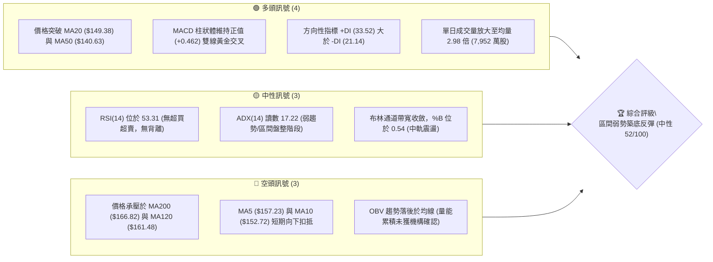

### 📊 核心指標速覽表

| 指標類別 | 指標名稱 | 當前數值 | 訊號 | 專業解讀 |
|----------|----------|----------|------|----------|
| **價格結構** | 現價與 52W 位置 | $150.28 (16.8% 分位) | 🟡 | 位於歷史深水低位區，距離低點 $114.50 脫離，但仍處大區間下軌 |
| **短期均線** | MA20 (布林中軌) | $149.38 | 🟢 | 現價微幅站上中軌 (+0.60%)，形成短線動能支撐 |
| **中期均線** | MA50 | $140.63 | 🟢 | 價格站於 MA50 之上 (+6.86%)，中期築底初具成效 |
| **長期均線** | MA200 (牛熊線) | $166.82 | 🔴 | 價格顯著受壓於牛熊線下方 (-9.91%)，長期空頭結構尚未扭轉 |
| **動能震盪** | RSI(14) | 53.31 | 🟡 | 處於 30–70 中性平衡區，既無超買亦無背離 |
| **趨勢動能** | MACD (12, 26, 9) | 3.226 / Sig: 2.764 | 🟢 | 快線位於慢線上方，Hist 為 +0.462，維持正向推動 |
| **趨勢強度** | ADX(14) / DMI | 17.22 (+DI: 33.52) | 🟡 | ADX < 25 判定為盤整震盪；+DI > -DI 顯示多方掌握短線控盤 |
| **波動範圍** | ATR(14) | $7.49 (4.98%) | 🟡 | 日內波動幅度適中，為交易止損提供具體空間 |
| **通道狀態** | 布林帶 (%B) | 0.54 (軌道: $136.83–$161.93) | 🟡 | 位於帶狀中央，未觸發通道邊界極端行情 |
| **籌碼能量** | 成交量比 / OBV | 2.98x / OBV < MA | 🔴 | 雖然今日爆量，但 OBV 累積線未翻揚，量能配合度呈現分歧 |

### 🏆 技術評分卡

```
╔══════════════════════════════════════════════════════════════════════════╗
║                   技術評分卡 — ORCL (2026-09-12)                        ║
╠══════════════════════════════════════════════════════════════════════════╣
║ 趨勢強度 (Trend)      ████████░░░░░░░░░░░░  40/100  🔴 長空短多，受制長均  ║
║ 動能指標 (Momentum)   ████████████░░░░░░░░  60/100  🟢 MACD翻多，RSI中性   ║
║ 支撐穩定度 (Support)  ██████████████░░░░░░  70/100  🟢 S1/S2重疊買盤護盤   ║
║ 成交量配合 (Volume)   ████████░░░░░░░░░░░░  40/100  🔴 OBV背離，量能疲弱   ║
║ 形態完整度 (Pattern)  ██████████░░░░░░░░░░  50/100  🟡 寬幅箱體震盪階段   ║
║ 均線排列 (Moving Avg) ██████████░░░░░░░░░░  50/100  🟡 短均翻揚/長均下垂   ║
╠══════════════════════════════════════════════════════════════════════════╣
║ 綜合評分 (Overall)    ██████████░░░░░░░░░░  52/100  ⚖️ 區間震盪 / 觀察等待 ║
╚══════════════════════════════════════════════════════════════════════════╝
```

---

## 2. 趨勢分析

### 🌐 多時框趨勢分析

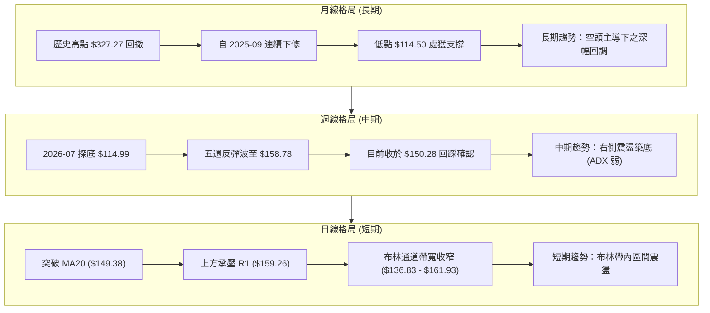

### 📈 長期趨勢 — 12個月走勢圖（Unicode）

標注過去 12 個月（2025-10 至 2026-09）之每月收盤價與關鍵轉折高低點：

```
ORCL 月線收盤走勢圖（過去12個月）
價格軸 ($)
$270 ┤ ● (2025-10: $260.10)
$240 ┤
$210 ┤       ● (2025-11: $200.02)
$180 ┤             ● (2025-12: $193.05)                    ● (2026-05: $225.00 波段高點)
$150 ┤                   ● (2026-01: $163.44)  ● (04: $160.83)        ●(08: $149.12)
$120 ┤                         ● (02: $144.39) ● (03: $146.09)  ● (06: $146.04)   ●(現在: $150.28)
$90  ┤                                                              ●(07: $129.87) [最低 $114.50]
     └─────────────────────────────────────────────────────────────────────────────
       10    11    12    01    02    03    04    05    06    07    08    09  (月份)
```

#### 走勢特徵分析表格

| 階段區間 | 起止價格 | 漲跌幅 (%) | 價量特徵與形態性質 | 趨勢結論 |
|----------|----------|------------|--------------------|----------|
| **主跌浪** (2025-10 ~ 2026-02) | $260.10 → $144.39 | -44.49% | 高檔獲利了結與估值修正，長黑摜破各期均線 | 🔴 強空單邊下行 |
| **中繼整理** (2026-02 ~ 2026-04) | $144.39 → $160.83 | +11.39% | 於 $140–$160 區間窄幅構築平臺，波動率下降 | 🟡 中繼低位盤整 |
| **假突破浪** (2026-04 ~ 2026-05) | $160.83 → $225.00 | +39.90% | 快速急拉突破 MA200，但量能未持續放大 | 🟢 誘多型強反彈 |
| **二次下殺** (2026-05 ~ 2026-07) | $225.00 → $129.87 | -42.28% | 跌破前低，於 2026-07-26 觸及 52W 低點 $114.50 | 🔴 空方釋放恐慌盤 |
| **基底構築** (2026-07 ~ 2026-09) | $129.87 → $150.28 | +15.72% | 自 $114.50 止跌，MACD 翻紅，短均線金叉 | 🟢 弱勢右側回升 |

### 📊 中期趨勢（週線分析）

中期走勢正處於從「加速下跌」轉化為「橫盤築底」的過渡結構中。
- **波段高點聚類壓制**：上方關鍵阻力集中於 R1（$159.26）與 R2（$164.24），該區間同時與布林上軌（$161.93）及斐波那契 78.6% 回調位（$160.03）高度重合。
- **波段低點聚類支撐**：下方具備 S1（$139.72）與 S2（$135.89）雙重屏障，且與 MA50（$140.63）和布林下軌（$136.83）鎖定在中期買盤防線。

### ⚡ 趨勢強度評估（ADX 解讀）

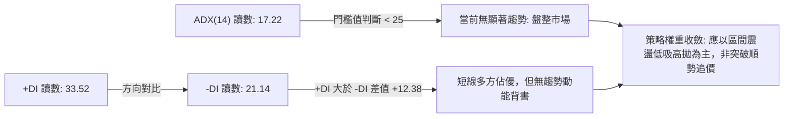

#### ADX 強度指標判斷基準表

| 指標變數 | 當前數值 | 參考臨界線 | 狀態判斷 | 操作涵義 |
|----------|----------|------------|----------|----------|
| **ADX(14)** | **17.22** | 25.00 / 40.00 | 弱趨勢 / 無趨勢無序震盪 | 避免使用追突破單，著重均值回歸策略 |
| **+DI** | **33.52** | 20.00 | 多方短線推動力強 | 買方在近 14 日內主導價格推進 |
| **-DI** | **21.14** | 20.00 | 空方短線動能衰退 | 賣壓較 7 月份已有顯著緩解 |
| **DI 差值** | **+12.38** | 0.00 | 正向分歧擴大 | 支持價格在區間中軌上方進行偏多震盪 |

---

## 3. 圖表形態分析

### 🔍 形態識別系統

依據嚴格規則，本報告對當前日線與週線結構進行嚴密形態擬合檢驗，杜絕憑空猜測。

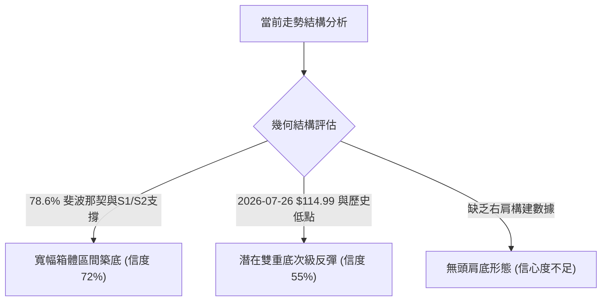

#### 形態識別信心度評估表

| 形態名稱 | 信心度 (%) | 判斷依據（嚴格引用已知數據） | 完成度 (%) | 形態目標價（嚴格附計算式） |
|----------|------------|------------------------------|------------|----------------------------|
| **寬幅水平箱體** | **72%** | 箱底受 S1 ($139.72) 固守，箱頂受 R1 ($159.26) 壓制，ADX 17.22 吻合震盪特徵 | 85% | 箱頂 $159.26 + 箱高 ($159.26 - $139.72 = $19.54) = **$178.80**（需確認放量突破 R1） |
| **潛在雙重底** | **55%** | 2026-07 探至 $114.99 後強勁反彈，但頸線尚未突破，缺乏第二隻對等低點確認 | 40% | 頸線 R1 $159.26 + 深度 ($159.26 - $114.50 = $44.76) = **$204.02**（未成型前僅供推算） |
| **頭肩底形態** | **20%** | 數據中未偵測到對稱左肩與右肩結構 | 0% | *訊號不足，不予計算，僅做指標型解讀* |

### 🕯️ 重要K線形態分析

分析最近 6 個交易週期的代表性 K 線演變：

| 週期/月份 | 收盤價 ($) | 實體與影線特徵 | K線形態 | 多空訊號解讀 |
|-----------|------------|----------------|---------|--------------|
| **2026-07-26 週** | $114.99 | 長下影線錘頭線，觸及 52W 最低點 $114.50 後反彈 | 探底錘頭 (Hammer) | 🟢 賣盤衰竭，空方動能出盡 |
| **2026-08-09 週** | $147.02 | 實體大陽線，成交量 162.8M，RSI 衝至 71.8 | 突破陽線 (Bullish Thrust) | 🟢 強勁右側反擊，收復 MA50 |
| **2026-08-16 週** | $150.52 | 高檔小實體星線，上影線觸及 $158 附近受阻 | 高檔十字星 (Doji) | 🟡 遇阻前波聚類區，動能停滯 |
| **2026-09-06 週** | $158.78 | 衝高長上影線，受制於 R1 阻力位 $159.26 | 流星線 (Shooting Star) | 🔴 多頭在 R1 關鍵位遭遇強烈拋壓 |
| **2026-09-13 週** | $150.28 | 回撤陰線，量能放大至 201.4M，收在中軌附近 | 回踩確認線 | 🟡 考驗 MA20 ($149.38) 支撐強度 |

### 📉 ASCII 走勢形態示意圖

展示當前價格於箱體區間內的波動位置：

```
ORCL 箱體區間與頸線博弈示意圖
 價格 ($)
 $164.24 ───────────────────────────────────────────── 阻力 R2
 $159.26 ───────▲───────────────▲───────────────────── 箱頂阻力 R1 (頸線)
                │              │
 $150.28 ───────┼──────────────┼───────────● (現價) ── 中軸 (MA20: $149.38)
                │              │          ▲
 $139.72 ───────▼──────────────▼──────────┼────────── 箱底支撐 S1
 $135.89 ─────────────────────────────────┴────────── 強支撐 S2
 $114.50 ───● (52W極端低點)
```

---

## 4. 支撐與阻力

### 🗺️ 關鍵價位分布圖（Unicode）

```
ORCL 關鍵價位空間分布階梯圖
══════════════════════════════════════════════════════════════════════════
$170.57 ║████████████████████████████████████████║ 強阻力 R3 (近一年密集套牢頂部)
$164.24 ║████████████████████████████            ║ 阻力 R2 (反彈高點聚類區)
$161.93 ║▓▓▓▓▓▓▓▓▓▓▓▓▓▓▓▓▓▓▓▓▓▓                  ║ 布林通道上軌壓制
$160.03 ║████████████████████████                ║ 斐波那契 78.6% 回調關鍵位
$159.26 ║████████████████████████████████        ║ 關鍵阻力 R1 (波段高點聚類頸線)
$150.28 ╠════════════════════════════════════════╣ ◄ 現價 ($150.28)
$149.38 ║░░░░░░░░░░░░░░░░░░░░░░░░                ║ 動態支撐 (MA20 / 布林中軌)
$140.63 ║░░░░░░░░░░░░░░░░░░░░░░░░░░░░░░          ║ 中期均線支撐 (MA50)
$139.72 ║▓▓▓▓▓▓▓▓▓▓▓▓▓▓▓▓▓▓▓▓▓▓▓▓▓▓▓▓▓▓          ║ 近期支撐 S1 (波段低點聚類)
$136.83 ║░░░░░░░░░░░░░░░░░░                      ║ 布林通道下軌支撐
$135.89 ║████████████████████████████████████    ║ 強支撐 S2 (箱體底層防護網)
$114.50 ║████████████████████████████████████████║ 終極強支撐 S3 (52W 最低點)
══════════════════════════════════════════════════════════════════════════
```

### 🚧 阻力位分析表

數據完全引用 OHLCV 波段高點聚類計算值：

| 阻力級別 | 精確價位 | 距現價空間 (%) | 形成原因與籌碼性質 | 突破難度評級 | 戰術重要性 |
|----------|----------|----------------|--------------------|--------------|------------|
| **R1** | **$159.26** | +5.98% | 近期波段高點密集聚類，與 78.6% 斐波那契 ($160.03) 共振 | 🟡 中等 (需 1.5x 均量) | ★★★★☆ 短線轉強第一道水門 |
| **R2** | **$164.24** | +9.29% | 2026 年初反彈成交密集區，下彎之 MA120 ($161.48) 延伸壓制 | 🔴 高 (套牢籌碼解套潮) | ★★★★☆ 中期多空結構翻轉點 |
| **R3** | **$170.57** | +13.50% | 接近下行之 MA200 牛熊線 ($166.82)，長期空方重兵防守線 | 🔴 極高 (長期趨勢分水嶺) | ★★★★★ 多頭牛市回歸必經考驗 |

### 🛡️ 支撐位分析表

數據完全引用 OHLCV 波段低點聚類計算值：

| 支撐級別 | 精確價位 | 距現價空間 (%) | 形成原因與籌碼性質 | 守住機率評級 | 戰術重要性 |
|----------|----------|----------------|--------------------|--------------|------------|
| **S1** | **$139.72** | -7.03% | 近期震盪低點聚類，與上升之 MA50 ($140.63) 形成交叉保護 | 🟢 75% | ★★★★☆ 盤整多頭底線，不容跌破 |
| **S2** | **$135.89** | -9.57% | 布林下軌 ($136.83) 與 7 月底反彈起漲點結構支撐 | 🟢 85% | ★★★★☆ 深度回調多單最佳重組區 |
| **S3** | **$114.50** | -23.81% | 52 週絕對最低點，機構價值投資資金與內部人防守成本線 | 🟢 95% | ★★★★★ 全年空頭終結基石 |

### 📐 斐波那契回調位分析

依據 52 週波動區間：**最高點 $327.27 → 最低點 $114.50**（全波段落差 $212.77）進行測算：

| 比例水準 | 精確價位 | 相對現價位置 | 技術意義與多空心理意涵 |
|----------|----------|--------------|------------------------|
| **0.0% (52W High)** | **$327.27** | +117.77% | 歷史牛市極端峰值，長期壓力極限 |
| **23.6%** | **$277.06** | +84.36% | 強牛市深度回撤阻力位 |
| **38.2%** | **$245.99** | +63.69% | 分析師平均目標價 ($241.41) 聚集帶 |
| **50.0%** | **$220.88** | +46.98% | 半數回撤多空平衡中軸 (2026-05 反彈高點 $225 附近) |
| **61.8%** | **$195.78** | +30.28% | 黃金分割強壓力位，多頭中期反彈極限目標 |
| **78.6%** | **$160.03** | +6.49% | **關鍵阻力線**：現價目前受制於此線下方，與 R1 ($159.26) 緊密共振 |
| **100.0% (52W Low)** | **$114.50** | -23.81% | 熊市深淵底部，極致支撐位 |

> **現價位置解讀**：現價 **$150.28** 精確運行於 **78.6% 回調位 ($160.03)** 與 **100.0% 低點 ($114.50)** 之間。在技術分析定義中，處於 78.6% 以下代表資產仍處於弱勢反彈週期，唯有有效收復 $160.03，方能宣佈脫離「底部震盪」進一步向 61.8% ($195.78) 挺進。

---

## 5. 技術指標深度解讀

### 🎛️ 指標訊號總覽

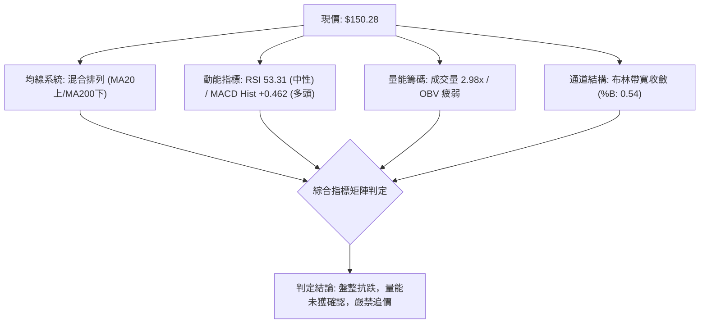

### 📈 移動平均線排列分析

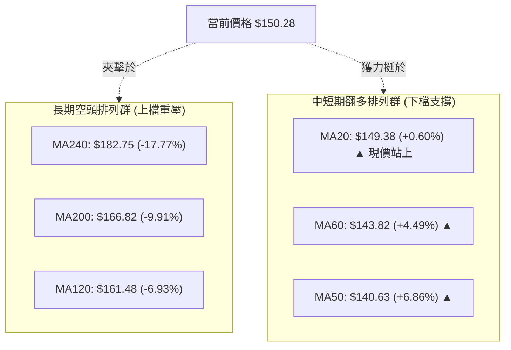

#### 均線矩陣詳細狀態表

| 均線天期 | 當前價位 | 乖離率 (%) | 趨勢斜率方向 | 實質支撐/阻力效應 |
|----------|----------|------------|--------------|-------------------|
| **MA 5** | $157.23 | -4.42% | ▼ 向下彎折 | 短線超買修正完畢，形成即時短壓 |
| **MA 10** | $152.72 | -1.60% | ▼ 向下彎折 | 短多進攻受挫，現價正測試此線阻力 |
| **MA 20** | $149.38 | +0.60% | ▲ 翻揚向上 | **動態生命線**，收盤必須維持其上 |
| **MA 50** | $140.63 | +6.86% | ▲ 翻揚向上 | 中期護城河，與 S1 ($139.72) 構建防線 |
| **MA 60** | $143.82 | +4.49% | ▲ 翻揚向上 | 季度成本線翻揚，確認中期底部成型 |
| **MA 120** | $161.48 | -6.93% | ▼ 持續下壓 | 半年套牢壓力帶，與布林上軌重疊 |
| **MA 200** | $166.82 | -9.91% | ▼ 穩定向下 | **長線牛熊分水嶺**，未突破前非大牛市 |
| **MA 240** | $182.75 | -17.77% | ▼ 深度下壓 | 年線重壓，反映過去一年的回撤慣性 |

### 📉 RSI(14) 分析

- **RSI(14) 當前數值**：**53.31**
- **動能計量進度條**：
  ```
  超賣區 (0-30)          中性平衡區 (30-70)          超買區 (70-100)
  ├───────────────┼───────────────────────────────┼───────────────┤
  ░░░░░░░░░░░░░░░░███████████████████████░░░░░░░░░░░░░░░░░░░░░░░░░░  53.31
  ```
- **超買超賣與背離客觀研判**：
  - **數值定位**：RSI 位於 53.31，脫離了 2026-07 的極度超賣區（當時低至 11.1），亦自 2026-08 中旬的超買高點（74.6）降溫回落，呈現健康的震盪中性狀態。
  - **背離檢驗**：觀察價格在 2026-09-06 觸及 $158.78 時，RSI 升至 61.5；隨後回調至 $150.28，RSI 回落至 53.31。價格高點高於 8 月底，RSI 同步維持在 50 軸上方，**明確結論：RSI 無頂背離，亦無底背離現象**，指標與價格動能完全一致。

### 📊 MACD(12, 26, 9) 訊號解讀

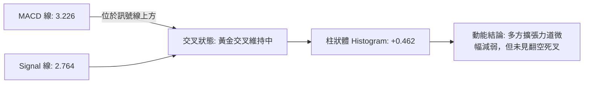

- **MACD 詳細數值**：DIF 快線 = 3.226，DEA 慢線 = 2.764，MACD 柱狀體 = **+0.462**。
- **指標動態診斷**：雙線目前皆處於零軸上方，維持標準多頭推動態勢。然而，柱狀體已由 2026-08-09 週的 +4.827 收斂至當前的 +0.462，顯示動能加速期已過，多頭推進進入減速爬坡或平臺整理，目前未見頂背離。

### 📦 布林通道分析

```
ORCL 布林通道結構示意圖 (帶寬收斂階段)
 價格 ($)
 $161.93 ─────────────────────────────── 布林上軌 (Upper Band)
          ╲                           ╱
 $150.28 ──●─────────────────────────  現價 (%B = 0.54)
 $149.38 ─────────────────────────────── 布林中軌 (MA20)
          ╱                           ╲
 $136.83 ─────────────────────────────── 布林下軌 (Lower Band)
```

- **軌道參數**：上軌 = **$161.93**，中軌 = **$149.38**，下軌 = **$136.83**。
- **%B 指標分析**：目前 %B 為 **0.54**，顯示價格緊密貼合中軌運作。布林通道帶寬在經過 7 月劇烈震盪後已大幅收緊，帶寬區間僅 $25.10。在統計學上，帶寬收斂往往預示盤整接近尾聲，市場即將在通道內醞釀下一輪方向性突破。

### 💹 成交量分析（量價配合度）

- **成交量量化矩陣**：
  - 最新單日成交量：**79,522,900 股**
  - 20 日均量：**26,681,025 股**（量比高達 **2.98x**，顯著放量）
  - 50 日均量：**32,710,500 股**
- **量價背離與能量解讀**：
  - 雖然單日量能暴增至 2.98 倍均量，但收盤價僅微漲至 $150.28，且 K 線留下阻力回撤痕跡，顯示當前價位伴隨較大的多空分歧換手。
  - **OBV（能量潮）狀態**：系統數據明確標注 **OBV < MA（量能疲弱）**。這說明自 7 月底反彈以來的量能積累總量，仍不足以超越過去半年下跌過程中的套牢派發總量。機構買盤尚未展開全面認購，當前成交量激增主要為短線對沖或消息面換手，量能並未對價格上行形成持續性確認。

---

## 6. 動能與波動率

### ⚡ 動能評估四象限

評估 ORCL 在「動能強度（Momentum）」與「歷史波動率（Volatility）」兩大維度下的座標分佈：

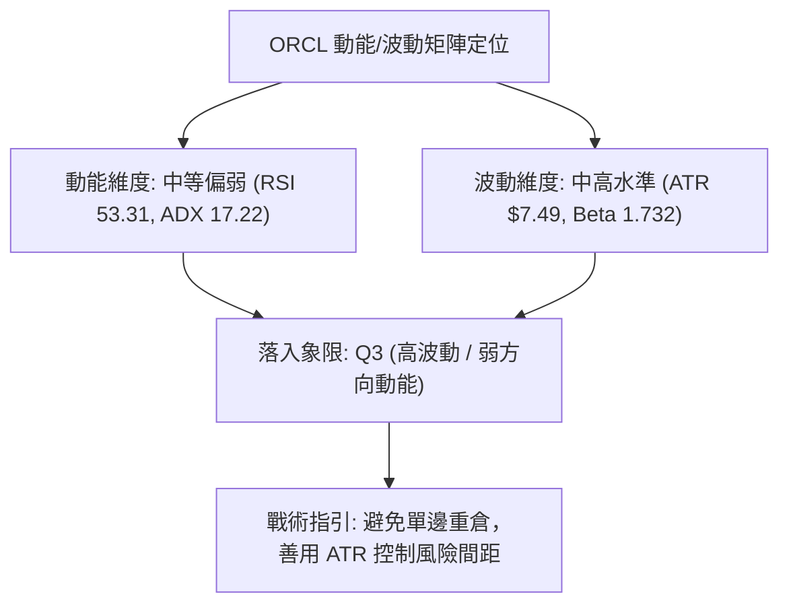

#### 動能與波動率四象限對照表

| 象限標籤 | 動能強度 | 波動率水平 | ORCL 判定 | 特徵與操作邏輯 |
|----------|----------|------------|-----------|----------------|
| **Q1 (最佳機會)** | 強 (RSI>60, ADX>25) | 低 (ATR%<3%) | — | 趨勢順暢，風險報酬比最高，全力加碼 |
| **Q2 (謹慎觀望)** | 弱 (RSI 40-60, ADX<25) | 低 (ATR%<3%) | — | 無方向低波動盤整，資金使用效率低 |
| **Q3 (震盪博弈)** | **弱方向 (ADX 17.22)** | **中高 (ATR% 4.98%)** | **✓ 當前狀態** | **高 Beta 驅動之區間震盪，需嚴控止損，高出低進** |
| **Q4 (風險迴避)** | 強空頭 (RSI<40, ADX>25) | 高 (ATR%>6%) | — | 恐慌主跌浪，全面空倉觀望 |

### 📊 ATR 波動率分析

- **ATR(14) 數值**：**$7.49**（佔現價比率為 **4.98%**）。
- **日內定價波動涵義**：ORCL 每日平均自然波動區間約 $7.50 美元，屬於典型的高彈性科技股特質。
- **止損距離與倉位測算**：
  - **短線緊密止損 (1.0x ATR)**：距離 = $7.49。若在 $150.28 進場，保護位設於 $142.79（剛好在 MA50 $140.63 上方）。
  - **波段標準止損 (1.5x ATR)**：距離 = $11.24。若在 $150.28 進場，保護位設於 $139.04（直接錨定支撐位 S1 $139.72 之下）。
  - **寬鬆結構止損 (2.0x ATR)**：距離 = $14.98。保護位設於 $135.30（跌破支撐位 S2 $135.89 確認趨勢潰敗）。

### 📐 Beta 與市場相關性

- **Beta 係數**：**1.732**
- **系統性風險關聯解析**：
  - ORCL 的 Beta 顯著高於科技板塊基準（1.0），意味著當標普 500 指數或納斯達克波動 1% 時，ORCL 理論上將產生 1.73% 的放大聯動效應。
  - **多頭優勢**：在市場反彈週期中具備強烈的向上彈性與超額 Alpha 潛力。
  - **空頭隱患**：若大盤出現宏觀流動性收緊或科技股估值下修，高 Beta 將導致股價迅速向下測試布林下軌（$136.83）甚至 S2 支撐。

---

## 7. 多時框架總結

### 📋 時框架評分表

| 時框架 | 趨勢方向 | 動能狀態 | 均線排列特徵 | 形態信號 | 綜合評分 | 操作戰略建議 |
|--------|----------|----------|--------------|----------|----------|--------------|
| **短期 (日線)** | 偏多震盪 | RSI 53.31 (中性) / MACD 金叉 | 站上 MA20/MA50，受阻 MA5/10 | 布林帶內中軌反彈 | 60/100 🟢 | 逢低短多，不追高 |
| **中期 (週線)** | 底部築基 | 週 MACD 柱翻紅 (+0.462) | 突破週 MA10，受制週 MA50 | 寬幅箱體構建中 | 55/100 🟡 | 區間震盪低吸高拋 |
| **長期 (月線)** | 空頭承壓 | 自高點回撤 54%，低位回血 | 價格低於 MA120/MA200/MA240 | 跌破 78.6% 回調位 | 40/100 🔴 | 戰略逢高減倉防守 |

### 🔲 綜合訊號矩陣

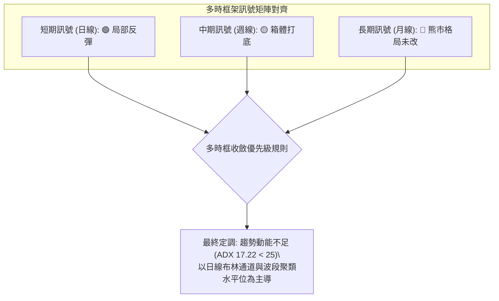

### ⚖️ 多時框收斂結論

依據技術分析「多時框收斂規則（Rule 14）」：
1. **趨勢強度檢驗**：當前 ADX(14) 讀數為 **17.22**，遠低於 25 的趨勢臨界線，確認當前市場**不存在單邊趨勢行情，本質為震盪盤整行情**。
2. **主導維度裁決**：在 ADX < 25 條件下，長線的月線空頭信號在操作層面暫時退居次席，市場定價權完全由**日線布林通道（$136.83 – $161.93）與波段聚類支撐阻力（S1 $139.72 / R1 $159.26）主導**。
3. **唯一方向定調**：**中性偏多區間震盪（Neutral-Bullish Range-Bound）**。該定調與第 1 章技術評分卡（52/100）高度契合，後續交易決策將嚴格圍繞「布林帶及聚類位之區間操作」展開。

---

## 8. 交易策略建議

### 🗺️ 策略決策流程圖

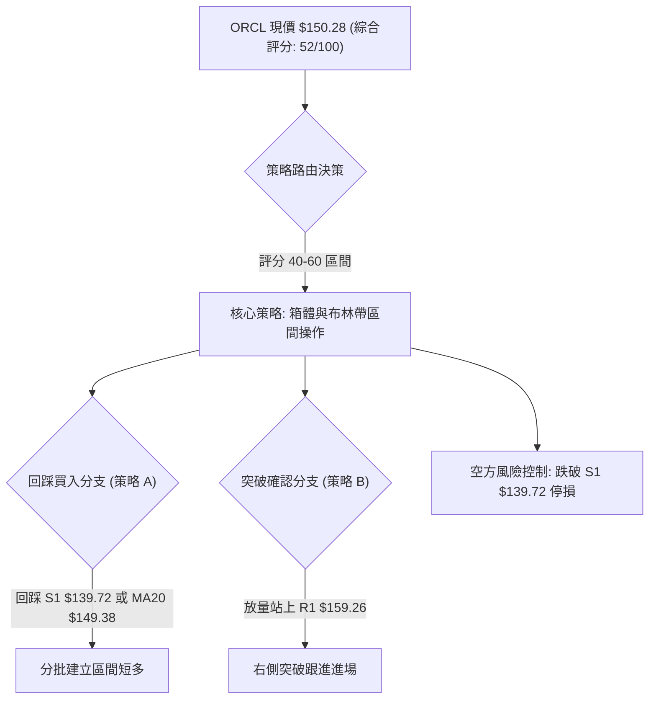

### 🧭 策略路由

> **當前主策略方向 = 區間高拋低吸 / 突破確認進場（依據技術評分卡綜合評分 52/100 中性定調）**

因技術面處於 40–60 分的中性平衡區，禁止盲目大舉單邊追高或激進沽空。主策略以日線布林通道中下軌及支撐位 S1 作為多單防禦基底，以 R1、R2 作為階梯減倉目標。

### 🎯 價格情境階梯（Price Scenarios）

價位嚴格引用第 4 章及數據聚類計算成果：

| 觸發條件 | 下一目標價 | 後續延伸目標 | 情境技術涵義 |
|----------|------------|--------------|--------------|
| **強勢突破 R1 ($159.26)** | **R2 ($164.24)** | **R3 ($170.57)** | 短線轉強，封閉 78.6% 回調位 ($160.03)，挑戰下行之 MA200 牛熊線 |
| **站穩現價區間 ($149.38–$150.28)** | **R1 ($159.26)** | **布林上軌 ($161.93)** | 多頭守住生命線，沿布林中軌向上軌進行常規均值回歸擴張 |
| **有效跌破 S1 ($139.72)** | **S2 ($135.89)** | **S3 ($114.50)** | 中期構築平臺宣告失守，價格將向布林下軌 ($136.83) 及前低尋求支撐 |

### 📊 情境機率分佈

| 情境劃分 | 機率賦予 (%) | 核心推導依據 |
|----------|--------------|--------------|
| **維持區間震盪 (箱體運作)** | **55%** | **ADX 僅 17.22**，布林帶寬收窄，OBV 未配合放大，市場缺乏催化劑打破 $139.72–$159.26 箱體 |
| **向上反彈突破 (偏多測試)** | **30%** | **MACD 柱維持多頭 (+0.462)**，+DI (33.52) 佔優，且分析師共識目標價 ($241.41) 帶來估值底層支撐 |
| **跌破破位下行 (空頭重啟)** | **15%** | 長期仍受制於 MA200 ($166.82)，若跌破 S1 ($139.72) 與 MA50，將引發高 Beta (1.732) 連鎖殺跌 |

### 🟢 主策略詳情（區間與突破雙軌模型）

所有進出場、停損、目標價位均精確引用數據關鍵位：

| 策略要素 | 策略 A：區間回踩低吸型 (主推) | 策略 B：突破追隨型 (確認信號) |
|----------|-------------------------------|-------------------------------|
| **進場條件** | 價格回踩 MA20 ($149.38) 或 S1 ($139.72) 不破 | 日 K 線放量突破收盤站穩 R1 ($159.26) 之上 |
| **進場價格** | **$149.38** (或於 $140.63 附近分批建倉) | **$159.26** |
| **目標價 T1** | **$159.26** (阻力位 R1，獲利空間 +6.61%) | **$164.24** (阻力位 R2，獲利空間 +3.13%) |
| **目標價 T2** | **$164.24** (阻力位 R2，獲利空間 +9.95%) | **$170.57** (阻力位 R3，獲利空間 +7.10%) |
| **止損價格** | **$139.72** (支撐位 S1 之下 / -1.3x ATR) | **$150.28** (回踩跌破當前平臺 / MA20) |
| **風險報酬比 (R:R)** | **1 : 1.54** (以 T2 計則達 **1 : 2.05**) | **1 : 1.26** (以 T2 計則達 **1 : 2.12**) |
| **交易勝率估計** | **65%** (震盪市順應均值回歸原則) | **50%** (需防範假突破與量能背離陷阱) |
| **建議配置倉位** | **總資金之 10%–15%** (分批布局) | **總資金之 5%–10%** (右側輕倉跟進) |

### 🔴 反向風險觸發點（對沖提示）

當以下條件觸發時，意味著多頭區間結構全面瓦解，應立即暫停所有多頭策略並執行防禦性減倉或避險對沖：
1. **破位信號**：日 K 線收盤價**實體跌破支撐位 S1 ($139.72)** 且伴隨成交量放大。
2. **均線死叉**：短期均線 MA5/10 跌破 MA20，且日線 MACD 柱狀圖由正翻負（跌破 0 軸）。
3. **對沖動作**：若持有現貨多單，可於跌破 $139.72 時建立對應空頭頭寸或減倉 50%，下檔回補目標直接看向支撐位 S2（$135.89）甚至終極低點 S3（$114.50）。

### ⭐ 整體訊號強度評星

```
做多訊號強度：★★★☆☆  (3.0/5星 — 短線指標偏多，但受制長期空頭格局)
做空訊號強度：★★☆☆☆  (2.0/5星 — 賣盤逐步衰竭，短空盈虧比欠佳)
整體可信度：  ★★★☆☆  (3.5/5星 — ADX<25 盤整環境，指標信號多有反覆)
```

---

## 9. 風險提示與監控

### ✅ 關鍵監控指標 Checklist

```
╔══════════════════════════════════════════════════════════════════════════╗
║                   ORCL 日常風險監控清單 (Checklist)                     ║
╠══════════════════════════════════════════════════════════════════════════╣
║ [ ] 價格是否跌破動態生命線 MA20 ($149.38)？                                ║
║ [ ] 每日收盤價是否嚴格守在關鍵支撐 S1 ($139.72) 之上？                    ║
║ [ ] 向上衝擊 R1 ($159.26) 時，成交量是否超越 20 日均量 (2,668 萬股)？     ║
║ [ ] RSI(14) 是否在未突破前便衝破 70 產生頂部超買背離？                   ║
║ [ ] MACD 柱狀體數值是否由當前 +0.462 快速翻負轉為死叉？                  ║
║ [ ] OBV 累積線是否持續低於均線，維持量能疲弱結構？                       ║
║ [ ] 美股大盤是否發生劇烈震盪，導致 Beta (1.732) 負向放大？               ║
╚══════════════════════════════════════════════════════════════════════════╝
```

### ⚠️ 風險場景分析

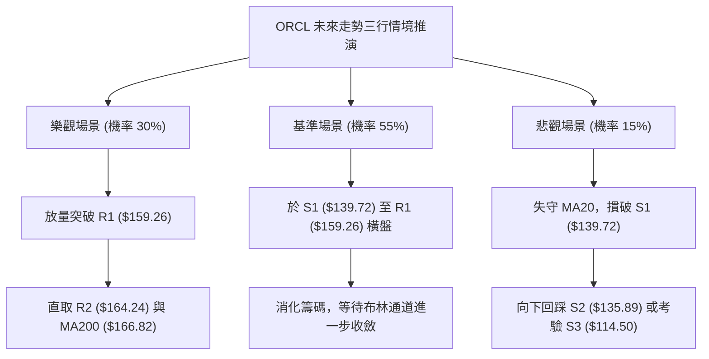

### 🛡️ 風險管理重要提醒

1. **嚴禁在 R1 阻力位追高**：現價距 R1（$159.26）與 78.6% 斐波那契（$160.03）僅約 6% 空間，在成交量 OBV 疲弱且 ADX < 25 的條件下，阻力位追漲極易遭遇回馬槍。
2. **高 Beta 波動調節**：ORCL 的 Beta 為 1.732，ATR 達到 $7.49（4.98%）。這意味著部位規模（Position Sizing）必須適度壓縮，單筆交易總風險敞口建議嚴格控制在總投資帳戶資產的 **1.0% – 1.5%** 之內。
3. **資金負擔與基本面防禦**：技術面雖現築底生機，但公司資產負債表中債務高達 $167.43B，自由現金流為負（FCF Yield: -5.67%）。一旦宏觀利率或信用市場出現擾動，將迅速反應在技術面的拋售上，因此任何多頭操作均須嚴格執行預設的止損紀律。

---

## 📋 報告總結

```
╔══════════════════════════════════════════════════════════════════════════╗
║                       ORCL 技術分析總結報告                              ║
╠══════════════════════════════════════════════════════════════════════════╣
║ 報告日期：2026-09-12                                                    ║
║ 當前價格：$150.28                                                        ║
║ 分析評級：⚖️ 中性觀望 / 區間震盪打底 (綜合評分: 52/100)                  ║
║                                                                          ║
║ 關鍵維度技術定調：                                                       ║
║ ├─ 長期趨勢：🔴 空頭主導 (承壓於 MA200 $166.82 與 78.6% 斐波那契下方)    ║
║ ├─ 中期趨勢：🟡 底部築基 (自低點 $114.50 反彈，於 $140–$160 構築箱體)  ║
║ ├─ 短期趨勢：🟢 弱勢多頭 (突破 MA20 $149.38，MACD 柱狀體維持正值)       ║
║ ├─ 關鍵支撐：S1 $139.72 (密集低點) │ S2 $135.89 │ S3 $114.50 (52W低)    ║
║ ├─ 關鍵阻力：R1 $159.26 (波段頸線) │ R2 $164.24 │ R3 $170.57 (密集套牢)║
║ └─ 華爾街共識目標：$241.41 (買入評級佔優)                                ║
║                                                                          ║
║ 最優策略組合建議：                                                       ║
║ 1. 🥇 最佳機會 (策略 A)：回踩至 MA20 ($149.38) 或 S1 ($139.72) 附近建立  ║
║    區間多單，停損設於 $139.72 之下，目標直指 R1 ($159.26)。              ║
║ 2. 🥈 次選機會 (策略 B)：若日線放量收盤確認突破 R1 ($159.26)，順勢進場   ║
║    右側多單，目標看至 R2 ($164.24) 及 R3 ($170.57)。                     ║
║ 3. 🥉 保守選擇：在 ADX 讀數升破 25 且 OBV 翻越均線前，維持空倉或低倉位    ║
║    觀望，靜待布林通道帶寬收斂後的方向性選擇。                            ║
╚══════════════════════════════════════════════════════════════════════════╝
```

---

> ⚠️ **免責聲明**：本報告為依據客觀量化技術指標與歷史行情數據生成之技術分析研究，文中所引用之支撐阻力水準均由 OHLCV 聚類數學計算得出。本報告**僅供學術研究與機構交流參考**，**不構成任何要約、招攬或具體投資建議**。金融市場瞬息萬變，高 Beta 股票波動劇烈，投資人應獨立審慎評估風險並自負盈虧。

---

*報告生成時間：2026-09-12 ｜ 數據來源：Yahoo Finance ｜ 分析框架：多時框圖表形態與量化動能分析體系*