# ORCL 技術分析報告

> **報告日期**：2026-09-15 ｜ **語言**：繁體中文 ｜ **數據來源**：Yahoo Finance ｜ **當前價格**：$144.79

---

## 目錄

| 章節 | 內容 |
|------|------|
| [1. 技術面概覽](#1-技術面概覽) | 訊號儀表板、核心指標、評分卡 |
| [2. 趨勢分析](#2-趨勢分析) | 多時框趨勢、長中短期走勢、ADX解讀 |
| [3. 圖表形態分析](#3-圖表形態分析) | 形態識別、K線組合、形態目標價 |
| [4. 支撐與阻力](#4-支撐與阻力) | 關鍵價位、斐波那契回調聚類 |
| [5. 技術指標深度解讀](#5-技術指標深度解讀) | MA系統/RSI/MACD/布林通道/量價關係 |
| [6. 動能與波動率](#6-動能與波動率) | 動能象限、ATR波幅、Beta相關性 |
| [7. 多時框架總結](#7-多時框架總結) | 時框架評分矩陣與收斂結論 |
| [8. 交易策略建議](#8-交易策略建議) | 策略路由、情境階梯、進出場參數設定 |
| [9. 風險提示與監控](#9-風險提示與監控) | 監控Checklist、風險場景樹狀圖 |

---

## 1. 技術面概覽

### 🎯 技術訊號儀表板

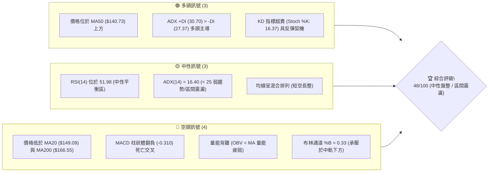

---

### 📊 核心指標速覽表

| 指標類別 | 指標名稱 | 當前數值 | 訊號 | 專業技術解讀 |
|:---|:---|:---|:---:|:---|
| **價格** | 當前收盤價 | **$144.79** | 🟡 | 位於52週區間14.3%低位，自低點反彈後遇阻震盪 |
| **均線系統** | MA20 (短線生命線) | **$149.09** | 🔴 | 價格低於MA20 (-2.89%)，短線呈回檔修正壓力 |
| **均線系統** | MA50 (中線支撐線) | **$140.73** | 🟢 | 價格守在MA50上方 (+2.88%)，中期結構尚未破壞 |
| **均線系統** | MA200 (牛熊分界線)| **$166.55** | 🔴 | 價格顯著低於MA200 (-13.06%)，長期仍處於空頭壓制 |
| **動能振盪** | RSI(14) | **51.98** | 🟡 | 處於50多空分水嶺附近，無極端超買超賣，走勢中性 |
| **動能振盪** | MACD (12, 26, 9) | **2.376 / 2.687** | 🔴 | DIF自上方跌破Signal，柱狀體為 -0.310，動能衰減 |
| **隨機指標** | Stoch %K / %D | **16.37 / 31.04** | 🟢 | 進入20以下超賣區，短線向下動能耗盡，存在技術反抽需求 |
| **趨勢強度** | ADX(14) | **16.40** | 🟡 | 數值遠低於25，無明確方向性單邊趨勢，屬於箱體震盪行情 |
| **通道指標** | 布林通道 (BB 20,2)| **$136.39 ~ $161.79**| 🟡 | %B = 0.33，位於中軌($149.09)與下軌($136.39)之間 |
| **波動風險** | ATR(14) | **$7.78** (5.37%) | 🟡 | 每日平均波幅較大，震盪洗盤風險高，需預留足夠止損空間 |
| **成交量能** | 量比 / OBV | **1.52x / 疲弱** | 🔴 | 單日放量下跌(42.05M)，且OBV低於均線，資金追價意願不足 |

---

### 🏆 技術評分卡

```
╔════════════════════════════════════════════════════════════════════════╗
║                   ORCL 技術面多維度量化評分卡 (2026-09-15)             ║
╠════════════════════════════════════════════════════════════════════════╣
║ 趨勢強度 (Trend)     ███████░░░░░░░░░░░░░  35/100  🔴 長期下行受阻於MA200  ║
║ 動能指標 (Momentum)  ██████████░░░░░░░░░░  50/100  🟡 RSI中性/MACD死叉微弱 ║
║ 支撐穩定度 (Support) █████████████░░░░░░░  65/100  🟢 S1($139.72)/MA50共振 ║
║ 成交量配合 (Volume)  ████████░░░░░░░░░░░░  40/100  🔴 放量回調/OBV呈疲弱態 ║
║ 形態完整度 (Pattern) ██████████░░░░░░░░░░  50/100  🟡 箱體成型中/無突破   ║
║ 均線排列 (Moving Avg)█████████░░░░░░░░░░░  45/100  🔴 短均線下彎/混合排列  ║
╠════════════════════════════════════════════════════════════════════════╣
║ 綜合技術評分         █████████░░░░░░░░░░░  48/100  ⚖️ 評級：中性觀望/區間  ║
╚════════════════════════════════════════════════════════════════════════╝
```

---

## 2. 趨勢分析

### 🌐 多時框趨勢分析

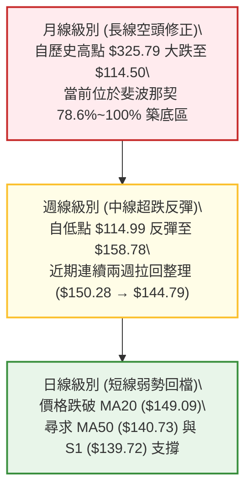

---

### 📈 長期趨勢 — 12個月走勢圖（Unicode）

```
ORCL 過去 12 個月收盤價格軌跡與形態演變示意圖
價格軸 ($)
$280 ┤     ● (2025-09: $278.07)
$260 ┤        ● (2025-10: $260.10)
$240 ┤
$220 ┤                             ● (2026-05: $225.00 假突破)
$200 ┤           ● (2025-11: $200.02)
$180 ┤              ● (2025-12: $193.05)
$160 ┤                 ● (2026-01: $163.44)  ● (2026-04: $160.83)
$140 ┤                    ●       ●               ● (2026-06: $146.04)     ●←現價 $144.79
$120 ┤                   (02:$144)(03:$146)          ● (2026-07: $129.87) ● (08:$149.12)
$100 └─────┬──────┬──────┬──────┬──────┬──────┬──────┬──────┬──────┬──────┬──────┬──────►
         25-10  25-11  25-12  26-01  26-02  26-03  26-04  26-05  26-06  26-07  26-08  26-09
```

#### 走勢特徵階段性分析表格

| 階段區間 | 時間跨度 | 價格區間 ($) | 漲跌幅度 | 趨勢特徵解讀 |
|:---|:---|:---:|:---:|:---|
| **第一階段：急劇崩盤** | 2025-10 ~ 2026-02 | $260.10 → $144.39 | -44.49% | 主跌浪宣洩，高估值與自由現金流轉負引發機構去槓桿拋售。 |
| **第二階段：暴跌反抽** | 2026-03 ~ 2026-05 | $146.09 → $225.00 | +54.01% | 軋空報復性反彈，但未能站穩歷史中樞，形成典型「倒V頂」。 |
| **第三階段：二次探底** | 2026-05 ~ 2026-07 | $225.00 → $114.50 | -49.11% | 暴跌再破底，於 2026-07-26 週觸及 52 週最低點 $114.50。 |
| **第四階段：超跌築底** | 2026-08 ~ 2026-09 | $114.50 → $144.79 | +26.45% | 低檔爆量換手，RSI自極端超賣區修復至 51.98，目前處於回踩確認期。 |

---

### 📊 中期趨勢（週線分析）

```
近期週線壓力與支撐階梯圖
  $164.24 ────────────────────────────────────────── 阻力 R3 (年線波段高點聚類)
               ▲
  $159.26 ─────┼──────────────────────────────────── 阻力 R2 (斐波那契 78.6% 回調位 $159.72 重合)
               │     ▲ 9/06 衝高至 $158.78 遇阻回落
  $148.55 ─────┼─────┼────────────────────────────── 阻力 R1 (MA20 $149.09 緊鄰疊加)
               │     │
  $144.79 ═════╪═════╪═════════════════════════════ 【當前收盤價】
               │     │
  $139.72 ─────┼─────┼────────────────────────────── 支撐 S1 (日線 MA50 $140.73 共振區間)
               │     ▼
  $135.89 ─────┼──────────────────────────────────── 支撐 S2 (布林通道下軌 $136.39 支撐)
               ▼
  $114.50 ────────────────────────────────────────── 強支撐 S3 (52週歷史低點，長線雙底防線)
```

週線層面，2026年7月下旬自 $114.99 啟動的反彈在 2026-09-06 達到收盤峰值 $158.78，隨後連續兩週回調（9/13 收 $150.28，9/20 當週收 $144.79），週線 MACD 柱狀體收斂至 -0.310，反映中期反彈動能遭遇強烈阻力，轉入震盪整固期。

---

### ⚡ 趨勢強度評估（ADX 解讀）

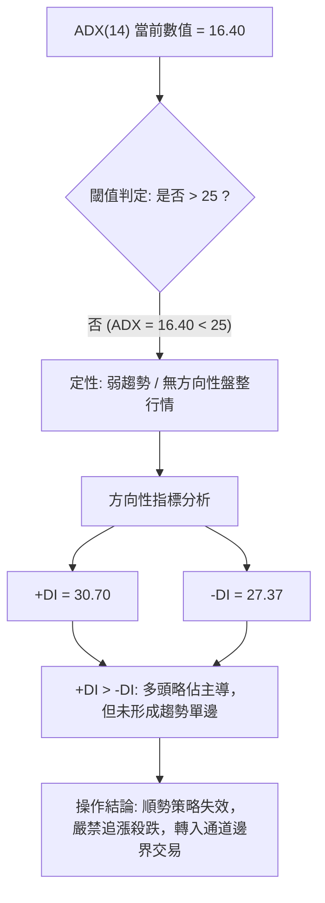

#### ADX 強度量化對照表

| ADX 數值區間 | 趨勢性質 | 當前 ORCL 狀態 | 交易體系適配 |
|:---:|:---:|:---:|:---|
| **0 ~ 20** | **極弱趨勢 / 雜亂盤整** | **✓ 當前 16.40** | **網格策略、布林帶軌道高拋低吸、區間震盪交易** |
| **20 ~ 25** | 趨勢孕育期 / 方向未明 | - | 觀察突破方向，縮減部位 |
| **25 ~ 40** | 強趨勢單邊行情 | - | 均線穿越、突破追單、順勢加碼 |
| **40 ~ 60** | 極強趨勢行情 | - | 移動停利、緊盯頂底背離 |

---

## 3. 圖表形態分析

### 🔍 形態識別系統

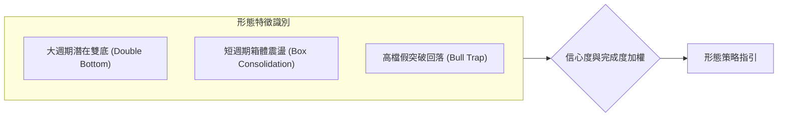

#### 形態識別與信心度評估表

| 識別形態 | 信心度 | 判斷依據（引用數據） | 完成度 | 目標價推算與計算式 |
|:---|:---:|:---|:---:|:---|
| **潛在雙底形態**<br>(W-Bottom) | **58%** | 第一次底部為 2026-07 探底低點 $114.50；頸線位置對應前波反彈高點聚類 R2 ($159.26)。當前價格於 $144.79 進行頸線前回踩。 | 60% | **突破無效時不予計算**。<br>若有效突破 R2，理論目標價 = 頸線 $159.26 + 形態高度($159.26 - $114.50 = $44.76) = **$204.02**。 |
| **矩形箱體震盪**<br>(Rectangle Range) | **78%** | 上軌阻力在 R1 ($148.55) ~ R2 ($159.26)，下軌支撐在 S1 ($139.72) ~ S2 ($135.89)。ADX 16.40 確立區間特性。 | 85% | 箱體震盪不設方向性遠期目標，以箱頂 **$159.26** 與箱底 **$135.89** 為高拋低吸邊界。 |
| **頂部反轉幾何形態**<br>(如頭肩頂) | **< 30%** | **數據不足，僅做指標型解讀**：目前週線僅見 $158.78 受阻，並無右肩或對稱頸線結構，嚴禁憑空臆測形態。 | 0% | 訊號不足，不提供推算目標價。 |

---

### 🕯️ 重要K線形態分析

| 日期 / 週期 | 收盤價 ($) | K線形態特徵 | 內在博弈解讀 | 技術訊號 |
|:---|:---:|:---|:---|:---:|
| **2026-05-31** | $225.00 | 長陽突破誘多線 | 伴隨 91.4M 成交量暴拉，但次月立即暴跌，為典型「多頭陷阱」。 | 🔴 極度危險 |
| **2026-07-26** | $114.99 | 恐慌長下影流星線 | 單週換手 162.9M，在 52W 低點 $114.50 處爆量探底回升，主力吸籌。 | 🟢 底部確立 |
| **2026-09-06** | $158.78 | 衝高受阻十字星 | 挑戰斐波那契 78.6% 回調位($159.72)失敗，留出明顯上影線。 | 🔴 滯漲信號 |
| **2026-09-20 (當週)** | $144.79 | 連續陰線回調 | 日線收盤於 $144.79，摜破 MA20，但尚未失守 MA50，空方暫時控盤。 | 🟡 尋求支撐 |

---

### 📉 ASCII 走勢形態示意圖

```
ORCL 近期箱體整理與潛在雙底頸線測試圖解
$160 ┤               [頸線壓力區間 R2: $159.26] 
     │                    ╭──╮
$150 ┤          ╭──╮      │  │        ╭───╮ (阻力 R1: $148.55 / MA20)
     │          │  │      │  │        │   ▼
$144 ┤──────────┼──┼──────┼──┼────────┼───● ← 當前價格 $144.79
     │          │  │  ╭───╯  ╰──╮ ╭──╯   
$138 ┤          │  ╰──╯          ╰─╯     [箱體下沿支撐 S1: $139.72 / MA50]
     │          │
$120 ┤          │
     │      ╭───╯ 
$114 ┤──────●───────────────────────────── [第一底支撐 S3: $114.50]
     └──────┴────────────────────────────► 時間 (2026-07 至 2026-09)
```

---

### 🎯 形態目標價計算

根據經典技術分析體系中矩形通道與潛在雙底形態理論：
1. **箱體破位延伸測算**：
   - 箱頂基準：$159.26 (R2)
   - 箱底基準：$139.72 (S1)
   - 箱體垂直高度 $H = 159.26 - 139.72 = \$19.54$
   - 若向上有效突破 $159.26，目標價位 $T_{up} = 159.26 + 19.54 = \mathbf{\$178.80}$
   - 若向下跌破 $139.72，目標價位 $T_{down} = 139.72 - 19.54 = \mathbf{\$120.18}$（接近前低 $114.50）
2. **當前有效交易區間**：在有效突破發生前，市價 $144.79 應嚴格鎖定於 **$139.72 至 $159.26** 之內進行均值回歸交易。

---

## 4. 支撐與阻力

### 🗺️ 關鍵價位分布圖（Unicode）

```
ORCL 核心價格結構與支撐阻力空間分佈
══════════════════════════════════════════════════════════════════
$164.24 ║████████████████████████████████████████║ 強阻力 R3 (年線波段阻力聚類)
$159.26 ║████████████████████████████            ║ 關鍵阻力 R2 (Fib 78.6% $159.72 重合)
$148.55 ║████████████████                        ║ 近期阻力 R1 (MA20 壓制位 $149.09)
════════╬════════════════════════════════════════╣ ◄ 現價 $144.79 (BB %B: 0.33)
$139.72 ║▓▓▓▓▓▓▓▓▓▓▓▓▓▓▓▓                        ║ 核心支撐 S1 (MA50 $140.73 共振帶)
$135.89 ║████████████████████                    ║ 強支撐 S2 (日線布林下軌 $136.39)
$114.50 ║████████████████████████████████████████║ 終極防線 S3 (52W 最低點 / 長線防線)
══════════════════════════════════════════════════════════════════
```

---

### 🚧 阻力位分析表

| 阻力級別 | 精確價位 | 形成技術依據（引用數據） | 突破難度 | 戰略重要性 |
|:---|:---:|:---|:---:|:---:|
| **R1** | **$148.55** | 近一年波段高點聚類，疊加當前下降中的日線 MA20 ($149.09) 及布林中軌。 | 🟡 中等 | 短線多空轉換樞紐，站穩此位方能解除短線拉回警報。 |
| **R2** | **$159.26** | 波段高點聚類，與斐波那契 78.6% 回調位 ($159.72) 構成共振阻力帶。 | 🔴 較高 | 中期反彈頂部（9/06 收盤 $158.78），突破此處確認雙底反轉。 |
| **R3** | **$164.24** | 2026年1月平臺跌破點高點聚類，緊鄰 200日均線 MA200 ($166.55)。 | 🔴 極高 | 長期牛熊分水嶺，機構籌碼密集套牢區，需巨量配合。 |

---

### 🛡️ 支撐位分析表

| 支撐級別 | 精確價位 | 形成技術依據（引用數據） | 守住機率 | 戰略重要性 |
|:---|:---:|:---|:---:|:---:|
| **S1** | **$139.72** | 近一年波段低點聚類，貼合上升中的 50日均線 MA50 ($140.73)。 | 🟢 70% | 短線多頭防線，回踩不破可維持日線級別震盪偏多格局。 |
| **S2** | **$135.89** | 波段低點聚類，對應日線布林通道下軌 ($136.39) 極限超賣緩衝區。 | 🟢 85% | 區間震盪下沿，若失守意味著反彈結構徹底瓦解。 |
| **S3** | **$114.50** | 52週歷史低點 (2026-07-26 當週低位)，長線最後結構性支撐。 | 🟢 95% | 戰略防禦底線，跌破則預示基本面進一步惡化與破底探戈。 |

---

### 📐 斐波那契回調位分析

依據 52 週完整波動區間（高點 **$325.79** → 低點 **$114.50**，全幅垂直空間高達 **$211.29**），精確回調位分佈如下：

| 回調比例 | 對應精確價位 | 相對於當前價格 ($144.79) 之空間位置與技術意義 |
|:---:|:---:|:---|
| **0.0%** (52W High) | **$325.79** | 歷史極值，本輪宏觀大週期牛市頂點。 |
| **23.6%** | **$275.92** | 2025年9月高檔震盪平臺 ($278.07)。 |
| **38.2%** | **$245.08** | 空頭回撤第一黃金分割強阻力。 |
| **50.0%** | **$220.14** | 2026年5月反彈假突破高點 ($225.00) 附近，多空均值軸。 |
| **61.8%** | **$195.21** | 2026年5月中旬整理平臺 ($195.27)，關鍵牛熊中樞。 |
| **78.6%** | **$159.72** | **重要壓制位**：與 R2 ($159.26) 緊密重疊，前波反彈在此精準遇阻。 |
| **100.0%** (52W Low) | **$114.50** | 2026年7月波段極限低點，底部支撐。 |

> **📍 價位落點解讀**：現價 **$144.79** 目前精確運行於 **78.6% 回調位 ($159.72)** 與 **100.0% 低點 ($114.50)** 之間的深度折價超跌修復帶。向上突破 78.6% 回調位前，全週期大趨勢難以言多。

---

## 5. 技術指標深度解讀

### 🎛️ 指標訊號總覽

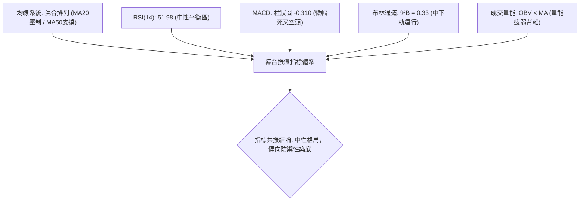

---

### 📈 移動平均線排列分析

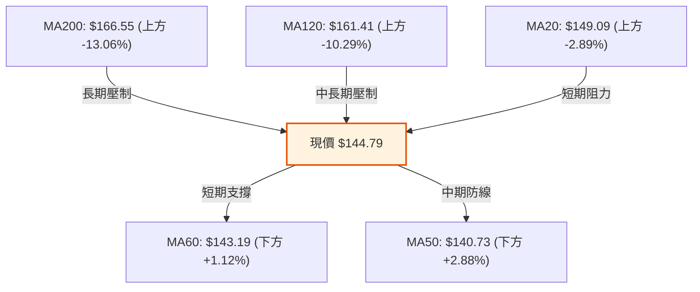

均線系統整體呈現典型「夾層震盪／混合排列」特徵：
- **短均線系統下彎**：MA5 ($154.43)、MA10 ($152.12)、MA20 ($149.09) 呈現空頭壓制，宣告短線進入回調走勢。
- **中均線系統承托**：MA50 ($140.73) 與 MA60 ($143.19) 向上抬升，距離現價僅 1%~3%，構成密集緩衝區。
- **長均線乖離壓制**：MA200 ($166.55) 與 MA240 ($182.19) 均處於下降軌道，空頭長期防線未被攻克。

---

### 📉 RSI(14) 分析

當前 RSI(14) 數值為 **51.98**，進度條展現如下：

```
RSI(14) 水平位置：
[0] ──────────── 超賣 [30] ───────────── 中軸 [50] ────●──────── 超買 [70] ──────────── [100]
進度比例：██████████████████████████░░░░░░░░░░░░░░░░░░░░░░░░░░░  51.98%
```

- **背離檢驗結論**：
  - 在 2026-07 底價格創出 $114.99 新低時，週線 RSI 僅為 26.7（高於 2026-06 底的 11.1），存在顯著的**週線級別底背離**，促成了後續反彈至 $158.78。
  - 在近期自 $158.78 回調至 $144.79 的過程中，日線 RSI 自 74.6 高位平穩滑落至 51.98，**未出現明顯的頂背離或底背離**，屬於健康的超買動能釋放與均值回歸。

---

### 📊 MACD(12, 26, 9) 訊號解讀

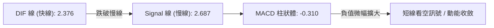

- **數值關係**：DIF (2.376) 跌落 Signal (2.687) 下方，MACD 柱狀體為 **-0.310**。
- **動能解讀**：MACD 快慢線皆維持在 0 軸上方，意味著中週期反彈架構並未完全被破壞；但負向柱狀體出現，確認短線多頭動能耗盡，正處於死叉調整期。

---

### 📦 布林通道分析（Bollinger Bands）

```
布林帶軌道結構與現價相對位置 (參數: 20, 2)
  $161.79 ──┬──────────────────────────────── 上軌 (Upper Band)
            │
  $149.09 ──┼─────── (中軌 MA20) ─────────── 中軌 (Middle Band)
            │       ▼ 壓力
  $144.79 ──┼───────● (當前價格, %B = 0.33)
            │       ▲ 支撐
  $136.39 ──┴──────────────────────────────── 下軌 (Lower Band)
```

- **通道帶寬與位置**：通道帶寬 (Bandwidth) 為 $(161.79 - 136.39) / 149.09 = 17.03\%$，波動率正在壓縮。
- **%B 指標解讀**：當前數值為 **0.33**，表明價格已自中軌跌入下半通道，空方在布林區間內佔據短線主動，下軌 **$136.39** 將提供關鍵技術緩衝。

---

### 💹 成交量分析（量價配合度）

- **成交量對比**：最新日成交量 **42,049,600** 股，高於 20日均量 (27,734,015) 達 **1.52倍**，但低於週線級別換手高峰。
- **價跌量增特徵**：最新交易日伴隨成交量放大至 4,200 萬股出現陰線拉回，呈現短線空方主動拋售特徵。
- **OBV（能量潮）分析**：OBV 指標目前低於其移動平均線 (OBV < MA)，反映資金在此次衝高 $158.78 後並未持續淨流入，主力資金呈現高拋觀望，量能無法支撐連續突破行情。

---

## 6. 動能與波動率

### ⚡ 動能評估四象限

| 象限分佈 | 動能強度 (Momentum) | 波動率水準 (Volatility) | ORCL 當前位置判定 | 戰略應對方針 |
|:---:|:---:|:---:|:---:|:---|
| **第一象限 (Q1)** | 強 (Bullish) | 低 (Low Volatility) | ─ | 最佳趨勢鎖倉主升段 |
| **第二象限 (Q2)** | **弱 (Bearish/Neutral)** | **低 (Low Volatility)** | **✓ 本股當前落點** | **震盪築底期：縮減部位，採取區間邊界高拋低吸** |
| **第三象限 (Q3)** | 強 (Bullish) | 高 (High Volatility) | ─ | 假突破頻繁，高風險高回報 |
| **第四象限 (Q4)** | 弱 (Bearish) | 高 (High Volatility) | ─ | 單邊崩盤殺跌浪，嚴格空倉防禦 |

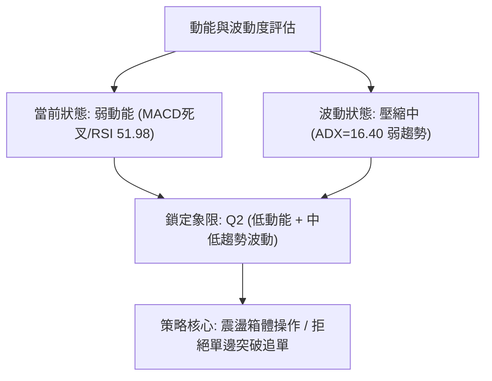

---

### 📊 ATR 波動率分析

- **ATR(14) 當前數值**：**$7.78**，佔當前股價比例高達 **5.37%**。
- **止損距離設計建議**：
  - **保守型（1.5 倍 ATR）**：$1.5 \times 7.78 = \mathbf{\$11.67}$。適合波段持倉，容忍較大洗盤幅差。
  - **進取型（1.0 倍 ATR）**：$1.0 \times 7.78 = \mathbf{\$7.78}$。適合短線區間操作，嚴控回撤。

---

### 📐 Beta 與市場相關性

- **Beta 數值**：**1.732**（極高彈性標的）。
- **市場特徵分析**：ORCL 相對標普500指數具備 1.73 倍的波動放大效應。當科技權值股大盤出現微幅回檔時，ORCL 易放大下跌振幅；在震盪市況中操作該股必須適度**降低總倉位槓桿**以規避系統性衝擊。

---

## 7. 多時框架總結

### 📋 時框架評分表

| 時框架 | 趨勢方向 | 動能狀態 | 均線系統排列 | 形態特徵 | 評分 (1-100) | 交易建議 |
|:---|:---:|:---:|:---:|:---:|:---:|:---|
| **日線 (Daily)** | 🟡 震盪偏弱 | 🔴 下行 (MACD死叉) | 🔴 跌破MA20 / 守MA50 | 箱體中軌回踩 | **45** | 逢低在S1附近低吸，勿追高 |
| **週線 (Weekly)** | 🟢 築底反彈 | 🟡 減速 (柱狀收斂) | 🟡 站上5週線，未破20週 | 雙底反彈遇頸線阻力 | **55** | 耐心等待回踩確認第二隻腳 |
| **月線 (Monthly)** | 🔴 處於深跌修復 | 🔴 偏弱 | 🔴 均線空頭擴散 | 78.6% 回調位低位整理 | **38** | 長線資金小額定投，嚴控總量 |

---

### 🔲 綜合訊號矩陣

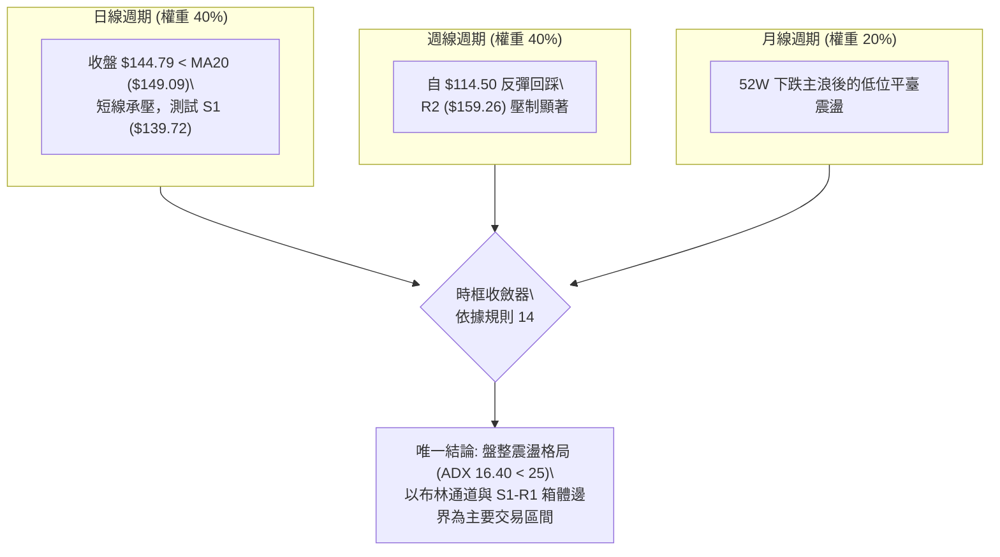

---

### ⚖️ 多時框收斂結論

依據多時框收斂規則：
1. **當前趨勢定性**：當前 ADX(14) 僅為 **16.40**（低於 25），明確界定市場處於**盤整震盪行情**而非單邊趨勢行情。
2. **主導維度取捨**：在盤整市況中，中長期均線趨勢指引鈍化，**主導權交由日線布林通道 ($136.39 ~ $161.79) 及關鍵高低點聚集支撐阻力**。
3. **方向性最終結論**：**中性偏防禦（Neutral Range-Bound）**。綜合評分 **48/100**，多空處於均勢拉鋸，短線面臨 MA20 壓制向下尋求 MA50 支撐，操作上以「**區間震盪、下軌低吸、高軌止盈**」為唯一合理途徑，禁止單邊重倉追價。

---

## 8. 交易策略建議

### 🗺️ 策略決策流程圖

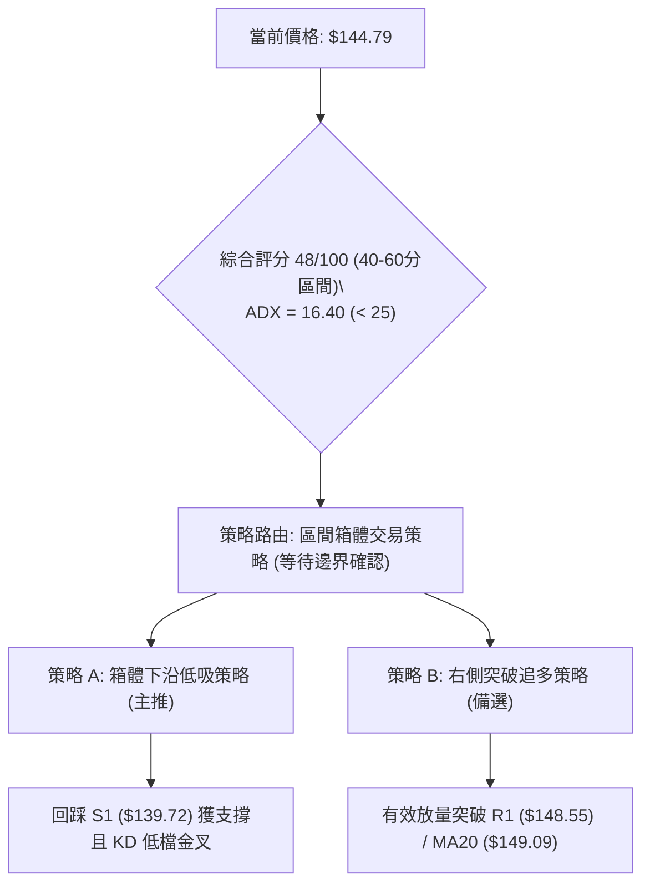

---

### 🧭 策略路由

> **當前主策略方向 = 【中性震盪：布林箱體區間操作，依綜合評分 48/100 嚴格禁止單邊追漲】**

---

### 🎯 價格情境階梯（Price Scenarios）

| 觸發條件 | 下一目標價 | 後續延伸目標 | 技術情境結構含義 |
|:---|:---:|:---:|:---|
| **強勢突破 R1 ($148.55)** | **R2 ($159.26)** | **R3 ($164.24)** | 突破 MA20 束縛，多頭重啟對 78.6% 回調位與雙底頸線之攻勢。 |
| **站穩現價區間 ($144.79)** | **R1 ($148.55)** | ─ | 於 MA50 上方維持弱勢整理，消化短線死叉動能。 |
| **跌破支撐 S1 ($139.72)** | **S2 ($135.89)** | **S3 ($114.50)** | 失守 MA50，短線反彈形態被打破，考驗布林下軌及前波低點。 |

---

### 📊 情境機率分佈

| 運行情境 | 發生機率 | 主要技術數據支撐依據 |
|:---|:---:|:---|
| **情境一：區間震盪整固** | **55%** | **ADX=16.40** 確立無趨勢行情；RSI(14)=51.98 處於正中軸；布林上下軌形成有效收斂夾角。 |
| **情境二：回落測試深層支撐** | **25%** | MACD 柱狀體翻負 (-0.310)；成交量放量下跌；OBV 低於均線顯示資金淨流出。 |
| **情境三：向上強勢反彈** | **20%** | 隨機指標 Stoch %K=16.37 進入嚴重超賣區；MA50 ($140.73) 提供強勁中期托底。 |

---

### 🟢 主策略詳情（方向：區間低吸與右側突破）

所有目標價與止損點**嚴格基於本報告第 4 章關鍵價位**制定：

| 策略要素 | 策略 A：箱體下沿防禦低吸（主推策略） | 策略 B：右側突破加碼（備選策略） |
|:---|:---:|:---:|
| **操作性質** | 逆勢左側低吸（勝率較高，風報比優） | 順勢右側跟進（需成交量配合） |
| **進場條件** | 價格回踩 S1 ($139.72) 附近出現縮量止跌K棒 | 價格帶量強勢突破 R1 ($148.55) 且收盤確認 |
| **進場價格** | **$140.00** (貼近 S1 $139.72 與 MA50 $140.73) | **$149.50** (確認突破 MA20 $149.09 與 R1) |
| **第一目標價 (T1)** | **$148.55** (近期阻力 R1) | **$159.26** (強阻力 R2) |
| **第二目標價 (T2)** | **$159.26** (波段高點 R2) | **$164.24** (極限阻力 R3 / MA200) |
| **止損價格** | **$135.50** (嚴格設於強支撐 S2 $135.89 下方) | **$144.50** (跌回當前平台內部即認賠) |
| **風險報酬比** | **1 : 4.28**（風險 $4.50，目標獲利 $19.26） | **1 : 1.95**（風險 $5.00，目標獲利 $9.76） |
| **估計成功機率** | **65%** | **45%** |
| **建議配置倉位** | **總倉位的 10% ~ 15%** | **總倉位的 5% ~ 8%** |

---

### 🔴 反向風險觸發點（對沖提示）

當市場出現以下信號時，表明「多頭區間震盪」架構徹底崩潰，投資人應立即中止所有低吸策略並執行避險：
1. **破位信號**：日線收盤價**實體跌破 S2 ($135.89)**，意味著布林下軌遭失守，雙底構築徹底失敗。
2. **量能異動**：跌破 S1 時伴隨單日成交量突破 5,000 萬股（放量摜破）。
3. **風控應對**：若觸發上述條件，多頭持倉無條件停損出場，並可適度配置賣權 (Put Option) 或降低整體投資組合 Beta 暴露。

---

### ⭐ 整體訊號強度評星

```
做多訊號強度：★★☆☆☆  (2/5 星 — 僅具超賣反彈機會，缺乏趨勢推力)
做空訊號強度：★★☆☆☆  (2/5 星 — 受到 MA50 與 S1 緊鄰支撐，向下空間受限)
整體可信度：  ★★★★☆  (4/5 星 — 關鍵價位群與指標狀態高度收斂確認)
```

---

## 9. 風險提示與監控

### ✅ 關鍵監控指標 Checklist

```
╔════════════════════════════════════════════════════════════════════════╗
║               ORCL 每日關鍵技術監控 Checklist (風控儀表)                ║
╠════════════════════════════════════════════════════════════════════════╣
║ [ ] 價格是否跌破 S1 ($139.72) 與日線 MA50 ($140.73)                   ║
║ [ ] RSI(14) 是否跌破 45 (若跌破意味著空方動能強化，震盪恐轉下行)        ║
║ [ ] MACD 柱狀體是否擴大至 -1.00 以下 (死叉動能是否加速)               ║
║ [ ] 日成交量是否萎縮至 2,500 萬股以下 (量能枯竭為見底特徵)              ║
║ [ ] 布林通道帶寬是否開始向外擴張 (%B 跌破 0.20 預警)                  ║
║ [ ] 盤中是否觸及 R1 ($148.55) / MA20 ($149.09) 反壓測試               ║
╚════════════════════════════════════════════════════════════════════════╝
```

---

### ⚠️ 風險場景分析

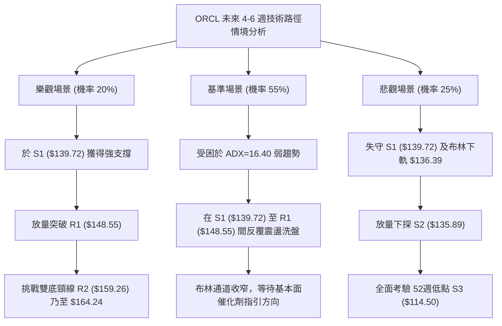

---

### 🛡️ 風險管理重要提醒

1. **Beta 敏感度管理**：ORCL 的 Beta 高達 **1.732**，科技板塊的整體回調會放大該股波動。在當前弱趨勢背景下，嚴禁使用融資或高倍槓桿進行隔夜持倉。
2. **嚴格執行單筆風險暴露限制**：基於 ATR = **$7.78** 的波動特徵，任何單一進場策略的止損額度，嚴格控制在總投資帳戶淨值的 **1.0% ~ 1.5%** 以內。
3. **區間震盪的交易紀律**：當 ADX < 25 時，切忌「紅買綠賣」的追價心理。在價格逼近 R1 ($148.55) 時應逢高分批減碼獲利，回落至 S1 ($139.72) 附近縮量時方可分批低吸，違背此原則極易遭到上下雙巴。

---

## 📋 報告總結

```
╔════════════════════════════════════════════════════════════════════════╗
║                     ORCL 技術分析報告總結 (2026-09-15)                 ║
╠════════════════════════════════════════════════════════════════════════╣
║ 報告日期：2026-09-15        當前價格：$144.79       ATR(14)：$7.78    ║
║ 綜合評分：48/100            分析評級：⚖️ 中性盤整 (觀望/區間震盪)      ║
╠════════════════════════════════════════════════════════════════════════╣
║ 關鍵結構結論：                                                         ║
║ ├─ 長期趨勢：🔴 空頭壓制（價格遠低於 MA200 $166.55 與 240日均線）      ║
║ ├─ 中期趨勢：🟡 築底反彈遇阻（受制於 R2 $159.26 及斐波那契 78.6%）     ║
║ ├─ 短期趨勢：🔴 弱勢回調（跌破 MA20 $149.09，MACD 死叉，測試 MA50）   ║
║ ├─ 核心支撐：S1: $139.72 │ S2: $135.89 │ S3: $114.50 (52W Low)       ║
║ ├─ 核心阻力：R1: $148.55 │ R2: $159.26 │ R3: $164.24 (MA200 疊加)     ║
║ └─ 趨勢強度：ADX = 16.40 (< 25 弱趨勢，方向由布林通道上下軌主導)       ║
╠════════════════════════════════════════════════════════════════════════╣
║ 最優策略組合：                                                         ║
║ 1. 🥇 最佳機會：於 S1 ($139.72) 至 MA50 ($140.73) 區間輕倉低吸做反彈， ║
║               止損設於 $135.50，目標看至 R1 ($148.55)。               ║
║ 2. 🥈 次選機會：靜待有效帶量突破 R1 ($148.55)，右側順勢追進至 R2。     ║
║ 3. 🥉 保守選擇：空倉觀望，等待 ADX 升破 25 或價格回踩 S3 ($114.50)。    ║
╚════════════════════════════════════════════════════════════════════════╝
```

---

> ⚠️ **免責聲明**：本報告為技術分析研究成果，所有數據及推算均基於歷史量價資訊。本報告**僅供研究與學術參考**，**不構成任何投資買賣建議**。市場有風險，交易需嚴格執行資金控管與停損機制。