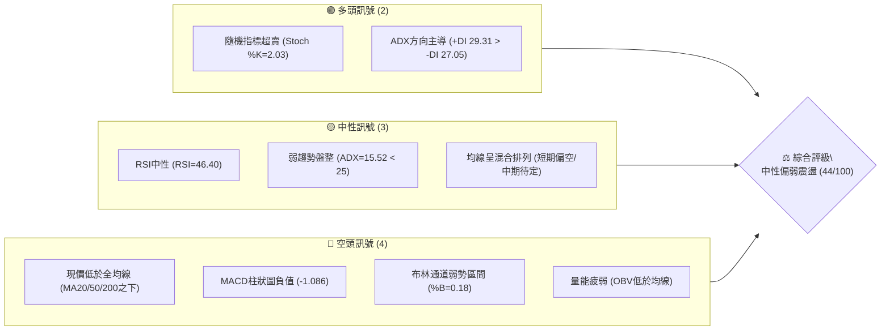
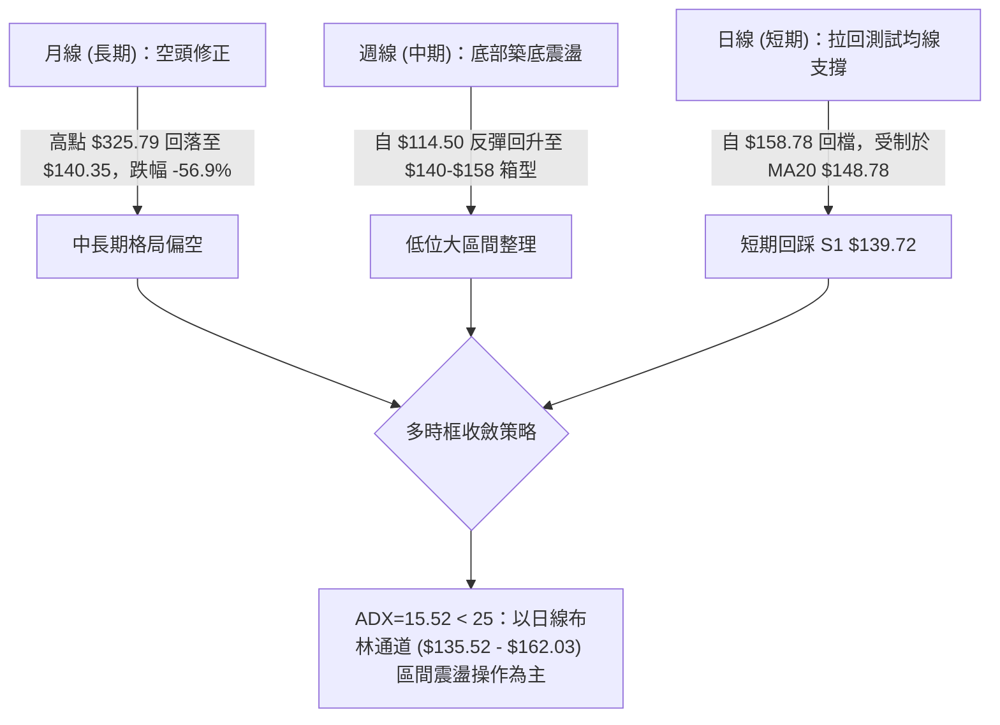
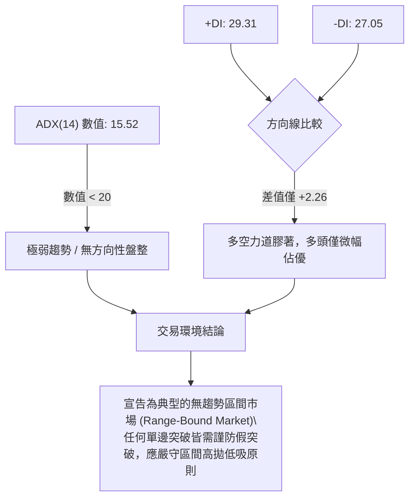
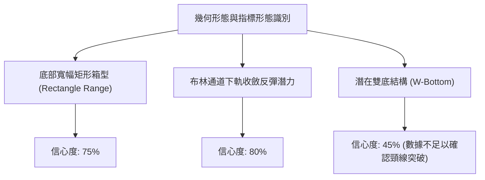
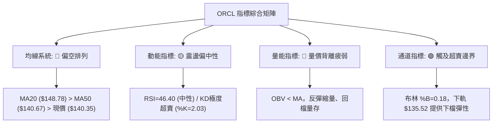
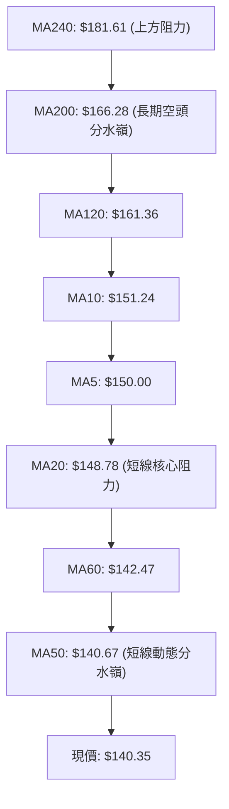
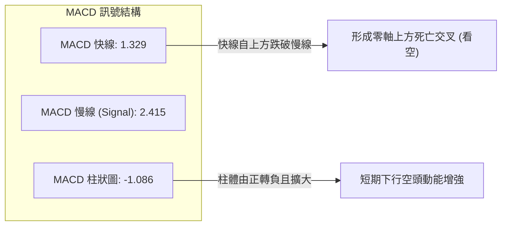
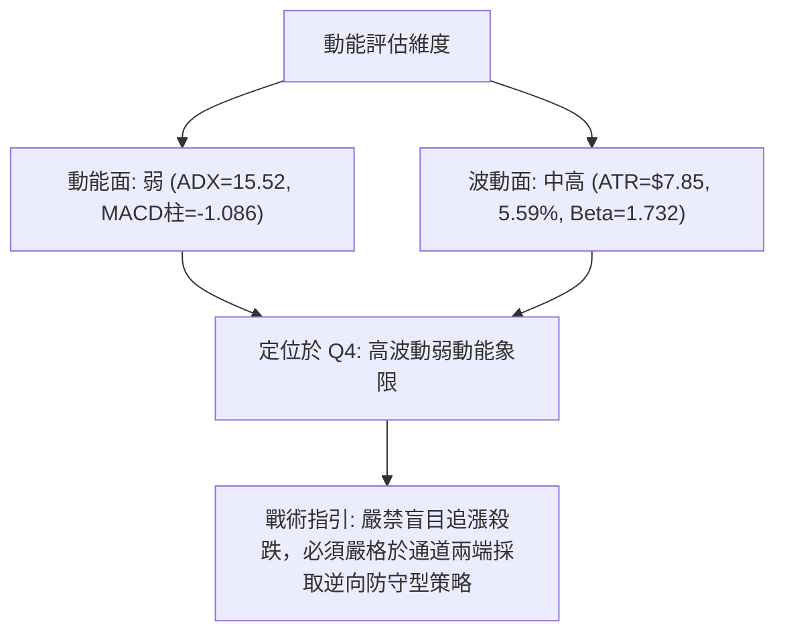
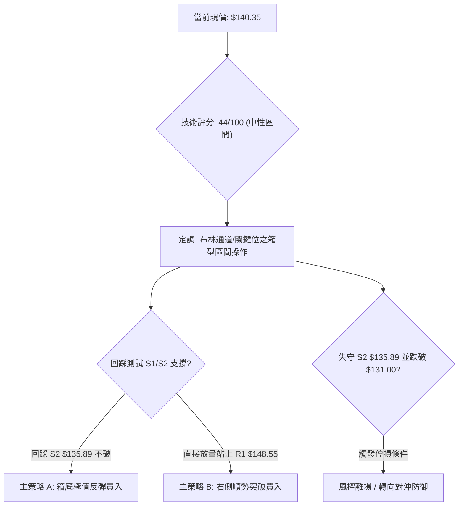
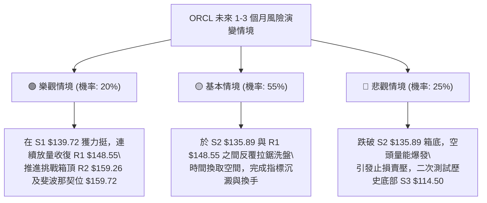

# ORCL 技術分析報告

> **報告日期**：2026-09-16 ｜ **語言**：繁體中文 ｜ **數據來源**：Yahoo Finance ｜ **當前價格**：$140.35

---

## 目錄

| 章節 | 內容 |
|------|------|
| [1. 技術面概覽](#1-技術面概覽) | 訊號儀表板、核心指標、評分卡 |
| [2. 趨勢分析](#2-趨勢分析) | 多時框趨勢、長中短期走勢 |
| [3. 圖表形態分析](#3-圖表形態分析) | 形態識別、K線組合、目標價 |
| [4. 支撐與阻力](#4-支撐與阻力) | 關鍵價位、斐波那契回調 |
| [5. 技術指標深度解讀](#5-技術指標深度解讀) | MA/RSI/MACD/布林/成交量 |
| [6. 動能與波動率](#6-動能與波動率) | 動能評估、ATR、Beta |
| [7. 多時框架總結](#7-多時框架總結) | 時框架評分矩陣、收斂結論 |
| [8. 交易策略建議](#8-交易策略建議) | 區間交易策略、風險報酬比 |
| [9. 風險提示與監控](#9-風險提示與監控) | 監控指標、風險場景 |

---

## 1. 技術面概覽

### 🎯 技術訊號儀表板



### 📊 核心指標速覽表

| 指標類別 | 指標名稱 | 當前數值 | 訊號 | 解讀 |
|----------|----------|----------|:----:|------|
| **價格** | 當前價格 | $140.35 | 🔴 | 位於 52 週區間底層 12.2%，逼近短期強支撐 S1 |
| **均線** | MA20 | $148.78 | 🔴 | 價格低於 MA20 達 -5.66%，短線承壓於中軌 |
| **均線** | MA50 | $140.67 | 🟡 | 價格貼近 MA50（-0.23%），多空在此爭奪生命線 |
| **均線** | MA200 | $166.28 | 🔴 | 價格顯著低於 MA200（-15.59%），長期趨勢偏空 |
| **動能** | RSI(14) | 46.40 | 🟡 | 處於 30–70 中性區間，無明顯超買或超賣 |
| **動能** | MACD Hist | -1.086 | 🔴 | 柱狀圖由正轉負，MACD (1.329) 低於訊號線 (2.415) 死叉 |
| **動能** | Stoch %K/%D | 2.03 / 17.50 | 🟢 | 極度超賣區間，短線蘊含技術性反彈動能 |
| **趨勢** | ADX(14) | 15.52 | 🟡 | ADX < 25，顯示缺乏明確單邊趨勢，屬箱型盤整結構 |
| **波動** | ATR(14) | $7.85 | 🟡 | 佔股價 5.59%，波動度中等偏高，震盪區間寬廣 |
| **成交量** | 量比 / OBV | 1.11x / 疲弱 | 🔴 | OBV < MA，成交量微幅放大但未能帶動價格向上 |

### 🏆 技術評分卡

```
╔════════════════════════════════════════════════════════════════╗
║                技術評分卡 — ORCL (2026-09-16)                  ║
╠════════════════════════════════════════════════════════════════╣
║ 趨勢強度 (ADX=15.52)    ██████░░░░░░░░░░░░░░  30/100  🔴 弱盤整║
║ 動能指標 (RSI/MACD/KD)  ████████░░░░░░░░░░░░  42/100  🟡 中性偏空║
║ 支撐穩定度 (S1/S2聚類)   ████████████░░░░░░░░  60/100  🟢 買盤浮現║
║ 成交量配合 (OBV<MA)     ████████░░░░░░░░░░░░  40/100  🔴 量能背離║
║ 形態完整度 (箱型築底)    ██████████░░░░░░░░░░  50/100  🟡 構築中  ║
║ 均線排列 (現價處於全MA下)██████░░░░░░░░░░░░░░  32/100  🔴 偏空整理║
╠════════════════════════════════════════════════════════════════╣
║ 綜合評分                █████████░░░░░░░░░░░  44/100  中性偏弱 ║
║ 策略定調：區間防守震盪，以布林下軌及支撐位為基準進行波段操作  ║
╚════════════════════════════════════════════════════════════════╝
```

---

## 2. 趨勢分析

### 🌐 多時框趨勢分析



### 📈 長期趨勢 — 12個月走勢圖（Unicode）

```
ORCL 月線走勢圖（過去12個月：2025-10 至 2026-09）
價格軸 ($)
$280 ┤
$260 ┤  ● (2025-10: $260.10)
$240 ┤
$220 ┤                                      ● (2026-05: $225.00)
$200 ┤        ● (2025-11: $200.02)
$180 ┤              ● (2025-12: $193.05)
$160 ┤                    ● (2026-01: $163.44)    ● (2026-04: $160.83)
$140 ┤                          ● (02: $144.39) ─ ● (03: $146.09) ─ ● (06: $146.04) ─ ● (08: $149.12) ─ ● (現價: $140.35)
$120 ┤                                                                              ● (2026-07: $129.87)
     └─────────────────────────────────────────────────────────────────────────────────────────────
       10    11    12    01    02    03    04    05    06    07    08    09 (月份)
```

**走勢特徵分析表格**：

| 階段區間 | 時間跨度 | 價格變動 | 區間漲跌幅 | 走勢結構與特徵 |
|:--------:|:--------:|:--------:|:----------:|----------------|
| **第一階段** | 2025-10 ~ 2026-02 | $260.10 → $144.39 | -44.49% | 主跌浪：月線層級連續下挫，高估值泡沫釋放 |
| **第二階段** | 2026-02 ~ 2026-05 | $144.39 → $225.00 | +55.83% | 強烈技術反彈浪：測試長期均線阻力，量能短暫噴發 |
| **第三階段** | 2026-05 ~ 2026-07 | $225.00 → $129.87 | -42.28% | 二次探底浪：跌破各短期均線，探尋 52 週低點 $114.50 支撐 |
| **第四階段** | 2026-07 ~ 2026-09 | $129.87 → $140.35 | +8.07% | 低位箱型築底：圍繞 $135–$150 展開均值回歸與籌碼沉澱 |

### 📊 中期趨勢（週線分析）

中期走勢呈現「V型反彈後的次級折返」。在 2026-07-26 觸及波段低點 $114.99（接近 52W 低點 $114.50）後，週線展開強烈反彈，連續推升至 2026-09-06 的高點 $158.78。隨後兩週自高點回落至當前 $140.35，主要受制於 MA20 ($148.78) 及斐波那契 78.6% 回調位 ($159.72) 壓制。

```
近期週線壓力與支撐示意圖：
[壓力區 R2/斐波那契78.6%] $159.26 - $159.72 ──┐
                                              ├── 2026-09-06 週線頂部回落點 ($158.78)
[均線阻力 MA20/R1]        $148.55 - $148.78 ──┘
─────────────────────────────────────────────────────────────
[現價位置]               $140.35 ─── 貼近日線 MA50 ($140.67)
─────────────────────────────────────────────────────────────
[近端波段支撐 S1]        $139.72 ──┐
                                  ├── 震盪整理支撐下限
[布林下軌/低點聚類 S2]   $135.52 - $135.89 ──┘
```

### ⚡ 趨勢強度評估（ADX 解讀）



| 指標變數 | 當前讀數 | 門檻區間基準 | 趨勢強度解讀 | 交易指導方針 |
|:--------:|:--------:|:------------:|:------------:|:------------|
| **ADX(14)** | 15.52 | < 20 (弱/盤整) | 趨勢動能匱乏 | 順勢突破策略失效，改採均值回歸策略 |
| **+DI** | 29.31 | > 25 (偏強) | 多方保有一定攻勢 | 逢低回踩具備一定買盤承接力 |
| **-DI** | 27.05 | > 25 (偏強) | 空方賣壓亦未消退 | 反彈至阻力位容易引發空方打壓 |
| **DI差值** | +2.26 | \|差值\| < 5 | 多空勢均力敵 | 價格走勢呈鋸齒狀拉鋸 |

---

## 3. 圖表形態分析

### 🔍 形態識別系統



**形態信心度評估表**（依規則 15 嚴格把關）：

| 形態類別 | 信心度 | 判斷依據（引用真實數據） | 完成度 | 目標價（附嚴謹計算式） |
|:--------:|:------:|--------------------------|:------:|------------------------|
| **寬幅箱型震盪** | **75%** | 價格在 S2 ($135.89) 與 R2 ($159.26) 之間反覆來回，ADX 15.52 佐證無趨勢特徵 | 85% | 區間上沿 R2 = **$159.26**；若向上有效突破，依箱高 ($159.26 - $135.89 = $23.37) 推算延伸目標為 $159.26 + $23.37 = **$182.63** |
| **布林下軌支撐回測** | **80%** | 當前價格 $140.35 接近布林下軌 $135.52 (%B=0.18)，具均值回歸傾向 | 90% | 回歸中軌 MA20 = **$148.78** |
| **雙底結構 (W-Bottom)** | **45%** | 低點 2026-07 ($129.87/低點$114.50) 形成左底，近期回踩 S1/S2 尋求右底 | 40% | **訊號不足，未突破頸線 R2 ($159.26)，僅做指標型解讀** |

### 🕯️ 重要K線形態分析

| 月份 | 收盤價 | K線形態特徵 | 技術解讀 | 多空訊號 |
|:----:|:------:|:------------|:---------|:--------:|
| **2026-05** | $225.00 | 長陽線大拉升 | 短線暴漲測試上方壓力，形成假突破後引發強烈獲利了結 | 🟢 強多轉弱 |
| **2026-06** | $146.04 | 實體大陰線吞噬 | 幾乎吞沒 5 月漲幅，空頭重掌控制權，確立中期頭部 | 🔴 極度看空 |
| **2026-07** | $129.87 | 帶長下影線長陰紡錘 | 下探 52 週低點 $114.50 附近獲強烈買盤支撐，低位承接確立 | 🟡 止跌訊號 |
| **2026-08** | $149.12 | 溫和實體陽線 | 展開超跌修復行情，成功收復 $140 關卡 | 🟢 多頭修復 |
| **2026-09** | $140.35 | 當前為孕線偏弱回踩 | 衝高 $158.78 未果回落，測試日線 MA50 ($140.67) 支撐 | 🟡 震盪整理 |

### 📉 ASCII 走勢形態示意圖

```
ORCL 近期箱型震盪形態示意圖 ($135.89 - $159.26)
-------------------------------------------------------------------------
$164.24 ─────────────────────────────────────── [波段高點阻力 R3]
$159.26 ───────╭──╮──────────────────────────── [箱型頂部阻力 R2]
              │  │  (2026-09-06 高點 $158.78)
$148.78 ──────┼──┼──────────────╭────────────── [布林中軌 MA20 / R1: $148.55]
              │  │              │
$140.35 ──────┼──┼──────────────┼──────●──────── [現價位置 / 逼近 S1: $139.72]
              │  ╰──────────────╯      │
$135.89 ──────╯                        ╰─────── [箱型底部支撐 S2 / 布林下軌: $135.52]
-------------------------------------------------------------------------
$114.50 ═══════════════════════════════════════ [52週歷史底部強支撐 S3]
```

### 🎯 形態目標價計算

依據標準圖表形態學之「垂直投影對稱法則」計算：
1. **箱型波動區間**：
   - 底部支撐基準（箱底）：S2 = **$135.89**
   - 頂部阻力基準（箱頂）：R2 = **$159.26**
   - 箱型垂直高度 ($H$) = $159.26 - $135.89 = **$23.37**
2. **區間震盪目標**：
   - 短線均值回歸目標（中軌）：MA20 / R1 = **$148.55 ~ $148.78**
   - 震盪反彈目標（頂部）：R2 = **$159.26**
3. **突破延伸目標（若未來日線收盤突破 $159.26）**：
   - 理論延伸目標價 = 箱頂 $159.26 + 高度 $23.37 = **$182.63**（此為形態高度推算）

---

## 4. 支撐與阻力

### 🗺️ 關鍵價位分布圖（Unicode）

```
ORCL 價位結構分布圖 (由 OHLCV 聚類計算)
═════════════════════════════════════════════════════════════════
$164.24  ║██████████████████████████████║ 強阻力 R3 (+17.02%)
$159.26  ║████████████████████          ║ 波段高點聚類 R2 (+13.47%)
$148.55  ║████████████████████████      ║ 近端均線阻力 R1 (+5.84%)
$140.35  ╠══════════════════════════════╣ ◄ 現價基準
$139.72  ║▓▓▓▓▓▓▓▓▓▓▓▓▓▓▓▓▓▓▓▓          ║ 近期波段支撐 S1 (-0.45%)
$135.89  ║████████████████████████      ║ 核心箱底強支撐 S2 (-3.17%)
$114.50  ║██████████████████████████████║ 52週歷史低點強支撐 S3 (-18.42%)
═════════════════════════════════════════════════════════════════
```

### 🚧 阻力位分析表

| 阻力級別 | 精確價位 | 形成原因（依 OHLCV 聚類數據） | 突破難度 | 技術重要性 |
|:--------:|:--------:|:------------------------------|:--------:|:----------:|
| **R1** | **$148.55** | 近一年波段高點聚類、MA20 ($148.78) 重合區間 | 中等 | 🟢 短線多空轉換關鍵防線 |
| **R2** | **$159.26** | 波段反彈高點聚類（2026-09-06 週線收盤 $158.78）、斐波那契 78.6% ($159.72) | 極高 | 🟡 中期箱型結構頂部頸線 |
| **R3** | **$164.24** | 歷史密集成交區、MA200 ($166.28) 長期下行壓力帶 | 極大 | 🔴 長期牛熊轉換分水嶺 |

### 🛡️ 支撐位分析表

| 支撐級別 | 精確價位 | 形成原因（依 OHLCV 聚類數據） | 守住機率 | 技術重要性 |
|:--------:|:--------:|:------------------------------|:--------:|:----------:|
| **S1** | **$139.72** | 近一年波段低點聚類、緊鄰日線 MA50 ($140.67) | 65% | 🟢 日線級別短線支撐，破位則下探 |
| **S2** | **$135.89** | 近期箱底聚類、布林通道下軌 ($135.52) 支撐帶 | 80% | 🟡 箱型震盪之核心下限防守位 |
| **S3** | **$114.50** | 52週波段歷史最低點（2026-07 探底針尖價） | 95% | 🔴 年度級別戰略防線，失守將開啟崩跌 |

### 📐 斐波那契回調位分析

> **計算基點**：52 週低點 **$114.50** 至 52 週高點 **$325.79**（垂直波幅 $211.29）

```
0.0%  (52W High)   $325.79  ════════════════════════════════════════
23.6%              $275.92  ----------------------------------------
38.2%              $245.08  ----------------------------------------
50.0%              $220.14  ---------------------------------------- (2026-05 反彈頂點 $225.00 處)
61.8%              $195.21  ----------------------------------------
78.6%              $159.72  ════════════════════════════════════════ (與 R2 $159.26 形成強共振阻力)
[現價]             $140.35  ◄◄ 位於 78.6% 回調位與 100.0% 低點之間
100.0% (52W Low)   $114.50  ════════════════════════════════════════ (與 S3 $114.50 絕對重合)
```

**位置與意義解讀**：
當前價格 $140.35 處於斐波那契 78.6% ($159.72) 與 100.0% ($114.50) 之間的**深次回調與低位沉澱區**。
- **上方壓制**：斐波那契 78.6% 回調位 ($159.72) 與高點聚類阻力 R2 ($159.26) 形成極為緊密的共振阻力帶（僅相差 $0.46），這充分解釋了為何 2026-09-06 週線收在 $158.78 後便無力續攻而向下回落。
- **下方空間**：現價距離 100.0% 回調位 ($114.50) 有 $25.85 緩衝空間（-18.42%），但在觸及該極端位置前，存在 S1 ($139.72) 與 S2 ($135.89) 的雙重波段低點屏障。

---

## 5. 技術指標深度解讀

### 🎛️ 指標訊號總覽



### 📈 移動平均線排列分析



**均線狀態解讀**：
- **混合排列與全面壓制**：現價 $140.35 目前低於所有主要短期與長期均線（MA5、MA10、MA20、MA50、MA60、MA120、MA200、MA240）。
- **生命線攻防**：現價與 MA50 ($140.67) 僅差 $0.32，日線層級正處於跌破 MA50 的邊緣。若今日無法守住，短期弱勢整理將延續至下軌 S2 ($135.89)。
- **長期均線角度**：MA200 ($166.28) 與 MA240 ($181.61) 均呈現向下傾斜趨勢（MA240 走勢符號：█████▇▇▇▆▆▅▄▃▂▁），確認長期趨勢尚未反轉為牛市。

### 📉 RSI(14) 分析

```
RSI(14) 強度儀：46.40 [處於中性區間]
0 ────[超賣 30]───────●───────[超買 70]──── 100
      ████████████████░░░░░░░░░░░░░░░░░░░░  46.40%
```

- **超買超賣判定**：數值為 46.40，落在 30 至 70 之平衡中性區間。
- **背離分析判斷**：
  - **價格趨勢**：價格從 2026-08-16 的高點 $150.52 攀升至 2026-09-06 的 $158.78（價格創新高）。
  - **RSI 表現**：RSI(14) 從 2026-08-16 的 74.60 降至 2026-09-06 的 61.50（動能未創新高）。
  - **結論**：該階段存在明確的**短線頂背離**現象，該背離直接促成了後續兩週價格自 $158.78 下挫至當前 $140.35 的修正。目前回落至 46.40，頂背離動能已獲釋放，尚未出現底背離訊號。

### 📊 MACD(12/26/9) 訊號解讀



- **指標讀數**：DIF (MACD) = 1.329，DEA (Signal) = 2.415，Histogram = -1.086。
- **狀態解讀**：DIF 跌破 DEA 形成死亡交叉，柱狀圖連續回落至負值區間 (-1.086)，顯示自 $114.99 展開之反彈波段在 $158.78 遭遇阻力後，短線動能已轉由空方掌控。

### 📦 布林通道分析

```
ORCL 日線布林通道結構 (帶寬 BBW = $26.51)
═════════════════════════════════════════════════════════════
$162.03 ─────────────────────────────── 上軌 Upper Band (阻力)
        │
$148.78 ─────────────────────────────── 中軌 Middle Band (MA20阻力)
        │
$140.35 ──────●──────────────────────── 現價位置 (%B = 0.18)
        │
$135.52 ─────────────────────────────── 下軌 Lower Band (強支撐)
═════════════════════════════════════════════════════════════
```

- **當前讀數**：上軌 $162.03，中軌 $148.78，下軌 $135.52，現價 $140.35。
- **%B 位置分析**：%B 讀數為 **0.18**（位於 0 與 0.5 之間），說明股價已回落至布林通道的「下軌超賣吸籌帶」。
- **走勢意涵**：下軌 $135.52 與波段低點支撐 S2 ($135.89) 形成共振支撐區。若價格進一步回落至 $135–$136 區間，由於偏離中軌過遠且 %B 趨近於 0，將觸發強烈之均值回歸修復反彈。

### 💹 成交量分析（量價配合度）

- **量能數據**：最新單日成交量為 31,339,100 股，相較於 20 日均量 (28,273,075 股) 之量比為 **1.11x**，微幅放量。但低於 50 日均量 (32,581,796 股)。
- **OBV 趨勢**：系統明確標註「**OBV < MA → 量能疲弱**」。能量潮指標低於其移動平均線，顯示近兩週自 $158.78 的回檔過程中，資金呈現淨流出狀態。
- **量價配合判定**：在 2026-09-13 當週成交量達 202,390,700 股（巨量陰線下跌），顯示上方高檔解套與停損賣壓沉重；當前下跌過程仍未出現窒息縮量，表示底部換手尚未完全成熟，仍需時間於支撐位反覆震盪沉澱。

---

## 6. 動能與波動率

### ⚡ 動能評估四象限

| 象限代號 | 動能狀態 | 波動率狀態 | 判定特徵 | ORCL 當前歸屬 |
|:--------:|:--------:|:----------:|:---------|:-------------:|
| **Q1** | 強 (High) | 低 (Low) | 穩定單邊趨勢，低風險高勝率 | — |
| **Q2** | 弱 (Low) | 低 (Low) | 低波動窄幅盤整，方向未明 | — |
| **Q3** | 強 (High) | 高 (High) | 劇烈單邊行情，高收益伴隨高洗盤 | — |
| **Q4** | **弱 (Low)** | **高 (High)** | **寬幅震盪洗盤，缺乏單邊趨勢，回撤風險大** | **✓ [當前狀態]** |



### 📊 ATR 波動率分析

- **ATR(14) 讀數**：**$7.85**（佔當前股價之 **5.59%**）。
- **波動特性解讀**：每日平均波幅接近 $8 美元，屬於典型的高彈性科技股特質。當前股價從阻力 R1 ($148.55) 回撤至 S1 ($139.72) 僅耗費約一個多交易日之波動幅度。
- **交易風控距離建議**：
  - **日間震盪噪音緩衝區**：$1.0 \times \text{ATR} = \$7.85$
  - **防守止損距離設定**：建議設置於關鍵支撐位下方 $0.5 \sim 0.75 \times \text{ATR}$（約 **$3.90 ~ $5.90**），避免因日內劇烈針刺波動（Noise Spikes）被無效掃出場。

### 📐 Beta 與市場相關性

- **Beta 係數**：**1.732**。
- **市場相關解讀**：ORCL 具有極高的市場敏感度（超額 Beta），當大盤標普 500 指數波動 1% 時，ORCL 理論上將產生 1.73% 的同向放大波動。在當前技術面偏向弱勢震盪的背景下，高 Beta 特性意味著極易受到大盤總體經濟數據或板塊輪動的衝擊，操作上倉位不宜過重。

---

## 7. 多時框架總結

### 📋 時框架評分表

| 時框架 | 趨勢方向 | 動能表現 | 均線排列 | 圖表形態 | 綜合評分 | 操作建議 |
|:------:|:--------:|:--------:|:--------:|:--------:|:--------:|:--------:|
| **月線 (長期)** | 🔴 下行修正 | 弱 (從超買回歸) | 空頭排列 (低於MA200) | 高位長週期回吐 | **35/100** | 長期投資者保持觀望 |
| **週線 (中期)** | 🟡 寬幅箱型 | 中性 (反彈後遇阻) | 混合 (回踩週線MA) | 潛在雙底構築中 | **48/100** | 區間高拋低吸 |
| **日線 (短期)** | 🔴 短線回踩 | 超賣 (Stoch=2.03) | 短空 (低於全均線) | 布林下軌回測 | **45/100** | 尋求 S1/S2 止跌承接 |

### 🔲 綜合訊號矩陣

```
訊號維度對照矩陣：
┌──────────────┬──────────────┬──────────────┬──────────────┐
│  分析維度    │   短期 (日線)│   中期 (週線)│   長期 (月線)│
├──────────────┼──────────────┼──────────────┼──────────────┤
│ 均線架構     │ 🔴 壓制在MA下方│ 🟡 均線糾纏混亂│ 🔴 空頭排列下壓│
│ 動能指標     │ 🟢 極度超賣  │ 🟡 中性回落  │ 🔴 動能流失  │
│ 形態位置     │ 🟢 逼近布林下軌│ 🟡 箱型中央回調│ 🔴 處於低位沉澱│
│ 成交量配合   │ 🔴 量能未放  │ 🔴 上方套牢量大│ 🟡 換手沉澱中│
└──────────────┴──────────────┴──────────────┴──────────────┘
```

### ⚖️ 多時框收斂結論

依據多時框收斂規則第 14 條嚴格執行：
1. **趨勢/盤整優先級判定**：
   - 當前 ADX(14) 數值為 **15.52**，顯著低於 25 的趨勢臨界線，屬於標準的**盤整行情**。
   - 規則指引：在盤整行情中，單邊趨勢突破策略失效，**以日線布林通道上下軌 ($135.52 ~ $162.03) 及支撐/阻力聚類為主要交易區間**。
2. **多時框訊號取捨**：
   - 長期月線雖偏空，但在中期已於 52 週低點 $114.50 獲得實質支撐並反彈；日線雖全面跌破均線，但隨機指標 Stoch %K (2.03) 已跌入深淵超賣區，且價格逼近 S1 ($139.72) 及 S2 ($135.89)。
3. **唯一方向性結論**：
   - **中性觀望偏區間防守反彈**。此結論與第 1 章技術評分卡（綜合評分 44/100）嚴格收斂，定調為**區間震盪交易格局**，拒絕追空，亦不盲目做多，僅在強支撐確認後博取波段反彈。

---

## 8. 交易策略建議

### 🗺️ 策略決策流程圖



### 🧭 策略路由

> **當前主策略方向 = 中性區間震盪交易（依技術評分卡 44/100，落於 40–60 中性區間）**
> 
> 在此分流機制下，以**日線布林上下軌 ($135.52 - $162.03) 與關鍵支撐/阻力聚類**作為高拋低吸之交易邊界，策略重點在於利用極度超賣訊號於支撐位低吸，等待均值回歸。

### 🎯 價格情境階梯（Price Scenarios）

| 觸發條件 | 下一目標 | 後續延伸 | 情境技術含義與應對 |
|:--------:|:--------:|:--------:|:------------------|
| **向上突破 R1 $148.55** | **R2 $159.26** | **R3 $164.24** | 短線轉強：站穩 MA20 中軌，打開上探箱頂空間，持股續抱 |
| **站穩現價區間 ($139.72)** | **R1 $148.55** | — | 區間低位修復：回踩 S1 獲得確認，啟動向中軌均值回歸 |
| **跌破 S1 $139.72** | **S2 $135.89** | **S3 $114.50** | 短線轉弱：測試核心箱底 S2 及布林下軌；若跌破 S2 則中期破位 |

### 📊 情境機率分佈

| 情境類別 | 機率預估 | 主要技術依據（引用真實指標） |
|:--------:|:--------:|:----------------------------|
| **區間震盪修復 (反彈至中軌)** | **55%** | ADX 僅 15.52 無單邊動能；Stoch %K 達極度超賣 (2.03)；布林 %B=0.18 觸及下軌區間，反彈動能積聚 |
| **跌破 S2 再度探底 (走熊)** | **25%** | 現價跌破所有均線；MACD 柱狀圖負向擴大 (-1.086)；OBV 低於均線且量能疲弱 |
| **強勢爆發突破 R2 (走牛)** | **20%** | 上方遭遇斐波那契 78.6% ($159.72) 與波段高點 R2 重壓；在無單邊催化劑下短期難以直接突破 |

### 🟢 主策略詳情（區間操作多頭方案）

依據規範，所有進場、止損與目標價位**均嚴格引用第 4 章關鍵價位區塊計算之實際數值**：

| 策略要素 | 策略 A（左側低吸：S2 箱底埋伏） | 策略 B（右側確認：S1 企穩突破） |
|:--------:|:-------------------------------:|:-------------------------------:|
| **操作邏輯** | 測試布林下軌及 S2 強支撐吸籌 | S1 確認守穩並回升站上 MA50 入場 |
| **進場條件** | 價格觸及 S2 且日線留長下影線 | 日線收盤確認站穩 S1 ($139.72) 之上 |
| **進場價格** | **$135.89** (引用支撐位 S2) | **$140.35** (引用當前市價) |
| **目標價 T1** | **$148.55** (引用阻力位 R1) | **$148.55** (引用阻力位 R1 / MA20) |
| **目標價 T2** | **$159.26** (引用阻力位 R2) | **$159.26** (引用阻力位 R2 / 箱頂) |
| **止損價格** | **$131.00** (以 S2 下移約 0.6×ATR 設定) | **$135.89** (引用支撐位 S2 作為硬停損) |
| **風險空間** | $135.89 - $131.00 = **$4.89** | $140.35 - $135.89 = **$4.46** |
| **回報空間 (至T1)** | $148.55 - $135.89 = **$12.66** | $148.55 - $140.35 = **$8.20** |
| **風險報酬比 (R:R)**| **1 : 2.59** (以 T1 計算) / **1 : 4.78** (至T2) | **1 : 1.84** (以 T1 計算) / **1 : 4.24** (至T2) |
| **預估勝率** | **60%** | **52%** |
| **建議倉位** | **10% ~ 15%** (分批建倉) | **10%** (試探倉位) |

### 🔴 反向風險觸發點（對沖與風控提示）

若出現以下訊號，證明區間防守架構瓦解，多頭策略應無條件撤離或啟動對沖：
1. **破位觸發**：若日線收盤價跌破 **S2 ($135.89)** 且布林帶向下開口擴大，代表支撐全面失效，價格將無支撐滑落至 **S3 ($114.50)**，必須強制停損。
2. **動能惡化**：若 ADX 突破 25 且 -DI 顯著擴大飆升，代表行情由盤整轉為單邊空頭崩跌。

### ⭐ 整體訊號強度評星

```
╔═══════════════════════════════════════════╗
║ 做多訊號強度：  ★★☆☆☆  (2.5/5星) 偏弱超賣反彈
║ 做空訊號強度：  ★★★☆☆  (3.0/5星) 均線空頭壓制
║ 整體訊號可信度：★★★☆☆  (3.5/5星) 箱型震盪明確
╚═══════════════════════════════════════════╝
```

---

## 9. 風險提示與監控

### ✅ 關鍵監控指標 Checklist

```
╔══════════════════════════════════════════════════════════════════╗
║                   ORCL 日常風控監控清單 (Checklist)               ║
╠══════════════════════════════════════════════════════════════════╣
║ [ ] 價位防守：收盤價是否跌破關鍵支撐 S1 ($139.72) / S2 ($135.89) ║
║ [ ] 阻力突破：收盤價是否帶量站上阻力 R1 ($148.55 / MA20)          ║
║ [ ] 動能回溫：Stoch %K 是否向上金叉 %D 脫離超賣區間 (高於20)    ║
║ [ ] 空頭縮減：MACD 綠色負柱狀圖是否開始收斂 (高於 -1.086)        ║
║ [ ] 趨勢轉變：ADX 是否自 15.52 向上突破 25.00，觸發單邊行情     ║
║ [ ] 資金流向：成交量是否突破 50 日均量 (3,258萬股) 配合 OBV 翻揚 ║
╚══════════════════════════════════════════════════════════════════╝
```

### ⚠️ 風險場景分析



### 🛡️ 風險管理重要提醒

1. **嚴禁在箱體中央追價**：當前價格 $140.35 距離下方 S1 ($139.72) 僅 0.45%，切忌在價格反彈至中軌 R1 ($148.55) 時盲目追高，盤整市場中的追漲極易遭受「假突破」雙向洗盤。
2. **波動率倉位控管原則**：ORCL 目前 ATR 高達 $7.85 (5.59%)，Beta 為 1.732。依據凱利公式與波動率平價原則，投資組合中單一個股風險曝險不應超過總資金之 15%，總停損額度應嚴格控制在總帳戶 1% 之內。
3. **宏觀與基本面槓桿風險**：資產負債表顯示公司淨負債高達 -$132.07B（債務股本比 251.7%），自由現金流為負值 (-$45.85B)。在高槓桿財務結構下，任何市場利率或雲端資本支出超預期的負面擾動，均容易轉化為股價的高波動拋售，技術操作必須嚴設止損。

---

## 📋 報告總結

```
╔══════════════════════════════════════════════════════════════════╗
║                   ORCL 技術分析報告總結                          ║
╠══════════════════════════════════════════════════════════════════╣
║ 報告日期：2026-09-16            當前價格：$140.35               ║
║ 分析評級：⚖️ 中性觀望 / 區間防守 (評分: 44/100)                  ║
╠══════════════════════════════════════════════════════════════════╣
║ 關鍵結論：                                                       ║
║ ├─ 長期趨勢：🔴 空頭修正未結 (處於 MA200 $166.28 之下)         ║
║ ├─ 中期趨勢：🟡 寬幅築底盤整 (自 $114.50 反彈後進入箱型整理)    ║
║ ├─ 短期趨勢：🔴 弱勢回踩支撐 (自 $158.78 回檔測試日線 MA50)     ║
║ ├─ 趨勢強度：ADX=15.52 (典型盤整行情，以日線布林通道為主要依據)║
║ ├─ 關鍵支撐：S1: $139.72 │ S2: $135.89 │ S3: $114.50          ║
║ ├─ 關鍵阻力：R1: $148.55 │ R2: $159.26 │ R3: $164.24          ║
║ └─ 分析師共識目標：$239.00 (當前技術面嚴重落後基本面估值)       ║
╠══════════════════════════════════════════════════════════════════╣
║ 最優策略組合：                                                   ║
║ 1. 🥇 最佳機會：策略 A — 箱底極值低吸                           ║
║    在 S2 $135.89 附近掛單承接，止損設於 $131.00，博取往中軌     ║
║    R1 $148.55 及箱頂 R2 $159.26 之反彈，風險報酬比高達 1:2.59+ ║
║ 2. 🥈 次選機會：策略 B — 右側突破跟進                           ║
║    等待現價收盤確立守穩 S1 $139.72 並回升站上 MA50 時進場，     ║
║    止損嚴設 S2 $135.89，目標看至 R1 $148.55。                   ║
║ 3. 🥉 保守選擇：場外空倉觀望                                    ║
║    耐心等待價格向上突破 R1 $148.55 或下探 S2 $135.89 確認信號   ║
║    出現前，不盲目進場接飛刀。                                   ║
╚══════════════════════════════════════════════════════════════════╝
```

---

> ⚠️ **免責聲明**：本報告為技術分析專業模型生成，所有數據及支撐阻力位均嚴格基於所提供之歷史價格與量化指標計算。本報告**僅供學術研究與交易架構參考**，**不構成任何形式的要約、邀請或投資建議**。金融市場瞬息萬變，交易者應獨立評估自身風險承受能力並嚴格執行風控紀律。

---

*報告生成時間：2026-09-16 ｜ 數據來源：Yahoo Finance ｜ 分析框架：多時框架量化技術分析*