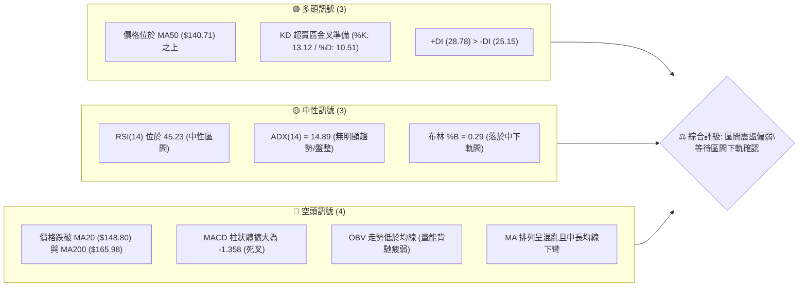
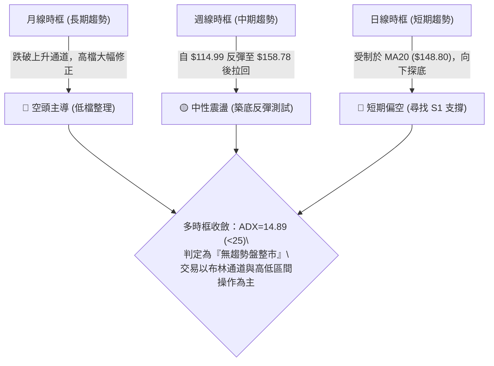
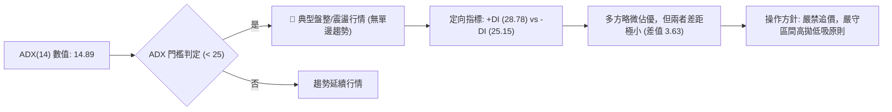
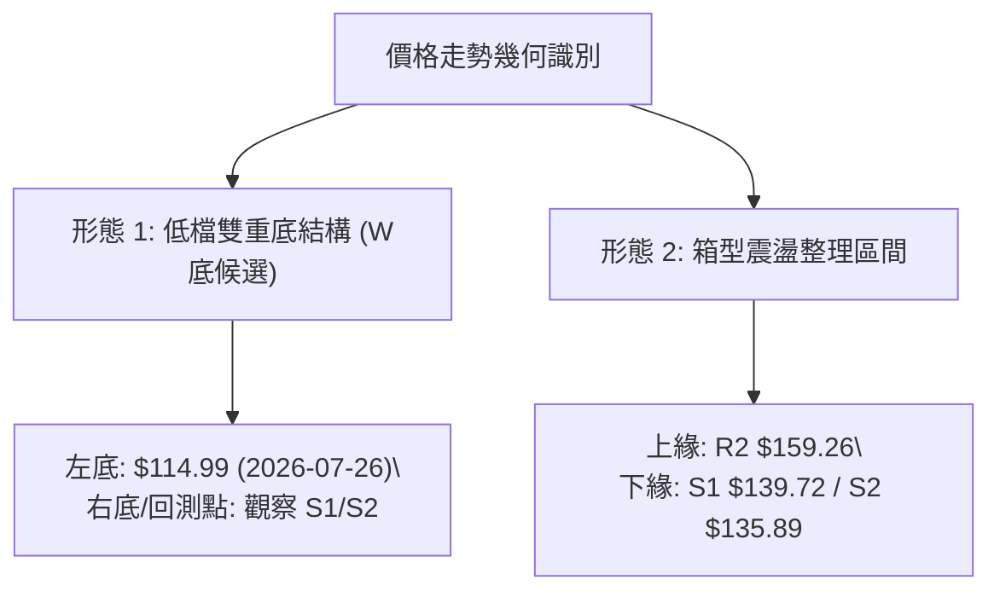
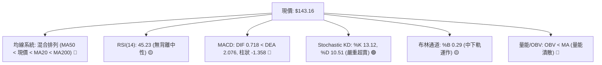
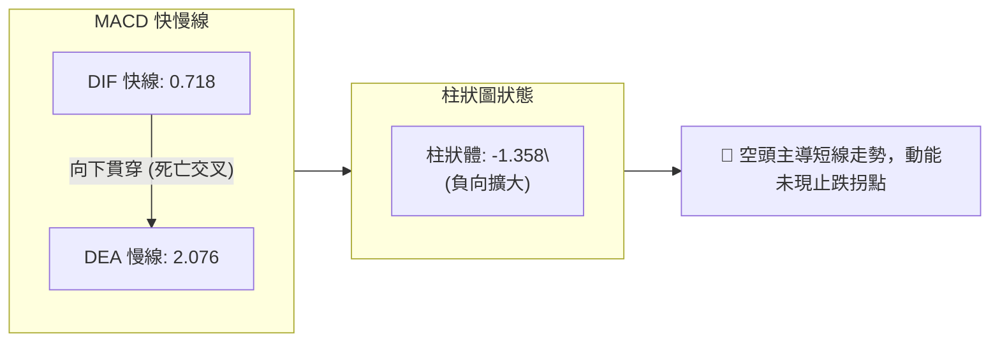
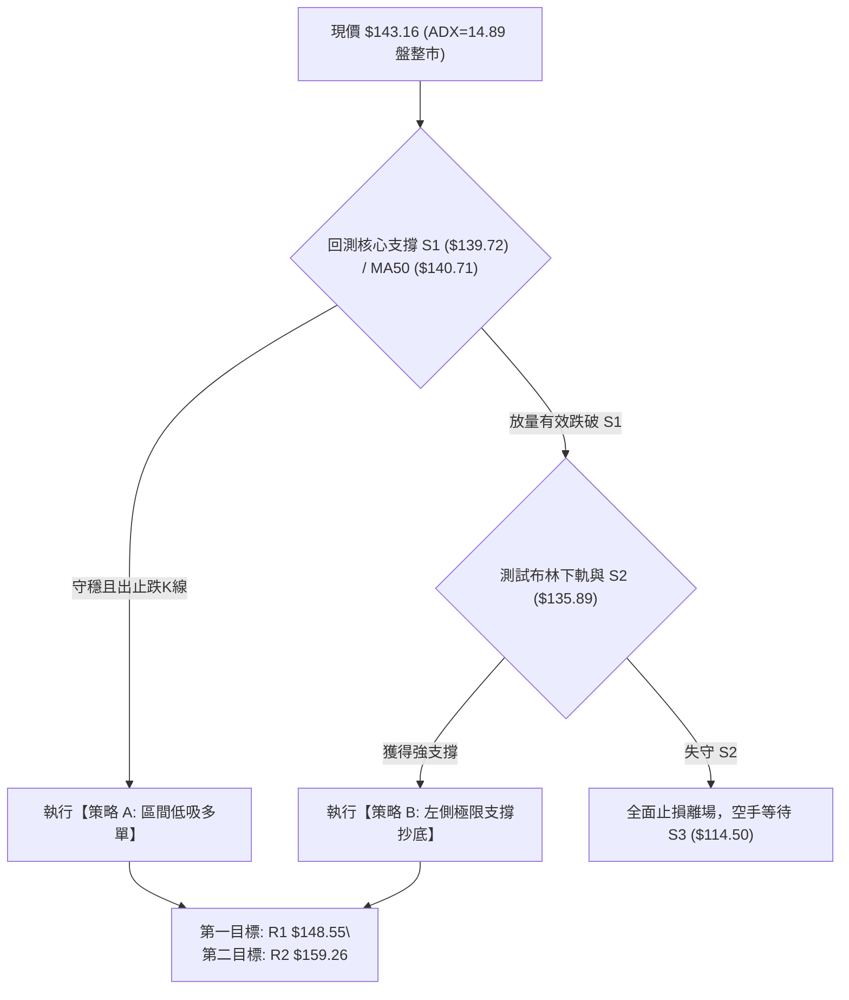
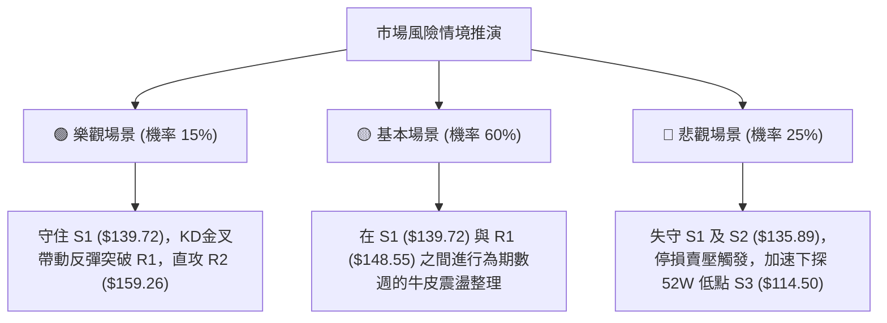

# ORCL 技術分析報告

> **報告日期**：2026-09-17 ｜ **語言**：繁體中文 ｜ **數據來源**：Yahoo Finance ｜ **當前價格**：$143.16

---

## 目錄

| 章節 | 內容 |
|------|------|
| [1. 技術面概覽](#1-技術面概覽) | 訊號儀表板、核心指標、評分卡 |
| [2. 趨勢分析](#2-趨勢分析) | 多時框趨勢、長中短期走勢、ADX解讀 |
| [3. 圖表形態分析](#3-圖表形態分析) | 形態識別、信心度評級、目標價推算 |
| [4. 支撐與阻力](#4-支撐與阻力) | 關鍵價位結構、斐波那契回調 |
| [5. 技術指標深度解讀](#5-技術指標深度解讀) | MA/RSI/MACD/布林/量價配合 |
| [6. 動能與波動率](#6-動能與波動率) | 動能矩陣、ATR、Beta與波動評估 |
| [7. 多時框架總結](#7-多時框架總結) | 時框架評分矩陣、多時框收斂結論 |
| [8. 交易策略建議](#8-交易策略建議) | 策略路由、區間操作、風險報酬比 |
| [9. 風險提示與監控](#9-風險提示與監控) | 監控清單、極端場景、風控參數 |
| [10. 報告總結](#-報告總結) | 核心要點與執行方針 |

---

## 1. 技術面概覽

### 🎯 技術訊號儀表板



---

### 📊 核心指標速覽表

| 指標類別 | 指標名稱 | 當前數值 | 訊號 | 解讀 |
|:---|:---|:---|:---:|:---|
| **價格結構** | 當前收盤價 | $143.16 | 🟡 | 位於52週區間13.6%低位，反彈後受阻回落 |
| **均線系統** | MA20 (短趨勢) | $148.80 | 🔴 | 價格位於 MA20 下方 (-3.79%)，短線承壓 |
| **均線系統** | MA50 (中趨勢) | $140.71 | 🟢 | 價格守在 MA50 上方 (+1.74%)，提供下檔支撐 |
| **均線系統** | MA200 (牛熊線) | $165.98 | 🔴 | 價格低於 MA200 (-13.75%)，長期結構偏空 |
| **動能震盪** | RSI(14) | 45.23 | 🟡 | 處於40-50中性偏弱區，無頂底背離現象 |
| **趨勢指標** | MACD (12/26/9)| Hist -1.358 | 🔴 | DIF(0.718) 跌破 DEA(2.076)，柱狀走弱 |
| **隨機指標** | KD (9,3,3) | %K 13.12 / %D 10.51 | 🟢 | 深度超賣，具備短線技術性抽頭反彈條件 |
| **通道指標** | 布林通道帶 | %B 0.29 | 🟡 | 運行於中軌 ($148.80) 與下軌 ($135.57) 間 |
| **趨勢強度** | ADX (14) | 14.89 | 🟡 | ADX < 25 表明處於典型區間無趨勢盤整市 |
| **波動風險** | ATR (14) | $7.90 (5.52%) | 🟡 | 日內波幅大，需寬設保護性止損區間 |

---

### 🏆 技術評分卡

```
╔══════════════════════════════════════════════════════════════════╗
║                 技術評分卡 — ORCL (2026-09-17)                  ║
╠══════════════════════════════════════════════════════════════════╣
║ 趨勢強度 (ADX=14.89)  ██████░░░░░░░░░░░░░░  30/100 🔴 盤整無向 ║
║ 動能指標 (RSI/MACD)   ████████░░░░░░░░░░░░  40/100 🔴 空頭下探 ║
║ 支撐穩定度 (S1/MA50)  ████████████░░░░░░░░  60/100 🟡 支撐尚存 ║
║ 成交量配合 (OBV/量比) ████████░░░░░░░░░░░░  40/100 🔴 量價背馳 ║
║ 形態完整度 (區間築底) ██████████░░░░░░░░░░  50/100 🟡 箱型震盪 ║
║ 均線排列 (MA混合下壓) ██████░░░░░░░░░░░░░░  30/100 🔴 空方壓制 ║
╠══════════════════════════════════════════════════════════════════╣
║ 綜合技術評分          ████████░░░░░░░░░░░░  42/100 🟡 弱勢區間 ║
╚══════════════════════════════════════════════════════════════════╝
```

---

## 2. 趨勢分析

### 🌐 多時框趨勢分析



---

### 📈 長期趨勢 — 12個月走勢圖（Unicode）

```
ORCL 過去 12 個月收盤價月線走勢圖 ($)
$280 ┤                            ● (2025-09: $278.07 波段頂點)
$260 ┤                               ● (2025-10: $260.10)
$240 ┤
$220 ┤                                                 ● (2026-05: $225.00 反彈頂)
$200 ┤                                  ● (2025-11: $200.02)
$180 ┤                                     ● (2025-12: $193.05)
$160 ┤                                        ●          ●
$140 ┤                                           ●  ●  ●    ●     ●  ●←現價 $143.16
$120 ┤                                                         ●(2026-07: $129.87)
     └────────────────────────────────────────────────────────────
       10   11   12   01   02   03   04   05   06   07   08   09  (月份)
```

#### 走勢特徵分析表格

| 階段區間 | 價格起訖 | 漲跌幅 | 結構性技術特徵 |
|:---|:---|:---:|:---|
| **2025-09 ~ 2026-02** | $278.07 → $144.39 | -48.07% | 長期頂部確立，主跌浪連續跌破各級均線支撐 |
| **2026-03 ~ 2026-05** | $146.09 → $225.00 | +54.01% | 中期強勁空頭回補浪，反彈受阻於 $225.00 |
| **2026-06 ~ 2026-07** | $225.00 → $129.87 | -42.28% | 二次崩跌殺多，直探52週最低點 $114.50 附近區域 |
| **2026-08 ~ 2026-09** | $129.87 → $143.16 | +10.23% | 築底反彈，高見 $158.78 後拉回至當前 $143.16 整理 |

---

### 📊 中期趨勢（週線分析）

```
週線級別近期支撐與阻力結構示意圖
$165.00 ┤-------------------------------------- 強阻力 R3: $164.24 (MA200區域)
$160.00 ┤-------------------------------------- 阻力 R2: $159.26 (09-06 波段高點)
$155.00 ┤
$150.00 ┤-------------------------------------- 關鍵阻力 R1: $148.55 (MA20共振)
$145.00 ┤            ● 現價 $143.16
$140.00 ┤-------------------------------------- 核心支撐 S1: $139.72 (MA50共振)
$135.00 ┤-------------------------------------- 區間下軌 S2: $135.89 (布林下軌)
$115.00 ┤-------------------------------------- 極限支撐 S3: $114.50 (52W Low)
```

中期走勢在經歷 2026 年 7 月下旬打出波段低點 $114.99 後展開 5 週反彈，最高於 2026-09-06 觸及 $158.78。然而，隨後兩週成交量放大至 2 億股（2026-09-13 週量 202,390,700），週線連續收出兩根陰線，將收盤價拖回 $143.16，顯示中期反彈於 $159.00 阻力群處遇阻，重新回防測試 MA50 及 S1 支撐帶。

---

### ⚡ 趨勢強度評估（ADX 解讀）



#### ADX 強度對照表

| 指標變數 | 當前讀數 | 標準區間定義 | 市場狀態與操作意涵 |
|:---|:---:|:---:|:---|
| **ADX (14)** | **14.89** | 0 – 20: 極度疲弱/純橫盤 | 市場缺乏單向推動力，任何假突破機率高達 70% |
| **+DI (14)** | **28.78** | > 25: 多頭推動 | 7-8月反彈動能尚未全數潰散，多方仍保有反撲火種 |
| **-DI (14)** | **25.15** | > 25: 空頭推動 | 近兩週回檔使空方動能迅速回升，壓制多方發展 |
| **趨勢定性** | **無趨勢市** | ADX < 25 (14.89) | **依規則 14，以日線布林通道 ($135.57 - $162.02) 為主戰場** |

---

## 3. 圖表形態分析

### 🔍 形態識別系統



#### 形態信心度評估表（依規則 15）

| 識別形態 | 信心度 | 判斷依據（引用數據） | 完成度 | 目標價（附計算式） |
|:---|:---:|:---|:---:|:---|
| **大級別雙底 (W-Bottom)** | **55%** | 2026-07-26 低點 $114.99，現正進行頸線受阻後的右側次回踩確認（現價 $143.16 高於低點） | 45% | 頸線取 R2 $159.26，高度 = 159.26 - 114.99 = $44.27。<br>突破頸線目標 = 159.26 + 44.27 = **$203.53**（數據中斐波那契對應 61.8% 為 $195.21） |
| **矩形箱體震盪 (Box)** | **75%** | ADX=14.89 確立盤整。價格被夾在 S2 ($135.89) 與 R2 ($159.26) 之間震盪超過 8 週 | 70% | 區間上軌目標價直接對應 **$159.26 (R2)** |
| **頭肩底形態** | **30%** | 訊號不足，右肩未成形，不作過度延伸推論 | 20% | 數據不足，僅做指標型解讀 |

---

### 🕯️ 重要K線形態分析

| 日期 / 週期 | 收盤價 | 典型 K 線組合與形態特徵 | 市場心理與多空解讀 | 短期訊號 |
|:---|:---:|:---|:---|:---:|
| **2026-07-26 (週)** | $114.99 | 長下影長陰探底線（52W Low） | 恐慌盤湧出後出現強力長線機構承接力道 | 🟢 強烈見底 |
| **2026-08-09 (週)** | $147.02 | 實體大陽線，週漲幅 +13.2% | 空頭回補與右側買盤推升，突破短期阻力 | 🟢 轉強信號 |
| **2026-09-06 (週)** | $158.78 | 衝高回落十字星（高點逼近 R2） | 反彈進入阻力帶 R2 ($159.26)，多頭動能衰竭 | 🟡 滯漲警告 |
| **2026-09-13 (週)** | $150.28 | 放量陰包陽吞噬線（成交量 2.02億）| 獲利了結盤與高檔解套賣壓傾瀉而出 | 🔴 短期轉空 |
| **2026-09-20 (日)** | $143.16 | 連續陰跌回測 MA50 支撐棒 | 尋求 S1 ($139.72) 支撐，多方暫無明顯護盤 | 🔴 弱勢整理 |

---

### 📉 ASCII 走勢形態示意圖

```
ORCL 近期箱型震盪與潛在雙底架構示意圖 ($)
$160 ┤               ┌─ 波段高點 R2: $159.26 (2026-09-06)
$155 ┤              ╱ ╲
$150 ┤  頸線壓力 R1 ──── ╲ ─── MA20: $148.80
$145 ┤            ╱       ╲
$140 ┤           ╱         ● 現價: $143.16 (測試 MA50: $140.71)
$135 ┤          ╱           ┆ (支撐區間: S1 $139.72 / S2 $135.89)
$130 ┤         ╱            ┆
$125 ┤        ╱             ┆
$120 ┤       ╱              ┆
$115 ┤  ●───┘ (2026-07-26 低點: $114.99)
     └─────────────────────────────────────────────────────────────
```

---

### 🎯 形態目標價計算

根據具備 75% 信心度的**箱型震盪**以及 55% 信心度的**潛在雙底**結構，目標價推算如下：

1. **箱體波段反彈目標（保守）**：
   - 震盪箱底支撐以 S1 ($139.72) 至 S2 ($135.89) 為基礎。
   - 若守穩 S1 ($139.72)，反彈首要目標為箱體中軸 MA20 / R1 = **$148.55**。
   - 突破 R1 後之箱頂目標價為 R2 = **$159.26**。

2. **潛在雙底成立突破目標（進取，需有效突破 R2）**：
   - 形態低點：$114.99
   - 頸線壓力：$159.26 (R2)
   - 垂直高度 $H = 159.26 - 114.99 = 44.27$
   - 最小量度目標價 $= 159.26 + 44.27 =$ **$203.53**（接近斐波那契 61.8% 阻力位 $195.21）。

---

## 4. 支撐與阻力

### 🗺️ 關鍵價位分布圖（Unicode）

```
ORCL 價位結構分布圖
══════════════════════════════════════════════════════════════════
$165.98 ║████████████████████████████████║ MA200 牛熊分水嶺
$164.24 ║████████████████████████        ║ 強阻力 R3 (近一年密集高點聚類)
$159.26 ║████████████████████            ║ 阻力 R2 (09-06 高點 / 斐波 78.6%)
$148.55 ║████████████████████████        ║ 關鍵阻力 R1 (MA20 / 短期均線共振)
$143.16 ╠════════════════════════════════╣ ◄ 當前市價 ($143.16)
$140.71 ║▓▓▓▓▓▓▓▓▓▓▓▓▓▓▓▓▓▓▓▓            ║ 動態支撐 MA50
$139.72 ║▓▓▓▓▓▓▓▓▓▓▓▓▓▓▓▓▓▓▓▓▓▓▓▓        ║ 近期核心支撐 S1 (波段低點聚類)
$135.89 ║████████████████████            ║ 強支撐 S2 (日線布林下軌帶)
$114.50 ║████████████████████████████████║ 極限鐵底 S3 (52週最低點 100%)
══════════════════════════════════════════════════════════════════
```

---

### 🚧 阻力位分析表

所有價位均直接引用數據來源中「關鍵價位」與指標計算之精確值：

| 阻力級別 | 價位 | 形成技術原因 | 突破難度 | 重要性評級 |
|:---|:---:|:---|:---:|:---:|
| **R1 (短期阻力)** | **$148.55** | 與 MA20 ($148.80) 形成雙重共振，為 9 月初下破後的頸線 | 中等 | 🟡 短期空轉多第一道關卡 |
| **R2 (中期阻力)** | **$159.26** | 2026-09-06 週線波段高點聚類，逼近斐波那契 78.6% ($159.72) | 極高 | 🔴 區間箱頂，大批套牢賣壓 |
| **R3 (強阻力位)** | **$164.24** | 近一年多重頂部聚類區，上方緊貼 MA200 ($165.98) | 銅牆鐵壁 | 🔴 長期下降趨勢壓制線 |

---

### 🛡️ 支撐位分析表

所有價位均直接引用數據來源中「關鍵價位」之精確值：

| 支撐級別 | 價位 | 形成技術原因 | 守住機率 | 重要性評級 |
|:---|:---:|:---|:---:|:---:|
| **S1 (首要支撐)** | **$139.72** | 近一年波段低點聚類，下方共振 MA50 ($140.71) 與 MA60 ($141.94) | 65% | 🟢 短線多頭退守底線 |
| **S2 (區間下軌)** | **$135.89** | 波段低點聚類，緊鄰日線布林下軌 ($135.57) | 80% | 🟢 盤整箱體強支撐防線 |
| **S3 (極限鐵底)** | **$114.50** | 52週歷史低點 (2026-07) 與斐波那契 100.0% 回調位完全重合 | 95% | 🟢 戰略級絕對支撐平台 |

---

### 📐 斐波那契回調位分析

依據 52 週區間極端點：起點 Low **$114.50** → 終點 High **$325.79**（垂直波幅 $211.29），回調分佈如下：

```
斐波那契回調結構 (52W 區間 $114.50 → $325.79)
  0.0% (波段高點) ------------------------------- $325.79
 23.6% 回調位   ------------------------------- $275.92
 38.2% 回調位   ------------------------------- $245.08
 50.0% 關鍵平衡點 ----------------------------- $220.14
 61.8% 黃金分割點 ----------------------------- $195.21
 78.6% 深次回調位 ----------------------------- $159.72  ◄ 緊鄰 R2 ($159.26)
 [現價區域]     ─────────────────────────────── $143.16  ◄ 處於 78.6% ~ 100% 間
100.0% (波段低點) ------------------------------- $114.50  ◄ 對應 S3 ($114.50)
```

**解讀**：現價 $143.16 位於斐波那契 78.6% ($159.72) 與 100.0% ($114.50) 之間的超深幅修正區間。由於股價在跌破 61.8% ($195.21) 後未能快速收復，確認長期多頭架構已被破壞，目前處於弱勢大底部的漫長修復期。$159.72 (78.6%) 成為上檔難以跨越的沉重壓力牆。

---

## 5. 技術指標深度解讀

### 🎛️ 指標訊號總覽



---

### 📈 移動平均線排列分析

```
均線系統分佈與價格差距
MA 5   : $146.30  ▼ (-2.15%)   ─── 短線下壓
MA 10  : $151.42  ▼ (-5.46%)   ─── 下降斜率陡峭
MA 20  : $148.80  ▼ (-3.79%)   ─── 月線阻力
MA 50  : $140.71  ▲ (+1.74%)   ─── 季線支撐
MA 60  : $141.94  ▲ (+0.86%)   ─── 支撐帶
MA 120 : $161.34  ▼ (-11.27%)  ─── 半年線重壓
MA 200 : $165.98  ▼ (-13.75%)  ─── 長期牛熊線下行
MA 240 : $181.02  ▼ (-20.92%)  ─── 年線沉重壓制
```

**深度解讀**：
當前均線系統呈現標準「弱勢混合排列」。短週期 MA5 ($146.30) 與 MA10 ($151.42) 呈空頭發散向下摜壓，MA20 ($148.80) 亦向下傾斜；唯中天期 MA50 ($140.71) 與 MA60 ($141.94) 保持微幅上揚，構成下方護城河。現價夾在 MA50 與 MA20 窄幅區間內，反映出短期下行與中期托底力量的劇烈拉鋸。

---

### 📉 RSI(14) 分析

- **當前讀數**：**45.23** 
- **量化進度條**：
  ```
  0 [════════════超賣區(30)═══════▓▓▓▓▓▓▓▓▓▓░░░░░░░░░░══════超買區(70)════════════] 100
                                  ▲ 現值 45.23 (中性偏空)
  ```
- **超買超賣與動能評估**：RSI 脫離 8 月中旬超買區（當時高達 74.6）後一路滑落，目前落入 40–50 之弱勢中性水準，多方進攻動能已完全被消化。
- **背離分析**：
  - 價格自 2026-09-06 高點 $158.78 回落至 $143.16，RSI 由 61.5 下滑至 45.23。
  - **結論**：指標與價格同步回檔，**無明顯頂背離或底背離**現象，反映價格拉回屬於常態技術調整。

---

### 📊 MACD(12/26/9) 訊號解讀



週線層級數據顯示，MACD 柱狀體自 2026-08-09 的高峰 +4.827 持續收窄，並於本週正式轉負為 **-1.358**。這是自 2026 年 7 月低點反彈以來首度出現的明確空頭死叉訊號，暗示中期反彈動能耗盡，回調週期尚未結束。

---

### 📦 布林通道分析

```
布林通道 (20, 2) 結構圖
$162.02 ┤-------------------------------------- BB 上軌
$156.00 ┤
$148.80 ┤-------------------------------------- BB 中軌 (MA20)
$143.16 ┤            ● 現價 ($143.16, %B = 0.29)
$139.00 ┤
$135.57 ┤-------------------------------------- BB 下軌
```

- **通道帶寬**：上軌 $162.02 與下軌 $135.57 相差 $26.45。
- **指標位置 (%B)**：
  $$\%B = \frac{143.16 - 135.57}{162.02 - 135.57} = 0.2869 \approx 0.29$$
- **解讀**：%B 為 0.29 代表價格正向布林下軌貼近，屬於中軌與下軌間的弱勢下探波段。然而布林下軌 $135.57 與支撐 S2 ($135.89) 高度重疊，預期該價位帶將具備極強的下檔反彈彈性。

---

### 💹 成交量分析（量價配合度）

- **最新成交量**：34,209,600
- **20日均量**：29,036,620（量比：**1.18x**）
- **50日均量**：32,326,260
- **OBV 趨勢**：**OBV < MA**（量能疲弱，資金呈淨流出狀態）。

```
成交量量價特徵解讀
  價格回跌 ──► 成交量放大 (量比 1.18x，近期週量突破2億股)
  OBV 指標 ──► 跌破均線，主力資金持續撤出
  綜合判定 ──► 🔴 量價背馳：跌勢帶量，上漲無量，籌碼穩定度低
```

---

## 6. 動能與波動率

### ⚡ 動能評估四象限

```
                    高動能 (High Momentum)
                              │
               Q3: 高風險高收益│  Q1: 最佳多頭機會
                              │
   ────── 低波動 ─────────────┼───────────── 高波動 ──────
   (Low Volatility)           │        (High Volatility)
               Q2: 謹慎觀望   │  Q4: 避免進場 / 弱勢釋放
                              │  ★ ORCL 當前位置 (Q4)
                    低動能 (Low Momentum)
```

| 象限分類 | 動能條件 | 波動條件 | 當前狀態 | 策略評價 |
|:---|:---:|:---:|:---:|:---|
| **Q1 (加速推進)** | 強動能 | 低波動 | — | 最佳波段順勢機會 |
| **Q2 (平穩築底)** | 弱動能 | 低波動 | — | 區間震盪低吸機會 |
| **Q3 (強勢分歧)** | 強動能 | 高波動 | — | 追漲高風險高收益 |
| **Q4 (弱勢釋放)** | **弱動能 (MACD死叉)** | **高波動 (Beta 1.73)** | **✓ (ORCL)** | **🔴 嚴禁左側重倉追價，以防護為先** |

---

### 📊 ATR 波動率分析

- **ATR(14) 數值**：**$7.90**
- **ATR 佔比**：$\frac{7.90}{143.16} = 5.52\%$（顯著高於美股大型科技股平均 2.5% 水平）。
- **止損與區間距離量化設置**：
  - **1.0 倍 ATR (日內正常雜訊)**：$7.90 → 價格波動範圍在 $135.26 ~ $151.06。
  - **1.5 倍 ATR (波段安全防護距)**：$1.5 \times 7.90 = \$11.85$。
  - **2.0 倍 ATR (極端波動防穿透)**：$2.0 \times 7.90 = \$15.80$。

---

### 📐 Beta 與市場相關性

- **Beta 係數**：**1.732**（具備高貝塔、高敏感性特徵）。
- **解讀**：當標普 500 指數或那斯達克指數波動 1% 時，ORCL 理論上將產生 1.732% 的同向放大波動。在當前弱勢調整期，大盤若出現回調，ORCL 面臨的下檔修正壓力將被顯著放大，因此策略部署必須納入防範大盤劇烈系統性風險。

---

## 7. 多時框架總結

### 📋 時框架評分表

| 時框架 | 趨勢方向 | 動能指標 | 均線排列 | 形態結構 | 綜合評分 | 建議動作 |
|:---|:---:|:---:|:---:|:---:|:---:|:---:|
| **月線時框 (長期)** | 🔴 偏空 | 🔴 負向 | 🔴 空頭發散 | 巨型頂部回調 | **30/100** | 逢高減磅，等待底部成型 |
| **週線時框 (中期)** | 🟡 震盪 | 🔴 死叉轉弱 | 🟡 混合交錯 | 52W低點反彈受阻 | **45/100** | 區間操作，嚴控持倉規模 |
| **日線時框 (短期)** | 🔴 偏空 | 🟡 超賣醞釀 | 🔴 跌破MA20 | 測試MA50與S1 | **40/100** | 觀望支撐確認，勿過早抄底 |

---

### 🔲 綜合訊號矩陣

```
時框與指標訊號矩陣圖
┌──────────────┬──────────────┬──────────────┬──────────────┐
│ 指標 / 時框  │  短期 (日線) │  中期 (週線) │  長期 (月線) │
├──────────────┼──────────────┼──────────────┼──────────────┤
│ 均線系統     │   🔴 偏空    │   🟡 中性    │   🔴 空頭    │
│ RSI / 動能   │   🟡 中性    │   🔴 轉弱    │   🔴 空頭    │
│ MACD 方向    │   🔴 死叉    │   🔴 柱轉負  │   🔴 空頭    │
│ 量價結構     │   🔴 背離    │   🔴 放量陰  │   🔴 資金出  │
│ 支撐防守     │   🟢 S1強守  │   🟢 守低點  │   🟡 歷史位  │
└──────────────┴──────────────┴──────────────┴──────────────┘
```

---

### ⚖️ 多時框收斂結論

> **依據規則 14 之嚴格收斂規則**：
> 1. **市場性質判定**：當前 ADX(14) 讀數為 **14.89 (< 25)**，技術面絕對定義為**「無趨勢之盤整/箱型行情」**。
> 2. **主導維度確立**：在無趨勢行情中，順勢突破策略失效機率極高，**交易全面以日線布林通道上下軌 ($135.57 - $162.02) 及波段低高點為主要交易區間**。
> 3. **方向性唯一結論**：**【中性偏弱觀望，聚焦區間下軌防守買點】**。
>    雖然長期與短線均線排列偏空，但 KD 指標已處極度超賣區（%K 13.12），且股價正逼近 S1 ($139.72) 及布林下軌 / S2 ($135.89) 強支撐帶，下檔殺跌空間有限。策略切忌盲目追空，應以「區間高拋低吸」為唯一依歸。

---

## 8. 交易策略建議

### 🗺️ 策略決策流程圖



---

### 🧭 策略路由

**當前主策略方向 = 【中性區間交易（以支撐位低吸為主），綜合評分 42/100】**  
由於評分落於 40–60 之中性區間，且 ADX 確立盤整市場，禁止單邊趨勢下注，嚴格遵循「布林下軌與支撐處低吸、通道上軌與阻力處止盈」的區間震盪交易邏輯。

---

### 🎯 價格情境階梯（Price Scenarios）

所有引用價位均嚴格取自數據庫計算數值：

| 觸發條件 | 下一目標 | 後續延伸 | 情境含義與操作指引 |
|:---|:---:|:---:|:---|
| **強勢突破 R1 ($148.55)** | R2 ($159.26) | R3 ($164.24) | 短線脫離泥淖，站上 MA20，打開反彈至箱頂空間 |
| **現價區間震盪 ($139.72 ~ $148.55)** | — | — | 於 MA50 與 MA20 間反覆拉鋸洗盤，耐心等待方向 |
| **有效跌破 S1 ($139.72)** | S2 ($135.89) | S3 ($114.50) | 短線支撐失守，考驗布林通道下軌與極限防線 |

---

### 📊 情境機率分佈

| 預期情境 | 發生機率 | 主要技術依據 |
|:---|:---:|:---|
| **區間震盪並在支撐處反彈** | **55%** | ADX 僅 14.89（典型盤整）；KD 嚴重超賣（%K 13.12）；S1 與 MA50 支撐聚攏 |
| **延續弱勢跌破 S1 探 S2** | **35%** | MACD 負向柱擴大 (-1.358)；OBV 疲軟低於均線；成交量呈現下跌帶量 |
| **單邊強勢突破 R2 暴漲** | **10%** | 上方遭遇下降的 MA200 ($165.98) 壓制，短期內缺乏足以反轉趨勢的量能 |

---

### 🟢 主策略詳情（區間操作多頭交易）

| 策略要素 | 策略 A：穩健型（S1 支撐回踩確認） | 策略 B：進取型（S2 極限下軌低吸） |
|:---|:---:|:---:|
| **策略類型** | 支撐位右側低吸 | 布林下軌左側掛單 |
| **進場條件** | 股價回踩 S1 獲得支撐，出現反彈信號 | 價格觸及 S2 / 布林下軌支撐區間 |
| **進場價格** | **$139.72** (S1 關鍵位) | **$135.89** (S2 關鍵位) |
| **目標價 T1** | **$148.55** (R1 / MA20) | **$148.55** (R1 / MA20) |
| **目標價 T2** | **$159.26** (R2 箱頂) | **$159.26** (R2 箱頂) |
| **止損價格** | **$135.57** (日線布林下軌破位點) | **$131.94** (跌破 S2 超過半個 ATR: 135.89 - 3.95) |
| **風險空間** | $139.72 - $135.57 = $4.15 | $135.89 - $131.94 = $3.95 |
| **獲利空間 (T2)**| $159.26 - $139.72 = $19.54 | $159.26 - $135.89 = $23.37 |
| **風險報酬比** | **1 : 4.71** | **1 : 5.92** |
| **預估勝率** | 60% | 50% |
| **建議倉位** | 10% - 15% (輕倉) | 5% - 8% (嚴控) |

---

### 🔴 反向風險觸發點（對沖提示）

- **全面空頭轉化點**：若日線收盤價**實體跌破 S2 ($135.89)**，表示區間箱底徹底被穿透，多頭結構全面潰散，此時應立即止損所有多頭部位，甚至可順勢做空對沖，下看 S3 ($114.50)。
- **多頭反轉確認點**：若放量**突破 R2 ($159.26)** 且連續兩日收於其上，則 55% 信心度之雙底正式確立，應將主策略切換為單邊突破做多。

---

### ⭐ 整體訊號強度評星

```
做多訊號強度：★★☆☆☆  (2/5 星 - 僅具備超賣反彈機會，大趨勢未翻多)
做空訊號強度：★★★☆☆  (3/5 星 - 短期指標偏空，但接近區間下軌不宜追空)
整體可信度：  ★★★★☆  (4/5 星 - 盤整特徵明確，指標指向收斂)
```

---

## 9. 風險提示與監控

### ✅ 關鍵監控指標 Checklist

```
╔══════════════════════════════════════════════════════════════════╗
║                   關鍵技術監控清單 (DAILY MONITOR)               ║
╠══════════════════════════════════════════════════════════════════╣
║ [ ] 價格是否跌破首要支撐 S1 ($139.72) / MA50 ($140.71)           ║
║ [ ] RSI(14) 是否觸及 30 進入深度超賣區 (當前 45.23)               ║
║ [ ] MACD 柱狀體是否由負擴大轉向收斂 (-1.358 是否向上拐頭)         ║
║ [ ] 成交量是否在回測 S1/S2 時呈現量縮（縮至 2000 萬股以下）      ║
║ [ ] 價格能否有效收復短期阻力 R1 ($148.55) 與 MA20                ║
║ [ ] ADX(14) 是否向上突破 25（預示震盪結束，單邊趨勢重啟）       ║
╚══════════════════════════════════════════════════════════════════╝
```

---

### ⚠️ 風險場景分析



---

### 🛡️ 風險管理重要提醒

1. **高 Beta 波動防禦**：ORCL 具有 1.732 的高 Beta 屬性與 $7.90 的高 ATR，嚴格禁止滿倉進出。單筆交易曝險資金應限制在整體投資組合總淨值的 **1.0% – 1.5%** 以內。
2. **區間市操作大忌**：在 ADX < 25 的環境中，最忌「漲了追買、跌了追砍」。務必堅定執行「買在支撐邊緣、賣在阻力重重」的紀律。
3. **盈虧比優先原則**：若無法在接近 S1 ($139.72) 或 S2 ($135.89) 的位置取得具備 1:3 以上風險報酬比的價格，寧可空手觀望，切勿在當前中途價位 ($143.16) 貿然進場。

---

## 📋 報告總結

```
╔══════════════════════════════════════════════════════════════════╗
║                   ORCL 技術分析報告總結                          ║
╠══════════════════════════════════════════════════════════════════╣
║ 報告日期：2026-09-17                                             ║
║ 當前價格：$143.16                                                ║
║ 技術評級：🟡 區間盤整偏弱（綜合技術評分：42 / 100）              ║
╠══════════════════════════════════════════════════════════════════╣
║ 關鍵結論：                                                       ║
║ ├─ 長期趨勢：🔴 空頭主導（落於 52W 低位區 13.6%，均線混合下壓） ║
║ ├─ 中期趨勢：🟡 區間震盪（ADX=14.89 確立無單邊趨勢，震盪箱體）   ║
║ ├─ 短期趨勢：🔴 回次回測（受制 MA20 壓制，下尋 MA50 與 S1 支撐）║
║ ├─ 關鍵阻力：R1: $148.55 │ R2: $159.26 │ R3: $164.24            ║
║ ├─ 關鍵支撐：S1: $139.72 │ S2: $135.89 │ S3: $114.50            ║
║ └─ 華爾街共識：買入 (Buy, 41 位分析師)，平均目標價 $239.00      ║
╠══════════════════════════════════════════════════════════════════╣
║ 最優策略組合：                                                   ║
║ 1. 🥇 最佳機會：等待回踩 S1 ($139.72) 輕倉低吸，停損設 $135.57 ║
║ 2. 🥈 次選機會：掛單 S2 ($135.89) 極限布林下軌抄底，博取大反彈 ║
║ 3. 🥉 保守選擇：完全空手觀望，靜待突破 R1 ($148.55) 再順勢跟進 ║
╚══════════════════════════════════════════════════════════════════╝
```

---

> ⚠️ **免責聲明**：本報告為依據特定量化數據與技術分析模型生成之研究報告，所有技術指標、形態判定與點位推算均基於歷史量價數據。本報告**僅供學術研究與交易架構參考**，**不構成任何形式的個人化投資建議或買賣邀約**。金融市場具高度風險，投資人應獨立評估自身風險承受能力並自負盈虧。