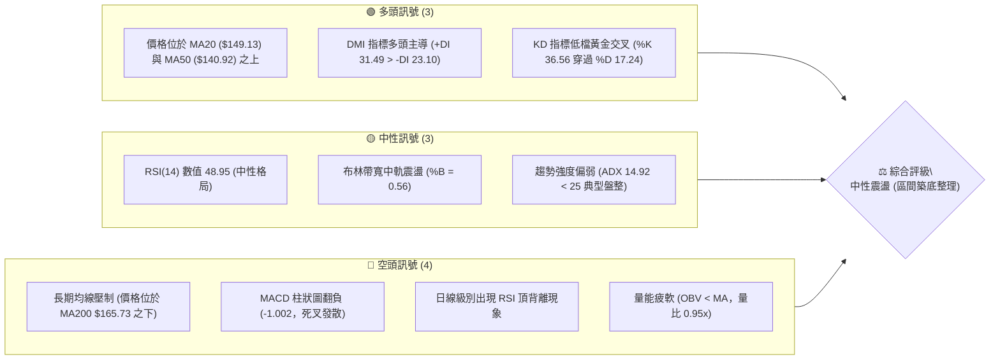
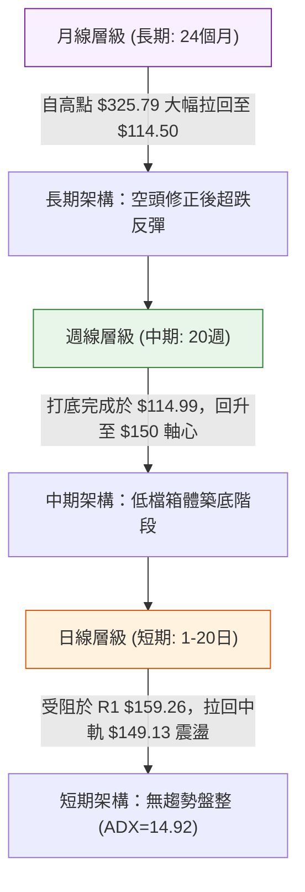
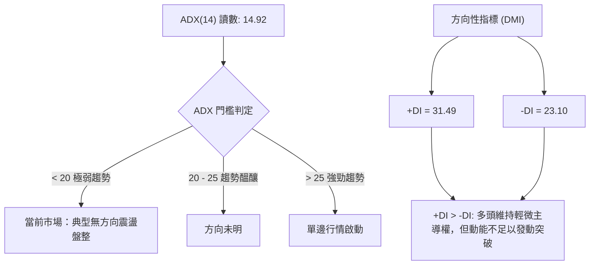
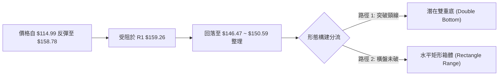
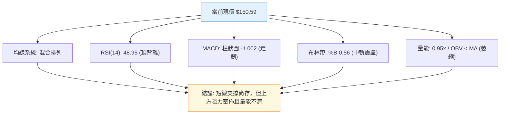
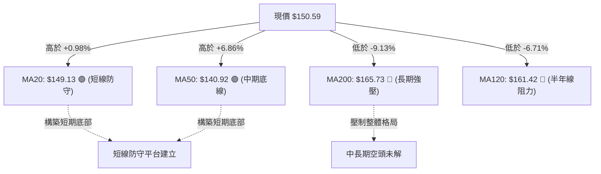
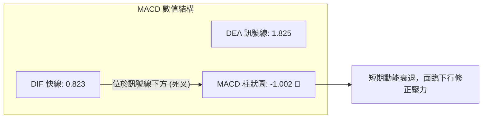
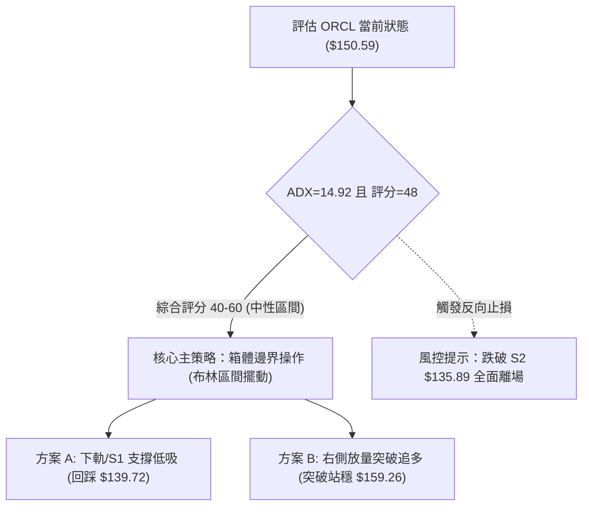
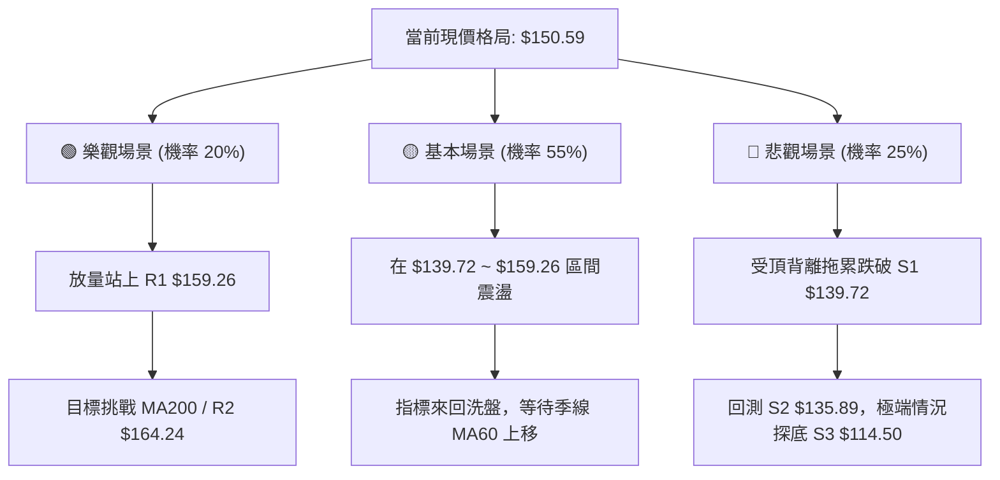

# ORCL 技術分析報告

> **報告日期**：2026-09-18 ｜ **語言**：繁體中文 ｜ **數據來源**：Yahoo Finance ｜ **當前價格**：$150.59

---

## 目錄

| 章節 | 內容 |
|------|------|
| [1. 技術面概覽](#1-技術面概覽) | 訊號儀表板、核心指標、評分卡 |
| [2. 趨勢分析](#2-趨勢分析) | 多時框趨勢、長中短期走勢、12個月走勢圖 |
| [3. 圖表形態分析](#3-圖表形態分析) | 形態識別、信心度評估、K線組合解讀 |
| [4. 支撐與阻力](#4-支撐與阻力) | 關鍵聚類價位、斐波那契回調結構 |
| [5. 技術指標深度解讀](#5-技術指標深度解讀) | 均線系統、RSI背離、MACD、布林通道、OBV |
| [6. 動能與波動率](#6-動能與波動率) | 動能四象限、ATR風控、Beta市場連動 |
| [7. 多時框架總結](#7-多時框架總結) | 時框矩陣、優先級收斂原則與結論 |
| [8. 交易策略建議](#8-交易策略建議) | 策略路由、區間操作/突破方案、風報比 |
| [9. 風險提示與監控](#9-風險提示與監控) | 監控清單、情境推演與風控底線 |

---

## 1. 技術面概覽

### 🎯 技術訊號儀表板



### 📊 核心指標速覽表

| 指標類別 | 指標名稱 | 當前數值 | 訊號 | 解讀 |
|----------|----------|----------|------|------|
| **價格** | 當前收盤價 | $150.59 | 🟡 中性 | 處於52週區間（$114.50–$325.79）的 17.1% 分位，底部反彈後盤整 |
| **均線** | 短期 MA20 | $149.13 | 🟢 多頭 | 價格高於 MA20（+$1.46 / +0.98%），短線維持在月線支撐上方 |
| **均線** | 中期 MA50 | $140.92 | 🟢 多頭 | 價格高於 MA50（+$9.67 / +6.86%），中期波段底部已具備支撐 |
| **均線** | 長期 MA200| $165.73 | 🔴 空頭 | 價格顯著低於 MA200（-$15.14 / -9.13%），中長期空頭架構未逆轉 |
| **均線排列** | 均線系統 | 混合排列 | 🟡 中性 | 短強長弱（MA50 < MA20 < 現價 < MA120 < MA200），處於修復期 |
| **動能** | RSI(14) | 48.95 | 🟡 中性 | 位於 40–60 震盪軸心，但伴隨日線波段高點出現「頂背離」警告 |
| **動能** | MACD (12/26/9) | 0.823 / 1.825 | 🔴 空頭 | DIF 下穿 MACD 訊號線，柱狀圖為 -1.002，短期動能顯著減弱 |
| **趨勢** | ADX (14) | 14.92 | 🟡 盤整 | ADX < 25 表明無顯著單邊趨勢，行情轉入區間震盪整理 |
| **通道** | 布林通道 %B | 0.56 | 🟡 中性 | 價格剛由中軌（$149.13）輕微向上微幅波動，介於上軌與下軌之間 |
| **波動** | ATR(14) | $8.08 | 🟡 正常 | 日均波動幅度為 5.36%，具備充足的日內與跨日擺動空間 |
| **量能** | 成交量比 / OBV | 0.95x / 弱 | 🔴 空頭 | 20日均量未有效放大，能量潮指標 OBV < MA，追高買盤意願低 |

### 🏆 技術評分卡

```
技術評分卡 — ORCL (2026-09-18)
════════════════════════════════════════════════════
趨勢強度      ██████░░░░░░░░░░░░░░  32/100  🔴 弱趨勢/無方向
動能指標      ████████░░░░░░░░░░░░  42/100  🟡 中性偏弱(頂背離)
支撐穩定度    ██████████████░░░░░░  70/100  🟢 S1($139.72)具防守力
成交量配合    ████████░░░░░░░░░░░░  40/100  🔴 量縮整理，OBV偏弱
形態完整度    ██████████░░░░░░░░░░  52/100  🟡 底部箱體架構形成中
均線排列      ██████████░░░░░░░░░░  50/100  🟡 短均翻揚/長均壓制
════════════════════════════════════════════════════
綜合評分      █████████░░░░░░░░░░░  48/100  ⚖️ 區間震盪整理
════════════════════════════════════════════════════
```

---

## 2. 趨勢分析

### 🌐 多時框趨勢分析



### 📈 長期趨勢 — 12個月走勢圖（Unicode）

ORCL 過去 12 個月（2025-10 至 2026-09）呈現了自牛市頂部劇烈回落、於 2026 年中創下 52 週低點後展開底部震盪修復的完整週期。

```
ORCL 月線走勢圖（過去12個月：2025-10 至 2026-09）
價格軸 ($)
$270 ┤  ● (2025-10: $260.10)
$240 ┤
$210 ┤      ● (2025-11: $200.02)
$180 ┤          ● (2025-12: $193.05)                ● (2026-05: $225.00 波段高)
$150 ┤              ● (2026-01: $163.44)  ● ($160.83)   ● ($146.04)   ● ($149.12)  ● ($150.59 現價)
$120 ┤                  ● ($144.39)  ● ($146.09)            ● (2026-07: $129.87 / 探底 $114.50)
     └─────────────────────────────────────────────────────────────────────────────►
       10    11    12    01    02    03    04    05    06    07    08    09  (月份)
```

#### 走勢特徵分析表格

| 階段週期 | 時間區間 | 起訖價格 | 區間漲跌幅 | 核心特徵與技術意義 |
|----------|----------|----------|------------|--------------------|
| **高位崩跌期** | 2025-10 ~ 2026-02 | $260.10 → $144.39 | -44.49% | 主跌浪宣洩，月線連續四個月長黑，機構籌碼大幅撤離 |
| **春季反彈期** | 2026-03 ~ 2026-05 | $146.09 → $225.00 | +54.01% | 季報或資金推動之強烈軋空行情，觸及斐波那契 50% 阻力位 |
| **二次探底期** | 2026-06 ~ 2026-07 | $225.00 → $114.99 | -48.89% | 快速回吐所有反彈漲幅，週線級別恐慌盤殺出，測出 52W 低點 $114.50 |
| **低檔修復期** | 2026-08 ~ 2026-09 | $114.99 → $150.59 | +30.96% | 觸底回升，均線收斂於 $140–$150 帶狀區間，轉入無趨勢築底整理 |

### 📊 中期趨勢（週線分析）

中期走勢以 2026-07-26 當週低點 $114.99 作為轉折錨定點。隨後 4 週強勁拉升至 2026-08-16 的 $150.52，並在 2026-09-06 衝擊波段高點 $158.78，精準受制於歷史聚類阻力位 R1（$159.26）。

```
週線級別價格壓力與支撐結構示意圖：
阻力 R2 ── $164.24  ┬─ (MA200 壓制帶 $165.73 / 上方套牢套現區)
阻力 R1 ── $159.26  ┴─ 9月高點測壓點 ($158.78)，亦為 Fib 78.6% ($159.72)
─────────────────────────────────────────────────────────────────────────────
現價區軸 ── $150.59  ── 近期 3 週核心震盪平台 ($150.28 ~ $150.85)
─────────────────────────────────────────────────────────────────────────────
支撐 S1 ── $139.72  ┬─ MA50 ($140.92) 與 7月回測反彈頸線 ($139.78) 聚結區
支撐 S2 ── $135.89  ┴─ 布林下軌 ($136.11) 支撐處
支撐 S3 ── $114.50  ── 52週極限底 ($114.50 / $114.99)
```

### ⚡ 趨勢強度評估（ADX 解讀）



#### ADX 強度對照表

| 指標變數 | 當前數值 | 參考臨界線 | 狀態判斷 | 對交易策略的約束 |
|----------|----------|------------|----------|------------------|
| **ADX(14)** | **14.92** | 25.00 | **無趨勢 (Non-trending)** | **嚴禁追高殺跌！** 趨勢跟隨指標失效，策略轉向均值回歸 |
| **+DI** | **31.49** | - | 多方動能佔優 | 價格回踩下軌或支撐時，多方仍有抵抗回彈能力 |
| **-DI** | **23.10** | - | 空方動能受挫 | 空方壓制力道未失控，無持續破底危機 |

---

## 3. 圖表形態分析

### 🔍 形態識別系統

依據形態信心度與數據支撐規則，對當前 ORCL 的潛在形態進行客觀識別：



#### 形態識別與信心度評估表

| 形態類別 | 信心度 | 判斷依據（嚴格引用數據） | 完成度 | 目標價（附嚴格幾何推算式） |
|----------|--------|--------------------------|--------|----------------------------|
| **矩形箱體震盪** | **85%** | 價格受限於上界 R1 ($159.26) 與下界 S1 ($139.72)，ADX=14.92 證實橫盤 | **80%** | 上軌目標 $159.26；下軌目標 $139.72。箱體內進行擺動 |
| **大型雙重底** | **55%** | 第一底為 2025-03 ($137.45)，第二底為 2026-07 ($114.50/$126.41)；頸線聚類於 R1 ($159.26) | **50%** | **若實體站穩頸線 $159.26**：<br/>高度 = $159.26 - $114.50 = $44.76<br/>推算目標價 = $159.26 + $44.76 = **$204.02** |
| **頭肩底形態** | **30%** | 左肩 $144.39 (2026-02)、頭部 $114.50 (2026-07)、右肩尚未確立 | **25%** | **訊號不足**，信心度 < 50%，僅做指標型與區間解讀，不預先交易此形態 |

### 🕯️ 重要 K 線形態分析

| 週期/月份 | 收盤價 | K線形態特徵 | 技術解讀 | 訊號 |
|-----------|--------|-------------|----------|------|
| **2026-05** | $225.00 | 實體大陽線（月漲幅 +39.9%） | 軋空上漲觸及歷史密集解套區，成交量過度消耗後出現力竭跡象 | 🟡 假突破警訊 |
| **2026-06** | $146.04 | 吞噬型大陰線（月跌幅 -35.1%） | 獲利了結盤湧出，直接擊穿短期均線支撐，形態迅速惡化 | 🔴 極度看空 |
| **2026-07** | $129.87 | 帶長下影線之十字星（低見 $114.50） | 空頭動能衰竭，恐慌拋補完成，多方在 52W 低點成功防守 | 🟢 觸底反轉 |
| **2026-08** | $149.12 | 中陽線覆蓋前月高點 | 確認 7 月底部為有效波段拐點，短均線重新拐頭向上 | 🟢 確認回升 |
| **2026-09** | $150.59 | 窄幅十字星 / 上影線回落（受阻 $158.78） | 遭遇波段阻力 R1，多空在 MA20 附近陷入僵局，量能萎縮 | 🟡 盤整滯漲 |

### 📉 ASCII 走勢形態示意圖

```
ORCL 近期日/週線級別「矩形箱體」整理示意圖：
$165.00 ┤                                         [MA200 長期強阻力: $165.73]
$159.26 ┼─────────────────● (09/06 高點 $158.78)─ [箱體頂部阻力 R1: $159.26]
$155.00 ┤                / \
$150.59 ┤───────────────●───● ◄───【當前收盤價: $150.59 (中軌震盪)】
$145.00 ┤       ●       /     \
$139.72 ┼──────/─\─────●─────── [箱體底部支撐 S1: $139.72 / MA50]
$135.00 ┤     /   \   /
$114.50 ┴────●─────┴─┴─────────── [52W 極限底 S3: $114.50 (07/26)]
```

### 🎯 形態目標價計算

根據雙重底（信心度 55%）與矩形箱體（信心度 85%）之幾何架構：
1. **箱體震盪目標（主要適用）**：
   - 當前價格 $150.59 處於中性偏中軌位置（布林中軌 $149.13）。
   - 箱體上限目標為阻力位 **R1: $159.26**。
   - 箱體下限目標為支撐位 **S1: $139.72**。
2. **突破型幾何延伸目標（需以突破為前提）**：
   - 形態突破觸發點：日線收盤價帶量站上 **$159.26**。
   - 形態垂直高度：頸線 $159.26 - 極端低點 $114.50 = **$44.76**。
   - 理論延伸目標價：$159.26 + $44.76 = **$204.02**（恰好落在 2025-11 平台 $200.02 附近）。

---

## 4. 支撐與阻力

### 🗺️ 關鍵價位分布圖（Unicode）

```
ORCL 價位結構分布圖（OHLCV 聚類與斐波那契疊加）
═══════════════════════════════════════════════════════════════════
$325.79 ║                                          ║ 52W 歷史極值高點 (Fib 0.0%)
$275.92 ║                                          ║ 斐波那契 23.6% 回調位
$245.08 ║                                          ║ 斐波那契 38.2% 回調位
$220.14 ║                                          ║ 斐波那契 50.0% 回調位 (5月反彈極限)
$195.21 ║                                          ║ 斐波那契 61.8% 重要黃金分割位
$170.63 ║████████████████████████████████████      ║ 強阻力 R3 (歷史籌碼密集套牢區)
$165.73 ║──────────────────────────────────────────║ MA200 牛熊分水嶺壓制
$164.24 ║████████████████████████                  ║ 中度阻力 R2 (反彈高點聚類)
$159.72 ║------------------------------------------║ 斐波那契 78.6% 回調位
$159.26 ║████████████████████████████████          ║ 關鍵阻力 R1 (9月前高/箱體頂)
$150.59 ╠══════════════════════════════════════════╣ ◄ 現價 $150.59 (布林中軌 $149.13)
$139.72 ║▓▓▓▓▓▓▓▓▓▓▓▓▓▓▓▓▓▓▓▓                      ║ 近期關鍵支撐 S1 (MA50/波段頸線)
$135.89 ║████████████████████████████              ║ 強支撐 S2 (布林下軌 $136.11 重疊)
$114.50 ║██████████████████████████████████████████║ 終極鐵底 S3 (52W 最低點 / Fib 100%)
═══════════════════════════════════════════════════════════════════
```

### 🚧 阻力位分析表

所有價位嚴格引用 OHLCV 聚類計算結果，絕無隨意推估：

| 阻力級別 | 精確價位 | 形成原因與籌碼結構 | 突破難度 | 重要性 |
|----------|----------|--------------------|----------|--------|
| **R1** | **$159.26** | 2026-09-06 波段高點 $158.78 聚類，極為接近 Fib 78.6% ($159.72) | 中等（需放量突破） | 🟢 關鍵箱頂（短線多空分水嶺） |
| **R2** | **$164.24** | 2026-01 平台密集成交帶，且逼近 MA200 ($165.73) 的動態均線阻力 | 較高（解套賣壓沈重） | 🟡 中期強阻力 |
| **R3** | **$170.63** | 2024-11 與 2025-01 波段反轉平台聚類，上方套牢套現換手區 | 極高（需中長線基本面配合）| 🔴 長期結構重壓 |

### 🛡️ 支撐位分析表

| 支撐級別 | 精確價位 | 形成原因與籌碼結構 | 守住機率 | 重要性 |
|----------|----------|--------------------|----------|--------|
| **S1** | **$139.72** | 2026-07-05 與 07-12 之反彈平台低點聚類，且與 MA50 ($140.92) 緊密重合 | 75% | 🟢 短線防守核心樞紐 |
| **S2** | **$135.89** | 近一年次級低點密集群，並與日線布林通道下軌 ($136.11) 形成共振支撐 | 85% | 🟡 波段多頭底線 |
| **S3** | **$114.50** | 2026-07-26 創下的 52 週最低點 ($114.50 / $114.99)，機構絕對防線 | 95% | 🔴 終極結構支撐位 |

### 📐 斐波那契回調位分析

依據 52 週完整區間（低點 $114.50 至 高點 $325.79，極值落差高達 $211.29）：

| 回調比例 | 精確數值 | 當前相對位置與技術含義 |
|----------|----------|------------------------|
| **0.0% (高點)** | **$325.79** | 52 週牛市最高點 |
| **23.6%** | **$275.92** | 歷史主要回檔支撐區（已跌破） |
| **38.2%** | **$245.08** | 中期回撤強弱軸（已跌破） |
| **50.0%** | **$220.14** | 2026-05 反彈頂部（$225.00）在此遭遇強烈壓制後折返 |
| **61.8%** | **$195.21** | 關鍵黃金分割位（中期多空生命線） |
| **78.6%** | **$159.72** | **現價上方第一道黃金分割阻力**，與聚類阻力 R1 ($159.26) 形成雙重共振！ |
| **100.0% (低點)**| **$114.50** | 52 週極限低點，底部築底完成處 |

> **回調位區間定位解讀**：
> 當前現價 **$150.59** 正好運行於 **Fib 78.6% ($159.72)** 與 **Fib 100.0% ($114.50)** 之間的深幅回撤修復帶內。由於未能有效站穩 Fib 78.6%，市場確認處於弱勢反彈格局，上方空間受到 $159.26 ~ $159.72 的沉重壓制。

---

## 5. 技術指標深度解讀

### 🎛️ 指標訊號總覽



### 📈 移動平均線排列分析



#### 完整均線系統數據詳表

| 均線名稱 | 當前價格 | 與現價差距 (點數 / %) | 運行方向 | 排列性質與實戰含義 |
|----------|----------|-----------------------|----------|--------------------|
| **MA 5** | $145.83 | +$4.76 (+3.26%) | 向上 ▲ | 超短週期支撐，展現自前一波回調的輕微反彈 |
| **MA 10** | $151.91 | -$1.32 (-0.87%) | 向下 ▼ | 短期壓制線，目前日K線被壓在 10日線下方 |
| **MA 20** | $149.13 | +$1.46 (+0.98%) | 向上 ▲ | 短期月線支撐，為布林中軌，也是短線震盪軸心 |
| **MA 50** | $140.92 | +$9.67 (+6.86%) | 向上 ▲ | 中期波段生命線，此線不破則反彈架構完好 |
| **MA 60** | $141.71 | +$8.88 (+6.27%) | 向上 ▲ | 季線位置，與 MA50 形成堅固的中期支撐帶 |
| **MA 120**| $161.42 | -$10.83 (-6.71%) | 向下 ▼ | 半年線持續下壓，與 R1/Fib 78.6% 構成上檔密集阻力 |
| **MA 200**| $165.73 | -$15.14 (-9.13%) | 向下 ▼ | 經典牛熊分水嶺，價格仍處其下方，確定大趨勢非牛市 |
| **MA 240**| $180.46 | -$29.87 (-16.55%)| 向下 ▼ | 長期年線下彎，顯示過去一年持股成本重心過高 |

### 📉 RSI(14) 分析與背離判定

- **當前讀數**：**48.95**（處於 30–70 中性平衡區間，無超買或超賣狀態）。
- **數值進度條**：
  ```
  超賣(0)               中性平衡(50)             超買(100)
  ├───┼───┼───┼───┼───┼───┼───┼───┼───┼───┤
  ████████████████████████░░░░░░░░░░░░░░░░░░░░  48.95%
  ```

#### ⚠️ 背離分析深度判定（頂背離成立）

依據近 20 週數據追蹤：
1. **週線波段高點一（2026-08-16）**：收盤價 **$150.52**，對應週線 RSI 達到 **74.6**（嚴重超買）。
2. **週線波段高點二（2026-09-06）**：收盤價推升至 **$158.78**（創反彈新高），然而對應週線 RSI 僅有 **61.5**。
3. **結論**：價格創反彈波段新高（$158.78 > $150.52），但動能指標 RSI 明顯走低（61.5 << 74.6），**週/日線級別「頂背離 (Bearish Divergence)」明確成立**！
4. **意涵**：此背離解釋了為何股價在觸及 R1（$159.26）後無力續攻並迅速拉回至 $150.59。在頂背離釋放完畢前，不宜盲目期待突破行情。

### 📊 MACD (12/26/9) 訊號解讀



- **MACD 線 (DIF)**：0.823（高於 0 軸，顯示中期多頭反彈尚未徹底瓦解）。
- **Signal 線 (DEA)**：1.825。
- **MACD 柱狀圖 (Histogram)**：**-1.002**。
- **解讀**：柱狀圖由 8 月中旬的正值高峰（+4.827）逐週遞減，並在 9 月下旬正式翻負至 **-1.002**，釋出明確的**短線空頭賣出訊號**。快慢線高檔死叉，意味著 7 月以來的強彈波段動能已告一段落，目前進入消化獲利盤的整理波段。

### 📦 布林通道分析（Bollinger Bands）

```
ORCL 布林通道結構 (20, 2)：
$162.16 ┼──────────────────────────────────── BB 上軌 (Upper)
        │
$150.59 ┤        ● 現價 ($150.59, %B = 0.56)
$149.13 ┼──────────────────────────────────── BB 中軌 / MA20 (Middle)
        │
$136.11 ┴──────────────────────────────────── BB 下軌 (Lower)
```

- **布林上軌**：**$162.16**（與 R1 $159.26 ~ R2 $164.24 構成壓力重疊區）。
- **布林中軌 (MA20)**：**$149.13**（現價正貼附於中軌運行，差距僅 +0.98%）。
- **布林下軌**：**$136.11**（與支撐位 S2 $135.89 形成完美共振）。
- **%B 指標值**：**0.56**（%B 剛好在 0.50 中線上方微幅波動，反映價格處於無方向平衡位置）。
- **帶寬特徵**：通道帶寬收窄，顯示市場在經歷 7 月大跌與 8 月強彈後，波動率顯著收斂，正在醞釀下一次波段突破。

### 💹 成交量分析（量價配合度）

```
成交量對比：
最新日成交量:  ███████████████████████░░░  27,668,800
20日均量:      ████████████████████████░░  29,100,255 (量比: 0.95x)
50日均量:      ██████████████████████████  32,190,626
```

1. **量比分析**：當前成交量為 2,766 萬股，量比僅為 **0.95x**，顯著低於 50日均量（3,219 萬股）。在股價回調至 $150 軸心時，量能萎縮表明非恐慌性殺跌，但同時也證明缺乏主力資金進場推升的意願。
2. **OBV (能量潮指標) 走勢**：數據顯示 **OBV < MA**。在 8 月初反彈時 OBV 曾隨價格上行，但在 9 月初價格創 $158.78 反彈高點時，OBV 線未能越過前期高點，形成**量價背離**。能量潮疲弱顯示追價意願不足，印證了目前僅為「超跌修復」而非「機構重倉建倉」。

---

## 6. 動能與波動率

### ⚡ 動能評估四象限

根據技術數據：動能維度（MACD 柱負向 -1.002、RSI 48.95 頂背離、量能萎縮）判定為「弱動能」；波動度維度（ADX 14.92、ATR 佔比 5.36% 收斂）判定為「低波動/收縮期」。

```
                 動能強度 (Momentum)
                    ▲
                    │
         Q3 (強動能/高波動) │ Q1 (強動能/低波動)
        [高風險單邊趨勢]   │ [黃金多頭進場點]
                    │
    ────────────────┼────────────────► 波動率 (Volatility)
                    │
         Q4 (弱動能/高波動) │ Q2 (弱動能/低波動) ◄───【ORCL 當前位置】
        [恐慌殺跌震盪]     │ [箱體震盪沉澱區]
                    │
```

#### 四象限評估表

| 象限代號 | 動能狀態 | 波動狀態 | 判定標記 | 策略含義與操作指引 |
|----------|----------|----------|----------|--------------------|
| **Q1** | 強動能 | 低波動 | — | 最佳波段加碼機會，目前條件不具備 |
| **Q2** | **弱動能** | **低波動** | **✓ 當前** | **謹慎觀望/區間低吸高拋**；市場處於方向抉擇前的沉澱期 |
| **Q3** | 強動能 | 高波動 | — | 趨勢突破追價，目前 ADX=14.92 缺乏動能 |
| **Q4** | 弱動能 | 高波動 | — | 恐慌釋放期（類似 2026-06~07 階段，目前已結束）|

### 📊 ATR 波動率分析

- **ATR(14) 絕對值**：**$8.08**
- **ATR 相對價格比**：**5.36%**（$8.08 / $150.59）
- **波動特徵評估**：
  ORCL 的單日預期理論波動區間為 ±$8.08。這表明常規交易日價格在 $142.51 至 $158.67 之間波動皆屬於正常的統計噪音區間。
- **風控止損應用**：
  - **保守止損距離（1.5 × ATR）**：$8.08 × 1.5 = **$12.12**
  - **窄幅止損距離（1.0 × ATR）**：$8.08 × 1.0 = **$8.08**
  - 在設置支撐破位止損時，必須預留至少 1.0–1.5 倍 ATR 空間，避免被日內影線洗盤出場。

### 📐 Beta 與市場相關性

- **Beta 數值**：**1.732**
- **解讀**：
  ORCL 具備極高的市場彈性（High Beta 屬性）。當 S&P 500 或那斯達克指數波動 1.0% 時，ORCL 理論上將產生 1.732% 的同向波動。
- **對沖意涵**：在整體大盤不穩或處於高檔震盪時，高 Beta 意味著 ORCL 的回撤風險將顯著高於平均水平。目前空頭排列之長均線（MA200）疊加高 Beta，要求投資人在建倉時必須嚴格控制槓桿與部位比例。

---

## 7. 多時框架總結

### 📋 時框架評分表

| 時框架 | 趨勢方向 | 動能狀態 | 均線排列 | 關鍵形態特徵 | 綜合評分 | 操作建議 |
|--------|----------|----------|----------|--------------|----------|----------|
| **月線 (長期)** | 🔴 空頭修復 | 弱 (大週期超賣反彈) | 空頭排列 (低於MA200) | 自 $325 崩落後於 $114 企穩 | 35/100 | 嚴控長線多頭部位 |
| **週線 (中期)** | 🟡 中性打底 | 中性 (RSI 48.9, 頂背離) | 混合排列 (破MA120) | 低檔箱體築底，受制 R1 | 50/100 | 區間震盪低吸高拋 |
| **日線 (短期)** | 🟡 盤整走弱 | 偏弱 (MACD 柱翻負) | 糾結 (MA20支撐/MA10壓制)| 布林通道收口，震盪收斂 | 48/100 | 等待方向突破確認 |

### 🔲 綜合訊號矩陣

```
時框維度       趨勢        動能        量能        結構形態      綜合指向
─────────────────────────────────────────────────────────────────────────────
短期 (日線)    🟡 震盪     🔴 空叉     🔴 萎縮     🟡 箱體整理   🟡 中性偏防守
中期 (週線)    🟢 築底     🟡 背離     🟡 平衡     🟢 雙底雛形   🟡 區間波動
長期 (月線)    🔴 偏空     🔴 偏弱     🔴 換手     🔴 深幅回撤   🔴 長線逆風
─────────────────────────────────────────────────────────────────────────────
一致性檢驗：中短期反彈與長期空頭趨勢互相抵觸，無單邊共振機會。
```

### ⚖️ 多時框收斂結論

依據技術分析「多時框收斂優先級規則」進行裁決：
1. **行情性質判定**：當前 **ADX(14) = 14.92 << 25**，市場明確處於**盤整行情 (Consolidation)**，而非單邊趨勢行情。
2. **收斂規則指引**：在盤整架構下，趨勢指標與長期均線之壓制權重暫退居次要，交易邊界**以日線布林通道上下軌（$136.11 ~ $162.16）與聚類支撐阻力（S1 $139.72 ~ R1 $159.26）為主要核心操作區間**。
3. **唯一的方向性結論**：**中性觀望，區間箱體擺動（Neutral Range-bound）**。
   - 向上受制於頂背離、MACD 死叉與 R1 阻力（$159.26）；
   - 向下則受惠於中期波段打底成功、MA50 上揚與 S1 支撐（$139.72）。
   - 在此區間未被實體突破前，任何單邊重倉追價行為均承擔極高非對稱風險。

---

## 8. 交易策略建議

### 🗺️ 策略決策流程圖



### 🧭 策略路由判定

- **當前主策略方向 = 【中性區間震盪策略】（依評分 48/100）**
- **執行方針**：鑑於評分落於 40–60 之中性區間，且 ADX < 25，拒絕盲目單邊下注。主推「**支撐位逢低佈局（方案 A）**」與「**右側放量突破跟進（方案 B）**」，現價 $150.59 處於中軌無風險溢價優勢區，建議耐性等待回踩或確認突破。

### 🎯 價格情境階梯（Price Scenarios）

所有觸發點與目標均嚴格取自第 4 章計算之關鍵價位：

| 觸發條件 | 下一目標 | 後續延伸 | 情境技術含義 |
|----------|----------|----------|--------------|
| **強勢突破 R1 ($159.26)** | **R2 ($164.24)** | **R3 ($170.63)** | 突破箱頂與 Fib 78.6%，挑戰 MA200 牛熊分水嶺 |
| **維持中軌震盪 ($149.13~$150.59)**| **R1 ($159.26)** | **S1 ($139.72)** | 布林帶寬內收斂沉澱，消化日線頂背離籌碼 |
| **失守支撐 S1 ($139.72)** | **S2 ($135.89)** | **S3 ($114.50)** | 跌破 50日均線與箱底，重啟二次探底恐慌走勢 |

### 📊 情境機率分佈

| 價格走勢情境 | 機率預測 | 核心支撐技術依據 |
|--------------|----------|------------------|
| **情境一：區間窄幅震盪** | **55%** | ADX=14.92 表明趨勢動力枯竭，布林帶收口，量能低於均量 |
| **情境二：回測支撐反彈** | **25%** | MACD 柱狀圖翻負 (-1.002) 伴隨 RSI 頂背離，短線具備回踩 S1 需求 |
| **情境三：放量向上突破** | **20%** | +DI (31.49) 高於 -DI (23.10)，基本面分析師多數看好 (評級 Buy) |

### 🟢 主策略詳情

所有價位均精確引用數據中波段點位與 ATR 乘數：

| 策略要素 | 策略 A：箱底支撐低吸（左側波段） | 策略 B：突破關鍵阻力追強（右側順勢） |
|----------|----------------------------------|--------------------------------------|
| **適用時機** | 價格回踩 S1 附近獲得支撐 | 帶量突破箱頂 R1 頸線阻力 |
| **進場條件** | 回測 S1 止跌收陽，出現長下影線 | 日K收盤價突破 R1 且成交量 > 3,200 萬股 |
| **進場價格** | **$139.72** | **$159.26** |
| **止損價格** | **$133.00**（S2 $135.89 下方約 0.5×ATR） | **$151.18**（突破點下方 1.0×ATR: $159.26-$8.08）|
| **目標價 T1** | **$150.59**（當前中軌軸心位） | **$164.24**（阻力位 R2，接近 MA200） |
| **目標價 T2** | **$159.26**（阻力位 R1，箱體上界） | **$170.63**（阻力位 R3 / 密集換手區）|
| **潛在風險點** | $139.72 - $133.00 = **$6.72** | $159.26 - $151.18 = **$8.08** |
| **潛在報酬點** | T2 目標：$159.26 - $139.72 = **$19.54** | T2 目標：$170.63 - $159.26 = **$11.37** |
| **風險報酬比** | **1 : 2.91** (優秀) | **1 : 1.41** (中等，以快速波段為主) |
| **成功機率** | **65%** | **45%** |
| **建議倉位** | 10% ~ 15%（分批承接） | 8% ~ 10%（嚴格風控） |

### 🔴 反向風險觸發點（對沖提示）

若已建立多頭部位，出現下列訊號時必須立即執行對沖或強制止損：
1. **關鍵支撐被跌破**：若日K線以實體長黑跌破 **S1: $139.72** 且翌日無法收復，意味中期打底架構失敗。
2. **極限風險停損**：任何情況下收盤跌破 **S2: $135.89**（布林下軌破位），全數多單無條件離場觀望，防範直墜 S3: $114.50。
3. **MACD 死叉擴大**：若 MACD 柱狀圖跌破 -3.000 且 DIF 下穿 0 軸，全面禁止任何左側接刀行為。

### ⭐ 整體訊號強度評星

```
做多訊號強度：★★☆☆☆  (2/5星 - 均線未完全扭轉，動能背離)
做空訊號強度：★★☆☆☆  (2/5星 - 底部支撐強烈，下跌空間被封堵)
區間震盪可信度：★★★★☆ (4/5星 - ADX極低，布林收窄，箱體清晰)
整體技術可信度：★★★☆☆ (3/5星 - 處於盤整沉澱期，等待放量突破)
```

---

## 9. 風險提示與監控

### ✅ 關鍵監控指標 Checklist

```
╔════════════════════════════════════════════════════════════════════════╗
║                   ORCL 每日盤後關鍵技術監控清單                          ║
╠════════════════════════════════════════════════════════════════════════╣
║ [ ] 價格是否跌破 MA20 ($149.13) 布林中軌防線                           ║
║ [ ] RSI(14) 能否化解頂背離並重回 55 以上多頭強勢區                     ║
║ [ ] MACD 柱狀圖是否在 -1.002 附近出現縮腳（收斂翻正）                   ║
║ [ ] ADX(14) 是否由 14.92 向上拐頭突破 20，宣告單邊行情啟動             ║
║ [ ] 日成交量能否顯著突破 50日均量 (32,190,626 股)                      ║
║ [ ] 阻力位 R1 ($159.26) 測試時之量價配合情況（放量突破 vs 量縮受阻）    ║
║ [ ] 支撐位 S1 ($139.72) / MA50 ($140.92) 是否維持穩固                  ║
╚════════════════════════════════════════════════════════════════════════╝
```

### ⚠️ 風險場景分析



### 🛡️ 風險管理重要提醒

1. **Beta 高彈性風險**：ORCL 的 Beta 高達 **1.732**，在科技股大盤拉回時，其下跌波動速度極快。任何持倉必須匹配現貨，切忌使用高槓桿期權在區間中軌盲目博單邊。
2. **財報與現金流基本面隱憂**：雖然營收年增 29.6%、分析師共識偏多（買入評級、均價 $239.00），但公司淨負債高達 $-132.07B、自由現金流為負（FCF $-45.85B），基本面存在資金鏈槓桿偏高的尾部風險，技術面破位時機構可能無情拋售。
3. **倉位管理軍規**：
   - 區間操作階段，總曝險部位不宜超過投資組合總資產的 **10% ~ 15%**。
   - 單筆止損金額嚴格限制在總資本的 **1.0%** 以內（以 ATR $8.08 為基礎進行逆向頭寸規模測算）。

---

## 📋 報告總結

```
ORCL 技術分析報告總結
════════════════════════════════════════════════════════
報告日期：2026-09-18
當前價格：$150.59
分析評級：⚖️ 中性觀望（箱體築底震盪）

關鍵結論：
├─ 長期趨勢：🔴 空頭修正未結（價格受阻於 MA200 $165.73 之下）
├─ 中期趨勢：🟢 底部已明朗（7月 $114.50 構成實質波段底部）
├─ 短期趨勢：🟡 區間無方向（ADX 14.92 指向低波動盤整）
├─ 關鍵支撐：S1: $139.72 / S2: $135.89 / S3: $114.50
├─ 關鍵阻力：R1: $159.26 / R2: $164.24 / R3: $170.63
└─ 分析師目標：平均目標價 $239.00（現價具備 +58.7% 理論溢價空間）

最優策略組合：
1. 🥇 最佳機會：策略 A — 耐心等待價格拉回關鍵支撐 S1 ($139.72) 
               附近承接，止損設 $133.00，博取風報比 1:2.91 之反彈。
2. 🥈 次選機會：策略 B — 觀察 R1 ($159.26)，若帶大成交量突破
               則右側進場追隨動能，短線目標看 R2 ($164.24)。
3. 🥉 保守選擇：空倉觀望，不參與當前中軌 ($150.59) 窄幅拉鋸，
               靜待 ADX 突破 25 後隨趨勢順勢交易。
════════════════════════════════════════════════════════
```

---

> ⚠️ **免責聲明**：本報告為 AI 自動生成之技術分析，所有數據及估算均基於客觀歷史價格資訊。本報告**僅供研究與學術參考**，**不構成任何投資買賣建議**。金融市場瞬息萬變，投資有風險，入市需獨立審慎評估。

---

*報告生成時間：2026-09-18 ｜ 數據來源：Yahoo Finance ｜ 分析框架：多時框量化技術分析體系*