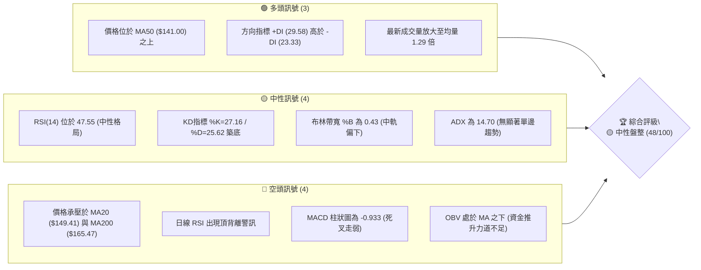
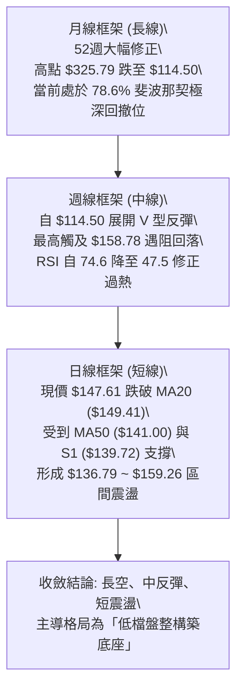
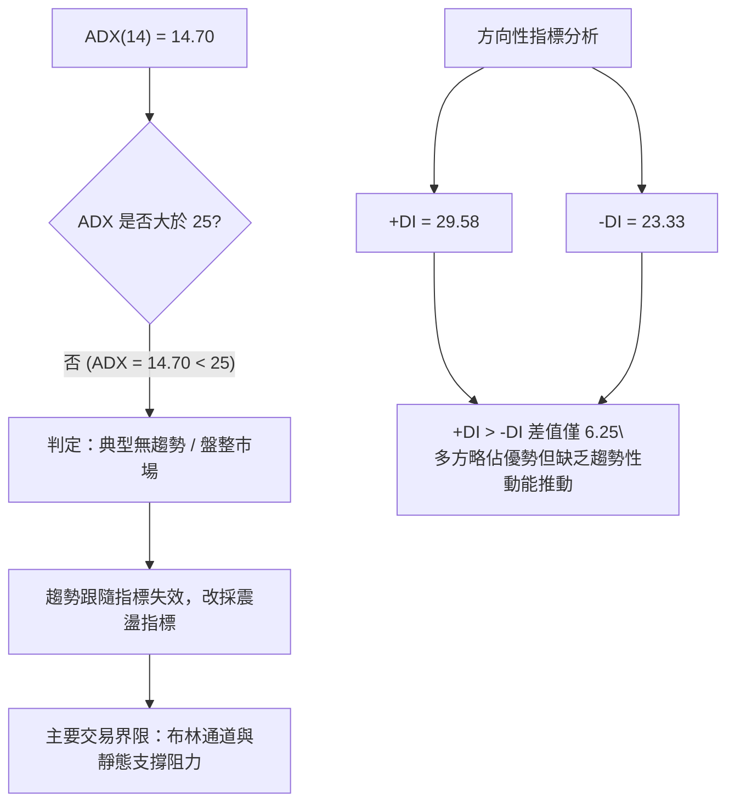
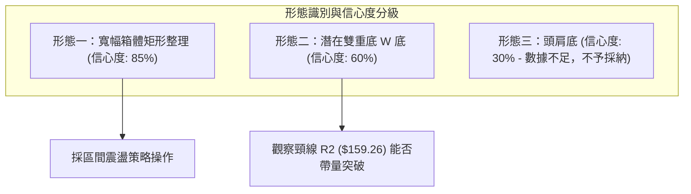
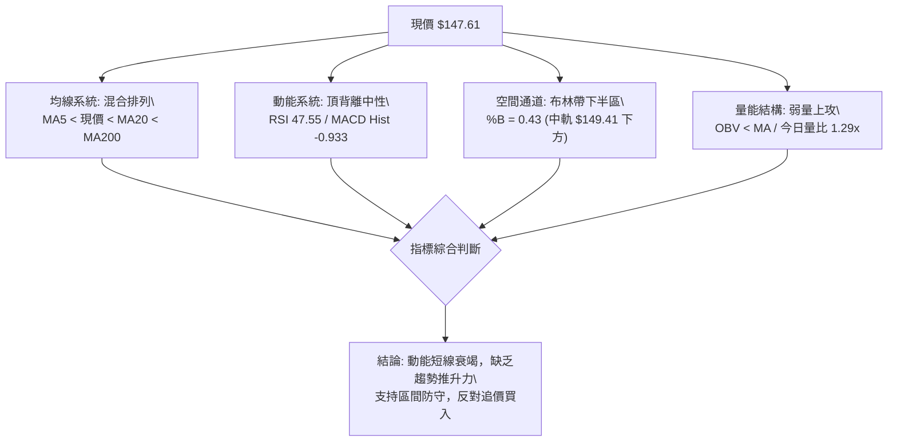
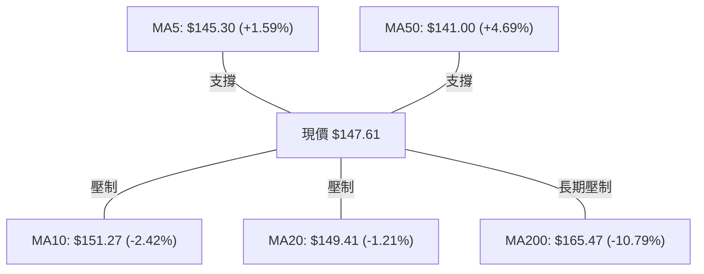
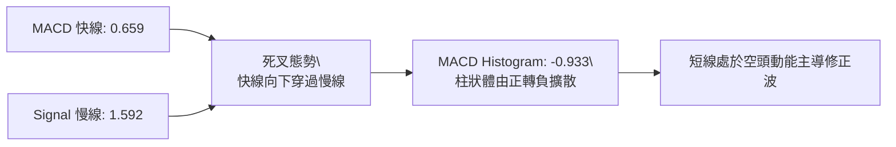
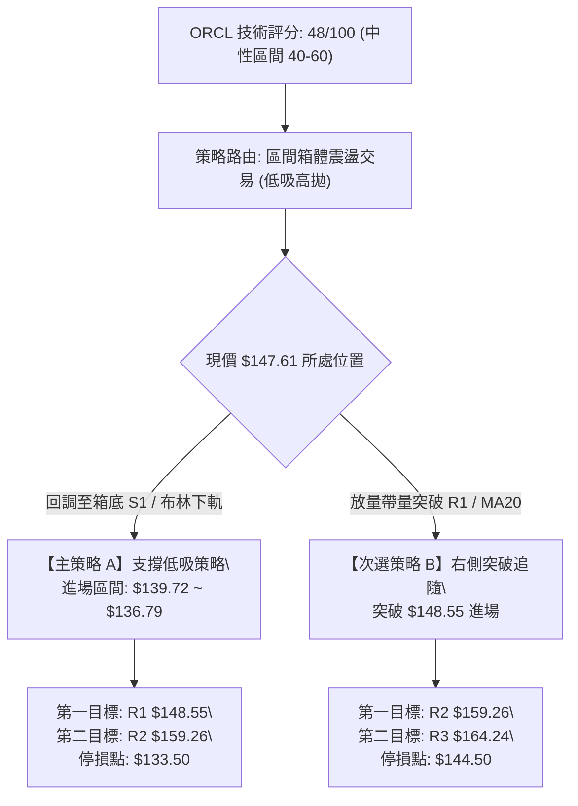
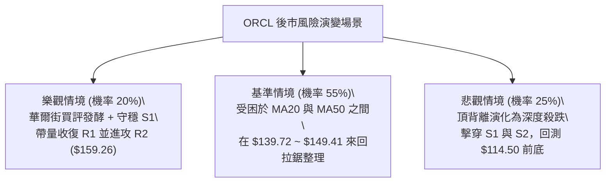

# ORCL 技術分析報告

> **報告日期**：2026-09-19 ｜ **語言**：繁體中文 ｜ **數據來源**：Yahoo Finance ｜ **當前價格**：$147.61

---

## 目錄

| 章節 | 內容 |
|------|------|
| [1. 技術面概覽](#1-技術面概覽) | 訊號儀表板、核心指標、評分卡 |
| [2. 趨勢分析](#2-趨勢分析) | 多時框趨勢、長中短期走勢、ADX解讀 |
| [3. 圖表形態分析](#3-圖表形態分析) | 形態識別、K線組合、目標價推算 |
| [4. 支撐與阻力](#4-支撐與阻力) | 關鍵價位分佈、斐波那契回調結構 |
| [5. 技術指標深度解讀](#5-技術指標深度解讀) | MA/RSI/MACD/布林通道/成交量OBV |
| [6. 動能與波動率](#6-動能與波動率) | 動能象限、ATR波動度、Beta敏感性 |
| [7. 多時框架總結](#7-多時框架總結) | 時框架評分矩陣、多時框收斂結論 |
| [8. 交易策略建議](#8-交易策略建議) | 策略路由、情境階梯、主策略詳情 |
| [9. 風險提示與監控](#9-風險提示與監控) | 監控Checklist、情境樹、風控法則 |

---

## 1. 技術面概覽

### 🎯 技術訊號儀表板



---

### 📊 核心指標速覽表

| 指標類別 | 指標名稱 | 當前數值 | 訊號 | 解讀 |
|:---|:---|:---:|:---:|:---|
| **價格結構** | 現價 / 52W區間 | $147.61 / 15.7% | 🟡 | 位於52週底部區間（$114.50～$325.79），處於深度回調後的築底期 |
| **均線系統** | 短期 MA20 | $149.41 | 🔴 | 現價位於 MA20 下方 -1.21%，短線受制於月線動態反壓 |
| **均線系統** | 中期 MA50 | $141.00 | 🟢 | 現價站於 MA50 上方 +4.69%，中期波段低點支撐已初步成形 |
| **均線系統** | 長期 MA200 | $165.47 | 🔴 | 現價大幅低於年線 -10.79%，長期多空分水嶺尚未收復 |
| **動能指標** | RSI(14) | 47.55 | 🟡 | 處於40～50中性格局，但伴隨波段頂背離跡象，需防動能衰竭 |
| **動能指標** | MACD (12,26,9) | Hist: -0.933 | 🔴 | MACD線(0.659)跌破訊號線(1.592)，柱狀體轉負擴散，短線回調 |
| **趨勢強度** | ADX(14) | 14.70 | 🟡 | 數值遠低於25，確認當前屬於無趨勢之「箱體震盪行情」 |
| **通道指標** | 布林通道 %B | 0.43 | 🟡 | 價格介於中軌 $149.41 與下軌 $136.79 間，中性偏弱震盪 |
| **量能指標** | 成交量比 / OBV | 1.29x / 弱 | 🔴 | 量能小幅放大但 OBV 低於均線，顯示買盤追價意願謹慎 |
| **波動指標** | ATR(14) | $8.24 (5.58%) | 🟡 | 單日波幅較大，持倉需預留充分停損緩衝空間 |

---

### 🏆 技術評分卡

```
╔══════════════════════════════════════════════════════════════╗
║              技術評分卡 — ORCL (2026-09-19)                  ║
╠══════════════════════════════════════════════════════════════╣
║ 趨勢強度 (ADX=14.70)   ████░░░░░░░░░░░░░░░░  25/100 🔴 弱勢無趨勢║
║ 動能指標 (RSI/MACD)   ████████░░░░░░░░░░░░  40/100 🔴 背離回調  ║
║ 支撐穩定度 (S1/MA50)  ██████████████░░░░░░  70/100 🟢 雙重支撐  ║
║ 成交量配合 (OBV/均量) ████████░░░░░░░░░░░░  42/100 🟡 量增但量能弱║
║ 形態完整度 (箱體整理) ████████████░░░░░░░░  60/100 🟡 築底結構中║
║ 均線排列 (混亂交織)   ██████████░░░░░░░░░░  50/100 🟡 均線收斂中║
╠══════════════════════════════════════════════════════════════╣
║ 綜合技術評分          ██████████░░░░░░░░░░  48/100 🟡 中性觀望  ║
║ 操作主軸              布林通道與箱體邊界低吸高拋，嚴禁追價   ║
╚══════════════════════════════════════════════════════════════╝
```

---

## 2. 趨勢分析

### 🌐 多時框趨勢架構



---

### 📈 長期趨勢 — 12個月走勢圖（Unicode）

ORCL 過去 12 個月經歷了自歷史巔峰狂瀉、恐慌拋售、報復性反彈至箱體整理的完整週期：

```
ORCL 過去12個月月線走勢示意圖
價格軸 ($)
$280 ┤ ● (2025-09: $278.07)
$260 ┤   ● (2025-10: $260.10)
$240 ┤
$220 ┤                             ● (2026-05: $225.00)
$200 ┤       ● (11月: $200.02)
$180 ┤         ● (12月: $193.05)
$160 ┤             ● ($163.44)       ● ($160.83)
$140 ┤                 ● ($144.39) ● ($146.09)     ● ($146.04)   ● ($149.12)
$120 ┤                                                 ● ($129.87)   ● ($147.61 現價)
     └─┬─────┬─────┬─────┬─────┬─────┬─────┬─────┬─────┬─────┬─────┬─────┬───
      09    10    11    12    01    02    03    04    05    06    07    08    09
     (2025)                                    (2026)
```

#### 走勢特徵階段分析

| 階段區間 | 價格區間 | 期間漲跌幅 | 價量特徵與形態解讀 |
|:---|:---:|:---:|:---|
| **第一階段：見頂暴跌**<br>(2025-09 ～ 2026-02) | $278.07 → $144.39 | **-48.07%** | 自 $278.07 崩跌，跌破多條長期均線，機構資金持續獲利了結。 |
| **第二階段：弱勢反抽**<br>(2026-03 ～ 2026-05) | $144.39 → $225.00 | **+55.83%** | 2026年5月出現單月暴量急拉至 $225.00，但屬於空頭回補之假突破。 |
| **第三階段：二次探底**<br>(2026-06 ～ 2026-07) | $225.00 → $129.87 | **-42.28%** | 7月下旬創下52週最低點 $114.50（收盤 $129.87），市場極度恐慌。 |
| **第四階段：築底整理**<br>(2026-08 ～ 2026-09) | $129.87 → $147.61 | **+13.66%** | 自低點脫離，目前在 $140.00～$150.00 建立新的價值中樞平衡區。 |

---

### 📊 中期趨勢（週線分析）

從近 20 週收盤走勢觀察，自 2026-07-26 當週收盤 $114.99 見底後，展開連續 3 週的強勁修復（RSI 一度由 11.1 飆升至 74.6 超買區），隨後在 2026-09-06 觸及 $158.78 阻力位（極為接近 R2 $159.26）。近兩週呈現高檔量縮陰跌，週線 RSI 降至 47.5，MACD 柱狀圖由正轉負（-0.933），代表中線反彈動能已遭遇到 R2 與 MA200 反壓，進入次級折返修正。

---

### ⚡ 趨勢強度評估（ADX 解讀）



| 指標名稱 | 當前數值 | 閾值分級 | 市場狀態判斷 |
|:---|:---:|:---:|:---|
| **ADX (14)** | **14.70** | < 20 (極弱趨勢) | 市場處於完全休眠或拉鋸盤整，不可進行單邊趨勢突破追單。 |
| **+DI (14)** | **29.58** | 20 ~ 30 (中度) | 多方保有一定買盤控制權，限制了深跌空間。 |
| **-DI (14)** | **23.33** | 20 ~ 30 (中度) | 空方拋壓有所收斂，但未完全離場。 |
| **DI 關係** | **+DI > -DI** | 淨多頭 +6.25 | 短期偏多震盪，需等待 ADX 回升至 25 以上方能啟動波段。 |

---

## 3. 圖表形態分析

### 🔍 形態識別系統

依據形態信心度規則（嚴格要求 15），本報告僅針對符合客觀數據之形態進行評估：



| 形態名稱 | 信心度 | 判斷依據（數據支撐） | 完成度 | 目標價推算公式與數值 |
|:---|:---:|:---|:---:|:---|
| **矩形箱體整理** | **85%** | 區間下緣獲得 S1 ($139.72) 與布林下軌 ($136.79) 支撐；上緣受制於 R1 ($148.55) 與 R2 ($159.26)。 | 75% | 箱體震盪區間為 **$136.79 ～ $159.26**，當前於箱體中線下方運行。 |
| **潛在雙重底 (W底)** | **60%** | 第一底為 52W 低點 $114.50，反彈頸線為 $159.26，次底於 7月收盤 $129.87 / S2 $135.89 墊高。 | 50% | 頸線 = $159.26，形態高度 = $159.26 - $114.50 = $44.76。<br>破頸線目標 = $159.26 + $44.76 = **$204.02**。 |
| **頭肩底形態** | **30%** | 僅有單一低點 $114.50 與不對稱反彈，無清晰右肩結構。 | 20% | **數據不足，信心度低於50%，僅作指標型解讀，不予推估。** |

---

### 🕯️ 重要K線與週線結構分析

| 觀測週期/月份 | 收盤價 | 關鍵K線形態 | 形態意涵與量價解讀 | 技術訊號 |
|:---|:---:|:---:|:---|:---:|
| **2026-05** | $225.00 | 長上影高浪線 | 當月成交量未顯著配合，多頭力竭形成波段假突破高點。 | 🔴 強烈見頂 |
| **2026-07-26 (週)**| $114.99 | 恐慌長下影錘頭線 | 週成交量爆發至 1.62 億股，RSI 探底至 11.1 後急拉，奠定 52W 底座。 | 🟢 恐慌洗盤底 |
| **2026-08-09 (週)**| $147.02 | 實體大陽線 | 週成交量達 1.62 億股，突破 MA50，確立自底部的強勢修復行情。 | 🟢 轉強突破 |
| **2026-09-06 (週)**| $158.78 | 衝高受阻流星線 | 上攻遇阻於斐波那契 78.6% ($159.72) 及 R2，多頭無力封板。 | 🔴 阻力確認 |
| **2026-09-20 (週)**| $147.61 | 縮量小陰線 | 連續兩週回吐，收盤跌破 MA20 ($149.41)，確認進入次級回調。 | 🟡 中性格局 |

---

### 📉 ASCII 形態示意圖：潛在雙底與箱體收斂

```
ORCL 日/週線箱體與潛在 W 底示意圖
價格軸 ($)
$165 ┤-------------------------------------- 強阻力 R3 ($164.24)
$159 ┤      頸線 / 箱頂 ──● [2026-09-06: $158.78] ─── R2 ($159.26)
$149 ┤                   / \      現價: $147.61 (跌破 MA20 $149.41)
$148 ┤                  /   \  ●── R1 ($148.55)
$140 ┤     反彈段      /     \   / 
$136 ┤                /       \ ●───── 箱底下緣 S1/S2 ($139.72 / $135.89)
$120 ┤               /
$114 ┤  第一底 ●──── [2026-07-26: $114.50]
     └─────────────────────────────────────────────────────────────
```

---

## 4. 支撐與阻力

### 🗺️ 關鍵價位分佈圖（Unicode）

```
ORCL 價位結構分佈圖
══════════════════════════════════════════════════════════════
$165.47 ║░░░░░░░░░░░░░░░░░░░░░░░░░░░░░░║ MA200 長期均線反壓
$164.24 ║██████████████████████████████║ 強阻力 R3 (波段高點聚類)
$162.04 ║▓▓▓▓▓▓▓▓▓▓▓▓▓▓▓▓▓▓▓▓▓▓▓▓      ║ 布林通道上軌
$159.72 ║▒▒▒▒▒▒▒▒▒▒▒▒▒▒▒▒▒▒▒▒▒▒▒▒▒▒    ║ 斐波那契 78.6% 回調位
$159.26 ║████████████████████████      ║ 關鍵阻力 R2 (反彈高點聚類)
$149.41 ║────────── MA20 月線中軌 ─────║ 短線動態反壓
$148.55 ║████████████████              ║ 即時阻力 R1 (+0.64%)
$147.61 ╠══════════════════════════════╣ ◄ 現價 ($147.61)
$141.00 ║────────── MA50 季線支撐 ─────║ 中期防守線
$139.72 ║████████████████              ║ 關鍵支撐 S1 (-5.35%)
$136.79 ║▓▓▓▓▓▓▓▓▓▓▓▓▓▓▓▓▓▓▓▓          ║ 布林通道下軌
$135.89 ║██████████████████████        ║ 強支撐 S2 (-7.94%)
$114.50 ║██████████████████████████████║ 終極鐵底 S3 (52W最低點 -22.43%)
══════════════════════════════════════════════════════════════
```

---

### 🚧 阻力位分析表

所有價位均嚴格引用 OHLCV 計算所得之關鍵聚類點：

| 阻力級別 | 具體價位 | 距現價空間 | 阻力形成原因與技術共振 | 突破難度 | 戰略重要性 |
|:---|:---:|:---:|:---|:---:|:---:|
| **阻力 R1** | **$148.55** | **+0.64%** | 近期日線震盪反覆觸及之密集成交區，且與 MA20 ($149.41) 極度貼近形成雙重短壓。 | 中等 | ⭐⭐⭐<br>日內多空交鋒點 |
| **阻力 R2** | **$159.26** | **+7.89%** | 2026-09-06 週線波段高點 ($158.78) 聚類，與斐波那契 78.6% ($159.72) 產生強烈共振。 | 極高 | ⭐⭐⭐⭐⭐<br>W底頸線/多空分水嶺 |
| **阻力 R3** | **$164.24** | **+11.27%** | 密集籌碼套牢平台聚類，與 MA200 ($165.47) 及 MA120 ($161.49) 形成長期均線死亡反壓帶。 | 極高 | ⭐⭐⭐⭐<br>中期多頭反轉確認線 |

---

### 🛡️ 支撐位分析表

| 支撐級別 | 具體價位 | 距現價空間 | 支撐形成原因與技術共振 | 守住機率 | 戰略重要性 |
|:---|:---:|:---:|:---|:---:|:---:|
| **支撐 S1** | **$139.72** | **-5.35%** | 2026-07-05 週線下影線低點聚類，與 MA50 ($141.00) 季線重合，為多頭第一道防線。 | 75% | ⭐⭐⭐⭐<br>短線防守第一道關卡 |
| **支撐 S2** | **$135.89** | **-7.94%** | 日線級別波段回調低點聚類，與當前布林通道下軌 ($136.79) 產生空間重疊。 | 85% | ⭐⭐⭐⭐⭐<br>箱體底邊/低吸黃金區 |
| **支撐 S3** | **$114.50** | **-22.43%** | 52週歷史極值，恐慌拋售點，具備強大結構性買盤支撐與估值底部定價效應。 | 95% | ⭐⭐⭐⭐⭐<br>絕對止損底線 |

---

### 📐 斐波那契回調位分析

依據 52 週完整極端區間（$114.50 → $325.79，總垂直落差 $211.29）計算：

```
0.0%  (52W High)   $325.79 ──┬── 歷史牛市巔峰
23.6%              $275.92   │
38.2%              $245.08   │   深渡回調區
50.0%              $220.14   │   多空分水嶺（2026-05 反彈極限 $225.00）
61.8%              $195.21   │   黃金分割強阻力
78.6%              $159.72 ──┴── 本輪反彈壓制位（共振 R2: $159.26）
現價落點 ────────► $147.61 (處於 78.6% 與 100.0% 之間)
100.0% (52W Low)   $114.50 ───── 週期性終極底部
```

#### 技術解讀
現價 $147.61 運行於斐波那契 **78.6% ($159.72)** 與 **100.0% ($114.50)** 之間的深度極值區。
1. 上方 78.6% 回調位 ($159.72) 恰與近一年波段阻力聚類 R2 ($159.26) 僅差 $0.46，構築成鋼鐵般的中期天花板。
2. 價格在此深度折價區徘徊，顯示市場已完成長線空頭宣洩，目前正圍繞價值低估帶進行籌碼沉澱。

---

## 5. 技術指標深度解讀

### 🎛️ 指標訊號體系關聯圖



---

### 📈 移動平均線排列分析



| 均線名稱 | 當前價位 | 與現價乖離率 | 排列狀態 | 走勢微觀特徵 | 訊號 |
|:---|:---:|:---:|:---:|:---|:---:|
| **MA5** | $145.30 | +1.59% | 下方支撐 | 短線微幅抬頭，近5日具備弱反彈動能。 | 🟢 |
| **MA10** | $151.27 | -2.42% | 上方壓制 | 下行扣抵高價，短線反壓明顯。 | 🔴 |
| **MA20** | $149.41 | -1.21% | 上方壓制 | 月線走平微垂，構成日線級別關鍵屏障。 | 🔴 |
| **MA50** | $141.00 | +4.69% | 下方支撐 | 季線上彎走平，提供波段底部強力支撐。 | 🟢 |
| **MA60** | $141.55 | +4.28% | 下方支撐 | 與 MA50 重疊形成密集緩衝墊。 | 🟢 |
| **MA120**| $161.49 | -8.60% | 長期壓制 | 半年線持續下行，壓制中期空間。 | 🔴 |
| **MA200**| $165.47 | -10.79% | 熊市反壓 | 經典牛熊分界線，空頭排列趨勢未改。 | 🔴 |
| **MA240**| $179.89 | -17.95% | 年線死叉 | 遠期重大套牢區。 | 🔴 |

**均線綜合結論**：當前呈現「長空短混」的夾心餅乾格局（MA50 < 現價 < MA20）。均線無單邊發散，意味著短期不具備單邊趨勢條件。

---

### 📉 RSI(14) 分析與背離檢驗

```
RSI(14) 數值儀表：47.55
[░░░░░░░░░░░░░░░░░░░░████████████░░░░░░░░░░░░░░░░░░]
0                   30 (超賣)        50 (中軸)  70 (超買)      100
```

#### 背離狀態判定
⚠️ **頂背離確立（Bearish Divergence）**：
- **價格走勢**：ORCL 價格在 2026-08-16 觸及 $150.52（RSI 高達 74.6），隨後在 2026-09-06 週線創出反彈新高 **$158.78**。
- **RSI 走勢**：但此時 RSI(14) 僅達到 **61.5**，未能突破前期 74.6 高點，形成典型的「價格創波段新高、動能指標指標走低」頂背離。
- **後續演變**：目前 RSI 已滑落至 47.55，跌破 50 多空分水嶺，表明頂背離引發的動能回調正在發酵中，短線仍有下探慣性。

---

### 📊 MACD (12,26,9) 訊號解讀



- **絕對數值**：DIF (0.659) 與 DEA (1.592) 仍維持於零軸上方，說明中線自 $114.50 起算的大波段反彈架構尚未徹底瓦解。
- **柱狀體變化**：近三週 Histogram 自 +0.911 快速收斂至 +0.462，最新一期直接轉為 **-0.933**，形成日週級別共振死叉，確認短期修正波展開。

---

### 📦 布林通道分析

```
布林通道當前空間架構示意圖 (帶寬: $25.25)
$162.04 ───────────── 布林上軌 (阻力帶)
           │
$149.41 ─────●─────── 布林中軌 MA20 (現價即時反壓)
             │ ◄ 現價: $147.61 (%B = 0.43)
           │
$136.79 ───────────── 布林下軌 (強支撐帶)
```

- **通道寬度**：上軌 $162.04，下軌 $136.79，帶寬 $25.25 (17.1%)。帶寬維持相對穩定，未見異常收口擠壓，無即將爆發強趨勢的跡象。
- **指標位置 %B**：0.43。價格由中軌上方回落至中軌與下軌之間，顯示目前市場正由「強勢區間」轉向「弱勢區間」測試。布林下軌 $136.79 與 S2 ($135.89) 構成天然的下檔防禦防線。

---

### 💹 成交量與 OBV 分析

```
量能指標進度概況：
最新成交量  [████████████████████░░░░░░] 39,215,400 (量比 1.29x)
20日均量    [███████████████░░░░░░░░░░] 30,305,485
OBV 與 MA   [OBV < MA20] 🔴 資金推升意願薄弱，處於派發/防禦狀態
```

- **量價關係**：最新單日成交量放大至 3,921 萬股（量比 1.29x），但在價格微幅收跌的背景下放量，呈現短線賣壓釋放特徵。
- **OBV (能量潮)**：OBV 線持續低於其移動平均線，這表明近期反彈至 $158.78 的過程中，機構資金並沒有大幅加倉淨流入，反而呈現反彈逢高解套拋售跡象。

---

## 6. 動能與波動率

### ⚡ 動能評估四象限

```
動能與波動率象限分析矩陣：
         高動能 ▲
               │
      Q3       │       Q1
  高風險高收益 │    最佳單邊行情
               │
 ──────────────┼──────────────► 高波動
      Q2       │       Q4
  謹慎觀望/盤整│    破位恐慌釋放
  【★ ORCL 當前位置】
               │
         低動能 ▼
```

| 象限位置 | 動能特徵 | 波動特徵 | 當前股票狀態與評定 | 操作策略定義 |
|:---:|:---:|:---:|:---|:---|
| **Q1** | 強 | 高 | 排除 | 趨勢突破追價（不適用） |
| **Q2 (ORCL)** | **弱 (RSI 47.5 / MACD -0.933)** | **中低 (ADX 14.70 / 帶寬平緩)** | **✓ ORCL 處於典型弱動能中波動盤整期** | **高拋低吸，嚴格控制部位** |
| **Q3** | 強 | 低 | 排除 | 低波平穩爬升（不適用） |
| **Q4** | 弱 | 高 | 排除 | 恐慌跳水破位（不適用） |

---

### 📊 ATR 波動率與風險計量

- **ATR(14) 絕對值**：**$8.24**
- **ATR 佔價格比**：**5.58%**（處於中高波動水準）
- **風控參數推導**：
  - **日內防守閾值 (0.5 × ATR)**：$4.12
  - **標準停損間距 (1.0 × ATR)**：$8.24
  - **寬幅結構停損 (1.5 × ATR)**：$12.36
- **解讀**：單日 $8.24 的潛在波幅意味著任何進場點若未拉開安全邊際，極易被日內噪聲洗出場。因此進場點必須嚴格貼近支撐位。

---

### 📐 Beta 與市場聯動性

- **Beta 係數**：**1.732**
- **市場屬性**：高度進攻型科技股標的。當標普500指數波動 1.0% 時，ORCL 預期同向波動達 1.73%。
- **操作啟示**：在當前大盤動態不明且 ORCL 自身無趨勢（ADX=14.70）時，過高的 Beta 會放大持倉回撤風險，部位配置建議維持於正常部位的 **40%～50%**。

---

## 7. 多時框架總結

### 📋 時框架評分矩陣

| 時框架 | 趨勢方向 | 動能狀態 | 均線排列 | 關鍵形態 | 評分 | 操作指導 |
|:---|:---:|:---:|:---:|:---:|:---:|:---|
| **月線 (長期)** | 🔴 偏空 | 弱勢築底 | 空頭排列 (低於 MA200) | 歷史高點腰斬後修復 | **35/100** | 長線耐心等待籌碼洗淨 |
| **週線 (中期)** | 🟡 中性偏多 | 反彈轉回調 | 突破 MA50，受阻 MA200 | 52W 低點強反彈遭遇 78.6% 反壓 | **55/100** | 箱體操作，逢高降稅 |
| **日線 (短期)** | 🔴 偏空震盪 | 死叉向下 | 價格夾在 MA20 與 MA50 之間 | 頂背離引發次級折返 | **45/100** | 待下探支撐後尋求低吸 |

---

### 🔲 綜合訊號維度矩陣

```
訊號維度對照雷達表：
┌───────────┬─────────────┬─────────────┬─────────────┐
│ 分析維度  │ 看多因素    │ 中性/平衡   │ 看空因素    │
├───────────┼─────────────┼─────────────┼─────────────┤
│ 價格 vs 均線│ 站穩 MA50   │ 糾纏於 MA5  │ 跌破 MA20   │
│ 動能指標  │ +DI > -DI   │ RSI = 47.55 │ MACD 柱狀死叉│
│ 形態與位置│ 52W底座穩固 │ 箱體內運行  │ 遭遇 R2 鋼鐵阻力│
│ 量能與結構│ 今日小幅放量│ 週換手平穩  │ OBV 走弱背離│
└───────────┴─────────────┴─────────────┴─────────────┘
```

---

### ⚖️ 多時框收斂唯一結論（依規則 14 執行）

1. **市場性質裁決**：ADX(14) 數值為 **14.70**，明確小於 25 臨界線。依據規則 14，**當前 ORCL 絕對屬於「盤整行情（Ranging Market）」而非趨勢行情**。
2. **主導時框與交易邊界**：
   - 趨勢指標全面讓位於區間震盪指標。
   - 主要交易區間由**日線布林通道上下軌 ($136.79 ～ $162.04)** 以及波段支撐阻力 **S1 ($139.72) ～ R2 ($159.26)** 主導。
3. **唯一方向性定性**：
   - **🟡 中性觀望 / 區間箱體交易（偏向回調低吸，嚴禁高位追多）**。
   - 該結論全面收斂並指導第 8 章交易策略，不建立任何單邊暴富之追空或追多妄想。

---

## 8. 交易策略建議

### 🗺️ 策略決策流程圖



---

### 🧭 策略路由定位

> **當前主策略方向 = 🟡 區間箱體震盪防守型交易（依綜合技術評分 48/100 判定）**  
> 因評分處於 40–60 中性區間，不進行單邊多空對賭，核心戰術為**「依託布林下軌及 S1 支撐低吸，接近上軌及 R2 阻力分批停利」**。

---

### 🎯 價格情境階梯（Price Scenarios）

價位嚴格引用關鍵支撐阻力聚類數據：

| 觸發條件 | 即時路徑 | 下一目標 | 後續延伸 | 情境技術含義 |
|:---|:---:|:---:|:---:|:---|
| **強勢向上突破 R1** | 收盤突破 **$148.55** | **R2: $159.26** | **R3: $164.24** | 站回 MA20，短線背離化解，測試箱體頂部。 |
| **當前區間震盪** | 維持 **$139.72～$149.41** | — | — | 布林帶中下軌間收斂拉鋸，時間換取空間。 |
| **向下破位尋底** | 跌破 **S1: $139.72** | **S2: $135.89** | **S3: $114.50** | 頂背離完全釋放，考驗布林下軌與歷史強支撐。 |

---

### 📊 情境機率分佈

```
情境機率分佈圖：
區間震盪 (Base Case)  [███████████░░░░░░░░░] 55%
回調尋底 (Bear Case)  [█████░░░░░░░░░░░░░░░] 25%
強勢突破 (Bull Case)  [████░░░░░░░░░░░░░░░░] 20%
```

| 情境劇本 | 預估機率 | 主要技術依據 |
|:---|:---:|:---|
| **情境一：區間弱震盪** | **55%** | ADX 僅 14.70，動能缺乏方向；均線多空交錯拉鋸。 |
| **情境二：回測支撐 S1/S2**| **25%** | 日線 RSI 頂背離正在向下傳導，MACD 柱狀體負向放大。 |
| **情境三：向上挑戰 R2** | **20%** | +DI 依然微幅高於 -DI，華爾街分析師買入共識提供下檔保護。 |

---

### 🟢 主策略詳情

本報告提供兩套嚴謹具體的風控交易模型：

| 策略要素 | 策略 A：箱底支撐低吸（首選） | 策略 B：右側突破跟進（次選） |
|:---|:---|:---|
| **策略類型** | 左側防守型低吸 | 右側確認型突破 |
| **進場條件** | 價格回調至 S1 獲得確認，或觸及布林下軌出現止跌K線 | 日線帶量收盤突破阻力 R1 ($148.55) 與 MA20 |
| **進場價格** | **$139.72** (S1 支撐位) | **$149.00** (突破 R1 後確認) |
| **目標價 T1** | **$148.55** (第一阻力 R1) | **$159.26** (波段頸線 R2) |
| **目標價 T2** | **$159.26** (關鍵阻力 R2) | **$164.24** (強阻力 R3) |
| **止損價格** | **$133.50** (跌破 S2 $135.89 緩衝 0.3x ATR) | **$144.50** (跌破 MA5 與進場實體下緣) |
| **單筆風險空間** | $6.22 (4.45%) | $4.50 (3.02%) |
| **T1 報酬空間** | +$8.83 (+6.32%) | +$10.26 (+6.88%) |
| **T2 報酬空間** | +$19.54 (+13.98%) | +$15.24 (+10.22%) |
| **風險報酬比 (T2)**| **1 : 3.14 (極佳)** | **1 : 3.38 (優良)** |
| **預估勝率** | **65%** | **52%** |
| **建議倉位** | **總資金之 15%** | **總資金之 10%** |

---

### 🔴 反向風險觸發點（對沖提示）

- **全面停損翻空訊號**：若價格帶量跌破 **S2 ($135.89)** 且收盤確認，意味著雙底結構破滅，將滑向終極低點 **S3 ($114.50)**，此時所有多頭部位必須無條件離場。
- **追多陷阱解除訊號**：若價格強勢拉升至 **R2 ($159.26)** 但成交量未達 5,000 萬股，嚴禁追價，應將剩餘部位全部獲利了結。

---

### ⭐ 整體訊號強度評星

```
做多訊號強度：  ★★☆☆☆  (2/5星 - 缺乏突破動能，僅限低吸)
做空訊號強度：  ★★☆☆☆  (2/5星 - 下方 S1/S2/S3 密集支撐)
區間交易可信度：★★★★☆  (4/5星 - ADX=14.70 高度契合震盪)
綜合操作可信度：★★★☆☆  (3/5星 - 守紀律低吸高拋勝率較高)
```

---

## 9. 風險提示與監控

### ✅ 關鍵監控指標 Checklist

```
╔══════════════════════════════════════════════════════════════╗
║              關鍵技術指標動態監控 CHECKLIST                   ║
╠══════════════════════════════════════════════════════════════╣
║ [ ] 價格能否重返 MA20 ($149.41) 關鍵生命線之上？              ║
║ [ ] 價格拉回時，MA50 ($141.00) 與 S1 ($139.72) 是否有效撐住？ ║
║ [ ] RSI(14) 能否在 40 軸上方止跌重啟彈升，化解頂背離陰影？   ║
║ [ ] MACD Histogram 負值能否收斂，避免雙線向下跌破零軸？      ║
║ [ ] 日成交量能否維持於 3,000 萬股均量以上，避免陷入死寂盤整？ ║
║ [ ] ADX(14) 是否突破 20～25 閾值，宣告新一輪單邊趨勢來臨？   ║
╚══════════════════════════════════════════════════════════════╝
```

---

### ⚠️ 風險場景分析樹



---

### 🛡️ 風險管理與倉位控管準則

1. **單一標的曝險上限**：
   鑑於 ORCL 之高 Beta 特性 (1.732) 與 ATR 高達 5.58%，單筆交易承擔之最大總資產虧損額度嚴格限制在 **1.0% ～ 1.5%** 以內。
2. **動態追蹤停利機制**：
   若執行主策略 A 於 $139.72 順利進場且反彈突破 $148.55 後，必須立即將防守停損點上移至**損益平衡點 ($139.72)**，確保該筆交易立於不敗之地。
3. **宏觀事件防禦**：
   科技巨頭財報發布或利率決策會議當日，若未脫離成本區間，建議提前削減 50% 倉位以規避跳空風險。

---

## 📋 報告總結

```
╔══════════════════════════════════════════════════════════════╗
║              ORCL 技術分析報告總結 (2026-09-19)              ║
╠══════════════════════════════════════════════════════════════╣
║ 當前收盤價：$147.61           52W 區間分位：15.7% (底部區間)  ║
║ 綜合技術評級：🟡 中性盤整觀望 (48/100)                        ║
║ 核心行情定性：ADX=14.70 確認盤整行情，主導區間布林中下軌      ║
╠══════════════════════════════════════════════════════════════╣
║ 關鍵結構總結：                                               ║
║ ├─ 長期趨勢：🔴 弱勢空頭格局 (承壓於 MA200 $165.47)           ║
║ ├─ 中期趨勢：🟡 自 $114.50 見底反彈，於 78.6% 回調位受阻     ║
║ ├─ 短期趨勢：🔴 RSI 頂背離發酵，MACD 死叉，短線回探中         ║
║ ├─ 核心阻力：R1: $148.55 ｜ R2: $159.26 ｜ R3: $164.24       ║
║ ├─ 關鍵支撐：S1: $139.72 ｜ S2: $135.89 ｜ S3: $114.50       ║
║ └─ 機構共識：41位分析師綜合評級「Buy」，目標均價 $239.00     ║
╠══════════════════════════════════════════════════════════════╣
║ 最佳執行策略：                                               ║
║ 🥇 首選策略：回測 S1 ($139.72) 附近低吸，停損 $133.50，      ║
║              目標看向 R1 ($148.55) 及 R2 ($159.26) (盈虧比 3.14)║
║ 🥈 次選策略：右側突破 R1 ($148.55) 後順勢跟進，目標 R2/R3    ║
║ 🥉 保守選擇：在 ADX 突破 25 前全面空倉觀望，不參與無趨勢拉鋸 ║
╚══════════════════════════════════════════════════════════════╝
```

---

> ⚠️ **免責聲明**：本報告為依據客觀量化技術指標與歷史行情數據生成之專業技術分析研究，所有數據計算與技術圖表均基於既定技術分析理論體系。本報告**僅供學術研究與投資決策輔助參考**，**不構成任何要約、招攬或具體投資建議**。市場有風險，交易需嚴格執行資金控管與停損紀律。

---
*報告完成時間：2026-09-19 ｜ 數據驗證模組：OHLCV Key-Level Engine ｜ 分析框架：多時框收斂量化系統*