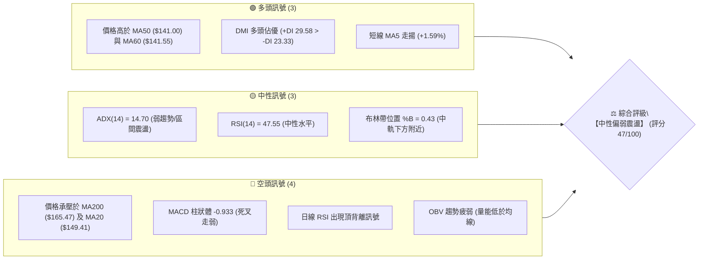
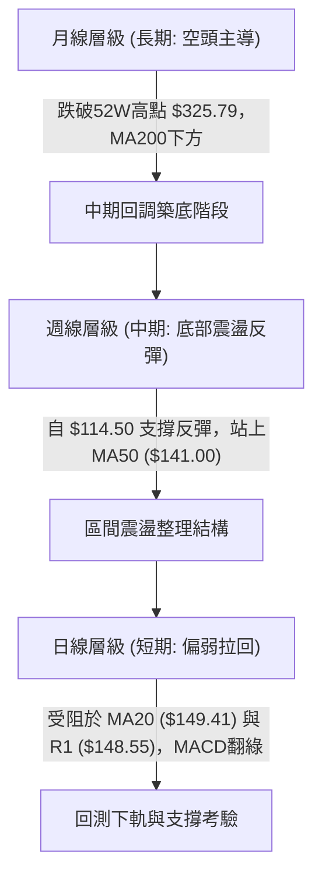
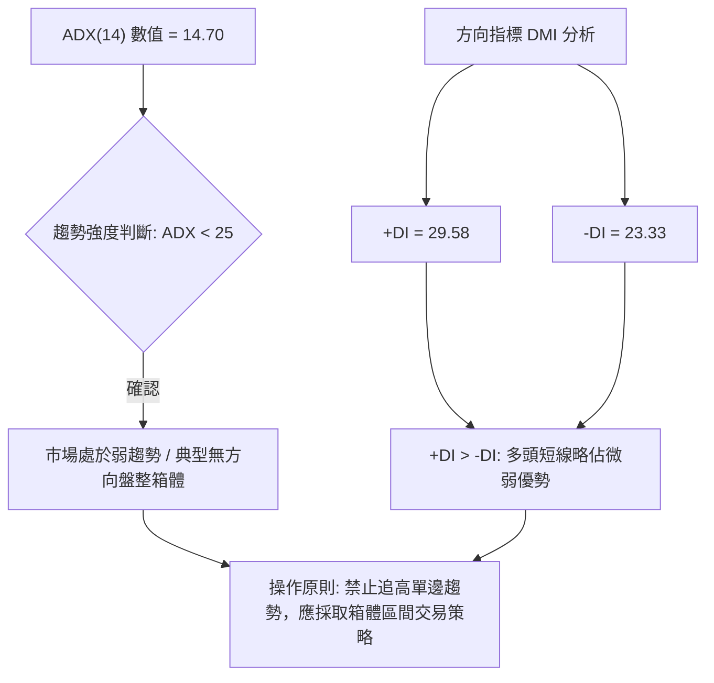
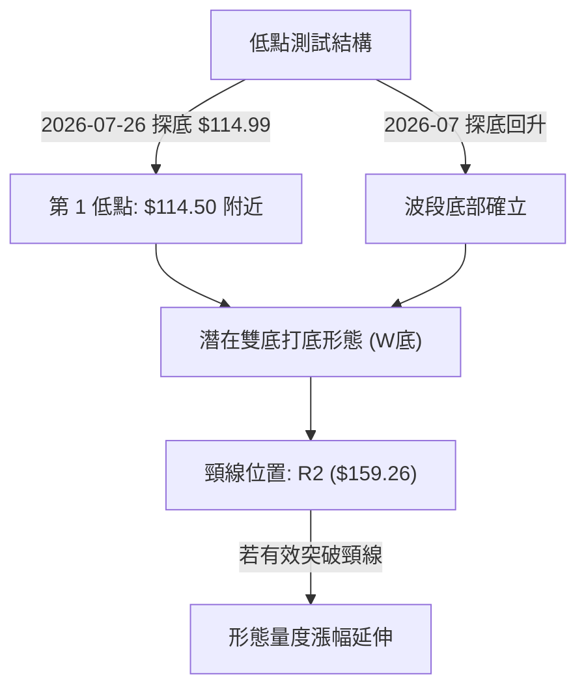
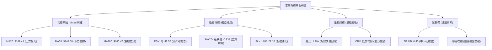
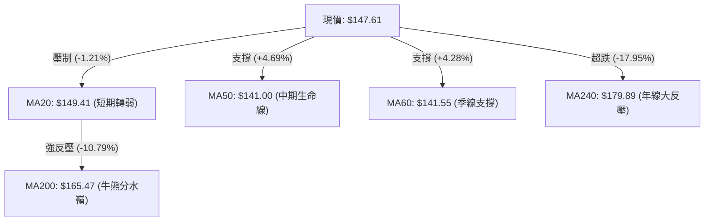
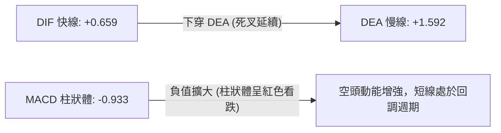
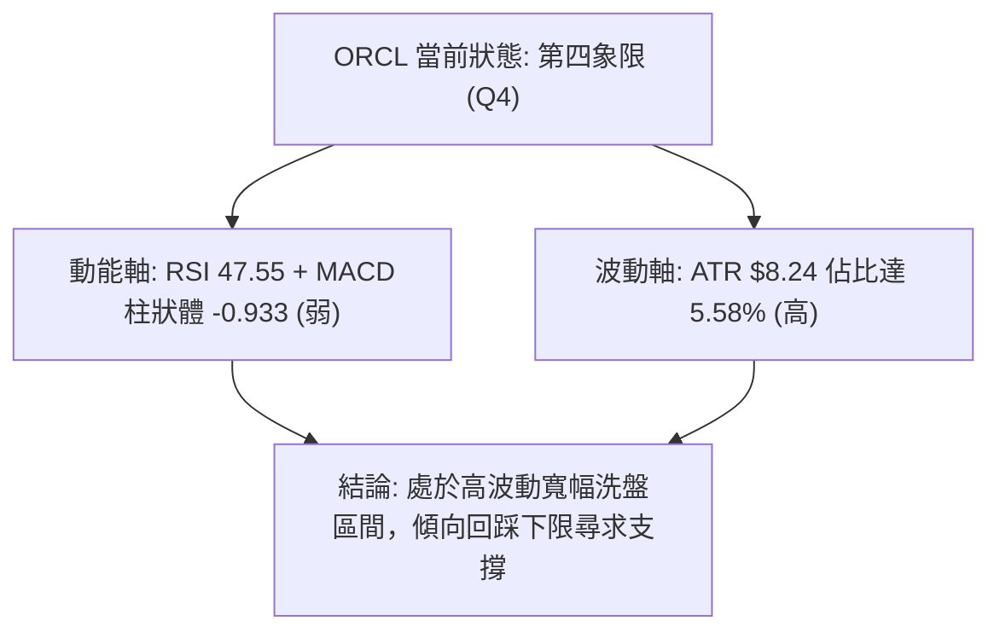
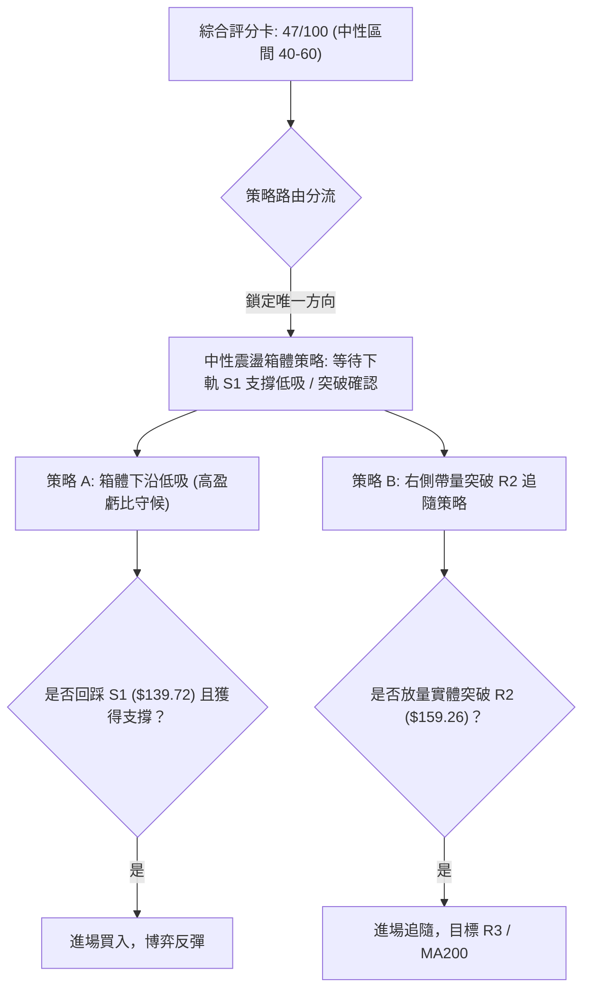
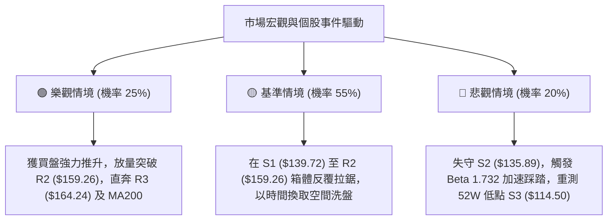

# ORCL 技術分析報告

> **報告日期**：2026-09-21 ｜ **語言**：繁體中文 ｜ **數據來源**：Yahoo Finance ｜ **當前價格**：$147.61

---

## 目錄

| 章節 | 內容 |
|------|------|
| [1. 技術面概覽](#1-技術面概覽) | 訊號儀表板、核心指標、評分卡 |
| [2. 趨勢分析](#2-趨勢分析) | 多時框趨勢、長中短期走勢 |
| [3. 圖表形態分析](#3-圖表形態分析) | 形態識別、K線組合、目標價 |
| [4. 支撐與阻力](#4-支撐與阻力) | 關鍵價位、斐波那契回調 |
| [5. 技術指標深度解讀](#5-技術指標深度解讀) | MA/RSI/MACD/布林/成交量 |
| [6. 動能與波動率](#6-動能與波動率) | 動能評估、ATR、Beta |
| [7. 多時框架總結](#7-多時框架總結) | 時框架評分矩陣 |
| [8. 交易策略建議](#8-交易策略建議) | 多空策略、風險報酬比 |
| [9. 風險提示與監控](#9-風險提示與監控) | 監控指標、風險場景 |

---

## 1. 技術面概覽

### 🎯 技術訊號儀表板



### 📊 核心指標速覽表

| 指標類別 | 指標名稱 | 當前數值 | 訊號 | 解讀 |
|----------|----------|----------|------|------|
| **價格** | 當前收盤價 | $147.61 | 🟡 | 位於52週區間 15.7% 低檔位置，處於打底後反彈回落段 |
| **均線** | MA20 | $149.41 | 🔴 | 價格低於 20 日均線（-1.21%），短線面臨中軌反壓 |
| **均線** | MA50 | $141.00 | 🟢 | 價格高於 50 日中期均線（+4.69%），中期下檔有守 |
| **均線** | MA200 | $165.47 | 🔴 | 價格顯著低於 200 日長期均線（-10.79%），長期趨勢偏空 |
| **動能** | RSI(14) | 47.55 | 🟡 | 處於 30-70 中性區間，但附帶日線頂背離隱憂 |
| **動能** | MACD(12,26,9) | 0.659 / 1.592 | 🔴 | DIF < DEA，柱狀體為 -0.933，動能呈現看跌收縮 |
| **趨勢** | ADX(14) | 14.70 | 🟡 | 數值小於 25，顯示缺乏明確單邊趨勢，屬橫盤整理 |
| **波動** | ATR(14) | $8.24 | 🔴 | ATR佔比達 5.58%，單日價格波動度顯著偏高 |
| **籌碼** | OBV量能 | OBV < MA | 🔴 | 量能未確認價格走勢，反彈買盤量能後繼乏力 |

### 🏆 技術評分卡

```
╔════════════════════════════════════════════════════════════════╗
║                技術評分卡 — ORCL (2026-09-21)                  ║
╠════════════════════════════════════════════════════════════════╣
║ 趨勢強度 (ADX=14.70)   ████░░░░░░░░░░░░░░░░  20/100  🔴 弱勢無方向 ║
║ 動能指標 (RSI/MACD)    ████████░░░░░░░░░░░░  40/100  🔴 動能轉負   ║
║ 支撐穩定度 (S1/S2防守) ██████████████░░░░░░  70/100  🟢 底部支撐強 ║
║ 成交量配合 (OBV疲弱)   ████████░░░░░░░░░░░░  40/100  🔴 量能背離   ║
║ 形態完整度 (區間築底)  ████████████░░░░░░░░  60/100  🟡 形態收斂中 ║
║ 均線排列 (混合纏繞)    ██████████░░░░░░░░░░  50/100  🟡 均線打結   ║
╠════════════════════════════════════════════════════════════════╣
║ 綜合評分              █████████░░░░░░░░░░░  47/100  ⚖️ 中性觀望   ║
╚════════════════════════════════════════════════════════════════╝
```

---

## 2. 趨勢分析

### 🌐 多時框趨勢分析



### 📈 長期趨勢 — 12個月走勢圖（Unicode）

```
ORCL 月線走勢圖（2025-10 至 2026-09）
價格軸 ($)
$280 ┤ 
$260 ┤ ● (2025-10: $260.10)
$240 ┤ 
$220 ┤                               ● (2026-05: $225.00)
$200 ┤       ● (2025-11: $200.02)
$180 ┤             ● (2025-12: $193.05)
$160 ┤                   ● (2026-01: $163.44)    ● (2026-04: $160.83)
$140 ┤                         ● (2026-02: $144.39)    ● (2026-06: $146.04)    ●←現價 $147.61
$120 ┤                                                       ● (2026-07: $129.87)
     └─────────────────────────────────────────────────────────────────────────────►
      10    11    12    01    02    03    04    05    06    07    08    09  (月份)
```

**走勢特徵分析表格**：

| 階段區間 | 起止月份 | 價格變化 | 累計漲跌幅 | 走勢特徵與結構分析 |
|----------|----------|----------|------------|--------------------|
| 主跌浪 I | 2025-10 ~ 2026-02 | $260.10 → $144.39 | -44.49% | 連續單邊下行，失守 200 日大關，放量長陰破位 |
| 弱勢橫盤 | 2026-02 ~ 2026-04 | $144.39 → $160.83 | +11.39% | 在 $140 關口上方構築平台，成交量逐步萎縮 |
| 假突破反抽 | 2026-04 ~ 2026-05 | $160.83 → $225.00 | +39.90% | 脈衝式拉升，但未能站穩 MA200，形成多頭陷阱 |
| 崩跌測底 | 2026-05 ~ 2026-07 | $225.00 → $129.87 | -42.28% | 快速回吐所有漲幅，並創下 52 週新低聚類 $114.50 |
| 底部重構 | 2026-07 ~ 2026-09 | $129.87 → $147.61 | +13.66% | 自 $114.50 極限反彈，進入 $135-$160 箱體內整固 |

### 📊 中期趨勢（週線分析）

```
中期壓力支撐區間分佈示意：
========================================================================
$165.47 ─── [長期生命線 MA200 反壓 / 密集套牢區]
$159.26 ─── [波段阻力 R2 / 斐波那契 78.6% 回調位 ($159.72)]
$148.55 ─── [近期反彈阻力 R1 / MA20 $149.41 匯聚處]
========================================================================
$147.61 ─── ★ 當前現價位置（受困於 MA20 下方）
========================================================================
$139.72 ─── [關鍵支撐 S1 / 近期週線回踩低點聚類]
$135.89 ─── [強支撐 S2 / 布林下軌 $136.79 重疊帶]
$114.50 ─── [52週絕對低點 S3 / 年內最後防線]
========================================================================
```

### ⚡ 趨勢強度評估（ADX 解讀）



| 指標名稱 | 當前數值 | 參考閾值 | 趨勢狀態判定 | 操作指導 |
|----------|----------|----------|--------------|----------|
| **ADX(14)** | 14.70 | 25.00 | 極弱勢 / 盤整市場 | 避免使用追突破策略，以區間低吸高拋為主 |
| **+DI** | 29.58 | -DI (23.33) | 多頭買盤略高於空頭 | 短線多頭有嘗試護盤動能，但缺乏持續推動力 |
| **-DI** | 23.33 | +DI (29.58) | 空頭賣壓暫時鈍化 | 空方動能未見爆發，但主導權轉換迅速 |

---

## 3. 圖表形態分析

### 🔍 形態識別系統



**形態信心度與參數評估表**：

| 形態類別 | 信心度 | 判斷依據（引用技術數據） | 完成度 | 目標價（附嚴格計算式） |
|----------|--------|--------------------------|--------|------------------------|
| **潛在雙底 (W-Bottom)** | 62% | 底部於 2026-07 創 52W 低點 $114.50 (S3)，隨後於 2026-08 築起第一波反彈至 R2 ($159.26)，目前處於右側震盪回踩。 | 65% | 頸線 R2 ($159.26) + 形態高度 ($159.26 - S3 $114.50 = $44.76) = **$204.02**（僅於突破頸線時成立） |
| **箱體震盪 (Rectangle)** | 85% | 價格嚴格運行於 S1 ($139.72) 至 R2 ($159.26) 區間，ADX 處於 14.70 極低值，均線糾纏。 | 90% | 區間震盪上限即為阻力 **$159.26**；若向下跌破 S1，則測 S2 **$135.89**。 |
| **頭肩底形態** | 35% | 數據中左肩與右肩對稱結構不明顯，成交量分佈未見標準放量。 | 20% | *訊號不足，僅做指標型與箱體解讀，不預設該形態。* |

### 🕯️ 重要K線形態分析

| 週/月份週期 | 收盤價 | K線形態特徵 | 技術解讀 | 訊號強度 |
|-------------|--------|-------------|----------|----------|
| 2026-07-26 週 | $114.99 | 探底長下影錘頭線 | 週成交量達 1.62 億股，觸及 52W 低點 $114.50 後爆發恐慌性承接盤，確認極限底部。 | 🟢 強烈買訊 |
| 2026-08-09 週 | $147.02 | 實體大陽線收復失地 | RSI 自極端超賣飆升至 71.8，週成交量 1.62 億股，啟動 V 型反彈首輪主升段。 | 🟢 多頭確立 |
| 2026-09-06 週 | $158.78 | 衝高受阻流星線 (長上影) | 逼近波段高點 R2 ($159.26) 處遭遇沈重套牢賣壓，未能收於高位。 | 🔴 短期見頂 |
| 2026-09-20 週 | $147.61 | 陰線實體回落 | MACD 柱狀體翻負 (-0.933)，收盤價跌破 MA20 ($149.41)，短線空方掌控節奏。 | 🔴 短線偏空 |

### 📉 ASCII 走勢形態示意圖

```
ORCL 雙底構築與箱體震盪示意圖：
價格 ($)
$160.00 ┤              頸線阻力 R2 ($159.26)
        │                 ┌─────┐             ┌─────┐
$150.00 ┤                 │     │  現價$147.61│     ▼ 
        │                 │     │      ★──────┼──────  (MA20 $149.41 反壓)
$140.00 ┤                 │     └─────────────┘     ▲ 箱體下沿 S1 ($139.72)
        │                 │                         │
$130.00 ┤        ▲        │                         │
        │       ╱ ╲       │                         │
$120.00 ┤      ╱   ╲     ╱                          │
        │     ╱     ╲   ╱                           │
$114.50 ┤────●       ──●────────────────────────────┘ (52W 低點聚類 S3)
        └───────────────────────────────────────────────► 時間軸
              底 1         底 2 (確認支撐)
```

### 🎯 形態目標價計算

依據傳統技術形態量度規則，當前市場最符合邏輯之結構為**區間震盪箱體**，其次為**潛在 W 底**：

1. **箱體震盪量度（當前主導形態）**：
   - 箱體上限（阻力 R2）：`$159.26`
   - 箱體下限（支撐 S1）：`$139.72`
   - 箱體垂直高度：`$159.26 - $139.72 = $19.54`
   - **向上突破目標**：`$159.26 + $19.54 = $178.80`（接近 MA240 $179.89 關鍵長期均線）
   - **向下跌破目標**：`$139.72 - $19.54 = $120.18`（向 52W 低點 S3 $114.50 尋求支撐）

2. **潛在雙底（W底）理論極限目標**：
   - 形態頸線點位：`R2 = $159.26`
   - 雙底最低點位：`S3 = $114.50`
   - 形態高度：`$159.26 - $114.50 = $44.76`
   - **雙底完全達標價位**：`$159.26 + $44.76 = $204.02`（需週線收盤強勢站穩 R2 始能觸發）

---

## 4. 支撐與阻力

### 🗺️ 關鍵價位分布圖（Unicode）

```
ORCL 價位結構分佈圖（精確對齊 OHLCV 關鍵數據）
════════════════════════════════════════════════════════════════════════
$165.47 ║████████████████████████████████████████████║ MA200 牛熊分水嶺
$164.24 ║████████████████████████████████████████    ║ 強波段阻力 R3
$159.26 ║████████████████████████████████            ║ 關鍵頸線阻力 R2 (Fib 78.6%: $159.72)
$149.41 ║▓▓▓▓▓▓▓▓▓▓▓▓▓▓▓▓▓▓▓▓▓▓                      ║ BB中軌 / MA20
$148.55 ║████████████████                            ║ 近期動態阻力 R1
╠═══════╬════════════════════════════════════════════╣ ◄ 現價 $147.61
$141.00 ║▓▓▓▓▓▓▓▓▓▓▓▓▓▓▓                             ║ MA50 生命線
$139.72 ║████████████████████████                    ║ 短線核心支撐 S1
$136.79 ║▓▓▓▓▓▓▓▓▓▓▓▓▓▓▓▓▓▓                          ║ 布林通道下軌
$135.89 ║████████████████████████████████            ║ 強波段支撐 S2
$114.50 ║████████████████████████████████████████████║ 52週絕對底線 S3 (年內低點)
════════════════════════════════════════════════════════════════════════
```

### 🚧 阻力位分析表

| 阻力級別 | 精確價位 | 距現價幅動 | 形成技術依據與籌碼沉澱 | 突破難度 | 重要性等級 |
|----------|----------|------------|------------------------|----------|------------|
| **R1** | **$148.55** | +0.64% | 近期波段高點聚類、極度貼近 MA20 ($149.41) 中軌反壓。 | 🟡 中等 | ★★★☆☆ |
| **R2** | **$159.26** | +7.89% | 近一年波段高點聚類、斐波那契 78.6% 回調位 ($159.72) 重疊頸線。 | 🔴 極高 | ★★★★★ |
| **R3** | **$164.24** | +11.27% | 波段密集套牢峰頂，與 MA200 ($165.47) 形成雙重高壓夾板。 | 🔴 堅不可摧 | ★★★★☆ |

### 🛡️ 支撐位分析表

| 支撐級別 | 精確價位 | 距現價幅動 | 形成技術依據與籌碼沉澱 | 守住機率 | 重要性等級 |
|----------|----------|------------|------------------------|----------|------------|
| **S1** | **$139.72** | -5.35% | 近一年波段低點聚類、MA50 ($141.00) 構築的下方第一道防線。 | 🟢 70% | ★★★★☆ |
| **S2** | **$135.89** | -7.94% | 近一年次級低點聚類，與當前布林下軌 ($136.79) 形成動態護城河。 | 🟢 85% | ★★★★★ |
| **S3** | **$114.50** | -22.43% | 52 週絕對最低價（2026-07 探底低點），年內終極結構底座。 | 🟢 95% | ★★★★★ |

### 📐 斐波那契回調位分析

依據 52 週完整波動區間（高點 **$325.79** → 低點 **$114.50**，落差達 **$211.29**）進行回調測算：

| 斐波那契級別 | 精確價位 | 與現價 ($147.61) 相對關係 | 深度技術含義解讀 |
|--------------|----------|---------------------------|------------------|
| **0.0% (52W High)** | $325.79 | +120.71% | 歷史大頂，長期牛市終點與多頭終極目標 |
| **23.6%** | $275.92 | +86.93% | 高檔強勢整理平台跌破點 |
| **38.2%** | $245.08 | +66.03% | 2026 年初反抽次高點密集交匯區 |
| **50.0%** | $220.14 | +49.14% | 多空長期平衡中軸，2026-05 假突破受阻位 ($225.00 附近) |
| **61.8%** | $195.21 | +32.25% | 黃金分割重要轉折點，長期均線密集下行反壓帶 |
| **78.6%** | $159.72 | +8.20% | **關鍵反彈壓制線**：現價位於此線下方，與阻力 R2 ($159.26) 形成強烈共振 |
| **100.0% (52W Low)** | $114.50 | -22.43% | 終極回撤底部支撐，結構基石 |

> **當前斐波那契定位解讀**：
> 現價 **$147.61** 目前嚴格運行於 **78.6% 回調位 ($159.72)** 與 **100.0% 底部 ($114.50)** 之間的深幅回撤修復帶。若無法帶量向上封閉並突破 $159.72，市場長期格局依然受制於 52 週大級別的熊市修正框架。

---

## 5. 技術指標深度解讀

### 🎛️ 指標訊號總覽



### 📈 移動平均線排列分析



| 均線名稱 | 當前價位 | 與現價差距 | 均線斜率與形態走勢 | 技術訊號意義 |
|----------|----------|------------|--------------------|--------------|
| **MA5** | $145.30 | +1.59% | 短線低檔勾頭向上 | 短線超跌微幅修正 🟢 |
| **MA10** | $151.27 | -2.42% | 明顯拐頭向下 | 短線第一道壓制帶 🔴 |
| **MA20** | $149.41 | -1.21% | 走平後微幅下傾 | 短期多空攻防中軸，跌破轉弱 🔴 |
| **MA50** | $141.00 | +4.69% | 底部緩慢向上爬升 | 中期波段重要護盤均線 🟢 |
| **MA60** | $141.55 | +4.28% | 逐步收斂走平 | 季線具備強烈結構支撐 🟢 |
| **MA120** | $161.49 | -8.60% | 保持下行趨勢 | 半年線持續壓制中期反彈空間 🔴 |
| **MA200** | $165.47 | -10.79% | 穩步下移，長期熊市 | 長期趨勢完全處於空方主導 🔴 |

### 📉 RSI(14) 分析

- **當前讀數**：`47.55`（處於 30-70 常態中性區間）
- **RSI 強度進度條**：
  `0 ├──────────────█████████░░░░░░░░░░░┤ 100` (47.55%)
- **背離診斷**：⚠️ **日線頂背離（Bearish Divergence）確立**。
  - *分析說明*：回顧 2026-08-16 週線與日線走勢，價格自 $150.52 攀升至 2026-09-06 的 $158.78，創下波段新高；然而 RSI(14) 卻由 **74.60 高峰驟降至 61.50**，隨後進一步跌破 50 中軸來到當前的 **47.55**。動能與價格走勢產生明顯負背離，警告多頭動能消耗殆盡，短線存在進一步回踩測試支撐的需求。

### 📊 MACD(12/26/9) 訊號解讀



- **MACD 快慢線狀態**：DIF (0.659) 處於零軸上方，但已向下有效跌破 DEA (1.592)，形成日線級別的高位死叉。
- **柱狀體動向**：MACD Histogram 當前為 **-0.933**，負向柱體連續數日拉長，表明在 2026-09-06 衝高受阻後，空方目前牢牢掌控短線交易節奏。

### 📦 布林通道分析

```
ORCL 布林通道結構示意圖 (帶寬 20日, 2σ)：
價位 ($)
$162.04 ┤════════════════════════════════════════ 上軌 Upper ($162.04)
        │
$149.41 ┤------------------------------------ 中軌 Middle / MA20 ($149.41)
        │                 ★ 現價 $147.61 (%B = 0.43)
        │
$136.79 ┤════════════════════════════════════════ 下軌 Lower ($136.79)
```

- **通道帶寬與形態**：通道上限 $162.04，通道下限 $136.79，帶寬為 $25.25。布林通道呈現收斂走平狀態，驗證 ADX 弱趨勢特徵。
- **%B 指標計算**：`%B = (147.61 - 136.79) / (162.04 - 136.79) = 10.82 / 25.25 = 0.43`。現價處於中軌與下軌之間的弱勢區間，下方距離下軌約有 $10.82 的緩衝空間。

### 💹 成交量分析（量價配合度）

- **量價指標比對**：
  - 最新成交量：`39,215,400`
  - 20日均量：`30,305,485`（量比為 **1.29x**，微幅放量陰線回調）
  - 50日均量：`32,271,968`
- **能量潮 OBV 分析**：當前指標系統明確顯示 **OBV < MA**。回顧 2026-09-13 當週暴增至 2.02 億股的高量，但價格隨後收於 $150.28 並於本週續跌至 $147.61，形成典型「放量滯漲與量增價跌」現象。主力資金介入意願消極，資金呈現淨流出態勢，量能並未對價格提供有效支撐。

---

## 6. 動能與波動率

### ⚡ 動能評估四象限

| 象限分區 | 動能軸 (RSI / MACD) | 波動軸 (ATR / Bandwidth) | 當前判定 | 技術特徵與交易環境解讀 |
|----------|---------------------|--------------------------|----------|------------------------|
| **第一象限 (Q1)** | 強動能 (多頭爆發) | 低波動 (穩定擴張) | — | 單邊主升行情（當前不符合） |
| **第二象限 (Q2)** | 弱動能 (趨勢減弱) | 低波動 (通道收斂) | — | 典型窄幅蓄勢整理盤（當前不符合） |
| **第三象限 (Q3)** | 強動能 (單邊殺跌) | 高波動 (急劇宣洩) | — | 恐慌性崩跌行情（如 2026-06/07 階段） |
| **第四象限 (Q4)** | **弱動能 (死叉背離)** | **高波動 (ATR 5.58%)** | **✓ 當前狀態** | **高波震盪殺估值／反覆洗盤：操作難度極高，嚴禁追單** |



### 📊 ATR 波動率分析

- **ATR(14) 絕對值**：`$8.24`
- **ATR 相對百分比**：`$8.24 / $147.61 = 5.58%`（對於大型軟體股而言屬於顯著偏高波動）
- **動態止損距離設定建議**：
  - 日內/超短線激進止損：`1.0 × ATR = $8.24`
  - 波段交易保守止損：`1.5 × ATR = $12.36`（以現價計算，跌破 `$135.25` 即觸發止損，完全覆蓋 S2 支撐位 `$135.89`）
  - 追蹤止損間距：建議維持 `2.0 × ATR = $16.48`。

### 📐 Beta 與市場相關性

- **Beta 係數**：`1.732`
- **市場特徵解讀**：
  - ORCL 的 Beta 高達 **1.732**，顯示該股對大盤標普 500 指數具備高度槓桿化的敏感度（波動幅度為大盤的 1.73 倍）。
  - 在整體科技板塊承壓或宏觀流動性收緊背景下，該股具有放大下行風險的傾向；但在大盤企穩反彈時，亦能提供超額彈性。

---

## 7. 多時框架總結

### 📋 時框架評分表

| 時框架級別 | 趨勢方向 | 動能狀態 | 均線排列 | 關鍵形態結構 | 綜合評分 | 戰術建議 |
|------------|----------|----------|----------|--------------|----------|----------|
| **月線 (長期)** | 🔴 明顯看跌 | 弱勢築底中 | 空頭排列 (低於MA200) | 自高位 $325.79 回落腰斬 | **30/100** | 戰略底倉分批觀望，禁止重倉抄底 |
| **週線 (中期)** | 🟡 區間震盪 | 反彈後鈍化 | 糾纏 (MA50上/MA200下) | 雙底構築初顯雏形 (W底) | **55/100** | 箱體操作，圍繞 $135-$160 高拋低吸 |
| **日線 (短期)** | 🔴 偏弱回調 | 死叉+頂背離 | 混合承壓 (跌破MA20) | 箱體中軌受阻向下回踩 | **40/100** | 短線多單逢高減碼，耐心等待 S1 支撐確認 |

### 🔲 綜合訊號矩陣

```
ORCL 多維度訊號矩陣一致性檢驗：
┌─────────────────┬──────────┬──────────┬──────────┬────────────────────────┐
│ 維度指標        │ 短期日線 │ 中期週線 │ 長期月線 │ 維度整合判定           │
├─────────────────┼──────────┼──────────┼──────────┼────────────────────────┤
│ 均線趨勢        │ 🔴 跌破MA20│ 🟢 站上MA50│ 🔴 遠低MA200│ 長空短弱中固，缺乏單邊動能 │
│ 動能震盪 (RSI)  │ 🔴 頂背離 │ 🟡 47.5 中性│ 🔴 低檔鈍化 │ 上攻動能中斷，向下修正中 │
│ 指標趨勢 (MACD) │ 🔴 死叉綠柱│ 🟢 零軸附近│ 🔴 深度負值 │ 短期偏空，中期待共振     │
│ 成交量配合      │ 🔴 OBV疲軟 │ 🟡 週量縮減│ 🔴 主力撤出 │ 缺乏量能發動全面攻勢     │
│ 波動通道        │ 🟡 中軌下方│ 🟡 區間整固│ 🔴 下行開口 │ 箱體下軌為短期磁吸區     │
└─────────────────┴──────────┴──────────┴──────────┴────────────────────────┘
```

### ⚖️ 多時框收斂結論

> **依據「嚴格要求 14」多時框收斂規則嚴格執行判定**：
> 1. **行情屬性判定**：當前趨勢強度指標 **ADX(14) = 14.70 (< 25)**，系統強制確認目前行情為**典型盤整行情**。
> 2. **主導規則收斂**：在 ADX < 25 之盤整環境下，**日線布林通道上下軌 ($136.79 ~ $162.04) 具備最高權重**，均線單邊突破訊號多屬無效噪音。
> 3. **衝突裁決與最終方向**：儘管中期週線站穩 MA50 ($141.00) 試圖築底，但日線 RSI 頂背離與 MACD 死叉顯示短線回調未結束。依照規則，**最終唯一收斂結論為：【中性觀望，區間下軌尋求支撐】**。

---

## 8. 交易策略建議

### 🗺️ 策略決策流程圖



### 🧭 策略路由（依評分卡分流）

**當前主策略方向 = 【中性觀望 / 區間震盪操作】（依評分 47/100）**
*說明：綜合評分處於 40–60 中性區間，且 ADX < 25 確認為無方向盤整。禁止盲目追高或無腦殺跌，操作以布林通道與關鍵支撐阻力為基準，採取「下軌低吸、上軌止盈」或「靜待放量破位」紀律。*

### 🎯 價格情境階梯（Price Scenarios）

| 觸發條件（嚴格引用實際數據） | 下一目標點位 | 後續延伸目標 | 情境含義與技術心理狀態 |
|------------------------------|--------------|--------------|------------------------|
| **向上突破 R1 $148.55** | **R2 $159.26** | **R3 $164.24** | 短線擺脫 MA20 壓制，多頭挑戰箱體頂部與頸線 |
| **突破 R2 $159.26 (站穩)** | **R3 $164.24** | **$204.02** | W底形態成立，啟動波段中期反轉行情 |
| **現價 $147.61 區間震盪** | **S1 $139.72** | **R1 $148.55** | 箱體內部消化籌碼，指標持續修復打底 |
| **向下跌破 S1 $139.72** | **S2 $135.89** | **S3 $114.50** | 跌破中期均線支撐，測試布林下軌防禦極限 |
| **跌破 S2 $135.89 (失守)** | **S3 $114.50** | 測底重探 | 築底宣告失敗，空頭重啟 52 週低點保衛戰 |

### 📊 情境機率分佈

| 運行情境 | 評估機率 | 主要技術指標依據與支撐邏輯 |
|----------|----------|----------------------------|
| **情境 A：區間震盪回踩 (主流)** | **55%** | ADX(14)=14.70 確認盤整，布林通道水平收斂，RSI頂背離壓制現價回測 S1。 |
| **情境 B：直接向上突破** | **25%** | +DI (29.58) > -DI (23.33)，分析師評級普遍看好，若放量可直接衝擊 R1/R2。 |
| **情境 C：向下破位探底** | **20%** | MACD 柱狀體為負 (-0.933)，OBV 疲軟，若大盤重挫可能引發 Beta (1.732) 補跌。 |

### 🟢 主策略詳情（區間防禦型交易）

| 策略要素 | 策略 A（左側：S1 支撐低吸策略） | 策略 B（右側：R2 突破追隨策略） |
|----------|----------------------------------|----------------------------------|
| **策略核心邏輯** | 回踩箱體下沿與 MA50 匯聚區低吸 | 強勢放量收復頸線與斐波 78.6% 追價 |
| **進場條件** | 價格回踩 S1 不破，日線出現止跌K線 | 週線收盤價強勢突破 R2 且量比 > 1.5x |
| **進場價格** | **$139.72** (S1 支撐點) | **$159.26** (R2 頸線突破點) |
| **目標價 T1** | **$148.55** (R1 阻力位) | **$164.24** (R3 阻力位) |
| **目標價 T2** | **$159.26** (R2 阻力位) | **$178.80** (箱體高度向上量度目標) |
| **止損價格** | **$135.89** (嚴格設於 S2 支撐下方) | **$149.41** (跌回 MA20 中軌止損) |
| **風險空間** | `$139.72 - $135.89 = $3.83` | `$159.26 - $149.41 = $9.85` |
| **報酬空間 (T2)**| `$159.26 - $139.72 = $19.54` | `$178.80 - $159.26 = $19.54` |
| **風險報酬比 (R:R)**| **1 : 5.10** (極優) | **1 : 1.98** (良好) |
| **成功機率** | **65%** | **45%** |
| **建議配置倉位**| **15% - 20%** | **10% - 15%** |

### 🔴 反向風險觸發點（對沖提示）

- **多頭結構破壞點**：若日線收盤價跌破 **S2 ($135.89)** 且成交量放大，意味著 MA50 支撐與布林下軌全面失守，區間震盪將演變為新一輪下行探底。此時必須**無條件停損任何多頭倉位**，並可考慮買入認沽期權（Put）對沖下探至 S3 ($114.50) 的空間。
- **空頭回補觸發點**：若價格帶量連陽收復 **R1 ($148.55)** 並站穩 **MA20 ($149.41)**，則短線日線頂背離警報解除，任何短空部位應即刻離場。

### ⭐ 整體訊號強度評星

```
做多訊號強度：★★☆☆☆  (2/5星 — 受制於均線反壓與日線頂背離)
做空訊號強度：★★★☆☆  (3/5星 — 動能轉弱，但下檔 S1/S2 支撐雄厚)
整體可信度：  ★★★☆☆  (3/5星 — ADX 弱勢盤整期，技術信號雜訊偏多)
```

---

## 9. 風險提示與監控

### ✅ 關鍵監控指標 Checklist

```
╔══════════════════════════════════════════════════════════════════╗
║                   每日交易風控監控清單 (Checklist)               ║
╠══════════════════════════════════════════════════════════════════╣
║ [ ] 價位是否收復 MA20 ($149.41)？（突破則短線轉強）              ║
║ [ ] 價位是否跌破 S1 ($139.72)？（失守需警戒回測 S2）             ║
║ [ ] MACD 柱狀體負值是否收斂（當前 -0.933）？                     ║
║ [ ] RSI(14) 能否重返 50 多空分水嶺之上（當前 47.55）？          ║
║ [ ] 成交量是否低於 20日均量 (30.3M)？（量縮不利於單邊行情）       ║
║ [ ] ADX(14) 是否向上突破 25？（確認擺脫無方向震盪）              ║
║ [ ] 負債/權益比高達 251.7% 下，宏觀利率預期是否波動？           ║
╚══════════════════════════════════════════════════════════════════╝
```

### ⚠️ 風險場景分析



### 🛡️ 風險管理重要提醒

1. **極高波動性防護（ATR = $8.24, Beta = 1.732）**：
   ORCL 單日波幅高達 5.58%，屬於大型科技股中的高波動標的。部位管理應嚴格控制，**單筆交易虧損金額切勿超過總投資組合淨值的 1.5%**。
2. **基本面高槓桿結構的技術溢出效應**：
   公司淨負債高達 -$132.07B（負債權益比 251.7%），雖然自由現金流因巨額資本支出承壓，但在技術面上，此類高槓桿標的對利率變動極為敏感。若大盤指數回調，其技術支撐 S1 與 S2 容易產生「瞬間穿刺（假跌破）」，設置止損時務必配合 ATR 計算緩衝空間。
3. **區間操作切忌「追漲殺跌」**：
   在 ADX = 14.70 的盤整市況中，所有在阻力位 R1/R2 的向上追價買盤，失敗率極高；反之，在跌破均線時盲目放空，亦容易遭逢布林下軌彈力反抽。**嚴格執行「支撐點確認低吸、阻力點堅決減碼」**。

---

## 📋 報告總結

```
╔══════════════════════════════════════════════════════════════════╗
║                   ORCL 技術分析報告總結                          ║
╠══════════════════════════════════════════════════════════════════╣
║ 報告日期：2026-09-21                                            ║
║ 當前價格：$147.61                                                ║
║ 技術評級：⚖️ 中性觀望 / 區間整固 (評分 47/100)                    ║
║                                                                  ║
║ 關鍵趨勢結論：                                                   ║
║ ├─ 長期趨勢 (月線)：🔴 空頭掌控，價格位於 MA200 ($165.47) 下方  ║
║ ├─ 中期趨勢 (週線)：🟡 構築底部，維持在 MA50 ($141.00) 之上震盪 ║
║ ├─ 短期趨勢 (日線)：🔴 動能回調，MACD死叉疊加 RSI 頂背離壓制    ║
║ ├─ 關鍵支撐核心：S1 = $139.72 ｜ 強支撐 S2 = $135.89            ║
║ ├─ 關鍵阻力核心：R1 = $148.55 ｜ 頸線阻力 R2 = $159.26          ║
║ └─ 分析師共識均價：$237.97 (遠高於現價，中長期基本面仍獲機構認可)║
║                                                                  ║
║ 最優戰術執行組合：                                               ║
║ 1. 🥇 最佳機會 (波段防守)：耐心等待股價回踩 S1 ($139.72) 附近，  ║
║    確認止跌後介入，止損置於 S2 下方 ($135.89)，博弈 1:5.1 盈虧比  ║
║ 2. 🥈 右側機會 (突破確認)：若放量強勢貫穿頸線 R2 ($159.26)，    ║
║    即時順勢進場追隨，目標上看 R3 ($164.24) 及形態目標 $178.80     ║
║ 3. 🥉 保守選擇 (場外觀望)：現價處於無方向箱體中央 (%B=0.43)，     ║
║    多空互搏成本偏高，靜待 ADX 升破 25 趨勢明朗後再行介入        ║
╚══════════════════════════════════════════════════════════════════╝
```

---

> ⚠️ **免責聲明**：本報告為技術分析研究，所有點位、指標與情境預估均嚴格基於所提供之歷史量價與技術數據客觀推演。本報告**僅供學術研究與策略參考**，**不構成任何形式的投資要約或買賣建議**。金融市場瞬息萬變，交易決策應獨立評估並嚴格落實風控止損。

---

*報告生成時間：2026-09-21 ｜ 數據來源：Yahoo Finance ｜ 分析框架：多時框技術分析模型*