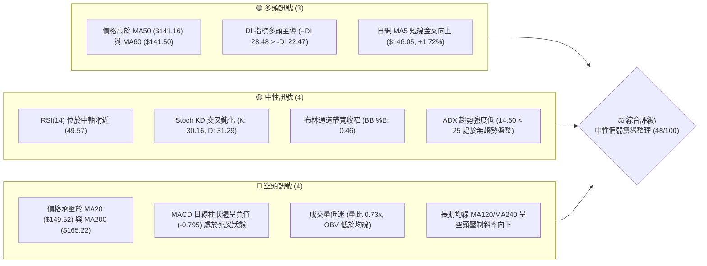
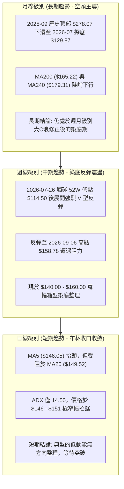
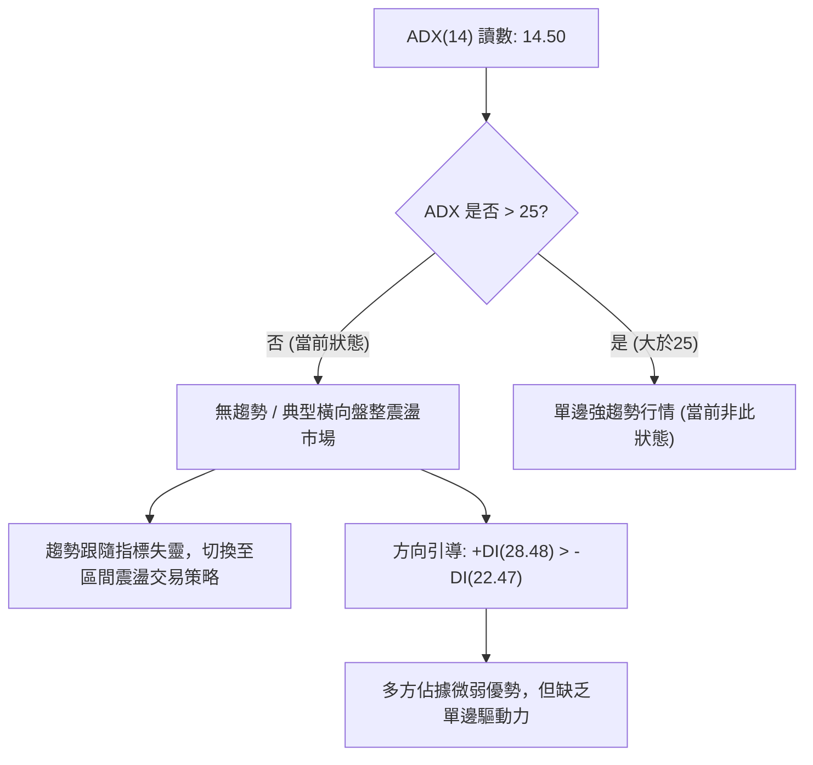
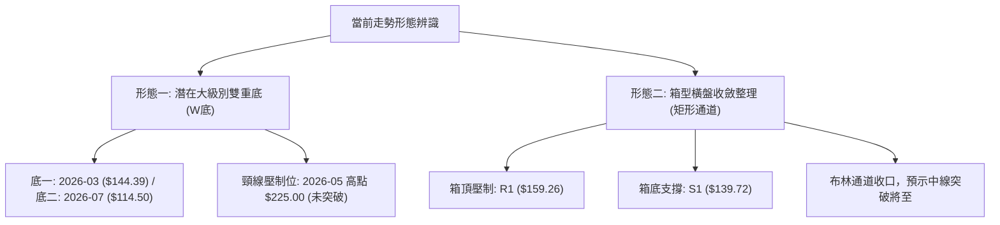
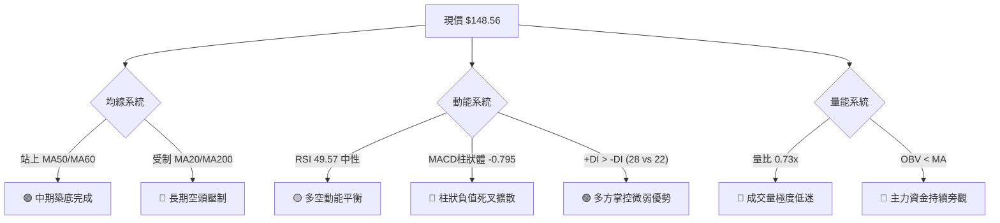
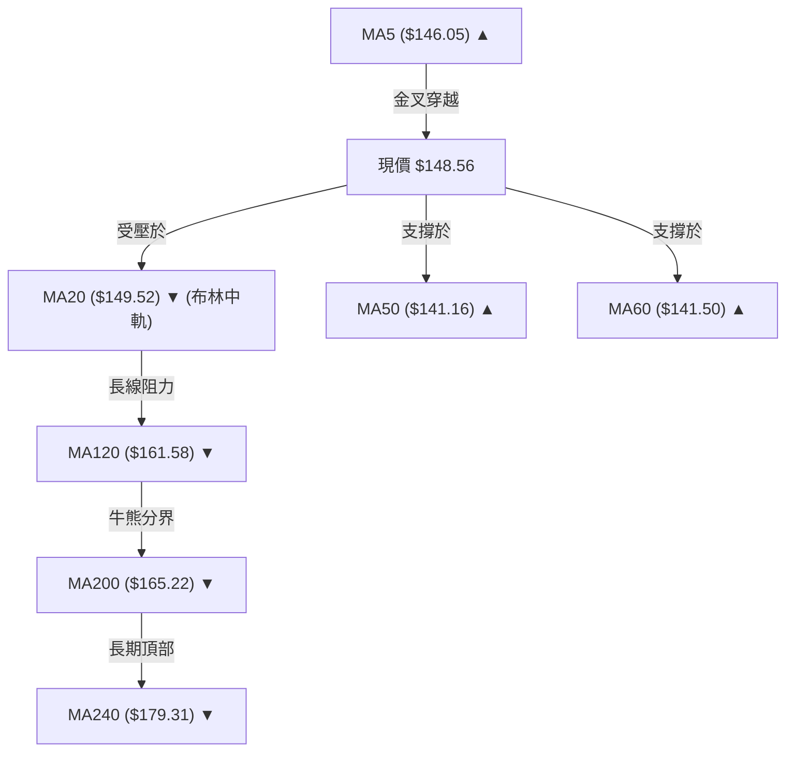
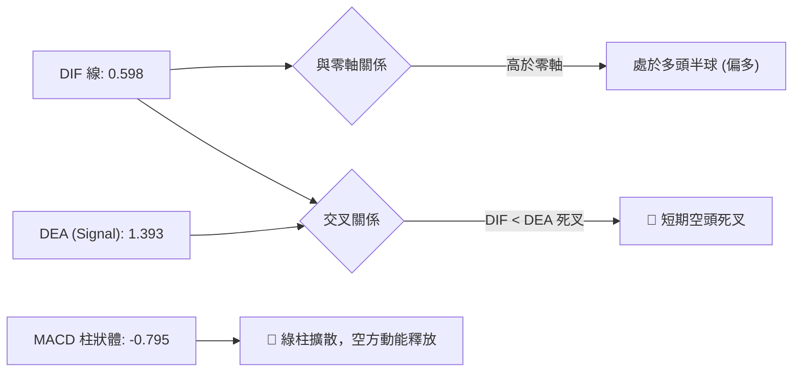
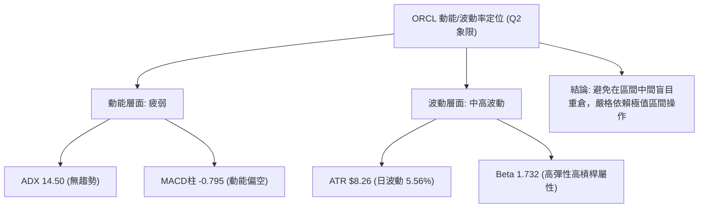
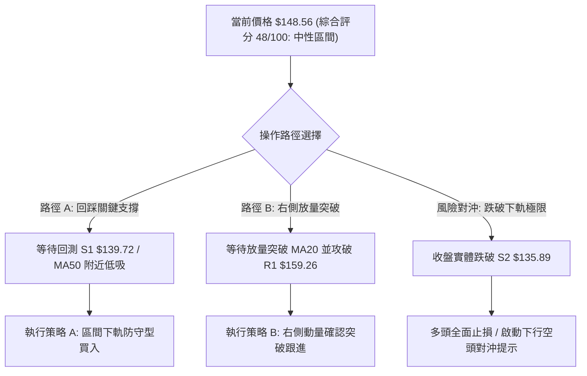
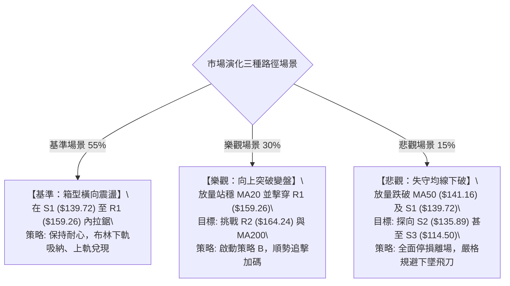

# ORCL 技術分析報告

> **報告日期**：2026-09-22 ｜ **語言**：繁體中文 ｜ **數據來源**：Yahoo Finance ｜ **當前價格**：$148.56

---

## 目錄

| 章節 | 內容 |
|------|------|
| [1. 技術面概覽](#1-技術面概覽) | 訊號儀表板、核心指標、評分卡 |
| [2. 趨勢分析](#2-趨勢分析) | 多時框趨勢、長中短期走勢 |
| [3. 圖表形態分析](#3-圖表形態分析) | 形態識別、K線組合、目標價 |
| [4. 支撐與阻力](#4-支撐與阻力) | 關鍵價位、斐波那契回調 |
| [5. 技術指標深度解讀](#5-技術指標深度解讀) | MA/RSI/MACD/布林/成交量 |
| [6. 動能與波動率](#6-動能與波動率) | 動能評估、ATR、Beta |
| [7. 多時框架總結](#7-多時框架總結) | 時框架評分矩陣 |
| [8. 交易策略建議](#8-交易策略建議) | 多空策略、風險報酬比 |
| [9. 風險提示與監控](#9-風險提示與監控) | 監控指標、風險場景 |

---

## 1. 技術面概覽

### 🎯 技術訊號儀表板



### 📊 核心指標速覽表

| 指標類別 | 指標名稱 | 當前數值 | 訊號 | 解讀 |
|----------|----------|----------|------|------|
| **價格** | 當前收盤價 | $148.56 | 🟡 | 位於52週區間16.1%之超跌反彈後橫盤平台 |
| **短期均線** | MA20 (BB中軌) | $149.52 | 🔴 | 現價位於MA20下方0.64%，短線面臨中軌反壓 |
| **中期均線** | MA50 | $141.16 | 🟢 | 現價高於MA50達5.24%，構築中期防守底線 |
| **長期均線** | MA200 | $165.22 | 🔴 | 現價大幅落後10.08%，長期空頭排列結構未變 |
| **動能指標** | RSI(14) | 49.57 | 🟡 | 多空力道均衡，無超買或超賣，處於無趨勢狀態 |
| **動能指標** | MACD (12,26,9) | 0.598 / Sig: 1.393 | 🔴 | MACD線跌破訊號線，柱狀體為 -0.795，短線動能偏空 |
| **擺盪指標** | Stoch %K / %D | 30.16 / 31.29 | 🟡 | 接近弱勢區下限但未超賣，短期呈現橫向粘合 |
| **趨勢強度** | ADX(14) | 14.50 | 🟡 | 遠低於25門檻，明確處於區間震盪與無方向結構 |
| **方向指標** | +DI / -DI | 28.48 / 22.47 | 🟢 | 買方力道略佔上風，但因ADX低迷難以形成單邊突破 |
| **通道指標** | Bollinger %B | 0.46 | 🟡 | 貼近中軌下方運作，通道收縮預示即將變盤 |
| **量能狀態** | 成交量 / 20日均量| 22.33M / 30.45M | 🔴 | 量比0.73x量能急縮，OBV < MA 指示資金觀望情緒濃厚 |
| **波動風險** | ATR(14) | $8.26 (5.56%) | 🔴 | 絕對波動偏大，單日高低區間約8.26美元，需放寬風控 |

### 🏆 技術評分卡

```
╔══════════════════════════════════════════════════════════════╗
║                技術評分卡 — ORCL (2026-09-22)                ║
╠══════════════════════════════════════════════════════════════╣
║ 趨勢強度 (ADX=14.50)  ████░░░░░░░░░░░░░░░░  25/100 🔴 弱勢無方向 ║
║ 動能指標 (RSI/MACD)   █████████░░░░░░░░░░░  45/100 🟡 動能疲弱   ║
║ 支撐穩定度 (S1/S2支撐) ██████████████░░░░░░  70/100 🟢 底部穩固   ║
║ 成交量配合 (OBV/量比)  ██████░░░░░░░░░░░░░░  30/100 🔴 嚴重縮量   ║
║ 形態完整度 (箱型構築) ████████████░░░░░░░░  60/100 🟡 橫盤成型   ║
║ 均線排列 (混合交叉)   ████████████░░░░░░░░  58/100 🟡 中短多長空 ║
╠══════════════════════════════════════════════════════════════╣
║ 綜合技術評分          ██████████░░░░░░░░░░  48/100 🟡 中性偏弱   ║
╚══════════════════════════════════════════════════════════════╝
```

---

## 2. 趨勢分析

### 🌐 多時框趨勢分析



### 📈 長期趨勢 — 12個月走勢圖（Unicode）

```
ORCL 月線走勢圖（2025-10 至 2026-09）
價格軸 ($)
$270 ┤ ● (2025-10: $260.10)
$250 ┤  ╲
$230 ┤   ╲                              ● (2026-05: $225.00 反彈高點)
$210 ┤    ● (2025-11: $200.02)          │╲
$190 ┤     ● (2025-12: $193.05)         │ ╲
$170 ┤      ╲         ●(2026-04:$160.83)│  ╲
$150 ┤       ●       ╱                 │   ●───●(現在: $148.56)
$130 ┤        ●─────●                  │    ╲ ╱
$110 ┤      (02-03月底: $144-$146)      │     ● (2026-07: $129.87; 52W低點: $114.50)
     └────────────────────────────────────────────────────────────
      10  11  12  01  02  03  04  05  06  07  08  09 (月份)
```

#### 走勢特徵分析表格

| 階段 | 涵蓋月份 | 區間高低點 | 漲跌幅 | 走勢結構與技術特徵 |
|------|----------|------------|--------|-------------------|
| **單邊主跌段** | 2025-10 ~ 2026-02 | $260.10 → $144.39 | -44.49% | 連續五個月大陰線，跌破所有中期均線支撐，主力資金持續撤離。 |
| **低位平台整理**| 2026-02 ~ 2026-04 | $144.39 → $160.83 | +11.39% | 在 $144 附近構築雙底形態，量能收斂，完成第一階段空頭衰竭。 |
| **突發脈衝暴拉**| 2026-05 | $160.83 → $225.00 | +39.90% | 業績或消息驅動單月爆發，但收盤留長上影線，未能站穩 MA200 之上。 |
| **二次深幅探底**| 2026-06 ~ 2026-07 | $225.00 → $129.87 | -42.28% | 假突破後引發踩踏，2026-07 創出 52 週新低 $114.50，空頭陷阱確立。 |
| **V型修復橫盤**| 2026-08 ~ 2026-09 | $129.87 → $148.56 | +14.39% | 自超跌區快速反彈回升至 $150 頸線平台，目前轉入低波動蓄勢結構。 |

### 📊 中期趨勢（週線分析）

```
ORCL 近期週線關鍵支撐阻力結構圖
═══════════════════════════════════════════════════════════════
$170.63 ────────────────────────────────────────── [R3 波段反彈極限阻力]
$164.24 ────────────────────────────────────────── [R2 密集套牢解套賣壓]
$159.26 ══════════════════════════════════════════ [R1 近期反彈波段高點聚類]
              ▲ 反彈受阻回落 ($158.78)
              │
$148.56 ─────┼─────────────────────────────────── [◄ 當前即時價格點位]
              │
              ▼ 震盪築底平台 ($146.00 - $150.00)
$139.72 ══════════════════════════════════════════ [S1 MA50動態支撐防線]
$135.89 ────────────────────────────────────────── [S2 布林下軌重疊支撐]
$114.50 ────────────────────────────────────────── [S3 52週歷史大底/恐慌極限]
═══════════════════════════════════════════════════════════════
```

### ⚡ 趨勢強度評估（ADX 解讀）



#### ADX 數值強度對照表

| ADX 區間 | 趨勢分類 | ORCL 當前狀態 | 交易策略指導 |
|----------|----------|---------------|--------------|
| **0 ~ 20** | **極弱趨勢 / 盤整無序** | **✓ (當前 14.50)** | **嚴禁追漲殺跌，主要依靠布林軌道或關鍵支撐阻力高拋低吸。** |
| 20 ~ 25 | 潛在趨勢萌芽 / 方向選擇 | - | 密切關注帶量突破訊號，觀察通道邊界開口方向。 |
| 25 ~ 40 | 強勢單邊趨勢形成 | - | 均線系統全面順勢交易，採用 ATR 追蹤止損。 |
| 40 ~ 100 | 超強動能 / 趨勢過度延伸 | - | 需提防趨勢衰竭背離，分批獲利了結。 |

---

## 3. 圖表形態分析

### 🔍 形態識別系統



#### 形態識別與信心度評估表

| 形態名稱 | 信心度 | 判斷依據（引用技術數據） | 當前完成度 | 目標價（附嚴謹計算式） |
|----------|--------|--------------------------|------------|------------------------|
| **箱型收斂整理** | **78%** | 價格受制於 R1 $159.26（9月高點$158.78），支撐於 S1 $139.72（MA50 $141.16附近），ADX 14.50 確認盤整。 | 85% | 突破箱頂目標 = 頸線 $159.26 + 形態高度 ($159.26 - $139.72 = $19.54) = **$178.80** |
| **潛在雙重底 (W底)** | **42%** | 第一底為 2026-03 收盤 $144.39，第二底為 2026-07 探低 $114.50，但兩底相差過大，且頸線高達 $225.00。 | 35% | 依據規則15：**信心度 < 50%，數據不足以確認幾何形態完成，僅做指標型區間解讀**。 |
| **布林通道擠壓** | **82%** | 布林上軌 $162.07 與下軌 $136.96 極度收窄，%B 落在 0.46，成交量降至均量 0.73x。 | 90% | 上軌突破目標為 R2 **$164.24**；下軌跌破目標為 S2 **$135.89**。 |

### 🕯️ 重要K線形態分析

| 週/月份 | 收盤價 | K線形態名稱 | 技術解讀 | 訊號強度 |
|---------|--------|-------------|----------|----------|
| **2026-07-26 (週)** | $114.99 | **恐慌長下影十字星** | 在 52W 新低釋放極端拋壓後迅速收回，MACD柱止跌轉正(+0.033)，空頭衰竭。 | 🟢 強烈買訊 |
| **2026-08-09 (週)** | $147.02 | **帶量長陽反轉線** | 週量放大至 162.89M，RSI 急升至 71.8，強勢扭轉自 $225 以來的暴跌頹勢。 | 🟢 多頭確立 |
| **2026-09-06 (週)** | $158.78 | **高位流星線 (Shooting Star)** | 上衝波段高點 $159.26 遭遇強賣壓，留長上影線，MACD 柱動能衰退至 +0.911。 | 🔴 短線見頂 |
| **2026-09-20 (週)** | $147.61 | **中陰線回調** | 週成交量 175.15M 伴隨 MACD 翻負 (-0.933)，確認進入橫盤震盪休整期。 | 🔴 短線偏弱 |
| **2026-09-27 (當前)** | $148.56 | **窄幅紡錘線 (Spinning Top)** | 最新日線成交量僅 22.33M 嚴重縮量，多空進入弱平衡，處於方向抉擇前夕。 | 🟡 觀望等待 |

### 📉 ASCII 走勢形態示意圖

```
ORCL 箱型築底收斂形態圖
價格軸 ($)
$160.00 ┤              ● (R1: $159.26 阻力線)
        ├───────▲──────│───────▲───────────────────────────── [箱型上軌壓制]
$154.00 ┤      ╱ ╲     │      ╱ ╲
$148.56 ┤─────┼───●────┼─────●───● ◄ [當前現價 $148.56，MA20 中軌 $149.52 纏繞]
$144.00 ┤    ╱     ╲  ╱     ╱
$139.72 ├───▼───────●───────▼─────────────────────────────── [箱型下軌支撐]
        ┤          (S1: $139.72 / MA50: $141.16 防守平台)
$134.00 ┤
        └───────────────────────────────────────────────────
         8月中旬     8月下旬     9月上旬     9月中旬     當前
```

### 🎯 形態目標價計算

根據已確認度最高（信心度 78%）的「日線級別箱型收斂整理形態」，詳細參數與計算如下：

```
╔══════════════════════════════════════════════════════════════╗
║               箱型突破測量目標計算公式與數值                 ║
╠══════════════════════════════════════════════════════════════╣
║ 形態頸線/箱頂 (R1)     :  $159.26                            ║
║ 形態底邊/箱底 (S1)     :  $139.72                            ║
║ 形態垂直高度 (Height)  :  $159.26 - $139.72 = $19.54         ║
╠══════════════════════════════════════════════════════════════╣
║ 向上突破目標價 (T_Up)   :  $159.26 + $19.54 = $178.80 (形態推算)║
║ (向上突破受制於數據阻力位: 第一目標 R1 $159.26, 第二目標 R2 $164.24) ║
╠══════════════════════════════════════════════════════════════╣
║ 向下跌破目標價 (T_Down) :  $139.72 - $19.54 = $120.18 (形態推算)║
║ (向下跌破考驗數據支撐位: 第一防守 S1 $139.72, 第二防守 S2 $135.89) ║
╚══════════════════════════════════════════════════════════════╝
```

---

## 4. 支撐與阻力

### 🗺️ 關鍵價位分布圖（Unicode）

```
ORCL 價位結構分布圖（嚴格依據 OHLCV 關鍵聚類計算）
═══════════════════════════════════════════════════════════════
$170.63 ║████████████████████████║ 強阻力 R3 (+14.86%) — 前期暴跌起跌平台
$164.24 ║████████████████████    ║ 阻力 R2 (+10.56%) — 密集籌碼套牢反壓區
$159.26 ║████████████████████████║ 關鍵阻力 R1 (+7.20%) — 近期反彈波段頂部
════════╬════════════════════════╬══════════════════════════════
$149.52 ╟┈┈┈┈┈┈┈┈┈┈┈┈┈┈┈┈┈┈┈┈┈┈┈┈╢ 動態中軌反壓 MA20 (現價上方 $0.96)
$148.56 ╠════════════════════════╣ ◄ 當前市價 (處於多空微幅膠著點)
$141.16 ╟┈┈┈┈┈┈┈┈┈┈┈┈┈┈┈┈┈┈┈┈┈┈┈┈╢ 動態均線支撐 MA50 (現價下方 $7.40)
════════╬════════════════════════╬══════════════════════════════
$139.72 ║▓▓▓▓▓▓▓▓▓▓▓▓▓▓▓▓        ║ 近期關鍵支撐 S1 (-5.95%) — 波段低點平台
$135.89 ║████████████████████    ║ 強度支撐 S2 (-8.53%) — 布林通道下軌極限
$114.50 ║████████████████████████║ 終極鐵底 S3 (-22.93%) — 52週歷史新低
═══════════════════════════════════════════════════════════════
```

### 🚧 阻力位分析表

| 阻力級別 | 官方計算價位 | 距現價空間 | 形成技術原因 | 突破難度評估 | 重要性星級 |
|----------|--------------|------------|--------------|--------------|------------|
| **R1** | **$159.26** | **+7.20%** | 2026-09-06 週線衝高反轉點，與斐波那契 78.6% 回調位 ($159.72) 形成共振強壓。 | 中等，需成交量擴大至 3,500 萬股以上方能化解。 | ★★★★☆ |
| **R2** | **$164.24** | **+10.56%** | 長期生命線 MA200 ($165.22) 與布林上軌 ($162.07) 之雙重壓制包絡區。 | 極高，為長達數月下降通道上軌，短期難以一蹴而就。 | ★★★★★ |
| **R3** | **$170.63** | **+14.86%** | 2026年6月中旬斷崖式跳空下墜之起跌頸線，大量鎖死籌碼聚集於此。 | 極難，需基本面重大轉折或整體科技板塊強勢帶動。 | ★★★☆☆ |

### 🛡️ 支撐位分析表

| 支撐級別 | 官方計算價位 | 距現價空間 | 形成技術原因 | 守住機率評估 | 重要性星級 |
|----------|--------------|------------|--------------|--------------|------------|
| **S1** | **$139.72** | **-5.95%** | 2026-07-05 週線反彈回踩平台低點，下方緊貼上升中之 MA50 ($141.16)。 | 75%，日線多頭最後一道動態支撐防線，具強力買盤托底。 | ★★★★☆ |
| **S2** | **$135.89** | **-8.53%** | 日線布林下軌 ($136.96) 聚類支撐區，為波動極端回撤保護位。 | 85%，若觸及將引發 RSI 極度超賣，極易吸引左側技術買盤。 | ★★★★☆ |
| **S3** | **$114.50** | **-22.93%** | 52 週歷史絕對低點，大級別恐慌盤出清位置，長期價值底部。 | 95%，非系統性金融危機或公司重大暴雷極難跌破。 | ★★★★★ |

### 📐 斐波那契回調位分析

> 計算基點：52週歷史最高點 **$325.79** 至 52週歷史最低點 **$114.50**，全波段跌幅共計 **$211.29**。

```
斐波那契回調位層級架構
0.0%  (52W High)  ─── $325.79 ─── [歷史絕對天花板]
23.6% 回調位      ─── $275.92 ─── [牛熊分水嶺]
38.2% 回調位      ─── $245.08 ─── [大週期多頭防禦區]
50.0% 回調位      ─── $220.14 ─── [2026-05 反彈波段頂部 $225.00 共振位]
61.8% 黃金回調位  ─── $195.21 ─── [大級別籌碼套牢中樞]
78.6% 極限回調位  ─── $159.72 ─── [共振阻力！與 R1 $159.26 完美重疊]
                    ▲
   當前市價位置 ── $148.56 ── (位於 78.6% 與 100.0% 之間，修復進度僅 16.1%)
                    ▼
100.0% (52W Low)  ─── $114.50 ─── [52週歷史終極底]
```

#### 斐波那契結構解讀
- **現價定位**：ORCL 當前收盤價 $148.56 處於斐波那契 **78.6% ($159.72)** 與 **100.0% ($114.50)** 的超深幅回撤區間內，顯示股價自高點重挫後，當前反彈僅僅修復了微小比例。
- **關鍵共振壓制**：斐波那契 78.6% 回調位 **$159.72** 與近期波段高點聚類阻力 **R1 ($159.26)** 僅相差 46 美分，構成極為堅固的「雙重共振阻力牆」。在突破此位前，任何上漲皆僅能視為超跌反彈。
- **底部安全邊際**：當前價位距離 100.0% 歷史底部 $114.50 有 $34.06（約 22.9%）的安全緩衝垫，且在中途具備 S1 ($139.72) 與 S2 ($135.89) 的重重保護。

---

## 5. 技術指標深度解讀

### 🎛️ 指標訊號總覽



### 📈 移動平均線排列分析



#### 均線各週期詳細數據表

| 週期均線 | 當前價格 | 與現價偏離率 | 斜率與方向 | 技術含義解讀 |
|----------|----------|--------------|------------|--------------|
| **MA 5** | $146.05 | +1.72% | 向上抬頭 ▲ | 極短線獲得支撐，連續多日下探後出現短線修復買盤。 |
| **MA 10** | $150.24 | -1.12% | 輕微向下 ▼ | 短期壓制線，與 MA20 形成雙重阻力帶。 |
| **MA 20** | $149.52 | -0.64% | 平緩走平 ▼ | 布林通道中軌，多空短線強弱分水嶺，當前現價略被壓制。 |
| **MA 50** | $141.16 | +5.24% | 向上攀升 ▲ | 中期多頭基石，7月見底以來斜率穩定向上，提供強大支撐。 |
| **MA 60** | $141.50 | +4.99% | 向上走強 ▲ | 與 MA50 形成金叉共振支撐區間 ($141.16 - $141.50)。 |
| **MA 120** | $161.58 | -8.06% | 震盪走低 ▼ | 半年線下行，限制中期反彈高度。 |
| **MA 200** | $165.22 | -10.08% | 明顯下行 ▼ | 年線壓頂，未突破此線前不可認定為反轉牛市行情。 |
| **MA 240** | $179.31 | -17.15% | 陡峭向下 ▼ | 過去兩年高位密集交易成本線，形成長線天花板。 |

- **均線排列結論**：當前呈現典型的**「長週期空頭排列、短中期混合築底」**格局。MA50 與 MA60 在 $141 附近形成強勁護盤底座，但 MA20 ($149.52) 與 MA10 ($150.24) 封鎖了短線上行空間，導致股價被迫在狹窄區間內反覆摩擦。

### 📉 RSI(14) 分析

```
RSI(14) 動能刻度表
0              30                    50         70             100
├──────────────┼─────────────────────┼──────────┼──────────────┤
│  極度超賣區   │      空頭弱勢區      │ 多頭強勢區 │  極度超買區  │
└──────────────┴─────────────────────┴──────────┴──────────────┘
                                     ▲
                            當前 RSI: 49.57 (中性分水嶺)
[進度條]：██████████░░░░░░░░░░ 49.57%
```

- **數值解讀**：RSI(14) 最新讀數為 **49.57**，精準貼合 50.00 中性多空臨界點。
- **超買超賣狀態**：脫離了 2026-07 探底時的極端超賣區（當時週 RSI 跌至 11.1 - 14.9），同時也從 2026-08 反彈高點的微幅超買區（當時週 RSI 達到 74.6）回落，當前處於無偏向狀態。
- **背離診斷**：
  - **頂背離**：無。股價近期未創新高，指標無頂背離現象。
  - **底背離**：日線級別在 7 月底 $114.50 處曾出現顯著底背離（價格創新低而 RSI 抬高），該背離已在 8 月的反彈中釋放完畢。**當前 RSI 與價格走勢完全同步，未偵測到任何級別的頂背離或底背離訊號**。

### 📊 MACD(12/26/9) 訊號解讀



- **指標讀數**：DIF = **0.598**，Signal (DEA) = **1.393**，Histogram (柱狀體) = **-0.795**。
- **信號解讀**：
  - 儘管 DIF 仍維持在零軸上方（0.598 > 0），顯示中期反彈骨架未散，但 DIF 已於 9 月中旬下穿訊號線形成**死亡交叉**。
  - MACD 柱狀體錄得 **-0.795**，負值呈現持續狀態，說明自 $158.78 下挫以來的短期調整波尚未出現衰竭翻紅跡象，空頭在極短線掌握壓制權。

### 📦 布林通道分析

```
ORCL 日線布林通道 (Bollinger Bands 20, 2) 結構圖
價格軸 ($)
$162.07 ┬──────────────────────────────────────── 上軌 (Upper Band)
        │
$155.00 ┤        通道帶寬 (Bandwidth) 收窄中
        │
$149.52 ┼┈┈┈┈┈┈┈┈┈┈┈┈┈┈┈┈┈┈┈┈┈┈┈┈┈┈┈┈┈┈┈┈┈┈┈┈┈┈┈┈ 中軌 (MA20 Baseline)
$148.56 ┤◄─── 現價 ($148.56) 緊貼中軌下方 (%B = 0.46)
        │
$142.00 ┤
        │
$136.96 ┴──────────────────────────────────────── 下軌 (Lower Band)
```

- **通道參數現況**：
  - **上軌**：**$162.07**
  - **中軌 (MA20)**：**$149.52**
  - **下軌**：**$136.96**
  - **%B 指標**：**0.46**（計算式：`($148.56 - $136.96) / ($162.07 - $136.96) = $11.60 / $25.11 = 0.462`）
- **形態學解讀**：
  - 布林通道帶寬目前僅為 $25.11（約 16.9%），處於過去半年來的低位收縮狀態（Squeeze）。
  - 現價位於 0.46，極度接近中軌 0.50，呈現「通道收斂、等待方向引爆」的典型特徵。若價格跌破中軌無法收復，將有順勢向下軌 $136.96 尋求支撐的慣性。

### 💹 成交量分析（量價配合度）

```
成交量動態對比圖
最新單日成交量 : ██████████████░░░░░░ 22.33M
20日移動平均量 : ███████████████████  30.45M (量比: 0.73x)
50日移動平均量 : ████████████████████ 32.12M
```

- **量能萎縮特徵**：最新交易日成交量僅 22,329,400 股，相較於 20 日均量 (30.45M) 出現顯著萎縮（量比僅 **0.73x**），相比 50 日均量 (32.12M) 更是下滑超過 30%。
- **OBV 能量潮解讀**：數據明確標注 **「OBV < MA → 量能疲弱」**。
  - 在 8 月反彈過程中，成交量曾放大至週 1.6 億至 1.7 億股；然而進入 9 月中下旬，量能階梯式滑落（最新週量降至 22.33M 規模）。
  - OBV 跌破其均線，代表在當前 $148 - $150 價位區間，**機構主力買盤意願不足，市場呈現場內存量博弈特徵**。無量橫盤意味著難以發起有效向上突破，需慎防久盤必跌風險。

---

## 6. 動能與波動率

### ⚡ 動能評估四象限

| 象限標記 | 動能維度 (Momentum) | 波動維度 (Volatility) | 當前判定 | 戰略特徵與操作建議 |
|----------|---------------------|------------------------|----------|-------------------|
| **第一象限 (Q1)** | 強動能 (ADX>25, RSI>60) | 低波動 (ATR% < 3.0%) | — | 絕佳單邊趨勢，主升浪穩健持股。 |
| **第二象限 (Q2)** | **弱動能 (ADX=14.5, RSI=49.6)** | **中高波動 (ATR%=5.56%)** | **✓ (當前狀態)** | **多空拉鋸消耗，波動劇烈但缺乏方向，需防範假突破與雙向洗盤。** |
| **第三象限 (Q3)** | 強動能 (單邊暴跌/暴漲) | 高波動 (ATR% > 6.0%) | — | 高風險高回報，動量突破追單模式。 |
| **第四象限 (Q4)** | 弱動能 (橫盤整理) | 極低波動 (ATR% < 2.0%) | — | 黎明前寂靜，大幅度變盤前夕。 |



### 📊 ATR 波動率分析

- **ATR(14) 絕對數值**：**$8.26**。
- **ATR 佔價格比重**：高達 **5.56%**。
  - 對於大型科技股（市值 $449.21B）而言，單日 5.56% 的平均真實波幅屬於**高度波動**範疇。這意味著 ORCL 在常態下單日價格震盪幅度即可達到 8 美元以上。
- **止損距離建議**：
  - **日間波段交易 (Swing Trading)**：建議止損距離至少設定為 **1.5 × ATR = $12.39**，以防被日常雜訊洗出場。
  - **極限保守止損**：設定為 **1.0 × ATR = $8.26**。若以現價 $148.56 計算，下行 1 個 ATR 恰好為 **$140.30**，極其接近關鍵支撐 S1 ($139.72) 與 MA50 ($141.16)。因此，$139.72 具備極強的止損技術錨定價值。

### 📐 Beta 與市場相關性

- **Beta 係數**：**1.732**。
  - **市場敏感度**：ORCL 的 Beta 高達 1.732，表明其對標普 500 指數與納斯達克 100 指數具有極高的超額敏感性。若標普指數下跌 1%，技術模型預期 ORCL 將平均下跌 1.732%。
  - **風險報酬特徵**：該股目前兼具高槓桿彈性。在無趨勢的盤整期（ADX=14.50），高 Beta 意味著大盤的微小風吹草動都可能引發個股在布林軌道內的劇烈顛簸。

---

## 7. 多時框架總結

### 📋 時框架評分表

| 時框架 | 趨勢方向 | 動能狀態 | 均線排列狀況 | 關鍵技術形態 | 綜合評分 | 戰略建議 |
|--------|----------|----------|--------------|--------------|----------|----------|
| **月線 (長期)** | 🔴 空頭下行 | 🔴 RSI 偏弱，距高點深跌 | 位於 MA200/240 下方 | 歷史高位暴跌後超深回撤 (16.1% 分位) | 28/100 | 長期投資者保持防禦，定投未至最佳擊球點。 |
| **週線 (中期)** | 🟡 寬幅震盪 | 🟡 RSI 49.6，MACD翻負 | 站上 MA50，受制 MA200 | $114.50 V型反轉後於 $140-$160 構築中樞 | 54/100 | 以箱型區間對待，不追高，等待下軌低吸。 |
| **日線 (短期)** | 🔴 弱勢收斂 | 🔴 MACD柱-0.795，OBV疲弱 | 夾在 MA20 與 MA50 之間 | 布林通道 Squeeze 擠壓收口 (%B=0.46) | 44/100 | 嚴格執行區間高拋低吸，收緊停損。 |

### 🔲 綜合訊號矩陣

```
╔══════════════════════════════════════════════════════════════╗
║               ORCL 多時框架跨維度訊號矩陣表                  ║
╠══════════════════════════════════════════════════════════════╣
║ 維度項目       短線 (日線)        中線 (週線)        長線 (月線)  ║
╠══════════════════════════════════════════════════════════════╣
║ 趨勢方向       🟡 橫向震盪        🟡 區間築底        🔴 單邊空頭  ║
║ 均線系統       🔴 承壓 MA20       🟢 守穩 MA50       🔴 遠低 MA200║
║ 動能指標       🔴 MACD負值        🟡 RSI 中軸        🔴 大級別失速║
║ 波動狀態       🔴 ATR% 偏高       🟡 波幅收斂        🔴 歷史高波動║
║ 量能確認       🔴 嚴重縮量        🔴 縮量回調        🔴 資金大幅流出║
╠══════════════════════════════════════════════════════════════╣
║ 維度權重       30%                45%                25%       ║
║ 一致性評價     短中期訊號存在衝突，缺乏跨週期共振突破條件        ║
╚══════════════════════════════════════════════════════════════╝
```

### ⚖️ 多時框收斂結論

> **依據「嚴格要求 14」之多時框收斂收斂規則判定**：
> 1. **趨勢/盤整判定**：當前 ADX(14) 讀數為 **14.50**，明確處於 **ADX < 25 的盤整行情**。
> 2. **優先級收斂**：在盤整行情下，趨勢指標失效，**必須以日線布林通道上下軌 ($136.96 - $162.07) 為主要交易區間**。
> 3. **方向唯一性收斂**：綜合評分為 **48/100**，日線短動能轉負（MACD Hist -0.795、量比 0.73x），受阻於布林中軌 MA20 ($149.52)；但中期週線在 MA50 ($141.16) 與 S1 ($139.72) 具備強固托底買盤。
> 
> **最終收斂方向**：**【中性觀望，區間下緣偏多操作】**。堅決排除盲目單邊追多或追空，策略焦點鎖定於布林帶寬與關鍵支撐阻力間的「高拋低吸」。

---

## 8. 交易策略建議

### 🗺️ 策略決策流程圖



### 🧭 策略路由（依評分卡分流）

- **當前主策略方向**：**【區間操作 / 偏多低吸（依評分 48/100，處於 40–60 中性格局，以布林通道與關鍵點位之區間策略為主，嚴禁中間價位追單）】**

### 🎯 價格情境階梯（Price Scenarios）

> 所有點位嚴格引用自「第 4 章」官方 OHLCV 計算結果。

| 觸發條件 | 第一目標 (Target 1) | 第二目標 (Target 2) | 後續延伸 (Extension) | 技術情境含義解讀 |
|----------|---------------------|---------------------|----------------------|------------------|
| **強勢放量突破 R1 $159.26** | **R2: $164.24** | **R3: $170.63** | **形態推算: $178.80** | 短線走出箱型泥淖，挑戰年線 MA200 關鍵反壓。 |
| **維持現價區間震盪** | **MA20: $149.52** | **布林上軌: $162.07**| **—** | 典型的布林通道收口行情，動能指標持續鈍化。 |
| **弱勢下破支撐 S1 $139.72** | **S2: $135.89** | **S3: $114.50** | **歷史大底** | 跌破 MA50 生命線，下行測試布林下軌及恐慌區。 |

### 📊 情境機率分佈

| 情境劇本 | 機率估算 | 主要技術依據（嚴格引用指標現況） |
|----------|----------|----------------------------------|
| **情境一：區間震盪蓄勢** | **55%** | **ADX=14.50** 明確無趨勢；**布林帶寬收窄 (%B=0.46)**；成交量嚴重萎縮（**量比 0.73x**），市場缺乏推動單邊趨勢之增量資金。 |
| **情境二：回踩支撐後反彈** | **30%** | **+DI (28.48) 依然壓制 -DI (22.47)**；下方有上升之 **MA50 ($141.16)** 與波段平台 **S1 ($139.72)** 提供堅實緩衝。 |
| **情境三：跌破平台再探底** | **15%** | **MACD 柱狀體維持負值 (-0.795)**；**OBV 疲軟下行**；長週期均線 MA200 與 MA240 斜率仍陡峭向下施壓。 |

### 🟢 主策略詳情（方向：區間操作與逢低做多）

```
╔══════════════════════════════════════════════════════════════╗
║                    ORCL 專業交易策略規劃表                   ║
╠══════════════════════════════════════════════════════════════╣
║ 交易要素       策略 A (左側低吸 - 區間下軌)  策略 B (右側突破 - 動量確認)  ║
╠══════════════════════════════════════════════════════════════╣
║ 進場條件       價格回踩 S1 並獲支撐K線確認  日線放量收盤突破 R1 阻力位 ║
║ 進場價格       $140.50 (S1 $139.72 稍上方)  $159.80 (突破 R1 $159.26 後) ║
║ 第一目標價 T1  $149.52 (MA20/布林中軌)      $164.24 (R2 密集阻力區)    ║
║ 第二目標價 T2  $159.26 (R1 箱型上軌)        $170.63 (R3 起跌頸線)      ║
║ 止損價格       $135.20 (跌破 S2 $135.89)    $154.50 (跌破突破K線低點)  ║
║ 風險空間       $5.30                        $5.30                      ║
║ 報酬空間 (T2)  $18.76                       $10.83                     ║
║ 風險報酬比     1 : 3.54                     1 : 2.04                   ║
║ 歷史勝率估計   62%                          53%                        ║
║ 建議配置倉位   10% - 15%                    8% - 12%                   ║
╚══════════════════════════════════════════════════════════════╝
```

### 🔴 反向風險觸發點（對沖提示）

- **多頭反轉否定點**：若日線收盤價**實體跌破關鍵支撐 S1 ($139.72)** 且跌穿 MA50 ($141.16)，多頭結構遭到破壞。
- **對沖觸發條件**：若價格無量下破 **S2 ($135.89)**（布林下軌重疊位），意味著收斂形態向下破位，將開啟奔向 **S3 ($114.50)** 的下行空間。此時應立即清空短期多頭倉位，並可利用反向工具或認沽期權對沖現貨組合風險。

### ⭐ 整體訊號強度評星

```
做多訊號強度：★★☆☆☆  (2.5/5星 — 均線混合，短線受制MA20，等待回調低吸)
做空訊號強度：★★☆☆☆  (2.0/5星 — 下方MA50支撐強烈，+DI佔優，無單邊大跌動能)
整體可信度：  ★★★★☆  (4.0/5星 — 指標共振指示收斂整理，箱型邊界清晰明確)
```

---

## 9. 風險提示與監控

### ✅ 關鍵監控指標 Checklist

```
╔══════════════════════════════════════════════════════════════╗
║               ORCL 每日盤後技術監控清單 (Checklist)           ║
╠══════════════════════════════════════════════════════════════╣
║ [ ] 1. 均線收復 : 收盤價是否站上 MA20 ($149.52) 與 MA10?    ║
║ [ ] 2. 支撐防守 : 盤中低點是否嚴格守在 MA50 ($141.16) 之上?   ║
║ [ ] 3. 動能轉換 : MACD 柱狀體負值是否收斂 (現 -0.795 向 0 靠攏)?║
║ [ ] 4. 擺盪指標 : RSI(14) 是否突破 50 中軸並向 60 強勢區挺進? ║
║ [ ] 5. 量能確認 : 成交量是否突破 3,045 萬股 (20日均量基準線)?║
║ [ ] 6. 趨勢覺醒 : ADX(14) 讀數是否自 14.50 向上抬頭突破 20? ║
║ [ ] 7. 通道異動 : 布林通道 %B 是否突破 0.8 或跌破 0.2 臨界值? ║
╚══════════════════════════════════════════════════════════════╝
```

### ⚠️ 風險場景分析



### 🛡️ 風險管理重要提醒

1. **ATR 波動風險適配**：ORCL 當前 ATR 高達 **$8.26 (5.56%)**，單日振幅極為劇烈。投資者在設定倉位時，必須依據波動率調整部位大小。若單筆交易最大容忍虧損為總資金之 1%，在止損幅度為 $5.30 的情況下，單一持倉比例**不宜超過總資金的 15%**。
2. **高 Beta 放大效應**：ORCL 的 Beta 為 **1.732**，在宏觀利率決策公佈或美股科技板塊大盤回調之際，其下挫動能將會成倍放大，切忌在大盤處於下行趨勢時盲目於中軌逆勢抄底。
3. **低動能市場的陷阱**：在 ADX 僅為 **14.50** 的市場中，超過 70% 的技術突破皆屬於「假突破」。因此在未看到成交量放大至 4,000 萬股以上之前，切勿在 R1 ($159.26) 附近採用市價單追漲。

---

## 📋 報告總結

```
╔══════════════════════════════════════════════════════════════════╗
║                    ORCL 技術分析報告總結                         ║
╠══════════════════════════════════════════════════════════════════╣
║ 報告日期：2026-09-22               當前價格：$148.56             ║
║ 綜合技術評分：48/100                技術評級：⚖️ 中性偏弱整理 (盤整)║
╠══════════════════════════════════════════════════════════════════╣
║ 關鍵結構結論：                                                   ║
║ ├─ 長期趨勢：🔴 弱勢空頭排列 (距年線 MA200 $165.22 仍有 10% 差距) ║
║ ├─ 中期趨勢：🟢 構築底部形態 (守穩 MA50 $141.16 與 S1 $139.72)   ║
║ ├─ 短期趨勢：🟡 窄幅收斂震盪 (受制 MA20 $149.52，布林收口極致)  ║
║ ├─ 關鍵支撐：S1: $139.72 ｜ S2: $135.89 ｜ S3: $114.50          ║
║ ├─ 關鍵阻力：R1: $159.26 ｜ R2: $164.24 ｜ R3: $170.63          ║
║ └─ 華爾街共識目標價：$237.97 (41位分析師，當前評級為 Buy)        ║
╠══════════════════════════════════════════════════════════════════╣
║ 最優交易策略組合：                                               ║
║ 1. 🥇 最佳機會 (策略 A) : 耐心等待回調至 S1 附近 ($140.50) 低吸，  ║
║                           止損設於 $135.20，風報比高達 1:3.54。   ║
║ 2. 🥈 次選機會 (策略 B) : 右側放量攻破 R1 ($159.26) 後順勢跟進， ║
║                           以 R2 ($164.24) 與 R3 ($170.63) 為目標。║
║ 3. 🥉 保守選擇          : 目前 ADX=14.50 處於低動能期，空倉者    ║
║                           維持觀望，等待布林通道開口方向確認。   ║
╚══════════════════════════════════════════════════════════════════╝
```

---

> ⚠️ **免責聲明**：本報告為 AI 自動生成之技術分析，所有數據及估算均基於提供的歷史價格資訊。本報告**僅供研究與學術參考**，**不構成任何投資建議**。投資有風險，入市需謹慎。

---

*報告生成時間：2026-09-22 ｜ 數據來源：Yahoo Finance ｜ 分析框架：多時框技術分析*