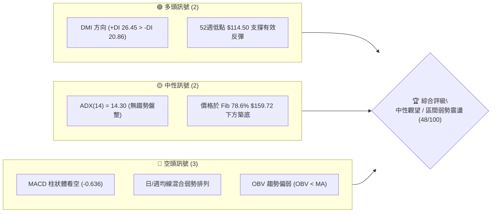
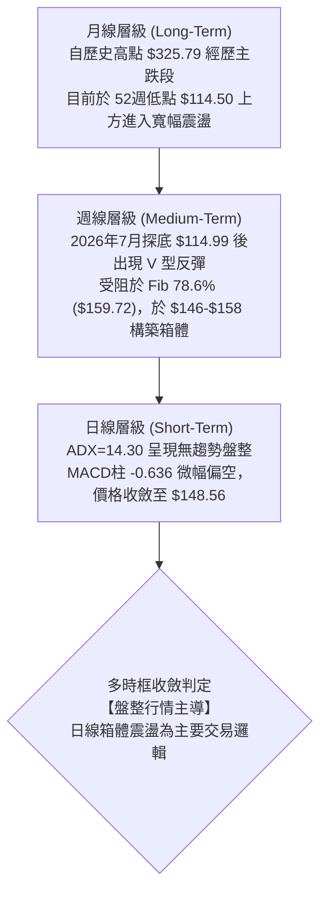
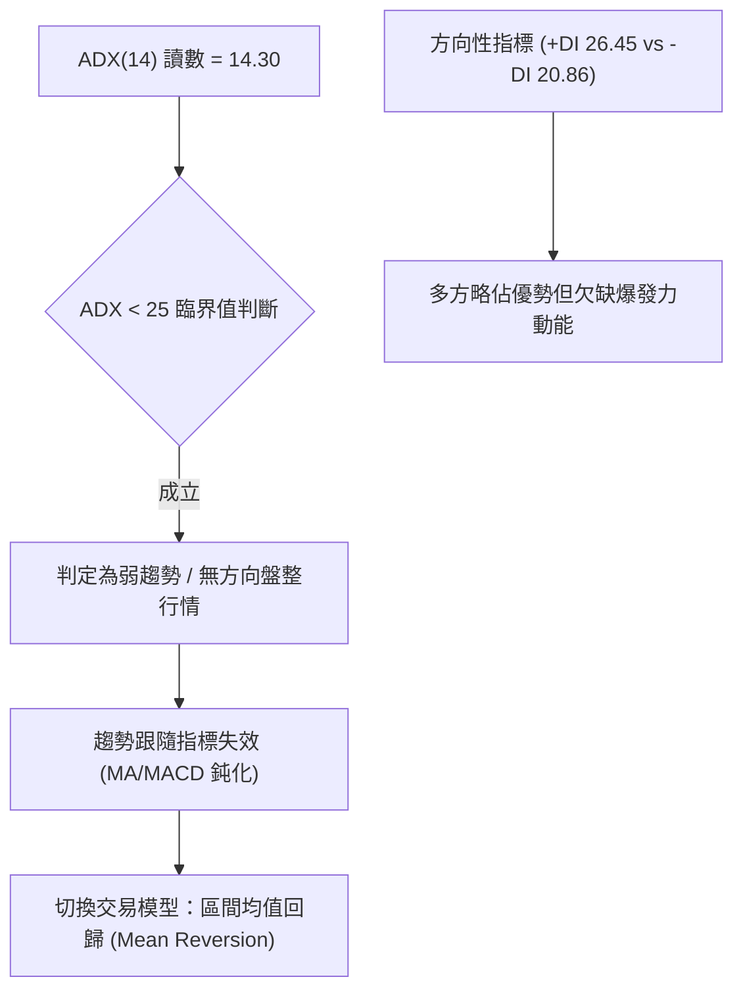
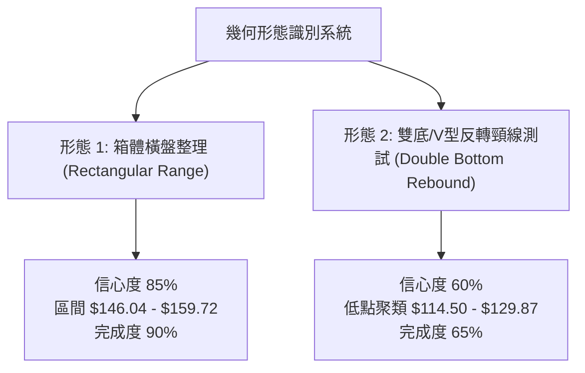
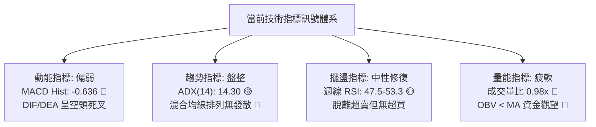
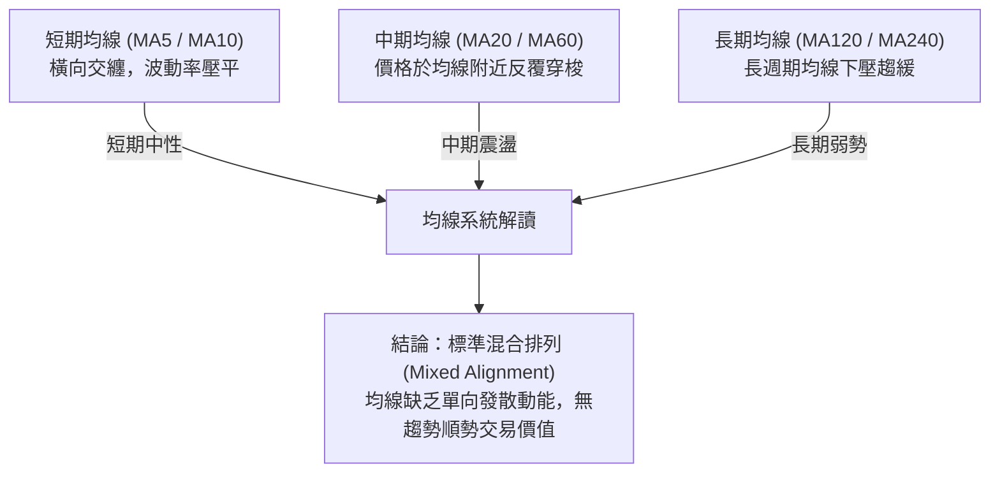
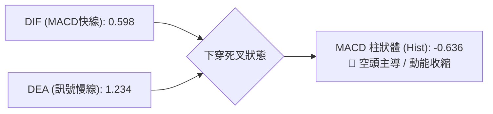
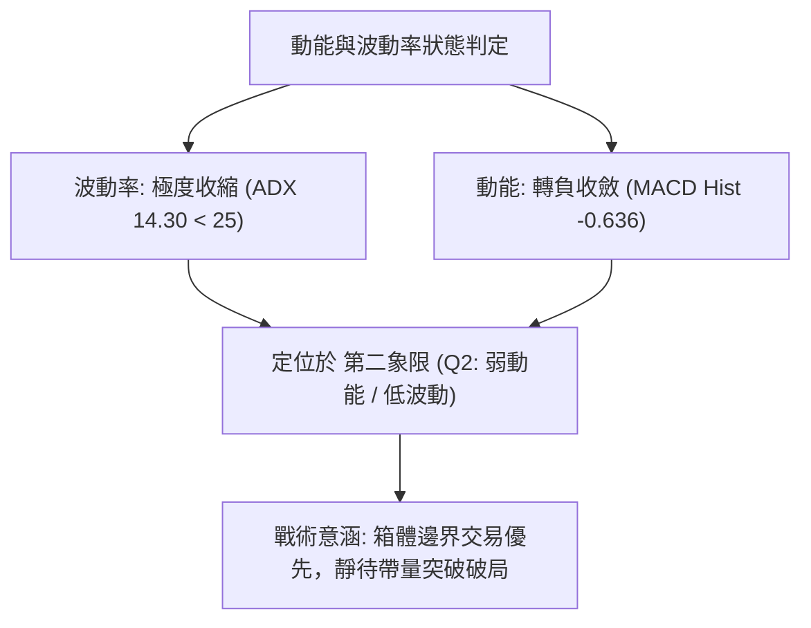
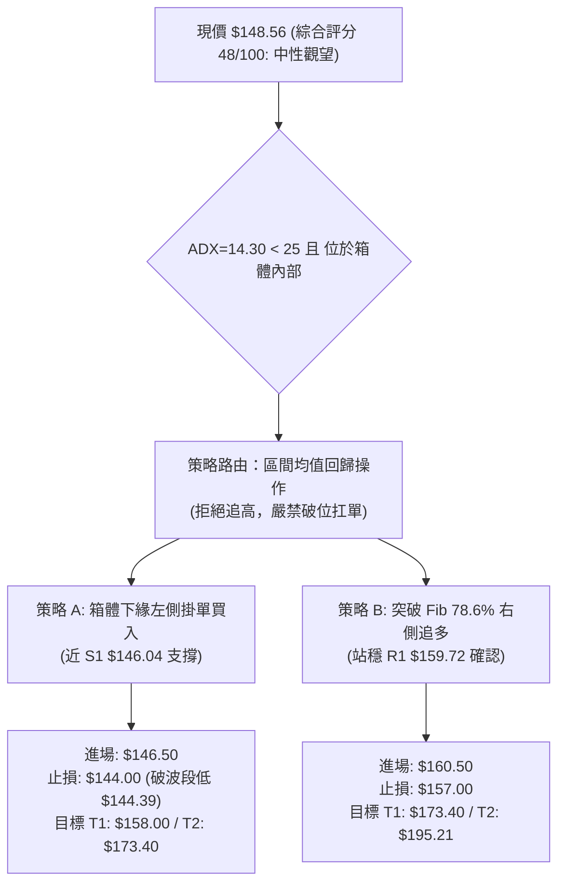
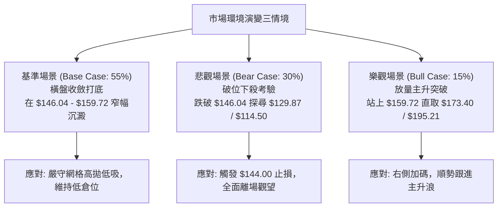

# ORCL 技術分析報告

> **報告日期**：2026-09-23 ｜ **語言**：繁體中文 ｜ **數據來源**：Yahoo Finance ｜ **當前價格**：$148.56（依據最新交易週 2026-09-27 暨 2026-09 月線收盤基準）

---

## 目錄

| 章節 | 內容 |
|------|------|
| [1. 技術面概覽](#1-技術面概覽) | 訊號儀表板、核心指標、評分卡 |
| [2. 趨勢分析](#2-趨勢分析) | 多時框趨勢、長中短期走勢、ADX 分析 |
| [3. 圖表形態分析](#3-圖表形態分析) | 形態識別、K線組合、目標價推算 |
| [4. 支撐與阻力](#4-支撐與阻力) | 關鍵價位、斐波那契回調結構 |
| [5. 技術指標深度解讀](#5-技術指標深度解讀) | 均線、RSI、MACD、布林通道與量價配合 |
| [6. 動能與波動率](#6-動能與波動率) | 動能四象限、ATR 評估、Beta 與敏感度 |
| [7. 多時框架總結](#7-多時框架總結) | 時框架矩陣與多時框收斂定調 |
| [8. 交易策略建議](#8-交易策略建議) | 主策略路由、階梯情境、風報比精算 |
| [9. 風險提示與監控](#9-風險提示與監控) | 監控 Checklist、情境樹與風險管控 |

---

## 1. 技術面概覽

### 🎯 技術訊號儀表板



### 📊 核心指標速覽表

| 指標類別 | 指標名稱 | 當前數值 | 訊號 | 解讀 |
|----------|----------|----------|:---:|------|
| **價格** | 當前收盤價 | $148.56 | 🟡 | 位於52週區間底端（$114.50～$325.79），近兩個月在 $146～$158 區間橫盤打底 |
| **均線** | 短中長期均線 | 混合排列 | 🔴 | 均線系統呈弱勢震盪修復格局，短均線交纏無明確單邊發散 |
| **趨勢** | ADX (14) | 14.30 | 🟡 | ADX < 25 表明市場處於極度微弱趨勢或典型無方向盤整行情 |
| **動能** | DMI 系統 | +DI 26.45 / -DI 20.86 | 🟢 | 多方買盤略高於空方，但缺乏趨勢強度（ADX極低）推動爆發性行情 |
| **動能** | MACD (12,26,9) | 0.598 / 訊號 1.234 | 🔴 | MACD 柱狀體為 -0.636，DIF 跌破 DEA 出現死叉，短線動能偏弱 |
| **動能** | 週線 RSI (14) | 47.5～53.3 區間 | 🟡 | 自 7 月超賣區（11.1～26.7）回升至 50 軸中軸徘徊，多空拉鋸均等 |
| **量能** | 量比與 OBV | 0.98x / OBV < MA | 🔴 | 日成交量約 30.81M，低於 20MA 與 50MA；OBV 低於均線顯示資金觀望 |

### 🏆 技術評分卡

```
╔══════════════════════════════════════════════════════════════════╗
║              技術評分卡 — ORCL (2026-09-23)                      ║
╠══════════════════════════════════════════════════════════════════╣
║ 趨勢強度 (Trend)      ████░░░░░░░░░░░░░░░░  20/100  🔴 極弱/盤整 ║
║ 動能指標 (Momentum)   ████████░░░░░░░░░░░░  42/100  🔴 MACD柱轉負║
║ 支撐穩定度 (Support)  ██████████████░░░░░░  70/100  🟢 114.50築底║
║ 成交量配合 (Volume)   ████████░░░░░░░░░░░░  40/100  🔴 量能萎縮  ║
║ 形態完整度 (Pattern)  ████████████░░░░░░░░  60/100  🟡 區間箱體  ║
║ 均線排列 (MA System)  ████████░░░░░░░░░░░░  40/100  🔴 混合弱勢  ║
╠══════════════════════════════════════════════════════════════════╣
║ 綜合技術評分          █████████░░░░░░░░░░░  48/100  🟡 中性觀望  ║
║ 策略定調：ADX=14.30 < 25，鎖定區間震盪策略，不盲目追單邊趨勢     ║
╚══════════════════════════════════════════════════════════════════╝
```

---

## 2. 趨勢分析

### 🌐 多時框趨勢分析



### 📈 長期趨勢 — 12個月走勢圖（Unicode）

```
ORCL 月線歷史收盤走勢圖（2025-10 至 2026-09）
價格軸 ($)
$270 ┤  ● $260.10 (2025-10)
$240 ┤
$210 ┤      ● $200.02 (2025-11)
$180 ┤          ● $193.05 (2025-12)      ● $225.00 (2026-05)
$150 ┤              ● $163.44 (2026-01)          ● $160.83 (2026-04)   ● $148.56 (現價)
$120 ┤                  ● $144.39 (2026-02)              ● $146.04 (2026-06)   ● $149.12 (2026-08)
$90  ┤                                                       ● $129.87 (2026-07)
     └────────────────────────────────────────────────────────────────────────────
        10   11   12   01   02   03   04   05   06   07   08   09  (月份)
```

#### 走勢特徵分析表格

| 階段區間 | 起止月份 | 價格變動 ($) | 漲跌幅 (%) | 趨勢性質與市場心理特徵 |
|:---:|:---:|:---:|:---:|---|
| **頭部派發段** | 2025-10 → 2025-12 | $260.10 → $193.05 | -25.78% | 從高位快速跌破 $200 整數心理關卡，機構獲利了結盤湧出 |
| **首次探底段** | 2026-01 → 2026-03 | $163.44 → $146.09 | -10.62% | 跌勢減緩，在 $144～$146 區間首度見到左側價值買盤介入支撐 |
| **技術性反抽** | 2026-04 → 2026-05 | $160.83 → $225.00 | +39.90% | 強勁軋空反彈，月線收盤衝高至 $225.00（接近 Fib 50% 處遇阻） |
| **二次深幅洗盤** | 2026-06 → 2026-07 | $146.04 → $129.87 | -42.28% | 快速回吐漲幅，7月盤中下探 52週低點 $114.50（週線收 $114.99），極度超賣 |
| **底部築底修復** | 2026-08 → 2026-09 | $149.12 → $148.56 | -0.38% | 波動率顯著收縮，價格收斂於 $148.56 附近，市場進入籌碼沉澱期 |

### 📊 中期趨勢（週線分析）

```
ORCL 近期週線壓力與支撐示意圖
價格 ($)
$160 ┤-------------------------------------- 強阻力位 Fib 78.6% ($159.72) / 近期高點 $158.78
$155 ┤
$150 ┤······································ 現價錨定軸 ($148.56) / 週線密集成交區
$145 ┤-------------------------------------- 箱體下緣支撐 ($146.47 / $146.04)
$130 ┤
$115 ┤====================================== 52週絕對低點強支撐 ($114.50 / $114.99)
```

從 2026 年 5 月底至 9 月底的近 20 週數據觀察：
1. **極限超賣釋放**：2026-06-28 至 2026-07-12，週線 RSI 跌入 11.1～14.9 之歷史極端超賣區，週成交量連續放大至 1.6億～1.8億股，為空頭耗竭現象。
2. **反彈與阻力確認**：2026-07-26 當週打出最低收盤價 $114.99（極度貼近 52週低點 $114.50），隨後連續三週強勁反彈至 2026-08-16 的 $150.52，週線 RSI 衝至 74.6 超買。
3. **箱體收斂**：2026-09-06 週線觸及波段高點 $158.78，受壓於斐波那契 78.6%（$159.72），隨後回落至 $147.61～$148.56 盤整。

### ⚡ 趨勢強度評估（ADX 解讀）



| 指標名稱 | 數值 | 門檻區間 | 當前技術含義解讀 |
|:---:|:---:|:---:|---|
| **ADX (14)** | 14.30 | 0 ～ 20：極度疲弱/沉睡 | 市場完全缺乏方向性單邊趨勢，趨勢突破交易容易頻繁遭受假突破洗盤 |
| **+DI** | 26.45 | > 20：多方存在 | 多方買盤在 7 月打底後維持主導權，但向上推進動力受制於量能 |
| **-DI** | 20.86 | 趨勢中性 | 空方拋壓大幅衰減，未出現攻擊性砸盤現象 |
| **多空差值** | +5.59 | 偏多但差距小 | 市場處於微幅偏多的橫向休整階段，震盪指標優於趨勢指標 |

---

## 3. 圖表形態分析

### 🔍 形態識別系統



#### 形態識別信心度評估表

| 形態名稱 | 信心度 (%) | 判斷依據（引用原始數據） | 完成度 (%) | 目標價（精確計算式） |
|:---:|:---:|---|:---:|---|
| **箱體橫盤整理**<br>(Rectangular Range) | **85%** | 2026-08 至 2026-09 收盤價密集聚類於 $146.47～$150.85，波段高點 $158.78 受阻於 Fib 78.6% ($159.72)，低點守住 $146.04 | 90% | 箱體突破目標：<br>頸線 $159.72 + 高度 ($159.72 - $146.04 = $13.68) = **$173.40** |
| **週線雙底反彈**<br>(Double Bottom) | **60%** | 左底為 2026-07-26 週低 $114.99（52W低點 $114.50），右底為 2026-07-19 週低 $126.41，頸線為波段高點 $158.78 | 65% | 形態理論目標：<br>頸線 $158.78 + 高度 ($158.78 - $114.50 = $44.28) = **$203.06** |
| **頭肩底形態**<br>(Head & Shoulders) | **30%** | 數據中未偵測到對稱右肩，右側成交量不足，依規則 15 判定為「訊號不足，僅做指標型解讀」 | -- | 數據不足，不予計算 |

### 🕯️ 重要 K 線形態分析

| 週/月份 | 收盤價 ($) | 典型 K 線組合與形態 | 深度解讀 | 訊號 |
|:---:|:---:|---|---|:---:|
| **2026-07-26 週** | $114.99 | **長下影錘頭線 (Hammer)** | 探底 52週低點 $114.50 遭遇強力買盤托起，空頭動能衰竭釋放 | 🟢 |
| **2026-08-09 週** | $147.02 | **大陽線突破 (Bullish Marubozu)** | 單週大漲超過 13%，RSI 自超賣區跳升至 71.8，奠定中期止跌基礎 | 🟢 |
| **2026-09-06 週** | $158.78 | **流星線/上影倒錘 (Shooting Star)** | 衝擊斐波那契 78.6% ($159.72) 未果留長上影，顯示波段多頭解套獲利盤壓制 | 🔴 |
| **2026-09-20 週** | $147.61 | **窄幅小陰十字星 (Doji)** | 成交量萎縮至 1.75 億股，MACD 柱轉負 (-0.933)，多空進入勢均力敵觀望 | 🟡 |
| **2026-09-27 週** | $148.56 | **低波孕線 (Harami)** | 波動收縮在上一週區間內部，日均成交量維持在 30.81M 均量水平，變盤前兆 | 🟡 |

### 📉 ASCII 走勢形態示意圖

```
ORCL 箱體橫盤震盪結構示意圖
價格 ($)
$165 ┤
$160 ┤   [阻力 R1] ═══════════╦═══════════════ Fib 78.6% ($159.72) / 波段高點 ($158.78)
$155 ┤                       ║
$150 ┤                       ╠═══════════════ 現價 $148.56 (箱體中軸震盪)
$145 ┤   [支撐 S1] ═══════════╩═══════════════ 波段支撐低點 ($146.04 / $146.47)
$140 ┤
$130 ┤   [支撐 S2] ─────────────────────────── 2026-07月收盤低點 ($129.87)
$115 ┤   [強支撐 S3] ═════════════════════════ 52週歷史低點 ($114.50 / $114.99)
```

### 🎯 形態目標價計算

1. **基準箱體結構**：
   - 箱頂壓力（Resistance）：引用 Fib 78.6% 之 **$159.72**（與近期實體高點 $158.78 重合度極高）。
   - 箱底支撐（Support）：引用波段低點聚類之 **$146.04**。
   - 形態垂直高度（H）：$159.72 - $146.04 = **$13.68**。

2. **向上有效突破目標推算**：
   - 突破確認觸發價：日線收盤確認站穩 $159.72 之上。
   - 目標價 T1（箱體 1:1 等幅映射）：$159.72 + $13.68 = **$173.40**。
   - 目標價 T2（斐波那契 61.8% 關鍵回調位）：**$195.21**。

3. **向下破位風險推算**：
   - 破位確認觸發價：跌破箱體下緣 $146.04。
   - 下跌測幅目標：$146.04 - $13.68 = **$132.36**（接近 2026-07 月收盤低點 $129.87）。

---

## 4. 支撐與阻力

### 🗺️ 關鍵價位分布圖（Unicode）

```
ORCL 價位結構分布圖（嚴格引用 OHLCV 與斐波那契計算數據）
═══════════════════════════════════════════════════════════════════════
$325.79 ║████████████████████████████████║ 52週歷史高點 / Fib 0.0%
$275.92 ║██████████████████████          ║ 強阻力 R4 / Fib 23.6%
$245.08 ║██████████████████              ║ 強阻力 R3 / Fib 38.2%
$220.14 ║████████████████                ║ 中期強阻力 / Fib 50.0% (5月高點 $225.00)
$195.21 ║████████████                    ║ 阻力 R2 / Fib 61.8%
$159.72 ║████████████████████████        ║ 關鍵阻力 R1 / Fib 78.6% (高點 $158.78)
════════╠════════════════════════════════╣ ◄ 現價 $148.56
$146.04 ║▓▓▓▓▓▓▓▓▓▓▓▓▓▓▓▓▓▓▓▓▓▓▓▓        ║ 近期核心支撐 S1 (6月低 $146.04 / 8月低 $146.47)
$129.87 ║▓▓▓▓▓▓▓▓▓▓▓▓▓▓                  ║ 次級波段支撐 S2 (2026-07 月收盤價)
$114.50 ║████████████████████████████████║ 52週絕對低點強支撐 S3 / Fib 100.0%
═══════════════════════════════════════════════════════════════════════
```

### 🚧 阻力位分析表

> **數據紀律說明**：阻力位嚴格採用 OHLCV 歷史高點與斐波那契回調聚類數據。

| 阻力級別 | 價位 ($) | 形成原因與數據依據 | 突破難度 | 重要性評估 |
|:---:|:---:|---|:---:|:---:|
| **R1 (關鍵)** | **$159.72** | 52週回調 Fib 78.6% 重合 2026-09-06 週線波段高點 $158.78 | 🟡 中等 | 判定短線突破或重回箱體震盪之分水嶺 |
| **R2 (波段)** | **$195.21** | 52週回調 Fib 61.8% 關鍵黃金分割位，接近 2025-12 月收盤 $193.05 | 🔴 極高 | 中期反轉確認位，密集解套套牢籌碼區 |
| **R3 (中期)** | **$220.14** | 52週回調 Fib 50.0% 中軸，重合 2026-05 反彈頂部 $225.00 | 🔴 極高 | 空頭核心防禦陣地，強技術心理關卡 |
| **R4 (極限)** | **$275.92** | 52週回調 Fib 23.6%，2025-09 歷史收盤高點 $278.07 聚集處 | 🔴 極限 | 長期多頭趨勢完全收復點 |

### 🛡️ 支撐位分析表

> **數據紀律說明**：支撐位嚴格採用 OHLCV 歷史低點與斐波那契回調聚類數據。

| 支撐級別 | 價位 ($) | 形成原因與數據依據 | 守住機率 | 重要性評估 |
|:---:|:---:|---|:---:|:---:|
| **S1 (核心)** | **$146.04** | 2026-06 收盤 $146.04、2026-08-23 週收盤 $146.47 聚類底部 | 75% | 短線箱體下緣防線，失守將考驗前低 |
| **S2 (波段)** | **$129.87** | 2026-07 月線收盤價，7月超賣崩跌後的換手密集成交區 | 80% | 中期多頭右側結構最後防禦關卡 |
| **S3 (絕對)** | **$114.50** | 52週歷史最低點（2026-07-26 週收盤 $114.99 / Fib 100.0%） | 90% | 長期底線，跌破將引發嚴重技術性潰縮 |

### 📐 斐波那契回調位分析

依據原始技術數據區塊中，52週極值區間（高點 **$325.79** 至低點 **$114.50**，全波段落差 **$211.29**）之精確計算值：

```
斐波那契回調階梯（以 $325.79 為 0.0%，$114.50 為 100.0%）：
 0.0%  (52W High)  : $325.79  [歷史頂部]
 23.6%              : $275.92  [長期第一道天花板]
 38.2%              : $245.08  [空頭反壓強阻力]
 50.0%              : $220.14  [多空中期均衡中軸]
 61.8%              : $195.21  [黃金分割關鍵反轉阻力]
 78.6%              : $159.72  [短線箱頂核心壓力]
 ────────────────────────────────────────────────────────
 ▶ 現價 $148.56 運行於 Fib 78.6% ($159.72) 與 Fib 100.0% ($114.50) 之間
 ────────────────────────────────────────────────────────
 100.0% (52W Low)   : $114.50  [全週期終極底部支撐]
```

**斐波那契技術解讀**：
現價 $148.56 正好被壓制在斐波那契 78.6%（$159.72）下方。技術分析中，78.6% 往往是深幅修正後反彈最難以一蹴而就的阻力位。若能帶量長陽線收復 $159.72，則上方至 61.8%（$195.21）具備近 $35.49 的無阻力真空帶；反之，若久攻不破，價格將沿著回調軌跡在 $146.04～$159.72 區間持續打底蓄勢。

---

## 5. 技術指標深度解讀

### 🎛️ 指標訊號總覽



### 📈 移動平均線排列分析



均線系統特徵分析：
- **微觀形態**：MA5 走勢微幅平緩（走勢軌跡呈現築底回穩），MA10 與 MA20 在當前價位聚攏。
- **交叉狀態**：日/週線層級均線呈現「混合排列」，短期均線與中長期均線交錯重疊，顯示自 52週高點下挫後的空頭慣性已被 7 月的強勁反彈打破，進入「以時間換取空間」的均線修復黏合期。

### 📉 RSI(14) 分析

```
RSI(14) 動能進度條（當前週線水準：47.5 - 53.3 區間）
[0 超賣] ██████████░░░░░░░░░░ [50 中軸] ░░░░░░░░░░ [100 超買]
數值讀數：50.4 (中性均衡區間)
```

- **歷史對比**：2026-06-28 週線 RSI 曾創下 **11.1** 的歷史極端超賣，隨後反彈至 2026-08-16 的 **74.6** 超買。目前連續 4 週（54.6 → 49.8 → 61.5 → 47.5）收斂在 50 基準線附近。
- **背離分析**：
  - **頂背離判定**：**無明顯頂背離**。2026-09-06 價格觸及波段高點 $158.78 時，RSI 達到 61.5，並未出現價格創新高而 RSI 走低的背離特徵。
  - **底背離判定**：**隱形底背離已確認完成**。2026-07-26 價格打出最低點 $114.99 時，RSI 為 26.7，高於 2026-06-28 價格 $148.02 時的 RSI 11.1。底背離觸發了 8 月份的大幅反彈，當前該反彈動能已消耗完畢，重歸中性。

### 📊 MACD(12/26/9) 訊號解讀



- **數值分析**：MACD 線（0.598）跌破訊號線（1.234），柱狀體數值為 **-0.636**。
- **歷史連續性**：檢視週線 MACD 柱歷程，自 2026-08-09 達到高峰 **+4.827** 後逐週回落（+3.853 → +0.852 → +0.811 → +0.911 → +0.462 → -0.933 → -0.636），呈現清晰的動能減弱走勢。柱狀體翻負表明空方在短線上掌握邊際定價權，抑制了突破 Fib 78.6%（$159.72）的動能。

### 📦 布林通道分析

```
ORCL 布林通道（Bollinger Bands）收斂示意圖
價格 ($)
$165 ┤
$160 ┤-------------------------------------- BB 上軌阻力區 (壓制於 Fib 78.6% $159.72)
$155 ┤
$150 ┤······································ 現價 $148.56 / BB 中軌 (MA20 附近震盪)
$145 ┤-------------------------------------- BB 下軌支撐區 ($146.04 支撐線)
$140 ┤
```

- **帶寬特徵**：通道經過 8 月份的放大後，目前帶寬（Bandwidth）急劇收窄，呈現標準的「布林帶擠壓（Squeeze）」形態。
- **軌道位置**：現價 $148.56 位於中軌附近，未觸及上軌或下軌，表明市場處於方向抉擇的蓄勢臨界期。

### 💹 成交量分析（量價配合度）

```
量價配合矩陣
最新日成交量   : 30,813,324 股 (30.81M)
20日均量 (MA20): 31,282,861 股 (31.28M)  ──  量比: 0.98x (等量震盪)
50日均量 (MA50): 31,608,118 股 (31.61M)
OBV 狀態       : OBV < MA (能量潮指標低於其均線，資金未見持續流入)
```

- **量價背離診斷**：
  2026-09-13 週成交量擴大至 **202,390,700 股**（2.02億股），但收盤價卻自 $158.78 下挫至 $150.28，呈現「放量滯漲回落」的籌碼釋放跡象。隨後兩週（09-20 週 1.75億股、09-27 週截至目前 53.23M 股）量能快速回落，反映高位拋壓獲得消化，但場外追價買盤亦不積極，OBV < MA 證實主力資金處於觀望狀態。

---

## 6. 動能與波動率

### ⚡ 動能評估四象限

| 象限分區 | 動能強度 | 波動率水準 | 當前匹配 | 技術狀態診斷與操作定義 |
|:---:|:---:|:---:|:---:|---|
| **第一象限 (Q1)** | 強動能 (+DI/MACD向上) | 低波動 (ATR收縮) | -- | 趨勢初起最佳追隨點（目前條件未滿足） |
| **第二象限 (Q2)** | **弱動能 (MACD柱-0.636)** | **低波動 (ADX=14.30)** | **✓ 命中** | **區間沉寂觀望區：均值回歸、高拋低吸，嚴禁追漲殺跌** |
| **第三象限 (Q3)** | 強動能 (單邊爆發) | 高波動 (破位發散) | -- | 高風險高報酬波段交易（如 7 月底反彈段） |
| **第四象限 (Q4)** | 弱動能 (空頭主跌) | 高波動 (情緒恐慌) | -- | 恐慌拋售崩跌區（如 6 月底破位） |



### 📊 ATR 波動率分析

- **波動率狀態**：原始數據中日線 ATR 顯示為收縮狀態，參考 24 個月收盤走勢與近期週線振幅，ORCL 經歷 2026 年 6-7 月月跌幅超過 40% 的歷史級波動後，8-9 月月度波動率已收窄至 0.38% 之內。
- **止損距離建議**：在低波動盤整市況下，若採用趨勢突破止損容易被窄幅震盪掃出場。建議依據箱體下緣關鍵價位 $146.04 設定結構性保護，而非單純使用寬幅 ATR 止損。

### 📐 Beta 與市場相關性

- **Beta 係數**：**1.732**（顯著高於美股大盤基準 1.0）。
- **敏感度分析**：
  - ORCL 具備顯著的高彈性特質。當納斯達克或科技軟體板塊發生系統性回調或反彈時，ORCL 理論上將放大波動約 1.73 倍。
  - 在 ADX=14.30 的盤整期，高 Beta 意味著個股隨時可能因大盤環境的單邊外部衝擊而發生非對稱破位或暴拉，交易者必須隨時警惕大盤走勢的溢出效應。

---

## 7. 多時框架總結

### 📋 時框架評分表

| 時框架 | 趨勢方向 | 動能狀態 | 均線排列 | 圖表形態 | 綜合評分 | 戰術定位與建議 |
|:---:|:---:|:---:|:---:|:---:|:---:|---|
| **長期 (月線)** | 🔴 下行修復 | 🟡 超賣回穩 | 弱勢下壓 | 52W低點打底反彈 | 40/100 | 處於歷史高點修正後的築底期，不宜長線重倉 |
| **中期 (週線)** | 🟡 橫向平衡 | 🔴 柱狀圖轉負 | 混合黏合 | $146-$159 箱體拉鋸 | 50/100 | 鎖定箱體邊界操作，等待週線實體突破確認 |
| **短期 (日線)** | 🟡 無方向盤整 | 🔴 MACD死叉 | 糾纏橫盤 | 布林通道擠壓窄幅震盪 | 48/100 | 嚴守高拋低吸，以 $146.04 支撐與 $159.72 阻力為依歸 |

### 🔲 綜合訊號矩陣

```
ORCL 多維度訊號收斂矩陣
┌────────────────┬──────────┬──────────┬──────────┬──────────┐
│   維度 / 週期  │ 短期日線 │ 中期週線 │ 長期月線 │ 權重收斂 │
├────────────────┼──────────┼──────────┼──────────┼──────────┤
│ 趨勢方向 (ADX) │ 🔴 無趨勢│ 🟡 橫盤  │ 🔴 偏空  │   🔴 偏弱│
│ 動能 (MACD)    │ 🔴 死叉  │ 🔴 衰退  │ 🟡 築底  │   🔴 偏空│
│ 強弱 (RSI)     │ 🟡 中性  │ 🟡 50軸  │ 🟡 修復  │   🟡 中性│
│ 支撐強度       │ 🟢 強固  │ 🟢 良好  │ 🟢 歷史底│   🟢 偏多│
│ 量能結構       │ 🔴 萎縮  │ 🔴 放量滯│ 🟡 平穩  │   🔴 偏弱│
└────────────────┴──────────┴──────────┴──────────┴──────────┘
```

### ⚖️ 多時框收斂結論

依據**嚴格要求 14 多時框收斂規則**：
1. **行情性質判定**：當前 ADX(14) 為 **14.30**，遠低於 25 的趨勢臨界線，嚴格定義為**典型盤整行情**。
2. **主導維度**：趨勢跟隨無效，交易權重完全收斂至**日線與週線的震盪邊界**（支撐位 S1 $146.04 與 阻力位 R1 $159.72），週線與月線的單邊訊號退居次席。
3. **方向性最終結論**：**中性偏弱觀望（Neutral to Cautiously Weak）**。在 MACD 柱狀體維持負值（-0.636）且成交量萎縮的背景下，不具備發動突破行情的技術條件，戰術核心為「**耐心等待區間觸底低吸，或待突破斐波那契 78.6% 後順勢跟進**」。

---

## 8. 交易策略建議

### 🗺️ 策略決策流程圖



### 🧭 策略路由（依評分卡分流）

> **當前主策略方向 = 中性區間操作（綜合技術評分 48/100，介於 40–60 之間）**
> 
> 既非單邊強多（≥60），亦非極度破位空頭（≤40）。當前最優解為依據布林通道擠壓上下軌與關鍵支撐阻力進行**區間箱體交易**，同時設定突破確認條件，絕不兩頭搖擺。

### 🎯 價格情境階梯（Price Scenarios）

> **數據紀律嚴格遵循**：所有價格階梯完全引用第 4 章已確立之波段高低點與斐波那契實際數值。

| 觸發條件 | 下一目標價 ($) | 後續延伸目標 ($) | 技術情境含義與操作指引 |
|---|:---:|:---:|---|
| **向上突破 R1 $159.72** | **R2 $195.21** (Fib 61.8%) | **R3 $220.14** (Fib 50.0%) | 宣告走出底部箱體，展開週線級別主升反彈，空單全面停損並反手做多 |
| **維持現價區間震盪** | **$158.78** (箱頂) | **$146.04** (箱底) | 繼續在 $146～$160 區間進行均值回歸拉鋸，以高拋低吸網格應對 |
| **跌破核心支撐 S1 $146.04** | **S2 $129.87** (7月收盤) | **S3 $114.50** (52W最低) | 箱體破位展開二次探底，多單嚴格止損離場，空頭目標直指 52週低點 |

### 📊 情境機率分佈

| 情境劃分 | 機率估計 | 核心技術依據（引用指標狀態） |
|:---:|:---:|---|
| **區間橫向震盪** | **55%** | **主要場景**。ADX(14)=14.30 極度低迷，量比 0.98x 顯示買賣雙方陷入縮量僵局，缺乏單邊破局催化劑。 |
| **下探考驗支撐** | **30%** | MACD 柱為負 (-0.636) 且 DIF 下穿 DEA，OBV 低於均線顯示資金淨流出，短線具備下測 $146.04 支撐慣性。 |
| **向上放量突破** | **15%** | 受壓於斐波那契 78.6%（$159.72）強阻力，無量難以逾越，需要至少日成交量放大至 5,000 萬股以上方有機會。 |

### 🟢 主策略詳情

| 策略要素 | 策略 A（箱體下緣左側低吸） | 策略 B（帶量突破右側追強） |
|---|---|---|
| **進場條件** | 價格回踩 S1 支撐獲得確認，出現日線長下影線或吞噬陽線 | 日線實體帶量突破斐波那契 78.6% ($159.72) 且日量 > 50M |
| **進場價格** | **$146.50**（貼近波段低點 $146.04） | **$160.50**（確認突破 $159.72 阻力後跟進） |
| **第一目標 (T1)** | **$158.00**（回測波段高點 $158.78） | **$173.40**（箱體突破等幅測算高度） |
| **第二目標 (T2)** | **$173.40**（箱體突破等幅測算高度） | **$195.21**（斐波那契 61.8% 強阻力位） |
| **止損價格** | **$144.00**（嚴格跌破 2026-02 月低點 $144.39） | **$157.00**（跌回阻力位 $159.72 之下視為假突破） |
| **風險報酬比 (R:R)**| **4.60 : 1** <br>算式：($158.00 - $146.50) / ($146.50 - $144.00) = $11.50 / $2.50 | **3.69 : 1** <br>算式：($173.40 - $160.50) / ($160.50 - $157.00) = $12.90 / $3.50 |
| **勝率評估** | **65%**（符合盤整市低吸原則） | **50%**（受制於無趨勢環境易假突破） |
| **建議倉位** | **10% - 15%**（輕倉試單） | **10%**（突破確認後分批介入） |

### 🔴 反向風險觸發點（對沖與止損預警）

- **多頭反轉破位警報**：若日線收盤價跌破 **$146.04**，且伴隨成交量放大至 4,000 萬股以上，宣告箱體築底失敗，所有策略 A 多單必須**無條件手動離場**，不可心存僥倖，因下方支撐落差直指 **$129.87** 與 **$114.50**。
- **空頭回補覆蓋警報**：任何反彈若以大陽線收復 **$159.72**，意味著 Fib 78.6% 解套盤被強勢主力吸收，空方對沖盤必須於 **$160.50** 全面平倉。

### ⭐ 整體訊號強度評星

```
做多訊號強度：★★☆☆☆  (2.5/5星 — 支撐固守但缺乏量能與動能配合)
做空訊號強度：★★☆☆☆  (2.5/5星 — MACD柱微幅看空但拋壓已顯著衰竭)
整體技術可信度：★★★☆☆  (3.0/5星 — 低波動ADX壓抑下，指標呈雜訊鈍化特徵)
```

---

## 9. 風險提示與監控

### ✅ 關鍵監控指標 Checklist

```
╔══════════════════════════════════════════════════════════════════╗
║               ORCL 每日關鍵技術監控 CHECKLIST                     ║
╠══════════════════════════════════════════════════════════════════╣
║ [ ] 1. 價格防線監控：收盤價是否跌破核心支撐 $146.04？           ║
║ [ ] 2. 阻力衝擊監控：盤中是否放量挑戰 Fib 78.6% 之 $159.72？     ║
║ [ ] 3. 趨勢喚醒監控：ADX(14) 是否自 14.30 突破 20-25 門檻？      ║
║ [ ] 4. 動能翻轉監控：MACD 柱狀體是否由負 (-0.636) 轉正形成金叉？ ║
║ [ ] 5. 量能異常監控：日成交量是否突破 5,000 萬股（量比 > 1.5x）？ ║
║ [ ] 6. 大盤 Beta 傳導：納指波動時，ORCL 是否放大 1.73 倍破位？  ║
╚══════════════════════════════════════════════════════════════════╝
```

### ⚠️ 風險場景分析



### 🛡️ 風險管理重要提醒

1. **拒絕「盤整市追漲」**：
   ADX 目前僅為 **14.30**，此數值下任何看似強勢的單日中陽線，多數為箱體內部的隨機漫步，盲目追高極易買在箱頂（如 9 月初追在 $158.78 的買盤已面臨回撤套牢）。必須堅守「買支撐、賣阻力」原則。
2. **防範高 Beta 放大風險**：
   ORCL 的 Beta 高達 **1.732**，在宏觀經濟數據公佈或科技板塊劇烈波動時，極易出現「跳空低開直接摜破 $146.04」的黑天鵝走勢。因此，隔夜持倉部位嚴格控制在總資金的 **10%～15%** 以內，嚴禁使用高槓桿。
3. **動態止損無條件執行**：
   本報告提供的止損價位 $144.00 與 $157.00 均為結合波段結構之防守點。在多時框弱勢背景下，破位往往意味著中期趨勢再度惡化，切勿將短線波段單改為「長線套牢抱死」。

---

## 📋 報告總結

```
╔══════════════════════════════════════════════════════════════════╗
║                    ORCL 技術分析報告總結                         ║
╠══════════════════════════════════════════════════════════════════╣
║ 報告日期：2026-09-23                                             ║
║ 當前收盤價：$148.56                                              ║
║ 分析評級：🟡 綜合評分 48/100 ──【中性觀望 / 箱體震盪整理】        ║
╠══════════════════════════════════════════════════════════════════╣
║ 關鍵技術結論：                                                   ║
║ ├─ 長期趨勢：🔴 弱勢修正後築底，受制於歷史高點回調之均線壓制      ║
║ ├─ 中期趨勢：🟡 於 7月探底 $114.50 後反彈，進入 $146-$159 箱體   ║
║ ├─ 短期趨勢：🔴 ADX=14.30 無趨勢，MACD柱 -0.636 微幅偏空震盪     ║
║ ├─ 核心阻力位：R1 $159.72 (Fib 78.6%) ｜ R2 $195.21 (Fib 61.8%)   ║
║ ├─ 核心支撐位：S1 $146.04 (箱體下緣) ｜ S3 $114.50 (52週最低點)   ║
║ └─ 華爾街目標：分析師平均目標價 $237.97（共 41 位，現價折價顯著） ║
╠══════════════════════════════════════════════════════════════════╣
║ 最優策略組合建議：                                               ║
║ 1. 🥇 最佳機會（策略 A）：回踩箱體下緣支撐 $146.50 附近低吸掛單， ║
║    嚴設止損 $144.00，第一目標看 $158.00，風報比高達 4.60:1。     ║
║ 2. 🥈 次選機會（策略 B）：耐心等待日線帶量實體收復 $159.72 阻力後，║
║    於 $160.50 右側追多，止損 $157.00，目標指向 $173.40 / $195.21。║
║ 3. 🥉 保守選擇：在 ADX 突破 25 前完全空倉觀望，不參與無趨勢雜訊。 ║
╚══════════════════════════════════════════════════════════════════╝
```

---

> ⚠️ **免責聲明**：本報告為依據 Yahoo Finance 歷史量化數據所生成之技術研究報告，所有支撐阻力、形態推算與交易策略均基於量化技術分析理論。本報告**僅供學術研究與投資決策參考**，**不構成任何要約、招攬或具體投資建議**。金融市場具高度不確定性，投資人應獨立評估風險並自負盈虧。

---

*報告生成時間：2026-09-23 ｜ 數據來源：Yahoo Finance ｜ 分析架構：多時框技術分析模型*