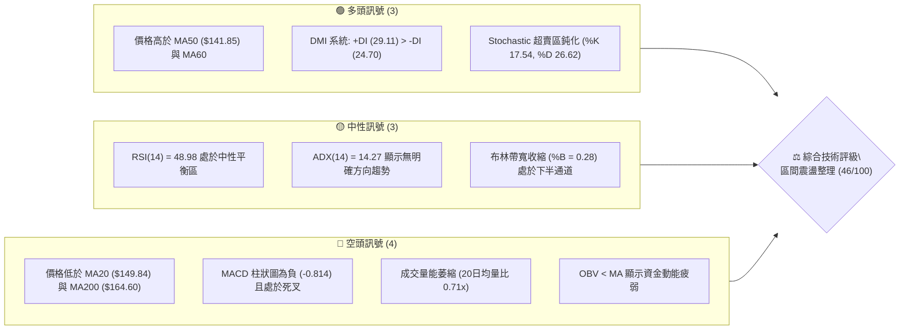
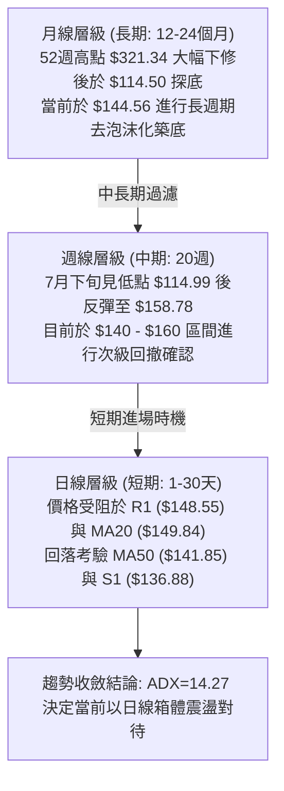
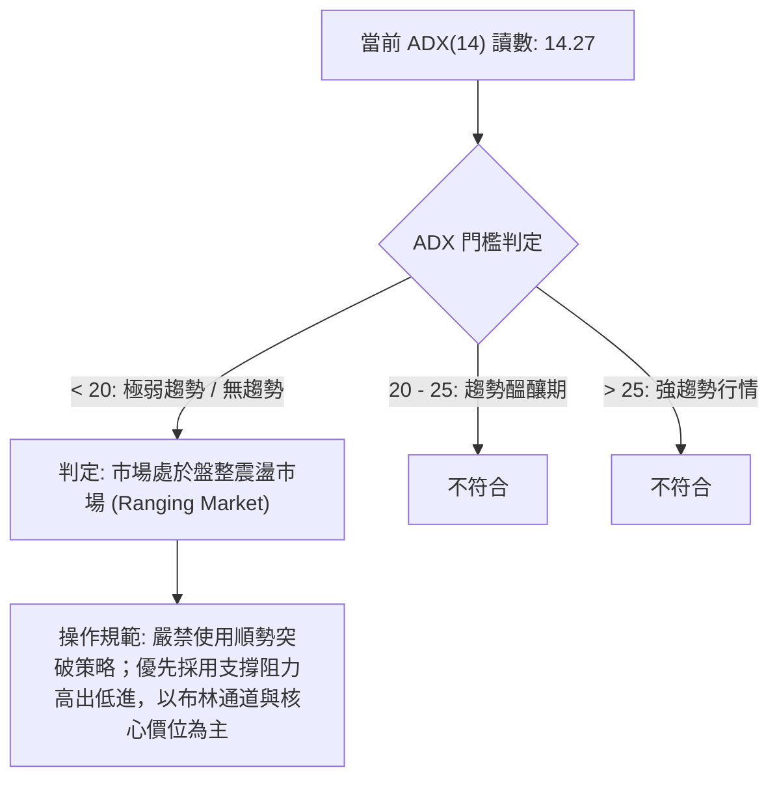
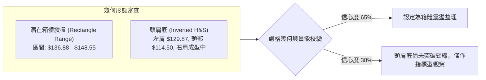
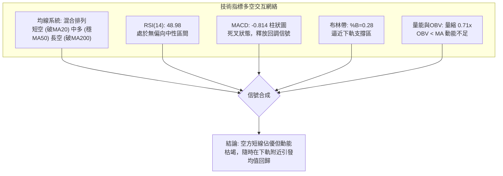
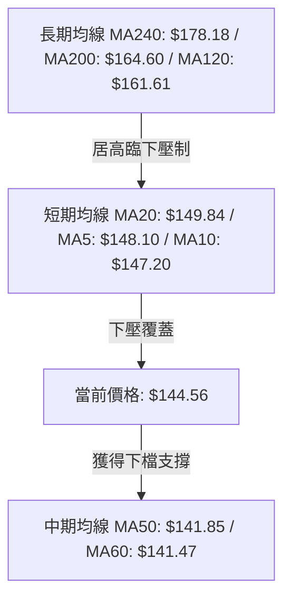
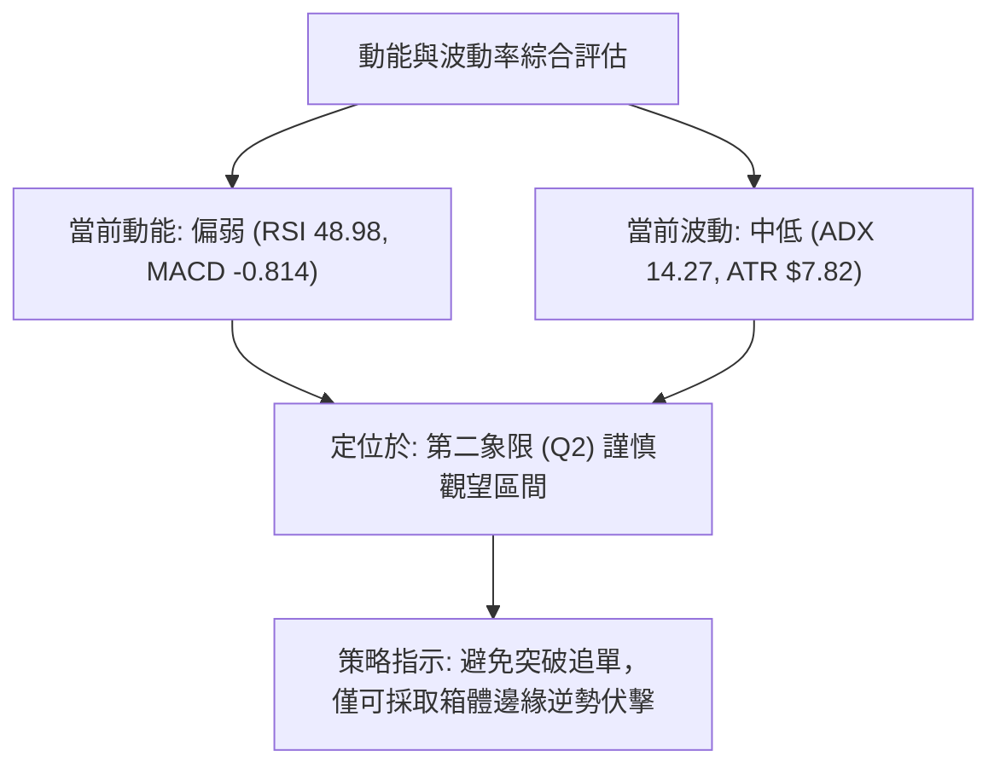
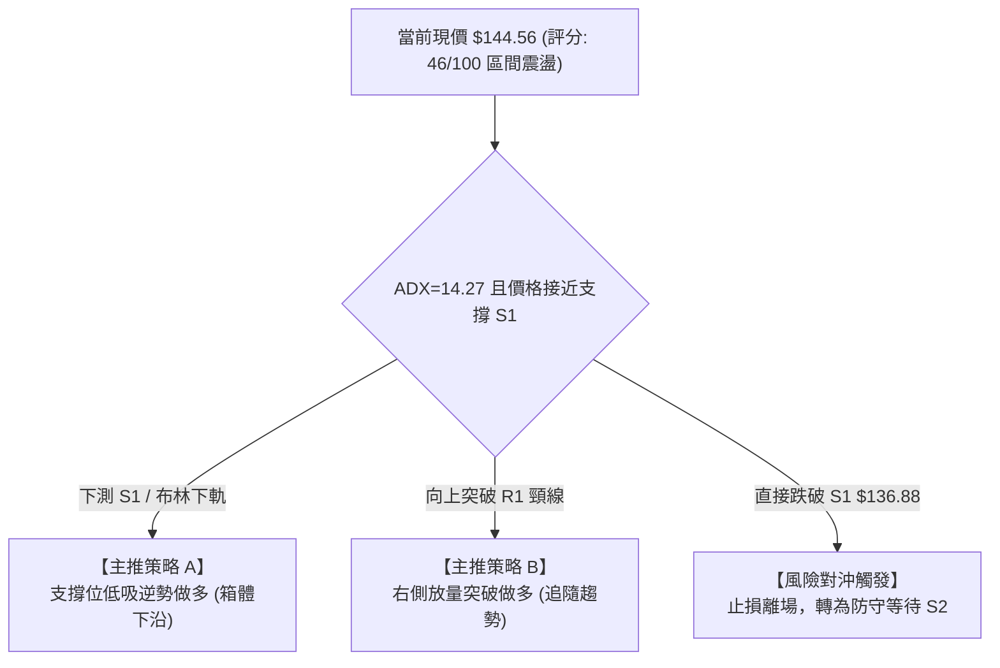
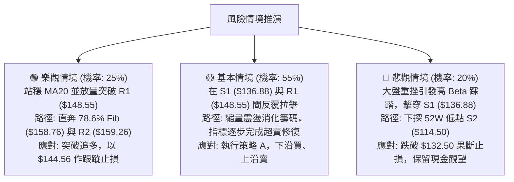

# ORCL 技術分析報告

> **報告日期**：2026-09-24 ｜ **語言**：繁體中文 ｜ **數據來源**：Yahoo Finance ｜ **當前價格**：$144.56

---

## 目錄

| 章節 | 內容 |
|------|------|
| [1. 技術面概覽](#1-技術面概覽) | 訊號儀表板、核心指標、評分卡 |
| [2. 趨勢分析](#2-趨勢分析) | 多時框趨勢、長中短期走勢、ADX 解讀 |
| [3. 圖表形態分析](#3-圖表形態分析) | 形態識別、信心度評估、K線組合、目標價計算 |
| [4. 支撐與阻力](#4-支撐與阻力) | 關鍵價位分布、阻力/支撐分析、斐波那契回調 |
| [5. 技術指標深度解讀](#5-技術指標深度解讀) | 均線系統、RSI、MACD、布林通道、量能與 OBV |
| [6. 動能與波動率](#6-動能與波動率) | 動能四象限、ATR 波動率與止損定價、Beta 分析 |
| [7. 多時框架總結](#7-多時框架總結) | 時框架矩陣、多時框收斂與裁決結論 |
| [8. 交易策略建議](#8-交易策略建議) | 策略路由、價格階梯、機率分佈、多空策略表 |
| [9. 風險提示與監控](#9-風險提示與監控) | 監控清單、情境推演、風控紀律 |

---

## 1. 技術面概覽

### 🎯 技術訊號儀表板



---

### 📊 核心指標速覽表

| 指標類別 | 指標名稱 | 當前數值 | 訊號 | 專業解讀 |
|:---|:---|:---|:---:|:---|
| **現價基準** | 收盤價 | $144.56 | 🟡 | 位於52週區間底部的 14.5% 分位，低位築底階段 |
| **均線排列** | MA20 | $149.84 | 🔴 | 現價位於 MA20 下方 (-3.53%)，短線承壓 |
| **均線排列** | MA50 | $141.85 | 🟢 | 現價高於 MA50 (+1.91%)，提供中期下檔保護 |
| **均線排列** | MA200 | $164.60 | 🔴 | 現價低於長期牛熊分界線 (-12.18%)，長格局偏空 |
| **動能指標** | RSI(14) | 48.98 | 🟡 | 位於 30–70 中性常態區間，未見背離訊號 |
| **動能指標** | MACD (12,26,9) | 0.216 / 1.030 | 🔴 | DIF < DEA，MACD 柱為 -0.814，空頭動能釋放中 |
| **隨機指標** | KD (14,3,3) | %K 17.54 / %D 26.62 | 🟢 | 進入超賣警戒區，隨時具備短線技術性抽頭條件 |
| **趨勢強度** | ADX(14) | 14.27 | 🟡 | ADX < 25 表明處於弱趨勢／無方向震盪整理市 |
| **方向指標** | DMI (+DI / -DI) | 29.11 / 24.70 | 🟢 | +DI 依然佔優，多方保有防守反擊能力 |
| **波動帶** | 布林通道 (%B) | 0.28 (寬度 $24.26) | 🟡 | 價格位於中軌 ($149.84) 與下軌 ($137.71) 之間 |
| **量能系統** | 成交量 / 20日均量 | 22.61M / 31.77M | 🔴 | 量比 0.71x，買盤跟進意願低，量價處於沉澱態 |
| **量能系統** | OBV 趨勢 | OBV < MA | 🔴 | 資金面呈現淨流出後的平緩期，無顯著機構吸籌 |
| **波動性** | ATR(14) | $7.82 (5.41%) | 🟡 | 每日平均波動幅度約 $7.82，波幅維持中等常規水準 |

---

### 🏆 技術評分卡

```
╔══════════════════════════════════════════════════════════════════╗
║                技術評分卡 — ORCL (2026-09-24)                   ║
╠══════════════════════════════════════════════════════════════════╣
║ 趨勢強度 (ADX/DMI)  ██████░░░░░░░░░░░░░░  32/100  🔴 弱勢無趨勢  ║
║ 動能指標 (RSI/MACD) █████████░░░░░░░░░░░  45/100  🟡 弱勢整理    ║
║ 支撐穩定度 (S1/S2)  ██████████████░░░░░░  70/100  🟢 區間下限強  ║
║ 成交量配合 (VOL/OBV)██████░░░░░░░░░░░░░░  30/100  🔴 量能退潮    ║
║ 形態完整度 (結構)   ████████████░░░░░░░░  60/100  🟡 箱體成型中  ║
║ 均線排列 (MA結構)   ████████░░░░░░░░░░░░  40/100  🔴 均線壓制    ║
╠══════════════════════════════════════════════════════════════════╣
║ 綜合技術評分        █████████░░░░░░░░░░░  46/100  ⚖️ 區間震盪觀望║
╚══════════════════════════════════════════════════════════════════╝
```

---

## 2. 趨勢分析

### 🌐 多時框趨勢分析



---

### 📈 長期趨勢 — 12個月走勢圖（Unicode）

以下為 ORCL 過去 12 個月（2025-10 至 2026-09）之月線收盤走勢：

```
ORCL 月線走勢圖（2025-10 至 2026-09）
價格軸 ($)
$270 ┤  ● (10月: $260.10)
$240 ┤
$210 ┤      ● (11月: $200.02)
$180 ┤          ● (12月: $193.05)                                ● (5月: $225.00)
$150 ┤              ● (1月: $163.44)       ● (4月: $160.83)          ● (8月: $149.12)
$120 ┤                  ● (2月: $144.39) ● (3月: $146.09)                ● (6月: $146.04)   ● (9月: $144.56) 現價
$90  ┤                                                                       ● (7月: $129.87 - 觸及52W低點 $114.50)
     └─────────────────────────────────────────────────────────────────────────────►
        10月  11月  12月  01月  02月  03月  04月  05月  06月  07月  08月  09月 (時間)
```

#### 走勢特徵分析表格

| 階段 | 時間區間 | 起止收盤價 | 區間漲跌幅 | 結構性技術特徵 |
|:---|:---|:---|:---:|:---|
| **第一階段：高位破位** | 2025/10 - 2026/02 | $260.10 → $144.39 | -44.49% | 主跌浪。機構獲利盤大規模出逃，連續跌破多條長期均線。 |
| **第二階段：春季反抽** | 2026/03 - 2026/05 | $146.09 → $225.00 | +54.01% | 暴力死貓跳／多頭反撲，回抽 52W 區間 50% 斐波那契位 ($217.92) 後力竭。 |
| **第三階段：二次探底** | 2026/06 - 2026/07 | $225.00 → $129.87 | -42.28% | 恐慌性殺跌，週線 RSI 降至 11.1 極度超賣區，砸出 52W 低點 $114.50。 |
| **第四階段：底部震盪** | 2026/08 - 2026/09 | $149.12 → $144.56 | -3.06% | 振幅收斂，成交量顯著萎縮，價格圍繞 $140–$150 形成震盪平台。 |

---

### 📊 中期趨勢（週線分析）

從近 20 週收盤走勢可見，ORCL 在 2026 年 7 月 26 日當週收在 $114.99（極度接近 52 週最低點 $114.50），隨後觸發了強勁的空頭回補與超賣修復波段，連續推升至 2026 年 9 月 6 日的波段高點 $158.78。

近期 3 週走勢：
- **2026-09-13**：收 $150.28（週成交量爆出 202,390,700 股，衝高遇阻於阻力位 R2 $159.26 下方）
- **2026-09-20**：收 $147.61（週 MACD 柱翻負至 -0.933，動能衰退）
- **2026-09-27 (當前)**：收 $144.56（成交量急縮至 76,285,600 股，顯示殺跌動能同樣枯竭）

```
週線震盪箱體示意圖
$160.00 ┬─────────────────────────────────────────── [強阻力帶 R2: $159.26]
        │                   ▲ 9/06 頂點 $158.78
$150.00 ┼─────────▲─────────┼───────────────────────── [短期壓制 MA20: $149.84 / R1: $148.55]
        │        ╱ ╲       │      ● 現價 $144.56
$140.00 ┼───────╱───╲──────┼───────────────────────── [中期防守 MA50: $141.85 / S1: $136.88]
        │      ╱     ╲     │
$130.00 ┼─────╱───────╲────┴─────────────────────────
        │    ▲ 8/02 收 $129.87
$114.50 ┴────┴─────────────────────────────────────── [52W 歷史底部 S2: $114.50]
```

---

### ⚡ 趨勢強度評估（ADX 解讀）



#### ADX 與 DMI 系統參數解讀表

| 指標 | 當前數值 | 參考臨界線 | 狀態解讀 |
|:---|:---:|:---:|:---|
| **ADX(14)** | **14.27** | 25.00 | 處於無趨勢狀態，代表既非單邊牛市亦非單邊熊市，均線反覆纏繞。 |
| **+DI** | **29.11** | 20.00 | 多頭向上驅動力保持在中高位，反映自 $114.50 底部上攻後的餘溫。 |
| **-DI** | **24.70** | 20.00 | 空方力量受到抑制，但未徹底潰散；+DI 領先 -DI 約 4.41 個點。 |
| **整合判定** | **多頭微弱佔優盤整** | - | 價格下跌缺乏實質空頭趨勢力量推動，更多為反彈後的量縮拉回洗盤。 |

---

## 3. 圖表形態分析

### 🔍 形態識別系統



#### 圖表形態信心度評估表（依規則 15）

| 形態名稱 | 信心度 | 判斷依據（引用客觀數據） | 形態完成度 | 目標價（附嚴格計算式） |
|:---|:---:|:---|:---:|:---|
| **低位箱體震盪 (Trading Range)** | **65%** | 價格在 S1 ($136.88) 與 R1 ($148.55) 之間運行，ADX 14.27 (<25) 完美支持區間特徵。 | **85%** | 向上突破目標價 = 頸線 R1 ($148.55) + 箱體高度 ($148.55 - $136.88 = $11.67) = **$160.22**（極度貼合阻力位 R2 $159.26）。 |
| **潛在雙重底／複合底** | **38%** | 2026/02 見 $144.39，2026/07 探 $114.50，當前於 $144.56。兩次低點落差過大 ($30)，不符合嚴格雙底對稱性。 | **40%** | *訊號不足，信心度低於 50%，不給予幾何預測，轉為純指標型解讀。* |
| **布林通道下軌擠壓反彈** | **75%** | 布林 %B 現為 0.28，接近下軌 $137.71；KD 進入超賣區 (%K 17.54)。 | **90%** | 回歸布林中軌目標價 = **$149.84**（中軌 MA20）。 |

---

### 🕯️ 重要K線形態分析

| 週期／月份 | 收盤價 | K線形態名稱 | 專業技術解讀 | 多空訊號 |
|:---|:---:|:---|:---|:---:|
| **2026-05** | $225.00 | **長陽反撲吊頸線** | 單月暴拉後留出上影線，未能站穩 52W 區間 50% 回調位 ($217.92)，動能衰竭。 | 🔴 強烈空頭信號 |
| **2026-06** | $146.04 | **破位大陰線** | 單月暴跌 $78.96，帶巨量跳水擊穿多道支撐，確立下行主趨勢。 | 🔴 空方控盤 |
| **2026-07** | $129.87 | **長下影探底錘頭 (Hammer)** | 盤中殺穿至 $114.50（52W Low）後出現長下影回升，賣盤力竭。 | 🟢 底部信號 |
| **2026-08** | $149.12 | **回補紅K吞噬線** | 收盤吃掉 7 月大部分失地，確認 $114.50 具備長期戰略支撐效力。 | 🟢 多方復甦 |
| **2026-09** | $144.56 | **高位孕線／十字洗盤線** | 振幅收斂在 8 月 K 線腹部，量能急劇萎縮，表明市場進入等待方向的沉寂期。 | 🟡 變盤前夕 |

---

### 📉 ASCII 走勢形態示意圖

```
箱體震盪與突破目標推演圖
價格 ($)
$160.22 ┬ - - - - - - - - - - - - - - - - - - - - - - - - - - - - - - - - -  箱體等幅突破目標 (貼近 R2 $159.26)
        │                                                     ▲ 
        │                                                     │ +$11.67 (箱高)
$148.55 ┼───────────────────▲─────────────────▲─────────────┼────── 箱體頂部 (阻力位 R1)
        │                  ╱ ╲               ╱ ╲            │
        │                 ╱   ╲             ╱   ● 現價 $144.56
        │                ╱     ╲           ╱
$136.88 ┼───────▼───────╱───────▼─────────╱────────────────────────── 箱體底部 (支撐位 S1)
        │        ╲     ╱         ╲       ╱
        │         ╲   ╱           ╲     ╱
$114.50 ┴──────────▼───────────────▼────────────────────────────────── 外部終極防線 (支撐位 S2)
```

---

## 4. 支撐與阻力

### 🗺️ 關鍵價位分布圖（Unicode）

```
ORCL 價位結構分布圖（OHLCV 聚類計算）
═══════════════════════════════════════════════════════════════════
$164.24 ║██████████████████████████████║ 強結構阻力 R3 (+13.62%) - MA200 共振位
$159.26 ║████████████████████          ║ 波段阻力 R2 (+10.17%) - 78.6% Fib 共振
$148.55 ║████████████████████████      ║ 近端關鍵頸線阻力 R1 (+2.76%) - MA20 壓制
$144.56 ╠══════════════════════════════╣ ◄─── 現價 ($144.56)
$136.88 ║▓▓▓▓▓▓▓▓▓▓▓▓▓▓▓▓              ║ 近端核心防守支撐 S1 (-5.31%) - 布林下軌區
$114.50 ║██████████████████████████████║ 52週歷史鐵底 S2 (-20.79%) - 絕對底部
═══════════════════════════════════════════════════════════════════
```

---

### 🚧 阻力位分析表

所有價位均嚴格取自數據模組中波段高點聚類計算：

| 阻力級別 | 精確價位 | 距離現價幅度 | 形成原因與技術共振 | 突破難度 | 戰略重要性 |
|:---|:---:|:---:|:---|:---:|:---:|
| **R1** | **$148.55** | +2.76% | 近期多次衝高回落高點聚類，與當前 MA20 ($149.84) 形成緊密下壓重疊帶。 | 🟡 中等 | 短期多空分水嶺，站上視為日線反轉確立。 |
| **R2** | **$159.26** | +10.17% | 9月上旬波段高點 ($158.78) 聚類區，且與 52W 斐波那契 78.6% 回調位 ($158.76) 重疊。 | 🔴 極高 | 中期強阻力，無百萬級放量配合極難直接穿透。 |
| **R3** | **$164.24** | +13.62% | 200日均線 MA200 ($164.60) 所在的長期籌碼套牢平台。 | 🔴 堅不可摧 | 牛熊生命線，唯有大級別利多配合才能轉化為支撐。 |

---

### 🛡️ 支撐位分析表

所有價位均嚴格取自數據模組中波段低點聚類計算：

| 支撐級別 | 精確價位 | 距離現價幅度 | 形成原因與技術共振 | 守住機率 | 戰略重要性 |
|:---|:---:|:---:|:---|:---:|:---:|
| **S1** | **$136.88** | -5.31% | 近一年波段低點聚類，同時與布林下軌 ($137.71) 形成共振支撐。 | 🟢 75% | 短期多頭陣地，若實體跌破則意味著箱體失敗。 |
| **S2** | **$114.50** | -20.79% | 52週歷史絕對低點 (2026-07 砸出的極限底)，機構長線建倉底線。 | 🟢 95% | 戰略底線，具備極強結構硬度。 |
| **S3** | **數據中未偵測到** | - | 數據模組中無更低級別的波段聚類數據；$114.50 即為當前數據最下緣。 | - | 不作臆測與編造。 |

---

### 📐 斐波那契回調位分析

*基準區間：52週歷史高點 $321.34 → 52週歷史低點 $114.50（落差 $206.84）*

| 斐波那契比例 | 絕對價位 | 與現價 ($144.56) 關係 | 結構意義解讀 |
|:---:|:---:|:---:|:---|
| **0.0%** | **$321.34** | +122.29% | 52 週歷史頂點 |
| **23.6%** | **$272.52** | +88.52% | 牛市第一回檔防線（已失守） |
| **38.2%** | **$242.33** | +67.63% | 前期大型密集成交中樞 |
| **50.0%** | **$217.92** | +50.75% | 多空平衡分水嶺（5月反彈高點 $225.00 即受阻於此） |
| **61.8%** | **$193.51** | +33.86% | 黃金分割重要防線（失守後轉為強壓力區） |
| **78.6%** | **$158.76** | +9.82% | **上方重大阻力帶**（高度重合阻力位 R2 $159.26） |
| **當前現價** | **$144.56** | **基準點** | **處於 78.6% ($158.76) 與 100.0% ($114.50) 深度折價區** |
| **100.0%** | **$114.50** | -20.79% | 52 週歷史底部 (S2) |

**專業解讀**：現價 $144.56 位於 52 週波動幅度的 **14.5% 分位**，表明自高位回撤幅度已極深，價格被壓制在斐波那契極限回調線 78.6% ($158.76) 下方。這種結構通常代表資產處於「超跌修復但受制於上方籌碼套牢」的漫長換手期。

---

## 5. 技術指標深度解讀

### 🎛️ 指標訊號總覽



---

### 📈 移動平均線排列分析



#### 均線數據及趨勢狀態表

| 均線名稱 | 當前價格 | 與現價關係 | 斜率方向與變化 | 支撐／阻力性質 |
|:---|:---:|:---:|:---:|:---|
| **MA 5** | $148.10 | 高於現價 (+2.45%) | ▼ 下降 (-2.39%) | 短線超短壓制 |
| **MA 10** | $147.20 | 高於現價 (+1.83%) | ▼ 下降 (-1.80%) | 短線次級壓制 |
| **MA 20** | $149.84 | 高於現價 (+3.65%) | ▼ 下降 (-3.53%) | **核心短線多空線 (與布林中軌重合)** |
| **MA 50** | $141.85 | 低於現價 (-1.87%) | ▲ 向上 (+2.18%) | **核心中期多頭防守均線** |
| **MA 60** | $141.47 | 低於現價 (-2.14%) | ▲ 向上 (+2.18%) | 季度成本防守線 |
| **MA 120** | $161.61 | 高於現價 (+11.80%) | ▼ 下降 (-10.55%) | 半年線壓制 |
| **MA 200** | $164.60 | 高於現價 (+13.86%) | ▼ 下降 | 牛熊生命線壓制 |
| **MA 240** | $178.18 | 高於現價 (+23.26%) | ▼ 下降 (-18.87%) | 年線深重套牢區 |

**均線總評**：形成典型的「夾板行情」（Sandwich Pattern）。現價被夾在上方 MA20 ($149.84) 與下方 MA50 ($141.85) 之間，兩線間距僅約 $8，預示短期內必將面臨方向選擇。

---

### 📉 RSI(14) 分析

- **當前 RSI(14) 數值**：**48.98**
- **數值進度條**：
  `0 ────────── 30 [超賣] ────── 48.98 [中性] ────── 70 [超買] ────────── 100`
  `[████████████████████░░░░░░░░░░░░░░░░░░░░] 48.98%`

**背離診斷**：
- **頂背離審查**：9 月 6 日高點 $158.78 時週線 RSI 達 61.5，未能形成顯著頂背離；隨後回落至 48.98，屬常規回調。
- **底背離審查**：7 月 26 日低點 $114.99 時 RSI 為 26.7，而 6 月底 $148.02 時 RSI 為 11.1，當時已成功完成底背離修復。目前日線與週線層面均**無明顯背離現象**，指標走勢與價格走勢同步。

---

### 📊 MACD(12, 26, 9) 訊號解讀


- **數值分析**：DIF (0.216) 雖然勉強維持在零軸上方，但已向下跌破訊號線 DEA (1.030)，形成了典型的「零上死叉」次級回調。
- **柱狀圖走向**：Hist 讀數為 **-0.814**，綠柱處於延伸狀態，意味著短期下修動能尚未完全被多頭消化，不宜過早盲目抄底。

---

### 📦 布林通道分析

```
布林通道結構示意圖（日線尺度）
$161.97 ┬────────────────────────────────────────── BB 上軌 (Upper Band)
        │
$149.84 ┼ - - - - - - - - - - - - - - - - - - - - - BB 中軌 (MA20 阻力線)
        │                      ● 現價 $144.56 (%B = 0.28)
$137.71 ┴────────────────────────────────────────── BB 下軌 (Lower Band)
```

- **通道參數**：
  - **上軌**：$161.97
  - **中軌 (MA20)**：$149.84
  - **下軌**：$137.71
  - **通道帶寬**：$24.26 (16.78% of price)
- **%B 指標深度解讀**：當前 %B 為 **0.28**，表明價格已進入通道下半區，距離下軌 $137.71 僅剩約 $6.85（不足一個 ATR 距離）。歷史規律顯示，在 ADX < 20 的盤整行情中，布林通道 %B 觸及 0.20 以下往往構成極佳的短線均值回歸做多窗口。

---

### 💹 成交量分析（量價配合度）

- **最新日成交量**：**22,607,300 股**
- **20日均量**：**31,769,090 股**（量比：**0.71x**）
- **50日均量**：**31,015,790 股**
- **量性格局**：最新成交量低於 20 日與 50 日均量達 29%，呈現標準的「縮量回調」特徵。在技術分析中，「放量上漲、縮量回調」為良性蓄勢，但必須注意，縮量亦代表市場買盤承接力不足。
- **OBV 趨勢評估**：當前數據明確顯示「OBV < MA」，表明資金量能目前呈現疲弱偏空態勢，主力機構尚未發動新一輪淨買入攻勢。

---

## 6. 動能與波動率

### ⚡ 動能評估四象限



| 象限 | 動能維度 | 波動維度 | 當前狀態標記 | 策略指導方針 |
|:---|:---:|:---:|:---:|:---|
| **Q1 (爆發區)** | 強動能 | 低波動 | — | 趨勢醞釀中，準備大級別突破追隨 |
| **Q2 (盤整區)** | **弱動能** | **低/中波動** | **✓ (當前 ORCL 坐標)** | **維持區間震盪操作，嚴控持倉週期與止損** |
| **Q3 (主升/主跌區)** | 強動能 | 高波動 | — | 單邊趨勢狂飆，強烈順勢持有 |
| **Q4 (混沌高危區)** | 弱動能 | 高波動 | — | 劇烈雙向洗盤，極易停損，堅決空倉 |

---

### 📊 ATR 波動率分析

- **ATR(14) 絕對數值**：**$7.82**
- **波動率佔比**：佔當前股價之 **5.41%**
- **波動性環境定性**：處於中等偏高波動（Beta 為 1.732 亦印證此點）。這意味著 ORCL 單日正常震盪幅度即可達近 $8。
- **止損與部位管理嚴格換算**：
  - **保守型止損距離 (1.5 × ATR)**：$7.82 × 1.5 = **$11.73**
  - **積極型短線止損距離 (0.75 × ATR)**：$7.82 × 0.75 = **$5.87**
  - **防虛破噪音濾網 (0.5 × ATR)**：$7.82 × 0.5 = **$3.91**（在關鍵支撐位下方應至少保留 $3.91 的防護緩衝）。

---

### 📐 Beta 與市場相關性

- **Beta 係數**：**1.732**
- **市場特徵分析**：ORCL 屬於超高 Beta 品種（Beta > 1.5），其波動性約為標普 500 指數的 1.73 倍。當那斯達克或科技板塊面臨拋壓時，ORCL 通常承受更大的技術回撤；反之，在市場情緒回暖時，其具備顯著的高彈性修復特徵。

---

## 7. 多時框架總結

### 📋 時框架評分表

| 時框架 | 趨勢方向 | 動能狀態 | 均線排列 | 圖表形態 | 綜合評分 | 操作建議 |
|:---|:---:|:---:|:---:|:---:|:---:|:---|
| **短期 (日線)** | 偏空 🔴 | 弱勢 (MACD負柱) | 破 MA20 / 守 MA50 | 布林下半區震盪 | 42/100 | 下探支撐位尋求企穩 |
| **中期 (週線)** | 震盪偏多 🟢 | 修復中 (KD超賣) | 站上短期底線 | 底部反彈後縮量回測 | 58/100 | 依託 S1 逢低布局 |
| **長期 (月線)** | 中性偏弱 🟡 | 築底階段 | 承壓於 MA200 | 大級別深幅回檔中繼 | 40/100 | 長線定投觀察期 |

---

### 🔲 綜合訊號矩陣

| 週期層級 | 均線系統 | 動能指標 (RSI/MACD) | 支撐阻力結構 | 量能確認度 | 一致性裁定 |
|:---|:---:|:---:|:---:|:---:|:---:|
| **短線 (1-5天)** | 🔴 承壓於 MA20 | 🔴 MACD 死叉 | 🟡 距 S1 $136.88 尚有 space | 🔴 量縮無買盤 | **空方佔據主動** |
| **中線 (1-4週)** | 🟢 站穩 MA50 | 🟢 Stoch 超賣區反彈預期 | 🟢 S1 具備多重共振 | 🟡 量能沉澱 | **多頭防守反擊在即** |
| **長線 (1-6月)** | 🔴 跌破 MA200 | 🟡 RSI 48.98 處平衡態 | 🟢 距 S2 $114.50 緩衝充足 | 🔴 OBV 走弱 | **寬幅箱體修復期** |

---

### ⚖️ 多時框收斂結論

> **依「嚴格要求 14」執行多時框收斂審定**：
> 1. **趨勢性審定**：當前 ADX(14) 讀數為 **14.27 (<25)**，嚴格判定當前處於**「盤整行情（無趨勢狀態）」**。
> 2. **優先級裁決**：依照規則，在盤整行情中，中長期的單邊順勢邏輯失效，**以日線布林通道上下軌 ($137.71 - $161.97) 及關鍵波段價位 ($136.88 - $148.55) 作為主要交易依據**。
> 3. **方向性結論**：**中性觀望／區間震盪（Neutral Range-Bound）**。
> 4. **訊號收斂邏輯**：日線短期空頭訊號（受阻於 MA20、MACD 負柱）與週線中期反彈態勢產生衝突。由於成交量急縮至 0.71x，表明空頭無力發動擊穿主跌浪，日線回調僅是中期反彈後的箱體下緣確認過程。因此，**第 8 章策略將統一以「下軌與 S1 支撐低吸、頸線 R1 止盈」之區間操作作為絕對核心主線**。

---

## 8. 交易策略建議

### 🗺️ 策略決策流程圖



---

### 🧭 策略路由（依評分卡分流）

**當前主策略方向 = 區間震盪操作（Range Trading），偏向在支撐位逢低分批佈局做多（依綜合技術評分 46/100 判定）。**
*原因說明：評分處於 40–60 中性區間，且 ADX 僅 14.27，市場不存在單邊空頭或單邊多頭趨勢。鑒於當前價格已回落至布林通道下部 (%B=0.28)，下檔具備 S1 ($136.88) 與 MA50 ($141.85) 雙重屏障，盈虧比極佳，故採取「支撐位低吸」與「突破關鍵阻力後加碼」之結構。*

---

### 🎯 價格情境階梯（Price Scenarios）

所有價位均嚴格取自「關鍵價位」與「斐波那契」數據區塊：

| 觸發條件 | 第一目標 | 第二目標 | 情境技術含義 |
|:---|:---:|:---:|:---|
| **強勢突破 R1 ($148.55)** | **R2 ($159.26)** | **R3 ($164.24)** | 突破 MA20 短線反轉，上攻 78.6% Fib 與 MA200 |
| **維持在現價區間 ($141.85 - $148.55)** | $148.55 (R1) | $136.88 (S1) | 於 MA50 與 MA20 之間收斂蓄勢，區間盤整 |
| **實體跌破 S1 ($136.88)** | **S2 ($114.50)** | 數據中未偵測到S3 | 箱體結構破裂，重演 7 月大跌考驗歷史大底 |

---

### 📊 情境機率分佈

| 情境分類 | 發生機率 | 主要技術依據 |
|:---|:---:|:---|
| **情境一：區間震盪並在 S1/MA50 處獲支撐回彈** | **55%** | **ADX 14.27 決定無趨勢**；KD 位於超賣區 (%K 17.54)；成交量萎縮 29% 顯示拋壓耗竭。 |
| **情境二：直接向上放量突破 R1 ($148.55)** | **25%** | +DI 依然大於 -DI (29.11 vs 24.70)；41 位華爾街分析師普遍看多（平均目標 $237.97）。 |
| **情境三：失守 S1 下跌探底** | **20%** | MACD 柱狀圖目前維持負值 (-0.814)；OBV 仍低於均線，整體量能疲弱。 |

---

### 🟢 主策略詳情

#### 策略 A（主推：箱體下沿逢低吸納策略） vs 策略 B（右側：突破頸線順勢追擊策略）

| 策略要素 | 策略 A（左側／下軌伏擊） | 策略 B（右側／突破確認） |
|:---|:---|:---|
| **進場條件** | 價格回踩布林下軌與 S1 支撐區，K線收出下影線 | 日線實體收盤價帶量突破阻力位 R1 |
| **精確進場價格** | **$137.71**（布林下軌，容許區間 $136.88 - $138.00） | **$148.80**（突破 R1 $148.55 後確認站穩） |
| **第一目標價 T1** | **$148.55**（阻力位 R1 / 箱體上沿） | **$159.26**（阻力位 R2 / 78.6% Fib 回調位） |
| **第二目標價 T2** | **$159.26**（阻力位 R2） | **$164.24**（阻力位 R3 / MA200 牛熊分水嶺） |
| **嚴格止損價格** | **$132.50**（跌破 S1 $136.88 達 0.56 × ATR 緩衝區） | **$143.50**（跌回 MA50 $141.85 之上，跌破突破點） |
| **風險報酬比 (R/R)** | **1 : 2.08** (至 T1) / **1 : 4.14** (至 T2) | **1 : 1.97** (至 T1) / **1 : 2.91** (至 T2) |
| **預估勝率** | **60%** | **50%** |
| **建議配置倉位** | **總資金之 10% - 15%** | **總資金之 8% - 10%** |

*策略 A 風險報酬比計算式驗證*：
- 進場點：$137.71，止損點：$132.50，承擔風險（Risk）= $137.71 - $132.50 = **$5.21**
- T1 報酬（Reward 1）= $148.55 - $137.71 = **$10.84** → R/R = $10.84 / $5.21 = **2.08 : 1**
- T2 報酬（Reward 2）= $159.26 - $137.71 = **$21.55** → R/R = $21.55 / $5.21 = **4.14 : 1**

---

### 🔴 反向風險觸發點（對沖與止損提示）

若持有多頭倉位，出現下列任一訊號時必須立即無條件止損或反向對沖：
1. **實體擊穿支撐位 S1 ($136.88)**：日線收盤價跌破 $136.88，宣告低位箱體支撐破裂，下方空間直指 S2 ($114.50)。
2. **量能巨量破位**：若單日成交量突破 50,000,000 股（巨量）並收大陰線跌破 MA50 ($141.85)。
3. **MACD 負向柱急遽放大**：Hist 讀數跌破 -2.000，表明空頭動能呈現主跌擴散。

---

### ⭐ 整體訊號強度評星

```
做多訊號強度：★★★☆☆  (3.0/5星 — 具備盈虧比優勢，但缺乏量能催化)
做空訊號強度：★★☆☆☆  (2.0/5星 — 空間受限於 S1，動能衰減，勝率偏低)
整體技術可信度：★★★☆☆  (3.5/5星 — 關鍵點位邊界明確，但受制於震盪無方向)
```

---

## 9. 風險提示與監控

### ✅ 關鍵監控指標 Checklist

```
╔══════════════════════════════════════════════════════════════════╗
║               ORCL 每日盤後技術監控清單 (Checklist)             ║
╠══════════════════════════════════════════════════════════════════╣
║ [ ] 價格是否跌破中期防線 MA50 ($141.85)？                        ║
║ [ ] 價格是否觸及布林下軌 ($137.71) 並出現長下影？               ║
║ [ ] 日成交量是否回升至 20日均量 (31.77M) 以上以確認動能？        ║
║ [ ] RSI(14) 是否在 40 附近獲得支撐並重新抬頭？                   ║
║ [ ] MACD 柱狀圖是否由負向萎縮（數值 > -0.500）？                 ║
║ [ ] 收盤價是否突破短期強弱線 MA20 ($149.84)？                    ║
╚══════════════════════════════════════════════════════════════════╝
```

---

### ⚠️ 風險場景分析



---

### 🛡️ 風險管理重要提醒

1. **Beta 槓桿風險控制**：ORCL 的 Beta 高達 **1.732**，科技板塊下跌 1% 時，ORCL 歷史統計回撤高達 1.73%。投資者萬不可用一般公用事業股的部位規模管理 ORCL，單一股票風險曝險額度建議控制在總投資組合資金的 **15% 以內**。
2. **ATR 波動適應性**：ORCL 的 ATR 為 **$7.82**，意味著任何小於 $4.00 的盤中窄幅止損都極易被正常市場噪聲無情掃除。設定止損必須參考 0.5–1.0 個 ATR 緩衝，切忌過度收緊止損點。
3. **成交量陷阱警示**：目前量比僅 **0.71x**，在極度縮量的環境下，容易出現「虛假突破」或「虛假破位」。除非見到日成交量顯著放大至 3,500 萬股以上，否則不要輕易對單日的大陽線或大陰線進行方向性追單。

---

## 📋 報告總結

```
╔══════════════════════════════════════════════════════════════════╗
║                    ORCL 技術分析報告總結                         ║
╠══════════════════════════════════════════════════════════════════╣
║ 報告日期：2026-09-24                                             ║
║ 當前價格：$144.56                                                ║
║ 綜合技術評分：46 / 100                                           ║
║ 分析評級：⚖️ 區間震盪整理（中性偏多防守）                         ║
║                                                                  ║
║ 核心趨勢定性：                                                    ║
║ ├─ 長期趨勢：🔴 跌破 MA200 ($164.60)，處於深幅調整後的築底階段  ║
║ ├─ 中期趨勢：🟢 站穩 MA50 ($141.85)，自 7月 $114.50 底部顯著反彈║
║ └─ 短期趨勢：🟡 ADX=14.27 無趨勢，受困於 S1 與 R1 箱體之間      ║
║                                                                  ║
║ 核心關鍵價位矩陣：                                                ║
║ ├─ 關鍵阻力：R1: $148.55  ｜  R2: $159.26  ｜  R3: $164.24      ║
║ ├─ 關鍵支撐：S1: $136.88  ｜  S2: $114.50  ｜  S3: 數據中未偵測到║
║ └─ 分析師目標：華爾街平均共識價 $237.97 (41位分析師綜合)         ║
║                                                                  ║
║ 最優交易策略推薦：                                                ║
║ 1. 🥇 最佳機會（策略 A）：於布林下軌/S1 區間 ($137.71) 伏擊做多，║
║     止損設於 $132.50，目標看 $148.55 (R1) 與 $159.26 (R2)。      ║
║ 2. 🥈 次選機會（策略 B）：待放量突破 R1 ($148.55) 後追進，        ║
║     止損設於 $143.50，目標看 $159.26 (R2)。                      ║
║ 3. 🥉 保守選擇：完全空倉觀望，等待日線 MACD 柱翻紅與量比重回 1.0x ║
╚══════════════════════════════════════════════════════════════════╝
```

---

> ⚠️ **免責聲明**：本報告由量化技術分析系統自動生成，所有數據、圖表及價位推演均基於客觀歷史交易記錄（OHLCV）。本報告所載之觀點、策略與目標價**僅供學術研究、交流與投資決策參考**，**絕不構成任何形式的買賣邀約或實盤投資建議**。金融市場具有高度不確定性與本金損失風險，投資人應獨立評估自身財務狀況與風險承受能力，並自行承擔所有交易決策之最終後果。

---

*報告生成時間：2026-09-24 ｜ 數據來源：Yahoo Finance ｜ 分析框架：多時框技術分析體系 (MTFA)*