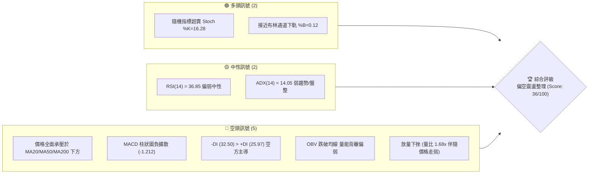
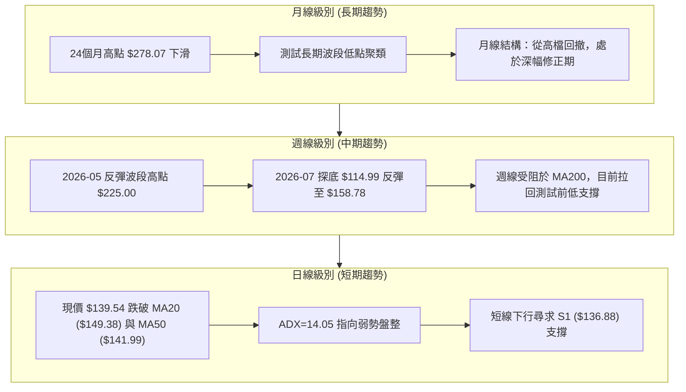
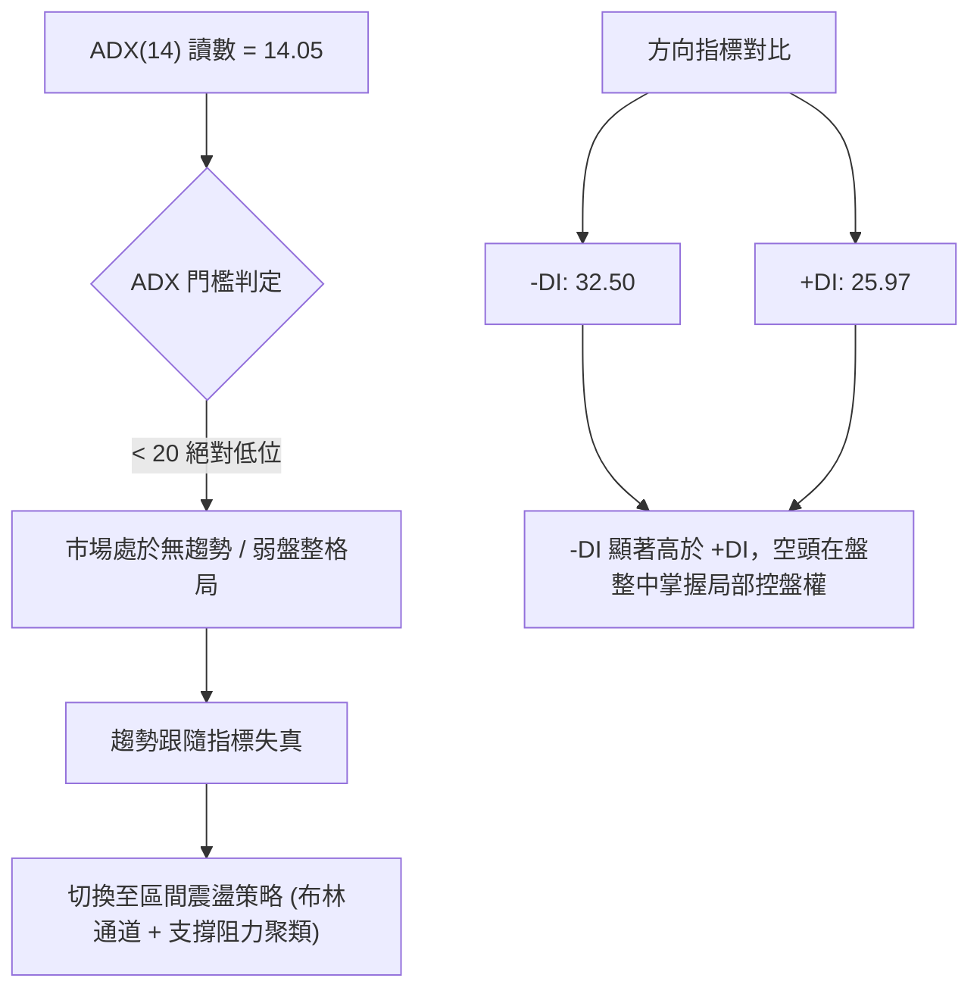
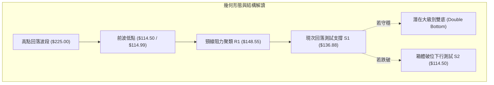
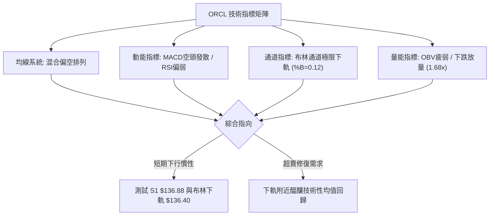
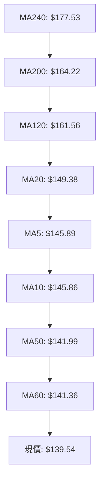
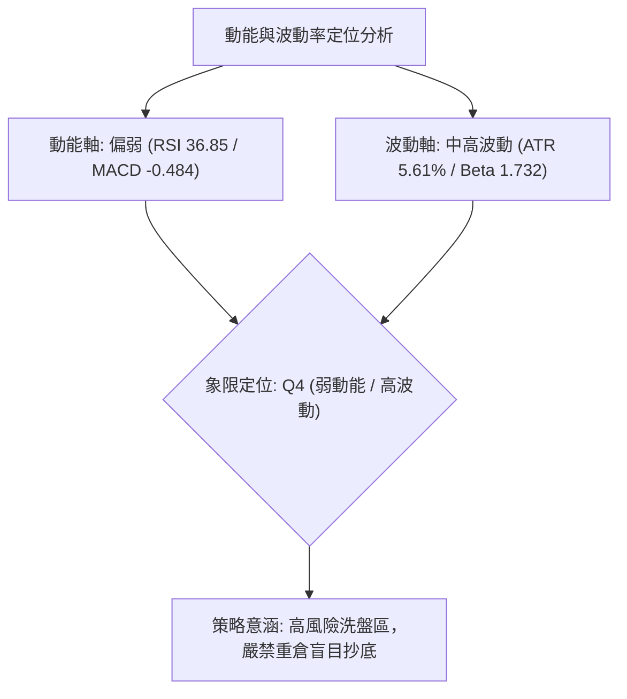
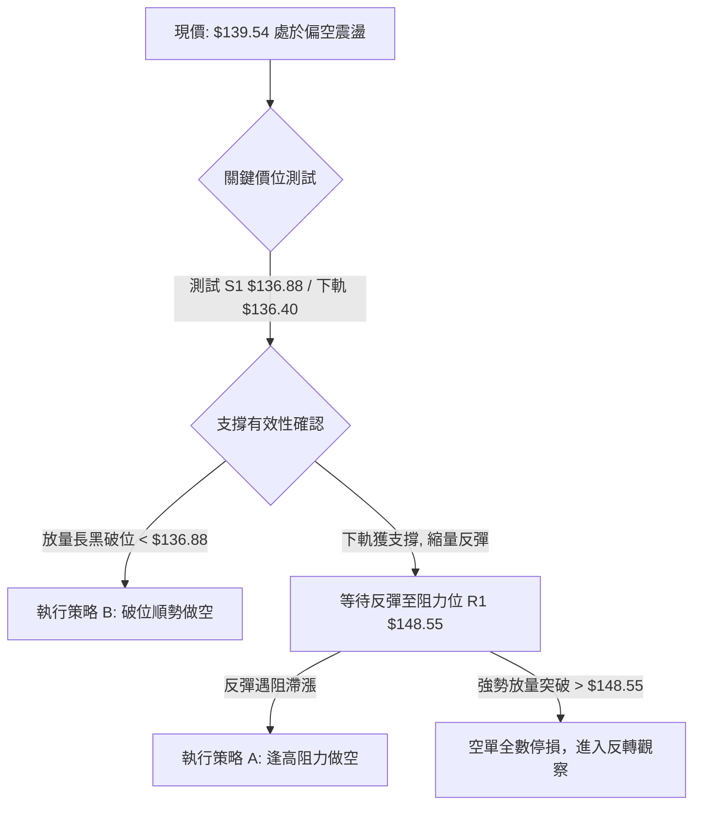
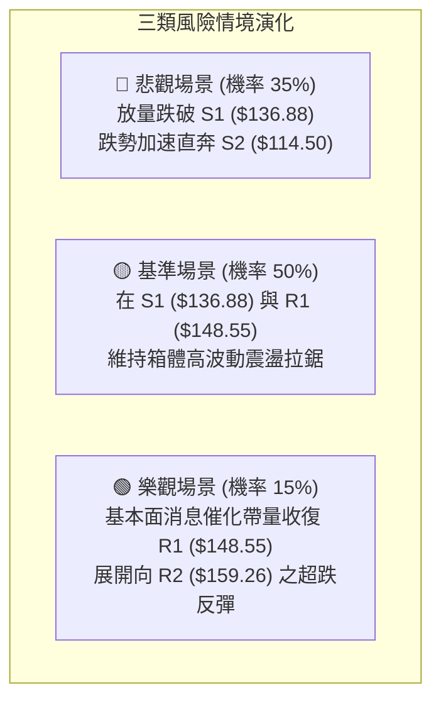

# ORCL 技術分析報告

> **報告日期**：2026-09-25 ｜ **語言**：繁體中文 ｜ **數據來源**：Yahoo Finance ｜ **當前價格**：$139.54

---

## 目錄

| 章節 | 內容 |
|------|------|
| [1. 技術面概覽](#1-技術面概覽) | 訊號儀表板、核心指標、評分卡 |
| [2. 趨勢分析](#2-趨勢分析) | 多時框趨勢、長中短期走勢 |
| [3. 圖表形態分析](#3-圖表形態分析) | 形態識別、K線組合、目標價 |
| [4. 支撐與阻力](#4-支撐與阻力) | 關鍵價位、斐波那契回調 |
| [5. 技術指標深度解讀](#5-技術指標深度解讀) | MA/RSI/MACD/布林/成交量 |
| [6. 動能與波動率](#6-動能與波動率) | 動能評估、ATR、Beta |
| [7. 多時框架總結](#7-多時框架總結) | 時框架評分矩陣、收斂結論 |
| [8. 交易策略建議](#8-交易策略建議) | 多空策略、風險報酬比、情境階梯 |
| [9. 風險提示與監控](#9-風險提示與監控) | 監控指標、風險場景、部位管理 |

---

## 1. 技術面概覽

### 🎯 技術訊號儀表板



### 📊 核心指標速覽表

| 指標類別 | 指標名稱 | 當前數值 | 訊號 | 解讀 |
|----------|----------|----------|------|------|
| **價格** | 當前價格 | $139.54 | 🔴 | 位於 52 週區間 12.2% 低分位，空方壓制明確 |
| **均線** | MA20 | $149.38 | 🔴 | 現價低於 MA20 達 -6.59%，短期反彈壓力沉重 |
| **均線** | MA50 | $141.99 | 🔴 | 現價低於 MA50 達 -1.73%，中期多空分水嶺失守 |
| **均線** | MA200 | $164.22 | 🔴 | 現價低於 MA200 達 -15.03%，長期牛熊分界線失守 |
| **動能** | RSI(14) | 36.85 | 🟡 | 進入弱勢區間（30–40），尚未進入極端超賣 |
| **動能** | MACD | -0.484 | 🔴 | DIF 線小於 Signal 線 (0.727)，柱狀圖為 -1.212 |
| **趨勢** | ADX(14) | 14.05 | 🟡 | ADX < 25 處於無序震盪/盤整格局，非強單邊行情 |
| **通道** | 布林 %B | 0.12 | 🟡 | 緊貼布林下軌（$136.40），具備均值回歸修復需求 |
| **量能** | 成交量比 | 1.68x | 🔴 | 今日成交量 56.50M 高於 20MA，下跌放量反映拋壓 |
| **波動** | ATR(14) | $7.82 | 🔴 | 佔股價 5.61%，處於相對高波動區間，洗盤風險高 |

### 🏆 技術評分卡

```
╔══════════════════════════════════════════════════════════════╗
║              技術評分卡 — ORCL (2026-09-25)                  ║
╠══════════════════════════════════════════════════════════════╣
║ 趨勢強度      ██████░░░░░░░░░░░░░░  30/100  🔴 空頭壓制      ║
║ 動能指標      ███████░░░░░░░░░░░░░  35/100  🔴 負向加速      ║
║ 支撐穩定度    █████████░░░░░░░░░░░  45/100  🟡 臨近S1考驗    ║
║ 成交量配合    ███████░░░░░░░░░░░░░  35/100  🔴 放量下跌      ║
║ 形態完整度    ████████░░░░░░░░░░░░  40/100  🟡 區間下尋底    ║
║ 均線排列      ██████░░░░░░░░░░░░░░  30/100  🔴 空頭混合排列  ║
╠══════════════════════════════════════════════════════════════╣
║ 綜合評分      ███████░░░░░░░░░░░░░  36/100  🔴 偏空震盪 (BEAR)║
╚══════════════════════════════════════════════════════════════╝
```

---

## 2. 趨勢分析

### 🌐 多時框趨勢分析



### 📈 長期趨勢 — 12個月走勢圖（Unicode）

```
ORCL 月線走勢圖（過去12個月：2025-10 至 2026-09）
價格軸 ($)
$270 ┤●(2025-10: $260.10)
$240 ┤
$225 ┤                                    ●(2026-05: $225.00)
$210 ┤
$195 ┤      ●(2025-11: $200.02)
$180 ┤            ●(2025-12: $193.05)
$165 ┤                  ●(2026-01: $163.44)
$150 ┤                        ●     ●           ●     ●(2026-08: $149.12)
$135 ┤                                    ●←現在($139.54)
$120 ┤                                          ●(2026-07: $129.87)
     └─────────────────────────────────────────────────────────────
       10    11    12    01    02    03    04    05    06    07    08    09 (月份)
```

#### 走勢特徵分析表格

| 階段區間 | 時間跨度 | 起訖收盤價 | 漲跌幅 | 走勢特徵與結構解讀 |
|----------|----------|------------|--------|--------------------|
| 第一階段：高檔崩落 | 2025-10 ~ 2026-02 | $260.10 → $144.39 | -44.49% | 主跌浪展開，成交量連續釋出，失守多道整數關卡 |
| 第二階段：低檔築底 | 2026-02 ~ 2026-04 | $144.39 → $160.83 | +11.39% | 於 $144–$146 區間建立防禦底，縮量橫盤整理 |
| 第三階段：強烈反抽 | 2026-04 ~ 2026-05 | $160.83 → $225.00 | +39.90% | 軋空式反彈，逼近 50% 斐波那契回調位後動能耗盡 |
| 第四階段：二次探底 | 2026-05 ~ 2026-07 | $225.00 → $129.87 | -42.28% | 快速回吐，2026-07-26 當週創出 52 週低點聚類 $114.99 |
| 第五階段：震盪修復 | 2026-07 ~ 2026-09 | $129.87 → $139.54 | +7.45% | 反彈至 $158.78 後再次承壓回落，進入區間築底拉鋸 |

### 📊 中期趨勢（週線分析）

從近 20 週數據觀察，ORCL 在 2026-05-31 衝高至 $225.00 後迅速潰退，週線 RSI 一度於 2026-06-28 探至 11.1 極度超賣區。隨後於 2026-07-26 觸及 $114.99 後展開技術性反彈，週線 RSI 於 2026-08-16 攀升至 74.6 高點，但 MACD 柱狀圖在 2026-09-06 後再次翻黑（由 +0.911 轉為當前 -1.212），週收盤價由 $158.78 連續 3 週收黑至 $139.54。這確立了中期反彈宣告結束，重回下降區間震盪結構。

### ⚡ 趨勢強度評估（ADX 解讀）



| 指標變數 | 當前讀數 | 狀態門檻 | 技術面解讀 |
|----------|----------|----------|------------|
| **ADX(14)** | **14.05** | < 20 (極弱) | 行情不具備單邊持續性趨勢，禁止追高殺跌，以邊界思維操作 |
| **+DI(14)** | **25.97** | 中等 | 多頭動能衰退，反彈未能引發趨勢突破 |
| **-DI(14)** | **32.50** | 偏強 | 空頭控盤力量佔優，下行尋求支撐為阻力最小路徑 |
| **趨勢結論** | **弱勢震盪** | ADX < 25 | 依照多時框收斂規則，以日線布林通道上下軌為核心波動區間 |

---

## 3. 圖表形態分析

### 🔍 形態識別系統



#### 形態識別信心度與參數表

| 形態類別 | 信心度 | 判斷依據（嚴格引用數據） | 完成度 | 目標價（附嚴格計算式） |
|----------|--------|--------------------------|--------|------------------------|
| **潛在雙重底結構 (Double Bottom)** | 55% | 2026-07 低點 $114.50 確立為第一底，當前股價自阻力位 R1 ($148.55) 回檔，正測試 S1 ($136.88)。若能守穩，形態成立 | 45% (頸線未突破) | 頸線 R1 ($148.55) + 形態高度 ($148.55 - $114.50 = $34.05) = **$182.60**（註：未突破前僅為理論推演） |
| **布林通道下軌弱勢收斂** | 80% | 現價 $139.54，BB下軌 $136.40，BB%B 為 0.12，價格由中軌（$149.38）滑落至下軌尋求邊界支撐 | 85% | 下軌反彈中軌目標：**$149.38** (MA20) |
| **頭肩頂形態** | 20% | 數據中左肩與頭部結構對稱性不足，缺乏有效成交量支持 | 未成形 | 訊號不足，僅做指標型解讀，不預設該形態 |

### 🕯️ 重要K線形態分析

| 日期 / 週別 | 收盤價 | RSI | MACD柱 | 週成交量 | K線與量價形態解讀 | 訊號 |
|-------------|--------|-----|--------|----------|-------------------|------|
| 2026-08-16 | $150.52 | 74.6 | +3.853 | 144.23M | 超買區長上影陽線，衝高受阻於阻力帶下方 | 🟡 警示 |
| 2026-08-30 | $150.85 | 49.8 | +0.811 | 93.97M | 量縮十字星，多空動能於 MA20 處劇烈分歧 | 🟡 觀望 |
| 2026-09-06 | $158.78 | 61.5 | +0.911 | 115.08M | 波段高點反彈遇阻 R2 ($159.26)，形成波段高點聚類 | 🔴 假突破 |
| 2026-09-13 | $150.28 | 53.3 | +0.462 | 202.39M | 爆量長黑K跌破 MA20，機構換手拋壓沉重 | 🔴 轉弱 |
| 2026-09-20 | $147.61 | 47.5 | -0.933 | 175.15M | 連續黑K破位，MACD 柱狀圖正式翻負 | 🔴 空方延續 |
| 2026-09-27 | $139.54 | 36.8 | -1.212 | 132.86M | 大陰線收跌，直逼布林下軌及 S1 ($136.88) | 🔴 空方主導 |

### 📉 ASCII 走勢形態示意圖

```
ORCL 近期震盪箱體與潛在底結構示意圖
價格
$165.00 ┤                                     [R3: $164.24 / MA200]
$160.00 ┤                         ▲ 高點 ($158.78, 逼近 R2: $159.26)
$155.00 ┤                        ╱ ╲
$150.00 ┤        頸線聚類 ───────╱───╲────── [R1: $148.55 / MA20: $149.38]
$145.00 ┤                      ╱       ╲   ▼
$140.00 ┤                     ╱         ╲ █ 現價: $139.54
$135.00 ┤                    ╱           ▼───── [S1: $136.88 / BB下軌: $136.40]
$130.00 ┤           ▲       ╱             (多頭最後防線)
$125.00 ┤          ╱ ╲     ╱
$120.00 ┤         ╱   ╲   ╱
$115.00 ┤ ───────▼─────▼─ 底部形成區 [S2: $114.50]
        └───────────────────────────────────────────────
         2026-07        2026-08        2026-09
```

---

## 4. 支撐與阻力

### 🗺️ 關鍵價位分布圖（Unicode）

```
ORCL 價位結構分布圖
═══════════════════════════════════════════════════════════════
$164.24 ║██████████████████████████████║ 強阻力 R3 (年線 MA200 聚類)
$159.26 ║████████████████████          ║ 阻力 R2 (近期波段反彈高點聚類)
$148.55 ║████████████████████████████  ║ 關鍵阻力 R1 (MA20 / 頸線聚類)
$139.54 ╠══════════════════════════════╣ ◄ 現價 ($139.54)
$136.88 ║▓▓▓▓▓▓▓▓▓▓▓▓▓▓▓▓▓▓▓▓          ║ 近期核心支撐 S1 (布林下軌重疊)
$114.50 ║██████████████████████████████║ 歷史強支撐 S2 (52W 最低點)
═══════════════════════════════════════════════════════════════
```

### 🚧 阻力位分析表

所有數值均嚴格依據技術數據中「關鍵價位（由 OHLCV 計算）」之波段高點聚類數值：

| 阻力級別 | 價位 | 距現價幅動 | 形成原因與技術共振 | 突破難度 | 重要性 |
|----------|------|------------|--------------------|----------|--------|
| **R1** | **$148.55** | +6.46% | 近一年波段高點聚類，與布林中軌 MA20 ($149.38) 高度重合 | 🟡 中等偏高 | ★★★★☆ |
| **R2** | **$159.26** | +14.13% | 2026-09-06 週線衝高回落高點聚類 ($158.78~$159.26)，籌碼套牢區 | 🔴 極高 | ★★★★★ |
| **R3** | **$164.24** | +17.70% | 長期牛熊分水嶺 MA200 ($164.22) 共振處，強烈趨勢轉折阻力 | 🔴 難以逾越 | ★★★★★ |

### 🛡️ 支撐位分析表

所有數值均嚴格依據技術數據中「關鍵價位（由 OHLCV 計算）」之波段低點聚類數值：

| 支撐級別 | 價位 | 距現價幅動 | 形成原因與技術共振 | 守住機率 | 重要性 |
|----------|------|------------|--------------------|----------|--------|
| **S1** | **$136.88** | -1.90% | 近一年波段低點聚類，與日線布林下軌 ($136.40) 形成密集緩衝帶 | 🟡 60% | ★★★★☆ |
| **S2** | **$114.50** | -17.94% | 52 週最低點 ($114.50)，2026-07 極端拋售終點，年度終極防線 | 🟢 85% | ★★★★★ |
| **S3** | 數據中未偵測到 | — | 原數據庫中無第三層級支撐紀錄，嚴格依紀律不予編造 | — | — |

### 📐 斐波那契回調位分析

依據 52 週極端區間（低點 $114.50 至 高點 $319.46，垂直落差 $204.96）精確對應：

```
斐波那契回調層級分布 (52W High $319.46 → 52W Low $114.50)
0.0%  (52W High) ─── $319.46  (歷史頂部)
23.6%            ─── $271.09  (弱回撤位)
38.2%            ─── $241.16  (初級反彈阻力)
50.0%            ─── $216.98  (多空均勻分割，2026-05 反彈頂點 $225.00 處)
61.8%            ─── $192.79  (黃金分割關鍵位，2026-05 週收盤平台)
78.6%            ─── $158.36  (深度回撤阻力，與近期高點 $158.78 及 R2 $159.26 共振)
═══════════════════════════════════════════════════════════════
[現價區間]       ─── $139.54  (位於 78.6% 與 100.0% 之間，極度弱勢區)
═══════════════════════════════════════════════════════════════
100.0% (52W Low) ─── $114.50  (年度低點支撐 S2)
```

**斐波那契結構解讀**：
當前 ORCL 股價 ($139.54) 運行於 78.6% 回調位 ($158.36) 與 100.0% 底部位 ($114.50) 之間。78.6% 回調位通常為多頭牛市結構的最後防線，跌破此位置意味著股價已全面進入「深度價值修復」或「長週期築底」階段。近期的波段反彈高點 $158.78 正好精確受阻於 78.6% ($158.36)，驗證了該斐波那契水平具備極強的拋壓效應。若 S1 ($136.88) 失守，下方唯一的斐波那契支撐就是 100% 水平的 $114.50。

---

## 5. 技術指標深度解讀

### 🎛️ 指標訊號總覽



### 📈 移動平均線排列分析



#### 均線系統數據詳解

| 均線名稱 | 數值 | 距現價差距 (%) | 方向與斜率 | 訊號狀態 | 技術意涵 |
|----------|------|----------------|------------|----------|----------|
| **MA5** | $145.89 | -4.36% | 下行 (▼) | 🔴 空頭 | 超短期下壓極重，5日扣抵高價 |
| **MA10** | $145.86 | -4.34% | 下行 (▼) | 🔴 空頭 | 與 MA5 形成短線死亡交叉聚集 |
| **MA20** | $149.38 | -6.59% | 下行 (▼) | 🔴 空頭 | 月線級別反壓，短期反彈第一阻力目標 |
| **MA50** | $141.99 | -1.73% | 下行 (▼) | 🔴 空頭 | 季線剛剛失守，多頭中線防線失陷 |
| **MA60** | $141.36 | -1.29% | 下行 (▼) | 🔴 空頭 | 與 MA50 形成黏合後向下發散 |
| **MA120** | $161.56 | -13.63% | 下行 (▼) | 🔴 空頭 | 半年線持續沉重下壓 |
| **MA200** | $164.22 | -15.03% | 下行 (▼) | 🔴 空頭 | 年線牛熊分水嶺，宣告長期下行通道確立 |
| **MA240** | $177.53 | -21.40% | 下行 (▼) | 🔴 空頭 | 長週期成本線遠在上方 |

**均線排列結論**：均線呈現標準的「價格在所有長短期均線下方」之弱勢格局。現價 $139.54 已全數摜破短期（MA5/10/20）、中期（MA50/60）與長期（MA120/200/240）均線，均線排列為空頭混合排列，任何反彈均將面臨層層扣壓。

### 📉 RSI(14) 分析

```
RSI(14) 讀數：36.85
0 ──────────── 30 ────────────────────── 70 ─────────── 100
░░░░░░░░░░░░░░░███████░░░░░░░░░░░░░░░░░░░░░░░░░░░░░░░░░░░░
               ▲ (36.85) 偏弱中性區間
```

- **當前數值**：36.85，低於中軸 50，尚未進入 ≤30 的極端超賣區。
- **超買超賣評估**：隨機指標 Stoch %K (16.28) / %D (22.00) 已率先進入極度超賣區，但 RSI(14) 仍有下行空間，顯示空頭下探動能尚未完全釋放殆盡。
- **背離分析**：
  - **頂背離判定**：2026-08-16 週線高點 $150.52 時 RSI 達 74.6，隨後 2026-09-06 價格創新高至 $158.78 時，週線 RSI 僅為 61.5，呈現標準**週線級別頂背離**，該頂背離直接引發了隨後連續 3 週的重挫。
  - **底背離判定**：目前日線與週線均**無明顯底背離**跡象（價格下跌，指標同步走低），暗示當前不宜過早猜底。

### 📊 MACD(12, 26, 9) 訊號解讀


- **MACD 線數值**：-0.484，已落入零軸下方。
- **訊號線數值**：0.727，在零軸上方調頭向下。
- **柱狀圖（Histogram）**：-1.212，負向數值顯著放大（從前一週的 -0.933 進一步惡化至 -1.212）。
- **技術解讀**：MACD 出現雙線高位死叉後的「零軸下沉」走勢，柱狀圖持續拉長，表明中短期做空動能正在釋放主跌浪段，目前沒有任何止跌金叉前兆。

### 📦 布林通道分析

```
ORCL 布林通道結構 (BB 20, 2)
$162.35 ┬────────────────────────────────────────── BB 上軌
        │
$149.38 ┼─ ─ ─ ─ ─ ─ ─ ─ ─ ─ ─ ─ ─ ─ ─ ─ ─ ─ ─ ─ ─ BB 中軌 (MA20)
        │
$139.54 ┼─────────● 現價 (BB %B = 0.12)
$136.40 ┴────────────────────────────────────────── BB 下軌
```

- **通道帶寬**：上軌 $162.35，中軌 $149.38，下軌 $136.40。帶寬空間為 $25.95（約 17.3%）。
- **當前位置**：%B = 0.12，極度逼近下軌（0 代表下軌，$136.40；現價 $139.54 僅距下軌 $3.14）。
- **帶寬形態**：布林帶未出現劇烈單邊擴軌（與 ADX=14.05 呼應），仍處於收斂後的弱勢滑移狀態。這意味著股價在下探 $136.40–$136.88 區域時，容易遭遇通道邊界引發的技術性均值回歸彈升。

### 💹 成交量分析（量價配合度）

- **最新成交量**：56,498,300 股。
- **均量對比**：相對於 20 日均量（33,676,450 股），量比達到 **1.68x**；相對於 50 日均量（31,176,848 股），達到 **1.81x**。
- **量價關係**：收盤大跌伴隨 1.68 倍放量，顯示市場存在機構級被動止損單或主動拋盤。
- **OBV 能量潮**：OBV 持續運行於其均線下方（OBV < MA），代表資金呈淨流出狀態，量能無法確認任何多頭反轉假說，確認目前走勢屬於弱勢修正。

---

## 6. 動能與波動率

### ⚡ 動能評估四象限



| 象限 | 動能狀態 | 波動狀態 | 當前符合 | 戰略應對方針 |
|------|----------|----------|----------|--------------|
| **Q1 (最佳機會)** | 強動能 (多頭) | 低波動 | 否 | 順勢加碼，持股待漲 |
| **Q2 (謹慎觀望)** | 弱動能 (盤整) | 低波動 | 否 | 區間高拋低吸，收斂三角形操作 |
| **Q3 (高風險收益)**| 強動能 (單邊) | 高波動 | 否 | 緊設移動止損，博取主升/主跌浪 |
| **Q4 (避免進場)** | **弱動能 (空方)** | **高波動** | **✓ (當前)** | **防禦至上，減少交易頻率，僅在關鍵邊界輕倉防守** |

### 📊 ATR 波動率分析

- **ATR(14) 數值**：**$7.82**。
- **價格百分比**：佔現價比率為 **5.61%**。
- **波動特性**：每日潛在價格擺動幅度接近 8 美元，這解釋了為何近幾週 ORCL 呈現巨幅週K線拉鋸。
- **止損距離建議**：
  - **日內/極短線**：0.75 × ATR = **$5.86**
  - **波段交易（Swing Trade）**：1.5 × ATR = **$11.73**
  - **中長線防守**：2.0 × ATR = **$15.64**
  - **風控指引**：在 $7.82 的高日波幅下，支撐位 S1 ($136.88) 距現價僅 $2.66，不足 0.5 個 ATR，意味著 S1 在日內常態波動中極易被「毛刺」（False Breakout）刺穿，交易者必須採用收盤價確認原則。

### 📐 Beta 與市場相關性

- **Beta 係數**：**1.732**。
- **系統性風險特徵**：ORCL 具備極高的市場彈性（High-Beta 科技權值股）。當大盤（S&P 500 / 納斯達克）下跌 1% 時，ORCL 統計上將擴大下跌 1.73%；反之亦然。當前其負向動能疊加 1.732 的高 Beta，使得個股在市場情緒轉弱時跌幅加劇。

---

## 7. 多時框架總結

### 📋 時框架評分表

| 時框架 | 趨勢方向 | 動能狀態 | 均線排列 | 關鍵形態 | 綜合評分 | 操作建議 |
|--------|----------|----------|----------|----------|----------|----------|
| **月線 (長期)** | 🔴 深度修正 | 🟡 中性減弱 | 混合偏空 (失守MA20) | 自 $278.07 構築長週期回調 | 40/100 | 長線資金暫停左側抄底 |
| **週線 (中期)** | 🔴 反彈夭折 | 🔴 空方擴散 (MACD柱翻黑) | 空頭排列 (承壓MA200) | $158.78 阻力受挫，二次探底 | 35/100 | 反彈逢高減磅，防守前低 |
| **日線 (短期)** | 🔴 弱勢下探 | 🟡 逼近超賣 (Stoch超賣) | 混合空排 (全破均線) | 直逼布林下軌及 S1 | 38/100 | 嚴禁追空，等待 S1 測試反應 |

### 🔲 綜合訊號矩陣

```
訊號維度矩陣檢驗 (Confluence Matrix)
┌──────────────┬──────────────┬──────────────┬──────────────┐
│  分析維度    │   短期 (日)   │   中期 (週)   │   長期 (月)   │
├──────────────┼──────────────┼──────────────┼──────────────┤
│ 趨勢架構     │   🔴 看空    │   🔴 看空    │   🟡 偏空    │
│ 均線系統     │   🔴 破位    │   🔴 壓制    │   🔴 跌破    │
│ 動能指標     │   🟡 超賣醞釀│   🔴 負加速  │   🟡 趨弱    │
│ 量能配合     │   🔴 放量下挫│   🔴 資金流出│   🔴 OBV走弱 │
│ 邊界支撐     │   🟢 逼近下軌│   🟡 測試S1  │   🟢 S2強防線│
└──────────────┴──────────────┴──────────────┴──────────────┘
```

### ⚖️ 多時框收斂結論

依據多時框收斂優先級規則：
1. **行情性質判定**：當前 ADX(14) 讀數為 **14.05**，遠低於 25 的趨勢門檻，確立當前市場本質為**無強單邊趨勢的「弱勢區間震盪／盤整行情」**。
2. **時框優先收斂**：在 ADX < 25 的盤整結構中，日線布林通道上下軌（$136.40 – $162.35）及關鍵聚類水平（S1: $136.88 / R1: $148.55）構成主導交易區間；週線與月線的空頭壓力則界定了該震盪的「上行天花板」。
3. **唯一方向性結論**：**【偏空震盪，下探邊界尋求支撐】**。
   股價短期下行慣性強烈，但因逼近布林下軌（$136.40）與 S1（$136.88），且隨機指標已呈現超賣，向下空間受邊界抑制。主策略遵循技術評分卡（36/100），以**逢高放空或跌破順勢空為核心基調**，但在下軌支撐區嚴禁直接殺跌。

---

## 8. 交易策略建議

### 🗺️ 策略決策流程圖



### 🧭 策略路由（依評分卡分流）

> **當前主策略方向 = 主推空頭策略（防守型），反彈逢高布局空單為主（依綜合評分 36/100 ≤ 40 偏空標準）**

由於評分為 36/100，技術面由空方主導，多頭僅列為短線反彈的交易者個人風控提示，不作為機構級主要推薦策略。

### 🎯 價格情境階梯（Price Scenarios）

所有價位均嚴格引用第 4 章關鍵價位數據：

| 觸發條件 | 下一目標 | 後續延伸 | 情境含義與技術解讀 |
|----------|----------|----------|--------------------|
| **向上突破 R1 $148.55** | R2 $159.26 | R3 $164.24 | 短線轉強，突破布林中軌 MA20，空頭結構暫時緩解 |
| **受阻於現價區間至 R1** | S1 $136.88 | — | 弱勢震盪，均線反壓沉重，維持弱勢拉鋸 |
| **有效跌破 S1 $136.88** | S2 $114.50 | 數據中未偵測到 | 中期徹底破位，展開新一輪主跌浪，直奔 52 週低點 |

### 📊 情境機率分佈

| 情境劇本 | 機率 | 主要技術依據 |
|----------|------|--------------|
| **弱勢區間震盪（S1 至 R1 區間拉鋸）** | **50%** | ADX=14.05 表明缺乏單邊持續性，布林下軌 $136.40 與 S1 $136.88 提供短線緩衝 |
| **跌破 S1 回落再探底（測試 S2 $114.50）** | **35%** | MACD 柱狀圖放大至 -1.212，量比 1.68x 放量下跌，-DI (32.50) 壓制 |
| **強勢反彈反轉（向上突破 R1 $148.55）** | **15%** | 目前均線全面空排，OBV 疲弱無主力回流跡象，V型反轉難度極高 |

### 🔴 主策略詳情（方向：主推空頭策略）

嚴格採用技術數據聚類價位：

| 策略要素 | 策略 A（主推：反彈遇阻做空） | 策略 B（次選：跌破支撐追空） |
|----------|------------------------------|------------------------------|
| **進場條件** | 反彈至 R1 頸線與 MA20 聚類區滯漲收黑K | 日線收盤價有效跌破支撐位 S1 |
| **進場價格** | **$148.55**（掛單或右側確認） | **$136.88**（破位觸發） |
| **目標價 T1** | **$139.54**（現價區域） | **$129.87**（2026-07 平台低點） |
| **目標價 T2** | **$136.88**（S1 支撐位） | **$114.50**（S2 強支撐/52W低點） |
| **止損價格** | **$154.41**（進場價 + 0.75 ATR: $5.86） | **$142.74**（S1 上方 + 0.75 ATR: $5.86） |
| **風險報酬比** | **1 : 1.99** (獲利空間 $11.67 / 風險 $5.86) | **1 : 3.82** (獲利空間 $22.38 / 風險 $5.86) |
| **成功機率** | **65%** | **55%** |
| **建議倉位** | **總資金 8% - 10%** | **總資金 5% - 7%** |

### 🟢 反向風險觸發點（對沖與停損提示）

若出現以下訊號，空頭主策略宣告失效，應全面撤出空單或轉向多頭避險：
1. **價格強勢站穩 R1 ($148.55)**：若日K線以大陽線收於 $148.55 之上，代表 MA20 壓力被有效化解，可能形成雙底右側頸線突破。
2. **MACD 零軸下黃金交叉且柱狀圖翻正**：出現底背離金叉時，必須立即平倉對沖。
3. **成交量突破 5,000 萬股並收出吞噬長紅K**：視為主動買盤進場逆轉。

### ⭐ 整體訊號強度評星

```
╔════════════════════════════════════════════════╗
║ 做多訊號強度：★☆☆☆☆  (1.5/5 星) — 僅超賣支撐  ║
║ 做空訊號強度：★★★★☆  (4.0/5 星) — 均線動能壓制║
║ 整體可信度：  ★★★★☆  (4.0/5 星) — 多指標共振  ║
╚════════════════════════════════════════════════╝
```

---

## 9. 風險提示與監控

### ✅ 關鍵監控指標 Checklist

```
╔══════════════════════════════════════════════════════════════╗
║                   每日交易監控清單 (Checklist)               ║
╠══════════════════════════════════════════════════════════════╣
║ [ ] 價格是否觸及或跌破 S1: $136.88（收盤價確認）             ║
║ [ ] 布林通道帶寬是否開始向外劇烈張開（帶動 ADX 升破 20）      ║
║ [ ] MACD Histogram 負值是否收斂（數值由 -1.212 回升向 0）    ║
║ [ ] 成交量是否異常萎縮至 2,500 萬股以下（拋壓衰竭訊號）       ║
║ [ ] RSI(14) 是否貫穿 30 進入深度超賣區引發急跌反抽           ║
║ [ ] 阻力位 R1: $148.55 與 MA20 ($149.38) 的反彈測試結果      ║
╚══════════════════════════════════════════════════════════════╝
```

### ⚠️ 風險場景分析



### 🛡️ 風險管理重要提醒

1. **ATR 劇烈波動下的部位折算**：
   ORCL 當前 ATR 高達 **$7.82**（5.61%），屬於高波動權值標的。在單筆交易最大承擔帳戶淨值 1% 風險的原則下：
   $$\text{部位規模} = \frac{\text{總資本} \times 1\%}{\text{止損距離 } (\$5.86)}$$
   以 10 萬美元帳戶為例，單筆最大虧損額為 1,000 美元，可建立之最大部位僅為約 170 股（約 23,700 美元曝險），嚴禁使用固定大口數重倉交易。
2. **財報與外生事件風險**：
   儘管技術面呈現空方壓制，但 41 位分析師給出的共識目標均價為 **$237.97**（高達 +70% 溢價），且近期 10 家機構評級均維持 Buy 或 Outperform。這種**「極端弱勢的技術面」與「極端看多的基本面共識」之嚴重脫節**，往往意味著一旦出現超預期的利多催化劑（如雲端業務超預期），極易引發劇烈的無預警「軋空跳空」（Short Squeeze），因此空頭交易者必須嚴格執行 $154.41 之停損紀律。

---

## 📋 報告總結

```
╔══════════════════════════════════════════════════════════════╗
║               ORCL 技術分析報告總結 (Executive Summary)      ║
╠══════════════════════════════════════════════════════════════╣
║ 報告日期：2026-09-25                                         ║
║ 當前價格：$139.54                                            ║
║ 分析評級：🔴 偏空震盪整理 (綜合評分: 36/100)                 ║
║                                                              ║
║ 關鍵結構結論：                                               ║
║ ├─ 長期趨勢：🔴 跌破牛熊分水嶺 MA200 ($164.22)，處於修正期   ║
║ ├─ 中期趨勢：🔴 週線 MACD 負擴散，反彈夭折回測前低          ║
║ ├─ 短期趨勢：🟡 ADX=14.05 指向弱勢震盪，逼近布林下軌 $136.40║
║ ├─ 關鍵支撐：S1: $136.88 ｜ S2: $114.50 (52W最低點)          ║
║ ├─ 關鍵阻力：R1: $148.55 ｜ R2: $159.26 ｜ R3: $164.24       ║
║ └─ 斐波那契：運行於 78.6% ($158.36) 與 100.0% ($114.50) 弱勢區║
║                                                              ║
║ 最優策略組合：                                               ║
║ 1. 🥇 最佳機會：等待反彈至 R1 ($148.55) 遇阻，建立空頭部位   ║
║ 2. 🥈 次選機會：跌破 S1 ($136.88) 後，右側順勢跟進做空至 S2  ║
║ 3. 🥉 保守選擇：空手觀望，靜待 S1 ($136.88) 日線收盤止跌訊號 ║
╚══════════════════════════════════════════════════════════════╝
```

---

> ⚠️ **免責聲明**：本報告為依據量化技術指標與價格數據生成之專業技術分析，所有數據及支撐阻力計算均基於歷史價格與客觀模型。本報告**僅供研究與學術參考**，**不構成任何形式的要約、招攬或投資建議**。市場具有高度不確定性，金融交易存在重大虧損風險，投資人應獨立評估財務狀況並自負盈虧。

---

*報告生成時間：2026-09-25 ｜ 數據來源：Yahoo Finance ｜ 分析框架：多時框技術分析體系 (MTFA)*