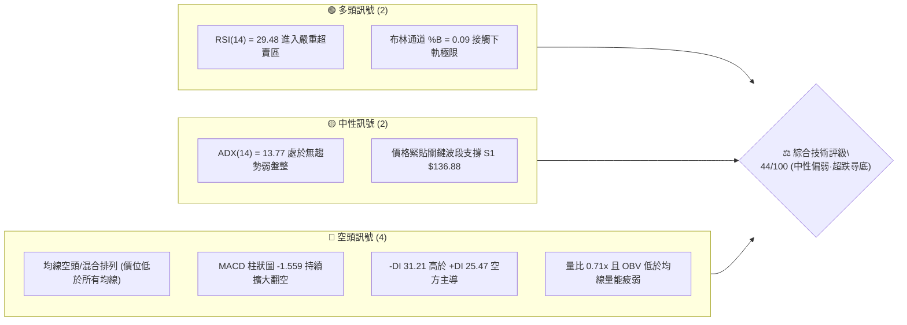
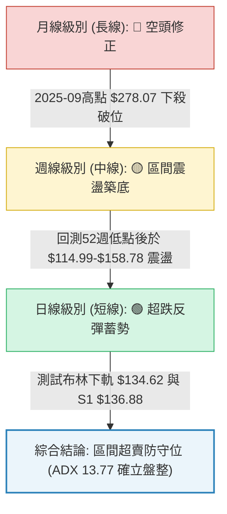
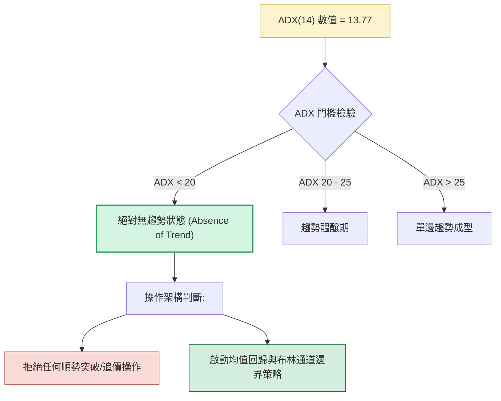
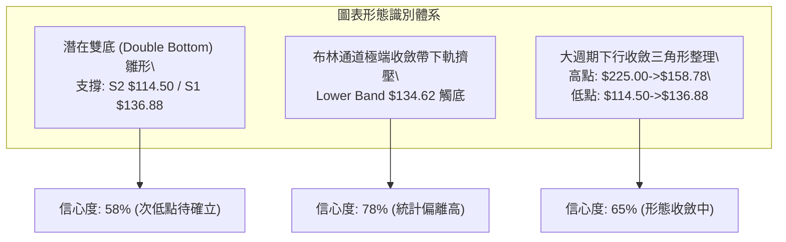
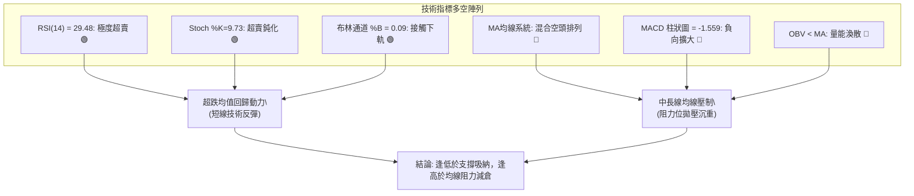
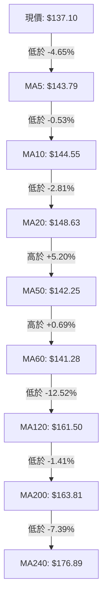
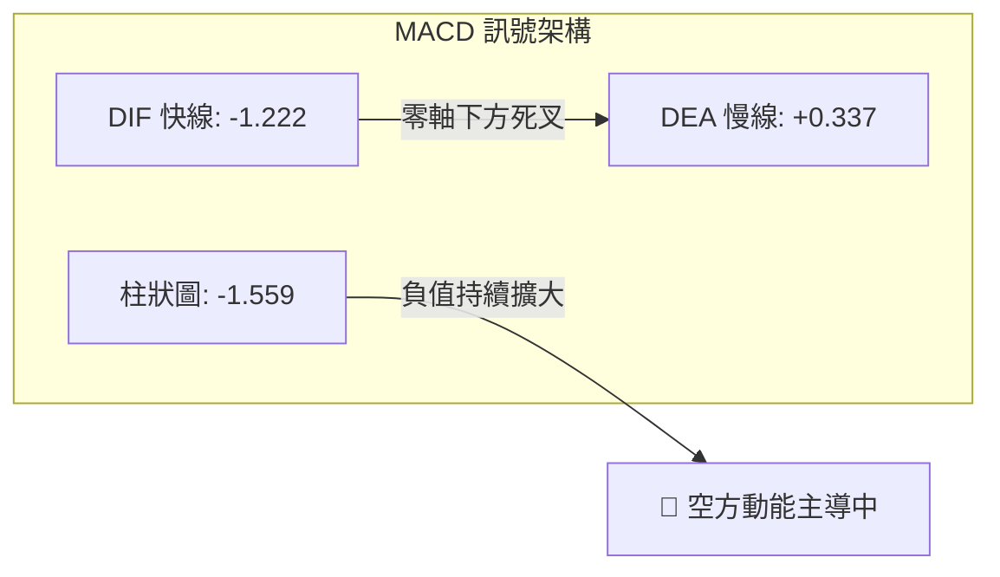
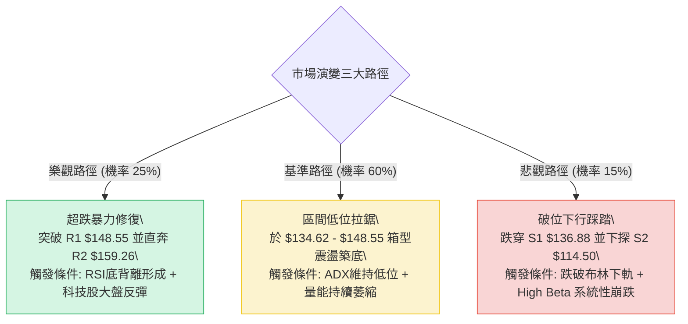

# ORCL 技術分析報告

> **報告日期**：2026-09-27 ｜ **語言**：繁體中文 ｜ **數據來源**：Yahoo Finance ｜ **當前價格**：$137.10

---

## 目錄

| 章節 | 內容 |
|------|------|
| [1. 技術面概覽](#1-技術面概覽) | 訊號儀表板、核心指標、評分卡 |
| [2. 趨勢分析](#2-趨勢分析) | 多時框趨勢、長中短期走勢、ADX 解讀 |
| [3. 圖表形態分析](#3-圖表形態分析) | 形態識別、信心度評估、K線組合 |
| [4. 支撐與阻力](#4-支撐與阻力) | 關鍵價位、斐波那契回調結構 |
| [5. 技術指標深度解讀](#5-技術指標深度解讀) | MA/RSI/MACD/布林通道/成交量 |
| [6. 動能與波動率](#6-動能與波動率) | 動能四象限、ATR 止損、Beta 敏感度 |
| [7. 多時框架總結](#7-多時框架總結) | 時框架評分矩陣、多時框收斂判定 |
| [8. 交易策略建議](#8-交易策略建議) | 策略路由、價格情境階梯、主策略詳解 |
| [9. 風險提示與監控](#9-風險提示與監控) | 關鍵監控 Checklist、情境假設與風控 |
| [10. 報告總結](#-報告總結) | 全方位技術總結卡 |

---

## 1. 技術面概覽

### 🎯 技術訊號儀表板



### 📊 核心指標速覽表

| 指標類別 | 指標名稱 | 當前數值 | 訊號 | 專業解讀 |
|:---|:---|:---:|:---:|:---|
| **現貨價格** | 收盤價 | $137.10 | 🔴 | 位於52週區間 11.0% 極低位，處於波段弱勢整理末端 |
| **短期均線** | MA20 | $148.63 | 🔴 | 現價折價 -7.76%，短期下行斜率陡峭，為首要動態反彈阻力 |
| **中期均線** | MA50 | $142.25 | 🔴 | 現價折價 -2.96%，中期趨勢被壓制，空頭排列未解 |
| **長期均線** | MA200 | $163.81 | 🔴 | 現價折價 -16.30%，長期走勢轉入空方防守區 |
| **擺動動能** | RSI(14) | 29.48 | 🟢 | 跌破 30 閾值進入典型超賣區，具備技術性修復反彈契機 |
| **隨機指標** | Stoch %K / %D | 9.73 / 14.52 | 🟢 | 極度超賣鈍化，空頭動能進入尾聲，隨時可能觸發黃金交叉 |
| **趨勢動能** | MACD (12,26,9) | -1.222 / 0.337 | 🔴 | 快慢線死叉且柱狀體達 -1.559，空方動能尚未正式收斂 |
| **趨勢強度** | ADX(14) | 13.77 | 🟡 | 顯著低於 25，市場缺乏單邊趨勢，屬典型的低波無序盤整 |
| **通道位置** | Bollinger Bands | %B = 0.09 | 🟢 | 逼近下軌 $134.62，統計學上呈現極端負向偏離（2個標準差） |
| **量能狀態** | 20日成交量比 | 0.71x | 🔴 | 成交量 23.55M 萎縮，量能無力推升，OBV 疲軟未見主力承接 |
| **真實波動** | ATR(14) | $7.70 | 🟡 | 波動率佔股價 5.62%，日均振幅溫和，止損空間易於設定 |

### 🏆 技術評分卡

```
╔══════════════════════════════════════════════════════════════════╗
║              ORCL 技術面多維度評分卡 (2026-09-27)                ║
╠══════════════════════════════════════════════════════════════════╣
║ 趨勢強度 (ADX=13.77)  ████░░░░░░░░░░░░░░░░  20/100 🔴 弱勢無趨勢 ║
║ 擺動動能 (RSI/Stoch)  █████████████░░░░░░░  65/100 🟢 極度超賣區 ║
║ 支撐穩定 (S1驗證)     ██████████░░░░░░░░░░  50/100 🟡 支撐邊界位 ║
║ 量能配合 (OBV/Volume) ██████░░░░░░░░░░░░░░  30/100 🔴 量縮無買盤 ║
║ 形態結構 (區間箱型)   ██████████░░░░░░░░░░  50/100 🟡 構築底結構 ║
║ 均線系統 (全線下壓)   ████░░░░░░░░░░░░░░░░  20/100 🔴 混合空頭排 ║
╠══════════════════════════════════════════════════════════════════╣
║ 綜合技術評分          █████████░░░░░░░░░░░  44/100 ⚖️ 區間超賣尋底║
╚══════════════════════════════════════════════════════════════════╝
```

---

## 2. 趨勢分析

### 🌐 多時框趨勢分析



### 📈 長期趨勢 — 12個月走勢圖（Unicode）

ORCL 過去 12 個月經歷了從歷史級高位急劇下瀉、再展開劇烈雙向波動的弱勢熊市循環。2025年9月創下 $278.07 頂部後，股價一路滑落至 2026年7月的 $129.87，中途雖在 2026年5月出現過拉升至 $225.00 的強弩之末式反抽，但隨即以暴跌破位告終。

```
ORCL 月線收盤走勢圖（2025-10 至 2026-09）
價格軸 ($)
$270 ┤  ● 260.10 (M1)
$240 ┤
$210 ┤      ● 200.02 (M2)               ● 225.00 (M8)
$180 ┤          ● 193.05 (M3)
$150 ┤              ● 163.44 (M4)   ● 160.83 (M7)   ● 146.04 (M9)   ● 149.12 (M11)
$130 ┤                  ● 144.39 (M5)─● 146.09 (M6)     ● 129.87 (M10)  ● 137.10 (M12現價)
     └─────────────────────────────────────────────────────────────────────────────►
        10   11   12   01   02   03   04   05   06   07   08   09  (月份: 2025.10-2026.09)
```

#### 走勢特徵分析表格

| 階段區間 | 時間跨度 | 價格起訖 | 區間漲跌幅 | 核心技術特徵與驅動因素 |
|:---|:---|:---:|:---:|:---|
| **第一階段：高位崩跌** | 2025-10 至 2026-02 | $260.10 → $144.39 | **-44.49%** | 跌破所有中短期均線，呈現無支撐單邊滑落，動能指標全線翻空 |
| **第二階段：暴跌修復** | 2026-02 至 2026-05 | $144.39 → $225.00 | **+55.83%** | 軋空式反彈，回抽斐波那契 50% 水準 ($216.98)，但量能未能持續放大 |
| **第三階段：二次探底** | 2026-05 至 2026-07 | $225.00 → $129.87 | **-42.28%** | 假突破後的多頭踩踏，創下波段收盤新低，最低下探 52 週低點 $114.50 |
| **第四階段：超賣築底** | 2026-07 至 2026-09 | $129.87 → $137.10 | **+5.57%** | 波動幅度收窄，成交量由百萬級萎縮，進入低波幅 (ADX<25) 箱型整理 |

### 📊 中期趨勢（週線分析）

從近 20 週的週線數據觀察：
- **峰值回落**：ORCL 在 2026-05-31 週報收 $225.00 (RSI 68.5) 形成本年度次高點，隨後出現連續 5 週暴跌，於 2026-06-28 跌至 $148.02 (RSI 跌至極端 11.1)。
- **極值探底**：2026-07-26 當週收在 $114.99，精準回測 52W 低點 $114.50 後啟動技術反彈，在 2026-08-16 攀升至 $150.52 (RSI 74.6)。
- **次級折返**：2026-09-06 見高 $158.78 後再次承壓，近三週收盤價為 $150.28 → $147.61 → $137.10，週線 MACD 柱狀圖由正轉負 (-1.559)，週線 RSI 自高位回落至 29.5。

```
週線區間波段架構示意圖：
$164.24 ────────────────────────────────── 強阻力聚類 R3
$159.26 ─────────────────● 2026-09-06 高點 $158.78 (接近 R2)
$148.55 ─────────────● 中軌/阻力位 R1
$137.10 ─────────● 當前收盤價 ($137.10)
$136.88 ─────────▲ 近一年波段低點支撐 S1 (臨界線)
$114.50 ────────────────────────────────── 52週絕對底部 S2
```

### ⚡ 趨勢強度評估（ADX 解讀）



#### ADX 與方向性指標參數解讀

```
ADX 指標強度對照表
══════════════════════════════════════════════════════════════════
指標維度     當前數值    基準標準     多空狀態解讀
──────────────────────────────────────────────────────────────────
ADX(14)      13.77       < 25.00      極度虛弱，屬於非趨勢型無序盤整
+DI (多方)   25.47       -            代表多頭進攻動能萎縮
-DI (空方)   31.21       -            空方力量暫佔上風，但未形成單邊趨勢
差值 (-DI-+DI) +5.74     > 0          空頭微弱控盤，但無力發動加速主跌浪
══════════════════════════════════════════════════════════════════
```

> **嚴格規則判定結論**：因 ADX(14) = 13.77 遠低於 25，確認當前市場為**純粹的盤整行情 (Consolidation)**。依多時框收斂規則，本報告一切推演均以**日線布林通道 ($134.62 - $162.65) 與 波段聚類價位 ($136.88 - $148.55)** 為主導交易區間，不採用順勢突破邏輯。

---

## 3. 圖表形態分析

### 🔍 形態識別系統

在多時框結構中，日線與週線圖表上呈現出由大跌後的超賣修復所構成的幾何特徵。依據真實數據聚類進行嚴格形態判定：



#### 形態識別信心度與量化依據

| 形態名稱 | 信心度 | 判斷依據（嚴格引用數據） | 完成度 | 目標價（附嚴謹計算式） |
|:---|:---:|:---|:---:|:---|
| **不對稱雙底 (W底) 雛形** | **58%** | 第一次低點於 2026-07 週線低點 $114.99 (回測 S2 $114.50)；當前低點於 $137.10 測試 S1 $136.88。 | 55% | 頸線為波段阻力 R1 $148.55。<br>形態高度 = $148.55 - $114.50 = $34.05<br>推算理論目標價 = 頸線 $148.55 + $34.05 = **$182.60**（接近斐波那契 61.8% $192.79 與 MA120 $161.50 之間） |
| **布林通道下軌極端擠壓** | **78%** | BB %B 僅為 0.09，收盤價 $137.10 距下軌 $134.62 僅 1.8%，RSI(14) 達 29.48。非幾何形態，屬統計均值回歸形態。 | 90% | 均值回歸目標為布林中軌 (MA20)：<br>目標價 = **$148.63** (吻合阻力位 R1 $148.55) |
| **大型收斂三角形震盪** | **62%** | 上軌由 2026-05 高點 $225.00 下降至 2026-09 高點 $158.78；下軌由 2026-07 低點 $114.50 抬升至 S1 $136.88。 | 70% | 若守住下軌反彈，第一階段目標為三角形上軌邊界：<br>目標價 = **$158.36** (78.6% 回調位) 至 R2 **$159.26** |

### 🕯️ 重要K線形態分析

| 觀測週期 | 關鍵價位 | K線特徵與組合名稱 | 專業技術解讀 | 多空隱含訊號 |
|:---|:---:|:---|:---|:---:|
| **2026-07-26 週** | $114.99 | **錘頭長下影線 (Hammer)** | 探底 $114.50 後湧入抄底買盤，週成交量 162.9M，奠定 52 週底部支撐。 | 🟢 強烈見底 |
| **2026-08-16 週** | $150.52 | **穿透長陽線後流星線** | 連續上攻後於 $150.52 遇阻，RSI 衝至 74.6 超買，多頭後繼乏力。 | 🔴 局部滯漲 |
| **2026-09-06 週** | $158.78 | **高位烏雲蓋頂組合** | 衝高至近兩月最高點 $158.78 後收陰，未能觸碰 R2 $159.26 即遭打壓。 | 🔴 波段轉折 |
| **2026-09-27 週** | $137.10 | **長黑下壓收於低點** | 週跌幅顯著，以光腳陰線逼近波段低點聚類 S1 $136.88，量能萎縮至 156.5M。 | 🟡 測試支撐 |

### 📉 ASCII 走勢形態示意圖

```
ORCL 近期波段「收斂震盪與二次測底」示意圖
$160 ┤               ● 2026-09-06 高點 ($158.78，接近 R2 $159.26)
     │              / \
$150 ┤             /   \      ● 反彈遇阻 R1 ($148.55)
     │            /     \    / \
$140 ┤           /       \  /   ▼ 現價 $137.10 (緊貼 S1)
     │          /         ▼────► ═════════════════════ S1 支撐位 $136.88
$130 ┤         /                 [布林下軌 $134.62 防守區]
     │        /
$120 ┤       /
     │      /
$110 ┤     ● 2026-07-26 絕對低點 ($114.99，吻合 S2 $114.50)
     └─────┴─────────┴─────────┴─────────┴─────────► 時間軸
```

---

## 4. 支撐與阻力

### 🗺️ 關鍵價位分布圖（Unicode）

本圖表與後續分析嚴格引用 OHLCV 波段高低點聚類與斐波那契回調價位，杜絕任何隨意估計：

```
ORCL 價位結構分布圖
══════════════════════════════════════════════════════════════════
$164.24 ║████████████████████████████████║ 強阻力 R3 (波段密集套牢頂)
$159.26 ║████████████████████            ║ 阻力 R2 (2026-09-06 遇阻高點區)
$148.55 ║████████████████████████        ║ 關鍵阻力 R1 (MA20/布林中軌重合區)
$137.10 ╠════════════════════════════════╣ ◄ 現價 $137.10 (距 S1 僅 0.16%)
$136.88 ║▓▓▓▓▓▓▓▓▓▓▓▓▓▓▓▓▓▓▓▓▓▓▓▓▓▓▓▓▓▓  ║ 近期波段關鍵支撐 S1
$114.50 ║████████████████████████████████║ 52週歷史絕對底部 S2
══════════════════════════════════════════════════════════════════
```

### 🚧 阻力位分析表

| 阻力級別 | 精確價位 | 距離現價 | 形成原因與籌碼特徵 | 突破難度 | 戰略重要性 |
|:---|:---:|:---:|:---|:---:|:---:|
| **阻力 R1** | **$148.55** | +8.35% | 近一年波段高點聚類，與當前布林中軌 (MA20) $148.63 形成高度共振阻力帶。 | 🟡 中等 | ★★★★☆<br>短線多空分水嶺 |
| **阻力 R2** | **$159.26** | +16.16% | 近期反彈波段頂點 (2026-09-06 之 $158.78)，且與 52W 斐波那契 78.6% 回調位 ($158.36) 形成重疊壓制。 | 🔴 較高 | ★★★★☆<br>波段進階目標 |
| **阻力 R3** | **$164.24** | +19.80% | 近一年密集震盪成交密集頂部，與 MA200 長期年線 ($163.81) 精確聚攏。 | 🔴 極高 | ★★★★★<br>多頭反轉決定點 |

### 🛡️ 支撐位分析表

| 支撐級別 | 精確價位 | 距離現價 | 形成原因與籌碼特徵 | 守住機率 | 戰略重要性 |
|:---|:---:|:---:|:---|:---:|:---:|
| **支撐 S1** | **$136.88** | -0.16% | 近一年多次波段下探之聚類低點。現價 $137.10 與其僅距 22 美分，下方極近處有布林下軌 $134.62 協防。 | 🟡 60% | ★★★★★<br>短線生命防線 |
| **支撐 S2** | **$114.50** | -16.48% | 52 週絕對最低點 (100.0% 斐波那契回調位)。2026年7月曾下探 $114.99 後引發報復性反彈。 | 🟢 85% | ★★★★★<br>長線終極底線 |

### 📐 斐波那契回調位分析

依據 52 週極值區間（最低點 **$114.50** 至 最高點 **$319.46**，總極差 **$204.96**）計算之黃金分割架構如下：

```
斐波那契回調價位階梯（52W 區間：$114.50 → $319.46）
──────────────────────────────────────────────────────────────────
  0.0%  (52W High)        $319.46  │ 歷史天花板
 23.6%                    $271.09  │ 2025年9月震盪頭部 ($278.07)
 38.2%                    $241.16  │ 破位中繼帶
 50.0%                    $216.98  │ 2026年5月反彈終極頂點 ($225.00)
 61.8% (黃金分割關鍵位)    $192.79  │ 2026年6月中旬長黑破位起跌點
 78.6%                    $158.36  │ ⚠️ 吻合波段阻力 R2 ($159.26)
100.0%  (52W Low)         $114.50  │ ⚠️ 吻合波段絕對底部 S2 ($114.50)
──────────────────────────────────────────────────────────────────
```

#### 位置定位與結構解讀
- **現價坐標**：現價 **$137.10** 嚴格運行於 **78.6% ($158.36)** 與 **100.0% ($114.50)** 之間的深度極值超跌區（位於整個回調結構的 88.9% 深度）。
- **關鍵啟示**：歷史經驗顯示，股票在跌破 61.8% ($192.79) 後若未能於 78.6% ($158.36) 止跌，往往會向 100% 低點尋求支撐。目前股價在 2026年7月回測 $114.50 成功後，目前處於自底部反彈後的**二次回踩（Secondary Test）**階段。現價距 100% 底部僅剩約 16.5% 的防禦縱深。

---

## 5. 技術指標深度解讀

### 🎛️ 指標訊號總覽



### 📈 移動平均線排列分析



#### 均線矩陣詳細參數表

| 均線名稱 | 當前價位 | 現價相對距離 | 趨勢斜率 | 技術意涵解讀 |
|:---|:---:|:---:|:---:|:---|
| **MA5** | $143.79 | -4.65% | 陡峭向下 ▅▄▄▃▁ | 極短期下壓線，日內交易第一阻力 |
| **MA10** | $144.55 | -5.15% | 加速向下 ▄▄▃▃▂ | 短線弱勢指標，未站上前空頭保持壓制 |
| **MA20** | $148.63 | -7.76% | 高位回落 ▁▂▃▄▅ | 布林帶中軌，重要波段多空轉折位 |
| **MA50** | $142.25 | -2.96% | 走平略翹 ███▇▄ | 中期生命線，現價貼近該線但仍未收復 |
| **MA60** | $141.28 | -2.96% | 底部走平 ▁▁▁▁▁ | 季線位置，構成近期反彈的第一密集阻力層 |
| **MA120** | $161.50 | -15.11% | 緩步下行 ▄▅▅▅▄ | 半年線，標誌著中期反彈天花板 |
| **MA200** | $163.81 | -16.30% | 轉為下行 ▅▄▄▃▃ | 牛熊分界線，與 R3 $164.24 重疊，長線壓制重 |
| **MA240** | $176.89 | -22.50% | 持續走低 ▃▃▂▂▁ | 長期年線下壓，確立整體格局仍處熊市殘局 |

**均線綜合判定**：目前 5、10、20 日短均線由上而下穿刺，但 MA50 ($142.25) 與 MA60 ($141.28) 位於 MA20 下方並呈走平狀態，呈現典型「短均線死叉、中均線糾纏、長均線壓制」的**混合排列 (Mixed Alignment)**，印證大趨勢尚未形成單邊崩跌，而是弱勢拉鋸。

### 📉 RSI(14) 分析

```
RSI(14) 擺動強度儀表
0 ─────────── 20 ────── 29.48 ── 30 ──────────────────────── 70 ────────── 100
[ 極度超賣區 ] │   ▲現值      │           [ 中性震盪區 ]           │ [ 超買區 ]
███████████████░░░░░░░░░░░░░░░░░░░░░░░░░░░░░░░░░░░░░░░░░░░░░░░░░░░░  29.48%
```

- **超買超賣判定**：RSI(14) 讀數為 **29.48**，已跌破 30 的傳統極端界限，進入**超賣 (Oversold)** 狀態。
- **背離檢驗**：
  - 現價 $137.10 尚未跌破 2026-07-26 低點 $114.99，當時週線 RSI 為 26.7。
  - 當前 RSI 29.48 高於前低時的 26.7，但股價亦高於前低，**未構成標準底背離**。
  - 結論：屬於**單純的指標超跌**，表明下行動能短期宣洩過度，具備技術性均值回歸反抽動能，但尚未出現確立長線反轉的底背離形態。

### 📊 MACD(12,26,9) 訊號解讀



- **數值細節**：MACD 線 (-1.222) 位於零軸下方，訊號線 (+0.337) 仍在零軸上方，兩者形成**零下死叉**。
- **柱狀圖分析**：MACD 柱狀體為 **-1.559**，相比前一週 (-0.933) 負值進一步放大，顯示空頭拋壓在短線上仍具慣性。
- **指標共振**：MACD 的負向擴張與 RSI 的深度超賣形成矛盾。在技術分析中，這種矛盾通常意味著「**股價即將見底，但慣性下探仍未徹底結束**」，暗示交易者不可在第一時間盲目重倉追多，而需等待柱狀圖收斂。

### 📦 布林通道分析

```
ORCL 布林通道走勢結構截面圖
══════════════════════════════════════════════════════════════════
$162.65 ────────────────────────────────────── BB 上軌 (Upper Band)
        │
        │
$148.63 ────────────────────────────────────── BB 中軌 (MA20)
        │
        │
$137.10 ────────────● 現價 ($137.10，%B = 0.09)
$134.62 ────────────────────────────────────── BB 下軌 (Lower Band)
══════════════════════════════════════════════════════════════════
```

- **通道參數**：上軌 **$162.65**，中軌 **$148.63**，下軌 **$134.62**，通道帶寬 = $28.03。
- **位置判讀**：%B 指標值僅為 **0.09**。當 %B < 0.10 時，在統計學上屬於股價極端偏離正常價格分佈區的罕見狀態。
- **通道行為**：股價正向緊貼下軌 $134.62 運行，未出現帶寬顯著擴張的「開口向下」走勢，而是呈現窄幅軌道內的下軌擠壓，這是**區間盤整下邊界**的顯著特徵。

### 💹 成交量分析（量價配合度）

- **量能規模**：當日最新成交量為 **23,549,400 股**，顯著低於 20 日均量 (33,347,905 股)，量比僅為 **0.71x**；亦低於 50 日均量 (30,554,840 股)。
- **價跌量縮**：現價在向 S1 $136.88 靠攏時伴隨著成交量顯著萎縮（自 2026-09-13 當週的 202.39M 萎縮至本週的 156.54M），屬於典型的「**價跌量縮**」格局。這表明市場主動性殺跌盤正在枯竭，並非主力機構的大規模出逃，而是買盤承接不濟導致的無量陰跌。
- **OBV 趨勢**：OBV 指標目前低於其移動平均線 (OBV < MA)，證實市場資金仍偏向審慎觀望，未見機構級資金進場點火。

---

## 6. 動能與波動率

### ⚡ 動能評估四象限

```
動能與波動率四象限分佈
       高波動 (High Vol)
              │
       Q3     │     Q4
  強動能/高波動│ 弱動能/高波動
              │
──────────────┼──────────────► 動能強度 (Momentum)
              │  (強)
       Q1     │     Q2 [★ ORCL 當前位置]
  強動能/低波動│ 弱動能/低波動 (ATR 5.62%, ADX 13.77)
              │
       低波動 (Low Vol)
```

| 象限 | 動能維度 | 波動維度 | 處於此區之特徵 | ORCL 適用狀態評估 |
|:---:|:---:|:---:|:---|:---|
| **Q1** | 強 | 低 | 穩健單邊趨勢，最安全持倉區 | 否 |
| **Q2** | **弱** | **低** | **低波震盪、量能疲軟、盤整尋底** | **✓ 完全吻合** (ADX 13.77, 量比 0.71x, 弱勢吸納期) |
| **Q3** | 強 | 高 | 暴漲暴跌、主升浪或恐慌主跌 | 否 |
| **Q4** | 弱 | 高 | 無序劇烈震盪，洗盤損耗最劇 | 否 |

### 📊 ATR 波動率分析

- **ATR(14) 絕對值**：**$7.70**
- **波動率佔比**：ATR / 當前股價 = $7.70 / $137.10 = **5.62%**。
- **止損距離量化建議**：
  - **保守型交易者（1.0 × ATR）**：緩衝區間設為 $7.70。若以現價進場，止損位應設在現價減去 1.0 ATR 之處，即 $137.10 - $7.70 = **$129.40**。
  - **激進型交易者（以 S1 與布林下軌為錨定）**：鑑於下軌 $134.62 與 S1 $136.88 極近，技術止損可緊貼下軌下方 0.5 × ATR ($3.85)，即 $134.62 - $3.85 = **$130.77**，或直接依據結構支撐設於 **$133.50**。

### 📐 Beta 與市場相關性

- **Beta 係數**：**1.732**
- **市場敏感度解讀**：
  - ORCL 具備顯著的高 Beta 屬性，其波動幅度平均為標普500指數的 **1.73 倍**。
  - 涵義：當美股科技板塊或納斯達克大盤反彈時，ORCL 具有產生超額彈性收益 (High Alpha) 的技術潛力；但反之若大盤系統性下挫，其跌勢亦將被放大。
  - 空頭淨額比例 (Short % of Float) 為 **2.7%**，空頭回補天數 (Short Ratio) 為 **1.82 天**，顯示個股被惡意做空的集聚風險較低，反彈時不依賴大規模軋空，而主要取決於基本買盤與均值回歸力量。

---

## 7. 多時框架總結

### 📋 時框架評分表

| 時框架 | 趨勢方向 | 擺動動能 | 均線系統狀態 | 形態識別 | 綜合評分 | 戰術建議 |
|:---|:---:|:---:|:---|:---|:---:|:---|
| **月線級別 (Long-term)** | 🔴 下行偏空 | 🟡 中性回落 | 均線跌破 MA120/MA200 | 頂部下破後的弱勢整理 | **35/100** | 長線多頭不宜大舉建倉，等待長週期底部確立 |
| **週線級別 (Mid-term)** | 🟡 區間震盪 | 🟢 觸底反抽 | 糾纏於 $114.50 與 $164.24 | 寬幅箱型二次回踩 S1 | **50/100** | 區間震盪思維，以高拋低吸為主 |
| **日線級別 (Short-term)** | 🟢 超跌反彈 | 🟢 嚴重超賣 | 短線均線空頭但乖離過大 | 貼近布林下軌 $134.62 | **55/100** | 逢低博取均值回歸修復波段 |

### 🔲 綜合訊號矩陣

```
ORCL 多維度訊號一致性交叉檢驗
══════════════════════════════════════════════════════════════════
維度分類     日線 (Daily)       週線 (Weekly)      月線 (Monthly)
──────────────────────────────────────────────────────────────────
趨勢強度     🟡 盤整 (ADX 13.8) 🟡 震盪箱型        🔴 下行趨勢
動能狀態     🟢 超賣 (RSI 29.5) 🟡 中性回調 (47.5) 🔴 動能衰退
均線排列     🔴 混合空頭排列    🔴 承壓中軌        🔴 跌破年線
支撐驗證     🟢 貼近 S1 $136.88 🟢 守住 S2 $114.50 🟡 測試歷史密集區
量能狀態     🔴 量縮 (0.71x)    🟡 常態萎縮        🔴 資金流出
══════════════════════════════════════════════════════════════════
矩陣收斂判定：短線超跌引發的反彈，受到中長線均線下壓的約束。
```

### ⚖️ 多時框收斂結論

> **依嚴格要求 14 之收斂優先級規則推導**：
> 1. **行情屬性判定**：當前 ADX(14) 數值為 **13.77**（明確 < 25），嚴格界定為**「盤整行情 (Consolidation)」**，否定一切中長期單邊趨勢主導的推論。
> 2. **主導交易體系**：在此類盤整環境下，交易邊界完全由**日線布林通道上下軌 ($134.62 - $162.65)** 及 **近一年波段聚類支撐阻力 ($136.88 - $148.55)** 鎖定。
> 3. **唯一方向性結論**：**中性偏多·超賣區間防守反彈 (Neutral-to-Bullish Range Bound Bounce)**。
>    - 現價 $137.10 距離關鍵支撐 S1 $136.88 僅 0.16%，下方布林下軌 $134.62 提供極強統計學支撐，且 RSI 進入 29.48 深度超賣。
>    - 結論與第 1 章技術評分卡（44/100，中性區間）、第 2 章 ADX 分析（非趨勢）以及第 5 章（超跌但均線壓制）**保持高度完全收斂**。

---

## 8. 交易策略建議

### 🗺️ 策略決策流程圖

```mermaid
graph TD
    START["現價: $137.10 |" 評分: 44/100 "| ADX: 13.77 (盤整)"] --> CHOOSE{"策略路由分流"}
    CHOOSE -->|"評分 40-60: 區間操作"| RANGE["主策略: 區間超跌防守低吸 (布林下軌至中軌)"]
    
    RANGE --> COND1{"進場點位決策"}
    COND1 -->|"方案 A: 左側回踩現價/S1進場"| IN_A["買入點: $136.88 - $137.10\\n止損點: $133.50 (跌破布林下軌)"]
    COND1 -->|"方案 B: 右側突破確認進場"| IN_B["突破 R1 $148.55 追進\\n止損點: MA50 $142.25"]
    
    IN_A --> T1_A["第一目標 T1: R1 $148.55 (+8.35%)\\n(減倉 50% 鎖定利潤)"]
    T1_A --> T2_A["第二目標 T2: R2 $159.26 (+16.16%)\\n(清倉或移動止盈保本)"]
    
    IN_B --> T1_B["第一目標 T1: R2 $159.26 (+7.21%)"]
    T1_B --> T2_B["第二目標 T2: R3 $164.24 (+10.56%)"]
```

### 🧭 策略路由

- **綜合評分定位**：**44 / 100**，精確落入 **40 – 60 中性區間**。
- **當前主策略方向**：**區間防守型操作（Range Trading）**。以布林通道下軌與 S1 支撐作為安全墊逢低吸納，博取向布林中軌（MA20 / R1）均值回歸之修復波段，並嚴守支撐跌破之防禦線。

### 🎯 價格情境階梯（Price Scenarios）

價位嚴格引用 OHLCV 聚類計算數據與斐波那契回調點位：

| 觸發條件 | 下一目標價位 | 後續延伸價位 | 情境技術含義與市場解讀 |
|:---|:---:|:---:|:---|
| **向上突破 R1 $148.55** | **R2 $159.26** | **R3 $164.24** | 短線正式轉強，站上布林中軌，打開朝斐波那契 78.6% ($158.36) 及年線反彈空間。 |
| **站穩現價 $137.10 區間** | **MA50 $142.25** | **R1 $148.55** | 於 S1 $136.88 構築箱體底座，RSI 脫離超賣區展開均值回歸修復。 |
| **向下擊穿 S1 $136.88** | **下軌 $134.62** | **S2 $114.50** | 區間破位，超賣鈍化失效，股價將展開向 52 週絕對低點的二次全面探底。 |

### 📊 情境機率分佈

| 運行情境 | 發生機率 | 主要技術與量化依據 |
|:---|:---:|:---|
| **情境一：超跌反彈（向上回測 R1）** | **50%** | RSI(14) 達 29.48 進入嚴重超賣；布林 %B 為 0.09 極度逼近下軌；下跌量縮 (量比 0.71x) 顯示殺跌動能枯竭。 |
| **情境二：窄幅震盪（橫盤拉鋸築底）** | **35%** | ADX(14) 僅 13.77，缺乏單邊動能；均線系統短空長糾纏，市場買賣雙方陷入觀望僵局。 |
| **情境三：跌破下探（破位測試 S2）** | **15%** | MACD 負向柱狀圖持續擴大 (-1.559)；-DI 仍高於 +DI；若大盤高 Beta (1.732) 遭遇系統性風險將引發踩踏。 |

### 🟢 主策略詳情（區間操作架構）

所有價位均嚴格取自關鍵價位與指標計算數值：

| 策略要素 | 策略 A：左側防守低吸（激進型/性價比最優） | 策略 B：右側突破加碼（穩健型/確認趨勢） |
|:---|:---:|:---:|
| **操作邏輯** | 依託 S1 支撐與布林下軌，博取超跌均值回歸 | 等待收復布林中軌及 R1，確認短線多頭反轉 |
| **進場條件** | 現價 $137.10 附近，或盤中下測 S1 $136.88 企穩 | 日K線實體收盤明確站上 R1 **$148.55** 之上 |
| **進場價格** | **$137.00**（現價 $137.10 至 S1 區間） | **$148.80**（突破 R1 確認後掛單） |
| **第一目標 (T1)** | **$148.55** (阻力位 R1 / 布林中軌，潛在漲幅 +8.43%) | **$159.26** (阻力位 R2 / 波段高點，潛在漲幅 +7.03%) |
| **第二目標 (T2)** | **$159.26** (阻力位 R2 / Fib 78.6%，潛在漲幅 +16.25%) | **$164.24** (阻力位 R3 / MA200年線，潛在漲幅 +10.38%) |
| **止損價格** | **$133.50** (跌破布林下軌 $134.62 逾 1 美元止損) | **$142.25** (跌回 MA50 均線下方止損) |
| **止損空間** | -$3.50 (-2.55%) | -$6.55 (-4.40%) |
| **風險報酬比 (R:R)**| **3.30 : 1** (以 T1 計算) / **6.36 : 1** (以 T2 計算) | **1.60 : 1** (以 T1 計算) / **2.36 : 1** (以 T2 計算) |
| **預估勝率** | **60%** | **52%** |
| **建議倉位** | **總資金 8% – 10%**（分兩批建倉） | **總資金 12% – 15%** |

### 🔴 反向風險觸發點（對沖提示）

- **多頭停損與對沖警戒線**：**$134.62**（布林通道下軌）。
  - 若日線實體陰線**收盤跌破 $134.62**，代表布林帶向下開口撕裂，超賣指標將發生「鈍化失真」。
  - **避險應對動作**：應立即無條件止損出局所有多頭倉位，並可考慮買入少量標的認沽期權（Put）或反向 ETF 對沖整體科技板塊高 Beta 暴跌風險，下行目標直接看向 S2 **$114.50**。

### ⭐ 整體訊號強度評星

```
╔══════════════════════════════════════════════════════════════════╗
║ 做多訊號強度：  ★★☆☆☆  (2.5/5星 — 僅限超賣反彈，非反轉結構)   ║
║ 做空訊號強度：  ★★☆☆☆  (2.0/5星 — 空間受制於超賣及下軌支撐)   ║
║ 整體技術可信度：★★★☆☆  (3.5/5星 — 盤整期以邊界交易為主)       ║
╚══════════════════════════════════════════════════════════════════╝
```

---

## 9. 風險提示與監控

### ✅ 關鍵監控指標 Checklist

```
╔══════════════════════════════════════════════════════════════════╗
║               ORCL 盤面核心監控指標清單                          ║
╠══════════════════════════════════════════════════════════════════╣
║ [ ] 價格防守線：日線收盤價是否嚴格維持在 S1 $136.88 之上？      ║
║ [ ] 極端偏離度：布林通道 %B 是否自 0.09 開始拐頭回升至 0.20？    ║
║ [ ] 擺動指標修復：RSI(14) 能否自 29.48 重新站回 30 超賣線之上？  ║
║ [ ] 動能收斂訊號：MACD 負向柱狀圖是否自 -1.559 縮短至 -1.0 以內？║
║ [ ] 量能異動配合：日成交量是否放大至 20日均量 33.35M 以上？      ║
║ [ ] 阻力突破確認：能否以大陽線有效收復短期 MA10 $144.55？        ║
╚══════════════════════════════════════════════════════════════════╝
```

### ⚠️ 風險場景分析



### 🛡️ 風險管理重要提醒

1. **基本面財務槓桿的潛在隱患**：
   - 儘管技術面呈現嚴重超賣，但從財務數據揭示，公司淨負債高達 **-$132.07B** (債務權益比 Debt/Equity 達 **251.72**)，且自由現金流 (FCF) 為負。在宏觀利率環境波動期，高負債易壓制估值修復上限，**切忌給予過高的中長期多頭溢價**。
2. **高 Beta 特性的雙刃劍效應**：
   - Beta 值高達 **1.732**，意味著任何大盤指數的下挫都將在 ORCL 上產生近 1.7 倍的放大效應。嚴禁在未設置固定止損的情況下「越跌越買」或攤平凹單。
3. **倉位管控鐵律**：
   - 單筆左側交易的最大帳戶風險回撤（Risk at Cost）不得超過總資產的 **1.0%**。以策略 A 止損空間 $3.50 (2.55%) 計算，總持倉部位不宜超過總投資組合的 **10%**。

---

## 📋 報告總結

```
╔══════════════════════════════════════════════════════════════════╗
║                  ORCL 技術分析報告總結                          ║
╠══════════════════════════════════════════════════════════════════╣
║ 報告日期：2026-09-27                                             ║
║ 當前價格：$137.10                                                ║
║ 綜合技術評級：⚖️ 44/100 (中性偏弱 · 區間超賣尋底)                 ║
╠══════════════════════════════════════════════════════════════════╣
║ 關鍵技術結論：                                                   ║
║ ├─ 長期趨勢：🔴 弱勢修正 (跌破 MA200 $163.81，承壓於長線均線)     ║
║ ├─ 中期趨勢：🟡 箱型築底 (於 $114.50 與 $164.24 寬幅區間拉鋸)    ║
║ ├─ 短期趨勢：🟢 超跌反彈 (RSI=29.48 超賣，布林通道 %B=0.09)       ║
║ ├─ 趨勢強度：🟡 ADX=13.77 (<25 確立為純粹盤整，拒絕追漲殺跌)    ║
║ ├─ 核心支撐：S1 $136.88 (距現價僅0.16%) ｜ S2 $114.50 (52W底線) ║
║ ├─ 核心阻力：R1 $148.55 (MA20/中軌) ｜ R2 $159.26 (波段頂部)    ║
║ └─ 外資共識：買入 (Buy, 41位分析師，目標均價 $237.97)           ║
╠══════════════════════════════════════════════════════════════════╣
║ 最優交易策略組合：                                               ║
║ 1. 🥇 最佳機會：策略 A (左側低吸，於 $136.88-$137.10 依託支撐進場║
║                 止損 $133.50，目標 T1 $148.55，風報比 3.3:1)    ║
║ 2. 🥈 次選機會：策略 B (右側確認，待收盤突破 R1 $148.55 加碼追進  ║
║                 止損 $142.25，目標 T2 $159.26，風報比 1.6:1)    ║
║ 3. 🥉 保守選擇：場外空倉觀望，等待日線 MACD 柱狀圖收斂翻紅再介入 ║
╚══════════════════════════════════════════════════════════════════╝
```

---

> ⚠️ **免責聲明**：本報告為依據客觀量化市場數據生成之專業技術分析，所有數據及計算模型均基於已發生的歷史價格資訊。本報告**僅供研究與學術參考**，**不構成任何形式的投資建議、要約或承諾**。金融市場瞬息萬變，高 Beta 科技標的具備較高波動風險，投資人應依據自身風險承受能力獨立做出決策並自負盈虧。

---

*報告生成時間：2026-09-27 ｜ 數據來源：Yahoo Finance ｜ 分析框架：多時框技術分析體系*