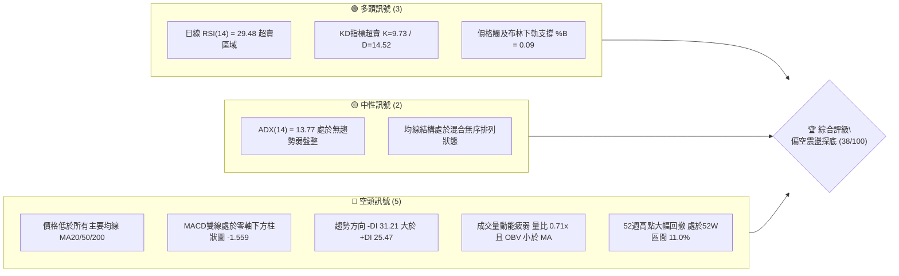
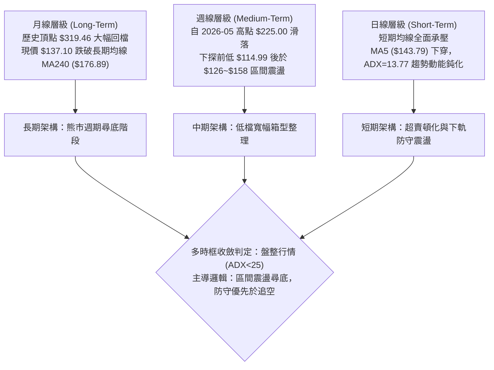
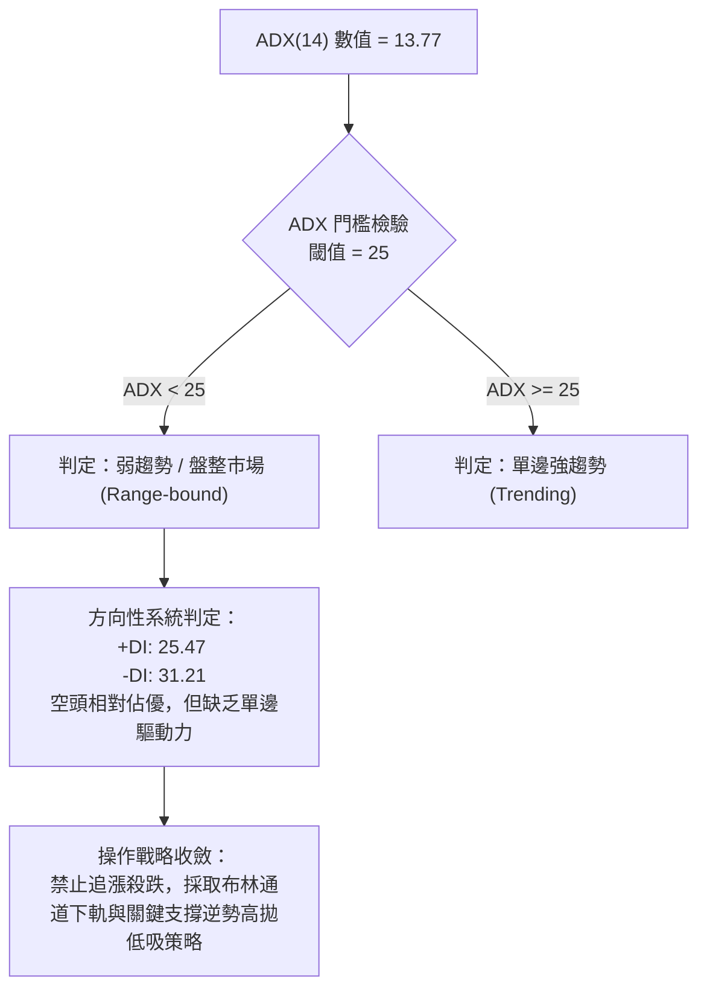
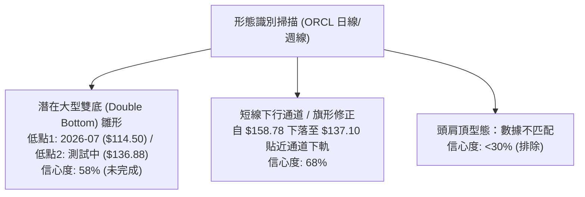
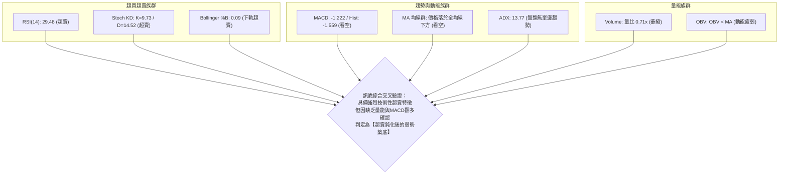
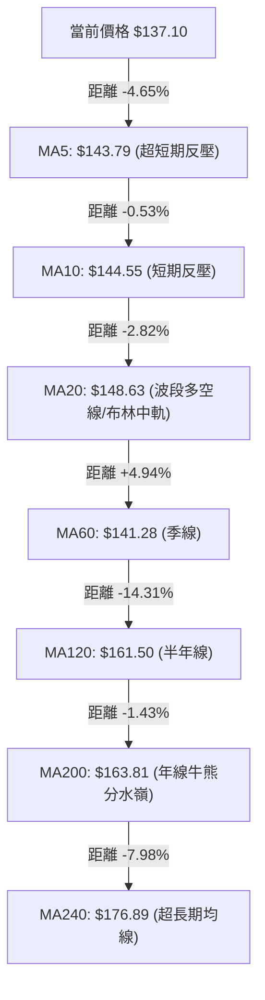
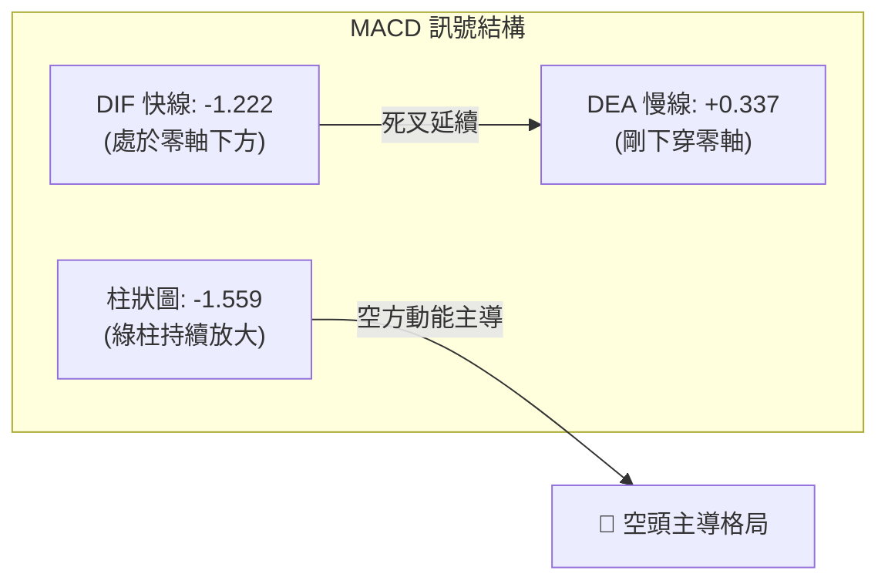
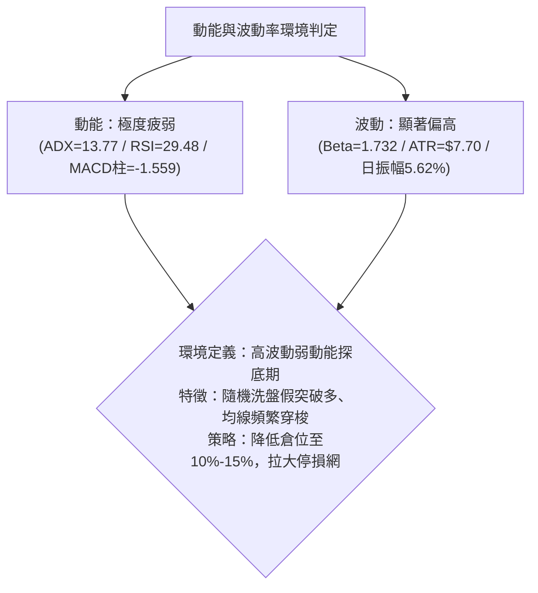
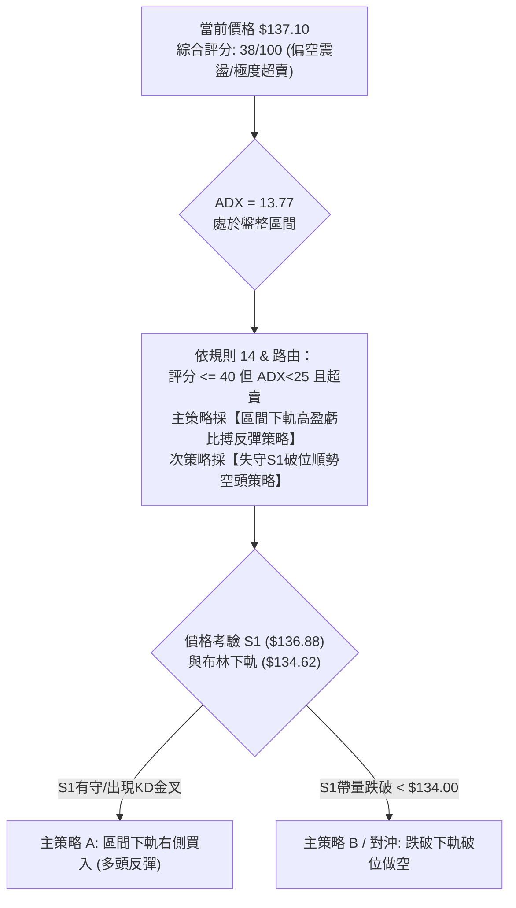
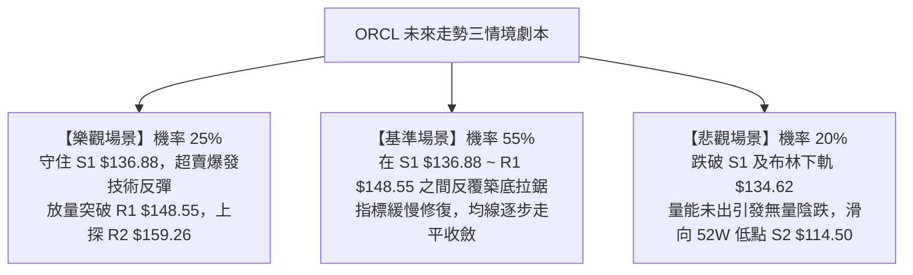

# ORCL 技術分析報告

> **報告日期**：2026-09-28 ｜ **語言**：繁體中文 ｜ **數據來源**：Yahoo Finance ｜ **當前價格**：$137.10

---

## 目錄

| 章節 | 內容 |
|------|------|
| [1. 技術面概覽](#1-技術面概覽) | 訊號儀表板、核心指標、評分卡 |
| [2. 趨勢分析](#2-趨勢分析) | 多時框趨勢、長中短期走勢 |
| [3. 圖表形態分析](#3-圖表形態分析) | 形態識別、K線組合、目標價 |
| [4. 支撐與阻力](#4-支撐與阻力) | 關鍵價位、斐波那契回調 |
| [5. 技術指標深度解讀](#5-技術指標深度解讀) | MA/RSI/MACD/布林/成交量 |
| [6. 動能與波動率](#6-動能與波動率) | 動能評估、ATR、Beta |
| [7. 多時框架總結](#7-多時框架總結) | 時框架評分矩陣 |
| [8. 交易策略建議](#8-交易策略建議) | 主策略詳情、風險報酬比 |
| [9. 風險提示與監控](#9-風險提示與監控) | 監控指標、風險場景 |

---

## 1. 技術面概覽

### 🎯 技術訊號儀表板



### 📊 核心指標速覽表

| 指標類別 | 指標名稱 | 當前數值 | 訊號 | 解讀 |
|:---|:---|:---:|:---:|:---|
| **價格** | 當前收盤價 | $137.10 | 🔴 | 貼近52週低點區間（僅位於全區間11.0%），弱勢格局明顯 |
| **均線** | MA20 | $148.63 | 🔴 | 價格低於MA20達 -7.76%，短期均線呈現強壓 |
| **均線** | MA50 | $142.25 | 🔴 | 價格低於MA50達 -3.62%，中期下壓態勢未扭轉 |
| **均線** | MA200 | $163.81 | 🔴 | 價格低於MA200達 -16.31%，長期處於牛熊分界線下方 |
| **動能** | RSI(14) | 29.48 | 🟢 | 進入極度超賣區（<30），隨時具備技術性均值回歸彈升條件 |
| **動能** | MACD (12,26,9) | -1.222 / 0.337 | 🔴 | MACD線處於訊號線下方且在零軸之下，柱狀圖擴張至 -1.559 |
| **動能** | Stoch KD (14,3) | K:9.73 / D:14.52 | 🟢 | 雙線低於20形成深度超賣，超賣頓化中孕育金叉反彈 |
| **趨勢** | ADX / DMI | ADX: 13.77 | 🟡 | ADX < 25 表示單邊趨勢力道衰竭，處於寬幅箱型震盪或尋底格局 |
| **趨勢** | DMI 方向 | +DI:25.47 / -DI:31.21 | 🔴 | -DI高於+DI，空頭力量暫時掌握市場主控權 |
| **通道** | Bollinger Bands | $134.62 ~ $162.65 | 🟡 | 價格貼近下軌（%B: 0.09），存在下軌技術性防守支撐 |
| **成交量** | Volume / 20MA | 23.55M / 33.35M | 🔴 | 量比僅 0.71x，下殺無承接爆量，OBV跌破均線量能衰退 |
| **波動** | ATR(14) | $7.70 (5.62%) | 🟡 | 每日平均波動幅度約 5.62%，波動率適中偏高 |

### 🏆 技術評分卡

```
╔══════════════════════════════════════════════════════════════╗
║              技術評分卡 — ORCL (2026-09-28)                 ║
╠══════════════════════════════════════════════════════════════╣
║ 趨勢強度 (ADX/DMI)  ████░░░░░░░░░░░░░░░░  25/100  🔴 空頭主導/弱盤整 ║
║ 動能指標 (RSI/MACD) ███████░░░░░░░░░░░░░  35/100  🔴 動能疲軟但超賣 ║
║ 支撐穩定度 (S1/S2)  ██████████░░░░░░░░░░  50/100  🟡 臨近S1關鍵防線 ║
║ 成交量配合 (OBV/VOL)████░░░░░░░░░░░░░░░░  20/100  🔴 量能萎縮無跟進 ║
║ 形態完整度 (Patterns)████████████░░░░░░░░  60/100  🟡 區間收斂尋底   ║
║ 均線排列 (MA System)████░░░░░░░░░░░░░░░░  20/100  🔴 價格全數跌破MA ║
╠══════════════════════════════════════════════════════════════╣
║ 綜合評分            ███████░░░░░░░░░░░░░  38/100  🔴 偏空震盪探底   ║
╚══════════════════════════════════════════════════════════════╝
```

---

## 2. 趨勢分析

### 🌐 多時框趨勢分析



### 📈 長期趨勢 — 12個月走勢圖（Unicode）

```
ORCL 月線走勢圖（過去12個月：2025-10 至 2026-09）
價格軸 ($)
$278.07 ┤                                     
$260.10 ┤● (2025-10 高檔開始下挫)
$225.00 ┤                             ● (2026-05 反彈次高點)
$200.02 ┤    ●
$193.05 ┤        ●
$163.44 ┤            ●
$160.83 ┤                     ●
$146.04 ┤                                 ●
$144.39 ┤                 ●
$137.10 ┤━━━━━━━━━━━━━━━━━━━━━━━━━━━━━━━━━━━━━●← 當前價格 ($137.10)
$129.87 ┤                                     ●
$114.50 ┤ (52週最低點支撐 S2)
         └───────────────────────────────────────
          10   11   12   01   02   03   04   05   06   07   08   09 (月份)
         2025                                 2026
```

#### 走勢特徵分析表格

| 階段區間 | 時間跨度 | 起訖價位 | 漲跌幅 | 走勢特徵與技術意義 |
|:---|:---:|:---:|:---:|:---|
| **主跌浪 I** | 2025-10 ~ 2026-02 | $260.10 → $144.39 | **-44.49%** | 自歷史高位回落，形成帶量單邊流暢下殺，各短中均線相繼失守。 |
| **中繼反彈** | 2026-03 ~ 2026-05 | $144.39 → $225.00 | **+55.83%** | 築底後強勁均值回歸反彈，觸及 50.0% 斐波那契壓力位 ($216.98) 附近回落。 |
| **主跌浪 II** | 2026-05 ~ 2026-07 | $225.00 → $129.87 | **-42.28%** | 5月反彈無力延續，主力機構出貨，回測 2026-07-26 週線低點 $114.99 觸底。 |
| **底部箱型** | 2026-08 ~ 2026-09 | $129.87 → $137.10 | **+5.57%** | 反彈至 $158.78 (R1/R2間) 受阻回落，目前重新回踩 S1 ($136.88) 進行測試。 |

### 📊 中期趨勢（週線分析）

從近20週的週線走勢分析，ORCL 自 2026-05-31 觸及 $225.00 高點後展開瀑布式下跌，週線 RSI 曾於 2026-06-28 降至極端超賣的 11.1，隨後於 2026-07-26 測試 52 週最低點 $114.99（當週收盤價）。隨後量能爆出 2.52 億股（2026-07-19）與 1.62 億股（2026-07-26），顯示機構在 $114.50~$126.41 區間進行了顯著的低位流動性承接。

隨後股價於 8 月底至 9 月初反彈至 $158.78，然而週線 MACD 柱狀圖僅由負翻正至 +4.827 即後繼無力，近三週（2026-09-13 至 09-27）週線連續收黑，週成交量由 2.02 億股降至 1.56 億股，週線 RSI 重新從 61.5 回落至 29.5，中期趨勢呈現「深幅下跌後的弱勢寬幅震盪整理」。

### ⚡ 趨勢強度評估（ADX 解讀）



#### ADX 趨勢強度對照表

| ADX 數值區間 | 當前數值 | 市場狀態解讀 | 交易策略導向 |
|:---:|:---:|:---|:---|
| 0 ~ 20 | **13.77** | **極弱趨勢 / 寬幅無方向盤整** | **嚴格以水平支撐/阻力及布林通道高拋低吸為主** |
| 20 ~ 25 | - | 趨勢萌芽 / 方向不確定 | 縮小倉位，等待突破訊號確認 |
| 25 ~ 40 | - | 單邊趨勢形成 | 順勢跟進，移動停利 |
| 40 以上 | - | 強烈單邊趨勢 / 接近超買超賣 | 警惕末端加速反轉 |

---

## 3. 圖表形態分析

### 🔍 形態識別系統



#### 形態識別與信心度評估表（依規則 15）

| 識別形態 | 信心度 (%) | 判斷依據（嚴格引用提供的數據） | 完成度 (%) | 目標價（附計算式） |
|:---|:---:|:---|:---:|:---|
| **箱型潛在雙底 (Double Bottom)** | **58%** | 第一次波段低點於 2026-07 探底至 S2 ($114.50)；當前價格回落至 S1 ($136.88) 進行次級支撐防守測試。頸線位置為 R2 ($159.26)。 | 45% (尚在右底構築) | 由形態高度推算：頸線 R2 ($159.26) + 形態高度 [頸線 $159.26 - S2 $114.50 = $44.76] = **$204.02** |
| **短期矩形震盪下軌回踩** | **68%** | 價格回落至近期波段低點聚類支撐 S1 ($136.88)；現價 $137.10 距 S1 僅 +0.16%，且觸及布林下軌 $134.62。 | 80% (已達支撐帶) | 由區間推算：反彈至阻力位 R1 = **$148.55** |
| **複合頭肩結構** | **25%** | 歷史波動過大且週期跨度不對稱，無法滿足標準頭肩頂/底幾何定義。 | - | **訊號不足，僅做指標型解讀** |

### 🕯️ 重要K線形態分析

| 週期/月份 | 收盤價 | K線組合特徵 | 市場心理與技術解讀 | 訊號方向 |
|:---:|:---:|:---|:---|:---:|
| 2026-07 | $129.87 | 長下影錘頭線 (Hammer) | 探底 $114.50 後爆出歷史巨量強勁回升，顯示機構資金進場托底。 | 🟢 底部支撐強烈 |
| 2026-08 | $149.12 | 中陽線覆蓋 (Bullish Rebound) | 延續7月反彈力道，價格收復 $140 整數關卡，確認低檔支撐有效。 | 🟢 多頭均值回歸 |
| 2026-09 | $137.10 | 帶上影實體陰線 (Bearish Retest) | 向上衝擊 $158.78 (接近 R2) 受阻，空頭反撲回落測試 S1，多空陷入拉鋸。 | 🔴 短期空頭施壓 |

### 📉 ASCII 走勢形態示意圖

```
ORCL 近三個月週線形態收斂結構圖
價格 ($)
$159.26 ┼─────────── 阻力位 R2 (頸線阻力) ───────────────
        │             ▲
        │            ╱ ╲   (09-06: $158.78)
$148.55 ┼───────────╱───╲── 阻力位 R1 ─────────────────────
        │          ╱     ╲
$137.10 ┼─────────┼───────●── 現價: $137.10 (逼近 S1 防守線)
$136.88 ┼─────────│───────┴── 支撐位 S1 ─────────────────────
        │        ╱            (潛在雙底右腳防守區間)
        │       ╱
$114.50 ┼──────● (07-26 低點 $114.99 / 52W Low: $114.50) ── 強支撐 S2
        └───────────────────────────────────────────────
             2026-07         2026-08         2026-09
```

### 🎯 形態目標價計算

1. **短期反彈目標價（區間均值回歸）**：
   - 基準支撐位：波段低點聚類 **S1 = $136.88**。
   - 上行第 1 目標價：波段高點聚類 **R1 = $148.55**（亦重疊 MA20 $148.63）。
   - 上行第 2 目標價：波段高點聚類 **R2 = $159.26**。

2. **潛在雙底中長線推算（若未來成功放量突破頸線）**：
   - 形態底部低點：**S2 = $114.50**。
   - 形態頸線位置：**R2 = $159.26**。
   - 形態高度：$159.26 - $114.50 = **$44.76**。
   - 形態突破目標價：$159.26 + $44.76 = **$204.02**（此位置接近 61.8% 斐波那契回調位 $192.79 與 50.0% 回調位 $216.98 之間）。

---

## 4. 支撐與阻力

### 🗺️ 關鍵價位分布圖（Unicode）

```
╔══════════════════════════════════════════════════════════════════╗
║                    ORCL 價位結構分布圖                           ║
╠══════════════════════════════════════════════════════════════════╣
║ $164.24 ║████████████████████████║ 強阻力 R3 (年線/波段高點聚類) ║
║ $159.26 ║████████████████████    ║ 阻力 R2 (反彈高點聚類/頸線)  ║
║ $148.55 ║████████████████████████║ 關鍵阻力 R1 (MA20重疊阻力位) ║
║ $137.10 ╠════════════════════════╣ ◄ 現價 ($137.10)             ║
║ $136.88 ║▓▓▓▓▓▓▓▓▓▓▓▓▓▓▓▓        ║ 近期波段支撐 S1 (-0.16%)     ║
║ $114.50 ║████████████████████████║ 52週歷史強支撐 S2 (-16.48%)  ║
╚══════════════════════════════════════════════════════════════════╝
```

### 🚧 阻力位分析表

所有阻力數值**嚴格引用技術數據中「關鍵價位」區塊**：

| 阻力級別 | 價位 ($) | 距現價幅動 | 形成原因與技術共振 | 突破難度 | 重要性權重 |
|:---|:---:|:---:|:---|:---:|:---:|
| **R1** | **$148.55** | +8.35% | 近一年波段高點聚類，與布林中軌/MA20 ($148.63) 高度重合，形成短期第一道蓋頭反壓。 | 中等 | 🟢🟡 關鍵短期樞軸 |
| **R2** | **$159.26** | +16.16% | 近一年波段高點聚類，為 2026-09 初反彈高點 ($158.78) 區域，亦為 78.6% 斐波那契位 ($158.36)。 | 較高 | 🟡🔴 中期多空分水嶺 |
| **R3** | **$164.24** | +19.80% | 近一年波段高點聚類，與長期生命線 MA200 ($163.81) 共振，站穩此處方能確認熊市扭轉。 | 極高 | 🔴🔴 長期強阻力屏障 |

### 🛡️ 支撐位分析表

所有支撐數值**嚴格引用技術數據中「關鍵價位」區塊**：

| 支撐級別 | 價位 ($) | 距現價幅動 | 形成原因與技術共振 | 守住機率 | 重要性權重 |
|:---|:---:|:---:|:---|:---:|:---:|
| **S1** | **$136.88** | -0.16% | 近一年波段低點聚類，現價 $137.10 正直接考驗此線，下方緊鄰布林下軌 ($134.62)。 | 60% | 🟢🟡 短線多頭最後防線 |
| **S2** | **$114.50** | -16.48% | 52週歷史最低點聚類，對應 2026-07-26 爆歷史天量 (2.52億/1.62億股) 托底區。 | 85% | 🟢🟢 長期鐵底不容有失 |
| **S3** | **數據未偵測** | - | 數據庫未偵測到低於 $114.50 之更低支撐聚類，若失守需依賴整數心理關卡。 | - | - |

### 📐 斐波那契回調位分析

依據 52 週完整極端區間（最高點 **$319.46** 至 最低點 **$114.50**，總跨度 $204.96）計算的回調階梯：

```
斐波那契位階分布 (52W High $319.46 → 52W Low $114.50)
0.0%  (52W High) ─── $319.46
23.6% ────────────── $271.09
38.2% ────────────── $241.16
50.0% ────────────── $216.98
61.8% ────────────── $192.79
78.6% ────────────── $158.36 ◄─ 阻力位 R2 ($159.26) 高度重合
現價  ────────────── $137.10 ◄─ 落在 78.6% ($158.36) 與 100.0% ($114.50) 深度回撤區間
100.0% (52W Low) ─── $114.50 ◄─ 支撐位 S2 ($114.50)
```

**深層技術解讀**：
ORCL 現價 $137.10 深度回調至整個波段的底端，處於 **78.6% ($158.36)** 與 **100.0% ($114.50)** 之間的「超跌尋底緩衝區間」。78.6% 回調位通常為強趨勢的最後防禦線，一旦跌破通常意味著原多頭架構徹底破壞，轉入長週期的低位籌碼重組。現價距 100.0% 原點低點 $114.50 僅約 $22.60 的空間，而距離上方 78.6% 回調位有約 $21.26 的均值回歸空間。

---

## 5. 技術指標深度解讀

### 🎛️ 指標訊號總覽



### 📈 移動平均線排列分析



#### 均線系統深度解讀

1. **混亂排列狀態**：當前短期均線（MA5/MA10/MA20）由上至下依序排列為 $148.63 > $144.55 > $143.79，短線呈現空頭死叉擴散；而 MA60 為 $141.28，低於 MA20 但高於現價；長期均線 MA120 ($161.50)、MA200 ($163.81) 與 MA240 ($176.89) 居高臨下。整體形成典型的大跌後「均線糾纏混亂排列」。
2. **負乖離率過大**：現價 $137.10 距 MA20 負乖離達 **-7.76%**，距 MA200 負乖離達 **-16.31%**，距 MA240 達 **-22.50%**。歷史經驗顯示，當 ORCL 與長期均線負乖離超過 -20% 時，往往引發技術性乖離修正反彈。

### 📉 RSI(14) 分析

```
RSI(14) 動能強度表：
當前數值: 29.48 
[█████████░░░░░░░░░░░░░░░░░░░░░] 29.48% (極度超賣 < 30)
 0             30             70            100
 └─ 嚴重超賣區 ─┴── 中性震盪區 ─┴─ 極度超買區 ─┘
```

- **超買超賣判定**：RSI(14) 數值為 **29.48**，已跌破 30 的公認超賣界限，進入極度超賣區間。
- **背離分析判定**：
  - 週線視角：2026-06-28 週線收盤 $148.02 時 RSI 為 11.1；2026-07-26 下探至最低點 $114.99 時 RSI 回升至 26.7（形成週線級別**底背離**），隨後驅動了8月份的反彈。
  - 日線當前視角：當前價格自 $158.78 下殺至 $137.10，日線 RSI 順勢跌落至 29.48，與價格下行節奏同步，**日線級別目前無明顯背離**，屬於單純的動能釋放與超賣狀態。

### 📊 MACD(12/26/9) 訊號解讀



- **數據特徵**：DIF快線 (-1.222) 位於零軸下方並下穿 DEA慢線 (0.337)，形成水下死叉；MACD柱狀圖達 **-1.559**，呈現綠柱擴張狀態。
- **指標共振**：週線 MACD 柱狀圖在連續數週正值後於 2026-09-20 轉負 (-0.933)，最新一週擴大至 -1.559，確認中短期修正動能尚未完全衰竭，短期內貿然追高風險極大。

### 📦 布林通道分析

```
ORCL 布林通道結構圖 (20日, 2倍標準差)
════════════════════════════════════════════════════════════
$162.65 ───────────────────────────── 布林上軌 (帶寬阻力)
             │
             │
$148.63 ─────┼─────────────────────── 布林中軌 (MA20 生命線)
             │  ╲
             │   ╲
$137.10 ─────┼────●────────────────── 當前現價 (%B = 0.09)
$134.62 ─────┴─────────────────────── 布林下軌 (極限支撐線)
════════════════════════════════════════════════════════════
```

- **通道帶寬與軌道位置**：上軌 **$162.65**、中軌 **$148.63**、下軌 **$134.62**。
- **%B 指標分析**：%B 值僅為 **0.09**，極端逼近下軌（0代表觸及下軌）。當 %B < 0.10 時，價格已進入布林下軌的支撐擠壓區，只要未出現下軌開口向下擴張的單邊暴跌形態，價格在下軌處具備高概率的彈升中軌修復契機。

### 💹 成交量分析（量價配合度）

1. **成交量對比**：最新日成交量為 **23,549,400 股**，相對於 20 日均量（33,347,905 股）量比僅為 **0.71x**，相較 50 日均量（30,554,840 股）亦呈現明顯萎縮。
2. **量價關係**：股價自 $158.78 回落過程中，成交量逐步萎縮，此現象屬於「無量陰跌」，顯示市場賣壓並非恐慌性拋售，但同時也證明多頭抄底意願極低。
3. **OBV 動量流向**：數據明確提示「**OBV < MA → 量能疲弱**」，能量潮指標位於其移動平均線下方，表明資金淨流出，量能未能對價格反彈提供確認信號。

---

## 6. 動能與波動率

### ⚡ 動能評估四象限

| 象限 | 動能維度 | 波動率維度 | 當前狀態 | 技術環境定位與處置原則 |
|:---:|:---:|:---:|:---:|:---|
| **Q1** | 強動能 (趨勢明確) | 低波動 (穩健運行) | - | 最佳趨勢單邊跟隨機會。 |
| **Q2** | 弱動能 (無單邊趨勢) | 低波動 (壓縮整理) | - | 窄幅壓縮，等待破局方向。 |
| **Q3** | 強動能 (爆發放量) | 高波動 (劇烈震盪) | - | 突破或洗盤行情，高風險高收益。 |
| **Q4** | **弱動能 (ADX=13.77)** | **高波動 (Beta=1.732 / ATR=5.62%)** | **✓ ORCL 處於此區** | **震盪探底、洗盤劇烈；避免追漲殺跌，嚴格依邊界防守。** |



### 📊 ATR 波動率分析

- **ATR(14) 數值**：**$7.70**，佔當前股價比例高達 **5.62%**。
- **止損與波動保護設置**：
  - 正常日內噪音空間為 1.0 × ATR = **$7.70**。
  - 波段操作的安全防守止損距離建議至少設定為 1.5 × ATR 至 2.0 × ATR：
    - $1.5 \times \text{ATR} = \$11.55$
    - $2.0 \times \text{ATR} = \$15.40$
  - 由於 S1 支撐位在 $136.88（距離現價僅 $0.22），在 S1 附近進場的緊湊技術止損可設於布林下軌下方保護點，但若考慮 ATR 正常隨機波動，需防範跌破 S1 後對布林下軌 $134.62 的刺穿洗盤。

### 📐 Beta 與市場相關性

- **Beta 係數**：**1.732**。
- **市場解讀**：ORCL 具有極高的市場敏感度，波動幅度約為 S&P 500 指數的 1.73 倍。在科技股板塊整體承壓時，ORCL 跌幅會顯著放大；反之，一旦大盤止跌反彈，該股亦具備極強的彈性爆發力。
- **機構持倉結構**：機構持股佔比 43.6%，內部人持股 38.6%（股權集中度高），空頭部位佔比（Short % Float）僅 2.7%，Short Ratio 為 1.82 天，顯示當前下跌並非源於大規模做空機構狙擊，而是市場買盤暫時退潮所致。

---

## 7. 多時框架總結

### 📋 時框架評分表

| 時框架 | 趨勢方向 | 動能狀態 | 均線排列狀態 | 關鍵形態結構 | 綜合評分 | 操作建議導向 |
|:---:|:---:|:---:|:---:|:---:|:---:|:---|
| **月線 (長期)** | 🔴 偏空 | 弱勢回調 | 破位 MA240 ($176.89) | 歷史高點大幅回檔尋底 | 30/100 | 嚴格控制長期部位，防守為上 |
| **週線 (中期)** | 🟡 震盪 | 中性修復 | 糾纏於 $140~$160 | 寬幅箱型整理 ($114~$159) | 45/100 | 區間低吸高拋，觀察雙底雛形 |
| **日線 (短期)** | 🔴 偏空 | 🟢 超賣 | 價格全數跌破各均線 | 回踩 S1 支撐與布林下軌 | 38/100 | 嚴禁追空，等待超賣背馳反彈 |

### 🔲 綜合訊號矩陣

```
訊號維度對照矩陣：
┌──────────────┬─────────────┬─────────────┬─────────────┐
│   維度指標   │ 短期 (日線) │ 中期 (週線) │ 長期 (月線) │
├──────────────┼─────────────┼─────────────┼─────────────┤
│ 均線系統     │  🔴 空頭壓制│  🟡 糾纏震盪│  🔴 空頭排列│
│ 動能指標     │  🟢 極度超賣│  🟡 中性偏弱│  🔴 動能向下│
│ 形態位置     │  🟢 臨近S1軌│  🟡 箱體中下│  🔴 跌破高位│
│ 成交量能     │  🔴 萎縮疲弱│  🟡 縮量整理│  🔴 追價意願低│
└──────────────┴─────────────┴─────────────┴─────────────┘
```

### ⚖️ 多時框收斂結論（依規則 14 嚴格收斂）

1. **行情性質判定**：當前日線 ADX(14) 數值為 **13.77**（遠低於 25 臨界值），明確判定當前為**「盤整行情」**而非單邊趨勢行情。
2. **多時框優先級收斂**：依據規則 14，在盤整行情下，**日線布林通道上下軌 ($134.62 ~ $162.65) 與水平關鍵支撐阻力位為主要交易區間**。中長期週線雖處於大跌後的修復期，但日線指標已觸及布林下軌且 RSI 進入 29.48 極度超賣，空頭已無足夠動能發動流暢追殺。
3. **唯一方向性結論**：**中性觀望，偏向「區間下軌防守型低吸超賣反彈」**。
   - 綜合評分為 **38/100**，技術面處於空頭壓制下的超賣邊緣。
   - 交易戰略收斂為：**以布林下軌及 S1 為防守基準的區間低吸反彈策略**，嚴格禁止在現價進行追空操作。

---

## 8. 交易策略建議

### 🗺️ 策略決策流程圖



### 🧭 策略路由說明

> **當前主策略方向 = 區間下軌防守型搏反彈（依評分 38/100 處於超賣邊界，ADX=13.77 確認無單邊趨勢）**
> 
> *註：雖然綜合評分為 38/100（落於偏空區間），但日線 ADX 僅 13.77，布林 %B 為 0.09，RSI 達 29.48 極度超賣，做空盈虧比極差。因此主策略規劃圍繞 S1 支撐的「超賣修復」展開，同時嚴密制定失守 S1 後的空頭破位對沖預案。*

### 🎯 價格情境階梯（Price Scenarios）

價位嚴格引用第 4 章「關鍵價位」之數據：

| 觸發條件 | 第一目標 (T1) | 第二目標 (T2) | 後續延伸 (T3) | 情境技術含義 |
|:---|:---:|:---:|:---:|:---|
| **站穩 S1 ($136.88)** | **R1: $148.55** | **R2: $159.26** | **R3: $164.24** | 觸底反彈，展開均值回歸修復走勢 |
| **震盪於現價區間** | **$134.62 (下軌)** | **$148.63 (中軌)** | — | 布林帶寬內收斂打底，消耗空頭動能 |
| **跌破 S1 ($136.88)** | **$130.00 整數** | **S2: $114.50** | **數據未偵測** | 支撐破位，再度回測 52 週歷史大底 |

### 📊 情境機率分佈

| 預測情境 | 發生機率 | 主要判定依據（引用指標狀態） |
|:---|:---:|:---|
| **情境 I：超賣反彈向上** | **50%** | RSI=29.48 深度超賣、KD處於極低位、布林 %B=0.09 臨近下軌支撐。 |
| **情境 II：區間窄幅拉鋸** | **35%** | ADX=13.77 無趨勢信號、成交量比僅 0.71x、市場觀望氛圍濃厚。 |
| **情境 III：破位加速下探** | **15%** | MACD柱狀圖負值放大 (-1.559)、-DI (31.21) 壓制 +DI (25.47)。 |

### 🟢 主策略詳情

所有價位均嚴格基於第 4 章關鍵價位（S1: $136.88, S2: $114.50, R1: $148.55, R2: $159.26）計算：

| 策略要素 | 策略 A（下軌右側反彈策略 - 主推） | 策略 B（破位順勢空頭策略 - 對沖） |
|:---|:---|:---|
| **交易方向** | **做多 (Long)** | **做空 (Short)** |
| **進場條件** | 價格在 S1 ($136.88) 獲得支撐，日線收出止跌十字星或 KD 出現超賣金叉。 | 價格實體陰線放量跌破 S1 ($136.88) 與布林下軌 ($134.62)。 |
| **進場價格** | **$137.00**（貼近現價 $137.10 及 S1） | **$134.00**（確認破位布林下軌 $134.62） |
| **目標價 T1** | **$148.55**（阻力位 R1 / 潛在獲利 +8.43%） | **$125.00**（波段整數支撐 / 獲利 +6.72%） |
| **目標價 T2** | **$159.26**（阻力位 R2 / 潛在獲利 +16.25%） | **$114.50**（歷史強支撐 S2 / 獲利 +14.55%） |
| **止損價格** | **$133.50**（跌破布林下軌 $134.62 約 1 美元） | **$138.50**（重回 S1 上方宣告假突破） |
| **風控停損距** | $3.50 (虧損 -2.55%) | $4.50 (虧損 -3.36%) |
| **風險報酬比** | **1 : 3.30** (至 T1) ／ **1 : 6.36** (至 T2) | **1 : 2.00** (至 T1) ／ **1 : 4.33** (至 T2) |
| **勝率預估** | **55%** | **45%** |
| **建議倉位** | **15%**（分批佈局，不重倉） | **10%**（破位跟隨輕倉） |

### 🔴 反向風險觸發點（對沖提示）

- **多頭策略全面停損觸發點**：日線收盤價**實體跌破 $134.62（布林下軌）**。此時多頭結構失效，極度超賣發生鈍化破位，應立即停損出場，並可啟動策略 B 對沖。
- **空頭回補與翻多觸發點**：股價**強勢帶量突破 R1 ($148.55)** 並站穩 MA20 ($148.63)。若出現此信號，意味著中期日線下降通道遭到破壞，空頭必須無條件平倉。

### ⭐ 整體訊號強度評星

```
做多訊號強度：★★☆☆☆  (2.5/5 星 — 僅具備超賣反彈條件，缺乏均線配合)
做空訊號強度：★★☆☆☆  (2.0/5 星 — 指標過度超賣，此處做空盈虧比低劣)
整體可信度：  ★★★☆☆  (3.5/5 星 — 關鍵位階明確，區間邊界極度清晰)
```

---

## 9. 風險提示與監控

### ✅ 關鍵監控指標 Checklist

```
╔══════════════════════════════════════════════════════════════╗
║               ORCL 每日關鍵技術監控 Checklist                 ║
╠══════════════════════════════════════════════════════════════╣
║ [ ] 價格能否守穩波段支撐線 S1 ($136.88)？                      ║
║ [ ] RSI(14) 能否自 29.48 脫離超賣區重返 30 以上？             ║
║ [ ] Stoch KD 是否在 20 以下形成低檔黃金交叉 (金叉確認)？     ║
║ [ ] 日成交量能否突破 20日均量 (33.35M) 達到放量確認？        ║
║ [ ] MACD 綠柱狀圖 (-1.559) 是否出現連續兩日收斂縮小？         ║
║ [ ] 布林通道帶寬是否收縮，現價是否始終維持在下軌 ($134.62) 之上？║
╚══════════════════════════════════════════════════════════════╝
```

### ⚠️ 風險場景分析



### 🛡️ 風險管理重要提醒

1. **基本面催化劑風險**：
   - 儘管當前華爾街 41 位分析師共識評級為 **Buy**，平均目標價高達 **$237.97**（較現價有 +73.57% 的潛在空間），且近期（2026-09-11 至 09-14）包括 UBS、Barclays、Stifel、Argus 等機構密集給予 Buy / Overweight 評級，但技術面往往領先或滯後基本面。
   - 財務數據顯示 ORCL 自由現金流為負（$-45.85B），負債/權益比率達 251.7%，在整體高利率宏觀環境下，高槓桿特徵可能加劇股價技術面破位下殺的波動風險。
2. **高 Beta 倉位風控原則**：
   - ORCL 的 Beta 高達 **1.732**，每日平均波動達 **$7.70 (5.62%)**。這意味著單日振幅極大，**單筆交易的風險暴露上限應嚴格限制在總投資組合資金的 1.0% 以內**。
   - 嚴格禁止在無放量確認金叉前採用「左側向下金字塔攤平」的方式加倉，所有部位必須遵守「分批建立、破位即撤」的交易紀律。

---

## 📋 報告總結

```
╔══════════════════════════════════════════════════════════════════╗
║                   ORCL 技術分析報告總結                          ║
╠══════════════════════════════════════════════════════════════════╣
║ 報告日期：2026-09-28                                            ║
║ 當前價格：$137.10                                                ║
║ 分析評級：⚖️ 中性觀望 / 超賣防守（技術評分：38/100）            ║
║                                                                  ║
║ 關鍵結論：                                                       ║
║ ├─ 長期趨勢：🔴 空頭主導，跌破 MA200/240，尋底週期               ║
║ ├─ 中期趨勢：🟡 寬幅箱型整理 ($114.50 ~ $159.26)                 ║
║ ├─ 短期趨勢：🟢 極度超賣 (RSI: 29.48, KD < 15)，具反彈修復契機  ║
║ ├─ 關鍵支撐：S1: $136.88 ｜ S2: $114.50 (52週最低點)            ║
║ ├─ 關鍵阻力：R1: $148.55 ｜ R2: $159.26 ｜ R3: $164.24          ║
║ └─ 分析師目標：均價 $237.97 (41位分析師綜合共識)                 ║
║                                                                  ║
║ 最優策略組合：                                                   ║
║ 1. 🥇 最佳機會：依託 S1 ($136.88) 進場做多，博弈超賣反彈至 R1   ║
║    (進場: $137.00 / 停損: $133.50 / 目標: $148.55 / 風報比: 3.3) ║
║ 2. 🥈 次選機會：若帶量擊穿布林下軌 ($134.62)，順勢做空看至 S2   ║
║    (進場: $134.00 / 停損: $138.50 / 目標: $114.50 / 風報比: 4.3) ║
║ 3. 🥉 保守選擇：完全空倉觀望，等待日線 MACD 零下金叉確認再介入  ║
╚══════════════════════════════════════════════════════════════════╝
```

---

> ⚠️ **免責聲明**：本報告為技術分析研究成果，所有數據、圖表及估算均嚴格基於所提供之歷史價格行情進行推演。本報告**僅供研究與學術參考**，**不構成任何形式的投資要約或買賣建議**。金融市場瞬息萬變，投資人應獨立評估風險並自行承擔投資盈虧。

---

*報告生成時間：2026-09-28 ｜ 數據來源：Yahoo Finance ｜ 分析框架：多時框技術分析模型*