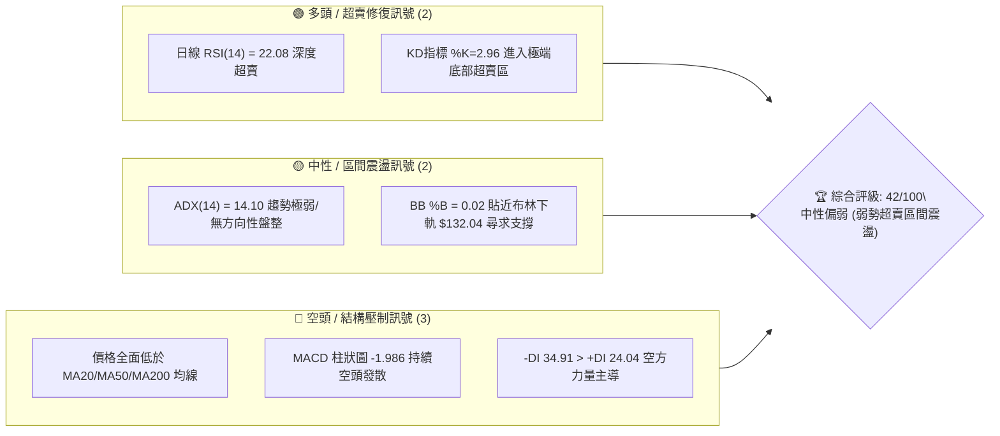
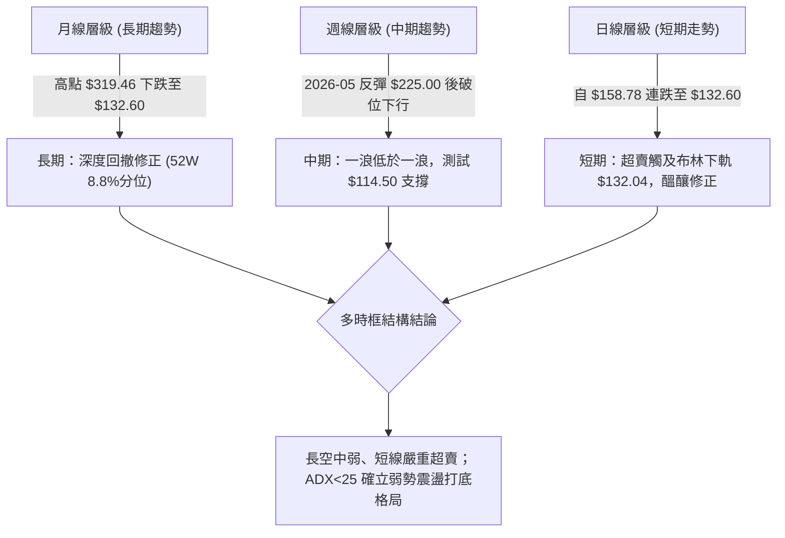
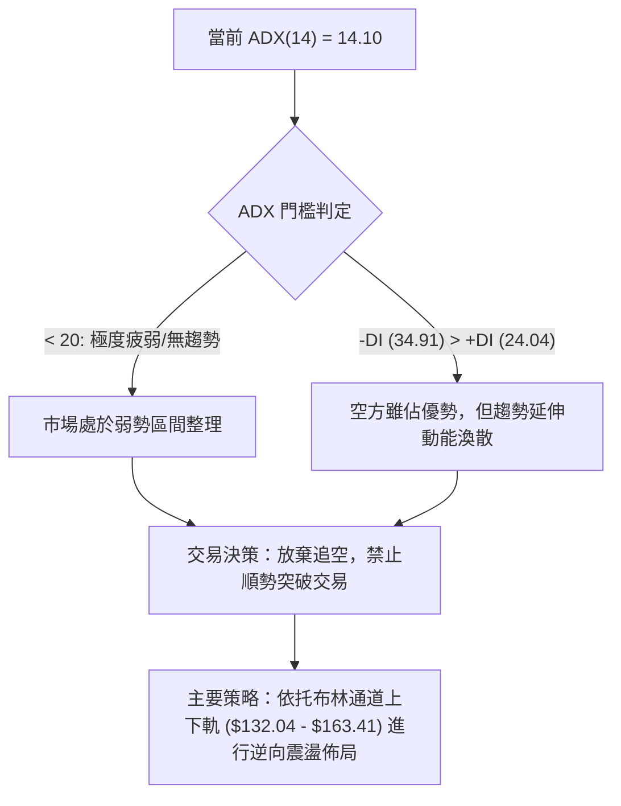
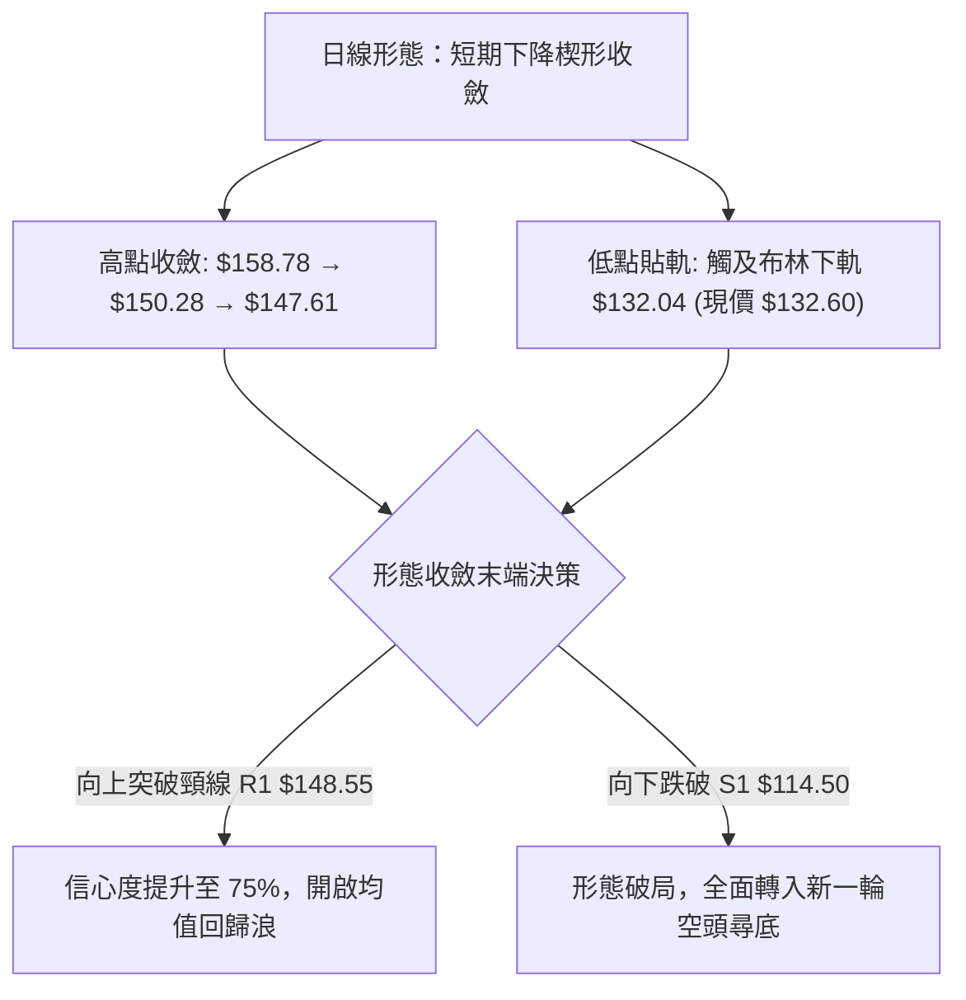
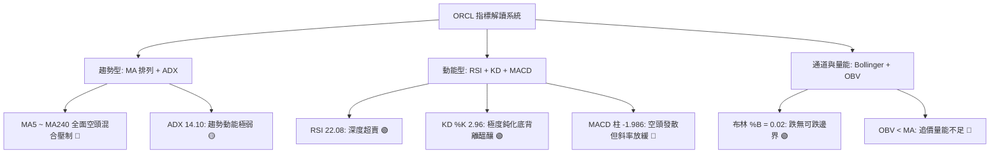
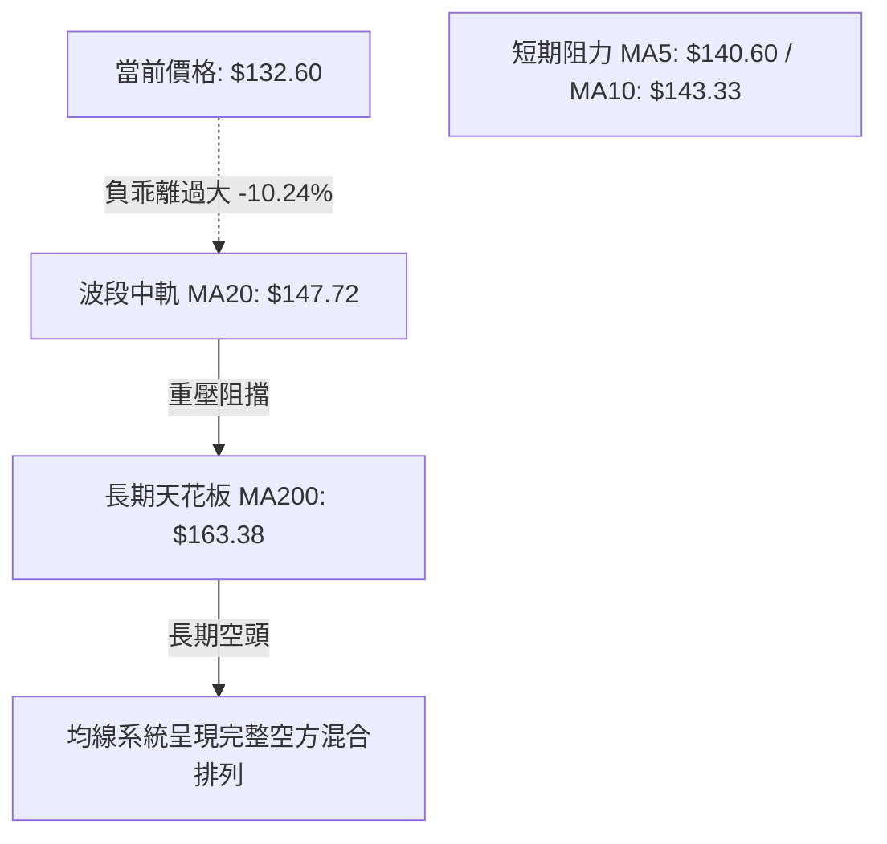
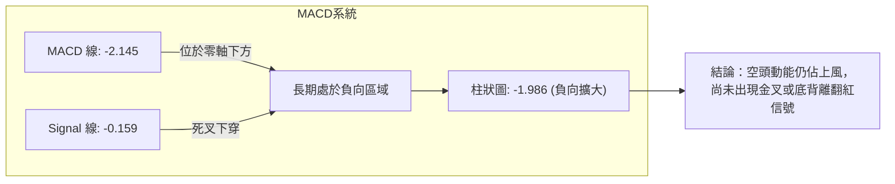
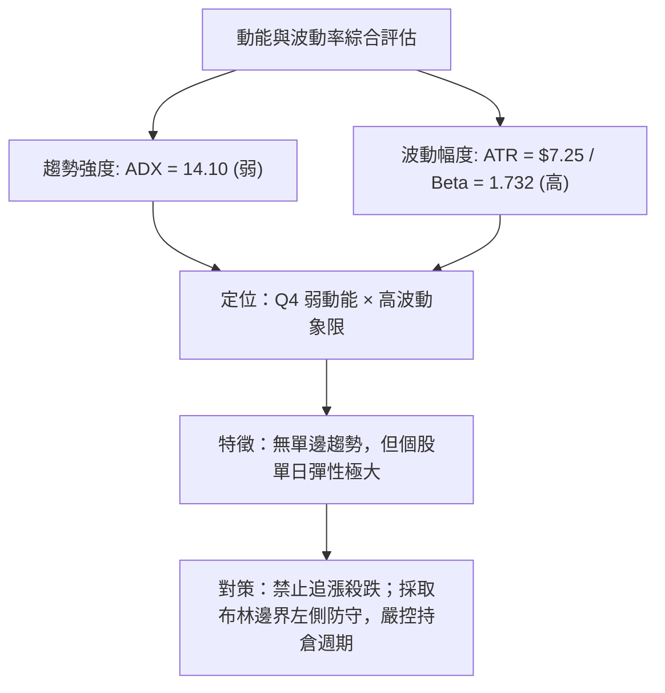
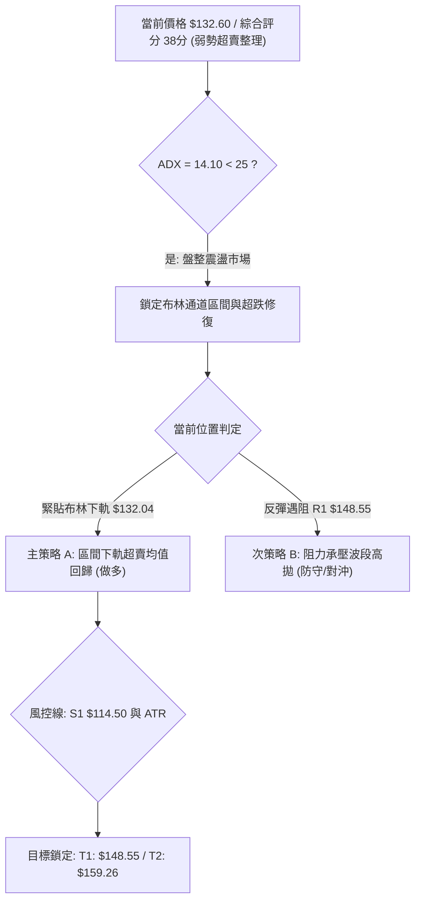
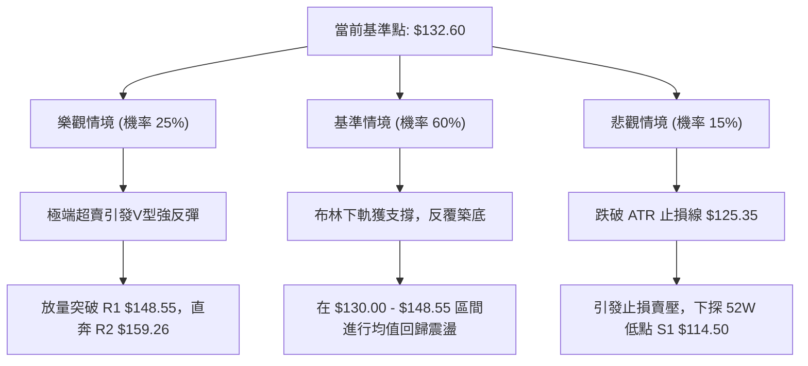

# ORCL 技術分析報告

> **報告日期**：2026-09-29 ｜ **語言**：繁體中文 ｜ **數據來源**：Yahoo Finance ｜ **當前價格**：$132.60

---

## 目錄

| 章節 | 內容 |
|------|------|
| [1. 技術面概覽](#1-技術面概覽) | 訊號儀表板、核心指標、評分卡 |
| [2. 趨勢分析](#2-趨勢分析) | 多時框趨勢、長中短期走勢、12個月ASCII走勢圖 |
| [3. 圖表形態分析](#3-圖表形態分析) | 形態識別、信心度評估、K線組合、目標價推算 |
| [4. 支撐與阻力](#4-支撐與阻力) | 關鍵價位結構、斐波那契回調精確解析 |
| [5. 技術指標深度解讀](#5-技術指標深度解讀) | 均線系統、RSI/MACD背離分析、布林通道、OBV量能 |
| [6. 動能與波動率](#6-動能與波動率) | 動能四象限、ATR波動度與止損設定、Beta風險 |
| [7. 多時框架總結](#7-多時框架總結) | 時框架評分矩陣、收斂規則與主導方向 |
| [8. 交易策略建議](#8-交易策略建議) | 策略路由、情境階梯、主策略進出場與風控 |
| [9. 風險提示與監控](#9-風險提示與監控) | 監控Checklist、三種情境路徑、資金管理 |

---

## 1. 技術面概覽

### 🎯 技術訊號儀表板

ORCL 當前收盤價為 **$132.60**，位於 52 週價格區間（$114.50 – $319.46）的 **8.8%** 分位點，呈現顯著的深度超跌。各技術維度訊號呈現「指標嚴重超賣但均線全面壓制、趨勢動能偏弱盤整」的複雜格局：



### 📊 核心指標速覽表

| 指標類別 | 指標名稱 | 當前數值 | 訊號 | 解讀 |
|----------|----------|----------|------|------|
| **價格** | 當前價格 | $132.60 | 🔴 | 位於 52W 區間 8.8% 低檔，距 52W 高點 $319.46 下跌 -58.49% |
| **短期均線** | MA20 | $147.72 | 🔴 | 價格低於 MA20 達 -10.24%，短線呈負乖離壓制 |
| **中期均線** | MA50 | $142.37 | 🔴 | 價格低於 MA50 達 -6.86%，中期反彈受限 |
| **長期均線** | MA200 | $163.38 | 🔴 | 價格遠在 MA200 下方 -18.84%，長期結構處於空頭領域 |
| **動能震盪** | RSI(14) | 22.08 | 🟢 | 進入極度超賣區（<30），隨時具備技術性均值回歸修復動能 |
| **趨勢指標** | MACD | -2.145 / -0.159 | 🔴 | MACD 線低於信號線，柱狀圖 -1.986 處於負向放大階段 |
| **趨勢強度** | ADX(14) | 14.10 | 🟡 | 數值低於 25，顯示缺乏明確單邊趨勢，屬無序弱勢震盪行情 |
| **通道位置** | BB下軌 / %B | $132.04 / 0.02 | 🟡 | 價格觸及日線布林帶下軌，下行空間受帶寬壓縮 |
| **成交量能** | 20日均量比 | 1.02x | 🟡 | 最新量 35.01M 與均量 34.21M 相當，OBV < MA 顯示量能疲弱 |
| **波動率** | ATR(14) | $7.25 | 🟡 | ATR 佔股價 5.46%，日均振幅中等偏高，提供波段操作空間 |

### 🏆 技術評分卡

```
╔══════════════════════════════════════════════════════════════════╗
║              技術評分卡 — ORCL (2026-09-29)                      ║
╠══════════════════════════════════════════════════════════════════╣
║ 趨勢強度 (ADX=14.10 缺乏單邊趨勢)  ███████░░░░░░░░░░░░░  35/100 🔴 ║
║ 動能指標 (極端超賣具備反彈需求)    ████████░░░░░░░░░░░░  40/100 🟡 ║
║ 支撐穩定度 (布林下軌 $132.04 測試) █████████░░░░░░░░░░░  45/100 🟡 ║
║ 成交量配合 (OBV偏弱無買盤放量)     ████████░░░░░░░░░░░░  40/100 🔴 ║
║ 形態完整度 (未見底部反轉形態確認)  ████████░░░░░░░░░░░░  40/100 🟡 ║
║ 均線排列 (空頭混合壓制，價格居下)  ██████░░░░░░░░░░░░░░  30/100 🔴 ║
╠══════════════════════════════════════════════════════════════════╣
║ 綜合評分                           ████████░░░░░░░░░░░░  38/100 🔴 ║
║ 評級結論：中性偏空（超賣區間下軌測試，以震盪反彈或打底視之）     ║
╚══════════════════════════════════════════════════════════════════╝
```

---

## 2. 趨勢分析

### 🌐 多時框趨勢分析

依據多時框收斂框架，由於 **ADX(14) = 14.10 < 25**，市場明確處於「盤整/弱趨勢」環境，因此中長期的主要壓力位與日線布林通道上下軌成為分析的核心骨幹：



### 📈 長期趨勢 — 12個月走勢圖（Unicode）

以下為 ORCL 過去 12 個月（2025-10 至 2026-09）的月線收盤價格走勢圖，清晰展示了由歷史高檔區逐波回落至當前低檔的完整演化過程：

```
ORCL 月線走勢圖（過去12個月：2025-10 至 2026-09）
價格軸 ($)
$280 ┤ 
$260 ┤ ● (2025-10: $260.10)
$240 ┤
$220 ┤                               ● (2026-05: $225.00 假突破次高)
$200 ┤       ● (2025-11: $200.02)
$180 ┤             ● (2025-12: $193.05)
$160 ┤                   ● (2026-01: $163.44)  ● (2026-04: $160.83)
$140 ┤                         ●       ●             ●       ● (2026-08: $149.12)
$120 ┤                        (02:144)(03:146)      (06:146)   ● (2026-07: $129.87)
$110 ┤                                                          ●←現價 $132.60 (2026-09)
     └───────────────────────────────────────────────────────────────────────────
        10    11    12    01    02    03    04    05    06    07    08    09  (月份)
```

#### 過去 12 個月走勢特徵分析

| 階段區間 | 時間跨度 | 起訖價格 | 區間漲跌幅 | 走勢結構與技術特徵 |
|----------|----------|----------|------------|--------------------|
| **第1階段：高檔破位** | 2025-10 → 2026-02 | $260.10 → $144.39 | **-44.49%** | 連續5個月陰線暴跌，失守 $200 整數關卡與長週期均線。 |
| **第2階段：強勁反抽** | 2026-02 → 2026-05 | $144.39 → $225.00 | **+55.83%** | 築底後爆發性反彈，5月份拉出長陽線，但未能攻克 $240 阻力。 |
| **第3階段：二次探底** | 2026-05 → 2026-07 | $225.00 → $129.87 | **-42.28%** | 6月份斷崖式下跌，7月創下收盤新低 $129.87（週線低點觸及 $114.99）。 |
| **第4階段：弱勢拉鋸** | 2026-07 → 2026-09 | $129.87 → $132.60 | **+2.10%**  | 8月短暫反彈至 $149.12，9月再次滑落至 $132.60，圍繞布林下軌震盪。 |

### 📊 中期趨勢（週線分析）

中期走勢顯示，ORCL 在 2026 年 5 月底觸及 $225.00 高點後遭遇強大拋壓，於 2026 年 7 月 26 日當週下探至波段低點 $114.99（逼近 52 週最低點 $114.50），隨後於 8 月展開技術性反彈至 $158.78（2026-09-06 當週高點），但受制於下降趨勢線壓制，9 月下旬連跌四週收在 $132.60。

```
週線級別支撐與阻力走勢示意圖：
  $164.24 ────────────────────────────────────────── 阻力 R3 (強阻力聚類)
  $159.26 ───────────────────────────────────▲────── 阻力 R2 (反彈高點聚類)
  $148.55 ─────────────────────────────▲─────│────── 阻力 R1 (MA20/波段頸線)
                                       │     │
  $132.60 ═════════════════════════════●═════╧══════ 現價 (布林下軌 $132.04 支撐)
                                       │
  $114.50 ─────────────────────────────▼──────────── 支撐 S1 (52週極端低點)
```

### ⚡ 趨勢強度評估（ADX 解讀）

當前日線指標系統中，**ADX(14) 讀數僅為 14.10**。根據技術分析經典理論：
- **ADX > 25**：代表處於明確的趨勢行情（單邊多頭或單邊空頭），適合採用突破追隨策略。
- **ADX < 20**：代表市場處於極弱趨勢或純粹的「無趨勢區間盤整（Chop Market）」，動量突破策略極易遭遇假突破，應改以通道邊界交易（布林通道或高低點擺動）。



| ADX 區間數值 | 當前狀態 | 趨勢特徵 | 適用交易法則 |
|--------------|----------|----------|--------------|
| **0 – 20**   | **14.10 (當前)** | **無趨勢 / 弱勢震盪** | **嚴格執行箱體震盪或超賣均值回歸策略；切忌殺跌** |
| 20 – 25      | -        | 趨勢正在醞釀形成 | 觀察方向性突破與量能放大訊號 |
| 25 – 40      | -        | 強勁單邊趨勢     | 順勢加碼，持有部位直至指標反轉 |
| 40 – 100     | -        | 極端單邊超買/超賣 | 警惕趨勢耗竭反轉風險 |

---

## 3. 圖表形態分析

### 🔍 形態識別系統

依據嚴格規則 15，所有圖表形態均需依客觀幾何點位評估信心度，拒絕主觀臆測：

| 形態名稱 | 信心度 | 判斷依據（引用數據） | 完成度 | 目標價（附計算式） |
|----------|--------|----------------------|--------|--------------------|
| **大型雙重底（潛在）** | **55%** | 第一次低點為 2026-07 低點 $114.99（接近 S1: $114.50）；當前價格 $132.60 正下探布林下軌測試二次低點支撐。 | 45% (尚未突破頸線) | 頸線 R1 $148.55 + 形態高度 ($148.55 - $114.50 = $34.05) = **$182.60**（需頸線有效站穩） |
| **短期下降楔形 / 通道** | **70%** | 高點由 $158.78 (09-06) 下移至 $150.28 (09-13)、$147.61 (09-20)，低點向下收斂至 $132.60，斜率漸緩。 | 80% (抵達通道下軌) | 上軌突破阻力 R1 = **$148.55**；若突破則量度目標指向 R2 = **$159.26** |
| **頭肩底形態** | **< 30%** | 數據中未偵測到左右肩對稱結構與量能配合。 | 0% | **訊號不足，僅做指標型解讀** |



### 🕯️ 重要K線形態分析

| 週期/日期 | 收盤價 | K線形態特徵 | 專業解讀 | 訊號方向 |
|-----------|--------|-------------|----------|----------|
| **2026-05** | $225.00 | 月線長陽反轉 | 伴隨均線強勁反撲，但未能有效化解上方長期解套賣壓 | 🟢 假突破訊號 |
| **2026-06** | $146.04 | 月線實體長黑破位 | 一舉吞噬前月漲幅，確立中期頂部確立，多頭徹底棄守 | 🔴 極強空頭 |
| **2026-07** | $129.87 | 長下影錘子探底線 | 週線創下 $114.99 低點後強烈反彈，驗證 S1 $114.50 支撐力道 | 🟢 探底回升 |
| **2026-08** | $149.12 | 中陽線技術修復 | 突破短均反抽，但受壓於 R1 ($148.55) 上方 | 🟡 弱勢反彈 |
| **2026-09** | $132.60 | 陰線壓迫貼軌收盤 | 回吐前月漲幅，直接壓制於布林下軌附近，空方動能減弱但掌握節奏 | 🔴 短期偏弱 |

### 📉 ASCII 走勢形態示意圖

```
ORCL 下降楔形收斂與潛在雙底測試示意圖
價格
$160 ┤               ● (09-06 高點 $158.78)
$155 ┤                \
$150 ┤                 ● (09-13 高點 $150.28) ─── [阻力 R1 $148.55] ══ 楔形上軌
$145 ┤                  \       ● (09-20 高點 $147.61)
$140 ┤                   \       \
$135 ┤                    \       \
$132 ┤                     \       ●← [現價 $132.60 / 布林下軌 $132.04]
$125 ┤                      \     /
$120 ┤                       \   /
$114 ┤                        ● (07-26 低點 $114.99 / 支撐 S1 $114.50) ══ 雙底頸線基準底
     └────────────────────────────────────────────────────────────────────────────► 時間
```

### 🎯 形態目標價計算

依據幾何技術量度規則，推算各關鍵突破或回踩之確切價位：

1. **下降楔形突破反彈目標（向上）**：
   - 形態底部：當前布林下軌支撐 $132.04
   - 形態突破頸線：阻力位 R1 = **$148.55**
   - 突破量度第一目標：R1 與現價垂直高度 ($148.55 - $132.04 = $16.51) 疊加於突破點，指向阻力 R2 = **$159.26**。
2. **極端破位量度跌幅（向下）**：
   - 若 $132.04 失守，價格將直探 52 週低點聚類支撐 S1 = **$114.50**。

---

## 4. 支撐與阻力

### 🗺️ 關鍵價位分布圖（Unicode）

本報告嚴格遵循數據紀律，所有價位均來自提供的 OHLCV 聚類計算與斐波那契回調模型：

```
ORCL 價位結構分布圖
══════════════════════════════════════════════════════════════════
$164.24 ║██████████████████████████████║ 強阻力 R3 / 接近 MA200 ($163.38)
$159.26 ║████████████████████          ║ 阻力 R2 / 斐波那契 78.6% ($158.36)
$148.55 ║████████████████████████      ║ 關鍵阻力 R1 / 契合 MA20 ($147.72)
════════╬══════════════════════════════╬═════════════════════════
$132.60 ╠══════════════════════════════╣ ◄ 當前市價 (收盤價)
$132.04 ║▓▓▓▓▓▓▓▓▓▓▓▓▓▓▓▓▓▓▓▓▓▓▓▓      ║ 動態下軌支撐 (布林帶下軌)
$114.50 ║██████████████████████████████║ 極強歷史支撐 S1 (52W 最低點 / Fib 100%)
══════════════════════════════════════════════════════════════════
```

### 🚧 阻力位分析表

所有阻力數值直接引用波段高點聚類數據：

| 阻力級別 | 價位 | 與現價差距 | 形成原因與技術共振 | 突破難度 | 重要性 |
|----------|------|------------|--------------------|----------|--------|
| **R1** | **$148.55** | +12.03% | 近一年波段密集換手區；與日線 **MA20 ($147.72)** 高度重合，為短線空轉多的關鍵分水嶺。 | 中等 | 🟢🟢🟢 極高（短線生命線） |
| **R2** | **$159.26** | +20.11% | 近期反彈次高點聚類；與 **斐波那契 78.6% 回調位 ($158.36)** 形成雙重阻力共振。 | 高 | 🟢🟢 高（中期反彈目標） |
| **R3** | **$164.24** | +23.86% | 強阻力聚類高點；與 **布林上軌 ($163.41)** 及 **MA200 ($163.38)** 形成三合一結構阻力天花板。 | 極高 | 🟢🟢 中長期牛熊分界 |

### 🛡️ 支撐位分析表

所有支撐數值直接引用波段低點聚類數據：

| 支撐級別 | 價位 | 與現價差距 | 形成原因與技術共振 | 守住機率 | 重要性 |
|----------|------|------------|--------------------|----------|--------|
| **動態支撐** | **$132.04** | -0.42% | **布林帶下軌**動態支撐，當前 %B 僅 0.02，已提供極限超賣緩衝。 | 60% | 🟢🟢 短期動態防線 |
| **S1** | **$114.50** | -13.65% | **52 週波段最低點**，斐波那契 100.0% 終極支撐位，2026 年 7 月曾在 $114.99 觸底爆發大反彈。 | 85% | 🟢🟢🟢 戰略級絕對支撐 |
| **S2 / S3** | *無* | - | *數據中未偵測到 S1 以下之歷史聚類數據* | - | - |

### 📐 斐波那契回調位分析

依據 52 週完整波動區間（高點 **$319.46** 至低點 **$114.50**，總跨度 $204.96）精確回調點位如下：

```
斐波那契回調位全景（基準：$114.50 → $319.46）
0.0%  (52W High) ────────────────────────── $319.46
23.6%            ────────────────────────── $271.09
38.2%            ────────────────────────── $241.16
50.0%            ────────────────────────── $216.98 (中期反抽極限頂點 $225.00 處)
61.8%            ────────────────────────── $192.79 (黃金分割位)
78.6%            ────────────────────────── $158.36 (精確共振阻力 R2: $159.26)
-----------------------------------------------------------------------
當前價格現況:     $132.60 (運行於 78.6% 與 100.0% 之間)
-----------------------------------------------------------------------
100.0% (52W Low) ────────────────────────── $114.50 (精確共振支撐 S1: $114.50)
```

**深層技術解讀**：
當前市價 **$132.60** 處於 78.6%（$158.36）與 100.0%（$114.50）的「深度折價回撤區間」。在斐波那契結構中，跌破 78.6% 代表前一輪上漲趨勢已完全被破壞，市場進入極端超跌的築底重構階段。若要重啟牛市結構，價格必須由下而上依序收復 $158.36 (78.6%) 與 $192.79 (61.8%)。

---

## 5. 技術指標深度解讀

### 🎛️ 指標訊號總覽



### 📈 移動平均線排列分析

當前價格全面低於所有短、中、長期均線，均線系統呈標準的空頭混合壓制形態：

| 均線名稱 | 當前價格 | 與現價價差 ($) | 乖離率 (%) | 均線走勢軌跡與狀態 |
|----------|----------|----------------|------------|--------------------|
| **MA 5** | $140.60 | -$8.00 | -5.69% | 急墜下行，短期下壓顯著 |
| **MA 10** | $143.33 | -$10.73 | -7.48% | 空頭發散，斜率陡峭 |
| **MA 20** | $147.72 | -$15.12 | -10.24% | 與 R1 ($148.55) 重疊，第一級核心壓力 |
| **MA 50** | $142.37 | -$9.77 | -6.86% | 走平微跌，與 MA60 形成密集阻力帶 |
| **MA 60** | $141.16 | -$8.56 | -6.07% | 下移中，壓制中期修復 |
| **MA 120** | $161.42 | -$28.82 | -17.85% | 半年線壓制 |
| **MA 200** | $163.38 | -$30.78 | -18.84% | 與 R3 ($164.24) 重疊，牛熊生命線阻力 |
| **MA 240** | $176.18 | -$43.58 | -24.73% | 年線高懸，長期空頭壓制 |



### 📉 RSI(14) 分析

當前日線 **RSI(14) = 22.08**，已跌入 30 以下的深度超賣區：

```
RSI(14) 動能刻度表：
0 ────── 20 ── 22.08 ─── 30 ───────────── 50 ───────────── 70 ───────────── 100
[ 極端超賣區 ]   ▲       [ 一般超賣 ]     [ 中性平衡 ]     [ 超買區 ]      [ 極端超買 ]
██████░░░░░░░░░░░░░░░░░░░░░░░░░░░░░░░░░░  22.08%
```

- **超買超賣判定**：數值 22.08 顯示賣壓已過度宣洩，歷史上進入 25 以下通常伴隨空頭動能衰竭。
- **背離分析**：
  - 日線 RSI 背離狀態：**無明顯日線背離**（價格創近期低，RSI 亦同步探低）。
  - 週線 RSI 演化：2026-07-26 股價低點 $114.99 時 RSI 為 26.7；當前價格 $132.60 高於當時，RSI 為 22.1，**未構成底背離**，說明此處下探屬於縮量陰跌。

### 📊 MACD(12/26/9) 訊號解讀

- **MACD 線**：-2.145
- **Signal 訊號線**：-0.159
- **MACD 柱狀圖 (Histogram)**：**-1.986**（🔴 空頭發散中）



雖然 MACD 柱狀圖仍在擴大，但因 KD 隨機指標 %K（2.96）與 %D（9.66）已經進入個位數的極端超賣鈍化區，顯示指標已具備「隨時可能觸底鈍化反抽」的特徵，不可在此處盲目追空。

### 📦 布林通道分析

- **BB 上軌**：$163.41
- **BB 中軌 (MA20)**：$147.72
- **BB 下軌**：$132.04
- **當前帶寬 %B**：**0.02**（0 代表剛好觸及下軌，1 代表觸及上軌）

```
ORCL 布林通道結構示意圖
$163.41 ─────────────────────────────── 上軌 (強阻力 R3: $164.24 區域)
        │
        │
$147.72 ─────────────────────────────── 中軌 MA20 (核心阻力 R1: $148.55)
        │
$132.60 ═══════════════●═══════════════ 現價 (%B = 0.02，極度貼近下軌)
$132.04 ------------------------------- 下軌 (當前強動態支撐)
```

**解讀**：%B 讀數 0.02 意味著價格已經壓縮在下軌的邊界上。在 ADX < 25 的盤整結構中，布林下軌是天然的高勝率支撐防線，價格往往會在此處引發向中軌（$147.72）的均值回歸修復。

### 💹 成交量分析（量價配合度）

- **最新成交量**：35,014,000 股
- **20日平均量**：34,214,685 股（量比：**1.02x**）
- **50日平均量**：30,459,210 股
- **OBV (能量潮指標)**：**OBV < MA**，量能持續疲弱。

**量價特徵評估**：
最新交易日量能僅有 35.01M，相較於 6、7 月份波段大跌時動輒 1.6 億至 2.5 億股（例如 2026-07-19 當週達 252,579,100 股）的恐慌性放量殺跌，**當前的成交量大幅萎縮**。這表明此波自 $158.78 下滑至 $132.60 並非由機構主力恐慌性拋售引起，而是由「買盤退潮所致的縮量陰跌」。縮量陰跌在碰觸布林下軌後，極易因空方力竭而引發技術性報復反彈。

---

## 6. 動能與波動率

### ⚡ 動能評估四象限

將市場狀態劃分為「動能強弱」與「波動率高低」四個象限，ORCL 當前的定位如下：

| 象限 | 動能維度 | 波動率維度 | 市場特徵 | 當前 ORCL 匹配度與狀態評估 |
|------|----------|------------|----------|----------------------------|
| **Q1** | 強動能 (ADX>25) | 低波動 (ATR小) | 穩定單邊趨勢，最佳順勢持股環境 | 不符合 |
| **Q2** | 弱動能 (ADX<25) | 低波動 (ATR小) | 窄幅縮量橫盤，缺乏交易機會 | 不符合 |
| **Q3** | 強動能 (ADX>25) | 高波動 (ATR大) | 劇烈單邊行情，高風險高收益突破 | 不符合 |
| **Q4** | **弱動能 (ADX=14.1)** | **高波動 (ATR=7.25)** | **劇烈震盪洗盤，缺乏方向，易雙向打臉** | **✓ 符合當前狀態 (震盪築底區)** |



### 📊 ATR 波動率分析

- **ATR(14) 數值**：**$7.25**
- **ATR 佔比 (價格百分比)**：**5.46%**
- **風控與止損意義**：
  - ORCL 的日均真實波動幅度高達 $7.25，代表日內或隔夜波動超過 5% 屬於常態雜訊。
  - **防守止損距離設定建議**：
    - 短線防守：採用 **1.0 × ATR = $7.25** 的安全緩衝。若在 $132.60 附近進場，止損位不宜小於 $132.60 - $7.25 = $125.35。
    - 中線防守：採用 **2.0 × ATR = $14.50** 的緩衝空間，可有效防禦假突破打臉。

### 📐 Beta 與市場相關性

- **Beta 係數**：**1.732**（高彈性/高系統性風險）
- **解讀**：
  - ORCL 的 Beta 高達 1.732，顯示其對標普 500 指數與大盤科技股指數具備 1.73 倍的波動槓桿效應。
  - 當大盤科技股指數出現反彈時，ORCL 具備極強的超額反彈修復爆發力；反之，若大盤整體殺跌，ORCL 亦將放大下跌振幅。在配置此標的時，倉位上限必須受到嚴格限制。

---

## 7. 多時框架總結

### 📋 時框架評分表

| 時框架 | 趨勢方向 | 動能狀態 | 均線系統 | 圖表形態 | 綜合評分 | 戰術建議 |
|--------|----------|----------|----------|----------|----------|----------|
| **月線 (長期)** | 🔴 偏空修正 | 弱勢下探 | 跌破多數均線 | 自 $319.46 深度折價 | 35/100 | 長期處於超跌價值重估期，靜待底部形態 |
| **週線 (中期)** | 🔴 弱勢整理 | 中性偏弱 | 承壓於MA20/50 | 二次探底測試 S1 ($114.50) | 40/100 | 處於箱體底部區域，不宜盲目砍倉 |
| **日線 (短期)** | 🟢 嚴重超賣 | RSI 22.08 | 負乖離過大 | 觸及布林下軌 $132.04 | 45/100 | 具備強烈技術性均值回歸反抽動能 |

### 🔲 綜合訊號矩陣

```
╔════════════════════════════════════════════════════════════════════════╗
║                        多時框綜合訊號確認矩陣                          ║
╠════════════════════╦══════════════╦══════════════╦═════════════════════╣
║ 分析維度           ║ 日線層級     ║ 週線層級     ║ 訊號一致性評估      ║
╠════════════════════╬══════════════╬══════════════╬═════════════════════╣
║ 趨勢方向 (Trend)   ║ 🔴 弱勢陰跌  ║ 🔴 空頭壓制  ║ 高度一致（偏空）    ║
║ 動能擺動 (Osc)     ║ 🟢 極度超賣  ║ 🟡 低檔鈍化  ║ 衝突（短線超賣醞釀）║
║ 均線排列 (MAs)     ║ 🔴 負乖離大  ║ 🔴 空頭排列  ║ 高度一致（均線壓制）║
║ 支撐防守 (Support) ║ 🟢 守布林軌  ║ 🟢 守S1支撐  ║ 高度一致（逼近底部）║
╚════════════════════╩══════════════╩══════════════╩═════════════════════╝
```

### ⚖️ 多時框收斂結論

依據本報告核心要求 14 之優先級收斂規則：
1. **行情性質判定**：當前日線 **ADX(14) = 14.10 < 25**，客觀裁定為**「無單邊趨勢之盤整行情」**。
2. **交易區間優先級**：在盤整行情中，不可採用單邊趨勢策略，必須**以日線布林通道下軌（$132.04）至中軌/上軌（$147.72 – $163.41）為主要交易區間**。
3. **主導方向定調**：
   - 儘管中長期均線（MA200 = $163.38）依然空頭壓制，但日線 RSI（22.08）與 KD（%K=2.96）已跌至罕見極限值，下行空間遭遇布林下軌強力阻截。
   - **唯一確定性結論**：**中性偏弱震盪，短線進入「超賣區間下軌防守反抽」行情**。拒絕在 $132.60 位置追空，策略上以「依托下軌支撐捕捉均值回歸、觸及阻力高拋減碼」為核心主線。

---

## 8. 交易策略建議

### 🗺️ 策略決策流程圖



### 🧭 策略路由（依評分卡分流）

> **當前主策略方向 = 【區間下軌超賣博弈多頭（均值回歸），反彈阻力位高拋】（依評分 38/100 偏弱超賣狀態定位）**

雖然綜合評分為 38/100（技術面整體偏弱），但由於 **ADX(14) 僅 14.10** 且 **RSI 達 22.08 極端超賣**，在盤整行情優先級規則下，當前價格 $132.60 正處於布林下軌 $132.04 邊界，順勢追空勝率極低。因此主策略採取**「左側小倉位超賣回歸進場，嚴設破位止損」**；空頭策略則保留為「若反彈至 R1 遇阻時之做空對沖提示」。

### 🎯 價格情境階梯（Price Scenarios）

價位嚴格引用第 4 章之關鍵高低點聚類與斐波那契數值：

| 觸發條件 | 下一目標 | 後續延伸 | 結構情境含義 |
|----------|----------|----------|--------------|
| **守住下軌 $132.04 並突破 $140.60 (MA5)** | 阻力 R1 **$148.55** | 阻力 R2 **$159.26** | 確立超賣修復浪，挑戰 MA20 中軌與下降趨勢線 |
| **突破並站穩 R1 $148.55** | 阻力 R2 **$159.26** | 阻力 R3 **$164.24** | 中期築底完成，向 MA200 牛熊線發起進攻 |
| **橫盤震盪於 $130.00 – $138.00** | — | — | 消化空頭籌碼，等待均線下移貼合 |
| **跌破布林下軌且失守 $125.35** | 支撐 S1 **$114.50** | 數據未偵測更低點 | 盤整結構破局，滑向 52 週最低點尋求終極支撐 |

### 📊 情境機率分佈

| 情境路徑 | 機率估計 | 主要技術依據 |
|----------|----------|--------------|
| **情境一：超跌反彈修復（上行）** | **55%** | RSI(14) 為 22.08 嚴重超賣，KD %K 僅 2.96 進入個位數；價格貼緊布林下軌 $132.04，空方動能減弱，具備強烈向 MA20 ($147.72) 回歸拉力。 |
| **情境二：區間磨底震盪（平盤）** | **30%** | ADX(14) = 14.10 顯示缺乏趨勢動能，OBV < MA 成交量萎縮，市場交投清淡，極易在 $130 – $142 之間反覆拉鋸洗盤。 |
| **情境三：破位深跌探底（下行）** | **15%** | 均線系統呈空頭混合排列，-DI (34.91) 大於 +DI (24.04)，若突發利空導致布林下軌開口向下，將直探 S1 ($114.50)。 |

### 🟢 主策略詳情

本策略專為當前「ADX<25 弱趨勢且 RSI 深度超賣」所量身定制，所有點位精確計算：

| 策略要素 | 策略 A：左側激進型超跌反彈 | 策略 B：右側穩健型突破回踩 |
|----------|----------------------------|----------------------------|
| **操作方向** | 🟢 做多（超賣均值回歸） | 🟢 做多（右側趨勢確認） |
| **進場條件** | 現價緊貼布林下軌 $132.04，直接掛單或縮量企穩進場 | 向上突破 MA5 ($140.60) 且日線收陽確認 |
| **進場價格** | **$132.60** | **$140.60** |
| **目標價 T1** | **$148.55** (關鍵阻力 R1 / MA20) | **$148.55** (阻力 R1) |
| **目標價 T2** | **$159.26** (阻力 R2 / Fib 78.6%) | **$159.26** (阻力 R2) |
| **止損價格** | **$125.35** (現價減 1.0×ATR $7.25) | **$132.04** (布林下軌防守位) |
| **止損距離** | -$7.25 (-5.47%) | -$8.56 (-6.09%) |
| **T1 期望收益**| +$15.95 (+12.03%) | +$7.95 (+5.65%) |
| **T2 期望收益**| +$26.66 (+20.11%) | +$18.66 (+13.27%) |
| **風險報酬比** | **2.20 : 1** (T1) / **3.68 : 1** (T2) | **0.93 : 1** (T1) / **2.18 : 1** (T2) |
| **成功機率** | **55%** | **65%** |
| **建議倉位** | **8% – 10%**（輕倉試單） | **12% – 15%**（確認後加碼） |

### 🔴 反向風險觸發點（對沖提示）

- **做多邏輯失效點**：
  若日線實體陰線跌破 **$125.35**（現價 - 1.0×ATR），意味著布林下軌支撐徹底失效，此時必須無條件執行止損離場，嚴防價格加速墜落至支撐 S1 **$114.50**。
- **空頭回補/反向做空點（對沖）**：
  若價格順利反彈至 **$148.55 (R1)** 附近，但日線出現長上影線、且日成交量未能放大突破 20 日均量（34.21M），則該處為極佳的空頭防守壓制點，多頭部位應全數獲利了結，激進者可輕倉建立短空對沖部位，止損設於 $151.00。

### ⭐ 整體訊號強度評星

```
╔═══════════════════════════════════════════════════╗
║  ORCL 技術訊號強度評星 (2026-09-29)               ║
╠═══════════════════════════════════════════════════╣
║  做多訊號強度 (超賣反彈)： ★★★☆☆  (3.0 / 5 星)  ║
║  做空訊號強度 (追空風險)： ★★☆☆☆  (2.0 / 5 星)  ║
║  整體策略可信度：          ★★★☆☆  (3.5 / 5 星)  ║
╚═══════════════════════════════════════════════════╝
```

---

## 9. 風險提示與監控

### ✅ 關鍵監控指標 Checklist

```
╔══════════════════════════════════════════════════════════════════╗
║              每日盤後技術監控清單 (Checklist)                    ║
╠══════════════════════════════════════════════════════════════════╣
║ [ ] 1. 價格是否守穩布林下軌 $132.04 以上？                       ║
║ [ ] 2. 日線 RSI(14) 是否成功由 22.08 勾頭回升突破 30 超賣線？   ║
║ [ ] 3. KD 指標 %K (當前 2.96) 是否在 10 以下形成黃金交叉？       ║
║ [ ] 4. MACD 柱狀圖 (當前 -1.986) 負值是否開始萎縮翻揚？          ║
║ [ ] 5. 日成交量是否超越 20日均量 (34,214,685 股) 出現放量陽線？   ║
║ [ ] 6. 價格向上挑戰 MA5 ($140.60) 與 MA20 ($147.72) 之收盤表現？ ║
║ [ ] 7. 止損警戒線 $125.35 是否完好無損？                         ║
╚══════════════════════════════════════════════════════════════════╝
```

### ⚠️ 風險場景分析



### 🛡️ 風險管理重要提醒

1. **Beta = 1.732 帶來的波動放大效應**：
   ORCL 的波動幅度接近大盤的 1.73 倍，極度容易受到美股科技板塊大盤氣氛影響。在配置部位時，單一標的倉位上限強烈建議控制在總投資組合的 **8% – 10%** 以內，避免單一股票劇烈波動影響整體淨值。
2. **高槓桿財務面背景提示**：
   技術面超跌的背後往往伴隨基本面負面因素。數據顯示 ORCL 當前 Net Debt 高達 -$132.07B（總負債 $169.14B），FCF Yield 為 -11.41%，財務槓桿偏高（Debt/Equity: 251.7%）。這意味著一旦跌破關鍵支撐，基本面難以在極短時間內提供強大的價值底護盤，**技術止損點 $125.35 必須嚴格執行，切忌死抗虧損或盲目加碼攤平**。
3. **區間震盪中的心態紀律**：
   在 ADX = 14.10 的環境下，切莫因反彈一兩天就誤以為「新牛市開啟」而大舉追漲；同樣地，亦不要在觸碰布林下軌時恐慌拋售。遵守「下軌防守買入、中軌/阻力分批止盈」的機械化紀律，是勝率最高的應對方案。

---

## 📋 報告總結

```
╔══════════════════════════════════════════════════════════════════╗
║                    ORCL 技術分析報告總結                         ║
╠══════════════════════════════════════════════════════════════════╣
║ 報告日期：2026-09-29                                             ║
║ 當前價格：$132.60 (位於 52W 區間 8.8% 低檔)                      ║
║ 分析評級：⚖️ 中性偏弱（ADX<25 弱勢區間震盪，日線極度超賣）      ║
║                                                                  ║
║ 關鍵技術維度：                                                   ║
║ ├─ 長期趨勢：🔴 空頭修正（自 $319.46 深度回撤，處於Fib 78.6%下） ║
║ ├─ 中期趨勢：🔴 弱勢整理（受制於 MA200 $163.38 與 R1 $148.55）   ║
║ ├─ 短期趨勢：🟢 嚴重超賣（RSI: 22.08，KD %K: 2.96，貼近布林下軌）║
║ ├─ 關鍵支撐：動態下軌 $132.04 ｜ 終極支撐 S1 $114.50             ║
║ ├─ 關鍵阻力：核心 R1 $148.55 ｜ 共振 R2 $159.26 ｜ 牛熊 R3 $164.24║
║ └─ 分析師目標：均價 $237.97（高 $400.00 / 低 $110.00）           ║
║                                                                  ║
║ 最優操作策略配置：                                               ║
║ 1. 🥇 最佳機會：依托布林下軌 $132.04，於現價 $132.60 輕倉佈局    ║
║               超賣均值回歸多單，止損 $125.35，首要目標 $148.55。 ║
║ 2. 🥈 次選機會：耐心等待價格放量站上 MA5 ($140.60) 進行右側確認   ║
║               跟進，以提高勝率。                                 ║
║ 3. 🥉 保守選擇：空手觀望，靜待日線 RSI 回升突破 30 並確認打出雙 ║
║               重底或突破下降趨勢線後再行進場。                   ║
╚══════════════════════════════════════════════════════════════════╝
```

---

> ⚠️ **免責聲明**：本報告為依據客觀技術分析模型與歷史量價數據生成之專業研判，所有數據與價位均嚴格遵循數理聚類與指標計算。本報告**僅供研究與學術參考**，**不構成任何形式的投資買賣建議或獲利保證**。金融市場瞬息萬變，投資人應依個人風險承受能力獨立決策，並自負投資盈虧風險。

---

*報告生成時間：2026-09-29 ｜ 數據來源：Yahoo Finance ｜ 分析框架：多時框技術分析模型*