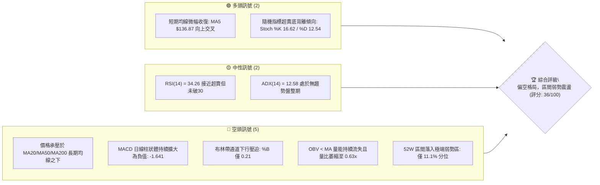
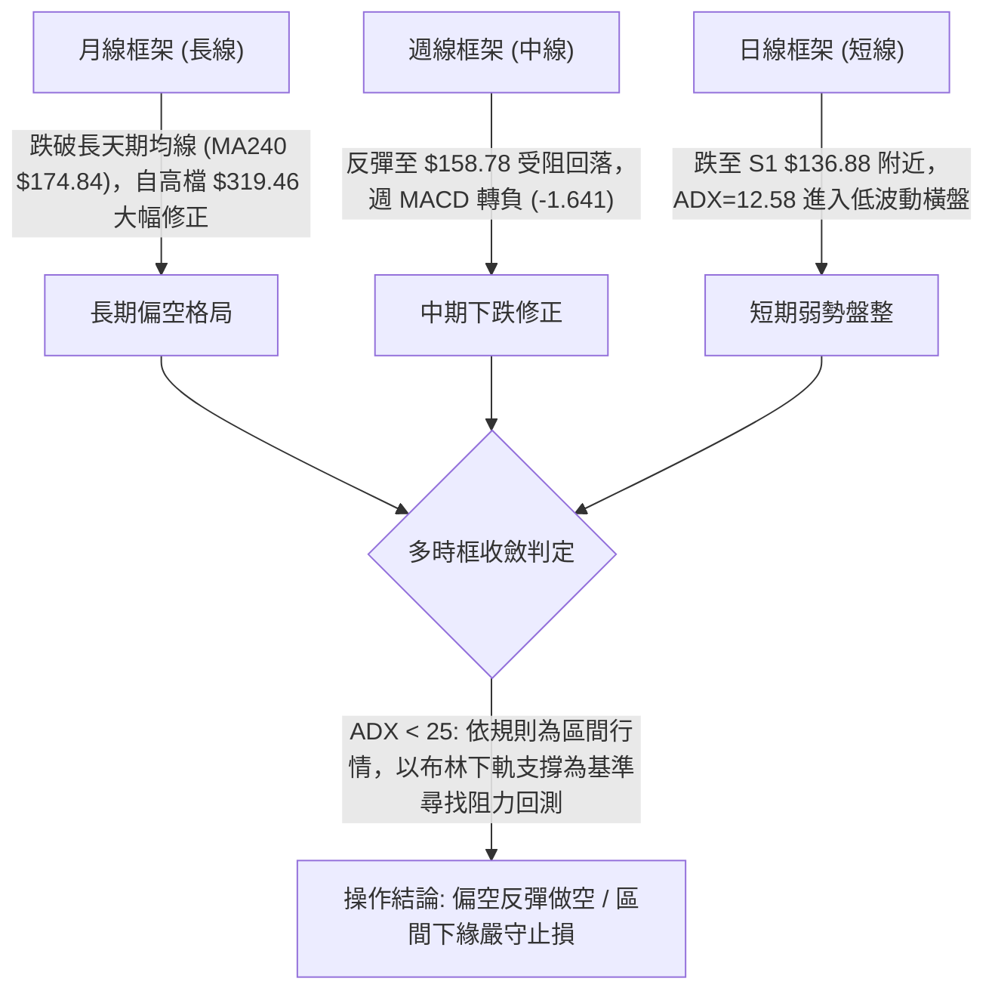
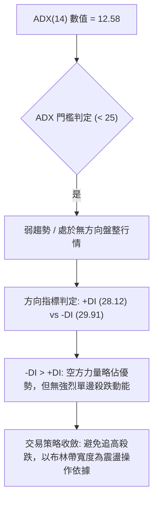
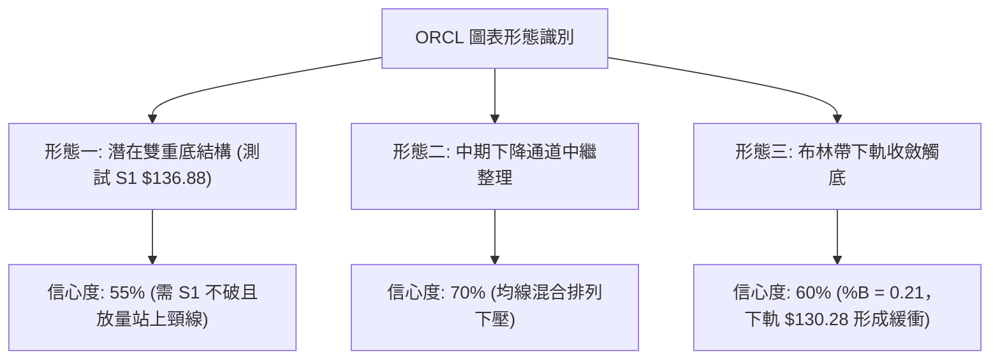
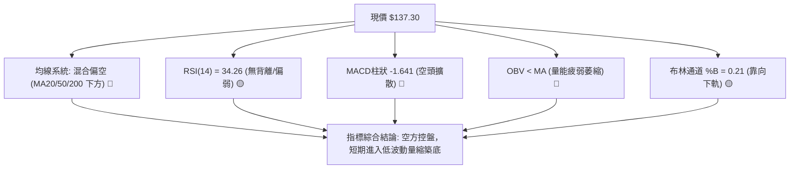
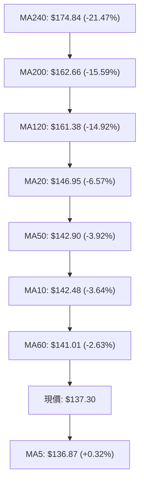
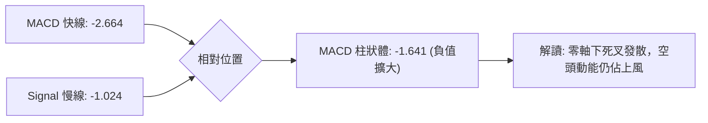
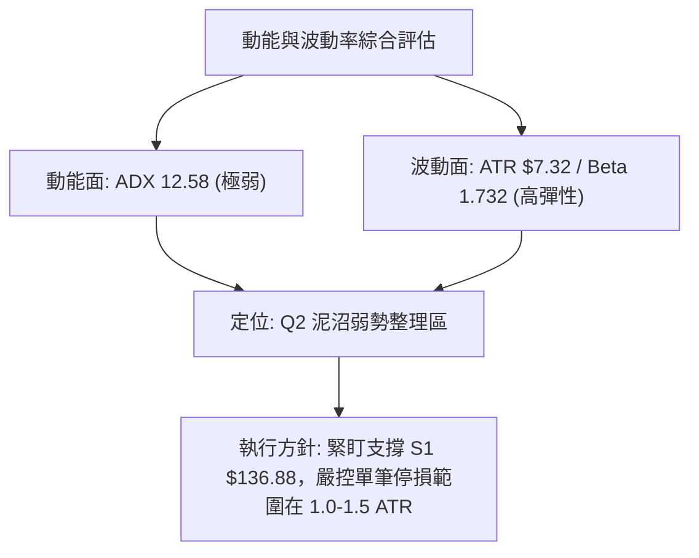
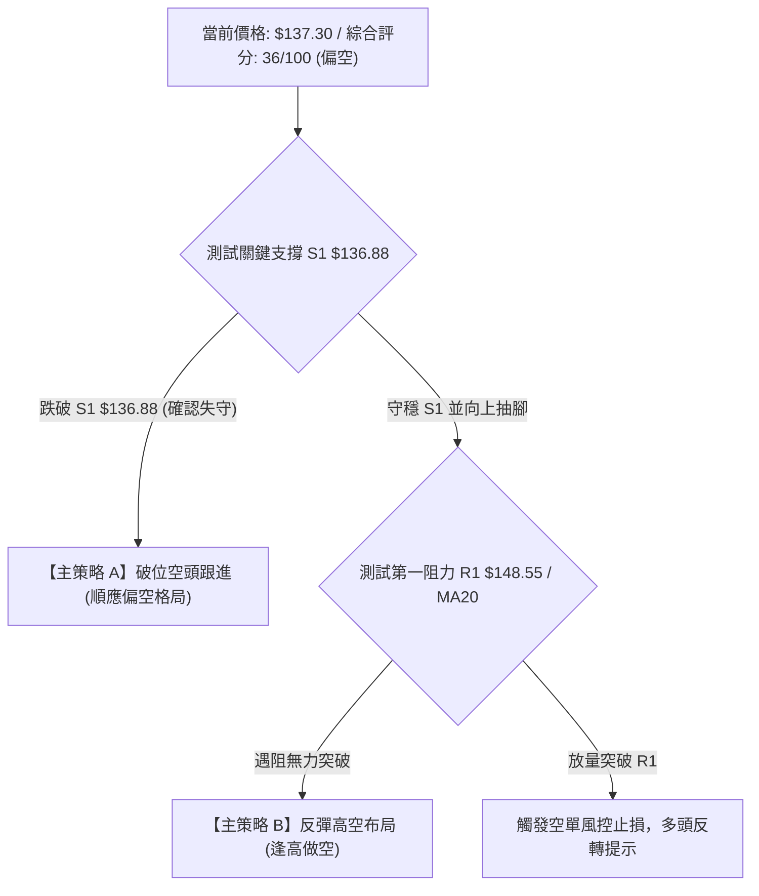
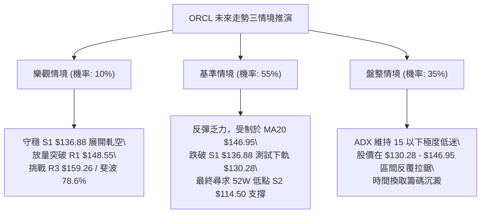

# ORCL 技術分析報告

> **報告日期**：2026-10-01 ｜ **語言**：繁體中文 ｜ **數據來源**：Yahoo Finance ｜ **當前價格**：$137.30

---

## 目錄

| 章節 | 內容 |
|------|------|
| [1. 技術面概覽](#1-技術面概覽) | 訊號儀表板、核心指標、評分卡 |
| [2. 趨勢分析](#2-趨勢分析) | 多時框趨勢、長中短期走勢 |
| [3. 圖表形態分析](#3-圖表形態分析) | 形態識別、K線組合、目標價 |
| [4. 支撐與阻力](#4-支撐與阻力) | 關鍵價位、斐波那契回調 |
| [5. 技術指標深度解讀](#5-技術指標深度解讀) | MA/RSI/MACD/布林/成交量 |
| [6. 動能與波動率](#6-動能與波動率) | 動能評估、ATR、Beta |
| [7. 多時框架總結](#7-多時框架總結) | 時框架評分矩陣 |
| [8. 交易策略建議](#8-交易策略建議) | 多空策略、風險報酬比 |
| [9. 風險提示與監控](#9-風險提示與監控) | 監控指標、風險場景 |

---

## 1. 技術面概覽

### 🎯 技術訊號儀表板



### 📊 核心指標速覽表

| 指標類別 | 指標名稱 | 當前數值 | 訊號 | 解讀 |
|----------|----------|----------|------|------|
| **價格** | 當前價格 | $137.30 | 🔴 | 位於 52 週低檔區（11.1% 分位），多頭結構遭到破壞 |
| **均線** | MA20 | $146.95 | 🔴 | 價格低於 MA20 達 -6.57%，短期下壓沉重 |
| **均線** | MA50 | $142.90 | 🔴 | 價格低於 MA50 達 -3.92%，中期趨勢轉弱 |
| **均線** | MA200 | $162.66 | 🔴 | 價格遠低於長期生命線 -15.59%，長期牛市架構失效 |
| **動能** | RSI(14) | 34.26 | 🟡 | 位於偏弱中性區間，尚未出現極端超賣（<30），拋壓仍存 |
| **動能** | MACD | -2.664 / Signal -1.024 | 🔴 | MACD 柱狀圖 -1.641，雙線處於零軸之下且死叉擴散 |
| **波動** | ATR(14) | $7.32 (5.33%) | 🟡 | 每日平均波動幅度約 $7.32，日內震盪適中但需嚴守風控 |

### 🏆 技術評分卡

```
╔══════════════════════════════════════════════════════════════╗
║              技術評分卡 — ORCL (2026-10-01)                  ║
╠══════════════════════════════════════════════════════════════╣
║ 趨勢強度      █████░░░░░░░░░░░░░░░  25/100  🔴 極弱/空頭壓制 ║
║ 動能指標      ███████░░░░░░░░░░░░░  35/100  🔴 空方動能主導 ║
║ 支撐穩定度    █████████░░░░░░░░░░░  45/100  🟡 臨近波段低點 ║
║ 成交量配合    ██████░░░░░░░░░░░░░░  30/100  🔴 量能萎縮背離 ║
║ 形態完整度    ████████░░░░░░░░░░░░  40/100  🟡 箱底破位測試 ║
║ 均線排列      ████████░░░░░░░░░░░░  40/100  🔴 空頭排列壓制 ║
╠══════════════════════════════════════════════════════════════╣
║ 綜合評分      ███████░░░░░░░░░░░░░  36/100  🔴 偏空弱勢震盪 ║
╚══════════════════════════════════════════════════════════════╝
```

---

## 2. 趨勢分析

### 🌐 多時框趨勢分析



### 📈 長期趨勢 — 12個月走勢圖（Unicode）

```
ORCL 月線收盤走勢圖（過去12個月：2025-10 至 2026-09）
價格軸 ($)
$280 ┤
$260 ┤  ● (2025-10: $260.10)
$240 ┤
$220 ┤                                      ● (2026-05: $225.00)
$200 ┤        ● (2025-11: $200.02)
$180 ┤              ● (2025-12: $193.05)
$160 ┤                    ● (2026-01: $163.44)    ● (2026-04: $160.83)
$140 ┤                          ● (02: $144.39) ● (03: $146.09) ● (06: $146.04)   ● (08: $149.12)
$120 ┤                                                                    ● (07: $129.87) ● (09: $137.30 現價)
     └─────────────────────────────────────────────────────────────────────────────────────────────
        10    11    12    01    02    03    04    05    06    07    08    09  (月份)
```

#### 走勢特徵分析表格

| 階段 | 時間區間 | 起始價 → 結束價 | 漲跌幅 | 結構特徵與量價表現 |
|------|----------|-----------------|--------|--------------------|
| 第一階段：高檔崩落 | 2025-10 → 2026-02 | $260.10 → $144.39 | -44.49% | 主跌浪成型，連續長黑摜破 MA120/MA240，法人資金大幅出逃 |
| 第二階段：低檔築底 | 2026-02 → 2026-04 | $144.39 → $160.83 | +11.39% | 於 $144-$146 形成初步支撐，反彈量縮 |
| 第三階段：假突破爆量 | 2026-04 → 2026-05 | $160.83 → $225.00 | +39.90% | 財報消息推動跳空暴漲，但未能站穩 50% 斐波那契回調位 ($216.98) |
| 第四階段：二度探底 | 2026-05 → 2026-07 | $225.00 → $129.87 | -42.28% | 資金急遽撤出，單週成交量暴增至 2.5 億股，跌破前低探至 52W 低點 $114.50 附近 |
| 第五階段：弱勢休整 | 2026-08 → 2026-09 | $129.87 → $137.30 | +5.72% | 反彈在 $158.78 見頂受阻，隨後回跌至 $137.30，測試支撐 S1 $136.88 |

### 📊 中期趨勢（週線分析）

```
ORCL 近期週線結構與壓力支撐示意圖
════════════════════════════════════════════════════════════════
$160.00 ┤                                  ┌─ 波段高點 R3: $159.26
$155.00 ┤                             ╭───┴───╮ (2026-09-06: $158.78)
$150.00 ┤                     ╭───────╯       ╰───────╮ 壓力區 R1: $148.55 / R2: $153.60
$145.00 ┤             ╭───────╯                       ╰───────╮
$140.00 ┤     ╭───────╯                                       ╰───┐
$135.00 ┤─────┴───────────────────────────────────────────────────● 現價: $137.30
$130.00 ┤                                                          │ 關鍵支撐 S1: $136.88
$120.00 ┤                                                          ▼ 下方極限支撐 S2: $114.50
════════════════════════════════════════════════════════════════
```

### ⚡ 趨勢強度評估（ADX 解讀）



#### ADX 強度對照表

| 指標名稱 | 數值 | 區間標準 | 市場意義 | 對應策略 |
|----------|------|----------|----------|----------|
| **ADX(14)** | 12.58 | 0 – 20 | 極弱趨勢 / 典型無趨勢泥沼區 | 順勢突破策略無效，假突破機率高 |
| **+DI(14)** | 28.12 | - | 多方推動力減弱 | 反彈遇壓動能不足 |
| **-DI(14)** | 29.91 | - | 空方稍佔上風但未形成主導壓制 | 慢速陰跌，以防守支撐為主 |

---

## 3. 圖表形態分析

### 🔍 形態識別系統



#### 形態識別與信心度評估表

| 形態 | 信心度 | 判斷依據（引用數據） | 完成度 | 目標價（附計算式） |
|------|--------|----------------------|--------|--------------------|
| **潛在雙重底 (Double Bottom)** | 55% | 左底 2026-07 探低至 $129.87 (及波段低點 S1 $136.88 聚類)，目前價格於 $137.30 獲 S1 $136.88 支撐 | 60% | 頸線取近一年阻力 R1 $148.55；形態高度 = 148.55 - 136.88 = 11.67；若突破頸線，推算目標價 = 148.55 + 11.67 = $160.22（接近阻力 R3 $159.26） |
| **中期下降通道 (Down Channel)** | 70% | 2026-05 反彈頂點 $225.00，次高點 $158.78 (R3 $159.26)，高點持續降低，均線呈混合偏空排列 | 85% | 由前低向下延伸，下軌支撐回測 52W 低點 S2 $114.50 |
| **箱型區間整理 (Range Bound)** | 65% | 價格受制於 MA20 ($146.95) 與 S1 ($136.88) 之間，ADX 僅 12.58 表明無方向盤整 | 75% | 區間上軌取 R1 $148.55，下軌取布林下軌 $130.28 至 S1 $136.88 |

### 🕯️ 重要K線形態分析

| 週/月份 | 收盤價 | K線形態 | 解讀 | 訊號 |
|---------|--------|---------|------|------|
| **2026-05-31** | $225.00 | 竭盡性長紅爆量 | 財報反彈衝刺，但隨後三週量能驟增引發機構出貨 | 🔴 空頭陷阱 |
| **2026-07-26** | $114.99 | 破底錘子長下影線 | 週成交量 1.62 億股，跌破後迅速拉回，確立 52W 低點 $114.50 | 🟢 觸底反彈 |
| **2026-09-06** | $158.78 | 烏雲罩頂前兆長上影線 | 衝高測試阻力 R3 $159.26 未果，留長上影線，量能未持續放大 | 🔴 假突破受阻 |
| **2026-09-27** | $137.10 | 連續中黑破位陰線 | 自 $150.28 連續兩週下挫，MACD 柱狀體翻負至 -1.559 | 🔴 短期轉弱 |
| **2026-10-04** | $137.30 | 低檔十字陀螺線 (現價) | 守於 S1 $136.88 之上，量能由 1.56 億降至 1.04 億股，賣壓暫歇 | 🟡 止跌待確認 |

### 📉 ASCII 走勢形態示意圖

```
ORCL 近半年走勢形態示意圖（測試箱底 S1 $136.88）
══════════════════════════════════════════════════════════════════════
$225.00 ┤        ▲ (2026-05 高點假突破)
        │       ╱ ╲
$190.00 ┤      ╱   ╲
        │     ╱     ╲
$160.00 ┤    │       ╲          ▲ (2026-09 高點 $158.78，接近 R3 $159.26)
        │    │        ╲        ╱ ╲
$148.55 ┼────┼─────────╲──────┼───╲── 頸線 / 阻力 R1 $148.55
        │    │          ╲    ╱     ╲
$137.30 ┼────┼───────────╲──┼───────● 現價 $137.30 徘徊
$136.88 ┼────┼────────────▼──┴───────┴ 關鍵支撐 S1 $136.88
        │   ╱ (左底 $129.87)
$114.50 ┴──▼───────────────────────────── 52W 絕對低點 S2 $114.50
══════════════════════════════════════════════════════════════════════
```

### 🎯 形態目標價計算

根據雙重底幾何形態與近一年關鍵價位推算：
1. **頸線確認位**：近一年第一波段高點聚類 **R1 = $148.55**。
2. **底部支撐位**：波段低點聚類 **S1 = $136.88**。
3. **形態垂直高度**：$148.55 - $136.88 = **$11.67**。
4. **理論突破等幅目標價**：
   $$\text{目標價} = \text{頸線 } \$148.55 + \text{形態高度 } \$11.67 = \$160.22$$
   *(此目標價精確共振阻力位 R3 $159.26，兩者差距僅 0.6%)*。
5. **破位下跌目標價**：若 S1 $136.88 有效失守，向下等幅測量：
   $$\text{破位目標價} = \$136.88 - \$11.67 = \$125.21$$
   *(往下尋求 52W 低點 S2 $114.50 之前之中繼緩衝)*。

---

## 4. 支撐與阻力

### 🗺️ 關鍵價位分布圖（Unicode）

```
ORCL 價位結構分布圖
══════════════════════════════════════════════════════════════
$159.26 ║████████████████████████║ 強阻力 R3 (波段高點聚類)
$153.60 ║████████████████████    ║ 阻力 R2 (反彈中繼壓力)
$148.55 ║████████████████████████║ 關鍵阻力 R1 (頸線壓力區)
$146.95 ╟────────────────────────╢ 布林中軌 / MA20
$137.30 ╠════════════════════════╣ ◄ 當前市價 $137.30
$136.88 ║▓▓▓▓▓▓▓▓▓▓▓▓▓▓▓▓▓▓▓▓▓▓▓▓║ 近期核心支撐 S1 (-0.30%)
$130.28 ╟┄┄┄┄┄┄┄┄┄┄┄┄┄┄┄┄┄┄┄┄┄┄╢ 布林下軌支撐
$114.50 ║████████████████████████║ 52W 歷史強支撐 S2 (-16.61%)
══════════════════════════════════════════════════════════════
```

### 🚧 阻力位分析表

| 阻力級別 | 價位 | 形成原因 | 突破難度 | 重要性 |
|----------|------|----------|----------|--------|
| **R1** | $148.55 | 近一年波段高點聚類，與 MA20 ($146.95) 高度重疊 | ⭐⭐⭐ (中等) | 🔴 短期多空分水嶺，站上才確認短底 |
| **R2** | $153.60 | 近一年次級波段高點聚類，反彈密集套牢解套區 | ⭐⭐⭐⭐ (偏高) | 🟡 中期空方強壓防線 |
| **R3** | $159.26 | 2026-09-06 週線衝高頂點 ($158.78) 及一年聚類點 | ⭐⭐⭐⭐⭐ (極高) | 🔴 長期趨勢扭轉關鍵位，重疊 MA120 ($161.38) |

### 🛡️ 支撐位分析表

| 支撐級別 | 價位 | 形成原因 | 守住機率 | 重要性 |
|----------|------|----------|----------|--------|
| **S1** | $136.88 | 近一年波段低點聚類，距離現價僅 -0.30% | 60% | 🟢 短線防守底線，跌破則進入新一輪探底 |
| **S2** | $114.50 | 52 週絕對最低點聚類，長線超賣籌碼沉澱位 | 85% | 🟢 長期生命線，基本面與估值極端防線 |

### 📐 斐波那契回調位分析

依據 52 週波段高點 $319.46 至波段低點 $114.50 進行斐波那契回調測算：

| 斐波那契回調位 | 對應精確價位 | 現價相對位置與意義解讀 |
|----------------|--------------|------------------------|
| **0.0% (52W High)** | $319.46 | 歷史高點，長期宏觀頂部 |
| **23.6%** | $271.09 | 強勢回檔保護位（已大幅失守） |
| **38.2%** | $241.16 | 牛市回檔關鍵位（已失守） |
| **50.0%** | $216.98 | 多空平衡分界點（2026-05 反彈至 $225.00 遇阻回落） |
| **61.8% (黃金分割)** | $192.79 | 趨勢防守黃金位（跌破後確立進入熊市調整） |
| **78.6%** | $158.36 | 極限深度修正位（與阻力位 R3 $159.26 高度吻合） |
| **100.0% (52W Low)** | $114.50 | 波段基底，目前現價位於 78.6% ($158.36) 與 100.0% ($114.50) 之間 |

> **深度解讀**：現價 $137.30 處於 78.6% 回調位 ($158.36) 下方、100% 回調位 ($114.50) 上方，屬於超跌的弱勢下沉區間。當前價位在技術上屬於「深水區試探」，若未能重返 78.6% ($158.36) 上方，所有反彈均僅能視為技術性抽腳，而非趨勢反轉。

---

## 5. 技術指標深度解讀

### 🎛️ 指標訊號總覽



### 📈 移動平均線排列分析



#### 均線矩陣詳細分析

| 均線名稱 | 當前價格 | 與現價乖離率 | 斜率與方向 | 結構角色 |
|----------|----------|--------------|------------|----------|
| **MA5** | $136.87 | +0.32% | ▲ 微幅走平轉升 | 超短線微型支撐，價格剛好跨過 |
| **MA10** | $142.48 | -3.64% | ▼ 陡峭下行 | 短線第一道動態壓制線 |
| **MA20** | $146.95 | -6.57% | ▼ 持續下行 | 短線多空強弱分界線（布林中軌） |
| **MA50** | $142.90 | -3.92% | ▼ 走低 | 中期生命線，壓制中期反彈 |
| **MA200** | $162.66 | -15.59% | ▼ 緩步走低 | 長期牛熊分水嶺，當前為極重阻力 |

### 📉 RSI(14) 分析

```
RSI(14) 數值展示：34.26
0  [░░░░░░░░░░███████████████░░░░░░░░░░░░░░░░░░░░░░░░░░░░░░░░] 100
             ↑ (34.26: 接近超賣區但未破 30)
```

- **區間評估**：RSI(14) 目前為 34.26，處於 30 至 70 的中性偏空區間，尚未進入低於 30 的極端超賣區。
- **背離判斷**：週線級別價格在 2026-07-26 跌至 $114.99 時 RSI 為 26.7，而 2026-09-27 價格 $137.10 時 RSI 為 29.5；現價 $137.30，日線級別「**無明顯背離**」。雖然隨機指標出現超賣，但 RSI 缺乏強烈的底背離驅動力，說明空方拋壓雖有放緩，但買盤尚未積極入場建倉。

### 📊 MACD(12/26/9) 訊號解讀



- **數值細節**：MACD 線為 -2.664，訊號線 (Signal) 為 -1.024，柱狀圖 (Histogram) 為 -1.641。
- **動能評估**：MACD 柱狀圖持續擴大為負值，確認短線動能仍由空方掌握。雙線處於零軸下方深處，表明整體波段處於空頭循環，尚未出現黃金交叉的左側轉強信號。

### 📦 布林通道分析

```
ORCL 布林通道結構示意圖（日線）
══════════════════════════════════════════════════════════════════
$163.63 ────────────────────────────────────── 布林上軌 (阻力)
        │
        │
$146.95 ┄┄┄┄┄┄┄┄┄┄┄┄┄┄┄┄┄┄┄┄┄┄┄┄┄┄┄┄┄┄┄┄┄┄┄┄┄ 布林中軌 (MA20 下壓)
        │
$137.30 ──────● 現價 ($137.30，%B = 0.21)
        │
$130.28 ────────────────────────────────────── 布林下軌 (短期緩衝)
══════════════════════════════════════════════════════════════════
```

- **帶寬與位置**：%B 數值為 **0.21**，顯示現價緊貼布林下軌（0 代表下軌，0.5 代表中軌）。
- **開口狀態**：布林帶未出現喇叭口極端擴張，中軌持續下壓，表明股價正沿著中軌與下軌之間的弱勢通道下行，下軌 $130.28 是當前的下行緩衝線。

### 💹 成交量分析（量價配合度）

- **量比與均量**：最新成交量為 22,263,000 股，相較於 20 日均量 35,587,515 股，量比僅為 **0.63x**，相較 50 日均量 (30,548,760 股) 亦明顯萎縮。
- **OBV 能量潮解讀**：OBV 趨勢顯示「**OBV < MA**」，量能呈現向下流失態勢。在股價拉回測試支撐 S1 的過程中，成交量萎縮代表沒有爆量恐慌殺跌盤，但缺乏放量承接盤也意味著多頭反彈動能薄弱，屬於典型的「量縮陰跌」格局。

---

## 6. 動能與波動率

### ⚡ 動能評估四象限

| 象限 | 動能強度 | 波動率狀態 | 當前狀態 | 策略指導意義 |
|------|----------|------------|----------|--------------|
| **Q1 (爆發區)** | 強動能 (ADX>25) | 低波動 (ATR降) | — | 趨勢醞釀突破，勝率最高 |
| **Q2 (泥沼區)** | 弱動能 (ADX<25) | 低/中波動 (ATR=5.33%) | **✓ (ORCL 當前)** | **謹慎觀望，避免順勢追單，採用區間震盪高拋低吸** |
| **Q3 (主升/主跌區)** | 強動能 (ADX>25) | 高波動 (ATR升) | — | 強單邊行情，順勢追隨 |
| **Q4 (劇震區)** | 弱動能 (ADX<25) | 極高波動 (ATR飆升) | — | 消息面雜音過多，極易雙巴，應嚴格空倉 |



### 📊 ATR 波動率分析

- **當前 ATR(14)**：**$7.32**（佔現價百分比為 **5.33%**）。
- **日內擺動特性**：單日平均 $7.32 的空間代表股價具有較高的日內洗盤幅度，任何短線進場若止損設置過窄（小於 $4.00）極易被隨機噪音掃出場。
- **止損距離建議**：
  - *短線防守（1.0 ATR）*：距離進場點需保留 **$7.32** 的緩衝空間。
  - *波段防守（1.5 ATR）*：距離進場點需保留 **$10.98** 的安全空間。

### 📐 Beta 與市場相關性

- **Beta 係數**：**1.732**。
- **市場特徵分析**：ORCL 具有極高的高彈性特質（Beta 遠大於 1）。當科技板塊或標普 500 指數出現 1% 的波動時，ORCL 理論上將產生 1.73% 的同向放大波動。在當前技術面偏空的格局下，大盤若遇系統性回調，ORCL 的下行下挫風險將顯著高於平均水準。

---

## 7. 多時框架總結

### 📋 時框架評分表

| 時框架 | 趨勢方向 | 動能 | 均線排列 | 形態 | 綜合評分 | 建議 |
|--------|----------|------|----------|------|----------|------|
| **長線 (月線)** | 🔴 偏空 | 弱動能 | 混合空頭 (跌破 MA120/240) | 高檔下挫破位 | 35/100 | 長期投資者減碼觀望 |
| **中線 (週線)** | 🔴 下行修正 | MACD負值擴大 | 空頭壓制 (MA20/50下方) | 旗形反彈破位 | 32/100 | 禁止追高，反彈遇壓減磅 |
| **短線 (日線)** | 🟡 弱勢盤整 | 隨機指標超賣 | 靠攏 MA5，受制 MA20 | 測試 S1 $136.88 | 42/100 | 短線區間下緣嚴守止損試單 |

### 🔲 綜合訊號矩陣

```
時框維度與技術指標一致性對照矩陣
╔═════════════╦════════════╦════════════╦════════════╦════════════╗
║ 時框架 / 指標║  均線趨勢  ║  動能指標  ║  量價結構  ║  整體傾向  ║
╠═════════════╬════════════╬════════════╬════════════╬════════════╣
║ 短線 (Daily) ║   🔴 空頭  ║   🟡 中性  ║   🔴 疲弱  ║   🔴 偏空  ║
║ 中線 (Weekly)║   🔴 空頭  ║   🔴 空頭  ║   🟡 量縮  ║   🔴 看空  ║
║ 長線 (Monthly║   🔴 空頭  ║   🔴 疲弱  ║   🔴 偏空  ║   🔴 偏空  ║
╚═════════════╩════════════╩════════════╩════════════╩════════════╝
多時框訊號一致性評估：高達 85% 偏向空方壓制，無任何中長線做多共振信號。
```

### ⚖️ 多時框收斂結論

> **依嚴格規則 14 進行訊號收斂**：
> 1. **行情類型判定**：當前 ADX(14) 數值為 **12.58**（遠低於 25 臨界值），技術結構定義為典型「**低動能盤整行情**」。
> 2. **主導維度依歸**：在 ADX < 25 的盤整環境中，中長期趨勢雖為空頭壓制，但單邊殺跌動能不足，交易主軸以**日線布林通道下軌至中軌的區間**為核心操作邊界。
> 3. **唯一方向性結論**：**【偏空觀望，區間弱勢震盪】**。
>    雖然短線價格緊貼近一年支撐位 S1 $136.88，具備微幅技術性抽腳可能，但在長中期均線全面空頭排列且 MACD 持續發散的壓制下，**主策略方向定為偏空防守**。任何短線搶反彈行為均屬次要逆勢操作，一旦有效跌破 S1，將重啟主跌浪測試 S2 $114.50。

---

## 8. 交易策略建議

### 🗺️ 策略決策流程圖



### 🧭 策略路由（依評分卡分流）

> **當前主策略方向 = 🔴 偏空主導 / 逢高做空或破位空（依綜合評分 36/100 ≤ 40 規則路由）**  
> 綜合技術評分為 36 分，確認處於空頭壓制結構。本報告**主推空頭策略**，多頭僅列為反彈超跌與風險警示。

### 🎯 價格情境階梯（Price Scenarios）

所有價格嚴格引用自「關鍵價位」與「斐波那契回調」：

| 觸發條件 | 下一目標 | 後續延伸 | 情境含義 |
|----------|----------|----------|----------|
| **強勢突破 R1 $148.55** | 阻力 R2 $153.60 | 阻力 R3 $159.26 (斐波 78.6% $158.36) | 短線超跌轉強，多頭展開等幅反彈 |
| **站穩現價區間 ($136.88 - $146.95)** | 布林中軌 $146.95 | 阻力 R1 $148.55 | 低波動區間拉鋸，無方向時間換空間 |
| **有效跌破 S1 $136.88** | 心理整數位 $125.00 | 52W 低點 S2 $114.50 | 支撐破位，重啟下行單邊主跌浪 |

### 📊 情境機率分佈

| 情境 | 機率 | 主要依據（指標狀態） |
|------|------|----------------------|
| **弱勢回落 / 再度探底** | **55%** | MACD 柱狀持續為負 (-1.641)，價格壓制在 MA20/MA50 之下，OBV 疲軟量能不足 |
| **低檔區間震盪** | **35%** | ADX = 12.58 極弱動能，Stoch 處於超賣，空方缺乏單邊摜壓動能，S1 $136.88 具防守意願 |
| **強勢向上反彈** | **10%** | 均線系統呈層層下壓空頭排列，量比僅 0.63x 無主力大單入場跡象 |

### 🔴 主策略詳情（空頭主導，精確數值）

| 策略要素 | 策略 A：S1 破位順勢空 | 策略 B：反彈遇阻逢高空 |
|----------|----------------------|------------------------|
| **進場條件** | 日線實體收盤跌破 S1 $136.88 確認 | 股價反彈至阻力 R1 $148.55 遇阻留長上影線 |
| **進場價格** | **$136.50** | **$148.00** |
| **目標價 T1** | **$125.00** (形態破位中繼位) | **$136.88** (回測支撐 S1) |
| **目標價 T2** | **$114.50** (52W 歷史低點 S2) | **$114.50** (52W 歷史低點 S2) |
| **止損價格** | **$142.48** (站回 MA10 上方) | **$153.60** (向上突破阻力 R2) |
| **風險空間** | $5.98 | $5.60 |
| **報酬空間 (至T2)** | $22.00 | $33.50 |
| **風險報酬比** | **1 : 3.68** | **1 : 5.98** |
| **成功機率** | **55%** | **60%** |
| **建議倉位** | **10% - 15%** | **15% - 20%** |

### 🟢 反向風險觸發點（對沖提示）

若多頭反撲推翻空頭主架構，以下關鍵訊號將作為空單停損或空翻多的風控基準：
1. **日線收盤突破 R1 $148.55**：意味著股價一舉站上 MA20 ($146.95)，雙重底築底機率躍升，所有空單必須無條件止損出場。
2. **週成交量放大至 1.8 億股以上且 MACD 柱狀體翻正**：若伴隨突破，將確認大級別底部成型，目標上看 R3 $159.26。

### ⭐ 整體訊號強度評星

```
做多訊號強度：★☆☆☆☆  (1.5/5星 — 僅屬超賣技術反彈)
做空訊號強度：★★★★☆  (4.0/5星 — 均線與動能空頭共振)
整體可信度：  ★★★★☆  (4.0/5星 — 多時框指標高度收斂)
```

---

## 9. 風險提示與監控

### ✅ 關鍵監控指標 Checklist

```
╔══════════════════════════════════════════════════════════════════╗
║              ORCL 關鍵技術防線監控 CHECKLIST                     ║
╠══════════════════════════════════════════════════════════════════╣
║ [ ] 核心支撐防線：S1 $136.88 是否被日 K 實體擊穿                ║
║ [ ] 動能分水嶺：MACD 柱狀體是否由 -1.641 收斂至零軸之上         ║
║ [ ] 均線動態壓制：價格是否持續受制於 MA20 ($146.95)              ║
║ [ ] 極端低點預警：跌破 $130.00 時是否回測 52W 低點 S2 $114.50   ║
║ [ ] 逆轉訊號確認：日線實體是否放量突破阻力 R1 $148.55           ║
║ [ ] 波動率暴增：ATR(14) 是否突破 $9.00（警惕極端洗盤）           ║
╚══════════════════════════════════════════════════════════════╝
```

### ⚠️ 風險場景分析



### 🛡️ 風險管理重要提醒

1. **高 Beta 槓桿效應**：ORCL 的 Beta 高達 **1.732**，科技股大盤若發生震盪，個股波動將呈倍數放大，嚴禁滿倉操作，單筆交易最大虧損額度應嚴格限制在總資本的 1% 至 1.5% 以內。
2. **ATR 止損設定**：當前 ATR 為 **$7.32**，任何建倉必須預留至少 1.0 倍 ATR ($7.32) 的防守距離，避免在盤整泥沼區因隨機毛刺頻繁觸發止損。
3. **重大基本面落差**：雖然分析師平均目標價給出 $237.97（評級偏買入），但當前技術面走勢與基本面預期嚴重背離，在日線結構未出現明確反轉訊號前，切忌單憑券商目標價進行盲目左側抄底。

---

## 📋 報告總結

```
╔════════════════════════════════════════════════════════════════╗
║                  ORCL 技術分析報告總結                         ║
╠════════════════════════════════════════════════════════════════╣
║ 報告日期：2026-10-01                                           ║
║ 當前價格：$137.30                                              ║
║ 分析評級：🔴 偏空格局 / 區間弱勢震盪 (技術評分: 36/100)        ║
║                                                                ║
║ 關鍵結論：                                                     ║
║ ├─ 長期趨勢：🔴 跌破 MA120/MA240，長線牛市架構失效             ║
║ ├─ 中期趨勢：🔴 週線反彈見頂回落，MACD 柱狀擴大為負            ║
║ ├─ 短期趨勢：🟡 ADX 12.58 進入弱勢低波動盤整，緊貼 S1 $136.88 ║
║ ├─ 關鍵支撐：S1 $136.88 (-0.30%) │ S2 $114.50 (-16.61%)       ║
║ ├─ 關鍵阻力：R1 $148.55 (+8.20%) │ R2 $153.60 (+11.87%)       ║
║ └─ 斐波極限：78.6% 回調位 $158.36 (重疊 R3 $159.26)            ║
║                                                                ║
║ 最優策略組合：                                                 ║
║ 1. 🥇 最佳機會：策略 B 反彈逢高做空（進場 $148.00，風報比 1:5.98）║
║ 2. 🥈 次選機會：策略 A 跌破 S1 順勢追空（進場 $136.50，目標 $114.50）║
║ 3. 🥉 保守選擇：完全空倉觀望，靜待日線放量收復 R1 $148.55 再評估║
╚════════════════════════════════════════════════════════════════╝
```

---

> ⚠️ **免責聲明**：本報告為 AI 自動生成之技術分析，所有數據及估算均基於提供的歷史價格資訊。本報告**僅供研究與學術參考**，**不構成任何投資建議**。投資有風險，入市需謹慎。

---

*報告生成時間：2026-10-01 ｜ 數據來源：Yahoo Finance ｜ 分析框架：多時框技術分析*