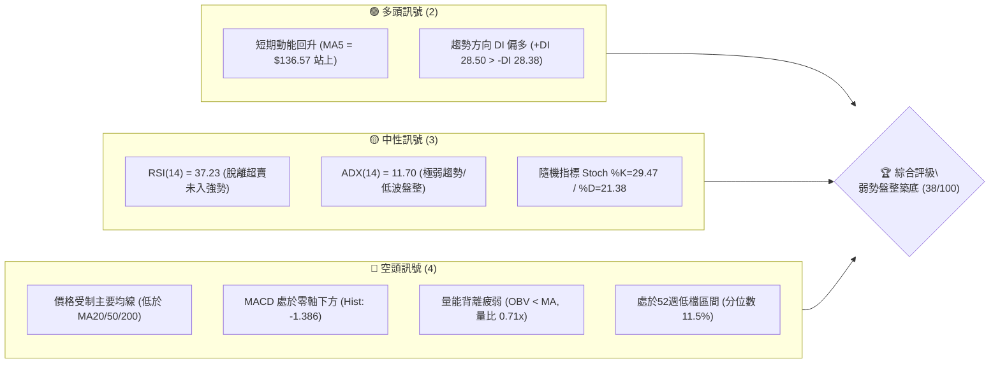
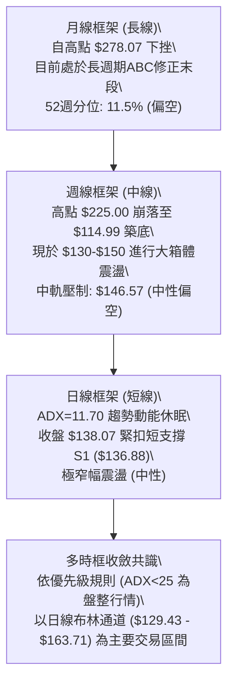
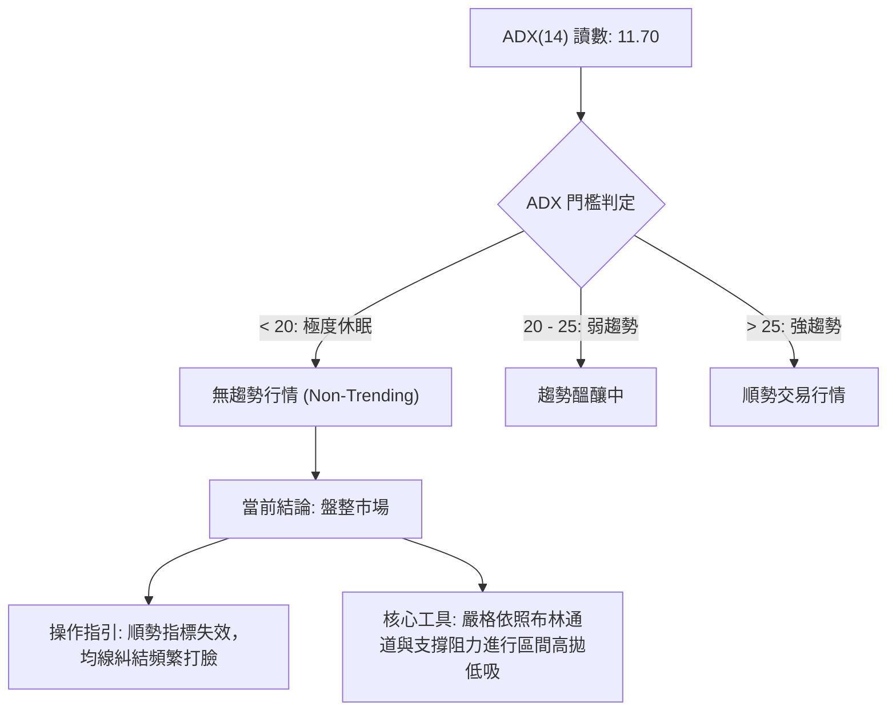
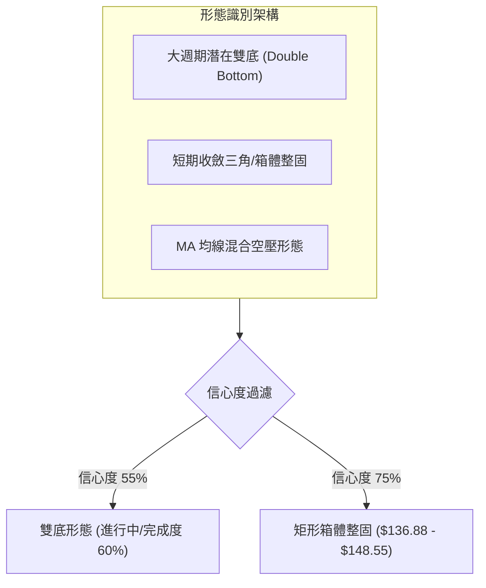
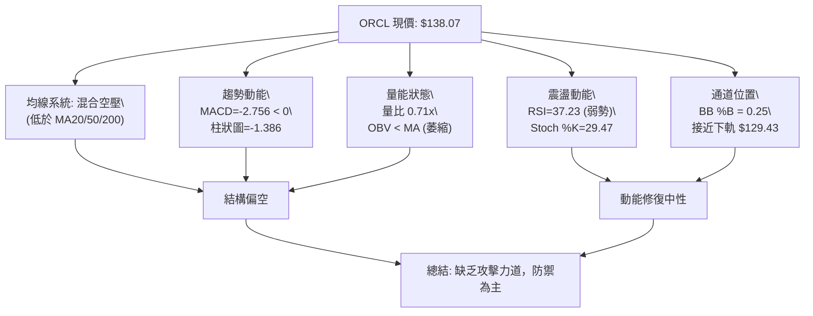
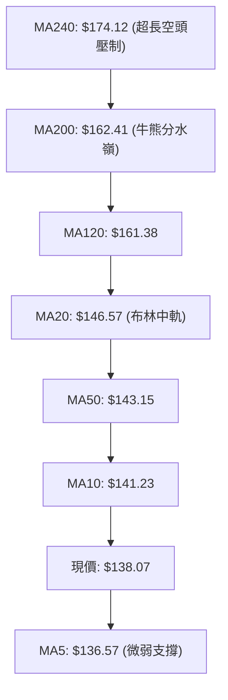
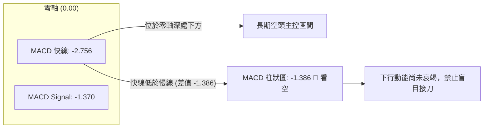
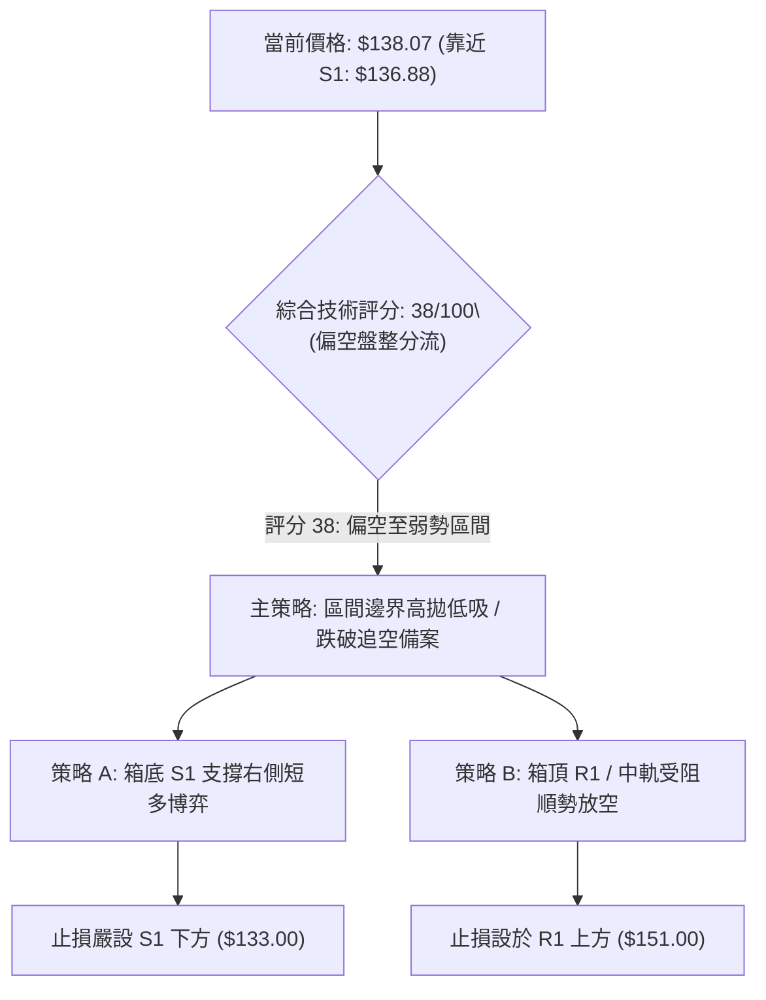
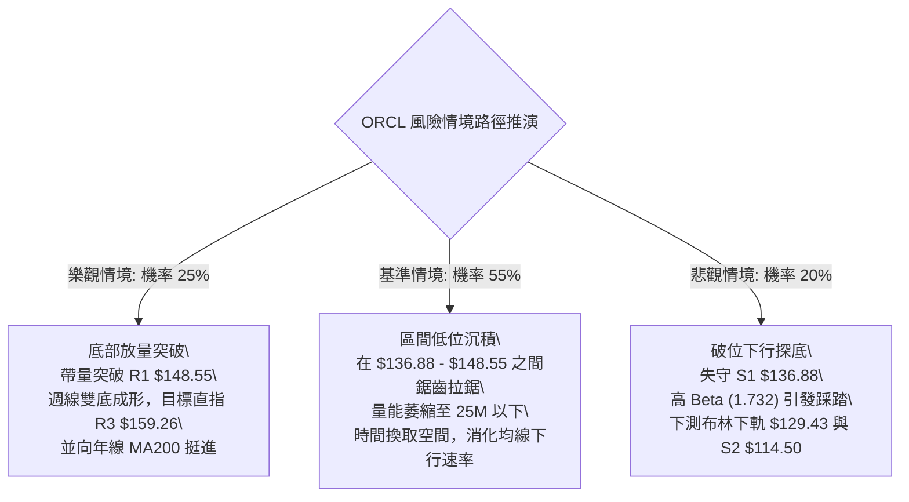

# ORCL 技術分析報告

> **報告日期**：2026-10-02 ｜ **語言**：繁體中文 ｜ **數據來源**：Yahoo Finance ｜ **當前價格**：$138.07

---

## 目錄

| 章節 | 內容 |
|------|------|
| [1. 技術面概覽](#1-技術面概覽) | 訊號儀表板、核心指標、評分卡 |
| [2. 趨勢分析](#2-趨勢分析) | 多時框趨勢、長中短期走勢 |
| [3. 圖表形態分析](#3-圖表形態分析) | 形態識別、K線組合、目標價 |
| [4. 支撐與阻力](#4-支撐與阻力) | 關鍵價位、斐波那契回調 |
| [5. 技術指標深度解讀](#5-技術指標深度解讀) | MA/RSI/MACD/布林/成交量 |
| [6. 動能與波動率](#6-動能與波動率) | 動能評估、ATR、Beta |
| [7. 多時框架總結](#7-多時框架總結) | 時框架評分矩陣 |
| [8. 交易策略建議](#8-交易策略建議) | 多空策略、風險報酬比 |
| [9. 風險提示與監控](#9-風險提示與監控) | 監控指標、風險場景 |
| [📋 報告總結](#-報告總結) | 全文核心精華摘要 |

---

## 1. 技術面概覽

### 🎯 技術訊號儀表板



### 📊 核心指標速覽表

| 指標類別 | 指標名稱 | 當前數值 | 訊號 | 解讀 |
|----------|----------|----------|------|------|
| **價格** | 當前收盤價 | $138.07 | 🔴 | 位於 52 週區間 ($114.50 - $319.46) 之 11.5% 分位，空頭主導後的弱勢低位 |
| **均線** | MA20 (短中軌) | $146.57 | 🔴 | 現價低於 MA20 達 -5.80%，短線受制中軌壓制，空頭排列初階 |
| **均線** | MA50 (中期線) | $143.15 | 🔴 | 現價低於 MA50 達 -3.55%，中期均線仍向下反壓 |
| **均線** | MA200 (牛熊線)| $162.41 | 🔴 | 現價遠低於 MA200 達 -14.99%，長期格局處於深度空頭修正 |
| **動能** | RSI(14) | 37.23 | 🟡 | 位於 30-70 中性偏弱區，未見極端超賣，無底背離確認 |
| **動能** | MACD (12,26,9)| -2.756 / -1.370 | 🔴 | MACD 雙線均在零軸下方，柱狀圖為 -1.386，顯示空頭下行慣性仍在 |
| **動能** | ADX (14) | 11.70 | 🟡 | ADX < 25 且處於極低位，表明當前處於無趨勢或盤整築底行情 |
| **通道** | 布林通道 %B | 0.25 | 🟡 | 現價位於布林下軌 ($129.43) 與中軌 ($146.57) 之間，近下軌支撐區 |
| **量能** | 量比 / OBV | 0.71x / 疲弱 | 🔴 | 單日量 25.35M 低於 20 日均量 35.76M；OBV 處於均線下方，資金意願低 |
| **波動** | ATR(14) | $6.51 (4.72%)| 🟡 | 每日平均波動幅度約 $6.51，波幅收斂中，需預防低波動後的方向性突破 |

### 🏆 技術評分卡

```
╔════════════════════════════════════════════════════════════════╗
║             技術評分卡 — ORCL (2026-10-02)                     ║
╠════════════════════════════════════════════════════════════════╣
║ 趨勢強度 (ADX=11.70 無明確主趨勢)  ████░░░░░░░░░░░░░░░░  20/100 🔴 ║
║ 動能指標 (MACD空頭/RSI弱勢中性)    ███████░░░░░░░░░░░░░  35/100 🔴 ║
║ 支撐穩定度 (S1=$136.88 反覆測試)   ██████████░░░░░░░░░░  50/100 🟡 ║
║ 成交量配合 (量縮0.71x, OBV偏弱)    ██████░░░░░░░░░░░░░░  30/100 🔴 ║
║ 形態完整度 (低位收斂區間震盪)      ████████░░░░░░░░░░░░  40/100 🟡 ║
║ 均線排列 (短中長期均線全面空壓)    █████░░░░░░░░░░░░░░░  25/100 🔴 ║
╠════════════════════════════════════════════════════════════════╣
║ 綜合技術評分                       ███████░░░░░░░░░░░░░  38/100 🔴 ║
║ 評級結論：偏空盤整 (Weak Consolidation) / 等待區間方向確認    ║
╚════════════════════════════════════════════════════════════════╝
```

---

## 2. 趨勢分析

### 🌐 多時框趨勢分析



### 📈 長期趨勢 — 12個月走勢圖（Unicode）

```
ORCL 月線收盤走勢圖（過去12個月：2025-11 至 2026-10）
價格軸 ($)
$270 ┤
$240 ┤
$210 ┤                               ● $225.00 (2026-05 反彈次高)
$180 ┤ ● $200.02 (2025-11)
$150 ┤       ● $193.05    ● $160.83         ● $146.04        ● $149.12
$140 ┤             ● $163.44    ● $146.09                           ● $138.07 ◄現價
$130 ┤                   ● $144.39                 ● $129.87    ● $137.30
$110 ┤                                                   ●(波段底 $114.99 / 52W低 $114.50)
     └─┬────┬────┬────┬────┬────┬────┬────┬────┬────┬────┬────┬──
      11月 12月  1月  2月  3月  4月  5月  6月  7月  8月  9月 10月
      2025 2025 2026 2026 2026 2026 2026 2026 2026 2026 2026 2026
```

#### 走勢特徵分析表格

| 階段 | 時間區間 | 起止價格 | 漲跌幅 | 結構與量能特徵 |
|------|----------|----------|--------|----------------|
| **長線崩跌段** | 2025-10 至 2026-02 | $260.10 → $144.39 | -44.49% | 連續失守均線群，估值均值回歸與雲端資本支出壓力釋放，量能放大殺多。 |
| **技術反抽段** | 2026-02 至 2026-05 | $144.39 → $225.00 | +55.83% | 超跌後報復性強彈，5月底衝高至 $225.00，但未觸及歷史前高 $278.07。 |
| **二次探底段** | 2026-05 至 2026-07 | $225.00 → $129.87 | -42.28% | 2026-06 與 07 月重挫，週成交量暴增至 2.52 億股（07-19當週），砸出 52 週極限低點 $114.50 / $114.99。 |
| **箱體震盪段** | 2026-08 至 2026-10 | $129.87 → $138.07 | +6.31% | 觸底後反彈至 $158.78（09-06當週），隨後回落至 $137-$138 區間沉澱，波動大幅鈍化。 |

### 📊 中期趨勢（週線分析）

中期走勢呈現「重挫後的大型橫盤築底」。2026-07-26 觸及 $114.99 低點後，多頭曾發動連續三週強勁反攻，最高於 2026-09-06 達 $158.78，精準受阻於斐波那契 78.6% 回調位 ($158.36) 與波段高點聚類 R3 ($159.26)。隨後 4 週持續陰跌回吐，最新一週（2026-10-04）收在 $138.07，週線 RSI 由 61.5 回落至 37.2，週 MACD 柱狀圖翻負 (-1.386)，表明反彈動能衰退，中期重回下檔支撐防禦戰。

```
近期週線壓力支撐示意圖：
阻力位 R3 ── $159.26 ════════════════════════════ (09/06 衝高遇阻點)
阻力位 R2 ── $153.60 ----------------------------
阻力位 R1 ── $148.55 ---------------------------- (反彈第一道頸線)
中軌壓制  ── $146.57 ---------------------------- (MA20 下彎壓制)
當前價格  ── $138.07 ◄─── (弱勢沉澱點)
支撐位 S1 ── $136.88 ════════════════════════════ (近一年關鍵低點聚類)
強支撐 S2 ── $114.50 ════════════════════════════ (52週絕對低點)
```

### ⚡ 趨勢強度評估（ADX 解讀）



#### ADX 與方向指標強度對照表

| 指標項 | 當前數值 | 參考標準 | 狀態評估 | 技術含義 |
|--------|----------|----------|----------|----------|
| **ADX(14)** | **11.70** | > 25.0 趨勢確認 | 🔴 極度弱勢 | 市場動能完全收斂，單邊下行告一段落，進入垃圾時間/無方向盤整。 |
| **+DI(14)** | **28.50** | > -DI 偏多 | 🟢 多頭暫佔上風 | 多方買盤在下檔略有抵抗，但無法轉化為實質趨勢拉升。 |
| **-DI(14)** | **28.38** | > +DI 偏空 | 🟡 空方未佔絕對優勢 | +DI 與 -DI 差距僅 0.12，兩者緊密交纏，確認無單邊主導力道。 |

---

## 3. 圖表形態分析

### 🔍 形態識別系統



#### 形態信心度與目標價評估表

| 形態類別 | 信心度 | 判斷依據（數據引用） | 完成度 | 目標價（附嚴格計算式） |
|----------|--------|----------------------|--------|------------------------|
| **大週期潛在雙底** | 55% | 第一次低點為 2026-07 探底之 S2 ($114.50)，反彈高點至 2026-09-06 之 $158.78；現價 $138.07 於 S1 ($136.88) 尋求次低點支撐。 | 60% | 若守穩 S1 並向上突破頸線 R3 ($159.26)，依形態高度推算：<br>頸線 $159.26 + ($159.26 - $114.50) = **$204.02** |
| **短線矩形箱體** | 75% | 價格反覆受壓於 R1 ($148.55) 與布林中軌 ($146.57)，下檔密集獲得 S1 ($136.88) 支撐。 | 85% | 若突破箱頂 R1 ($148.55)：<br>$148.55 + ($148.55 - $136.88) = **$160.22**（極接近 R3 $159.26）；<br>若跌破箱底 S1 ($136.88)：<br>$136.88 - ($148.55 - $136.88) = **$125.21** |
| **複雜幾何形態** | <30% | 頭肩底/上升旗形等幾何特徵在當前日線中結構混亂，數據不足以支撐。 | 0% | *訊號不足，僅做指標型解讀（布林收斂、均線壓制）* |

### 🕯️ 重要K線形態分析

| 週/月份 | 收盤價 | 實體/形態 | 技術解讀 | 訊號 |
|---------|--------|-----------|----------|------|
| **2026-07-26週** | $114.99 | 長下影錘頭線 (Hammer) | 探底 52 週低點 $114.50 後爆出 1.62 億股天量回升，確認空頭極限拋售盤力竭。 | 🟢 強烈止跌 |
| **2026-08-09週** | $147.02 | 帶量突破大陽線 | 週量 1.62 億股推升，RSI 跳升至 71.8，多頭展開 V 型報復反彈。 | 🟢 短線強勢 |
| **2026-09-06週** | $158.78 | 衝高長上影倒錘線 | 衝高觸及斐波那契 78.6% ($158.36) 及 R3 ($159.26) 密集套牢區，受阻大幅回落。 | 🔴 假突破/多竭 |
| **2026-09-27週** | $137.10 | 連續中陰線回撤 | 週成交量 1.56 億股下殺，跌破短期 MA5/MA10，RSI 跌至 29.5 進入極度冷卻。 | 🔴 空方控盤 |
| **2026-10-04週** | $138.07 | 窄幅十字孕線 (Harami) | 週量萎縮至 1.29 億股，跌勢在 S1 ($136.88) 前收斂鈍化，處於方向抉擇前夕。 | 🟡 變盤觀望 |

### 📉 ASCII 走勢形態示意圖

```
ORCL 潛在雙底與短期箱體架構示意圖：

$160.00 ┤                     ▲ 頸線 R3: $159.26 (2026-09-06 高點)
        │                    / \
$150.00 ┤        箱頂 R1 ── /───\─► $148.55 ──────────────────────
        │                  /     \       \
$140.00 ┤                 /       \       \ ◄─── 現價 $138.07 (箱底徘徊)
        │                /         \───────●─────► 箱底 S1: $136.88
$130.00 ┤               /          (尋求第二隻腳)
        │              /
$120.00 ┤             /
        │            ●
$110.00 ┤             波段底 S2: $114.50 (2026-07)
        └────────────┴─────────────┴──────────────────────────────
                   左底 (W1)       頸線 (Neck)     右底測試 (W2)
```

### 🎯 形態目標價計算

1. **若確認形成大週期雙底 (W-Bottom)**：
   - **確認條件**：日線收盤價帶量（>35M股）有效站穩頸線 R3 **$159.26**。
   - **形態垂直高度**：$159.26 (頸線) - $114.50 (第一底 S2) = **$44.76**。
   - **翻轉量度目標價**：$159.26 + $44.76 = **$204.02**（此目標價與斐波那契 61.8% 的 $192.79 與 50.0% 的 $216.98 構成中期強共振帶）。
2. **若箱體向下破位 (Breakdown)**：
   - **確認條件**：實體陰線跌破支撐位 S1 **$136.88** 且 3 日未能收回。
   - **量度下行目標價**：$136.88 - ($148.55 - $136.88) = **$125.21**，將再次向下尋求 52 週低點 S2 **$114.50** 的防守強度。

---

## 4. 支撐與阻力

### 🗺️ 關鍵價位分布圖（Unicode）

```
ORCL 價位結構分布圖
═══════════════════════════════════════════════════════════════════
$162.41 ║████████████████████████████████████████║ 牛熊分界 MA200
$159.26 ║████████████████████████████████████████║ 強阻力 R3 / 雙底頸線
$158.36 ║████████████████████████████████████░░░░║ 斐波那契 78.6% 回調位
$153.60 ║████████████████████████████░░░░░░░░░░░░║ 阻力 R2 (中期反彈波段頂)
$148.55 ║████████████████████████░░░░░░░░░░░░░░░░║ 關鍵阻力 R1 / 箱頂
$146.57 ║████████████████░░░░░░░░░░░░░░░░░░░░░░░░║ 布林中軌 (MA20) 動態壓制
$138.07 ╠════════════════════════════════════════╣ ◄─── 當前現價 (收盤點)
$136.88 ║▓▓▓▓▓▓▓▓▓▓▓▓▓▓▓▓▓▓▓▓▓▓▓▓▓▓▓▓▓▓▓▓▓▓▓▓░░░░║ 近期強支撐 S1 (箱底臨界)
$129.43 ║▓▓▓▓▓▓▓▓▓▓▓▓▓▓▓▓▓▓░░░░░░░░░░░░░░░░░░░░░░║ 布林下軌動態支撐
$114.50 ║████████████████████████████████████████║ 極限強支撐 S2 (52W Low)
═══════════════════════════════════════════════════════════════════
```

### 🚧 阻力位分析表

所有價位均直接取自系統計算之波段聚類，嚴禁捏造：

| 阻力級別 | 價位 | 距離現價 | 形成原因與籌碼結構 | 突破難度 | 重要性評級 |
|----------|------|----------|--------------------|----------|------------|
| **R1** | **$148.55** | +7.59% | 近期震盪箱頂聚類；與 MA20 ($146.57) 形成雙重短期供給牆。 | 🟡 中等 | ★★★☆☆ (短線多空分水嶺) |
| **R2** | **$153.60** | +11.25% | 8月中旬高檔盤整成交密集區，為短線反彈套牢籌碼割肉帶。 | 🔴 偏高 | ★★★★☆ (反彈延續確認位) |
| **R3** | **$159.26** | +15.35% | 2026-09-06 反彈頂點；高度共振斐波那契 78.6% ($158.36) 與 MA200 ($162.41)。 | 🔴 極高 | ★★★★★ (中期牛熊轉折樞紐) |

### 🛡️ 支撐位分析表

所有價位均直接取自系統計算之波段聚類：

| 支撐級別 | 價位 | 距離現價 | 形成原因與籌碼結構 | 守住機率 | 重要性評級 |
|----------|------|----------|--------------------|----------|------------|
| **S1** | **$136.88** | -0.86% | 近一年波段低點聚類；現價僅距 0.86%，為日線箱體下沿最後護城河。 | 🟡 55% | ★★★★☆ (短線防禦底線) |
| **S2** | **$114.50** | -17.07% | 52 週最低點 (2026-07 探底)；斐波那契 100.0% 回調位，機構拋盤徹底枯竭點。 | 🟢 85% | ★★★★★ (長期終極防線) |

### 📐 斐波那契回調位分析

依據 52 週極值區間 **$114.50 (52W Low)** 至 **$319.46 (52W High)** 計算之標準回調位如下：

```
100.0% (52W Low)    $114.50 ──────────────────────────────────────────
                    ▲
                    │  ◄── 現價 $138.07 位於 100.0% 與 78.6% 之間 (極度超跌區間)
                    ▼
 78.6% 回調位       $158.36 ──────────────────────────────────────────
 61.8% 黃金分割     $192.79 ──────────────────────────────────────────
 50.0% 中軸平衡     $216.98 ──────────────────────────────────────────
 38.2% 回調位       $241.16 ──────────────────────────────────────────
 23.6% 回調位       $271.09 ──────────────────────────────────────────
  0.0% (52W High)   $319.46 ──────────────────────────────────────────
```

- **位置判定**：當前收盤價 **$138.07** 處於 **78.6% ($158.36)** 與 **100.0% ($114.50)** 之間，屬於深度回調的「底部防守區域」。
- **技術意義**：
  1. 股票在上行循環被徹底打破後，回撤跌破 61.8% ($192.79)，代表中長期多頭結構已轉為熊市修正。
  2. 9月反彈恰好止步於 78.6% 回調位 ($158.36)，驗證該點位為強大「壓制頂板」。
  3. 現價距離 100.0% 底部的 $114.50 有 $23.57 緩衝空間，而上方 78.6% 回調位則構成波段修復的終極目標。

---

## 5. 技術指標深度解讀

### 🎛️ 指標訊號總覽



### 📈 移動平均線排列分析



#### 均線系統數據詳解

| 均線名稱 | 數值 | 現價差距 | 傾斜走勢 (Sparkline) | 訊號解讀 |
|----------|------|----------|----------------------|----------|
| **MA 5** | $136.57 | +1.10% | ▄▃▃▃▄▄▅▅▅▅▅▅▆███▇▆▄▄▄▄▅▅▄▃▂▁▁▁ | 🟢 短線微幅止跌翻揚，守住極短線支撐。 |
| **MA 10** | $141.23 | -2.24% | ▅▅▄▄▄▄▄▄▄▄▅▆▇████▇▇█▇▇▆▅▄▃▂▂▁▁ | 🔴 短期壓制，現價反抽第一道阻力。 |
| **MA 20** | $146.57 | -5.80% | ▁▂▃▃▅▆▆▇▆▇▇▇██████████████▇▆▆▆ | 🔴 20日均線下彎，顯示一個月內套牢者籌碼沉重。 |
| **MA 50** | $143.15 | -3.55% | -- | 🔴 中期均線反壓，目前位於 MA20 下方呈弱勢交纏。 |
| **MA 60** | $140.98 | -2.06% | ███▇▆▆▅▄▄▃▃▃▃▂▂▂▂▁▁▁▁▁▁▁▁▁▁▁▁▁ | 🔴 季線持續尋底中。 |
| **MA 120**| $161.38 | -14.44%| ██▇▆▆▆▆▆▂▁▁▁▃▄▄▄▃▂▂▃▄▆▇▇▆▅▃▂▂▂ | 🔴 半年線走平偏空。 |
| **MA 200**| $162.41 | -14.99%| -- | 🔴 遠低於 200 日線，宣告技術面仍處於長期修正週期。 |
| **MA 240**| $174.12 | -20.70%| █████▇▇▇▆▆▆▅▅▅▅▄▄▄▄▃▃▃▃▂▂▂▁▁▁▁ | 🔴 年線長週期空頭發散。 |

**均線總評**：系統呈現「混合偏空排列」。價格僅險守極短期的 MA5，上方自 MA10 至 MA240 層層覆蓋密集的均線反壓帶，多頭發動任何波段行情均需龐大量能克服均線反壓。

### 📉 RSI(14) 分析

```
RSI(14) 當前讀數: 37.23
0 ──────── 30 ───────[37.23]──────── 70 ──────── 100
[ 極度超賣 ]    [    弱勢中性震盪區間    ]   [ 極度超買 ]
進度條展示: ███████████████░░░░░░░░░░░░░░░ 37.2%
```

- **區間定位**：RSI(14) 讀數為 **37.23**，自前週的 29.5（短線超賣）小幅回升，現處於 30-70 的偏弱中性區間。
- **背離判斷**：
  - *底背離驗證*：價格在 2026-09-27 低見 $137.10，RSI 為 29.5；10-04 當週價格收 $138.07，RSI 回升至 37.2。因價格未創波段新低，技術上**無明顯底背離**，屬於典型的跌深常態技術抽腳。
  - *頂背離驗證*：8月中旬 RSI 高達 74.6，隨後 9月初價格反彈至 $158.78 時 RSI 僅達 61.5，**存在顯著的週線級頂背離**，該頂背離直接引發了過去 4 週的下挫回調。

### 📊 MACD(12/26/9) 訊號解讀



- **數值關係**：DIF (-2.756) < DEA (-1.370)，差值 HIST 為 **-1.386**。
- **動能解讀**：雙線深陷零軸負值區域，且柱狀圖持續呈現紅色負值（-1.386）。儘管負值未進一步放大，但並未出現收斂的金叉拐點，意味著下行慣性依然存在，尚未構築右側進場的買訊。

### 📦 布林通道分析

```
ORCL 布林通道結構 (參數 20, 2)：
$163.71 ┤上軌 ═══════════════════════════════════════════════ (極限阻力)
        │
$146.57 ┤中軌 (MA20) --------------------------------------- (下彎壓制)
        │
$138.07 ┤現價 ◄─── [%B = 0.25 (弱勢盤整)]
        │
$129.43 ┤下軌 ═══════════════════════════════════════════════ (動態緩衝支撐)
```

- **帶寬與位置**：通道上軌 $163.71，中軌 $146.57，下軌 $129.43。帶寬為 $34.28。
- **%B 指標分析**：當前 **%B = 0.25**。
  - 數值落在 0.20 - 0.50 之間，表明價格被牢牢壓制在中軌下方，屬於「弱勢震盪運行軌道」。
  - 由於 %B 未跌破 0（未觸軌道外側超賣），且 ADX 極低，布林通道呈現水平收窄收斂狀態，預示價格短期將在下軌 $129.43 與中軌 $146.57 之間來回拉鋸。

### 💹 成交量分析（量價配合度）

```
成交量對比儀表：
當日成交量:  25,354,600  █████████████████░░░░░░░ (71%)
20日均量:   35,762,840  ████████████████████████ (100%)
50日均量:   30,635,090  █████████████████████░░░ (86%)
```

- **量比檢視**：最新單日成交量為 25.35M，相較 20 日均量 (35.76M) 的**量比僅為 0.71x**，縮量明顯。
- **量價背離分析**：
  - 在 2026-07 底部爆出單週 2.52 億股天量後，量能呈現階梯式遞減。9月中旬以來的下跌伴隨量縮，說明主力並非恐慌性出逃，但也證實下檔**完全缺乏增量資金承接**。
- **OBV (能量潮指標)**：
  - 當前 **OBV < OBV_MA**。
  - OBV 線持續向下運行在均線下方，量能處於純粹的「消耗與沉積階段」，資金淨流向為負，量價無法共振，難以支撐持續性突破行情。

---

## 6. 動能與波動率

### ⚡ 動能評估四象限

```
              高動能 (High Momentum)
                    │
         Q3         │         Q1
     高動能 / 高波  │     高動能 / 低波
                    │
────────────────────┼──────────────────── 低波動 (Low Volatility)
                    │
         Q4         │         Q2
     弱動能 / 高波  │     弱動能 / 低波
                    │    【★ ORCL 所在點】
              弱動能 (Low Momentum)
```

#### 動能與波動四象限狀態說明

| 象限 | 動能狀態 | 波動狀態 | ORCL 當前定位 | 操作環境評估 |
|------|----------|----------|:-------------:|--------------|
| **Q1** | 強動能 | 低波動 | — | 穩定單邊趨勢，最佳順勢加碼環境。 |
| **Q2** | **弱動能** | **低波動** | **✓ (極度符合)** | **ADX=11.70 趨勢極弱，ATR 收斂至 $6.51，量比 0.71x。市場處於「雞肋」垃圾時間，宜嚴格按箱體低吸高拋，避免追高。** |
| **Q3** | 強動能 | 高波動 | — | 突破單邊暴衝行情，高收益伴隨高滑點。 |
| **Q4** | 弱動能 | 高波動 | — | 恐慌崩跌或劇烈多空雙殺，極高風險。 |

### 📊 ATR 波動率分析

- **ATR(14) 絕對值**：**$6.51**。
- **波動百分比**：佔現價比例為 **4.72%**。
- **風控與止損設定應用**：
  - *日常單日波幅*：ORCL 每日平均安全雜訊震盪區間為 ±$6.51。
  - *波段技術止損邊界*：採用 $1.0 \times ATR$ 或 $1.5 \times ATR$ 緩衝以避免被假突破震盪出場。
    - $1.0 \times ATR$ 緩衝距 = $6.51。
    - $1.5 \times ATR$ 緩衝距 = **$9.77**。
  - 若在現價 $138.07 或支撐位 S1 ($136.88) 建立多頭部位，合理的結構止損不宜小於 $6.51，需放置於 S1 下方約 $133.00 - $134.00 處（避開日常波動雜訊）。

### 📐 Beta 與市場相關性

- **Beta 係數**：**1.732**（極高 Beta 屬性）。
- **市場敏感度評估**：
  - ORCL 相較於 S&P 500 指數具有 **73.2% 的超額波動性**。
  - 這意味著在科技板塊走強時，其反彈爆發力強烈（如 2026-05 反彈達 55%）；但在大盤下修時，其下行殺傷力更甚（如 2026-06 重挫 42%）。
  - 當前 Beta=1.732 與 ADX=11.70 形成鮮明對比：**高彈性體質目前被低趨勢動能壓制**，一旦大盤引導突破，該股容易誘發劇烈的大幅跳空或連續實體單邊 K 線。

---

## 7. 多時框架總結

### 📋 時框架評分表

| 時框架 | 趨勢方向 | 動能狀態 | 均線排列 | 圖表形態 | 綜合評分 | 操作指引 |
|--------|----------|----------|----------|----------|----------|----------|
| **月線 (長期)** | 🔴 偏空修正 | 🔴 弱勢負值 | 🔴 跌破年線 | 大週期 C 浪築底中 | 30/100 | 長期牛市遭破壞，不可長期長抱，僅能視為超跌 |
| **週線 (中期)** | 🟡 箱體整固 | 🔴 柱狀圖翻負 | 🔴 承壓 MA20/50 | 潛在雙底 (完成度60%) | 40/100 | 受制於 R3 ($159.26)，在 $130-$150 寬幅震盪 |
| **日線 (短期)** | 🟡 橫向盤整 | 🟡 RSI 回升至37 | 🟡 破中軌守 MA5 | 窄幅箱體 ($136-$148) | 45/100 | 短線逼近箱底 S1 ($136.88)，具備博弈技術反彈價值 |

### 🔲 綜合訊號矩陣

```
時框與維度交叉矩陣：
┌──────────┬────────────┬────────────┬────────────┐
│ 分析維度 │ 短期 (日線) │ 中期 (週線) │ 長期 (月線) │
├──────────┼────────────┼────────────┼────────────┤
│ 趨勢方向 │  🟡 震盪   │  🔴 偏空   │  🔴 空頭   │
│ 動能強度 │  🟡 中性   │  🔴 衰竭   │  🔴 疲弱   │
│ 均線系統 │  🔴 空壓   │  🔴 糾結   │  🔴 倒退   │
│ 量能支持 │  🔴 縮量   │  🟡 鈍化   │  🔴 背離   │
│ 關鍵位置 │  🟢 臨支撐 │  🟡 區間中 │  🟢 近底部分位│
└──────────┴────────────┴────────────┴────────────┘
訊號一致性評估：中長期依然為偏空主導，日線層面僅具備局部的「箱體支撐技術反彈」特徵，不可將短期反彈誤判為中長期反轉。
```

### ⚖️ 多時框收斂結論

依據多時框收斂優先級規則：
1. **行情屬性判定**：當前 **ADX(14) = 11.70 (< 25)**，嚴格判定為**「無趨勢之低波動盤整行情」**。
2. **時框優先級**：順勢指標失效，中長期方向向下壓制，但當前主戰場由**「日線布林通道 ($129.43 - $163.71) 與關鍵波段聚類箱體」**主導。
3. **唯一方向性結論**：**【弱勢箱體震盪，防守反抽視角（中性偏空中的區間操作）】**。
   - 價格緊貼近一年重要支撐 S1 **$136.88**，向下殺跌空間受限；但上方受制於 MA20 ($146.57) 及 R1 ($148.55)，整體處於 $136.88 - $148.55 的狹窄通道內。操作上應當嚴禁追漲殺跌，採取貼近支撐位佈局、遇阻力位即了結的防守型網格思路。

---

## 8. 交易策略建議

### 🗺️ 策略決策流程圖



### 🧭 策略路由（依評分卡分流）

> **當前主策略方向 = 【偏空震盪中的區間防守反抽（評分 38/100）】**
>
> 依據技術評分卡 38/100 分之評級，大格局為空頭與弱勢盤整。然而，現價 ($138.07) 極度接近 S1 支撐 ($136.88)，空單此處追空盈虧比極差。因此主策略採取**「回測 S1 守穩做超跌反彈（策略 A）」**與**「反彈至 R1 受阻順勢放空（策略 B）」**的區間震盪處置方案。

### 🎯 價格情境階梯（Price Scenarios）

價位嚴格引用系統計算之關鍵價位：

| 觸發條件 | 觸發價格 | 下一目標 | 後續延伸目標 | 情境技術含義 |
|----------|----------|----------|--------------|--------------|
| **向上突破箱頂** | 實體收盤 > **$148.55 (R1)** | **$153.60 (R2)** | **$159.26 (R3)** | 短線空翻多，挑戰雙底頸線與斐波那契 78.6% |
| **區間內窄幅震盪** | 維持在 **$136.88 - $148.55** | — | — | 垃圾時間延續，指標鈍化收斂，適合網格套利 |
| **向下跌破箱底** | 實體收盤 < **$136.88 (S1)** | **$129.43 (BB下軌)** | **$114.50 (S2)** | 破位下行，宣告二次探底開始，直奔 52 週低點 |

### 📊 情境機率分佈

```
情境機率估計分布：
繼續弱勢反彈 (至 R1)   ██████████████░░░░░░  35% (依據: S1撐住, MA5轉揚, RSI脫離超賣)
維持區間內箱體震盪     ██████████████████░░  45% (依據: ADX=11.70 極低, 縮量量比 0.71x)
直接破位再探低 (破S1)  ████████░░░░░░░░░░░░  20% (依據: MACD雙線零下, 均線空頭排列)
```

### 🟢 主策略詳情

#### 策略 A（保守多頭：S1 邊界反抽短多）vs 策略 B（進取空頭：R1 阻力反彈高空）

| 策略要素 | 策略 A（S1 支撐短多博弈） | 策略 B（R1 阻力受阻反手空） |
|----------|---------------------------|-----------------------------|
| **進場條件** | 價格回踩 S1 ($136.88) 不破，日線收出帶下影實體或站上 MA5 ($136.57) | 價格反彈至 R1 ($148.55) 附近滯漲，日線出現倒錘線或 MACD 柱狀圖無力擴大 |
| **進場價格** | **$137.50** (現價附近回踩) | **$148.00** (掛單或右側確認) |
| **目標價 T1** | **$146.57** (布林中軌 / MA20) | **$138.07** (現價水準) |
| **目標價 T2** | **$148.55** (關鍵阻力 R1) | **$136.88** (關鍵支撐 S1) |
| **止損價格** | **$133.50** (跌破 S1 達 1.0x ATR 緩衝點) | **$151.00** (有效突破 R1 達 0.5x ATR 緩衝點) |
| **風險空間** | $137.50 - $133.50 = $4.00 (2.91%) | $151.00 - $148.00 = $3.00 (2.03%) |
| **報酬空間 (T2)**| $148.55 - $137.50 = $11.05 (8.04%) | $148.00 - $136.88 = $11.12 (7.51%) |
| **風險報酬比** | **1 : 2.76** (極佳) | **1 : 3.71** (極佳) |
| **預估勝率** | 52% | 62% |
| **建議倉位** | **8% - 10%** (輕倉試單) | **12% - 15%** (順中長期趨勢倉位) |

### 🔴 反向風險觸發點（對沖提示）

- **多頭部位之災難止損點**：若日線實體收盤**放量跌破 $136.88 (S1)**，代表短期箱體徹底瓦解，必須於 $133.50 以前無條件全面止損，並反手建立空頭對沖部位，下看目標直接鎖定 S2 **$114.50**。
- **空頭部位之止損翻多點**：若價格以大陽線帶量站上 **$148.55 (R1)** 並收復 MA20，意味著低位多頭吸籌完成，空單必須立即砍倉出場，嚴防向 R2 **$153.60** 與 R3 **$159.26** 的強勢報復反彈。

### ⭐ 整體訊號強度評星

```
╔════════════════════════════════════════════════╗
║  做多訊號強度：★★☆☆☆  (2.0/5星) ── 僅屬左側反抽  ║
║  做空訊號強度：★★★☆☆  (3.5/5星) ── 順大勢但無點位║
║  整體技術可信度：★★★☆☆  (3.0/5星) ── 盤整指標鈍化║
╚════════════════════════════════════════════════╝
```

---

## 9. 風險提示與監控

### ✅ 關鍵監控指標 Checklist

```
╔══════════════════════════════════════════════════════════════════╗
║               ORCL 每日盤後關鍵技術監控 CHECKLIST                ║
╠══════════════════════════════════════════════════════════════════╣
║ [ ] 價格防禦檢視: 收盤價是否維持在支撐位 S1 ($136.88) 之上？       ║
║ [ ] 均線動態壓制: MA20 ($146.57) 與 MA5 ($136.57) 金叉或死叉？     ║
║ [ ] 動能背離觀察: RSI(14) 能否放量突破 50 中軸分水嶺？           ║
║ [ ] MACD 轉折點: 柱狀圖是否收斂至 -0.50 以上並出現零下金叉？     ║
║ [ ] 異動量能監控: 成交量是否放大超過 20日均量 (35.76M 股)？      ║
║ [ ] 趨勢覺醒指標: ADX(14) 讀數是否由 11.70 回升突破 20.0 門檻？   ║
║ [ ] 波動通道變化: 布林帶寬是否持續縮減至極限，孕育突破單邊行情？ ║
╚══════════════════════════════════════════════════════════════════╝
```

### ⚠️ 風險場景分析



### 🛡️ 風險管理重要提醒

1. **Beta 放大效應風險**：ORCL 的 Beta 高達 **1.732**，科技板塊或總體市場（Nasdaq/S&P）若出現單日 1.5% 以上的回檔，ORCL 容易放大下跌至 2.5% - 3.5%。在無明確趨勢形成前，倉位上限務必控制在總投資組合的 **10% - 15%** 以內。
2. **低 ADX 的鈍化陷阱**：當前 ADX 為 **11.70**，各類經典動能突破指標（如突破買進法）容易頻繁遭遇「假突破」與「假跌破」。在成交量未顯著突破 35.76M 之前，切忌採用突破追價策略。
3. **財報與估值背景的技術共振**：雖然分析師平均目標價給出 **$237.97**（看多評級佔比高），但當前 FCF Yield 為 -10.96%，自由現金流赤字壓力在技術面上反映為長期年線壓制。切勿以基本面分析師之遠期目標價作為短期技術停損的藉口，嚴格執行系統設定之止損價位。

---

## 📋 報告總結

```
╔════════════════════════════════════════════════════════════════╗
║                ORCL 技術分析報告總結儀表板                     ║
╠════════════════════════════════════════════════════════════════╣
║ 報告日期：2026-10-02              當前現價：$138.07            ║
║ 分析評級：🔴 偏空盤整 (Weak Consolidation) ｜ 技術評分：38/100 ║
╠════════════════════════════════════════════════════════════════╣
║ 關鍵結構結論：                                                 ║
║ ├─ 長期趨勢：🔴 偏空修正，跌破 MA200 ($162.41)，處52W分位11.5% ║
║ ├─ 中期趨勢：🟡 箱體拉鋸，受制斐波那契78.6%及R3 ($159.26)      ║
║ ├─ 短期趨勢：🟡 低位沉澱，貼緊 S1 ($136.88)，ADX=11.70 無趨勢  ║
║ ├─ 關鍵支撐：S1: $136.88 (近期箱底) │ S2: $114.50 (52W絕對底)  ║
║ ├─ 關鍵阻力：R1: $148.55 (箱頂)     │ R3: $159.26 (雙底頸線)  ║
║ └─ 外資共識：買入 (41位分析師，均價 $237.97，但技術面嚴重脫節)║
╠════════════════════════════════════════════════════════════════╣
║ 最優策略組合建議：                                             ║
║ 1. 🥇 最佳機會（短線反抽）：現價/回測 S1 守穩 $137.50 輕倉做多，║
║       止損嚴設 $133.50，目標看至 MA20 ($146.57) 與 R1 ($148.55)║
║       風險報酬比達 1 : 2.76。                                  ║
║ 2. 🥈 次選機會（逢高順勢空）：若反彈無力觸碰 R1 $148.00 順勢放空║
║       止損設 $151.00，目標回看 $136.88，風報比 1 : 3.71。      ║
║ 3. 🥉 保守選擇（靜態觀望）：等待日線帶量突破 $148.55 或跌破      ║
║       $136.88 後再行順勢進場，徹底避開當前無方向垃圾時間。     ║
╚════════════════════════════════════════════════════════════════╝
```

---

> ⚠️ **免責聲明**：本報告為 AI 自動生成之技術分析研究，所有數據指標均基於歷史量價客觀計算。本報告**僅供研究與學術探討參考**，**不構成任何要約、招攬或實質投資建議**。金融市場具有高度波動性與本金虧損風險，投資人應獨立評估自身財務承受度與風控能力。

---

*報告生成時間：2026-10-02 ｜ 數據來源：Yahoo Finance ｜ 分析框架：多時框技術分析體系*