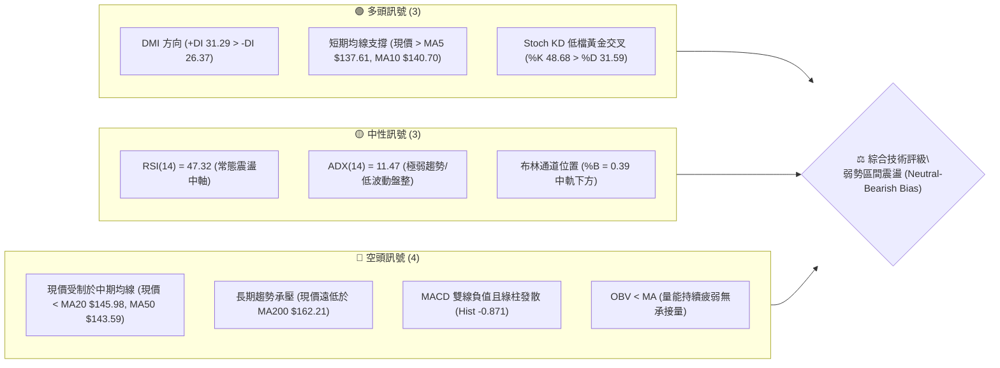
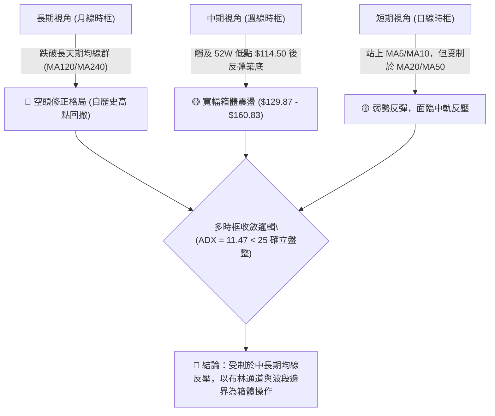
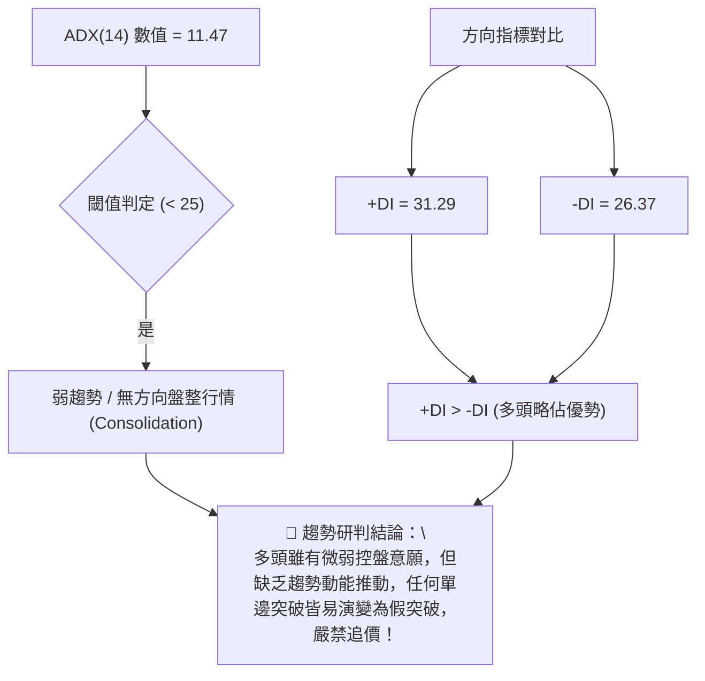
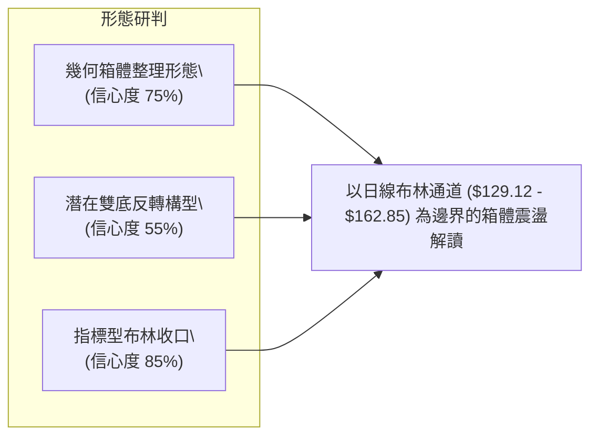
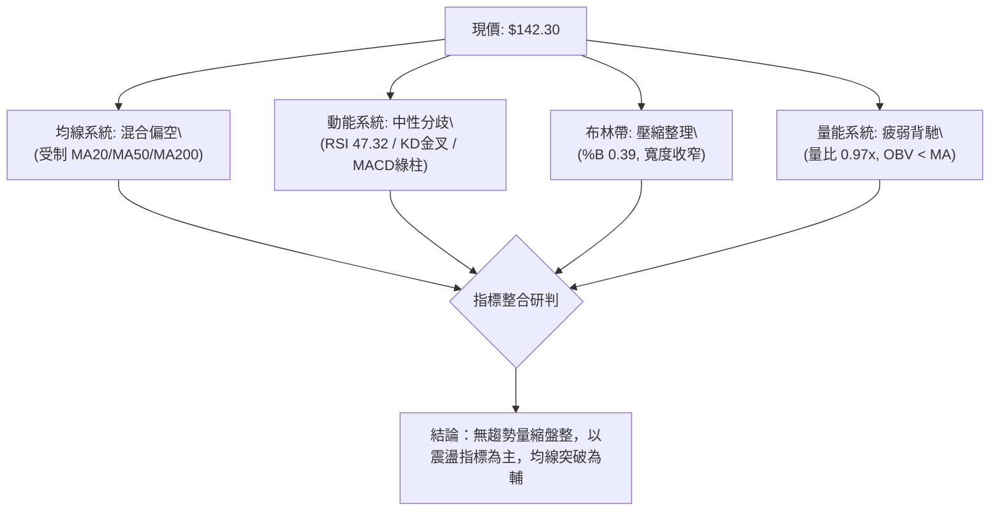
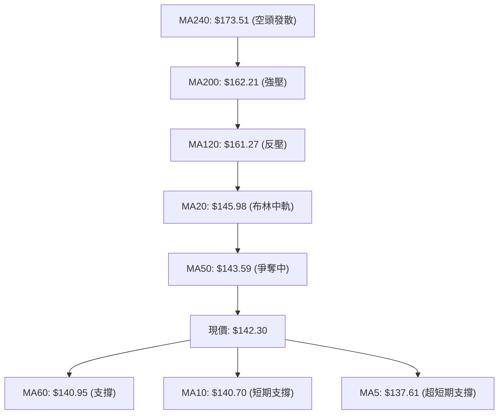
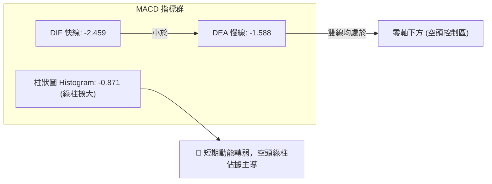
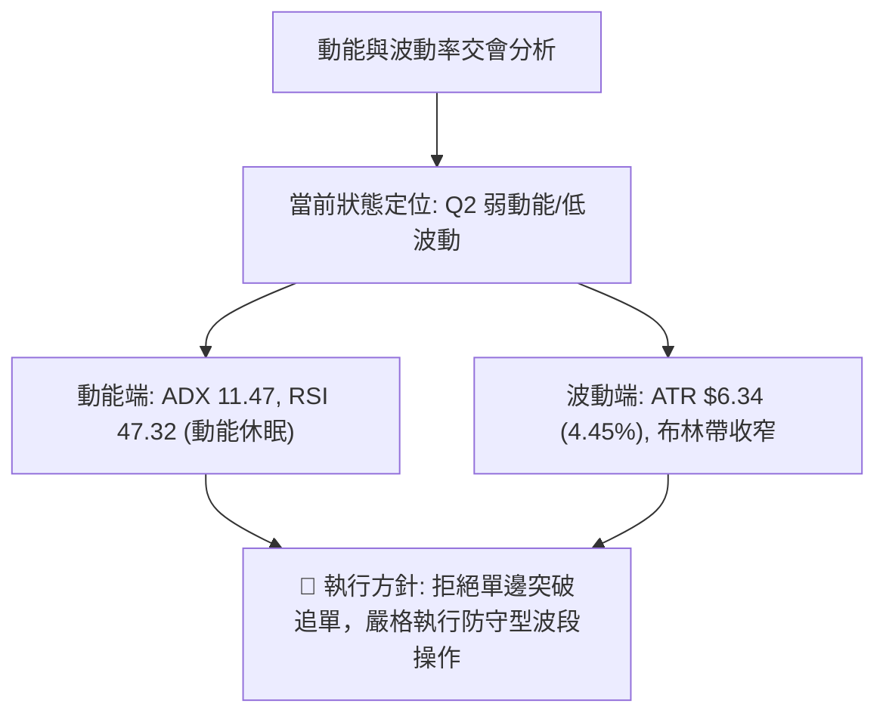
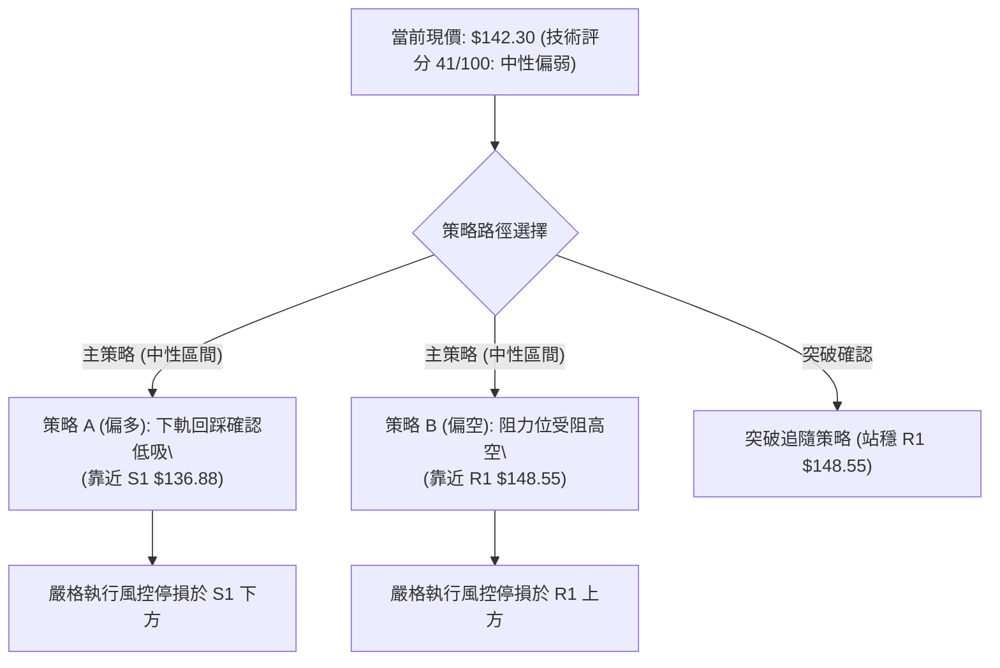
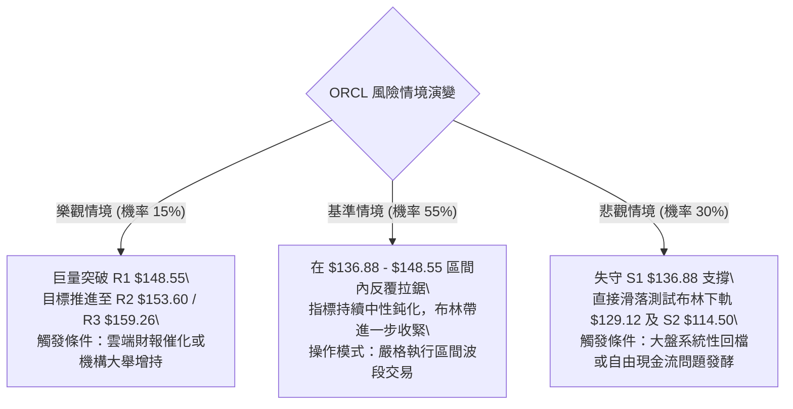

# ORCL 技術分析報告

> **報告日期**：2026-10-03 ｜ **語言**：繁體中文 ｜ **數據來源**：Yahoo Finance ｜ **當前價格**：$142.30

---

## 目錄

| 章節 | 內容 |
|------|------|
| [1. 技術面概覽](#1-技術面概覽) | 訊號儀表板、核心指標、評分卡 |
| [2. 趨勢分析](#2-趨勢分析) | 多時框趨勢、長中短期走勢 |
| [3. 圖表形態分析](#3-圖表形態分析) | 形態識別、K線組合、目標價 |
| [4. 支撐與阻力](#4-支撐與阻力) | 關鍵價位、斐波那契回調 |
| [5. 技術指標深度解讀](#5-技術指標深度解讀) | MA/RSI/MACD/布林/成交量 |
| [6. 動能與波動率](#6-動能與波動率) | 動能評估、ATR、Beta |
| [7. 多時框架總結](#7-多時框架總結) | 時框架評分矩陣 |
| [8. 交易策略建議](#8-交易策略建議) | 多空策略、風險報酬比 |
| [9. 風險提示與監控](#9-風險提示與監控) | 監控指標、風險場景 |
| [📋 報告總結](#-報告總結) | 核心總結與交易路線圖 |

---

## 1. 技術面概覽

### 🎯 技術訊號儀表板



---

### 📊 核心指標速覽表

| 指標類別 | 指標名稱 | 當前數值 | 訊號 | 解讀 |
|----------|----------|----------|:----:|------|
| **價格** | 當前價格 | $142.30 | 🟡 | 位於52週區間 13.6% 底部位階，短線小幅反彈 |
| **均線** | MA20 | $145.98 | 🔴 | 現價位於 MA20 下方 -2.52%，短線承壓 |
| **均線** | MA50 | $143.59 | 🔴 | 現價微幅低於 MA50，尚未形成有效突破 |
| **均線** | MA200 | $162.21 | 🔴 | 價格低於長期年線 -12.27%，長期空頭排列佔優 |
| **動能** | RSI(14) | 47.32 | 🟡 | 處於 30–70 中性區間，多空動能暫時平衡 |
| **動能** | MACD(12,26,9) | -2.459 / -1.588 | 🔴 | DIF 與 DEA 均在零軸下方，柱狀圖 -0.871 偏空 |
| **動能** | Stoch %K / %D | 48.68 / 31.59 | 🟢 | 快線由超賣區穿越慢線向上，具備超跌反彈契機 |
| **趨勢** | ADX(14) | 11.47 | 🟡 | ADX < 25，趨勢動能極弱，行情屬於無趨勢盤整 |
| **方向** | +DI / -DI | 31.29 / 26.37 | 🟢 | 多頭方向線微幅主導，但缺乏趨勢強度配合 |
| **通道** | 布林通道 | 129.12～162.85 | 🟡 | %B = 0.39，位於下軌與中軌之間震盪 |
| **量能** | 最新量 / 20日均量 | 35.33M / 36.28M | 🔴 | 量比 0.97x，OBV 疲軟，缺乏大資金追價意願 |
| **波動** | ATR(14) | $6.34 | 🟡 | 佔股價 4.45%，單日震盪幅度屬中等水準 |

---

### 🏆 技術評分卡

```
╔══════════════════════════════════════════════════════════════════╗
║                技術評分卡 — ORCL (2026-10-03)                    ║
╠══════════════════════════════════════════════════════════════════╣
║ 趨勢強度 (ADX/趨勢方向)  ████░░░░░░░░░░░░░░░░  22/100 🔴 弱勢無趨勢 ║
║ 動能指標 (RSI/MACD/KD)   ████████░░░░░░░░░░░░  42/100 🟡 動能修復中 ║
║ 支撐穩定度 (S1/S2防守)   ████████████░░░░░░░░  60/100 🟢 S1支撐有效 ║
║ 成交量配合 (OBV/量比)    ██████░░░░░░░░░░░░░░  32/100 🔴 量能疲弱   ║
║ 形態完整度 (形態構築)    ██████████░░░░░░░░░░  50/100 🟡 構築箱體中 ║
║ 均線排列 (MA5-MA240)     ██████░░░░░░░░░░░░░░  30/100 🔴 均線反壓重 ║
╠══════════════════════════════════════════════════════════════════╣
║ 綜合技術評分             ████████░░░░░░░░░░░░  41/100 🟡 中性偏弱   ║
║ 交易定調                 【弱勢箱體盤整，逢高減碼，區間低吸】       ║
╚══════════════════════════════════════════════════════════════════╝
```

---

## 2. 趨勢分析

### 🌐 多時框趨勢分析



---

### 📈 長期趨勢 — 12個月走勢圖（Unicode）

以下為 ORCL 過去 12 個月（2025-11 至 2026-10）之月線收盤價走勢圖：

```
ORCL 月線走勢圖（過去12個月收盤價走勢）
價格軸 ($)
$270 ┤
$240 ┤
$210 ┤ ●(200.02)
$180 ┤     ●(193.05)
$150 ┤         ●(163.44)         ●(160.83)                   ●(149.12)
$120 ┤             ●(144.39) ●(146.09)     ●(146.04)             ●(137.30) ●(142.30 現價)
$90  ┤                                         ●(129.87 低點)
     └─────────────────────────────────────────────────────────────────────────────►
       11M     12M     01M     02M     03M     04M     05M*    06M     07M     08M     09M     10M
      '25     '25     '26     '26     '26     '26     '26     '26     '26     '26     '26     '26
```
*(註：2026-05 月曾短暫脈衝至 $225.00，隨後在 2026-06 暴跌至 $146.04，2026-07 探底至 $129.87)*

#### 過去 12 個月波段特徵分析表

| 階段區間 | 起止月份 | 價格變化 | 漲跌幅 | 主要走勢特徵與市場行為 |
|:---|:---:|:---:|:---:|:---|
| **階段 I：高檔崩落** | 2025-10 → 2026-02 | $260.10 → $144.39 | -44.49% | 主升浪徹底終結，高位放量下殺，均線由多轉空 |
| **階段 II：低位盤整** | 2026-02 → 2026-04 | $144.39 → $160.83 | +11.39% | 在 $144 附近構築短期平台，市場嘗試技術性修復 |
| **階段 III：假突破暴跌**| 2026-05 → 2026-07 | $225.00 → $129.87 | -42.28% | 5月暴拉至 $225 形成多頭陷阱，隨後次月閃崩暴跌探底至 $129.87 |
| **階段 IV：弱勢築底** | 2026-08 → 2026-10 | $149.12 → $142.30 | -4.57% | 於 $135–$150 窄幅區間整理，ADX 大幅回落至 11.47 |

---

### 📊 中期趨勢（週線分析）

從近 20 週收盤走勢可清晰觀察到：
1. **中期暴跌與出清（2026-06 至 2026-07）**：ORCL 自 2026-05-31 收盤 $225.00 連續崩跌，2026-06-28 跌至 $148.02，RSI 觸及極度超賣值 11.1，週成交量暴增至 1.83 億股，反映機構停損拋盤。
2. **週線 W 底反彈（2026-07 至 2026-09）**：在 2026-07-26 觸及 $114.99 的收盤低點（當週低點觸及 52W Low $114.50）後，MACD 柱狀圖由 -6.743 快速收斂並於 2026-08-02 翻紅（+2.292），引發回升至 2026-09-06 的 $158.78。
3. **近期回踩與中性化（2026-09 至 2026-10）**：9 月中旬高檔回落至 $137.10（2026-09-27），隨後最新一週收盤回升至 $142.30，週 RSI 回落至 47.3，週線 MACD 柱狀圖為 -0.871，整體結構呈現**收斂三角形／區間震盪**格局。

```
中期週線支撐與壓力結構示意圖：
[阻力 R3] ──────────────────── $159.26 (09/06 週線波段高點聚類)
[阻力 R1] ──────────────────── $148.55 (20週均線密集交會區)
   ▲
 [現價]  ──────────────────── $142.30 (多空膠著中軸)
   ▼
[支撐 S1] ──────────────────── $136.88 (09/27 週線回踩低點)
[支撐 S2] ──────────────────── $114.50 (52週歷史底部 / 07/26 低點聚類)
```

---

### ⚡ 趨勢強度評估（ADX 解讀）



#### ADX 趨勢強度對照表

| ADX 區間 | 趨勢強度特徵 | 當前狀態確認 | 適用交易策略 |
|:---:|:---|:---:|:---|
| **0 – 20** | **極弱趨勢 / 橫向震盪** | **✓ (當前 11.47)** | **高拋低吸、區間逆勢交易、布林通道交易** |
| 20 – 25 | 趨勢醞釀期 / 盤整邊界 | ✘ | 縮小倉位，等待突破放量確認 |
| 25 – 40 | 明確強趨勢形成 | ✘ | 順勢突破交易、均線跟蹤策略 |
| 40 – 60 | 極強趨勢爆發 | ✘ | 順勢加碼、移動鎖利保護 |

---

## 3. 圖表形態分析

### 🔍 形態識別系統



#### 形態識別與信心度評估表（嚴格依據規則 15）

| 形態名稱 | 信心度 | 完成度 | 判斷依據（引用數據） | 目標價（附嚴格計算式） | 形態定調 |
|:---|:---:|:---:|:---|:---|:---:|
| **矩形箱體整理 (Rectangle)** | **75%** | 70% | 價格在 S1 ($136.88) 與 R1 ($148.55) 間反覆橫盤，上下振幅收斂 | 箱頂 $148.55 - 箱底 $136.88 = 高度 $11.67。<br>向上突破目標 = $148.55 + $11.67 = **$160.22** (靠近 R3 $159.26) | 有效 |
| **潛在雙重底 (Double Bottom)** | **55%** | 45% | 第一底為 52W 低點 $114.50 (2026-07)，第二底為回調低點 $136.88 (2026-09) | 頸線為 09/06 高點 $158.78，形態高度 = $158.78 - $114.50 = $44.28。<br>推算極限目標 = $158.78 + $44.28 = **$203.06** | 構築中 (未突破頸線) |
| **布林帶壓縮震盪** | **85%** | 80% | BB帶寬收斂，%B = 0.39，ADX = 11.47，無單邊形態特徵 | 指標型無幾何目標價，以 BB 上軌 **$162.85** 與下軌 **$129.12** 為界 | 有效 |

---

### 🕯️ 重要 K 線形態分析

| 週期/月份 | 收盤價 | K線形態名稱 | 技術解讀 | 訊號方向 |
|:---:|:---:|:---|:---|:---:|
| **2026-07** | $129.87 | **長下影錘頭線 (Hammer)** | 單月急跌至 52W 低點 $114.50 後爆出 2.52 億巨量收回，顯示機構於百元整數關卡上方逢低大舉護盤 | 🟢 強烈止跌 |
| **2026-08** | $149.12 | **低檔大陽線 (Bullish Marubozu)** | 月線上漲近 15%，帶動週線 MACD 翻紅，奠定反彈基石 | 🟢 反彈延續 |
| **2026-09** | $137.30 | **流星倒錘線 (Shooting Star)** | 衝高 $158.78 後遭受 MA120/MA200 重壓，月線留長上影線回落，確認上方套牢賣壓沉重 | 🔴 高檔受阻 |
| **2026-10 (當前)** | $142.30 | **窄幅十字星 (Doji Candidate)** | 當前於 $137–$143 區間整理，實體極小，多空陷入短暫平衡，靜待方向選擇 | 🟡 中性格局 |

---

### 📉 ASCII 走勢形態示意圖

```
ORCL 近期箱體整理與雙底形態結構圖：
價格
$160 ┤                    [頸線/波段高點 R3: $159.26]
     │                      ╭─────╮
$150 ┤          ╭───────╮  │     │       [阻力 R1: $148.55]
     │          │       ╰──╯     │  ╭──  ◄ 目前現價 $142.30
$140 ┤      ╭───╯                 ╰──╯    [支撐 S1: $136.88 (次低點)]
$130 ┤  ╭──╯ 
     │  │
$120 ┤  │
     │  ╰─────► [第一低點 S2: $114.50]
$110 └──────────────────────────────────────────────────────────► 時間
        2026-07                 2026-08    2026-09    2026-10
```

---

### 🎯 形態目標價計算

根據上述矩形箱體整理形態之精確量化計算：
- **形態底邊 (支撐)**：$136.88 (S1)
- **形態頂邊 (阻力)**：$148.55 (R1)
- **箱體垂直垂直垂直高度 ($H$)**：
  $$H = \text{箱頂} - \text{箱底} = 148.55 - 136.88 = 11.67$$
- **向上突破等幅目標價**：
  $$\text{目標價} = \text{箱頂} + H = 148.55 + 11.67 = 160.22$$
  *(註：此目標價與波段阻力 R3 $159.26 及 MA200 $162.21 高度重合，具備極強技術阻力意義)*
- **向下破位等幅目標價**：
  $$\text{破位目標價} = \text{箱底} - H = 136.88 - 11.67 = 125.21$$
  *(註：此目標價落於布林下軌 $129.12 與 52W 低點 $114.50 之間)*

---

## 4. 支撐與阻力

### 🗺️ 關鍵價位分布圖（Unicode）

```
ORCL 價位結構分布圖
══════════════════════════════════════════════════════════════════
$162.85 ║████████████████████████████████║ 布林上軌 / MA200 ($162.21)
$159.26 ║████████████████████████████    ║ 強阻力 R3 (09/06 波段高點)
$153.60 ║████████████████████            ║ 阻力 R2 (反彈中繼高點聚類)
$148.55 ║████████████████████████        ║ 關鍵阻力 R1 (箱體頂部 / 近期高點)
$145.98 ║────────────────────────────────║ 布林中軌 / MA20
$142.30 ╠════════════════════════════════╣ ◄ 現價 ($142.30)
$140.70 ║┄┄┄┄┄┄┄┄┄┄┄┄┄┄┄┄┄┄┄┄┄┄┄┄┄┄┄┄┄┄║ 短期均線密集區 (MA10 $140.70, MA60 $140.95)
$136.88 ║▓▓▓▓▓▓▓▓▓▓▓▓▓▓▓▓▓▓▓▓▓▓▓▓        ║ 近期關鍵支撐 S1 (箱體底部)
$129.12 ║▓▓▓▓▓▓▓▓▓▓▓▓▓▓▓▓                ║ 布林下軌 (動態超賣支撐)
$114.50 ║████████████████████████████████║ 核心強支撐 S2 (52W Low / 雙底低點)
══════════════════════════════════════════════════════════════════
```

---

### 🚧 阻力位分析表

*(嚴格引用 OHLCV 計算聚類數值)*

| 阻力級別 | 精確價位 | 距現價空間 | 形成技術依據與籌碼意義 | 突破難度 | 重要性權重 |
|:---|:---:|:---:|:---|:---:|:---:|
| **阻力 R1** | **$148.55** | +4.39% | 近一年波段高點聚類、MA20 走平處反壓、短線箱體頂部 | 🟡 中等 | ★★★☆☆ |
| **阻力 R2** | **$153.60** | +7.94% | 08月中旬反彈密集收盤價聚類，中期籌碼套牢平台 | 🔴 較高 | ★★★★☆ |
| **阻力 R3** | **$159.26** | +11.92% | 近期波段最高收盤聚類 ($158.78–$159.26)，臨近 MA120 ($161.27) 與 MA200 ($162.21) | 🔴 極高 | ★★★★★ |

---

### 🛡️ 支撐位分析表

*(嚴格引用 OHLCV 計算聚類數值)*

| 支撐級別 | 精確價位 | 距現價空間 | 形成技術依據與籌碼意義 | 守住機率 | 重要性權重 |
|:---|:---:|:---:|:---|:---:|:---:|
| **支撐 S1** | **$136.88** | -3.81% | 近一年波段低點聚類、09-27 週線回踩低點 ($137.10) 共振支撐 | 🟢 70% | ★★★★☆ |
| **支撐 S2** | **$114.50** | -19.54% | 52週歷史低點 ($114.50)、斐波那契 100.0% 回調位、週線 2.5億股放量換手底 | 🟢 90% | ★★★★★ |

---

### 📐 斐波那契回調位分析

依據 52 週絕對極值區間（低點 **$114.50** → 高點 **$319.46**，總波幅 $204.96）嚴格計算之回調位體系：

```
斐波那契回調尺規（52W High $319.46 → 52W Low $114.50）
══════════════════════════════════════════════════════════════════
 0.0%  (52W High)  $319.46 ── 歷史峰值
23.6%              $271.09 ── 空頭第一道防線
38.2%              $241.16 ── 強弱分水嶺
50.0%              $216.98 ── 多空對稱中軸
61.8%              $192.79 ── 黃金分割關鍵反壓
78.6%              $158.36 ── 深幅回撤防守位 (對齊 R3 $159.26)
──────────────────  現價 $142.30 落在 78.6% 與 100.0% 之間  ──────────────────
100.0% (52W Low)   $114.50 ── 週期大底支撐 (S2)
══════════════════════════════════════════════════════════════════
```

#### 技術解讀：
1. **極度弱勢區間**：現價 $142.30 處於 78.6% 回調位（$158.36）至 100.0% 低點（$114.50）之極低檔區間，反映過去一年股票經歷了嚴重的估值去化與資金抽離。
2. **反彈天花板壓制**：斐波那契 78.6% 回調位 **$158.36** 與波段阻力 R3 **$159.26** 形成精準共振重合區。這意味著中短期多頭反彈若無法以巨量突破 $158.36–$159.26，整體格局依然屬於大跌後的「超跌反彈」，而非新一輪主升趨勢。

---

## 5. 技術指標深度解讀

### 🎛️ 指標訊號總覽



---

### 📈 移動平均線排列分析



#### 各天期移動平均線狀態剖析

| 均線名稱 | 價位 | 距現價幅度 | 當前方向 | 排列性質與技術意義 |
|:---|:---:|:---:|:---:|:---|
| **MA 5** | $137.61 | +3.41% | ▲ 向上 | 超短期動能回溫，股價回踩 MA5 獲有效支撐 |
| **MA 10** | $140.70 | +1.14% | ▲ 向上 | 短線生命線向上勾頭，與 MA60 在 $140.70–$140.95 形成第一道多頭防線 |
| **MA 20** | $145.98 | -2.52% | ▼ 向下 | 月線持續下彎，代表過去一個月平均持倉者處於套牢狀態，短線首要反壓 |
| **MA 50** | $143.59 | -0.90% | ▼ 向下 | 季線位階關鍵，現價與其貼合，尚未能形成站穩確認 |
| **MA 60** | $140.95 | +0.96% | ▲ 向上 | 走平微升，提供低檔支撐 |
| **MA 120** | $161.27 | -11.77% | ▼ 向下 | 半年線下行，形成中期下降通道天花板 |
| **MA 200** | $162.21 | -12.27% | ▼ 向下 | 牛熊分界線顯著下壓，空頭排列本質尚未扭轉 |
| **MA 240** | $173.51 | -17.99% | ▼ 向下 | 長期均線下殺，中長線上方沉積大量套牢籌碼 |

**均線結構總結**：呈現標準的「短均走多、長均走空」之**混合震盪排列**。短期均線（MA5、MA10）金叉向上推動反彈，但上方立即遭受中天期均線（MA20、MA50）及長天期均線（MA200）層層壓制，反彈空間受限於均線間隙。

---

### 📉 RSI(14) 分析

#### RSI 數值儀表
```
RSI(14) 當前數值: 47.32 (中性區間)
0 ────── 超賣(30) ────────── 現值(47.32) ────── 超買(70) ────── 100
[░░░░░░░░░░░░░░░░██████████████████░░░░░░░░░░░░░░░░░░░░░] 47.32%
```

#### 背離深度研判：
- **底背離檢驗**：觀察週線走勢，2026-06-28 股價收 $148.02 時週 RSI 為 11.1；2026-07-26 股價破位跌至 $114.99 時，週 RSI 為 26.7，**週線級別曾出現明顯底背離**，該底背離已於 8 月份的大幅反彈中消耗兌現完畢。
- **當前日線背離**：現價 $142.30 與近期低點 $137.10 相比，RSI 由 29.5 回升至 47.32，**無明顯頂背離或底背離**現象。數值居於 40–60 之間，表示當前處於動能再平衡的中性格局，無極端超買或超賣超跌訊號。

---

### 📊 MACD(12,26,9) 訊號解讀



#### 指標深度解讀：
- MACD 快線（-2.459）持續運行於慢線（-1.588）下方，柱狀圖為 **-0.871**，且連續呈現空頭負值，說明自 2026-09-06 高點 $158.78 回落以來的次級回調動能尚未完全衰竭。
- 值得注意的是，雖然柱狀圖為負，但近幾日柱體未再大幅向下創低，顯示賣壓有逐步收斂跡象，需觀察柱狀圖是否能向零軸靠攏收斂，方能迎來指標金叉買訊。

---

### 📦 布林通道分析

```
ORCL 布林通道結構示意圖 (帶寬收窄中)
──────────────────────────────────────────────────── $162.85  BB 上軌 (壓力區)
      ▲
      │ 波動空間: +14.4%
      ▼
─ ─ ─ ─ ─ ─ ─ ─ ─ ─ ─ ─ ─ ─ ─ ─ ─ ─ ─ ─ ─ ─ ─ ─ ─ ─  $145.98  BB 中軌 (MA20 阻力)
                      ▲
               現價: █│ $142.30 (%B = 0.39)
                      ▼
──────────────────────────────────────────────────── $129.12  BB 下軌 (支撐區)
```

- **布林帶寬與形態**：上軌 $162.85、中軌 $145.98、下軌 $129.12，總帶寬約 $33.73。帶寬正處於逐步收斂狀態，反映市場波動率持續降低。
- **%B 位置分析**：當前 **%B = 0.39**，位於中軌（0.50）與下軌（0.00）之間的弱勢震盪區。股價多次在中軌 $145.98 遇阻回落，若無法實體收盤站上中軌，行情將持續在 $136.88 至中軌之間進行下半區波動。

---

### 💹 成交量分析（量價配合度）

```
成交量對比儀表：
當日成交量:  ███████████████████░░░░░  35,330,300 股
20日均量:    ████████████████████░░░░  36,279,495 股 (量比 0.97x)
50日均量:    █████████████████░░░░░░░  30,725,774 股
```

- **量價配合評估**：量比僅 0.97x，處於微幅量縮狀態。9 月下旬下跌回調過程中成交量（1.56 億週成交量）相比 9 月初反彈量能（1.15 億）並未明顯放大，顯示目前無恐慌性拋盤；然而反彈至 $142.30 時亦無放量突破跡象。
- **OBV 能量潮解讀**：數據明確標示 **OBV < MA**，代表資金流向指標落後於均線，能量潮處於疲軟狀態。量能不濟是制約 ORCL 短線向上衝破 MA20 及 R1（$148.55）的核心主因。在巨量換手（單日成交量突破 50日均量 1.5 倍以上）出現之前，難以展開突破行情。

---

## 6. 動能與波動率

### ⚡ 動能評估四象限

| 象限代號 | 動能強度 (RSI / MACD) | 波動率水準 (ATR / BBW) | 當前符合狀態 | 策略指導與資產意涵 |
|:---:|:---:|:---:|:---:|:---|
| **Q1** | 強 (Bullish Momentum) | 低 (Low Volatility) | ✘ | 最佳趨勢單邊進場機會（非當前） |
| **Q2** | **弱 / 中性 (Neutral Momentum)** | **低 (Low Volatility)** | **✓ (當前所處象限)** | **謹慎觀望、縮小倉位、箱體邊界低吸高拋** |
| **Q3** | 強 (High Momentum) | 高 (High Volatility) | ✘ | 高風險高收益爆發期，追隨突破 |
| **Q4** | 弱 (Bearish Momentum) | 高 (High Volatility) | ✘ | 恐慌主跌浪，嚴格停損空倉觀望 |



---

### 📊 ATR 波動率分析

- **ATR(14) 絕對數值**：**$6.34**（佔當前股價 $142.30 之 **4.45%**）。
- **日內波動參考**：ORCL 每日平均正常波幅約在 $6.34 左右。任何盤中超出此範圍的劇烈波動多受突發消息干擾，具有均值回歸傾向。
- **停損距離量化建議**：
  - **短線交易停損距離（1.0 × ATR）**：$6.34（以現價計停損位約為 $135.96，略低於 S1 $136.88，能有效過濾市場雜訊）。
  - **波段交易停損距離（1.5 × ATR）**：$9.51（以現價計防守位約為 $132.79）。

---

### 📐 Beta 與市場相關性

- **Beta 係數**：**1.732**（極高 Beta 特徵）。
- **市場敏感度解讀**：Beta 為 1.732 意味著該股理論波動率為標普 500 指數的 1.73 倍。當整體科技板塊或美股大盤波動時，ORCL 將呈現顯著放大走勢。
- **籌碼結構補充**：內部人持股比例高達 38.4%，機構持股 43.5%，融券放空比例僅 2.7%（Short Ratio 1.82）。籌碼並未出現大規模放空擠壓風險，但高 Beta 特性要求投資者在建倉時必須嚴格控制單筆名目部位。

---

## 7. 多時框架總結

### 📋 時框架評分表

| 時框架 | 趨勢方向 | 動能狀態 | 均線排列 | 圖表形態 | 綜合評分 | 戰術建議 |
|:---:|:---:|:---:|:---:|:---:|:---:|:---|
| **短期 (日線)** | 🟡 橫向盤整 | 🟡 RSI 47.32 平衡<br>🟢 KD 金叉向上 | 混合排列 (破MA20/站MA5) | 矩形整理震盪 | **48/100** | 區間內高拋低吸，嚴守支撐 S1 |
| **中期 (週線)** | 🟡 箱體築底 | 🔴 MACD 柱狀 -0.871<br>🟡 RSI 47.3 | 均線交織下行 | 潛在雙底測試頸線 | **40/100** | 待實體突破 R1 $148.55 始可加碼 |
| **長期 (月線)** | 🔴 空頭修正 | 🔴 遠離歷史高位 $319<br>🔴 OBV 疲軟 | 長天期空頭排列 (下穿MA200) | 自高位大幅回撤築平台 | **35/100** | 長線資金僅宜分批左側少量定投 |

---

### 🔲 綜合訊號矩陣

```
時框與指標矩陣對齊表：
  指標項目       短期 (日線)        中期 (週線)        長期 (月線)       時框一致性
─────────────────────────────────────────────────────────────────────────────
  趨勢狀態       橫向震盪 (中性)    震盪築底 (中性)    下跌回調 (看空)   中長期偏弱
  動能強弱       KD回升 (偏多)      MACD綠柱 (偏空)   動能衰減 (看空)   多空互搏
  均線位置       夾在MA10與MA20間   受制於20週均線    跌破年線MA200     上方反壓重
  量能訊號       縮量整理 (中性)    換手率下降 (中性)  量能不繼 (看空)   缺乏買盤追價
─────────────────────────────────────────────────────────────────────────────
  矩陣結論       短期反彈面臨瓶頸，多時框缺乏共振向上動力，確立震盪整理格局
```

---

### ⚖️ 多時框收斂結論

依據多時框收斂規則第 14 條嚴格執行收斂：
1. **行情性質確立**：當前日線 ADX(14) 數值為 **11.47**，遠低於趨勢門檻值 25，**判定為典型的無趨勢盤整行情（Consolidation Regime）**。
2. **主導規則取捨**：依規則 14，在 ADX < 25 的盤整行情中，**不採納中長期突破追單邏輯，而以日線布林通道上下軌（$129.12 – $162.85）及關鍵波段邊界（S1 $136.88 – R1 $148.55）為主要交易區間**。
3. **方向性結論**：多時框收斂給出唯一的戰略定調——**【中性觀望，區間箱體操作（Neutral / Range-Bound）】**。禁止在區間中軸 $142.30 進行重倉押注，策略完全聚焦於靠近邊界之高拋低吸。

---

## 8. 交易策略建議

### 🗺️ 策略決策流程圖



---

### 🧭 策略路由（依評分卡分流）

> **當前主策略方向 = 【中性區間震盪操作】（依技術評分 41/100 定調）**  
> 由於綜合評分處於 40–60 之中性震盪區間，依規則嚴禁單邊激進追高或盲目殺跌，操作完全以「布林通道上下軌及箱體邊界之區間交易」為核心。

---

### 🎯 價格情境階梯（Price Scenarios）

*(價位嚴格引用第 4 章關鍵價位區塊實際數值)*

| 觸發條件 | 第一目標 (T1) | 第二目標 (T2) | 後續延伸 (T3) | 情境技術含義與市場行為解讀 |
|:---|:---:|:---:|:---:|:---|
| **放量突破 R1 $148.55** | **$153.60 (R2)** | **$159.26 (R3)** | **$162.21 (MA200)** | 短線轉強，完成箱體向上破位，向上挑戰年線強壓力帶 |
| **維持於現價區間震盪** | **$145.98 (MA20)** | **$136.88 (S1)** | — | 處於多空均線平衡帶拉鋸，動能持續萎縮休眠 |
| **放量跌破 S1 $136.88** | **$129.12 (BB下軌)**| **$114.50 (S2)** | **$110.00 (分析師低標)**| 中期走勢轉弱破位，箱體下移，回測 52週歷史大底 |

---

### 📊 情境機率分佈

| 運行情境 | 發生機率 | 主要量化與技術依據 |
|:---|:---:|:---|
| **情境一：區間震盪（維持在 $136.88～$148.55）** | **55%** | ADX 僅 11.47 確立無方向；布林通道持續收縮；成交量低於均量，缺乏突破能量 |
| **情境二：回落探底（跌破 S1 回測下軌）** | **30%** | MACD 綠柱持續發散；現價受壓於 MA20/MA50；OBV 疲軟顯示資金承接意願低下 |
| **情境三：向上突破（放量站上 R1 挑戰 R2）** | **15%** | +DI 暫時高於 -DI；Stoch KD 低檔金叉；需補量至 50日均量 1.5倍方能成立 |

---

### 🟢 主策略詳情（區間雙向戰術）

*(所有價位精確引用關鍵數據，拒絕模糊數值)*

| 策略要素 | 策略 A：箱底支撐低吸（多向波段） | 策略 B：阻力受阻高拋（空向短沖） |
|:---|:---|:---|
| **進場條件** | 股價回踩 S1 企穩，出現 15分/日線下影線 | 股價反彈至 R1 遇阻滯漲，長上影線確認 |
| **精確進場點位** | **$137.50**（S1 $136.88 上方附近確認點） | **$147.80**（R1 $148.55 下方阻力測試點） |
| **目標價 T1** | **$145.98**（布林中軌 / MA20） | **$140.70**（MA10 短期支撐處） |
| **目標價 T2** | **$148.55**（波段阻力 R1） | **$136.88**（關鍵支撐 S1） |
| **精確止損點位** | **$134.50**（跌破 S1 $136.88 後寬容 0.5×ATR） | **$150.50**（突破 R1 $148.55 阻力帶後防守） |
| **停損空間 / 風險** | $3.00 (-2.18%) | $2.70 (+1.83%) |
| **獲利空間 / 報酬** | T1: +$8.48 (+6.17%) / T2: +$11.05 (+8.04%) | T1: +$7.10 (+4.80%) / T2: +$10.92 (+7.39%) |
| **風險報酬比 (R:R)**| **1 : 3.68** (以目標 T2 計算) | **1 : 4.04** (以目標 T2 計算) |
| **成功機率預估** | 60% | 65% |
| **建議配置倉位** | **10% – 15%** (輕倉參與) | **10% – 15%** (輕倉參與) |

---

### 🔴 反向風險觸發點（對沖提示）

- **多頭部位之停損對沖警訊**：若日線收盤價跌破關鍵支撐 **$136.88 (S1)**，即代表箱體形態失效破位，下行空間將直指布林下軌 **$129.12** 及歷史低點 **$114.50 (S2)**。此時必須全數離場觀望或建立看跌期權（Put）進行淨值保護。
- **空頭部位之停損對沖警訊**：若日線放量收盤突破關鍵阻力 **$148.55 (R1)** 且成交量放大至 5,000 萬股以上，代表新一輪均線修復行情啟動，空單必須立即無條件止損，順勢轉為多頭思維上看 **$153.60 (R2)** 及 **$159.26 (R3)**。

---

### ⭐ 整體訊號強度評星

```
做多訊號強度：★★☆☆☆  (2.5/5星 — 受制於均線反壓與弱勢量能)
做空訊號強度：★★★☆☆  (3.0/5星 — 順應長時框空頭排列，但下方S1支撐堅韌)
整體可信度：  ★★★★☆  (4.0/5星 — ADX<25 盤整特徵極度顯著，區間界限明確)
```

---

## 9. 風險提示與監控

### ✅ 關鍵監控指標 Checklist

```
╔══════════════════════════════════════════════════════════════════╗
║                    每日技術監控清單 (Checklist)                  ║
╠══════════════════════════════════════════════════════════════════╣
║ [ ] 價格邊界觸碰：是否觸及阻力 R1 $148.55 或跌破支撐 S1 $136.88   ║
║ [ ] 均線動態變化：現價能否帶量實體站穩 MA20 ($145.98) 與 MA50      ║
║ [ ] 趨勢甦醒訊號：ADX(14) 是否由 11.47 抬頭突破 20 門檻值         ║
║ [ ] 量能突變因子：單日成交量是否異常突破 5,000 萬股（放量確認）   ║
║ [ ] 動能翻轉指標：MACD Histogram 是否由綠轉紅，RSI 是否突破 50     ║
║ [ ] 外部市場共振：高 Beta (1.732) 屬性下，標普500/那斯達克之連動  ║
╚══════════════════════════════════════════════════════════════════╝
```

---

### ⚠️ 風險場景分析



---

### 🛡️ 風險管理重要提醒

1. **基本面現金流風險對沖**：技術面反映的是資金博弈與預期，但數據顯示 ORCL 自由現金流為負（FCF Yield: -10.63%，FCF: $-45.85B），淨負債達 $-132.07B。在基本面槓桿偏高背景下，任何技術性破位皆容易引發機構拋售，**切忌於下跌途中盲目向下攤平**。
2. **波動率與倉位管理守則**：由於 ORCL 的 Beta 高達 1.732 且單日 ATR 為 $6.34（佔股價 4.45%），單一帳戶在 ORCL 上的總曝險比例**不宜超過投資組合總資金的 15%**。
3. **區間破位保護機制**：在盤整行情中，虛假突破十分常見。若採取突破跟進策略，務必等待日線收盤價確認站穩，或結合當日成交量（必須 > 50日均量 30.72M 之 1.3 倍以上）方可確認突破有效，否則極易被「假突破真反殺」套牢在箱頂。

---

## 📋 報告總結

```
╔══════════════════════════════════════════════════════════════════╗
║                   ORCL 技術分析報告總結                          ║
╠══════════════════════════════════════════════════════════════════╣
║ 報告日期：2026-10-03           現價：$142.30                     ║
║ 綜合技術評分：41/100           技術評級：⚖️ 中性偏弱 (盤整箱體)    ║
╠══════════════════════════════════════════════════════════════════╣
║ 關鍵結論：                                                       ║
║ ├─ 長期趨勢：🔴 空頭修正（受壓於 MA200 $162.21 及斐波 78.6%）     ║
║ ├─ 中期趨勢：🟡 箱體築底（以 52W 低點 $114.50 為大底震盪回升）  ║
║ ├─ 短期趨勢：🟡 弱勢反彈（夾在 MA10 $140.70 與 MA20 $145.98 之間）║
║ ├─ 趨勢強度：ADX = 11.47 (<25)，確立行情為典型低波動無趨勢盤整   ║
║ ├─ 關鍵支撐：S1: $136.88 ｜ S2: $114.50 (52週絕對底部)          ║
║ ├─ 關鍵阻力：R1: $148.55 ｜ R2: $153.60 ｜ R3: $159.26          ║
║ └─ 分析師目標共識：均價 $237.97 (極度樂觀，技術面短線難以兌現)   ║
╠══════════════════════════════════════════════════════════════════╣
║ 最優策略路線圖：                                                 ║
║ 1. 🥇 最佳機會（箱底低吸）：回踩 S1 $136.88 附近進場，止損設    ║
║    $134.50，目標看 $145.98 / $148.55（風報比 1 : 3.68）         ║
║ 2. 🥈 次選機會（箱頂高拋）：反彈至 R1 $148.55 滯漲放空，止損設   ║
║    $150.50，目標看 $140.70 / $136.88（風報比 1 : 4.04）         ║
║ 3. 🥉 保守選擇（觀望等待）：在 ADX 未突破 20 且股價未出箱體前   ║
║    全面空倉觀望，耐心等待方向確立後再行順勢跟進。                ║
╚══════════════════════════════════════════════════════════════════╝
```

---

> ⚠️ **免責聲明**：本報告為資深量化與圖表技術分析研究產出，所有分析數據、價位區間及估算模型均嚴格基於歷史量價與即時技術面快照。本報告**僅供學術研究與交易架構參考**，**不構成任何要約、招攬或實質投資買賣建議**。金融市場存在高度波動與本金損失風險，投資人應獨立評估自身財務狀況與風險承受度，審慎做出決策。

---

*報告生成時間：2026-10-03 ｜ 數據來源：Yahoo Finance ｜ 分析框架：多時框圖表與量化技術系統*