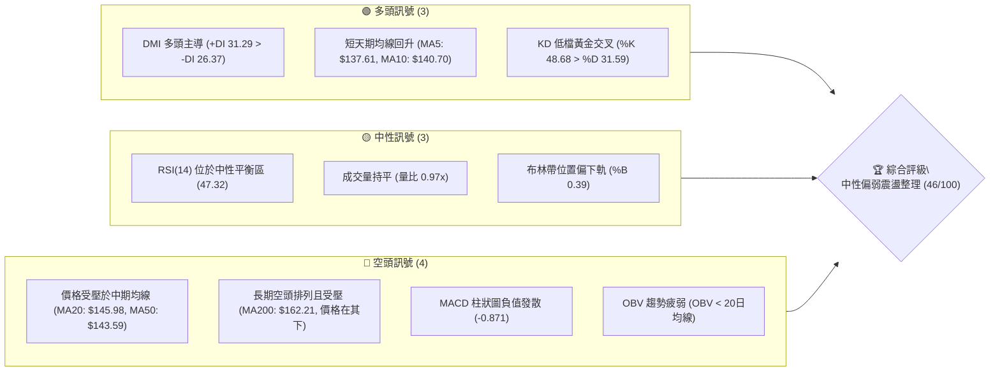
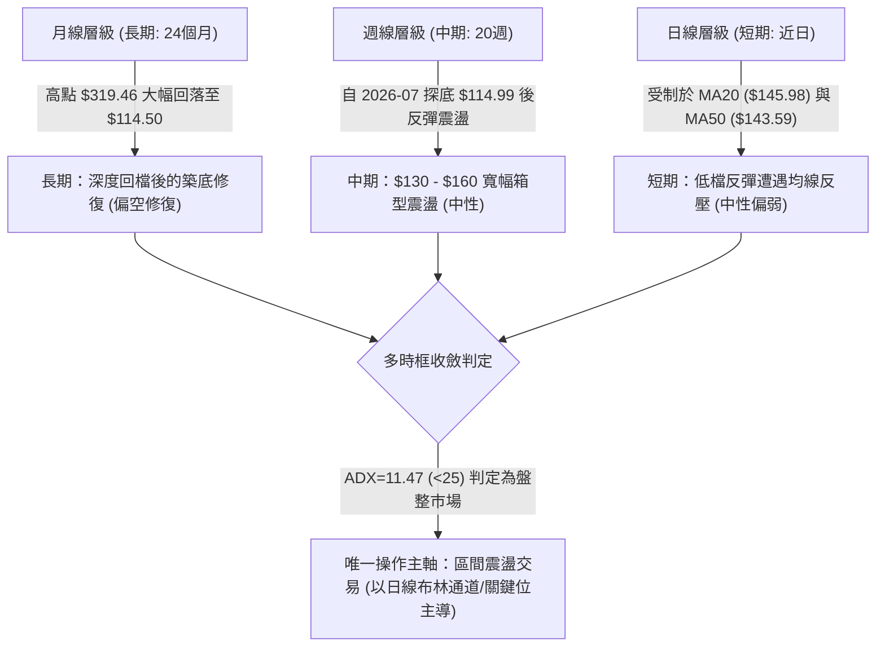
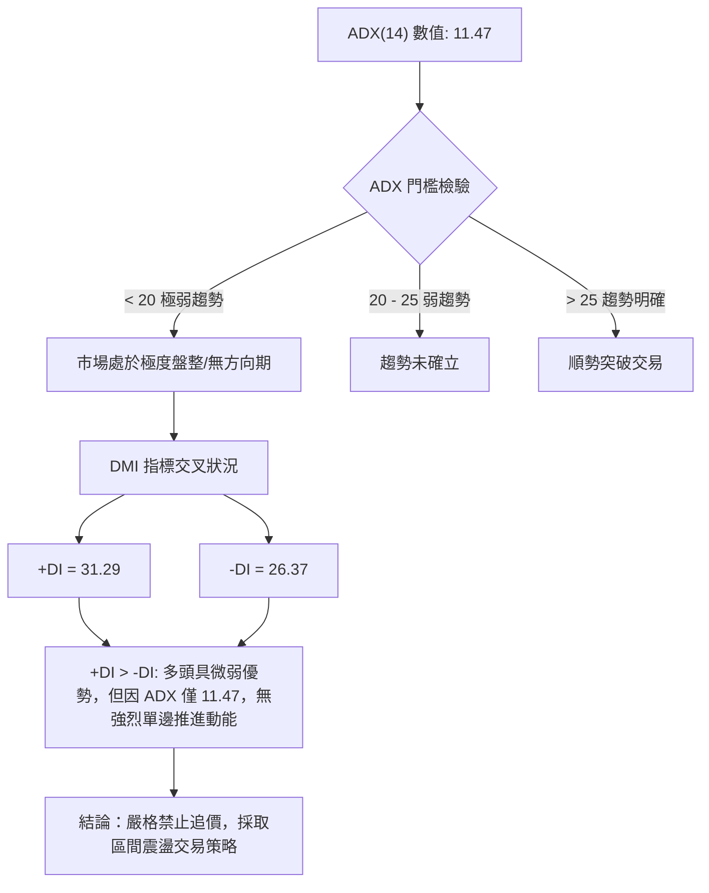
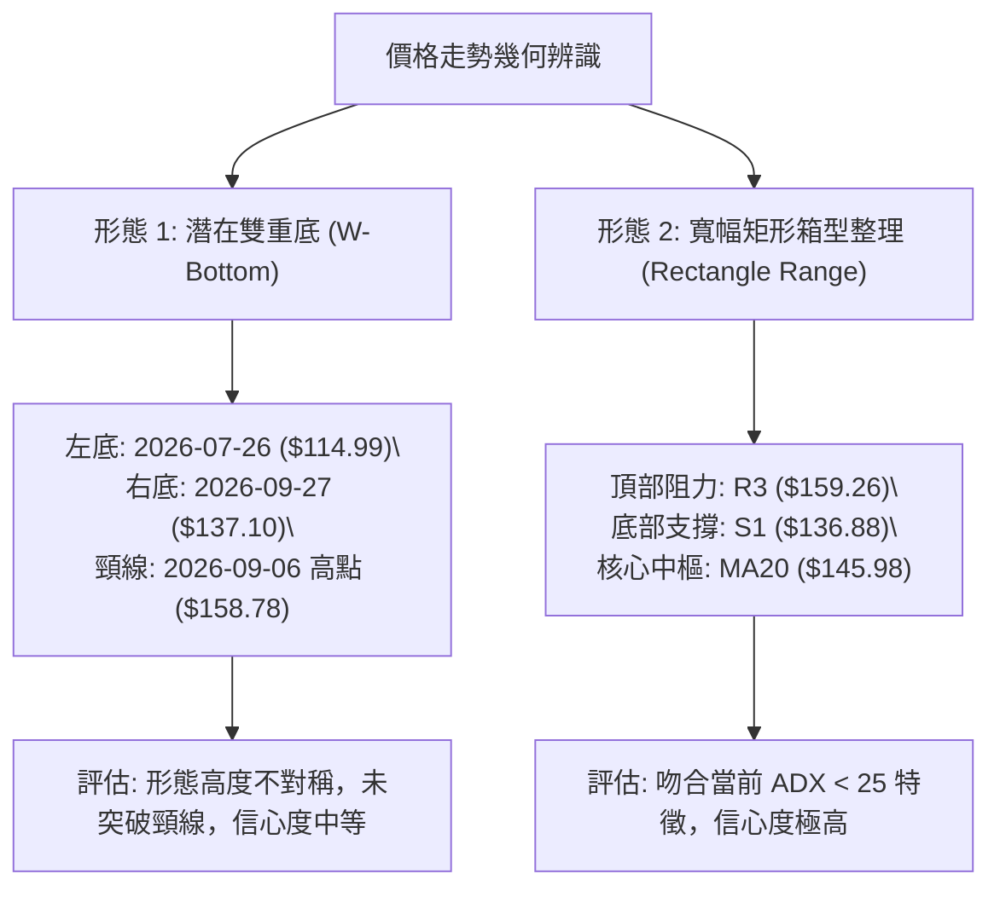
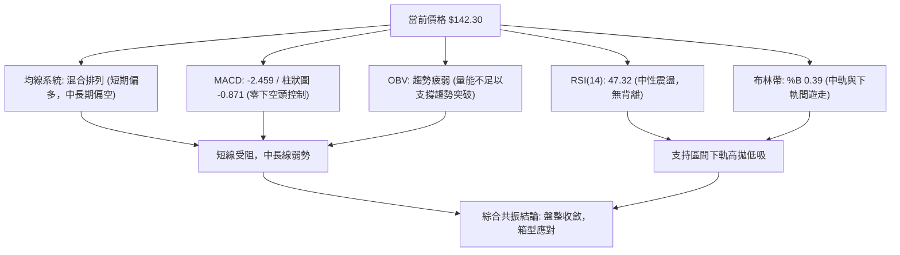
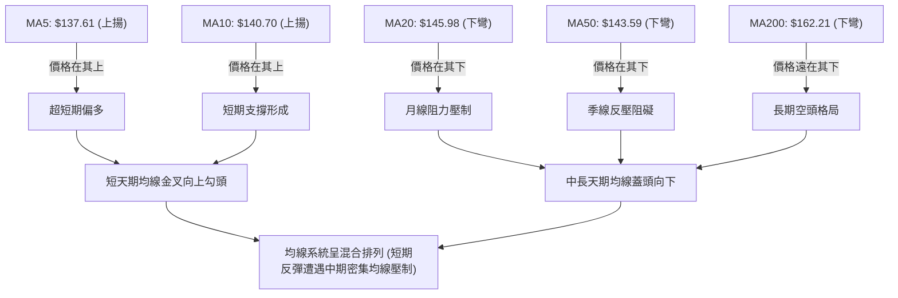
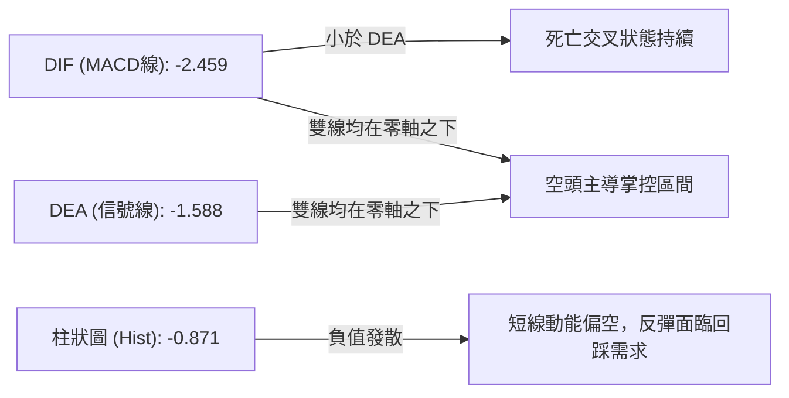
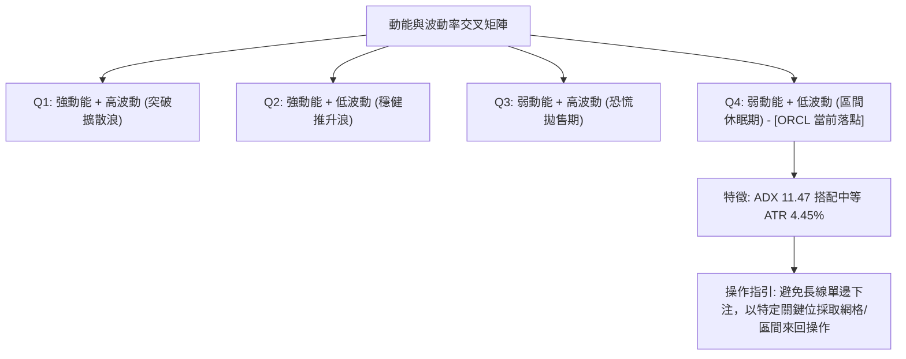
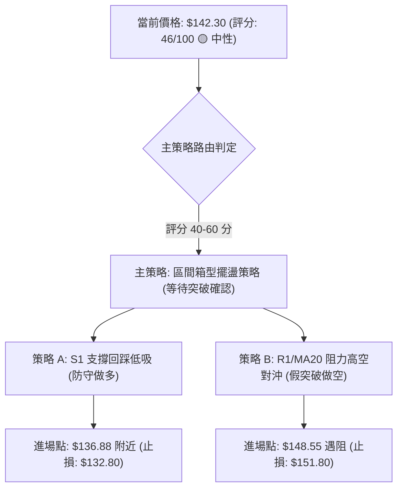
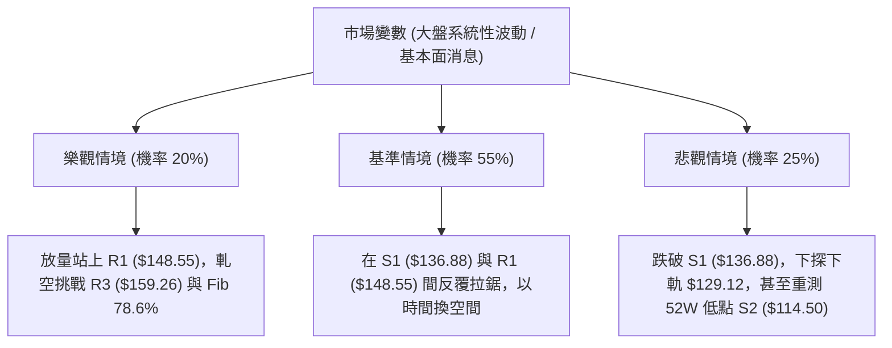

# ORCL 技術分析報告

> **報告日期**：2026-10-04 ｜ **語言**：繁體中文 ｜ **數據來源**：Yahoo Finance ｜ **當前價格**：$142.30

---

## 目錄

| 章節 | 內容 |
|------|------|
| [1. 技術面概覽](#1-技術面概覽) | 訊號儀表板、核心指標、評分卡 |
| [2. 趨勢分析](#2-趨勢分析) | 多時框趨勢、長中短期走勢、ADX解讀 |
| [3. 圖表形態分析](#3-圖表形態分析) | 形態識別信心度、重要K線組合、目標價推算 |
| [4. 支撐與阻力](#4-支撐與阻力) | 關鍵價位分布、阻力支撐表、斐波那契回調 |
| [5. 技術指標深度解讀](#5-技術指標深度解讀) | MA/RSI/MACD/布林/成交量全面共振 |
| [6. 動能與波動率](#6-動能與波動率) | 動能四象限、ATR風控模型、Beta敏感度 |
| [7. 多時框架總結](#7-多時框架總結) | 時框架評分矩陣、多時框收斂唯一結論 |
| [8. 交易策略建議](#8-交易策略建議) | 策略路由、價格情境階梯、主策略明細 |
| [9. 風險提示與監控](#9-風險提示與監控) | 關鍵監控清單、極端風險場景、部位控管 |
| [10. 報告總結](#-報告總結) | 核心結論與最佳策略組合彙整 |

---

## 1. 技術面概覽

### 🎯 技術訊號儀表板



### 📊 核心指標速覽表

| 指標類別 | 指標名稱 | 當前數值 | 訊號 | 解讀 |
|:---|:---|:---|:---:|:---|
| **價格** | 當前價格 | $142.30 | 🟡 | 位於52週區間 13.6% 低檔，短線自底部反彈但動能平緩 |
| **均線** | MA20 (月線) | $145.98 | 🔴 | 現價位於 MA20 下方 (-2.52%)，布林中軌構成直接動態壓制 |
| **均線** | MA50 (季線) | $143.59 | 🔴 | 現價剛好被 MA50 壓制，多方未能有效站穩中短期分水嶺 |
| **均線** | MA200 (年線)| $162.21 | 🔴 | 遠低於 MA200 (-12.27%)，長期結構處於空頭或深度修復期 |
| **動能** | RSI(14) | 47.32 | 🟡 | 位於 30–70 中性區間，無超買或超賣，短線多空拉鋸 |
| **動能** | MACD | -2.459 / -1.588| 🔴 | 快慢線均在零軸下方且 DIF < DEA，柱狀圖 -0.871 偏空發散 |
| **趨勢** | ADX(14) | 11.47 | 🟡 | ADX < 25 表明市場處於極度弱趨勢或箱型盤整行情 |
| **波動** | ATR(14) | $6.34 | 🟡 | 波動率佔股價 4.45%，單日震盪幅度中等，適合區間擺盪操作 |
| **通道** | Bollinger %B| 0.39 | 🟡 | 位於布林帶中軌 ($145.98) 與下軌 ($129.12) 間，偏向弱勢區 |
| **量能** | OBV 趨勢 | OBV < MA | 🔴 | 資金進場意願不足，成交量無法確認價格的反彈持續性 |

### 🏆 技術評分卡

```
╔══════════════════════════════════════════════════════════════════╗
║                技術評分卡 — ORCL (2026-10-04)                   ║
╠══════════════════════════════════════════════════════════════════╣
║ 趨勢強度 (ADX/排列)   ████░░░░░░░░░░░░░░░░  20/100 🔴 弱趨勢/混合║
║ 動能指標 (RSI/MACD)   ████████░░░░░░░░░░░░  40/100 🟡 中性偏弱  ║
║ 支撐穩定度 (S1/S2)    ██████████████░░░░░░  70/100 🟢 底部支撐強║
║ 成交量配合 (OBV/Vol)  ████████░░░░░░░░░░░░  40/100 🔴 量能疲弱  ║
║ 形態完整度 (箱型/底)  ████████████░░░░░░░░  60/100 🟡 區間成形  ║
║ 均線排列 (短強長弱)   ████████░░░░░░░░░░░░  45/100 🟡 多空交錯  ║
╠══════════════════════════════════════════════════════════════════╣
║ 綜合技術評分          █████████░░░░░░░░░░░  46/100 🟡 中性觀望  ║
╚══════════════════════════════════════════════════════════════════╝
```

---

## 2. 趨勢分析

### 🌐 多時框趨勢分析



### 📈 長期趨勢 — 12個月走勢圖（Unicode）

以下為根據 ORCL 過去 12 個月（2025-11 至 2026-10）收盤價繪製之月線走勢圖，標注歷史波段高低點與當前相對位置：

```
ORCL 月線走勢圖（過去12個月：2025-11 至 2026-10）
價格軸 ($)
$260 ┤
$240 ┤
$220 ┤                               ●(2026-05: $225.00 反彈高點)
$200 ┤●(2025-11: $200.02)
$180 ┤    ●(2025-12: $193.05)
$160 ┤        ●(2026-01: $163.44)         ●(2026-04: $160.83)
$140 ┤            ●(2026-02: $144.39)              ●(2026-06: $146.04)    ●←當前現價 $142.30
$120 ┤                ●(2026-03: $146.09)              ●(2026-07: $129.87波段低)
     └────────────────────────────────────────────────────────────────────────────►
       11    12    01    02    03    04    05    06    07    08    09    10 (月份)
     [── 2025 ──] [────────────────────────── 2026 ──────────────────────────]
```

#### 走勢特徵分析表格

| 階段 | 時間區間 | 起訖價格 | 漲跌幅 | 結構特徵與成交量解讀 |
|:---|:---|:---|:---:|:---|
| **單邊下行** | 2025-11 ~ 2026-02 | $200.02 → $144.39 | -27.81% | 自 2025-09 歷史高峰 ($278.07) 連續崩落，長期多頭頭部確立破位。 |
| **假突破回抽** | 2026-03 ~ 2026-05 | $146.09 → $225.00 | +54.01% | 2026-05 強力反抽至 $225.00，但未站穩斐波那契 50.0% ($216.98) 即迅速潰敗。 |
| **二次探底** | 2026-06 ~ 2026-07 | $225.00 → $129.87 | -42.28% | 連續單邊暴跌，週線 RSI 跌至極端超賣 (11.1)，於 7/26 觸及 52W 低點 $114.99。 |
| **箱型築底** | 2026-08 ~ 2026-10 | $129.87 → $142.30 | +9.57% | 於 $114.50~$136.88 支撐帶獲得承接，進入 $136.88~$150.85 的窄幅整理區。 |

### 📊 中期趨勢（週線分析）

從近 20 週收盤走勢可看出，ORCL 在 2026-07-26 創下波段收盤低點 $114.99 後展開技術性反彈，8 月中旬一度衝高至 $150.85 及 9 月初 $158.78，隨後動能減弱回落至 9 月底的 $137.10，本週收在 $142.30。

```
中期週線阻力與支撐示意圖：
  $158.78 ─┬─ 2026-09-06 高點 (接近 R3: $159.26)
           │   ▼ 空方壓制區 (R2: $153.60 / R1: $148.55)
  $145.98 ─┼─ MA20 中軌反壓 ($145.98)
  $142.30 ─┼─ [現價 $142.30] ── 處於多空膠著帶
           │   ▲ 多方防禦區 (S1: $136.88)
  $114.50 ─┴─ 52W 低點 / S2 強支撐 ($114.50)
```

### ⚡ 趨勢強度評估（ADX 解讀）



#### ADX 強度對照表

| 指標變數 | 當前數值 | 狀態門檻 | 趨勢判定與交易意涵 |
|:---|:---:|:---:|:---|
| **ADX(14)** | **11.47** | < 20 (極弱) | 極度缺乏方向性，價格陷入低波動沉寂區，任何假突破機率均高於 60%。 |
| **+DI (14)**| **31.29** | 多方攻擊 | 短線反彈力道佔優，買盤略強於賣盤。 |
| **-DI (14)**| **26.37** | 空方防守 | 空方力道回落，但與 +DI 差距僅 4.92，多空雙方皆無法形成碾壓之勢。 |

---

## 3. 圖表形態分析

### 🔍 形態識別系統



#### 形態識別與信心度評估表

| 形態名稱 | 信心度 | 判斷依據（引用實際數據） | 完成度 | 目標價（附嚴格計算式） |
|:---|:---:|:---|:---:|:---|
| **寬幅箱型整理** | **85%** | 價格受困於 R3 ($159.26) 與 S1 ($136.88) 之間，ADX 11.47 確認無趨勢特徵。 | **90%** | 箱型頂部阻力：$159.26<br>箱型底部支撐：$136.88 |
| **不對稱潛在雙底** | **55%** | 第一隻腳為 52W 低點 $114.50（收盤 $114.99），第二隻腳為 $137.10（高於前低），但受制於頸線阻力。 | **45%** | **形態推算**：頸線聚類取 R3 $159.26，低點取 S1 $136.88。<br>高度 = $159.26 - $136.88 = $22.38。<br>若突破 R1/R3，理論量度目標 = $159.26 + $22.38 = **$181.64**。 |
| **頭肩底形態** | **25%** | 數據中未偵測到標準左肩與右肩對稱結構。 | **0%** | **訊號不足，不予採納，僅做指標型解讀。** |

### 🕯️ 重要K線形態分析

| 週/月份 | 收盤價 | K線形態 | 解讀 | 訊號 |
|:---|:---:|:---|:---|:---:|
| **2026-07-26** | $114.99 | 破底長下影錘頭線 | 成交量 1.62 億股，觸及 52W 低點 $114.50 後爆量收腳，構成堅實支撐。 | 🟢 強烈止跌 |
| **2026-08-09** | $147.02 | 實體大陽線放量突破 | RSI 飆至 71.8，MACD 柱轉正 (+4.827)，確立從低檔脫離。 | 🟢 動能反彈 |
| **2026-09-06** | $158.78 | 衝高受阻流星線 (長上影) | 逼近斐波那契 78.6% ($158.36) 與 R3 ($159.26)，多頭獲利了結。 | 🔴 遇阻回落 |
| **2026-09-27** | $137.10 | 縮量測試支撐陰線 | 測試 S1 ($136.88) 支撐有效，成交量萎縮至 1.56 億股。 | 🟡 支撐確認 |
| **2026-10-04** | $142.30 | 孕線收紅十字星 | 企圖向上修復，但仍受制於 MA20 ($145.98) 下方，待方向選擇。 | 🟡 中性格局 |

### 📉 ASCII 走勢形態示意圖

```
ORCL 關鍵走勢形態與箱型結構：
$160.00 ┤              [頂部壓制: R3 $159.26 / Fib 78.6% $158.36]
        │                   ╭──╮ (2026-09-06: $158.78)
$150.00 ┤         ╭──╮      │  │        ╭──╮ (R2: $153.60)
        │         │  ╰──────╯  ╰────────╯  │ (R1: $148.55)
$145.98 ┼─────────┼────────────────────────┼───── MA20 (中軌反壓)
$142.30 ┤         │                        ●現價 $142.30
        │         │                    ╭───╯
$136.88 ┼─────────┼────────────────────╯──────── S1 近期波段底 ($136.88)
        │         │
$120.00 ┤         │
        │         ╰──╮
$114.50 ┴────────────┴─────────────────────────── S2 歷史大底 ($114.50)
                   [第一底: $114.99]    [第二底: $137.10]
```

### 🎯 形態目標價計算

依據前述「寬幅箱型整理」與「不對稱潛在雙底」，嚴格按照形態學推算目標：

1. **箱型震盪目標（主要路徑）**：
   - 箱體下限（買盤支撐）：**$136.88** (S1)
   - 箱體中軸（價值回歸）：**$145.98** (MA20)
   - 箱體上限（賣壓阻力）：**$159.26** (R3)

2. **突破量度目標（次要情境，需放量站穩 R3）**：
   - 形態頸線：$159.26 (R3)
   - 形態底部：$136.88 (S1)
   - 垂直高度 $H$ = $159.26 - $136.88 = $22.38
   - **向上量度目標價** = 頸線 + $H$ = $159.26 + $22.38 = **$181.64**（註：接近 MA120 的 $161.27 及歷史密集成交區）。

---

## 4. 支撐與阻力

### 🗺️ 關鍵價位分布圖（Unicode）

```
ORCL 價位結構分布圖（嚴格依據 OHLCV 聚類與斐波那契點位）
══════════════════════════════════════════════════════════════════
$159.26 ║████████████████████████║ 強阻力 R3 (波段高點 / Fib 78.6% $158.36)
$153.60 ║████████████████████    ║ 阻力 R2 (反彈次高密集成交帶)
$148.55 ║████████████████████████║ 關鍵阻力 R1 (近期震盪波段高點)
$145.98 ╟────────────────────────╢ 動態均線阻力 MA20 / 布林中軌
$142.30 ╠════════════════════════╣ ◄ 當前市價 ($142.30)
$136.88 ║▓▓▓▓▓▓▓▓▓▓▓▓▓▓▓▓        ║ 近期核心支撐 S1 (近一年波段低點聚類)
$129.12 ╟────────────────────────╢ 動態下軌支撐 (布林帶下軌)
$114.50 ║████████████████████████║ 終極強支撐 S2 (52W Low / 歷史大底)
══════════════════════════════════════════════════════════════════
```

### 🚧 阻力位分析表

所有價位均直接取自系統提供的波段高點聚類計算數據：

| 阻力級別 | 價位 | 距離現價 | 形成原因與籌碼解讀 | 突破難度 | 重要性 |
|:---|:---:|:---:|:---|:---:|:---:|
| **R1** | **$148.55** | +4.39% | 近一年波段高點密集區，疊加 MA20 ($145.98) 形成第一道短線賣壓牆。 | 🟡 中等 | ★★★☆☆ |
| **R2** | **$153.60** | +7.94% | 8 月下旬波段回檔起跌點，大量套牢籌碼的心理防線。 | 🔴 較高 | ★★★★☆ |
| **R3** | **$159.26** | +11.92%| 近一年重大波段頂點，與斐波那契 78.6% ($158.36) 高度重合，空方核心堡壘。| 🔴 極高 | ★★★★★ |

### 🛡️ 支撐位分析表

所有價位均直接取自系統提供的波段低點聚類計算數據：

| 支撐級別 | 價位 | 距離現價 | 形成原因與籌碼解讀 | 守住機率 | 重要性 |
|:---|:---:|:---:|:---|:---:|:---:|
| **S1** | **$136.88** | -3.81% | 近一年波段低點聚類，9 月底 ($137.10) 成功在此獲得買盤拉升。 | 🟢 75% | ★★★★☆ |
| **S2** | **$114.50** | -19.54%| 52 週最低點 (2026-07 探底 $114.99 處)，中長線價值買盤的防空洞。 | 🟢 90% | ★★★★★ |
| **S3** | — | — | **數據中未偵測到 S3**，不予編造。下檔極限參考歷史底部的延伸。 | — | — |

### 📐 斐波那契回調位分析

依據 52 週完整區間（低點 **$114.50** → 高點 **$319.46**，總波幅 $204.96）精確回調點位分析：

```
斐波那契回調尺規（52W 區間）：
0.0%  (52W High) ────────────────────────── $319.46
23.6%            ────────────────────────── $271.09
38.2%            ────────────────────────── $241.16
50.0%            ────────────────────────── $216.98 (多空分水嶺)
61.8%            ────────────────────────── $192.79 (黃金分割位)
78.6%            ────────────────────────── $158.36 (空頭防守位)
                 ▲ [現價 $142.30 處於 78.6% 與 100.0% 之間]
100.0%(52W Low)  ────────────────────────── $114.50
```

- **位置解讀**：現價 $142.30 處於 **78.6% 回調位 ($158.36)** 與 **100.0% 低點 ($114.50)** 之間的深度回檔區。
- **技術意義**：
  1. 股價在跌破 61.8% ($192.79) 後，長期上升趨勢已被全面破壞，進入主跌浪後的底部修復。
  2. 78.6% 的 **$158.36** 恰好與阻力位 **R3 ($159.26)** 形成雙重阻力共振；若後續無法有效放量收復 $158.36，ORCL 只能在 $114.50~$158.36 的下半部深水區反覆打底。

---

## 5. 技術指標深度解讀

### 🎛️ 指標訊號總覽



### 📈 移動平均線排列分析



#### 均線數據明細表

| 均線名稱 | 數值 | 與現價差距 | 斜率與走勢 | 角色與技術意義 |
|:---|:---:|:---:|:---:|:---|
| **MA 5** | $137.61 | +3.41% | ▲ 上揚 (+4.69) | 超短期支撐線，守住此線短多結構不變。 |
| **MA 10** | $140.70 | +1.14% | ▲ 上揚 (+1.60) | 短線回後買點參考位。 |
| **MA 20** | $145.98 | -2.52% | ▼ 下彎 (-3.68) | 布林中軌，近期反彈的第一波強烈反壓。 |
| **MA 50** | $143.59 | -0.90% | ▼ 下彎 | 中期趨勢線，現價貼近該線，空方在此設防。 |
| **MA 60** | $140.95 | +0.96% | ▲ 微升 (+1.35) | 季線過渡帶，提供當前價位下方的微弱支撐。 |
| **MA 120**| $161.27 | -11.77%| ▼ 下彎 (-18.97)| 半年線沉重阻力。 |
| **MA 200**| $162.21 | -12.27%| ▼ 下彎 | 年線生命線，未收復前不具備任何反轉為長牛的條件。 |
| **MA 240**| $173.51 | -17.99%| ▼ 下彎 (-31.21)| 長期壓力線。 |

### 📉 RSI(14) 分析

```
RSI(14) 刻度分析：
0 ────── 超賣(30) ─────────────── 現價 47.32 ─────────────── 超買(70) ────── 100
[      極度偏弱     ]       [      中性震盪區間      ]       [      極度偏強     ]
進度條：██████████░░░░░░░░░░ 47.32%
```

- **超買超賣判定**：RSI 目前為 47.32，位於 30 至 70 的常態分佈帶，未出現極端數值。回顧 7 月下旬 RSI 曾跌至 11.1 極度超賣，隨後展開修復；9 月初衝至 61.5 未過 70 即轉折回落，顯示當前缺乏將 RSI 推進至超買區的單邊強多買盤。
- **背離判斷**：
  - **日線層級**：價格從 9/27 的 $137.10 反彈至 $142.30，RSI 自 29.5 回升至 47.32，價格與動能方向一致。**無明顯頂背離或底背離**。
  - **週線層級**：7 月低點 $114.99 時 RSI 為 26.7，而 6 月底 $148.02 時 RSI 為 11.1，曾出現過中期的弱底背離，該背離已在 8 月份反彈至 $158.78 時消化完畢。

### 📊 MACD(12/26/9) 訊號解讀



- **量化數值解析**：MACD 線為 **-2.459**，Signal 線為 **-1.588**，雙線位於零軸之下，且 MACD 線低於 Signal 線，柱狀圖為 **-0.871**。
- **交叉與柱狀圖狀態**：雖然柱狀圖在近幾週出現收斂與反覆（9/20 為 -0.933，9/27 為 -1.559，10/04 收斂至 -0.871），但仍未由負翻正，表明空方仍掌握發球權。
- **背離結論**：柱狀圖尚未站上 0 軸，未構成底背離確認訊號；唯有 DIF 向上金叉 DEA 且突破零軸，方可確認動能轉多。

### 📦 布林通道分析

```
ORCL 布林通道結構 (20日, 2σ)：
$162.85 ────────────────────────────────────── 上軌 (Band Upper)
        │
        │
$145.98 ─ ─ ─ ─ ─ ─ ─ ─ ─ ─ ─ ─ ─ ─ ─ ─ ─ ─ ─ 中軌 (MA20 反壓)
        │       ● 現價 $142.30  (%B = 0.39)
        │
$129.12 ────────────────────────────────────── 下軌 (Band Lower)
```

- **通道帶寬與形態**：上軌 **$162.85**，下軌 **$129.12**，帶寬約 $33.73 (約 23.7%)，帶寬處於平緩收斂狀態，未見「喇叭口開口」的暴走跡象，確認市場屬於典型的區間震盪結構。
- **%B 位置解讀**：%B 數值為 **0.39**（0 代表下軌，$129.12；0.5 代表中軌，$145.98；1 代表上軌，$162.85）。現價位於中軌下方，代表價格處於空頭弱勢側，但距離下軌尚有安全緩衝。若觸碰中軌 $145.98 無法帶量突破，將再度回試下軌或 S1 ($136.88)。

### 💹 成交量分析（量價配合度）

```
成交量比較柱狀圖：
最新日量 (10-04) 35.33M  █████████████████████░  (35,330,300)
20日均量         36.28M  ██████████████████████  (36,279,495)
50日均量         30.73M  ██████████████████░░░░  (30,725,774)
週成交量 (當週) 164.88M  ████████████████████░░  (164,880,800)
```

- **量比與價量配合**：當日成交量為 35,330,300 股，與 20 日均量之比值為 **0.97x**，量能幾近持平，未見多方主力積極建倉的進攻量能（突破通常需 1.5x 以上均量）。
- **OBV（能量潮）深度解讀**：OBV 指標明確顯示「OBV < MA」，代表能量潮線位於其移動平均線下方，資金流向偏向被動調節與撤退。價格雖反彈但 OBV 未同步創高，呈現典型的**「量價背離（價漲量縮、OBV 疲軟）」**，此結構表明反彈脆弱，容易因突發賣盤而重回跌勢。

---

## 6. 動能與波動率

### ⚡ 動能評估四象限

動能評估將 ORCL 置於「動能強度」與「波動率」兩大構面進行交叉定位：



#### 動能評估四象限對照表

| 象限代碼 | 動能維度 | 波動維度 | 當前狀態 | 交易策略意涵 |
|:---:|:---:|:---:|:---:|:---|
| **Q1** | 強動能 | 高波動 | — | 追隨突破，順勢擴大部位。 |
| **Q2** | 強動能 | 低波動 | — | 最佳波段持股，加碼推升。 |
| **Q3** | 弱動能 | 高波動 | 2026-06~07 曾歷經 | 殺跌風險極高，必須果斷停損。 |
| **Q4** | **弱動能** | **低/中波動** | **✓ (ORCL 當前位置)** | **市場沉寂，缺乏催化劑；適合於支撐位附近低吸、阻力位高拋。** |

### 📊 ATR 波動率分析

- **ATR(14) 絕對數值**：**$6.34**。
- **ATR 相對百分比**：$6.34 / $142.30 = **4.45%**。這意味著 ORCL 平均單日正常波動空間約在 $6.30 上下，單日振幅較為顯著。
- **止損距離建議模型**：
  - **短線交易止損**：以 1.0 倍 ATR 為基礎，緩衝空間為 $6.34。若現價進場，止損位不得小於 $142.30 - $6.34 = $135.96（剛好涵蓋 S1: $136.88 之外側）。
  - **波段交易止損**：以 1.5 倍 ATR 為基準，緩衝空間為 $9.51，止損下限設於 $142.30 - $9.51 = $132.79。

### 📐 Beta 與市場相關性

- **Beta 係數**：**1.732**。
- **大盤敏感度分析**：ORCL 的 Beta 高達 1.732，表明其對標普 500 指數與那斯達克科技板塊具有**高度進攻性（高敏銳度）**。
  - 當大盤回檔 1% 時，ORCL 理論上將擴大下跌 1.73%；反之，大盤強勢反彈時，ORCL 彈幅亦較高。
  - 當前 ORCL 走勢受限於自身高負債（淨負債 -$132.07B、自由現金流 -$45.85B）與技術面均線壓制，未能充分展現 Beta 帶來的上攻紅利，反而放大了下檔防禦的脆弱度。

---

## 7. 多時框架總結

### 📋 時框架評分表

| 時框架 | 趨勢方向 | 動能指標 | 均線排列 | 圖表形態 | 綜合評分 | 建議方針 |
|:---|:---:|:---:|:---:|:---:|:---:|:---|
| **長期 (月線)** | 🔴 下行修復 | 弱勢 (從 $319 崩跌) | 空頭排列 (低於MA200) | 歷史大頭部破位 | 35/100 | 長期投資者觀望，等待結構性底確認 |
| **中期 (週線)** | 🟡 寬幅箱型 | 中性偏弱 (MACD負值) | 混合壓制 (受阻MA20) | $114~$159 寬幅箱型 | 48/100 | 箱型區間低吸高拋，未出方向前不重倉 |
| **短期 (日線)** | 🟡 反彈遇阻 | 短多長空 (RSI 47.32) | 短強中弱 (MA5>現價<MA20)| 逼近箱體中軌反壓 | 45/100 | 短線衝高受阻於 MA20，防範回踩 S1 |

### 🔲 綜合訊號矩陣

```
時框架訊號矩陣熱力圖：
══════════════════════════════════════════════════════════════════
指標維度          短期 (日線)       中期 (週線)       長期 (月線)
──────────────────────────────────────────────────────────────────
均線架構          🟡 短金叉/中壓制  🔴 空頭發散      🔴 均線蓋頭
動能指標 (RSI)    🟡 47.32 (中性)   🟡 47.30 (中性)   🔴 走弱
趨勢強度 (ADX)    🔴 11.47 (無趨勢) 🟡 震盪整理      🔴 空頭釋放
資金量能 (OBV)    🔴 疲弱背離       🔴 縮量整理      🔴 主力退潮
關鍵價位防禦      🟢 S1 $136.88 守穩 🟢 S2 $114.50 守穩 🟡 Fib 78.6% 考驗
══════════════════════════════════════════════════════════════════
一致性判定：短期超跌反彈力道已竭，遭遇中長期均線反壓，三者在「震盪盤整」達成共識。
```

### ⚖️ 多時框收斂結論

依據多時框收斂規則（嚴格要求 14）：
1. **行情性質判定**：當前 ADX(14) 僅為 **11.47**（遠低於 25 臨界值），明確判定當前 ORCL 處於**「典型盤整行情」**而非單邊趨勢行情。
2. **主導時框收斂**：在盤整行情中，不可盲目套用長期均線追空，亦不可盲目預測反轉多頭；**必須以日線布林通道上下軌 ($129.12 ~ $162.85) 與波段高低點 (S1 $136.88 / R1 $148.55) 作為主要交易區間**。
3. **方向性唯一結論**：**中性觀望（箱型震盪區間操作）**。日線的反彈訊號（MA5/10 上揚）僅代表跌深反彈，遇 MA20 ($145.98) 阻力將重新向中樞回歸。策略應嚴格鎖定於支撐與阻力之間的擺盪，嚴禁追高殺跌。

---

## 8. 交易策略建議

### 🗺️ 策略決策流程圖



### 🧭 策略路由

> **當前主策略方向 = 中性觀望，區間箱型擺盪操作（依評分卡 46/100）**
> 
> 因評分落於 40–60 分之中性區，市場被判定為 ADX 11.47 的無趨勢震盪期，因此不採取單邊死多或死空策略，主推以 **S1 ($136.88)** 與 **R1 ($148.55) / R2 ($153.60)** 為邊界的「高拋低吸區間操作」，並耐心等待有效突破。

### 🎯 價格情境階梯（Price Scenarios）

價位嚴格引用第四章計算出的真實價位：

| 觸發條件 | 第一目標 (T1) | 第二目標 (T2) | 情境技術含義與因應對策 |
|:---|:---:|:---:|:---|
| **強勢突破 R1 ($148.55)** | **R2 ($153.60)** | **R3 ($159.26)** | 短線轉強，突破 MA20 束縛，空單停損離場，短多可上看箱體頂部。 |
| **站穩現價 ($142.30~$145.98)**| **R1 ($148.55)** | **S1 ($136.88)** | 區間沉寂震盪，各均線反覆纏繞，降低交易頻率，僅保留網格微量操作。 |
| **跌破 S1 ($136.88)** | **下軌 ($129.12)** | **S2 ($114.50)** | 中期再度轉弱，二次探底啟動，多單必須全面撤退，防禦 52W 歷史低點。 |

### 📊 情境機率分佈

```
情境機率分佈圖：
區間箱型震盪 (橫盤整理)   █████████████████████████░  55%
向下回踩測試支撐 (破位再探) ███████████░░░░░░░░░░░░░░  25%
放量突破上行 (反轉強彈)     █████████░░░░░░░░░░░░░░░░  20%
```

| 情境類別 | 機率預估 | 主要依據與技術共振說明 |
|:---|:---:|:---|
| **區間箱型震盪** | **55%** | **ADX 僅 11.47**，布林通道水平收斂，量比 0.97x 顯示主力無意在無重大催化劑下發動單邊行情。 |
| **向下回踩/再探底** | **25%** | **OBV 疲軟背離**，MACD 處於零軸下方（Hist: -0.871），MA20/50 蓋頭向下，存在補跌測試 S1 乃至下軌風險。 |
| **放量突破上行** | **20%** | +DI (31.29) 略優於 -DI，分析師給予買入評級；但受限於年線 MA200 遠在 $162.21，單邊大暴漲機率最低。 |

### 🟢 主策略詳情（區間高拋低吸）

策略價位嚴格錨定真實支撐與阻力，計算精確的盈虧比：

| 策略要素 | 策略 A（區間低吸多單） | 策略 B（阻力遇阻高拋/空單） |
|:---|:---|:---|
| **操作性質** | 支撐位回踩確認做多 | 阻力位假突破受壓反手做空 |
| **進場條件** | 價格回踩 S1 不破，收盤出現 15分/日線下影線 | 價格反彈至 R1 遇阻回落，成交量未達均量 1.3x |
| **進場價格** | **$137.50** (貼近 S1: $136.88) | **$148.00** (貼近 R1: $148.55) |
| **目標價 T1** | **$145.98** (MA20 中軌，先鎖定利潤) | **$142.30** (現價中軸帶) |
| **目標價 T2** | **$153.60** (阻力位 R2) | **$136.88** (支撐位 S1) |
| **止損價格** | **$133.50** (跌破 S1 之外側 1/2 ATR) | **$151.50** (突破 R1 且站穩) |
| **潛在利潤** | T1: +$8.48 (+6.17%) / T2: +$16.10 (+11.71%) | T1: +$5.70 (+3.85%) / T2: +$11.12 (+7.51%) |
| **承擔風險** | -$4.00 (-2.91%) | -$3.50 (-2.36%) |
| **風險報酬比** | **1 : 4.03** (依 T2 計算) | **1 : 3.18** (依 T2 計算) |
| **成功機率** | 60% | 55% |
| **建議倉位** | **10% ~ 15%** (嚴控曝險) | **10%** (逆勢輕倉) |

### 🔴 反向風險觸發點（對沖與風控提示）

若發生以下盤面突發異動，將推翻當前「區間震盪」主策略，交易員需立即執行避險對沖：
1. **多頭止損與反手空觸發點**：若日線收盤價**實體跌破 $136.88 (S1)** 且伴隨量能放大，代表箱體下限破裂，將打開通往布林下軌 $129.12 乃至 S2 ($114.50) 的空間，多單必須無條件全數止損。
2. **空頭止損與順勢追多觸發點**：若日線以大陽線放量突破**$153.60 (R2)**，成交量放大至 50,000,000 股以上，代表築底形態升級為突破行情，空單停損並轉為順勢追多，上看 R3 ($159.26) 及量度目標 $181.64。

### ⭐ 整體訊號強度評星

```
╔═════════════════════════════════════════════════╗
║ 做多訊號強度：  ★★☆☆☆  (2/5星 - 缺乏趨勢動能)  ║
║ 做空訊號強度：  ★★★☆☆  (3/5星 - 中長均線壓制)  ║
║ 整體可信度：    ★★★☆☆  (3/5星 - 震盪邊界明確)  ║
╚═════════════════════════════════════════════════╝
```

---

## 9. 風險提示與監控

### ✅ 關鍵監控指標 Checklist

```
╔══════════════════════════════════════════════════════════════════╗
║               ORCL 每日盤後技術監控清單 (Checklist)              ║
╠══════════════════════════════════════════════════════════════════╣
║ [ ] 1. MA20 反壓突破檢驗：收盤價是否連續 2 日站上 $145.98？      ║
║ [ ] 2. 支撐防守強度確認：價格是否回踩 S1 ($136.88) 且力保不失？   ║
║ [ ] 3. ADX 趨勢甦醒警訊：ADX(14) 是否自 11.47 回升並穿越 20？    ║
║ [ ] 4. MACD 零軸柱狀圖：柱狀圖是否由負轉正 (突破 0 軸)？        ║
║ [ ] 5. 量能結構驗證：單日成交量是否超越 20日均量 (36.28M 股)？    ║
║ [ ] 6. OBV 趨勢扭轉：OBV 是否向上金叉其均線，確認資金淨流入？    ║
╚══════════════════════════════════════════════════════════════════╝
```

### ⚠️ 風險場景分析



### 🛡️ 風險管理重要提醒

1. **基本面高槓桿隱憂防禦**：ORCL 帳面淨負債高達 **-$132.07B**，且近四季自由現金流為負數 (**-$45.85B**)，財務槓桿沉重。在利率維持高檔環境下，一旦大盤流動性收縮，高 Beta (1.732) 特性極易引發非理性的估值壓縮，技術止損必須堅決執行，不可抱持凹單心態。
2. **區間操作嚴控部位**：在 ADX 低於 25 的盤整市中，任何單一方向的部位**建議控制在總資金的 10%–15% 內**。嚴禁在箱型中間區域 ($142–$145) 過度頻繁交易，否則極易被兩面巴（洗盤損耗手續費與摩擦成本）。
3. **ATR 動態停利法**：若採用策略 A 於低檔進場，當利潤達 1.5 倍 ATR ($9.50) 時，應立即將止損價推移至成本保本點，鎖定無風險交易狀態。

---

## 📋 報告總結

```
╔══════════════════════════════════════════════════════════════════╗
║                    ORCL 技術分析報告總結                         ║
╠══════════════════════════════════════════════════════════════════╣
║ 報告日期：2026-10-04                                             ║
║ 當前價格：$142.30                                                ║
║ 綜合技術評分：46/100  (█████████░░░░░░░░░░░)                     ║
║ 分析評級：⚖️ 中性觀望 (箱型區間震盪整理)                         ║
╠══════════════════════════════════════════════════════════════════╣
║ 關鍵結論：                                                       ║
║ ├─ 長期趨勢：🔴 偏空修復 (自 $319 崩落，遠低於年線 MA200 $162.21)║
║ ├─ 中期趨勢：🟡 寬幅箱型 ($136.88 ~ $159.26 區間築底拉鋸)       ║
║ ├─ 短期趨勢：🟡 反彈遇阻 (受制於 MA20 $145.98 與 MA50 $143.59)  ║
║ ├─ 關鍵支撐：S1 $136.88 (波段底) / S2 $114.50 (52W Low 歷史底)   ║
║ ├─ 關鍵阻力：R1 $148.55 (短高) / R3 $159.26 (波段頂/Fib 78.6%)  ║
║ └─ 趨勢強度：ADX 11.47 (無趨勢特徵，嚴禁單邊追漲殺跌)           ║
╠══════════════════════════════════════════════════════════════════╣
║ 最優策略組合：                                                   ║
║ 1. 🥇 最佳機會 (策略 A)：回踩 S1 支撐帶 $137.50 附近輕倉低吸，   ║
║    嚴格止損 $133.50，目標看 $145.98 (MA20) 及 $153.60 (R2)。     ║
║ 2. 🥈 次選機會 (策略 B)：若強彈至 R1 $148.00 遇阻且量能不濟，    ║
║    建立避險空單，止損 $151.50，目標回看 $136.88。               ║
║ 3. 🥉 保守選擇：空倉觀望，等待日線有效放量突破 R3 ($159.26) 或  ║
║    回測 S2 ($114.50) 獲得雙重底確認後再行長線建倉。             ║
╚══════════════════════════════════════════════════════════════════╝
```

---

> ⚠️ **免責聲明**：本報告為技術分析研究，所有數據、圖表及價位推算均基於歷史量價客觀計算。本報告**僅供學術交流與投資研究參考**，**不構成任何形式的要約、招攬或具體投資建議**。金融市場瞬息萬變，交易決策需由投資人獨立判斷並自負盈虧風險。

---

*報告生成時間：2026-10-04 ｜ 數據來源：Yahoo Finance ｜ 分析框架：多時框技術量化收斂系統*