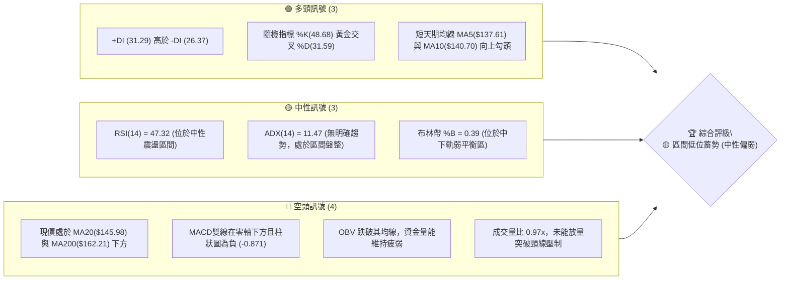
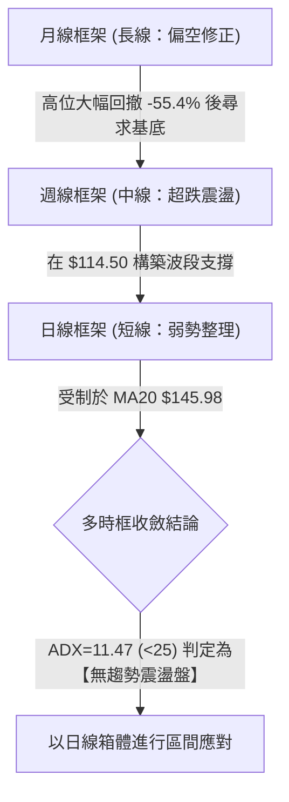
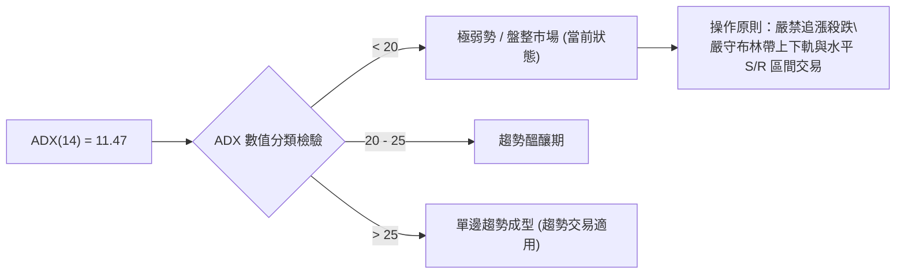
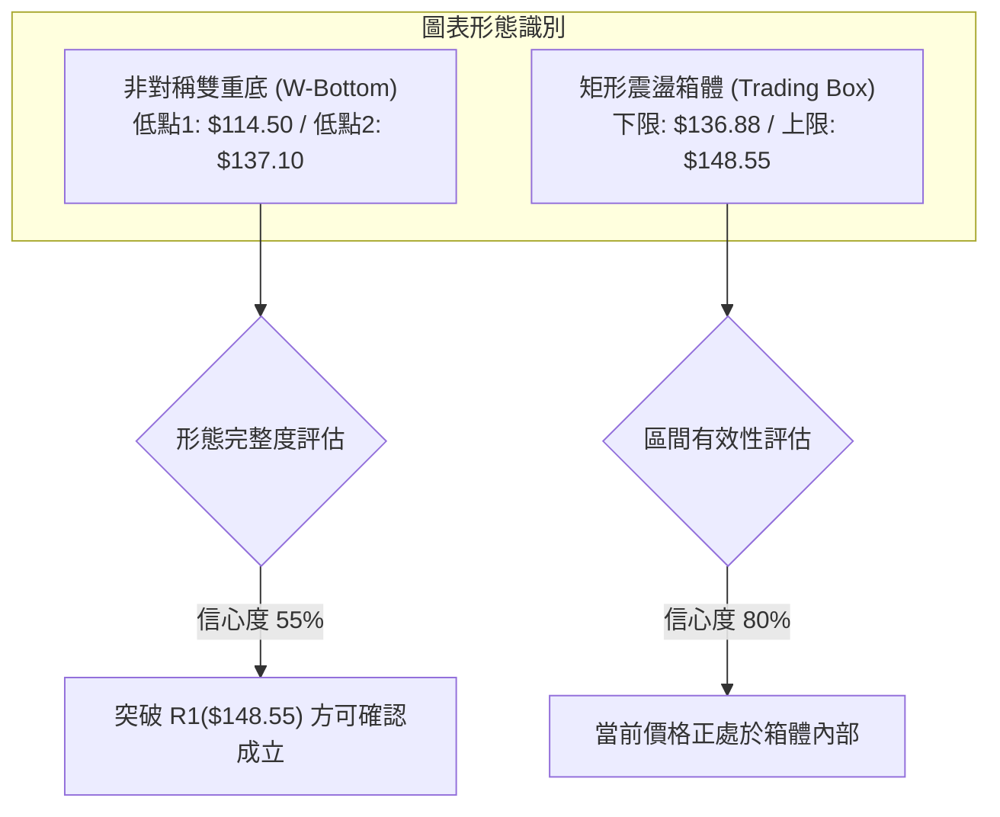
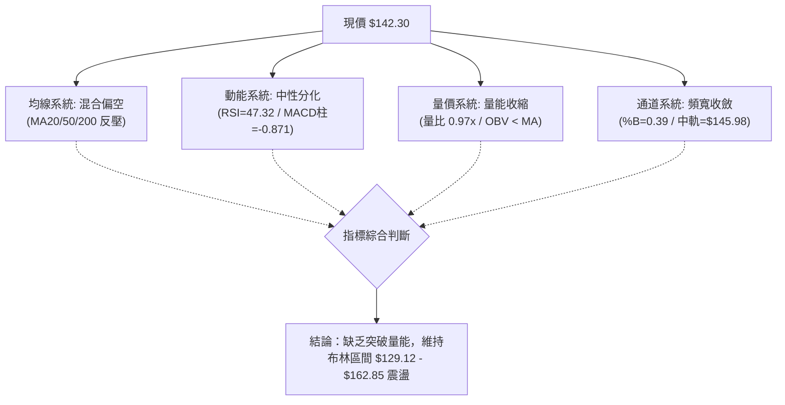
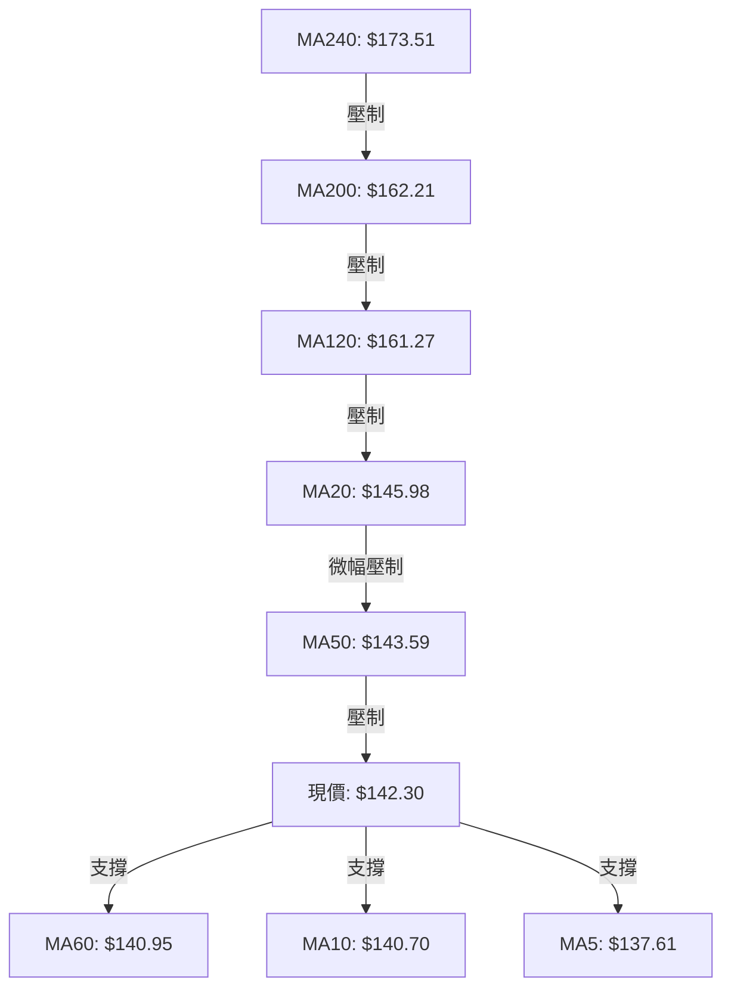
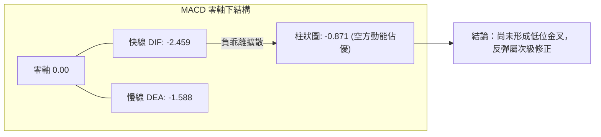
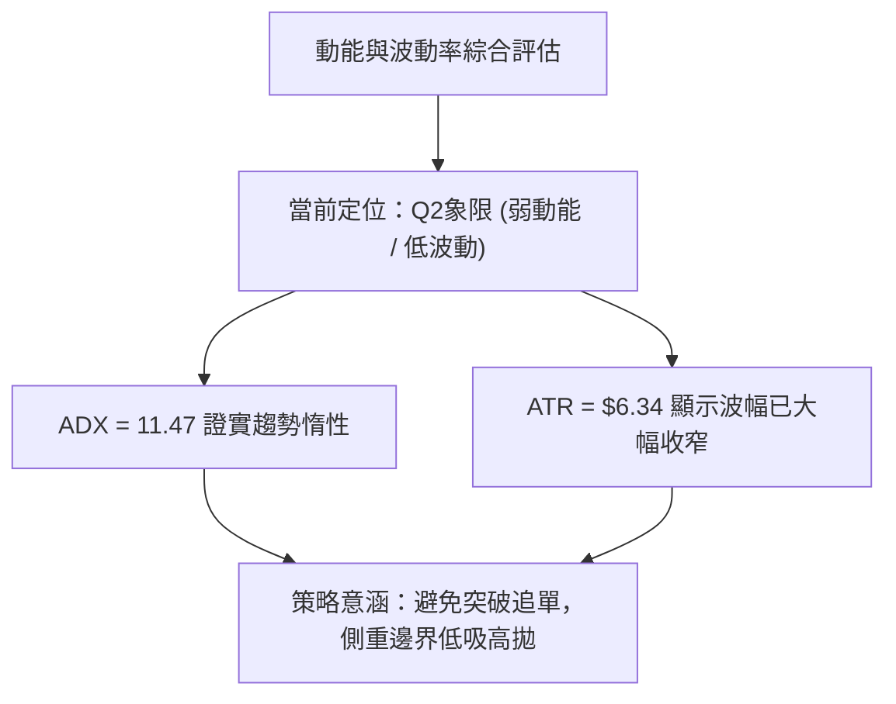
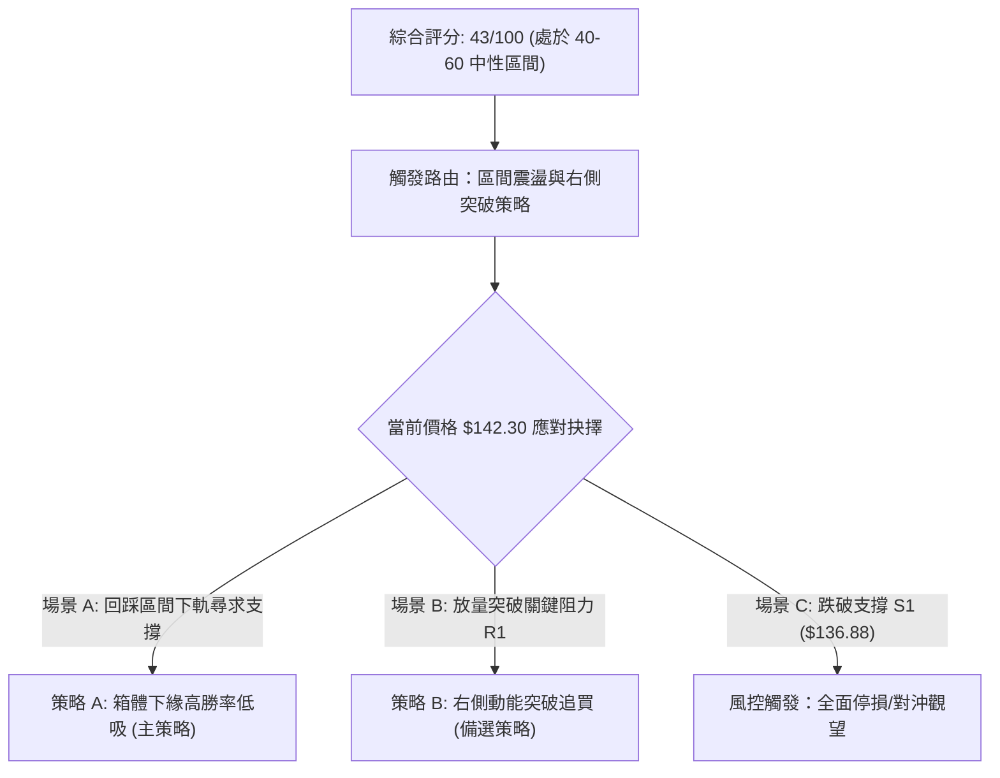
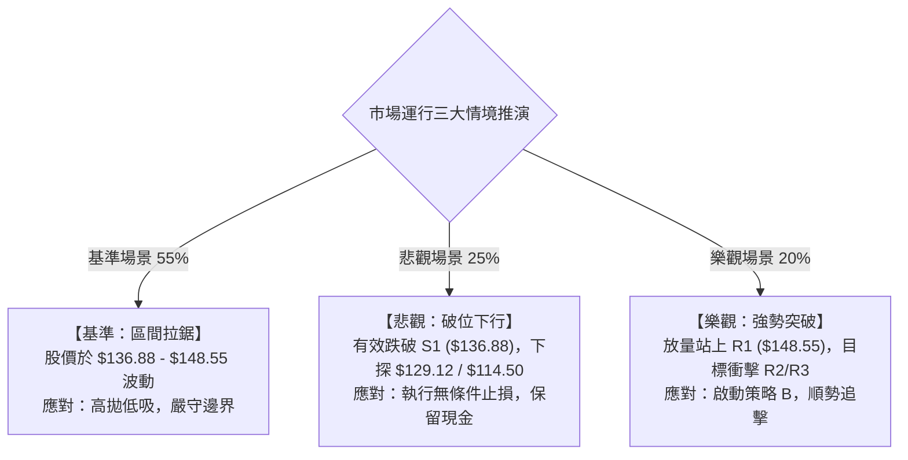

# ORCL 技術分析報告

> **報告日期**：2026-10-05 ｜ **語言**：繁體中文 ｜ **數據來源**：Yahoo Finance ｜ **當前價格**：$142.30

---

## 目錄

| 章節 | 內容 |
|------|------|
| [1. 技術面概覽](#1-技術面概覽) | 訊號儀表板、核心指標、評分卡 |
| [2. 趨勢分析](#2-趨勢分析) | 多時框趨勢、長中短期走勢、12個月歷史走勢圖 |
| [3. 圖表形態分析](#3-圖表形態分析) | 形態識別、信心度評估、K線組合、目標價推算 |
| [4. 支撐與阻力](#4-支撐與阻力) | 關鍵價位結構圖、阻力/支撐分析、斐波那契回調 |
| [5. 技術指標深度解讀](#5-技術指標深度解讀) | 均線系統、RSI、MACD、布林通道、OBV量價配合 |
| [6. 動能與波動率](#6-動能與波動率) | 動能四象限、ATR波動率、Beta與系統性風險 |
| [7. 多時框架總結](#7-多時框架總結) | 時框架矩陣、ADX收斂機制、方向定調 |
| [8. 交易策略建議](#8-交易策略建議) | 策略路由、階梯情境、具體交易計畫、風控配置 |
| [9. 風險提示與監控](#9-風險提示與監控) | 監控清單、情境推演、資金管理重要提醒 |
| [10. 報告總結](#-報告總結) | 核心結論與交易決策儀表板 |

---

## 1. 技術面概覽

### 🎯 技術訊號儀表板

ORCL 當前收盤價為 **$142.30**，各項技術維度呈現「超跌反彈後的收斂盤整」特徵。短天期均線呈現微幅金叉修復，但中長期均線仍處空頭壓制狀態。以下為多空力量分佈拓撲：



### 📊 核心指標速覽表

| 指標類別 | 指標名稱 | 當前數值 | 訊號 | 專業解讀 |
| :--- | :--- | :--- | :---: | :--- |
| **價格** | 當前收盤價 | **$142.30** | 🟡 | 位於52週區間的 13.6% 低位，短線脫離最低點但受制於波段中樞 |
| **均線** | 短期 MA20 | **$145.98** | 🔴 | 現價低於 MA20 (-2.52%)，短線面臨布林中軌首道動態反壓 |
| **均線** | 中期 MA50 | **$143.59** | 🔴 | 現價緊貼 MA50 下緣，多空於此爭奪短期生命線掌控權 |
| **均線** | 長期 MA200 | **$162.21** | 🔴 | 距離牛熊分界線 MA200 有 -12.27% 差距，長期空頭壓制明確 |
| **動能** | RSI(14) | **47.32** | 🟡 | 位於 40–60 中性平衡帶，無超買/超賣極端，亦未出現背離特徵 |
| **動能** | MACD(12,26,9)| **-2.459** | 🔴 | 雙線在零軸以下擴散，柱狀體為 **-0.871**，空方力道微幅佔優 |
| **動能** | Stoch %K/%D | **48.68 / 31.59** | 🟢 | 快線低位向上穿越慢線，釋出短線多頭反彈動能訊號 |
| **趨勢** | ADX(14) | **11.47** | 🟡 | 數值遠低於 25，表明缺乏單邊趨勢，盤面由震盪洗盤主導 |
| **通道** | 布林通道 | **$129.12 - $162.85** | 🟡 | 頻寬收斂，現價位於下半部 (%B=0.39)，尋求中軌支撐轉化 |
| **波動** | ATR(14) | **$6.34** | 🟡 | 日波動率為 4.45%，波幅較前幾週劇烈震盪收窄，進入整固期 |
| **量能** | OBV 與量比 | **0.97x / OBV<MA** | 🔴 | 20日均量 3,627 萬股，當日未顯著增量，資金以存量搏弈為主 |

### 🏆 技術評分卡

```
╔══════════════════════════════════════════════════════════════╗
║              ORCL 技術維度評分卡 (2026-10-05)                ║
╠══════════════════════════════════════════════════════════════╣
║ 趨勢強度 (ADX=11.47)   ████░░░░░░░░░░░░░░░░  20/100 🔴 弱勢震盪 ║
║ 動能指標 (RSI/MACD)    ████████░░░░░░░░░░░░  40/100 🟡 中性偏弱 ║
║ 支撐穩定度 (S1=$136.88)█████████████░░░░░░░  65/100 🟢 底部支撐 ║
║ 成交量能 (OBV<MA)      ████████░░░░░░░░░░░░  40/100 🔴 量能匱乏 ║
║ 形態完整度 (區間築底)  ██████████░░░░░░░░░░  50/100 🟡 箱型震盪 ║
║ 均線排列 (混合空頭)    ████████░░░░░░░░░░░░  42/100 🔴 均線反壓 ║
╠══════════════════════════════════════════════════════════════╣
║ 綜合技術評分           █████████░░░░░░░░░░░  43/100 🟡 觀望震盪 ║
╚══════════════════════════════════════════════════════════════╝
```

---

## 2. 趨勢分析

### 🌐 多時框趨勢分析

ORCL 在不同時間維度展現出完全分化的結構特徵。依據多時框收斂邏輯，當前日線與週線的趨勢方向存在背離，必須透過客觀層級進行分解：



### 📈 長期趨勢 — 12個月走勢圖（Unicode）

下圖展示 ORCL 自 2025 年 10 月至 2026 年 10 月的月線走勢，標注波段高低點與結構變化：

```
ORCL 過去12個月月線收盤走勢示意圖
價格軸 ($)
$270 ┤  ● (2025-10: $260.10)
$240 ┤
$225 ┤                                    ● (2026-05: $225.00 反彈頂)
$210 ┤
$195 ┤        ● (2025-11: $200.02)
$180 ┤              ● (2025-12: $193.05)
$165 ┤                    ● (2026-01: $163.44)  ● (2026-04: $160.83)
$150 ┤                                                ● (2026-08: $149.12)
$140 ┤                          ●         ●                 ●   ●←當前 $142.30
$130 ┤                          (02:$144) (03:$146)       ● (07:$129.87) (09:$137.30)
$114 ┤                                                  ▼ (52W最低: $114.50)
     └─────────────────────────────────────────────────────────────────
       25-10  25-11 25-12 26-01 26-02 26-03 26-04 26-05 26-06 26-07 26-08 26-09 26-10
```

#### 走勢特徵分析表格

| 階段區間 | 時間跨度 | 收盤價起訖 | 區間漲跌幅 | 結構形態特徵 |
| :--- | :--- | :--- | :---: | :--- |
| **高位崩跌段** | 2025-10 至 2026-02 | $260.10 → $144.39 | **-44.49%** | 單邊急跌，主力資金快速流出，接連跌破關鍵整數關卡 |
| **春季反抽段** | 2026-02 至 2026-05 | $144.39 → $225.00 | **+55.83%** | 弱勢反彈演化為強烈軋空，触及斐波那契 50% 水平 ($216.98) |
| **二次探底段** | 2026-05 至 2026-07 | $225.00 → $129.87 | **-42.28%** | 斷崖式跳水，7月創下52週極端低點 $114.50，籌碼全面清洗 |
| **底層修復段** | 2026-08 至 2026-10 | $129.87 → $142.30 | **+9.57%** | 波動收縮，圍繞 $135–$150 區間橫向築底，量能急劇遞減 |

### 📊 中期趨勢（週線分析）

從近 20 週的收盤價與動能演變觀察，ORCL 在經歷 2026 年 7 月底觸及 52 週低點 **$114.50**（該週收盤 **$114.99**）後，展開了技術性修復：

1. **週線第一波反彈**：8月中旬快速拉升至 **$150.52**，RSI(週線) 自極端超賣區 11.1 暴拉至 74.6，MACD 柱狀圖同步轉正至 **+4.827**。
2. **週線第二波受阻**：9月初反彈高點來到 **$158.78**，精確受阻於斐波那契 78.6% 回調位 **$158.36** 與波段阻力 R3 **$159.26**，隨後因成交量無法延續而回落。
3. **當前中性格局**：最新一週（2026-10-04）收盤價 **$142.30**，週 RSI 回落至 **47.3**，MACD 柱狀圖收斂至 **-0.871**。表明中期強勢反彈已告一段落，進入次級中樞震盪洗盤。

### ⚡ 趨勢強度評估（ADX 解讀）

ORCL 當前 **ADX(14) 讀數為 11.47**。在技術分析標準中，ADX 數值所代表的行情強度定義如下：



* **方向線判定**：**+DI 為 31.29**，**-DI 為 26.37**，+DI 高於 -DI，顯示在低位買盤力量微幅壓制賣盤，但因 ADX 僅有 11.47，多方無法發動持續性推升浪潮，定性為**「無趨勢的弱多頭平衡震盪」**。

---

## 3. 圖表形態分析

### 🔍 形態識別系統

在多週期圖表掃描中，ORCL 目前排除了大型頭肩頂/底等需要高清晰頸線的複雜幾何形態，主要的有效圖表形態為「低位收斂箱型」與「非對稱雙底（W底）構型」：



#### 形態信心度與目標價計算表

| 形態名稱 | 信心度 | 判斷依據（引用數據） | 完成度 | 目標價（附嚴格計算式） |
| :--- | :---: | :--- | :---: | :--- |
| **矩形震盪箱體** | **80%** | 下界錨定波段支撐 **S1: $136.88**，上界為波段高點 **R1: $148.55**。現價 $142.30 恰在箱體中間。 | 90% | 箱體突破目標 = 突破點 **$148.55** + 箱體高度 (**$148.55 - $136.88 = $11.67**) = **$160.22**（極接近 R3 **$159.26**） |
| **潛在非對稱雙底** | **55%** | 第一低點為 2026-07 探底 **$114.50**，第二低點為 2026-09-27 週收盤 **$137.10**，低點抬高；頸線錨定 **R1: $148.55**。 | 60% | 若有效放量突破頸線 R1($148.55)，量度目標 = 頸線 **$148.55** + 形態高度 (**$148.55 - $137.10 = $11.45**) = **$160.00** |
| **中長期下降通道** | **35%** | 由 2025-09 高點 $278.07 與 2026-05 反彈頂 $225.00 形成之下壓力。 | — | 訊號不足且跨度過長，中短期 ADX<25 壓制下不作主策略推導 |

### 🕯️ 重要 K 線形態分析

檢視近數週至近數月關鍵轉折 K 線，展現明確的多空爭奪節奏：

| 時間週期 | 收盤價 | K線組合形態 | 技術面解讀 | 訊號 |
| :--- | :---: | :--- | :--- | :---: |
| **2026-07-26 週** | $114.99 | **長下影錘頭線 (Hammer)** | 探底 52W 低點 $114.50 後爆出 1.62 億股天量回升，構成波段底部的恐慌拋售潮終結 | 🟢 |
| **2026-09-06 週** | $158.78 | **高位流星線 (Shooting Star)** | 衝擊斐波那契 78.6% 回調位 ($158.36) 失敗，留長上影線，代表追價意願中斷 | 🔴 |
| **2026-09-27 週** | $137.10 | **縮量下探十字星 (Doji)** | 回踩波段支撐位 S1 ($136.88) 獲得承接，成交量萎縮至 1.56 億股，賣壓耗竭 | 🟢 |
| **2026-10-04 週** | $142.30 | **下影小陽實體線** | 脫離底部小幅推升，站上短期 5日均線 ($137.61)，短底結構獲得初步確認 | 🟢 |

### 📉 ASCII 走勢形態示意圖

```
ORCL 築底震盪形態示意圖 (2026-07 至 2026-10)
-------------------------------------------------------------------------
$160 ┤                        [高點 $158.78 / R3: $159.26] 
     │                           /\
$154 ┤                          /  \  [波段阻力 R2: $153.60]
     │       頸線壓制帶 ------ / ---\ ------------------------- [R1: $148.55]
$148 ┤             /\         /      \      /\
     │            /  \       /        \    /  \      ★ 現價: $142.30
$142 ┤           /    \     /          \  /    \    /
     │          /      \   /            \/      \  /
$136 ┤         /        \_/                      \/ [第二低點: $137.10 / S1: $136.88]
     │        /    [震盪抬高]
$120 ┤       /
     │      /
$114 ┤     /  [第一低點 52W Low: $114.50]
     └────┴─────────────────────────────────────────────────────────────
          7月                    8月              9月             10月
```

### 🎯 形態目標價計算

根據經典技術分析體系中「形態垂直高度等幅投射」原則進行推算：
* **第一層目標 (頸線測試)**：**$148.55**（若突破，確認短線雙底確立）。
* **第二層目標 (等幅滿足點)**：由雙底低點 $137.10 與頸線 $148.55 計算所得高度為 $11.45。突破點 $148.55 + $11.45 = **$160.00**，該數值與技術數據阻力位 **R3 ($159.26)** 及 斐波那契 78.6% 回調位 **$158.36** 形成極強的阻力共振區。

---

## 4. 支撐與阻力

### 🗺️ 關鍵價位分布圖（Unicode）

本報告嚴格依照提供之 OHLCV 聚類計算數據，所有價位均來自歷史波段密集成交帶與斐波那契數學模型：

```
ORCL 價位結構分布圖
═════════════════════════════════════════════════════════════════
$162.85 ║░░░░░░░░░░░░░░░░░░░░░░░░░░░░░░░░░░░░░║ 布林上軌 (動態壓制)
$159.26 ║████████████████████████████████████║ 強阻力 R3 / 形態目標共振
$158.36 ║▓▓▓▓▓▓▓▓▓▓▓▓▓▓▓▓▓▓▓▓▓▓▓▓▓▓▓▓▓▓▓▓▓▓▓▓║ 斐波那契 78.6% 回調位
$153.60 ║████████████████████                ║ 次級阻力 R2 / 前期反彈中繼
$148.55 ║████████████████████████████        ║ 關鍵阻力 R1 / 箱體頸線
$145.98 ║────────────────────────────────────║ 布林中軌 / MA20 短線反壓
$142.30 ╠════════════════════════════════════╣ ◄ 當前收盤價 ($142.30)
$136.88 ║████████████████████████            ║ 關鍵波段支撐 S1
$129.12 ║░░░░░░░░░░░░░░░░░░░░░░░░░░░░░░░░░░░░░║ 布林下軌 (區間底界)
$114.50 ║████████████████████████████████████║ 極強歷史支撐 S2 (52W最低點)
═════════════════════════════════════════════════════════════════
```

### 🚧 阻力位分析表

阻力位完全引述波段高點聚類數值：

| 阻力級別 | 精確價位 | 距離現價 | 形成原因與籌碼屬性 | 突破難度 | 重要性 |
| :--- | :---: | :---: | :--- | :---: | :---: |
| **關鍵阻力 (R1)** | **$148.55** | +4.39% | 近期多次衝高回落的高點聚集帶，亦為近2個月箱型整理的上限頸線 | 🟡 中等 | ★★★★☆ |
| **次級阻力 (R2)** | **$153.60** | +7.94% | 8月中旬成交密集回調位，多頭二次反撲時的解套賣壓集中帶 | 🟡 中等 | ★★★☆☆ |
| **強阻力 (R3)** | **$159.26** | +11.92% | 近一年波段高點聚類，與斐波那契 78.6% ($158.36) 構成重疊天花板 | 🔴 極高 | ★★★★★ |

### 🛡️ 支撐位分析表

支撐位完全引述波段低點聚類數值：

| 支撐級別 | 精確價位 | 距離現價 | 形成原因與籌碼屬性 | 守住機率 | 重要性 |
| :--- | :---: | :---: | :--- | :---: | :---: |
| **近期支撐 (S1)** | **$136.88** | -3.81% | 2026年9月下旬波段回調低點聚類 ($137.10 附近)，多方防守核心陣地 | 75% | ★★★★☆ |
| **強烈支撐 (S2)** | **$114.50** | -19.54% | 52週歷史最低點，大週期天量換手區，長線價值投資者之錨定底線 | 95% | ★★★★★ |

### 📐 斐波那契回調位分析

依據 52 週完整波動區間（高點 **$319.46** 至 低點 **$114.50**，波幅高達 $204.96）進行黃金分割測算：

| 回調比率 | 精確水平位 | 相對現價位置 | 技術意義與互動狀態 |
| :---: | :---: | :---: | :--- |
| **0.0%** | **$319.46** | +124.50% | 52週歷史最高點（牛市極限） |
| **23.6%** | **$271.09** | +90.51% | 極強阻力位，2025年秋季高位密集成交頂部 |
| **38.2%** | **$241.16** | +69.47% | 中長期空頭防守中樞 |
| **50.0%** | **$216.98** | +52.48% | 多空平衡分水嶺（2026年5月反彈高點 $225.00 即止步於此） |
| **61.8%** | **$192.79** | +35.48% | 黃金分割強防守位，跌破後轉為極強長期阻力 |
| **78.6%** | **$158.36** | +11.29% | **關鍵阻力共振位**：現價落於此線下方，與 R3 ($159.26) 緊密重合 |
| **100.0%** | **$114.50** | -19.54% | 52週歷史最低點（熊市極限回撤底） |

* **現價區間解讀**：當前收盤價 **$142.30** 精確運行於 **78.6% ($158.36)** 與 **100.0% ($114.50)** 之間。此區間屬於「深度折價後的深水震盪築底區」。股價自 100% 水平強烈反彈後，受制於 78.6% 反壓，目前在該區間的下半部進行能量蓄積。

---

## 5. 技術指標深度解讀

### 🎛️ 指標訊號總覽



### 📈 移動平均線排列分析



* **均線全景數據解析**：
  * **超短期均線**：MA5 ($137.61) 走揚 +3.41%，MA10 ($140.70) 走揚 +1.14%，提供現價下方的浮動支撐墊。
  * **中期生命線**：現價 $142.30 正測試 MA60 ($140.95，+0.96%)，同時緊貼 MA50 ($143.59) 與 MA20 ($145.98)。MA20 當前斜率為負 (-2.52%)，代表短線 20 日持股成本依然處於微幅虧損解套賣壓中。
  * **長期牛熊線**：MA120 ($161.27)、MA200 ($162.21) 及 MA240 ($173.51) 呈現典型的空頭向下排列。均線系統定性為**「短線底部金叉、長線全面壓制」的混合排列**。

### 📉 RSI(14) 分析

* **當前數值**：**47.32**（中性震盪區間）。
* **進度條展示**：
  ```
  超賣區 (0-30)        中性平衡區 (30-70)        超買區 (70-100)
  [░░░░░░░░░░░░░░░░] [█████████░░░░░░░] [░░░░░░░░░░░░░░░░]
  0                 30        47.32     70               100
  ```
* **背離客觀研判**：
  * **頂背離檢驗**：ORCL 於 8月中旬高點 $150.52 時 RSI 達 74.6，9月初創更高點 $158.78 時 RSI 為 61.5，出現短期頂背離，該背離已在隨後回落至 $137.10 過程中消化完畢。
  * **底背離檢驗**：當前價格在 $137–$142 區間築底，RSI 從 29.5 穩步回升至 47.32，與價格走勢同步，**無明顯底背離**。結論：指標處於完全中性狀態，缺乏單向突破爆發力。

### 📊 MACD(12/26/9) 訊號解讀

* **指標詳細數值**：
  * MACD 快線（DIF）：**-2.459**
  * Signal 慢線（DEA）：**-1.588**
  * MACD 柱狀圖（Histogram）：**-0.871**（🔴 看空）



* **量化解讀**：雙線深陷零軸下方，且快線向下偏離慢線，柱狀圖為負值。儘管負值未進一步失控放大（上週為 -1.559，本週收窄至 -0.871），顯示空頭拋壓有所減緩，但在 DIF 向上金叉 DEA 之前，動能指標嚴格發出謹慎訊號。

### 📦 布林通道分析

```
ORCL 布林通道結構 (BB 20, 2)
══════════════════════════════════════════════════════════════════
$162.85 ─────────────────────────────────────── 上軌 (Upper Band)
                     :
                     : (中上軌空間：強勢反彈區)
                     :
$145.98 ┄┄┄┄┄┄┄┄┄┄┄┄┄┄┄┄┄┄┄┄┄┄┄┄┄┄┄┄┄┄┄┄┄┄┄┄┄ 中軌 (MA20 Baseline)
                     ▲
         [$142.30] ──┤ (現價處於中軌下方，%B = 0.39)
                     ▼
$129.12 ─────────────────────────────────────── 下軌 (Lower Band)
══════════════════════════════════════════════════════════════════
```

* **參數解析**：通道上限 **$162.85**，中軌 **$145.98**，下限 **$129.12**。
* **位置特徵 (%B)**：當前 **%B = 0.39**。代表價格位於中軌與下軌之間偏下位置。當前通道寬度處於近半年相對收窄期，表明前期劇烈單邊暴跌已轉入「窄幅蓄勢期」。未觸及下軌 $129.12 意味著並無超跌恐慌，受制於中軌 $145.98 則說明多方反擊仍處於試探階段。

### 💹 成交量分析（量價配合度）

* **量能指標詳情**：
  * 最新單日成交量：**35,330,300 股**
  * 20日均量：**36,279,495 股**
  * 量比（Volume Ratio）：**0.97x**（量能平淡，幾乎與均量持平）
  * 50日均量：**30,725,774 股**（表明近期相較於7月極端暴跌期的日均量有所微增）
* **OBV（能量潮）走勢**：
  * 系統提示：`OBV < MA → 量能疲弱`。
  * **深度解讀**：OBV 指標持續位於其訊號線下方，反映自 2026 年 5 月高位回落以來，資金呈現「逢反彈離場」態勢。在缺乏主力資金大規模主動性掃盤（OBV 突破其均線）之前，價格的反彈多為空頭回補所致，難以形成大級別反轉。

---

## 6. 動能與波動率

### ⚡ 動能評估四象限

結合動能指標（RSI / MACD）與波動率指標（ATR / 布林帶寬），將 ORCL 當前狀態定位於市場四象限中：

| 象限 | 動能維度 | 波動維度 | 代表特徵 | 當前狀態判定 |
| :---: | :---: | :---: | :--- | :---: |
| **Q1** | 強動能 | 低波動 | 穩步單邊推升，機構控盤主升浪 | — |
| **Q2** | **弱動能** | **低波動** | **收斂三角形/箱型盤整，多空僵持** | **✓ (ORCL 當前落點)** |
| **Q3** | 強動能 | 高波動 | 暴跌/暴漲突破，單邊趨勢釋放 | — |
| **Q4** | 弱動能 | 高波動 | 巨幅洗盤，無序寬幅震盪 | — |



### 📊 ATR 波動率分析

* **ATR(14) 當前數值**：**$6.34**（佔當前股價之 **4.45%**）。
* **風控與止損距離精算**：
  * **日內正常雜訊過濾 (1.0x ATR)**：**$6.34**。日內波動若在 ±$6.34 內均屬隨機擾動。
  * **標準波段止損緩衝 (1.5x ATR)**：**$9.51**。若建立波段部位，安全止損間距需至少預留 $9.51。
  * **防掃損寬鬆止損 (2.0x ATR)**：**$12.68**。適用於中長線低吸建倉的防守下限。

### 📐 Beta 與市場相關性

* **Beta 係數**：**1.732**（極高系統性風險敏感度）。
* **機構與空頭籌碼分析**：
  * **放空比率 (Short % Float)**：**2.7%**，空頭回補天數 (Short Ratio) 為 **1.82 天**。整體空頭並未形成嚴重的結構性擠壓風險（Short Squeeze 機率低）。
  * **內部人與機構持股**：內部人持股達 **38.4%**（高股權集中度，主力利益綁定），機構持股為 **43.5%**。
  * **波動關聯性**：Beta 達 1.732 表明 ORCL 的波動幅度約為 S&P 500 的 1.73 倍。在大盤科技股指數出現波動時，ORCL 的下行或上行振幅均會被顯著放大，因此在弱動能期必須嚴控個股暴跌帶來的系統性外溢風險。

---

## 7. 多時框架總結

### 📋 時框架評分表

依據多時框收斂規則（嚴格要求 14），將各維度訊號整合列表：

| 時框架 | 趨勢方向 | 動能狀態 | 均線排列 | 關鍵形態結構 | 綜合評分 | 戰術建議 |
| :--- | :---: | :---: | :---: | :--- | :---: | :--- |
| **短期 (日線)** | 🟡 橫向震盪 | 🟡 中性平淡 (RSI 47) | 🔴 混合偏空 (壓在MA20下) | $136.88 - $148.55 矩形箱體 | **45/100** | 區間下緣低吸，上緣減磅 |
| **中期 (週線)** | 🟡 超跌修復 | 🔴 偏弱 (MACD柱-0.87) | 🔴 空頭壓制 (受制MA50週) | $114.50雙底雛形，受阻R3 | **42/100** | 不宜重倉，等待放量突破R1 |
| **長期 (月線)** | 🔴 大幅修正 | 🔴 熊市回調 | 🔴 跌破MA120/MA200月線 | 斐波那契 78.6% 下方運行 | **38/100** | 戰略底倉分批定投，嚴禁槓桿 |

### 🔲 綜合訊號矩陣

```
時框架訊號收斂矩陣
┌──────────────┬──────────────────┬──────────────────┬──────────────────┐
│ 維度 \ 週期  │ 短期 (Daily)     │ 中期 (Weekly)    │ 長期 (Monthly)   │
├──────────────┼──────────────────┼──────────────────┼──────────────────┤
│ 趨勢方向     │ 🟡 橫盤 (中性)   │ 🟡 築底 (中性)   │ 🔴 下跌 (看空)   │
│ 動能強度     │ 🟡 平衡 (RSI 47) │ 🔴 偏空 (MACD<0) │ 🔴 弱勢 (超賣後) │
│ 支撐防守     │ 🟢 守住 S1       │ 🟢 守住 $114.50  │ 🟢 歷史低位區    │
│ 突破阻力     │ 🔴 受阻 R1       │ 🔴 受阻 R3/78.6% │ 🔴 遠離 MA200    │
└──────────────┴──────────────────┴──────────────────┴──────────────────┘
```

### ⚖️ 多時框收斂結論

* **規則檢驗**：當前 **ADX(14) = 11.47 (< 25)**。依「多時框收斂規則」第 14 條判定：**當前市場屬於典型的盤整行情（ADX < 25），而非單邊趨勢行情**。
* **主導權重分配**：
  * 中長期（週線/MA200）方向雖為偏空，但由於趨勢強度極低，空頭進一步殺跌動能已耗盡；
  * 因此，交易權重**完全收斂至日線布林通道上下軌與水平 S/R 區間**。
* **唯一確定性結論**：
  **【🟡 中性觀望 / 區間箱體交易】**。本結論與第 1 章技術評分卡（43/100）保持完全一致，並直接指導第 8 章之具體策略設定。

---

## 8. 交易策略建議

### 🗺️ 策略決策流程圖



### 🧭 策略路由（依評分卡分流）

> **當前主策略方向 = 🟡 中性區間操作（評分 43/100：介於 40–60 之間，以布林通道與箱體邊界為主，等待放量突破確認）**

### 🎯 價格情境階梯（Price Scenarios）

價位完全採用本報告第 4 章確證之數值：

| 觸發條件 | 下一目標 | 後續延伸 | 結構性情境含義 |
| :--- | :---: | :---: | :--- |
| **向上突破 R1 ($148.55)** | **R2 ($153.60)** | **R3 ($159.26)** | 短線 W 底構築完成，突破箱體頸線，動能轉強衝擊 78.6% 阻力 |
| **維持於現價區間 ($142.30)** | 上軌 **$145.98** | 下軌 **$136.88** | 處於日線布林通道中下軌之間反覆拉鋸，以時間換取空間進行籌碼沉澱 |
| **向下跌破 S1 ($136.88)** | 布林下軌 **$129.12** | **S2 ($114.50)** | 二次探底失敗，支撐下移，考驗布林下軌及 52 週歷史最低點防線 |

### 📊 情境機率分佈

| 運行情境 | 發生機率 | 主要技術數據支撐依據 |
| :--- | :---: | :--- |
| **區間箱型震盪** ($136.88 – $148.55) | **55%** | ADX 僅 11.47 顯示單邊動能匱乏；成交量比 0.97x 無法支撐趨勢突破；布林寬度維持中性收斂。 |
| **回落再探支撐** ($136.88 → $129.12) | **25%** | MACD 柱狀圖仍為負值 (-0.871)；OBV 低於均線；Beta=1.732 若大盤回調易引發下挫。 |
| **強勢向上反彈** ($148.55 → $153.60) | **20%** | +DI(31.29) 高於 -DI(26.37)；Stoch 形成金叉；分析師共識目標均價為 $237.97（基本面支撐）。 |

### 🟢 主策略詳情

針對中性評分，制定以下兩套互補之交易策略：

| 策略要素 | 策略 A：箱體下緣低吸（左側/區間波段） | 策略 B：放量突破追多（右側/動能確認） |
| :--- | :--- | :--- |
| **進場條件** | 股價回踩 **S1 ($136.88)** 附近，日K收下影線且 RSI 未破 35 | 日線收盤價強勢實體突破 **R1 ($148.55)**，單日成交量 > 4,500萬股 |
| **進場價格** | **$137.50**（於 S1 上方 0.45% 佈局） | **$149.00**（突破 R1 後回踩確認點） |
| **目標價 T1** | **$145.98**（布林中軌 / MA20 初步阻力） | **$153.60**（波段阻力 R2） |
| **目標價 T2** | **$148.55**（箱體上界頸線 R1） | **$159.26**（波段強阻力 R3 / 斐波 78.6%） |
| **止損價格** | **$133.00**（跌破 S1 達 2.8%，低於 1.5x ATR 緩衝點） | **$144.50**（跌回 MA20 及突破頸線下方） |
| **風險報酬比** | **1 : 2.45** (風險 $4.50 vs T2獲利 $11.05) | **1 : 2.28** (風險 $4.50 vs T2獲利 $10.26) |
| **勝率預估** | **65%**（符合盤整市低吸特徵） | **50%**（受制於中長期均線逆風） |
| **建議倉位** | **10% - 15%** 總投資資金 | **8% - 10%** 總投資資金 |

### 🔴 反向風險觸發點（對沖提示）

若發生下列技術破位現象，多頭邏輯全數失效，應立即執行止損或建立反向對沖：
1. **空頭觸發點**：日線實體陰線**跌破波段支撐 S1 ($136.88)**，且收盤無法收回。
2. **量能確認**：跌破時單日成交量放大至 4,000 萬股以上，且 MACD 柱狀圖負值進一步放大至 -2.00 以下。
3. **對沖措施**：立即將策略 A/B 部位全部平倉出局，中長線投資者應在跌破 $136.88 時建立空頭部位（目標指向布林下軌 **$129.12** 甚至歷史低點 **$114.50**）以鎖定資產價值。

### ⭐ 整體訊號強度評星

```
做多訊號強度：★★☆☆☆  (2/5星：受制於均線壓制與ADX偏低，僅適宜區間操作)
做空訊號強度：★★☆☆☆  (2/5星：下方S1支撐強勁，且有分析師買入共識護盤)
整體可信度：  ★★★★☆  (4/5星：關鍵價位聚類清晰，布林通道邊界極具參考價值)
```

---

## 9. 風險提示與監控

### ✅ 關鍵監控指標 Checklist

```
╔══════════════════════════════════════════════════════════════╗
║              ORCL 交易風控監控清單 (Checklist)               ║
╠══════════════════════════════════════════════════════════════╣
║ [ ] 價格突破監控：收盤價是否站上 R1 ($148.55) 或跌破 S1 ($136.88)║
║ [ ] 量能異動監控：單日成交量是否突破 50日均量 (3,072萬股) 1.5倍  ║
║ [ ] MACD 零軸轉化：柱狀圖是否由負 (-0.871) 翻正，形成日線金叉 ║
║ [ ] RSI 極值警報：RSI(14) 是否跌破 35 (接近超賣) 或突破 65   ║
║ [ ] 趨勢甦醒標誌：ADX(14) 是否自 11.47 向上拉升突破 20 門檻   ║
║ [ ] 大盤關聯風險：Beta=1.732，密切監控 Nasdaq/科技股回調衝擊   ║
╚══════════════════════════════════════════════════════════════╝
```

### ⚠️ 風險場景分析



### 🛡️ 風險管理重要提醒

1. **基本面與財務面背離風險**：
   * 儘管 41 位分析師共識為 **Buy（目標均價 $237.97）**，且自由現金流 (FCF) 為 **$-45.85B**，淨負債達 **$-132.07B**，資產負債率極高。在技術面尚未出現明確趨勢反轉前，絕不可單憑低估值或分析師目標價盲目滿倉「抄底」。
2. **波動率放大的部位管控**：
   * ORCL 的 ATR 為 **$6.34**（單日波動率 4.45%），屬於高波動科技個股。單筆交易所承擔的最大帳戶淨值損失嚴格限制於 **1.0% – 1.5%** 之內。
   * **部位計算公式**：
     $$\text{最大允許股數} = \frac{\text{帳戶總資金} \times 1.5\%}{\text{進場價} - \text{止損價}}$$
     若以策略 A 進場（進場 $137.50，止損 $133.00，每股風險 $4.50），每 $100,000 美元資金規模最多持有：
     $$\frac{\$100,000 \times 1.5\%}{\$4.50} = 333 \text{ 股 (約占總資金 45.8% 上限，建議初次建倉僅配置 10-15%)}$$
3. **無趨勢環境下的心理紀律**：
   * ADX 處於 11.47 代表市場缺乏大方向，假突破與假跌破發生頻率極高。盤中劇烈波動不可盲目追價，一切交易訊號嚴格以**收盤價（Daily Close）**為最終確認依據。

---

## 📋 報告總結

```
╔══════════════════════════════════════════════════════════════╗
║                 ORCL 技術分析報告核心總結                    ║
╠══════════════════════════════════════════════════════════════╣
║ 報告日期：2026-10-05           當前價格：$142.30             ║
║ 綜合技術評分：43/100           技術評級：🟡 觀望震盪 (區間交易)║
╠══════════════════════════════════════════════════════════════╣
║ 【核心趨勢結構】                                             ║
║ ├─ 長期趨勢 (月線)：🔴 空頭修正 (自$319.46高位回落，處斐波78.6%下)║
║ ├─ 中期趨勢 (週線)：🟡 超跌反彈後的收斂期 (MACD柱 -0.871)    ║
║ └─ 短期趨勢 (日線)：🟡 矩形整理 (ADX=11.47，無趨勢特徵顯著)  ║
╠══════════════════════════════════════════════════════════════╣
║ 【關鍵點位矩陣 (嚴格引用 OHLCV 計算值)】                     ║
║ ├─ 關鍵阻力：R1: $148.55 ｜ R2: $153.60 ｜ R3: $159.26       ║
║ ├─ 當前價格：$142.30 (位於布林通道下半部，%B = 0.39)         ║
║ ├─ 關鍵支撐：S1: $136.88 ｜ S2: $114.50 (52W歷史低點)        ║
║ └─ 斐波那契關鍵共振位：78.6% 回調位 ($158.36，緊貼 R3)       ║
╠══════════════════════════════════════════════════════════════╣
║ 【最優策略決策】                                             ║
║ 🥇 首選策略：策略 A (箱體下緣低吸)                           ║
║    進場: $137.50 ｜ 止損: $133.00 ｜ 目標1: $145.98 ｜ 目標2: $148.55║
║    風報比: 1 : 2.45 ｜ 建議部位: 10% - 15%                   ║
║ 🥈 次選策略：策略 B (放量突破追買)                           ║
║    條件: 收盤強勢站上 $148.55 且放量 ｜ 目標: $153.60 / $159.26║
║ 🥉 保守選擇：完全空倉觀望，靜待 ADX > 20 且突破箱體後再行介入║
╚══════════════════════════════════════════════════════════════╝
```

---

> ⚠️ **免責聲明**：本報告由資深技術分析研究模型生成，所有引述之價位、技術指標與形態數據均基於歷史市場交易記錄客觀推算。報告內容**僅供專業投資研究與學術探討參考**，**不構成任何要約、招攬或具體投資建議**。金融市場存在高波動風險，投資人應獨立評估自身風險承受能力並自負盈虧。

---
*報告生成時間：2026-10-05 ｜ 數據來源：Yahoo Finance ｜ 分析框架：多時框技術分析模型*