# ORCL 技術分析報告

> **報告日期**：2026-10-08 ｜ **語言**：繁體中文 ｜ **數據來源**：Yahoo Finance ｜ **當前價格**：$143.56

---

## 目錄

| 章節 | 內容 |
|------|------|
| [1. 技術面概覽](#1-技術面概覽) | 訊號儀表板、核心指標、評分卡 |
| [2. 趨勢分析](#2-趨勢分析) | 多時框趨勢、長中短期走勢 |
| [3. 圖表形態分析](#3-圖表形態分析) | 形態識別、K線組合、目標價 |
| [4. 支撐與阻力](#4-支撐與阻力) | 關鍵價位、斐波那契回調 |
| [5. 技術指標深度解讀](#5-技術指標深度解讀) | MA/RSI/MACD/布林/成交量 |
| [6. 動能與波動率](#6-動能與波動率) | 動能評估、ATR、Beta |
| [7. 多時框架總結](#7-多時框架總結) | 時框架評分矩陣 |
| [8. 交易策略建議](#8-交易策略建議) | 多空策略、風險報酬比 |
| [9. 風險提示與監控](#9-風險提示與監控) | 監控指標、風險場景 |

---

## 1. 技術面概覽

### 🎯 技術訊號儀表板

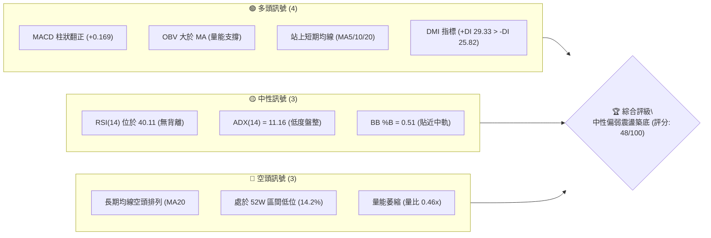

### 📊 核心指標速覽表

| 指標類別 | 指標名稱 | 當前數值 | 訊號 | 解讀 |
|----------|----------|----------|------|------|
| **價格** | 當前價格 | $143.56 | 🟡 | 位於52週區間14.2%，處於深度回調後的築底震盪區 |
| **均線** | MA20 | $143.38 | 🟢 | 現價微幅突破中軌與短期MA20 (+0.13%)，短線止跌 |
| **均線** | MA50 | $145.11 | 🔴 | 價格受制於MA50下方 (-1.07%)，中期下行壓力未解 |
| **均線** | MA200 | $161.65 | 🔴 | 價格遠低於牛熊分界線 (-11.19%)，長期趨勢偏空 |
| **動能** | RSI(14) | 40.11 | 🟡 | 處於弱勢中性格局，無超買超賣，無顯著背離 |
| **動能** | MACD | -1.506 / 柱 +0.169 | 🟢 | 快線位於慢線上，柱狀圖翻正，釋出短線微弱修復訊號 |
| **趨勢** | ADX(14) | 11.16 | 🟡 | 數值遠低於25，明確定義為無趨勢之低波動箱體盤整 |
| **通道** | 布林帶寬 | $132.59 - $154.17 | 🟡 | %B為0.51，精確收斂於中軌，靜待帶寬擴張破局 |
| **量能** | 成交量比 | 0.46x (15.7M) | 🔴 | 嚴重縮量，交投清淡，缺乏主力機構主動推升意願 |
| **波動** | ATR(14) | $5.69 (3.97%) | 🟡 | 每日平均波動幅度適中，盤整期提供對稱風控邊界 |

### 🏆 技術評分卡

```
╔══════════════════════════════════════════════════════════════════╗
║              技術評分卡 — ORCL (2026-10-08)                     ║
╠══════════════════════════════════════════════════════════════════╣
║ 趨勢強度 (Trend)     ████░░░░░░░░░░░░░░░░  22/100  🔴 弱勢盤整    ║
║ 動能指標 (Momentum)  ██████████░░░░░░░░░░  52/100  🟡 短多修復    ║
║ 支撐穩定度 (Support) ████████████░░░░░░░░  60/100  🟢 底層具韌性  ║
║ 成交量配合 (Volume)  ██████░░░░░░░░░░░░░░  32/100  🔴 極度縮量    ║
║ 形態完整度 (Pattern) ████████████░░░░░░░░  62/100  🟡 箱體收斂    ║
║ 均線排列 (MA System) ████████░░░░░░░░░░░░  40/100  🔴 空頭排列    ║
╠══════════════════════════════════════════════════════════════════╣
║ 綜合評分             ██████████░░░░░░░░░░  48/100  ⚖️ 區間震盪觀望 ║
╚══════════════════════════════════════════════════════════════════╝
```

---

## 2. 趨勢分析

### 🌐 多時框趨勢分析

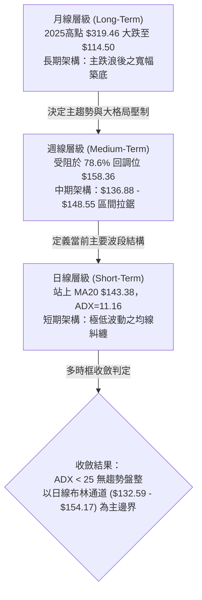

### 📈 長期趨勢 — 12個月走勢圖（Unicode）

```
ORCL 月線走勢圖（過去12個月：2025-11 至 2026-10）
價格軸 ($)
$260.10 ┤
$240.00 ┤
$225.00 ┤                               ● (2026-05 反彈次高)
$200.02 ┤ ● (2025-11)
$193.05 ┤     ● (2025-12)
$163.44 ┤         ● (2026-01)
$146.09 ┤             ●   ●   ● (2026-04)           ● (2026-08)
$143.56 ┤───────────────────────────────────────────────────●← 現價 ($143.56)
$137.30 ┤                                                 ● (2026-09)
$129.87 ┤                                         ● (2026-07)
$114.50 ┤                                     ● (52W 最低點)
        └─────────────────────────────────────────────────────
          11  12  01  02  03  04  05  06  07  08  09  10 (月份)
```

**走勢特徵分析表格**：

| 階段 | 時間跨度 | 價格區間 | 累積漲跌幅 | 核心技術特徵 |
|------|----------|----------|------------|--------------|
| **第1階段：深幅回調** | 2025-11 ~ 2026-02 | $200.02 → $144.39 | -27.81% | 權重估值修正，跌破長期均線，空方主導拋售。 |
| **第2階段：多頭反撲** | 2026-03 ~ 2026-05 | $146.09 → $225.00 | +54.01% | 財報強勁業績驅動，爆發性軋空，形成假突破型頂部。 |
| **第3階段：崩跌觸底** | 2026-06 ~ 2026-07 | $225.00 → $114.50 | -49.11% | 伴隨巨量單邊暴跌，探及52週極值低點 $114.50，籌碼斷崖式出清。 |
| **第4階段：弱勢修復** | 2026-08 ~ 2026-10 | $114.50 → $143.56 | +25.38% | 於 $130-$150 間建立收斂箱體，動能與量能逐步沉寂。 |

### 📊 中期趨勢（週線分析）

中期技術面目前處於「弱勢反彈受阻」架構。自2026年7月觸及 $114.50 後，週線級別展開三波修復，並在 2026-09-06 達到反彈高點 $158.78（此位置精確受制於斐波那契 78.6% 回調位 $158.36 與 R3 阻力位 $159.26）。隨後價格出現連續兩週回踩至 $137.10，確立了中期底部抬高的事實（$137.10 > $114.50）。近兩週價格回升至 $143.56，MACD週線柱狀由負翻正至 +0.169，中期下行速率已明顯遏制，步入橫盤整固階段。

### ⚡ 趨勢強度評估（ADX 解讀）

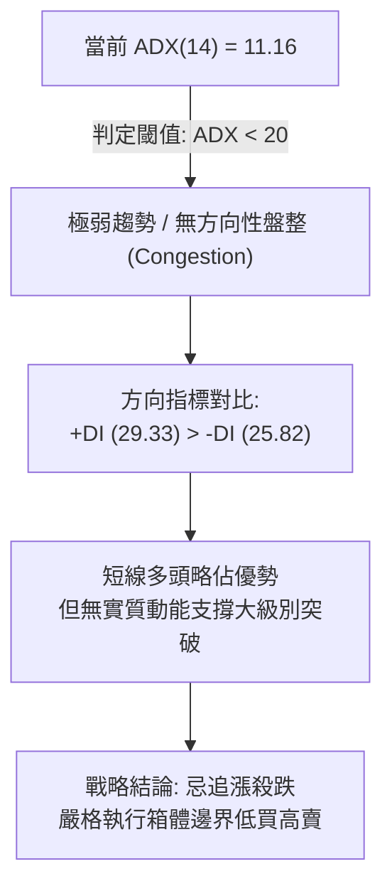

| 指標項 | 當前數值 | 狀態門檻 | 趨勢解讀 |
|--------|----------|----------|----------|
| **ADX(14)** | 11.16 | < 20 極弱; 20-25 轉折; > 25 強勢 | **極度低迷的無趨勢環境**，不可採用趨勢跟隨型突破系統。 |
| **+DI** | 29.33 | 高於 -DI | 多方在極短線上佔據微弱主動，買盤防守積極。 |
| **-DI** | 25.82 | 低於 +DI | 空方砸盤意願暫歇，缺乏二次下殺動能。 |

---

## 3. 圖表形態分析

### 🔍 形態識別系統

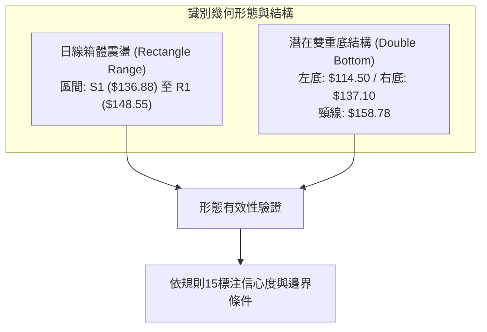

**形態信心度與目標價評估表**：

| 形態名稱 | 信心度 | 判斷依據（引用數據） | 完成度 | 目標價（附嚴謹計算式） |
|----------|--------|----------------------|--------|------------------------|
| **箱體橫盤收斂** | 80% | 現價 $143.56 夾在 S1 $136.88 與 R1 $148.55 之間；ADX=11.16 驗證盤整 | 85% | 向上突破測算：頸線 R1 $148.55 + 形態高度 ($148.55 - $136.88 = $11.67) = **$160.22**（極度接近阻力 R3 $159.26） |
| **中期雙重底 (W底)** | 55% | 左底 2026-07-26 收盤 $114.99 (低點$114.50)，右底 2026-09-27 收盤 $137.10，未破前低 | 40% (尚未突破頸線) | 頸線位取 2026-09-06 週高點 $158.78。突破後量度目標：$158.78 + ($158.78 - $114.50 = $44.28) = **$203.06** |

### 🕯️ 重要K線形態分析

| 週/月週期 | 收盤價 | 核心K線組合形態 | 解讀與博弈心理 | 訊號強度 |
|-----------|--------|-----------------|----------------|----------|
| **2026-07-26** | $114.99 | 長下影長陰竭盡線 | 恐慌拋盤被主力機構長下影線全部承接，空頭波段動能耗盡 | 🟢 看多反轉 |
| **2026-08-09** | $147.02 | 大陽線吞噬線 | 連續突破短期阻力，成交量溫和放大，確立階段性反彈走勢 | 🟢 強勢反轉 |
| **2026-09-06** | $158.78 | 射擊之星 (Shooting Star) | 衝高觸及 78.6% 回調位 ($158.36) 遭遇長線解套賣壓打壓，留長上影 | 🔴 阻力確認 |
| **2026-09-27** | $137.10 | 縮量錘子線 | 回踩至支撐 S1 ($136.88) 附近止跌，下檔買盤防守頑強 | 🟢 支撐有效 |
| **2026-10-11** | $143.56 | 窄幅十字星孕線 | 價格重返 MA20，振幅收窄，市場進入方向選擇前的極致平衡 | 🟡 中性整固 |

### 📉 ASCII 走勢形態示意圖

```
ORCL 中短期形態結構圖 (2026-07 至 2026-10)
價位 ($)
$159.26 ┤                 [頸線 / R3 阻力]
$158.78 ┤               ╭─● (2026-09-06 頂部)
$153.60 ┤               │      \       /
$148.55 ┤───────────────┼───────\─-───/─ [箱體頂 / R1 阻力]
$143.56 ┤               │        \   ● 現價 ($143.56 糾纏 MA20)
$136.88 ┤───────────────┼─────────●─── [箱體底 / 右底 S1 支撐]
$131.58 ┤         ╭─────╯        (2026-09-27: $137.10)
$126.41 ┤        /
$114.50 ┤───────● (左底: 2026-07-26 最低點)
        └──────────────────────────────────────────────
         07-26        08-16      09-06      09-27    10-08
```

---

## 4. 支撐與阻力

### 🗺️ 關鍵價位分布圖（Unicode）

```
ORCL 價位結構分布圖
═════════════════════════════════════════════════════════════════════
$159.26 ║████████████████████████████████████║ 強阻力 R3 / 密集拋壓
$153.60 ║██████████████████████              ║ 中期阻力 R2 / BB 上軌附近
$148.55 ║████████████████                    ║ 短線關鍵阻力 R1 (箱體頂)
$143.56 ╠════════════════════════════════════╣ ◄ 當前市價 ($143.56)
$136.88 ║▓▓▓▓▓▓▓▓▓▓▓▓▓▓▓▓                    ║ 近期關鍵支撐 S1 (箱體底)
$131.58 ║████████████████████                ║ 強支撐 S2 / BB 下軌重合區
$114.50 ║████████████████████████████████████║ 核心防線 S3 (52W 低點)
═════════════════════════════════════════════════════════════════════
```

### 🚧 阻力位分析表

| 阻力級別 | 價位 | 形成原因 | 突破難度 | 重要性 |
|----------|------|----------|----------|--------|
| **R1** | $148.55 | 近期波段震盪高點聚類；與MA50 ($145.11)形成上方遞進阻力群 | 中等 (需日量能擴大至30M以上) | 短線強弱分水嶺 |
| **R2** | $153.60 | 近期次級反彈阻力位，緊鄰布林帶上軌 ($154.17)，多頭超買警戒區 | 較高 (空頭均線壓制) | 波段獲利了結點 |
| **R3** | $159.26 | 斐波那契78.6% ($158.36) 與雙底頸線 ($158.78) 共振壓制區 | 極高 (大量解套盤湧出) | 牛熊中期分界點 |

### 🛡️ 支撐位分析表

| 支撐級別 | 價位 | 形成原因 | 守住機率 | 重要性 |
|----------|------|----------|----------|--------|
| **S1** | $136.88 | 9月下旬回調低點聚類 ($137.10)；短期密集成交防守平台 | 70% | 短線箱體多頭底線 |
| **S2** | $131.58 | 近一年次低點聚類；與布林通道下軌 ($132.59) 形成下影線緩衝 | 85% | 中期生命線 |
| **S3** | $114.50 | 52週歷史絕對低點；極致非理性拋售引發的機構流動性承接底 | 95% | 戰略防守底線 (破位系統性崩盤) |

### 📐 斐波那契回調位分析

> 計算基準：52週波段區間：$114.50 (52W Low) → $319.46 (52W High)，垂直落差：$204.96

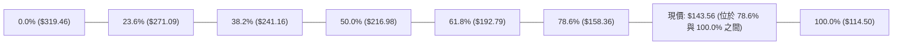

- **位置解讀**：現價 $143.56 正處於斐波那契 **78.6% ($158.36)** 與 **100.0% ($114.50)** 的深水區間。在技術理論中，回調跌破 61.8% ($192.79) 並滑落至 78.6% 以下，代表該標的並非處於健康的牛市次級修正，而是經歷了結構性主跌趨勢的破壞。
- **關鍵共振**：斐波那契 78.6% 的 **$158.36**，與阻力位 **R3 ($159.26)** 及 9月反彈頂點 **$158.78** 形成極度精確的三重共振壓力位。此價位未被帶量突破前，ORCL 只能定義為超跌後的底部震盪整理，不可輕言牛市反轉。

---

## 5. 技術指標深度解讀

### 🎛️ 指標訊號總覽

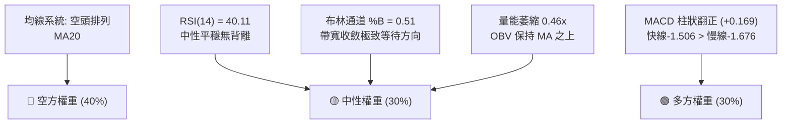

### 📈 移動平均線排列分析

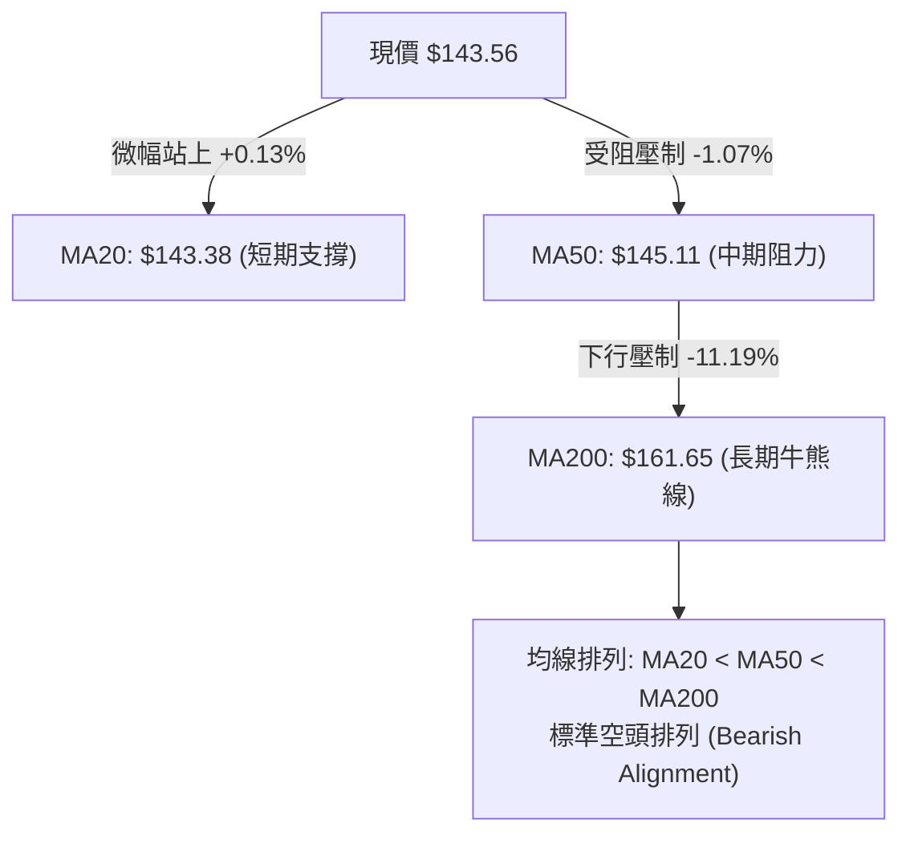

- **短均糾纏**：MA5 ($142.24) 與 MA10 ($139.55) 呈現短線金叉向上排列，現價站在 MA20 ($143.38) 之上，顯示短線自 $137.10 展開的微波反彈仍在進行中。
- **中長均壓制**：上方 MA50 ($145.11)、MA120 ($160.62) 及 MA200 ($161.65) 全面呈下傾走勢，構成層層阻力階梯。中長期格局仍由空方牢牢控盤，短期上攻屬於均線負乖離後的修復回抽。

### 📉 RSI(14) 分析

```
RSI(14) 當前讀數：40.11
0 ────── 30 ───────────── 50 ───────────── 70 ────── 100
[ 超賣區 ]      ● (40.11)        [ 超買區 ]
░░░░░░░░░░████████░░░░░░░░░░░░░░░░░░░░░░░░░░░░░░░░
```

- **強弱度評估**：RSI(14) 讀數為 **40.11**，位於弱勢中性區間 (40-50)，未進入 30 以下之超賣區，亦未突破 50 之多空榮枯線。
- **背離判斷**：
  - 價格在 2026-07-26 觸及 $114.99 時 RSI 為 26.7；2026-09-27 價格回踩至 $137.10 時 RSI 為 29.5。
  - 價格底部抬高，RSI 底部亦同步抬高（29.5 > 26.7），指標與價格走勢同向。
  - **結論：當前 RSI 不存在明顯之底背離或頂背離，屬於標準量價同步整固**。

### 📊 MACD(12/26/9) 訊號解讀

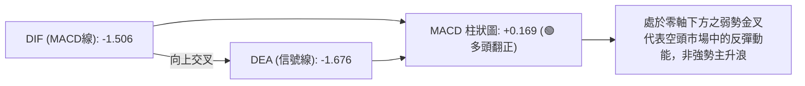

- **柱狀圖動能**：週線級別 MACD 柱狀圖在經歷連續四週負值（最低 -1.559）後，本週微幅翻正至 **+0.169**。
- **零軸關係**：快線 (-1.506) 與慢線 (-1.676) 均深處於零軸之下，表明整體大環境仍屬弱勢空頭背景，此處金叉性質屬於「超跌反彈修復」，上行至零軸附近預期將遭遇顯著賣壓。

### 📦 布林通道分析

```
ORCL 布林通道結構示意圖 (帶寬: $21.58)
$154.17 ┬─────────────────────────────────── 上軌 (Upper Band)
        │
$148.55 │                   [阻力 R1]
        │
$143.56 ┼─────────────────●───────────────── 現價 ($143.56) / 中軌 ($143.38)
        │
$136.88 │                   [支撐 S1]
        │
$132.59 ┴─────────────────────────────────── 下軌 (Lower Band)
```

- **帶寬特徵**：布林帶上軌位於 **$154.17**，中軌為 **$143.38**，下軌為 **$132.59**。
- **%B 指標**：%B 為 **0.51**，意味著現價幾近完美地貼合在中軌之上。
- **擠壓狀態 (Squeeze)**：通道帶寬持續收斂，顯示波動率被壓縮至極致，通常預示著未來 2-4 週內將出現單邊方向性破局。

### 💹 成交量分析（量價配合度）

```
最新量能 (15.7M) vs 20日均量 (34.39M)
當前日成交量: █████████░░░░░░░░░░  15.70M (量比: 0.46x)
20日基準均量: ████████████████████  34.39M
50日基準均量: █████████████████░░░  29.48M
```

- **量縮價穩**：最新成交量僅為 15,700,000 股，相較於 20日均量 (34,392,070) 量比僅為 **0.46x**，縮量超過一半。
- **OBV 趨勢解讀**：數據顯示「OBV > MA → 量能支撐上漲」。此特徵說明雖然絕對交易量萎縮，但近期的主要賣盤已大幅衰退，存量資金並未在當前價位出現恐慌性拋售，形成「無量空轉」的防守格局。但若欲向上發起突破，必須伴隨成交量放大至 20日均量以上。

---

## 6. 動能與波動率

### ⚡ 動能評估四象限

| 象限 | 動能維度 | 波動維度 | ORCL 當前定位 | 策略解讀與應對方針 |
|------|----------|----------|---------------|--------------------|
| **Q1 (最佳擴張)** | 強動能 (ADX>25) | 低波動 (ATR壓縮) | ❌ 不符 | 典型突破初期的最佳主升浪進場點。 |
| **Q2 (盤整蓄勢)** | 弱動能 (ADX=11.16) | 低波動 (ATR=3.97%) | **✅ 完美契合** | **動能沉寂、波動收縮。市場處於箱體平衡，應採取區間邊界低買高賣或觀望。** |
| **Q3 (劇烈震盪)** | 強動能 (ADX>25) | 高波動 (ATR>6%) | ❌ 不符 | 單邊單日單浪行情，高風險高收益。 |
| **Q4 (混亂失序)** | 弱動能 (ADX<25) | 高波動 (ATR>6%) | ❌ 不符 | 寬幅洗盤，極易引發連續止損。 |

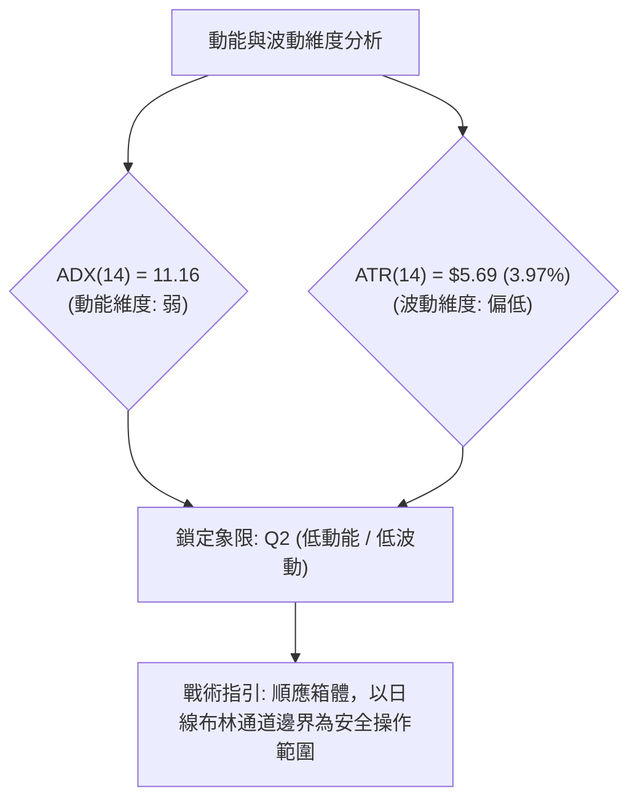

### 📊 ATR 波動率分析

- **當前數值**：ATR(14) 為 **$5.69**，佔現價之 **3.97%**。
- **日間雜訊過濾**：當日價格在 ±$5.69 內的波動屬於技術雜訊，不構成破位或突破。
- **止損距離建議**：
  - 突破交易止損：1.5 × ATR = **$8.54**。
  - 箱體防守止損：1.0 × ATR = **$5.69**。若以 S1 ($136.88) 作為邊界，止損點應設於 $136.88 - $5.69 = **$131.19**（緊鄰 S2 $131.58）。

### 📐 Beta 與市場相關性

- **Beta 係數**：高達 **1.77**。
- **大盤敏感度解讀**：ORCL 屬於高貝塔科技股，其波動幅度為 S&P 500 指數的 1.77 倍。
- **市場環境連動性**：當大盤出現系統性回調時，ORCL 具有極高的下行溢價風險；反之，若那斯達克展開反彈，其將展現強大的彈性。但在當前自身 ADX=11.16 的低動能狀態下，高 Beta 主要體現在盤中受大盤波動影響被動拉扯，不易走出獨立多頭行情。

---

## 7. 多時框架總結

### 📋 時框架評分表

| 時框架 | 趨勢方向 | 動能狀態 | 均線排列 | 圖表形態 | 綜合評分 | 操作建議 |
|--------|----------|----------|----------|----------|----------|----------|
| **長期 (月線)** | 🔴 偏空 | 弱勢築底 | 空頭排列 (MA200下方) | 巨型高位滑落收斂 | 35/100 | 長期資金輕倉定投或觀望 |
| **中期 (週線)** | 🟡 中性偏弱 | 柱狀翻正 (+0.169) | 承壓於 MA50 | 潛在雙底打底中 | 48/100 | 等待突破頸線再行加碼 |
| **短期 (日線)** | 🟢 短多震盪 | RSI=40.11 / 金叉 | 糾纏 MA20 / 站上短均 | 箱體整理收斂中 | 55/100 | 箱體區間內高拋低吸 |

### 🔲 綜合訊號矩陣

```
時框架維度對照矩陣
╔══════════╦══════════════╦══════════════╦══════════════╗
║ 指標維度 ║  短期 (日線) ║  中期 (週線) ║  長期 (月線) ║
╠══════════╬══════════════╬══════════════╬══════════════╣
║ 趨勢方向 ║ 🟡 箱體震盪  ║ 🔴 弱勢反彈  ║ 🔴 空頭壓制  ║
║ 均線系統 ║ 🟢 站上MA20  ║ 🔴 壓在MA50下║ 🔴 遠低MA200 ║
║ 動能指標 ║ 🟢 MACD柱翻正║ 🟡 RSI中性   ║ 🔴 弱勢區間  ║
║ 成交量能 ║ 🔴 嚴重縮量  ║ 🟡 存量防守  ║ 🔴 資金出逃  ║
║ 多空主導 ║ 🟢 +DI > -DI ║ 🟡 多空均衡  ║ 🔴 空頭主導  ║
╚══════════╩══════════════╩══════════════╩══════════════╝
```

### ⚖️ 多時框收斂結論

> **依嚴格規則 14 執行多時框收斂收斂法則**：
> 1. **趨勢強度檢驗**：ADX(14) 數值為 **11.16**，遠低於趨勢門檻 25，被嚴格定義為**「無趨勢之盤整行情」**。
> 2. **優先級收斂**：在盤整行情中，不可採用趨勢跟隨型系統，**必須以日線布林通道上下軌 ($132.59 - $154.17) 及近一年關鍵波段支撐/阻力 (S1 $136.88 至 R1 $148.55) 作為主要交易區間**。
> 3. **唯一方向性結論**：**【中性觀望，區間箱體對稱應對】**。第 1 章技術評分卡綜合得分為 **48/100**，處於 40–60 的中性區間。結論是 ORCL 目前不具備走單邊牛市或單邊熊市的動能，戰略主軸為「等待突破確認前的區間網格化防守」。

---

## 8. 交易策略建議

### 🗺️ 策略決策流程圖

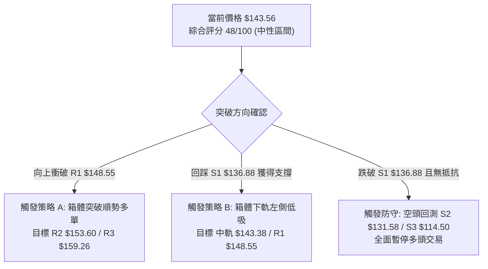

### 🧭 策略路由（依評分卡分流）

**當前主策略方向 = 中性區間震盪操作（依評分 48/100）**
依規則指引，綜合評分落在 40–60 之間，禁止盲目大舉單邊押注。主策略應以「日線布林通道及關鍵波段 S1/R1 區間操作」為主，嚴格等待破位信號確認。

### 🎯 價格情境階梯（Price Scenarios）

| 觸發條件 | 下一目標 | 後續延伸 | 情境含義與技術邏輯 |
|----------|----------|----------|--------------------|
| **帶量突破 R1 $148.55** | R2 $153.60 | R3 $159.26 | **短線轉強**：突破50日均線與箱體頂部，打開向布林上軌及雙底頸線的彈升空間。 |
| **收盤站穩現價 $143.56** | R1 $148.55 | S1 $136.88 | **區間震盪**：糾纏於 MA20 中軌，進行籌碼沉澱，維持 $136.88 - $148.55 拉鋸。 |
| **放量跌破 S1 $136.88** | S2 $131.58 | S3 $114.50 | **中期轉弱**：跌破9月反彈低點平台，向布林下軌 $132.59 尋求支撐，最深恐回踩52W低點。 |

### 📊 情境機率分佈

| 情境劇本 | 發生機率 | 主要技術依據 |
|----------|----------|--------------|
| **區間震盪 (箱體拉鋸)** | **55%** | ADX(14)=11.16 壓制單邊趨勢；布林 %B=0.51 處於平衡態；成交量萎縮至 0.46x 顯示無突圍推力。 |
| **向上反彈 (衝擊阻力)** | **25%** | MACD 柱狀由負翻正 (+0.169)；OBV 獲均線支撐；華爾街 41位分析師共識目標高達 $237.97。 |
| **破位下挫 (再探前低)** | **20%** | 長期均線空頭排列未變 (MA200=$161.65 下壓)；Beta=1.77 面臨大盤回調系統性風險。 |

### 🟢 主策略詳情（方向：區間對稱波段策略）

依數據紀律要求，所有價位嚴格引用關鍵價位數據集合：

| 策略要素 | 策略 A（右側突破跟進型） | 策略 B（左側下軌低吸型） |
|----------|--------------------------|--------------------------|
| **進場條件** | 日K線實體帶量收盤突破 R1 | 價格回踩 S1 不破且出現短線反彈K線 |
| **進場價格** | **$148.55** | **$136.88** |
| **目標價 T1** | **$153.60** (阻力 R2) | **$143.56** (現價/中軌 MA20) |
| **目標價 T2** | **$159.26** (阻力 R3 / 頸線) | **$148.55** (阻力 R1 / 箱體頂) |
| **止損價格** | **$143.38** (跌回 MA20 之下) | **$131.58** (跌破支撐 S2) |
| **風險報酬比** | **2.07 : 1** <br>*(利潤空間 $10.71 / 風險空間 $5.17)* | **2.20 : 1** <br>*(利潤空間 $11.67 / 風險空間 $5.30)* |
| **成功機率** | 50% | 60% |
| **建議倉位** | 10% - 15% | 15% - 20% |

### 🔴 反向風險觸發點（對沖提示）

- **多頭結構全面失效警報**：若日K線以放量長陰跌破 **S1 ($136.88)**，特別是跌破 **S2 ($131.58)** 時，宣告潛在「雙重底」構建失敗，將直接開啟向 52週低點 **S3 ($114.50)** 的二次探底風險。此時多頭必須無條件清倉止損，波段交易者應轉向避險或透過空單對沖。

### ⭐ 整體訊號強度評星

```
做多訊號強度：★★☆☆☆  (2.5/5星 — 僅限箱體下軌反彈短多，非單邊主升浪)
做空訊號強度：★★★☆☆  (3.0/5星 — 長期均線空頭壓制，但當前缺乏殺跌量能)
整體可信度：  ★★★★☆  (4.0/5星 — 關鍵波段支撐/阻力數據聚類極為清晰)
```

---

## 9. 風險提示與監控

### ✅ 關鍵監控指標 Checklist

```
╔══════════════════════════════════════════════════════════════════╗
║               ORCL 每日關鍵技術監控 CHECKLIST                    ║
╠══════════════════════════════════════════════════════════════════╣
║ [ ] 價格是否收復 MA50 ($145.11)？ (中期趨勢轉強第一信號)          ║
║ [ ] 日成交量是否放大突破 20日均量 (34.39M)？ (主力機構進場指標)  ║
║ [ ] ADX(14) 是否由 11.16 向上突破 25？ (趨勢行情啟動訊號)         ║
║ [ ] RSI(14) 能否維持在 40 榮枯線之上？ (避免重新步入超賣深淵)     ║
║ [ ] 支撐 S1 ($136.88) 是否面臨帶量跌破？ (多頭最後防線預警)      ║
║ [ ] 布林帶寬是否由收斂轉為向外發散？ (即將出現大級別單邊波動)    ║
╚══════════════════════════════════════════════════════════════════╝
```

### ⚠️ 風險場景分析

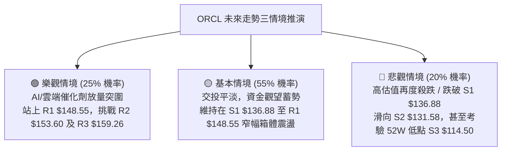

### 🛡️ 風險管理重要提醒

1. **Beta 槓桿效應控制**：ORCL 的 Beta 高達 **1.77**，在美股大盤波動加劇時會放大下行風險。投資人切忌滿倉操作，單一標的倉位上限不宜超過總帳戶資產的 15%-20%。
2. **嚴格禁止突破追高**：在 **ADX=11.16** 的極弱動能環境下，「假突破」概率極高。若見股價盤中衝破 R1 ($148.55)，若量能未超過 34.39M（20日均量），切勿追價，謹防拉回洗盤。
3. **ATR 風控對齊**：目前日波動 ATR 為 **$5.69**，任何策略的止損空間必須給予至少 1.0 倍 ATR（約 $5.70）的呼吸空間，以避免被日內日常雜訊掃出場。

---

## 📋 報告總結

```
╔══════════════════════════════════════════════════════════════════╗
║                   ORCL 技術分析報告總結                          ║
╠══════════════════════════════════════════════════════════════════╣
║ 報告日期：2026-10-08                                             ║
║ 當前價格：$143.56                                                ║
║ 分析評級：⚖️ 中性觀望 (箱體整理，綜合評分 48/100)               ║
╠══════════════════════════════════════════════════════════════════╣
║ 關鍵結論：                                                       ║
║ ├─ 長期趨勢：🔴 空頭排列 (MA200: $161.65 下傾壓制)               ║
║ ├─ 中期趨勢：🟡 築底盤整 (自 $114.50 反彈後收斂於雙底區間)       ║
║ ├─ 短期趨勢：🟢 震盪修復 (站上 MA20: $143.38，MACD 柱狀翻正)    ║
║ ├─ 關鍵支撐：S1 $136.88 ｜ S2 $131.58 ｜ S3 $114.50              ║
║ ├─ 關鍵阻力：R1 $148.55 ｜ R2 $153.60 ｜ R3 $159.26              ║
║ └─ 分析師目標：均價 $237.97 (41位分析師共識 Buy)                 ║
╠══════════════════════════════════════════════════════════════════╣
║ 最優策略組合：                                                   ║
║ 1. 🥇 最佳機會：等待回踩 S1 ($136.88) 不破左側分批低吸，博反彈   ║
║ 2. 🥈 次選機會：突破 R1 ($148.55) 且量比>1.0x 後右側順勢追進     ║
║ 3. 🥉 保守選擇：在 ADX 站上 25 確立趨勢前保持空倉觀望            ║
╚══════════════════════════════════════════════════════════════════╝
```

---

> ⚠️ **免責聲明**：本報告為 AI 自動生成之技術分析，所有數據及估算均基於提供的歷史價格資訊。本報告**僅供研究與學術參考**，**不構成任何投資建議**。投資有風險，入市需謹慎。

---

*報告生成時間：2026-10-08 ｜ 數據來源：Yahoo Finance ｜ 分析框架：多時框技術分析*