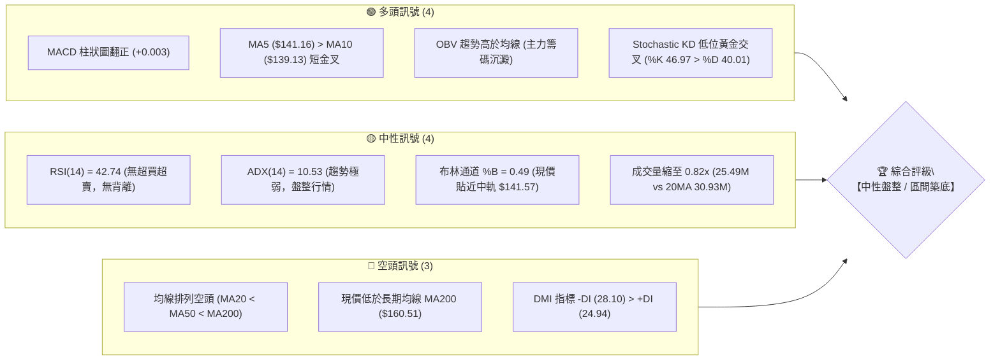
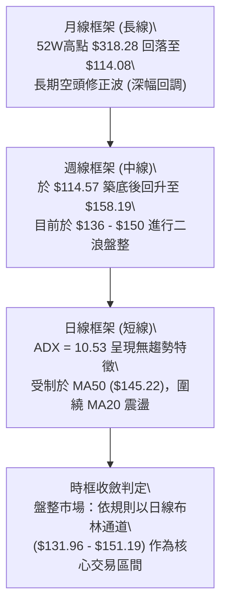
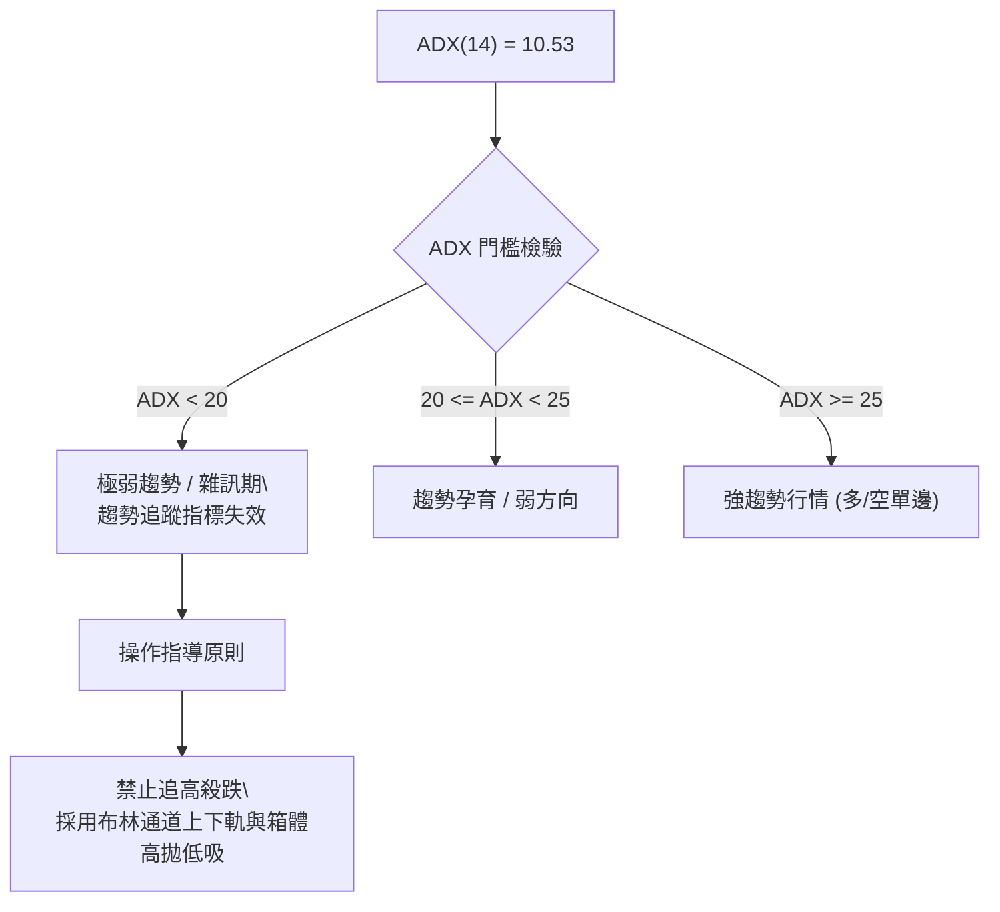
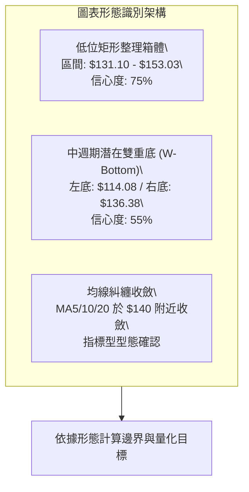
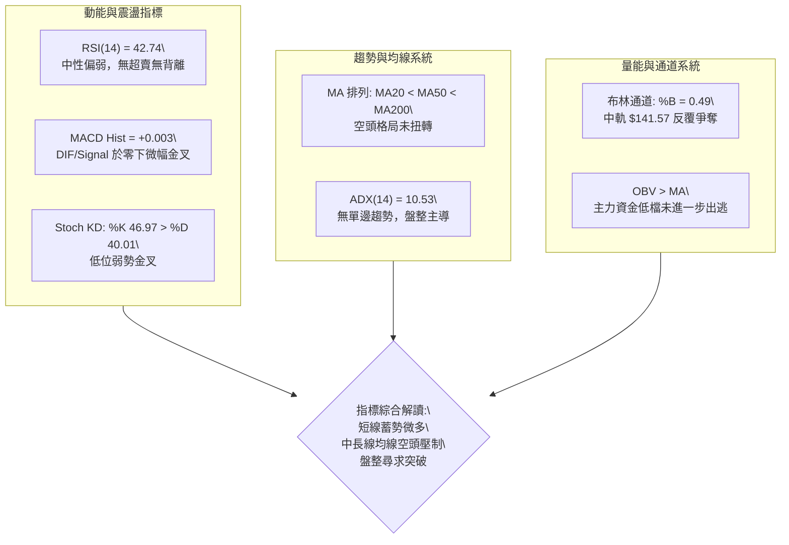
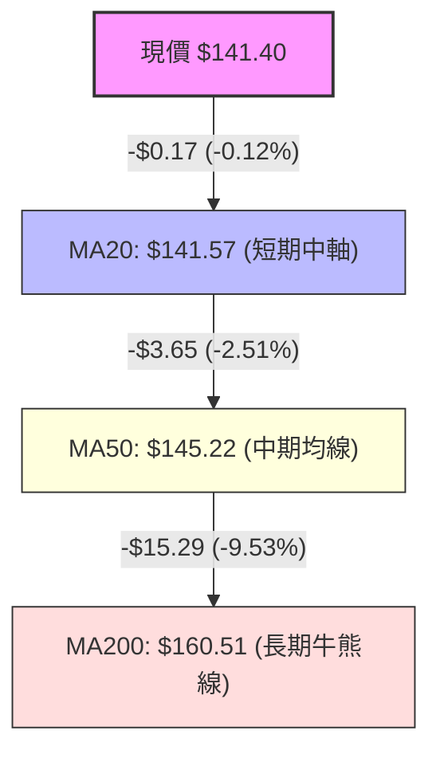
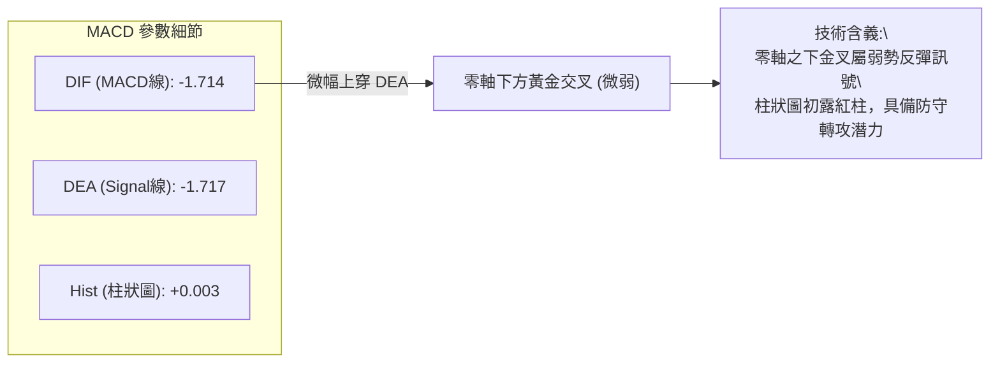
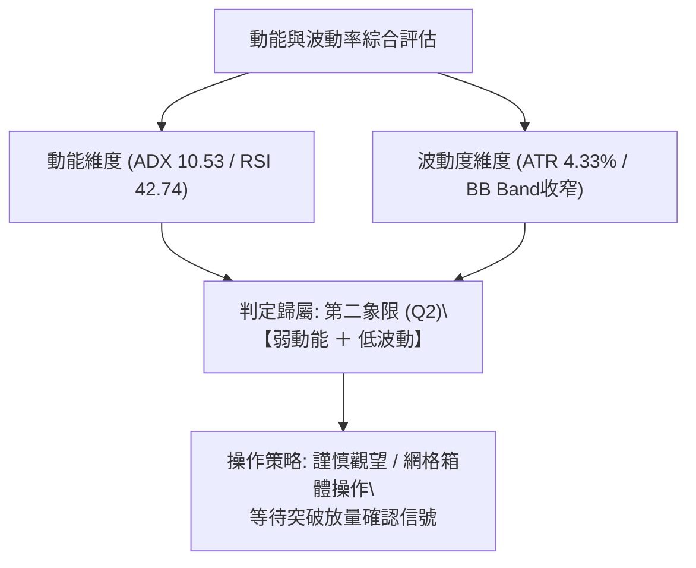
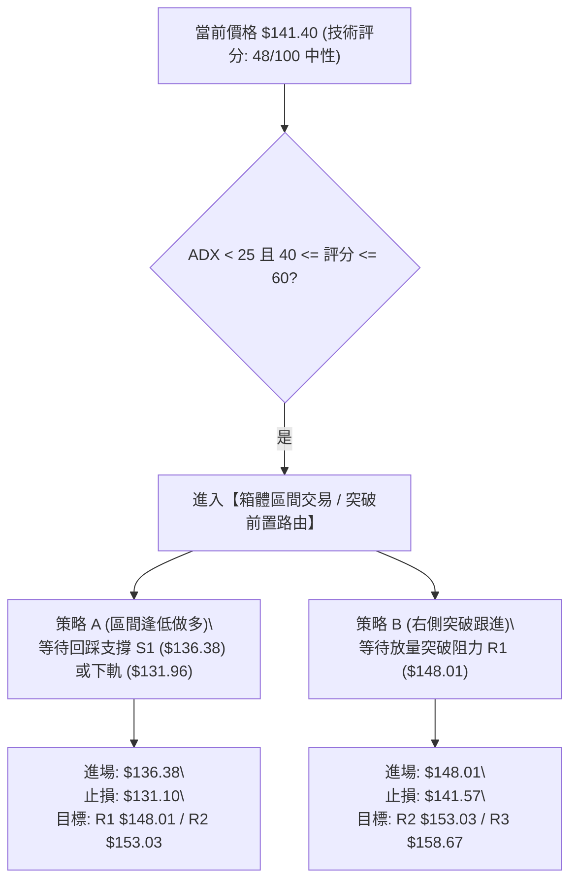
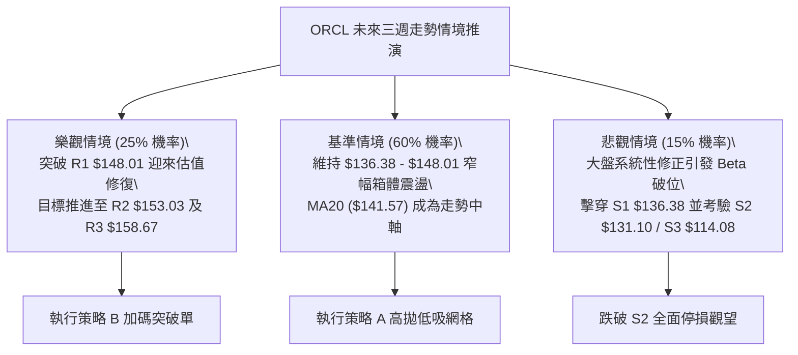

# ORCL 技術分析報告

> **報告日期**：2026-10-10 ｜ **語言**：繁體中文 ｜ **數據來源**：Yahoo Finance ｜ **當前價格**：$141.40

---

## 目錄

| 章節 | 內容 |
|------|------|
| [1. 技術面概覽](#1-技術面概覽) | 訊號儀表板、核心指標、評分卡 |
| [2. 趨勢分析](#2-趨勢分析) | 多時框趨勢、長中短期走勢、ADX解讀 |
| [3. 圖表形態分析](#3-圖表形態分析) | 形態識別、K線組合、目標價推算 |
| [4. 支撐與阻力](#4-支撐與阻力) | 關鍵價位、斐波那契回調結構 |
| [5. 技術指標深度解讀](#5-技術指標深度解讀) | MA系統、RSI、MACD、布林通道、成交量/OBV |
| [6. 動能與波動率](#6-動能與波動率) | 四象限評估、ATR波動測算、Beta敏感度 |
| [7. 多時框架總結](#7-多時框架總結) | 時框架矩陣、ADX收斂判定 |
| [8. 交易策略建議](#8-交易策略建議) | 策略路由、價格情境階梯、主策略執行表 |
| [9. 風險提示與監控](#9-風險提示與監控) | 監控Checklist、三情境壓力測試、風控規則 |
| [10. 報告總結](#10-報告總結) | 核心結論與最佳策略配置儀表板 |

---

## 1. 技術面概覽

### 🎯 技術訊號儀表板

ORCL 當前收盤價為 **$141.40**，自 52 週高點 **$318.28** 大幅修正後，目前處於 52 週價格區間底部 13.4% 之相對低位。整體技術架構呈現「中長期均線偏空、短期低位窄幅築底、動能指標微幅偏多收斂」之特徵。



---

### 📊 核心指標速覽表

| 指標類別 | 指標名稱 | 當前數值 | 訊號 | 專業技術解讀 |
|:---|:---|:---:|:---:|:---|
| **價格** | 現價 (Close) | $141.40 | 🟡 | 位於 52 週區間 13.4% 處，處於中長期超跌修復區域 |
| **短期均線** | MA5 / MA10 | $141.16 / $139.13 | 🟢 | MA5 向上穿越 MA10，極短線動能出現反彈支撐 |
| **中期均線** | MA20 (布林中軌) | $141.57 | 🟡 | 現價緊貼 MA20，兩者相距僅 -$0.17 (-0.12%)，多空拉鋸 |
| **波段均線** | MA50 | $145.22 | 🔴 | 現價低於 MA50，上方第一道均線壓制位 |
| **長期均線** | MA200 | $160.51 | 🔴 | 長期空頭防線，現價折價 -11.91%，壓抑大級別反彈 |
| **動能** | RSI(14) | 42.74 | 🟡 | 處於 40-50 中性偏弱整理區，未見極端超賣，無背離現象 |
| **動能** | MACD (12,26,9) | -1.714 / -1.717 | 🟢 | DIF 線上穿 Signal 線，Hist 由負轉正 (+0.003)，微幅金叉 |
| **隨機指標** | Stoch %K / %D | 46.97 / 40.01 | 🟢 | KD 指標在 40 水平低位黃金交叉，支持短期弱勢反彈 |
| **趨勢強度** | ADX(14) | 10.53 | 🟡 | 數值遠低於 25，單邊趨勢完全瓦解，確立為無趨勢盤整市場 |
| **通道狀態** | 布林通道 | $131.96 - $151.19 | 🟡 | 帶寬收窄，%B 為 0.49，價格在中軌震盪等待變盤方向 |
| **量能特徵** | 量比 (Volume/20MA) | 0.82x | 🟡 | 成交量 25.49M 低於 20 日均量，反映市場觀望氣氛濃厚 |
| **波動率** | ATR(14) | $6.12 | 🟡 | 佔現價 4.33%，單日波幅適中，提供明確止損設定基底 |

---

### 🏆 技術評分卡

```
╔══════════════════════════════════════════════════════════════╗
║             技術評分卡 — ORCL (2026-10-10)                   ║
╠══════════════════════════════════════════════════════════════╣
║ 趨勢強度     ████░░░░░░░░░░░░░░░░  20/100  🔴 極弱/盤整      ║
║ 動能指標     ███████████░░░░░░░░░  55/100  🟡 中性初現修復    ║
║ 支撐穩定度   ██████████████░░░░░░  70/100  🟢 底部支撐紮實    ║
║ 成交量配合   ██████████░░░░░░░░░░  50/100  🟡 縮量沉澱中      ║
║ 形態完整度   ████████████░░░░░░░░  60/100  🟡 橫盤區間築底    ║
║ 均線排列     ██████░░░░░░░░░░░░░░  30/100  🔴 典型空頭排列    ║
╠══════════════════════════════════════════════════════════════╣
║ 綜合評分     █████████░░░░░░░░░░░  48/100  🟡 中性觀望/區間   ║
╚══════════════════════════════════════════════════════════════╝
```

---

## 2. 趨勢分析

### 🌐 多時框趨勢分析

在進行技術趨勢推導時，必須遵循多時框架由大至小的演進關係。當前 ORCL 各級別時框訊號分化顯著：



---

### 📈 長期趨勢 — 12個月走勢圖（Unicode）

以下為 ORCL 過去 12 個月（2025-11 至 2026-10）之月線收盤價歷史走勢圖：

```
ORCL 月線走勢圖（過去12個月：2025-11 至 2026-10）
價格軸 ($)
$260 ┤  ● (2025-10 高峰區間延續下行)
$230 ┤                                          ● (2026-05 反彈高點 $224.17)
$200 ┤  ● (11月 $199.28)
$190 ┤      ● (12月 $192.34)
$170 ┤
$160 ┤          ● (01月 $162.84)                 ● (04月 $160.24)
$150 ┤                                      ● (03月 $145.55)     ● (06月 $145.50)  ● (08月 $148.57)
$140 ┤              ● (02月 $143.86)                                                 ● (09月 $136.79)  ● (10月現價 $141.40)
$120 ┤                                                                ● (07月破底 $129.39)
     └─────────────────────────────────────────────────────────────────────────────────────────────
        11   12   01   02   03   04   05   06   07   08   09   10   (月份)
```

#### 走勢特徵分析表格

| 階段區間 | 時間跨度 | 起訖價位 | 漲跌幅 | 走勢特徵與量價行為 |
|:---|:---:|:---:|:---:|:---|
| **主跌第一波** | 2025-11 ~ 2026-02 | $259.14 ➔ $143.86 | -44.49% | 高位籌碼潰散，月線呈現連續實體陰線，連破多道支撐 |
| **弱勢初反彈** | 2026-03 ~ 2026-05 | $145.55 ➔ $224.17 | +54.01% | 5 月份拉出大陽線回抽至 $224.17，測試長期均線後遭空頭反撲 |
| **次級探底波** | 2026-06 ~ 2026-07 | $224.17 ➔ $129.39 | -42.28% | 快速下殺並在 7 月打出年內極限低點（週線低點見 $114.57，月收 $129.39） |
| **底部築底期** | 2026-08 ~ 2026-10 | $129.39 ➔ $141.40 | +9.28% | 8月反彈至 $148.57，9月二次回測 $136.79 未破前低，確立底背離雛形 |

---

### 📊 中期趨勢（週線分析）

從近 20 週收盤數據觀察：
1. **極限低點測試**：在 2026-07-26 當週打出最低週收盤價 **$114.57**（伴隨 52 週低點 **$114.08**），該週成交量放大至 162.94M，MACD 柱狀圖由 -0.712 翻正至 +0.033，形成典型的低檔爆量止跌訊號。
2. **第一波反彈與遇阻**：隨後在 8 月初展開連續三週強勁反抽，於 2026-09-06 達到波段反彈高點週收 **$158.19**，逼近上方阻力 R3 **$158.67** 與斐波那契 78.6% 位 **$157.78**。
3. **二次回踩與整理**：9 月下旬週線下探至 **$136.59**（守住 S1 **$136.38**），10 月以來連續兩週收在 **$141.78** 與 **$141.40**，波動率急劇收斂，週成交量自 9 月中旬的 202.39M 降至 121.75M，顯示籌碼清洗已近尾聲。

```
中期壓力與支撐週線分佈示意圖：
[阻力 R3 / 斐波 78.6%]  $158.67 / $157.78  ─────── 上方波段強壓（9月反彈頂點 $158.19）
[阻力 R2 / 布林上軌]    $153.03 / $151.19  ─────── 反彈關鍵受阻區間
[阻力 R1 / MA50]        $148.01 / $145.22  ─────── 近期壓制軸心
═════════════════════════════════════════════════════════════════════════
[現價 Close]            $141.40            ◄────── 當前多空平衡點 (MA20 $141.57)
═════════════════════════════════════════════════════════════════════════
[支撐 S1 / 9月低點]     $136.38 / $136.59  ─────── 短線第一道回踩防線
[支撐 S2 / 布林下軌]    $131.10 / $131.96  ─────── 核心箱體下緣防線
[支撐 S3 / 52W低點]     $114.08 / $114.57  ─────── 週期極限底線（不容有失）
```

---

### ⚡ 趨勢強度評估（ADX 解讀）

當前日線指標中，**ADX(14) 讀數僅為 10.53**。



#### ADX 與方向指標 (DMI) 強度對照分析

| 指標名稱 | 當前讀數 | 狀態門檻 | 專業技術解讀 |
|:---|:---:|:---:|:---|
| **ADX(14)** | 10.53 | < 25 (弱趨勢/盤整) | 市場動能停滯，無論多頭或空頭皆未掌握絕對主導權，處於能量蓄積期 |
| **+DI** | 24.94 | 中性水平 | 多方動能尚具備一定維穩實力，並非完全潰退 |
| **-DI** | 28.10 | 空方微幅領先 | -DI 略高於 +DI，反映過去幾週由 $158.19 回落帶來的空方慣性，但優勢微弱 |
| **方向差距 (\|+DI - -DI\|)** | 3.16 | < 5 (極窄幅) | 多空力量處於臨界平衡，符合典型箱體震盪特徵 |

---

## 3. 圖表形態分析

### 🔍 形態識別系統

在多時框架檢驗下，ORCL 日線圖並不存在標準的頭肩底或大型旗形，但呈現顯著的**低位箱體震盪形態**以及**潛在雙底（W底）雛形**。



#### 圖表形態信心度與目標價評估表

| 形態名稱 | 信心度 | 判斷依據（嚴格引用歷史數據） | 形態完成度 | 頸線位 | 目標價（附嚴格計算式） |
|:---|:---:|:---|:---:|:---:|:---|
| **低位矩形箱體** | **75%** | 箱底獲支撐 S2 ($131.10) / 布林下軌 ($131.96)；箱頂受阻於 R2 ($153.03) / 布林上軌 ($151.19) | 70% (箱內震盪) | $153.03 (突破點) | **箱體突破目標價**：$153.03 + ($153.03 - $131.10) = **$174.96** (未列於固定價位，以R3 $158.67作為第一階目標) |
| **中期潛在雙底 (W底)** | **55%** | 第一低點 2026-07 見 $114.08，第二低點 2026-09 見 $136.38 (低點墊高)，中間頸線為 9 月高點波段阻力 R3 ($158.67) | 45% (尚未突破頸線) | $158.67 | **雙底測幅目標價**：頸線 $158.67 + 形態高度 ($158.67 - $114.08 = $44.59) = **$203.26** (需確認站穩 $158.67 始成立) |
| **布林帶瓶頸收縮** | **80%** | 上軌 $151.19 與下軌 $131.96 帶寬收縮至 14.5%，波動率壓縮，ADX 降至 10.53 | 85% | $141.57 (中軌) | 指標型變盤型態，無特定幾何目標價，預期近期將引爆方向性突破 |

---

### 🕯️ 重要 K 線形態分析

| 月份 / 週別 | 收盤價 | K線組合形態 | 技術解讀 | 訊號方向 |
|:---|:---:|:---|:---|:---:|
| **2026-05** | $224.17 | 長上影大陽線 (射擊之星變體) | 月線自 $160 暴拉至高點後大幅回吐，顯示 $220 以上獲利盤與套牢盤湧現 | 🔴 短多長空 |
| **2026-07** | $129.39 | 長下影探底十字星 (錘子線) | 週線下探 $114.57 後爆巨量回升，月線收出帶長下影實體陰線，具備極強止跌意義 | 🟢 底部止跌 |
| **2026-08** | $148.57 | 實體陽線包裹 | 確立 7 月份長下影線的有效性，多頭展開第一輪估值修復反彈 | 🟢 多頭延續 |
| **2026-09** | $136.79 | 回踩小陰線 | 測試 $136 支撐位（S1: $136.38），下影線守住重要低點，量能溫和萎縮 | 🟡 良性洗盤 |
| **2026-10 (當前)** | $141.40 | 窄幅十字星 (紡錘線) | 連續兩週收在 $141 附近，振幅極窄，多空暫時休兵，靜待催化劑 | 🟡 方向待變 |

---

### 📉 ASCII 走勢形態示意圖

```
ORCL 近四個月箱體整理與潛在雙底結構示意圖：
價格 ($)
$160 ┤                        [頸線阻力 R3: $158.67] ───── 反彈頂點 $158.19
     │                           /\
$153 ┤                          /  \      [箱體上界 R2: $153.03]
     │                         /    \
$148 ┤                        /      \    [短期阻力 R1: $148.01]
     │                       /        \
$141 ┤──────────────────────/──────────●◄──────── 當前收盤價 $141.40 (貼近 MA20 $141.57)
     │                     /            \
$136 ┤                    /              \    [次低點 / 箱底 S1: $136.38] (9月回測低點 $136.59)
     │      \            /                \--/
$131 ┤       \          /                 [核心防守 S2: $131.10 / 布林下軌 $131.96]
     │        \        /
$114 ┤         \______/                   [第一底 / 52W 低點 S3: $114.08] (7月極限低點)
     └─────────────────────────────────────────────────────────────────────────────
         2026-07 (底1)      2026-08/09 (反彈)      2026-09 (底2)     2026-10 (現狀)
```

---

## 4. 支撐與阻力

### 🗺️ 關鍵價位分布圖（Unicode）

本報告嚴格遵循數據紀律，所有支撐與阻力價位均引用 OHLCV 波段聚類計算數值：

```
ORCL 價位結構分布圖
═══════════════════════════════════════════════════════════════════════
$158.67 ║████████████████████████████████████████║ 強阻力 R3 / 斐波 78.6% ($157.78)
$153.03 ║████████████████████████████            ║ 波段阻力 R2 / 布林上軌 ($151.19)
$148.01 ║████████████████████                    ║ 關鍵阻力 R1 / MA50 壓力軸 ($145.22)
════════╠════════════════════════════════════════╣
$141.40 ║ ◄──────── 當前價格 ($141.40) ────────── ║ MA20 ($141.57) 多空分水嶺
════════╠════════════════════════════════════════╣
$136.38 ║▓▓▓▓▓▓▓▓▓▓▓▓▓▓▓▓▓▓▓▓                    ║ 近期支撐 S1 (9月回測低點聚類)
$131.10 ║▓▓▓▓▓▓▓▓▓▓▓▓▓▓▓▓▓▓▓▓▓▓▓▓▓▓            ║ 強支撐 S2 / 布林下軌 ($131.96)
$114.08 ║▓▓▓▓▓▓▓▓▓▓▓▓▓▓▓▓▓▓▓▓▓▓▓▓▓▓▓▓▓▓▓▓▓▓▓▓║ 週期極限底 S3 (52W Low / 斐波 100%)
═══════════════════════════════════════════════════════════════════════
```

---

### 🚧 阻力位分析表

| 阻力級別 | 價位 | 與現價差距 | 形成技術原因 | 突破難度評估 | 重要性等級 |
|:---|:---:|:---:|:---|:---:|:---:|
| **R1** | **$148.01** | +4.67% | 近一年日線波段反彈高點聚類；上方緊貼 MA50 ($145.22) 形成復合阻力壓制帶 | 🟡 中等 (需日成交量放大至 35M 以上) | ★★★☆☆ |
| **R2** | **$153.03** | +8.23% | 箱體震盪區間上緣；與布林通道日線上軌 ($151.19) 形成共振阻力帶 | 🔴 較高 (箱體結構上限，具強烈解套賣壓) | ★★★★☆ |
| **R3** | **$158.67** | +12.22% | 9月反彈頂點 ($158.19) 聚類；重合長期均線 MA200 ($160.51) 及斐波那契 78.6% 位 ($157.78) | 🔴 極高 (中長期牛熊分界線與大級別頸線) | ★★★★★ |

---

### 🛡️ 支撐位分析表

| 支撐級別 | 價位 | 與現價差距 | 形成技術原因 | 守住機率評估 | 重要性等級 |
|:---|:---:|:---:|:---|:---:|:---:|
| **S1** | **$136.38** | -3.55% | 近期 9 月底波段回測低點 ($136.59) 聚類；多頭短期防守第一線 | 🟢 75% (短期箱體內部主要承接區) | ★★★☆☆ |
| **S2** | **$131.10** | -7.29% | 近一年核心低點平台；共振日線布林通道下軌 ($131.96) | 🟢 85% (布林下軌具備顯著統計學反彈概率) | ★★★★☆ |
| **S3** | **$114.08** | -19.32% | 52 週最低點 ($114.08) 與週線收盤低點 ($114.57) 形成之歷史鋼鐵底 | 🟢 95% (長週期估值與量能終極防線) | ★★★★★ |

---

### 📐 斐波那契回調位分析

依據 52 週完整波動區間（高點 **$318.28** ➔ 低點 **$114.08**，全波段跌幅 -$204.20）計算之標準斐波那契水平如下：

| 斐波那契回調水平 | 精確計算價位 | 與現價關係 | 技術意義深度解讀 |
|:---:|:---:|:---:|:---|
| **0.0% (52W High)** | **$318.28** | +125.09% | 歷史頂部，長線天花板 |
| **23.6%** | **$270.09** | +91.01% | 長期強多頭反轉回撤位 |
| **38.2%** | **$240.28** | +69.93% | 弱勢反彈極限阻力 |
| **50.0%** | **$216.18** | +52.89% | 多空平衡中軸（2026-05月反彈高點 $224.17 曾短暫刺穿後回落） |
| **61.8%** | **$192.08** | +35.84% | 黃金分割關鍵反壓位（2025-12月平台） |
| **78.6%** | **$157.78** | +11.58% | **極深回調壓制位**：與 R3 ($158.67) 及 MA200 ($160.51) 形成三重共振壓制區 |
| **現價 (Close)** | **$141.40** | **基準點** | **目前價格坐落於 78.6% ($157.78) 與 100.0% ($114.08) 之間的極端深幅回調築底區** |
| **100.0% (52W Low)**| **$114.08** | -19.32% | 本輪熊市調整之絕對基底 |

**解讀結論**：ORCL 當前價格處於斐波那契 78.6% 水平之下。在技術架構上，自 52W 高點下修超過 78.6% 屬於「深度超賣修復範疇」。在未能放量有效突破 **$157.78**（78.6%位）與 **$158.67**（R3）之前，任何上漲皆僅能視為超跌反彈或箱體震盪，不可盲目定性為新一輪牛市主升浪。

---

## 5. 技術指標深度解讀

### 🎛️ 指標訊號總覽



---

### 📈 移動平均線排列分析



#### 均線各週期狀態明細

| 週期名稱 | 當前價位 | 相對現價差額 | 走勢狀態 | 均線角色與技術解讀 |
|:---|:---:|:---:|:---:|:---|
| **MA 5** | $141.16 | +$0.24 (+0.17%) | ▲ 向上 | 價格站在 MA5 之上，超短期具備微幅推升力道 |
| **MA 10** | $139.13 | +$2.27 (+1.63%) | ▲ 向上 | MA5 上穿 MA10 形成超短期金叉，提供第一道日內支撐 |
| **MA 20** | $141.57 | -$0.17 (-0.12%) | ▼ 向下 | 現價幾乎與 MA20 重合，中軌走平，代表月線級別多空勢均力敵 |
| **MA 50** | $145.22 | -$3.82 (-2.63%) | ▼ 向下 | 距離現價約 2.6%，構成反彈第一目標兼重要心理壓制點 |
| **MA 60** | $141.29 | +$0.11 (+0.08%) | ▲ 走平 | 季線在此位置趨於水平，提供底部基底支撐 |
| **MA 120** | $159.41 | -$18.01 (-11.30%) | ▼ 向下 | 半年線持續下行，顯示半年內進場籌碼多處於套牢狀態 |
| **MA 200** | $160.51 | -$19.11 (-11.91%) | ▼ 向下 | 年線為中長期最強空頭屏障，未收復前不可言反轉 |
| **MA 240** | $170.10 | -$28.70 (-16.87%) | ▼ 向下 | 超長週期均線下壓，限制中線估值修復空間 |

**總結**：整體均線呈現典型空頭排列（MA20 < MA50 < MA200），但短期均線（MA5、MA10、MA60）在 $139 - $141 區間高度交纏走平，表明短期下行慣性已被完全化解，進入均線收斂期。

---

### 📉 RSI(14) 分析

當前 RSI(14) 讀數為 **42.74**。

```
RSI(14) 動能進度條：
0 ─────── 30 超賣 ──────── 50 中軸 ──────── 70 超買 ─────── 100
[█████████████████░░░░░░░░░░░░░░░░░░░░░░░] 42.74 (中性偏弱區間)
```

- **區間評估**：RSI 處於 30 至 70 之常規中性區間，未觸及低於 30 的極端超賣，亦未達大於 70 的過熱區，反映市場處於理性觀望狀態。
- **背離檢驗**：
  - **價格層面**：9 月底價格下探至 $136.59，高於 7 月極端低點 $114.57。
  - **RSI 層面**：9 月底 RSI 降至 29.5，高於 7 月初之極端低點 11.1 - 12.5。
  - **結論**：指標與價格同步回升，**目前日線層級不存在頂背離或顯著底背離**，屬於健康的區間震盪收斂。

---

### 📊 MACD(12,26,9) 訊號解讀



- **MACD 數值**：DIF 為 -1.714，Signal 為 -1.717，兩者相差僅 +0.003。
- **解讀**：MACD 在連續數週負值後首度迎來柱狀圖翻正（+0.003）。雖然此交叉發生於零軸下方（代表仍屬弱勢環境下的金叉），但搭配週線級別 MACD 柱狀圖同步由 -0.868 收斂翻紅至 +0.003，顯示中短期拋壓已徹底衰竭，買盤開始在低位逢低吸納。

---

### 📦 布林通道分析

```
ORCL 日線布林通道 (20, 2) 結構示意圖：
價格軸 ($)
$151.19 ┼──────────────────────────────── 上軌 (Upper Band)
        │
$146.00 ┤
        │
$141.57 ┼──────────────────────────────── 中軌 (MA20 / Middle Band)
$141.40 ┼───◄ 現價 (Close)  [%B = 0.49]
$136.00 ┤
        │
$131.96 ┼──────────────────────────────── 下軌 (Lower Band)
```

- **帶寬與位置**：上軌 **$151.19**，中軌 **$141.57**，下軌 **$131.96**。現價 **$141.40** 距離中軌僅 -$0.17，%B 指標精確落在 **0.49**（50% 基準點）。
- **特徵解讀**：通道開口呈現顯著收縮態勢，帶寬僅約 $19.23（約 13.6%），表明價格波動性已壓縮至極致。根據布林通道統計規律，當 %B 長期停留在 0.50 附近且帶寬極度收窄時，通常預示著即將迎來劇烈的單邊突破（Squeeze 突破）。在未突破上下軌前，嚴格在 $131.96 至 $151.19 區間內進行高拋低吸。

---

### 💹 成交量分析（量價配合度）

1. **量能縮減特徵**：最新交易日成交量為 **25,493,600** 股，相較於 20 日均量（30,926,185 股）之量比僅為 **0.82x**，相較 50 日均量（29,454,332 股）亦呈萎縮態勢。這驗證了低位震盪時「無量盤整」的常態特徵。
2. **OBV（能量潮）分析**：數據顯示「OBV > MA → 量能支撐上漲」。在股價自 $158.19 回落至 $141.40 過程中，OBV 並未創出 7 月份的新低，反而維持在均線上方運行，顯示籌碼沉澱狀況良好，主力資金在 7-8 月放量建倉後並未大舉出逃，量價配合度呈現正面支撐。

---

## 6. 動能與波動率

### ⚡ 動能評估四象限



#### 動能與波動率四象限對照表

| 象限代號 | 動能強度 | 波動率水平 | 當前股票狀態 | 戰略操作指引 |
|:---:|:---:|:---:|:---:|:---|
| **Q1** | 強動能 (ADX > 25) | 低波動 (ATR < 3%) | — | 趨勢順勢加碼最佳機會 |
| **Q2** | **弱動能 (ADX = 10.53)** | **低波動 (帶寬收縮)** | **✓ (ORCL 當前落點)** | **謹慎觀望，避免追單；適合箱體高拋低吸** |
| **Q3** | 強動能 (單邊暴漲暴跌) | 高波動 (ATR > 6%) | — | 高風險高回報，動量突破交易 |
| **Q4** | 弱動能 (無序震盪) | 高波動 (巨幅掃盤) | — | 嚴禁進場，極易兩頭止損 |

---

### 📊 ATR 波動率分析

- **ATR(14) 數值**：精確值為 **$6.12**，佔當前股價比例為 **4.33%**。
- **止損距離建議**：
  - **日內/超短線止損**：1.0 × ATR = **$6.12**。
  - **波段交易止損**：1.5 × ATR = **$9.18**（若以現價 $141.40 佈局多單，波段止損建議設於 $141.40 - $9.18 = $132.22，此位置剛好與支撐位 S2 $131.10 及布林下軌 $131.96 完美吻合，具備高度技術邏輯）。

---

### 📐 Beta 與市場相關性

- **Beta 係數**：高達 **1.77**。
- **敏感度解讀**：ORCL 屬於高彈性、高貝塔科技股。當標普 500 指數或納斯達克 100 指數波動 1.0% 時，ORCL 理論波動幅度高達 1.77%。因此，在當前低波動（Q2象限）盤整階段，投資人需密切警惕外部大盤的系統性變盤風險，一旦大盤出現單邊行情，ORCL 將以 1.77 倍之放大效應脫離當前箱體。

---

## 7. 多時框架總結

### 📋 時框架評分表

| 時框架 | 趨勢方向 | 動能狀態 | 均線排列 | 圖表形態 | 綜合評分 | 戰略建議 |
|:---|:---:|:---:|:---:|:---:|:---:|:---|
| **月線 (長期)** | 🔴 下行修正波 | 🟡 RSI 40-45 中性偏弱 | 🔴 空頭排列 (低於長期MA) | 自 $318 高位深幅回檔 78.6% | **35/100** | 長線防守，耐心等待中樞確立 |
| **週線 (中期)** | 🟡 止跌築底 | 🟢 MACD 翻紅 (+0.003) | 🟡 於低位均線交纏震盪 | 潛在雙底雛形 ($114 vs $136) | **55/100** | 逢低分批吸納，以 S2 為底線 |
| **日線 (短期)** | 🟡 窄幅震盪 | 🟢 KD 金叉 / DIF 穿 DEA | 🟡 MA5/10 金叉，MA20 走平 | 日線布林通道收斂橫盤箱體 | **52/100** | 箱體操作，依據上軌與下軌交易 |

---

### 🔲 綜合訊號矩陣

```
╔════════════════════════════════════════════════════════════════════╗
║                   ORCL 多時框架訊號收斂矩陣                        ║
╠═════════════════╦══════════════╦══════════════╦════════════════════╣
║ 分析維度        ║ 短期 (日線)  ║ 中期 (週線)  ║ 長期 (月線)        ║
╠═════════════════╬══════════════╬══════════════╬════════════════════╣
║ 趨勢方向        ║ 🟡 橫盤震盪  ║ 🟡 築底盤整  ║ 🔴 空頭修正        ║
║ 動能指標        ║ 🟢 低位金叉  ║ 🟢 柱狀收斂  ║ 🟡 偏弱無背離      ║
║ 均線狀態        ║ 🟡 MA20 走平 ║ 🔴 MA50 壓制 ║ 🔴 遠低於 MA200    ║
║ 量能支撐        ║ 🟡 縮量整理  ║ 🟢 OBV 支撐  ║ 🟡 沉澱沉澱        ║
║ 關鍵主導指標    ║ 布林中軌     ║ S1 / S2 支撐 ║ 斐波那契 78.6%     ║
╚═════════════════╩══════════════╩══════════════╩════════════════════╝
```

---

### ⚖️ 多時框收斂結論

> **依據「嚴格要求 14」之多時框收斂優先級規則：**
> 1. 當前 ORCL 的 **ADX(14) 讀數為 10.53（遠低於 25）**，系統已明確觸發「**盤整行情（ADX < 25）**」定義。
> 2. 在無趨勢盤整市場中，趨勢型指標與長期均線之方向指引權重降低，**交易系統必須以日線布林通道上下軌（$131.96 - $151.19）及波段箱體（$131.10 - $153.03）作為核心主導交易依據**。
> 3. **唯一方向性結論**：**中性觀望 / 區間築底震盪**。當前多空力量在 $141.40 達到動態平衡，短期缺乏跌破 $131.10 的空頭動能，同時亦無突破 $153.03 的放量催化劑。策略應嚴格遵循箱體邏輯，禁止追價。

---

## 8. 交易策略建議

### 🗺️ 策略決策流程圖



---

### 🧭 策略路由

- **綜合評分判定**：第 1 章技術評分卡綜合評分為 **48 / 100**，精確落於 **40–60 中性區間**。
- **主策略方向定義**：**當前主策略方向 = 【中性區間箱體交易：下軌低吸、突破跟進】（依評分 48/100）**。
- **策略定位說明**：市場處於典型蓄勢整理期，不得建立單邊重倉，以分批區間操作與嚴格風控為唯一核心。

---

### 🎯 價格情境階梯（Price Scenarios）

所有價位均嚴格引用前述技術分析之精確數值：

| 觸發條件 | 下一目標 | 後續延伸目標 | 情境技術含義 |
|:---|:---:|:---:|:---|
| **向上放量突破 R1 ($148.01)** | **R2 ($153.03)** | **R3 ($158.67)** | 突破 MA50 壓制，箱體向上擴展，短線轉強挑戰年線 |
| **持穩現價區間 ($136.38 - $148.01)** | **MA20 ($141.57)** | **BB上軌 ($151.19)** | 日線帶寬收窄，維持以中軌為核心之窄幅拉鋸平衡 |
| **向下失守 S1 ($136.38)** | **S2 ($131.10)** | **S3 ($114.08)** | 二次回測破位，向布林下軌探底，若破 S2 則重啟空頭 |

---

### 📊 情境機率分佈

| 運行情境 | 發生機率 | 主要技術指標支撐依據 |
|:---|:---:|:---|
| **情境一：區間震盪維持 (主情境)** | **60%** | ADX 僅 10.53，布林帶寬極窄，成交量縮減至 0.82x，多空皆無力走出單邊行情 |
| **情境二：向上突破反彈 (次情境)** | **25%** | MACD 柱狀圖翻紅 (+0.003)，KD 金叉，OBV 持續高於均線，具備微弱向上修復動能 |
| **情境三：向下破位再探 (低機率)** | **15%** | 均線長週期呈現空頭排列，若大盤系統性風險引發 Beta 1.77 下殺，可能被動破位 |

---

### 🟢 主策略詳情（方向依上方路由）

本報告提供兩組符合「中性震盪行情」之具體操作方案：

| 策略要素 | 策略 A：左側區間回踩吸納策略 | 策略 B：右側突破確認加碼策略 |
|:---|:---:|:---:|
| **操作性質** | 逢低佈局（箱體下緣承接） | 動能突破（確認站穩阻力後跟進） |
| **進場條件** | 價格回踩 S1 且出現 15分/日線下影線止跌 | 日線放量（量比 > 1.3x）收盤突破 R1 |
| **精確進場價格** | **$136.38** (支撐 S1 處) | **$148.01** (阻力 R1 處) |
| **目標價 T1** | **$148.01** (阻力 R1) | **$153.03** (阻力 R2 / 箱頂) |
| **目標價 T2** | **$153.03** (阻力 R2) | **$158.67** (阻力 R3 / 斐波 78.6%) |
| **精確止損價格** | **$131.10** (跌破支撐 S2 嚴格離場) | **$141.57** (跌破布林中軌 MA20 止損) |
| **止損空間 (點數/%)** | -$5.28 (-3.87%) | -$6.44 (-4.35%) |
| **目標空間 (點數/%)** | +$11.63 (+8.53%) 至 T1 | +$5.02 (+3.39%) 至 T1 / +$10.66 至 T2 |
| **風險報酬比 (R:R)** | **1 : 2.20** (優良) | **1 : 1.66** (及格) |
| **策略預估勝率** | **65%** | **55%** |
| **建議倉位配置** | **10% - 15%** (分批建倉) | **10%** (突破試倉) |

---

### 🔴 反向風險觸發點（對沖與風控提示）

為防止行情突發極端反轉，多頭與區間部位必須嚴格監控以下信號：
1. **多頭止損風控線**：若日線收盤價實體跌破 **$131.10**（支撐 S2）且成交量放大，意味著雙底與箱體形態徹底失敗，可能下探 52W 低點 **$114.08**，所有多單必須無條件止損離場。
2. **反轉做空對沖點**：若價格反彈至阻力位 R3 **$158.67**（重合 MA200 **$160.51** 及斐波那契 78.6% **$157.78**）出現滯漲長上影線或 RSI 超買頂背離，可考慮以 **$158.67** 為阻力防線，建立對沖空單。

---

### ⭐ 整體訊號強度評星

```
做多訊號強度：★★☆☆☆  (2.5/5星 — 短期指標修復，但長期均線壓制)
做空訊號強度：★★☆☆☆  (2.0/5星 — 處於52W底部，拋壓大幅衰竭)
整體可信度：  ★★★★☆  (4.0/5星 — 數據高度收斂，指標信號一致指針盤整)
```

---

## 9. 風險提示與監控

### ✅ 關鍵監控指標 Checklist

```
╔══════════════════════════════════════════════════════════════╗
║               ORCL 每日關鍵技術監控 CHECKLIST                ║
╠══════════════════════════════════════════════════════════════╣
║ [ ] 價格是否跌破支撐 S1 ($136.38)？ (若跌破，下看 $131.10)   ║
║ [ ] 價格是否放量突破阻力 R1 ($148.01)？ (若突破，上看 $153)  ║
║ [ ] ADX(14) 是否由 10.53 回升至 20 以上？ (確認趨勢啟動)     ║
║ [ ] 日成交量是否超過 3,100 萬股？ (量比 > 1.0x 驗證突破有效) ║
║ [ ] MACD 柱狀圖是否跌破 0 軸轉為負值？ (警惕短線金叉夭折)     ║
║ [ ] RSI(14) 是否跌破 40 防守線或突破 50 中軸線？            ║
╚══════════════════════════════════════════════════════════════╝
```

---

### ⚠️ 風險場景分析



---

### 🛡️ 風險管理重要提醒

1. **Beta 槓桿效應警示**：ORCL 擁有高達 **1.77 的 Beta 係數**，代表其波動劇烈程度顯著大於標普 500 指數。在美股大盤未確立企穩前，單一科技個股極易受到總體經濟與板塊輪動衝擊，部位規模不可過大。
2. **現金流與基本面拖累風險**：雖然技術面在 $141 築底，但需注意財務數據中自由現金流為負（$-45.85B），且負債水平偏高（淨負債 $-132.07B）。基本面潛在利空可能在技術面關鍵支撐處誘發恐慌盤，故支撐位 S2（**$131.10**）為嚴格硬止損，切勿抱持僥倖心理抗單。
3. **倉位管理守則**：在此類 ADX 僅 10.53 的盤整行情中，單一標的總投入資金建議不超過總投資組合的 **15%**，並採取分批建倉原則（回踩買進 1/2，突破追買 1/2）。

---

## 10. 報告總結

```
╔══════════════════════════════════════════════════════════════════════╗
║                    ORCL 技術分析報告總結儀表板                       ║
╠══════════════════════════════════════════════════════════════════════╣
║ 報告日期：2026-10-10               現價：$141.40                     ║
║ 綜合技術評級：🟡 中性觀望 / 箱體震盪築底 (評分: 48/100)              ║
╠══════════════════════════════════════════════════════════════════════╣
║ 關鍵維度結論：                                                       ║
║ ├─ 長期趨勢 (月線)：🔴 空頭回調波 (52W 高點 $318.28 修正 78.6%)     ║
║ ├─ 中期趨勢 (週線)：🟡 構築潛在雙底 (7月 $114.08 / 9月 $136.38)       ║
║ ├─ 短期趨勢 (日線)：🟡 窄幅收斂，圍繞 MA20 ($141.57) 橫盤震盪        ║
║ ├─ 趨勢強度 (ADX)： 🟡 10.53 (無趨勢特徵，盤整主導)                  ║
║ ├─ 核心阻力體系：  R1: $148.01  ｜  R2: $153.03  ｜  R3: $158.67    ║
║ ├─ 核心支撐體系：  S1: $136.38  ｜  S2: $131.10  ｜  S3: $114.08    ║
║ └─ 華爾街共識目標：均價 $237.97 (41位分析師，覆蓋 $110 - $400)      ║
╠══════════════════════════════════════════════════════════════════════╣
║ 最優策略組合：                                                       ║
║ 1. 🥇 最佳機會 (策略 A)：回踩 S1 ($136.38) 佈局多單，止損設 $131.10， ║
║                          目標看 R1 ($148.01) / R2 ($153.03)，盈虧比2.2║
║ 2. 🥈 次選機會 (策略 B)：若日線放量收破 R1 ($148.01)，右側順勢追進， ║
║                          目標看 R2 ($153.03) / R3 ($158.67)          ║
║ 3. 🥉 保守選擇 (空倉者)：暫時觀望，等待日線突破布林上下軌再行決策    ║
╚══════════════════════════════════════════════════════════════════════╝
```

---

> ⚠️ **免責聲明**：本報告為 AI 自動生成之技術分析研究成果，所有分析邏輯、價位結構與估算均基於所提供之歷史價格與量化技術指標數據。本報告**僅供學術研究與投資決策參考**，**不構成任何要約、招攬或具體投資建議**。金融市場瞬息萬變，投資人應獨立評估風險，並自行承擔交易盈虧。

---

*報告生成時間：2026-10-10 ｜ 數據來源：Yahoo Finance ｜ 分析框架：多時框技術分析模型*