<details>
<summary>📊 靜態圖表 (點擊展開)</summary>
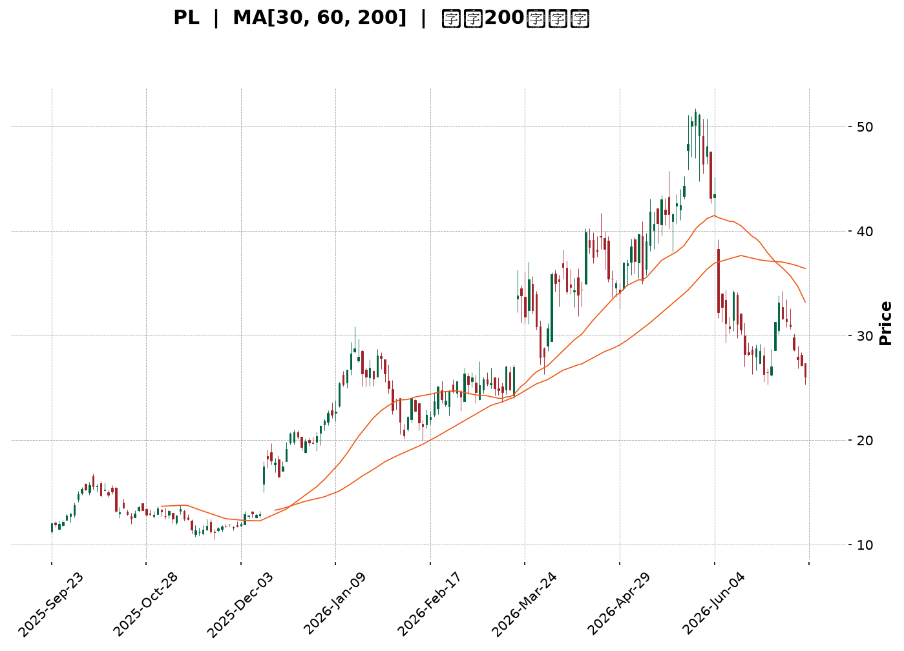
</details>

<html>
<head><meta charset="utf-8" /></head>
<body>
    <div style="height:500px; width:100%;">                        <script>window.PlotlyConfig = {MathJaxConfig: 'local'};</script>
        <script charset="utf-8" src="https://cdn.plot.ly/plotly-3.7.0.min.js" integrity="sha256-jvTGqxNp8AGWEcvNLVuKr+8j5dGe9Yw51LQkmDH+IYA=" crossorigin="anonymous"></script>                <div id="candlestick-chart" class="plotly-graph-div" style="height:100%; width:100%;"></div>            <script>                window.PLOTLYENV=window.PLOTLYENV || {};                                if (document.getElementById("candlestick-chart")) {                    Plotly.newPlot(                        "candlestick-chart",                        [{"close":{"dtype":"f8","bdata":"AAAAoJkZKEAAAAAAKdwnQAAAACCF6ydAAAAAYGZmKEAAAADgepQpQAAAAIDC9SlAAAAAgD2KK0AAAABAM7MtQAAAAGC4ni5AAAAAQOF6LkAAAAAAKVwvQAAAAEAzMy9AAAAAgOtRL0AAAABgZmYtQAAAAAAAgC5AAAAAIFyPLUAAAACAFC4uQAAAAIDCdSpAAAAA4FE4KkAAAABguB4rQAAAAIDr0SlAAAAAAAAAKUAAAABgZuYpQAAAAOBROCtAAAAAYLieKkAAAACAFK4pQAAAAMDMzClAAAAA4FG4KUAAAABgZuYqQAAAAKBHYSpAAAAAYGZmKUAAAAAAAIAqQAAAACCF6yhAAAAAYLieKUAAAAAgrscqQAAAAOCj8ChAAAAAoEfhKEAAAACA69EmQAAAAMDMzCZAAAAAIIVrJkAAAABgZuYmQAAAAOB6lCdAAAAAgMJ1JkAAAACA61EmQAAAAOB6FCdAAAAAgMJ1J0AAAADgo3AnQAAAAMDMzCdAAAAAYGZmJ0AAAACAPYonQAAAAMAeBShAAAAAoEfhKUAAAACAPYopQAAAAGBm5ilAAAAAgBSuKUAAAACgR+EpQAAAAOBReDFAAAAAoHA9MkAAAADAzAwyQAAAAKBH4TFAAAAA4FF4MEAAAACgcH0xQAAAAIAULjNAAAAAoJmZNEAAAABA4bo0QAAAAIDrUTRAAAAAAClcM0AAAABguN4zQAAAAKBwvTNAAAAA4FG4M0AAAADA9Wg0QAAAAADXYzVAAAAAQArXNUAAAAAAKZw2QAAAAOCjcDZAAAAAgMK1NkAAAADgo3A5QAAAAIDrUTlAAAAAQOG6OkAAAAAgrkc8QAAAACCuxzxAAAAAAAAAPEAAAACgR2E6QAAAACBcDzpAAAAA4KPwOkAAAABguN45QAAAAIDrETxAAAAAoEfhO0AAAACgmVk6QAAAAOBR+DhAAAAAoJnZNkAAAABAM\u002fM3QAAAAMAexTVAAAAAgBRuNEAAAABgj0I2QAAAAMAeBThAAAAAgD3KNkAAAABgZqY1QAAAAMDMTDVAAAAAIIVrNkAAAACAwjU2QAAAAKBwvTdAAAAAACkcOUAAAABgZuY3QAAAACCuxzdAAAAAgMK1OEAAAACgR6E4QAAAAKCZmTlAAAAAANcjOEAAAAAAKVw6QAAAAMDMTDlAAAAAAAAAOkAAAABACpc4QAAAACCuRzlAAAAAgOvROUAAAABgZmY5QAAAAOCjcDlAAAAA4FH4OEAAAACAPco4QAAAAKCZmThAAAAA4HoUO0AAAAAgXM84QAAAAIDC9TpAAAAAgD3qQEAAAADA9ehAQAAAAOB61D9AAAAAIFyvQUAAAABAMzNAQAAAAAAp3D5AAAAAANfjO0AAAABAM\u002fM7QAAAAIDCtT5AAAAA4KPwQUAAAABgj4JBQAAAAIDClUFAAAAAYGZGQkAAAACgcB1BQAAAAIDCVUFAAAAAwPUoQUAAAABACvdAQAAAAOB6NEFAAAAAgOvxQ0AAAACgcD1DQAAAAAAAwEJAAAAAANcDQ0AAAAAAKbxDQAAAAMAeJUNAAAAA4FG4QUAAAACgmblBQAAAAADXg0FAAAAAgD0KQUAAAAAAKXxCQAAAAEAzc0JAAAAAwB5FQ0AAAADgo5BCQAAAAOBR2ENAAAAAYLieQUAAAADAHoVDQAAAACCF60RAAAAAQApXREAAAABguF5EQAAAAMAehUVAAAAAIFzPREAAAACAFM5EQAAAACCFy0RAAAAA4HpURUAAAACgcD1FQAAAAMDMLEZAAAAAwPUoSEAAAACgcD1JQAAAAEAzs0lAAAAAgOuRSUAAAABA4TpHQAAAACCFC0hAAAAA4KOQRUAAAAAA18NFQAAAAAApHEBAAAAAYLheQEAAAAAghSs\u002fQAAAAOBRuD5AAAAAgMIVQUAAAABgZiY\u002fQAAAAOB6lD5AAAAAgMI1PEAAAADgUTg8QAAAAEDhOjxAAAAAwB7FPEAAAAAgroc8QAAAAMDMTDpAAAAAYI+COkAAAACA6xE7QAAAACCuRz9AAAAA4KOQQEAAAAAAKZw\u002fQAAAAKBHYT9AAAAAACncPkAAAADA9ag8QAAAAAAAwDtAAAAAQDMzO0AAAADAzAw6QA=="},"high":{"dtype":"f8","bdata":"AAAAYI9CKEAAAACAwnUoQAAAACBcjyhAAAAAwPWoKEAAAAAAAAAqQAAAAGC4HipAAAAAgD0KLEAAAADAyDYuQAAAAAAAAC9AAAAAIK7HL0AAAABgjwIwQAAAACCuxzBAAAAAoJmZL0AAAADAzAwwQAAAAGBm5i9AAAAAAACALkAAAADgelQvQAAAAEA1Hi9AAAAAwPUoK0AAAACA69EsQAAAAEAIrCpAAAAAoJkZKkAAAAAAKZwqQAAAAIAUbitAAAAAIIXrK0AAAADgo\u002fAqQAAAACCFqypAAAAAYGZmKkAAAACAwnUrQAAAAGCPwipAAAAAgD0KK0AAAADgo7AqQAAAAIA9CipAAAAAYGamKUAAAACgmZkrQAAAAKBwvSpAAAAAwMzMKUAAAACA69EoQAAAAEAzsydAAAAA4FE4J0AAAADAHsUnQAAAAIDC9ShAAAAAAAAAKUAAAAAAAAAnQAAAACBcTydAAAAAoO28J0AAAACAPQooQAAAAMAeBShAAAAAANejJ0AAAADAHoUoQAAAAKBHYShAAAAAYGZmKkAAAAAAAMApQAAAAIDCdSpAAAAAAAAAKkAAAABA4XoqQAAAAKCZ+TFAAAAAoJkZM0AAAADgo7AzQAAAACCuRzJAAAAAwMyMMkAAAABAM\u002fMxQAAAAOB61DNAAAAAYI\u002fCNEAAAACgcP00QAAAAIAU7jRAAAAAgMJVNEAAAADAHiU0QAAAAAApPDRAAAAAwMxMNEAAAAAgXM80QAAAACBcbzVAAAAAQDMTNkAAAAAAKdw2QAAAAKCZmTdAAAAAgOnGN0AAAAAgXI85QAAAAEAKlzpAAAAAwB7FOkAAAACgR2E9QAAAAGDj5T5AAAAA4FG4PUAAAAAghas8QAAAAIDA6jpAAAAAQOG6O0AAAABAM7M6QAAAAEAzszxAAAAAYGZmPEAAAABAM7M7QAAAAAAAQDtAAAAAwKHFOUAAAAAArPw3QAAAAAAAADhAAAAAgMCKNUAAAAAgrkc2QAAAAOBRGDhAAAAAQOH6N0AAAABgZoY3QAAAAMD16DVAAAAAgBTuNkAAAACAPco2QAAAAKCZmThAAAAAACkcOUAAAADgo7A5QAAAAOB6tDhAAAAAIFzPOEAAAABAYtA5QAAAAOCjsDlAAAAAQArXOEAAAACAFO46QAAAAOCjcDpAAAAAoEeBOkAAAACgcD06QAAAAACqkTtAAAAAQAoXOkAAAADgUXg6QAAAACCF6zpAAAAAIFwPOkAAAACA6QY6QAAAAAAAgDlAAAAAQAoXO0AAAADgehQ7QAAAAGCPQjtAAAAAANcjQkAAAAAghWtBQAAAACCFC0JAAAAAYGaGQkAAAAAA1dhBQAAAAGC4HkFAAAAAwPVoP0AAAACAFO48QAAAAIAULj9AAAAAwB4FQkAAAADAHiVCQAAAAGBm5kFAAAAAQOEaQ0AAAACAwpVCQAAAAIDrMUJAAAAAgBS+QUAAAAAgWDlCQAAAAIDClUFAAAAAoHAdREAAAACgcB1EQAAAAOB69ENAAAAAANfDQ0AAAABA4dpEQAAAAAAAAERAAAAAAADAQ0AAAACgcB1CQAAAAEAKp0FAAAAAAACAQUAAAAAAKXxCQAAAAOB6pEJAAAAAYI+iQ0AAAABACrdDQAAAAKBH4UNAAAAAgMJ1REAAAADAzOxDQAAAACBcj0VAAAAA4KPwREAAAACgmRlFQAAAAKCZuUVAAAAAQAqXRUAAAAAA1+NGQAAAAAAA4ERAAAAAYGbGRUAAAAAAAABGQAAAAEAMokZAAAAA4KOQSUAAAACgcH1JQAAAAKBH4UlAAAAAYI+iSUAAAAAAAGBJQAAAAGCPYklAAAAAIFzPR0AAAADAHpVGQAAAAEAKl0NAAAAAwB4FQUAAAAAgXC9BQAAAAMDMzD9AAAAAwPUoQUAAAABAMxNBQAAAAIDrEUBAAAAAAABAP0AAAACgmVk9QAAAAAAAAD1AAAAAYI8iPUAAAAAgLz09QAAAAKBH4TxAAAAAQArXOkAAAADgo7A8QAAAACCuRz9AAAAAwMzsQEAAAAAAACBBQAAAAKCZuUBAAAAAgBROQEAAAADAzCw+QAAAAGCPAj1AAAAAYGZmPEAAAAAAKVw7QA=="},"hovertemplate":"\u003cb\u003e%{x|%Y-%m-%d}\u003c\u002fb\u003e\u003cbr\u003e\u958b: $%{open:.2f}\u003cbr\u003e\u9ad8: $%{high:.2f}\u003cbr\u003e\u4f4e: $%{low:.2f}\u003cbr\u003e\u6536: $%{close:.2f}\u003cextra\u003e\u003c\u002fextra\u003e","low":{"dtype":"f8","bdata":"AAAAANcjJkAAAABAClcnQAAAAEAK1yZAAAAAwB6FJ0AAAADgUbgoQAAAAKBwPShAAAAAQDMzKUAAAADA9SgsQAAAAMAehS1AAAAAoEdhLkAAAAAgXI8tQAAAAMAehS5AAAAAwPUoLkAAAAAAKRwtQAAAAIDrUS5AAAAAQAoXLUAAAABAM7MtQAAAAKBwPSpAAAAAIN0kKUAAAAAAAAArQAAAAGC4nilAAAAA4KPwJ0AAAACAFC4pQAAAACCuRypAAAAAgD2KKkAAAAAgXI8pQAAAACCuhylAAAAAQN8PKUAAAAAgrscpQAAAAIDCdSlAAAAAIIXrKEAAAAAgXA8pQAAAAADXIyhAAAAAACncJ0AAAABgENgpQAAAACBcjyhAAAAAwPWoKEAAAABAChcmQAAAAMDIdiVAAAAAYI\u002fCJUAAAACAFO4lQAAAAMDMzCZAAAAAgJcuJkAAAACAPQolQAAAAMAehSZAAAAAwB6FJkAAAABgj0InQAAAAICXbidAAAAAwMzMJkAAAADgelQnQAAAAEDheidAAAAAACncJ0AAAADAHgUpQAAAAKBwPSlAAAAAQDUeKUAAAADA9SgpQAAAAMAeBS5AAAAAYLheMUAAAAAA16MxQAAAAIAU7jBAAAAAgBRuMEAAAACAPQoxQAAAAKBw\u002fTFAAAAAACmcM0AAAACgmZkzQAAAAAApHDRAAAAAgD0KM0AAAABgj8IyQAAAAOCjcDNAAAAAQImhM0AAAAAA1fgyQAAAAKBwfTNAAAAA4FH4NEAAAADA9Wg1QAAAAEAKFzZAAAAAwCDQNUAAAADA9Sg3QAAAAGC4HjlAAAAAAAAAOUAAAABgj0I6QAAAAAApXDxAAAAAIFxvO0AAAACgRyE5QAAAAADXIzlAAAAAgBQuOUAAAADgUTg5QAAAAKAaDzpAAAAAIFzPOkAAAADAzIw5QAAAAIDrcThAAAAAQAp3NkAAAADA9eg2QAAAAEAKlzRAAAAAYGYmNEAAAAAgXM80QAAAAGBmpjVAAAAAgMK1NkAAAADA9eg0QAAAAEDh+jNAAAAAIAYhNUAAAAAAAIA1QAAAAKBwPTZAAAAAgMJ1NkAAAABgj4I3QAAAAEDhOjdAAAAAoJlZNkAAAACgcH04QAAAAIDrEThAAAAAIK7HNkAAAADgUbg3QAAAAKBHYThAAAAAgGgROUAAAABgj4I3QAAAAKCZ2TdAAAAAQDNzOEAAAABAMzM5QAAAAOCj8DhAAAAAIK5HOEAAAAAgXE84QAAAAOB4qTdAAAAAYGZmOEAAAABgj8I4QAAAAOCj8DdAAAAAgGghQEAAAABA4To\u002fQAAAAAApHD9AAAAAoEchP0AAAAAgXA9AQAAAAIA9ij5AAAAAYLg+O0AAAADA9Ug6QAAAAMAehTxAAAAA4KNwPUAAAABA4RpBQAAAAGCPYkBAAAAA4FG4QUAAAADgUfhAQAAAAKCZ+UBAAAAAAClcQEAAAACgR+E\u002fQAAAACCuZ0BAAAAAYGZ2QUAAAAAghetCQAAAAEAKd0JAAAAAYI\u002fCQkAAAAAA1yNDQAAAAIA9KkJAAAAA4KOQQUAAAADgo9BAQAAAAMDz3UBAAAAAwPVIQEAAAADASydBQAAAAOCla0FAAAAAwPXoQUAAAACgmflBQAAAAKBHwUFAAAAAQAp3QUAAAABgZuZBQAAAAMDMDENAAAAAoEchQ0AAAADAzGxDQAAAAMDMzENAAAAAwB5FREAAAACgRyFEQAAAAGCPAkNAAAAAgMJVREAAAADAHoVEQAAAAMDMjEVAAAAAgBTuRkAAAACAFI5HQAAAAAAAgEdAAAAAANdjRkAAAAAA18NGQAAAAEDhOkdAAAAAwB5VRUAAAABgZqZEQAAAAMD1qD9AAAAA4HpUP0AAAACA61E9QAAAAEAzMz5AAAAAIIVrPkAAAADAHsU9QAAAAAApHD5AAAAAoEMLO0AAAADgehQ8QAAAAOB6VDpAAAAAgMK1OkAAAADgelQ7QAAAAIA9ijlAAAAAwMxMOUAAAACgRyE6QAAAAKCZmTxAAAAAoBgkPkAAAADA9Yg\u002fQAAAAIA9yj5AAAAAACmcPkAAAACAPYo8QAAAAEAK1zpAAAAAYI8iO0AAAACA61E5QA=="},"name":"\u50f9\u683c","open":{"dtype":"f8","bdata":"AAAAQOF6JkAAAAAgrkcoQAAAAAAAACdAAAAA4FG4J0AAAAAgrscoQAAAAGBmZilAAAAAgBSuKUAAAADgUbgsQAAAAGBm5i1AAAAAoJmZL0AAAAAAAAAuQAAAAMDMjDBAAAAAgBQuL0AAAADgUbgvQAAAACCFay5AAAAAAAAALkAAAABgZuYuQAAAAOCj8C5AAAAAAAAAKkAAAACAPQosQAAAAAApXCpAAAAAAACAKUAAAABgj0IpQAAAAKCZmSpAAAAAYGbmK0AAAADAzMwqQAAAACCF6ylAAAAAQOF6KUAAAAAgrscpQAAAAMD1qCpAAAAAgMJ1KUAAAACAFK4pQAAAAMAeBSpAAAAA4FE4KEAAAACAwnUqQAAAAGBmZipAAAAAYI9CKUAAAACAPYooQAAAAAAAACZAAAAAAClcJkAAAADgehQmQAAAACCF6yZAAAAAYGZmKEAAAABA4XomQAAAAEAzsyZAAAAAwB4FJ0AAAACAPYonQAAAAIDr0SdAAAAAQDMzJ0AAAABgj8InQAAAAMD1qCdAAAAAYGbmJ0AAAADAHoUpQAAAAAApXCpAAAAAoHA9KUAAAACgmZkpQAAAAOB6lC9AAAAA4KNwMkAAAAAgXM8yQAAAAGBmpjFAAAAAgBQuMkAAAACAPQoxQAAAAKBw\u002fTFAAAAAIK7HM0AAAADAzMwzQAAAAEDhujRAAAAAwMxMNEAAAACgcN0yQAAAACCuBzRAAAAAYLi+M0AAAABA4dozQAAAAEAzszRAAAAAAACANUAAAADgUbg1QAAAAKCZ2TZAAAAAoJmZNkAAAADAzEw3QAAAAGCPQjpAAAAAAACAOUAAAAAgXM86QAAAAEAzczxAAAAAQAqXO0AAAAAAAIA8QAAAAAAAwDpAAAAAYI8COkAAAACgmZk6QAAAAOB6FDpAAAAAwMwMPEAAAABAM7M7QAAAAEAKtzlAAAAAANfjOEAAAABA4fo3QAAAAAAAADhAAAAAAAAANUAAAACAPQo1QAAAAIDC9TVAAAAAYLjeN0AAAABgZoY3QAAAAIDrkTVAAAAAAACANUAAAAAAAAA2QAAAAGBmZjZAAAAAwB4FN0AAAACgcL04QAAAAGBmZjdAAAAAAABAN0AAAADAzEw5QAAAAAAAgDhAAAAAQDOTOEAAAADgUbg3QAAAAEDhGjpAAAAAoJmZOUAAAAAAAIA5QAAAAADX4zdAAAAAQArXOEAAAACA69E5QAAAAEAKVzlAAAAA4FH4OUAAAABA4fo4QAAAAKBHITlAAAAAoJnZOEAAAAAAAIA6QAAAAAAAQDhAAAAAYGbGQEAAAAAAAEBBQAAAAEDh2kBAAAAAQDMzQEAAAAAAKXxBQAAAAKBw\u002fUBAAAAAoJnZPkAAAADAzMw8QAAAAAAAAD1AAAAA4KNwPUAAAACAwvVBQAAAAOCjsEFAAAAAQDNzQkAAAAAAAEBCQAAAAOCjcEFAAAAAoHAdQUAAAAAghctBQAAAAIDCNUFAAAAAoHB9QUAAAACA65FDQAAAAEAzk0NAAAAAACkcQ0AAAAAAAMBDQAAAAIA9qkNAAAAAgBSOQ0AAAAAAKbxBQAAAAMDMTEFAAAAA4KMwQUAAAAAA10NBQAAAACBcX0JAAAAAwB6FQkAAAACgmZlDQAAAACBcf0JAAAAAYI\u002fCQ0AAAABAMzNCQAAAAEAzU0NAAAAAIIULREAAAABAChdFQAAAAOCjUERAAAAAwPUIRUAAAAAA16NFQAAAAEAKd0RAAAAAQDMzRUAAAADAcghFQAAAAMDMrEVAAAAAwPXYR0AAAADAzAxJQAAAAEAzE0lAAAAAAACQSEAAAAAghYtIQAAAAIDClUdAAAAAIFzPR0AAAACgcJ1FQAAAAGBmJkNAAAAAoEcBQUAAAACAwrVAQAAAAADX4z5AAAAAAACAP0AAAACA6\u002fFAQAAAAIA9CkBAAAAAwB4FPkAAAAAA12M8QAAAAGBmpjxAAAAAgML1O0AAAADgelQ7QAAAAIDrETxAAAAAYI+COkAAAABA4To6QAAAAKCZmTxAAAAAoHB9PkAAAACgmVlAQAAAAEAKlz9AAAAA4HoUP0AAAADgetQ9QAAAAAAAADxAAAAA4KMwPEAAAABAClc7QA=="},"x":["2025-09-23T00:00:00-04:00","2025-09-24T00:00:00-04:00","2025-09-25T00:00:00-04:00","2025-09-26T00:00:00-04:00","2025-09-29T00:00:00-04:00","2025-09-30T00:00:00-04:00","2025-10-01T00:00:00-04:00","2025-10-02T00:00:00-04:00","2025-10-03T00:00:00-04:00","2025-10-06T00:00:00-04:00","2025-10-07T00:00:00-04:00","2025-10-08T00:00:00-04:00","2025-10-09T00:00:00-04:00","2025-10-10T00:00:00-04:00","2025-10-13T00:00:00-04:00","2025-10-14T00:00:00-04:00","2025-10-15T00:00:00-04:00","2025-10-16T00:00:00-04:00","2025-10-17T00:00:00-04:00","2025-10-20T00:00:00-04:00","2025-10-21T00:00:00-04:00","2025-10-22T00:00:00-04:00","2025-10-23T00:00:00-04:00","2025-10-24T00:00:00-04:00","2025-10-27T00:00:00-04:00","2025-10-28T00:00:00-04:00","2025-10-29T00:00:00-04:00","2025-10-30T00:00:00-04:00","2025-10-31T00:00:00-04:00","2025-11-03T00:00:00-05:00","2025-11-04T00:00:00-05:00","2025-11-05T00:00:00-05:00","2025-11-06T00:00:00-05:00","2025-11-07T00:00:00-05:00","2025-11-10T00:00:00-05:00","2025-11-11T00:00:00-05:00","2025-11-12T00:00:00-05:00","2025-11-13T00:00:00-05:00","2025-11-14T00:00:00-05:00","2025-11-17T00:00:00-05:00","2025-11-18T00:00:00-05:00","2025-11-19T00:00:00-05:00","2025-11-20T00:00:00-05:00","2025-11-21T00:00:00-05:00","2025-11-24T00:00:00-05:00","2025-11-25T00:00:00-05:00","2025-11-26T00:00:00-05:00","2025-11-28T00:00:00-05:00","2025-12-01T00:00:00-05:00","2025-12-02T00:00:00-05:00","2025-12-03T00:00:00-05:00","2025-12-04T00:00:00-05:00","2025-12-05T00:00:00-05:00","2025-12-08T00:00:00-05:00","2025-12-09T00:00:00-05:00","2025-12-10T00:00:00-05:00","2025-12-11T00:00:00-05:00","2025-12-12T00:00:00-05:00","2025-12-15T00:00:00-05:00","2025-12-16T00:00:00-05:00","2025-12-17T00:00:00-05:00","2025-12-18T00:00:00-05:00","2025-12-19T00:00:00-05:00","2025-12-22T00:00:00-05:00","2025-12-23T00:00:00-05:00","2025-12-24T00:00:00-05:00","2025-12-26T00:00:00-05:00","2025-12-29T00:00:00-05:00","2025-12-30T00:00:00-05:00","2025-12-31T00:00:00-05:00","2026-01-02T00:00:00-05:00","2026-01-05T00:00:00-05:00","2026-01-06T00:00:00-05:00","2026-01-07T00:00:00-05:00","2026-01-08T00:00:00-05:00","2026-01-09T00:00:00-05:00","2026-01-12T00:00:00-05:00","2026-01-13T00:00:00-05:00","2026-01-14T00:00:00-05:00","2026-01-15T00:00:00-05:00","2026-01-16T00:00:00-05:00","2026-01-20T00:00:00-05:00","2026-01-21T00:00:00-05:00","2026-01-22T00:00:00-05:00","2026-01-23T00:00:00-05:00","2026-01-26T00:00:00-05:00","2026-01-27T00:00:00-05:00","2026-01-28T00:00:00-05:00","2026-01-29T00:00:00-05:00","2026-01-30T00:00:00-05:00","2026-02-02T00:00:00-05:00","2026-02-03T00:00:00-05:00","2026-02-04T00:00:00-05:00","2026-02-05T00:00:00-05:00","2026-02-06T00:00:00-05:00","2026-02-09T00:00:00-05:00","2026-02-10T00:00:00-05:00","2026-02-11T00:00:00-05:00","2026-02-12T00:00:00-05:00","2026-02-13T00:00:00-05:00","2026-02-17T00:00:00-05:00","2026-02-18T00:00:00-05:00","2026-02-19T00:00:00-05:00","2026-02-20T00:00:00-05:00","2026-02-23T00:00:00-05:00","2026-02-24T00:00:00-05:00","2026-02-25T00:00:00-05:00","2026-02-26T00:00:00-05:00","2026-02-27T00:00:00-05:00","2026-03-02T00:00:00-05:00","2026-03-03T00:00:00-05:00","2026-03-04T00:00:00-05:00","2026-03-05T00:00:00-05:00","2026-03-06T00:00:00-05:00","2026-03-09T00:00:00-04:00","2026-03-10T00:00:00-04:00","2026-03-11T00:00:00-04:00","2026-03-12T00:00:00-04:00","2026-03-13T00:00:00-04:00","2026-03-16T00:00:00-04:00","2026-03-17T00:00:00-04:00","2026-03-18T00:00:00-04:00","2026-03-19T00:00:00-04:00","2026-03-20T00:00:00-04:00","2026-03-23T00:00:00-04:00","2026-03-24T00:00:00-04:00","2026-03-25T00:00:00-04:00","2026-03-26T00:00:00-04:00","2026-03-27T00:00:00-04:00","2026-03-30T00:00:00-04:00","2026-03-31T00:00:00-04:00","2026-04-01T00:00:00-04:00","2026-04-02T00:00:00-04:00","2026-04-06T00:00:00-04:00","2026-04-07T00:00:00-04:00","2026-04-08T00:00:00-04:00","2026-04-09T00:00:00-04:00","2026-04-10T00:00:00-04:00","2026-04-13T00:00:00-04:00","2026-04-14T00:00:00-04:00","2026-04-15T00:00:00-04:00","2026-04-16T00:00:00-04:00","2026-04-17T00:00:00-04:00","2026-04-20T00:00:00-04:00","2026-04-21T00:00:00-04:00","2026-04-22T00:00:00-04:00","2026-04-23T00:00:00-04:00","2026-04-24T00:00:00-04:00","2026-04-27T00:00:00-04:00","2026-04-28T00:00:00-04:00","2026-04-29T00:00:00-04:00","2026-04-30T00:00:00-04:00","2026-05-01T00:00:00-04:00","2026-05-04T00:00:00-04:00","2026-05-05T00:00:00-04:00","2026-05-06T00:00:00-04:00","2026-05-07T00:00:00-04:00","2026-05-08T00:00:00-04:00","2026-05-11T00:00:00-04:00","2026-05-12T00:00:00-04:00","2026-05-13T00:00:00-04:00","2026-05-14T00:00:00-04:00","2026-05-15T00:00:00-04:00","2026-05-18T00:00:00-04:00","2026-05-19T00:00:00-04:00","2026-05-20T00:00:00-04:00","2026-05-21T00:00:00-04:00","2026-05-22T00:00:00-04:00","2026-05-26T00:00:00-04:00","2026-05-27T00:00:00-04:00","2026-05-28T00:00:00-04:00","2026-05-29T00:00:00-04:00","2026-06-01T00:00:00-04:00","2026-06-02T00:00:00-04:00","2026-06-03T00:00:00-04:00","2026-06-04T00:00:00-04:00","2026-06-05T00:00:00-04:00","2026-06-08T00:00:00-04:00","2026-06-09T00:00:00-04:00","2026-06-10T00:00:00-04:00","2026-06-11T00:00:00-04:00","2026-06-12T00:00:00-04:00","2026-06-15T00:00:00-04:00","2026-06-16T00:00:00-04:00","2026-06-17T00:00:00-04:00","2026-06-18T00:00:00-04:00","2026-06-22T00:00:00-04:00","2026-06-23T00:00:00-04:00","2026-06-24T00:00:00-04:00","2026-06-25T00:00:00-04:00","2026-06-26T00:00:00-04:00","2026-06-29T00:00:00-04:00","2026-06-30T00:00:00-04:00","2026-07-01T00:00:00-04:00","2026-07-02T00:00:00-04:00","2026-07-06T00:00:00-04:00","2026-07-07T00:00:00-04:00","2026-07-08T00:00:00-04:00","2026-07-09T00:00:00-04:00","2026-07-10T00:00:00-04:00"],"type":"candlestick"},{"hovertemplate":"MA30: $%{y:.2f}\u003cextra\u003e\u003c\u002fextra\u003e","line":{"color":"#2196F3","dash":"dash","width":2},"mode":"lines","name":"MA30","x":["2025-09-23T00:00:00-04:00","2025-09-24T00:00:00-04:00","2025-09-25T00:00:00-04:00","2025-09-26T00:00:00-04:00","2025-09-29T00:00:00-04:00","2025-09-30T00:00:00-04:00","2025-10-01T00:00:00-04:00","2025-10-02T00:00:00-04:00","2025-10-03T00:00:00-04:00","2025-10-06T00:00:00-04:00","2025-10-07T00:00:00-04:00","2025-10-08T00:00:00-04:00","2025-10-09T00:00:00-04:00","2025-10-10T00:00:00-04:00","2025-10-13T00:00:00-04:00","2025-10-14T00:00:00-04:00","2025-10-15T00:00:00-04:00","2025-10-16T00:00:00-04:00","2025-10-17T00:00:00-04:00","2025-10-20T00:00:00-04:00","2025-10-21T00:00:00-04:00","2025-10-22T00:00:00-04:00","2025-10-23T00:00:00-04:00","2025-10-24T00:00:00-04:00","2025-10-27T00:00:00-04:00","2025-10-28T00:00:00-04:00","2025-10-29T00:00:00-04:00","2025-10-30T00:00:00-04:00","2025-10-31T00:00:00-04:00","2025-11-03T00:00:00-05:00","2025-11-04T00:00:00-05:00","2025-11-05T00:00:00-05:00","2025-11-06T00:00:00-05:00","2025-11-07T00:00:00-05:00","2025-11-10T00:00:00-05:00","2025-11-11T00:00:00-05:00","2025-11-12T00:00:00-05:00","2025-11-13T00:00:00-05:00","2025-11-14T00:00:00-05:00","2025-11-17T00:00:00-05:00","2025-11-18T00:00:00-05:00","2025-11-19T00:00:00-05:00","2025-11-20T00:00:00-05:00","2025-11-21T00:00:00-05:00","2025-11-24T00:00:00-05:00","2025-11-25T00:00:00-05:00","2025-11-26T00:00:00-05:00","2025-11-28T00:00:00-05:00","2025-12-01T00:00:00-05:00","2025-12-02T00:00:00-05:00","2025-12-03T00:00:00-05:00","2025-12-04T00:00:00-05:00","2025-12-05T00:00:00-05:00","2025-12-08T00:00:00-05:00","2025-12-09T00:00:00-05:00","2025-12-10T00:00:00-05:00","2025-12-11T00:00:00-05:00","2025-12-12T00:00:00-05:00","2025-12-15T00:00:00-05:00","2025-12-16T00:00:00-05:00","2025-12-17T00:00:00-05:00","2025-12-18T00:00:00-05:00","2025-12-19T00:00:00-05:00","2025-12-22T00:00:00-05:00","2025-12-23T00:00:00-05:00","2025-12-24T00:00:00-05:00","2025-12-26T00:00:00-05:00","2025-12-29T00:00:00-05:00","2025-12-30T00:00:00-05:00","2025-12-31T00:00:00-05:00","2026-01-02T00:00:00-05:00","2026-01-05T00:00:00-05:00","2026-01-06T00:00:00-05:00","2026-01-07T00:00:00-05:00","2026-01-08T00:00:00-05:00","2026-01-09T00:00:00-05:00","2026-01-12T00:00:00-05:00","2026-01-13T00:00:00-05:00","2026-01-14T00:00:00-05:00","2026-01-15T00:00:00-05:00","2026-01-16T00:00:00-05:00","2026-01-20T00:00:00-05:00","2026-01-21T00:00:00-05:00","2026-01-22T00:00:00-05:00","2026-01-23T00:00:00-05:00","2026-01-26T00:00:00-05:00","2026-01-27T00:00:00-05:00","2026-01-28T00:00:00-05:00","2026-01-29T00:00:00-05:00","2026-01-30T00:00:00-05:00","2026-02-02T00:00:00-05:00","2026-02-03T00:00:00-05:00","2026-02-04T00:00:00-05:00","2026-02-05T00:00:00-05:00","2026-02-06T00:00:00-05:00","2026-02-09T00:00:00-05:00","2026-02-10T00:00:00-05:00","2026-02-11T00:00:00-05:00","2026-02-12T00:00:00-05:00","2026-02-13T00:00:00-05:00","2026-02-17T00:00:00-05:00","2026-02-18T00:00:00-05:00","2026-02-19T00:00:00-05:00","2026-02-20T00:00:00-05:00","2026-02-23T00:00:00-05:00","2026-02-24T00:00:00-05:00","2026-02-25T00:00:00-05:00","2026-02-26T00:00:00-05:00","2026-02-27T00:00:00-05:00","2026-03-02T00:00:00-05:00","2026-03-03T00:00:00-05:00","2026-03-04T00:00:00-05:00","2026-03-05T00:00:00-05:00","2026-03-06T00:00:00-05:00","2026-03-09T00:00:00-04:00","2026-03-10T00:00:00-04:00","2026-03-11T00:00:00-04:00","2026-03-12T00:00:00-04:00","2026-03-13T00:00:00-04:00","2026-03-16T00:00:00-04:00","2026-03-17T00:00:00-04:00","2026-03-18T00:00:00-04:00","2026-03-19T00:00:00-04:00","2026-03-20T00:00:00-04:00","2026-03-23T00:00:00-04:00","2026-03-24T00:00:00-04:00","2026-03-25T00:00:00-04:00","2026-03-26T00:00:00-04:00","2026-03-27T00:00:00-04:00","2026-03-30T00:00:00-04:00","2026-03-31T00:00:00-04:00","2026-04-01T00:00:00-04:00","2026-04-02T00:00:00-04:00","2026-04-06T00:00:00-04:00","2026-04-07T00:00:00-04:00","2026-04-08T00:00:00-04:00","2026-04-09T00:00:00-04:00","2026-04-10T00:00:00-04:00","2026-04-13T00:00:00-04:00","2026-04-14T00:00:00-04:00","2026-04-15T00:00:00-04:00","2026-04-16T00:00:00-04:00","2026-04-17T00:00:00-04:00","2026-04-20T00:00:00-04:00","2026-04-21T00:00:00-04:00","2026-04-22T00:00:00-04:00","2026-04-23T00:00:00-04:00","2026-04-24T00:00:00-04:00","2026-04-27T00:00:00-04:00","2026-04-28T00:00:00-04:00","2026-04-29T00:00:00-04:00","2026-04-30T00:00:00-04:00","2026-05-01T00:00:00-04:00","2026-05-04T00:00:00-04:00","2026-05-05T00:00:00-04:00","2026-05-06T00:00:00-04:00","2026-05-07T00:00:00-04:00","2026-05-08T00:00:00-04:00","2026-05-11T00:00:00-04:00","2026-05-12T00:00:00-04:00","2026-05-13T00:00:00-04:00","2026-05-14T00:00:00-04:00","2026-05-15T00:00:00-04:00","2026-05-18T00:00:00-04:00","2026-05-19T00:00:00-04:00","2026-05-20T00:00:00-04:00","2026-05-21T00:00:00-04:00","2026-05-22T00:00:00-04:00","2026-05-26T00:00:00-04:00","2026-05-27T00:00:00-04:00","2026-05-28T00:00:00-04:00","2026-05-29T00:00:00-04:00","2026-06-01T00:00:00-04:00","2026-06-02T00:00:00-04:00","2026-06-03T00:00:00-04:00","2026-06-04T00:00:00-04:00","2026-06-05T00:00:00-04:00","2026-06-08T00:00:00-04:00","2026-06-09T00:00:00-04:00","2026-06-10T00:00:00-04:00","2026-06-11T00:00:00-04:00","2026-06-12T00:00:00-04:00","2026-06-15T00:00:00-04:00","2026-06-16T00:00:00-04:00","2026-06-17T00:00:00-04:00","2026-06-18T00:00:00-04:00","2026-06-22T00:00:00-04:00","2026-06-23T00:00:00-04:00","2026-06-24T00:00:00-04:00","2026-06-25T00:00:00-04:00","2026-06-26T00:00:00-04:00","2026-06-29T00:00:00-04:00","2026-06-30T00:00:00-04:00","2026-07-01T00:00:00-04:00","2026-07-02T00:00:00-04:00","2026-07-06T00:00:00-04:00","2026-07-07T00:00:00-04:00","2026-07-08T00:00:00-04:00","2026-07-09T00:00:00-04:00","2026-07-10T00:00:00-04:00"],"y":{"dtype":"f8","bdata":"AAAAAAAA+H8AAAAAAAD4fwAAAAAAAPh\u002fAAAAAAAA+H8AAAAAAAD4fwAAAAAAAPh\u002fAAAAAAAA+H8AAAAAAAD4fwAAAAAAAPh\u002fAAAAAAAA+H8AAAAAAAD4fwAAAAAAAPh\u002fAAAAAAAA+H8AAAAAAAD4fwAAAAAAAPh\u002fAAAAAAAA+H8AAAAAAAD4fwAAAAAAAPh\u002fAAAAAAAA+H8AAAAAAAD4fwAAAAAAAPh\u002fAAAAAAAA+H8AAAAAAAD4fwAAAAAAAPh\u002fAAAAAAAA+H8AAAAAAAD4fwAAAAAAAPh\u002fAAAAAAAA+H8AAAAAAAD4f5qZmUnFWStA3t3dLd1kK0CJiIhYZHsrQBEREeHsgytAMzMzA1aOK0BERER0k5grQLy7uzvfjytA7+7uXix5K0B3d3fHdj4rQJqZmbm7+ypAMzMzY\u002fS2KkC8u7s7w24qQGZmZha9LSpA7+7uHiLiKUAAAACgt6UpQDMzM2NmZilAvLu7u1gyKUCrqqr61PgoQO\u002fu7h4i4ihAzczMvBHKKEC8u7sbhasoQDMzM\u002fMonChAZmZmVqujKECJiIjomKAoQDMzM1NVlShAzczM3E+NKEBERETEBI8oQGZmZmYD3ShAq6qq+tQ4KUDv7u6uVocpQKuqqpph1ylAvLu7+7gXKkAzMzPTFWAqQERERPTF0ipAvLu7+7hXK0De3d3t\u002fdQrQJqZmRn3WixAvLu7CxHRLECrqqpac2EtQO\u002fu7l7J7y1AAAAAIAaBLkBmZmb28BkvQAAAAADIvS9AZmZm5m05MEDv7u7OIpswQBERETkm+DBA3t3dZdhVMUAiIiIy7MoxQCIiIqJwPTJAMzMzK7K9MkCJiIjQlEozQImIiHCv2TNAMzMzgzJaNEAiIiICVs40QFVVVT01PjVAERERKYe2NUDe3d0t3SQ2QLy7uztRfzZAIiIiIpTRNkAzMzPDZxg3QKuqqhroVDdA3t3dbVmLN0BERESEecI3QFVVVXWT2DdAZmZmFiDXN0DNzMxsLuQ3QDMzMzPBAzhAZmZmJgYhOEDe3d2dNjA4QM3MzHyGPThAq6qqupBUOEAzMzPj7GM4QKuqqor6dzhAd3d39+GTOEAzMzMD5J44QJqZmUlTqjhAq6qqWmS7OEARERHherQ4QM3MzIzetjhAvLu7m8SgOEDe3d1NYpA4QAAAACCwcjhA7+7uDp9hOEDv7u6+WFI4QAAAANCwSzhAIiIiIiJCOEBmZmZmHz44QERERBSuJzhAZmZmFtkOOEB3d3c3iQE4QBEREfFg\u002fjdAREREhHkiOEBmZmY20Ck4QAAAAPAZVjhAAAAAsHLIOEBERETkFys5QImIiBi9bTlAVVVVhRbZOUAiIiJC0jQ6QGZmZmZmhjpAvLu7yxO1OkBVVVUFD+Y6QHd3dzeJITtAREREpHB9O0B3d3enVNw7QLy7u3uGPTxAvLu7W4+iPEARERHhevQ8QHd3d5fgQT1AREREJL+YPUDv7u4OWNk9QImIiCgVJz5AMzMzU5ydPkDe3d19IxQ\u002fQM3MzHxqfD9AMzMzo5vkP0AzMzMDVi5AQLy7u6MpZUBAvLu7q9WRQEC8u7s7Ub9AQKuqqpLR60BAERERca8JQUAAAABokT1BQCIiIor6Z0FAVVVVHRN8QUDNzMyEMopBQLy7u7u7q0FA3t3dvS2rQUBERERkgsdBQKuqqnpb9kFAIiIiku0sQkCamZmpf2NCQAAAAFAbmEJAvLu765iwQkBVVVX1tsxCQAAAAFAb6EJAAAAAEC0CQ0AzMzNDYCVDQHd3d2etTkNAMzMzI2mKQ0BmZmYmBtFDQDMzM8ODGURAMzMzw4NJREDNzMwMkGtEQHd3dye\u002fmERAd3d3t4GuREARERFR1L9EQCIiIkLupURAREREJGmaREBVVVU9JohEQCIiIpLCdURA7+7u3iR2RECJiIjgT11EQAAAAMBYQkRAIiIiokUWREARERGJQfBDQBERESlcv0NAmpmZMcGjQ0CJiIh46XZDQFVVVaWbNENAIiIiOib4QkCJiIjw0r1CQCIiIuKli0JAq6qqimxnQkAAAADgwTxCQM3MzNQxEUJA3t3dFdneQUDe3d314aNBQN7d3VUOXUFAIiIiqvECQUDv7u6WtZpAQA=="},"type":"scatter"},{"hovertemplate":"MA60: $%{y:.2f}\u003cextra\u003e\u003c\u002fextra\u003e","line":{"color":"#9C27B0","dash":"dash","width":2},"mode":"lines","name":"MA60","x":["2025-09-23T00:00:00-04:00","2025-09-24T00:00:00-04:00","2025-09-25T00:00:00-04:00","2025-09-26T00:00:00-04:00","2025-09-29T00:00:00-04:00","2025-09-30T00:00:00-04:00","2025-10-01T00:00:00-04:00","2025-10-02T00:00:00-04:00","2025-10-03T00:00:00-04:00","2025-10-06T00:00:00-04:00","2025-10-07T00:00:00-04:00","2025-10-08T00:00:00-04:00","2025-10-09T00:00:00-04:00","2025-10-10T00:00:00-04:00","2025-10-13T00:00:00-04:00","2025-10-14T00:00:00-04:00","2025-10-15T00:00:00-04:00","2025-10-16T00:00:00-04:00","2025-10-17T00:00:00-04:00","2025-10-20T00:00:00-04:00","2025-10-21T00:00:00-04:00","2025-10-22T00:00:00-04:00","2025-10-23T00:00:00-04:00","2025-10-24T00:00:00-04:00","2025-10-27T00:00:00-04:00","2025-10-28T00:00:00-04:00","2025-10-29T00:00:00-04:00","2025-10-30T00:00:00-04:00","2025-10-31T00:00:00-04:00","2025-11-03T00:00:00-05:00","2025-11-04T00:00:00-05:00","2025-11-05T00:00:00-05:00","2025-11-06T00:00:00-05:00","2025-11-07T00:00:00-05:00","2025-11-10T00:00:00-05:00","2025-11-11T00:00:00-05:00","2025-11-12T00:00:00-05:00","2025-11-13T00:00:00-05:00","2025-11-14T00:00:00-05:00","2025-11-17T00:00:00-05:00","2025-11-18T00:00:00-05:00","2025-11-19T00:00:00-05:00","2025-11-20T00:00:00-05:00","2025-11-21T00:00:00-05:00","2025-11-24T00:00:00-05:00","2025-11-25T00:00:00-05:00","2025-11-26T00:00:00-05:00","2025-11-28T00:00:00-05:00","2025-12-01T00:00:00-05:00","2025-12-02T00:00:00-05:00","2025-12-03T00:00:00-05:00","2025-12-04T00:00:00-05:00","2025-12-05T00:00:00-05:00","2025-12-08T00:00:00-05:00","2025-12-09T00:00:00-05:00","2025-12-10T00:00:00-05:00","2025-12-11T00:00:00-05:00","2025-12-12T00:00:00-05:00","2025-12-15T00:00:00-05:00","2025-12-16T00:00:00-05:00","2025-12-17T00:00:00-05:00","2025-12-18T00:00:00-05:00","2025-12-19T00:00:00-05:00","2025-12-22T00:00:00-05:00","2025-12-23T00:00:00-05:00","2025-12-24T00:00:00-05:00","2025-12-26T00:00:00-05:00","2025-12-29T00:00:00-05:00","2025-12-30T00:00:00-05:00","2025-12-31T00:00:00-05:00","2026-01-02T00:00:00-05:00","2026-01-05T00:00:00-05:00","2026-01-06T00:00:00-05:00","2026-01-07T00:00:00-05:00","2026-01-08T00:00:00-05:00","2026-01-09T00:00:00-05:00","2026-01-12T00:00:00-05:00","2026-01-13T00:00:00-05:00","2026-01-14T00:00:00-05:00","2026-01-15T00:00:00-05:00","2026-01-16T00:00:00-05:00","2026-01-20T00:00:00-05:00","2026-01-21T00:00:00-05:00","2026-01-22T00:00:00-05:00","2026-01-23T00:00:00-05:00","2026-01-26T00:00:00-05:00","2026-01-27T00:00:00-05:00","2026-01-28T00:00:00-05:00","2026-01-29T00:00:00-05:00","2026-01-30T00:00:00-05:00","2026-02-02T00:00:00-05:00","2026-02-03T00:00:00-05:00","2026-02-04T00:00:00-05:00","2026-02-05T00:00:00-05:00","2026-02-06T00:00:00-05:00","2026-02-09T00:00:00-05:00","2026-02-10T00:00:00-05:00","2026-02-11T00:00:00-05:00","2026-02-12T00:00:00-05:00","2026-02-13T00:00:00-05:00","2026-02-17T00:00:00-05:00","2026-02-18T00:00:00-05:00","2026-02-19T00:00:00-05:00","2026-02-20T00:00:00-05:00","2026-02-23T00:00:00-05:00","2026-02-24T00:00:00-05:00","2026-02-25T00:00:00-05:00","2026-02-26T00:00:00-05:00","2026-02-27T00:00:00-05:00","2026-03-02T00:00:00-05:00","2026-03-03T00:00:00-05:00","2026-03-04T00:00:00-05:00","2026-03-05T00:00:00-05:00","2026-03-06T00:00:00-05:00","2026-03-09T00:00:00-04:00","2026-03-10T00:00:00-04:00","2026-03-11T00:00:00-04:00","2026-03-12T00:00:00-04:00","2026-03-13T00:00:00-04:00","2026-03-16T00:00:00-04:00","2026-03-17T00:00:00-04:00","2026-03-18T00:00:00-04:00","2026-03-19T00:00:00-04:00","2026-03-20T00:00:00-04:00","2026-03-23T00:00:00-04:00","2026-03-24T00:00:00-04:00","2026-03-25T00:00:00-04:00","2026-03-26T00:00:00-04:00","2026-03-27T00:00:00-04:00","2026-03-30T00:00:00-04:00","2026-03-31T00:00:00-04:00","2026-04-01T00:00:00-04:00","2026-04-02T00:00:00-04:00","2026-04-06T00:00:00-04:00","2026-04-07T00:00:00-04:00","2026-04-08T00:00:00-04:00","2026-04-09T00:00:00-04:00","2026-04-10T00:00:00-04:00","2026-04-13T00:00:00-04:00","2026-04-14T00:00:00-04:00","2026-04-15T00:00:00-04:00","2026-04-16T00:00:00-04:00","2026-04-17T00:00:00-04:00","2026-04-20T00:00:00-04:00","2026-04-21T00:00:00-04:00","2026-04-22T00:00:00-04:00","2026-04-23T00:00:00-04:00","2026-04-24T00:00:00-04:00","2026-04-27T00:00:00-04:00","2026-04-28T00:00:00-04:00","2026-04-29T00:00:00-04:00","2026-04-30T00:00:00-04:00","2026-05-01T00:00:00-04:00","2026-05-04T00:00:00-04:00","2026-05-05T00:00:00-04:00","2026-05-06T00:00:00-04:00","2026-05-07T00:00:00-04:00","2026-05-08T00:00:00-04:00","2026-05-11T00:00:00-04:00","2026-05-12T00:00:00-04:00","2026-05-13T00:00:00-04:00","2026-05-14T00:00:00-04:00","2026-05-15T00:00:00-04:00","2026-05-18T00:00:00-04:00","2026-05-19T00:00:00-04:00","2026-05-20T00:00:00-04:00","2026-05-21T00:00:00-04:00","2026-05-22T00:00:00-04:00","2026-05-26T00:00:00-04:00","2026-05-27T00:00:00-04:00","2026-05-28T00:00:00-04:00","2026-05-29T00:00:00-04:00","2026-06-01T00:00:00-04:00","2026-06-02T00:00:00-04:00","2026-06-03T00:00:00-04:00","2026-06-04T00:00:00-04:00","2026-06-05T00:00:00-04:00","2026-06-08T00:00:00-04:00","2026-06-09T00:00:00-04:00","2026-06-10T00:00:00-04:00","2026-06-11T00:00:00-04:00","2026-06-12T00:00:00-04:00","2026-06-15T00:00:00-04:00","2026-06-16T00:00:00-04:00","2026-06-17T00:00:00-04:00","2026-06-18T00:00:00-04:00","2026-06-22T00:00:00-04:00","2026-06-23T00:00:00-04:00","2026-06-24T00:00:00-04:00","2026-06-25T00:00:00-04:00","2026-06-26T00:00:00-04:00","2026-06-29T00:00:00-04:00","2026-06-30T00:00:00-04:00","2026-07-01T00:00:00-04:00","2026-07-02T00:00:00-04:00","2026-07-06T00:00:00-04:00","2026-07-07T00:00:00-04:00","2026-07-08T00:00:00-04:00","2026-07-09T00:00:00-04:00","2026-07-10T00:00:00-04:00"],"y":{"dtype":"f8","bdata":"AAAAAAAA+H8AAAAAAAD4fwAAAAAAAPh\u002fAAAAAAAA+H8AAAAAAAD4fwAAAAAAAPh\u002fAAAAAAAA+H8AAAAAAAD4fwAAAAAAAPh\u002fAAAAAAAA+H8AAAAAAAD4fwAAAAAAAPh\u002fAAAAAAAA+H8AAAAAAAD4fwAAAAAAAPh\u002fAAAAAAAA+H8AAAAAAAD4fwAAAAAAAPh\u002fAAAAAAAA+H8AAAAAAAD4fwAAAAAAAPh\u002fAAAAAAAA+H8AAAAAAAD4fwAAAAAAAPh\u002fAAAAAAAA+H8AAAAAAAD4fwAAAAAAAPh\u002fAAAAAAAA+H8AAAAAAAD4fwAAAAAAAPh\u002fAAAAAAAA+H8AAAAAAAD4fwAAAAAAAPh\u002fAAAAAAAA+H8AAAAAAAD4fwAAAAAAAPh\u002fAAAAAAAA+H8AAAAAAAD4fwAAAAAAAPh\u002fAAAAAAAA+H8AAAAAAAD4fwAAAAAAAPh\u002fAAAAAAAA+H8AAAAAAAD4fwAAAAAAAPh\u002fAAAAAAAA+H8AAAAAAAD4fwAAAAAAAPh\u002fAAAAAAAA+H8AAAAAAAD4fwAAAAAAAPh\u002fAAAAAAAA+H8AAAAAAAD4fwAAAAAAAPh\u002fAAAAAAAA+H8AAAAAAAD4fwAAAAAAAPh\u002fAAAAAAAA+H8AAAAAAAD4fyIiInKTmCpAzczMFEu+KkDe3d0Vve0qQKuqqmpZKytAd3d3fwdzK0ARERGxyLYrQKuqqipr9StAVVVVtR4lLEARERER9U8sQERERIzCdSxAmpmZQf2bLEAREREZWsQsQDMzM4vC9SxA3t3d9X4qLUDv7u6e\u002fm0tQKuqqmpZqy1AvLu7wwTvLUB3d3evVkcuQJqZmbGBri5AmpmZCbsiL0BmZmZeV6AvQBEREfXhEzBAMzMzFwRWMEAzMzM7UY8wQHd3d\u002fNvxDBAvLu7i5f+MEAAAADILzYxQHd3d3fpdjFAvLu7T\u002f+2MUBVVVWNCe4xQAAAAHRMIDJA3t3d9ZpLMkDv7u42QnkyQLy7uzf7oDJAIiIiSn7BMkDe3d2xVucyQAAAAGCeGDNAIiIiVsdEM0CamZkleHAzQCIiIpa1mjNAVVVV5YnKM0AzMzOvcvgzQFVVVUVvKzRA7+7u7qdmNEARERFpA500QFVVVcE80TRAREREYJ4INUCamZmJsz81QHd3d5cnejVAd3d3YzuvNUAzMzOPe+01QERERMgvJjZAERERyehdNkCJiIhgV5A2QKuqqgbzxDZAmpmZpVT8NkAiIiJKfjE3QAAAAKh\u002fUzdAREREnDZwN0BVVVV9+Iw3QN7d3YWkqTdAEREReenWN0BVVVXdJPY3QKuqqrJWFzhAMzMzY8lPOECJiIgoo4c4QN7d3SW\u002fuDhA3t3dVQ79OEAAAABwhDI5QJqZmXH2YTlAMzMzQ9KEOUBERET0\u002faQ5QBEREeHBzDlA3t3dTakIOkBVVVVVnD06QKuqquLsczpAMzMz2\u002fmuOkARERHhetQ6QCIiIpJf\u002fDpAAAAA4MEcO0BmZmYu3TQ7QERERKTiTDtAERERsZ1\u002fO0BmZmYePrM7QGZmZqYN5DtAq6qq4l4TPEBmZma2ZU08QN7d3a0AeTxA7+7uNkKZPEB3d3fXFcA8QDMzMwsC6zxAMzMzM+waPUAzMzODeVI9QCIiIoIHkz1AVVVVdUzgPUDv7u52vh8+QAAAAEiaYj5AiYiIALmXPkBVVVWF6+E+QN7d3a2OOT9AAAAAeHeHP0BEREQsh9Y\u002fQN7d3fVvFEBA7+7unqg3QECJiIikcF1AQO\u002fu7kZvg0BA7+7uXrqpQEDe3d3Zzs9AQJqZmdnO90BAq6qqWmQrQUDv7u4W2V5BQLy7uyuHlkFAZmZm9ijMQUDe3d3l0PpBQO\u002fu7jJ6K0JAiYiIxGdQQkAiIiIqFXdCQO\u002fu7vKLhUJAAAAAaB+WQkCJiIi8u6NCQGZmZhLKsEJAAAAAKOq\u002fQkBERESkcM1CQBEREaUp1UJAvLu7XyzJQkDv7u4GOr1CQGZmZvKLtUJAvLu7d3enQkBmZmbuNZ9CQAAAAJB7lUJAIiIi5omSQkARERFNqZBCQBEREZngkUJAMzMzuwKMQkCrqqpqvIRCQGZmZpKmfEJA7+7uEoNwQkCJiIgcoWRCQKuqqt7dVUJAq6qqZq1GQkCrqqre3TVCQA=="},"type":"scatter"},{"hovertemplate":"MA200: $%{y:.2f}\u003cextra\u003e\u003c\u002fextra\u003e","line":{"color":"#FF6F00","dash":"solid","width":2},"mode":"lines","name":"MA200","x":["2025-09-23T00:00:00-04:00","2025-09-24T00:00:00-04:00","2025-09-25T00:00:00-04:00","2025-09-26T00:00:00-04:00","2025-09-29T00:00:00-04:00","2025-09-30T00:00:00-04:00","2025-10-01T00:00:00-04:00","2025-10-02T00:00:00-04:00","2025-10-03T00:00:00-04:00","2025-10-06T00:00:00-04:00","2025-10-07T00:00:00-04:00","2025-10-08T00:00:00-04:00","2025-10-09T00:00:00-04:00","2025-10-10T00:00:00-04:00","2025-10-13T00:00:00-04:00","2025-10-14T00:00:00-04:00","2025-10-15T00:00:00-04:00","2025-10-16T00:00:00-04:00","2025-10-17T00:00:00-04:00","2025-10-20T00:00:00-04:00","2025-10-21T00:00:00-04:00","2025-10-22T00:00:00-04:00","2025-10-23T00:00:00-04:00","2025-10-24T00:00:00-04:00","2025-10-27T00:00:00-04:00","2025-10-28T00:00:00-04:00","2025-10-29T00:00:00-04:00","2025-10-30T00:00:00-04:00","2025-10-31T00:00:00-04:00","2025-11-03T00:00:00-05:00","2025-11-04T00:00:00-05:00","2025-11-05T00:00:00-05:00","2025-11-06T00:00:00-05:00","2025-11-07T00:00:00-05:00","2025-11-10T00:00:00-05:00","2025-11-11T00:00:00-05:00","2025-11-12T00:00:00-05:00","2025-11-13T00:00:00-05:00","2025-11-14T00:00:00-05:00","2025-11-17T00:00:00-05:00","2025-11-18T00:00:00-05:00","2025-11-19T00:00:00-05:00","2025-11-20T00:00:00-05:00","2025-11-21T00:00:00-05:00","2025-11-24T00:00:00-05:00","2025-11-25T00:00:00-05:00","2025-11-26T00:00:00-05:00","2025-11-28T00:00:00-05:00","2025-12-01T00:00:00-05:00","2025-12-02T00:00:00-05:00","2025-12-03T00:00:00-05:00","2025-12-04T00:00:00-05:00","2025-12-05T00:00:00-05:00","2025-12-08T00:00:00-05:00","2025-12-09T00:00:00-05:00","2025-12-10T00:00:00-05:00","2025-12-11T00:00:00-05:00","2025-12-12T00:00:00-05:00","2025-12-15T00:00:00-05:00","2025-12-16T00:00:00-05:00","2025-12-17T00:00:00-05:00","2025-12-18T00:00:00-05:00","2025-12-19T00:00:00-05:00","2025-12-22T00:00:00-05:00","2025-12-23T00:00:00-05:00","2025-12-24T00:00:00-05:00","2025-12-26T00:00:00-05:00","2025-12-29T00:00:00-05:00","2025-12-30T00:00:00-05:00","2025-12-31T00:00:00-05:00","2026-01-02T00:00:00-05:00","2026-01-05T00:00:00-05:00","2026-01-06T00:00:00-05:00","2026-01-07T00:00:00-05:00","2026-01-08T00:00:00-05:00","2026-01-09T00:00:00-05:00","2026-01-12T00:00:00-05:00","2026-01-13T00:00:00-05:00","2026-01-14T00:00:00-05:00","2026-01-15T00:00:00-05:00","2026-01-16T00:00:00-05:00","2026-01-20T00:00:00-05:00","2026-01-21T00:00:00-05:00","2026-01-22T00:00:00-05:00","2026-01-23T00:00:00-05:00","2026-01-26T00:00:00-05:00","2026-01-27T00:00:00-05:00","2026-01-28T00:00:00-05:00","2026-01-29T00:00:00-05:00","2026-01-30T00:00:00-05:00","2026-02-02T00:00:00-05:00","2026-02-03T00:00:00-05:00","2026-02-04T00:00:00-05:00","2026-02-05T00:00:00-05:00","2026-02-06T00:00:00-05:00","2026-02-09T00:00:00-05:00","2026-02-10T00:00:00-05:00","2026-02-11T00:00:00-05:00","2026-02-12T00:00:00-05:00","2026-02-13T00:00:00-05:00","2026-02-17T00:00:00-05:00","2026-02-18T00:00:00-05:00","2026-02-19T00:00:00-05:00","2026-02-20T00:00:00-05:00","2026-02-23T00:00:00-05:00","2026-02-24T00:00:00-05:00","2026-02-25T00:00:00-05:00","2026-02-26T00:00:00-05:00","2026-02-27T00:00:00-05:00","2026-03-02T00:00:00-05:00","2026-03-03T00:00:00-05:00","2026-03-04T00:00:00-05:00","2026-03-05T00:00:00-05:00","2026-03-06T00:00:00-05:00","2026-03-09T00:00:00-04:00","2026-03-10T00:00:00-04:00","2026-03-11T00:00:00-04:00","2026-03-12T00:00:00-04:00","2026-03-13T00:00:00-04:00","2026-03-16T00:00:00-04:00","2026-03-17T00:00:00-04:00","2026-03-18T00:00:00-04:00","2026-03-19T00:00:00-04:00","2026-03-20T00:00:00-04:00","2026-03-23T00:00:00-04:00","2026-03-24T00:00:00-04:00","2026-03-25T00:00:00-04:00","2026-03-26T00:00:00-04:00","2026-03-27T00:00:00-04:00","2026-03-30T00:00:00-04:00","2026-03-31T00:00:00-04:00","2026-04-01T00:00:00-04:00","2026-04-02T00:00:00-04:00","2026-04-06T00:00:00-04:00","2026-04-07T00:00:00-04:00","2026-04-08T00:00:00-04:00","2026-04-09T00:00:00-04:00","2026-04-10T00:00:00-04:00","2026-04-13T00:00:00-04:00","2026-04-14T00:00:00-04:00","2026-04-15T00:00:00-04:00","2026-04-16T00:00:00-04:00","2026-04-17T00:00:00-04:00","2026-04-20T00:00:00-04:00","2026-04-21T00:00:00-04:00","2026-04-22T00:00:00-04:00","2026-04-23T00:00:00-04:00","2026-04-24T00:00:00-04:00","2026-04-27T00:00:00-04:00","2026-04-28T00:00:00-04:00","2026-04-29T00:00:00-04:00","2026-04-30T00:00:00-04:00","2026-05-01T00:00:00-04:00","2026-05-04T00:00:00-04:00","2026-05-05T00:00:00-04:00","2026-05-06T00:00:00-04:00","2026-05-07T00:00:00-04:00","2026-05-08T00:00:00-04:00","2026-05-11T00:00:00-04:00","2026-05-12T00:00:00-04:00","2026-05-13T00:00:00-04:00","2026-05-14T00:00:00-04:00","2026-05-15T00:00:00-04:00","2026-05-18T00:00:00-04:00","2026-05-19T00:00:00-04:00","2026-05-20T00:00:00-04:00","2026-05-21T00:00:00-04:00","2026-05-22T00:00:00-04:00","2026-05-26T00:00:00-04:00","2026-05-27T00:00:00-04:00","2026-05-28T00:00:00-04:00","2026-05-29T00:00:00-04:00","2026-06-01T00:00:00-04:00","2026-06-02T00:00:00-04:00","2026-06-03T00:00:00-04:00","2026-06-04T00:00:00-04:00","2026-06-05T00:00:00-04:00","2026-06-08T00:00:00-04:00","2026-06-09T00:00:00-04:00","2026-06-10T00:00:00-04:00","2026-06-11T00:00:00-04:00","2026-06-12T00:00:00-04:00","2026-06-15T00:00:00-04:00","2026-06-16T00:00:00-04:00","2026-06-17T00:00:00-04:00","2026-06-18T00:00:00-04:00","2026-06-22T00:00:00-04:00","2026-06-23T00:00:00-04:00","2026-06-24T00:00:00-04:00","2026-06-25T00:00:00-04:00","2026-06-26T00:00:00-04:00","2026-06-29T00:00:00-04:00","2026-06-30T00:00:00-04:00","2026-07-01T00:00:00-04:00","2026-07-02T00:00:00-04:00","2026-07-06T00:00:00-04:00","2026-07-07T00:00:00-04:00","2026-07-08T00:00:00-04:00","2026-07-09T00:00:00-04:00","2026-07-10T00:00:00-04:00"],"y":{"dtype":"f8","bdata":"AAAAAAAA+H8AAAAAAAD4fwAAAAAAAPh\u002fAAAAAAAA+H8AAAAAAAD4fwAAAAAAAPh\u002fAAAAAAAA+H8AAAAAAAD4fwAAAAAAAPh\u002fAAAAAAAA+H8AAAAAAAD4fwAAAAAAAPh\u002fAAAAAAAA+H8AAAAAAAD4fwAAAAAAAPh\u002fAAAAAAAA+H8AAAAAAAD4fwAAAAAAAPh\u002fAAAAAAAA+H8AAAAAAAD4fwAAAAAAAPh\u002fAAAAAAAA+H8AAAAAAAD4fwAAAAAAAPh\u002fAAAAAAAA+H8AAAAAAAD4fwAAAAAAAPh\u002fAAAAAAAA+H8AAAAAAAD4fwAAAAAAAPh\u002fAAAAAAAA+H8AAAAAAAD4fwAAAAAAAPh\u002fAAAAAAAA+H8AAAAAAAD4fwAAAAAAAPh\u002fAAAAAAAA+H8AAAAAAAD4fwAAAAAAAPh\u002fAAAAAAAA+H8AAAAAAAD4fwAAAAAAAPh\u002fAAAAAAAA+H8AAAAAAAD4fwAAAAAAAPh\u002fAAAAAAAA+H8AAAAAAAD4fwAAAAAAAPh\u002fAAAAAAAA+H8AAAAAAAD4fwAAAAAAAPh\u002fAAAAAAAA+H8AAAAAAAD4fwAAAAAAAPh\u002fAAAAAAAA+H8AAAAAAAD4fwAAAAAAAPh\u002fAAAAAAAA+H8AAAAAAAD4fwAAAAAAAPh\u002fAAAAAAAA+H8AAAAAAAD4fwAAAAAAAPh\u002fAAAAAAAA+H8AAAAAAAD4fwAAAAAAAPh\u002fAAAAAAAA+H8AAAAAAAD4fwAAAAAAAPh\u002fAAAAAAAA+H8AAAAAAAD4fwAAAAAAAPh\u002fAAAAAAAA+H8AAAAAAAD4fwAAAAAAAPh\u002fAAAAAAAA+H8AAAAAAAD4fwAAAAAAAPh\u002fAAAAAAAA+H8AAAAAAAD4fwAAAAAAAPh\u002fAAAAAAAA+H8AAAAAAAD4fwAAAAAAAPh\u002fAAAAAAAA+H8AAAAAAAD4fwAAAAAAAPh\u002fAAAAAAAA+H8AAAAAAAD4fwAAAAAAAPh\u002fAAAAAAAA+H8AAAAAAAD4fwAAAAAAAPh\u002fAAAAAAAA+H8AAAAAAAD4fwAAAAAAAPh\u002fAAAAAAAA+H8AAAAAAAD4fwAAAAAAAPh\u002fAAAAAAAA+H8AAAAAAAD4fwAAAAAAAPh\u002fAAAAAAAA+H8AAAAAAAD4fwAAAAAAAPh\u002fAAAAAAAA+H8AAAAAAAD4fwAAAAAAAPh\u002fAAAAAAAA+H8AAAAAAAD4fwAAAAAAAPh\u002fAAAAAAAA+H8AAAAAAAD4fwAAAAAAAPh\u002fAAAAAAAA+H8AAAAAAAD4fwAAAAAAAPh\u002fAAAAAAAA+H8AAAAAAAD4fwAAAAAAAPh\u002fAAAAAAAA+H8AAAAAAAD4fwAAAAAAAPh\u002fAAAAAAAA+H8AAAAAAAD4fwAAAAAAAPh\u002fAAAAAAAA+H8AAAAAAAD4fwAAAAAAAPh\u002fAAAAAAAA+H8AAAAAAAD4fwAAAAAAAPh\u002fAAAAAAAA+H8AAAAAAAD4fwAAAAAAAPh\u002fAAAAAAAA+H8AAAAAAAD4fwAAAAAAAPh\u002fAAAAAAAA+H8AAAAAAAD4fwAAAAAAAPh\u002fAAAAAAAA+H8AAAAAAAD4fwAAAAAAAPh\u002fAAAAAAAA+H8AAAAAAAD4fwAAAAAAAPh\u002fAAAAAAAA+H8AAAAAAAD4fwAAAAAAAPh\u002fAAAAAAAA+H8AAAAAAAD4fwAAAAAAAPh\u002fAAAAAAAA+H8AAAAAAAD4fwAAAAAAAPh\u002fAAAAAAAA+H8AAAAAAAD4fwAAAAAAAPh\u002fAAAAAAAA+H8AAAAAAAD4fwAAAAAAAPh\u002fAAAAAAAA+H8AAAAAAAD4fwAAAAAAAPh\u002fAAAAAAAA+H8AAAAAAAD4fwAAAAAAAPh\u002fAAAAAAAA+H8AAAAAAAD4fwAAAAAAAPh\u002fAAAAAAAA+H8AAAAAAAD4fwAAAAAAAPh\u002fAAAAAAAA+H8AAAAAAAD4fwAAAAAAAPh\u002fAAAAAAAA+H8AAAAAAAD4fwAAAAAAAPh\u002fAAAAAAAA+H8AAAAAAAD4fwAAAAAAAPh\u002fAAAAAAAA+H8AAAAAAAD4fwAAAAAAAPh\u002fAAAAAAAA+H8AAAAAAAD4fwAAAAAAAPh\u002fAAAAAAAA+H8AAAAAAAD4fwAAAAAAAPh\u002fAAAAAAAA+H8AAAAAAAD4fwAAAAAAAPh\u002fAAAAAAAA+H8AAAAAAAD4fwAAAAAAAPh\u002fAAAAAAAA+H\u002fD9Sj8GDs5QA=="},"type":"scatter"}],                        {"template":{"data":{"barpolar":[{"marker":{"line":{"color":"rgb(17,17,17)","width":0.5},"pattern":{"fillmode":"overlay","size":10,"solidity":0.2}},"type":"barpolar"}],"bar":[{"error_x":{"color":"#f2f5fa"},"error_y":{"color":"#f2f5fa"},"marker":{"line":{"color":"rgb(17,17,17)","width":0.5},"pattern":{"fillmode":"overlay","size":10,"solidity":0.2}},"type":"bar"}],"carpet":[{"aaxis":{"endlinecolor":"#A2B1C6","gridcolor":"#506784","linecolor":"#506784","minorgridcolor":"#506784","startlinecolor":"#A2B1C6"},"baxis":{"endlinecolor":"#A2B1C6","gridcolor":"#506784","linecolor":"#506784","minorgridcolor":"#506784","startlinecolor":"#A2B1C6"},"type":"carpet"}],"choropleth":[{"colorbar":{"outlinewidth":0,"ticks":""},"type":"choropleth"}],"contourcarpet":[{"colorbar":{"outlinewidth":0,"ticks":""},"type":"contourcarpet"}],"contour":[{"colorbar":{"outlinewidth":0,"ticks":""},"colorscale":[[0.0,"#0d0887"],[0.1111111111111111,"#46039f"],[0.2222222222222222,"#7201a8"],[0.3333333333333333,"#9c179e"],[0.4444444444444444,"#bd3786"],[0.5555555555555556,"#d8576b"],[0.6666666666666666,"#ed7953"],[0.7777777777777778,"#fb9f3a"],[0.8888888888888888,"#fdca26"],[1.0,"#f0f921"]],"type":"contour"}],"heatmap":[{"colorbar":{"outlinewidth":0,"ticks":""},"colorscale":[[0.0,"#0d0887"],[0.1111111111111111,"#46039f"],[0.2222222222222222,"#7201a8"],[0.3333333333333333,"#9c179e"],[0.4444444444444444,"#bd3786"],[0.5555555555555556,"#d8576b"],[0.6666666666666666,"#ed7953"],[0.7777777777777778,"#fb9f3a"],[0.8888888888888888,"#fdca26"],[1.0,"#f0f921"]],"type":"heatmap"}],"histogram2dcontour":[{"colorbar":{"outlinewidth":0,"ticks":""},"colorscale":[[0.0,"#0d0887"],[0.1111111111111111,"#46039f"],[0.2222222222222222,"#7201a8"],[0.3333333333333333,"#9c179e"],[0.4444444444444444,"#bd3786"],[0.5555555555555556,"#d8576b"],[0.6666666666666666,"#ed7953"],[0.7777777777777778,"#fb9f3a"],[0.8888888888888888,"#fdca26"],[1.0,"#f0f921"]],"type":"histogram2dcontour"}],"histogram2d":[{"colorbar":{"outlinewidth":0,"ticks":""},"colorscale":[[0.0,"#0d0887"],[0.1111111111111111,"#46039f"],[0.2222222222222222,"#7201a8"],[0.3333333333333333,"#9c179e"],[0.4444444444444444,"#bd3786"],[0.5555555555555556,"#d8576b"],[0.6666666666666666,"#ed7953"],[0.7777777777777778,"#fb9f3a"],[0.8888888888888888,"#fdca26"],[1.0,"#f0f921"]],"type":"histogram2d"}],"histogram":[{"marker":{"pattern":{"fillmode":"overlay","size":10,"solidity":0.2}},"type":"histogram"}],"mesh3d":[{"colorbar":{"outlinewidth":0,"ticks":""},"type":"mesh3d"}],"parcoords":[{"line":{"colorbar":{"outlinewidth":0,"ticks":""}},"type":"parcoords"}],"pie":[{"automargin":true,"type":"pie"}],"scatter3d":[{"line":{"colorbar":{"outlinewidth":0,"ticks":""}},"marker":{"colorbar":{"outlinewidth":0,"ticks":""}},"type":"scatter3d"}],"scattercarpet":[{"marker":{"colorbar":{"outlinewidth":0,"ticks":""}},"type":"scattercarpet"}],"scattergeo":[{"marker":{"colorbar":{"outlinewidth":0,"ticks":""}},"type":"scattergeo"}],"scattergl":[{"marker":{"line":{"color":"#283442"}},"type":"scattergl"}],"scattermapbox":[{"marker":{"colorbar":{"outlinewidth":0,"ticks":""}},"type":"scattermapbox"}],"scattermap":[{"marker":{"colorbar":{"outlinewidth":0,"ticks":""}},"type":"scattermap"}],"scatterpolargl":[{"marker":{"colorbar":{"outlinewidth":0,"ticks":""}},"type":"scatterpolargl"}],"scatterpolar":[{"marker":{"colorbar":{"outlinewidth":0,"ticks":""}},"type":"scatterpolar"}],"scatter":[{"marker":{"line":{"color":"#283442"}},"type":"scatter"}],"scatterternary":[{"marker":{"colorbar":{"outlinewidth":0,"ticks":""}},"type":"scatterternary"}],"surface":[{"colorbar":{"outlinewidth":0,"ticks":""},"colorscale":[[0.0,"#0d0887"],[0.1111111111111111,"#46039f"],[0.2222222222222222,"#7201a8"],[0.3333333333333333,"#9c179e"],[0.4444444444444444,"#bd3786"],[0.5555555555555556,"#d8576b"],[0.6666666666666666,"#ed7953"],[0.7777777777777778,"#fb9f3a"],[0.8888888888888888,"#fdca26"],[1.0,"#f0f921"]],"type":"surface"}],"table":[{"cells":{"fill":{"color":"#506784"},"line":{"color":"rgb(17,17,17)"}},"header":{"fill":{"color":"#2a3f5f"},"line":{"color":"rgb(17,17,17)"}},"type":"table"}]},"layout":{"annotationdefaults":{"arrowcolor":"#f2f5fa","arrowhead":0,"arrowwidth":1},"autotypenumbers":"strict","coloraxis":{"colorbar":{"outlinewidth":0,"ticks":""}},"colorscale":{"diverging":[[0,"#8e0152"],[0.1,"#c51b7d"],[0.2,"#de77ae"],[0.3,"#f1b6da"],[0.4,"#fde0ef"],[0.5,"#f7f7f7"],[0.6,"#e6f5d0"],[0.7,"#b8e186"],[0.8,"#7fbc41"],[0.9,"#4d9221"],[1,"#276419"]],"sequential":[[0.0,"#0d0887"],[0.1111111111111111,"#46039f"],[0.2222222222222222,"#7201a8"],[0.3333333333333333,"#9c179e"],[0.4444444444444444,"#bd3786"],[0.5555555555555556,"#d8576b"],[0.6666666666666666,"#ed7953"],[0.7777777777777778,"#fb9f3a"],[0.8888888888888888,"#fdca26"],[1.0,"#f0f921"]],"sequentialminus":[[0.0,"#0d0887"],[0.1111111111111111,"#46039f"],[0.2222222222222222,"#7201a8"],[0.3333333333333333,"#9c179e"],[0.4444444444444444,"#bd3786"],[0.5555555555555556,"#d8576b"],[0.6666666666666666,"#ed7953"],[0.7777777777777778,"#fb9f3a"],[0.8888888888888888,"#fdca26"],[1.0,"#f0f921"]]},"colorway":["#636efa","#EF553B","#00cc96","#ab63fa","#FFA15A","#19d3f3","#FF6692","#B6E880","#FF97FF","#FECB52"],"font":{"color":"#f2f5fa"},"geo":{"bgcolor":"rgb(17,17,17)","lakecolor":"rgb(17,17,17)","landcolor":"rgb(17,17,17)","showlakes":true,"showland":true,"subunitcolor":"#506784"},"hoverlabel":{"align":"left"},"hovermode":"closest","mapbox":{"style":"dark"},"paper_bgcolor":"rgb(17,17,17)","plot_bgcolor":"rgb(17,17,17)","polar":{"angularaxis":{"gridcolor":"#506784","linecolor":"#506784","ticks":""},"bgcolor":"rgb(17,17,17)","radialaxis":{"gridcolor":"#506784","linecolor":"#506784","ticks":""}},"scene":{"xaxis":{"backgroundcolor":"rgb(17,17,17)","gridcolor":"#506784","gridwidth":2,"linecolor":"#506784","showbackground":true,"ticks":"","zerolinecolor":"#C8D4E3"},"yaxis":{"backgroundcolor":"rgb(17,17,17)","gridcolor":"#506784","gridwidth":2,"linecolor":"#506784","showbackground":true,"ticks":"","zerolinecolor":"#C8D4E3"},"zaxis":{"backgroundcolor":"rgb(17,17,17)","gridcolor":"#506784","gridwidth":2,"linecolor":"#506784","showbackground":true,"ticks":"","zerolinecolor":"#C8D4E3"}},"shapedefaults":{"line":{"color":"#f2f5fa"}},"sliderdefaults":{"bgcolor":"#C8D4E3","bordercolor":"rgb(17,17,17)","borderwidth":1,"tickwidth":0},"ternary":{"aaxis":{"gridcolor":"#506784","linecolor":"#506784","ticks":""},"baxis":{"gridcolor":"#506784","linecolor":"#506784","ticks":""},"bgcolor":"rgb(17,17,17)","caxis":{"gridcolor":"#506784","linecolor":"#506784","ticks":""}},"title":{"x":0.05},"updatemenudefaults":{"bgcolor":"#506784","borderwidth":0},"xaxis":{"automargin":true,"gridcolor":"#283442","linecolor":"#506784","ticks":"","title":{"standoff":15},"zerolinecolor":"#283442","zerolinewidth":2},"yaxis":{"automargin":true,"gridcolor":"#283442","linecolor":"#506784","ticks":"","title":{"standoff":15},"zerolinecolor":"#283442","zerolinewidth":2}}},"xaxis":{"rangeslider":{"visible":false},"title":{"text":"\u65e5\u671f"}},"font":{"size":11},"title":{"text":"PL  |  MA(30\u002f60\u002f200)  |  \u6700\u8fd1200\u4ea4\u6613\u65e5"},"yaxis":{"title":{"text":"\u80a1\u50f9 (USD)"}},"hovermode":"x unified","height":500},                        {"responsive": true}                    )                };            </script>        </div>
</body>
</html>

# PL 技術分析報告

> **報告日期**：2026-07-11 ｜ **語言**：繁體中文 ｜ **數據來源**：Yahoo Finance ｜ **當前價格**：$26.05

---

## 目錄

| 章節 | 內容 |
|------|------|
| [1. 技術面概覽](#1-技術面概覽) | 訊號儀表板、核心指標、評分卡 |
| [2. 趨勢分析](#2-趨勢分析) | 多時框趨勢、長中短期走勢 |
| [3. 圖表形態分析](#3-圖表形態分析) | 形態識別、K線組合、目標價 |
| [4. 支撐與阻力](#4-支撐與阻力) | 關鍵價位、斐波那契回調 |
| [5. 技術指標深度解讀](#5-技術指標深度解讀) | MA/RSI/MACD/布林/成交量 |
| [6. 動能與波動率](#6-動能與波動率) | 動能評估、ATR、Beta |
| [7. 多時框架總結](#7-多時框架總結) | 時框架評分矩陣 |
| [8. 交易策略建議](#8-交易策略建議) | 多空策略、風險報酬比 |
| [9. 風險提示與監控](#9-風險提示與監控) | 監控指標、風險場景 |

---

## 1. 技術面概覽

Planet Labs PBC (PL) 目前正處於一個關鍵的技術轉折點。從長期看，股票在經歷了2025年底至2026年5月的強勁上漲後，目前正處於明顯的回調階段。中期來看，股價已跌破多條關鍵移動平均線，但短期內在重要支撐位附近顯示出築底跡象，並伴隨一些初步的多頭訊號。ADX 指標顯示當前市場處於弱趨勢或盤整狀態，這意味著股價可能在短期內維持區間震盪，而非單邊趨勢行情。

### 🎯 技術訊號儀表板

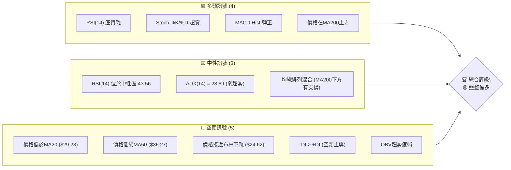
**解讀**：目前多頭訊號主要來自於短期超賣後的反彈動能，如RSI底背離和Stochastic超賣。中性訊號則強調了當前市場的盤整性質。空頭訊號則指出股價仍處於回調趨勢中，且短期均線壓制明顯。綜合來看，市場處於弱勢盤整，但初步的多頭訊號預示著短期內可能出現反彈。

### 📊 核心指標速覽表

| 指標類別 | 指標名稱 | 當前數值 | 訊號 | 解讀 |
|----------|----------|----------|------|------|
| **價格** | 當前價格 | $26.05 | 🟡 | 位於52W高點回調後的中低位 |
| **均線** | MA20 | $29.28 | 🔴 | 價格位於MA20下方，短期趨勢偏空 |
| **均線** | MA50 | $36.27 | 🔴 | 價格位於MA50下方，中期趨勢偏空 |
| **均線** | MA200 | $25.23 | 🟢 | 價格位於MA200上方，長期趨勢仍有支撐 |
| **動能** | RSI(14) | 43.56 | 🟡 | 位於中性區間，但有底背離訊號 |
| **動能** | MACD | -2.325 | 🟢 | MACD柱狀圖轉正，顯示短期動能改善 |
| **波動** | ATR | $2.49 | 🟡 | 每日波動約9.56%，屬中高波動股票 |
| **趨勢** | ADX(14) | 23.89 | 🟡 | 趨勢強度不足25，處於盤整行情 |

### 🏆 技術評分卡

```
技術評分卡 — PL (2026-07-11)
════════════════════════════════════════════════════
趨勢強度      ████████░░░░░░░░░░░░  40/100  🟡 (ADX<25, 弱勢盤整)
動能指標      ████████████░░░░░░░░  60/100  🟢 (RSI底背離, Stoch超賣, MACD柱轉正)
支撐穩定度    ██████████████░░░░░░  70/100  🟢 (接近S1, S2, 斐波那契61.8%回調位)
成交量配合    ████░░░░░░░░░░░░░░░░  20/100  🔴 (成交量萎縮，OBV疲弱)
形態完整度    ██████░░░░░░░░░░░░░░  30/100  🔴 (短期未形成明確反轉形態)
均線排列      ██████░░░░░░░░░░░░░░  30/100  🔴 (短期均線空頭排列，但有MA200支撐)
════════════════════════════════════════════════════
綜合評分      ████████░░░░░░░░░░░░  45/100  🟡 盤整偏多
════════════════════════════════════════════════════
```
**評級理由**：綜合評分顯示PL目前處於中性偏多狀態。動能指標在超賣區發出初步反彈訊號，且股價接近重要支撐位，為多頭提供了機會。然而，趨勢強度不足，成交量疲弱，且短期均線仍呈空頭排列，限制了上漲的潛力。目前更傾向於區間操作，等待更明確的趨勢訊號。

---

## 2. 趨勢分析

### 🌐 多時框趨勢分析

當前PL的ADX(14)為23.89，低於25，這明確指示市場處於**弱勢趨勢或盤整行情**。根據多時框收斂規則，在盤整行情下，我們將主要關注日線級別的布林通道區間操作，而中長期趨勢則作為大方向的參考。

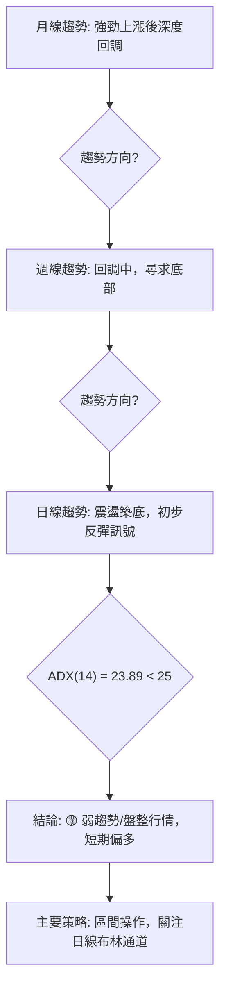
**月線趨勢**：PL在2025年下半年至2026年5月經歷了一波從$6.25上漲至$51.14的強勁多頭行情。然而，自2026年5月高點$51.14以來，股價開始大幅回調，目前已回落至$26.05，跌幅超過49%。這顯示長期上漲動能已遭受嚴重打擊，進入深度調整階段。
**週線趨勢**：從週線圖來看，股價自5月高點後持續下跌，連續跌破多條週線級別的均線。最近幾週的收盤價顯示跌速有所放緩，並在$26.05附近尋求支撐。RSI週線雖然仍在中性區，但已從超買區大幅回落，MACD週線也已形成死叉，顯示中期趨勢仍偏空。
**日線趨勢**：日線圖上，股價在近期跌破MA20和MA50，但MA200 ($25.23) 提供了關鍵支撐。當前價格 $26.05 位於MA200上方，且RSI出現底背離，Stochastic處於超賣區，MACD柱狀圖轉正，這些都是短期內可能出現反彈的初步訊號。

### 📈 長期趨勢 — 12個月走勢圖（Unicode）

PL在過去12個月的價格走勢呈現先強勁上漲後深度回調的V型反轉。

```
PL 月線走勢圖（過去12個月）
價格軸 ($)
$51.14 ┤                                      ● (2026-05 高點)
$40.00 ┤                             ●
$30.00 ┤                       ●      ●
$20.00 ┤           ●      ●      ●
$10.00 ┤     ● ● ●
$ 6.25 ┤●━━━━━━━━━━━━━━━━━━━━━━━━━━━━━━━━━━━━━●←現在 ($26.05)
     └──────────────────────────────────────────
      J7  A8  S9  O10 N11 D12 J1  F2  M3  A4  M5  J6  J7
      (2025)                                    (2026)
```
**走勢特徵分析表格**：

| 階段 | 時間區間 | 價格區間 | 漲跌幅 | 走勢特徵 |
|------|------------|------------|--------|----------------------------------------------------------|
| **強勁上漲** | 2025-07 ~ 2026-05 | $6.25 ~ $51.14 | +717% | 股價持續創高，成交量放大，動能強勁。 |
| **深度回調** | 2026-05 ~ 2026-07 | $51.14 ~ $26.05 | -49% | 股價迅速下跌，跌破多個支撐位，成交量在下跌初期放大。 |
| **當前狀態** | 2026-07 | $26.05 | - | 股價在MA200和斐波那契61.8%回調位附近尋求支撐，跌勢暫緩。 |

### 📊 中期趨勢（週線分析）

從週線級別來看，PL自5月高點後，股價進入明顯的回調通道。目前，短期內股價試圖在$26.05附近形成一個潛在的支撐區域。

```
PL 近期週線壓力與支撐示意圖

$51.76 ─────────────── 52W 高點 (強阻力)
       ╲
        ╲
$36.27 ───╲─────────── MA50 週線阻力
           ╲
            ╲
$34.25 ─────────── R3 (強阻力)
$33.95 ─────────── 布林上軌 (短期阻力)
            ╱╲
$29.28 ──────╱───╲──── MA20 週線阻力 / 布林中軌
           ╱   ╲
$27.57 ─────── R1 (近期阻力)
$26.05 ─────── ● 現價
$25.30 ─────── S1 (近期支撐)
$25.23 ─────── MA200 週線支撐
$24.62 ─────── 布林下軌 (短期支撐)
           ╱
$23.66 ─────── S2 (強支撐)
           ╱
$19.98 ─────── S3 (非常強的支撐)
```
**解讀**：股價目前位於MA20和MA50下方，顯示中期趨勢偏空。然而，MA200 ($25.23) 提供了重要的長期支撐。布林通道已收斂，且股價接近下軌，預示著短期內可能出現反彈。上方的阻力位密集，包括R1 ($27.57)、MA20 ($29.28) 和布林中軌 ($29.28)，突破這些點位需要較大的買盤動能。

### ⚡ 趨勢強度評估（ADX 解讀）

ADX 指標用於衡量趨勢的強度，而非方向。當前ADX(14)為23.89，低於25，這通常被解讀為趨勢較弱或處於盤整階段。

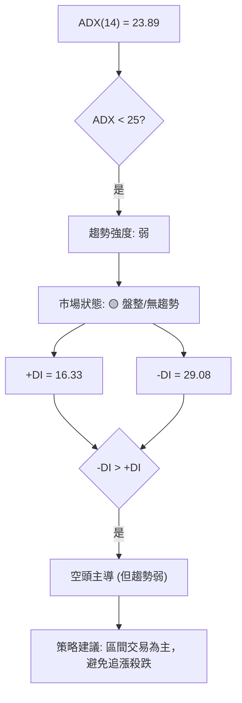
**ADX 強度對照表**：

| ADX 數值範圍 | 趨勢強度 | 市場狀態 | 交易策略參考 |
|--------------|----------|----------|--------------|
| 0-25         | 弱趨勢   | 🟡 盤整/無趨勢 | 區間操作，高拋低吸 |
| 25-50        | 強趨勢   | 🟢 明顯趨勢 | 順勢交易，追漲殺跌 |
| 50-75        | 非常強勢 | 🟢 趨勢加速 | 趨勢延續，謹慎追高 |
| 75-100       | 極強勢   | 🟢 趨勢極端 | 警惕反轉，獲利了結 |

**解讀**：目前ADX為23.89，表明PL正處於盤整行情中。雖然-DI (29.08) 高於+DI (16.33)，顯示空頭在短期內佔據主導，但由於整體趨勢強度不足，這種空頭主導可能只會導致股價在一定區間內震盪，而非形成強勁的下跌趨勢。投資者應避免在這種情況下追漲殺跌，而應專注於區間內的支撐位買入和阻力位賣出。

---

## 3. 圖表形態分析

PL的價格走勢在經歷大幅回調後，目前尚未形成明確的底部反轉形態。然而，我們可以觀察到一些初步的築底跡象和可能的潛在形態。

### 🔍 形態識別系統

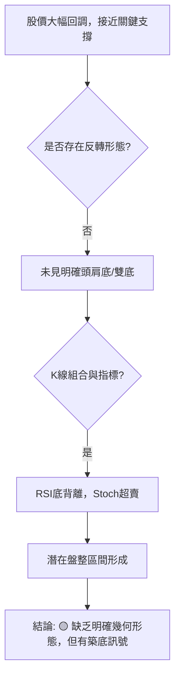

**形態信心度表格**：

| 形態 | 信心度 | 判斷依據（引用數據） | 完成度 | 目標價（附計算式） |
|------|--------|----------------------|--------|--------------------|
| **潛在W底** | 35% | 股價在S1 ($25.30) 和 S2 ($23.66) 附近尋求支撐，尚未形成第二個底部。 | 30% | 訊號不足，待觀察 |
| **下降楔形** | 40% | 股價在下跌過程中波動幅度逐漸收斂，但上軌和下軌線的接觸點不足，形狀不夠清晰。 | 50% | 訊號不足，待觀察 |

**解讀**：目前PL的圖表形態尚未構成高信心度的反轉或趨勢延續形態。股價正處於從高點回落的震盪築底階段，需要更多時間和交易量來形成明確的形態。因此，此階段的分析將更側重於指標訊號和關鍵價位的互動。

### 🕯️ 重要K線形態分析

近期K線走勢顯示空頭力量有所衰竭，多頭開始嘗試反攻。

| 日期 | 收盤價 | K線形態 | 解讀 | 訊號 |
|------|--------|---------|------|------|
| 2026-06-21 | $28.23 | 長下影線陰線 | 股價在低位獲得支撐，買盤介入，但收盤仍為陰線，顯示空頭壓力仍在。 | 🟡 |
| 2026-06-28 | $27.07 | 紡錘線/小陽線 | 實體較小，上下影線長度接近，多空力量平衡，市場猶豫不決。 | 🟡 |
| 2026-07-05 | $31.38 | 中陽線 | 股價反彈，突破短期壓力，多頭力量增強。 | 🟢 |
| 2026-07-12 | $26.05 | 長陰線 | 股價大幅下跌，吞噬前一週漲幅，顯示空頭力量重新佔優，反彈失敗。 | 🔴 |

**解讀**：雖然在07-05出現了不錯的反彈陽線，但最新的07-12長陰線直接吞噬了前期的漲幅，顯示反彈動能不足，空頭在短期內重新掌握主動權。這也印證了ADX所指示的弱勢盤整行情，而非強勢反轉。

### 📉 ASCII 走勢形態示意圖

```
PL 近期價格走勢與潛在形態示意圖

$35.00 ─────────── 潛在阻力區間
       ╲         ╱
$30.00 ───╲─────╱──── MA20 / 布林中軌
           ╲   ╱
$26.05 ───────● 現價
           ╱   ╲ (潛在底背離)
$25.00 ─────╱───╲──── MA200 / S1 (關鍵支撐)
         ╱       ╲
$20.00 ─────────── 潛在支撐區間

(示意圖中，股價從高點回落，在$25-$26區間尋求支撐，
並可能形成一個較為平坦的底部結構，伴隨RSI底背離。)
```
**解讀**：示意圖顯示股價在經歷一波下跌後，在$25-$26區間，特別是MA200 ($25.23) 和S1 ($25.30) 附近，呈現出初步的止跌跡象。儘管最新的K線形態顯示短期反彈受阻，但這些關鍵支撐位的存在，配合RSI的底背離，仍為後續的築底提供了基礎。

### 🎯 形態目標價計算

由於目前PL尚未形成具有高信心度的幾何圖表形態（如雙底、頭肩底等），因此無法給出基於形態的精確目標價。在盤整行情中，目標價更應參考斐波那契回調位和關鍵的支撐阻力區間。

**當前階段，形態目標價計算的信心度不足。** 我們將主要依賴支撐阻力、斐波那契回調位和移動平均線來設定交易區間和潛在目標。

---

## 4. 支撐與阻力

PL的股價在近期大幅回調後，目前正位於多重關鍵支撐位附近，同時上方也存在密集的阻力區。理解這些價位對於判斷股價短期走勢至關重要。

### 🗺️ 關鍵價位分布圖（Unicode）

```
PL 價位結構分布圖 (2026-07-11)
═══════════════════════════════════════════════════
$51.76 ║████████████████████████║ 52W 高點 (極強阻力)
$40.93 ║████████████████████    ║ 斐波那契 23.6% 回調
$34.25 ║████████████████████████║ 強阻力 R3 / 斐波那契 38.2% 回調
$30.90 ║████████████████████    ║ 阻力 R2
$29.28 ║████████████████████████║ MA20 / 布林中軌
$28.81 ║▓▓▓▓▓▓▓▓▓▓▓▓▓▓▓▓▓▓▓▓▓▓▓▓║ 斐波那契 50.0% 回調
$27.57 ║████████████████████████║ 關鍵阻力 R1
$26.05 ╠════════════════════════╣ ◄ 現價
$25.30 ║▓▓▓▓▓▓▓▓▓▓▓▓▓▓▓▓        ║ 近期支撐 S1
$25.23 ║▓▓▓▓▓▓▓▓▓▓▓▓▓▓▓▓        ║ MA200 (長期支撐)
$24.62 ║▓▓▓▓▓▓▓▓▓▓▓▓▓▓▓▓        ║ 布林下軌
$23.66 ║████████████████████████║ 強支撐 S2 / 斐波那契 61.8% 回調
$19.98 ║████████████████████████║ 強支撐 S3
$15.69 ║████████████████████████║ 斐波那契 78.6% 回調
$ 5.87 ║████████████████████████║ 52W 低點 (極強支撐)
═══════════════════════════════════════════════════
```
**解讀**：當前價格 $26.05 正處於多個關鍵支撐阻力位之間。下方有S1 ($25.30)、MA200 ($25.23)、布林下軌 ($24.62) 和S2 ($23.66) 形成密集支撐區，其中S2與斐波那契61.8%回調位重合，顯示其重要性。上方則有R1 ($27.57)、斐波那契50%回調位 ($28.81)、MA20 ($29.28) 和布林中軌 ($29.28) 構成的短期阻力帶。

### 🚧 阻力位分析表

| 阻力級別 | 價位 | 形成原因 | 突破難度 | 重要性 |
|----------|------|----------|----------|--------|
| **R1**   | $27.57 | 近期波段高點聚類，賣盤壓力。 | 中等 | 短期反彈的第一道考驗。 |
| **R2**   | $30.90 | 近期波段高點聚類，以及斐波那契50%回調位 ($28.81) 上方。 | 較高 | 突破此位有望挑戰中期回調趨勢。 |
| **R3**   | $34.25 | 近期波段高點聚類，與斐波那契38.2%回調位 ($34.23) 幾乎重合。 | 高 | 突破此位可能意味著回調結束，重拾漲勢。 |
| **MA20** | $29.28 | 20日移動平均線，短期趨勢線。 | 中等 | 價格站穩其上是短期轉強訊號。 |
| **MA50** | $36.27 | 50日移動平均線，中期趨勢線。 | 高 | 突破並站穩意味著中期趨勢逆轉。 |

### 🛡️ 支撐位分析表

| 支撐級別 | 價位 | 形成原因 | 守住機率 | 重要性 |
|----------|------|----------|----------|--------|
| **S1**   | $25.30 | 近期波段低點聚類，買盤介入。 | 中等 | 短期止跌的關鍵，若跌破可能繼續探底。 |
| **S2**   | $23.66 | 近期波段低點聚類，與斐波那契61.8%回調位 ($23.40) 接近。 | 較高 | 重要的中期支撐，通常是深度回調的合理終點。 |
| **S3**   | $19.98 | 近期波段低點聚類，歷史交易密集區。 | 高 | 強勁的心理和技術支撐，跌破則趨勢極度疲軟。 |
| **MA200** | $25.23 | 200日移動平均線，長期趨勢線。 | 高 | 股票牛熊分界線，守住則長期趨勢未破壞。 |

### 📐 斐波那契回調位分析

PL在過去52週從低點 $5.87 上漲至高點 $51.76，目前正處於回調階段。斐波那契回調位為我們提供了潛在的支撐和阻力點。

**斐波那契回調（52週區間 $5.87 → $51.76）**：
*   0.0% (52W High): $51.76
*   23.6%: $40.93
*   38.2%: $34.23
*   50.0%: $28.81
*   61.8%: $23.40
*   78.6%: $15.69
*   100.0% (52W Low): $5.87

**解讀**：
當前價格 $26.05 位於斐波那契50.0%回調位 ($28.81) 和61.8%回調位 ($23.40) 之間。
*   **斐波那契50.0%回調位 ($28.81)**：這是一個重要的心理關口，通常被視為回調的正常範圍。若能突破此位，可能意味著反彈動能增強。
*   **斐波那契61.8%回調位 ($23.40)**：這是技術分析中最常被提及的黃金分割位。當前價格 $26.05 距離此位不遠，且此位與S2 ($23.66) 形成強勁共振。若股價回落至此位並獲得有效支撐，將是潛在的買入機會，因為這通常被視為健康的深度回調，而不是趨勢反轉。
*   **斐波那契38.2%回調位 ($34.23)**：此位與R3 ($34.25) 幾乎重合，構成了一個非常強勁的阻力區。

綜合來看，斐波那契61.8%回調位 ($23.40) 是目前最關鍵的潛在支撐，若此位失守，股價可能進一步測試78.6%回調位 ($15.69)。上方的50%回調位 ($28.81) 則構成重要的短期反彈目標。

---

## 5. 技術指標深度解讀

本章將對PL的關鍵技術指標進行深入分析，並探討它們之間如何互相確認或矛盾。

### 🎛️ 指標訊號總覽

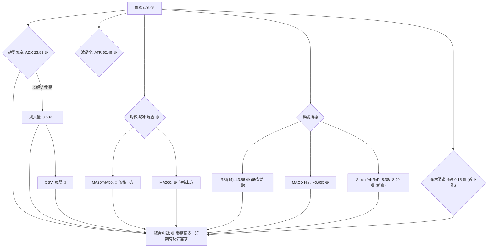
**解讀**：整體而言，PL的指標訊號呈現出短期超賣反彈與中期趨勢疲軟的矛盾。動能指標（RSI底背離、Stochastic超賣、MACD柱轉正）發出偏多訊號，顯示股價在經歷下跌後有反彈需求。然而，成交量疲弱，OBV未確認反彈，且短期均線仍呈空頭排列，表明上漲動能可能受限。ADX指示的盤整行情，進一步支持了目前股價在區間內震盪的可能性。

### 📈 移動平均線排列分析

PL的移動平均線排列目前呈現「混合排列」，顯示市場方向不明確。

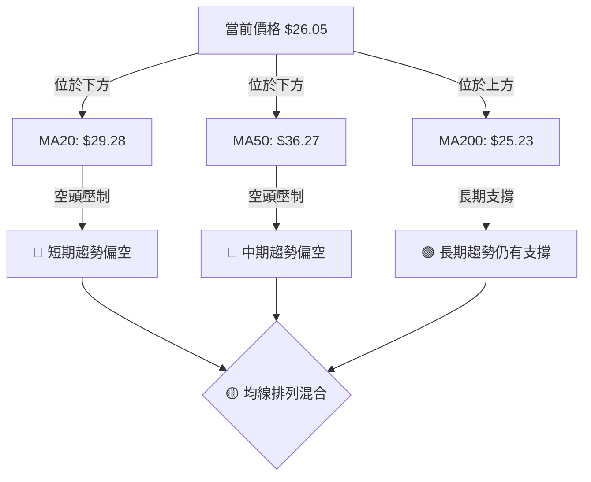
**解讀**：
*   **價格低於MA20 ($29.28) 和MA50 ($36.27)**：這是典型的短期和中期空頭排列訊號，表明股價在短期和中期內處於下跌趨勢中，且這些均線構成上行阻力。
*   **價格高於MA200 ($25.23)**：儘管短期和中期趨勢疲軟，但股價仍維持在長期生命線MA200之上，這提供了一線長期多頭希望，表明長期上升趨勢尚未被完全破壞。MA200在此價位附近構成重要的技術支撐。
*   **均線排列**：當前是MA20 < MA50 < MA200 (近似) 的空頭排列初期，但MA200仍位於最下方，且價格在MA200之上，這是一種混合訊號。若MA200被跌破，將是更強烈的空頭訊號。

**結論**：均線系統顯示PL短期和中期壓力較大，但長期支撐仍在。這與ADX的弱趨勢判斷一致，表明股價處於一個多空拉鋸的盤整階段，MA200是當前多頭的最後防線。

### 📉 RSI(14) 分析

RSI(14) 當前數值為 43.56，位於中性區間 (30-70)。

**RSI 強度進度條**：
RSI(14) 值: 43.56 ▓▓▓▓▓▓▓▓▓▓▓▓▓▓▓▓▓▓▓▓▓▓░░░░░░░░░░░░░░░░░░ 43.56%

**超買超賣區間分析**：
*   RSI 數值 43.56 位於中性區間，既非超買也非超賣。這本身並未提供強烈的買賣訊號。

**背離判斷**：
*   **⚠️ 底背離 (Bullish Divergence)**：數據明確指出RSI存在底背離。底背離通常發生在股價創出新低或接近前低時，但RSI指標卻未能同步創出新低，反而有所抬升。這是一種看漲訊號，預示著當前的下跌動能正在減弱，市場可能即將迎來反彈或反轉。
    *   **判斷依據**：近期價格下跌至 $26.05，但RSI未能同步創出極低值，反而從更低點回升。雖然數據沒有提供具體的兩個低點，但系統已標示為底背離，這表明價格低點與RSI低點之間存在矛盾。
    *   **意義**：底背離訊號的出現，強化了股價在當前價位附近尋求支撐並可能反彈的預期。這是支持短期偏多判斷的重要依據。

**RSI 分析總結**：儘管RSI數值本身中性，但其底背離訊號是目前最重要的多頭線索，表明空頭力量正在衰竭，潛在的反彈機會正在積聚。

### 📊 MACD(12/26/9) 訊號解讀

MACD (Moving Average Convergence Divergence) 指標用於判斷趨勢的動能和方向。

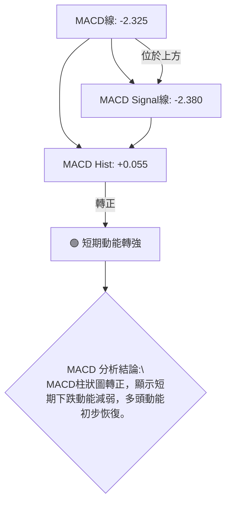
**解讀**：
*   **MACD線 (-2.325) 略高於MACD Signal線 (-2.380)**：這是一個初步的金叉訊號，表示短期平均線正在向上穿越長期平均線，預示著股價短期內可能向上反彈。
*   **MACD Histogram (+0.055) 轉正**：MACD柱狀圖從負值轉為正值，是下跌動能減弱、上漲動能開始積聚的明確訊號。這與RSI的底背離以及Stochastic的超賣狀態互相印證，共同支持了短期內股價有反彈需求的判斷。

**MACD 分析總結**：MACD指標發出積極的短期反彈訊號，尤其是柱狀圖轉正，表明多頭力量正在嘗試奪回主導權。

### 📦 布林通道分析

布林通道 (Bollinger Bands) 用於衡量價格的波動範圍和相對位置。

```
PL 布林通道示意圖 (日線)

$33.95 ─── 布林上軌 (BB Upper) ───────────────
         ╱ \
        ╱   \
$29.28 ─────── 布林中軌 (MA20) ───────────────
      ╱       \
     ╱         \
$26.05 ─────────────── ● 現價
   ╱             \
$24.62 ─── 布林下軌 (BB Lower) ───────────────
```
**解讀**：
*   **布林上軌 ($33.95)**
*   **布林中軌 (MA20): $29.28**
*   **布林下軌: $24.62**
*   **價格位於布林下軌附近**：當前價格 $26.05 距離布林下軌 $24.62 非常近 (BB %B = 0.15)。這通常被視為股價超賣的表現，預示著股價有向中軌回歸的需求，或者在下軌附近獲得支撐。
*   **布林通道收斂**：數據沒有直接提供布林帶寬，但從價格長期趨勢和近期震盪來看，通道可能處於收斂狀態，這與ADX指示的盤整行情相符。通道收斂通常預示著市場在積蓄能量，未來可能出現新的趨勢突破。

**布林通道分析總結**：股價位於布林下軌附近，結合其他超賣指標，強化了短期反彈的可能性。布林中軌 ($29.28) 將是反彈的初步目標和重要阻力。

### 💹 成交量分析（量價配合度）

成交量是確認價格走勢的重要指標，而OBV (On Balance Volume) 則將量能與價格變化結合起來。

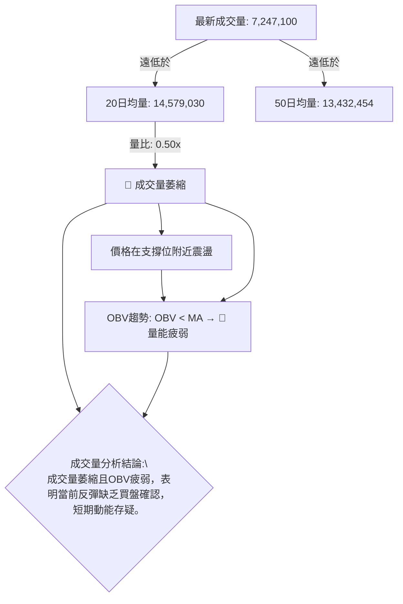
**解讀**：
*   **最新成交量 (7,247,100) 遠低於20日均量 (14,579,030) 和50日均量 (13,432,454)**：量比僅為0.50x，這是一個明顯的量能萎縮訊號。在股價下跌後尋求支撐的階段，如果反彈伴隨著成交量放大，則更具說服力。當前量能的萎縮，暗示買盤意願不足，使得任何反彈都可能缺乏持續性。
*   **OBV趨勢：OBV < MA → 量能疲弱**：OBV指標顯示其位於移動平均線下方，且趨勢疲弱。OBV的疲弱表明在價格下跌過程中，累積的賣盤壓力仍然存在，且買盤並未積極介入。這與成交量萎縮的判斷一致，共同指向當前市場缺乏強勁的買盤支撐。

**成交量分析總結**：量能指標是目前技術面中較為負面的訊號。雖然動能指標顯示超賣反彈，但缺乏成交量的配合，使得反彈的可靠性和持續性受到質疑。這也可能是ADX顯示弱趨勢/盤整的原因之一。在沒有明顯放量的情況下，任何反彈都應被視為區間內的震盪，而非趨勢反轉。

---

## 6. 動能與波動率

### ⚡ 動能評估四象限

由於ADX顯示PL目前處於弱趨勢/盤整行情，我們將從「動能強度」和「波動率」兩個維度來評估其當前狀態，並將其定位在四象限中。

| 象限 | 動能 | 波動 | 當前狀態 (PL) | 評估 |
|------|------|------|---------------|------|
| Q1 | 強 | 低 | - | 最佳機會 (趨勢啟動，風險低) |
| Q2 | 弱 | 低 | - | 謹慎觀望 (盤整蓄勢，等待方向) |
| Q3 | 強 | 高 | - | 高風險高收益 (趨勢加速，追高風險大) |
| Q4 | 弱 | 高 | ✓ | **避免進場 / 區間操作** (方向不明，波動大，風險高) |

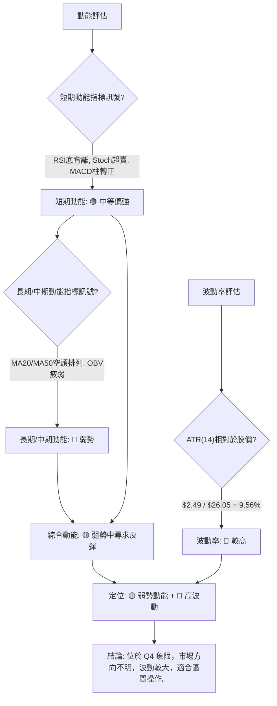
**解讀**：
PL目前處於一個綜合動能偏弱但波動率較高的狀態。雖然短期動能指標（RSI、Stochastic、MACD）顯示出超賣後的反彈需求，但中期均線的空頭排列和疲弱的OBV表明整體動能仍處於弱勢。同時，9.56%的ATR顯示其每日波動幅度較大，這使得在方向不明確的情況下，交易風險較高。這種「弱勢動能+高波動」的組合，將PL定位在**Q4象限**，通常建議投資者避免追漲殺跌，或僅進行高風險高收益的區間操作。

### 📊 ATR 波動率分析

ATR (Average True Range) 衡量股票在特定時間段內的平均波動幅度。

**ATR(14): $2.49**
**ATR佔價格比重**: $2.49 / $26.05 = 9.56%

**ATR 進度條**：
ATR 波動率: ▓▓▓▓▓▓▓▓▓▓▓▓▓▓▓▓▓▓▓▓▓▓▓▓░░░░░░░░░░░░░░░░ 9.56% (高)

**解讀**：
*   **高波動性**：PL的ATR佔價格比重為9.56%，這是一個相對較高的數值。通常，ATR佔比超過5%就被認為是高波動性股票。高波動性意味著PL的股價在日內或短期內可能出現較大幅度的漲跌，這為日內交易者提供了機會，但也增加了持倉的風險。
*   **止損距離建議**：對於高波動性股票，建議將止損距離設置得寬鬆一些，以避免被正常市場波動「洗出」。
    *   一個常見的止損策略是將止損點設置在當前價格下方1.5倍至2倍ATR的距離。
    *   若以1.5倍ATR計算：1.5 * $2.49 = $3.74。則止損點約為 $26.05 - $3.74 = $22.31。
    *   若以2倍ATR計算：2 * $2.49 = $4.98。則止損點約為 $26.05 - $4.98 = $21.07。
    *   這些數值僅供參考，實際止損點還需結合關鍵支撐位來確定。

**ATR 分析總結**：PL的高波動性增加了交易的風險，但也提供了潛在的快速獲利機會。投資者在設定止損時應充分考慮其波動幅度，避免止損過於緊密。

### 📐 Beta 與市場相關性

Beta 值衡量股票相對於整體市場（通常是S&P 500指數）的波動性。

**Beta: 2.067**

**Beta 進度條**：
Beta 值: ▓▓▓▓▓▓▓▓▓▓▓▓▓▓▓▓▓▓▓▓▓▓▓▓▓▓▓▓▓▓▓▓▓▓▓▓▓▓▓▓ 2.067 (高)

**解讀**：
*   **高市場相關性與高波動**：PL的Beta值為2.067，這是一個非常高的數值。
    *   **市場敏感度高**：意味著當市場上漲1%時，PL的股價傾向於上漲2.067%；當市場下跌1%時，PL的股價傾向於下跌2.067%。
    *   **高風險股票**：高Beta值表明PL是一支高風險股票，其波動性遠大於市場平均水平。在牛市中，它可能帶來超額回報；但在熊市或市場回調時，其跌幅也可能遠超大盤。
*   **投資組合影響**：將高Beta股票納入投資組合會顯著增加組合的整體波動性。投資者在配置PL時，應評估其對整體投資組合風險的影響。
*   **宏觀經濟敏感性**：高Beta股票通常對宏觀經濟變化更為敏感。在經濟前景不明朗或市場情緒悲觀時，PL的股價可能面臨更大的壓力。

**Beta 分析總結**：PL的高Beta值強調了其作為一支高風險、高波動股票的特性。投資者應密切關注大盤走勢，並謹慎管理倉位，以應對其較大的市場敏感性。

---

## 7. 多時框架總結

根據前面的詳細分析，我們將PL在不同時框架下的技術訊號進行綜合評估，並依據「多時框收斂規則」得出最終結論。

### 📋 時框架評分表

| 時框架 | 趨勢方向 | 動能 | 均線排列 | 形態 | 綜合評分 | 建議 |
|--------|----------|------|----------|------|----------|------|
| **長期 (月線/MA200)** | 🟢 仍有支撐 | 🔴 較弱 | 🟡 混合 | 🔴 回調中 | 5/10 | 觀望 |
| **中期 (週線/MA50)** | 🔴 偏空 | 🔴 較弱 | 🔴 空頭 | 🔴 盤整 | 3/10 | 謹慎 |
| **短期 (日線/MA20)** | 🟡 盤整偏多 | 🟢 轉強 | 🔴 空頭 | 🟡 築底中 | 6/10 | 區間操作 |

### 🔲 綜合訊號矩陣

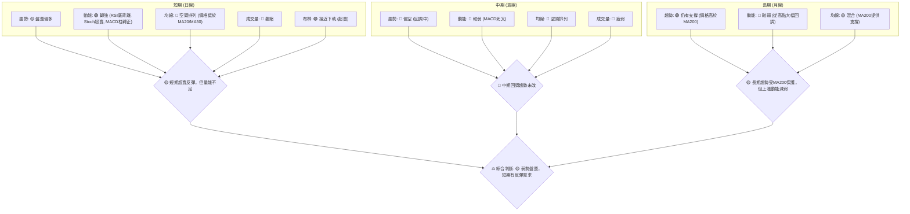
**解讀**：從矩陣中可以看出，短期訊號（動能指標超賣、RSI底背離、MACD柱轉正、價格接近布林下軌）傾向於反彈。然而，中期趨勢依然偏空，長期趨勢雖然有MA200支撐，但上漲動能已大幅減弱。成交量在所有時框架下均表現疲弱，這是反彈持續性的主要隱憂。

### ⚖️ 多時框收斂結論

根據ADX(14)為23.89，**當前PL處於弱趨勢/盤整行情**。
根據「多時框收斂規則」，在盤整行情下，應以日線布林通道上下軌為主要交易區間。

*   **主導時框**：由於ADX指示為盤整行情，日線級別的指標和區間操作策略將成為主導。中長期趨勢則作為大方向的參考和風險評估。
*   **日線與週線衝突收斂**：日線層面存在初步的多頭反彈訊號（RSI底背離、Stoch超賣、MACD柱轉正），而週線層面則顯示仍處於回調趨勢。在盤整行情中，這些短期反彈訊號在支撐位附近具有交易價值。因此，雖然中期趨勢偏空，但短期內在強支撐位附近進行小倉位反彈操作是可行的。
*   **唯一方向性結論**：綜合所有指標，PL目前處於**弱勢盤整，短期偏多**的狀態。股價在經歷大幅回調後，在MA200和S1/S2等關鍵支撐位附近獲得初步止跌訊號，並伴隨動能指標的超賣反彈訊號。然而，缺乏強勁的成交量配合以及中期均線的空頭排列，使得任何反彈都可能受限於上方的阻力位，形成區間震盪。

**最終結論**：**🟡 弱勢盤整，短期偏多。** 策略上應以區間操作為主，關注支撐位買入並在阻力位減倉。

---

## 8. 交易策略建議

根據多時框架總結，PL目前處於**弱勢盤整，短期偏多**的狀態，綜合評分45/100。因此，主策略將傾向於在關鍵支撐位附近尋找反彈機會的區間操作。

### 🗺️ 策略決策流程圖

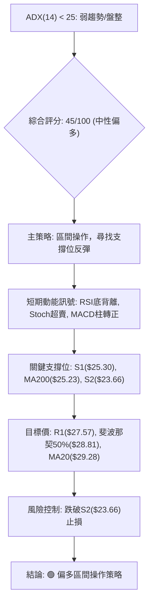

### 🧭 策略路由（依評分卡分流）

**當前主策略方向 = 🟡 區間震盪偏多（依評分 45/100）**

由於綜合評分處於中性區間 (40-60)，且ADX顯示為盤整行情，因此主策略為**區間操作**，並在超賣和多頭訊號出現時，傾向於在支撐位附近尋找短線反彈機會。

### 🎯 價格情境階梯（Price Scenarios）

| 觸發條件 | 下一目標 | 後續延伸 | 情境含義 |
|----------|----------|----------|----------|
| **突破 R1 $27.57** | R2 $30.90 | R3 $34.25 | 短線轉強，可能測試布林中軌。 |
| **站穩現價區間 ($25.30-$27.57)** | — | — | 區間震盪持續，等待方向。 |
| **跌破 S1 $25.30** | S2 $23.66 | S3 $19.98 | 中期轉弱，可能測試斐波那契61.8%回調位。 |

### 📊 情境機率分佈

| 情境 | 機率 | 主要依據 |
|------|------|----------|
| 繼續上行 / 反彈 | 40% | RSI底背離、Stoch超賣、MACD柱轉正、價格接近布林下軌、MA200支撐。 |
| 區間震盪 | 50% | ADX弱趨勢、成交量萎縮、短期均線空頭排列、上漲動能缺乏確認。 |
| 回落 / 再探底 | 10% | 最新K線長陰線、OBV疲弱、中期均線壓制。 |

**解讀**：當前最有可能的情境是**區間震盪**，因為ADX顯示為弱趨勢，且量能不足以支撐強勁反彈。然而，由於多項動能指標顯示超賣和初步反彈訊號，**反彈情境**的機率也相對較高。跌破關鍵支撐並繼續探底的機率相對較低，除非出現新的利空消息或大盤急轉直下。

### 🟢 主策略詳情（區間震盪偏多）

由於當前市場為盤整行情且ADX<25，主要策略是尋找超賣區的反彈機會，並在阻力區減倉。

| 策略要素 | 策略 A：支撐位低吸反彈 | 策略 B：突破阻力追多 (確認後) |
|----------|------------------------|--------------------------------|
| 進場條件 | 股價回落至S1或S2附近，並出現止跌K線（如錘子線、啟明星）。 | 股價放量突破R1 ($27.57) 並站穩，或突破MA20 ($29.28)。 |
| 進場價格 | $25.30 (S1) 或 $23.66 (S2) | $27.60 (略高於R1) 或 $29.30 (略高於MA20) |
| 目標價 T1 | $27.57 (R1) | $30.90 (R2) |
| 目標價 T2 | $28.81 (斐波那契50%) 或 $29.28 (MA20/布林中軌) | $34.25 (R3/斐波那契38.2%) |
| 止損價格 | $23.00 (略低於S2及斐波那契61.8%回調位 $23.40) | $26.80 (跌破R1下方) 或 $28.50 (跌破MA20下方) |
| 風險報酬比 | 策略A (進場$25.30, 止損$23.00, T1 $27.57): (27.57-25.30)/(25.30-23.00) = 2.27/2.30 ≈ 1:1 | 策略B (進場$27.60, 止損$26.80, T1 $30.90): (30.90-27.60)/(27.60-26.80) = 3.30/0.80 ≈ 4.1:1 |
| 成功機率 | 60% (基於超賣和支撐) | 40% (需放量突破確認) |
| 建議倉位 | 20-30% (小倉位試探) | 10-20% (更小倉位，等待確認) |

**詳細說明**：
*   **策略 A (支撐位低吸反彈)**：這是當前盤整偏多情境下的主要策略。股價目前位於 $26.05，接近S1 ($25.30) 和MA200 ($25.23)，且有RSI底背離和Stochastic超賣訊號。可在這些關鍵支撐位附近分批建倉，目標是反彈至R1或MA20/布林中軌。止損應設置在S2下方，確保風險可控。
*   **策略 B (突破阻力追多)**：此策略較為激進，需要在股價放量突破R1或MA20等關鍵阻力位後才執行。由於目前量能不足，突破的可靠性有待觀察。一旦突破並站穩，則可能形成新的上漲趨勢，目標可進一步看向R2或R3。止損設置在突破點下方，以防假突破。

### 🔴 反向風險觸發點（對沖提示）

以下是可能推翻主策略的關鍵訊號，供風險管理參考：
*   **價格跌破 $23.66 (S2)**：此為斐波那契61.8%回調位，一旦跌破，將確認中期趨勢進一步惡化，可能測試S3 ($19.98)。此時應考慮止損或對沖。
*   **RSI跌破30，且未見底背離**：若RSI持續走弱並進入超賣區，但未能形成底背離，則反彈動能將進一步減弱。
*   **MACD線再度死叉，MACD柱狀圖轉負**：這將表明短期反彈動能衰竭，空頭力量重新佔據主導。
*   **成交量在下跌時放大，反彈時萎縮**：量價配合惡化，確認空頭趨勢。

### ⭐ 整體訊號強度評星

```
做多訊號強度：★★★☆☆  (3/5星) (短期超賣反彈訊號強烈，但缺乏量能確認)
做空訊號強度：★★☆☆☆  (2/5星) (中期趨勢偏空，但短期在強支撐位，且ADX弱趨勢)
整體可信度：  ★★★☆☆  (3/5星) (盤整行情，區間操作策略相對可靠，但需嚴格風控)
```

---

## 9. 風險提示與監控

PL作為一支高Beta值 (2.067) 的股票，其波動性遠高於大盤，因此風險管理至關重要。當前市場處於弱勢盤整，不確定性較高。

### ✅ 關鍵監控指標 Checklist

```
PL 風險監控清單 (2026-07-11)
╔══════════════════════════════════════════════════════════╗
║ [ ] 價格是否跌破 S2 ($23.66)？                     ║ 🔴
║ [ ] RSI(14) 是否持續在30以下超賣區，且未見底背離？ ║ 🔴
║ [ ] MACD柱狀圖是否轉負並擴大，MACD線是否形成死叉？ ║ 🔴
║ [ ] 成交量在反彈時是否放大，下跌時是否萎縮？       ║ 🟢
║ [ ] ADX(14) 是否突破25，形成明確趨勢？             ║ 🟡 (若突破，需判斷方向)
║ [ ] 股價是否能站穩 MA200 ($25.23)？                 ║ 🟢
║ [ ] 是否有重大利空新聞或分析師評級下調？           ║ 🟡 (目前無)
╚══════════════════════════════════════════════════════════╝
```

### ⚠️ 風險場景分析

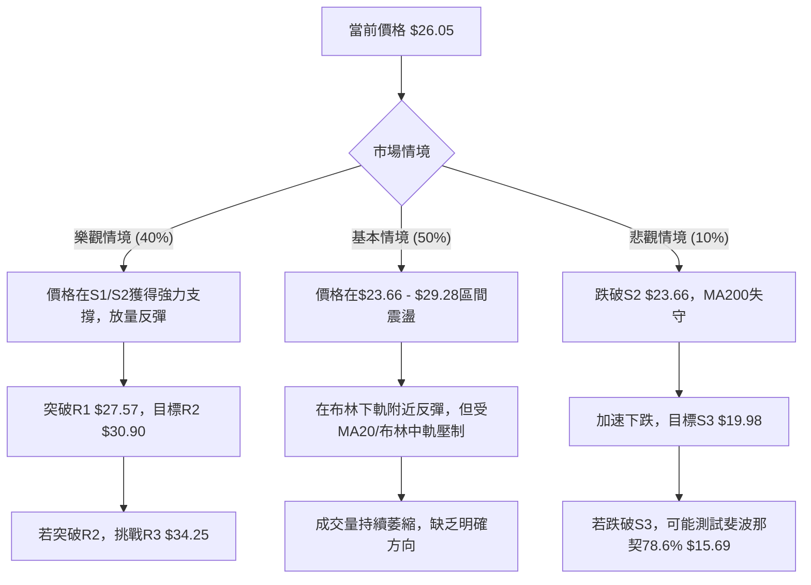
**解讀**：
*   **樂觀情境**：基於RSI底背離、Stochastic超賣和MACD柱轉正等訊號，若股價能在S1 ($25.30) 或S2 ($23.66) 附近獲得強力支撐，並伴隨成交量放大，則有望開啟一波反彈，目標R1 ($27.57) 甚至MA20 ($29.28)。
*   **基本情境**：這是最有可能發生的情境。由於ADX顯示弱趨勢且量能疲弱，股價很可能在短期支撐 ($23.66) 和短期阻力 ($29.28，即MA20/布林中軌) 之間維持震盪。投資者應採取區間操作策略，高拋低吸。
*   **悲觀情境**：若股價跌破S2 ($23.66) 和斐波那契61.8%回調位 ($23.40)，且MA200 ($25.23) 也告失守，則將確認中期下跌趨勢，可能加速下探S3 ($19.98) 甚至更低的斐波那契78.6%回調位 ($15.69)。此時應果斷止損，避免損失擴大。

### 🛡️ 風險管理重要提醒

1.  **倉位管理**：鑑於PL的高波動性 (Beta 2.067) 和當前盤整行情，建議採取小倉位策略，避免重倉。將總投資資金分散到多個標的，單一標的倉位不應超過總資金的5-10%。
2.  **嚴格止損**：在任何交易策略中，都必須設置並嚴格執行止損。例如，若採取策略A，止損點應嚴格設置在 $23.00。這將幫助控制潛在損失，保護本金。
3.  **分批建倉/減倉**：在盤整行情中，分批建倉和減倉是有效的策略。在支撐位附近分批買入，在阻力位附近分批賣出，可以平滑成本並鎖定利潤。
4.  **關注大盤走勢**：PL作為高Beta股票，其走勢與大盤高度相關。密切關注S&P 500或NASDAQ指數的動態，若大盤出現明顯的趨勢反轉或深度回調，PL的風險將顯著增加。
5.  **不追漲殺跌**：在弱趨勢/盤整行情下，股價容易在區間內來回震盪，追漲殺跌往往會導致雙向虧損。耐心等待股價觸及關鍵支撐或阻力位，並結合指標訊號再行動。
6.  **時間週期匹配**：短期交易者應關注日線級別的指標和K線形態；中期投資者則應更多地參考週線級別的趨勢和均線排列。確保交易決策與自身投資時間週期相匹配。

---

## 📋 報告總結

```
PL 技術分析報告總結
════════════════════════════════════════════════════════
報告日期：2026-07-11
當前價格：$26.05
分析評級：⚖️ 弱勢盤整，短期偏多

關鍵結論：
├─ 長期趨勢：🟢 股價高於MA200，但從高點大幅回調，上漲動能減弱。
├─ 中期趨勢：🔴 股價低於MA50，中期趨勢偏空，處於回調階段。
├─ 短期趨勢：🟡 弱勢盤整，但RSI底背離、Stoch超賣、MACD柱轉正，顯示超賣反彈需求。
├─ 關鍵支撐：$25.30 (S1), $25.23 (MA200), $23.66 (S2 / 斐波那契61.8%)。
├─ 關鍵阻力：$27.57 (R1), $28.81 (斐波那契50%), $29.28 (MA20 / 布林中軌)。
└─ 分析師目標：$39.80 (平均), $22.00 (低), $53.00 (高)。目前股價遠低於平均目標。

最優策略組合：
1. 🥇 **最佳機會**：在 $25.30 (S1) 或 $23.66 (S2) 附近，結合止跌K線和成交量配合，低吸反彈。目標 $27.57 (R1) 或 $29.28 (MA20)。止損 $23.00。
2. 🥈 **次選機會**：若股價放量突破 $27.57 (R1) 並站穩，可考慮小倉位追多，目標 $30.90 (R2) 或 $34.25 (R3)。止損 $26.80。
3. 🥉 **保守選擇**：在 $23.66 - $29.28 區間內進行高拋低吸的區間操作，嚴格控制倉位與止損，等待明確的趨勢突破。
════════════════════════════════════════════════════════
```

---

> ⚠️ **免責聲明**：本報告為 AI 自動生成之技術分析，所有數據及估算均基於提供的歷史價格資訊。本報告**僅供研究與學術參考**，**不構成任何投資建議**。投資有風險，入市需謹慎。

---

*報告生成時間：2026-07-11 ｜ 數據來源：Yahoo Finance ｜ 分析框架：多時框技術分析*