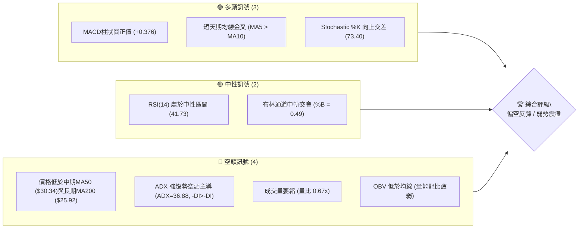
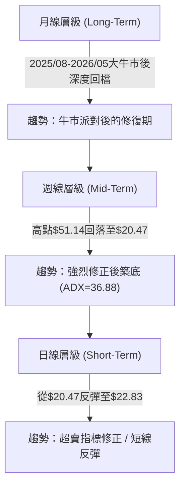
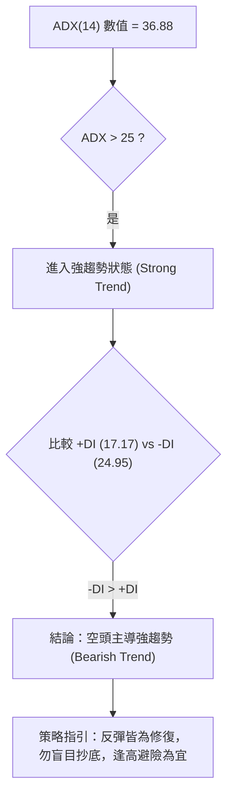
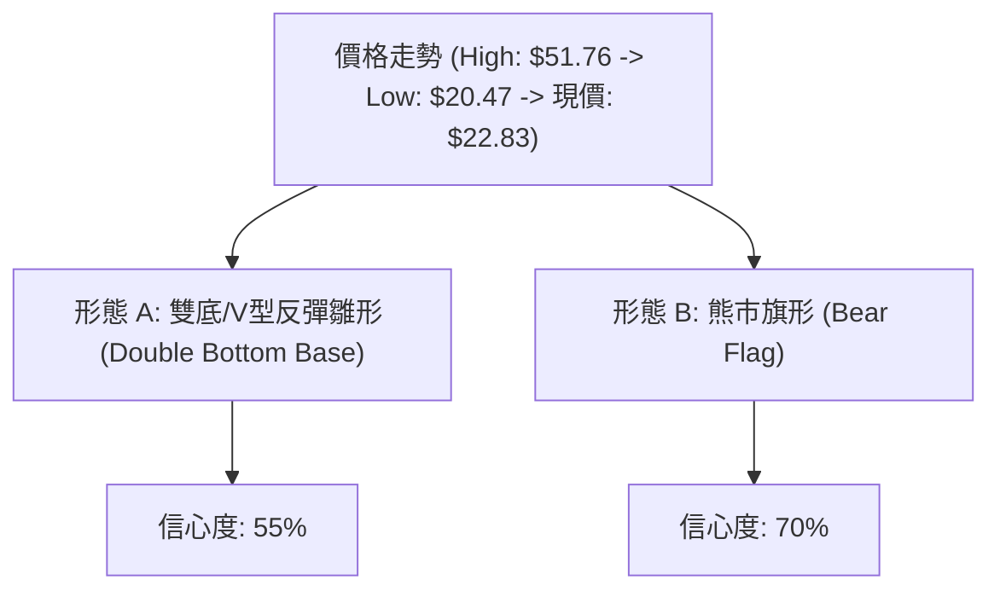
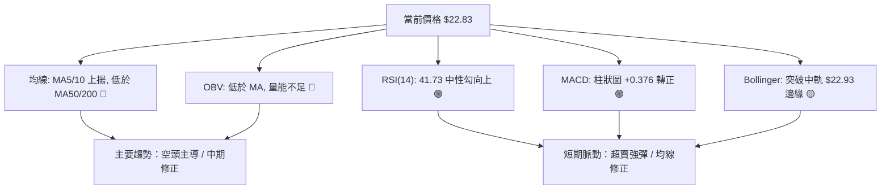
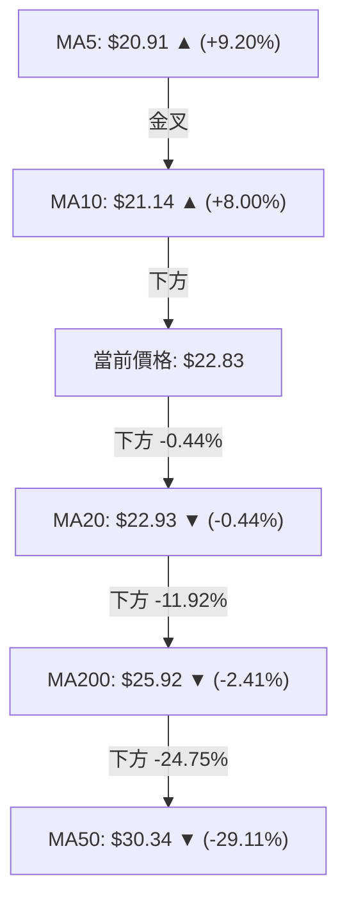
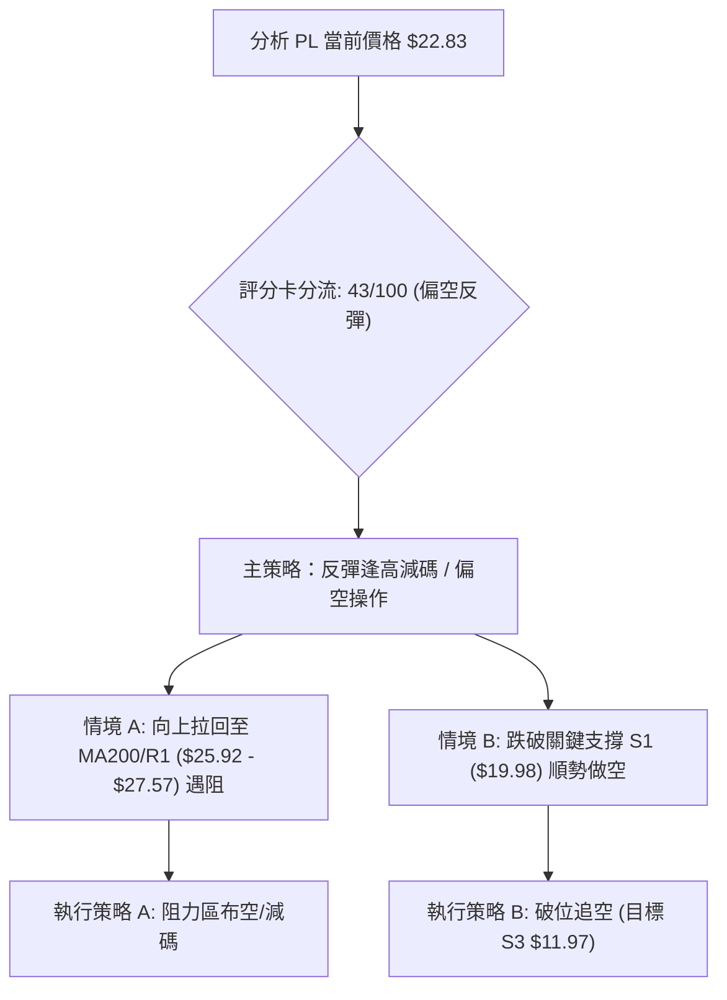
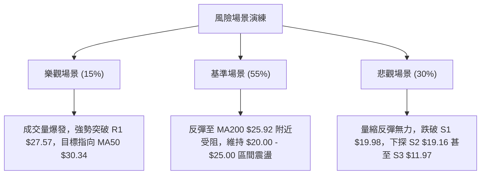

# PL 技術分析報告

> **報告日期**：2026-08-04 ｜ **語言**：繁體中文 ｜ **數據來源**：Yahoo Finance ｜ **當前價格**：$22.83

---

## 目錄

| 章節 | 內容 |
|------|------|
| [1. 技術面概覽](#1-技術面概覽) | 訊號儀表板、核心指標、評分卡 |
| [2. 趨勢分析](#2-趨勢分析) | 多時框趨勢、長中短期走勢、12個月歷程 |
| [3. 圖表形態分析](#3-圖表形態分析) | 形態識別、信心度評估、K線組合、目標價計算 |
| [4. 支撐與阻力](#4-支撐與阻力) | 關鍵價位、斐波那契回調結構 |
| [5. 技術指標深度解讀](#5-技術指標深度解讀) | MA/RSI/MACD/布林通道/成交量 |
| [6. 動能與波動率](#6-動能與波動率) | 動能矩陣、ATR、Beta與市場相關性 |
| [7. 多時框架總結](#7-多時框架總結) | 時框架評分矩陣、多時框收斂結論 |
| [8. 交易策略建議](#8-交易策略建議) | 策略路由、情境階梯、進出場位與風報比 |
| [9. 風險提示與監控](#9-風險提示與監控) | 監控指標、風險場景演練 |

---

## 1. 技術面概覽

### 🎯 技術訊號儀表板



### 📊 核心指標速覽表

| 指標類別 | 指標名稱 | 當前數值 | 訊號 | 解讀 |
|----------|----------|----------|------|------|
| **價格** | 當前價格 | $22.83 | 🟡 | 位於 52 週區間 ($6.10 - $51.76) 之 36.6% 位置 |
| **均線** | MA20 | $22.93 | 🟡 | 價格微幅低於 MA20 (-0.44%)，正進行測試 |
| **均線** | MA50 | $30.34 | 🔴 | 價格遠低於 MA50 (-24.75%)，中期趨勢偏空 |
| **均線** | MA200 | $25.92 | 🔴 | 價格低於 MA200 (-11.92%)，長期牛熊分界下方 |
| **動能** | RSI(14) | 41.73 | 🟡 | 從嚴重超賣區 (10.2) 彈升，處於中性偏弱區 |
| **動能** | MACD | -2.445 | 🟢 | 快線 (-2.445) 上穿慢線 (-2.821)，柱狀圖 (+0.376) 看多 |
| **趨勢** | ADX(14) | 36.88 | 🔴 | 強趨勢狀態，-DI (24.95) > +DI (17.17) 空頭占優 |
| **波動** | ATR(14) | $1.71 | 🟡 | 占股價 7.48%，屬高波動率標的 |
| **通道** | 布林 %B | 0.49 | 🟡 | 價格貼近中軌 $22.93，波段上下軌區間為 $17.98 - $27.88 |

### 🏆 技術評分卡

```
╔══════════════════════════════════════════════════════════════════╗
║              技術評分卡 — PL (Planet Labs) 2026-08-04            ║
╠══════════════════════════════════════════════════════════════════╣
║ 趨勢強度 (Trend)      ▓▓▓▓▓▓▓▓▓▓▓▓█░░░░░░░  65/100  🔴 (空頭強趨勢)║
║ 動能指標 (Momentum)   ▓▓▓▓▓▓▓▓█░░░░░░░░░░░  45/100  🟢 (短線反彈)  ║
║ 支撐穩定度 (Support)  ▓▓▓▓▓▓▓▓▓▓█░░░░░░░░░  50/100  🟡 (S1有效反彈)║
║ 成交量配合 (Volume)   ▓▓▓▓▓▓█░░░░░░░░░░░░░  30/100  🔴 (量縮價漲)  ║
║ 形態完整度 (Pattern)  ▓▓▓▓▓▓▓▓█░░░░░░░░░░░  40/100  🟡 (打底階段)  ║
║ 均線排列 (MA System)  ▓▓▓▓▓▓█░░░░░░░░░░░░░  30/100  🔴 (混合偏空)  ║
╠══════════════════════════════════════════════════════════════════╣
║ 綜合技術評分          ▓▓▓▓▓▓▓▓█░░░░░░░░░░░  43/100  🟡 弱勢反彈格局║
╚══════════════════════════════════════════════════════════════════╝
```

---

## 2. 趨勢分析

### 🌐 多時框趨勢分析



### 📈 長期趨勢 — 24個月走勢歷史與特徵分析

```
PL 月線歷史走勢圖（2024-08 至 2026-08）
價格軸 ($)
$55 ┤                                     ● $51.14 (2026-05)
$50 ┤                                    ██
$45 ┤                                  ██  ██
$40 ┤                                ██      ██
$35 ┤                              ██          ██
$30 ┤                            ██              ██
$25 ┤                        ● $24.97              ██      ● $22.83 (現價)
$20 ┤                    ██                          ██  ██
$15 ┤                ██  ██                            ██
$10 ┤            ██  ██
 $5 ┤    ██  ██  ██
 $0 └────┴───┴───┴───┴───┴───┴───┴───┴───┴───┴───┴───┴───┴───┴───┴───
    24/08 24/11 25/01 25/06 25/09 25/12 26/01 26/03 26/05 26/07 26/08
```

#### 走勢特徵階段分析

| 階段歷史 | 時間區間 | 收盤價區間 | 累積漲跌幅 | 主要驅動因素與技術特徵 |
|----------|----------|------------|------------|------------------------|
| **底層打底期** | 2024-08 ~ 2024-10 | $2.69 - $2.21 | -17.84% | 於 $2.20 附近沉積，極低成交量，市場關注度低 |
| **主升段起啟** | 2024-11 ~ 2025-01 | $3.93 - $6.10 | +126.76% | 突破底部，太空數據需求爆發，量能顯著放大 |
| **中期拉回築底**| 2025-02 ~ 2025-05 | $4.62 - $3.84 | -37.05% | 獲利了結賣壓，回測 $3.29 支撐後獲買盤接手 |
| **狂暴主升段** | 2025-06 ~ 2026-05 | $6.10 - $51.14| +738.36% | 營收年增達42.1%，法人大舉進場，摸頂至歷史高點 $51.76 |
| **高位估值修正**| 2026-06 ~ 2026-07 | $33.13 - $20.48| -59.95% | 高倍數P/S與P/B獲利修正，市場情緒驟冷，呈瀑布式下殺 |
| **極度超賣反彈**| 2026-08 (至今)   | $20.48 - $22.83| +11.47% | 日線與週線超賣後觸及 S1 ($19.98) 展開技術性反彈 |

### 📊 中期趨勢（週線分析）

近 20 週數據顯示，PL 在 2026 年 5 月底創下 $51.14 收盤高點（最高 $51.76）後，呈現加速無量下跌。
- **壓力區**：主要阻力位落在斐波那契 61.8% 點位 **$23.54**，以及 MA200 所在的 **$25.92** 與波段高點聚類阻力 R1 **$27.57**。
- **支撐區**：前波低點群聚於 **$19.98 (S1)** 與 **$19.16 (S2)**。近兩週價格於 $20.47 - $20.48 打底後收在 $22.83，確認短線在 S1 附近獲得支撐。

```
週線壓力與支撐結構圖
════════════════════════════════════════════════════════════
$34.25 ────────────────────────────────────── 阻力 R3 / Fib 38.2% ($34.32)
$30.90 ────────────────────────────────────── 阻力 R2 / MA50 ($30.34)
$27.57 ────────────────────────────────────── 阻力 R1 / 布林上軌 ($27.88)
$25.92 ────────────────────────────────────── MA200 牛熊分界線
$23.54 ────────────────────────────────────── Fib 61.8% 強弱分水嶺
$22.83 ══════════════════════════════════════ ◄ 當前價格
$19.98 ────────────────────────────────────── 關鍵支撐 S1
$19.16 ────────────────────────────────────── 關鍵支撐 S2
════════════════════════════════════════════════════════════
```

### ⚡ 趨勢強度評估（ADX 解讀）



| 指標項 | 數值 | 狀態 | 解讀 |
|--------|------|------|------|
| **ADX (14)** | 36.88 | 🟢 強趨勢 (>25) | 市場處於明確的趨勢行情，而非無方向性盤整 |
| **+DI (14)** | 17.17 | 🔴 弱勢 | 多頭買盤力道薄弱 |
| **-DI (14)** | 24.95 | 🔴 優勢 | 空頭賣壓仍占據主要導向 |

---

## 3. 圖表形態分析

### 🔍 形態識別系統



#### 形態評估與信心度對照表

| 形態名稱 | 信心度 | 判斷依據（引用數據） | 完成度 | 目標價計算與數值 |
|----------|--------|----------------------|--------|------------------|
| **熊市中繼旗形 (Bear Flag)** | **70%** | 經歷 $51.76 至 $20.47 之急跌旗桿，近 2 週於 $20.47 - $22.83 窄幅旗面上升 | 60% | 若跌破旗面下軌 $19.98，量測目標價為：$19.98 - ($51.76 - $20.47) = 無效值 (低於0)，修正至 S3 支撐 **$11.97** |
| **W底/雙底雛形 (Double Bottom)** | **55%** | 兩次下探 $20.47 - $20.48 形成雙重低點（接近 S1 $19.98） | 40% | 頸線為 7/5 當週高點 **$31.38**。<br/>若突破頸線，目標價 = $31.38 + ($31.38 - $19.98) = **$42.78** |

### 🕯️ 重要K線形態分析（近 5 週）

| 日期 | 收盤價 | 週K線形態 | 解讀 | 訊號 |
|------|--------|-----------|------|------|
| 2026-07-12 | $26.05 | 中陰線 | 跌破 MA200 ($25.92) 邊緣，賣壓持續 | 🔴 看空 |
| 2026-07-19 | $22.47 | 大陰線 | 破位下殺，加速尋底 | 🔴 看空 |
| 2026-07-26 | $20.47 | 錘子線 (Hammer) | RSI 低達 10.2 極致超賣，下影線帶出初步支撐 | 🟢 止跌 |
| 2026-08-02 | $20.48 | 十字星 (Doji) | 多空力量暫時平衡，賣壓耗盡 | 🟡 變盤 |
| 2026-08-09 | $22.83 | 短陽線 | 五日線 MA5 ($20.91) 止跌回升，迎來超賣反彈 | 🟢 短多 |

### 📉 ASCII 走勢形態示意圖（近期雙底與旗形演化）

```
PL 日線層級雙底雛形與旗形結構示意圖
$31.38 ┤                     ● (頸線位置 2026-07-05)
$27.57 ┤                     ┊  \
$25.92 ┤─────────────────────┼───\─── (MA200 阻力)
$23.54 ┤                     ┊    \
$22.83 ┤─────────────────────┼─────● (現價)
$20.47 ┤        ●            ┊    ● (次低點 2026-08-02)
$19.98 ┤───────(底1)─────────┼───(底2)─── (關鍵支撐 S1)
       └───────────────────────────────────────────────
             07/26               08/09
```

---

## 4. 支撐與阻力

### 🗺️ 關鍵價位分布圖

```
PL 價位結構分布圖 (由 OHLCV 與歷史數據計算)
═══════════════════════════════════════════════════════════════════
$51.76 ║████████████████████████████████████████  52W High / 0.0% Fib
$40.98 ║██████████████████████████████            Fib 23.6%
$34.25 ║██████████████████████                    阻力 R3 / Fib 38.2% ($34.32)
$30.90 ║██████████████████                        阻力 R2 / MA50 ($30.34)
$28.93 ║███████████████                           Fib 50.0%
$27.57 ║█████████████                             阻力 R1 / 布林上軌 ($27.88)
$25.92 ║███████████                               MA200 牛熊分水嶺
$23.54 ║█████████                                 Fib 61.8% 關鍵強弱位
$22.83 ╠═════════════════════════════════════════ ◄ 當前價格 $22.83
$19.98 ║▓▓▓▓▓▓▓▓                                  關鍵支撐 S1 / 近期低點
$19.16 ║▓▓▓▓▓▓▓                                   關鍵支撐 S2
$15.87 ║▓▓▓▓▓                                     Fib 78.6%
$11.97 ║▓▓                                        強支撐 S3 / 深度修正位
$06.10 ║█                                         52W Low / 100.0% Fib
═══════════════════════════════════════════════════════════════════
```

### 🚧 阻力位分析表

| 阻力級別 | 精確價位 | 形成原因 | 突破難度 | 重要性 |
|----------|----------|----------|----------|--------|
| **阻力 R1** | **$27.57** | 近一年波段高點聚類 / 接近布林上軌 ($27.88) | 🟡 中等 | 短線反彈第一壓力位 |
| **阻力 R2** | **$30.90** | 波段高點聚類 / 緊鄰 MA50 ($30.34) 與 MA60 ($32.21) | 🔴 極高 | 中期多空分水嶺，蓋頂套牢賣壓重 |
| **阻力 R3** | **$34.25** | 波段高點聚類 / 疊加 斐波那契 38.2% ($34.32) | 🔴 極高 | 解套波段重大關卡 |

### 🛡️ 支撐位分析表

| 支撐級別 | 精確價位 | 形成原因 | 守住機率 | 重要性 |
|----------|----------|----------|----------|--------|
| **支撐 S1** | **$19.98** | 近一年波段低點聚類 ($20.47-$20.48反彈點) | 🟢 高 | 短線防守核心，不容有失 |
| **支撐 S2** | **$19.16** | 近一年波段低點聚類防線 | 🟡 中等 | S1失守後的次級緩衝區 |
| **支撐 S3** | **$11.97** | 近一年深層波段低點聚類 | 🟢 極高 | 長期價值投資買盤防線 |

### 📐 斐波那契回調位分析

依據 52 週高點 **$51.76** 至 52 週低點 **$6.10** 之黃金分割回調比例：

| 斐波那契層級 | 價位 | 與現價 ($22.83) 關係 | 技術含義解讀 |
|--------------|------|----------------------|--------------|
| **0.0%** (52W High) | $51.76 | +126.72% | 歷史頂部 |
| **23.6%** | $40.98 | +79.50% | 超強多頭攻勢目標 |
| **38.2%** | $34.32 | +50.33% | 與 R3 ($34.25) 共振，強阻力區 |
| **50.0%** | $28.93 | +26.72% | 中軸位置 |
| **61.8%** | **$23.54** | **+3.11%** | **黃金分割關鍵位，現價正於其下方緊密測試** |
| **78.6%** | $15.87 | -30.49% | 深層修復防線 |
| **100.0%** (52W Low) | $6.10 | -73.28% | 起漲點底線 |

*註：現價 $22.83 處於 78.6% ($15.87) 與 61.8% ($23.54) 之間，正向上挑戰 61.8% 黃金分割關卡 $23.54。*

---

## 5. 技術指標深度解讀

### 🎛️ 指標訊號總覽



### 📈 移動平均線排列分析



- **均線排列狀態**：短天期 (MA5, MA10) 築底上揚，長天期 (MA50, MA200) 開口向下，整體屬於**「死叉後短線超賣修復之混合排列」**。
- **關鍵觀察**：現價 $22.83 距 MA20 ($22.93) 僅一步之遙。若突破 MA20，上方將直接挑戰 MA240 ($23.39) 及 MA200 ($25.92)。

### 📉 RSI(14) 分析

- **當前數值**：**41.73**
  `█▓▓▓▓▓▓▓▓▓░░░░░░░░░░ 41.73%` (中性區間 30-70)
- **歷史軌跡**：從 2026-07-26 週線極致超賣 **10.2** 急升至 2026-08-02 的 **25.6**，最新日線回升至 **41.73**。
- **背離判斷**：
  - **頂背離**：無。
  - **底背離**：**輕微隱性底背離**。價格在 $20.47 - $20.48 二度打底時，RSI 從 10.2 提升至 25.6，顯示下殺動能已大幅衰竭。

### 📊 MACD(12,26,9) 訊號解讀

- **MACD 線**：-2.445
- **Signal 線**：-2.821
- **MACD Hist**：**+0.376** 🟢（看多）
- **分析**：MACD 快線已上穿慢線形成低點金叉，柱狀圖連續由負轉正至 +0.376， confirmation 短線反彈動能仍在持續注入。

### 📦 布林通道分析

```
布林通道現況示意圖 (日線層級)
$27.88 ────────────────────────────────────── Upper Band (上軌)
$25.00 ┤                                     
$22.93 ───────────────────●────────────────── Middle Band (中軌 MA20) / 現價 $22.83
$20.00 ┤                                     
$17.98 ────────────────────────────────────── Lower Band (下軌)
```

- **通道指標**：
  - 上軌：$27.88
  - 中軌 (MA20)：$22.93
  - 下軌：$17.98
  - **%B 指標**：**0.49** (幾乎貼平中軌 0.50)
- **解讀**：價格已由下軌 $17.98 順利反彈至中軌 $22.93 附近。依布林通道規則，在中軌處將面臨方向選擇：若帶量突破中軌，目標將指向上軌 **$27.88**（與 R1 **$27.57** 重合）。

### 💹 成交量分析（量價配合度）

- **最新成交量**：5,199,433 股
- **20日均量**：7,714,127 股（**量比 0.67x**）
- **50日均量**：12,960,711 股
- **OBV 趨勢**：OBV < MA，顯示量能指標處於低位。
- **量價背離警告**：近期價格從 $20.47 反彈至 $22.83 (+11.47%)，但成交量僅 5.19M，低於 20日均量，呈現**「價漲量縮」**之量價背離現象。此現象表明本輪上漲主因是賣壓竭盡，而非強烈買盤主動追高，反彈續航力受限。

---

## 6. 動能與波動率

### ⚡ 動能評估

| 象限分區 | 動能強度 | 波動率 | 當前位置 | 評估與策略 |
|----------|----------|--------|----------|------------|
| **象限一 (Q1)** | 強 (RSI>50, MACD>0) | 低 (ATR% < 5%) | — | 最佳趨勢續漲區 |
| **象限二 (Q2)** | 弱 (RSI<50, MACD<0) | 低 (ATR% < 5%) | — | 沉悶盤整區 |
| **象限三 (Q3)** | 強 (RSI>50, MACD>0) | 高 (ATR% > 5%) | — | 高風險高收益突破區 |
| **象限四 (Q4)** | **弱 (RSI=41.73)** | **高 (ATR%=7.48%)**| **✓ (PL 當前)** | **高波動修正/反彈區：適合反彈減碼或嚴設止損之極短線操作** |

### 📊 ATR 波動率分析

- **ATR (14)**：**$1.71**
- **ATR 相對比例**：$1.71 / $22.83 = **7.48%**
- **交易應用**：
  - 日內正常波動區間：$22.83 ± $1.71 ($21.12 - $24.54)
  - 建議風控止損距離：至少 1.5 倍 ATR = $1.71 × 1.5 = **$2.57**

### 📐 Beta 與市場相關性

- **Beta**：**2.123**
- **解讀**：PL 屬於高 Beta 成長型太空航太標的，波動度為標普 500 指數的 2.12 倍。在大盤修正時回檔劇烈，但在大盤反彈時亦具備極強彈性。

---

## 7. 多時框架總結

### 📋 時框架評分表

| 時框架 | 趨勢方向 | 動能狀態 | 均線排列 | 圖表形態 | 綜合評分 | 建議策略 |
|--------|----------|----------|----------|----------|----------|----------|
| **月線 (Long)** | 🟢 多頭修復 | 🟡 中性 | 🟢 偏多 | 大幅度回檔底 | 60/100 | 逢低分批佈局 |
| **週線 (Mid)** | 🔴 深度修正 | 🔴 偏空 | 🔴 死叉向下 | 熊市旗形/打底 | 35/100 | 觀望，警惕跌破 |
| **日線 (Short)**| 🟢 弱勢反彈 | 🟢 金叉向上 | 🟡 破MA5/10 | 雙底雛形 | 50/100 | 區間極短線操作 |

### 🔲 綜合訊號矩陣

```
           短線 (日線) 🟢 反彈
               │
   🟡 觀望 ───┼─── 🟢 看多
               │
           長線 (月線) 🟢 多頭修復
               │
   [ PL 當前落點：週線偏空 (35) + 日線反彈 (50) ]
   收斂方向：偏空架構下的技術性反彈 (Bearish Correction Rebound)
```

### ⚖️ 多時框收斂結論

依據多時框收斂規則：
1. **行情性質判定**：ADX(14) = 36.88 > 25，且 -DI (24.95) > +DI (17.17)，判定當前為**「空頭主導之強趨勢行情」**。
2. **主導時框**：依規則，趨勢行情以中長期（週線/MA50 $30.34、MA200 $25.92）方向為主導。日線僅作為尋找反彈賣點或極短線進場點之輔助。
3. **最終收斂結論**：**偏空架構下的弱勢超賣反彈**。整體評分 43/100，第 8 章策略將主推「逢高避險/反彈做空」或「極短線嚴設止損反彈」，並以阻力區 R1 ($27.57) - MA200 ($25.92) 作為關鍵風控防線。

---

## 8. 交易策略建議

### 🗺️ 策略決策流程圖



### 🧭 策略路由

**當前主策略方向 = 偏空逢高避險 / 弱勢區間反彈操作（依評分 43/100）**

### 🎯 價格情境階梯 (Price Scenarios)

| 觸發條件 | 下一目標 | 後續延伸 | 情境含義 |
|----------|----------|----------|----------|
| **突破阻力 R1 $27.57** | 阻力 R2 $30.90 | 阻力 R3 $34.25 | 短線強勢反轉，扭轉空頭格局 |
| **站穩現價 $22.83** | 突破 MA200 $25.92 | 阻力 R1 $27.57 | 超賣技術修復，挑戰牛熊分界線 |
| **跌破支撐 S1 $19.98** | 支撐 S2 $19.16 | 支撐 S3 $11.97 | 熊市旗形破位，展開第二波下殺 |

### 📊 情境機率分佈

| 情境 | 機率 | 主要依據 |
|------|------|----------|
| **衝高受阻回落 (主情境)** | **55%** | ADX=36.88 空頭主導，量比僅 0.67x 價漲量縮，上方 MA200/MA50 壓力重重 |
| **區間震盪打底** | **30%** | RSI 自極端超賣區 10.2 回升至 41.73，MACD 柱狀圖轉正，S1 ($19.98) 具買盤 |
| **直接強勢V轉突破 R1** | **15%** | 缺乏利多新聞與量能配合，突破 R1 ($27.57) 機率較低 |

### 🟢 主策略詳情

#### 策略 A：高位阻力區避險/反向做空（主要策略）

| 策略要素 | 策略 A (阻力區布空) | 策略 B (破位追空) |
|----------|---------------------|-------------------|
| **進場條件** | 價格反彈至 MA200 與 R1 阻力帶出現受阻 K 線 | 每日收盤價實體跌破支撐 S1 ($19.98) |
| **進場價格** | **$25.92** (MA200 附近) | **$19.80** (確認跌破 $19.98) |
| **目標價 T1** | **$22.83** (現價區間) | **$16.00** (接近 Fib 78.6% $15.87) |
| **目標價 T2** | **$19.98** (支撐 S1) | **$11.97** (強支撐 S3) |
| **止損價格** | **$27.57** (阻力 R1 上緣) | **$21.50** (假突破/反抽止損) |
| **風險報酬比** | **(25.92 - 19.98) / (27.57 - 25.92) = 3.60 : 1** | **(19.80 - 11.97) / (21.50 - 19.80) = 4.61 : 1** |
| **勝率估計** | 60% | 55% |
| **建議倉位** | 10% - 15% | 10% |

#### 策略 C：極短線多頭反彈操作（次要/保守策略）

- **進場價格**：現價 **$22.83** 或拉回至 **$21.50**
- **目標價 T1**：**$25.92** (MA200) ｜ **目標價 T2**：**$27.57** (R1)
- **止損價格**：**$19.98** (跌破 S1 嚴格執行止損)
- **風報比**：(25.92 - 22.83) / (22.83 - 19.98) = **1.08 : 1**（風報比偏低，僅適合極短線快進快出）

### 🔴 反向風險觸發點（對沖提示）

- **多頭停損/反轉觸發點**：若日線收盤價帶量突破 **$27.57 (R1)** 且成交量達 12M 以上（超過 50 日均量），則空頭主導格局宣告失靈，應立即平倉所有空頭部位並轉為看多。

### ⭐ 整體訊號強度評星

```
做多訊號強度：★★☆☆☆  (2/5星 - 短線超賣反彈)
做空訊號強度：★★──────  (3.5/5星 - 中期趨勢偏空)
整體可信度：  ★★★☆☆  (3/5星 - 需關注量能是否補齊)
```

---

## 9. 風險提示與監控

### ✅ 關鍵監控指標 Checklist

```
╔══════════════════════════════════════════════════════════════════╗
║                   PL 技術面每日關鍵監控清單                     ║
╠══════════════════════════════════════════════════════════════════╣
║ [ ] 價格是否跌破 S1 ($19.98) 支撐關卡                          ║
║ [ ] 成交量是否放大至 20日均量 (7.71M) 以上                     ║
║ [ ] MACD 柱狀圖 (+0.376) 是否能持續擴大而非收窄                ║
║ [ ] RSI(14) 是否能順利突破 50 中性分水嶺                       ║
║ [ ] 價格向上挑戰 MA200 ($25.92) 時的量價反應                    ║
╚══════════════════════════════════════════════════════════════════╝
```

### ⚠️ 風險場景分析



### 🛡️ 風險管理重要提醒

1. **高 Beta 波動風險**：PL Beta 達 2.123，ATR 佔股價 7.48%，單日價格波動經常超過 5%-8%，部位規模不宜超過總資金之 15%。
2. **量價背離風險**：當前反彈量比僅 0.67x，無量上漲易遭逢高拋售，追高風險極大。
3. **估值與基本面面**：Forward P/E 高達 6855.85，Operating Margin 為 -30.5%，屬於高估值修正期，技術面反彈需時刻留意基本面賣壓重現。

---

## 📋 報告總結

```
╔══════════════════════════════════════════════════════════════════╗
║                     PL 技術分析報告總結                          ║
╠══════════════════════════════════════════════════════════════════╣
║ 報告日期：2026-08-04                                             ║
║ 當前價格：$22.83                                                 ║
║ 分析評級：🟡 弱勢超賣反彈 / 中期偏空架構 (技術評分: 43/100)        ║
║                                                                  ║
║ 關鍵結論：                                                       ║
║ ├─ 長期趨勢：🟢 多頭修正 (歷史高點 $51.76 回落後之修復期)         ║
║ ├─ 中期趨勢：🔴 偏空主導 (ADX=36.88, 低於 MA50 $30.34 與 MA200)    ║
║ ├─ 短期趨勢：🟢 超賣反彈 (RSI 自 10.2 回升至 41.73, MACD 金叉)    ║
║ ├─ 關鍵支撐：$19.98 (S1) / $19.16 (S2) / $11.97 (S3)             ║
║ ├─ 關鍵阻力：$23.54 (Fib 61.8%) / $25.92 (MA200) / $27.57 (R1)   ║
║ └─ 分析師共識目標價：$40.10 (Mean) / $25.00 (Low)               ║
║                                                                  ║
║ 最優策略組合：                                                   ║
║ 1. 🥇 主策略：反彈至阻力區 $25.92 - $27.57 逢高佈局避險/做空       ║
║ 2. 🥈 次策略：跌破 S1 ($19.98) 順勢做空，目標下看 S3 ($11.97)     ║
║ 3. 🥉 保守選擇：等待價格帶量突破 R1 ($27.57) 確認轉強後再行做多  ║
╚══════════════════════════════════════════════════════════════════╝
```

---

> ⚠️ **免責聲明**：本報告為 AI 自動生成之技術分析，所有數據及估算均基於提供的歷史價格資訊。本報告**僅供研究與學術參考**，**不構成任何投資建議**。投資有風險，入市需謹慎。

*報告生成時間：2026-08-04 ｜ 數據來源：Yahoo Finance ｜ 分析框架：多時框技術分析*