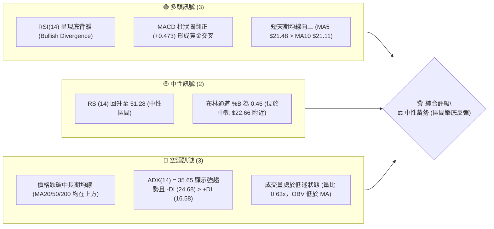
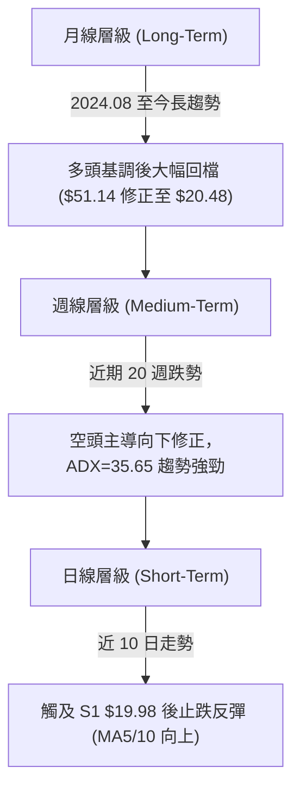
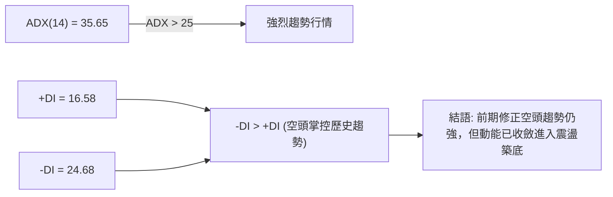
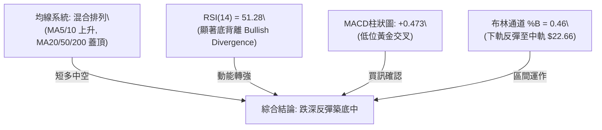
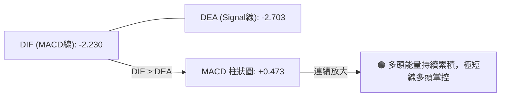
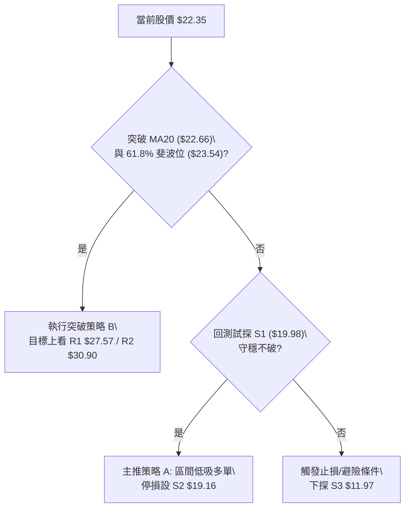
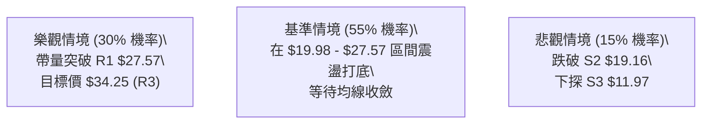

# PL 技術分析報告

> **報告日期**：2026-08-05 ｜ **語言**：繁體中文 ｜ **數據來源**：Yahoo Finance ｜ **當前價格**：$22.35

---

## 目錄

| 章節 | 內容 |
|------|------|
| [1. 技術面概覽](#1-技術面概覽) | 訊號儀表板、核心指標、評分卡 |
| [2. 趨勢分析](#2-趨勢分析) | 多時框趨勢、長中短期走勢 |
| [3. 圖表形態分析](#3-圖表形態分析) | 形態識別、K線組合、目標價 |
| [4. 支撐與阻力](#4-支撐與阻力) | 關鍵價位、斐波那契回調 |
| [5. 技術指標深度解讀](#5-技術指標深度解讀) | MA/RSI/MACD/布林/成交量 |
| [6. 動能與波動率](#6-動能與波動率) | 動能評估、ATR、Beta |
| [7. 多時框架總結](#7-多時框架總結) | 時框架評分矩陣 |
| [8. 交易策略建議](#8-交易策略建議) | 多空策略、風險報酬比 |
| [9. 風險提示與監控](#9-風險提示與監控) | 監控指標、風險場景 |

---

## 1. 技術面概覽

### 🎯 技術訊號儀表板



### 📊 核心指標速覽表

| 指標類別 | 指標名稱 | 當前數值 | 訊號 | 解讀 |
|----------|----------|----------|------|------|
| **價格** | 當前價格 | $22.35 | 🟡 中性 | 位於 52 週區間 $6.10 - $51.76 之 35.6% 分位 |
| **均線** | MA20 | $22.66 | 🔴 空頭 | 價格位於 MA20 下方 (-1.37%)，面臨近場壓力 |
| **均線** | MA50 | $29.90 | 🔴 空頭 | 價格顯著低於中長期 MA50 (-25.25%) |
| **均線** | MA200 | $25.97 | 🔴 空頭 | 價格低於長期年線 MA200 (-13.94%) |
| **動能** | RSI(14) | 51.28 | 🟢 多頭 | 從超賣區反彈，且日/週線顯現底部背離 |
| **動能** | MACD | -2.230 | 🟢 多頭 | 雙線在零軸下，但柱狀圖 (+0.473) 連續擴大 |
| **波動** | ATR(14) | $1.54 | 🟡 中性 | 日波動率 6.90%，屬於中高波動範疇 |

### 🏆 技術評分卡

```
╔══════════════════════════════════════════════════════════════╗
║              技術評分卡 — PL (2026-08-05)                   ║
╠══════════════════════════════════════════════════════════════╣
║ 趨勢強度 (ADX)     ████████░░░░░░░░░░░░  40/100  🔴 空頭主導 ║
║ 動能指標 (RSI/MACD)████████████░░░░░░░░  60/100  🟢 底背離反彈 ║
║ 支撐穩定度 (S1/S2) █████████████░░░░░░░  65/100  🟢 19.98守穩 ║
║ 成交量配合 (OBV)   ██████░░░░░░░░░░░░░░  30/100  🔴 量能萎縮   ║
║ 形態完整度 (W底)   ██████████░░░░░░░░░░  50/100  🟡 築底雛形   ║
║ 均線排列 (MA5-200) ███████░░░░░░░░░░░░░  35/100  🔴 蓋頂修正   ║
╠══════════════════════════════════════════════════════════════╣
║ 綜合評分           █████████░░░░░░░░░░░  47/100  ⚖️ 中性觀望 ║
╚══════════════════════════════════════════════════════════════╝
```

---

## 2. 趨勢分析

### 🌐 多時框趨勢分析



### 📈 長期趨勢 — 24個月走勢圖（Unicode）

```
PL 歷史收盤價走勢圖（24 個月）
價格軸 ($)
$51.76 ┤                                     ● (52W High $51.76)
$45.00 ┤                                    ██
$35.00 ┤                                   ████ 
$25.00 ┤                             ██   ██████       ● 現在 ($22.35)
$15.00 ┤                        ██  ████ ████████     ██
$6.10  ┤  ● (低點 $2.21)  ██   ████████████████████   ██ 
       └────────────────────────────────────────────────────────
         24-08 24-11 25-01 25-06 25-09 25-12 26-03 26-05 26-07 26-08
```

#### 走勢特徵分析表格

| 時間階段 | 價格區間 | 變動幅度和特徵 | 技術面解讀 |
|----------|----------|----------------|------------|
| **2024-08 ~ 2024-10** | $2.69 ➔ $2.21 | 橫盤築底 (-17.8%) | 歷史低檔打底階段 |
| **2024-11 ~ 2025-01** | $3.93 ➔ $6.10 | 強勢拉升 (+126.8%) | 第一波主升段啟動 |
| **2025-02 ~ 2025-05** | $4.62 ➔ $3.84 | 中途回檔修正 (-37.0%) | 籌碼沉澱，守穩 MA200 |
| **2025-06 ~ 2026-05** | $6.10 ➔ $51.14 | 狂暴主升段 (+738.4%) | 創下 52 週歷史高點 $51.76 |
| **2026-06 ~ 2026-07** | $33.13 ➔ $20.48| 劇烈拉回 (-60.0%) | 獲利了結賣壓暴籠，ADX 升至 35.65 |
| **2026-08 (當前)**    | $20.48 ➔ $22.35| 止跌彈升 (+9.13%) | 於 S1 $19.98 上方築底反彈 |

### 📊 中期趨勢（週線分析）

週線角度顯示，PL 自 2026 年 5 月高位 $51.14 回落後，連續 8 週大幅下探，最低於 2026-07-26 當週收在 $20.47。然而，近兩週（2026-08-02 與 08-09 週）收盤價分別為 $20.48 與 $22.35，RSI 自 10.2 顯著回升至 51.3，且 MACD 柱狀圖由 -0.176 翻正至 +0.473，展現強烈的中期跌深反彈與打底跡象。

### ⚡ 趨勢強度評估（ADX 解讀）



| ADX 指標範圍 | 當前數值 | 狀態評估 | 操作含義 |
|--------------|----------|----------|----------|
| < 20 | — | 弱趨勢 / 盤整 | 適合網格/通道交易 |
| 20 - 25 | — | 趨勢形成中 | 尋求突破訊號 |
| **> 25** | **35.65** | **強趨勢 (跌勢放緩)** | **空頭掌控力道減弱，留意反轉** |

---

## 3. 圖表形態分析

### 🔍 形態識別系統

| 形態名稱 | 信心度 (%) | 判斷依據（引用數據） | 完成度 | 目標價（附計算式） |
|----------|------------|----------------------|--------|--------------------|
| **潛在雙底 (W-Bottom)** | **58%** | 兩次下探支撐區 S1 ($19.98) / S2 ($19.16)，07/26 低點 $20.47 未跌破 S1 | 45% | 頸線 R1 ($27.57) + 形態高度 ($27.57 - $19.98 = $7.59) = **$35.16** |
| **布林通道中軌突破嘗試** | **75%** | 現價 $22.35 逼近 BB 中軌 $22.66，MA5/10 黃金交叉 | 70% | 突破中軌後目標看至 BB 上軌 **$27.07** |

*註：若雙底頸線 $27.57 未有效突破，則形態不成立，將繼續維持區間盤整。*

### 🕯️ 重要K線形態分析

| 日期/週別 | 收盤價 | K線形態 | 解讀 | 訊號 |
|-----------|--------|---------|------|------|
| **2026-07-26** | $20.47 | 長下影小陰線 | RSI 觸及 10.2 極致超賣，賣壓耗盡 | 🟢 止跌 |
| **2026-08-02** | $20.48 | 十字星 (Doji) | 多空力量達成暫時平衡，進入打底 | 🟡 觀望 |
| **2026-08-09** | $22.35 | 中陽線 (實體推進) | 多頭發力，收復 MA5 ($21.48) 與 MA10 ($21.11) | 🟢 買訊 |

### 📉 ASCII 走勢形態示意圖

```
PL 雙底 (W-Bottom) 築底形態示意圖
============================================================
$27.57 ┤───────────────────────────● 頸線 (R1 $27.57)
       │                          / \
$24.00 ┤                         /   \
$22.35 ┤───────────● (現價 $22.35)   \
       │          / \               \
$20.47 ┤  ● (左腳 $20.47)  ● (右腳 $20.48)
       └────────────────────────────────────────────────────
         2026-06    2026-07    2026-08
============================================================
```

### 🎯 形態目標價計算

根據雙底形態推算邏輯：
1. **右底支撐處**：S1 = $19.98（實際測得低點 $20.47）
2. **頸線阻力位**：R1 = $27.57
3. **形態高度** = $27.57 - $19.98 = $7.59
4. **理論突破目標價** = $27.57 + $7.59 = **$35.16**（與 52 週斐波那契 38.2% 回調位 **$34.32** 及阻力位 R3 **$34.25** 極度接近，具備高度技術面收斂共振）。

---

## 4. 支撐與阻力

### 🗺️ 關鍵價位分布圖（Unicode）

```
PL 價位結構分布圖
═══════════════════════════════════════════════════════════
$34.25 ║████████████████████████████████║ 強阻力 R3 (斐波 38.2% $34.32)
$30.90 ║████████████████████████        ║ 中阻力 R2 (MA50 $29.90 附近)
$27.57 ║████████████████                ║ 關鍵頸線阻力 R1 (BB上軌 $27.07)
$23.54 ║▓▓▓▓▓▓▓▓▓▓▓▓▓▓▓▓▓▓▓▓            ║ 斐波那契 61.8% 重要壓制線
$22.35 ╠════════════════════════════════╣ ◄ 當前價格 ($22.35)
$19.98 ║████████████████                ║ 第一關鍵支撐 S1 (近期波段低點)
$19.16 ║████████████                    ║ 第二強支撐 S2 (波段防守點)
$15.87 ║████████                        ║ 斐波那契 78.6% 極限支撐
$11.97 ║████                            ║ 長期強支撐 S3
═══════════════════════════════════════════════════════════
```

### 🚧 阻力位分析表

| 阻力級別 | 價位 | 形成原因 | 突破難度 | 重要性 |
|----------|------|----------|----------|--------|
| **R1** | **$27.57** | 近一年波段高點聚類、BB 上軌 ($27.07) 附近 | █ █ █ ░ ░ (中等) | ★★★★☆ 關鍵頸線 |
| **R2** | **$30.90** | 波段高點區間、MA50 ($29.90) 與 MA60 ($31.93) 蓋頂 | █ █ █ █ ░ (偏難) | ★★★★☆ 中期解套賣壓 |
| **R3** | **$34.25** | 近一年高點聚類、斐波那契 38.2% ($34.32) | █ █ █ █ █ (極難) | ★★★★★ 多頭波段極限 |

### 🛡️ 支撐位分析表

| 支撐級別 | 價位 | 形成原因 | 守住機率 | 重要性 |
|----------|------|----------|----------|--------|
| **S1** | **$19.98** | 近一年波段低點聚類，近兩週回測試探不破 | █ █ █ █ ░ (高) | ★★★★★ 短線防禦關鍵 |
| **S2** | **$19.16** | 波段防守低點聚類 | █ █ █ █ ░ (高) | ★★★★☆ 止損防守最後線 |
| **S3** | **$11.97** | 歷史中期起漲聚類區間 | █ █ █ █ █ (極高) | ★★★☆☆ 長期結構底線 |

### 📐 斐波那契回調位分析

依據 52 週區間（低點 **$6.10** ➔ 高點 **$51.76**）計算之回調位：

| 斐波那契比例 | 精確價位 | 與當前價差距 | 技術意義與解讀 |
|--------------|----------|--------------|----------------|
| **0.0%** | $51.76 | +131.59% | 52 週歷史高點 |
| **23.6%** | $40.98 | +83.36% | 高檔強勢防守位 |
| **38.2%** | $34.32 | +53.56% | 中期多空分界點 (與 R3 $34.25 重疊) |
| **50.0%** | $28.93 | +29.44% | 中途心理關卡 |
| **61.8%** | **$23.54** | **+5.32%** | **黃金分割關鍵阻力（現價 $22.35 正受壓於此）** |
| **78.6%** | $15.87 | -29.00% | 深幅回調防禦線 |
| **100.0%** | $6.10 | -72.71% | 52 週歷史低點 |

*當前位置解讀：現價 $22.35 落在 78.6% ($15.87) 與 61.8% ($23.54) 之間，多頭首要任務為跨越 $23.54 黃金分割位。*

---

## 5. 技術指標深度解讀

### 🎛️ 指標訊號總覽



### 📈 移動平均線排列分析

| 均線名稱 | 當前價位 | 與現價差距 | 趨勢方向 | 訊號 |
|----------|----------|------------|----------|------|
| **MA5** | $21.48 | +4.04% | ▲ 向上 | 🟢 短線支撐 |
| **MA10** | $21.11 | +5.86% | ▲ 向上 | 🟢 短線黃金交叉 |
| **MA20** | $22.66 | -1.37% | ▼ 向下 | 🔴 短線第一阻力 |
| **MA50** | $29.90 | -25.25% | ▼ 向下 | 🔴 中期蓋頂壓制 |
| **MA200** | $25.97 | -13.94% | ▼ 向下 | 🔴 長期走勢轉弱 |

### 📉 RSI(14) 分析

當前 RSI(14) 數值：**51.28**
```
RSI(14) 強度進度條：
[0] ░░░░░░░░░░░░░░░░░████████████████████░░░░░░░░░░░░░░░░░░ [100]
                   (40)      51.28      (70)
```

- **超買超賣判斷**：從 7 月下旬極致超賣區（RSI 10.2）急速拉回至 51.28 中性偏多區間。
- **背離分析**：**⚠️ 明確底背離 (Bullish Divergence)**。價格於 7 月底破底降至 $20.47，但 RSI 率先見底向上攀升，顯示賣壓急劇耗盡，為經典反彈訊號。

### 📊 MACD(12,26,9) 訊號解讀



### 📦 布林通道分析

```
布林通道現況示意圖 (BB %B = 0.46)
============================================================
$27.07 ┤────────────────────────────── 上軌 ($27.07)
       │
$22.66 ┤────────────────────────────── 中軌 (MA20 $22.66)
$22.35 ┤───────────● (現價 $22.35)
       │
$18.26 ┤────────────────────────────── 下軌 ($18.26)
============================================================
```

現價 $22.35 位於下軌 ($18.26) 與中軌 ($22.66) 之間。布林帶寬度適中，價格正向上測試中軌壓制。

### 💹 成交量分析（量價配合度）

- **最新成交量**：4,772,464 股
- **20日均量**：7,534,198 股（**量比 0.63x**）
- **OBV 趨勢**：OBV < MA，顯示法人與大戶尚未大舉追價進場，此波反彈暫定為「無量技術性抽離超賣區」。若要有效突破 R1 ($27.57)，日成交量必須放大至 1,280 萬股（50日均量）以上。

---

## 6. 動能與波動率

### ⚡ 動能評估

| 象限 | 動能強度 | 波動率 | 當前狀態 | 綜合評估 |
|------|----------|--------|----------|----------|
| **Q1** | 強 | 低 | — | 最佳趨勢續強 |
| **Q2** | 弱 | 低 | — | 沉悶橫盤 |
| **Q3** | 強 | 高 | — | 高風險擴散 |
| **Q4 (當前)** | **弱 (OBV低)** | **高 (ATR 6.9%)** | **✓** | **跌深築底反彈，需防震盪** |

### 📊 ATR 波動率分析

- **ATR(14)**：**$1.54**（佔股價 **6.90%**）
- **止損距離建議**：
  - 緊密止損 (1.0x ATR)：$1.54
  - 標準止損 (1.5x ATR)：$2.31
  - 寬鬆止損 (2.0x ATR)：$3.08

### 📐 Beta 與市場相關性

- **Beta 係數**：**2.123**
- **解讀**：PL 為高 Beta 成長型航太國防/地緣數據股，波動度大幅高於大盤（大盤波動 1%，PL 理論波動 2.12%），適合波段操作，但不宜無止損長期硬扛。

---

## 7. 多時框架總結

### 📋 時框架評分表

| 時框架 | 趨勢方向 | 動能 | 均線排列 | 形態 | 綜合評分 | 建議 |
|--------|----------|------|----------|------|----------|------|
| **日線 (Short)** | 🟢 向上反彈 | 🟢 RSI底背離 / MACD綠柱 | 🟡 MA5/10金叉，受制MA20 | 🟢 雙底打底中 | **55/100** | 短線偏多，逢低佈局 |
| **週線 (Medium)**| 🔴 下行修正 | 🟡 底背離初現 | 🔴 全數蓋頂向下 | 🟡 止跌十字星 | **42/100** | 中期區間，觀望突破 |
| **月線 (Long)**  | 🟡 大幅回檔 | 🔴 漲多修正 | 🟡 混合排列 | 🔴 高檔大陰線 | **45/100** | 長期尋求底部支撐 |

### 🔲 綜合訊號矩陣

```
       短線 (日線)    中線 (週線)    長線 (月線)
趨勢：   🟢 反彈        🔴 修正        🟡 回檔
動能：   🟢 強勁        🟡 復甦        🔴 減弱
均線：   🟡 築底        🔴 蓋頂        🟡 混合
```

### ⚖️ 多時框收斂結論

依據多時框收斂規則：ADX = 35.65 (>25)，顯示中長期仍受到前期從 $51.14 下殺的空頭慣性影響；但日線層級展現極具說服力的 **RSI 底背離** 與 **MACD 黃金交叉**，且於 S1 ($19.98) 展現強烈買盤支撐。

**唯一收斂結論**：**中性偏多築底 (區間下軌彈升，蓄勢挑戰 MA20 $22.66 與 61.8% 斐波位 $23.54)**。

---

## 8. 交易策略建議

### 🗺️ 策略決策流程圖



### 🧭 策略路由

> **當前主策略方向 = 區間低吸 / 突破加碼多頭策略（依評分 47/100 中性偏多築底分流）**

### 🎯 價格情境階梯 (Price Scenarios)

| 觸發條件 | 下一目標 | 後續延伸 | 情境含義 |
|----------|----------|----------|----------|
| **突破 R1 $27.57** | R2 $30.90 | R3 $34.25 | 雙底形態確立，中期趨勢翻多 |
| **突破 61.8% ($23.54)**| R1 $27.57 | R2 $30.90 | 短線轉強，封閉下行跳空缺口 |
| **站穩現價區間** | $23.54 | $27.57 | 築底沉澱，消化賣壓 |
| **跌破 S1 $19.98** | S2 $19.16 | S3 $11.97 | 反彈失敗，二次探底 |

### 📊 情境機率分佈

| 情境 | 機率 | 主要依據 |
|------|------|----------|
| **區間反彈 / 突破上試** | **50%** | RSI 明確底背離、MACD 柱狀圖翻正、S1 支撐強勁 |
| **區間橫盤震盪** | **35%** | 成交量偏低 (量比 0.63x)、ADX(35.65) 空頭慣性尚待時間消化 |
| **破位回落再探底** | **15%** | MA20/50/200 蓋頂壓制、大盤整體回檔風險 |

### 🟢 主策略詳情

| 策略要素 | 策略 A（當前位置區間低吸） | 策略 B（突破 $23.54 確認加碼） |
|----------|----------------------------|----------------------------------|
| **策略類型** | 跌深反彈 / 區間低吸 | 關鍵價位突破追強 |
| **進場條件** | 現價附近或回測 $21.50 附近 | 帶量突破 61.8% 斐波位 $23.54 |
| **進場價格** | **$22.35** | **$23.60** |
| **目標價 T1**| **$27.57** (R1 阻力 / 頸線) | **$27.57** (R1 阻力) |
| **目標價 T2**| **$30.90** (R2 阻力 / MA50) | **$34.25** (R3 阻力 / 雙底目標) |
| **止損價格** | **$19.16** (跌破 S2 止損) | **$21.48** (跌破 MA5 止損) |
| **風險報酬比**| **1.64 : 1** (至T1) / **2.68 : 1** (至T2) | **1.87 : 1** (至T1) / **5.02 : 1** (至T2) |
| **成功機率** | **55%** | **65%** |
| **建議倉位** | **10% - 15%** (輕倉試錯) | **15% - 20%** (確認後加碼) |

*計算式範例 (策略 A 至 T1)：*
- 潛在獲利 = $27.57 - $22.35 = $5.22
- 潛在風險 = $22.35 - $19.16 = $3.19
- 風報比 = $5.22 / $3.19 = **1.64 : 1**

### 🔴 反向風險觸發點（對沖提示）

若日線收盤價強烈跌破 **S1 $19.98** 並進一步跌穿 **S2 $19.16**，宣告雙底形態失效，多頭應立即執行止損離場，下看 **S3 $11.97**。

### ⭐ 整體訊號強度評星

```
做多訊號強度：★★★☆☆  (3/5星 - 日線底背離支持)
做空訊號強度：★★☆☆☆  (2/5星 - 空頭動能衰竭)
整體可信度：  ★★★☆☆  (3/5星 - 待量能擴張確認)
```

---

## 9. 風險提示與監控

### ✅ 關鍵監控指標 Checklist

```
╔══════════════════════════════════════════════════════════════╗
║               每日關鍵技術指標監控 Check-List               ║
╠══════════════════════════════════════════════════════════════╣
║ [ ] 價格是否帶量站穩 MA20 ($22.66) 與 61.8% 斐波位 ($23.54)?  ║
║ [ ] 日成交量是否回升突破 20 日均量 (753 萬股)?               ║
║ [ ] MACD 柱狀圖是否持續保持在 positive 區域 (+0.473 以上)?   ║
║ [ ] RSI(14) 能否維持在 50 中性水準之上，避免再次破底?        ║
║ [ ] 下方關鍵防守位 S1 ($19.98) 與 S2 ($19.16) 是否完好無損?   ║
╚══════════════════════════════════════════════════════════════╝
```

### ⚠️ 風險場景分析



### 🛡️ 風險管理重要提醒

1. **高 Beta 屬性**：PL 的 Beta 值高達 **2.123**，大盤若出現大幅波動，PL 將加倍放大，嚴格設定 Stop-Loss 絕不可撤除。
2. **量能不足風險**：目前反彈量比僅 **0.63x**，無量反彈容易在碰觸 MA20 ($22.66) 或 R1 ($27.57) 時遭遇解套賣壓而拉回，切忌盲目高檔追價。

---

## 📋 報告總結

```
╔══════════════════════════════════════════════════════════════╗
║                   PL 技術分析報告總結                        ║
════════════════════════════════════════════════════════════════
 報告日期：2026-08-05
 當前價格：$22.35
 分析評級：⚖️ 中性偏多築底（日線底背離，區間尋求突破）

 關鍵結論：
 ├─ 長期趨勢：🟡 $51.14 高位劇烈修正後尋求支撐
 ├─ 中期趨勢：🔴 週線均線蓋頂，但跌勢放緩出現止跌十字星
 ├─ 短期趨勢：🟢 日線 RSI 顯著底背離，MACD 黃金交叉反彈
 ├─ 關鍵支撐：$19.98 (S1) / $19.16 (S2)
 ├─ 關鍵阻力：$23.54 (斐波61.8%) / $27.57 (R1頸線)
 └─ 分析師目標：$40.10 (Mean) / $25.00 (Low) / $53.00 (High)

 最優策略組合：
 1. 🥇 主推策略：現價 $22.35 輕倉佈局區間多單，止損 $19.16，目標 $27.57。
 2. 🥈 追強策略：帶量突破 $23.54 後加碼，目標 $30.90 / $34.25。
 3. 🥉 風控提醒：跌破 $19.16 無條件止損出場離場觀望。
════════════════════════════════════════════════════════════════
```

---

> ⚠️ **免責聲明**：本報告為 AI 自動生成之技術分析，所有數據及估算均基於提供的歷史價格資訊。本報告**僅供研究與學術參考**，**不構成任何投資建議**。投資有風險，入市需謹慎。

---

*報告生成時間：2026-08-05 ｜ 數據來源：Yahoo Finance ｜ 分析框架：多時框技術分析*