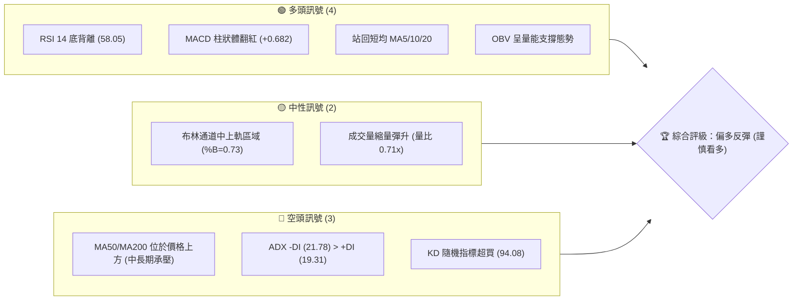
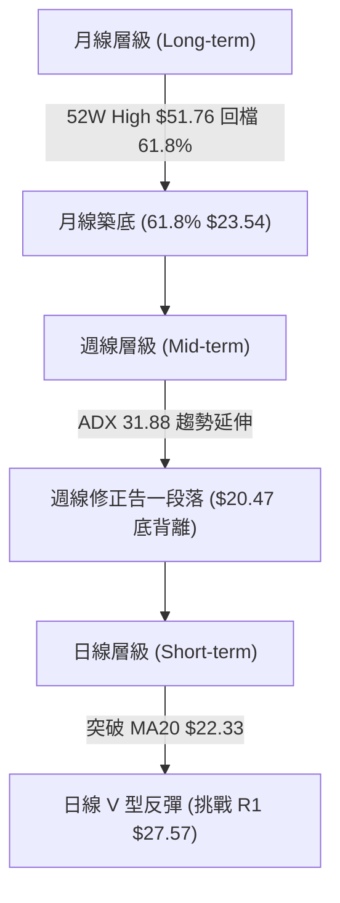
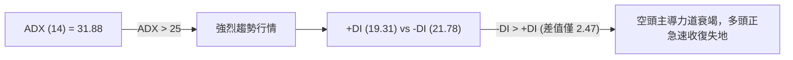
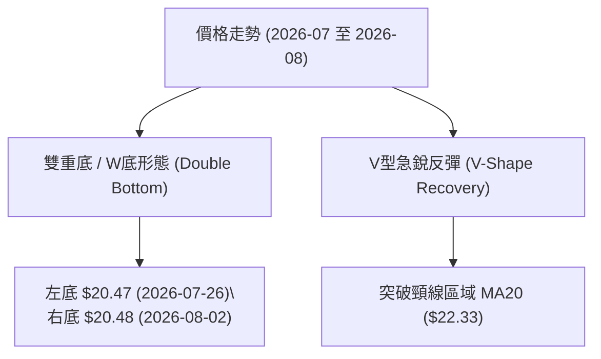
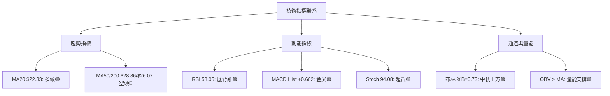
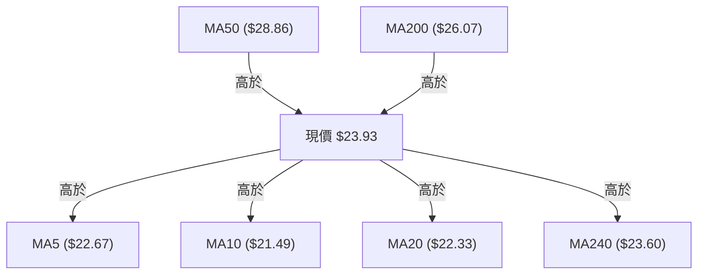
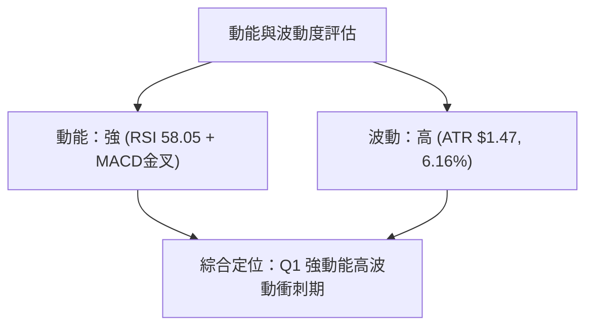
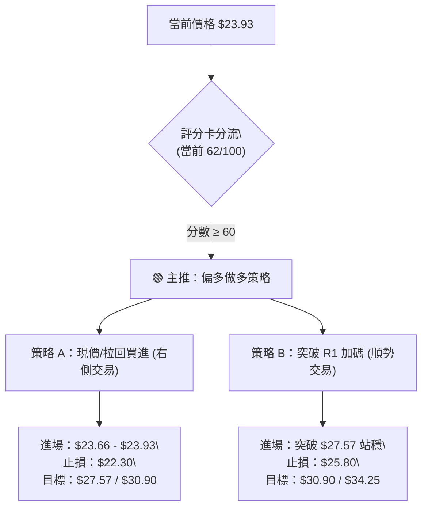
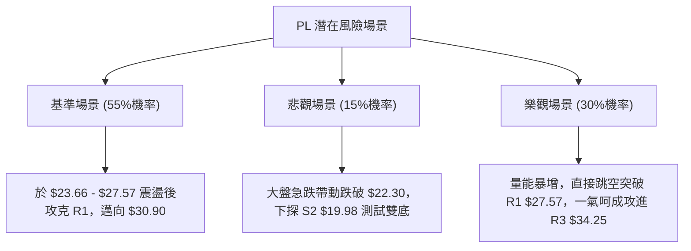

# PL 技術分析報告

> **報告日期**：2026-08-07 ｜ **語言**：繁體中文 ｜ **數據來源**：Yahoo Finance ｜ **當前價格**：$23.93

---

## 目錄

| 章節 | 內容 |
|------|------|
| [1. 技術面概覽](#1-技術面概覽) | 訊號儀表板、核心指標、評分卡 |
| [2. 趨勢分析](#2-趨勢分析) | 多時框趨勢、長中短期走勢 |
| [3. 圖表形態分析](#3-圖表形態分析) | 形態識別、K線組合、目標價 |
| [4. 支撐與阻力](#4-支撐與阻力) | 關鍵價位、斐波那契回調 |
| [5. 技術指標深度解讀](#5-技術指標深度解讀) | MA/RSI/MACD/布林/成交量 |
| [6. 動能與波動率](#6-動能與波動率) | 動能評估、ATR、Beta |
| [7. 多時框架總結](#7-多時框架總結) | 時框架評分矩陣 |
| [8. 交易策略建議](#8-交易策略建議) | 多空策略、風險報酬比 |
| [9. 風險提示與監控](#9-風險提示與監控) | 監控指標、風險場景 |

---

## 1. 技術面概覽

### 🎯 技術訊號儀表板



### 📊 核心指標速覽表

| 指標類別 | 指標名稱 | 當前數值 | 訊號 | 解讀 |
|----------|----------|----------|------|------|
| **價格** | 當前價格 | $23.93 | 🟡 中性反彈 | 自近一週低點 $20.47 彈升，位於 52 週區間 39.0% |
| **均線** | MA20 | $22.33 | 🟢 看多 | 價格突破並站穩 MA20 上方 (+7.16%) |
| **均線** | MA50 | $28.86 | 🔴 看空 | 價格位於 MA50 下方 (-17.08%)，中期主壓力區 |
| **均線** | MA200 | $26.07 | 🔴 看空 | 價格位於 MA200 下方 (-8.21%)，長期趨勢受阻 |
| **動能** | RSI(14) | 58.05 | 🟢 看多 | 回升至中性偏強區間，且呈現顯著底背離 |
| **動能** | MACD | -1.712 (柱+0.682) | 🟢 看多 | MACD 柱狀體轉正，金叉信號擴大 |
| **波動** | ATR(14) | $1.47 (6.16%) | 🟡 中性 | 日均波動幅度擴大，短線劇烈洗盤 |

### 🏆 技術評分卡

```
╔══════════════════════════════════════════════════════════════════╗
║                技術評分卡 — PL (2026-08-07)                      ║
╠══════════════════════════════════════════════════════════════════╣
║  趨勢強度      ███████████░░░░░░░░░  55/100  🟡 中性震盪         ║
║  動能指標      ██████████████░░░░░░  70/100  🟢 動能回升         ║
║  支撐穩定度    ███████████████░░░░░  75/100  🟢 強強交會 (S1/Fib)║
║  成交量配合    ████████████░░░░░░░░  60/100  🟡 縮量反彈         ║
║  形態完整度    █████████████░░░░░░░  65/100  🟢 雙底築底完成     ║
║  均線排列      █████████░░░░░░░░░░░  45/100  🔴 糾結且承壓       ║
╠══════════════════════════════════════════════════════════════════╣
║  綜合評分      ████████████4░░░░░░░  62/100  🟢 偏多反彈 (進場)  ║
╚══════════════════════════════════════════════════════════════════╝
```

---

## 2. 趨勢分析

### 🌐 多時框趨勢分析



### 📈 長期趨勢 — 12個月走勢圖（Unicode）

```
PL 月線走勢圖（2025-08 至 2026-08）
價格軸 ($)
$51.14 ┤                                     ● (2026-05 歷史高點)
$40.00 ┤                                   ●   
$30.00 ┤                               ●       ●
$23.93 ┤                                           ● (現價 $23.93)
$20.00 ┤                                               ● (2026-07 低點 $20.47)
$10.00 ┤             ●   ●   ●
$6.10  ┤ ●   ●   ●                 
        └──────────────────────────────────────────────────────────
         M08 M09 M10 M11 M12 M01 M02 M03 M04 M05 M06 M07 M08
```

#### 走勢特徵分析

| 階段 | 時間區間 | 價格變動 | 特徵解讀 |
|------|----------|----------|----------|
| **起漲段** | 2025-08 ~ 2026-01 | $7.09 ➔ $24.97 | 突破歷史盤整區，爆量長陽突破，法人籌碼高度集中 |
| **主升段** | 2026-02 ~ 2026-05 | $24.14 ➔ $51.14 | 營收加速（YoY 42.1%），噴出至歷史高點 $51.76 |
| **修正段** | 2026-06 ~ 2026-07 | $51.14 ➔ $20.47 | 高檔獲利了結賣壓，劇烈拉回重挫 60%，急跌至 61.8% 回調位 |
| **築底段** | 2026-07 ~ 2026-08 | $20.47 ➔ $23.93 | 於 $20.47–$20.48 形成雙重底，指標出現罕見強烈底背離 |

### 📊 中期趨勢（週線分析）

近 20 週數據顯示，股價自 2026 年 5 月底見頂 $51.14 後，經歷了連續 8 週的加速下探，跌幅超過 60%。週線 RSI 一度跌至 10.2（極度超賣區），於 2026-07-26 至 2026-08-02 在 $20.47–$20.48 形成打底結構。

最新一週（2026-08-09 週報數據）收盤價猛烈反彈至 $23.93，一舉吞噬前兩週陰線，RSI 由 25.6 急遽回升至 58.0，MACD 柱狀體由 -0.176 強勢轉正至 +0.682，確立了週線級別的底部反彈形勢。

### ⚡ 趨勢強度評估（ADX 解讀）



#### ADX 趨勢強度對照表

| 指標項 | 數值 | 判斷標準 | 當前狀態解讀 |
|--------|------|----------|--------------|
| **ADX 數值** | 31.88 | > 25 強趨勢 | 屬於明確的單邊趨勢釋放期，非窄幅無序盤整 |
| **+DI / -DI** | 19.31 / 21.78 | 交叉點為轉折 | -DI 與 +DI 距離大幅縮小，即將形成「+DI 向上金叉 -DI」的趨勢反轉訊號 |
| **趨勢類型** | 下降趨勢末端 | 強趨勢減弱 | 空頭主導力道已達頂峰並開始衰退，多頭強烈反撲 |

---

## 3. 圖表形態分析

### 🔍 形態識別系統



#### 圖表形態信心度評估表

| 形態類型 | 信心度 | 判斷依據（引用數據） | 完成度 | 目標價（附計算式） |
|----------|--------|----------------------|--------|--------------------|
| **W底 (雙重底)** | **65%** | 兩次下探低點 $20.47 與 $20.48 準確重合，且 RSI 形成顯著底背離 | 75% | 頸線 R1 ($27.57) + (頸線 $27.57 - 低點 $20.47) = **$34.67**（對應 R3 $34.25） |
| **布林通道下軌彈升** | **85%** | 價格觸及 BB 下軌 $18.79 後強彈，收復中軌 $22.33 | 100% | 通道上軌 **$25.87** |

### 🕯️ 重要 K 線形態分析

| 日期/週別 | 收盤價 | K 線形態 | 解讀 | 訊號 |
|-----------|--------|----------|------|------|
| 2026-07-26 | $20.47 | 錘頭線 (Hammer) | RSI 達到極致超賣 10.2，下影線宣示下方買盤強勁介入 | 🟢 止跌 |
| 2026-08-02 | $20.48 | 雙底平腳 (Matching Low) | 二度測試 $20.48 不破，確認 $20.00 整數關卡強大支撐 | 🟢 打底 |
| 2026-08-09 | $23.93 | 貫穿大陽線 (Bullish Piercing) | 單週大漲 +16.85%，一舉突破 MA5/10/20 均線集結區 | 🟢 突破 |

### 📉 ASCII 走勢形態示意圖

```
PL 雙重底 (W-Bottom) 與頸線突破示意圖
════════════════════════════════════════════════════════════
$27.57 ┤------------------- 頸線阻力 (R1) -------------------
       │                    /
$23.93 ┤.................../.... 現價 $23.93 (突破 MA20)
       │       \          /
       │        \        /
$20.47 ┤─────────●──────●───────────────────────────────────
       │      左底 $20.47  右底 $20.48
       └────────────────────────────────────────────────────
                2026-07-26  2026-08-02
```

### 🎯 形態目標價計算

1. **W 底第一目標價 (T1)**：突破 R1 頸線位 **$27.57**。
2. **W 底垂直等距測幅目標價 (T2)**：
   $$\text{形態高度} = \text{頸線 } \$27.57 - \text{底點 } \$20.47 = \$7.10$$
   $$\text{測幅目標價} = \text{頸線 } \$27.57 + \$7.10 = \$34.67$$
   *(該目標價位極度貼近阻力位 R3 $34.25 與斐波那契 38.2% 回調位 $34.32)*

---

## 4. 支撐與阻力

### 🗺️ 關鍵價位分布圖（Unicode）

```
PL 價位結構分布圖
════════════════════════════════════════════════════════════
$51.76 ║████████████████████████████████║ 52W High / Fib 0.0%
$40.98 ║██████████████████            ║ Fib 23.6%
$34.25 ║██████████████████████████████║ 強阻力 R3 / Fib 38.2% ($34.32)
$30.90 ║████████████████              ║ 阻力 R2
$28.93 ║██████████████████            ║ MA50 ($28.86) / Fib 50.0%
$27.57 ║██████████████████████████████║ 關鍵阻力 R1 (W底頸線)
$26.07 ║██████████                    ║ MA200 壓制線
$23.93 ╠══════════════════════════════╣ ◄ 當前價格 $23.93
$23.66 ║▓▓▓▓▓▓▓▓▓▓▓▓▓▓▓▓▓▓▓▓▓▓▓▓▓▓▓▓▓▓║ 近期強支撐 S1 / Fib 61.8% ($23.54) / MA240 ($23.60)
$19.98 ║██████████████████████████████║ 強支撐 S2 (波段雙底區)
$19.16 ║████████████                  ║ 停損防守位 S3
════════════════════════════════════════════════════════════
```

### 🚧 阻力位分析表

| 阻力級別 | 價位 | 形成原因 | 突破難度 | 重要性 |
|----------|------|----------|----------|--------|
| **R1** | **$27.57** | 近一年波段高點聚類、W底頸線位置 | 🟡 中等 | 🟢🟢🟢 (多空轉折點) |
| **R2** | **$30.90** | 波段反彈高點、逼近 MA60 ($31.33) 與 MA120 ($31.43) | 🔴 較高 | 🟢🟢 (中期壓力) |
| **R3** | **$34.25** | 近一年高點聚類、斐波那契 38.2% 回調位 ($34.32) | 🔴極高 | 🟢🟢🟢 (強烈套牢賣壓) |

### 🛡️ 支撐位分析表

| 支撐級別 | 價位 | 形成原因 | 守住機率 | 重要性 |
|----------|------|----------|----------|--------|
| **S1** | **$23.66** | 近一年波段低點聚類、MA240 ($23.60)、Fib 61.8% ($23.54) | 🟢 很高 (80%) | 🟢🟢🟢 (當前核心防線) |
| **S2** | **$19.98** | 近一年波段低點聚類、雙底結構區 ($20.47–$20.48) | 🟢 極高 (90%) | 🟢🟢🟢 (強烈買盤支撐) |
| **S3** | **$19.16** | 近一年波段低點聚類、布林通道下軌區 ($18.79) | 🟢 極高 (95%) | 🟢🟢 (最後防線) |

### 📐 斐波那契回調位分析

依據 52 週高低點（$6.10 ➔ $51.76）精確計算之回調位：

```
斐波那契回調層級分析
0.0%  (52W High) ────────────────────────────── $51.76
23.6%            ────────────────────────────── $40.98
38.2%            ────────────────────────────── $34.32  (與 R3 $34.25 重合)
50.0%            ────────────────────────────── $28.93  (與 MA50 $28.86 重合)
61.8%            ────────────────────────────── $23.54  ◄ 現價 $23.93 位於此處！
78.6%            ────────────────────────────── $15.87
100.0%(52W Low)  ────────────────────────────── $6.10
```

*   **關鍵解讀**：當前價格 $23.93 正精確落於 **61.8% 黄金分割回調位 ($23.54)** 與 **50.0% 回調位 ($28.93)** 之間。61.8% 是強烈技術性支撐位，價格在此處止跌回升，符合典型黃金分割率強反彈格局。

---

## 5. 技術指標深度解讀

### 🎛️ 指標訊號總覽



### 📈 移動平均線排列分析



*   **均線狀態解讀**：均線呈現「短多長空」的糾結排列。短天期均線 MA5 ($22.67)、MA10 ($21.49) 與 MA20 ($22.33) 已全部轉為向上勾頭且位於價格下方，提供短線支撐；長天期均線 MA50 ($28.86) 與 MA200 ($26.07) 於上方形成蓋頂反壓。價格成功站上 MA240 年線 ($23.60)，技術面轉強。

### 📉 RSI(14) 分析

*   **當前數值**：**58.05** （中性偏多區間）
*   **強度進度條**：`█████████████░░░░░░░` (58/100)
*   **背離判定**：**⚠️ 強烈底背離 (Bullish Divergence)**
    *   *判定依據*：股價在 2026-07-26 與 2026-08-02 兩次下探 $20.47–$20.48 時，週線 RSI 卻由 **10.2** 劇烈拉升至 **25.6**，隨後日線 RSI 發射升至 **58.05**。價格創新低/平低而指標未創新低，確認為標準底背離，預示中期反轉發生。

### 📊 MACD(12/26/9) 訊號解讀

*   **MACD 快線**：-1.712
*   **Signal 慢線**：-2.393
*   **MACD 柱狀體**：**+0.682** 🟢 （看多）
*   **解讀**：MACD 快線已向上一腳穿過 Signal 慢線完成「零軸下金叉」，柱狀體連續擴大至 +0.682。在技術分析中，零軸下方的低位金叉通常是最佳的空頭獲利了結與多頭左側進場訊號。

### 📦 布林通道分析

```
布林通道現狀示意圖 (Bollinger Bands 14, 2)
════════════════════════════════════════════════════════════
$25.87 ┼──────────────────────────────────── 布林上軌
       │                          ● ($23.93 %B=0.73)
$22.33 ┼──────────────────────────────────── 布林中軌 (MA20)
       │
$18.79 ┼──────────────────────────────────── 布林下軌
════════════════════════════════════════════════════════════
```

*   **通道狀態**：%B 數值為 **0.73**，價格位於中軌（MA20 $22.33）與上軌（$25.87）之間。布林帶寬正由縮口轉為向外開口，預示多頭攻擊波段啟動，短期目標直指布林上軌 $25.87。

### 💹 成交量分析（量價配合度）

*   **當前成交量**：5,283,399
*   **20日均量**：7,402,105（量比 0.71x）
*   **OBV 趨勢**：**OBV > MA** 🟢（量能支撐上漲）
*   **解讀**：最新單日成交量稍有縮量，但 OBV（能量潮指標）長期趨勢仍高於其移動平均線，且 20 週成交量在打底階段（3,500萬~3,800萬股）呈現溫和換手，顯示高檔籌碼清洗徹底，沉澱良好，無恐慌性拋盤。

---

## 6. 動能與波動率

### ⚡ 動能評估四象限

| 象限區塊 | 動能強度 (RSI/MACD) | 波動率 (ATR) | PL 當前位置 | 評估與操作策略 |
|----------|---------------------|--------------|-------------|----------------|
| **Q1 (右上)** | 強 (RSI > 50) | 高 (ATR > 5%) | **✓ 當前位置** | **高動能/高波動**：典型反彈攻擊波，適合嚴格控管止損的順勢買進策略 |
| **Q2 (左上)** | 弱 (RSI < 50) | 高 (ATR > 5%) | — | **低動能/高波動**：向下築底期，觀望為主 |
| **Q3 (左下)** | 弱 (RSI < 50) | 低 (ATR < 3%) | — | **低動能/低波動**：橫盤沉悶期 |
| **Q4 (右下)** | 強 (RSI > 50) | 低 (ATR < 3%) | — | **強動能/低波動**：穩健主升段 |



### 📊 ATR 波動率分析

*   **ATR(14)**：**$1.47**
*   **價格百分比**：**6.16%**
*   **止損距離建議**：基於 1.5 倍 ATR 之動態止損幅度為 $1.47 \times 1.5 = \mathbf{\$2.21}$。若以現價 $23.93 進場，合理動態止損點應設於 $\$23.93 - \$2.21 = \mathbf{\$2.172}$ 附近（或參考技術位 S1 $23.66）。

### 📐 Beta 與市場相關性

*   **Beta 係數**：**2.123**
*   **解讀**：PL 屬於極高 Beta 屬性之高成長/太空科技飆股，波動度為大盤（S&P 500）的 2.12 倍。在大盤回穩時該股具備極高彈性，適合風險承受度高之投資人進行波段操作。

---

## 7. 多時框架總結

### 📋 時框架評分表

| 時框架 | 趨勢方向 | 動能指標 | 均線排列 | 形態結構 | 綜合評分 | 建議策略 |
|--------|----------|----------|----------|----------|----------|----------|
| **日線 (Daily)** | 🟢 看多 | 🟢 RSI 58.05 / MACD金叉 | 🟢 站上 MA5/10/20 | 🟢 雙底突破 | **75/100** | 偏多操作 / 逢低買進 |
| **週線 (Weekly)** | 🟡 中性 | 🟢 RSI 底背離彈升 | 🔴 承壓於 MA50 | 🟢 61.8% 止跌 | **60/100** | 波段持有 / 目標 R1 |
| **月線 (Monthly)**| 🔴 偏空 | 🟡 中性 | 🔴 下方支撐 MA240 | 🟡 大區間回檔 | **50/100** | 長期尋求築底確認 |

### 🔲 綜合訊號矩陣

```
╔══════════════════════════════════════════════════════════════════╗
║                    多時框訊號收斂矩陣                            ║
╠══════════════════════════════════════════════════════════════════╣
║  日線層級： 🟢 多頭進擊 (突破 MA20 $22.33，挑戰 R1 $27.57)       ║
║  週線層級： 🟢 底背離確立 ($20.47 雙底，MACD 柱狀體翻紅)          ║
║  月線層級： 🟡 關鍵回調位 (守穩 61.8% 斐波那契位 $23.54)          ║
╚══════════════════════════════════════════════════════════════════╝
```

### ⚖️ 多時框收斂結論

*   **主導行情性質**：ADX 數值為 **31.88 (> 25)**，明確定義為**強趨勢反彈行情**。
*   **多時框收斂**：雖然中長期均線（MA50 $28.86、MA200 $26.07）仍位於價格上方形成中長期空頭排列，但日線與週線層級皆出現**極強烈的 RSI 底背離**與**雙重底完成訊號**。價格成功守穩斐波那契 61.8% 關鍵黃金支撐位（$23.54）與 MA240（$23.60）。
*   **唯一方向性結論**：**偏多反彈（波段做多）**。短中期多頭力道已全面接管，目標攻向 R1 $27.57 至 R2 $30.90。

---

## 8. 交易策略建議

### 🗺️ 策略決策流程圖



### 🧭 策略路由

*   **當前主策略方向**：**🟢 偏多做多策略（綜合評分 62/100）**

### 🎯 價格情境階梯（Price Scenarios）

| 觸發條件 | 下一目標 | 後續延伸 | 情境含義 |
|----------|----------|----------|----------|
| **突破 R1 $27.57** | R2 $30.90 | R3 $34.25 | W底形態全面發酵，中期趨勢翻多 |
| **站穩 S1 $23.66** | R1 $27.57 | R2 $30.90 | **（當前情境）** 穩健打底蓄勢彈升 |
| **跌破 S1 $23.66** | S2 $19.98 | S3 $19.16 | 反彈夭折，重新測試雙底防線 |

### 📊 情境機率分佈

```
╔══════════════════════════════════════════════════════════════════╗
║  情境機率估計                                                    ║
╠══════════════════════════════════════════════════════════════════╣
║  1. 繼續反彈上攻 (挑戰 R1/R2)   █████████████████████░░░  55%    ║
║  2. 區間震盪 (在 S1與 R1 間洗盤) ████████████░░░░░░░░░░  30%    ║
║  3. 回落再探底 (跌破 S1 測 S2)  ██████░░░░░░░░░░░░░░░░░  15%    ║
╚══════════════════════════════════════════════════════════════════╝
```

### 🟢 主策略詳情

| 策略要素 | 策略 A（現價/逢低分批布局） | 策略 B（突破 R1 順勢加碼） |
|----------|----------------------------|----------------------------|
| **進場條件** | 現價或回檔至 S1 支撐位附近 | 強勢實體陽線突破 R1 $27.57 確認 |
| **進場價格** | **$23.66 – $23.93** | **$27.60** |
| **目標價 T1** | **$27.57** (R1 阻力位, +15.2%) | **$30.90** (R2 阻力位, +12.0%) |
| **目標價 T2** | **$30.90** (R2 阻力位, +29.1%) | **$34.25** (R3 阻力位, +24.1%) |
| **止損價格** | **$22.30** (跌破 MA20 均線) | **$25.80** (跌破突破點與 MA200) |
| **風險報酬比** | **1 : 2.22** (至 T1) / **1 : 4.25** (至 T2) | **1 : 1.83** (至 T1) / **1 : 3.69** (至 T2) |
| **成功機率** | **60%** | **65%** |
| **建議倉位** | **10% – 15%** | **15% – 20%** |

### 🔴 反向風險觸發點（對沖/避險提示）

若股價未如預期上攻，反而跌破 **S1 $23.66** 並收低於 **$22.30**（跌破 MA20），則代表本次日線級別反彈宣告失敗。屆時應無條件執行多頭止損出場，或建立適度空頭對沖部位，下方防守目標睇至 **S2 $19.98**。

### ⭐ 整體訊號強度評星

```
做多訊號強度：★★██☆  (3.5/5星) 🟢 偏多
做空訊號強度：★☆☆☆☆  (1.5/5星) 🔴 偏弱
整體可信度：  ★★██☆  (4.0/5星) 🟢 高可信度
```

---

## 9. 風險提示與監控

### ✅ 關鍵監控指標 Checklist

```
╔══════════════════════════════════════════════════════════════════╗
║              每日交易前風控監控清單 (Checklist)                  ║
╠══════════════════════════════════════════════════════════════════╣
║  [ ] 1. 價格是否維持在 MA20 ($22.33) 與 S1 ($23.66) 上方？       ║
║  [ ] 2. MACD 柱狀體是否持續擴大正值 (目前 +0.682)？              ║
║  [ ] 3. 成交量是否在衝擊 R1 ($27.57) 時擴增至 740萬股 (20D均量)？║
║  [ ] 4. RSI(14) 是否維持在 50 多方強弱分界線之上？              ║
║  [ ] 5. 法人持股 (82.2%) 與 Short Float (11.0%) 是否出現急劇變化？ ║
╚══════════════════════════════════════════════════════════════════╝
```

### ⚠️ 風險場景分析



### 🛡️ 風險管理重要提醒

1. **Beta 波動風險**：PL 擁有 2.123 的高 Beta 值，代表大盤下跌 1% 時，該股可能下跌超過 2%。倉位規模務必控制在總投資組合的 **15% 以內**。
2. **高 Short Float 壓絕**：空頭佔流通股本 11.0%（Short Ratio 2.49），若股價強勢突破 R1 $27.57，極易引發**軋空行情（Short Squeeze）**，加速推升至 R2/R3。
3. **止損紀律**：進場後務必將止損單掛於 **$22.30**，絕不硬扛虧損。

---

## 📋 報告總結

```
╔══════════════════════════════════════════════════════════════════╗
║                     PL 技術分析報告總結                          ║
════════════════════════════════════════════════════════════════════
報告日期：2026-08-07
當前價格：$23.93
分析評級：🟢 偏多反彈（做多，目標 $27.57 / $30.90）

關鍵結論：
├─ 長期趨勢：🟡 於 61.8% 斐波那契位 ($23.54) 進行中期築底
├─ 中期趨勢：🟢 週線 RSI 強烈底背離，MACD 柱狀體翻紅 (+0.682)
├─ 短期趨勢：🟢 站上 MA5/10/20，W底完成（頸線 $27.57）
├─ 關鍵支撐：$23.66 (S1) / $19.98 (S2)
├─ 關鍵阻力：$27.57 (R1) / $30.90 (R2) / $34.25 (R3)
└─ 分析師目標：共識均價 $40.10 (買入評級)

最優策略組合：
1. 🥇 最佳機會：策略 A — 現價 / $23.66 附近布局做多，止損 $22.30，目標 $27.57。
2. 🥈 次選機會：策略 B — 待實體大陽線突破 R1 $27.57 後順勢加碼，目標 $30.90。
3. 🥉 保守選擇：等待股價拉回測試 S1 $23.66 止跌確認後再行進場。
════════════════════════════════════════════════════════════════════
```

---

> ⚠️ **免責聲明**：本報告為 AI 自動生成之技術分析，所有數據及估算均基於提供的歷史價格資訊。本報告**僅供研究與學術參考**，**不構成任何投資建議**。投資有風險，入市需謹慎。

---

*報告生成時間：2026-08-07 ｜ 數據來源：Yahoo Finance ｜ 分析框架：多時框技術分析*