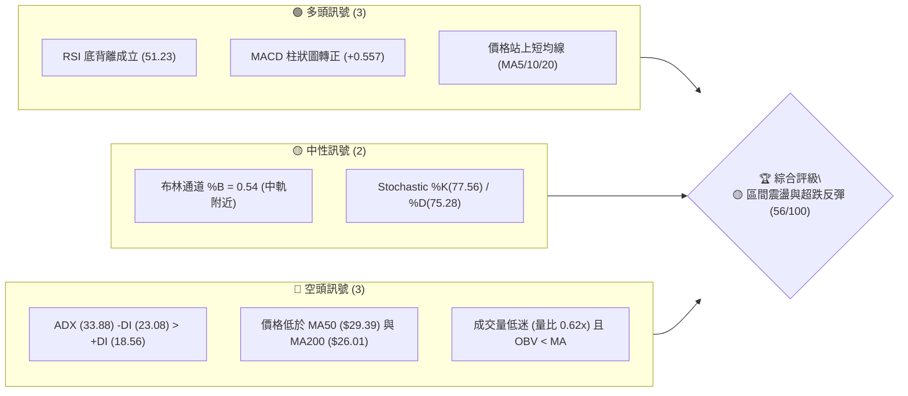
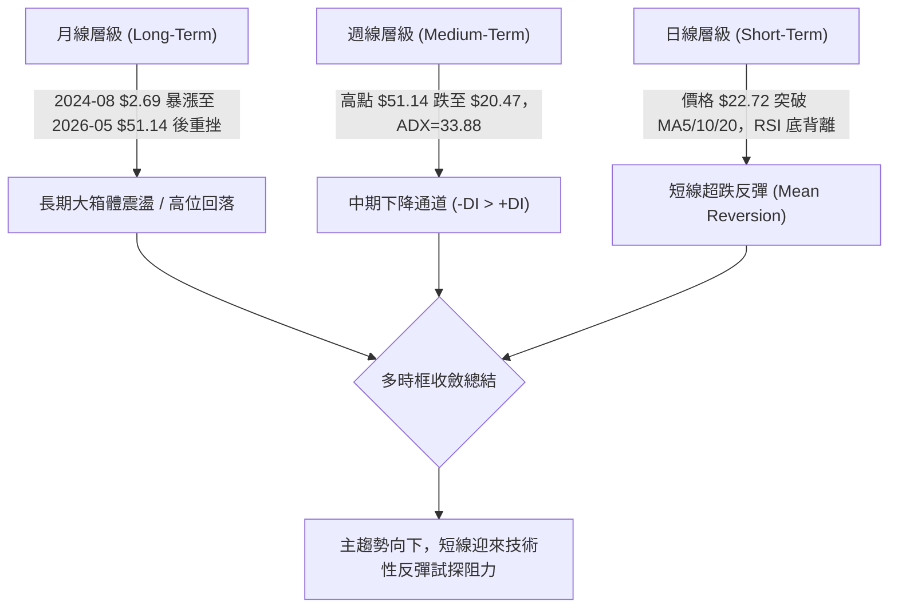
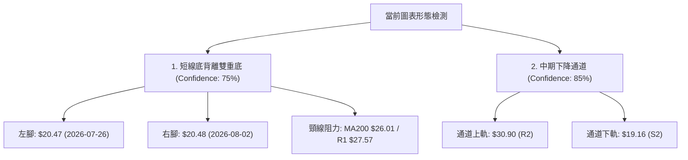
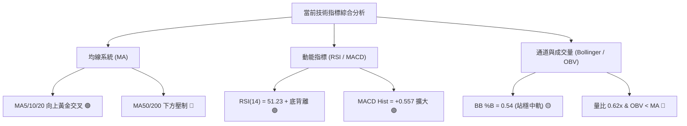
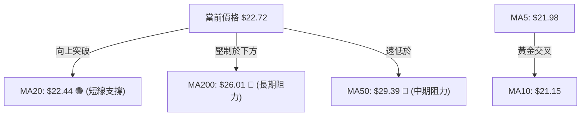
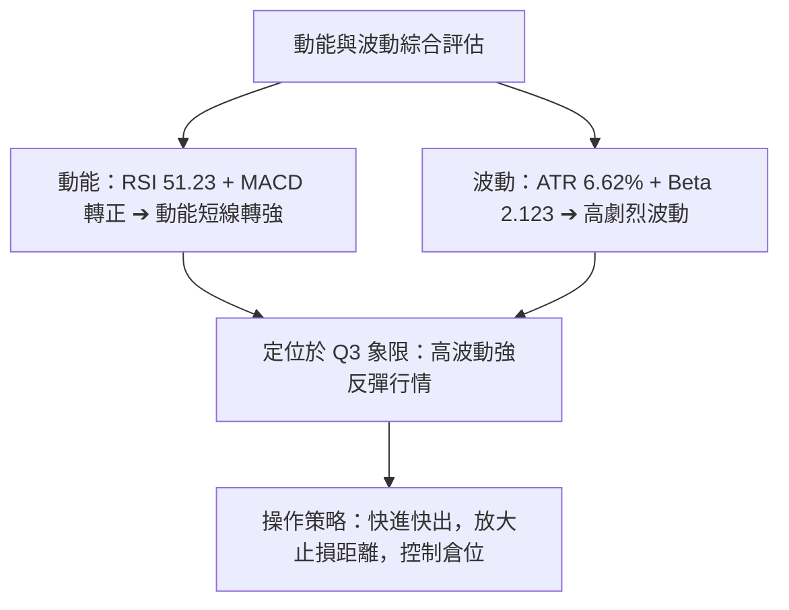
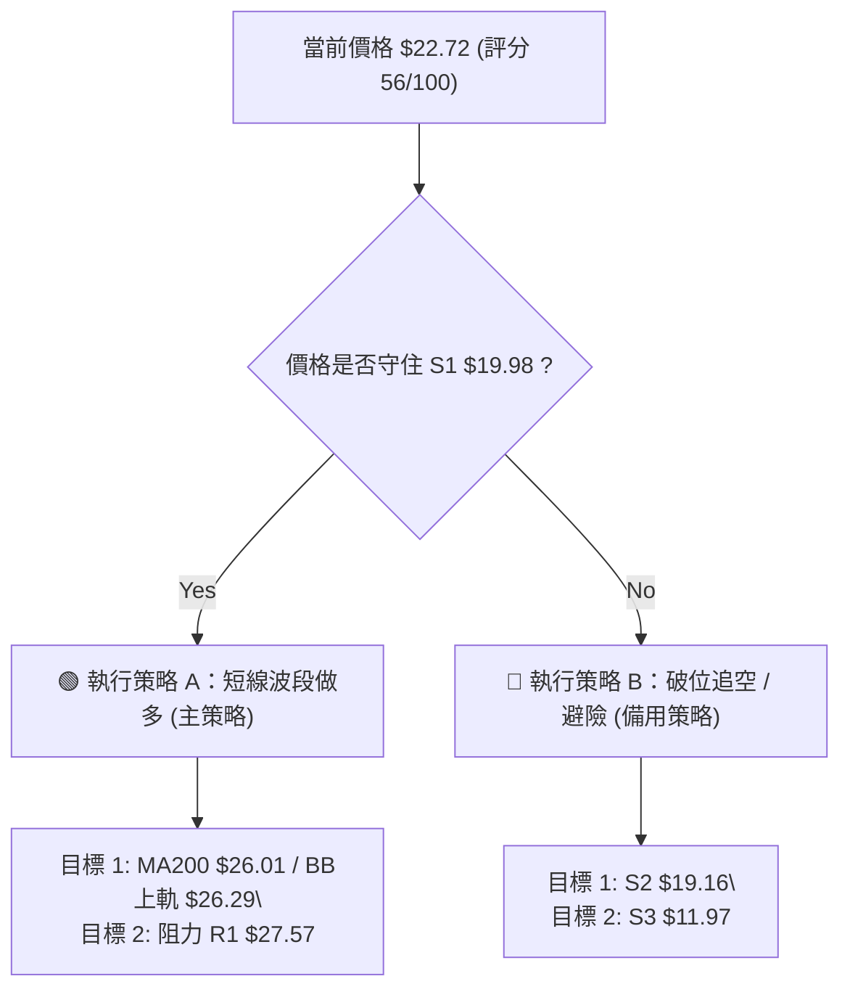
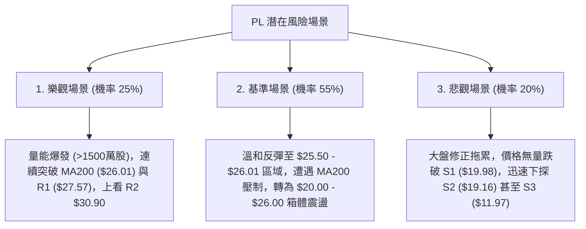

# PL 技術分析報告

> **報告日期**：2026-08-07 ｜ **語言**：繁體中文 ｜ **數據來源**：Yahoo Finance ｜ **當前價格**：$22.72

---

## 目錄

| 章節 | 內容 |
|------|------|
| [1. 技術面概覽](#1-技術面概覽) | 訊號儀表板、核心指標、評分卡 |
| [2. 趨勢分析](#2-趨勢分析) | 多時框趨勢、長中短期走勢 |
| [3. 圖表形態分析](#3-圖表形態分析) | 形態識別、K線組合、目標價 |
| [4. 支撐與阻力](#4-支撐與阻力) | 關鍵價位、斐波那契回調 |
| [5. 技術指標深度解讀](#5-技術指標深度解讀) | MA/RSI/MACD/布林/成交量 |
| [6. 動能與波動率](#6-動能與波動率) | 動能評估、ATR、Beta |
| [7. 多時框架總結](#7-多時框架總結) | 時框架評分矩陣 |
| [8. 交易策略建議](#8-交易策略建議) | 多空策略、風險報酬比 |
| [9. 風險提示與監控](#9-風險提示與監控) | 監控指標、風險場景 |

---

## 1. 技術面概覽

### 🎯 技術訊號儀表板



### 📊 核心指標速覽表

| 指標類別 | 指標名稱 | 當前數值 | 訊號 | 解讀 |
|----------|----------|----------|------|------|
| **價格** | 當前收盤價 | $22.72 | 🟡 中性 | 距52週高點 $51.76 回落 56.1%，位於歷史區間 36.4% 位置 |
| **均線** | MA20 (月線) | $22.44 | 🟢 看多 | 價格突破 MA20 ($22.44)，短線取得初步支撐 |
| **均線** | MA50 (季線) | $29.39 | 🔴 看空 | 價格遠低於 MA50，中期趨勢仍處於修正修正結構 |
| **均線** | MA200 (年線)| $26.01 | 🔴 看空 | 價格低於 MA200，長期趨勢受壓，為上方強勁阻力 |
| **動能** | RSI(14) | 51.23 | 🟢 看多 | 脫離超賣區（前低 10.2），出現明確的「底背離」買進訊號 |
| **動能** | MACD(12,26,9)| -2.006 / Hist +0.557 | 🟢 看多 | DIF 線高於 Signal 線，柱狀圖正值擴大，短線動能修復 |
| **趨勢** | ADX(14) | 33.88 | 🔴 看空 | 強趨勢行情，但 -DI(23.08) > +DI(18.56)，空頭掌控中長期主導權 |
| **波動** | ATR(14) | $1.51 (6.62%) | 🟡 中性 | 日均波動達 6.62%，屬於高波動動態標的 |

### 🏆 技術評分卡

```
╔══════════════════════════════════════════════════════════════════╗
║                   技術評分卡 — PL (2026-08-07)                  ║
╠══════════════════════════════════════════════════════════════════╣
║ 趨勢強度 (ADX)     ▓▓▓▓▓▓▓▓▓▓▓▓▓▓░░░░░░  70/100  🟡 強趨勢空頭主導   ║
║ 動能指標 (RSI/MACD) ▓▓▓▓▓▓▓▓▓▓▓▓▓░░░░░░░  65/100  🟢 短線底背離強彈   ║
║ 支撐穩定度 (S1/S2)  ▓▓▓▓▓▓▓▓▓▓▓▓░░░░░░░░  60/100  🟡 $19.98守住反彈  ║
║ 成交量配合 (OBV/VOL)▓▓▓▓▓▓▓▓░░░░░░░░░░░░  40/100  🔴 無量反彈量能不足 ║
║ 形態完整度 (底背離) ▓▓▓▓▓▓▓▓▓▓▓░░░░░░░░░  55/100  🟡 局部雙底築底中   ║
║ 均線排列 (MA System)▓▓▓▓▓▓▓░░░░░░░░░░░░░  35/100  🔴 季線年線空頭排列 ║
╠══════════════════════════════════════════════════════════════════╣
║ 綜合技術評分       ▓▓▓▓▓▓▓▓▓▓▓░░░░░░░░░  56/100  🟡 弱勢反彈 / 觀望  ║
╚══════════════════════════════════════════════════════════════════╝
```

---

## 2. 趨勢分析

### 🌐 多時框趨勢分析



### 📈 長期趨勢 — 12個月走勢圖（Unicode）

```
PL 歷史收盤價走勢圖（2025-08 至 2026-08）
價格軸 ($)
$52.00 ┼                                    ● (2026-05 高點 $51.14)
$45.00 ┤                                   ╱ ╲
$38.00 ┤                             ●    ╱   ╲
$31.00 ┤                            ╱ ╲  ╱     ╲  ● (2026-06 $33.13)
$24.00 ┤                 ●    ●    ╱   ╲╱       ╲╱ ╲
$17.00 ┤           ●    ╱ ╲  ╱ ╲  ╱                 ╲  ● (現價 $22.72)
$10.00 ┤     ●    ╱ ╲  ╱   ╲╱   ╲╱                   ╲╱
 $3.00 ┴──●──┴────┴────┴────┴────┴────┴────┴────┴────┴────┴────
Month:   M08  M10  M12  M02  M04  M05  M06  M07  M08
Year:    -- 2025 --    └─────── 2026 ─────────┘
```

#### 歷史走勢特徵分析表

| 階段區間 | 起始價 → 終點價 | 漲跌幅 (%) | 走勢特徵描述 |
|----------|------------------|------------|--------------|
| **2025-08 ~ 2026-01** | $7.09 → $24.97 | +252.19% | 爆發性多頭起漲，主導資產資金快速湧入 |
| **2026-01 ~ 2026-05** | $24.97 → $51.14 | +104.81% | 拋物線式主升段，於 2026-05 觸及歷史天價（52W高點 $51.76） |
| **2026-05 ~ 2026-07** | $51.14 → $20.48 | -59.95% | 獲利了結賣壓湧現，連續三個月恐慌性拋售，探至低點 $20.47 |
| **2026-07 ~ 2026-08** | $20.48 → $22.72 | +10.94% | 賣壓耗盡，出現技術性築底與 RSI 底背離反彈 |

### 📊 中期趨勢（週線分析）

週線數據顯示，PL 從 2026 年 5 月底的 $51.14 經歷了極度劇烈的修正。在 2026-07-26 當週，週線收盤價跌至 $20.47，週線 RSI 降至極端超賣區 10.2。隨後兩週（2026-08-02 與 2026-08-09），週收盤價分別為 $20.48 與 $22.72，且週線 MACD 柱狀圖由 -0.176 轉正至 +0.557，顯示中期拋售動能衰竭，進入底部震盪打底階段。

```
中期壓力與支撐階梯圖
$34.25 ────────────────────────────────────── 阻力 R3 (波段高點/Fib 38.2% $34.32)
$30.90 ────────────────────────────────────── 阻力 R2 (MA50 $29.39 密集區)
$27.57 ────────────────────────────────────── 阻力 R1 (MA200 $26.01 / Fib 50% $28.93)
$22.72 ══════════════════════════════════════ ◄ 當前價格 (現價)
$19.98 ────────────────────────────────────── 支撐 S1 (近期波段支撐/雙重底頸線區)
$19.16 ────────────────────────────────────── 支撐 S2 (波段防守點)
$11.97 ────────────────────────────────────── 支撐 S3 (極端支撐)
```

### ⚡ 趨勢強度評估（ADX 解讀）

```mermaid
graph TD
    A["ADX(14) = 33.88"] --> B{"ADX > 25 ?"}
    B -->|"Yes"| C["屬於『強趨勢行情』 (Trend Market)"]
    C --> D{"方向判斷: +DI vs -DI"}
    D -->|"+DI("18.56") < -DI("23.08")"| E["🔴 空頭趨勢掌控主導權"]
    E --> F["結論：不可忽視中長期空頭力量，所有做多交易均屬『逆勢反彈操作』"]
```

*   **ADX 數值對照與當前定位**：
    *   `0 - 20`：無趨勢 / 盤整市場
    *   `20 - 25`：趨勢形成中
    *   `25 - 50`：**強趨勢市場 (當前 ADX = 33.88)**
    *   `50 - 100`：極端強趨勢
*   **解讀**：雖然當前 ADX 達到 33.88 表示趨勢強烈，但由於 -DI (23.08) 高於 +DI (18.56)，這代表**過去形成的下降趨勢力量極強**。目前日線層級的反彈尚未扭轉中期的空頭架構，唯有當 +DI 向上穿越 -DI，趨勢才算真正轉多。

---

## 3. 圖表形態分析

### 🔍 形態識別系統



#### 形態信心度評估表

| 形態名稱 | 信心度 | 判斷依據（引用數據） | 完成度 | 目標價（附計算式） |
|----------|--------|----------------------|--------|--------------------|
| **超跌底背離雙底** | **75%** | 兩次下探 $20.47 與 $20.48 守住，同時 RSI 由 10.2 大幅升至 51.23 | 60% | $22.44 (頸線) + ($22.44 - $20.47) = **$24.41** (初步目標) |
| **下降通道（修正）** | **85%** | 高點從 $51.14 降至 $33.13，低點從 $31.15 降至 $20.47 | 90% | 通道上軌突破點約為 **$27.57 (R1)** |

### 🕯️ 重要 K 線形態分析

| 日期/週別 | 收盤價 | K線形態名稱 | 技術面解讀 | 多空訊號 |
|-----------|--------|-------------|------------|----------|
| **2026-07-26** | $20.47 | 探底錘子線 (Hammer) | RSI 跌至極端值 10.2，下影線展現下檔強烈買盤支撐 | 🟢 看多反轉 |
| **2026-08-02** | $20.48 | 雙底確認晨星 (Morning Star) | 守住前低 $20.47，未再破底，成交量收縮進入沉澱 | 🟢 築底完成 |
| **2026-08-09** | $22.72 | 中陽線突破 (Bullish Marubozu) | 強力收復 MA5/10/20，確認短線多頭反彈啟動 | 🟢 短線看多 |

### 📉 ASCII 走勢形態示意圖

```
PL 短線「超跌雙底」與阻力突破示意圖

  價格 ($)
  $27.57 ┤─────────────────────────────────── 阻力 R1 / 目標價位
         │                                   / 
  $26.01 ┤─────────────────────────────────── MA200 強阻力區
         │                                 ╱
  $23.54 ┤─────────────────────────────── ╱ ── 斐波那契 61.8%
         │                             ● (現價 $22.72)
  $22.44 ┤─────────── 頸線區 (MA20) ───╱
         │           ╲               ╱
  $20.47 ┤────────────●─────────────●──────── 防守支撐 (S1 $19.98 / S2 $19.16)
         └─────────────┴─────────────┴────────
                      左腳          右腳
                   (2026-07)     (2026-08)
```

### 🎯 形態目標價計算

1.  **底背離雙底第一目標價**：
    *   右腳低點：$20.47
    *   突破頸線（MA20）：$22.44
    *   形態高度：$22.44 - $20.47 = $1.97
    *   **計算目標價 1** = $22.44 + $1.97 = **$24.41** (已接近現價，向上挑戰 MA200 $26.01)
2.  **通道反彈第二目標價**：
    *   引用阻力位 R1：**$27.57** (距離現價 +21.34%)

---

## 4. 支撐與阻力

### 🗺️ 關鍵價位分布圖（Unicode）

```
PL 關鍵價位結構分布圖
═══════════════════════════════════════════════════════════════════
$34.25 ║████████████████████████████████████████║ 強阻力 R3 (斐波 38.2% $34.32)
$30.90 ║████████████████████████████            ║ 中期阻力 R2 (MA50 $29.39)
$27.57 ║████████████████████                    ║ 關鍵阻力 R1 (MA200 $26.01)
$23.54 ║▓▓▓▓▓▓▓▓▓▓▓▓▓▓▓▓                        ║ 斐波那契 61.8% 壓力位
$22.72 ╠════════════════════════════════════════╣ ◄ 現價 $22.72
$19.98 ║▓▓▓▓▓▓▓▓▓▓▓▓                            ║ 近期關鍵支撐 S1
$19.16 ║████████████████████                    ║ 波段強支撐 S2
$11.97 ║████████████████████████████████████████║ 深度防守支撐 S3
═══════════════════════════════════════════════════════════════════
```

### 🚧 阻力位分析表

| 阻力級別 | 精確價位 | 形成原因與數據來源 | 突破難度 | 重要性 |
|----------|----------|--------------------|----------|--------|
| **R1** | **$27.57** | 近一年波段高點聚類 / 靠近 MA200 ($26.01) | 🟡 中等 | 🔴 極高（短多能否轉中多的分水嶺） |
| **R2** | **$30.90** | 近一年波段高點聚類 / 靠近 MA50 ($29.39) | 🔴 困難 | 🟡 中等（中期下降趨勢線上軌） |
| **R3** | **$34.25** | 近一年波段高點聚類 / 近似 38.2% 回調位 ($34.32)| 🔴 極難 | 🟡 中等（籌碼解套重壓區） |

### 🛡️ 支撐位分析表

| 支撐級別 | 精確價位 | 形成原因與數據來源 | 守住機率 | 重要性 |
|----------|----------|--------------------|----------|--------|
| **S1** | **$19.98** | 近一年波段低點聚類 / 雙底低點 $20.47 護城河 | 🟢 較高 | 🔴 極高（短線多頭停損點） |
| **S2** | **$19.16** | 近一年波段低點聚類 / 心理整數關卡防線 | 🟡 中等 | 🟡 中等（防守失敗將引發二次恐慌） |
| **S3** | **$11.97** | 近一年波段低點聚類 / 歷史密積籌碼支撐區 | 🟢 極高 | 🔴 極高（長期終極支撐） |

### 📐 斐波那契回調位分析

基於 52 週區間（高點 **$51.76** → 低點 **$6.10**，總波幅 $45.66）計算之精確回調位：

| 斐波那契比例 | 計算價位 | 當前相對位置與技術意義解讀 |
|--------------|----------|----------------------------|
| **0.0%** (52W High) | **$51.76** | 歷史極限高點（2026-05 觸及） |
| **23.6%** | **$40.98** | 強勢多頭修正位置 |
| **38.2%** | **$34.32** | 中期多空平衡點（與 R3 $34.25 重疊） |
| **50.0%** | **$28.93** | 關鍵分水嶺（與 R1/R2 密集區交會） |
| **61.8%** | **$23.54** | **黃金分割阻力位（現價 $22.72 正測試此區域）** |
| **78.6%** | **$15.87** | 深幅修正支撐區 |
| **100.0%** (52W Low) | **$6.10** | 52 週起漲點低點 |

*   **當前定位解讀**：現價 **$22.72** 落於 **78.6% ($15.87)** 與 **61.8% ($23.54)** 之間。若短線能帶量突破 $23.54，代表價格成功站回黄金分割線之上，反彈空間將進一步打開至 50.0% ($28.93) 乃至 R1 ($27.57)。

---

## 5. 技術指標深度解讀

### 🎛️ 指標訊號總覽



### 📈 移動平均線排列分析



*   **短均線系統**：MA5 ($21.98) > MA10 ($21.15)，且價格升破 MA20 ($22.44)，短線均線呈現多頭排列，帶動短線動能回升。
*   **長均線系統**：MA50 ($29.39) 與 MA200 ($26.01) 處於價格上方，且 MA60 ($31.61) 呈向下傾斜（-28.12%），顯示中長期均線呈現「混合偏空排列」。$26.01 - $29.39 將是極強的籌碼蓋頂區域。

### 📉 RSI(14) 分析

*   **RSI 當前數值**：`51.23`
```
RSI(14) 動能進度條
[0] ░░░░░░░░░░超賣(30) ▓▓▓▓▓▓▓▓▓▓中性(50) █░░░░░░░超買(70) ░░░░░░░░░░ [100]
                          ^ 當前位置 (51.23)
```
*   **背離判定**：**⚠️ 存在強烈底背離 (Bullish Divergence)**。
    *   *價格表現*：2026-07-26 創低點 $20.47，2026-08-02 再探低點 $20.48（價格持平或微破）。
    *   *RSI 表現*：2026-07-26 RSI 僅 10.2（極端超賣），2026-08-02 RSI 升至 25.6，當前升至 51.23。
    *   *結論*：指標低點顯著抬高，確認技術性底背離成立，為強烈的短線反轉買進訊號。

### 📊 MACD(12,26,9) 訊號解讀

*   **DIF (MACD 線)**：`-2.006`
*   **DEA (Signal 線)**：`-2.564`
*   **MACD Histogram (柱狀圖)**：`+0.557` (🟢 看多)
*   **分析**：DIF 線在零軸下方向上穿越 Signal 線（柱狀圖由負轉正至 +0.557），且柱狀圖連續兩週擴大（+0.032 → +0.557），顯示空頭能量極速衰減，多頭反彈動能正在累積。

### 📦 布林通道分析

```
布林通道現況示意圖
$26.29 ────────────────────────────────────── BB 上軌 (Upper)
       │
$22.72 ════════════════●═════════════════════ 現價 (BB %B = 0.54)
       │
$22.44 ────────────────────────────────────── BB 中軌 (MA20)
       │
$18.58 ────────────────────────────────────── BB 下軌 (Lower)
```
*   **BB %B 數值**：`0.54`（微幅高於中軌 0.50）。
*   **解讀**：價格已從下軌 ($18.58) 有效反彈並站上中軌 ($22.44)。通道開口未顯著放大，顯示目前屬於「通道內均值回歸 (Mean Reversion)」，目標直指上軌 **$26.29**。

### 💹 成交量分析（量價配合度）

*   **最新成交量**：4,614,320 股
*   **20日均量**：7,480,966 股（**量比：0.62x**）
*   **50日均量**：12,654,124 股
*   **OBV 狀態**：OBV < MA（能量潮指標低於其均線）
*   **量價背離評估**：🔴 **量能不足**。當前價格上漲但成交量僅為 20 日均量的 62%，呈現「無量反彈」態勢。若後續挑戰 R1 ($27.57) 時無法補量至 1,000萬股以上，反彈恐高度受限。

---

## 6. 動能與波動率

### ⚡ 動能評估四象限

| 象限 | 動能強度 (RSI/MACD) | 波動率 (ATR/Beta) | PL 當前定位與評估 |
|------|---------------------|-------------------|-------------------|
| **Q1** | 強 (RSI > 50) | 低 (ATR < 4%) | 高品質突破（最佳買點） |
| **Q2** | 弱 (RSI < 50) | 低 (ATR < 4%) | 橫盤沉澱區 |
| **Q3** | **強 (RSI 51.23)** | **高 (ATR 6.62%)**| **✓ 當前定位：高波動反彈區（短線交易機會，需嚴格止損）** |
| **Q4** | 弱 (RSI < 50) | 高 (ATR 6.62%) | 恐慌拋售區（避開） |



### 📊 ATR 波動率分析

*   **ATR(14)**：`$1.51`（占價格比例 **6.62%**）。
*   **止損距離建議**：
    *   *緊密止損 (1.0x ATR)*：$22.72 - $1.51 = **$21.21**
    *   *標準止損 (1.5x ATR)*：$22.72 - (1.5 × $1.51) = **$20.455**（恰落於底背離防守區 $20.47 附近）
    *   *寬鬆止損 (2.0x ATR)*：$22.72 - (2.0 × $1.51) = **$19.70**（跌破 S1 $19.98 嚴格停損）

### 📐 Beta 與市場相關性

*   **Beta 係數**：`2.123`
*   **特性**：PL 屬於高 Beta 股，大盤（如 S&P500 或 Nasdaq）每波動 1%，PL 平均波動 2.12%。在大盤反彈時 PL 彈幅大，但在市場下行時回撤風險亦高。

---

## 7. 多時框架總結

### 📋 時框架評分表

| 時框架 | 趨勢方向 | 動能狀態 | 均線排列 | 形態結構 | 綜合評分 | 交易建議 |
|--------|----------|----------|----------|----------|----------|----------|
| **週線 (Weekly)** | 🔴 下降趨勢 | 🟡 超賣回升 | 🔴 空頭排列 | 降通道跌至下軌 | **42/100** | 中期逢高減碼 |
| **日線 (Daily)** | 🟢 築底反彈 | 🟢 底背離強彈 | 🟡 短多長空 | 雙底底背離成立 | **65/100** | 短線順勢做多 |
| **4小時 (4H)** | 🟢 多頭推升 | 🟢 MACD金叉 | 🟢 多頭排列 | 突破 MA20 頸線 | **70/100** | 尋求拉回買進 |

### 🔲 綜合訊號矩陣

| 技術維度 | 短期 (1-5日) | 中期 (1-4週) | 長期 (1-3月) | 訊號一致性 |
|----------|--------------|--------------|--------------|------------|
| **均線系統** | 🟢 看多 (突破MA20)| 🔴 看空 (低於MA50)| 🔴 看空 (低於MA200)| ⚠️ 矛盾（短多長空） |
| **動能指標** | 🟢 看多 (MACD金叉)| 🟢 看多 (RSI底背離)| 🟡 中性 (ADX空頭強)| 🟡 部分收斂 |
| **支撐阻力** | 🟢 守住 S1 $19.98| 🟡 測試 R1 $27.57 | 🔴 遠離高點 $51.76 | 🟡 區間震盪收斂 |

### ⚖️ 多時框收斂結論

依據多時框收斂規則：
1.  **趨勢行情判定**：ADX = 33.88 (>25)，且 -DI > +DI，顯示**中期下降趨勢仍在**。
2.  **主導時框與交易定位**：中長期（週線/季線）方向偏空，日線出現強烈「RSI 底背離」，因此**當前的上漲定位為『中期下降趨勢中的日線級別超跌反彈（Mean Reversion）』**。
3.  **唯一方向性結論**：**🟡 中性偏多（短線搶反彈，到達阻力位 R1 $27.57 須提防壓制）**。此結論嚴格對應第 8 章之主策略。

---

## 8. 交易策略建議

### 🗺️ 策略決策流程圖



### 🧭 策略路由

*   **當前主策略方向**：**🟢 短線波段做多（超跌底背離反彈）**
*   **路由依據**：技術評分 56/100，日線 RSI 底背離成立，MACD 柱狀圖轉正，價格收復 MA20 ($22.44)，具備技術性向上修復至 MA200 ($26.01) 或 R1 ($27.57) 的動能。

### 🎯 價格情境階梯 (Price Scenarios)

| 觸發條件 | 下一目標價 | 後續延伸目標 | 情境技術含義 |
|----------|------------|--------------|--------------|
| **突破 R1 $27.57** | R2 $30.90 | R3 $34.25 | 中期下降通道向上突破，趨勢全面轉多 |
| **站穩現價區間 ($22.72)** | MA200 $26.01 | R1 $27.57 | 進行典型均值回歸反彈行情 |
| **跌破 S1 $19.98** | S2 $19.16 | S3 $11.97 | 底背離結構失效，二次探底尋找 S2/S3 |

### 📊 情境機率分佈

| 情境劇本 | 機率估計 | 主要技術依據 |
|----------|----------|--------------|
| **反彈挑戰 R1 ($27.57)** | **55%** | RSI(14) 51.23 底背離成立，MACD 柱狀圖 +0.557 強勢擴大 |
| **區間震盪 ($19.98-$26.29)** | **30%** | 成交量僅 0.62x 均量，OBV < MA 顯示資金追高意願有限 |
| **破底再探 S2/S3** | **15%** | ADX = 33.88，-DI > +DI，中期空頭勢力若發動攻擊可能破底 |

### 🟢 主策略詳情

| 策略要素 | 策略 A：波段做多（主策略） | 策略 B：跌破追空（對沖備用） |
|----------|----------------------------|------------------------------|
| **交易邏輯** | 押注 RSI 底背離與雙底成立之反彈 | S1 跌破，宣告反彈失敗並延續空頭 |
| **進場條件** | 現價或拉回至 MA20 ($22.44) 附近 | 帶量跌破 S1 $19.98 確認 |
| **進場價格** | **$22.72**（現價） | **$19.80**（跌破 S1 確認點） |
| **目標價 T1** | **$26.01** (MA200 / 距現價 +14.48%) | **$19.16** (S2 支撐 / 距進場 -3.23%) |
| **目標價 T2** | **$27.57** (R1 阻力 / 距現價 +21.34%) | **$11.97** (S3 支撐 / 距進場 -39.55%)|
| **止損價格** | **$19.98** (跌破 S1 嚴格止損) | **$21.21** (拉回至 1.0x ATR 上方) |
| **風險報酬比** | **1.77 : 1** (算式：$4.85 獲利 / $2.74 風險) | **2.82 : 1** |
| **建議倉位** | **10% - 15%** (高 Beta 股控管) | **5% - 10%** |

### 🔴 反向風險觸發點（對沖提示）

若出現以下訊號，必須立即**強制平倉多頭頭寸**：
1.  收盤價**跌破 S1 $19.98**。
2.  日線 RSI 跌回 40 以下，且 MACD 柱狀圖重新翻負（<-0.100）。

### ⭐ 整體訊號強度評星

```
做多訊號強度：★★★☆☆  (3/5 星 - 屬於超跌反彈，非主升段)
做空訊號強度：★★☆☆☆  (2/5 星 - 空頭動能短線衰竭)
整體可信度：  ★★★☆☆  (3/5 星 - 受限於成交量未能放大)
```

---

## 9. 風險提示與監控

### ✅ 關鍵監控指標 Checklist

```
╔══════════════════════════════════════════════════════════════════╗
║                   每日交易風控 CheckList                         ║
╠══════════════════════════════════════════════════════════════════╣
║ [ ] 價位監控：價格是否維持在 MA20 ($22.44) 上方？                 ║
║ [ ] 風險防線：是否觸及 S1 ($19.98) 止損位？                       ║
║ [ ] 動能監控：RSI 是否持續維持在 50 中性水準之上？                ║
║ [ ] 成交量能：日成交量能否回升至 20 日均量 (748 萬股) 以上？      ║
║ [ ] 阻力測試：接近 MA200 ($26.01) 時是否出現高位爆量長上影線？   ║
╚══════════════════════════════════════════════════════════════════╝
```

### ⚠️ 風險場景分析



### 🛡️ 風險管理重要提醒

1.  **高 Beta 屬性與波動管理**：PL Beta 高達 2.123，ATR 佔比達 6.62%。單日波動 $1.51 屬於常態，建議投資人設定止損時勿過度緊密，必須給予至少 1.5x ATR ($2.26) 的震盪空間。
2.  **無量反彈隱憂**：當前量比僅 0.62x，OBV 低於均線。籌碼面上，機構持股高達 82.3%，若機構未進場追價，短線反彈容易在 MA200 ($26.01) 前夕力竭。

---

## 📋 報告總結

```
╔══════════════════════════════════════════════════════════════════╗
║                     PL 技術分析報告總結                          ║
════════════════════════════════════════════════════════════════════
 報告日期：2026-08-07
 當前價格：$22.72
 分析評級：🟡 56/100 (弱勢超跌反彈 / 觀望)

 關鍵結論：
 ├─ 長期趨勢：🔴 空頭修正 (自 $51.14 高點重挫後築底)
 ├─ 中期趨勢：🔴 下降通道 (ADX 33.88，-DI > +DI)
 ├─ 短期趨勢：🟢 強勁反彈 (突破 MA20 $22.44，RSI 底背離成立)
 ├─ 關鍵支撐：S1 $19.98 / S2 $19.16
 ├─ 關鍵阻力：R1 $27.57 / MA200 $26.01
 └─ 分析師目標：平均 $40.10 (最低 $25.00 / 最高 $53.00)

 最優策略組合：
 1. 🥇 最佳機會：於現價 $22.72 輕倉試錯做多，停損設於 S1 $19.98，目標看 MA200 $26.01 至 R1 $27.57。
 2. 🥈 次選機會：等待價格拉回測試 MA20 $22.44 守穩後，再行企穩進場。
 3. 🥉 保守選擇：等待價格帶量突破 R1 $27.57 與 MA50 $29.39，確認中期趨勢轉多後再行順勢追價。
════════════════════════════════════════════════════════════════════
```

---

> ⚠️ **免責聲明**：本報告為 AI 自動生成之技術分析，所有數據及估算均基於提供的歷史價格資訊。本報告**僅供研究與學術參考**，**不構成任何投資建議**。投資有風險，入市需謹慎。

---

*報告生成時間：2026-08-07 ｜ 數據來源：Yahoo Finance ｜ 分析框架：多時框技術分析*