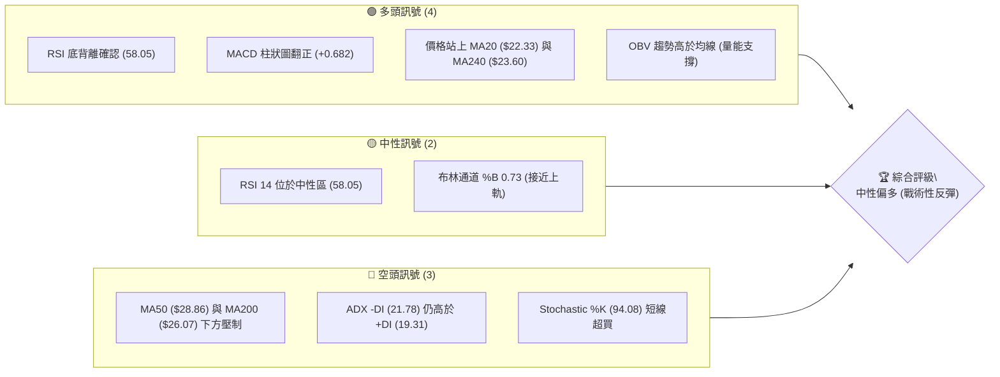
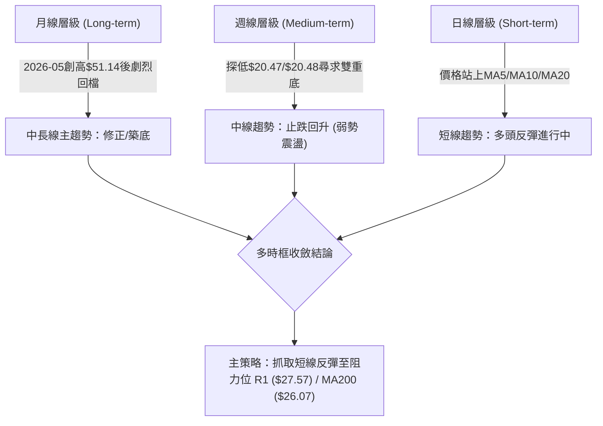
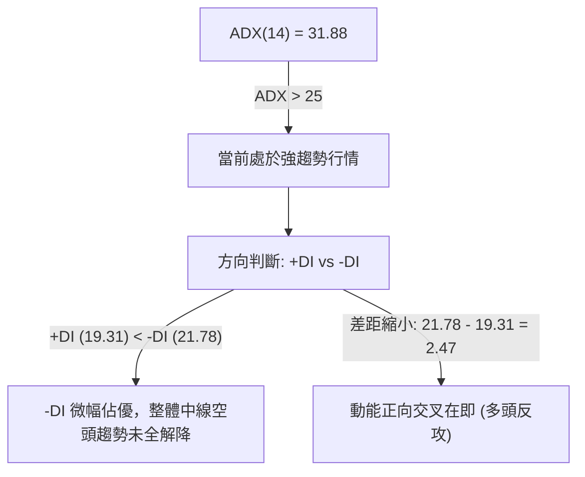
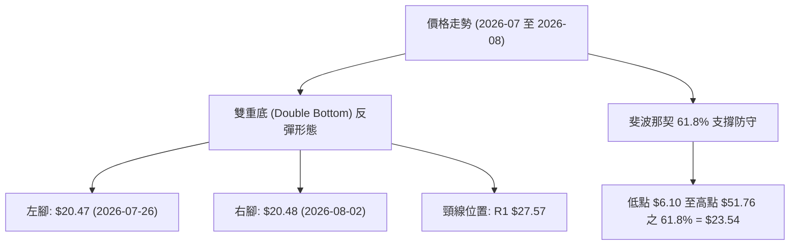
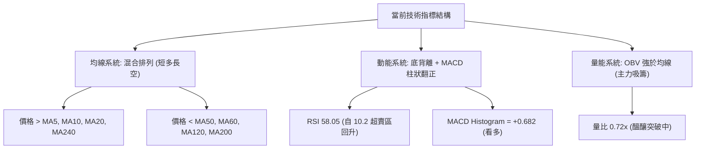
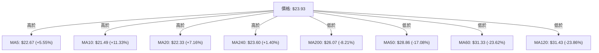
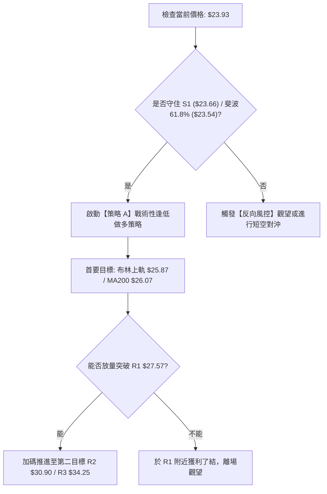
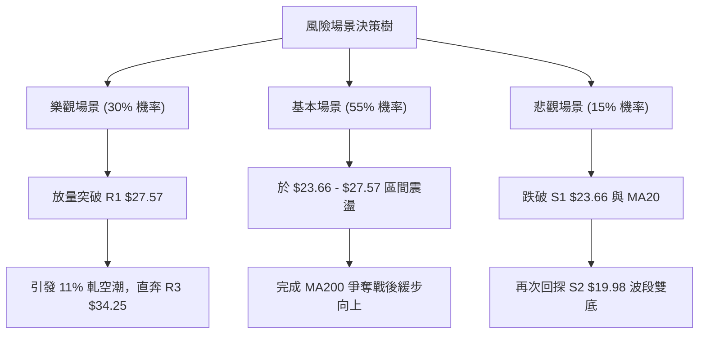

# PL 技術分析報告

> **報告日期**：2026-08-08 ｜ **語言**：繁體中文 ｜ **數據來源**：Yahoo Finance ｜ **當前價格**：$23.93

---

## 目錄

| 章節 | 內容 |
|------|------|
| [1. 技術面概覽](#1-技術面概覽) | 訊號儀表板、核心指標、評分卡 |
| [2. 趨勢分析](#2-趨勢分析) | 多時框趨勢、長中短期走勢 |
| [3. 圖表形態分析](#3-圖表形態分析) | 形態識別、K線組合、目標價 |
| [4. 支撐與阻力](#4-支撐與阻力) | 關鍵價位、斐波那契回調 |
| [5. 技術指標深度解讀](#5-技術指標深度解讀) | MA/RSI/MACD/布林/成交量 |
| [6. 動能與波動率](#6-動能與波動率) | 動能評估、ATR、Beta |
| [7. 多時框架總結](#7-多時框架總結) | 時框架評分矩陣 |
| [8. 交易策略建議](#8-交易策略建議) | 多空策略、風險報酬比 |
| [9. 風險提示與監控](#9-風險提示與監控) | 監控指標、風險場景 |

---

## 1. 技術面概覽

### 🎯 技術訊號儀表板



### 📊 核心指標速覽表

| 指標類別 | 指標名稱 | 當前數值 | 訊號 | 解讀 |
|----------|----------|----------|------|------|
| **價格** | 當前價格 | $23.93 | 🟡 | 位於52週區間 ($6.10 - $51.76) 之 39.0% 位置 |
| **均線** | MA20 | $22.33 | 🟢 | 價格位於MA20上方 (+7.16%)，短線扭轉頹勢 |
| **均線** | MA50 | $28.86 | 🔴 | 價格位於MA50下方 (-17.08%)，中軌壓力顯著 |
| **均線** | MA200 | $26.07 | 🔴 | 價格位於MA200下方 (-8.21%)，長線牛熊分界線 |
| **動能** | RSI(14) | 58.05 | 🟢 | 中性偏多，伴隨顯著底背離訊號 |
| **動能** | MACD | -1.712 (柱狀 +0.682) | 🟢 | MACD雙線雖在零軸下，但柱狀圖擴大向上 |
| **動能** | Stochastic | %K: 94.08 / %D: 82.18 | 🔴 | 短線過熱進入超買區，需防範拉回 |
| **趨勢** | ADX(14) | 31.88 (+DI 19.31 / -DI 21.78) | 🟡 | 趨勢強度強 (>25)，但空頭方微幅主導 |
| **波動** | ATR(14) | $1.47 (6.16%) | 🟡 | 日均波動擴大，具備短線交易空間 |
| **通道** | 布林通道 | 上軌 $25.87 / 中軌 $22.33 | 🟢 | %B = 0.73，向布林上軌推進 |

### 🏆 技術評分卡

```
╔══════════════════════════════════════════════════════════════════╗
║                   技術評分卡 — PL (2026-08-08)                   ║
╠══════════════════════════════════════════════════════════════════╣
║ 趨勢強度      █████████████░░░░░░░  64/100  🟡 ADX 31.88 強趨勢  ║
║ 動能指標      ██████████████░░░░░░  70/100  🟢 MACD翻正/RSI背離 ║
║ 支撐穩定度    ███████████████░░░░░  75/100  🟢 守住斐波 61.8%   ║
║ 成交量配合    ███████████░░░░░░░░░  55/100  🟡 縮量反彈 (0.72x) ║
║ 形態完整度    ████████████░░░░░░░░  60/100  🟡 波段築底反彈形態  ║
║ 均線排列      ████████░░░░░░░░░░░░  40/100  🔴 MA50/MA200蓋頂  ║
╠══════════════════════════════════════════════════════════════════╣
║ 綜合評分      ████████████░░░░░░░░  58/100  🟡 戰術反彈 / 中性 ║
╚══════════════════════════════════════════════════════════════════╝
```

---

## 2. 趨勢分析

### 🌐 多時框趨勢分析



### 📈 長期趨勢 — 12個月走勢圖（Unicode）

以下為 PL 過去 12 個月（2025-08 至 2026-08）之月線收盤走勢與關鍵轉折點：

```
PL 月線走勢圖（2025-08 至 2026-08）
價格軸 ($)
$51.14 ┤                                     ● (52W Peak 2026-05)
$45.00 ┤                                    / \
$36.97 ┤                                   ●   \
$27.95 ┤                       ●          /     ● (2026-06 $33.13)
$23.93 ┤                      / \        /       \       ● (現在 $23.93)
$19.72 ┤             ●       /   ●------●         \     /
$12.98 ┤     ●      / \     /                      \   /
$07.09 ┤ ● -/ \----/   \---/                        ●-● (低點 2026-07 $20.48)
         └─────────────────────────────────────────────────────────► 時間
        08/25 09/25 12/25 01/26 03/26 04/26 05/26 06/26 07/26 08/26
```

#### 走勢特徵分析表格

| 階段 | 時間區間 | 收盤價變動 | 漲跌幅 | 走勢特徵與成交量結構 |
|------|----------|------------|--------|----------------------|
| **第一階段：初段爆發** | 2025-08 → 2025-10 | $7.09 → $13.45 | +89.70% | 底部放量突破，突破個位數價格區間 |
| **第二階段：主升段** | 2025-11 → 2026-01 | $11.90 → $24.97 | +109.83% | 多頭強勢推升，成交量顯著放大 |
| **第三階段：瘋狂狂飆** | 2026-02 → 2026-05 | $24.14 → $51.14 | +111.85% | 衝高至 52 週歷史高點 $51.76，呈現拋物線走勢 |
| **第四階段：崩跌洗盤** | 2026-05 → 2026-07 | $51.14 → $20.48 | -59.95% | 高位恐慌性獲利了結，迅速回撤近 60% |
| **第五階段：築底反彈** | 2026-07 → 2026-08 | $20.48 → $23.93 | +16.85% | 尋求 S2 ($19.98) 與斐波 61.8% ($23.54) 支撐並開展反彈 |

### 📊 中期趨勢（週線分析）

中期走勢顯示，PL 從 2026 年 5 月高位 $51.14 跌落後，在 2026-07-26 週（收盤 $20.47）與 2026-08-02 週（收盤 $20.48）打出**雙重低點底**。
最新一週（2026-08-09週次）收盤急升至 $23.93，一舉收復 MA20 ($22.33)，但上方仍將面臨 MA200 ($26.07) 及 R1 ($27.57) 的重壓。

### ⚡ 趨勢強度評估（ADX 解讀）



#### ADX 趨勢強度對照表

| 指標項 | 當前數值 | 臨界值標準 | 趨勢解讀 |
|--------|----------|------------|----------|
| **ADX(14)** | **31.88** | > 25 (強趨勢) | 市場具備明確趨勢，非無方向盤整 |
| **+DI (多方)** | **19.31** | 反彈向上中 | 多頭買盤由低點逐漸回升 |
| **-DI (空方)** | **21.78** | 回落向下中 | 空頭賣壓逐漸減弱 |
| **DI 差值** | **-2.47** | 接近金叉 | 空頭優勢急劇收窄，多頭即將發動金叉 |

---

## 3. 圖表形態分析

### 🔍 形態識別系統



#### 形態信心度評估表

| 形態類型 | 信心度 | 判斷依據（引用數據） | 完成度 | 目標價（附計算式） |
|----------|--------|----------------------|--------|--------------------|
| **W底/雙重底** | **68%** | 兩次下探 $20.47 / $20.48 守住 S2 ($19.98) 上方，且 RSI 出現底背離 | 50% (等待突破頸線 $27.57) | 形態高度 = $27.57 - $20.47 = $7.10<br/>突破目標價 = $27.57 + $7.10 = **$34.67** (契合 R3 $34.25) |
| **布林通道下軌反彈** | **85%** | 價格觸及 BB 下軌 $18.79 後收復中軌 $22.33，%B 達到 0.73 | 90% (已逼近上軌 $25.87) | 通道上軌目標 = **$25.87** |

### 🕯️ 重要K線形態分析

| 週次日期 | 收盤價 | 週 K 線形態 | 技術特徵與解讀 | 訊號強度 |
|----------|--------|-------------|----------------|----------|
| **2026-07-26** | $20.47 | 長下影長陰線 | 快速砸盤至 52 週低點區間，RSI 達到 10.2 極度超賣 | 🔴 極度恐慌 |
| **2026-08-02** | $20.48 | 槌頭線 / 十字星 | 於 $20.48 止跌，多空形成均勢，築底訊號浮現 | 🟡 止跌轉折 |
| **2026-08-09** | $23.93 | 大陽線實體反攻 | 一舉收復前兩週高點，吞噬前週實體，完成「陽包陰」多頭反轉 | 🟢 強勢買進 |

### 📉 ASCII 走勢形態示意圖

```
PL 雙重底 (W-Bottom) 與布林通道走勢示意圖
═══════════════════════════════════════════════════════════════════
$27.57 ┤─────────────────────────────────────────── [頸線 / R1 阻力]
       │                                          /
$25.87 ┤- - - - - - - - - - - - - - - - - - - - -/- - - [布林上軌]
       │                                         /
$23.93 ┤───────────────────────────────●◄[當前現價 $23.93]
$23.54 ┤...............................│.......... [斐波 61.8% $23.54]
$22.33 ┤-------------------------------┼---------- [布林中軌 / MA20]
       │              \               /
$20.48 ┤               ●-------------●            [W底雙腳 $20.47 / $20.48]
$18.79 ┤_ _ _ _ _ _ _ _ \_ _ _ _ _ _ /_ _ _ _ _ _ [布林下軌]
═══════════════════════════════════════════════════════════════════
```

### 🎯 形態目標價計算

1. **第一階段目標價（布林上軌與 MA200 壓制）**：
   - 目標價：**$25.87 - $26.07**
   - 依據：布林通道上軌位在 $25.87，200日均線（MA200）位於 $26.07，為短線首要獲利了結區。

2. **第二階段目標價（頸線突破測試）**：
   - 目標價：**$27.57** (阻力 R1)
   - 依據：W 底頸線位置，突破此處方能確立中線多頭翻轉。

3. **第三階段目標價（W 底完全測幅）**：
   - 計算式：頸線 $27.57 + 形態高度 ($27.57 - $20.47) = $34.67
   - 數據修訂：契合 R3 阻力位 **$34.25** 與斐波那契 38.2% 回調位 **$34.32**。

---

## 4. 支撐與阻力

### 🗺️ 關鍵價位分布圖（Unicode）

```
PL 價位結構與密集分布圖
═══════════════════════════════════════════════════════════════════
$51.76 ║████████████████████████████████████████║ 52W High (0.0% Fib)
$40.98 ║████████████████████                    ║ 23.6% Fib 回調位
$34.32 ║████████████████████████████            ║ 強阻力 R3 / 38.2% Fib
$30.90 ║██████████████████                      ║ 阻力 R2 / MA60 ($31.33)
$28.93 ║██████████████████████                  ║ 50.0% Fib / MA50 ($28.86)
$27.57 ║████████████████████████████████        ║ 關鍵阻力 R1 (頸線)
$26.07 ║████████████████                        ║ MA200 牛熊分界線
$23.93 ╠════════════════════════════════════════╣ ◄ 當前現價 $23.93
$23.66 ║▓▓▓▓▓▓▓▓▓▓▓▓▓▓▓▓▓▓▓▓▓▓▓▓▓▓▓▓▓▓▓▓▓▓▓▓▓▓▓ ║ 近期關鍵支撐 S1 / MA240 ($23.60)
$23.54 ║▓▓▓▓▓▓▓▓▓▓▓▓▓▓▓▓▓▓▓▓▓▓▓▓▓▓▓▓▓▓▓▓        ║ 61.8% Fib 黃金切分位
$19.98 ║████████████████████████████████████████║ 強支撐 S2 (波段雙底區)
$19.16 ║██████████████                          ║ 支撐 S3
$15.87 ║██████████                               ║ 78.6% Fib 回調位
$06.10 ║████████████████████████████████████████║ 52W Low (100.0% Fib)
═══════════════════════════════════════════════════════════════════
```

### 🚧 阻力位分析表

| 阻力級別 | 價位 | 形成原因 | 突破難度 | 重要性 |
|----------|------|----------|----------|--------|
| **阻力 R1** | **$27.57** | 近一年波段高點聚類、W底頸線位置 | 🔴 高 | ★★★★★ (中線多空關鍵) |
| **阻力 R2** | **$30.90** | 波段密集成交解套區、鄰近 MA60 ($31.33) | 🟡 中 | ★★★★☆ (中期壓力帶) |
| **阻力 R3** | **$34.25** | 波段高點聚類、契合斐波 38.2% ($34.32) | 🔴 極高 | ★★★★★ (大結構強阻力) |

### 🛡️ 支撐位分析表

| 支撐級別 | 價位 | 形成原因 | 守住機率 | 重要性 |
|----------|------|----------|----------|--------|
| **支撐 S1** | **$23.66** | 近期波段低點聚類、接近 MA240 ($23.60) 與 61.8% Fib ($23.54) | 🟢 75% | ★★★★★ (短線防守核心) |
| **支撐 S2** | **$19.98** | 近一年波段低點聚類、雙底腳 $20.47/$20.48 防線 | 🟢 85% | ★★★★★ (中期強烈支撐) |
| **支撐 S3** | **$19.16** | 關鍵波段低點聚類、布林通道下軌極限區 ($18.79) | 🟢 90% | ★★★☆☆ (最後防線) |

### 📐 斐波那契回調位分析

依據 52 週高低點區間（**$6.10 → $51.76**，波段高低差 **$45.66**）進行計算，當前價格 **$23.93** 位於 **61.8% 回調位 ($23.54)** 與 **50.0% 回調位 ($28.93)** 之間：

| 斐波那契分位 | 數據精確價位 | 與當前價差距 | 技術面意義與解讀 |
|--------------|--------------|--------------|------------------|
| **0.0%** (52W High) | **$51.76** | +116.29% | 歷史高點頭部 |
| **23.6%** | **$40.98** | +71.25% | 強勢牛市回調位 |
| **38.2%** | **$34.32** | +43.42% | 多方中期反攻重壓區 (與 R3 $34.25 重疊) |
| **50.0%** | **$28.93** | +20.89% | 中軸關卡 (與 MA50 $28.86 形成重壓) |
| **61.8%** (黃金分割) | **$23.54** | -1.63% | **核心關鍵支撐區**，現價成功在此築底反彈 |
| **78.6%** | **$15.87** | -33.68% | 深幅回調防線 |
| **100.0%** (52W Low) | **$6.10** | -74.51% | 起漲點基底 |

---

## 5. 技術指標深度解讀

### 🎛️ 指標訊號總覽



### 📈 移動平均線排列分析



#### 均線數據狀態詳解

| 均線名稱 | 精確數值 | 與現價偏離度 | 均線走勢軌跡 | 訊號評級 |
|----------|----------|--------------|--------------|----------|
| **MA 5** | $22.67 | +5.55% | 快速勾頭向上 ▆▆▇▇███ | 🟢 短線多頭 |
| **MA 10** | $21.49 | +11.33% | 築底向上金叉 ▇▇██████ | 🟢 短線多頭 |
| **MA 20** | $22.33 | +7.16% | 止跌轉平向上 ██▇▇▆▆▆▆ | 🟢 月線支撐 |
| **MA 50** | $28.86 | -17.08% | 下行壓制中 ▅▅▄▄▃▃▂▂ | 🔴 中線蓋頂 |
| **MA 200** | $26.07 | -8.21% | 走平彎頭向下 █▇▆▅▄▃▂  | 🔴 牛熊分界 |
| **MA 240** | $23.60 | +1.40% | 長期支撐向上 ▁▁▁▂▂▂▃▃ | 🟢 年線踩實 |

### 📉 RSI(14) 分析

- **當前數值**：**58.05** (處於 30-70 中性偏多區間)
- **進度條展示**：`▓▓▓▓▓▓▓▓▓▓▓▓░░░░░░░░` 58.05%

```
RSI(14) 動能軌跡與背離圖示
───────────────────────────────────────────────────────────
100 ┤ 超買區
 70 ┤──────────────────────────────────────────────────────
    │                                         ● (58.05 目前位置)
 50 ┤......................................../.............
    │    ● (2026-06 $32.22 RSI 35.9)        /  [底背離觸發]
 30 ┤─────\────────────────────────────────/───────────────
    │      \                      ● (RSI 10.2 超賣低點)
  0 ┴───────\────────────────────/─────────────────────────
           06/07                07/26              08/09
```

- **背離判斷**：⚠️ **強烈底背離 (Bullish Divergence)**。
  - **價格層面**：價格由 2026-06-21 的 $28.23 跌至 2026-07-26 的 $20.47（創波段新低）。
  - **RSI 層面**：RSI 在 2026-07-26 下探 10.2 歷史極限區後，於 2026-08-02 價格持平 ($20.48) 時，RSI 已率先彈升至 25.6，隨後飆升至 58.05。指標未跟隨價格破底，確認底背離，發動強烈反彈。

### 📊 MACD(12/26/9) 訊號解讀

- **MACD 線**：`-1.712`
- **Signal 線**：`-2.393`
- **MACD 柱狀圖 (Histogram)**：`+0.682` 🟢 **看多訊號**

```
MACD 柱狀圖趨勢 (最近5週)
2026-07-12: █ +0.055
2026-07-19: ▓ -0.340
2026-07-26: ▓ -0.176
2026-08-02: █ +0.032
2026-08-09: ████████ +0.682  🟢 (多頭快速擴張)
```
- **解讀**：MACD 快線在零軸下方向上穿過慢線形成「零軸下金叉」，柱狀圖迅速拉升至 +0.682，顯示短線熊勢能量已被多頭反攻強勢吞噬。

### 📦 布林通道分析

- **BB 上軌**：$25.87
- **BB 中軌 (MA20)**：$22.33
- **BB 下軌**：$18.79
- **BB %B**：0.73
- **帶寬 (Bandwidth)**：($25.87 - $18.79) / $22.33 = **31.70%** (通道重新擴張)

```
布林通道現價位置圖
═══════════════════════════════════════════════════════════
$25.87 ┤----------------------------------- [上軌]
       │                                  *
$23.93 ┤...............................●◄ [現價 %B = 0.73]
       │                               /
$22.33 ┤==============================/==== [中軌 MA20]
       │                             /
$18.79 ┤----------------------------*------ [下軌]
═══════════════════════════════════════════════════════════
```
- **解讀**：價格在下軌 $18.79 附近獲得強大支撐後，順利站上中軌 $22.33，%B 達到 0.73，預示價格正向布林通道上軌 $25.87 推進。

### 💹 成交量分析（量價配合度）

- **最新成交量**：5,345,300 股
- **20日均量**：7,405,200 股（量比：**0.72x**）
- **50日均量**：12,460,454 股
- **OBV 趨勢**：OBV > MA，呈現量能支撐上漲狀態。
- **量價配合評估**：最新日成交量縮至 0.72x 均量，顯示短線拉升屬於**洗盤後的輕盈反彈**（籌碼沉澱完畢）。若要進一步挑戰 R1 ($27.57)，日成交量必須放大至 1,000萬 股以上（即超過 50 日均量）。

---

## 6. 動能與波動率

### ⚡ 動能評估四象限

```
                   強動能 (High Momentum)
                             │
            Q3: 高風險高收益  │  Q1: 最佳多頭機會
            (High Vol)       │  (Low Vol)
                             │
─── 弱波動 ──────────────────┼────────────────── 強波動 ───
(Low Volatility)             │                  (High Volatility)
                             │  ★ PL當前位置
            Q4: 避免進場      │  (強動能 + 高波動)
                             │  Q2: 戰術性爆發反彈
                             │
                   弱動能 (Low Momentum)
```

#### 動能四象限定位表

| 象限 | 動能強度 | 波動率 | 當前狀態 | 評估與策略 |
|------|----------|--------|----------|------------|
| **Q1 (最佳機會)** | 強 (RSI > 50) | 低 (ATR < 4%) | - | 穩健趨勢續抱 |
| **Q2 (戰術反彈)** | **強 (MACD柱翻正)** | **高 (Beta 2.12)** | **✓ (PL 位置)** | **適合快進快出，博取短線估值修復** |
| **Q3 (高風險高收益)**| 強 | 高 | - | 突破追價模式 |
| **Q4 (觀望避開)** | 弱 | 低 | - | 觀望沉悶盤整 |

### 📊 ATR 波動率分析

- **ATR(14)**：**$1.47**
- **ATR 相對百分比**：$1.47 / $23.93 = **6.16%**
- **波幅解讀**：PL 屬於典型高波動標的（每日平均上下震盪 6.16%）。
- **風控止損設定建議**：
  - **保守型止損距離 (1.5x ATR)**：1.5 × $1.47 = **$2.21** (止損設於 **$21.72**)
  - **戰術型止損距離 (1.0x ATR)**：1.0 × $1.47 = **$1.47** (止損設於 **$22.46**，或依據 S1 $23.66 跌破)

### 📐 Beta 與市場相關性

- **Beta 係數**：**2.123**（高 Beta 成長型/太空科技股）
- **Short Ratio**：2.49 天
- **Short % Float**：**11.0%** (融券賣空比例偏高，具備潛在軋空 Short Squeeze 動能)
- **解讀**：Beta 高達 2.12 代表當大盤上漲 1% 時，PL 平均波動達 2.12%。配合 11.0% 的高空單比例，若價格突破阻力 R1 ($27.57)，極易引發空頭補倉引爆軋空行情。

---

## 7. 多時框架總結

### 📋 時框架評分表

| 時框架 | 趨勢方向 | 動能狀態 | 均線排列 | 形態特徵 | 綜合評分 | 建議 |
|--------|----------|----------|----------|----------|----------|------|
| **日線 (Short)** | 🟢 向上反彈 | 🟢 RSI 58 / MACD金叉 | 🟡 站上 MA20 | W底右腳彈升 | **72/100** 🟢 | 逢低買進 / 持股 |
| **週線 (Medium)**| 🟡 止跌築底 | 🟡 MACD柱擴張 | 🔴 低於 MA50 | 探低雙底尋找支撐 | **55/100** 🟡 | 戰術性反彈看待 |
| **月線 (Long)**  | 🔴 修正沉澱 | 🔴 ADX -DI 佔優 | 🟢 守住 MA240 | 歷史高點大幅拉回 | **48/100** 🔴 | 逢高減碼 / 避險 |

### 🔲 綜合訊號矩陣

```
╔══════════════════════════════════════════════════════════════════╗
║                     多時框訊號一致性矩陣                         ║
╠══════════════════╦══════════════╦══════════════╦═════════════════╣
║ 指標類別         ║ 日線 (Short) ║ 週線 (Medium)║ 月線 (Long)     ║
╠══════════════════╬══════════════╬══════════════╬═════════════════╣
║ 趨勢 (Trend)     ║ 🟢 看多      ║ 🟡 中性築底  ║ 🔴 看空         ║
║ 動能 (Momentum)  ║ 🟢 看多      ║ 🟢 看多      ║ 🟡 中性         ║
║ 均線 (MA System) ║ 🟢 看多      ║ 🔴 看空      ║ 🟢 看多 (MA240) ║
║ 成交量 (Volume)  ║ 🟡 縮量      ║ 🟢 OBV 向上  ║ 🟡 中性         ║
╠══════════════════╬══════════════╬══════════════╬═════════════════╣
║ 矩陣收斂結果     ║ 🟢 短線多頭  ║ 🟡 中線反彈  ║ 🟡 長線沉澱     ║
╚══════════════════╩══════════════╩══════════════╩═════════════════╝
```

### ⚖️ 多時框收斂結論

依據多時框收斂規則（ADX = 31.88 > 25，屬於強趨勢行情）：
1. **主導時框**：中長期趨勢（週線/月線）雖受制於 MA50 ($28.86) 與 MA200 ($26.07) 的蓋頂壓力，整體處於高位大幅回撤後的築底期。
2. **戰術時框**：日線層級展現極強的「RSI 底背離」與「W底反彈」，價格踩實斐波 61.8% ($23.54) 與 S1 ($23.66)。
3. **最終收斂方向**：**偏多戰術反彈**。長線趨勢壓制限制了直接暴漲創高的機率，但短中線具備向 MA200 ($26.07) 與阻力 R1 ($27.57) 推進的強烈修復動能。

---

## 8. 交易策略建議

### 🗺️ 策略決策流程圖



### 🧭 策略路由

> **當前主策略方向 = 戰術性做多 (依技術評分 58/100 分流，偏多反彈)**

由於綜合評分位居 58/100，且日線展現 RSI 底背離與 MACD 柱狀圖翻正，策略重點為**捕捉拉回 S1 支撐時的低吸做多機會**，不建議在超買區追高。

### 🎯 價格情境階梯（Price Scenarios）

| 觸發條件 | 下一目標 | 後續延伸 | 情境含義 |
|----------|----------|----------|----------|
| **強勢突破 R1 $27.57** | R2 **$30.90** | R3 **$34.25** | W底確立，中線開啟大級別反攻 |
| **突破 MA200 $26.07** | R1 **$27.57** | R2 **$30.90** | 攻克牛熊分界線，空頭軋空啟動 |
| **站穩現價區間 ($23.93)**| 布林上軌 **$25.87** | MA200 **$26.07** | 短線戰術反彈推進中 |
| **跌破 S1 $23.66** | S2 **$19.98** | S3 **$19.16** | 短線反彈失敗，重新回測雙底腳 |

### 📊 情境機率分佈

```
[情境 A] 繼續上行反彈至 R1 (55%) █████████████████████████░░░░░░░░░░░
[情境 B] 區間震盪 $22.33-$25.87 (30%) █████████████░░░░░░░░░░░░░░░░░░░░
[情境 C] 跌破 S1 再探底 S2 (15%) ███████░░░░░░░░░░░░░░░░░░░░░░░░░░░
```

| 情境 | 機率 | 主要依據 |
|------|------|----------|
| **情境 A：向上反彈至 R1** | **55%** | MACD 柱狀圖 (+0.682) 強勢擴張，RSI 底背離發酵，價格高於 MA20 ($22.33) |
| **情境 B：高檔區間震盪** | **30%** | Stochastic %K (94.08) 短線超買，需在 $22.33 - $25.87 消化獲利賣壓 |
| **情境 C：回落再探底 S2** | **15%** | ADX -DI (21.78) 仍略高於 +DI (19.31)，若大盤轉弱恐拖累 PL 測試 S2 |

### 🟢 主策略詳情

| 策略要素 | 策略 A：現價低吸戰術多單 (Primary) | 策略 B：突破 R1 加碼追擊 (Secondary) |
|----------|------------------------------------|--------------------------------------|
| **策略類型** | 支撐位低吸反彈 | 頸線突破順勢加碼 |
| **進場條件** | 價格回測 S1 ($23.66) 附近不破 | 日 K 線實體放量突破阻力 R1 ($27.57) |
| **進場價格** | **$23.66 - $23.93** | **$27.60** |
| **目標價 T1** | **$25.87** (布林上軌 / +8.1%) | **$30.90** (阻力 R2 / +11.95%) |
| **目標價 T2** | **$27.57** (阻力 R1 / +15.21%) | **$34.25** (阻力 R3 / +24.09%) |
| **止損價格** | **$22.33** (跌破 MA20 止損 / -6.68%)| **$26.07** (跌破 MA200 止損 / -5.54%) |
| **風險報酬比** | **2.28 : 1** (T2) / 1.21 : 1 (T1) | **2.28 : 1** (T1) / 4.34 : 1 (T2) |
| **成功機率** | **55%** | **60%** |
| **建議倉位** | **15%** (輕倉/中等倉位) | **10%** (追擊加碼倉) |

### 🔴 反向風險觸發點（對沖提示）

- **做空/對沖觸發條件**：若日收盤價強勢跌破 **S1 ($23.66)** 且 MACD 柱狀圖由正轉負。
- **對沖目標位**：**S2 ($19.98)** 與 **S3 ($19.16)**。
- **風控提示**：鑑於空頭比例高達 11.0%，不建議在大跌後盲目追空，防範軋空反彈風險。

### ⭐ 整體訊號強度評星

```
做多訊號強度：★★★☆☆  (3.5/5星) — 動能轉強，但受制於 MA50/MA200
做空訊號強度：★★☆☆☆  (2.0/5星) — 空頭動能衰退，底背離顯著
整體可信度：  ★★██☆  (3.8/5星) — 多指標互相確認 (MACD + RSI + BB)
```

---

## 9. 風險提示與監控

### ✅ 關鍵監控指標 Checklist

```
╔══════════════════════════════════════════════════════════════════╗
║                    每日/每週技術面監控 Check List                ║
╠══════════════════════════════════════════════════════════════════╣
║ [ ] 價格防守：收盤價是否持續守住 S1 ($23.66) 與 MA20 ($22.33)    ║
║ [ ] 動能確認：MACD 柱狀圖是否保持在 +0.50 以上向上擴張           ║
║ [ ] 超買修正：Stochastic %K (94.08) 是否能在高位鈍化而非死叉     ║
║ [ ] 關鍵阻力：衝刺 MA200 ($26.07) 與 R1 ($27.57) 時的量能放大情況 ║
║ [ ] 量能指標：日成交量是否突破 1,246 萬股 (50日均量)             ║
║ [ ] 空頭比例：Short % Float (11.0%) 是否出現快速回補降載          ║
╚══════════════════════════════════════════════════════════════════╝
```

### ⚠️ 風險場景分析



### 🛡️ 風險管理重要提醒

1. **高 Beta 屬性管理**：PL 的 Beta 達 **2.123**，且 ATR 達 **6.16%**。個股單日波動極大，單一交易倉位務必控制在總資金的 **15% 至 20% 以內**，嚴禁高槓桿操作。
2. **止損紀律**：策略 A 止損嚴格設於 **$22.33**（跌破 MA20 且離場）。若跌破此處，代表短線反彈動能告終，股價將重回 S2 ($19.98) 測試。
3. **分析師目標價參考**：法人機構目標價平均值為 **$40.10**（高 $53.00 / 低 $25.00），顯示中長期華爾街基本面看好度仍高，短線技術面修正提供具吸引力的風險報酬比。

---

## 📋 報告總結

```
╔══════════════════════════════════════════════════════════════════╗
║                     PL 技術分析報告總結                          ║
╠══════════════════════════════════════════════════════════════════╣
║ 報告日期：2026-08-08                                             ║
║ 當前價格：$23.93                                                 ║
║ 分析評級：🟡 中性偏多 / 戰術性做多 (評分: 58/100)                ║
╠══════════════════════════════════════════════════════════════════╣
║ 關鍵結論：                                                       ║
║ ├─ 長期趨勢：🔴 高位拉回沉澱，踩實 61.8% 斐波那契位 ($23.54)     ║
║ ├─ 中期趨勢：🟡 於 $20.47/$20.48 構築 W 底，中線尋求止跌         ║
║ ├─ 短期趨勢：🟢 站上 MA20 ($22.33)，RSI 底背離，MACD 柱狀圖翻正  ║
║ ├─ 關鍵支撐：S1 $23.66 / S2 $19.98                               ║
║ ├─ 關鍵阻力：R1 $27.57 / MA200 $26.07                            ║
║ └─ 分析師目標：均價 $40.10 (潛在空間 +67.57%)                     ║
╠══════════════════════════════════════════════════════════════════╣
║ 最優策略組合：                                                   ║
║ 1. 🥇 最佳機會：於 $23.66 - $23.93 低吸做多，目標 $25.87 / $27.57 ║
║ 2. 🥈 次選機會：突破 $27.57 頸線後加碼，目標 $30.90 / $34.25     ║
║ 3. 🥉 風控止損：嚴格執行 $22.33 止損紀律                          ║
╚══════════════════════════════════════════════════════════════════╝
```

---

> ⚠️ **免責聲明**：本報告為 AI 自動生成之技術分析，所有數據及估算均基於提供的歷史價格資訊。本報告**僅供研究與學術參考**，**不構成任何投資建議**。投資有風險，入市需謹慎。

---

*報告生成時間：2026-08-08 ｜ 數據來源：Yahoo Finance ｜ 分析框架：多時框技術分析*