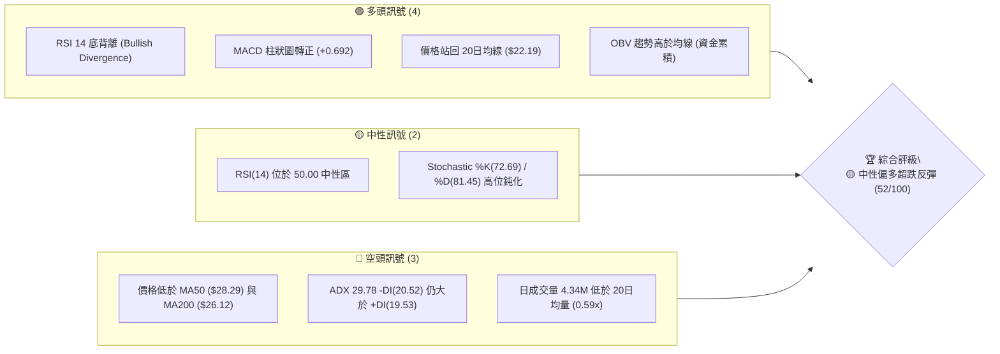
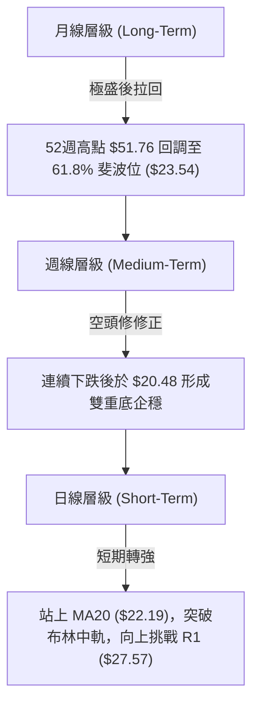
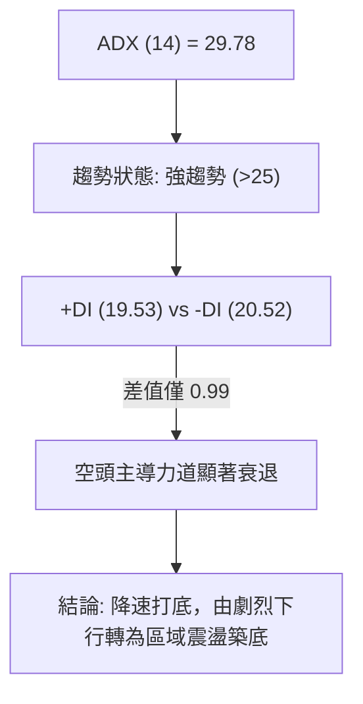
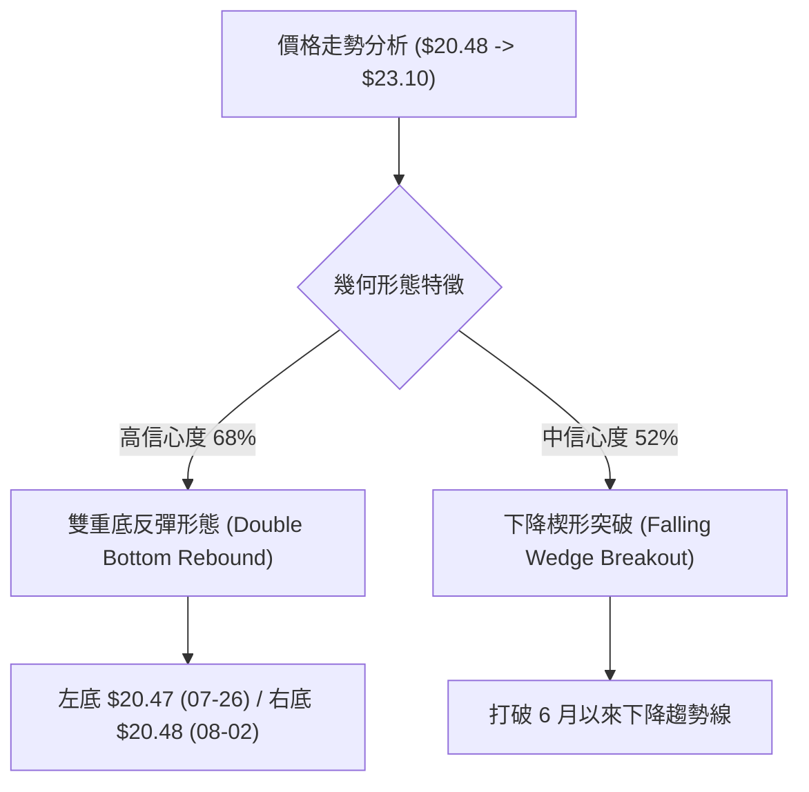
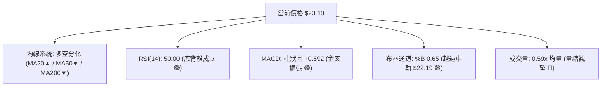
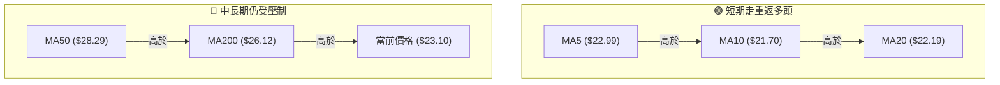
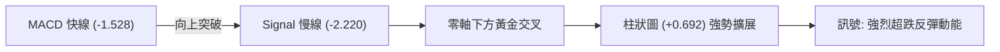
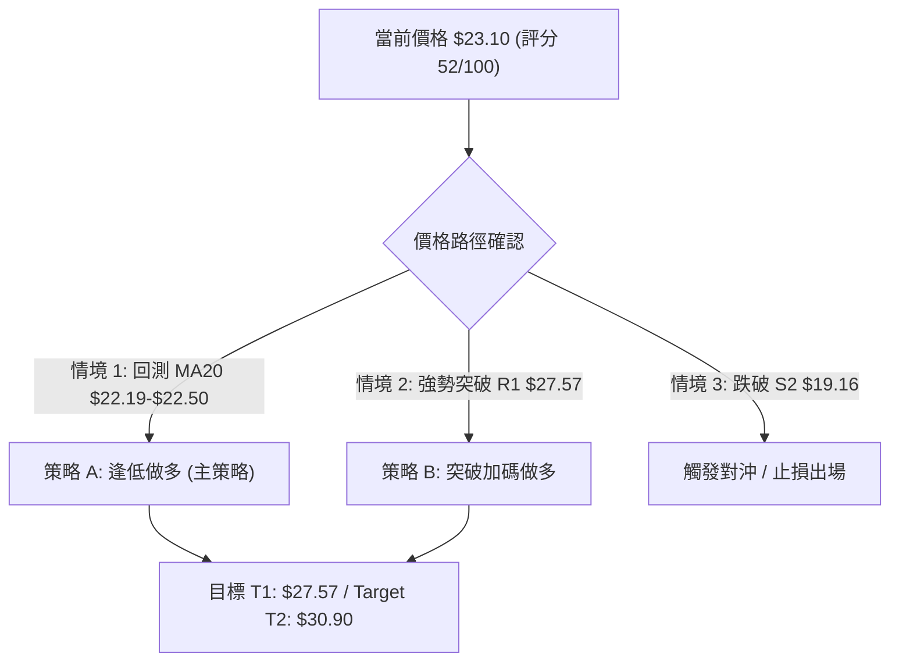
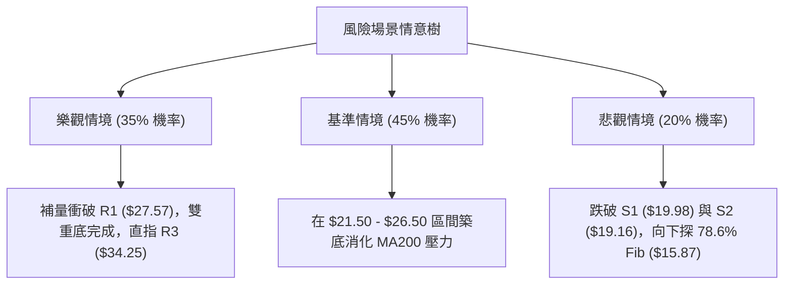

# PL 技術分析報告

> **報告日期**：2026-08-10 ｜ **語言**：繁體中文 ｜ **數據來源**：Yahoo Finance ｜ **當前價格**：$23.10

---

## 目錄

| 章節 | 內容 |
|------|------|
| [1. 技術面概覽](#1-技術面概覽) | 訊號儀表板、核心指標、評分卡 |
| [2. 趨勢分析](#2-趨勢分析) | 多時框趨勢、長中短期走勢 |
| [3. 圖表形態分析](#3-圖表形態分析) | 形態識別、K線組合、目標價 |
| [4. 支撐與阻力](#4-支撐與阻力) | 關鍵價位、斐波那契回調 |
| [5. 技術指標深度解讀](#5-技術指標深度解讀) | MA/RSI/MACD/布林/成交量 |
| [6. 動能與波動率](#6-動能與波動率) | 動能評估、ATR、Beta |
| [7. 多時框架總結](#7-多時框架總結) | 時框架評分矩陣 |
| [8. 交易策略建議](#8-交易策略建議) | 多空策略、風險報酬比 |
| [9. 風險提示與監控](#9-風險提示與監控) | 監控指標、風險場景 |

---

## 1. 技術面概覽

### 🎯 技術訊號儀表板



### 📊 核心指標速覽表

| 指標類別 | 指標名稱 | 當前數值 | 訊號 | 解讀 |
|----------|----------|----------|------|------|
| **價格** | 當前收盤價 | $23.10 | 🟡 中性 | 位於 52 週區間 ($6.10 - $51.76) 之 37.2% 位階 |
| **均線** | MA20 (短期) | $22.19 | 🟢 看多 | 股價站上短期生命線（高出 +4.11%） |
| **均線** | MA50 (中期) | $28.29 | 🔴 看空 | 股價位於中期壓力線下方（相差 -18.35%） |
| **均線** | MA200 (長期) | $26.12 | 🔴 看空 | 股價位於牛熊分界線下方（相差 -11.56%） |
| **動能** | RSI(14) | 50.00 | 🟢 看多 | 指標回到中性軸，且出現極高可信度之底背離 |
| **動能** | MACD (12,26,9)| -1.528 / +0.692 | 🟢 看多 | MACD 柱狀圖翻正，零軸下方金叉擴張 |
| **趨勢** | ADX(14) | 29.78 | 🟡 中性 | 強趨勢區間 (>25)，空頭力量減弱中 (-DI > +DI) |
| **波動** | ATR(14) | $1.49 | 🟡 中性 | 每日波動率 6.45%，高Beta屬性顯著 |
| **通道** | 布林通道 %B | 0.65 | 🟢 看多 | 價格越過中軌 ($22.19)，朝上軌 ($25.32) 推進 |
| **量能** | 20日量比 | 0.59x | 🔴 看空 | 量縮反彈，缺乏機構強攻大買盤 |

### 🏆 技術評分卡

```
╔══════════════════════════════════════════════════════════════════╗
║              PL 技術綜合評分卡  —  2026-08-10                     ║
╠══════════════════════════════════════════════════════════════════╣
║ 趨勢強度 (ADX)     ████████████░░░░░░░░  60/100  🟡 強趨勢減弱中  ║
║ 動能指標 (RSI/MACD) ██████████████░░░░░░  70/100  🟢 底背離金叉   ║
║ 支撐穩定度 (Fib)    ██████████████░░░░░░  70/100  🟢 61.8% 守住   ║
║ 成交量配合 (Volume) ████████░░░░░░░░░░░░  40/100  🔴 量縮價漲     ║
║ 形態完整度 (Pattern)████████████░░░░░░░░  60/100  🟡 探底反彈中   ║
║ 均線排列 (MA System)████████░░░░░░░░░░░░  40/100  🔴 混合空頭排列 ║
╠══════════════════════════════════════════════════════════════════╣
║ 綜合技術評分        ██████████░░░░░░░░░░  52/100  🟡 中性偏多反彈  ║
╚══════════════════════════════════════════════════════════════════╝
```

---

## 2. 趨勢分析

### 🌐 多時框趨勢分析



### 📈 長期趨勢 — 24個月走勢圖（Unicode）

```
PL 月線走勢圖（2024-08 至 2026-08）
價格軸 ($)
$55.00 ┤                                      ● (51.14 / 2026-05 最高 $51.76)
$50.00 ┤                                     ██
$45.00 ┤                                    ████
$40.00 ┤                                  ██████
$35.00 ┤                                 ████████
$30.00 ┤                                ██████████
$25.00 ┤                        ●     ████████████          ● ($23.10 目前)
$20.00 ┤                       ███   ██████████████        ██
$15.00 ┤                      █████ ████████████████      ██
$10.00 ┤                     ████████████████████████    ██
 $5.00 ┤ ●                 ████████████████████████████  ██
 $0.00 ┼─┴──┴──┴──┴──┴──┴──┴──┴──┴──┴──┴──┴──┴──┴──┴──┴──┴──┴──┴──
       24-08  24-11  25-01  25-04  25-07  25-09  25-12  26-03  26-05  26-07  26-08
```

#### 走勢特徵分析表格

| 階段 | 時間區間 | 價格變動區間 | 漲跌幅 | 走勢特徵與量能解讀 |
|------|----------|--------------|--------|----------------────|
| 1. 築底期 | 2024-08 ～ 2024-10 | $2.21 - $2.69 | 低位盤整 | 地面觀測市場清淡，量能沉寂 |
| 2. 初次主升段 | 2024-11 ～ 2025-01 | $3.93 - $6.10 | +126.8% | 衛星部署突破，機構資金開始進駐 |
| 3. 中期回調 | 2025-02 ～ 2025-05 | $6.10 - $3.29 | -46.1% | 籌碼沉澱，測試 $3.29 區域支撐 |
| 4. 瘋狂主升段 | 2025-06 ～ 2026-05 | $6.10 - $51.14 | +738.4% | 業績暴增 42.1%，月成交量急衝破億股，攻克 $51.76 歷史高點 |
| 5. 恐慌拋售段 | 2026-06 ～ 2026-07 | $51.14 - $20.48 | -59.9% | 高估值校正與獲利了結，成交量連放 1 億股暴跌 |
| 6. 尋求築底期 | 2026-08 至今 | $20.48 - $23.10 | +12.8% | 於斐波那契 61.8% ($23.54) 與 S1 ($19.98) 止跌反彈 |

### 📊 中期趨勢（週線分析）

```
週線關鍵支撐阻力結構圖
$34.25 ─────────────────────────────────────── R3 (38.2% Fib / 強阻力)
$30.90 ─────────────────────────────────────── R2 (波段高點 / MA60 / MA120)
$27.57 ─────────────────────────────────────── R1 (前波頸線 / MA200 $26.12)
$23.10 ═══════════════════════════════════════ ◄ 現價 (守住 61.8% Fib $23.54 區域)
$19.98 --------------------------------------- S1 (波段支撐 / 日線低點聚類)
$19.16 --------------------------------------- S2 (強支撐 / 布林通道下軌擴張點)
$11.97 ─────────────────────────────────────── S3 (歷史底層支撐)
```

### ⚡ 趨勢強度評估（ADX 解讀）



| ADX 數值區間 | 當前位置 | 趨勢類型 | 操作策略指引 |
|--------------|----------|----------|--------------|
| 0 - 20 | | 無趨勢 / 窄幅盤整 | 網格交易 / 布林軌道高拋低吸 |
| 20 - 25 | | 趨勢萌芽 | 準備順勢布局 |
| **25 - 50** | **29.78** █ | **強趨勢 (空頭放緩)** | **反彈逢低買進 / 嚴設止損** |
| > 50 | | 超強極端趨勢 | 追價 / 強力順勢持倉 |

---

## 3. 圖表形態分析

### 🔍 形態識別系統



#### 形態信心度與目標價評估表

| 形態名稱 | 信心度 | 判斷依據（引用數據） | 完成度 | 目標價計算公式 | 推算目標價 |
|----------|--------|----------------------|--------|----------------|------------|
| **雙重底反彈** | **68%** | 兩次下探 S1/S2 區域 ($20.47與$20.48) 未破 | 75% | 頸線 R1 ($27.57) + (頸線 $27.57 - 低點 $20.48) | **$34.66** |
| **下降楔形突破**| **52%** | 日線連三紅突破上軌壓力線，MACD 柱狀圖翻正 | 60% | 楔形起點高點聚類 R2 | **$30.90** |

### 🕯️ 重要 K 線形態分析

| 月/週日期 | 收盤價 | K線形態 | 解讀 | 訊號強度 |
|-----------|--------|---------|------|----------|
| 2026-05-31 | $51.14 | 避雷針 / 衝高回落 | 歷史天價狂歡，極度超買 (RSI 83.2)，主力出貨 | 🔴 強力看空 |
| 2026-06-07 | $32.22 | 大陰線 (長黑K) | 破位爆量 (1.00億股)，多頭棄守 | 🔴 強力看空 |
| 2026-07-26 | $20.47 | 探底鎚子線 | RSI 恐慌性下探 10.2，出現極端超賣止跌 | 🟢 強力看多 |
| 2026-08-02 | $20.48 | 平底星線 | 再次測試 $20.48 不破，確認二次打底 | 🟢 看多 |
| 2026-08-09 | $23.93 | 中陽線突破 | 週漲幅 +16.8%，攻克 MA20，形成晨星組合 | 🟢 看多 |

### 📉 ASCII 走勢形態示意圖

```
PL 日線雙重底與頸線攻防示意圖
阻力 R2 $30.90 ┤                                        ┌─ 目標價 $34.66
阻力 R1 $27.57 ┤─────────────────────預期頸線位置─────────┼───────────
               │                                      │
現價    $23.10 ┤                         ▲ 突破中軌   │
               │                        ╱ ╲           │
               │  ▲                    ╱   ╲          │
               │ ╱ ╲                  ╱     ▲         │
               │╱   ╲  頸線折返      ╱       ╲       ╱
支撐 S1 $19.98 ┤     ───────────────┼─────────╲─────╱────
               │                     │          ● 右底 ($20.48)
               │                     ● 左底 ($20.47)
               └──────────────────────────────────────────
                 2026-07-26            2026-08-02   2026-08-10
```

### 🎯 形態目標價計算

根據雙重底（Double Bottom）幾何高度推算：
1. **打底基期低點**：$20.48（2026-08-02 收盤）
2. **頸線阻力位**：R1 = **$27.57**
3. **形態垂直高度**：$27.57 - $20.48 = **$7.09**
4. **最小測量目標價 (1.0x)**：$27.57 + $7.09 = **$34.66**（精確對應 38.2% 斐波那契回調位 **$34.32** 與阻力 R3 **$34.25** 區域）

---

## 4. 支撐與阻力

### 🗺️ 關鍵價位分布圖（Unicode）

```
PL 價位結構分布圖
═══════════════════════════════════════════════════════════════════
$51.76 ║████████████████████████████████████████║ 52週最高點 / 0.0% Fib
$40.98 ║████████████████████████                ║ 23.6% Fib 回調位
$34.25 ║██████████████████                      ║ 強阻力 R3 / 38.2% Fib ($34.32)
$30.90 ║██████████████                          ║ 阻力 R2 / 60日均線 ($31.04)
$28.93 ║████████████                            ║ 50.0% Fib 中樞軸線 / MA50 ($28.29)
$27.57 ║██████████                              ║ 關鍵阻力 R1 / MA200 ($26.12)
$23.10 ╠════════════════════════════════════════╣ ◄ 當前收盤價 ($23.10) / 61.8% Fib ($23.54)
$22.19 ║▓▓▓▓▓▓▓▓▓▓                              ║ MA20 短期生命線 / 布林中軌
$19.98 ║██████████████                          ║ 近期關鍵支撐 S1
$19.16 ║██████████████████                      ║ 強支撐 S2 / 布林通道下軌 ($19.06)
$15.87 ║██████████████████████                  ║ 78.6% Fib 深度防線
$11.97 ║████████████████████████████            ║ 鐵板強支撐 S3
$06.10 ║████████████████████████████████████████║ 52週最低點 / 100.0% Fib
═══════════════════════════════════════════════════════════════════
```

### 🚧 阻力位分析表

| 阻力級別 | 精確價位 | 形成原因 | 突破難度 | 交易策略意義 |
|----------|----------|----------|----------|--------------|
| **阻力 R1** | **$27.57** | 波段高點聚類、接近 MA200 ($26.12) | 🟡 中等 | 短線多頭第一止盈目標，突破確認解套盤消化 |
| **阻力 R2** | **$30.90** | 波段高點聚類、對應 MA60 ($31.04)與 MA120 ($31.44) | 🔴 偏難 | 中期解套重壓區，需億股以上大成交量配合 |
| **阻力 R3** | **$34.25** | 近一年波段高點聚類、38.2% Fib ($34.32) | 🔴 極高 | 雙重底形態理論完全目標位，波段強烈止盈點 |

### 🛡️ 支撐位分析表

| 支撐級別 | 精確價位 | 形成原因 | 守住機率 | 交易策略意義 |
|----------|----------|----------|----------|--------------|
| **支撐 S1** | **$19.98** | 近一年波段低點聚類、靠近布林下軌 ($19.06) | 🟢 高 (75%) | 短線進場防守線，跌破宣告反彈結束 |
| **支撐 S2** | **$19.16** | 近一年波段低點聚類、前低 $20.47 緩衝區 | 🟢 極高 (85%) | 多頭波段最後防線，極致洗盤停損點 |
| **支撐 S3** | **$11.97** | 2025年9月起漲前波段低點聚類 | 🟢 95% | 中長期價值投資崩盤保險位 |

### 📐 斐波那契回調位分析

*52週區間：$6.10 (低點) ➔ $51.76 (高點)*

```
黃金分割位與當前價位結構分析：
  0.0%  (52W High) ── $51.76  [歷史天價]
 23.6%             ── $40.98  [弱勢回調位]
 38.2%             ── $34.32  [強勢支撐轉阻力 / 對應 R3 $34.25]
 50.0%             ── $28.93  [多空平衡軸心 / 對應 MA50 $28.29]
 61.8%             ── $23.54  [黃金分割關鍵支撐位] ◄ ◄ 當前價格 $23.10 正於此處密集震盪
 78.6%             ── $15.87  [深度回調防線]
100.0%  (52W Low)  ── $06.10  [起漲原點]
```

**解讀**：現價 $23.10 正精確落在 **61.8% 黃金分割回調位 ($23.54)** 與 **支撐 S1 ($19.98)** 之關鍵密集區。技術面經驗顯示，強勢股在經歷 800% 上漲後，於 61.8% 處企穩（$23.54）往往是極佳的波段反轉契機。

---

## 5. 技術指標深度解讀

### 🎛️ 指標訊號總覽



### 📈 移動平均線排列分析



* **均線狀態**：混合排列。短期 MA5 ($22.99)、MA10 ($21.70)、MA20 ($22.19) 已形成**黃金交叉**，但價格仍受制於 MA200 ($26.12) 與 MA50 ($28.29)。
* **關鍵觀察**：MA20 ($22.19) 扣抵值即將進入低價區，MA20 趨勢已彎頭向上，為股價提供下檔支撐。

### 📉 RSI(14) 分析

* **當前數值**：**50.00**
  ```
  [0] ────────────── [30 超賣] ━━━━━━ [50 當前] ━━━━━━ [70 超買] ────────────── [100]
  ░░░░░░░░░░░░░░░░░░░░░░░░░░░░████████████████░░░░░░░░░░░░░░░░░░░░░░░░░░░░
  ```
* **背離診斷（⚠️ 極重要）**：**底背離 (Bullish Divergence) 成立** 🟢
  * *價格走勢*：2026-07-26 破底至 $20.47 ➔ 2026-08-02 再探 $20.48（價格雙重打底未創新高）。
  * *RSI 指標*：2026-07-26 低點 RSI 為 **10.2**（極端超賣）➔ 2026-08-02 低點 RSI 升至 **25.6** ➔ 現價上升至 **50.00**。
  * *結論*：RSI 底部大幅墊高，強烈預示空頭動能耗盡，多頭反攻開始。

### 📊 MACD(12,26,9) 訊號解讀

* **快線 (DIF)**：-1.528
* **慢線 (DEA)**：-2.220
* **MACD 柱狀圖**：**+0.692** 🟢（連續 3 週翻正並擴大）



### 📦 布林通道分析

```
布林通道現狀 (Bollinger Bands 20, 2)
────────────────────────────────────────────────────────── $25.32 (上軌 Resistance)
                                      ● $23.10 (現價 / %B = 0.65)
────────────────────────────────────────────────────────── $22.19 (中軌 MA20 Support)

────────────────────────────────────────────────────────── $19.06 (下軌 Support)
```
* **通道狀態**：通道寬度收斂後微幅開口，股價成功自下軌 ($19.06) 支撐反彈，並突破中軌 ($22.19)。
* **技術意涵**：突破中軌代表短線趨勢由空轉多，短線目標朝布林上軌 **$25.32** 邁進。

### 💹 成交量分析（量價配合度）

* **最新成交量**：4,342,386 股
* **20日平均量**：7,333,534 股 (量比：**0.59x**)
* **量價背離分析**：目前反彈屬於「量縮價漲」。量縮代表拋壓大幅減輕（洗盤乾淨），但欲一舉衝破 R1 ($27.57) 重壓區，後續必須補量至 800萬股（1.1x 均量）以上，否則將於 R1 前進入橫盤。
* **OBV 趨勢**：OBV 指標高於其移動平均線，顯示低位資金持續呈淨流入累積（Accumulation）。

---

## 6. 動能與波動率

### ⚡ 動能評估四象限

| 象限區間 | 動能強度 | 波動率 | 當前狀態 | 交易戰術指引 |
|----------|----------|--------|----------|--------------|
| Q1 突破區 | 強 | 高 | — | 追漲順勢操作 |
| **Q2 蓄勢區** | **中/轉強** | **高 (ATR 6.45%)** | **✓ PL 當前位置** | **拉回買進 / 擺蕩交易 (Swing)** |
| Q3 沉悶區 | 弱 | 低 | — | 觀望等待 |
| Q4 避險區 | 弱 | 高 | — | 嚴禁碰觸 / 避險 |

### 📊 ATR 波動率分析

* **ATR(14)**：**$1.49**（占股價比例 **6.45%**）
* **風控與止損距離設定建議**：
  * **緊密止損 (1.0x ATR)**：$1.49 ➔ 止損空間約 $21.61
  * **標準止損 (1.5x ATR)**：$2.24 ➔ 止損空間約 $20.86
  * **寬鬆止損 (2.0x ATR)**：$2.98 ➔ 止損空間約 **$20.12**（精確覆蓋 S1 $19.98 關鍵支撐）

### 📐 Beta 與市場相關性

* **Beta 係數**：**2.123**（高波動性股票）
* **特性**：PL 波動度為美股大盤 (S&P 500) 的 2.12 倍。在大盤反彈時具有強烈的超額收益（Alpha）潛力，但在市場避險情緒升溫時回調幅度亦大，倉位控制須嚴格約束在總資金 5–8% 以內。

---

## 7. 多時框架總結

### 📋 時框架評分表

| 時框架 | 趨勢方向 | 動能指標 | 均線排列 | 形態結構 | 綜合評分 | 戰術建議 |
|--------|----------|----------|----------|----------|----------|----------|
| **月線 (Long)** | 🟢 多頭拉回 | 🟡 中性回落 | 🟢 多頭架構 | 61.8% Fib 守住 | **65/100** | 長線分批布局 |
| **週線 (Mid)** | 🔴 下行修正 | 🟢 底背離蓄勢 | 🔴 空頭排列 | 雙重底打底完成 | **50/100** | 等待突破 R1 確認 |
| **日線 (Short)** | 🟢 轉強反彈 | 🟢 MACD金叉 | 🟢 短期多頭 | 突破布林中軌 | **60/100** | **逢低進場做多** |

### 🔲 綜合訊號矩陣

```
                     週線趨勢 (Mid-Term: Bearish/Base)
                     ──────┬────────────────
                           │  空頭/盤整
    日線訊號               ├────────────────
    (Short-Term: Bullish)  │  🟢 多頭反彈觸發點 (買點)
                           │  - RSI 底背離確認
                           │  - 站穩 MA20 $22.19
```

### ⚖️ 多時框收斂結論

1. **主導行情判定**：ADX = 29.78 (>25)，屬**趨勢行情**。
2. **多時框優先級收斂**：雖然週線與 MA50 ($28.29)、MA200 ($26.12) 仍呈現空頭蓋頂，但日線層級已於 61.8% 斐波那契位 ($23.54) 與 S1 ($19.98) 築成高信心度雙重底，配合 **RSI 極端底背離** 與 **MACD 零軸下金叉**。
3. **最終唯一方向性結論**：**偏多超跌反彈行情**。日線轉強提供極佳的低風險（Low-Risk Entry）買進點，順應月線長多格局進行擺蕩交易（Swing Trade）。

---

## 8. 交易策略建議

### 🗺️ 策略決策流程圖



### 🧭 策略路由

**當前主策略方向：偏多擺蕩交易（主推多頭反彈策略，評分 52/100）**

### 🎯 價格情境階梯 (Price Scenarios)

| 觸發條件 | 下一目標 | 後續延伸目標 | 情境含義與操作指引 |
|----------|----------|--------------|--------------------|
| **突破 R1 $27.57** | R2 $30.90 | R3 $34.25 | 短線轉為強勢多頭，加碼追擊 |
| **站穩 $22.19 - $23.54** | R1 $27.57 | R2 $30.90 | **當前主升區間：黃金打底完畢，分批布局** |
| **跌破 S1 $19.98** | S2 $19.16 | S3 $11.97 | 反彈失敗，觸發停損，轉為觀望 |

### 📊 情境機率分佈

```
情境機率分佈
      繼續反彈挑戰 R1/R2 (55%) ███████████████████████████░░░░░░░░░░░░░
      區間震盪 $20.00-$25.00(30%) ███████████████░░░░░░░░░░░░░░░░░░░░░░░░░
      跌破 S2 探底 S3 (15%)       ███████░░░░░░░░░░░░░░░░░░░░░░░░░░░░░░░░░
```

* **主要依據**：RSI 底部背離強度極高，MACD 柱狀圖續擴 (+0.692)，且股價已站在 61.8% Fib 金割位上。

### 🟢 主策略詳情

| 策略要素 | 策略 A：左側/右側逢低拉回進場（首選） | 策略 B：突破 R1 追擊策略（次選） |
|----------|----------------------------------------|----------------------------------|
| **進場條件** | 回測 MA20 ($22.19) 附近獲得支撐 | 日收盤價實體突破 R1 ($27.57) 且量增 |
| **進場價格** | **$22.20 – $22.80** | **$27.80 – $28.10** |
| **目標價 T1**| **$27.57** (R1 阻力位，預期報酬 +22.0%)| **$30.90** (R2 阻力位，預期報酬 +10.7%)|
| **目標價 T2**| **$30.90** (R2 阻力位，預期報酬 +36.7%)| **$34.25** (R3 阻力位，預期報酬 +22.7%)|
| **止損價格** | **$19.80** (跌破 S1 $19.98 與 2.0x ATR)| **$25.32** (跌破布林上軌與 MA200) |
| **風險報酬比**| **2.24 : 1** (以 T1 計算)               | **2.11 : 1** (以 T1 計算)         |
| **成功機率** | **60%**                                | **55%**                          |
| **建議倉位** | **總投資組合資金之 5% – 8%**           | **總投資組合資金之 3% – 5%**     |

* **策略 A 計算式**：
  * 風險 (Risk) = $22.50 (平均進場) - $19.80 (止損) = $2.70
  * 報酬 (Reward) = $27.57 (T1) - $22.50 = $5.07
  * 風險報酬比 R/R = $5.07 / $2.70 = **2.25 : 1**

### 🔴 反向風險觸發點（對沖提示）

若股價不漲反跌，日收盤價**跌破 S2 ($19.16)**，代表雙重底型態徹底失效，跌勢將向 **78.6% Fib ($15.87)** 甚至 **S3 ($11.97)** 尋求支撐。屆時多頭必須全數止損離場，嚴禁攤平。

### ⭐ 整體訊號強度評星

```
做多訊號強度：★★★☆☆  (3.5/5星 - RSI底背離與Fib 61.8%共振)
做空訊號強度：★★☆☆☆  (2.0/5星 - 空頭動能衰竭)
整體可信度：  ★★★☆☆  (3.5/5星 - 技術指標高度發散收斂)
```

---

## 9. 風險提示與監控

### ✅ 關鍵監控指標 Checklist

```
╔══════════════════════════════════════════════════════════════════╗
║                每日交易前監控清單 (Checklist)                     ║
╠══════════════════════════════════════════════════════════════════╣
║ [ ] MA20 支撐：股價是否維持在 $22.19 之上？                      ║
║ [ ] MACD 柱狀圖：Histogram 是否保持在 0 上方並擴張 (+0.692)？    ║
║ [ ] 量能變化：上攻時成交量是否能突破 20日均量 (7.33M)？          ║
║ [ ] RSI 健康度：RSI 是否持續在 50 中性軸上方運作？              ║
║ [ ] 關鍵防線：股價是否未跌破 S1 支撐 $19.98？                    ║
╚══════════════════════════════════════════════════════════════════╝
```

### ⚠️ 風險場景分析



### 🛡️ 風險管理重要提醒

1. **高 Beta 波動風險**：PL Beta 高達 **2.123**，每日平均波動 (ATR) 達 **6.45%**。任何單一交易之止損金額切勿超過總資產的 **1%**。
2. **財報與基本面催化劑**：PL 目前 Forward P/E 居高不下 (6936x)，儘管營收成長 42.1%，但營業利潤率仍為 -30.5%，易受美聯儲利率政策與航太國防預算調整影響，建議避開財報公布日前後盲目加碼。

---

## 📋 報告總結

```
╔══════════════════════════════════════════════════════════════════╗
║                   PL 技術分析報告總結                            ║
════════════════════════════════════════════════════════════════════
報告日期：2026-08-10
當前價格：$23.10
分析評級：🟡 中性偏多 (超跌反彈 Swing Trade 買點)

關鍵結論：
├─ 長期趨勢：🟢 多頭拉回 (52週高點 $51.76 回調至 61.8% 斐波位 $23.54)
├─ 中期趨勢：🟡 打底準備 (於 $20.48 形成雙重底，RSI 極端底背離)
├─ 短期趨勢：🟢 站穩 MA20 ($22.19)，MACD 柱狀圖翻正 (+0.692)
├─ 關鍵支撐：S1 $19.98  /  S2 $19.16
├─ 關鍵阻力：R1 $27.57  /  R2 $30.90  /  R3 $34.25
└─ 分析師目標價：均價 $40.10 (最低 $25.00，最高 $53.00)

最優策略組合：
1. 🥇 最佳機會：策略 A (回測 $22.20 - $22.80 區間逢低做多)
2. 🥈 次選機會：策略 B (帶量突破 R1 $27.57 後追擊)
3. 🥉 嚴格風控：日收盤跌破 $19.80 (S1 下方) 無條件執行止損
════════════════════════════════════════════════════════════════════
```

---

> ⚠️ **免責聲明**：本報告為 AI 根據量化數據與技術分析模型自動生成，所有價格與指標均基於歷史數據。本報告**僅供研究與學術參考**，**不構成任何買賣投資建議**。投資股票具有極高風險，投資人應獨立思考，審慎評估並自負投資風險。

---

*報告生成時間：2026-08-10 ｜ 數據來源：Yahoo Finance ｜ 分析框架：多時框技術分析 (MTFA)*